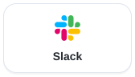
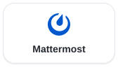

<!-- source_sha: 846acb8e8674 -->

<div align="center">

<h1> AgenticOS</h1>

<p>
  <strong>Sovereign Agentic AI Layer</strong><br>
  <b>KI-Agenten, die dein ganzes Team nutzen und verbessern kann.</b><br>
  Open Source. Erstelle gemeinsame Agenten im Browser, auf Infrastruktur, die du kontrollierst.
</p>

<p>
  <a href="#schnellstart">Schnellstart</a> &middot;
  <a href="#erstellen-teilen-und-betreiben">Erstellen, teilen und betreiben</a> &middot;
  <a href="#passt-agenticos-zu-deinem-team">Passt es zu uns?</a> &middot;
  <a href="docs/index.de.md">Dokumentation</a>
</p>

<p>
  <a href="https://github.com/vstorm-co/agenticos/actions/workflows/ci.yml"></a>
  <a href="https://github.com/vstorm-co/agenticos/releases"></a>
  <a href="LICENSE"></a>
  <a href="https://ai.pydantic.dev"></a>
</p>

<p>
  <a href="README.md">English</a> &middot;
  <a href="README.pl.md">Polski</a> &middot;
  <b>Deutsch</b> &middot;
  <a href="README.es.md">Español</a>
</p>

</div>

AgenticOS ist eine selbst gehostete Arbeitsumgebung zum Erstellen und Betreiben gemeinsamer KI-Agenten. Gib einem Agenten eine Aufgabe, verbinde Unternehmensdokumente und Werkzeuge und veröffentliche ihn für dein Team. Entwickler erweitern seine Fähigkeiten; Fachexperten pflegen seine Anweisungen und sein Wissen.

## Gib deinem Team eine gemeinsame Arbeitsweise

Ein Assistent für Fragen zur Gerätebeschaffung braucht jemanden, der die Regeln kennt, jemanden, der den Agenten konfiguriert, und Kollegen, die ihn nutzen. AgenticOS verbindet ihre Arbeit:

1. **Ein Fachexperte pflegt die Methode:** Anweisungen, wiederverwendbare Abläufe und Quelldokumente schreiben.
2. **Ein Builder veröffentlicht den Agenten:** Modell und Werkzeuge auswählen, Limits setzen und Zugriff gewähren.
3. **Kollegen nutzen und prüfen ihn:** Fragen stellen, Quellen prüfen und Ergebnisse teilen. Betreiber sehen die Ausführungen in Activity ein.

Anweisungen und Wissen werden in der Konsole geändert. Neue Fähigkeiten werden in Python ergänzt. [Einen Agenten erstellen](docs/first-agent.de.md) · [Teamzugriff](docs/permissions.de.md).

## Schnellstart

Du brauchst nur Docker mit Compose. Unter macOS oder Linux führst du aus:

```bash
curl -fsSL https://raw.githubusercontent.com/vstorm-co/agenticos/main/scripts/quickstart.sh | bash
```

Unter Windows führst du denselben Befehl in WSL2 aus, mit eingeschalteter WSL2-Integration in Docker Desktop.
Der Installer fragt nach Modellanbieter und Schlüssel, deinem Login und dem Namen der Organisation, lädt die
veröffentlichten Images und startet eine Bereitstellung mit einem funktionierenden Agenten.

Öffne **http://localhost:3000** und melde dich mit dem bei der Installation gewählten Login an.

### Erstelle einen Assistenten auf Basis eines Dokuments

Beginne mit der [Anleitung zur Gerätebeschaffung](docs/howto/first-document-agent.de.md). Sie enthält ein kurzes fiktives Handbuch, Einrichtungsschritte und einen dokumentierten Test samt Einschränkungen. Für die Dokumentensuche brauchst du zusätzlich zum Chatmodell ein Embedding-Modell.

1. Speichere die beiden Zeilen unten als `equipment-handbook.md` und lade die Datei in eine Wissenssammlung. Konfiguriere die Embeddings und warte auf die Verarbeitung.
2. Erstelle einen Agenten, wähle sein Modell und aktiviere die Wissenssuche für diese Sammlung. Weise ihn an, das Handbuch zu zitieren und fehlende Antworten zu benennen. Veröffentliche den Agenten.
3. Stelle die folgenden Fragen in neuen Gesprächen und prüfe anschließend die gefundenen Inhalte und die Ausführung in **Activity**.

```text
Equipment requests go to the office manager.
Include the item, reason and delivery location.
```

| Frage | Mit der Quelle abgleichen |
|---|---|
| Wer bearbeitet Geräteanfragen? | Der Office Manager, mit einem Verweis auf das Handbuch |
| Welche Angaben muss eine Geräteanfrage enthalten? | Gegenstand, Begründung und Lieferort |
| Wie viel darf ich ausgeben? | Das Dokument nennt kein Ausgabenlimit |

Ersetze das Dokument dann nach der Anleitung durch eine aktualisierte Richtlinie und teste ein neues Gespräch. Wenn die Antworten stimmen, gib einem Kollegen Zugriff auf den Agenten und die erforderlichen Ressourcen und lass ihn den Agenten mit seinem eigenen Konto testen. [Konfiguriere den Zugriff](docs/permissions.de.md), bevor du private Dokumente verwendest.

Die Anleitung dokumentiert einen Test auf **v0.0.504 vom 25. September 2026**, einschließlich eines erneuten Versuchs und der Antwort nach einer Dokumentänderung. Nutze ihn als nachvollziehbares Beispiel; prüfe die Antworten deines eigenen Modells anhand der Quelle.

<details>
<summary>Nur die Installation prüfen? Probiere eine Aufgabe ohne Dokumenteinrichtung</summary>

Wähle unter **Chat** den Agenten **Getting Started** und füge dieses fiktive Briefing ein. Es braucht keine
Verbindung zu Notion oder GitHub.

```text
Antworte auf Deutsch. Erstelle aus diesem Briefing eine Checkliste für den Start. Nutze nur die genannten Fakten.
Nenne für jede Aufgabe die verantwortliche Person, die Frist und fehlende Informationen.
Erfinde keine Termine oder Zuständigkeiten.

Briefing:
- Das Kundenwebinar findet am 15. Oktober statt.
- Maya betreut die Landingpage; sie muss bis zum 8. Oktober fertig sein.
- Leo betreut die Demo, aber der Termin für ihre Prüfung steht noch nicht fest.
- Die Einladungen müssen bis zum 10. Oktober verschickt werden; niemand ist dafür eingeteilt.
```

**Prüfe das Ergebnis:** Bei der Landingpage sollten Maya und der 8. Oktober stehen; bei der Demo
sollte der fehlende Prüftermin auffallen, bei den Einladungen die fehlende Zuständigkeit. Öffne dann **Activity**:
Die Ausführung ist schon da, mit Modell, Tokens, Dauer und Kosten. Probiere danach
dein eigenes Briefing aus oder
[konfiguriere einen Agenten mit Werkzeugen und Unternehmenswissen](docs/first-agent.de.md).

</details>

<details>
<summary>Installer prüfen oder eine andere Bereitstellung wählen</summary>

Lies den [Installer](scripts/quickstart.sh) vor dem Ausführen. So prüfst du die Voraussetzungen ohne Installation:

```bash
curl -fsSL https://raw.githubusercontent.com/vstorm-co/agenticos/main/scripts/quickstart.sh | bash -s -- --check
```

Manuelle Einrichtung mit Docker Compose, Versionsauswahl und Fehlerbehebung beschreibt die [Installationsanleitung](docs/install.de.md).
Für die Entwicklung am Quellcode siehe [Mitwirken](CONTRIBUTING.de.md).

</details>

## Aufgezeichnetes Integrationsbeispiel

Diese Demo zeigt, wie aus einem Notion-Briefing nach einer GitHub-Recherche eine interaktive Seite mit Quellen wird. Als Beispielmaterial dienen Vstorms eigene Open-Source-Projekte: Der relevante Ablauf ist **Briefing → Recherche → gemeinsames Ergebnis**. Dies ist eine Produktdemonstration, keine Untersuchung eines Kundeneinsatzes.

<video src="https://github.com/user-attachments/assets/1d6bba29-3bfe-4c86-bda3-52ce2b0aa512" controls playsinline width="100%" poster="docs/assets/screens/oss-launch-planner-poster.webp">
  
</video>

<details>
<summary>Video wird nicht geladen? Animierte Vorschau öffnen</summary>

<a href="https://github.com/user-attachments/assets/1d6bba29-3bfe-4c86-bda3-52ce2b0aa512">
  
</a>

*Animierte Vorschau in doppelter Geschwindigkeit. Klicke, um das 37-sekündige Video mit Ton in normaler Geschwindigkeit anzusehen.*

</details>

[Das gekürzte Video ansehen (37 Sekunden)](https://github.com/user-attachments/assets/1d6bba29-3bfe-4c86-bda3-52ce2b0aa512) · [Screenshot ansehen](docs/assets/screens/oss-launch-planner-poster.webp)

## Erstellen, teilen und betreiben

### Die Arbeitsweise einmal konfigurieren

Wähle Modell, Anweisungen und Werkzeuge im Browser. Veröffentliche eine Version für Kollegen; frühere Versionen bleiben zum Prüfen und Wiederherstellen verfügbar.

[Wissensdatenbanken](docs/file-processing.de.md) liefern durchsuchbare Dokumente. [Skills](docs/skills.de.md) enthalten wiederverwendbare Abläufe; [Kontext](docs/context.de.md) hält gemeinsame Fakten und Richtlinien fest. Aktualisiere diese Ressourcen, wenn sich die Arbeit ändert.

<a href="docs/assets/screens/light/agent-builder.webp">
  
</a>

Verbinde Werkzeuge wie **GitHub, Notion, HubSpot oder Linear** über [MCP](docs/mcp.de.md). Der Katalog verbindet kuratierte Verbindungen mit **über 5.700 MCP-Servereinträgen** aus einer gespiegelten Registry. Registry-Einträge sind Metadaten der Herausgeber, keine getesteten Integrationen. Jede Verbindung braucht eine eigene Einrichtung und Zugriffsprüfung.

### Agenten und Ergebnisse zugänglich machen

Kollegen können einen veröffentlichten Agenten im Webchat oder über konfigurierte **Slack-, Mattermost- und Telegram-Kanäle** nutzen. Entwickler können ihn über die API aufrufen. [Einen Kanal verbinden](docs/channels.de.md).

<p align="center">
  <a href="docs/channels.de.md"></a>
  <a href="docs/channels.de.md"></a>
  <a href="docs/channels.de.md"></a>
</p>

Agenten können Berichte, interaktive Vergleiche und kleine Dashboards als **Artefakte** veröffentlichen. Lege fest, wer sie öffnen darf; bei Aktualisierungen desselben Artefakts bleibt der Link erhalten, und frühere Versionen bleiben lesbar. [Ein Artefakt teilen](docs/artifacts.de.md).

<a href="docs/assets/screens/light/artifacts.webp">
  
</a>

### Ausführungen prüfen und nützliche Arbeit wiederholen

**Activity** vereint Ausführungsverlauf, Freigaben und erfasste Ausgaben. Prüfe Werkzeugaufrufe, vergleiche Agentenversionen und exportiere Datensätze. Manche Kosten hängen von Nutzungs- und Preisdaten des Anbieters ab; externe Dienste können separat abrechnen. [Grenzen der Kostenerfassung](docs/governance.de.md).

<a href="docs/assets/screens/light/activity.webp">
  
</a>

Konfiguriere Freigabeanforderungen für unterstützte Capability-Werkzeuge. Im Webchat erfasst **Ask about everything** auch MCP-Werkzeugaufrufe, die der Runner ausführt. Der Umfang der Freigaben hängt vom Werkzeug und Ausführungsmodus ab; das Aktivieren einer Verbindung allein verlangt keine Freigabe. [Freigabemodi und Grenzen](docs/governance.de.md#how-much-one-conversation-wants-to-be-asked).

Wenn sich eine Aufgabe bewährt hat, führe den Agenten mit [Routinen](docs/triggers.de.md) nach Zeitplan oder Ereignis aus. Teste Werkzeuge, Limits und Freigaberegeln, bevor du ihn unbeaufsichtigt arbeiten lässt.

## Passt AgenticOS zu deinem Team?

Wähle es, wenn dein Team wiederkehrende dokumenten- oder werkzeugbasierte Aufgaben hat, Fachexperten die Anweisungen pflegen können und jemand für den selbst gehosteten Betrieb verantwortlich ist.

| Dein Ausgangspunkt | Was du prüfen solltest |
|---|---|
| Kollegen sollen gemeinsame Agenten nutzen und pflegen | Probiere Builder, Wissen und Veröffentlichung in AgenticOS aus. Wenn eine gemeinsame Chatoberfläche ausreicht, prüfe auch [Open WebUI](https://github.com/open-webui/open-webui). |
| Du entwirfst hauptsächlich Workflows oder KI-Anwendungen | Vergleiche den Erstellungsprozess mit [Dify](docs/about/dify.de.md) und [n8n](docs/about/n8n.de.md) anhand einer echten Aufgabe. |
| Du baust Agenten als Teil eines Softwareprodukts | Beginne mit einem SDK oder einer Laufzeitumgebung wie [Pydantic AI](https://ai.pydantic.dev) oder [Agno](https://github.com/agno-agi/agno); entscheide, ob du zusätzlich die Teamkonsole von AgenticOS brauchst. |

Selbsthosting bedeutet Verantwortung für Updates, Backups, Zugangsdaten und Anbieterrechnungen. Wenn niemand diese Aufgaben übernimmt, kläre Betrieb und Support vor einem Pilotprojekt. [Einführungsleitfaden](docs/rollout.de.md) · [Detaillierte Vergleiche und Lücken](docs/about/comparison.de.md).

## Betrieb, Modelle und Zugriff selbst kontrollieren

**Sovereign bedeutet Kontrolle über Bereitstellung, Modellanbieter, Datenflüsse und Agentenzugriff.** AgenticOS ist Apache-2.0-Software, die du prüfen, ändern und betreiben kannst. Wähle gehostete Anbieter oder lokale Modelle über Ollama und kompatible Endpunkte wie vLLM. [Modelle konfigurieren](docs/models.de.md).

Eine selbst gehostete Konsole macht nicht jedes Modell, jeden Parser und jedes Werkzeug lokal. Prüfe die konfigurierten Dienste und welche Daten sie erhalten. Weise Ressourcenberechtigungen zu, speichere Zugangsdaten im verschlüsselten Vault und teste die Freigaberegeln für die aktivierten Werkzeuge.

[Sicherheit und Datenflüsse](docs/security.de.md) · [Zugriffskontrolle](docs/permissions.de.md) · [Secrets](docs/secrets.de.md) · [Ausführungs- und Kostenkontrolle](docs/governance.de.md).

## Für Entwickler und Betreiber

Gebaut mit FastAPI, Pydantic AI, PostgreSQL mit pgvector, Redis, Prefect und Next.js. Entwickler ergänzen Capabilities in typisiertem Python; Teams stellen in der Konsole Agenten aus den registrierten Capabilities zusammen.

[Architektur](docs/architecture.de.md) · [Capabilities](docs/reference/capabilities.de.md) · [API](docs/api.de.md) · [Mitwirken](CONTRIBUTING.de.md) · [Roadmap](docs/ROADMAP.md).

Die [Betriebssystem-Analogie](docs/about/index.de.md) erläutert die Architektur. Die optionale [Desktop-App](docs/desktop.de.md) ergänzt ein eigenes Fenster, ein Maskottchen und einen macOS-Kurzbefehl für Screenshots. Unter [Vstorms Open-Source-Projekten](https://github.com/vstorm-co) findest du Bibliotheken und Werkzeuge rund um AgenticOS.

## Lizenz

[Apache License 2.0](LICENSE). Siehe [NOTICE](NOTICE) und die [Hinweise zu Drittkomponenten](THIRD_PARTY_NOTICES.md)
für Namensnennungen und enthaltene Komponenten.

## Brauchst du Hilfe beim produktiven Einsatz von Agenten?

Vstorm stellt AgenticOS in der Infrastruktur von Kunden bereit, schreibt die Dokumentation, definiert die Prozesse
und baut eigene Capabilities. Wartung und Support werden pro Auftrag vereinbart.

Mit Sorgfalt gebaut von [**Vstorm**](https://vstorm.co) · [Vstorm on GitHub](https://github.com/vstorm-co)
