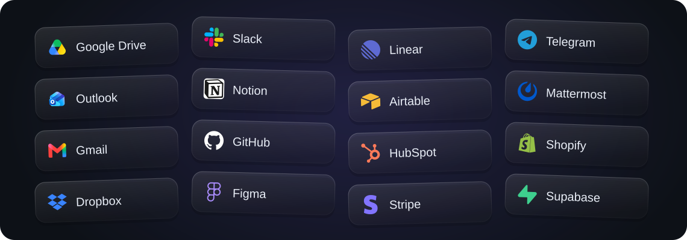

<!-- source_sha: 1cdad3786611 -->

<div align="center">

<h1> AgenticOS</h1>

<p>
  <strong>Sovereign Agentic AI Layer</strong><br>
  <b>Agentes de IA que todo tu equipo puede usar y mejorar.</b><br>
  Código abierto. Crea agentes compartidos en el navegador, en infraestructura que tú controlas.
</p>

<p>
  <a href="#inicio-rápido">Inicio rápido</a> &middot;
  <a href="#crea-comparte-y-opera">Crea, comparte y opera</a> &middot;
  <a href="#encaja-agenticos-con-tu-equipo">¿Encaja con nosotros?</a> &middot;
  <a href="docs/index.es.md">Documentación</a>
</p>

<p>
  <a href="https://github.com/vstorm-co/agenticos/actions/workflows/ci.yml"></a>
  <a href="https://github.com/vstorm-co/agenticos/releases"></a>
  <a href="LICENSE"></a>
  <a href="https://ai.pydantic.dev"></a>
</p>

<p>
  <a href="README.md">English</a> &middot;
  <a href="README.pl.md">Polski</a> &middot;
  <a href="README.de.md">Deutsch</a> &middot;
  <b>Español</b>
</p>

</div>

AgenticOS es un espacio de trabajo autoalojado para crear y ejecutar agentes de IA compartidos. Asigna una tarea a un agente, conecta documentos y herramientas de la empresa y publícalo para tu equipo. Los ingenieros amplían sus capacidades; los expertos del área mantienen sus instrucciones y conocimientos.

<a href="docs/assets/screens/light/agent-builder.webp">
  
</a>

## Qué puedes hacer

- **Crear en el navegador:** configura el modelo, las instrucciones, el conocimiento y las herramientas del agente, y publica una versión.
- **Trabajar en equipo:** los expertos mantienen las instrucciones y los documentos; los compañeros acceden al agente publicado.
- **Compartir resultados:** publica informes, comparaciones y paneles como artefactos con acceso controlado.
- **Inspeccionar y repetir ejecuciones:** revisa llamadas a herramientas y costes registrados en Activity; ejecuta agentes por horario o por eventos.
- **Elegir tu infraestructura:** aloja la plataforma tú mismo, conecta modelos externos o locales y amplía sus capacidades en Python.

## Inicio rápido

Solo necesitas Docker con Compose. En macOS o Linux, ejecuta:

```bash
curl -fsSL https://raw.githubusercontent.com/vstorm-co/agenticos/main/scripts/quickstart.sh | bash
```

En Windows, ejecuta el mismo comando dentro de WSL2 con la integración de WSL2 de Docker Desktop activada.
El instalador pregunta por el proveedor de modelos y su clave, tu usuario y el nombre de la organización, descarga
las imágenes publicadas y arranca un despliegue con un agente que ya funciona.

Abre **http://localhost:3000** e inicia sesión con el usuario que elegiste durante la instalación.

**Tu primer agente:** sigue la [guía del asistente de documentos](docs/howto/first-document-agent.es.md) para subir un manual, hacer preguntas, contrastar las respuestas con las fuentes citadas y probar un documento actualizado. La búsqueda de documentos requiere un modelo de embeddings. Para otras tareas, consulta [Crear un agente](docs/first-agent.es.md).

<details>
<summary>Revisa el instalador o elige otro método de despliegue</summary>

Lee el [instalador](scripts/quickstart.sh) antes de ejecutarlo. Para comprobar los requisitos sin instalar:

```bash
curl -fsSL https://raw.githubusercontent.com/vstorm-co/agenticos/main/scripts/quickstart.sh | bash -s -- --check
```

La [guía de instalación](docs/install.es.md) explica la configuración manual con Docker Compose, las versiones fijas y la resolución de problemas.
Para desarrollar a partir del código fuente, consulta [Contribuir](CONTRIBUTING.es.md).

</details>

## Crea, comparte y opera

### Configura la forma de trabajar

Elige el modelo, las instrucciones y las herramientas en el navegador. Publica una versión para tus compañeros; las versiones anteriores siguen disponibles para revisarlas y restaurarlas.

Las [bases de conocimiento](docs/file-processing.es.md) proporcionan documentos para buscar. Los [skills](docs/skills.es.md) contienen procedimientos reutilizables; el [contexto](docs/context.es.md) guarda hechos y directrices compartidos. Actualiza estos recursos a medida que cambia el trabajo.

Conecta herramientas como **GitHub, Notion, HubSpot o Linear** mediante [MCP](docs/mcp.es.md). El catálogo combina conexiones seleccionadas con **más de 5700 entradas de servidores MCP** copiadas de un registro. Las entradas del registro son metadatos de sus editores, no integraciones probadas. Cada conexión requiere su propia configuración y revisión de acceso.

### Da acceso al agente y a sus resultados

Los compañeros pueden usar un agente publicado en el chat web o mediante canales configurados de **Slack, Mattermost y Telegram**. Los desarrolladores pueden invocarlo a través de la API. [Conecta un canal](docs/channels.es.md).

Los agentes pueden publicar informes, comparaciones interactivas y pequeños paneles como **artefactos**. Elige quién puede abrirlos; las actualizaciones del mismo artefacto conservan su enlace y las versiones anteriores siguen siendo legibles. [Comparte un artefacto](docs/artifacts.es.md).

<a href="docs/assets/screens/light/artifacts.webp">
  
</a>

### Inspecciona ejecuciones y repite el trabajo útil

**Activity** reúne el historial de ejecuciones, las aprobaciones y el gasto registrado. Inspecciona llamadas a herramientas, compara versiones de agentes y exporta registros. Algunos costes dependen de los datos de uso y precios del proveedor; los servicios externos pueden facturar por separado. [Límites del registro de costes](docs/governance.es.md).

<a href="docs/assets/screens/light/activity.webp">
  
</a>

Configura los requisitos de aprobación para las herramientas de capabilities compatibles. En el chat web, **Ask about everything** también controla las llamadas a herramientas MCP que ejecuta el runner. La cobertura de aprobación depende de la herramienta y del modo de ejecución; activar una conexión por sí solo no exige aprobación. [Modos y límites de aprobación](docs/governance.es.md#how-much-one-conversation-wants-to-be-asked).

Cuando una tarea esté lista para repetirse, usa [rutinas](docs/triggers.es.md) para ejecutar un agente por horario o evento. Prueba sus herramientas, límites y política de aprobación antes de dejarlo sin supervisión.

## Ejemplo de integración grabado

Esta demo muestra cómo un brief de Notion se convierte en una página interactiva con fuentes después de investigar en GitHub. Utiliza proyectos de código abierto de Vstorm como material de ejemplo: la secuencia útil es **brief → investigación → resultado compartido**. Es una demostración del producto, no un estudio de resultados de un cliente.

<video src="https://github.com/user-attachments/assets/1d6bba29-3bfe-4c86-bda3-52ce2b0aa512" controls playsinline width="100%" poster="docs/assets/screens/oss-launch-planner-poster.webp">
  
</video>

[Ver el vídeo abreviado (37 segundos)](https://github.com/user-attachments/assets/1d6bba29-3bfe-4c86-bda3-52ce2b0aa512) · [Ver una captura](docs/assets/screens/oss-launch-planner-poster.webp)

## Conecta las aplicaciones que tu equipo ya usa



[Sincronización de Google Drive™](docs/howto/configure-sync-sources.es.md) · [Eventos de Gmail](docs/triggers.es.md) · [Herramientas MCP: Notion, GitHub, Linear y más](docs/mcp.es.md) · [Canales de chat: Slack, Mattermost, Telegram](docs/channels.es.md).

[El correo y calendario de Outlook](docs/mcp.es.md#outlook-setup) se conectan mediante un servicio MCP externo con su propia cuenta y permisos.

Algunas conexiones utilizan servicios MCP externos y requieren configuración, cuentas y permisos independientes.

<sub>Google Drive es una marca de Google LLC. Los nombres y logotipos indican opciones de conexión, no asociaciones comerciales. [Fuentes de los logotipos](docs/assets/integrations/ATTRIBUTION.txt).</sub>

## ¿Encaja AgenticOS con tu equipo?

Elígelo si el equipo tiene tareas recurrentes con documentos o herramientas, expertos que mantengan las instrucciones y una persona responsable de operar el despliegue en infraestructura propia.

Evalúalo con una de tus tareas. [Compara enfoques](docs/about/comparison.es.md) · [Planifica el despliegue](docs/rollout.es.md).

## Controla tu despliegue, modelos y acceso

**Sovereign significa controlar el despliegue, los proveedores de modelos, los flujos de datos y el acceso a los agentes.** AgenticOS es software Apache-2.0 que puedes inspeccionar, modificar y operar. Elige proveedores alojados o modelos locales mediante Ollama y endpoints compatibles como vLLM. [Configura los modelos](docs/models.es.md).

Autoalojar la consola no hace que todos los modelos, parsers o herramientas sean locales. Revisa los servicios configurados y los datos que reciben. Asigna permisos sobre recursos, guarda credenciales en la bóveda cifrada y prueba la política de aprobación de las herramientas que actives.

[Seguridad y flujos de datos](docs/security.es.md) · [Control de acceso](docs/permissions.es.md) · [Secretos](docs/secrets.es.md) · [Control de ejecución y costes](docs/governance.es.md).

## Para desarrolladores y operadores

Creado con FastAPI, Pydantic AI, PostgreSQL con pgvector, Redis, Prefect y Next.js. Los ingenieros añaden capabilities en Python tipado; los equipos componen agentes con las capabilities registradas en la consola.

[Arquitectura](docs/architecture.es.md) · [Capabilities](docs/reference/capabilities.es.md) · [API](docs/api.es.md) · [Contribuir](CONTRIBUTING.es.md) · [Hoja de ruta](docs/ROADMAP.md).

La [analogía del sistema operativo](docs/about/index.es.md) explica la arquitectura. La [aplicación de escritorio](docs/desktop.es.md) opcional añade una ventana propia, una mascota y un atajo de captura de pantalla en macOS. Explora los [proyectos de código abierto de Vstorm](https://github.com/vstorm-co) para encontrar las bibliotecas y herramientas que rodean a AgenticOS.

## Licencia

[Apache License 2.0](LICENSE). Consulta [NOTICE](NOTICE) y los [avisos de terceros](THIRD_PARTY_NOTICES.md)
para las atribuciones y los componentes incluidos.

## ¿Necesitas ayuda para llevar agentes a producción?

Vstorm despliega AgenticOS en la infraestructura del cliente, escribe la documentación, define los procesos
y construye capacidades a medida. El mantenimiento y el soporte se acuerdan en cada proyecto.

Construido con esmero por [**Vstorm**](https://vstorm.co) · [Vstorm on GitHub](https://github.com/vstorm-co)
