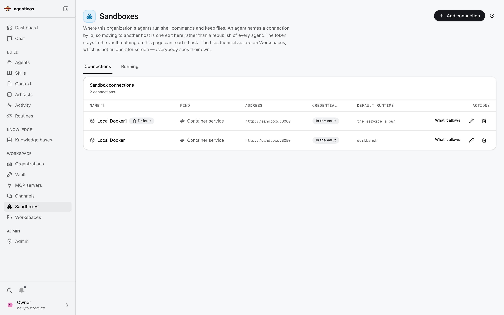
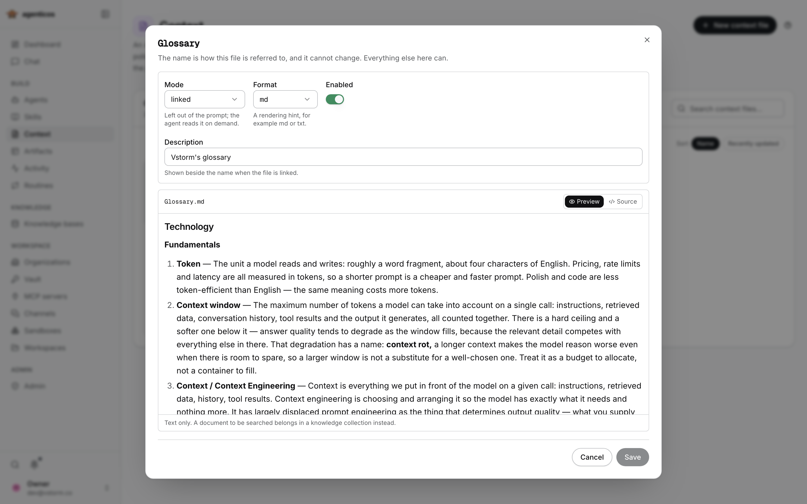
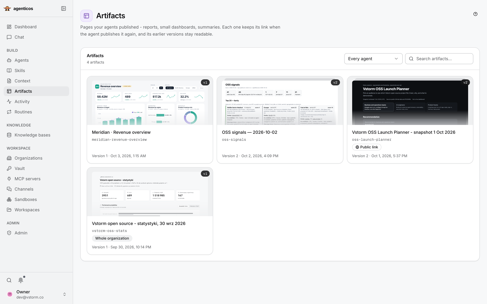
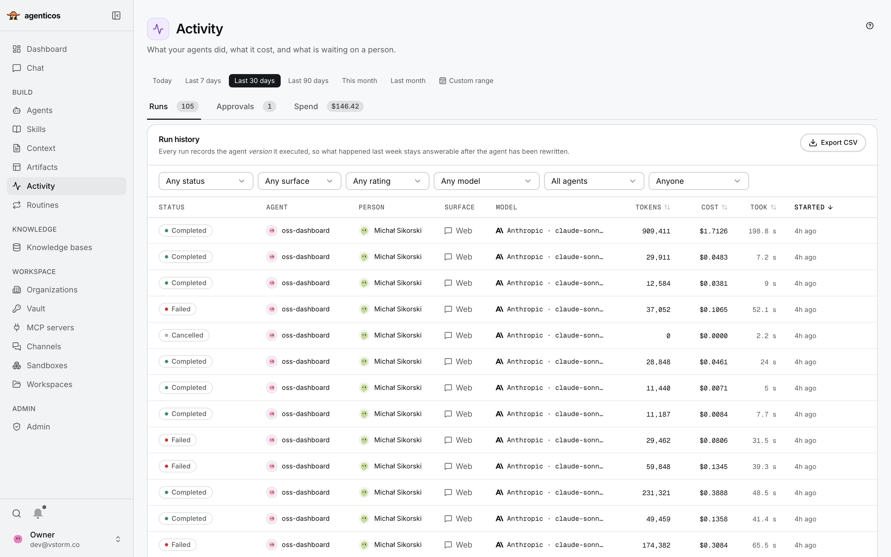
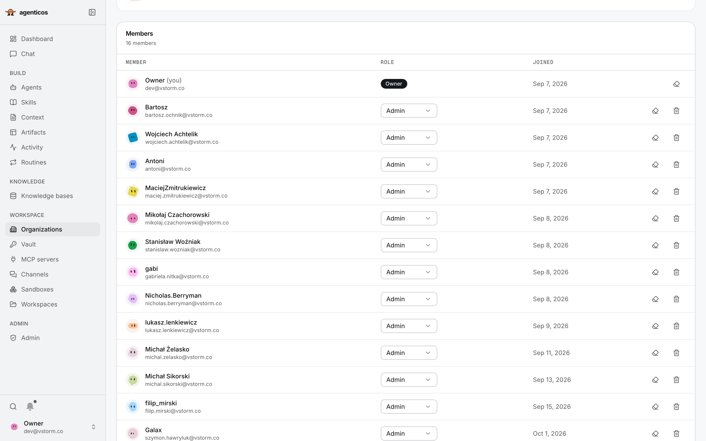
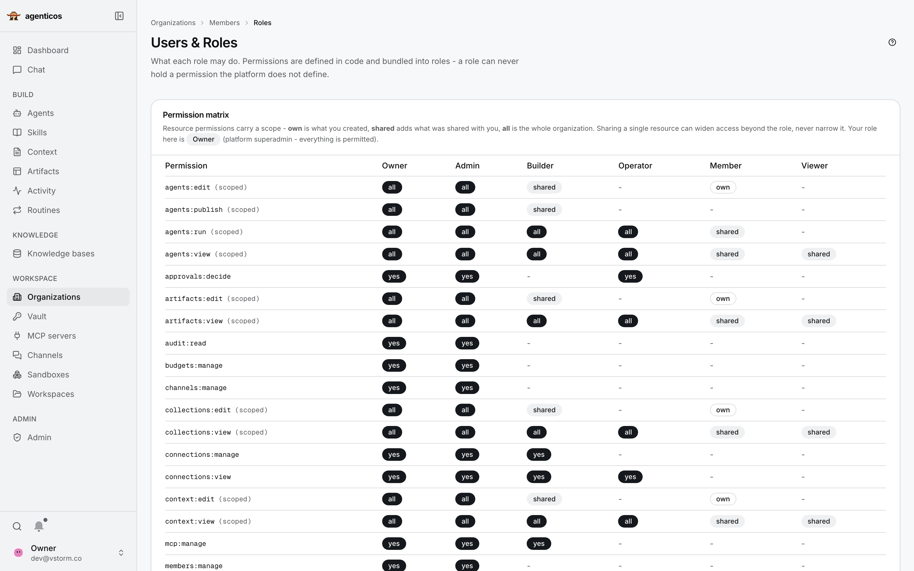

<!-- source_sha: 0e53063d169a -->

<div align="center">

<h1> AgenticOS</h1>

<p>
  <strong>Sovereign Agentic AI Layer</strong><br>
  <b>Agentes de IA que todo tu equipo puede usar y mejorar.</b><br>
  Código abierto. Crea agentes compartidos en el navegador, en infraestructura que tú controlas.
</p>

<p>
  <a href="#-inicio-rápido">Inicio rápido</a> &middot;
  <a href="#-crea-comparte-y-opera">Crea, comparte y opera</a> &middot;
  <a href="#-encaja-agenticos-con-tu-equipo">¿Encaja con nosotros?</a> &middot;
  <a href="https://vstorm-co.github.io/agenticos/es/">Documentación</a>
</p>

<p>
  <a href="https://github.com/vstorm-co/agenticos/actions/workflows/ci.yml"></a>
  <a href="https://github.com/vstorm-co/agenticos/releases"></a>
  <a href="LICENSE"></a>
  <a href="https://ai.pydantic.dev"></a>
</p>

<p>
  <a href="README.md">English</a> &middot;
  <a href="README.pl.md">Polski</a> &middot;
  <a href="README.de.md">Deutsch</a> &middot;
  <b>Español</b>
</p>

</div>

AgenticOS es un espacio de trabajo autoalojado donde los agentes de IA trabajan con archivos, ejecutan código y usan las herramientas y el conocimiento de tu empresa. Crea y publica agentes en el navegador, compártelos con tus compañeros y gestiona su acceso y sus resultados en un mismo lugar.

<a href="docs/assets/screens/light/agent-builder.png">
  
</a>

## ✨ Qué puedes hacer

| Para tu equipo | Qué ofrece AgenticOS |
|---|---|
| [Archivos y código](#-trabaja-con-archivos-y-código) | Analiza CSV, genera gráficos y documentos, trabaja en repositorios |
| [Agentes reutilizables](#-crea-agentes-que-tu-equipo-pueda-reutilizar) | Elige modelos y herramientas, publica versiones, comparte agentes con tus compañeros |
| [Conocimiento de la empresa](#-enseña-a-los-agentes-cómo-trabaja-tu-equipo) | Reutiliza skills, contexto y documentos consultables en distintos agentes |
| [Resultados compartidos](#-publica-resultados-como-páginas-interactivas) | Publica páginas interactivas con enlaces estables e historial de versiones |
| [Ejecución y supervisión](#-supervisa-ejecuciones-costes-y-aprobaciones) | Personaliza dashboards, revisa ejecuciones, programa tareas y fija presupuestos |
| [Acceso en la empresa](#-organiza-equipos-con-roles-y-grupos) | Combina roles, grupos de departamentos e inicio de sesión de empresa |

## 🚀 Inicio rápido

Necesitas Docker Compose y acceso a un proveedor de modelos. En macOS o Linux, ejecuta:

```bash
curl -fsSL https://raw.githubusercontent.com/vstorm-co/agenticos/main/scripts/quickstart.sh | bash
```

En Windows, ejecuta el mismo comando dentro de WSL2 con la integración de WSL2 de Docker Desktop activada.
El instalador pregunta por el proveedor de modelos y su clave, tu usuario y el nombre de la organización, descarga
las imágenes publicadas y arranca un despliegue con un agente que ya funciona.

Abre **http://localhost:3000** e inicia sesión con el usuario que elegiste durante la instalación.

**Tu primer agente:** sigue la [guía del asistente de documentos](https://vstorm-co.github.io/agenticos/es/howto/first-document-agent/) para subir un manual, hacer preguntas y comprobar las respuestas con las fuentes citadas. Después prueba un documento actualizado. La búsqueda en documentos requiere un modelo de embeddings. Para otras tareas, consulta [Crear un agente](https://vstorm-co.github.io/agenticos/es/first-agent/).

<details>
<summary>Revisa el instalador o elige otro método de despliegue</summary>

Lee el [instalador](scripts/quickstart.sh) antes de ejecutarlo. Para comprobar los requisitos sin instalar:

```bash
curl -fsSL https://raw.githubusercontent.com/vstorm-co/agenticos/main/scripts/quickstart.sh | bash -s -- --check
```

La [guía de instalación](https://vstorm-co.github.io/agenticos/es/install/) explica la configuración manual con Docker Compose, las versiones fijas y la resolución de problemas.
Para desarrollar a partir del código fuente, consulta [Contribuir](https://vstorm-co.github.io/agenticos/es/help/).

</details>

## 🎬 Ejemplo de integración grabado

Mira cómo un agente convierte un brief de Notion en el **OSS Launch Planner** interactivo, investigando los proyectos de código abierto de Vstorm en GitHub: **brief → investigación → resultado compartido**.

<video src="https://github.com/user-attachments/assets/1d6bba29-3bfe-4c86-bda3-52ce2b0aa512#t=1" controls playsinline width="100%" poster="docs/assets/screens/oss-launch-planner-poster.webp">
  
</video>

[Ver el vídeo abreviado (37 segundos)](https://github.com/user-attachments/assets/1d6bba29-3bfe-4c86-bda3-52ce2b0aa512) · [Ver una captura](docs/assets/screens/oss-launch-planner-poster.webp)

## 🧩 Crea, comparte y opera

### 📂 Trabaja con archivos y código

Pide a un agente que analice una hoja de cálculo, genere un gráfico, prepare un documento o trabaje en un repositorio. Con un sandbox basado en contenedores configurado y la ejecución de comandos habilitada, puede **leer y editar archivos, ejecutar comandos de shell y ejecutar código Python o JavaScript**. El entorno workbench incluido contiene herramientas para datos, gráficos y documentos, entre ellas LibreOffice.

<a href="docs/assets/screens/light/chat.png">
  
</a>

**CSV de ventas → gráfico de ingresos y conclusiones.** Abre las llamadas a herramientas para revisar los comandos detrás de una respuesta y usa el panel de archivos para acceder a las entradas y los resultados.

Si usas [Claude Code](https://code.claude.com/docs/en/overview) o [Codex](https://developers.openai.com/codex/cli/), el trabajo con archivos y comandos te resultará familiar. AgenticOS lleva esa forma de trabajar a un entorno compartido y autoalojado, con conocimiento de la empresa, agentes reutilizables y controles de acceso de la organización. Lo que un agente puede lograr depende de su modelo, herramientas habilitadas e instrucciones.

Ejecuta sandboxes en contenedores en tu propia infraestructura o configura un backend remoto compatible. Elige la duración del espacio de trabajo y los límites de ejecución según la tarea. [Configuración de sandboxes](https://vstorm-co.github.io/agenticos/es/sandbox/).

<details>
<summary>Ver las conexiones de sandboxes</summary>



</details>

### 🤖 Crea agentes que tu equipo pueda reutilizar

Elige su modelo, instrucciones y herramientas en el navegador. Publica una versión para tus compañeros; consulta versiones anteriores y restáuralas cuando sea necesario. Mantén agentes especializados en investigación, informes, programación u operaciones en un mismo catálogo.

<details>
<summary>Ver el catálogo de agentes</summary>


</details>

Tus compañeros pueden usar un agente publicado en **chat web, Slack, Mattermost o Telegram** cuando esos canales estén configurados. Los desarrolladores pueden llamarlo mediante la API. [Crear un agente](https://vstorm-co.github.io/agenticos/es/first-agent/) · [Conectar un canal](https://vstorm-co.github.io/agenticos/es/channels/).

### 🧠 Enseña a los agentes cómo trabaja tu equipo

- **Skills** contienen procedimientos reutilizables: cómo revisar código, escribir un informe o investigar un mercado. Mantenlos una vez y reutilízalos en distintos agentes.
- **Contexto** contiene conocimiento permanente, como un glosario, una política o la voz de la marca. Inclúyelo en el prompt o permite que el agente lo lea cuando lo necesite.
- **Bases de conocimiento (RAG)** permiten buscar en documentos subidos. Revisa el estado del procesamiento y los fragmentos, elige opciones de análisis o configura fuentes de sincronización como Google Drive y S3.

<a href="docs/assets/screens/light/skills.png">
  
</a>

[Skills](https://vstorm-co.github.io/agenticos/es/skills/) · [Contexto](https://vstorm-co.github.io/agenticos/es/context/) · [Procesamiento de documentos](https://vstorm-co.github.io/agenticos/es/file-processing/) · [Fuentes de sincronización](https://vstorm-co.github.io/agenticos/es/howto/configure-sync-sources/).

<details>
<summary>Ver el glosario abierto y una colección de conocimiento</summary>




</details>

### 🎨 Publica resultados como páginas interactivas

Los agentes pueden publicar informes, comparaciones interactivas y pequeños paneles como **artefactos**. Elige quién puede abrirlos; las actualizaciones conservan el mismo enlace y las versiones anteriores siguen disponibles. El ejemplo siguiente es **Meridian**, un dashboard de ventas creado por un agente, con filtros funcionales de período y región y datos de demostración claramente identificados.

<a href="docs/assets/screens/light/artifact-detail.png">
  
</a>

[Compartir un artefacto](https://vstorm-co.github.io/agenticos/es/artifacts/).

<details>
<summary>Ver la biblioteca de artefactos</summary>



</details>

### 📊 Supervisa ejecuciones, costes y aprobaciones

Personaliza el **dashboard** según tu trabajo: organiza y redimensiona widgets, asigna colores a las secciones y guarda diseños. Supervisa uso, resultados, gasto registrado, aprobaciones y capacidad de los sandboxes. Los permisos determinan qué datos puede ver cada persona.

<a href="docs/assets/screens/light/dashboard.png">
  
</a>

**Activity** permite revisar ejecuciones y llamadas a herramientas, comparar versiones de agentes y exportar registros. Configura políticas de aprobación para las herramientas compatibles y usa **rutinas** para repetir tareas por horario o eventos. Algunos costes dependen de los datos de uso y precios del proveedor; los servicios externos pueden facturar por separado.

[Historial de ejecuciones, presupuestos y aprobaciones](https://vstorm-co.github.io/agenticos/es/governance/) · [Rutinas](https://vstorm-co.github.io/agenticos/es/triggers/).

<details>
<summary>Ver Activity y los controles de aprobación</summary>



La cobertura de aprobaciones depende de la herramienta y del modo de ejecución. En el chat web, **Ask about everything** también controla las llamadas a herramientas MCP gestionadas por el runner. [Modos y límites de aprobación](https://vstorm-co.github.io/agenticos/es/governance/#how-much-one-conversation-wants-to-be-asked).

</details>

### 👥 Organiza equipos con roles y grupos

**Los roles definen qué pueden hacer las personas. Los grupos definen con quién compartes.** Usa roles como Builder, Operator, Member y Viewer y crea departamentos o grupos de trabajo como **Operations, Engineering, Finance y Research**. Comparte un agente, skill, colección, archivo de contexto o artefacto con un grupo en un solo paso. Los permisos de grupo amplían el acceso que una persona recibe por su rol y por asignaciones individuales.

<a href="docs/assets/screens/light/groups.png">
  
</a>

Usa las cuentas existentes de la empresa mediante **inicio de sesión único con OIDC, acceso al directorio con LDAP o inicio de sesión integrado de Windows con Kerberos**, con la configuración de despliegue adecuada. Las **asignaciones de Directory** vinculan grupos de un directorio externo con un rol de organización y, opcionalmente, un grupo de AgenticOS; la pertenencia se concilia al iniciar sesión.

[Roles y permisos de recursos](https://vstorm-co.github.io/agenticos/es/permissions/) · [Grupos, LDAP, Kerberos y asignaciones de directorio](https://vstorm-co.github.io/agenticos/es/directory/).

<details>
<summary>Ver los miembros de la organización y la matriz de roles</summary>





</details>

## 🔌 Conecta las aplicaciones que tu equipo ya usa


Conecta herramientas mediante **MCP**, junto con fuentes de sincronización y canales de chat integrados. El catálogo incluye conexiones seleccionadas y **más de 5700 entradas de servidores MCP** replicadas de un registro. Las entradas son metadatos proporcionados por sus publicadores; cada conexión requiere su propia configuración y revisión de acceso.

[Sincronización de Google Drive™](https://vstorm-co.github.io/agenticos/es/howto/configure-sync-sources/) · [Eventos de Gmail](https://vstorm-co.github.io/agenticos/es/triggers/) · [Herramientas MCP: Notion, GitHub, Linear y más](https://vstorm-co.github.io/agenticos/es/mcp/) · [Canales de chat: Slack, Mattermost, Telegram](https://vstorm-co.github.io/agenticos/es/channels/).

[El correo y calendario de Outlook](https://vstorm-co.github.io/agenticos/es/mcp/) se conectan mediante un servicio MCP externo con su propia cuenta y permisos.

## 🎯 ¿Encaja AgenticOS con tu equipo?

Elígelo si el equipo tiene tareas recurrentes con documentos o herramientas, expertos que mantengan las instrucciones y una persona responsable de operar el despliegue en infraestructura propia.

Evalúalo con una de tus tareas. [Compara enfoques](https://vstorm-co.github.io/agenticos/es/about/comparison/) · [Planifica el despliegue](https://vstorm-co.github.io/agenticos/es/rollout/).

## 🔐 Controla tu despliegue, modelos y acceso

**Sovereign significa controlar el despliegue, los proveedores de modelos, los flujos de datos y el acceso a los agentes.** AgenticOS es software Apache-2.0 que puedes inspeccionar, modificar y operar. Elige proveedores alojados o modelos locales mediante Ollama y endpoints compatibles como vLLM. [Configura los modelos](https://vstorm-co.github.io/agenticos/es/models/).

Autoalojar la consola no hace que todos los modelos, parsers o herramientas sean locales. Revisa los servicios configurados y los datos que reciben. Asigna permisos sobre recursos, guarda credenciales en la bóveda cifrada y prueba la política de aprobación de las herramientas que actives.

[Seguridad y flujos de datos](https://vstorm-co.github.io/agenticos/es/security/) · [Control de acceso](https://vstorm-co.github.io/agenticos/es/permissions/) · [Secretos](https://vstorm-co.github.io/agenticos/es/secrets/) · [Control de ejecución y costes](https://vstorm-co.github.io/agenticos/es/governance/).

## 🛠️ Para desarrolladores y operadores

Creado con FastAPI, Pydantic AI, PostgreSQL con pgvector, Redis, Prefect y Next.js. Los ingenieros añaden capabilities en Python tipado; los equipos componen agentes con las capabilities registradas en la consola.

[Arquitectura](https://vstorm-co.github.io/agenticos/es/architecture/) · [Capabilities](https://vstorm-co.github.io/agenticos/es/reference/capabilities/) · [API](https://vstorm-co.github.io/agenticos/es/api/) · [Contribuir](https://vstorm-co.github.io/agenticos/es/help/).

La [analogía del sistema operativo](https://vstorm-co.github.io/agenticos/es/about/) explica la arquitectura. La [aplicación de escritorio](https://vstorm-co.github.io/agenticos/es/desktop/) opcional añade una ventana propia, una mascota y un atajo de captura de pantalla en macOS. Explora los [proyectos de código abierto de Vstorm](https://github.com/vstorm-co) para encontrar las bibliotecas y herramientas que rodean a AgenticOS.

## 📄 Licencia

[Apache License 2.0](LICENSE). Consulta [NOTICE](NOTICE) y los [avisos de terceros](THIRD_PARTY_NOTICES.md)
para las atribuciones y los componentes incluidos.

## 🤝 ¿Necesitas ayuda para llevar agentes a producción?

Vstorm despliega AgenticOS en la infraestructura del cliente, escribe la documentación, define los procesos
y construye capacidades a medida. El mantenimiento y el soporte se acuerdan en cada proyecto.

Construido con esmero por [**Vstorm**](https://vstorm.co) · [Vstorm on GitHub](https://github.com/vstorm-co)
