<!-- source_sha: 231a09ce4f91 -->

<div align="center">

<h1>AgenticOS</h1>

<h3>Sovereign Agentic AI Layer</h3>

<p>
  <b>Agentes de IA que todo tu equipo puede usar y mejorar.</b><br>
  Autoalojado en infraestructura que tú controlas, con budgets, aprobaciones y un run registrado.<br>
  <sub>Apache-2.0 &middot; construido sobre Pydantic AI</sub>
</p>

<p>
  <a href="#-míralo-en-acción">Míralo</a> &middot;
  <a href="#-qué-es-agenticos">¿Qué es?</a> &middot;
  <a href="#-inicio-rápido">Inicio rápido</a> &middot;
  <a href="#-conecta-las-aplicaciones-que-tu-equipo-ya-usa">Integraciones</a> &middot;
  <a href="#-crea-comparte-y-opera">Recorrido por el producto</a> &middot;
  <a href="#-encuentra-tu-camino">Encuentra tu camino</a> &middot;
  <a href="#-qué-incluye-hoy">Qué incluye</a> &middot;
  <a href="#-preguntas-frecuentes">Preguntas frecuentes</a> &middot;
  <a href="https://vstorm-co.github.io/agenticos/presentation/">Presentación introductoria</a> &middot;
  <a href="https://vstorm-co.github.io/agenticos/es/">Documentación</a>
</p>

<p>
  <a href="https://github.com/vstorm-co/agenticos/actions/workflows/ci.yml"></a>
  <a href="https://github.com/vstorm-co/agenticos/releases"></a>
  <a href="LICENSE"></a>
  <a href="https://ai.pydantic.dev"></a>
</p>

<p>
  <a href="README.md">English</a> &middot;
  <a href="README.pl.md">Polski</a> &middot;
  <a href="README.de.md">Deutsch</a> &middot;
  <b>Español</b>
</p>

</div>

AgenticOS es un espacio de trabajo autoalojado donde los agentes de IA trabajan con archivos, ejecutan código y usan las herramientas y el conocimiento de tu empresa. Crea y publica agentes en el navegador, compártelos con tus compañeros y gestiona su acceso, su coste y sus resultados en un mismo lugar.

**¿Primera vez aquí?** Recorre la [introducción en 14 diapositivas](https://vstorm-co.github.io/agenticos/presentation/) (en inglés): el problema, la idea, el producto en pantallas reales, sus controles y sus límites, y cómo empezar. Para ver cada pantalla en detalle, abre el [recorrido del producto en 44 diapositivas](https://vstorm-co.github.io/agenticos/presentation/tour/). Las flechas avanzan paso a paso en ambas; `O` muestra todas las diapositivas.

## 📸 Míralo en acción

<video src="https://github.com/user-attachments/assets/d9457e3a-94ef-4802-a78f-0e2069effc7c" controls playsinline width="100%" poster="docs/assets/screens/agenticos-intro-poster.webp">
  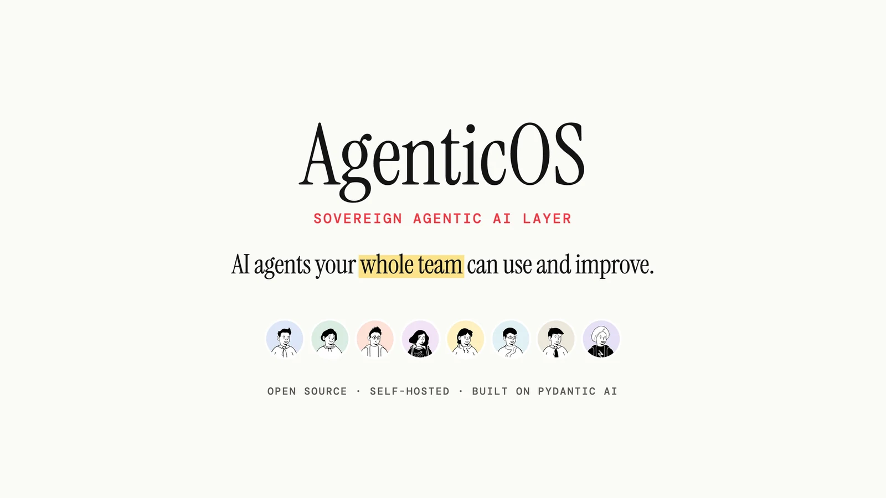
</video>

<p align="center"><sub><b>AgenticOS en 45 segundos.</b> Crea cualquier agente en el navegador, publícalo donde trabaja tu equipo, deja que funcione por su cuenta y somete cada solicitud a los mismos controles. Narrado con voz sintética. <a href="https://github.com/user-attachments/assets/d9457e3a-94ef-4802-a78f-0e2069effc7c">Ver (46 s, 4K)</a></sub></p>

<video src="https://github.com/user-attachments/assets/1d6bba29-3bfe-4c86-bda3-52ce2b0aa512#t=1" controls playsinline width="100%" poster="docs/assets/screens/oss-launch-planner-poster.webp">
  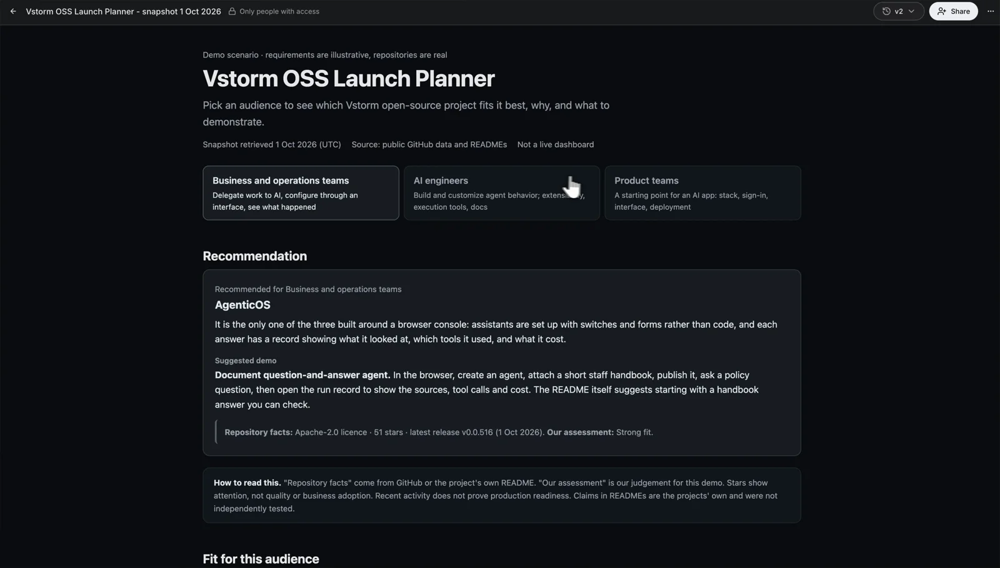
</video>

<p align="center"><sub><b>Brief → investigación → resultado compartido.</b> Un run grabado: un agente lee un brief de campaña en Notion, investiga repositorios en GitHub y publica un planificador interactivo. <a href="https://github.com/user-attachments/assets/1d6bba29-3bfe-4c86-bda3-52ce2b0aa512">Ver (37 s)</a></sub></p>

<table>
<tr>
<td width="50%"><a href="docs/assets/screens/light/agent-builder.png"></a><br><b>Crea en el navegador.</b> Instrucciones, modelo y herramientas; publica versiones.</td>
<td width="50%"><a href="docs/assets/screens/light/chat.png">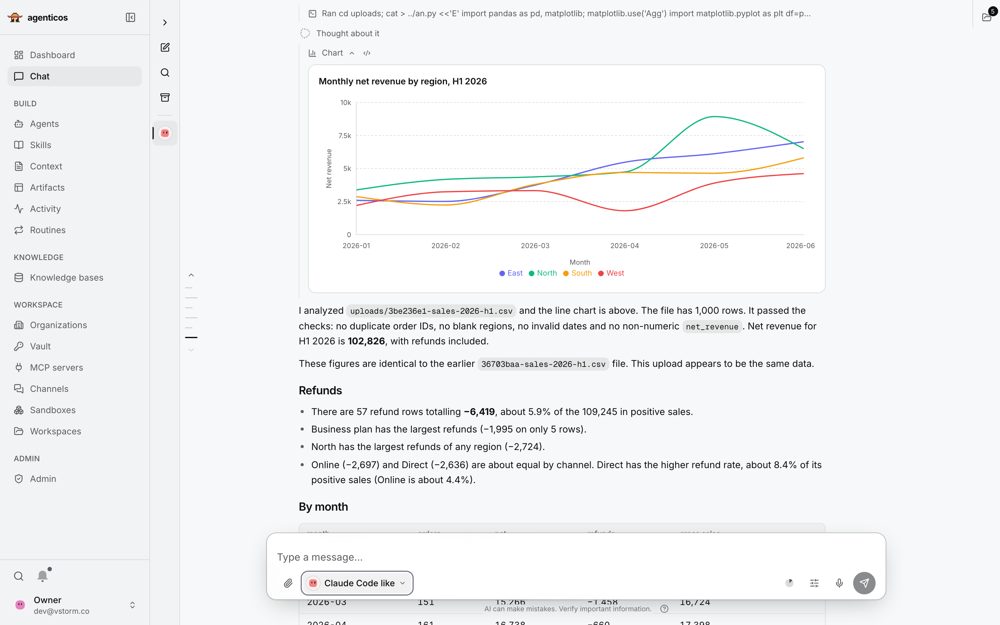</a><br><b>Trabaja con archivos y código.</b> Entra un CSV, salen un gráfico y conclusiones.</td>
</tr>
<tr>
<td><a href="docs/assets/screens/light/skills.png">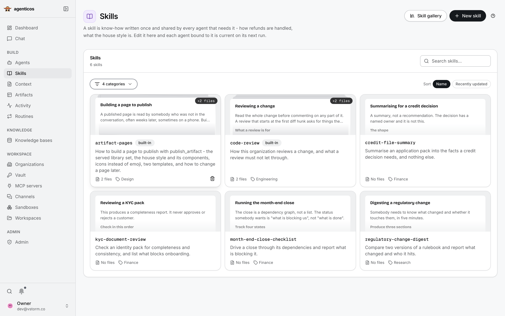</a><br><b>Enseña cómo trabaja tu equipo.</b> Skills escritos una vez y reutilizados por todos los agentes.</td>
<td><a href="docs/assets/screens/light/knowledge-collection.png">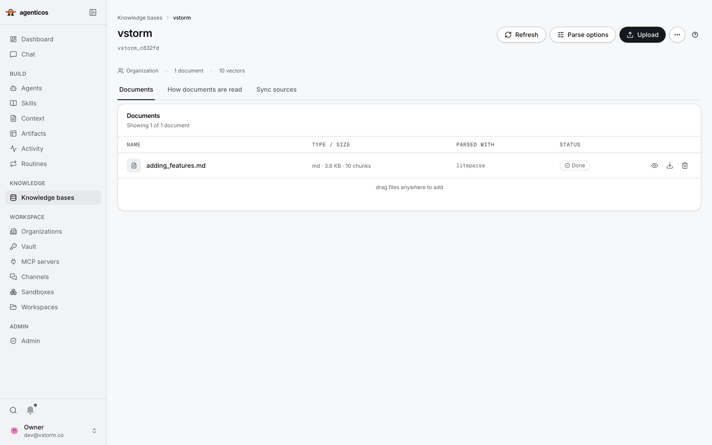</a><br><b>Responde desde tus documentos.</b> Súbelos o sincronízalos y cítalos.</td>
</tr>
<tr>
<td><a href="docs/assets/screens/light/artifact-detail.png">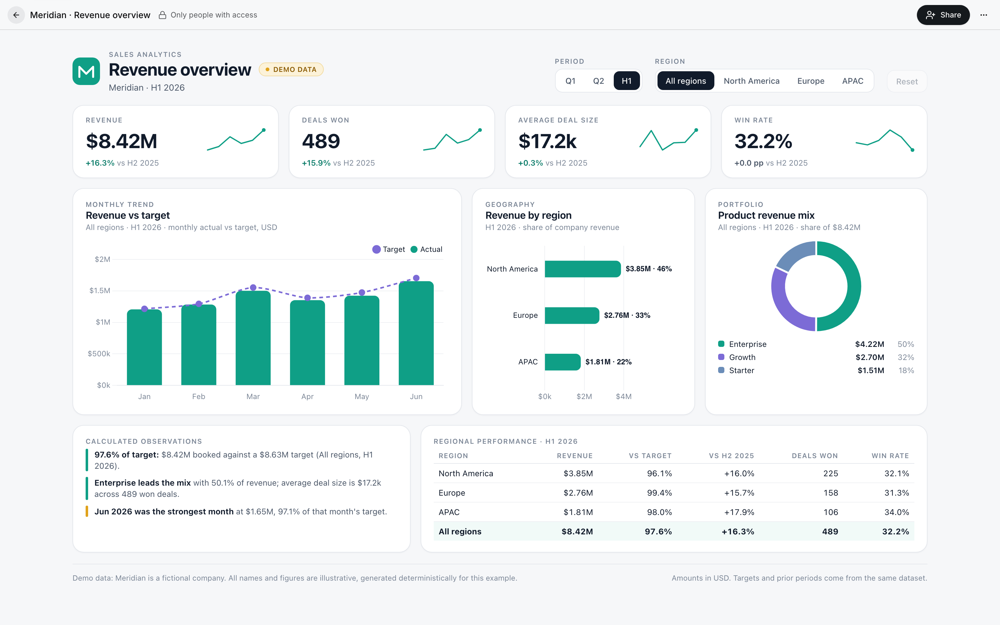</a><br><b>Publica resultados como páginas.</b> Enlaces estables y versiones. Datos de demostración.</td>
<td><a href="docs/assets/screens/light/dashboard.png">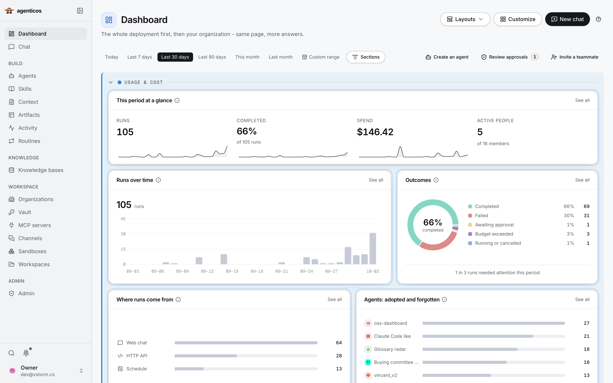</a><br><b>Consulta el uso y el gasto.</b> Runs, resultados y budgets en una sola vista.</td>
</tr>
<tr>
<td><a href="docs/assets/screens/light/agents.png">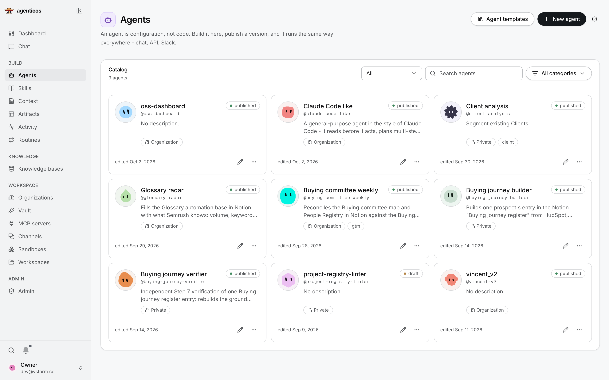</a><br><b>Un catálogo de agentes.</b> Privados, compartidos con un grupo o para toda la empresa.</td>
<td><a href="docs/assets/screens/light/groups.png">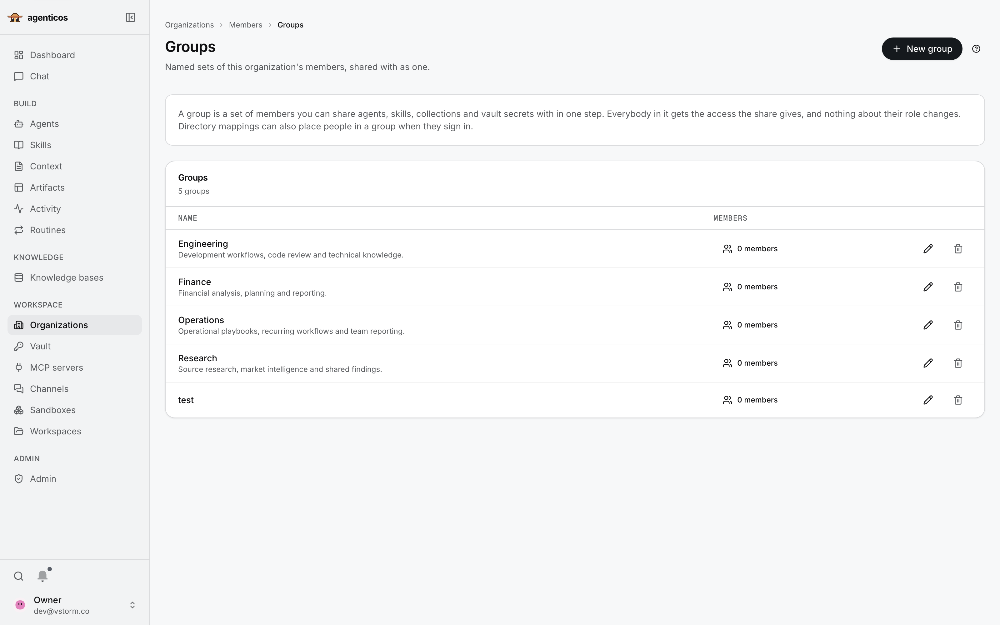</a><br><b>El acceso sigue a tu organización.</b> Roles, grupos e inicio de sesión de empresa.</td>
</tr>
</table>

<p align="center"><sub>Capturado en un despliegue de prueba. Las cifras son registros de prueba, no benchmarks.</sub></p>

## 💡 ¿Qué es AgenticOS?

**AgenticOS es una plataforma de código abierto (Apache-2.0) y autoalojada para crear, compartir y gobernar agentes de IA en toda la empresa.** Los equipos configuran un agente en el navegador: escriben sus instrucciones, eligen un modelo y activan herramientas. Lo conectan a los documentos y las aplicaciones de la empresa y lo publican en el chat web, Slack, Mattermost, Telegram, un widget para sitios web o una API. Los administradores controlan quién puede usar cada agente, cuánto puede gastar y qué acciones necesitan la aprobación de una persona. Cada run queda registrado.

La mayoría de los frameworks de agentes te dan una biblioteca, así que cada cambio en el comportamiento de un agente es un pull request, una revisión y una release. Esa forma no encaja con los agentes pequeños que una empresa quiere de verdad, porque quien sabe qué debe decir el agente no es quien tiene acceso al repositorio. **El código define, la configuración compone:** los ingenieros amplían lo que se puede ensamblar, y la configuración solo llega a lo que el código ha registrado.

Funciona en tu propia infraestructura con Docker Compose y es compatible con 27 providers de modelos, incluidos modelos locales mediante Ollama y vLLM. Los agentes se ejecutan sobre [Pydantic AI](https://ai.pydantic.dev) y [pydantic-ai-harness](https://github.com/pydantic/pydantic-ai-harness); la plataforma que los rodea usa FastAPI, PostgreSQL con pgvector y Next.js. Lo mantiene [Vstorm](https://vstorm.co).

**Para quién es:**

- Empresas que quieren **una plataforma interna de agentes de IA** propia, en lugar de asistentes por usuario en la nube de un proveedor.
- Equipos con **trabajo repetitivo sobre documentos y herramientas**, como informes, respuestas de soporte, revisión de contratos y análisis de datos.
- Equipos de TI y seguridad que necesitan **soberanía de datos, inicio de sesión de empresa, budgets, aprobaciones y un registro de auditoría** para los agentes de IA.
- Ingenieros que quieren **puntos de extensión en Python tipado** y una consola que sus compañeros no técnicos puedan usar.

<a href="docs/assets/readme/company-architecture-diagram.webp">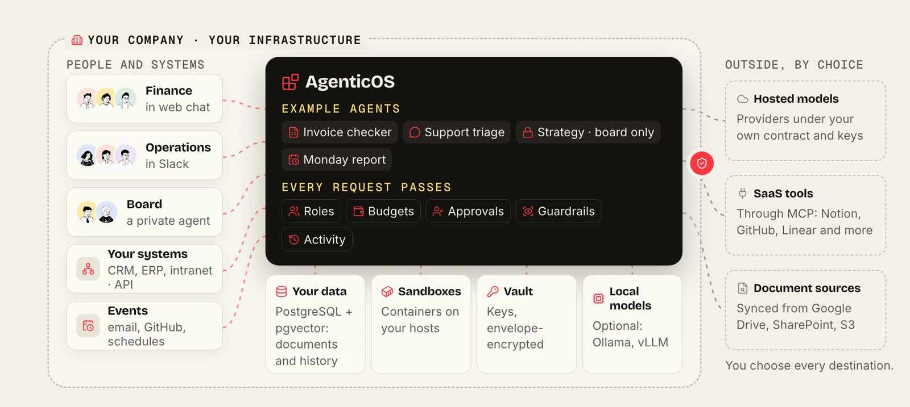</a>

<p align="center"><sub><b>Cómo encaja en tu empresa.</b> Personas ilustradas; los agentes son ejemplos.</sub></p>

**Cómo encaja AgenticOS en una empresa:** departamentos como finanzas, operaciones o la dirección usan agentes compartidos en el chat web, Slack o un workspace privado. Tus sistemas llaman a los agentes mediante la API, y los eventos o las programaciones los inician automáticamente. Cada solicitud pasa por los mismos controles: roles, budgets, aprobaciones, guardrails y un run registrado. Tus datos, vectores, sandboxes de código, el vault de credenciales y los modelos locales opcionales permanecen en tu infraestructura. Los modelos alojados, las herramientas SaaS y las fuentes de documentos externas solo se usan cuando las configuras.

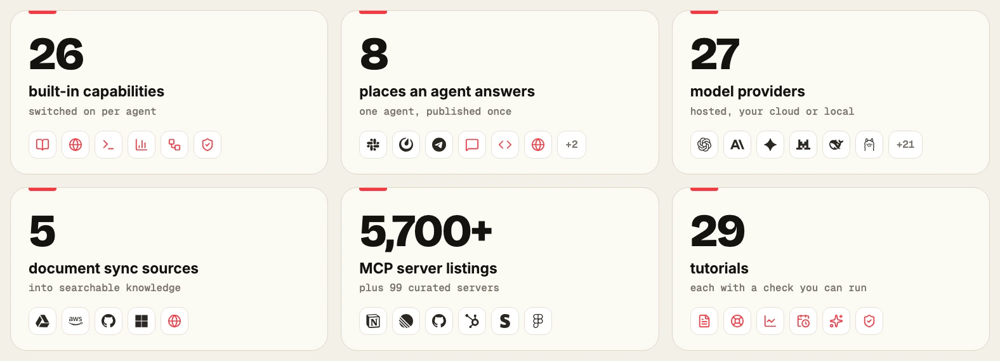

<p align="center"><sub><b>De un vistazo:</b> 26 capabilities integradas · 8 lugares donde responde un agente · 27 providers de modelos · 5 fuentes de sincronización de documentos · más de 5700 entradas de servidores MCP y 99 servidores seleccionados · 29 tutoriales.</sub></p>

## ✨ Qué puedes hacer

| Para tu equipo | Qué ofrece AgenticOS |
|---|---|
| [Archivos y código](#-trabaja-con-archivos-y-código) | Analiza CSV, genera gráficos y documentos, trabaja en repositorios |
| [Agentes reutilizables](#-crea-agentes-que-tu-equipo-pueda-reutilizar) | Elige modelos y herramientas, publica versiones, comparte agentes con tus compañeros |
| [Conocimiento de la empresa](#-enseña-a-los-agentes-cómo-trabaja-tu-equipo) | Reutiliza skills, contexto y documentos consultables en distintos agentes |
| [Resultados compartidos](#-publica-resultados-como-páginas-interactivas) | Publica páginas interactivas con enlaces estables e historial de versiones |
| [Ejecución y supervisión](#-supervisa-runs-costes-y-aprobaciones) | Personaliza dashboards, revisa runs, programa tareas y fija budgets |
| [Acceso en la empresa](#-organiza-equipos-con-roles-y-grupos) | Combina roles, grupos de departamentos e inicio de sesión de empresa |

## 🚀 Inicio rápido

Necesitas Docker Compose y acceso a un provider de modelos. En macOS o Linux, ejecuta:

```bash
curl -fsSL https://raw.githubusercontent.com/vstorm-co/agenticos/main/scripts/quickstart.sh | bash
```

En Windows, ejecuta el mismo comando dentro de WSL2 con la integración de WSL2 de Docker Desktop activada. El instalador pregunta por el provider de modelos y su clave, tu usuario y el nombre de la organización, descarga las imágenes publicadas y arranca un despliegue con un agente que ya funciona. Basta con un host de 4 vCPU y 8 GB de RAM. Después abre **http://localhost:3000** e inicia sesión con el usuario que elegiste durante la instalación.

**Tu primer agente:** sigue la [guía del asistente de documentos](https://vstorm-co.github.io/agenticos/es/howto/first-document-agent/) para subir un manual, hacer preguntas y comprobar las respuestas con las fuentes citadas. Luego elige la siguiente tarea entre [29 tutoriales](https://vstorm-co.github.io/agenticos/es/use-cases/), cada uno con una entrada de ejemplo y una comprobación que puedes ejecutar.

<details>
<summary>Revisa el instalador o elige otro método de despliegue</summary>

Lee el [instalador](scripts/quickstart.sh) antes de ejecutarlo. Para comprobar los requisitos sin instalar:

```bash
curl -fsSL https://raw.githubusercontent.com/vstorm-co/agenticos/main/scripts/quickstart.sh | bash -s -- --check
```

La [guía de instalación](https://vstorm-co.github.io/agenticos/es/install/) explica la configuración manual con Docker Compose, las versiones fijas y la resolución de problemas. Para desarrollar a partir del código fuente, consulta [Contribuir](https://vstorm-co.github.io/agenticos/es/help/).

</details>

## 🔌 Conecta las aplicaciones que tu equipo ya usa

AgenticOS conecta los agentes con los modelos, las herramientas de chat, las aplicaciones de negocio y los almacenes de documentos que la empresa ya usa, de modo que un agente puede leer un brief de Notion, buscar en documentos de SharePoint o responder en Slack con las mismas reglas de acceso y el mismo budget.

<a href="docs/assets/readme/integrations-hub.webp">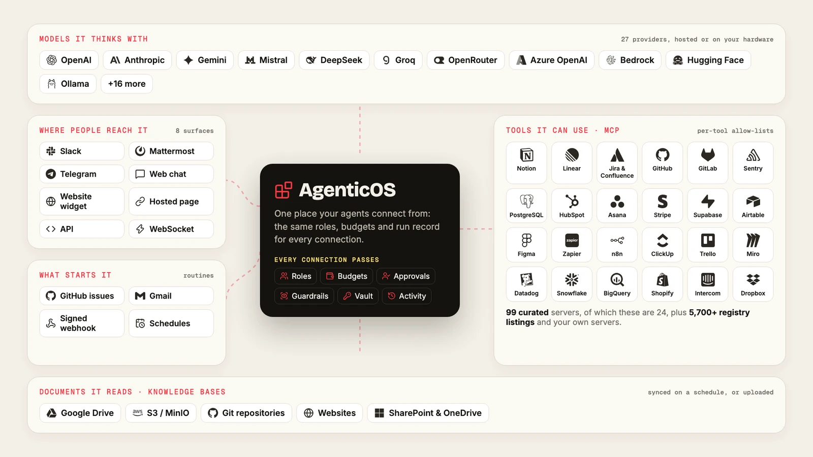</a>

| Conectar | Cómo | Más información |
|---|---|---|
| **Herramientas de chat** | Publica un agente en Slack, Mattermost o Telegram, un widget para sitios web, una página alojada, la API o un WebSocket | [Canales](https://vstorm-co.github.io/agenticos/es/channels/) |
| **Herramientas de negocio** | 99 servidores MCP seleccionados (Notion, GitHub, Jira, HubSpot, Stripe…) más **más de 5700 entradas del registro** y tus propios servidores; elige qué herramientas puede llamar cada agente | [MCP](https://vstorm-co.github.io/agenticos/es/mcp/) |
| **Documentos** | Sincroniza Google Drive, S3/MinIO, repositorios Git, sitios web, SharePoint y OneDrive en bases de conocimiento | [Fuentes de sincronización](https://vstorm-co.github.io/agenticos/es/howto/configure-sync-sources/) |
| **Eventos** | Inicia agentes según un horario, una nueva issue de GitHub, un mensaje de Gmail o un webhook firmado | [Rutinas](https://vstorm-co.github.io/agenticos/es/triggers/) |
| **Modelos** | 27 providers, tu contrato en la nube (Azure, Bedrock, Vertex) o modelos locales (Ollama, vLLM) | [Modelos](https://vstorm-co.github.io/agenticos/es/models/) |

<sub>Las entradas del registro son metadatos proporcionados por sus publicadores; cada conexión requiere su propia configuración y revisión de acceso. El correo y el calendario de Outlook se conectan mediante un servicio MCP de terceros. Los logotipos identifican opciones de conexión y no implican ninguna colaboración.</sub>

## 🧩 Crea, comparte y opera

### 🤖 Crea agentes que tu equipo pueda reutilizar

Elige el modelo, las instrucciones y las herramientas de un agente en el navegador. Publica una versión para tus compañeros; consulta versiones anteriores y restáuralas cuando sea necesario. Mantén agentes especializados en investigación, informes, programación u operaciones en un mismo catálogo.

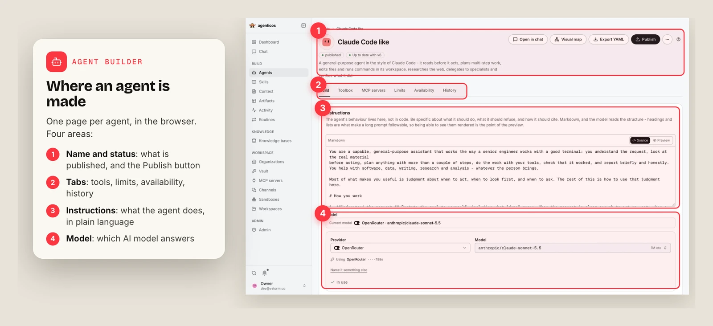

El builder de agentes tiene cuatro zonas: **(1)** el nombre y el estado de publicación, donde un borrador sigue siendo privado hasta que publicas una versión; **(2)** pestañas para la caja de herramientas, los servidores MCP, los límites, la disponibilidad y el historial de versiones; **(3)** las instrucciones, escritas en lenguaje llano, como un encargo para un compañero nuevo; y **(4)** el modelo, elegido por agente entre tus providers configurados.

Tus compañeros pueden usar un agente publicado en **chat web, Slack, Mattermost o Telegram** cuando esos canales estén configurados, en un **widget para sitios web** o una **página alojada**, o mediante la **API** y el **WebSocket**. [Crear un agente](https://vstorm-co.github.io/agenticos/es/first-agent/) · [Conectar un canal](https://vstorm-co.github.io/agenticos/es/channels/)

### 📂 Trabaja con archivos y código

Pide a un agente que analice una hoja de cálculo, genere un gráfico, prepare un documento o trabaje en un repositorio. Con una sandbox basada en contenedores configurada y la ejecución de comandos habilitada, puede **leer y editar archivos, ejecutar comandos de shell y ejecutar código Python o JavaScript**. El entorno workbench incluido contiene herramientas para datos, gráficos y documentos, entre ellas LibreOffice.

Si usas [Claude Code](https://code.claude.com/docs/en/overview) o [Codex](https://developers.openai.com/codex/cli/), el trabajo con archivos y comandos te resultará familiar. AgenticOS lleva esa forma de trabajar a un workspace compartido y autoalojado, con conocimiento de la empresa, agentes reutilizables y controles de acceso de la organización. Lo que un agente puede lograr depende de su modelo, sus herramientas habilitadas y sus instrucciones. [Configuración de sandboxes](https://vstorm-co.github.io/agenticos/es/sandbox/)

### 🧠 Enseña a los agentes cómo trabaja tu equipo

- **Skills** contienen procedimientos reutilizables: cómo revisar código, escribir un informe o investigar un mercado. Mantenlos una vez y reutilízalos en distintos agentes.
- **Contexto** contiene conocimiento permanente, como un glosario, una política o la voz de la marca. Inclúyelo en el prompt o permite que el agente lo lea cuando lo necesite.
- **Bases de conocimiento (RAG)** permiten buscar en documentos subidos. Elige opciones de análisis, revisa el estado del procesamiento y los fragmentos, o sincronízalos desde una de las fuentes que se indican a continuación.

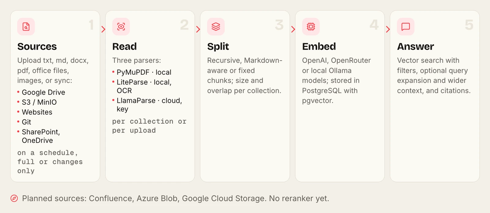

**Cómo funciona la generación aumentada por recuperación (RAG) en AgenticOS:** los documentos se suben o se sincronizan desde Google Drive, S3/MinIO, Git, sitios web, SharePoint u OneDrive. Los lee un parser: PyMuPDF y LiteParse se ejecutan en local, con OCR para documentos escaneados, mientras que LlamaParse es un servicio en la nube. Después los documentos se dividen en fragmentos, se convierten en embeddings con un modelo de OpenAI, OpenRouter u Ollama local y se guardan en PostgreSQL con pgvector. Al recibir una pregunta, el agente busca en los vectores con filtros y responde con citas.

[Skills](https://vstorm-co.github.io/agenticos/es/skills/) · [Contexto](https://vstorm-co.github.io/agenticos/es/context/) · [Procesamiento de documentos](https://vstorm-co.github.io/agenticos/es/file-processing/) · [Fuentes de sincronización](https://vstorm-co.github.io/agenticos/es/howto/configure-sync-sources/)

### 🎨 Publica resultados como páginas interactivas

Los agentes pueden publicar informes, comparaciones interactivas y pequeños paneles como **artefactos**. Elige quién puede abrirlos; las actualizaciones conservan el mismo enlace y las versiones anteriores siguen disponibles. Los enlaces públicos pueden caducar, pedir una contraseña o limitar qué sitios pueden incrustarlos. [Compartir un artefacto](https://vstorm-co.github.io/agenticos/es/artifacts/)

### 📊 Supervisa runs, costes y aprobaciones

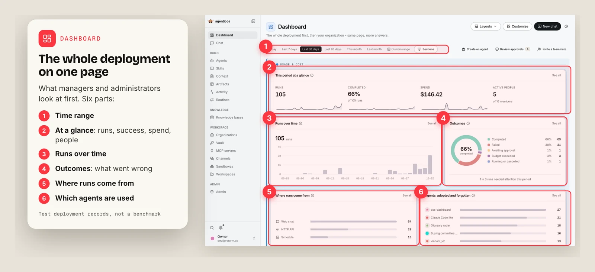

El dashboard responde a seis preguntas para el periodo elegido: cuántos runs hubo, cuántos terminaron, cuánto costaron y cuántas personas usaron agentes; cómo cambiaron los runs a lo largo del tiempo; qué falló, esperó una aprobación o se detuvo por un budget; de dónde vinieron los runs; y qué agentes usa realmente la gente.

Personaliza el **dashboard** según tu trabajo. **Activity** permite revisar runs y llamadas a herramientas, comparar versiones de agentes y exportar registros. Los **budgets** por agente y por organización se comprueban antes de cada solicitud al modelo. Las **políticas de aprobación** hacen que las herramientas sensibles esperen a una persona, y las **rutinas** repiten tareas según un horario o eventos como una nueva issue de GitHub, un mensaje de Gmail o un webhook firmado. [Historial de runs, budgets y aprobaciones](https://vstorm-co.github.io/agenticos/es/governance/) · [Rutinas](https://vstorm-co.github.io/agenticos/es/triggers/)

### 👥 Organiza equipos con roles y grupos

**Los roles definen qué pueden hacer las personas. Los grupos definen con quién compartes.** Usa roles como Builder, Operator, Member y Viewer y crea departamentos o grupos de trabajo como Operations, Engineering, Finance y Research. Comparte un agente, skill, colección, archivo de contexto o artefacto con un grupo en un solo paso.

Usa las cuentas existentes de la empresa mediante **inicio de sesión único con OIDC** (Entra ID, Okta, Keycloak y otros), **acceso al directorio con LDAP** o **inicio de sesión integrado de Windows con Kerberos**. Las **asignaciones de directorio** vinculan grupos del directorio con un rol y un grupo al iniciar sesión. [Roles y permisos](https://vstorm-co.github.io/agenticos/es/permissions/) · [Inicio de sesión con directorio](https://vstorm-co.github.io/agenticos/es/directory/)

## 🧭 Encuentra tu camino

¿Vas a construir sobre él? Ve a [Para desarrolladores y operadores](#-para-desarrolladores-y-operadores).

<details>
<summary><b>Si estás decidiendo si adoptarlo</b>: el problema que resuelve, qué requiere, cómo empezar</summary>

<br>

| La pregunta que tus equipos no pueden responder hoy | Cómo la responde AgenticOS |
|---|---|
| ¿Quién puede usar qué datos? | Roles, grupos de departamentos y uso compartido por recurso, con inicio de sesión de empresa |
| ¿Cuánto cuesta? | Budgets mensuales por agente y por organización, comprobados antes de cada solicitud al modelo |
| ¿Quién aprobó esa acción? | Las herramientas sensibles esperan a una persona; cada decisión queda registrada |
| ¿Adónde van nuestros datos? | Tú operas la plataforma y eliges cada modelo, parser y herramienta a los que puede acceder |

**Qué requiere:** un host (4 vCPU, 8 GB de RAM), alguien que opere el despliegue y expertos en la materia que mantengan las instrucciones y los documentos. Los costes son el uso de modelos, la infraestructura, los servicios externos y el tiempo de las personas; el software es Apache-2.0, uso comercial incluido.

**Cómo empezar:** elige una tarea repetitiva y a la persona que juzgará las respuestas, configúrala con el modelo y las reglas de acceso que elijas y compruébala con criterios acordados de antemano. [Planifica el despliegue](https://vstorm-co.github.io/agenticos/es/rollout/) · [Compara enfoques](https://vstorm-co.github.io/agenticos/es/about/comparison/)

</details>

<details>
<summary><b>Si estás revisando la seguridad</b>: flujos de datos, identidad, controles, qué queda en manos de tu TI</summary>

<br>

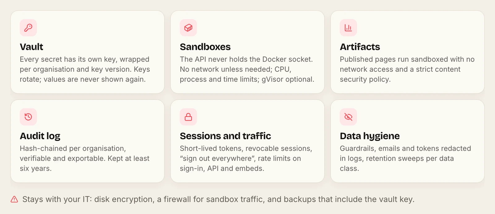

La seguridad funciona por capas. Las credenciales están en un vault con cifrado de sobre. El código se ejecuta en sandboxes aisladas. Las páginas publicadas están aisladas en una sandbox. Cada organización tiene un registro de auditoría encadenado por hashes. Las sesiones son de corta duración y revocables, y se aplican límites de frecuencia. Los registros se censuran y los datos se eliminan según un calendario de retención.

| Destino saliente | Se usa cuando | Alternativa local |
|---|---|---|
| Provider de modelos | En cada run de un agente | Ollama, vLLM o LM Studio en tu hardware |
| Provider de embeddings | Al indexar y buscar documentos | Modelos de embeddings locales de Ollama |
| LlamaParse | Colecciones configuradas con ese parser | PyMuPDF o LiteParse, ambos locales |
| Búsqueda web | Agentes con la búsqueda web activada | Desactiva la capability |
| Servidores MCP, canales de chat | Solo los que conectes | Servidores autoalojados, chat web |
| Trazas de Logfire | Solo cuando hay un token configurado | Historial de runs integrado |

- **Vault:** una clave de datos por secreto, envuelta por organización y versión de clave; las claves maestras rotan; los valores no vuelven a mostrarse.
- **Sandboxes:** la API no tiene socket de Docker; los contenedores no tienen red salvo que la necesiten, con límites de CPU, procesos y tiempo; gVisor es opcional.
- **Registro de auditoría:** encadenado por hashes por organización, verificable y exportable.
- **Perfil HIPAA:** [`deploy/profiles/hipaa/`](deploy/profiles/hipaa/) y `agenticos cmd doctor --profile hipaa` comprueban un despliegue en marcha frente a las salvaguardas técnicas del §164.312. Es una comprobación de configuración, no una certificación. [Lo que no afirma](https://vstorm-co.github.io/agenticos/es/security/#the-hipaa-profile-and-what-it-does-not-claim)
- **Queda en manos de tu TI:** el cifrado de disco en reposo, el cortafuegos de salida, la MFA mediante tu proveedor de identidad (sin MFA, SAML ni SCIM nativos) y las copias de seguridad que incluyan la clave del vault.

[Seguridad y flujos de datos](https://vstorm-co.github.io/agenticos/es/security/) · [Protección de datos](https://vstorm-co.github.io/agenticos/es/data-protection/) · [Secretos](https://vstorm-co.github.io/agenticos/es/secrets/) · [SECURITY.md](SECURITY.es.md)

</details>

<details>
<summary><b>Si buscas una primera tarea</b>: 29 tutoriales, cada uno con una comprobación que puedes ejecutar</summary>

<br>

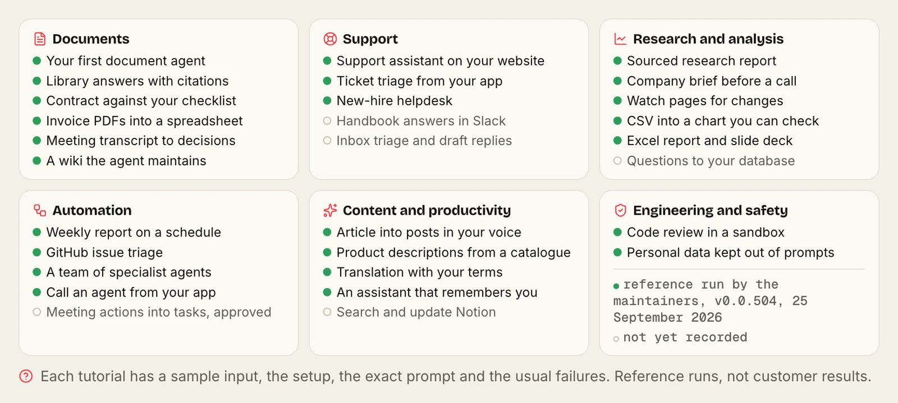

[Todos los tutoriales](https://vstorm-co.github.io/agenticos/es/use-cases/). 24 tienen un run de referencia hecho por los mantenedores; son puntos de partida, no resultados de clientes.

</details>

## 📦 Qué incluye hoy

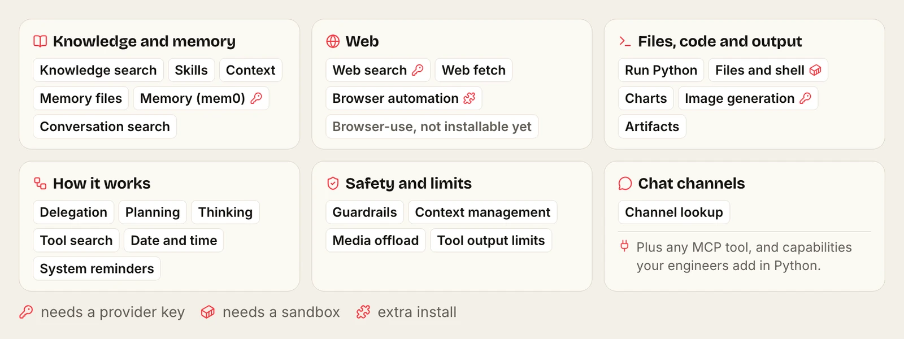

<details>
<summary>Las 26 capabilities integradas, en texto</summary>

- **Conocimiento y memoria:** búsqueda en el conocimiento con citas, skills, contexto, archivos de memoria, memoria mediante mem0, búsqueda en conversaciones.
- **Web:** búsqueda web (DuckDuckGo por defecto; Tavily, Brave o Exa con una clave), descarga de páginas web, automatización del navegador y browser-use (integrado, aún no instalable).
- **Archivos, código y resultados:** ejecución de Python, archivos y shell en una sandbox de contenedor, gráficos, generación de imágenes (OpenAI o Google), artefactos.
- **Cómo trabaja:** delegación en otros agentes, planificación, razonamiento, búsqueda de herramientas, fecha y hora, recordatorios del sistema.
- **Seguridad y límites:** guardrails que censuran secretos y datos personales, gestión del contexto, descarga de contenido multimedia, límites de salida de las herramientas.
- **Canales de chat:** consulta de canales para bots de Slack, Telegram y Mattermost.

Además, cualquier herramienta de un servidor MCP conectado y las capabilities que tus ingenieros añadan en Python tipado. [Referencia de capabilities](https://vstorm-co.github.io/agenticos/es/reference/capabilities/)

</details>

<details>
<summary>Dónde responden los agentes y qué modelos usan</summary>

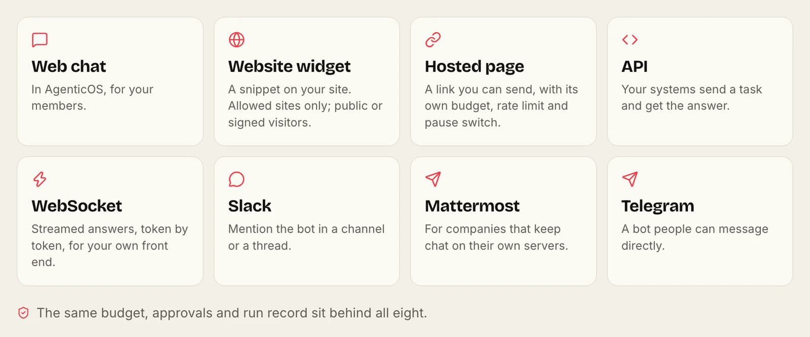
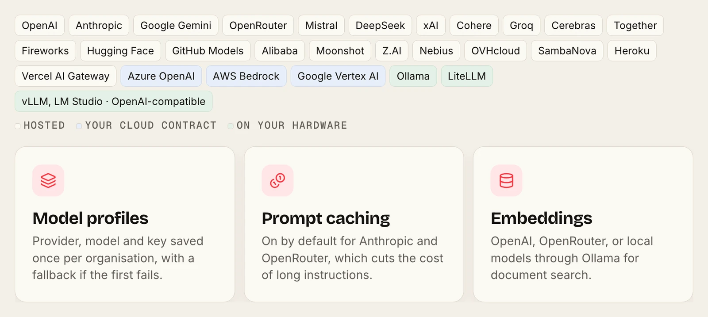

**Dónde responden los agentes:** chat web, un widget para sitios web, una página alojada, la API HTTP, un WebSocket con streaming, Slack, Mattermost y Telegram.

**Providers de modelos:**
- **Alojados (22):** OpenAI, Anthropic, Google Gemini, OpenRouter, Mistral, DeepSeek, xAI, Cohere, Groq, Cerebras, Together, Fireworks, Hugging Face, GitHub Models, Alibaba, Moonshot, Z.AI, Nebius, OVHcloud, SambaNova, Heroku y Vercel AI Gateway.
- **Con tu contrato en la nube:** Azure OpenAI, AWS Bedrock y Google Vertex AI.
- **Autoalojados:** Ollama y LiteLLM, además de vLLM y LM Studio mediante un endpoint compatible con OpenAI.

</details>

## 🎯 ¿Encaja AgenticOS con tu equipo?

Elígelo si el equipo tiene tareas recurrentes con documentos o herramientas, expertos que mantengan las instrucciones y una persona responsable de operar un despliegue autoalojado. Ten claro dónde se detiene hoy:

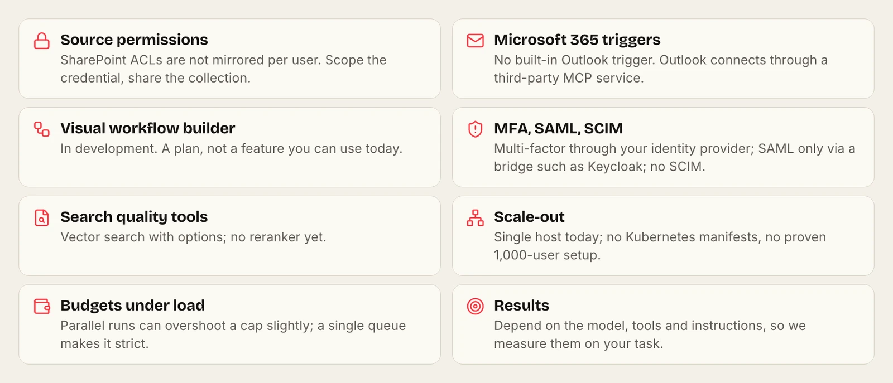

**No disponible hoy:**
- Los permisos de los sistemas de origen, como las ACL de SharePoint, no se replican por usuario. Limita en su lugar la credencial de la fuente.
- No hay un trigger integrado de Microsoft 365.
- El editor visual de flujos de trabajo está en desarrollo.
- No hay MFA, SAML ni SCIM nativos. Usa tu proveedor de identidad mediante OIDC.
- No hay reranker.
- AgenticOS se ejecuta en un solo host con Docker Compose. No hay manifiestos de Kubernetes.
- Los runs en paralelo pueden superar los budgets.
- Los resultados dependen del modelo, las herramientas y las instrucciones, así que evalúalos con tu propia tarea.

## 🔐 Controla tu despliegue, modelos y acceso

**Sovereign significa controlar el despliegue, los providers de modelos, los flujos de datos y el acceso a los agentes.** AgenticOS es software Apache-2.0 que puedes inspeccionar, modificar y operar.

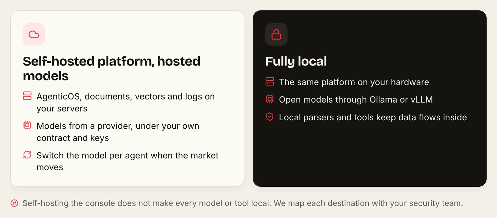

Hay dos configuraciones habituales. **Plataforma autoalojada con modelos alojados:** AgenticOS, los documentos, los vectores y los registros se ejecutan en tus servidores, y los modelos llegan de un provider con tu propio contrato y tus claves. **Totalmente local:** la misma plataforma con modelos abiertos mediante Ollama o vLLM en tu hardware, además de parsers y herramientas locales. Autoalojar la consola no hace que todos los modelos, parsers o herramientas sean locales, así que revisa cada destino que configures. [Configura los modelos](https://vstorm-co.github.io/agenticos/es/models/) · [Seguridad y flujos de datos](https://vstorm-co.github.io/agenticos/es/security/)

## 🛠️ Para desarrolladores y operadores

AgenticOS está construido con FastAPI, Pydantic AI, PostgreSQL con pgvector, Redis, Prefect y Next.js. Los ingenieros añaden capabilities, conectores de sincronización y entradas del catálogo MCP en Python tipado; los equipos componen agentes con las capabilities registradas en la consola.

| Capa | Qué se ejecuta allí |
|---|---|
| Consola | Next.js |
| API | FastAPI |
| Runtime de agentes | [Pydantic AI](https://ai.pydantic.dev) y [pydantic-ai-harness](https://github.com/pydantic/pydantic-ai-harness), un único runner detrás de cada superficie |
| Trabajo en segundo plano | Workers de Prefect, Redis o Valkey |
| Datos | PostgreSQL con pgvector |
| Ejecución de código | Contenedores iniciados por `sandboxd` |

Llama a un agente publicado con `POST /api/v1/agents/{id}/run` como miembro autenticado, o recibe los tokens en streaming por el WebSocket.

[Arquitectura](https://vstorm-co.github.io/agenticos/es/architecture/) · [API](https://vstorm-co.github.io/agenticos/es/api/) · [Añadir una capability](https://vstorm-co.github.io/agenticos/es/howto/add-capability/) · [Referencia de capabilities](https://vstorm-co.github.io/agenticos/es/reference/capabilities/) · [Contribuir](https://vstorm-co.github.io/agenticos/es/help/)

La [analogía del sistema operativo](https://vstorm-co.github.io/agenticos/es/about/) explica la arquitectura. La [aplicación de escritorio](https://vstorm-co.github.io/agenticos/es/desktop/) opcional añade una ventana propia, una mascota y un atajo de captura de pantalla en macOS. 

## ❓ Preguntas frecuentes

<details>
<summary><b>¿AgenticOS es gratuito para uso comercial?</b></summary>

Sí. AgenticOS tiene licencia Apache-2.0, que permite el uso comercial, la modificación y el despliegue privado. Pagas la infraestructura en la que lo ejecutas y los providers de modelos y servicios externos que elijas. El nombre y el logotipo de AgenticOS no están cubiertos por la licencia.

</details>

<details>
<summary><b>¿Puede AgenticOS funcionar solo con modelos locales?</b></summary>

Sí. Configura como provider de modelos Ollama, LiteLLM o un servidor compatible con OpenAI, como vLLM o LM Studio; usa modelos de embeddings locales mediante Ollama y analiza los documentos con PyMuPDF o LiteParse. Autoalojar solo la consola no hace que todos los modelos, parsers o herramientas sean locales: comprueba cada destino que configures. [Modelos](https://vstorm-co.github.io/agenticos/es/models/) · [Flujos de datos](https://vstorm-co.github.io/agenticos/es/security/)

</details>

<details>
<summary><b>¿Qué métodos de inicio de sesión y qué roles admite?</b></summary>

Correo y contraseña con enlaces mágicos, Google, inicio de sesión único genérico con OIDC (Entra ID, Okta, Keycloak, Auth0, Authentik, Google Workspace), LDAP y Kerberos. Seis roles integrados (Owner, Admin, Builder, Operator, Member, Viewer) se combinan con grupos de departamentos y uso compartido por recurso. La autenticación multifactor la aporta tu proveedor de identidad; todavía no hay MFA, SAML ni SCIM nativos. [Permisos](https://vstorm-co.github.io/agenticos/es/permissions/)

</details>

<details>
<summary><b>¿Cómo mantiene AgenticOS a los agentes bajo control?</b></summary>

Los budgets mensuales por agente y por organización se comprueban antes de cada solicitud al modelo. Las herramientas sensibles esperan la aprobación de una persona. Los guardrails opcionales censuran secretos y datos personales, y cada run queda registrado con su versión del agente, sus herramientas, sus tokens y su coste. [Gobernanza](https://vstorm-co.github.io/agenticos/es/governance/)

</details>

<details>
<summary><b>¿En qué se diferencia de ChatGPT Enterprise, Copilot Studio o n8n?</b></summary>

AgenticOS se ejecuta en tu infraestructura con cualquiera de 27 providers de modelos y no cobra por usuario ni por créditos. Crea agentes para la organización, publicados en chats, sitios web y API, en lugar de licencias de asistente para cada empleado. Frente a n8n, parte del agente en lugar de un lienzo de flujos de trabajo, y muchos equipos usan ambos. Las guías también tratan el builder autoalojado [Dify](https://vstorm-co.github.io/agenticos/es/about/dify/) y agentes de programación como Claude Code. [Comparativas](https://vstorm-co.github.io/agenticos/es/about/comparison/)

</details>

<details>
<summary><b>¿Qué hace falta para ejecutarlo?</b></summary>

Docker Compose en un solo host. Basta con una máquina de 4 vCPU y 8 GB de RAM, y dos workers de la API son suficientes para un equipo de diez personas. Alguien tiene que encargarse de las actualizaciones, las copias de seguridad (incluida la clave del vault), el acceso y los servicios externos que conectes. [Despliegue](https://vstorm-co.github.io/agenticos/es/deploy/) · [Puesta en marcha](https://vstorm-co.github.io/agenticos/es/rollout/)

</details>

## 💬 Comunidad

- **Preguntas e ideas:** [GitHub Discussions](https://github.com/vstorm-co/agenticos/discussions).
- **Errores y peticiones:** [issues](https://github.com/vstorm-co/agenticos/issues); el trabajo planificado se agrupa en [milestones](https://github.com/vstorm-co/agenticos/milestones).
- **Contribuir:** lee la [guía de contribución](CONTRIBUTING.es.md) y el [código de conducta](CODE_OF_CONDUCT.es.md). Informa de vulnerabilidades de forma privada como describe [SECURITY.md](SECURITY.es.md).
- **Versiones:** lee las [notas de la versión](https://vstorm-co.github.io/agenticos/es/release-notes/) o elige **Watch → Custom → Releases** en GitHub para recibir avisos.

## 📄 Licencia

[Apache License 2.0](LICENSE). Consulta [NOTICE](NOTICE) y los [avisos de terceros](THIRD_PARTY_NOTICES.md) para las atribuciones y los componentes incluidos.

## 🤝 ¿Necesitas ayuda para llevar agentes a producción?

Vstorm despliega AgenticOS en la infraestructura del cliente, escribe la documentación, define los procesos y construye capabilities a medida. El mantenimiento y el soporte se acuerdan en cada proyecto.

Construido con esmero por [**Vstorm**](https://vstorm.co) · [Vstorm on GitHub](https://github.com/vstorm-co)
