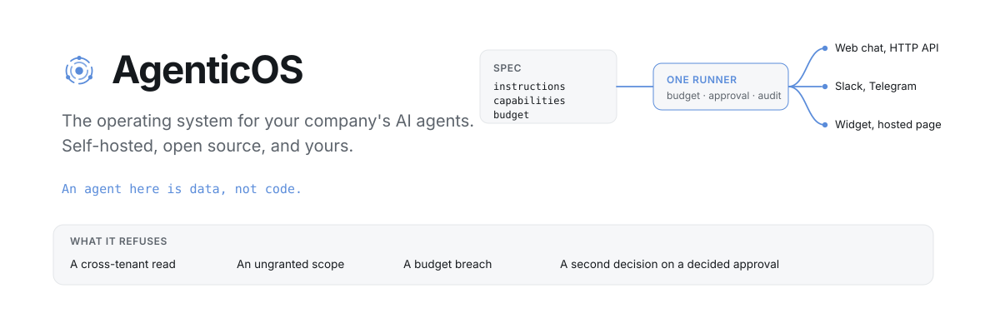
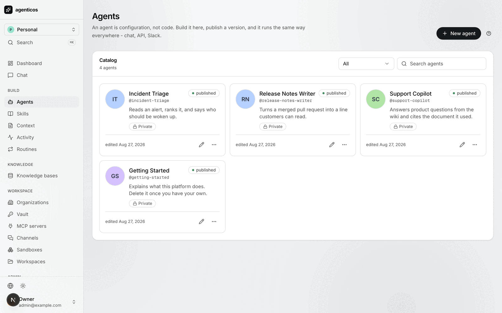
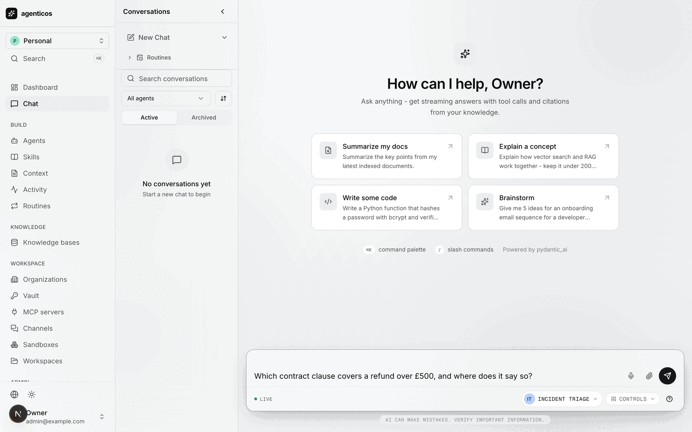

<div align="center">

<picture>
  <source media="(prefers-color-scheme: dark)" srcset=".github/assets/hero-dark.svg">
  
</picture>

<p>
  <b>The operating system for your company's AI agents.</b><br>
  Processes, permissions, resource limits, drivers and an audit log.<br>
  <b>Self-hosted</b>, open source, and yours — on your Postgres, in your Docker, under your domain.
</p>

<p>
  <a href="docs/index.md">Docs</a> &middot;
  <a href="docs/install.md">Install</a> &middot;
  <a href="docs/first-agent.md">Your first agent</a> &middot;
  <a href="#-what-makes-it-an-operating-system">Why it is an OS</a> &middot;
  <a href="#-why-agenticos">Comparison</a> &middot;
  <a href="docs/mcp.md">Integrations</a> &middot;
  <a href="docs/ROADMAP.md">Roadmap</a> &middot;
  <a href="CHANGELOG.md">Changelog</a>
</p>

<p>
  <a href="https://github.com/vstorm-co/agenticos/actions/workflows/ci.yml"></a>
  <a href="https://github.com/vstorm-co/agenticos/releases"></a>
  <a href="docs/testing.md"></a>
  <a href="docs/index.md"></a>
  <a href="LICENSE"></a>
  <a href="SECURITY.md"></a>
  <a href="https://github.com/vstorm-co/agenticos/stargazers"></a>
</p>

<p>
  <a href="backend/pyproject.toml"></a>
  <a href="backend/pyproject.toml"></a>
  <a href="https://ai.pydantic.dev"></a>
  <a href="frontend/package.json"></a>
  <a href="docker-compose.yml"></a>
  <a href="https://modelcontextprotocol.io"></a>
</p>

</div>

---

**A company ends up with agents in five places** — one in a vendor's console, one
somebody wrote in LangChain, one inside a SaaS product — and nobody can answer
four questions: *what agents do we run, what did they cost, what did they touch,
and who said they could.*

AgenticOS is one place to build them and one set of books for all of them.

- 🏗️ **Built by whoever knows the answer.** Instructions, a model, capabilities
  and a budget, edited in a browser and published as a version. Changing what an
  agent says is not a pull request, a review and a release.
- 🛡️ **Governed like software the company owns.** Budgets that stop a run
  *before* the model request, human approval on anything side-effecting, an audit
  trail, and tenant isolation enforced by the schema rather than by a `WHERE`
  clause somebody has to remember.
- 🔌 **Everywhere, from one runner.** Web chat, a hosted page, an embeddable
  widget, the HTTP API, Slack, Telegram, Mattermost and schedules — the same
  agent, the same budget, the same audit.

**An agent here is a file, not a service.** In an operating system a program is a
file: something you can read, copy, version and commit. So is an agent.

## What it looks like

Somebody who knows what the agent should say edits this, publishes a version, and
every surface serves that version.


Published agents, each with the version that is live and who may reach it.



The same runner answers in the dashboard's chat, and in Slack, and behind an API
key — with the same budget, the same approval gate and the same audit trail.



## ⚡ Get to a running agent

Four commands, about five minutes. Needs Docker, GNU Make, [uv](https://astral.sh/uv)
and [bun](https://bun.sh); on Windows, WSL2. There is no `.env` to write first -
every compose variable has a default, and the one secret that cannot have one
(`SANDBOXD_TOKEN`) is generated into `backend/.env` for you.

```bash
git clone https://github.com/vstorm-co/agenticos && cd agenticos
make dev                                          # postgres (pgvector), redis, api, prefect, sandbox
make dev-frontend                                 # the Next.js container — a separate compose file
make platform-bootstrap BOOTSTRAP_API_KEY=sk-...  # an org, an owner, a key, a model, a published agent
open http://localhost:3000                        # sign in as admin@example.com / admin123
```

Then open **Agents → Getting Started → Test** and ask it something.

`make platform-bootstrap` is the step that matters, because an empty install is a
chicken-and-egg problem: an agent needs a model, a model needs a key, a key needs
an organization. It walks that chain once. Leave `BOOTSTRAP_API_KEY` out and
everything is still created - the agent is saved as a draft rather than published,
because an agent with no model cannot answer. Add a key under **Settings → AI
providers**, then publish.

Every command here is idempotent; re-run any of them whenever you are not sure
they worked.

| | |
|---|---|
| Frontend | <http://localhost:3000> |
| API · OpenAPI | <http://localhost:8000> · `/docs` |
| Prefect | <http://localhost:4200> |

If something does not come up, `uv run agenticos cmd doctor` (from `backend/`)
checks the database, the vault, whether there is a model an agent could actually
run on and whether every sandbox connection answers - and says which one is
missing. [Install](docs/install.md) has the step-by-step version of all of this,
the prerequisites table, the host-Python workflow and a table of what each
failure means.

## 🧩 What makes it an operating system

Plenty of things in this category are called an OS. Here the word is a
specification rather than a label: an operating system does seven things, and
each row below is a mechanism you can read in the source.

| What an operating system does | What AgenticOS does |
|---|---|
| **Runs and isolates processes** | Runs agents, stops one at its budget, isolates tenants in the schema rather than in service code, and keeps every run with what it cost |
| **Enforces resource limits** - quota, cgroups | Monthly budgets per agent, checked *before* each model request rather than tallied afterwards. A run that fails still records what it spent |
| **Controls access** - users, permissions, `sudo` | A [permission catalog](docs/permissions.md) in code, roles composed from it, per-resource grants that widen and never narrow. `approval: required` is the `sudo`: a tool that acts on the outside world waits for a person |
| **Reaches hardware through drivers** | One interface to [27 model providers](docs/models.md) and to [any MCP server by URL](docs/mcp.md). Change a model profile and every agent using it moves, without one of them being republished |
| **Keeps a filesystem** | [Collections, skills and attached context](docs/file-processing.md) in your own Postgres, with embeddings keyed per organization |
| **Gives many interfaces one shell** | One runner behind web chat, the HTTP API, Slack, Telegram, a widget, a hosted page and a schedule. Same budget, same approval gate, same audit trail |
| **Writes an audit log** - syslog, auditd | Who ran what, when, what it cost and who approved it. Written even when the run failed |

Apply the same seven to anything else in the category. That is the test we would
like to be judged on, and
[When to use something else](docs/about/comparison.md) is where we run it against
the alternatives - including the rows where the honest answer here is "not yet".

## 🆚 Why AgenticOS?

The only one of these you can run to completion on infrastructure you already
own, with agents a non-engineer edits and an accountant can audit.

| | **AgenticOS** | Cloudflare&nbsp;OS | Glean | A&nbsp;library |
|---|:---:|:---:|:---:|:---:|
| Open source | ✅ Apache-2.0 | ✅ Apache-2.0 | — | ✅ |
| **Runs on ordinary infrastructure** (Postgres, Redis, Docker) | ✅ | — | — | ✅ |
| Runs air-gapped, no vendor account | ✅ | — | — | ✅ |
| Local models (Ollama, LiteLLM) | ✅ | ✅ | — | ✅ |
| Agent built and edited by a non-engineer | ✅ | ~ | ✅ | — |
| Versioned on publish, exportable into your git | ✅ | ~ | — | — |
| **Budget that stops a run before the model call** | ✅ | ~ | ~ | DIY |
| Human approval on side-effecting tools | ✅ | ✅ | ~ | DIY |
| Multi-tenant isolation in the schema | ✅ | ~ | ✅ | DIY |
| Per-organization secret vault | ✅ | ✅ | ✅ | DIY |
| Any MCP server by URL | ✅ | ✅ | ~ | ~ |
| Slack, Telegram, widget and API from one runner | ✅ | — | ~ | DIY |
| ACL-aware connectors to 275+ SaaS systems | — | ~ | ✅ | — |
| Evaluation harness | — | — | ✅ | ~ |
| SAML / SCIM | — | ✅ | ✅ | — |

<sub>✅ first-class · ~ partial or via configuration · — not available · DIY you wire it yourself.
"A library" means LangGraph, Pydantic AI or similar. Reflects each project as of 2026-08;
corrections welcome via PR. The last three rows are ours to fix and are on the
<a href="docs/ROADMAP.md">roadmap</a>.</sub>

## Why

Most agent frameworks give you a library. You write Python, you deploy it, and
every change to an agent's behaviour is a pull request, a review and a release.
That is the right shape for a product feature and the wrong shape for the forty
small agents a company actually wants - because the person who knows what the
agent should say is not the person with commit access.

AgenticOS moves the agent out of the code and puts governance around it instead.

| | |
|---|---|
| **Agents** | Built in a UI, versioned on publish, exportable as YAML into your own git repository |
| **[Capabilities](docs/reference/capabilities.md)** | Knowledge search, web research, charts, sandboxed Python, reasoning effort - switched on per agent, never edited as code in a browser |
| **[Integrations](docs/mcp.md)** | Any MCP server by URL, with 59 in the picker - GitHub, Linear, Notion, Slack, Stripe, Postgres, Sentry. No connector to write |
| **[Models](docs/models.md)** | 27 providers, a key per organization, fallback on outage, or self-hosted Ollama and LiteLLM |
| **Knowledge** | Collections with RAG over documents, Google Drive and S3 |
| **[Skills](docs/skills.md)** | Written know-how the agent loads only when it decides it is relevant |
| **[Routines](docs/triggers.md)** | A schedule fires on the clock, a trigger fires on an arrival - a run with the same budget and books as any other |
| **[Governance](docs/governance.md)** | Monthly budgets that stop a run, human approval for anything side-effecting, an audit trail, per-agent alerts |
| **[Surfaces](docs/channels.md)** | Web chat, HTTP API, Slack, Telegram, Mattermost, embeddable widgets - one runner behind all of them |
| **[Sandbox](docs/sandbox.md)** | A workspace an agent gets files and a shell in, with a record of what it did there |
| **[Access](docs/permissions.md)** | Permission catalog in code, roles composed from it, per-resource sharing |
| **Multi-tenant** | Organization isolation enforced by database constraints, not only by service code |

[Secrets](docs/secrets.md) are sealed per organization: a key copied from one
tenant's database row cannot be decrypted for another, and no API response ever
returns one. `agenticos cmd vault-rotate` walks every envelope in the deployment.

## Stack

| Component | Technology |
|---|---|
| Backend | FastAPI + Pydantic v2 |
| Database | PostgreSQL (async via asyncpg) + pgvector |
| Agent runtime | [Pydantic AI](https://ai.pydantic.dev) |
| Tool protocol | [MCP](https://modelcontextprotocol.io) over streamable HTTP and SSE |
| Auth | JWT + refresh tokens, API keys, Google OAuth, magic links |
| Cache | Redis |
| Background work | Prefect |
| Frontend | Next.js 15 + React 19 + Tailwind v4 |

Nothing phones home. Model prices come from a bundled
[`genai-prices`](https://github.com/pydantic/genai-prices) snapshot, and the only
outbound calls are the ones your agents make.

## 📚 Documentation

The docs are built with MkDocs and live in [`docs/`](docs/).

```bash
make docs         # serve on http://localhost:8001, live reload
make docs-build   # build with --strict, which is what CI runs
```

| | |
|---|---|
| [Concepts](docs/concepts.md) | Spec, version, exposure, trigger, run - the five nouns everything is built from |
| [Permissions](docs/permissions.md) | The three layers, scopes, and how a grant widens access without promoting anybody |
| [Governance](docs/governance.md) | Budgets, approvals, alerts, audit |
| [Capabilities](docs/reference/capabilities.md) | Every capability that ships, its tools, config and scope |
| [MCP](docs/mcp.md) | Connections, the server catalog, OAuth, what is *not* gated |
| [Models](docs/models.md) | Providers, model profiles, fallbacks, how a run is costed |
| [Secrets](docs/secrets.md) | The vault, secret kinds, and what never leaves it |
| [Skills](docs/skills.md) | The format, the bundled library, skills versus knowledge |
| [Channels](docs/channels.md) | Slack, Telegram, Mattermost, the widget, the raw WebSocket |
| [The agent spec](docs/reference/spec.md) | Field by field, generated from the source |
| [Configuration](docs/configuration.md) | Every setting, and the production checklist |
| [Architecture](docs/architecture.md) | Routes → services → repositories, and why |
| [When to use something else](docs/about/comparison.md) | An honest comparison, including where this one loses |

## Development

```bash
make check          # every CI job except e2e — about five minutes
make test           # backend + the 100% coverage gate on the platform layer
make test-fast      # no coverage, for the write-run-write loop
make test-frontend  # vitest, no coverage — the loop, not the gate
make test-frontend-cov  # vitest + the gate CI applies
make lint           # ruff, ty, eslint, prettier, tsc, and the guard scripts
make test-e2e       # playwright, against a running stack
make test-migrations  # apply and roll back the whole chain
make format         # ruff + prettier
make help           # everything else
```

`make check` is `lint test test-frontend-cov build-frontend docs-build audit` —
every job in [`ci.yml`](.github/workflows/ci.yml) except `e2e`, which needs a
seeded backend, and the image scan, which runs only on a push to `main`. The
workflow calls those same targets rather than repeating their commands, and
`backend/tests/test_ci_parity.py` fails if the two drift.

The **platform layer** - everything AgenticOS adds on top of the generated
template - is held at 100% coverage and CI fails below it. The exact list is
`[tool.coverage.run] include` in `backend/pyproject.toml`, mirrored in
`[[tool.ty.overrides]]` because a module held to 100% coverage is held to the type
checker too. Template-inherited subsystems are reported by `make coverage-all` but
do not gate the build; see [Testing](docs/testing.md) for why, and for what belongs
in each test layer.

> [!IMPORTANT]
> The database must be `pgvector/pgvector:pg16`, not stock Postgres. The
> retrieval store issues `CREATE EXTENSION IF NOT EXISTS vector` the first time a
> collection is written to, and stock Postgres answers
> `extension "vector" is not available` - a 500 before any row is committed. If
> document ingestion fails on a fresh environment, check the image first.

## Contributing

Read [Architecture](docs/architecture.md) and [Patterns](docs/patterns.md)
first - the layering is enforced by tests, not by convention. Then
[Adding a feature](docs/adding_features.md).

New behaviour ships with tests; a bug ships with a regression test. Run
`make check` before opening a pull request - it is every CI job except the two
named above, and a test keeps that true.

Three things that trip up a first change here:

- **An agent is a file.** There is no `@agent.tool` and no agent module to
  decorate; a new tool reaches a model through the capability registry. See
  [Add a capability](docs/howto/add-capability.md).
- **`require(...)` gates go on collection routes only.** A permission gate on a
  per-resource route cannot see that row's grants, so it refuses a Viewer who was
  explicitly given access. Per-resource routes hand the decision to a service that
  calls `resolve_access`. See [Permissions](docs/permissions.md).
- **If the tool you need already exists as an MCP server, write no code.** Point at
  it and its tools appear in the Builder. See [MCP](docs/mcp.md).

If you work on this with an AI agent, [`.claude/`](.claude/README.md) holds the
repository's own rules and task skills - the same conventions, written for a machine.

Good first issues are
[labelled here](https://github.com/vstorm-co/agenticos/labels/good%20first%20issue).

## 🌐 Vstorm OSS ecosystem

AgenticOS is the platform end of a set of open-source tools for production AI
agents. Everything below runs on [Pydantic AI](https://ai.pydantic.dev).

| Project | What it is | |
|---|---|---|
| **[full-stack-ai-agent-template](https://github.com/vstorm-co/full-stack-ai-agent-template)** | The generator AgenticOS was built from — FastAPI + Next.js 15, RAG, streaming, auth, 20+ integrations | [](https://github.com/vstorm-co/full-stack-ai-agent-template) |
| **[pydantic-deepagents](https://github.com/vstorm-co/pydantic-deepagents)** | Open-source, self-hosted Claude Code — a terminal assistant and the framework behind it | [](https://github.com/vstorm-co/pydantic-deepagents) |
| **[pydantic-ai-shields](https://github.com/vstorm-co/pydantic-ai-shields)** | Guardrails — cost tracking, prompt-injection detection, PII filtering, secret redaction | [](https://github.com/vstorm-co/pydantic-ai-shields) |
| **[subagents-pydantic-ai](https://github.com/vstorm-co/subagents-pydantic-ai)** | Nested subagent delegation, parallel execution, task cancellation | [](https://github.com/vstorm-co/subagents-pydantic-ai) |
| **[pydantic-ai-backend](https://github.com/vstorm-co/pydantic-ai-backend)** | File storage and Docker-isolated sandboxes, with a permission system | [](https://github.com/vstorm-co/pydantic-ai-backend) |
| **[pydantic-ai-todo](https://github.com/vstorm-co/pydantic-ai-todo)** | Hierarchical task planning with PostgreSQL storage and an event system | [](https://github.com/vstorm-co/pydantic-ai-todo) |
| **[production-stack-skills](https://github.com/vstorm-co/production-stack-skills)** | Skill pack that turns a coding agent into a senior production engineer | [](https://github.com/vstorm-co/production-stack-skills) |
| **[content-skills](https://github.com/vstorm-co/content-skills)** | Content studio skill pack for coding agents — brand-aware, with built-in anti-slop | [](https://github.com/vstorm-co/content-skills) |

Browse them all at **[oss.vstorm.co](https://oss.vstorm.co)**.

## ⭐ Stars

If AgenticOS saved you from building budgets, approvals and tenant isolation by
hand — **[give it a star](https://github.com/vstorm-co/agenticos)**. It is the
single biggest thing that helps the project grow.

<div align="center">
<a href="https://star-history.com/#vstorm-co/agenticos&Date">
  
</a>
</div>

## Licence

Apache License 2.0 - see [`LICENSE`](LICENSE) and [`NOTICE`](NOTICE).

Apache-2.0 rather than MIT because AgenticOS is meant to be deployed inside other
companies: the explicit patent grant is the part their legal review asks about,
and MIT is silent on it.

---

<div align="center">

### Need help putting agents into production?

<p>
We are <a href="https://vstorm.co"><b>Vstorm</b></a> — an applied agentic AI engineering
consultancy with 30+ production agent implementations.<br>
AgenticOS is what we build them on, and we deploy it inside client
infrastructure: your cloud, your data centre, or air-gapped.
</p>

<a href="https://vstorm.co/contact-us/">
  
</a>

<br><br>

Built with care by <a href="https://vstorm.co"><b>Vstorm</b></a> ·
<a href="https://oss.vstorm.co">oss.vstorm.co</a>

</div>
