<div align="center">


<h1>AgenticOS</h1>

<p>
  <b>The operating system for your company's AI agents.</b><br>
  Processes, permissions, resource limits, drivers and an audit log — self-hosted,
  on your Postgres, in your Docker, under your domain.
</p>

<p>
  <a href="#-quick-start">Quick start</a> &middot;
  <a href="#what-it-looks-like">Screens</a> &middot;
  <a href="docs/index.md">Docs</a> &middot;
  <a href="#why-it-is-called-an-operating-system">Why an OS</a> &middot;
  <a href="#compared-with-the-alternatives">Comparison</a>
</p>

<p>
  <a href="https://github.com/vstorm-co/agenticos/actions/workflows/ci.yml"></a>
  <a href="https://github.com/vstorm-co/agenticos/releases"></a>
  <a href="docs/testing.md"></a>
  <a href="LICENSE"></a>
  <a href="https://ai.pydantic.dev"></a>
  <a href="https://github.com/vstorm-co/agenticos/stargazers"></a>
</p>

</div>

---

A company ends up with agents in five places and cannot answer four questions:
**what do we run, what did it cost, what did it touch, and who said it could.**
AgenticOS is one place to build them and one set of books for all of them.

Below: a spreadsheet dropped into the chat, one sentence asking for charts. The
agent writes the code, runs it in a locked box, and answers.

<div align="center">

<video src="https://github.com/user-attachments/assets/4d97bc60-f7be-43f2-97fe-cc4e0765e8ed" controls muted loop playsinline width="100%">
  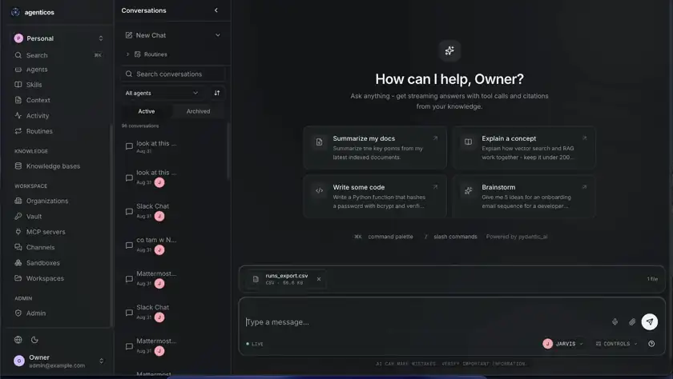
</video>

</div>

## ⚡ Quick start

One command. It checks what your machine is missing and tells you how to get it,
asks four questions, and hands back a console with a working agent in it. Nothing
leaves your machine.

```bash
curl -fsSL https://raw.githubusercontent.com/vstorm-co/agenticos/main/scripts/quickstart.sh | bash
```

<details>
<summary><b>macOS</b></summary>

Docker Desktop or [OrbStack](https://orbstack.dev), then:

```bash
xcode-select --install
```

</details>

<details>
<summary><b>Linux</b></summary>

```bash
curl -fsSL https://get.docker.com | sh
sudo apt install make git python3 docker-compose-plugin
```

</details>

<details>
<summary><b>Windows</b></summary>

Through WSL2. In an administrator PowerShell:

```powershell
wsl --install
```

Then Docker Desktop with WSL2 integration on, and run the installer inside the
Ubuntu shell it gives you.

</details>

### What it asks

| | |
|---|---|
| **Which model** | OpenAI, Anthropic, Google, OpenRouter — or *decide later*, which creates everything and lets you paste a key in the console |
| **Your key** | Typed hidden, stored encrypted in your own database, never printed back |
| **Your login and organization name** | Defaults are fine for a look around |
| **Two switches** | Start the web console; mirror the public MCP registry so 5,703 tool servers are searchable by name |

Add `--check` to only find out what is missing, `--dry-run` to see every command
it would run without running one, or drive it unattended:

```bash
curl -fsSL https://raw.githubusercontent.com/vstorm-co/agenticos/main/scripts/quickstart.sh | bash -s -- \
  --yes --provider anthropic --api-key sk-ant-... --org "Acme"
```

### Or type the four commands yourself

The installer is a wrapper around these, and there is no step it takes that you
cannot take by hand:

```bash
git clone https://github.com/vstorm-co/agenticos && cd agenticos
make dev                                          # postgres (pgvector), redis, api, prefect, sandbox
make dev-frontend                                 # the console — a separate compose file
make platform-bootstrap BOOTSTRAP_API_KEY=sk-...  # an org, an owner, a key, a model, a published agent
open http://localhost:3000                        # sign in as admin@example.com / admin123
```

There is no `.env` to write first: every compose variable has a default, and the
one secret that cannot have one (`SANDBOXD_TOKEN`) is generated into
`backend/.env` for you. If something does not come up, `make doctor` answers the
only question that matters — can this deployment actually run an agent — and
[docs/install.md](docs/install.md) has the rest.

## What you get

- 🏗️ **Built by whoever knows the answer.** Instructions, a model, capabilities
  and limits, edited in a browser and published as a version. Changing what an
  agent says is not a pull request, a review and a release.
- 🧰 **Agents that do the work.** Retrieval over your own documents, a real
  browser, Python in a sandbox with files and a shell, charts, images, delegation
  — and [any MCP server by URL](docs/mcp.md): 99 checked, 5,703 more mirrored
  from the public registry.
- 🔌 **Everywhere, from one runner.** Web chat, a hosted page with no login, an
  embeddable widget, the HTTP API, a raw WebSocket, Slack, Telegram, Mattermost,
  and schedules that need nobody typing.
- 🛡️ **Governed, because forty agents need it.** Budgets that stop a run before
  the model request, approval on anything side-effecting, an audit trail, and
  tenant isolation enforced by the schema.

**Code defines, configuration composes.** A business team assembles agents in a
browser and never opens Python; engineers extend what there is to assemble, and
configuration can only ever reach what code registered. The ceiling is the
registry, not a config file — and it is Apache-2.0, on your hardware.

## What it looks like

### Inside one agent

An agent is a form, not a codebase: instructions, a model, tools, limits.
Nothing ships until **Publish**.

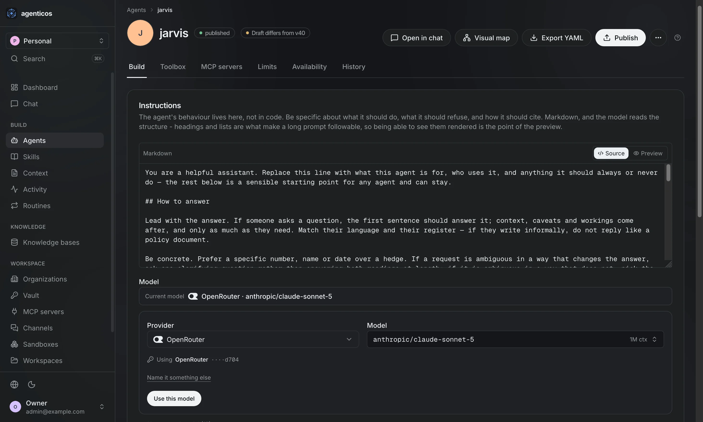

<table>
<tr>
<td width="50%">

**Toolbox** — What the agent may do, as switches — your documents, a browser, Python, charts, delegation. Each one can require a person's approval first. This is the **AI harness**, assembled in a form.

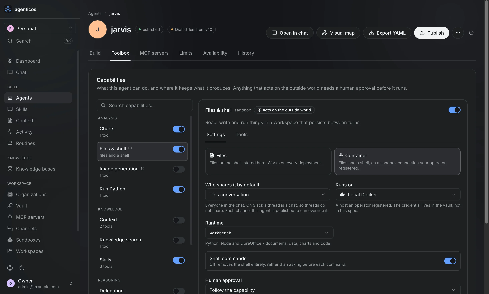

</td>
<td width="50%">

**Visual map** — The agent as a graph: what reaches it, what it reaches for. A dashed box is something nobody attached.

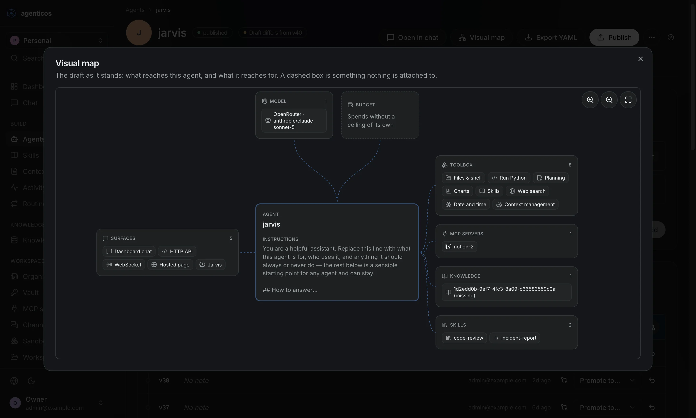

</td>
</tr>
<tr>
<td width="50%">

**Limits** — A monthly cap per agent, checked *before* each model call rather than added up after — plus a step limit, for the loop that is cheap and never stops.

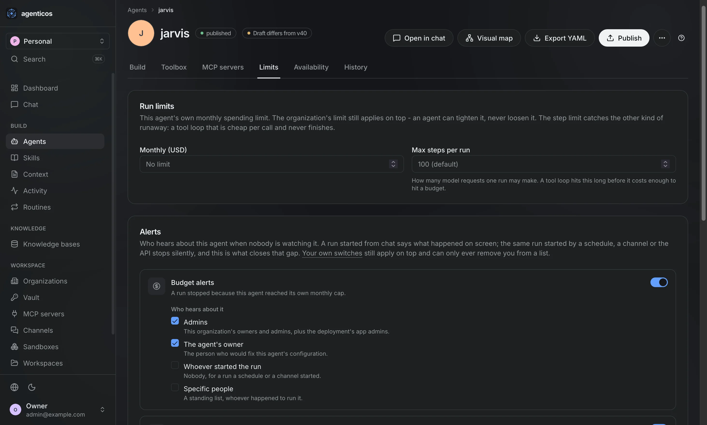

</td>
<td width="50%">

**History** — Every version it has had, still readable. Rolling back is a click.

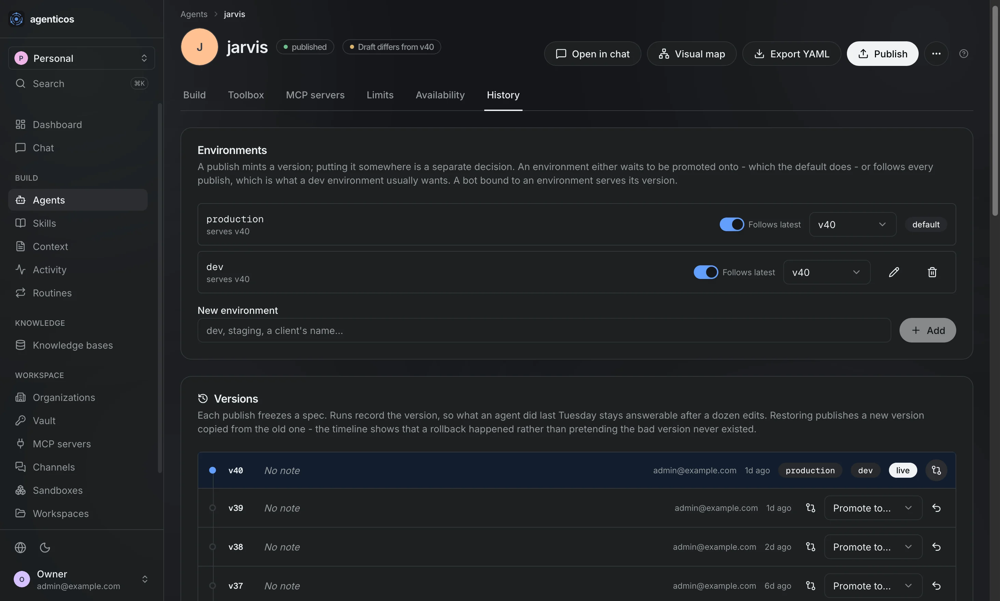

</td>
</tr>
</table>

<sub>These four are dark only — the light half has not been captured.</sub>

### Running forty of them

<table>
<tr>
<td width="50%">

**Agents** — Every agent you run, with the version that is live and who may use it.

<picture>
  <source media="(prefers-color-scheme: dark)" srcset="docs/assets/screens/dark/agents.webp">
  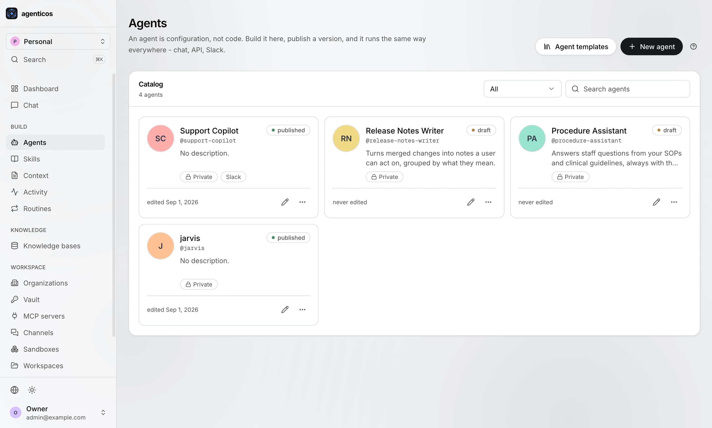
</picture>

</td>
<td width="50%">

**Templates** — Start from one built for your industry; you get a draft to adjust and publish.

<picture>
  <source media="(prefers-color-scheme: dark)" srcset="docs/assets/screens/dark/agents-templates-dialog.webp">
  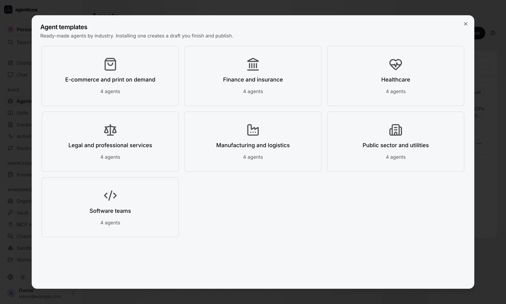
</picture>

</td>
</tr>
<tr>
<td width="50%">

**One answer, opened up** — Every answer recorded: the question, what it looked at, every tool call, the duration, the cost to a fraction of a cent.

<picture>
  <source media="(prefers-color-scheme: dark)" srcset="docs/assets/screens/dark/activity-run-detail.webp">
  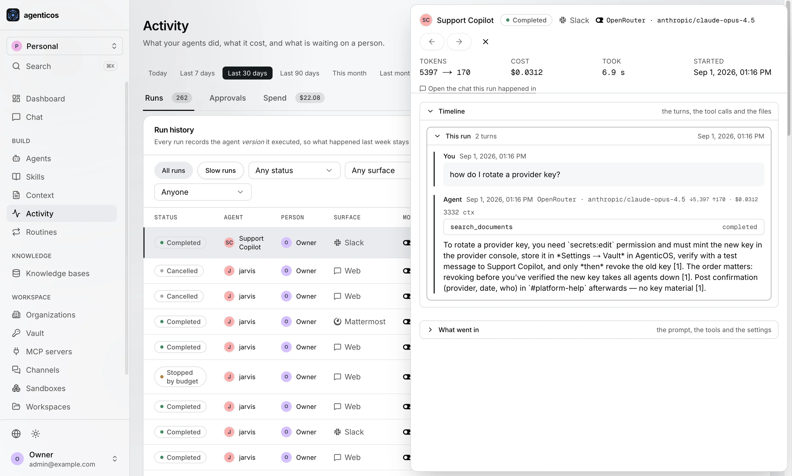
</picture>

</td>
<td width="50%">

**How your documents are read** — Three PDF readers — PyMuPDF, LiteParse, LlamaParse — plus chunking and OCR. Per collection, overridable on the next file. A scanned price list and a contract do not want the same one.

<picture>
  <source media="(prefers-color-scheme: dark)" srcset="docs/assets/screens/dark/knowledge-base-upload-parsing-dialog.webp">
  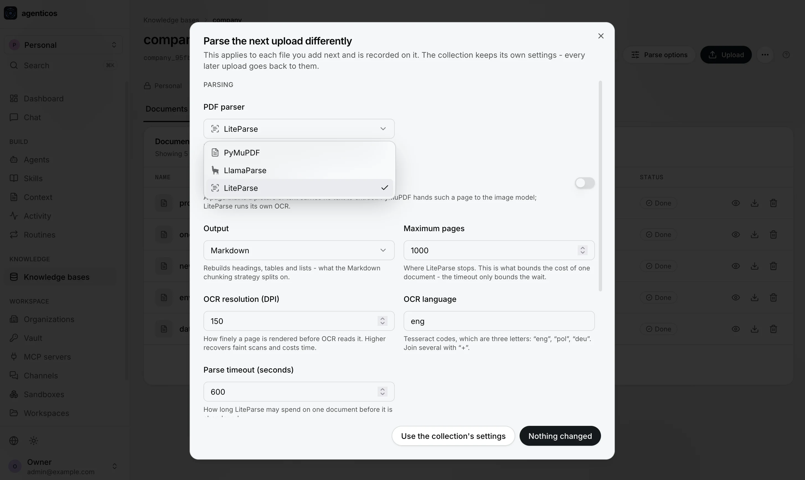
</picture>

</td>
</tr>
<tr>
<td width="50%">

**Context** — Standing facts — product names, policy, house tone — in one place instead of forty prompts.

<picture>
  <source media="(prefers-color-scheme: dark)" srcset="docs/assets/screens/dark/context.webp">
  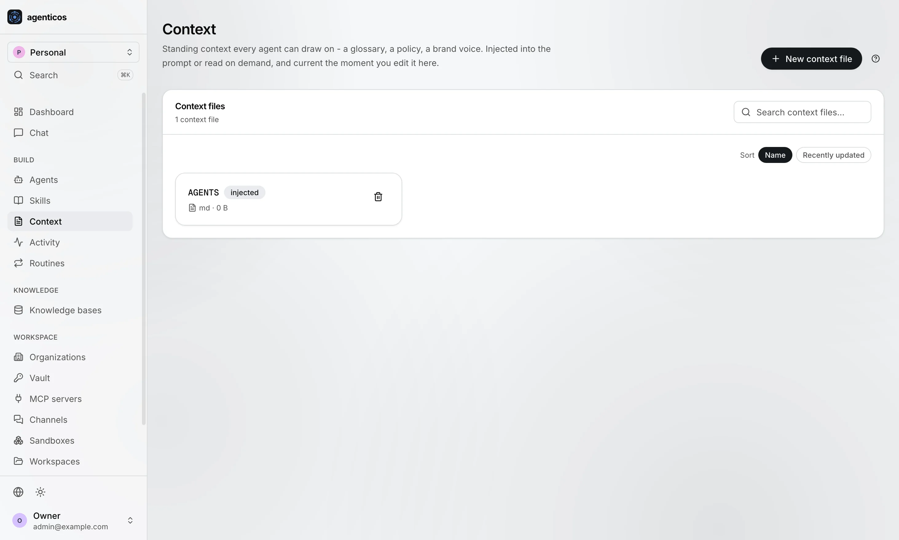
</picture>

</td>
<td width="50%">

**It asks before it acts** — Anything that sends, files or refunds waits for a person, with the intended action written out. Decided exactly once.

<picture>
  <source media="(prefers-color-scheme: dark)" srcset="docs/assets/screens/dark/activity-approvals.webp">
  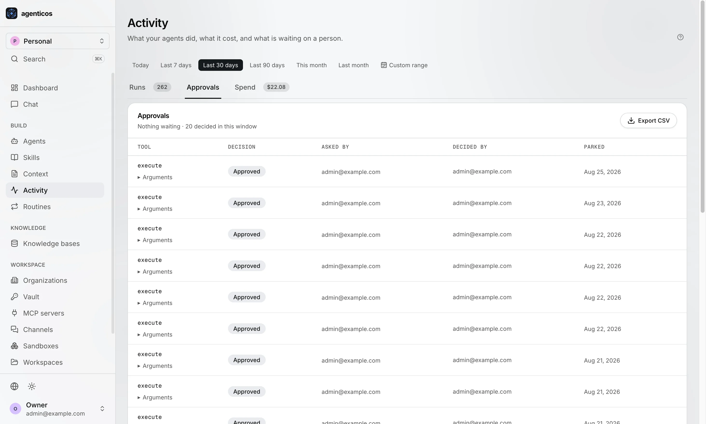
</picture>

</td>
</tr>
<tr>
<td width="50%">

**What it costs** — Spend by period and by agent. The cap is checked before the model is asked, so a runaway stops mid-sentence instead of arriving as an invoice.

<picture>
  <source media="(prefers-color-scheme: dark)" srcset="docs/assets/screens/dark/activity-spend.webp">
  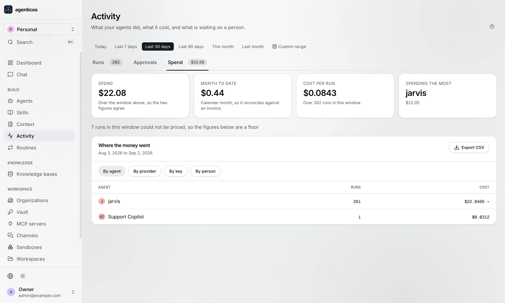
</picture>

</td>
<td width="50%">

**Keys and credentials** — Every key, encrypted and separated per team. Replaceable, never readable again — including by whoever runs the server.

<picture>
  <source media="(prefers-color-scheme: dark)" srcset="docs/assets/screens/dark/vault.webp">
  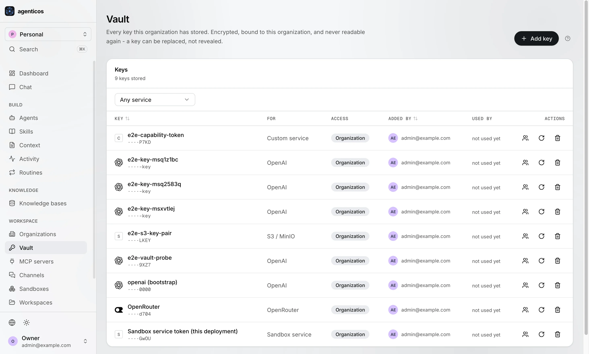
</picture>

</td>
</tr>
<tr>
<td width="50%">

**The tools you already pay for** — Any MCP server by URL: 99 checked with their OAuth wired, plus 5,703 mirrored from the public registry and searchable by name. No connector to write.

<picture>
  <source media="(prefers-color-scheme: dark)" srcset="docs/assets/screens/dark/mcp-servers.webp">
  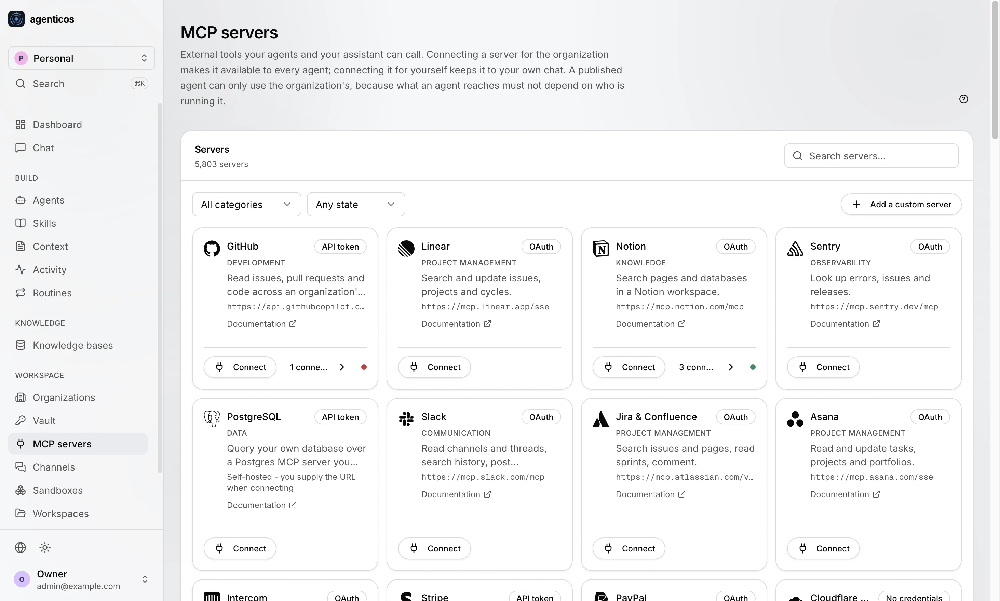
</picture>

</td>
<td width="50%">

**Where people meet it** — Slack, Telegram, Mattermost, a website widget, your own software over the API. Published once; same limits everywhere.

<picture>
  <source media="(prefers-color-scheme: dark)" srcset="docs/assets/screens/dark/channels.webp">
  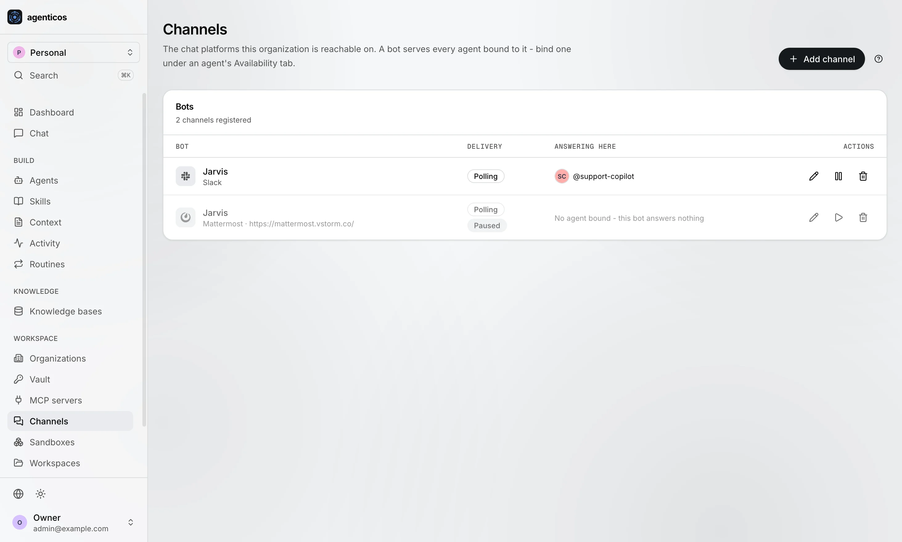
</picture>

</td>
</tr>


<sub>Screenshots follow your GitHub theme. <a href="docs/screens.md">All 35 screens</a>.</sub>

## Why it is called an operating system

The word is a specification here, not a label. An operating system does seven
things, and each row is a mechanism you can read in the source.

| What an operating system does | What AgenticOS does |
|---|---|
| **Runs and isolates processes** | Runs agents, stops one at its budget, isolates tenants in the schema rather than in service code, and keeps every run with what it cost |
| **Enforces resource limits** - quota, cgroups | Monthly budgets per agent, checked *before* each model request rather than tallied afterwards. A run that fails still records what it spent |
| **Controls access** - users, permissions, `sudo` | A [permission catalog](docs/permissions.md) in code, roles composed from it, per-resource grants that widen and never narrow. `approval: required` is the `sudo`: a tool that acts on the outside world waits for a person |
| **Reaches hardware through drivers** | One interface to [27 model providers](docs/models.md) and to [any MCP server by URL](docs/mcp.md). Change a model profile and every agent using it moves, without one of them being republished |
| **Keeps a filesystem** | [Collections, skills and attached context](docs/file-processing.md) in your own Postgres, with embeddings keyed per organization |
| **Gives many interfaces one shell** | One runner behind web chat, the HTTP API, Slack, Telegram, a widget, a hosted page and a schedule. Same budget, same approval gate, same audit trail |
| **Writes an audit log** - syslog, auditd | Who ran what, when, what it cost and who approved it. Written even when the run failed |

Apply the same seven to anything else in the category. That is the test we would
like to be judged on, and
[When to use something else](docs/about/comparison.md) is where we run it against
the alternatives - including the rows where the honest answer here is "not yet".

Apply the same seven to anything else in the category. That is the test we would
like to be judged on, and
[When to use something else](docs/about/comparison.md) runs it against the
alternatives — including the rows where the honest answer here is "not yet".

## What an agent can do

Switched on per agent, in the Builder. Each carries its own settings, its own
permission scope and — where it acts on the outside world — its own approval gate.

| | |
|---|---|
| **Answer from your documents** | Retrieval over collections in your own Postgres, plus [skills](docs/skills.md) it loads on demand and [context files](docs/context.md) bound across agents |
| **Go and find out** | Web search, fetch one page properly, or drive a **real browser** through a site that needs clicking |
| **Do the work** | Run Python, keep a [sandbox](docs/sandbox.md) with files and a shell, draw charts, generate images |
| **Handle what is too big for one answer** | Delegate to subagents, keep a task list, think longer, compact a long conversation |
| **Stay inside the lines** | Guardrails that redact or block, per-tool output caps, and the clock |
| **Anything else** | [Any MCP server by URL](docs/mcp.md) - 99 checked with their OAuth flows wired, plus 5,703 mirrored from the public registry, and no connector to write |

## Where it answers

Publish once. The same runner serves all of these, so an answer does not depend
on where the question came from.

| | |
|---|---|
| **Web chat** | In the console, with attachments and slash commands |
| **A hosted page** | `/e/{key}` - send somebody a link, no account needed |
| **An embeddable widget** | On your own site, with variables from the address bar |
| **The HTTP API** | [One POST and you have an answer](docs/api.md) |
| **A raw WebSocket** | Stream tokens into a frontend you built yourself |
| **Slack, Telegram, Mattermost** | Where an `@mention` runs as **the person who sent it**, not as the bot |
| **Schedules and triggers** | A clock, a webhook, or a mailbox we poll - [routines](docs/triggers.md) |

## Compared with the alternatives

The only one of these you can run to completion on infrastructure you already
own, with agents a non-engineer edits and an accountant can audit.

| | **AgenticOS** | Cloudflare&nbsp;OS | Glean | A&nbsp;library |
|---|:---:|:---:|:---:|:---:|
| Open source | ✅ Apache-2.0 | ✅ Apache-2.0 | — | ✅ |
| **Runs on ordinary infrastructure** (Postgres, Redis, Docker) | ✅ | — | — | ✅ |
| Runs air-gapped, no vendor account | ✅ | — | — | ✅ |
| Local models (Ollama, LiteLLM) | ✅ | ✅ | — | ✅ |
| Agent built and edited by a non-engineer | ✅ | ~ | ✅ | — |
| Versioned on publish, exportable into your git | ✅ | ~ | — | — |
| Budget that stops a run before the model call | ✅ | ~ | ~ | DIY |
| Human approval on side-effecting tools | ✅ | ✅ | ~ | DIY |
| Multi-tenant isolation in the schema | ✅ | ~ | ✅ | DIY |
| Per-organization secret vault | ✅ | ✅ | ✅ | DIY |
| **Any MCP server by URL, 99 checked + 5,703 mirrored** | ✅ | ✅ | ~ | ~ |
| **Slack, Telegram, widget, hosted page and API from one runner** | ✅ | — | ~ | DIY |
| ACL-aware connectors to 275+ SaaS systems | — | ~ | ✅ | — |
| Evaluation harness | — | — | ✅ | ~ |
| SAML / SCIM | — | ✅ | ✅ | — |

<sub>✅ first-class · ~ partial or via configuration · — not available · DIY you wire it yourself.
"A library" means LangGraph, Pydantic AI or similar. Reflects each project as of 2026-08;
corrections welcome via PR. The last three rows are ours to fix and are on the
<a href="https://github.com/vstorm-co/agenticos/blob/main/docs/ROADMAP.md">roadmap</a>.</sub>

## Why it exists

Most agent frameworks give you a library. You write Python, you deploy it, and
every change to an agent's behaviour is a pull request, a review and a release.
That is the right shape for a product feature and the wrong shape for the forty
small agents a company actually wants — because the person who knows what the
agent should say is not the person with commit access.

AgenticOS moves the agent out of the code and puts governance around it instead.
[Secrets](docs/secrets.md) are sealed per organization: a key copied from one
tenant's database row cannot be decrypted for another, and no API response ever
returns one.

## Docs

| | |
|---|---|
| [Install](docs/install.md) · [Your first agent](docs/first-agent.md) | From nothing to an agent that answers |
| [Concepts](docs/concepts.md) | Spec, version, exposure, trigger, run — the five nouns |
| [Permissions](docs/permissions.md) · [Governance](docs/governance.md) | Who may do what; budgets, approvals, audit |
| [Capabilities](docs/reference/capabilities.md) · [MCP](docs/mcp.md) | What an agent can do, and how to add a tool |
| [Models](docs/models.md) · [Secrets](docs/secrets.md) | Providers, profiles, cost; the vault |
| [Knowledge](docs/file-processing.md) · [Skills](docs/skills.md) | Parsers, chunking, OCR; written know-how |
| [Channels](docs/channels.md) · [API](docs/api.md) | Slack, Telegram, widget, WebSocket, HTTP |
| [Architecture](docs/architecture.md) · [Testing](docs/testing.md) | How it is built, and how it is verified |

Built with MkDocs: `make docs` serves them on :8001. Stack, in one line: FastAPI
+ Pydantic v2, PostgreSQL with pgvector, Redis, Prefect,
[Pydantic AI](https://ai.pydantic.dev), Next.js 15. Nothing phones home — the
only outbound calls are the ones your agents make.

## Contributing

`make check` before a pull request: every CI job except e2e, about five minutes.
New behaviour ships with a test; a bug ships with a regression test. The
**platform layer is held at 100% coverage** and CI fails below it.

Three things that trip up a first change: a tool is code and an agent is not
(there is no `@agent.tool` — a capability registers, and then it is a switch in
everybody's Builder); `require(...)` gates go on collection routes only; and if
the tool already exists as an MCP server, write none.
[CONTRIBUTING.md](CONTRIBUTING.md) has the rest, [`.claude/`](.claude/README.md)
has the same conventions written for a machine, and good first issues are
[labelled here](https://github.com/vstorm-co/agenticos/labels/good%20first%20issue).

<details>
<summary><b>The rest of the Vstorm OSS ecosystem</b></summary>

Everything below runs on [Pydantic AI](https://ai.pydantic.dev).

| Project | What it is | |
|---|---|---|
| **[full-stack-ai-agent-template](https://github.com/vstorm-co/full-stack-ai-agent-template)** | The generator AgenticOS was built from — FastAPI + Next.js 15, RAG, streaming, auth, 20+ integrations | [](https://github.com/vstorm-co/full-stack-ai-agent-template) |
| **[pydantic-deepagents](https://github.com/vstorm-co/pydantic-deepagents)** | Open-source, self-hosted Claude Code — a terminal assistant and the framework behind it | [](https://github.com/vstorm-co/pydantic-deepagents) |
| **[pydantic-ai-shields](https://github.com/vstorm-co/pydantic-ai-shields)** | Guardrails — cost tracking, prompt-injection detection, PII filtering, secret redaction | [](https://github.com/vstorm-co/pydantic-ai-shields) |
| **[subagents-pydantic-ai](https://github.com/vstorm-co/subagents-pydantic-ai)** | Nested subagent delegation, parallel execution, task cancellation | [](https://github.com/vstorm-co/subagents-pydantic-ai) |
| **[pydantic-ai-backend](https://github.com/vstorm-co/pydantic-ai-backend)** | File storage and Docker-isolated sandboxes, with a permission system | [](https://github.com/vstorm-co/pydantic-ai-backend) |
| **[pydantic-ai-todo](https://github.com/vstorm-co/pydantic-ai-todo)** | Hierarchical task planning with PostgreSQL storage and an event system | [](https://github.com/vstorm-co/pydantic-ai-todo) |
| **[production-stack-skills](https://github.com/vstorm-co/production-stack-skills)** | Skill pack that turns a coding agent into a senior production engineer | [](https://github.com/vstorm-co/production-stack-skills) |
| **[content-skills](https://github.com/vstorm-co/content-skills)** | Content studio skill pack for coding agents — brand-aware, with built-in anti-slop | [](https://github.com/vstorm-co/content-skills) |

Browse them all at **[oss.vstorm.co](https://oss.vstorm.co)**.

Browse them all at **[oss.vstorm.co](https://oss.vstorm.co)**.

</details>

## Licence

Apache License 2.0 - see [`LICENSE`](LICENSE) and [`NOTICE`](NOTICE).

Apache-2.0 rather than MIT because AgenticOS is meant to be deployed inside other
companies: the explicit patent grant is the part their legal review asks about,
and MIT is silent on it.

---

<div align="center">

### Need help putting agents into production?

<p>
We are <a href="https://vstorm.co"><b>Vstorm</b></a> — an applied agentic AI engineering
consultancy with 30+ production agent implementations.<br>
AgenticOS is what we build them on, and we deploy it inside client
infrastructure: your cloud, your data centre, or air-gapped.
</p>

<a href="https://vstorm.co/contact-us/">
  
</a>

<br><br>

Built with care by <a href="https://vstorm.co"><b>Vstorm</b></a> ·
<a href="https://oss.vstorm.co">oss.vstorm.co</a>

</div>

---

<div align="center">

### Need help putting agents into production?

<p>
We are <a href="https://vstorm.co"><b>Vstorm</b></a> — an applied agentic AI engineering
consultancy with 30+ production agent implementations.<br>
AgenticOS is what we build them on, and we deploy it inside client
infrastructure: your cloud, your data centre, or air-gapped.
</p>

<a href="https://vstorm.co/contact-us/">
  
</a>

<br><br>

Built with care by <a href="https://vstorm.co"><b>Vstorm</b></a> ·
<a href="https://oss.vstorm.co">oss.vstorm.co</a>

</div>
