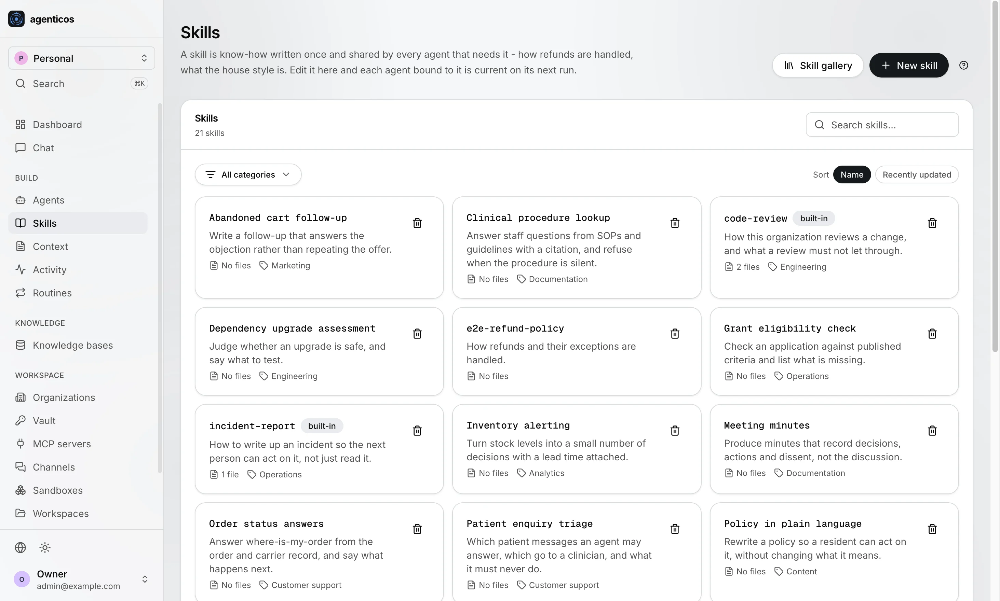
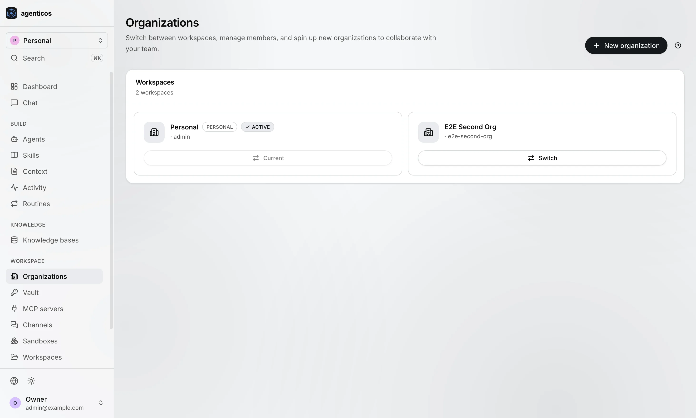

<div align="center">


<h1>AgenticOS</h1>

<p>
  <b>The operating system for your company's AI agents.</b><br>
  Processes, permissions, resource limits, drivers and an audit log.<br>
  <b>Self-hosted</b>, open source, and yours — on your Postgres, in your Docker, under your domain.
</p>

<p>
  <a href="docs/index.md">Docs</a> &middot;
  <a href="docs/install.md">Install</a> &middot;
  <a href="docs/first-agent.md">Your first agent</a> &middot;
  <a href="#-what-makes-it-an-operating-system">Why it is an OS</a> &middot;
  <a href="#-what-an-agent-can-actually-do">What agents can do</a> &middot;
  <a href="#-why-agenticos">Comparison</a> &middot;
  <a href="docs/mcp.md">Integrations</a> &middot;
  <a href="CHANGELOG.md">Changelog</a> &middot;
  <a href="llms.txt">llms.txt</a>
</p>

<p>
  <a href="https://github.com/vstorm-co/agenticos/actions/workflows/ci.yml"></a>
  <a href="https://github.com/vstorm-co/agenticos/releases"></a>
  <a href="docs/testing.md"></a>
  <a href="docs/index.md"></a>
  <a href="LICENSE"></a>
  <a href="SECURITY.md"></a>
  <a href="https://github.com/vstorm-co/agenticos/stargazers"></a>
</p>

<p>
  <a href="backend/pyproject.toml"></a>
  <a href="backend/pyproject.toml"></a>
  <a href="https://ai.pydantic.dev"></a>
  <a href="frontend/package.json"></a>
  <a href="docker-compose.yml"></a>
  <a href="https://modelcontextprotocol.io"></a>
</p>

</div>

---

**A company ends up with agents in five places** — one in a vendor's console, one
somebody wrote in LangChain, one inside a SaaS product — and nobody can answer
four questions: *what agents do we run, what did they cost, what did they touch,
and who said they could.*

AgenticOS is one place to build them and one set of books for all of them.

- 🏗️ **Built by whoever knows the answer.** Instructions, a model, capabilities
  and limits, edited in a browser and published as a version. Changing what an
  agent says is not a pull request, a review and a release.
- 🧰 **Agents that do the work, not just talk about it.** Retrieval over your own
  documents, a real browser, Python in a sandbox with files and a shell, charts,
  images, delegation to subagents - and any of
  [any MCP server by URL](docs/mcp.md) — 99 checked by us, and 5,703 more
  mirrored from the public registry and searchable by name.
- 🔌 **Everywhere, from one runner.** Web chat, a hosted page with no login, an
  embeddable widget, the HTTP API, a raw WebSocket to build your own frontend,
  Slack, Telegram, Mattermost, and schedules that need nobody typing.
- 🛡️ **Governed, because forty agents need it.** Budgets that stop a run before
  the model request, approval on anything side-effecting, an audit trail, and
  tenant isolation enforced by the schema.

**Code defines, configuration composes.** A business team assembles agents in a
browser and never opens Python; engineers extend what there is to assemble - a
capability is typed, tested code in this repository, and adding one makes it a
switch in everybody's Builder. Configuration can only ever reach what code
registered, which is what makes a no-code Builder safe to hand to somebody who
is not an engineer.

So the ceiling is not a config file. It is whatever your engineers put in the
registry - and it is Apache-2.0, on your hardware, so that includes whatever you
write for your own use case.

## What it looks like

A spreadsheet dropped into the chat, one sentence asking for charts. The agent
writes the code, runs it in a locked box, and answers with the charts and what
they say.

<div align="center">

<video src="https://github.com/user-attachments/assets/4d97bc60-f7be-43f2-97fe-cc4e0765e8ed" controls muted loop playsinline width="100%">
  
</video>

</div>

### Inside one agent

An agent is a form, not a codebase: instructions, a model, tools, limits.
Nothing ships until **Publish** — here v40 is live while a draft is still open.


<table>
<tr>
<td width="50%">

**Toolbox** — What the agent may do, as switches — your documents, a browser, Python, charts, delegation. Each one can require a person's approval first. This is the **AI harness**, assembled in a form.


</td>
<td width="50%">

**Visual map** — The agent as a graph: what reaches it, what it reaches for. A dashed box is something nobody attached.


</td>
</tr>
<tr>
<td width="50%">

**Limits** — A monthly cap per agent, checked *before* each model call rather than added up after — plus a step limit, for the loop that is cheap and never stops.


</td>
<td width="50%">

**History** — Every version it has had, still readable. Rolling back is a click.


</td>
</tr>
</table>

<sub>These four are dark only — the light half has not been captured.</sub>

### Everything else it takes to run forty of them

<table>
<tr>
<td width="50%">

**Agents** — Every agent you run, with the version that is live and who may use it.

<picture>
  <source media="(prefers-color-scheme: dark)" srcset="docs/assets/screens/dark/agents.webp">
  
</picture>

</td>
<td width="50%">

**Templates** — Start from one built for your industry; you get a draft to adjust and publish.

<picture>
  <source media="(prefers-color-scheme: dark)" srcset="docs/assets/screens/dark/agents-templates-dialog.webp">
  
</picture>

</td>
</tr>
<tr>
<td width="50%">

**One answer, opened up** — Every answer recorded: the question, what it looked at, every tool call, the duration, the cost to a fraction of a cent.

<picture>
  <source media="(prefers-color-scheme: dark)" srcset="docs/assets/screens/dark/activity-run-detail.webp">
  
</picture>

</td>
<td width="50%">

**How your documents are read** — Three PDF readers — PyMuPDF, LiteParse, LlamaParse — plus chunking and OCR. Per collection, overridable on the next file. A scanned price list and a contract do not want the same one.

<picture>
  <source media="(prefers-color-scheme: dark)" srcset="docs/assets/screens/dark/knowledge-base-upload-parsing-dialog.webp">
  
</picture>

</td>
</tr>
<tr>
<td width="50%">

**Your documents** — A folder an agent may read. Upload, then say which agents see which folders.

<picture>
  <source media="(prefers-color-scheme: dark)" srcset="docs/assets/screens/dark/knowledge-base-detail.webp">
  
</picture>

</td>
<td width="50%">

**Skills** — A procedure written once in plain language, used by every agent bound to it. Edit here; live on the next answer, with no release.

<picture>
  <source media="(prefers-color-scheme: dark)" srcset="docs/assets/screens/dark/skills.webp">
  
</picture>

</td>
</tr>
<tr>
<td width="50%">

**Context** — Standing facts — product names, policy, house tone — in one place instead of forty prompts.

<picture>
  <source media="(prefers-color-scheme: dark)" srcset="docs/assets/screens/dark/context.webp">
  
</picture>

</td>
<td width="50%">

**It asks before it acts** — Anything that sends, files or refunds waits for a person, with the intended action written out. Decided exactly once.

<picture>
  <source media="(prefers-color-scheme: dark)" srcset="docs/assets/screens/dark/activity-approvals.webp">
  
</picture>

</td>
</tr>
<tr>
<td width="50%">

**What it costs** — Spend by period and by agent. The cap is checked before the model is asked, so a runaway stops mid-sentence instead of arriving as an invoice.

<picture>
  <source media="(prefers-color-scheme: dark)" srcset="docs/assets/screens/dark/activity-spend.webp">
  
</picture>

</td>
<td width="50%">

**Keys and credentials** — Every key, encrypted and separated per team. Replaceable, never readable again — including by whoever runs the server.

<picture>
  <source media="(prefers-color-scheme: dark)" srcset="docs/assets/screens/dark/vault.webp">
  
</picture>

</td>
</tr>
<tr>
<td width="50%">

**The tools you already pay for** — Any MCP server by URL: 99 checked with their OAuth wired, plus 5,703 mirrored from the public registry and searchable by name. No connector to write.

<picture>
  <source media="(prefers-color-scheme: dark)" srcset="docs/assets/screens/dark/mcp-servers.webp">
  
</picture>

</td>
<td width="50%">

**Where people meet it** — Slack, Telegram, Mattermost, a website widget, your own software over the API. Published once; same limits everywhere.

<picture>
  <source media="(prefers-color-scheme: dark)" srcset="docs/assets/screens/dark/channels.webp">
  
</picture>

</td>
</tr>
<tr>
<td width="50%">

**Work nobody has to start** — Schedules and event triggers — the 07:00 triage, the Monday summary. Same limits, same record.

<picture>
  <source media="(prefers-color-scheme: dark)" srcset="docs/assets/screens/dark/routines.webp">
  
</picture>

</td>
<td width="50%">

**Where code runs** — Code the agent writes runs in a locked box with its own files, not on your servers. Readable afterwards.

<picture>
  <source media="(prefers-color-scheme: dark)" srcset="docs/assets/screens/dark/sandboxes.webp">
  
</picture>

</td>
</tr>
<tr>
<td width="50%">

**Teams, kept apart** — Many teams or clients on one install. The separation is in the database schema, not in the application remembering.

<picture>
  <source media="(prefers-color-scheme: dark)" srcset="docs/assets/screens/dark/organizations.webp">
  
</picture>

</td>
<td width="50%">

**One screen for the morning** — What ran, what it cost, what is waiting, what is unhealthy. Each card only shows for people allowed to see it.

<picture>
  <source media="(prefers-color-scheme: dark)" srcset="docs/assets/screens/dark/dashboard.webp">
  
</picture>

</td>
</tr>
</table>

<sub>Screenshots follow your GitHub theme. <a href="docs/screens.md">All 35 screens</a>.</sub>

## ⚡ Get it running

One command. It checks what your machine is missing and tells you how to get it,
asks four questions, and hands back a console with a working agent in it. Nothing
leaves your machine.

```bash
curl -fsSL https://raw.githubusercontent.com/vstorm-co/agenticos/main/scripts/quickstart.sh | bash
```

<table>
<tr><td width="33%">

**macOS**

Docker Desktop or [OrbStack](https://orbstack.dev). `git`, `make` and `python3`
come with the Xcode command line tools:

```bash
xcode-select --install
```

</td><td width="33%">

**Linux**

Docker, and the compose plugin:

```bash
curl -fsSL https://get.docker.com | sh
sudo apt install make git python3 \
     docker-compose-plugin
```

</td><td width="33%">

**Windows**

Through WSL2, which is one command in an administrator PowerShell:

```powershell
wsl --install
```

Then Docker Desktop with WSL2 integration on, and run the installer inside the
Ubuntu shell.

</td></tr>
</table>

**`uv` and `bun` are not needed.** They are for working *on* AgenticOS; the stack
and the console both run as containers.

### What it asks

| | |
|---|---|
| **Which model** | OpenAI, Anthropic, Google, OpenRouter — or *decide later*, which creates everything and lets you paste a key in the console |
| **Your key** | Typed hidden, stored encrypted in your own database, never printed back |
| **Your login and organization name** | Defaults are fine for a look around |
| **Two switches** | Start the web console; mirror the public MCP registry so 5,703 tool servers are searchable by name |

Add `--check` to only find out what is missing, `--dry-run` to see every command
it would run without running one, or drive it unattended:

```bash
curl -fsSL https://raw.githubusercontent.com/vstorm-co/agenticos/main/scripts/quickstart.sh | bash -s -- \
  --yes --provider anthropic --api-key sk-ant-... --org "Acme"
```

### Or type the four commands yourself

The installer is a wrapper around these, and there is no step it takes that you
cannot take by hand:

```bash
git clone https://github.com/vstorm-co/agenticos && cd agenticos
make dev                                          # postgres (pgvector), redis, api, prefect, sandbox
make dev-frontend                                 # the console — a separate compose file
make platform-bootstrap BOOTSTRAP_API_KEY=sk-...  # an org, an owner, a key, a model, a published agent
open http://localhost:3000                        # sign in as admin@example.com / admin123
```

There is no `.env` to write first: every compose variable has a default, and the
one secret that cannot have one (`SANDBOXD_TOKEN`) is generated into
`backend/.env` for you. If something does not come up, `make doctor` answers the
only question that matters — can this deployment actually run an agent — and
[docs/install.md](docs/install.md) has the rest.

## 🧩 What makes it an operating system

Plenty of things in this category are called an OS. Here the word is a
specification rather than a label: an operating system does seven things, and
each row below is a mechanism you can read in the source.

| What an operating system does | What AgenticOS does |
|---|---|
| **Runs and isolates processes** | Runs agents, stops one at its budget, isolates tenants in the schema rather than in service code, and keeps every run with what it cost |
| **Enforces resource limits** - quota, cgroups | Monthly budgets per agent, checked *before* each model request rather than tallied afterwards. A run that fails still records what it spent |
| **Controls access** - users, permissions, `sudo` | A [permission catalog](docs/permissions.md) in code, roles composed from it, per-resource grants that widen and never narrow. `approval: required` is the `sudo`: a tool that acts on the outside world waits for a person |
| **Reaches hardware through drivers** | One interface to [27 model providers](docs/models.md) and to [any MCP server by URL](docs/mcp.md). Change a model profile and every agent using it moves, without one of them being republished |
| **Keeps a filesystem** | [Collections, skills and attached context](docs/file-processing.md) in your own Postgres, with embeddings keyed per organization |
| **Gives many interfaces one shell** | One runner behind web chat, the HTTP API, Slack, Telegram, a widget, a hosted page and a schedule. Same budget, same approval gate, same audit trail |
| **Writes an audit log** - syslog, auditd | Who ran what, when, what it cost and who approved it. Written even when the run failed |

Apply the same seven to anything else in the category. That is the test we would
like to be judged on, and
[When to use something else](docs/about/comparison.md) is where we run it against
the alternatives - including the rows where the honest answer here is "not yet".

## 🧰 What an agent can actually do

Switched on per agent, in the Builder. Each carries its own settings, its own
permission scope and - where it acts on the outside world - its own approval
gate.

| | |
|---|---|
| **Answer from your documents** | Retrieval over collections in your own Postgres, plus [skills](docs/skills.md) it loads on demand and [context files](docs/context.md) bound across agents |
| **Go and find out** | Web search, fetch one page properly, or drive a **real browser** through a site that needs clicking |
| **Do the work** | Run Python, keep a [sandbox](docs/sandbox.md) with files and a shell, draw charts, generate images |
| **Handle what is too big for one answer** | Delegate to subagents, keep a task list, think longer, compact a long conversation |
| **Stay inside the lines** | Guardrails that redact or block, per-tool output caps, and the clock |
| **Anything else** | [Any MCP server by URL](docs/mcp.md) - 99 checked with their OAuth flows wired, plus 5,703 mirrored from the public registry, and no connector to write |

## 📚 Retrieval you can actually tune

Most platforms give you one ingestion path and a slider. Here every collection
carries its own settings, and any upload can override them.

| | |
|---|---|
| **Three PDF parsers** | `pymupdf` local and fast, and the only one that extracts embedded images for description · `liteparse` local and layout-aware, keeping tables as ASCII grids rather than flattening them · `llamaparse` a cloud service returning markdown, for scans the local two mangle |
| **Chunking** | `recursive`, `markdown` or `fixed`, with your own size and overlap |
| **OCR** | On demand or automatic, with a language |
| **Images inside documents** | Described by a model profile you choose, with your own prompt |
| **Embeddings** | Per organization, in your own pgvector - a vector written for one tenant cannot be read by another |
| **Sources** | Upload, or sync a Google Drive folder or an S3 bucket on a schedule |

[File processing →](docs/file-processing.md) ·
[The recipe, step by step →](docs/howto/set-up-knowledge-base.md)

## 🔌 Where it answers

Publish once. The same runner serves all of these, so an answer does not depend
on where the question came from.

| | |
|---|---|
| **Web chat** | In the console, with attachments and slash commands |
| **A hosted page** | `/e/{key}` - send somebody a link, no account needed |
| **An embeddable widget** | On your own site, with variables from the address bar |
| **The HTTP API** | [One POST and you have an answer](docs/api.md) |
| **A raw WebSocket** | Stream tokens into a frontend you built yourself |
| **Slack, Telegram, Mattermost** | Where an `@mention` runs as **the person who sent it**, not as the bot |
| **Schedules and triggers** | A clock, a webhook, or a mailbox we poll - [routines](docs/triggers.md) |

## 🆚 Why AgenticOS?

The only one of these you can run to completion on infrastructure you already
own, with agents a non-engineer edits and an accountant can audit.

| | **AgenticOS** | Cloudflare&nbsp;OS | Glean | A&nbsp;library |
|---|:---:|:---:|:---:|:---:|
| Open source | ✅ Apache-2.0 | ✅ Apache-2.0 | — | ✅ |
| **Runs on ordinary infrastructure** (Postgres, Redis, Docker) | ✅ | — | — | ✅ |
| Runs air-gapped, no vendor account | ✅ | — | — | ✅ |
| Local models (Ollama, LiteLLM) | ✅ | ✅ | — | ✅ |
| Agent built and edited by a non-engineer | ✅ | ~ | ✅ | — |
| Versioned on publish, exportable into your git | ✅ | ~ | — | — |
| Budget that stops a run before the model call | ✅ | ~ | ~ | DIY |
| Human approval on side-effecting tools | ✅ | ✅ | ~ | DIY |
| Multi-tenant isolation in the schema | ✅ | ~ | ✅ | DIY |
| Per-organization secret vault | ✅ | ✅ | ✅ | DIY |
| **Any MCP server by URL, 99 checked + 5,703 mirrored** | ✅ | ✅ | ~ | ~ |
| **Slack, Telegram, widget, hosted page and API from one runner** | ✅ | — | ~ | DIY |
| ACL-aware connectors to 275+ SaaS systems | — | ~ | ✅ | — |
| Evaluation harness | — | — | ✅ | ~ |
| SAML / SCIM | — | ✅ | ✅ | — |

<sub>✅ first-class · ~ partial or via configuration · — not available · DIY you wire it yourself.
"A library" means LangGraph, Pydantic AI or similar. Reflects each project as of 2026-08;
corrections welcome via PR. The last three rows are ours to fix and are on the
<a href="https://github.com/vstorm-co/agenticos/blob/main/docs/ROADMAP.md">roadmap</a>.</sub>

## Why

Most agent frameworks give you a library. You write Python, you deploy it, and
every change to an agent's behaviour is a pull request, a review and a release.
That is the right shape for a product feature and the wrong shape for the forty
small agents a company actually wants - because the person who knows what the
agent should say is not the person with commit access.

AgenticOS moves the agent out of the code and puts governance around it instead.

| | |
|---|---|
| **Agents** | Built in a UI, versioned on publish, exportable as YAML into your own git repository |
| **[Capabilities](docs/reference/capabilities.md)** | Retrieval, web search and fetch, a real browser, Python, a sandbox with files and a shell, charts, images, delegation, planning, guardrails - switched on per agent |
| **[Integrations](docs/mcp.md)** | Any MCP server by URL: 99 checked - GitHub, Linear, Notion, Slack, Stripe, Postgres, Sentry - plus 5,703 mirrored from the public registry, searchable by name. No connector to write |
| **[Models](docs/models.md)** | 27 providers, a key per organization, fallback on outage, or self-hosted Ollama and LiteLLM |
| **[Knowledge](docs/file-processing.md)** | Retrieval over your documents with three PDF parsers, your own chunking, OCR and image description - per collection, overridable per upload. Google Drive and S3 sync |
| **[Skills](docs/skills.md)** | Written know-how the agent loads only when it decides it is relevant |
| **[Routines](docs/triggers.md)** | A schedule fires on the clock, a trigger fires on an arrival - a run with the same budget and books as any other |
| **[Governance](docs/governance.md)** | Monthly budgets that stop a run, human approval for anything side-effecting, an audit trail, per-agent alerts |
| **[Surfaces](docs/channels.md)** | Web chat, a hosted page with no login, an embeddable widget, the HTTP API, a raw WebSocket for your own frontend, Slack, Telegram, Mattermost - one runner behind all of them |
| **[Sandbox](docs/sandbox.md)** | A workspace an agent gets files and a shell in, with a record of what it did there |
| **[Access](docs/permissions.md)** | Permission catalog in code, roles composed from it, per-resource sharing |
| **Multi-tenant** | Organization isolation enforced by database constraints, not only by service code |

[Secrets](docs/secrets.md) are sealed per organization: a key copied from one
tenant's database row cannot be decrypted for another, and no API response ever
returns one. `agenticos cmd vault-rotate` walks every envelope in the deployment.

## Stack

| Component | Technology |
|---|---|
| Backend | FastAPI + Pydantic v2 |
| Database | PostgreSQL (async via asyncpg) + pgvector |
| Agent runtime | [Pydantic AI](https://ai.pydantic.dev) |
| Tool protocol | [MCP](https://modelcontextprotocol.io) over streamable HTTP and SSE |
| Auth | JWT + refresh tokens, API keys, Google OAuth, magic links |
| Cache | Redis |
| Background work | Prefect |
| Frontend | Next.js 15 + React 19 + Tailwind v4 |

Nothing phones home. Model prices come from a bundled
[`genai-prices`](https://github.com/pydantic/genai-prices) snapshot, and the only
outbound calls are the ones your agents make.

## 📖 Documentation

The docs are built with MkDocs and live in [`docs/`](docs/).

```bash
make docs         # serve on http://localhost:8001, live reload
make docs-build   # build with --strict, which is what CI runs
```

| | |
|---|---|
| [Concepts](docs/concepts.md) | Spec, version, exposure, trigger, run - the five nouns everything is built from |
| [Permissions](docs/permissions.md) | The three layers, scopes, and how a grant widens access without promoting anybody |
| [Governance](docs/governance.md) | Budgets, approvals, alerts, audit |
| [Capabilities](docs/reference/capabilities.md) | Every capability that ships, its tools, config and scope |
| [MCP](docs/mcp.md) | Connections, the server catalog, OAuth, what is *not* gated |
| [Models](docs/models.md) | Providers, model profiles, fallbacks, how a run is costed |
| [Secrets](docs/secrets.md) | The vault, secret kinds, and what never leaves it |
| [Skills](docs/skills.md) | The format, the bundled library, skills versus knowledge |
| [Channels](docs/channels.md) | Slack, Telegram, Mattermost, the widget, the raw WebSocket |
| [The agent spec](docs/reference/spec.md) | Field by field, generated from the source |
| [Configuration](docs/configuration.md) | Every setting, and the production checklist |
| [Architecture](docs/architecture.md) | Routes → services → repositories, and why |
| [When to use something else](docs/about/comparison.md) | An honest comparison, including where this one loses |

## Development

```bash
make check          # every CI job except e2e — about five minutes
make test           # backend + the 100% coverage gate on the platform layer
make test-fast      # no coverage, for the write-run-write loop
make test-frontend  # vitest, no coverage — the loop, not the gate
make test-frontend-cov  # vitest + the gate CI applies
make lint           # ruff, ty, eslint, prettier, tsc, and the guard scripts
make test-e2e       # playwright, against a running stack
make test-migrations  # apply and roll back the whole chain
make format         # ruff + prettier
make help           # everything else
```

`make check` is `lint test test-frontend-cov build-frontend docs-build audit` —
every job in [`ci.yml`](.github/workflows/ci.yml) except `e2e`, which needs a
seeded backend, and the image scan, which runs only on a push to `main`. The
workflow calls those same targets rather than repeating their commands, and
`backend/tests/test_ci_parity.py` fails if the two drift.

The **platform layer** - everything AgenticOS adds on top of the generated
template - is held at 100% coverage and CI fails below it. The exact list is
`[tool.coverage.run] include` in `backend/pyproject.toml`, mirrored in
`[[tool.ty.overrides]]` because a module held to 100% coverage is held to the type
checker too. Template-inherited subsystems are reported by `make coverage-all` but
do not gate the build; see [Testing](docs/testing.md) for why, and for what belongs
in each test layer.

> [!IMPORTANT]
> The database must be `pgvector/pgvector:pg16`, not stock Postgres. The
> retrieval store issues `CREATE EXTENSION IF NOT EXISTS vector` the first time a
> collection is written to, and stock Postgres answers
> `extension "vector" is not available` - a 500 before any row is committed. If
> document ingestion fails on a fresh environment, check the image first.

## Contributing

Read [Architecture](docs/architecture.md) and [Patterns](docs/patterns.md)
first - the layering is enforced by tests, not by convention. Then
[Adding a feature](docs/adding_features.md).

New behaviour ships with tests; a bug ships with a regression test. Run
`make check` before opening a pull request - it is every CI job except the two
named above, and a test keeps that true.

Three things that trip up a first change here:

- **An agent is a file; a tool is code.** There is no `@agent.tool` and no agent
  module to decorate - a new tool is typed Python that registers a capability,
  and from then on it is a switch in everybody's Builder. See
  [Add a capability](docs/howto/add-capability.md).
- **`require(...)` gates go on collection routes only.** A permission gate on a
  per-resource route cannot see that row's grants, so it refuses a Viewer who was
  explicitly given access. Per-resource routes hand the decision to a service that
  calls `resolve_access`. See [Permissions](docs/permissions.md).
- **If the tool you need already exists as an MCP server, write no code.** Point at
  it and its tools appear in the Builder. See [MCP](docs/mcp.md).

If you work on this with an AI agent, [`.claude/`](.claude/README.md) holds the
repository's own rules and task skills - the same conventions, written for a machine.

Good first issues are
[labelled here](https://github.com/vstorm-co/agenticos/labels/good%20first%20issue).

## 🌐 Vstorm OSS ecosystem

AgenticOS is the platform end of a set of open-source tools for production AI
agents. Everything below runs on [Pydantic AI](https://ai.pydantic.dev).

| Project | What it is | |
|---|---|---|
| **[full-stack-ai-agent-template](https://github.com/vstorm-co/full-stack-ai-agent-template)** | The generator AgenticOS was built from — FastAPI + Next.js 15, RAG, streaming, auth, 20+ integrations | [](https://github.com/vstorm-co/full-stack-ai-agent-template) |
| **[pydantic-deepagents](https://github.com/vstorm-co/pydantic-deepagents)** | Open-source, self-hosted Claude Code — a terminal assistant and the framework behind it | [](https://github.com/vstorm-co/pydantic-deepagents) |
| **[pydantic-ai-shields](https://github.com/vstorm-co/pydantic-ai-shields)** | Guardrails — cost tracking, prompt-injection detection, PII filtering, secret redaction | [](https://github.com/vstorm-co/pydantic-ai-shields) |
| **[subagents-pydantic-ai](https://github.com/vstorm-co/subagents-pydantic-ai)** | Nested subagent delegation, parallel execution, task cancellation | [](https://github.com/vstorm-co/subagents-pydantic-ai) |
| **[pydantic-ai-backend](https://github.com/vstorm-co/pydantic-ai-backend)** | File storage and Docker-isolated sandboxes, with a permission system | [](https://github.com/vstorm-co/pydantic-ai-backend) |
| **[pydantic-ai-todo](https://github.com/vstorm-co/pydantic-ai-todo)** | Hierarchical task planning with PostgreSQL storage and an event system | [](https://github.com/vstorm-co/pydantic-ai-todo) |
| **[production-stack-skills](https://github.com/vstorm-co/production-stack-skills)** | Skill pack that turns a coding agent into a senior production engineer | [](https://github.com/vstorm-co/production-stack-skills) |
| **[content-skills](https://github.com/vstorm-co/content-skills)** | Content studio skill pack for coding agents — brand-aware, with built-in anti-slop | [](https://github.com/vstorm-co/content-skills) |

Browse them all at **[oss.vstorm.co](https://oss.vstorm.co)**.

## Licence

Apache License 2.0 - see [`LICENSE`](LICENSE) and [`NOTICE`](NOTICE).

Apache-2.0 rather than MIT because AgenticOS is meant to be deployed inside other
companies: the explicit patent grant is the part their legal review asks about,
and MIT is silent on it.

---

<div align="center">

### Need help putting agents into production?

<p>
We are <a href="https://vstorm.co"><b>Vstorm</b></a> — an applied agentic AI engineering
consultancy with 30+ production agent implementations.<br>
AgenticOS is what we build them on, and we deploy it inside client
infrastructure: your cloud, your data centre, or air-gapped.
</p>

<a href="https://vstorm.co/contact-us/">
  
</a>

<br><br>

Built with care by <a href="https://vstorm.co"><b>Vstorm</b></a> ·
<a href="https://oss.vstorm.co">oss.vstorm.co</a>

</div>
