<div align="center">

<h1> AgenticOS</h1>

<p>
  <b>Put AI to work across your company.</b><br>
  The open-source agent layer for shared agents, company knowledge and automation — on infrastructure you control.
</p>

<p>
  <a href="#see-it-in-action">Watch the demo</a> &middot;
  <a href="#quick-start">Quick start</a> &middot;
  <a href="#explore-the-agent-layer">Explore the agent layer</a> &middot;
  <a href="docs/index.md">Documentation</a>
</p>

<p>
  <a href="https://github.com/vstorm-co/agenticos/actions/workflows/ci.yml"></a>
  <a href="https://github.com/vstorm-co/agenticos/releases"></a>
  <a href="LICENSE"></a>
  <a href="https://ai.pydantic.dev"></a>
</p>

<p>
  <b>English</b> &middot;
  <a href="README.pl.md">Polski</a> &middot;
  <a href="README.de.md">Deutsch</a> &middot;
  <a href="README.es.md">Español</a>
</p>

</div>

Give an agent the brief, the knowledge and the tools. Let it research, prepare reports and create results your team can use. Keep the instructions, access and run history in one place; choose cloud or local models.

<p align="center"><strong>5,700+ integrations via MCP · Shared agents and knowledge · Built-in observability · Self-hosted</strong></p>

## See it in action

**From a Notion brief and GitHub research to an interactive decision page.**

<video src="https://raw.githubusercontent.com/vstorm-co/agenticos/3a6fc33b8990366b3a8e931d38d43fc30add8978/docs/assets/screens/oss-launch-planner-demo.mp4" controls playsinline width="100%" poster="docs/assets/screens/oss-launch-planner-poster.webp">
  
</video>

<details>
<summary>Video not loading? Open the animated preview</summary>

<a href="docs/assets/screens/oss-launch-planner-demo.mp4?raw=true">
  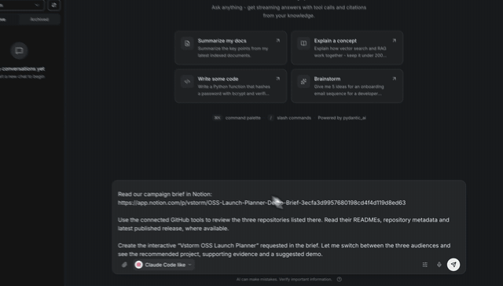
</a>

*Animated preview at 2× speed. Click to watch the 37-second video with sound at normal speed.*

</details>

[Watch the video](docs/assets/screens/oss-launch-planner-demo.mp4?raw=true) · [View a screenshot](docs/assets/screens/oss-launch-planner-poster.webp)

*Edited demonstration with waiting time removed. Repository figures reflect the recording's snapshot;
the artifact does not fetch live data. Connections and capabilities are configured for this demo.*

## 💬 Bring agents to where your team already works

Use your published agent in **Slack, Mattermost or Telegram**. Colleagues can ask for help in the tools they already use, with the agent's configured instructions, knowledge and tools.

**One agent, multiple ways to reach it:** team messaging, AgenticOS web chat, a website widget, a hosted page or your own application through the API. Configure the channel once; manage the agent's published version centrally and inspect its runs in Activity.

[Connect Slack, Mattermost and other channels](docs/channels.md).

## Explore the agent layer

<table>
<tr>
<td colspan="2" valign="top">

### 📄 Keep results outside the chat

**Artifacts** are pages an agent creates: reports, interactive comparisons or small dashboards.
Open them from the library, inspect versions and choose who can access them. Updating the same artifact
keeps its current-page link; a conversation can link to a particular version.

An artifact displays the data it was published with. A new agent run can update it.
[Create and share artifacts](docs/artifacts.md).

<!-- MEDIA: artifacts | light -->

<a href="docs/assets/screens/light/artifacts.webp">
  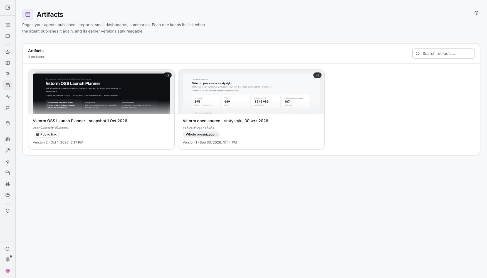
</a>

</td>
</tr>
<tr>
<td width="45%" valign="middle">

### 🤖 Configure an agent

In **Agents**, create an assistant for a task, choose its model, write instructions and enable its tools.
Publish a version when it is ready for use. You can inspect earlier versions and roll back a change.
[Build an agent](docs/first-agent.md).

</td>
<td width="55%">

<!-- MEDIA: agent-builder | light -->

<a href="docs/assets/screens/light/agent-builder.webp">
  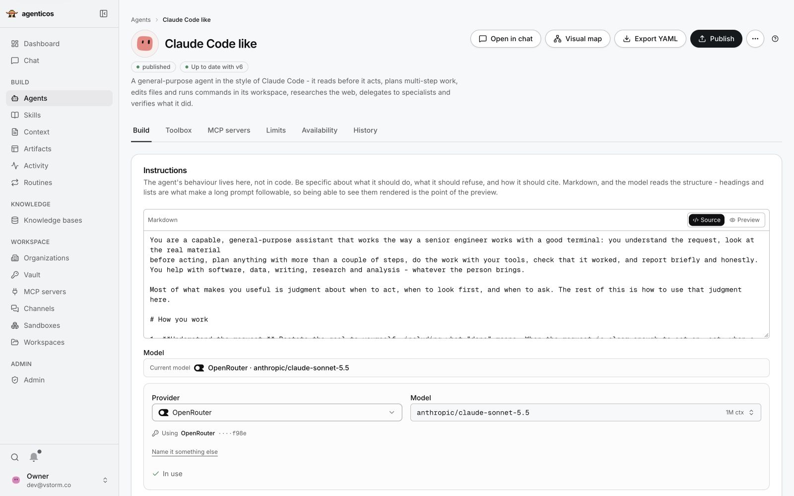
</a>

</td>
</tr>
<tr>
<td colspan="2" valign="top">

### 🔌 5,700+ integrations through MCP

Connect agents to the tools your company already uses: **GitHub, Notion, HubSpot, Linear and n8n**.
**MCP** (Model Context Protocol) is the standard that lets agents call external tools and data sources.

Discover **5,700+ MCP server entries** in the searchable catalog, or add a compatible server by URL.
Connect the services you need and choose which tools each agent can use. Setup, credentials and
available actions depend on the server. [Connect your tools](docs/mcp.md).

<!-- MEDIA: mcp-catalog | light -->

<a href="docs/assets/screens/light/mcp-catalog.webp">
  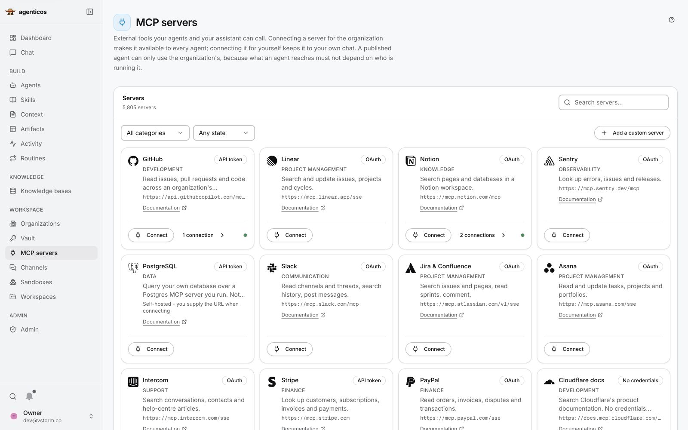
</a>

</td>
</tr>
<tr>
<td width="45%" valign="middle">

### 🧩 Teach a reusable procedure

**Skills** are written procedures an agent can load when relevant: how to review a proposal,
reconcile a report or follow your writing style. Write a procedure once and attach it to the agents
that need it. [Learn about skills](docs/skills.md).

</td>
<td width="55%">

<!-- MEDIA: skills | light -->

<a href="docs/assets/screens/light/skill-detail.webp">
  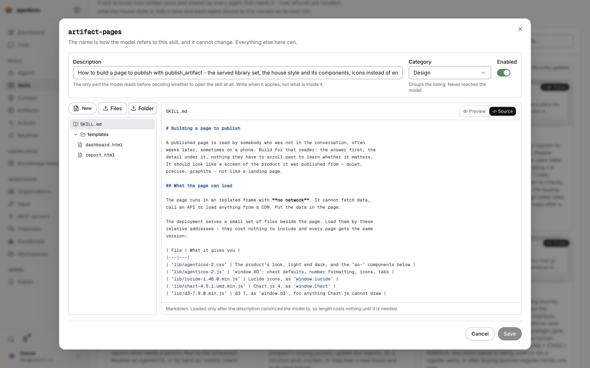
</a>

</td>
</tr>
<tr>
<td colspan="2" valign="top">

### 📚 Give it documents to search

**Knowledge bases** organize documents into collections you attach to agents. The agent searches these
sources for relevant passages when answering. This is often called **RAG**, or retrieval-augmented generation.
[Add and process documents](docs/file-processing.md).

<!-- MEDIA: knowledge-bases | light -->

<a href="docs/assets/screens/light/knowledge-bases.webp">
  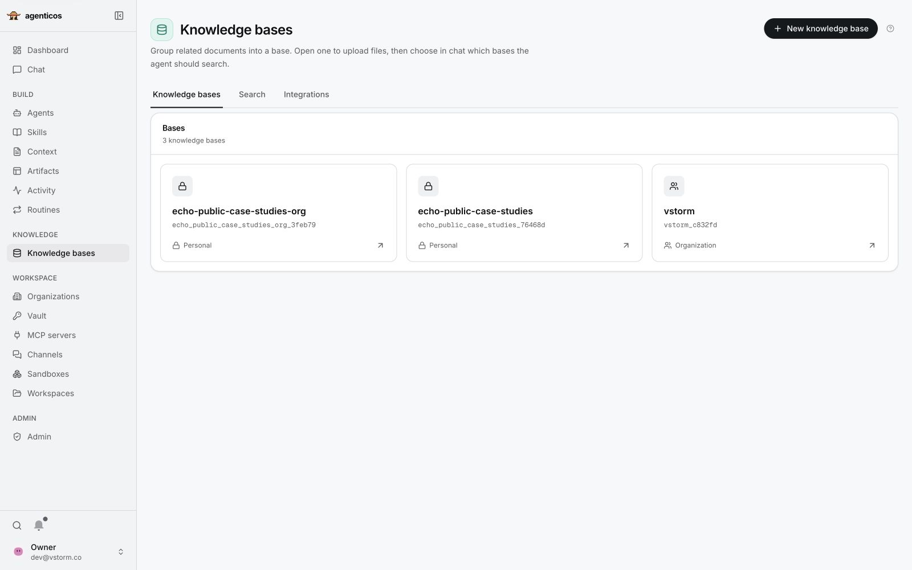
</a>

</td>
</tr>
<tr>
<td width="45%" valign="middle">

### 🧠 Shared context

**Context** holds standing information such as product names, a glossary or communication guidelines.
Use it for facts and rules shared across tasks; choose whether the agent receives it automatically
or reads it on demand. [Learn about context](docs/context.md).

</td>
<td width="55%">

<!-- MEDIA: context | light -->

<a href="docs/assets/screens/light/context-detail.webp">
  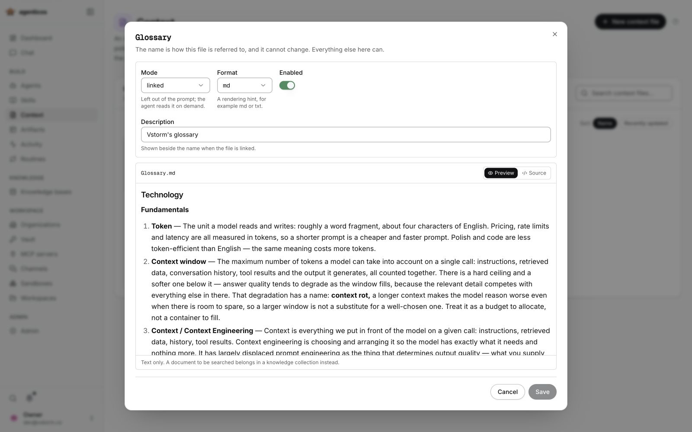
</a>

</td>
</tr>
<tr>
<td colspan="2" valign="top">

### 📊 Built-in observability: see what ran and what it cost

**Activity** brings run history, approvals and spend into one place. A **run** is one execution of an agent:
see its status, model, tokens, duration and recorded cost. Filter by agent, person or version,
compare version results and export the records as CSV.

Find slow or failed work, then open a run to inspect its conversation and tool calls.
[Explore Activity and cost controls](docs/governance.md).

<!-- MEDIA: activity | light; filtered run history and version comparison -->

<a href="docs/assets/screens/light/activity.webp">
  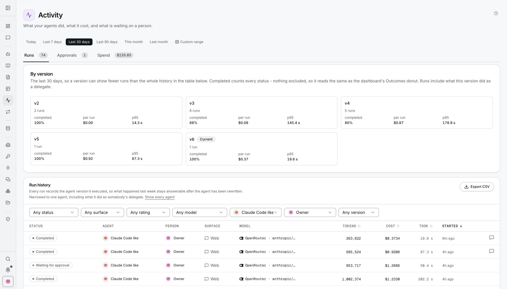
</a>

</td>
</tr>
<tr>
<td width="45%" valign="middle">

### 🛡️ Human approval

You can require human approval for supported tool actions. The approval request lets a person review
the proposed operation before deciding whether it should proceed. Access to agents and resources is
controlled through [roles and permissions](docs/permissions.md).

</td>
<td width="55%">

<!-- MEDIA: approval | light -->

<a href="docs/assets/screens/light/approval.webp">
  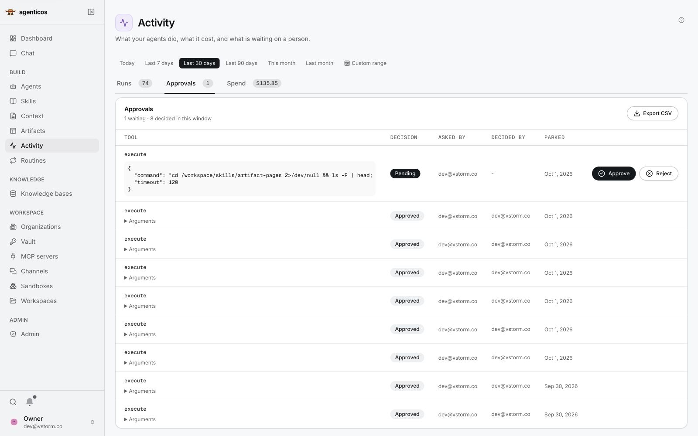
</a>

</td>
</tr>
<tr>
<td width="45%" valign="middle">

### ⏱️ Schedule repeat work

**Routines** run an agent on a schedule or in response to a configured event. Use them for a weekly
brief or a recurring report. Runs use the configured access and controls and leave an execution record.
[Set up a routine](docs/triggers.md).

</td>
<td width="55%">

<!-- MEDIA: routines | light; existing weekly schedule configuration -->

<a href="docs/assets/screens/light/routines.webp">
  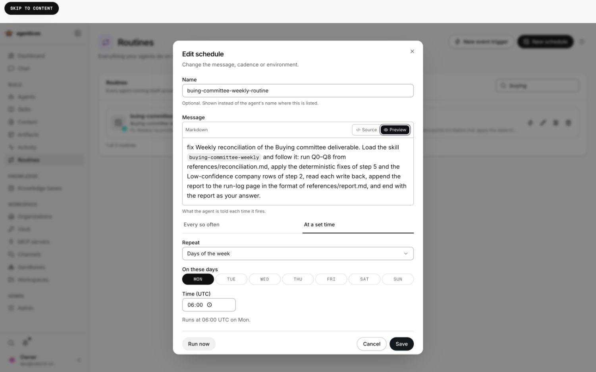
</a>

</td>
</tr>
</table>

<details>
<summary>More views and execution details</summary>

<a href="docs/assets/screens/light/skills.webp">
  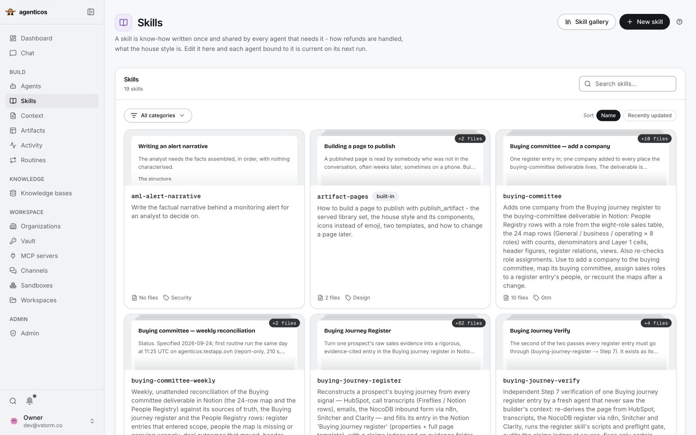
</a>

<a href="docs/assets/screens/light/context.webp">
  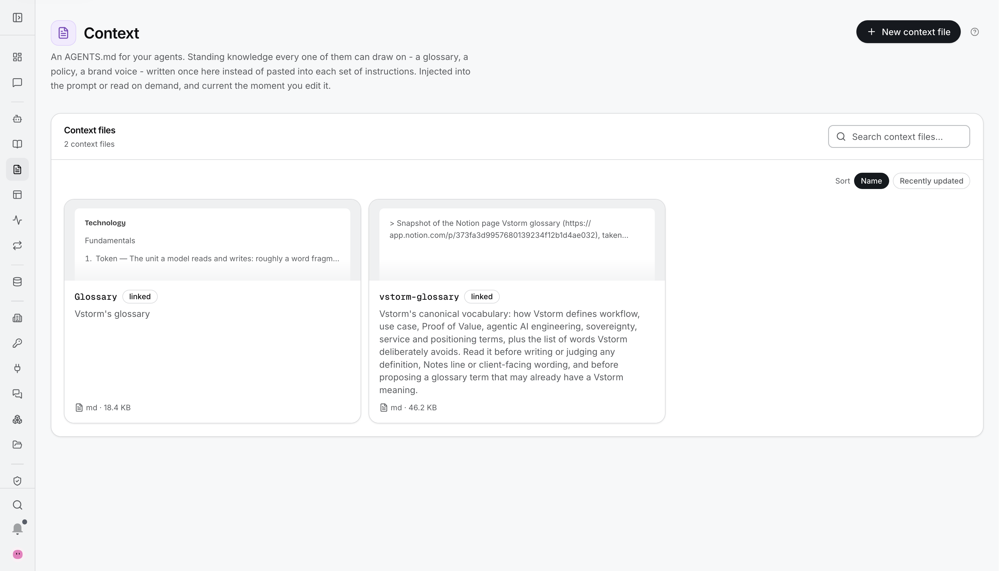
</a>

<!-- MEDIA: knowledge-collection | light; supplementary view -->

<a href="docs/assets/screens/light/knowledge-collection.webp">
  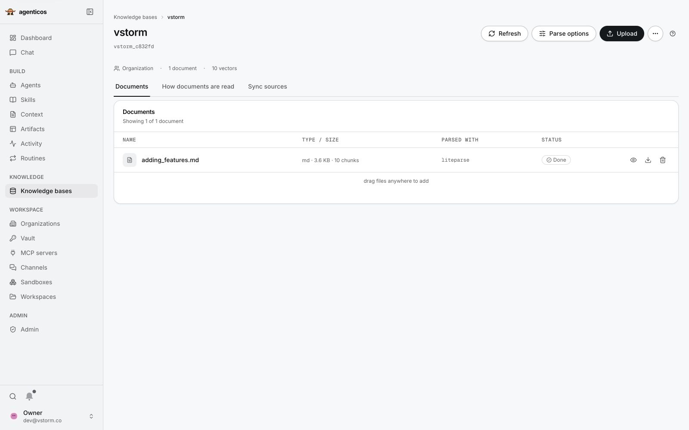
</a>

<a href="docs/assets/screens/light/artifact-detail.webp">
  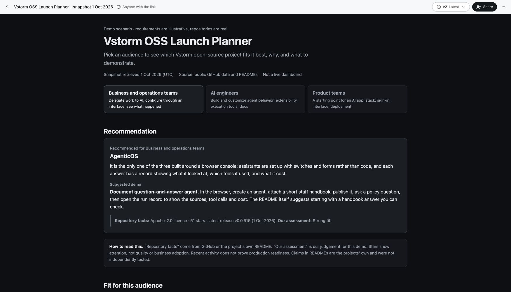
</a>

### Inspect actions and costs

A **run** is one execution of an agent. **Activity / Runs** shows its status and recorded usage;
open a run to inspect the conversation and tool calls. Budget checks use recorded spend before model
requests; requests already in progress or concurrent runs can exceed a cap. [Budgets and audit history](docs/governance.md).

<!-- MEDIA: run-detail | capture light with expanded sidebar; same run as the demo -->
> **Screenshot placeholder — Run detail:** status, duration, recorded cost and tool calls for the demonstrated task.

</details>

## Turn individual AI work into a team capability

For a recurring report, the team can divide the work:

1. **A subject expert defines the method:** maintain the instructions, skills and source knowledge.
2. **A builder makes the agent available:** configure its tools, publish a version and grant colleagues access.
3. **Colleagues use the results:** run the agent, review its output and share an artifact with the appropriate access settings.

The organization keeps the agent and reusable know-how. People work through the browser;
engineers can connect internal systems. [Set up team access](docs/permissions.md).

## Quick start

Install Docker with Compose first. On macOS or Linux, run the command below; on Windows, use WSL2
with Docker Desktop's WSL2 integration. The installer guides you through model access, your login
and organization, then sets up the deployment with a starter agent.

```bash
curl -fsSL https://raw.githubusercontent.com/vstorm-co/agenticos/main/scripts/quickstart.sh | bash
```

Open the console at **http://localhost:3000** and sign in with the credentials you configured.

### Try your first task

In **Chat**, select **Getting Started** and paste this fictional brief. Model access must be configured;
this exercise needs no connection to Notion or GitHub.

```text
Turn this brief into a launch checklist. Use only the facts below.
For each task, show the owner, deadline and missing information.
Do not invent dates or responsibilities.

Brief:
- The customer webinar is on 15 October.
- Maya owns the landing page; it must be ready by 8 October.
- Leo owns the demo, but its review date is undecided.
- Someone needs to send invitations by 10 October; no owner is assigned.
```

**Check the result:** the landing page should have Maya and 8 October; the demo should flag
its missing review date; invitations should flag the missing owner. Next, try your own brief or
[configure an agent with tools and company knowledge](docs/first-agent.md).

<details>
<summary>Inspect the installer or deploy another way</summary>

Read the [installer](scripts/quickstart.sh) before running it. To check prerequisites without installing:

```bash
curl -fsSL https://raw.githubusercontent.com/vstorm-co/agenticos/main/scripts/quickstart.sh | bash -s -- --check
```

For manual Docker Compose setup, pinned versions and troubleshooting, follow the [installation guide](docs/install.md).
For development from source, see [Contributing](CONTRIBUTING.md).

</details>

## Own your deployment, models and access

**Run it on your infrastructure.** AgenticOS is Apache-2.0 software you can inspect, modify and operate.
Choose hosted model providers or local models through Ollama and compatible endpoints such as vLLM.
Model capability and hardware requirements depend on the model you choose. [Model configuration](docs/models.md).

**Decide what an agent may do.** Configure resource permissions, store credentials in the vault and
require human approval for supported tool actions. [Access controls](docs/permissions.md) · [Secrets](docs/secrets.md).

**Inspect the work and spend.** A run is one execution of an agent. Inspect its tool calls and recorded
usage, alongside audit records for governance actions. Budgets check recorded spend before model requests;
in-flight or concurrent requests can exceed a cap. [Execution and cost controls](docs/governance.md).

[Self-hosting](docs/rollout.md) gives your team responsibility for deployment, updates and backups. External models,
parsers, embeddings, tools and tracing can still send data outside your infrastructure. Configure each
component for your data requirements. [Security and data flows](docs/security.md).

<details>
<summary>Where your data goes</summary>

| Component | What to decide |
|---|---|
| Application and storage | You operate the application, database and configured file storage; choose where they run and how they are backed up |
| Language models | A hosted provider receives the context sent for inference; choose a local endpoint when that processing must stay on your infrastructure |
| Document processing and search | Check parsers and embedding providers separately: a local chat model does not make a cloud parser or remote embeddings local |
| Tools and channels | Enabled integrations exchange the data needed for their calls; connected channels receive the replies sent through them |
| Observability | Optional tracing can export run data; check both deployment-wide and per-agent settings |

[Review the data boundaries](docs/security.md#what-leaves-the-deployment) ·
[Choose document processing](docs/file-processing.md).

</details>

## Is AgenticOS the right fit?

Choose AgenticOS when your company wants shared agents, reusable knowledge and automation with control
over the source code, models and deployment. Your team operates the installation; Vstorm can help with
implementation and support. If you only need an agent library inside an existing application, start
with a framework. If you want a fully managed service, include operating responsibility in your comparison.

Compare the approach with [Dify](docs/about/dify.md), [Viktor](docs/about/viktor.md) and
[Wonderful](docs/about/wonderful.md), or use the [comparison guide](docs/about/comparison.md)
to choose by task, ownership and required controls.

<details>
<summary>Questions about the agent layer</summary>

### Is AgenticOS an AI agent harness?

AgenticOS packages an AI agent harness with a team interface: model execution, tools, skills, context
and controls configured through a browser. Developers add capabilities in code; teams configure and
use them. See the [architecture](docs/architecture.md) for the execution model.

### Can I create a Claude Code-like agent for business tasks?

You can configure an agent for multi-step work with files, tools and delegated tasks. Its available actions depend on enabled capabilities and model support. AgenticOS is an independent
project with its own runtime and model choices. See the [Claude Code comparison](docs/about/claude-code.md).

### What can colleagues share?

Teams can share agents, skills, context, knowledge collections and artifacts under resource permissions.
A shared agent can serve different people; a shared artifact gives colleagues a result they can open
outside the chat.

</details>

## For developers and operators

Built with FastAPI, Pydantic AI, PostgreSQL with pgvector, Redis, Prefect and Next.js.
Agent configuration selects capabilities registered in the runtime; developers extend those capabilities in code.

| Start here | What it covers |
|---|---|
| [Architecture](docs/architecture.md) | Services, storage and execution |
| [Capabilities](docs/reference/capabilities.md) | Available tools and configuration |
| [API](docs/api.md) | Integration with your applications |
| [Models](docs/models.md) | Model providers and profiles |
| [Security](docs/security.md) | Data flows and deployment boundaries |
| [Testing](docs/testing.md) | Test suites and coverage scope |

Contributions are welcome. Read [Contributing](CONTRIBUTING.md) for setup and required checks,
and see the [roadmap](docs/ROADMAP.md) for planned work.

## License and support

[Apache License 2.0](LICENSE). See [NOTICE](NOTICE) and [third-party notices](THIRD_PARTY_NOTICES.md)
for attribution and bundled components.

## Need help putting agents into production?

Vstorm can help deploy AgenticOS in client infrastructure, write documentation, define processes and build custom elements. Maintenance and support are agreed for the project.

Built with care by [**Vstorm**](https://vstorm.co) · [oss.vstorm.co](https://oss.vstorm.co)
