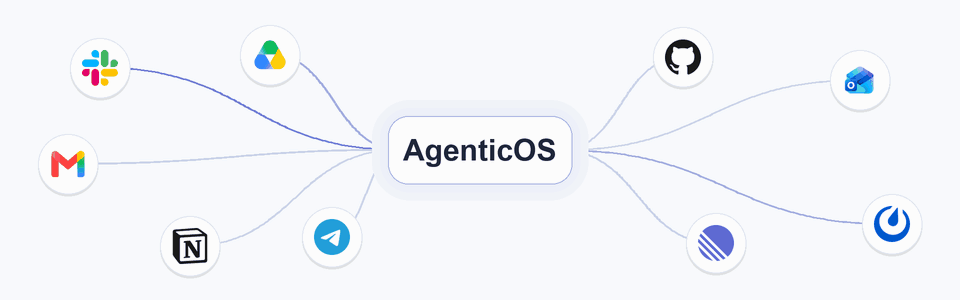

<div align="center">

<h1> AgenticOS</h1>

<p>
  <strong>Sovereign Agentic AI Layer</strong><br>
  <b>AI agents your whole team can use and improve.</b><br>
  Open source. Build shared agents in your browser, on infrastructure you control.
</p>

<p>
  <a href="#quick-start">Quick start</a> &middot;
  <a href="#build-share-and-operate">Build, share and operate</a> &middot;
  <a href="#is-agenticos-the-right-fit">Is it a fit?</a> &middot;
  <a href="docs/index.md">Documentation</a>
</p>

<p>
  <a href="https://github.com/vstorm-co/agenticos/actions/workflows/ci.yml"></a>
  <a href="https://github.com/vstorm-co/agenticos/releases"></a>
  <a href="LICENSE"></a>
  <a href="https://ai.pydantic.dev"></a>
</p>

<p>
  <b>English</b> &middot;
  <a href="README.pl.md">Polski</a> &middot;
  <a href="README.de.md">Deutsch</a> &middot;
  <a href="README.es.md">Español</a>
</p>

</div>

AgenticOS is a self-hosted workspace for building and running shared AI agents. Give an agent a task, connect company documents and tools, and publish it for your team. Engineers extend its capabilities; domain experts maintain its instructions and knowledge.

<a href="docs/assets/screens/light/agent-builder.webp">
  
</a>

## What you can do

- **Build in the browser:** configure an agent's model, instructions, knowledge and tools, then publish a version.
- **Work as a team:** let experts maintain the instructions and documents, and give colleagues access to the published agent.
- **Share useful results:** publish reports, comparisons and dashboards as artifacts with controlled access.
- **Inspect and repeat runs:** review tool calls and recorded costs in Activity; trigger agents on schedules or events.
- **Choose your infrastructure:** self-host, connect hosted or local models, and extend capabilities in Python.

## Quick start

All it needs is Docker with Compose. On macOS or Linux, run:

```bash
curl -fsSL https://raw.githubusercontent.com/vstorm-co/agenticos/main/scripts/quickstart.sh | bash
```

On Windows, run the same command inside WSL2 with Docker Desktop's WSL2 integration switched on.
The installer asks for a model provider and key, your login and an organization name, pulls the
published images and starts a deployment with a working agent in it.

Open **http://localhost:3000** and sign in with the login you chose during installation.

**Your first agent:** follow the [document-assistant walkthrough](docs/howto/first-document-agent.md) to upload a handbook, ask questions and check answers against cited sources and test an updated document. Document search requires an embedding model. For other tasks, see [Build an agent](docs/first-agent.md).

<details>
<summary>Inspect the installer or deploy another way</summary>

Read the [installer](scripts/quickstart.sh) before running it. To check prerequisites without installing:

```bash
curl -fsSL https://raw.githubusercontent.com/vstorm-co/agenticos/main/scripts/quickstart.sh | bash -s -- --check
```

For manual Docker Compose setup, pinned versions and troubleshooting, follow the [installation guide](docs/install.md).
For development from source, see [Contributing](CONTRIBUTING.md).

</details>

## Build, share and operate

### Configure the work once

Choose the model, instructions and tools in the browser. Publish a version for colleagues to use; earlier versions remain available for inspection and rollback.

[Knowledge bases](docs/file-processing.md) supply searchable documents. [Skills](docs/skills.md) hold reusable procedures; [context](docs/context.md) holds shared facts and guidelines. Update these resources as the work changes.

Connect tools such as **GitHub, Notion, HubSpot or Linear** through [MCP](docs/mcp.md). The catalog combines curated connections with **5,700+ MCP server listings** mirrored from a registry. Registry entries are publisher-provided metadata, not tested integrations. Each connection needs its own setup and access review.

### Make the agent and its results available

Colleagues can use a published agent in web chat or through configured **Slack, Mattermost and Telegram** channels. Developers can call it through the API. [Connect a channel](docs/channels.md).

Agents can publish reports, interactive comparisons and small dashboards as **artifacts**. Choose who can open them; updates to the same artifact keep its link and earlier versions remain readable. [Share an artifact](docs/artifacts.md).

<a href="docs/assets/screens/light/artifacts.webp">
  
</a>

### Inspect runs and repeat useful work

**Activity** brings run history, approvals and recorded spend together. Inspect tool calls, compare agent versions and export records. Some costs depend on provider usage and pricing data; external services can bill separately. [Read the accounting limits](docs/governance.md).

<a href="docs/assets/screens/light/activity.webp">
  
</a>

Configure approval requirements for supported capability tools. In web chat, **Ask about everything** also gates MCP tool calls handled by the runner. Approval coverage depends on the tool and execution mode; enabling a connection alone does not require approval. [Approval modes and limits](docs/governance.md#how-much-one-conversation-wants-to-be-asked).

When a task is ready to repeat, use [routines](docs/triggers.md) to run an agent on a schedule or an event. Test its tools, limits and approval policy before leaving it unattended.

## Recorded integration example

This demo shows a Notion brief becoming a sourced, interactive page after GitHub research. It uses Vstorm's own open-source projects as sample material: the useful sequence is **brief → research → shared result**. It is a product demonstration, not a customer outcome study.

<video src="https://github.com/user-attachments/assets/1d6bba29-3bfe-4c86-bda3-52ce2b0aa512" controls playsinline width="100%" poster="docs/assets/screens/oss-launch-planner-poster.webp">
  
</video>

[Watch the shortened video (37 seconds)](https://github.com/user-attachments/assets/1d6bba29-3bfe-4c86-bda3-52ce2b0aa512) · [View a screenshot](docs/assets/screens/oss-launch-planner-poster.webp)

## Connect the apps your team already uses

<picture>
  <source media="(prefers-reduced-motion: reduce) and (prefers-color-scheme: dark)" srcset="docs/assets/integrations/connections-dark.png">
  <source media="(prefers-reduced-motion: reduce)" srcset="docs/assets/integrations/connections-light.png">
  <source media="(prefers-color-scheme: dark)" srcset="docs/assets/integrations/connections-dark.gif">
  
</picture>

[Google Drive™ sync](docs/howto/configure-sync-sources.md) · [Gmail triggers](docs/triggers.md) · [MCP tools: Notion, GitHub, Linear and more](docs/mcp.md) · [Chat channels: Slack, Mattermost, Telegram](docs/channels.md).

[Outlook email and calendar](docs/mcp.md#outlook-setup) connect through a third-party MCP service with its own account and permissions.

<sub>Google Drive is a trademark of Google LLC. App names and logos identify connection options, not partnerships. [Logo sources](docs/assets/integrations/ATTRIBUTION.txt).</sub>

## Is AgenticOS the right fit?

Choose it when a team has repeated document or tool-based work, subject experts who can maintain the instructions, and someone responsible for operating a self-hosted deployment.

Evaluate it with one of your own tasks. [Compare approaches](docs/about/comparison.md) · [Plan a rollout](docs/rollout.md).

## Own your deployment, models and access

**Sovereign means control over deployment, model providers, data flows and agent access.** AgenticOS is Apache-2.0 software you can inspect, modify and operate. Choose hosted providers or local models through Ollama and compatible endpoints such as vLLM. [Configure models](docs/models.md).

Self-hosting the console does not make every model, parser or tool local. Review the destinations you configure and the data they receive. Assign resource permissions, store credentials in the encrypted vault and test the approval policy for the tools you enable.

[Security and data flows](docs/security.md) · [Access controls](docs/permissions.md) · [Secrets](docs/secrets.md) · [Execution and cost controls](docs/governance.md).

## For developers and operators

Built with FastAPI, Pydantic AI, PostgreSQL with pgvector, Redis, Prefect and Next.js. Engineers add capabilities in typed Python; teams compose agents from the registered capabilities in the console.

[Architecture](docs/architecture.md) · [Capabilities](docs/reference/capabilities.md) · [API](docs/api.md) · [Contributing](CONTRIBUTING.md) · [Roadmap](docs/ROADMAP.md).

The [operating-system analogy](docs/about/index.md) explains the architecture. The optional [desktop app](docs/desktop.md) adds a dedicated window, a pet and a macOS screenshot shortcut. Explore [Vstorm's open-source projects](https://github.com/vstorm-co) for the libraries and tools around AgenticOS.

## License

[Apache License 2.0](LICENSE). See [NOTICE](NOTICE) and [third-party notices](THIRD_PARTY_NOTICES.md)
for attribution and bundled components.

## Need help putting agents into production?

Vstorm deploys AgenticOS in client infrastructure, writes the documentation, defines the processes
and builds custom capabilities. Maintenance and support are agreed per engagement.

Built with care by [**Vstorm**](https://vstorm.co) · [Vstorm on GitHub](https://github.com/vstorm-co)
