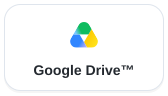
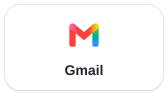
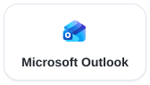
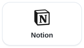
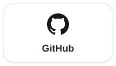
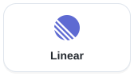

<!-- source_sha: f4a951bb9509 -->

<div align="center">

<h1> AgenticOS</h1>

<p>
  <strong>Sovereign Agentic AI Layer</strong><br>
  <b>Agenci AI, z których cały zespół może korzystać i których może ulepszać.</b><br>
  Open source. Twórz wspólnych agentów w przeglądarce, na infrastrukturze, którą kontrolujesz.
</p>

<p>
  <a href="#szybki-start">Szybki start</a> &middot;
  <a href="#twórz-udostępniaj-i-nadzoruj">Twórz, udostępniaj i nadzoruj</a> &middot;
  <a href="#czy-agenticos-pasuje-do-twojego-zespołu">Czy to dla nas?</a> &middot;
  <a href="docs/index.pl.md">Dokumentacja</a>
</p>

<p>
  <a href="https://github.com/vstorm-co/agenticos/actions/workflows/ci.yml"></a>
  <a href="https://github.com/vstorm-co/agenticos/releases"></a>
  <a href="LICENSE"></a>
  <a href="https://ai.pydantic.dev"></a>
</p>

<p>
  <a href="README.md">English</a> &middot;
  <b>Polski</b> &middot;
  <a href="README.de.md">Deutsch</a> &middot;
  <a href="README.es.md">Español</a>
</p>

</div>

AgenticOS to środowisko na własnej infrastrukturze do tworzenia i uruchamiania wspólnych agentów AI. Określ zadanie agenta, podłącz firmowe dokumenty i narzędzia, a następnie opublikuj go dla zespołu. Inżynierowie rozszerzają jego możliwości; eksperci dziedzinowi utrzymują instrukcje i wiedzę.

<a href="docs/assets/screens/light/agent-builder.webp">
  
</a>

## Zbuduj wspólny sposób pracy

Asystent odpowiadający na pytania o zamawianie sprzętu potrzebuje osoby znającej zasady, osoby konfigurującej agenta i współpracowników, którzy będą z niego korzystać. AgenticOS łączy ich pracę:

1. **Ekspert utrzymuje metodę:** pisze instrukcje, procedury wielokrotnego użytku i dokumenty źródłowe.
2. **Builder publikuje agenta:** wybiera model i narzędzia, ustawia limity i przyznaje dostęp.
3. **Współpracownicy korzystają i sprawdzają:** zadają pytania, przeglądają źródła i udostępniają wyniki. Administratorzy analizują wykonania w Activity.

Instrukcje i wiedzę zmieniasz w konsoli. Nowe możliwości dodajesz w Pythonie. [Jak zbudować agenta](docs/first-agent.pl.md) · [Dostęp dla zespołu](docs/permissions.pl.md).

## Szybki start

Potrzebujesz tylko Dockera z Compose. Na macOS lub Linuksie uruchom:

```bash
curl -fsSL https://raw.githubusercontent.com/vstorm-co/agenticos/main/scripts/quickstart.sh | bash
```

Na Windows uruchom tę samą komendę w WSL2 z włączoną integracją WSL2 w Docker Desktop.
Instalator pyta o dostawcę modelu i klucz, login oraz nazwę organizacji, pobiera opublikowane obrazy
i uruchamia wdrożenie z działającym agentem.

Otwórz **http://localhost:3000** i zaloguj się loginem wybranym podczas instalacji.

### Zbuduj asystenta na podstawie dokumentu

Zacznij od [poradnika o zasadach zamawiania sprzętu](docs/howto/first-document-agent.pl.md). Zawiera krótki, fikcyjny regulamin, kroki konfiguracji i zapis testu wraz z ograniczeniami. Do wyszukiwania w dokumentach potrzebujesz modelu embeddingów oprócz modelu do rozmowy.

<details>
<summary>Przejdź ćwiczenie z asystentem dokumentów</summary>

1. Zapisz poniższe dwa zdania jako `equipment-handbook.md` i wgraj plik do kolekcji wiedzy. Skonfiguruj embeddingi i poczekaj na przetworzenie.
2. Utwórz agenta, wybierz model i włącz wyszukiwanie w tej kolekcji. Poleć mu cytować regulamin i wskazywać brak odpowiedzi. Opublikuj agenta.
3. Zadaj poniższe pytania w nowych rozmowach, a następnie sprawdź znalezione materiały i wykonanie w **Activity**.

```text
Equipment requests go to the office manager.
Include the item, reason and delivery location.
```

| Zapytaj | Sprawdź ze źródłem |
|---|---|
| Kto obsługuje zamówienia sprzętu? | Office manager, z odwołaniem do regulaminu |
| Jakie informacje należy podać w zamówieniu sprzętu? | Przedmiot, powód i miejsce dostawy |
| Ile mogę wydać? | Dokument nie określa limitu wydatków |

Następnie zgodnie z poradnikiem zastąp dokument zaktualizowanym regulaminem i przetestuj nową rozmowę. Gdy odpowiedzi będą poprawne, przyznaj współpracownikowi dostęp do agenta i wymaganych zasobów, aby sprawdził go ze swojego konta. [Skonfiguruj uprawnienia](docs/permissions.pl.md), zanim użyjesz prywatnych dokumentów.

Poradnik opisuje test na **v0.0.504 z 25 września 2026 r.**, w tym ponowienie pytania i odpowiedź po aktualizacji dokumentu. To przykład do odtworzenia; odpowiedzi własnego modelu sprawdź ze źródłem.

</details>

<details>
<summary>Sprawdzasz tylko instalację? Wypróbuj zadanie bez konfiguracji dokumentów</summary>

W **Chat** wybierz agenta **Getting Started** i wklej ten fikcyjny brief. Nie wymaga on połączenia
z Notion ani GitHubem.

```text
Odpowiedz po polsku. Zamień ten brief w listę zadań przed premierą. Użyj tylko podanych faktów.
Dla każdego zadania podaj osobę odpowiedzialną, termin i brakujące informacje.
Nie wymyślaj dat ani odpowiedzialności.

Brief:
- Webinar dla klientów odbędzie się 15 października.
- Maya odpowiada za landing page; ma być gotowy do 8 października.
- Leo odpowiada za demo, ale nie ustalono terminu jego przeglądu.
- Zaproszenia trzeba wysłać do 10 października; nie wyznaczono odpowiedzialnej osoby.
```

**Sprawdź wynik:** przy landing page powinny pojawić się Maya i 8 października; przy demo —
brak terminu przeglądu; przy zaproszeniach — brak odpowiedzialnej osoby. Potem otwórz **Activity**: wykonanie
już tam jest, z modelem, tokenami, czasem i kosztem. Następnie użyj własnego briefu lub
[skonfiguruj agenta z narzędziami i wiedzą firmy](docs/first-agent.pl.md).

</details>

<details>
<summary>Sprawdź instalator lub wybierz inny sposób wdrożenia</summary>

Przeczytaj [instalator](scripts/quickstart.sh) przed uruchomieniem. Aby sprawdzić wymagania bez instalowania:

```bash
curl -fsSL https://raw.githubusercontent.com/vstorm-co/agenticos/main/scripts/quickstart.sh | bash -s -- --check
```

Ręczną konfigurację Docker Compose, wybór wersji i rozwiązywanie problemów opisuje [instrukcja instalacji](docs/install.pl.md).
Pracę nad kodem opisuje [poradnik dla współtwórców](CONTRIBUTING.pl.md).

</details>

## Twórz, udostępniaj i nadzoruj

### Skonfiguruj sposób pracy

Wybierz model, instrukcje i narzędzia w przeglądarce. Opublikuj wersję dla współpracowników; wcześniejsze wersje pozostają dostępne do przeglądania i przywrócenia.

[Bazy wiedzy](docs/file-processing.pl.md) dostarczają dokumenty do wyszukiwania. [Skills](docs/skills.pl.md) przechowują procedury wielokrotnego użytku, a [kontekst](docs/context.pl.md) — wspólne fakty i wytyczne. Aktualizuj te zasoby wraz ze zmianami w pracy.

Podłącz narzędzia takie jak **GitHub, Notion, HubSpot lub Linear** przez [MCP](docs/mcp.pl.md). Katalog łączy wybrane połączenia z **ponad 5700 wpisami serwerów MCP** skopiowanymi z rejestru. Wpisy z rejestru to metadane od wydawców, a nie przetestowane integracje. Każde połączenie wymaga konfiguracji i sprawdzenia dostępu.

### Udostępnij agenta i jego wyniki

Współpracownicy mogą korzystać z opublikowanego agenta w czacie internetowym lub przez skonfigurowane kanały **Slack, Mattermost i Telegram**. Programiści mogą wywoływać go przez API. [Podłącz kanał](docs/channels.pl.md).

Agenci mogą publikować raporty, interaktywne porównania i małe dashboardy jako **artefakty**. Wybierz, kto może je otwierać; aktualizacja tego samego artefaktu zachowuje jego link, a wcześniejsze wersje pozostają dostępne. [Udostępnij artefakt](docs/artifacts.pl.md).

<a href="docs/assets/screens/light/artifacts.webp">
  
</a>

### Sprawdzaj wykonania i powtarzaj przydatne zadania

**Activity** łączy historię wykonań, zatwierdzenia i zarejestrowane wydatki. Przeglądaj wywołania narzędzi, porównuj wersje agentów i eksportuj dane. Część kosztów zależy od danych o zużyciu i cenach dostawcy; usługi zewnętrzne mogą naliczać opłaty osobno. [Ograniczenia rozliczania kosztów](docs/governance.pl.md).

<a href="docs/assets/screens/light/activity.webp">
  
</a>

Skonfiguruj wymagane zatwierdzenia dla obsługiwanych narzędzi capabilities. W czacie internetowym tryb **Ask about everything** obejmuje również wywołania narzędzi MCP obsługiwane przez runner. Zakres zatwierdzeń zależy od narzędzia i trybu wykonania; samo włączenie połączenia nie wymusza zatwierdzania. [Tryby i ograniczenia zatwierdzeń](docs/governance.pl.md#how-much-one-conversation-wants-to-be-asked).

Gdy zadanie nadaje się do powtarzania, użyj [rutyn](docs/triggers.pl.md), aby uruchamiać agenta według harmonogramu lub zdarzenia. Sprawdź jego narzędzia, limity i politykę zatwierdzeń przed pozostawieniem go bez nadzoru.

## Nagrany przykład integracji

Demo pokazuje, jak brief z Notion po analizie repozytoriów na GitHubie staje się interaktywną stroną ze źródłami. Materiałem są projekty open source Vstorm: istotna sekwencja to **brief → analiza → wspólny wynik**. To demonstracja produktu, a nie badanie efektów wdrożenia u klienta.

<video src="https://github.com/user-attachments/assets/1d6bba29-3bfe-4c86-bda3-52ce2b0aa512" controls playsinline width="100%" poster="docs/assets/screens/oss-launch-planner-poster.webp">
  
</video>

<details>
<summary>Film się nie wyświetla? Otwórz animowany podgląd</summary>

<a href="https://github.com/user-attachments/assets/1d6bba29-3bfe-4c86-bda3-52ce2b0aa512">
  
</a>

*Animowany podgląd przyspieszony 2×. Kliknij, aby obejrzeć 37-sekundowy film z dźwiękiem w normalnym tempie.*

</details>

[Obejrzyj skrócony film (37 sekund)](https://github.com/user-attachments/assets/1d6bba29-3bfe-4c86-bda3-52ce2b0aa512) · [Zobacz zrzut ekranu](docs/assets/screens/oss-launch-planner-poster.webp)

## Podłącz aplikacje, których Twój zespół już używa

Udostępnij agentom dokumenty, wiadomości i narzędzia pracy. Wybierz aplikację poniżej, aby przejść do instrukcji połączenia.

<p align="center">
  <a href="docs/howto/configure-sync-sources.pl.md"><picture>
    <source media="(prefers-color-scheme: dark)" srcset="docs/assets/integrations/drive-dark.svg">
    
  </picture></a>
  <a href="docs/triggers.pl.md"><picture>
    <source media="(prefers-color-scheme: dark)" srcset="docs/assets/integrations/gmail-dark.svg">
    
  </picture></a>
  <a href="docs/mcp.pl.md#outlook-setup"><picture>
    <source media="(prefers-color-scheme: dark)" srcset="docs/assets/integrations/outlook-dark.svg">
    
  </picture></a>
</p>

**Pliki i poczta.** Synchronizuj dokumenty z Google Drive™ z kolekcjami wiedzy lub uruchamiaj agentów po nadejściu wiadomości w Gmailu. Poczta i kalendarz Microsoft Outlook korzystają z [zewnętrznych serwerów MCP](docs/mcp.pl.md#outlook-setup), z osobnym kontem u dostawcy i uprawnieniami.

<p align="center">
  <a href="docs/mcp.pl.md"><picture>
    <source media="(prefers-color-scheme: dark)" srcset="docs/assets/integrations/notion-dark.svg">
    
  </picture></a>
  <a href="docs/mcp.pl.md"><picture>
    <source media="(prefers-color-scheme: dark)" srcset="docs/assets/integrations/github-dark.svg">
    
  </picture></a>
  <a href="docs/mcp.pl.md"><picture>
    <source media="(prefers-color-scheme: dark)" srcset="docs/assets/integrations/linear-dark.svg">
    
  </picture></a>
</p>

**Narzędzia zespołu.** Połącz strony Notion, repozytoria GitHub i zgłoszenia Linear przez ich serwery MCP. Wybierz narzędzia dostępne dla każdego agenta.

<p align="center">
  <a href="docs/channels.pl.md"><picture>
    <source media="(prefers-color-scheme: dark)" srcset="docs/assets/channels/slack-dark.svg">
    
  </picture></a>
  <a href="docs/channels.pl.md"><picture>
    <source media="(prefers-color-scheme: dark)" srcset="docs/assets/channels/mattermost-dark.svg">
    
  </picture></a>
  <a href="docs/channels.pl.md"><picture>
    <source media="(prefers-color-scheme: dark)" srcset="docs/assets/channels/telegram-dark.svg">
    
  </picture></a>
</p>

**Rozmowy.** Po skonfigurowaniu kanału współpracownicy mogą korzystać z opublikowanego agenta w Slacku, Mattermost lub Telegramie.

<sub>Google Drive jest znakiem towarowym Google LLC. Nazwy i logotypy wskazują możliwości połączenia, a nie partnerstwa. [Źródła logotypów](docs/assets/integrations/ATTRIBUTION.txt).</sub>

## Czy AgenticOS pasuje do Twojego zespołu?

Wybierz go, gdy zespół ma powtarzalne zadania oparte na dokumentach lub narzędziach, ekspertów mogących utrzymywać instrukcje i osobę odpowiedzialną za wdrożenie na własnej infrastrukturze.

| Punkt wyjścia | Co sprawdzić |
|---|---|
| Chcesz, aby współpracownicy używali i rozwijali wspólnych agentów | Wypróbuj builder, wiedzę i publikowanie w AgenticOS. Jeśli wystarczy wspólny interfejs czatu, sprawdź też [Open WebUI](https://github.com/open-webui/open-webui). |
| Przede wszystkim projektujesz workflow lub aplikacje AI | Porównaj sposób tworzenia z [Dify](docs/about/dify.pl.md) i [n8n](docs/about/n8n.pl.md) na jednym ze swoich rzeczywistych zadań. |
| Budujesz agentów jako część produktu programistycznego | Zacznij od SDK lub środowiska wykonawczego, np. [Pydantic AI](https://ai.pydantic.dev) lub [Agno](https://github.com/agno-agi/agno); oceń, czy potrzebujesz również konsoli zespołowej AgenticOS. |

Własne wdrożenie oznacza odpowiedzialność za aktualizacje, kopie zapasowe, poświadczenia i rachunki dostawców. Jeśli nikt nie ma tego utrzymywać, ustal sposób wdrożenia i wsparcia przed pilotażem. [Przewodnik wdrożenia](docs/rollout.pl.md) · [Szczegółowe porównania i braki](docs/about/comparison.pl.md).

## Kontroluj wdrożenie, modele i dostęp

**Sovereign oznacza kontrolę nad wdrożeniem, dostawcami modeli, przepływami danych i dostępem do agentów.** AgenticOS jest oprogramowaniem na licencji Apache-2.0, które możesz sprawdzać, modyfikować i utrzymywać. Wybierz modele hostowane lub lokalne przez Ollama i kompatybilne endpointy, takie jak vLLM. [Konfiguracja modeli](docs/models.pl.md).

Uruchomienie konsoli na własnej infrastrukturze nie sprawia, że każdy model, parser i narzędzie działa lokalnie. Sprawdź skonfigurowane usługi i dane, które otrzymują. Nadaj uprawnienia do zasobów, zapisz poświadczenia w szyfrowanym sejfie i przetestuj politykę zatwierdzeń włączonych narzędzi.

[Bezpieczeństwo i przepływy danych](docs/security.pl.md) · [Uprawnienia](docs/permissions.pl.md) · [Sekrety](docs/secrets.pl.md) · [Kontrola wykonań i kosztów](docs/governance.pl.md).

## Dla programistów i administratorów

Zbudowany z FastAPI, Pydantic AI, PostgreSQL z pgvector, Redis, Prefect i Next.js. Inżynierowie dodają capabilities w typowanym Pythonie; zespoły składają z zarejestrowanych capabilities agentów w konsoli.

[Architektura](docs/architecture.pl.md) · [Capabilities](docs/reference/capabilities.pl.md) · [API](docs/api.pl.md) · [Współtworzenie](CONTRIBUTING.pl.md) · [Plan rozwoju](docs/ROADMAP.md).

[Analogia systemu operacyjnego](docs/about/index.pl.md) wyjaśnia architekturę. Opcjonalna [aplikacja desktopowa](docs/desktop.pl.md) dodaje osobne okno, zwierzaka i skrót do zrzutów ekranu na macOS. [Projekty open source Vstorm](https://github.com/vstorm-co) zawierają biblioteki i narzędzia wokół AgenticOS.

## Licencja

[Apache License 2.0](LICENSE). Zobacz [NOTICE](NOTICE) i [informacje o komponentach zewnętrznych](THIRD_PARTY_NOTICES.md),
aby poznać atrybucje i skład dystrybucji.

## Potrzebujesz pomocy we wdrożeniu agentów na produkcję?

Vstorm wdraża AgenticOS w infrastrukturze klienta, przygotowuje dokumentację, definiuje procesy
i buduje możliwości na zamówienie. Zakres utrzymania i wsparcia ustalamy dla każdej współpracy.

Stworzone z dbałością przez [**Vstorm**](https://vstorm.co) · [Vstorm on GitHub](https://github.com/vstorm-co)
