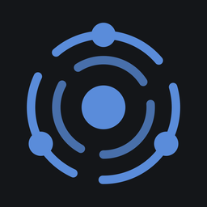

<!-- source_sha: f6a90173e627 -->

<div align="center">

<h1> AgenticOS</h1>

<p>
  <sub><b>Sovereign Agentic AI Layer</b> &middot; Apache-2.0 &middot; zbudowany na Pydantic AI</sub><br>
  <b>Agenci AI, z których cały zespół może korzystać i których może ulepszać.</b><br>
  Na infrastrukturze, którą kontrolujesz, z budżetami, zatwierdzeniami i zapisem każdego wykonania.
</p>

<p>
  <a href="#-czym-jest-agenticos">Czym to jest?</a> &middot;
  <a href="#-szybki-start">Szybki start</a> &middot;
  <a href="#-podłącz-aplikacje-których-twój-zespół-już-używa">Integracje</a> &middot;
  <a href="#-zobacz-jak-to-działa">Zobacz</a> &middot;
  <a href="#-twórz-udostępniaj-i-nadzoruj">Przegląd produktu</a> &middot;
  <a href="#-znajdź-swoją-ścieżkę">Twoja ścieżka</a> &middot;
  <a href="#-co-jest-dostępne-już-dziś">Co jest dostępne</a> &middot;
  <a href="#-najczęściej-zadawane-pytania">FAQ</a> &middot;
  <a href="https://vstorm-co.github.io/agenticos/presentation/">Prezentacja wprowadzająca</a> &middot;
  <a href="https://vstorm-co.github.io/agenticos/pl/">Dokumentacja</a>
</p>

<p>
  <a href="https://github.com/vstorm-co/agenticos/actions/workflows/ci.yml"></a>
  <a href="https://github.com/vstorm-co/agenticos/releases"></a>
  <a href="LICENSE"></a>
  <a href="https://ai.pydantic.dev"></a>
</p>

<p>
  <a href="README.md">English</a> &middot;
  <b>Polski</b> &middot;
  <a href="README.de.md">Deutsch</a> &middot;
  <a href="README.es.md">Español</a>
</p>

</div>

AgenticOS to środowisko na własnej infrastrukturze, w którym agenci AI pracują z plikami, wykonują kod i korzystają z firmowych narzędzi oraz wiedzy. Twórz i publikuj agentów w przeglądarce, udostępniaj ich współpracownikom oraz zarządzaj ich dostępem, kosztami i wynikami w jednym miejscu.

**Pierwszy raz tutaj?** Przejdź przez [14-slajdowe wprowadzenie](https://vstorm-co.github.io/agenticos/presentation/) (po angielsku): problem, pomysł, produkt na prawdziwych ekranach, jego kontrole i ograniczenia oraz pierwsze kroki. Każdy ekran z bliska pokazuje [44-slajdowy przegląd produktu](https://vstorm-co.github.io/agenticos/presentation/tour/). Strzałki przełączają kroki w obu prezentacjach, `O` pokazuje listę slajdów.

## 💡 Czym jest AgenticOS?

**AgenticOS to otwarta (Apache-2.0) platforma na własnej infrastrukturze do tworzenia, udostępniania i nadzorowania agentów AI w całej firmie.** Zespoły konfigurują agenta w przeglądarce: piszą jego instrukcje, wybierają model i włączają narzędzia. Łączą go z firmowymi dokumentami i aplikacjami, a potem publikują w czacie internetowym, Slacku, Mattermost, Telegramie, w widżecie na stronie lub przez API. Administratorzy decydują, kto może korzystać z każdego agenta, ile może wydać i które działania wymagają zatwierdzenia przez człowieka. Każde wykonanie jest zapisywane.

Większość frameworków agentowych daje bibliotekę, więc każda zmiana zachowania agenta oznacza pull request, review i wydanie. To zły kształt dla małych agentów, których firma naprawdę potrzebuje, bo osoba, która wie, co agent powinien odpowiadać, zwykle nie ma uprawnień do commitów. **Kod definiuje, konfiguracja składa:** inżynierowie poszerzają zestaw elementów do złożenia, a konfiguracja może sięgnąć wyłącznie po to, co zarejestrował kod.

Działa na Twojej infrastrukturze z Docker Compose i współpracuje z 27 dostawcami modeli, w tym z modelami lokalnymi przez Ollama i vLLM. Agenci działają na [Pydantic AI](https://ai.pydantic.dev) i [pydantic-ai-harness](https://github.com/pydantic/pydantic-ai-harness); platforma wokół nich korzysta z FastAPI, PostgreSQL z pgvector i Next.js. Projekt utrzymuje [Vstorm](https://vstorm.co).

**Dla kogo:**

- Firmy, które chcą mieć **własną wewnętrzną platformę agentów AI** zamiast asystentów licencjonowanych per stanowisko w chmurze dostawcy.
- Zespoły z **powtarzalną pracą na dokumentach i narzędziach**, taką jak raporty, odpowiedzi dla klientów, weryfikacja umów i analiza danych.
- Działy IT i bezpieczeństwa, które potrzebują dla agentów AI **suwerenności danych, logowania firmowego, budżetów, zatwierdzeń i ścieżki audytu**.
- Inżynierowie, którzy chcą **typowanych punktów rozszerzeń w Pythonie** i konsoli, z której skorzystają ich nietechniczni współpracownicy.

<a href="docs/assets/readme/company-architecture-diagram.webp"></a>

<p align="center"><sub><b>Jak to pasuje do Twojej firmy.</b> Postacie są ilustracjami; agenci to przykłady.</sub></p>

**Jak AgenticOS wpisuje się w firmę:** działy takie jak finanse, operacje czy zarząd korzystają ze wspólnych agentów w czacie internetowym, Slacku lub prywatnym workspace. Twoje systemy wywołują agentów przez API, a zdarzenia lub harmonogramy uruchamiają ich automatycznie. Każde żądanie przechodzi przez te same kontrole: role, budżety, zatwierdzenia, guardraile i zapis wykonania. Twoje dane, wektory, sandboxy kodu, sejf poświadczeń i opcjonalne modele lokalne pozostają na Twojej infrastrukturze. Modele hostowane, narzędzia SaaS i zewnętrzne źródła dokumentów są używane tylko wtedy, gdy je skonfigurujesz.


<p align="center"><sub><b>W skrócie:</b> 26 wbudowanych capabilities · 8 miejsc, w których agent odpowiada · 27 dostawców modeli · 5 źródeł synchronizacji dokumentów · ponad 5700 wpisów serwerów MCP i 99 wybranych serwerów · 29 poradników.</sub></p>

## ✨ Co możesz zrobić

| Dla Twojego zespołu | Co zapewnia AgenticOS |
|---|---|
| [Praca z plikami i kodem](#-pracuj-z-plikami-i-kodem) | Analizuj CSV, twórz wykresy i dokumenty, pracuj nad repozytoriami |
| [Agenci wielokrotnego użytku](#-twórz-agentów-do-wspólnego-użytku) | Wybieraj modele i narzędzia, publikuj wersje, udostępniaj agentów zespołowi |
| [Wiedza firmowa](#-naucz-agentów-sposobu-pracy-zespołu) | Wykorzystuj skills, kontekst i przeszukiwalne dokumenty w wielu agentach |
| [Udostępnianie wyników](#-publikuj-wyniki-jako-interaktywne-strony) | Publikuj interaktywne strony ze stałymi linkami i historią wersji |
| [Uruchamianie i nadzór](#-śledź-wykonania-koszty-i-zatwierdzenia) | Dostosuj dashboardy, sprawdzaj wykonania, planuj zadania i ustalaj budżety |
| [Dostęp w firmie](#-organizuj-zespoły-za-pomocą-ról-i-grup) | Łącz role, grupy działów i logowanie firmowe |

## 🔌 Podłącz aplikacje, których Twój zespół już używa

AgenticOS łączy agentów z modelami, komunikatorami, aplikacjami biznesowymi i repozytoriami dokumentów, z których firma już korzysta. Dzięki temu agent może przeczytać brief w Notion, przeszukać dokumenty w SharePoint lub odpowiedzieć w Slacku na tych samych zasadach dostępu i w ramach tego samego budżetu.

<a href="docs/assets/readme/integrations-hub.webp"></a>

| Połącz | Jak | Więcej |
|---|---|---|
| **Komunikatory** | Opublikuj agenta w Slacku, Mattermost lub Telegramie, w widżecie na stronie, na hostowanej stronie, przez API lub WebSocket | [Kanały](https://vstorm-co.github.io/agenticos/pl/channels/) |
| **Narzędzia biznesowe** | 99 wybranych serwerów MCP (Notion, GitHub, Jira, HubSpot, Stripe…) oraz **ponad 5700 wpisów z rejestru** i Twoje własne serwery; wybierz, które narzędzia może wywoływać każdy agent | [MCP](https://vstorm-co.github.io/agenticos/pl/mcp/) |
| **Dokumenty** | Synchronizuj Google Drive, S3/MinIO, repozytoria Git, strony internetowe, SharePoint i OneDrive z bazami wiedzy | [Źródła synchronizacji](https://vstorm-co.github.io/agenticos/pl/howto/configure-sync-sources/) |
| **Zdarzenia** | Uruchamiaj agentów według harmonogramu, po nowym issue na GitHubie, wiadomości w Gmailu lub podpisanym webhooku | [Rutyny](https://vstorm-co.github.io/agenticos/pl/triggers/) |
| **Modele** | 27 dostawców, Twoja umowa chmurowa (Azure, Bedrock, Vertex) lub modele lokalne (Ollama, vLLM) | [Modele](https://vstorm-co.github.io/agenticos/pl/models/) |

<sub>Wpisy z rejestru to metadane od wydawców; każde połączenie wymaga osobnej konfiguracji i sprawdzenia dostępu. Poczta i kalendarz Outlook łączą się przez zewnętrzną usługę MCP. Logotypy oznaczają opcje połączeń i nie sugerują partnerstwa.</sub>

## 📸 Zobacz, jak to działa

<video src="https://github.com/user-attachments/assets/1d6bba29-3bfe-4c86-bda3-52ce2b0aa512#t=1" controls playsinline width="100%" poster="docs/assets/screens/oss-launch-planner-poster.webp">
  
</video>

<p align="center"><sub><b>Brief → research → wspólny wynik.</b> Nagrane wykonanie: agent czyta brief kampanii w Notion, analizuje repozytoria na GitHubie i publikuje interaktywny planer. <a href="https://github.com/user-attachments/assets/1d6bba29-3bfe-4c86-bda3-52ce2b0aa512">Obejrzyj (37 s)</a></sub></p>

<table>
<tr>
<td width="50%"><a href="docs/assets/screens/light/agent-builder.png"></a><br><b>Twórz w przeglądarce.</b> Instrukcje, model i narzędzia; publikuj wersje.</td>
<td width="50%"><a href="docs/assets/screens/light/chat.png"></a><br><b>Pracuj z plikami i kodem.</b> CSV na wejściu, wykres i wnioski na wyjściu.</td>
</tr>
<tr>
<td><a href="docs/assets/screens/light/skills.png"></a><br><b>Naucz agentów, jak pracuje zespół.</b> Skills pisane raz, używane przez każdego agenta.</td>
<td><a href="docs/assets/screens/light/knowledge-collection.png"></a><br><b>Odpowiadaj na podstawie dokumentów.</b> Wgraj lub zsynchronizuj, a potem cytuj.</td>
</tr>
<tr>
<td><a href="docs/assets/screens/light/artifact-detail.png"></a><br><b>Publikuj wyniki jako strony.</b> Stałe linki i wersje. Dane demonstracyjne.</td>
<td><a href="docs/assets/screens/light/dashboard.png"></a><br><b>Wykorzystanie i wydatki.</b> Wykonania, wyniki i budżety w jednym widoku.</td>
</tr>
<tr>
<td><a href="docs/assets/screens/light/agents.png"></a><br><b>Katalog agentów.</b> Prywatni, udostępnieni grupie lub całej firmie.</td>
<td><a href="docs/assets/screens/light/groups.png"></a><br><b>Dostęp zgodny ze strukturą firmy.</b> Role, grupy i logowanie firmowe.</td>
</tr>
</table>

<p align="center"><sub>Zrzuty z wdrożenia testowego. Liczby to dane testowe, nie benchmarki.</sub></p>

## 🚀 Szybki start

Na początek potrzebujesz Dockera z Compose i dostępu do dostawcy modelu. Na macOS lub Linuksie uruchom:

```bash
curl -fsSL https://raw.githubusercontent.com/vstorm-co/agenticos/main/scripts/quickstart.sh | bash
```

Na Windows uruchom tę samą komendę w WSL2 z włączoną integracją WSL2 w Docker Desktop. Instalator pyta o dostawcę modelu i klucz, login oraz nazwę organizacji, pobiera opublikowane obrazy i uruchamia wdrożenie z działającym agentem. Wystarczy host z 4 vCPU i 8 GB RAM. Następnie otwórz **http://localhost:3000** i zaloguj się loginem wybranym podczas instalacji.

**Twój pierwszy agent:** przejdź [poradnik asystenta dokumentów](https://vstorm-co.github.io/agenticos/pl/howto/first-document-agent/), aby wgrać regulamin, zadawać pytania i sprawdzać odpowiedzi w przywołanych źródłach. Potem wybierz kolejne zadanie spośród [29 poradników](https://vstorm-co.github.io/agenticos/pl/use-cases/), z których każdy ma przykładowe dane wejściowe i sprawdzian do uruchomienia.

<details>
<summary>Sprawdź instalator lub wybierz inny sposób wdrożenia</summary>

Przeczytaj [instalator](scripts/quickstart.sh) przed uruchomieniem. Aby sprawdzić wymagania bez instalowania:

```bash
curl -fsSL https://raw.githubusercontent.com/vstorm-co/agenticos/main/scripts/quickstart.sh | bash -s -- --check
```

Ręczną konfigurację Docker Compose, przypięte wersje i rozwiązywanie problemów opisuje [instrukcja instalacji](https://vstorm-co.github.io/agenticos/pl/install/). Pracę z kodem źródłowym opisuje [poradnik dla współtwórców](https://vstorm-co.github.io/agenticos/pl/help/).

</details>

## 🧩 Twórz, udostępniaj i nadzoruj

### 🤖 Twórz agentów do wspólnego użytku

Wybierz model, instrukcje i narzędzia agenta w przeglądarce. Opublikuj wersję dla współpracowników; przeglądaj wcześniejsze wersje i przywracaj je w razie potrzeby. Trzymaj wyspecjalizowanych agentów do researchu, raportowania, programowania i operacji w jednym katalogu.


Builder agenta ma cztery obszary: **(1)** nazwę i status publikacji, przy czym szkic pozostaje prywatny, dopóki nie opublikujesz wersji; **(2)** zakładki z zestawem narzędzi, serwerami MCP, limitami, dostępnością i historią wersji; **(3)** instrukcje, pisane zwykłym językiem jak brief dla nowego współpracownika; oraz **(4)** model, wybierany dla każdego agenta spośród skonfigurowanych dostawców.

Współpracownicy mogą korzystać z opublikowanego agenta w **czacie internetowym, Slacku, Mattermost lub Telegramie**, gdy te kanały są skonfigurowane, w **widżecie na stronie** lub na **hostowanej stronie**, a także przez **API** i **WebSocket**. [Zbuduj agenta](https://vstorm-co.github.io/agenticos/pl/first-agent/) · [Podłącz kanał](https://vstorm-co.github.io/agenticos/pl/channels/)

### 📂 Pracuj z plikami i kodem

Poproś agenta o analizę arkusza, wykres, dokument lub pracę nad repozytorium. Po skonfigurowaniu sandboxa opartego na kontenerach i włączeniu wykonywania komend agent może **czytać i edytować pliki, uruchamiać polecenia powłoki oraz wykonywać kod Pythona i JavaScriptu**. Dołączony workbench zawiera narzędzia do danych, wykresów i dokumentów, w tym LibreOffice.

Jeśli używasz [Claude Code](https://code.claude.com/docs/en/overview) lub [Codex](https://developers.openai.com/codex/cli/), praca z plikami i komendami będzie znajoma. AgenticOS przenosi taki sposób pracy do wspólnego środowiska na własnej infrastrukturze, z wiedzą firmową, agentami wielokrotnego użytku i kontrolą dostępu w organizacji. Możliwości agenta zależą od modelu, włączonych narzędzi i instrukcji. [Konfiguracja sandboxów](https://vstorm-co.github.io/agenticos/pl/sandbox/)

### 🧠 Naucz agentów sposobu pracy zespołu

- **Skills** przechowują procedury wielokrotnego użytku: jak przeglądać kod, napisać raport lub zbadać rynek. Utrzymuj je w jednym miejscu i wykorzystuj w wielu agentach.
- **Kontekst** przechowuje stałą wiedzę, np. słownik pojęć, politykę firmy lub styl komunikacji marki. Dodaj go do promptu albo pozwól agentowi czytać go na żądanie.
- **Bazy wiedzy (RAG)** umożliwiają przeszukiwanie wgranych dokumentów. Wybieraj opcje parsowania, sprawdzaj status przetwarzania i fragmenty albo synchronizuj dokumenty z jednego ze źródeł wymienionych poniżej.


**Jak działa retrieval-augmented generation (RAG) w AgenticOS:** dokumenty są wgrywane lub synchronizowane z Google Drive, S3/MinIO, Git, stron internetowych, SharePoint lub OneDrive. Odczytuje je parser: PyMuPDF i LiteParse działają lokalnie, z OCR dla skanów, a LlamaParse jest usługą chmurową. Następnie dokumenty są dzielone na fragmenty, zamieniane na embeddingi modelem OpenAI, OpenRouter lub lokalnym modelem Ollama i zapisywane w PostgreSQL z pgvector. W chwili pytania agent przeszukuje wektory z filtrami i odpowiada z cytatami.

[Skills](https://vstorm-co.github.io/agenticos/pl/skills/) · [Kontekst](https://vstorm-co.github.io/agenticos/pl/context/) · [Przetwarzanie dokumentów](https://vstorm-co.github.io/agenticos/pl/file-processing/) · [Źródła synchronizacji](https://vstorm-co.github.io/agenticos/pl/howto/configure-sync-sources/)

### 🎨 Publikuj wyniki jako interaktywne strony

Agenci mogą publikować raporty, interaktywne porównania i małe dashboardy jako **artefakty**. Wybierz, kto może je otwierać; aktualizacje zachowują ten sam link, a wcześniejsze wersje pozostają dostępne. Linki publiczne mogą wygasać, wymagać hasła lub ograniczać, na których stronach można je osadzić. [Udostępnij artefakt](https://vstorm-co.github.io/agenticos/pl/artifacts/)

### 📊 Śledź wykonania, koszty i zatwierdzenia


Dashboard odpowiada na sześć pytań dla wybranego okresu: ile było wykonań, ile się zakończyło, ile kosztowały i ile osób korzystało z agentów; jak wykonania zmieniały się w czasie; co się nie powiodło, czekało na zatwierdzenie lub zostało zatrzymane przez budżet; skąd pochodziły wykonania; oraz z których agentów ludzie faktycznie korzystają.

Dostosuj **dashboard** do swojej pracy. **Activity** pozwala sprawdzać wykonania i wywołania narzędzi, porównywać wersje agentów i eksportować dane. **Budżety** agentów i organizacji są sprawdzane przed każdym żądaniem do modelu. **Zasady zatwierdzania** sprawiają, że wrażliwe narzędzia czekają na decyzję człowieka, a **rutyny** powtarzają pracę według harmonogramu lub po zdarzeniach, takich jak nowe issue na GitHubie, wiadomość w Gmailu lub podpisany webhook. [Historia wykonań, budżety i zatwierdzenia](https://vstorm-co.github.io/agenticos/pl/governance/) · [Rutyny](https://vstorm-co.github.io/agenticos/pl/triggers/)

### 👥 Organizuj zespoły za pomocą ról i grup

**Role określają, co ludzie mogą robić. Grupy określają, komu udostępniasz zasoby.** Korzystaj z ról takich jak Builder, Operator, Member i Viewer, a następnie utwórz działy lub grupy robocze, np. Operations, Engineering, Finance i Research. Udostępnij grupie agenta, skill, kolekcję, plik kontekstu lub artefakt w jednym kroku.

Wykorzystaj istniejące konta firmowe przez **SSO z OIDC** (Entra ID, Okta, Keycloak i inne), **logowanie katalogowe LDAP** lub **zintegrowane logowanie Windows przez Kerberos**. **Mapowania grup katalogowych** łączą grupy z katalogu z rolą i grupą AgenticOS przy logowaniu. [Role i uprawnienia](https://vstorm-co.github.io/agenticos/pl/permissions/) · [Logowanie katalogowe](https://vstorm-co.github.io/agenticos/pl/directory/)

## 🧭 Znajdź swoją ścieżkę

Budujesz na AgenticOS? Przejdź do sekcji [Dla programistów i administratorów](#-dla-programistów-i-administratorów).

<details>
<summary><b>Decydujesz o wdrożeniu</b>: jaki problem rozwiązuje, czego wymaga, jak zacząć</summary>

<br>

| Pytanie, na które Twoje zespoły dziś nie umieją odpowiedzieć | Jak odpowiada AgenticOS |
|---|---|
| Kto może korzystać z jakich danych? | Role, grupy działów i udostępnianie poszczególnych zasobów, z logowaniem firmowym |
| Ile to kosztuje? | Miesięczne budżety agentów i organizacji, sprawdzane przed każdym żądaniem do modelu |
| Kto zatwierdził to działanie? | Wrażliwe narzędzia czekają na człowieka; każda decyzja jest zapisywana |
| Dokąd trafiają nasze dane? | To Ty uruchamiasz platformę i wybierasz każdy model, parser i narzędzie, do którego może sięgnąć |

**Czego wymaga:** hosta (4 vCPU, 8 GB RAM), osoby, która utrzymuje wdrożenie, oraz ekspertów merytorycznych, którzy dbają o instrukcje i dokumenty. Koszty to zużycie modeli, infrastruktura, usługi zewnętrzne i czas ludzi; oprogramowanie jest na licencji Apache-2.0, także do użytku komercyjnego.

**Jak zacząć:** wybierz jedno powtarzalne zadanie i osobę, która oceni odpowiedzi, skonfiguruj je z wybranym modelem i zasadami dostępu, a potem sprawdź wyniki według miar uzgodnionych z góry. [Zaplanuj wdrożenie](https://vstorm-co.github.io/agenticos/pl/rollout/) · [Porównaj podejścia](https://vstorm-co.github.io/agenticos/pl/about/comparison/)

</details>

<details>
<summary><b>Oceniasz bezpieczeństwo</b>: przepływy danych, tożsamość, mechanizmy kontroli, co zostaje po stronie Twojego IT</summary>

<br>


Bezpieczeństwo jest warstwowe. Poświadczenia są przechowywane w sejfie z szyfrowaniem kopertowym. Kod działa w izolowanych sandboxach. Opublikowane strony też działają w sandboxie. Każda organizacja ma dziennik audytu z łańcuchem skrótów. Sesje są krótkotrwałe i można je unieważnić, a ruch podlega limitom. Logi są redagowane, a dane usuwane zgodnie z harmonogramem retencji.

| Wychodzący ruch do | Kiedy | Lokalna alternatywa |
|---|---|---|
| Dostawca modelu | Przy każdym wykonaniu agenta | Ollama, vLLM lub LM Studio na Twoim sprzęcie |
| Dostawca embeddingów | Indeksowanie i przeszukiwanie dokumentów | Lokalne modele embeddingów w Ollama |
| LlamaParse | Kolekcje ustawione na ten parser | PyMuPDF lub LiteParse, oba lokalne |
| Wyszukiwanie w sieci | Agenci z włączonym wyszukiwaniem w sieci | Wyłącz tę capability |
| Serwery MCP, kanały czatu | Tylko te, które podłączysz | Serwery na własnej infrastrukturze, czat internetowy |
| Tracing Logfire | Tylko gdy skonfigurowano token | Wbudowana historia wykonań |

- **Sejf:** osobny klucz danych dla każdego sekretu, opakowany kluczem organizacji w danej wersji; klucze główne podlegają rotacji; wartości nigdy nie są ponownie wyświetlane.
- **Sandboxy:** API nie ma dostępu do gniazda Dockera; kontenery nie dostają sieci, chyba że jest potrzebna, i działają z limitami CPU, procesów i czasu; gVisor opcjonalnie.
- **Dziennik audytu:** łańcuch skrótów dla każdej organizacji, z możliwością weryfikacji i eksportu.
- **Profil HIPAA:** [`deploy/profiles/hipaa/`](deploy/profiles/hipaa/) i `agenticos cmd doctor --profile hipaa` sprawdzają działające wdrożenie pod kątem zabezpieczeń technicznych z §164.312. To kontrola konfiguracji, nie certyfikacja. [Czego profil nie deklaruje](https://vstorm-co.github.io/agenticos/pl/security/#the-hipaa-profile-and-what-it-does-not-claim)
- **Zostaje po stronie Twojego IT:** szyfrowanie danych na dyskach, firewall dla ruchu wychodzącego, MFA przez dostawcę tożsamości (bez natywnego MFA, SAML i SCIM) oraz kopie zapasowe obejmujące klucz sejfu.

[Bezpieczeństwo i przepływy danych](https://vstorm-co.github.io/agenticos/pl/security/) · [Ochrona danych](https://vstorm-co.github.io/agenticos/pl/data-protection/) · [Sekrety](https://vstorm-co.github.io/agenticos/pl/secrets/) · [Polityka bezpieczeństwa](SECURITY.pl.md)

</details>

<details>
<summary><b>Szukasz pierwszego zadania</b>: 29 poradników, każdy ze sprawdzianem do uruchomienia</summary>

<br>


[Wszystkie poradniki](https://vstorm-co.github.io/agenticos/pl/use-cases/). 24 z nich mają referencyjne wykonanie przygotowane przez opiekunów projektu; to punkty wyjścia, nie wyniki klientów.

</details>

## 📦 Co jest dostępne już dziś


<details>
<summary>Wszystkie 26 wbudowanych capabilities w formie tekstu</summary>

- **Wiedza i pamięć:** wyszukiwanie w wiedzy z cytatami, skills, kontekst, pliki pamięci, pamięć przez mem0, wyszukiwanie w rozmowach.
- **Sieć:** wyszukiwanie w sieci (domyślnie DuckDuckGo; Tavily, Brave lub Exa z kluczem), pobieranie stron, automatyzacja przeglądarki oraz browser-use (podłączone, jeszcze niemożliwe do zainstalowania).
- **Pliki, kod i wyniki:** uruchamianie Pythona, pliki i powłoka w sandboxie kontenerowym, wykresy, generowanie obrazów (OpenAI lub Google), artefakty.
- **Sposób działania:** delegowanie do innych agentów, planowanie, myślenie, wyszukiwanie narzędzi, data i godzina, przypomnienia systemowe.
- **Bezpieczeństwo i limity:** guardraile redagujące sekrety i dane osobowe, zarządzanie kontekstem, odciążanie mediów, limity wyników narzędzi.
- **Kanały czatu:** wyszukiwanie kanałów dla botów Slack, Telegram i Mattermost.

Do tego dowolne narzędzie z podłączonego serwera MCP oraz capabilities, które Twoi inżynierowie dodadzą w typowanym Pythonie. [Referencja capabilities](https://vstorm-co.github.io/agenticos/pl/reference/capabilities/)

</details>

<details>
<summary>Gdzie agenci odpowiadają i jakich modeli używają</summary>


**Gdzie agenci odpowiadają:** czat internetowy, widżet na stronie, hostowana strona, HTTP API, strumieniowy WebSocket, Slack, Mattermost i Telegram.

**Dostawcy modeli:**
- **Hostowani (22):** OpenAI, Anthropic, Google Gemini, OpenRouter, Mistral, DeepSeek, xAI, Cohere, Groq, Cerebras, Together, Fireworks, Hugging Face, GitHub Models, Alibaba, Moonshot, Z.AI, Nebius, OVHcloud, SambaNova, Heroku i Vercel AI Gateway.
- **W ramach Twojej umowy chmurowej:** Azure OpenAI, AWS Bedrock i Google Vertex AI.
- **Na własnej infrastrukturze:** Ollama i LiteLLM, a także vLLM i LM Studio przez endpoint kompatybilny z OpenAI.

</details>

## 🎯 Czy AgenticOS pasuje do Twojego zespołu?

Wybierz go, gdy zespół ma powtarzalne zadania związane z dokumentami lub narzędziami, ekspertów utrzymujących instrukcje oraz osobę odpowiedzialną za działanie wdrożenia na własnej infrastrukturze. Zobacz, gdzie dziś kończą się jego możliwości:


**Czego dziś nie ma:**
- Uprawnienia z systemów źródłowych, takie jak ACL SharePoint, nie są odwzorowywane dla poszczególnych użytkowników. Zamiast tego ogranicz zakres poświadczeń źródła.
- Nie ma wbudowanego wyzwalacza Microsoft 365.
- Wizualny kreator workflow jest w trakcie rozwoju.
- Nie ma natywnego MFA, SAML ani SCIM. Korzystaj z dostawcy tożsamości przez OIDC.
- Nie ma rerankera.
- AgenticOS działa na jednym hoście z Docker Compose. Nie ma manifestów Kubernetes.
- Równoległe wykonania mogą przekroczyć budżet.
- Wyniki zależą od modelu, narzędzi i instrukcji, więc oceń je na własnym zadaniu.

## 🔐 Kontroluj wdrożenie, modele i dostęp

**Sovereign oznacza kontrolę nad wdrożeniem, dostawcami modeli, przepływami danych i dostępem do agentów.** AgenticOS jest oprogramowaniem na licencji Apache-2.0, które możesz sprawdzać, modyfikować i utrzymywać.


Są dwie typowe konfiguracje. **Platforma na własnej infrastrukturze z modelami hostowanymi:** AgenticOS, dokumenty, wektory i logi działają na Twoich serwerach, a modele pochodzą od dostawcy w ramach Twojej umowy i na Twoich kluczach. **W pełni lokalnie:** ta sama platforma z otwartymi modelami przez Ollama lub vLLM na Twoim sprzęcie oraz z lokalnymi parserami i narzędziami. Uruchomienie konsoli na własnej infrastrukturze nie sprawia, że każdy model, parser i narzędzie działa lokalnie, więc sprawdź każde skonfigurowane miejsce docelowe. [Konfiguracja modeli](https://vstorm-co.github.io/agenticos/pl/models/) · [Bezpieczeństwo i przepływy danych](https://vstorm-co.github.io/agenticos/pl/security/)

## 🛠️ Dla programistów i administratorów

AgenticOS jest zbudowany z FastAPI, Pydantic AI, PostgreSQL z pgvector, Redis, Prefect i Next.js. Inżynierowie dodają capabilities, konektory synchronizacji i wpisy katalogu MCP w typowanym Pythonie; zespoły składają w konsoli agentów z zarejestrowanych capabilities.

| Warstwa | Co tam działa |
|---|---|
| Konsola | Next.js |
| API | FastAPI |
| Środowisko wykonawcze agentów | [Pydantic AI](https://ai.pydantic.dev) i [pydantic-ai-harness](https://github.com/pydantic/pydantic-ai-harness), jeden runner za każdym kanałem dostępu |
| Praca w tle | Workery Prefect, Redis lub Valkey |
| Dane | PostgreSQL z pgvector |
| Wykonywanie kodu | Kontenery uruchamiane przez `sandboxd` |

Wywołaj opublikowanego agenta przez `POST /api/v1/agents/{id}/run` jako uwierzytelniony członek organizacji albo strumieniuj tokeny przez WebSocket.

[Architektura](https://vstorm-co.github.io/agenticos/pl/architecture/) · [API](https://vstorm-co.github.io/agenticos/pl/api/) · [Dodaj capability](https://vstorm-co.github.io/agenticos/pl/howto/add-capability/) · [Referencja capabilities](https://vstorm-co.github.io/agenticos/pl/reference/capabilities/) · [Współtworzenie](https://vstorm-co.github.io/agenticos/pl/help/)

[Analogia systemu operacyjnego](https://vstorm-co.github.io/agenticos/pl/about/) wyjaśnia architekturę. Opcjonalna [aplikacja desktopowa](https://vstorm-co.github.io/agenticos/pl/desktop/) dodaje osobne okno, zwierzaka i skrót do zrzutów ekranu na macOS. 

## ❓ Najczęściej zadawane pytania

<details>
<summary><b>Czy AgenticOS można bezpłatnie używać komercyjnie?</b></summary>

Tak. AgenticOS jest udostępniany na licencji Apache-2.0, która pozwala na użytek komercyjny, modyfikacje i prywatne wdrożenia. Płacisz za infrastrukturę, na której go uruchamiasz, oraz za wybranych dostawców modeli i usługi zewnętrzne. Licencja nie obejmuje nazwy ani logo AgenticOS.

</details>

<details>
<summary><b>Czy AgenticOS może działać wyłącznie z modelami lokalnymi?</b></summary>

Tak. Skonfiguruj jako dostawcę modelu Ollama, LiteLLM lub serwer kompatybilny z OpenAI, taki jak vLLM czy LM Studio, używaj lokalnych modeli embeddingów przez Ollama i parsuj dokumenty za pomocą PyMuPDF lub LiteParse. Samo uruchomienie konsoli na własnej infrastrukturze nie sprawia, że każdy model, parser i narzędzie działa lokalnie: sprawdź każde skonfigurowane miejsce docelowe. [Modele](https://vstorm-co.github.io/agenticos/pl/models/) · [Przepływy danych](https://vstorm-co.github.io/agenticos/pl/security/)

</details>

<details>
<summary><b>Jakie metody logowania i role obsługuje?</b></summary>

E-mail i hasło z magic linkami, Google, ogólne SSO z OIDC (Entra ID, Okta, Keycloak, Auth0, Authentik, Google Workspace), LDAP i Kerberos. Sześć wbudowanych ról (Owner, Admin, Builder, Operator, Member, Viewer) łączy się z grupami działów i udostępnianiem poszczególnych zasobów. Uwierzytelnianie wieloskładnikowe zapewnia dostawca tożsamości; natywnego MFA, SAML ani SCIM jeszcze nie ma. [Uprawnienia](https://vstorm-co.github.io/agenticos/pl/permissions/)

</details>

<details>
<summary><b>Jak AgenticOS utrzymuje agentów pod kontrolą?</b></summary>

Miesięczne budżety agentów i organizacji są sprawdzane przed każdym żądaniem do modelu. Wrażliwe narzędzia czekają na zatwierdzenie przez człowieka. Opcjonalne guardraile redagują sekrety i dane osobowe, a każde wykonanie jest zapisywane wraz z wersją agenta, narzędziami, tokenami i kosztem. [Nadzór](https://vstorm-co.github.io/agenticos/pl/governance/)

</details>

<details>
<summary><b>Czym różni się od ChatGPT Enterprise, Copilot Studio czy n8n?</b></summary>

AgenticOS działa na Twojej infrastrukturze z dowolnym z 27 dostawców modeli i nie pobiera własnych opłat za stanowiska ani kredyty. Tworzy agentów dla organizacji, publikowanych w czatach, na stronach i przez API, a nie stanowiska asystenta dla poszczególnych pracowników. W porównaniu z n8n zaczyna od agenta, a nie od kanwy workflow, i wiele zespołów używa obu. Poradniki omawiają też kreator [Dify](https://vstorm-co.github.io/agenticos/pl/about/dify/) uruchamiany na własnej infrastrukturze oraz agentów programistycznych, takich jak Claude Code. [Porównania](https://vstorm-co.github.io/agenticos/pl/about/comparison/)

</details>

<details>
<summary><b>Czego wymaga uruchomienie?</b></summary>

Docker Compose na jednym hoście. Wystarczy maszyna z 4 vCPU i 8 GB RAM, a dwa workery API obsłużą zespół dziesięciu osób. Ktoś musi odpowiadać za aktualizacje, kopie zapasowe (w tym klucza sejfu), dostęp i podłączone usługi zewnętrzne. [Wdrożenie](https://vstorm-co.github.io/agenticos/pl/deploy/) · [Plan wdrożenia](https://vstorm-co.github.io/agenticos/pl/rollout/)

</details>

## 💬 Społeczność

- **Pytania i pomysły:** [GitHub Discussions](https://github.com/vstorm-co/agenticos/discussions).
- **Błędy i prośby:** [issues](https://github.com/vstorm-co/agenticos/issues); planowane prace są pogrupowane w [kamienie milowe](https://github.com/vstorm-co/agenticos/milestones).
- **Współtworzenie:** przeczytaj [przewodnik dla współtwórców](CONTRIBUTING.pl.md) i [kodeks postępowania](CODE_OF_CONDUCT.pl.md). Podatności zgłaszaj prywatnie, tak jak opisuje to [polityka bezpieczeństwa](SECURITY.pl.md).
- **Wydania:** przeczytaj [informacje o wydaniach](https://vstorm-co.github.io/agenticos/pl/release-notes/) lub wybierz na GitHubie **Watch → Custom → Releases**, aby dostawać powiadomienia.

## 📄 Licencja

[Apache License 2.0](LICENSE). Zobacz [NOTICE](NOTICE) i [informacje o komponentach zewnętrznych](THIRD_PARTY_NOTICES.md), aby poznać atrybucje i skład dystrybucji.

## 🤝 Potrzebujesz pomocy we wdrożeniu agentów na produkcję?

Vstorm wdraża AgenticOS w infrastrukturze klienta, przygotowuje dokumentację, definiuje procesy i buduje capabilities na zamówienie. Zakres utrzymania i wsparcia ustalamy dla każdej współpracy.

Stworzone z dbałością przez [**Vstorm**](https://vstorm.co) · [Vstorm on GitHub](https://github.com/vstorm-co)
