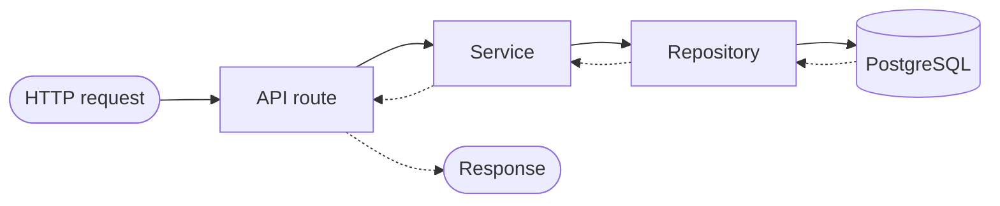
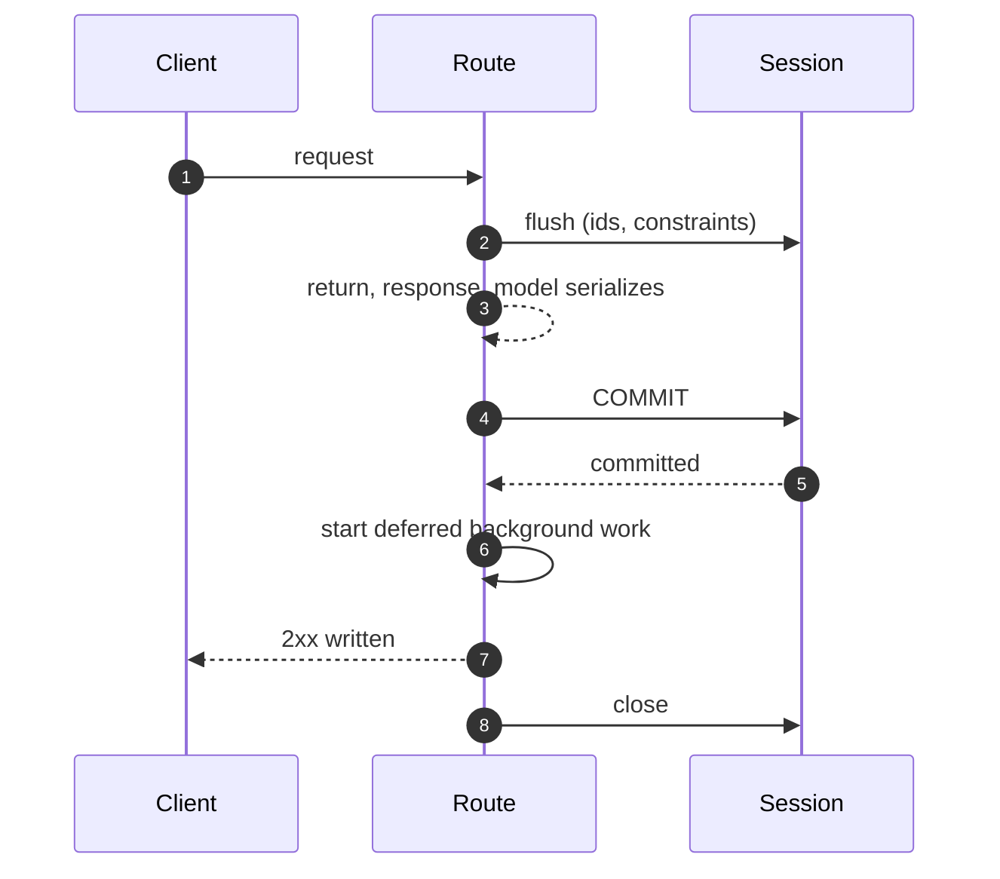

# Architektur { #architecture }

Dieses Projekt folgt einer geschichteten **Repository-und-Service**-Architektur.
Jedes Feature — Nutzer, Unterhaltungen, Dateien, RAG-Dokumente, Sync-Quellen —
nutzt dasselbe Muster: **Models → Schemas → Repositories → Services → Endpoints**.

## Ablauf einer Anfrage { #request-flow }



Routes enthalten nie direkte Datenbankaufrufe. Jeder Datenzugriff läuft über
Services, die ihrerseits an Repositories delegieren.

!!! info "Es ist ein Test, keine Konvention"

    `backend/tests/test_route_layering.py` schlägt fehl, wenn eine Route ein
    Repository importiert - und ebenso laut, wenn seine Allowlist eine Ausnahme
    behält, die nicht mehr gilt.

Die Regel war in fünf Modulen verrutscht, bevor irgendetwas danach gesucht hat —
kein einziges davon ein Leck, denn jeder Handler hat den Scope übergeben, den er
zufällig kannte. Das ist der Preis: Ein Scope, den eine Route besitzt, ist ein
Scope, den kein Service-Test sehen kann, und der nächste Leser der Entität muss
wissen, dass er dasselbe übergeben muss. Die einzige Ausnahme ist ein `Literal`
von Sortierreihenfolgen, als Typ importiert und nicht als Datenzugriff.

## Verzeichnisstruktur (`backend/app/`) { #directory-structure-backendapp }

| Verzeichnis / Datei | Zweck |
|-----------|---------|
| `api/routes/v1/` | HTTP-Endpunkte, Validierung der Anfrage, Auth |
| `api/deps.py` | Dependency Injection (DB-Session, aktueller Nutzer) |
| **`services/`** | **Geschäftslogik, Orchestrierung** |
| ↳ `user.py` | Nutzer-CRUD, Profilaktualisierungen |
| ↳ `conversation.py` | Verwaltung von Unterhaltungen und Nachrichten |
| ↳ `message_rating.py` | CRUD für Nachrichtenbewertungen, Statistiken, Export |
| ↳ `file_upload.py` | Verarbeitung von Datei-Uploads im Chat |
| ↳ `file_storage.py` | Abstraktion der Dateiablage (lokal / S3) |
| ↳ `rag_document.py` | Lebenszyklus eines RAG-Dokuments |
| ↳ `rag_sync.py` | Orchestrierung der Synchronisation entfernter Quellen |
| ↳ `sync_source.py` | CRUD für Sync-Quellen, und die Laufhistorie einer Quelle |
| ↳ `audit.py` | Lesen des Audit-Trails der eigenen Organisation des Aufrufers |
| **`repositories/`** | **Datenzugriffsschicht, Datenbankabfragen** |
| ↳ `user.py` | Nutzerabfragen |
| ↳ `conversation.py` | Abfragen zu Unterhaltungen |
| ↳ `chat_file.py` | Abfragen zu Chat-Dateien |
| ↳ `message_rating.py` | Abfragen zu Nachrichtenbewertungen |
| ↳ `rag_document.py` | Abfragen zu RAG-Dokumenten |
| ↳ `sync_log.py` | Abfragen zu Sync-Logs |
| ↳ `sync_source.py` | Abfragen zu Sync-Quellen |
| **`schemas/`** | **Pydantic-Modelle für Anfrage und Antwort** |
| ↳ `user.py` | Nutzer-Schemas |
| ↳ `conversation.py` | Schemas für Unterhaltungen und Nachrichten |
| ↳ `file.py` | Schemas für Datei-Uploads |
| ↳ `message_rating.py` | Schemas für Nachrichtenbewertungen |
| ↳ `rag.py` | Schemas für RAG-Abfrage und -Antwort |
| ↳ `sync_source.py` | Schemas für Sync-Quellen |
| **`db/models/`** | **SQLAlchemy-2.0-Modelle** |
| ↳ `user.py` | Nutzer-Modell |
| ↳ `conversation.py` | Modelle für Unterhaltung und Nachricht |
| ↳ `chat_file.py` | Modell für Chat-Dateien |
| ↳ `message_rating.py` | Modell für Nachrichtenbewertungen |
| ↳ `webhook.py` | Webhook-Modell |
| ↳ `rag_document.py` | Modell für RAG-Dokumente |
| ↳ `sync_log.py` | Modell für Sync-Logs |
| ↳ `sync_source.py` | Modell für Sync-Quellen |
| `core/config.py` | Einstellungen über pydantic-settings |
| `core/security.py` | Hilfsfunktionen für JWT / API-Key |
| `agents/` | KI-Agents und Tools |
| `rag/` | RAG-Modul (Embeddings, Vector Store, Retrieval) |
| `rag/connectors/` | Sync-Connectors (Google Drive, S3) |
| `commands/` | CLI-Kommandos im Django-Stil |

## Verantwortlichkeiten der Schichten { #layer-responsibilities }

### API-Routes (`api/routes/v1/`) { #api-routes-apiroutesv1 }
- Behandlung von HTTP-Anfrage und -Antwort
- Eingabevalidierung über Pydantic-Schemas
- Prüfungen der Authentifizierung und Autorisierung
- Enthält **nie** direkte DB-Aufrufe — delegiert immer an einen Service
- **Parst nie** nicht vertrauenswürdige Eingaben im Route-Ausdruck. Ein dort
  ausgelöster `ValidationError` ist ein `ValueError`, aber kein
  `RequestValidationError`, also bildet ihn kein Handler ab und der Aufrufer
  bekommt eine 500 mit `details: null` — und genau so wurde jeder Fehler in einem
  von Hand bearbeiteten Spec-YAML als Absturz gemeldet (#873). Das Parsen ist
  Aufgabe des zuständigen Service, und die Ablehnung ebenso: `import_spec` auf
  `AgentRegistryService` beantwortet ein defektes Dokument mit einer 400, die das
  Feld benennt, und zitiert dem Aufrufer nie zurück, was er gesendet hat.

### Services (`services/`) { #services-services }
- Geschäftslogik und Validierung
- Orchestriert einen oder mehrere Repository-Aufrufe
- Löst Domänen-Exceptions aus (`NotFoundError`, `AlreadyExistsError` usw.)
- Verwaltet Transaktionsgrenzen

### Repositories (`repositories/`) { #repositories-repositories }
- Nur Datenbankoperationen
- Keine Geschäftslogik
- Nutzt `db.flush()`, nicht `commit()` — die Session der Anfrage besitzt die
  Transaktion und [committet sie, bevor die Antwort gesendet wird](#the-requests-transaction)
- Gibt Domänenmodelle zurück

### Schemas (`schemas/`) { #schemas-schemas }
- Getrennte `Create`-, `Update`- und `Response`-Modelle je Entität
- `Response`-Schemas nutzen `model_config = ConfigDict(from_attributes=True)` für die ORM-Umwandlung

### Models (`db/models/`) { #models-dbmodels }
- Modelldefinitionen für SQLAlchemy 2.0
- Beziehungen, Indizes und Spaltenvorgaben stehen hier

### RAG-Connectors (`rag/connectors/`) { #rag-connectors-ragconnectors }
- Einsteckbare Sync-Adapter, die `BaseSyncConnector` implementieren
- Jeder Connector stellt `list_files()` und `download_file()` bereit
- Registriert in `CONNECTOR_REGISTRY`, um zur Laufzeit gefunden zu werden

## Die Transaktion der Anfrage { #the-requests-transaction }

Eine Anfrage, eine Session, eine Transaktion, an einer Stelle committet — und die
Stelle zählt ebenso sehr wie die Tatsache.

Eine Route fordert `DBSession` an (`app/api/deps.py`), was `get_db_session`
auflöst (`app/db/session.py`). Alles unterhalb der Route teilt sich diese eine
Session: Services nehmen sie in ihrem Konstruktor, Repositories als erstes
Argument, und keines von beiden ruft je `commit()` auf — mit einer bewussten
Ausnahme, dem Pfad eines Agent-Runs, [unten](#the-run-paths-two-commits)
beschrieben. `flush()` sendet die Statements, sodass die Zeile eine Id hat und die
Constraints geprüft sind; der Commit passiert einmal, auf dem Weg hinaus.

**Auf dem Weg hinaus heißt: bevor die Antwort geschrieben wird.** Der Alias
deklariert `Depends(get_db_session, scope="function")`, was den Exit-Code der
Session auf dem Exit-Stack registriert, den FastAPI zwischen der Rückkehr der
Path-Operation und `await response(scope, receive, send)` abbaut. Die Reihenfolge
für eine Anfrage ist also:

1. die Route kehrt zurück, und `response_model` serialisiert, was sie zurückgab;
2. die Transaktion committet — oder rollt zurück, falls etwas ausgelöst wurde;
3. die von der Anfrage aufgeschobene Hintergrundarbeit wird gestartet (unten);
4. die Antwort wird in den Socket geschrieben;
5. die Session wird geschlossen.



!!! danger "Eine 2xx heißt, dass der Schreibvorgang lesbar ist, nicht bloß angenommen"

    Diese Reihenfolge ist der ganze Vertrag. Ein blankes
    `Depends(get_db_session)` an irgendeiner Stelle führt FastAPIs Voreinstellung
    wieder ein und vertauscht Schritt 2 und 4 -
    `tests/api/test_db_session_scope.py` schlägt bei einem solchen fehl.

Diese Reihenfolge ist es, die einen Client auf seine eigene Antwort hin handeln
lässt. FastAPIs Voreinstellung für eine Dependency mit `yield` ist
`scope="request"`, was Schritt 2 und 4 andersherum setzt — und es hier tat bis
[#353][353], wo eine Annahme mit 204 antwortete, während die von ihr erzeugte
Mitgliedschaftszeile für die unmittelbar nächste Anfrage 21,7 ms lang unsichtbar
blieb, und ein Einladungstoken 34 ms verbraucht wurde, bevor die Transaktion, die
es ausgab, committet hatte.

Drei Konsequenzen, die man kennen sollte, bevor man eine Route schreibt:

- **Ein fehlgeschlagener Commit ist eine 500, keine Logzeile.** Die Antwort ist
  noch nicht geschrieben, ein zurückgestelltes Constraint oder eine verlorene
  Verbindung erreicht den Client also als Fehler, statt hinter einer bereits
  gesendeten 2xx entdeckt zu werden. Schritt 3 läuft ebenfalls nicht: Arbeit, die
  auf eine nicht stattgefundene Transaktion wartet, wird verworfen, mit einer
  Warnung, die sie benennt.
- **Alles, was einen Datenbankfehler schluckt, muss die Session zurücksetzen.** Ein
  Statement, das ausgelöst hat, hinterlässt seine Transaktion abgebrochen, und der
  Commit in Schritt 2 löst ebenfalls aus. Die Health-Probes
  (`app/services/health.py`) sind der Fall im Code: Sie weigern sich absichtlich
  weiterzugeben, also rollen sie vor der Rückkehr zurück.
- **Ein Body, der beim Senden der Antwort erzeugt wird, braucht eine andere
  Session.** Eine `StreamingResponse` über einen Generator wird während Schritt 3
  durchlaufen, und da ist die Session geschlossen. Diese Endpunkte nehmen
  `StreamingDBSession`, die FastAPIs voreingestellten Scope behält und daher nur
  lesend ist: Ihre Transaktion löst sich auf, nachdem der Client beantwortet
  wurde. Genau ein Endpunkt nutzt sie — der CSV-Export der Bewertungen — und
  `tests/api/test_db_session_scope.py` lehnt einen zweiten ab, ohne dass darüber
  entschieden wird.

Arbeit, die die Anfrage überdauert, nutzt diese Session gar nicht.
WebSocket-Handler und CLI-Kommandos öffnen `get_db_context()`, Worker-Tasks
`get_worker_db_context()`; alle drei laufen über dasselbe `_managed_session`, sie
committen also beim sauberen Verlassen ihres eigenen `async with` und starten ihre
aufgeschobene Arbeit an derselben Stelle — was mit einer Antwort nichts zu tun hat.

### Die zwei Commits des Run-Pfads { #the-run-paths-two-commits }

Ein Pfad committet absichtlich früher als „auf dem Weg hinaus“: **ein Agent-Run.**

Der Runner committet einmal *vor dem Aufruf des Modells* und ein weiteres Mal im
abschließenden `finally` — `AgentRunnerService._run`, und `ChatAgentRunner.run`
für den Streaming-Chat.

Ein Modellaufruf dauert Sekunden bis Minuten, und eine darüber offen gelassene
Transaktion hält für diese Dauer eine Verbindung aus dem Pool `idle in
transaction`. Fünfzehn gleichzeitige Runs waren früher der ganze Pool ([#12][12]).

Zuerst zu committen bringt zwei weitere Dinge: Die Run-Zeile ist für die gesamte
Lebensdauer des Runs aus jeder anderen Session lesbar, und das Verlassen der
Freigabe-Warteschlange durch einen fortgesetzten Run ist dauerhaft, bevor der
freigegebene Aufruf wiederholt wird — sodass ein Absturz mitten in der
Wiederholung dieselbe Freigabe nicht zweimal ausgeben kann ([#3][3]).

Der abschließende Commit ist die andere Hälfte. Der Session-Kontext committet nur
bei einem sauberen Verlassen, was ein fehlgeschlagener, vom Budget gestoppter oder
abgebrochener Run nicht ist, und ein in der Historie fehlender Run ist ein Run, für
den niemand geradesteht.

Beide Grenzen sind gegen eine echte Datenbank in
`tests/integration/test_run_commit_boundary.py` nachgewiesen.

Sichtbarkeit schneidet in beide Richtungen. Alles, was früher schloss „die Zeile
eines laufenden Runs kann nicht gesehen werden“, schließt jetzt über eine Zeile,
die *gesehen wird*, und der Scheduler der Agent-Trigger ist die eine Stelle, die
das tat.

Sein Überschneidungsschutz blockiert bei jedem nicht-terminalen Run in der
Unterhaltung des Triggers — worunter jetzt auch der laufende Run eines
gleichzeitigen `run_now` oder Event-Auslösers fällt, ein Schutz, den die alte
Unsichtbarkeit nicht bieten konnte.

Ein Worker, der mitten im Run stirbt, hinterlässt derweil eine `running`-Zeile, die
im Prozess nichts je beenden wird. Was diese Zeile begrenzt, ist der stündliche
Durchlauf für abgestandene Runs, der sie nach `STALE_RUN_REAPED_AFTER_HOURS` als
`failed` beendet. Das eigene Lebenszeichen einer geplanten Auslösung bleibt ihre
erneuerte Lease (`app/repositories/agent_trigger.py::claim_due`).

[Governance](governance.md#a-run-whose-process-died) sagt, was der Durchlauf klärt
und was er bewusst in Ruhe lässt.

### Hintergrundarbeit aus einer Anfrage heraus anstoßen { #dispatching-background-work-from-a-request }

**Arbeit, die eine Zeile lesen wird, die diese Anfrage geschrieben hat, wird mit
`spawn_after_commit` übergeben, nie mit `spawn`** (beide in
`app/core/background.py`):

```python
from app.core.background import spawn_after_commit

spawn_after_commit(self.db, ingest_document_flow(rag_document_id=str(doc.id)), name=...)
```

`spawn` erzeugt den Task sofort, und die Loop startet ihn am nächsten
Unterbrechungspunkt — das ist Schritt 1 oder 2 oben, vor dem Commit. Der Flow
öffnet korrekterweise eine eigene Session, kann unter `READ COMMITTED` also keine
Zeile sehen, die diese Anfrage nicht committet hat: Er sucht das Dokument, dessen
Id er bekommen hat, findet nichts und hört auf. Das ist [#417][417], und seine
sichtbare Gestalt ist ein Upload, der mit `{"status": "processing"}` beantwortet
wird und für immer so bleibt.

`spawn_after_commit` stellt die Coroutine stattdessen auf der Session in die
Warteschlange. Nichts startet sie vor Schritt 3, zwei Statements nachdem
`commit()` zurückgekehrt ist, sodass ein so angestoßener Flow eine Zeile liest,
der die Datenbank bereits zugestimmt hat. So werden ein Dokument-Upload, eine von
jemandem gestartete Synchronisation, der Stream einer Channel-Connection und das
manuelle „run now“ eines Triggers allesamt übergeben. Die Reihenfolge ist gegen
eine echte Datenbank in `tests/integration/test_flow_starts_after_commit.py`
nachgewiesen.

Am anderen Ende des Prozesslebens schließt die Lifespan der Anwendung den Kreis:
Nachdem die Annahme gestoppt und das Ausliefern abgeflossen ist, `await`et sie
`background.drain()` für alles, was `spawn` übergeben hat und noch unterwegs ist,
**bevor** sie den Vector Store, Redis und die Session verwirft, aus denen diese
Tasks lesen. Ohne das brach ein Herunterfahren mitten in der Ingestion den Flow ab
und ließ das Dokument in `processing` zurück — dieselbe feststeckende Zeile wie
[#417][417], vom anderen Ende her erreicht.

Die manuelle Auslösung des Triggers steht dort aus einem zweiten, nennenswerten
Grund, denn er ist die andere Hälfte davon, warum eine Anfrage überhaupt Arbeit
übergibt: `POST /agents/{id}/triggers/{id}/run` hat den gestarteten Run früher
*abgewartet*, sodass ein Agent, der langsamer war als das Lesezeitlimit eines
Proxys, mit 504 antwortete, während der Run weiterlief und committete — ein
Fehlschlag, gemeldet für etwas, das funktionierte, und eine Einladung, die
Schaltfläche erneut zu drücken und den Zeitplan zweimal auszulösen ([#658][658]).
Die Route antwortet mit `202`, und die Auslösung startet nach dem Commit.

!!! warning "Es ist keine Warteschlange, die den Prozess überlebt"

    `spawn_after_commit` führt die Arbeit nur aus, wenn der Prozess lange genug
    lebt, um sie zu starten. Das ist in Ordnung für Arbeit, die eine spätere
    Anfrage reproduzieren kann, und nicht in Ordnung für Arbeit, deren *Eingabe*
    der Commit gerade zerstört hat - eine Organisationslöschung übergibt die Pfade
    und Collection-Namen, deren letzten Nachweis ihr eigener Commit entfernt hat,
    ein Absturz zwischen beiden verliert sie also endgültig.

    Wo das zutrifft, wird die Absicht als Zeile in derselben Transaktion
    geschrieben, und die Übergabe wird zur Optimierung: `teardown_intents` benennt,
    was noch freizugeben ist, der Flow löscht die Zeile, sobald er es getan hat,
    und ein Durchlauf stößt erneut an, was nichts zu Ende gebracht hat. Das Fehlen
    der Zeile ist der Abschluss, eine leere Tabelle heißt also, dass nichts
    aussteht.

Aus dem Ort der Warteschlange folgen zwei Dinge:

- **Sie gehört zur Session, nicht zur Anfrage.** Ein Service, der einen Flow
  anstößt, muss nicht wissen, ob er von einer Route, einem WebSocket-Handler, der
  CLI oder einem Worker aufgerufen wurde — und darum ist das nicht FastAPIs
  `BackgroundTasks`, dessen Garantie sich auf die Antwort bezieht und das jene
  drei anderen Aufrufer nicht haben.
- **Eine zurückgerollte Transaktion stößt nichts an.** Schritt 3 wird übersprungen
  und die eingereihten Coroutinen werden geschlossen, denn Arbeit auszuführen,
  deren Zeile verworfen wurde, verschiebt den Fehlschlag nur an eine Stelle, an der
  er weniger erklärlich ist.

`spawn` bleibt richtig für Arbeit, die alles Nötige selbst besitzt — die
Benachrichtigungs-E-Mails in `app/services/notifications.py` tragen ihren eigenen
Kontext und berühren keine Zeile. Keines von beiden ist eine Job-Queue: Alles, was
einen Neustart überleben muss, ist ein Prefect-Deployment.

[3]: https://github.com/vstorm-co/agenticos/issues/3
[12]: https://github.com/vstorm-co/agenticos/issues/12
[353]: https://github.com/vstorm-co/agenticos/issues/353
[417]: https://github.com/vstorm-co/agenticos/issues/417
[658]: https://github.com/vstorm-co/agenticos/issues/658

## Agent-Runs: Eine Capability holt nie selbst { #agent-runs-a-capability-never-fetches }

Die obige Schichtung hat innerhalb eines Agent-Runs eine weitere Regel, und sie ist
der Grund, warum der Runner so groß ist. **Eine Capability fasst die Datenbank
nicht an.** Alles, was sie von dort braucht — die Collection-Namen, die ihr Spec
bindet, die Skills, die sie laden darf, den Workspace, in den sie schreibt, die
Delegierten, die sie aufrufen darf — löst der Service *vor* dem Start des Runs auf
und übergibt es als `resources`, ein Dict, das die Capability lesen und dem sie
nichts hinzufügen kann. Das Modell fragt, *was* zu suchen ist; es erfährt nie, *wo*.

Zwei Einträge in diesem Dict sind Nahtstellen zu anderen Subsystemen und keine
bloßen Daten:

| Resource | Hinterlassen vom Runner | Gelesen von |
|---|---|---|
| `WORKSPACE_BACKEND_RESOURCE` | der geöffneten Sandbox-Session | der `sandbox`-Capability |
| `SUBAGENT_RUNTIME_RESOURCE` | dem aufgelösten Delegationsbaum | der `subagents`-Capability |

Delegation ist der schärfste Fall für diese Regel. Ein Delegierter ist eine Zeile;
ebenso seine gepinnte Version, seine Collections, seine Skills und seine Secrets,
und jedes davon muss `resolve_access` passieren, bevor es gelesen wird. Also läuft
der Runner den ganzen Baum ab — die Verschachtelung, die Tiefengrenze, die
Ablehnung eines Delegierten, der im selben Run bereits darüber läuft —, solange er
noch eine Session und einen Auth-Kontext hält, und hinterlässt Closures, die einen
bereits aufgelösten Agent bauen, plus einen Recorder, der eine Zeile schreibt. Was
zur Laufzeit passiert, ist CPU-Arbeit und Pydantic AI.

Andersherum geht es nicht: Die `AsyncSession` der Anfrage wird von allem im Run
geteilt und ist nicht nebenläufigkeitssicher, ein zur Laufzeit abgelaufener Baum
wäre also eine Abfrage aus einem Tool-Aufruf heraus — und ein Fan-out wären mehrere
davon gleichzeitig, was die Session beschädigt, die der Rest der Anfrage nutzt,
statt bloß langsam zu sein.

Das Fehlen einer Resource ist nie ein Fehler. Eine Vorschau, ein Unit-Test oder ein
Agent, dessen Delegierte alle entfernt wurden, löst nichts auf, und die Capability
bietet dann keine Delegierten an, statt auszulösen — genau so, wie die
Workspace-Capability auf ein Backend im Speicher zurückfällt.

### Schema { #schema }

`0007_delegated_runs` fügt `agent_runs` zwei Spalten hinzu.

**`parent_run_id`** ist ein selbstbezüglicher Fremdschlüssel, der sagt, welcher Run
diesen delegiert hat, und er hält die Monatssumme der Organisation ehrlich — siehe
[Governance](governance.md#what-a-delegated-run-is-recorded-as).

Er ist `ON DELETE SET NULL`, aus derselben Arithmetik heraus: Den Elternteil zu
löschen entfernt die Zeile, die diese Kosten enthielt, eine Delegationszeile, die
oberste Ebene wird, ist also eine, die zu zählen beginnen *soll*. Ein Cascade würde
den Nachweis ausgegebenen Geldes löschen.

**`subagent_task_id`** ist die eigene Task-Id der Delegationsbibliothek, die die
Zeile mit dem Handle verbindet, das das Modell des Elternteils in seinem Transkript
sah. Weil ein Fremdschlüssel nur seine eigene Spalte nullen kann, überlebt dieses
Handle die Löschung und wird von `AgentRunRead` zurückgehalten — statt von einem
Trigger auf der am häufigsten beschriebenen Tabelle des Schemas genullt zu werden.

Der Index auf `parent_run_id` bedient `list_runs(parent_run_id=...)`, was
`GET /runs?parent_run_id=` anfragt. Siehe
[Governance](governance.md#what-run-history-shows) dazu, warum die Run-Historie die
beiden Arten von Zeile nie zusammen auflistet.

## Ein Mitglied oder einen Tenant löschen { #deleting-a-member-or-a-tenant }

Ein paar Fremdschlüssel würden beim Löschen genau den Schreibvorgang erzwingen, den
ein `CHECK`-Constraint verbietet — das vom Schema deklarierte Cascade und die
ebenfalls von ihm deklarierte Invariante widersprechen sich also, und die Löschung
löst innerhalb der Datenbank eine 500 aus, statt irgendetwas zu tun. Drei Paare
werden im Service in Einklang gebracht, bevor die Zeile geht, innerhalb der
Transaktion der Anfrage selbst:

- **Das private Secret einer ausscheidenden Person.**
  `organization_secrets.owner_user_id` ist `SET NULL`, doch
  `ck_secret_private_needs_owner` verbietet ein privates Secret ohne Besitzer.
  `UserService.delete` hebt die privaten Secrets der ausscheidenden Person zuerst
  auf Org-Sichtbarkeit, sodass das Null, das das Cascade schreibt, zulässig ist und
  der Schlüssel für die Organisation erreichbar bleibt, statt gestrandet zu sein.
- **Die Organisationen einer Erstellerin.** `organizations.created_by_user_id` ist
  `RESTRICT`, und jede Registrierung erzeugt eine persönliche Org, ein blankes
  `DELETE users` hat für ein echtes Konto also nie funktioniert. Die persönliche Org
  wird mit ihrer Besitzerin entfernt; eine geteilte wird an eine andere Besitzerin
  übergeben, oder die Löschung wird abgelehnt, wenn es niemanden gibt, dem sie zu
  übergeben wäre.
- **Eine org-gebundene Collection.** `knowledge_bases.organization_id` ist
  `SET NULL`, doch `ck_knowledge_bases_org_scope_has_org` verbietet eine
  org-gebundene Zeile ohne Org. `OrganizationService.delete` entfernt org-gebundene
  Collections ausdrücklich — samt Vektortabelle —, bevor die Org-Zeile geht; eine
  persönliche Collection, die bloß die Id der Org trägt, bleibt dem `SET NULL`
  überlassen, was ihr Scope erlaubt. Weil das Verwerfen der Vektortabelle den
  anfragegebundenen Store braucht, verdrahtet die Löschroute ihn über eine eigene
  Dependency; jede andere Org-Route nutzt den einfachen Service und baut keinen
  Store, den sie nie anfassen würde.

## Was ein Run seinem Modell übergeben hat, und warum das eine Tabelle ist { #what-a-run-handed-its-model-and-why-it-is-a-table }

`run_manifests` hält eine Zeile je Run: die Instruktionen so, wie sie
zusammengesetzt und gesendet wurden, jede Tool-Definition so, wie der Provider sie
bekam, die Einstellungen, einen Eintrag je Modellanfrage und die Nachrichtenliste
der letzten Anfrage. Sie wird von `AgentRunnerService.finish` auf jedem Weg aus
einem Run heraus geschrieben und von `GET /runs/{id}/manifest` gelesen — siehe
[Konzepte](concepts.md#a-run-and-what-it-handed-the-model) dazu, was festgehalten
wird und warum es sich nicht aus dem Spec rekonstruieren lässt.

Drei Schichtungsentscheidungen lohnen es, aufgeschrieben zu werden, denn jede ist
eine Stelle, an der die naheliegende Alternative falsch ist.

**Eine Tabelle, keine Spalte auf `agent_runs`.** Jene Tabelle wird im Produkt am
häufigsten aufgelistet — Run-Historie, der Ausgaben-Tab, die Dashboard-Zahlen, der
CSV-Export — und ein JSONB-Dokument mit dem JSON-Schema jedes Tools würde von all
diesen gelesen, um eine Frage zu beantworten, die keines von ihnen stellt. Eine
Zeile je Run, `ON DELETE CASCADE` sowohl vom Run als auch von der Organisation, nur
von der Detailansicht gelesen.

**Das Aufzeichnen geschieht in `app/agents/manifest.py`, nicht im Service.** Das
Modell, mit dem der Agent gebaut wird, wird umhüllt (`RecordingModel`, ein
`WrapperModel` — dieselbe Form, die `MeteredModel` nutzt, um die Ausgaben eines
Sub-Agents zu verbuchen), sodass festgehalten wird, was
`ModelRequestParameters` war, als der Provider sie empfing: nach jedem
`prepare`-Hook, nachdem die Tool-Suche verborgen hat, was sie verbirgt, nachdem das
Output-Tool hinzugefügt wurde. Der Service speichert, was der Wrapper gesammelt
hat, und entscheidet nichts über dessen Inhalt.

**Ein Anhang am Transkript wird über den Run gelesen, nicht über seinen
Hochladenden.**

`GET /files/{id}` ist auf `ChatFile.user_id` beschränkt, was der richtige Scope für
den Chat-Composer und der falsche für die Durchsicht eines Runs ist. Einen Run zu
lesen ist das Recht der Organisation und nicht das ihrer Starterin, also wurden die
Anhangskarten im Transkript einer Kollegin gerendert und jede Vorschau mit 404
beantwortet.

`GET /runs/{run_id}/files/{file_id}` autorisiert so, wie es das Transkript tut —
Organisation, dann `runs:view` — und lässt die Datei dann nur dort zu, wo ihre
`message_id` einen Zug der Unterhaltung des Runs selbst benennt. Genau so weit
reicht das Transkript ohnehin schon, und nicht weiter.

Beide Routen liefern die Bytes über `_chat_file_bytes.py` aus, sodass das, was ein
Browser *anzeigen* darf, nicht davon abhängt, welche von beiden den Lesezugriff
autorisiert hat.

**Der Schreibvorgang ist abgesichert *und* geschachtelt.** Er wird aus einem
`finally`-Block erreicht, eine beim Aufzeichnen eines fehlgeschlagenen Runs
ausgelöste Exception würde den Fehlschlag also durch sich selbst ersetzen. Sie zu
schlucken genügt für sich allein nicht: Ein fehlgeschlagener Flush lässt die
Session unbrauchbar zurück, der eigene abschließende Schreibvorgang des Runs ginge
also an eine Aufzeichnung verloren, die niemand verlangt hat. Er läuft aus demselben
Grund in `begin_nested()` wie bei `TranscriptService._attach` — ein SAVEPOINT ist
das, was „dieser Schreibvorgang darf harmlos fehlschlagen“ wahr statt bloß
wünschenswert macht.

## Eine Ablehnung, die ein Feld benennt { #a-refusal-that-names-a-field }

Jede Ablehnung verlässt das System in einer Hülle,
`{"error": {"code", "message", "details"}}`, und eine Ablehnung, die ein *Feld*
betrifft, benennt es in einer Form:

```json
{"details": {"fields": [{"field": "spec.name", "message": "String should have at most 128 characters"}]}}
```

`fieldProblems` in `frontend/src/lib/api-error.ts` liest genau das und sonst
nichts, und das ist es, was ein Formular die fehlerhafte Eingabe markieren lässt,
statt einen Satz zu zeigen, für den der Leser die Seite erneut absuchen muss.
`app/core/field_errors.py` ist die einzige Stelle, an der sie gebaut wird, und sie
hat drei Einstiegspunkte. Zwei davon lesen Pydantic, und **wer der Aufrufer ist,
entscheidet, was das erste Element von `loc` bedeutet**:

| | Für | `loc` beginnt mit |
|---|---|---|
| `request_field_problems` | `validation_exception_handler`, jeden `RequestValidationError` | woher der Wert kam (`body`, `query`, …), was verworfen wird |
| `field_problems(…, root=…)` | einen Service, der ein Dokument validiert, das das Schema einer Route nicht kann — eine Ingestion-Übersteuerung je Upload, ein von Hand bearbeitetes Spec-YAML, den Config-Blob einer Capability | einem Feld dieses Dokuments, gemeldet unterhalb von `root` |
| `refused_field(field, message, **context)` | eine Regel, die ein Service in Prosa statt in einem Modell festhält — einen Endpunkt, der ein Passwort trägt, einen Mattermost-Bot, der seinen Server verliert, ein YAML-Dokument, das nie geparst wurde | — er antwortet mit dem `BadRequestError`, den der Aufrufer auslöst |

`refused_field` benennt den Satz einmal, denn das `message` der Hülle und das des
Feldes sind derselbe Satz; ein Auslöser, der einen anderen Status braucht, baut
dieselben `details` mit `field_details`. Achtzehn Aufrufstellen antworteten
stattdessen mit `details={"field": "<name>"}`, im Singular, mit dem Satz auf der
Hülle, und kein Formular hat es je gelesen — derselbe Defekt in einer dritten Form
([#891](https://github.com/vstorm-co/agenticos/issues/891)). Eine vierte
Schreibweise war `details={"<field>": <value>}`, wo der Schlüssel der Feldname war
und der Wert das, was der Aufrufer gerade gesendet hatte: `model_profile.py`
beantwortete eine abgelehnte Modell-Id mit der Id, im Body und in der Logzeile
daneben ([#898](https://github.com/vstorm-co/agenticos/issues/898)).

Nach der Zeichenkette zu entscheiden würde stattdessen ein Spec falsch lesen,
dessen verbotener Schlüssel auf oberster Ebene buchstäblich `body` heißt — eine
Form, die für zwei Dinge steht, und genau der Fehler, den das Modul beenden soll.

Zwei weitere Eigenschaften sollte man kennen, bevor man eine Aufrufstelle
hinzufügt. Sie liest nur `loc` und `msg`, der abgelehnte Wert kann also nicht neben
dem Feld zurückkommen, das er kaputtgemacht hat, und darum übergeben diese
Aufrufstellen ihr `exc.errors()` ungefiltert. Und `root` ist das, was das Formular
des Aufrufers das ganze Dokument nennt, jeder Pfad ist also relativ dazu: Das gibt
einem `model_validator(mode="after")` einen Landeplatz — er meldet `loc: ()`, weil
die von ihm gebrochene Regel zwei Felder zugleich betrifft — und es bringt die
Einstiegspunkte in Einklang, sodass eine beim Upload abgelehnte Übersteuerung genau
das benennt, was die 422 benennt, wenn dasselbe Paar als die eigenen Einstellungen
einer Collection ankommt.

Pydantics eigenes `exc.errors()` stattdessen durchzureichen war
[#882](https://github.com/vstorm-co/agenticos/issues/882) — eine zweite Form, die
`input`, `ctx` und `url` trug und die im Frontend nichts las.

**Eine gebündelte Ablehnung trägt beide Hälften.**

`validate_spec` meldet jedes Problem eines Specs auf einmal, und die meisten davon
sind kaputte Referenzen ohne eine Eingabe, die zu markieren wäre. Also antwortet es
mit `details.problems` — je eine Zeile, die der Builder auflistet — und mit
`details.fields` für die Teilmenge, die eines benennt.

Die Konfiguration einer Capability ist der eine Teil eines Specs, der als
generiertes Formular gerendert wird, ihre Ablehnungen benennen die Eingabe also:
`capabilities.knowledge.config.default_top_k`, mit `specialists.researcher.` davor
bei einer Capability, die innerhalb eines Delegierten konfiguriert ist, denn der
Builder rendert ein Formular je Spezialist.

Nur den Satz zu behalten war die andere Hälfte von #882. Einen Entwurf zu speichern
validiert ein Config-Schema überhaupt nicht, die Publish-Validierung ist also die
einzige Stelle, an der eine vertippte Einstellung je abgelehnt wird.

**Zwei Arten von Ablehnung benennen bewusst kein Feld**, und die Grenze zwischen
ihnen und dem Rest ist es, was die eine Form davon abhält, wieder zweierlei zu
bedeuten:

- **Eine Ablehnung über einen Wert, den kein Aufrufer gesendet hat.** Der Name einer
  entfernten Datei wird von dem gewählt, der eine Datei in den synchronisierten
  Ordner legen kann, und beide Prüfungen in
  `app/services/rag/remote_names.py` laufen innerhalb einer Hintergrund-Synchronisation,
  wo der Leser ein Log ist und kein Formular. Dasselbe für eine Google-Drive-Quelle,
  die ohne ihre Zugangsdaten zurückgelesen wird: Die Zeile ist gespeichert, und
  `validate_config` des Connectors, abgeleitet aus seinem `CONFIG_MODEL`, ist das,
  was sie an der Route ablehnt.
- **Ein Konflikt.** `AlreadyExistsError` meldet eine Tatsache über eine Zeile, die
  bereits existiert, nicht über die Gestalt des Gesendeten — und welche der eigenen
  Eingaben eines Formulars den belegten Wert erzeugt hat, weiß nur das Formular,
  denn das Handle eines Agents leitet sich aus einem Namen ab, den niemand als
  Handle getippt hat. Das behauptet `identifiedBy` von `submitFailure` auf dem
  Client, eine 409 trägt also den belegten Wert und kein Feld.

## Wichtige Dateien { #key-files }

- Einstiegspunkt: `app/main.py`
- Konfiguration: `app/core/config.py`
- Dependencies: `app/api/deps.py`
- Auth-Hilfsfunktionen: `app/core/security.py`
- Exception-Handler: `app/api/exception_handlers.py`
- Ablehnungen auf Feldebene: `app/core/field_errors.py`

## Authentifizierung und Autorisierung { #authentication-authorization }

### Authentifizierungsverfahren { #authentication-methods }

Das Projekt unterstützt zwei Authentifizierungsverfahren, beide stets verfügbar:

1. **JWT (JSON Web Tokens)** -- Genutzt vom Frontend und von API-Clients.
   - Die Anmeldung über `POST /api/v1/auth/login` liefert `access_token` + `refresh_token`.
   - Access-Tokens laufen nach `ACCESS_TOKEN_EXPIRE_MINUTES` ab (voreingestellt 30 Min.).
   - Refresh-Tokens laufen nach `REFRESH_TOKEN_EXPIRE_MINUTES` ab (voreingestellt 7 Tage).
   - Das Frontend speichert Tokens als HTTP-only-Cookies.
   - Die WebSocket-Auth übergibt das JWT als Query-Parameter (`?token=<jwt>`) oder als Cookie.

2. **API-Key** -- Genutzt für Server-zu-Server- und programmatischen Zugriff.
   - Übergeben über den Header `X-API-Key` (konfigurierbar über `API_KEY_HEADER`).
   - Ein einzelner geteilter Schlüssel, gesetzt über die Umgebungsvariable `API_KEY`.
   - Nutzt einen zeitkonstanten Vergleich (`secrets.compare_digest`), um Timing-Angriffe zu verhindern.

### Wo eine frische Session landet { #where-a-fresh-session-lands }

Drei Türen begründen eine Session auf drei Wegen - das Passwortformular, der
OAuth-Callback und ein Magic Link - und genau eine von ihnen entscheidet, wo die
Besucherin landet: `postSignInDestination` in
`frontend/src/lib/auth-landing.ts`, das einen Deep Link nur dann beachtet, wenn er
ein Pfad gleicher Herkunft ist, und sonst das Dashboard antwortet. Drei Antworten
an drei Stellen sind Drift, und die Drift war schon zweimal real: auf der
Rollen-Achse, wo die Landung sich nach Rolle verzweigte, und auf der
Provider-Achse, wo der OAuth-Umweg `?returnTo=` verlor.

Was sich je Tür unterscheidet, ist nur, wie der Pfad *reist*:

| Tür | Wie der Pfad die Landung erreicht |
|---|---|
| Passwortformular | er hat den Tab nie verlassen - direkt aus `?returnTo=` gelesen |
| OAuth-Callback | `sessionStorage`, was zulässig ist, weil der Umweg im selben Tab auf dieser Herkunft beginnt und endet |
| Magic Link | ein signierter Claim im Token, denn dem Link wird aus einer E-Mail gefolgt - ein anderer Tab, oft eine andere Anwendung, wo `sessionStorage` bauartbedingt leer ist |

Der Pfad des Magic Links wird bei der **Anfrage** abgelehnt statt an der Landung
gefiltert: `MagicLinkRequest.return_to` akzeptiert einen Pfad auf diesem Deployment
und nichts mit einem Schema, einem zweiten führenden Schrägstrich, einem
Backslash oder einem Steuerzeichen, sodass ein Token, das sich auf eine beliebige
Zeichenkette bringen ließe, nie existiert. Die Landung beurteilt ihn trotzdem
erneut - eine Prüfung, die einmal auf dem Server über einen Wert läuft, der danach
durch eine E-Mail reist, ist eine Prüfung, auf deren Stattfinden sich der Client
nicht verlassen kann.

`POST /auth/magic-link/verify` antwortet daher mit `MagicLinkToken` - dem
Token-Paar plus `return_to`, unangewendet. Ein eigenes Schema statt eines
nullbaren Feldes auf `Token`, denn die drei anderen Token-Antworten haben keinen
Rückweg zu tragen, und ein Feld, das bei den meisten von ihnen immer null ist, ist
eines, das ein Client zu ignorieren lernt.

### Autorisierung { #authorization }

Es gibt keine Rollenspalte auf dem Nutzer und keine rollenbasierte
Route-Dependency. Was ein Mitglied innerhalb einer Organisation tun darf, ist eine
Berechtigung aus dem Katalog in `app/core/permissions.py`, und welche Zeilen es
anfassen darf, wird je Zeile aufgelöst - siehe [Berechtigungen](permissions.md) für
das ganze Modell.

Zwei Dependencies, und nur zwei:

| Alias | Bedeutet |
|---|---|
| `CurrentUser` | jeden authentifizierten Nutzer |
| `CurrentAppAdmin` | den Superadmin des Deployments (`users.is_app_admin`), für `/admin/*` und die Sammelrouten unter `/rag` |

Alles andere läuft über eines von:

```python
# A permission, on a collection route.
@router.post("/agents", dependencies=[Depends(require(Perm.AGENTS_EDIT))])
async def create_agent(...): ...

# A permission on one row, resolved in the service.
if not await resolve_access(db, ctx, agent, Perm.AGENTS_EDIT, resource_type=AGENT):
    raise AuthorizationError(...)

# A permission decided by a parameter, resolved in the service: scope=org
# demands runs:view, scope=own only a signed-in caller. See Permissions,
# "Where the gates go".
return await service.usage(ctx, scope=scope, ...)
```

!!! note "`require(...)` gehört nicht auf eine Route für eine einzelne Ressource"

    Ein Rollen-Tor kann die Grants auf einer Zeile nicht sehen, es würde eine
    Viewerin mit einem ausdrücklichen `edit`-Grant also ablehnen, bevor
    `resolve_access` ihren Zugriff je erweitert hätte. Dieselbe Form gilt, wenn ein
    *Parameter* die Frage entscheidet - `GET /stats/usage?scope=own` muss für ein
    einfaches Mitglied erreichbar sein, sein Tor lebt also im Service.
    `tests/api/test_platform_routes.py` setzt das alles durch.

!!! note "Eine persönliche Einstellung trägt überhaupt kein Tor"

    Eine Zeile mit dem Scope `(user_id, organization_id)`, die nur ihre Besitzerin
    liest und schreibt, sind keine Org-Daten, also schützt sie keine Berechtigung
    und es gibt keine Route, die an die von jemand anderem heranreicht.
    `GET`/`PUT`/`DELETE /me/dashboard-layout` (die gespeicherte
    Dashboard-Anordnung) und das `/presets`-Regal darunter (die benannten
    Anordnungen, zwischen denen eine Person wechselt) sind das Muster:
    `CurrentUser` + `ActiveOrg`, jede Abfrage auf **beide** Ids gefiltert. Der
    zusammengesetzte Schlüssel ist die ganze Tenant-Grenze — ein in einer
    Organisation gespeichertes Layout oder Preset ist in einer anderen unsichtbar,
    *sogar für seine Besitzerin*, was eine reine Prüfung je Nutzer durchwinken
    würde, also decken `tests/integration/test_dashboard_layout.py` und
    `tests/integration/test_dashboard_preset.py` genau das ab. Es gibt keine Route
    zum *Anwenden eines Presets*: Eines anzuwenden ist das `PUT` der Einträge des
    Presets als aktive Anordnung durch den Client, das Dashboard behält also einen
    Schreibpfad und eine Validierung für das, was es rendert.

    Eine Platzierung darf außerdem `options` tragen — das eigene Fenster der Karte
    (`period`), die Darstellung (`style`) und die Eingrenzung (`agent_id`,
    `user_id`). **Eine gespeicherte Option ist eine Anfrage, nie eine
    Autorisierung**: Sie erreicht `GET /stats/usage` als Query-Parameter und wird
    dort abgelehnt, wenn der Aufrufer nicht lesen darf, wonach sie fragt — genauso,
    als hätte er die URL getippt. Auf eine Kollegin einzugrenzen heißt, die Zeilen
    von jemand anderem zu lesen, also ist es `scope=org` und hinter `runs:view`;
    `scope=own` mit einer `user_id` ist eine 422 statt einer stillen Umdeutung.
    Beim Schreiben werden der Stil und das Fenster gegen die geschlossenen Mengen
    validiert, die die Frontend-Registry deklariert
    (`tests/test_dashboard_registry.py` hält die beiden Spiegel gleich); beim Lesen
    kommen die Optionen wortgetreu zurück, denn ein inzwischen gelöschter Agent darf
    nicht eine ganze Anordnung mit sich reißen.

`UserRole`, `User.has_role()`, `RoleChecker`, `CurrentAdmin` und
`CurrentSuperuser` waren das Modell des Templates und sind fort, zusammen mit der
Spalte `users.role`, die mit dem Zusammenfassen in `0001_baseline` ging. Sie waren
eine dritte Antwort auf eine Frage, die bereits zwei hatte.

### Schutz vor IDOR { #idor-protection }

Zwei Prädikate, und sie sind nicht austauschbar. **Die Organisation ist es, was
einen Lesezugriff begrenzt; der Nutzer ist es, was ihn weiter einengt.**

- Endpunkte für Unterhaltungen übergeben `organization_id=active_org.id`. Ohne das
  wird eine Unterhaltung allein über den Primärschlüssel gesucht, und jeder
  angemeldete Aufrufer, der eine UUID kennt, liest eine Unterhaltung in einem
  anderen Tenant — oder hängt an sie an.
- Sie übergeben außerdem `user_id=current_user.id`, was eine Zeile auf ihre
  Besitzerin oder jemanden beschränkt, mit dem sie geteilt wurde. Die Tenant-Prüfung
  allein genügt nicht: Ohne das kann jedes Mitglied einer Organisation die
  Unterhaltung jedes anderen Mitglieds lesen und daran anhängen.
- **Eine Freigabe trägt das Schreiben nur bei `edit`.** Lesen und Schreiben sind
  zwei Fragen — `_may_read` und `_may_write` — und eine Freigabe beantwortete früher
  beide, welche Stufe sie auch hielt, sodass die beiden Stufen, die der
  Freigabe-Dialog anbietet, dasselbe bedeuteten: Eine zum *Ansehen* geteilte
  Unterhaltung konnte umbenannt, archiviert, gelöscht oder um einen Zug mit
  `role: "assistant"` ergänzt werden, den in `/chat` alle lesen und den das Modell
  als seine eigenen Worte zurückbekommt. Die Stufe wird dem genannt, der sie
  gewährt, also ist sie die Stufe, die durchgesetzt wird (#931).
- Bei `list_messages` erledigt dieses eine Argument zwei Aufgaben — es autorisiert
  *und* reichert jede Nachricht mit der eigenen Bewertung des Aufrufers an. Diese
  Überladung ist der Grund, warum seine autorisierende Hälfte so lange fehlte: Die
  Route übergab es, das Argument stand im Review klar da, und es erledigte die
  andere Aufgabe.
- Datei-Downloads prüfen `chat_file.user_id == current_user.id`, und eine Datei an
  eine Nachricht anzuhängen trägt dieselbe Besitzerin im `WHERE`: Ein Zug, der die
  Datei-Id eines anderen Nutzers benennt — oder eine Datei, die bereits an einer
  Nachricht hängt —, wird abgelehnt, nie still angewendet.

`ConversationService` macht es unmöglich, die Unterscheidung auszulassen:
`organization_id` ist ein **verpflichtendes** `UUID`-Keyword bei jedem Lesen und
Schreiben einer Unterhaltung. Früher war es auf `None` voreingestellt, `None` hieß
ungebunden, und eine Auslassung ist von einer Absicht nicht zu unterscheiden — zwei
Routen, die gewöhnliche Mitglieder bedienen, ließen es schlicht weg, und jeder
angemeldete Nutzer konnte jede Unterhaltung im Deployment lesen und daran anhängen.

### Ein Favorit gehört der Leserin, nicht dem Thread { #a-favourite-belongs-to-the-reader-not-to-the-thread }

`conversation_favourites` ist eine Zeile je `(user_id, conversation_id)` und kein
Boolean auf `conversations`, denn eine Unterhaltung kann geteilt werden und ein
Channel-Thread hat Teilnehmer statt einer Besitzerin: Eine Spalte ließe den Stern
einer Person darüber entscheiden, wo der Thread für alle sitzt, die ihn sehen
können.

Vier Konsequenzen, die man kennen sollte:

- **`POST`/`DELETE /conversations/{id}/favourite` werden als *Lesezugriff*
  autorisiert.** Ein Stern sagt, wo ein Thread in der eigenen Seitenleiste des
  Sternvergebers sitzt, und ändert nichts am Thread, also darf jemand, mit dem eine
  Unterhaltung geteilt wurde, sie genauso mit einem Stern versehen wie ihre
  Besitzerin. `for_write` würde dort genau der Leserin etwas verweigern, für die es
  das Feature gibt. Beide Routen tragen `Auth`, aus demselben Grund wie jeder andere
  Lesezugriff auf eine: Ohne Kontext antwortet `_may_read_trigger_log` mit falsch,
  und das Run-Log eines Triggers, das der Aufrufer über `runs:view` öffnen kann,
  wäre eines, das er nicht mit einem Stern versehen könnte (#1254).
- **`is_favourite` gehört dem Aufrufer, und es wird in `get_conversation`
  gestempelt** — dem einen Lesezugriff, durch den jeder leser-gebundene läuft,
  statt an jeder Route. Es erreichte zwei von acht Antworten, solange jede Route
  daran denken musste, sodass ein `GET` oder ein PATCH jemandem, der einen Thread
  mit einem Stern versehen hatte, sagte, er habe es nicht getan (#1254). Ein
  Lesezugriff ohne Leser — die Admin-Auflistung, der Run-Pfad, der einen Thread
  auflöst — fragt nach niemandes Sternen und zahlt keine Abfrage, um das zu sagen,
  und ein Lesezugriff, der nur *autorisiert*, schaltet es ausdrücklich mit
  `include_favourite=False` ab. Das sind die Lesezugriffe, deren Ergebnis verworfen
  wird oder keine Unterhaltung ist: `GET /conversations/{id}/messages`, das den
  Thread über `list_messages` und `conversation_cost` zweimal auflöst; die drei
  Workspace-Routen; jeder Zug eines bestehenden Chats, über `agent._resolve_in_org`;
  und die Schreibzugriffe — `add_message`, `delete_conversation` und
  `set_favourite`, das das Flag selbst überschreibt. Standardmäßig an ist es, was
  eine Route, die eine Unterhaltung *tatsächlich* serialisiert, vom Vergessen
  abhält; aus ist eine bewusste Handlung an der Aufrufstelle.
- **Einen Stern zu setzen ist unter Konkurrenz idempotent**, denn das Insert ist
  `ON CONFLICT DO NOTHING` und kein Lesen gefolgt von einem Insert. Zwei sich
  überlappende POSTs für dasselbe Paar sahen beide keine Zeile, und das zweite
  verletzte den Primärschlüssel; der Client serialisiert seinen eigenen ausstehenden
  Stern außerdem je Unterhaltung, sodass ein Doppelklick das DELETE nicht vor dem
  POST beantwortet bekommen kann, auf das es folgte.
- **Das Band ist ein `ORDER BY`, keine Gruppierung der Seite.** Die Seitenleiste ist
  seitenweise, ein nach Aktualität auf Seite zwei sortierter Favorit säße also unter
  fünfzig Threads, die keiner sind. Innerhalb jedes Bandes gilt die gewählte
  Sortierung weiterhin, und die Archivansicht ist gar nicht gebändert: Ein Stern
  überlebt das Archivieren, aber ein Band innerhalb des Archivs wäre eine zweite
  Stelle, an der man suchen müsste, was das Archivieren gerade verschoben hat.

Es gibt **keine Möglichkeit mehr, eine Unterhaltung über Tenants hinweg zu lesen.**
Das Sentinel, das das früher ausbuchstabierte (`UNSCOPED`), hatte genau einen
Aufrufer, `/admin/conversations/{id}`, und beide gingen mit dem deploymentweiten
Unterhaltungs-Browser — Activity beantwortet „was ist passiert“ mit den Kosten, dem
Modell, dem Trace und dem, was dem Modell daneben übergeben wurde, und das ist die
Frage, für die jener Bildschirm genutzt wurde. Übrig ist davon
`GET /admin/conversations?user_id=`: die Threads eines benannten Kontos, für die
Admin-Nutzerlade aufgelistet und nie gelesen.

### Was die Admin-Nutzerlade anfragt { #what-the-admin-user-drawer-asks-for }

`GET /admin/users/{id}/detail` ist eine eigene Route statt Felder auf
`GET /admin/users/{id}`, denn es ist eine **Sicht**, aus drei Tabellen
zusammengesetzt - Mitgliedschaften, Sessions und die Nutzerzeile - und ein Nutzer
wird an einem Dutzend Stellen gelesen, die nichts davon brauchen.

Es gibt sie, weil die Lade keine der Fragen beantwortete, die eine Admin beim
Öffnen einer Zeile tatsächlich hat: Sie zeigte die Id, die E-Mail-Adresse, die
ohnehin in der Tabelle stand, den Anzeigenamen und ein Beitrittsdatum (#942). Was
sie jetzt beantwortet, ist, wo diese Person Zugang hat und mit welcher Autorität,
wann sie zuletzt hier war und ob noch irgendetwas von ihr angemeldet ist.
`last_seen_at` ist **null statt abwesend** für ein Konto, das sich nie angemeldet
hat, denn „angelegt und nie genutzt“ und „seit März untätig“ sind verschiedene
Entscheidungen.

Die ganze Route ist `CurrentAppAdmin`: Jedes Feld darauf handelt von jemand anderem.

Die vollständigen Berechtigungen auf Endpunktebene stehen in `docs/permissions.md`.

## Dateiverarbeitung im Chat { #file-processing-in-chat }

Wenn eine Nutzerin im Chat eine Datei hochlädt, läuft die folgende Pipeline:

```
Upload (POST /files/upload)
  -> Validate (MIME type + size)
  -> Classify (image / pdf / docx / text)
  -> Parse (extract text content)
  -> Store (save to media/{user_id}/)
  -> Record (create ChatFile in DB)
  -> Link (attach to message when sent)
```

### Unterstützte Dateitypen { #supported-file-types }

| Kategorie | Endungen | Verarbeitung |
|----------|-----------|------------|
| Bilder | JPEG, PNG, WebP, GIF | Unverändert gespeichert, als Binärdaten für Vision an das LLM gesendet |
| PDF | .pdf | Text über den konfigurierten Parser extrahiert |
| Dokumente | .docx | Text über python-docx extrahiert |
| Text | .txt, .md | Direkt als UTF-8 dekodiert |

### Wahl des Parsers { #parser-selection }
Chat-Anhänge werden mit PyMuPDF gelesen und sind nicht konfigurierbar: Ein Anhang
gehört zu keiner Collection, es gibt also keine gespeicherte Konfiguration, aus der
sich eine Parser-Wahl lesen ließe. Die Wahl des Parsers gilt für
Knowledge-Collections, wo sie eine Einstellung je Collection ist.

### Ablage { #storage }

Dateien werden über `FileStorageService` unter `media/{user_id}/` gespeichert. Das
Modell `ChatFile` speichert `storage_path`, `filename`, `mime_type`, `size`,
`file_type` und `parsed_content` (den extrahierten Text). Nur die Besitzerin einer
Datei kann auf ihre Dateien zugreifen.

### Größenbeschränkungen { #size-limits }

Es gibt zwei, weil es zwei Oberflächen gibt. `MAX_UPLOAD_SIZE_MB` (voreingestellt
50 MB) ist die Obergrenze für Dokumente der Knowledge Base;
`CHAT_MAX_UPLOAD_SIZE_MB` (voreingestellt 10 MB) ist das, was im Chat angehängt
werden darf. Es sind getrennte Einstellungen statt einer, denn ein Dokument wird
gechunkt und über Retrieval zurückgelesen, während ein Anhang an einen Agent ohne
Workspace ganz in den Prompt eingefügt wird — dieselbe Größe schlägt bei jedem
anders fehl. `GET /api/v1/health` veröffentlicht beide.

## Das RAG-System { #rag-system }

### Überblick über die Architektur { #architecture-overview }

Das RAG-System (Retrieval Augmented Generation) stellt eine Knowledge Base bereit,
die der KI-Agent während einer Unterhaltung durchsuchen kann. Es besteht aus:

```
Documents -> Parse -> Chunk -> Embed -> Vector Store
                                            |
User Query -> Embed -> Search -> Rerank? -> Results -> Agent Prompt
```

### Grundsatz: RAG ist global { #key-principle-rag-is-global }

**Collections werden von ALLEN Nutzern geteilt.** Es gibt keine Trennung der
Dokumente je Nutzer. Das heißt:

- Jeder authentifizierte Nutzer kann jede Collection **durchsuchen**.
- Nur **Admins** können Collections anlegen/löschen, Dokumente hochladen,
  Sync-Quellen konfigurieren und Sync-Logs ansehen.
- Die Knowledge Base dient als organisationsweit geteilte Ressource.

### Komponenten { #components }

| Komponente | Datei | Zweck |
|-----------|------|---------|
| `DocumentProcessor` | `rag/documents.py` | Parst Dateien zu Text (PDF, DOCX, TXT, Bilder) |
| `IngestionService` | `rag/ingestion.py` | Orchestriert parse -> chunk -> embed -> store |
| `RetrievalService` | `rag/retrieval.py` | Behandelt Suchanfragen mit Filterung und Bewertung |
| `EmbeddingService` | `rag/embeddings.py` | Erzeugt Embeddings über den konfigurierten Provider |
| `BaseVectorStore` | `rag/vectorstore.py` | Abstrakte Schnittstelle für Operationen auf der Vektordatenbank |
| `PgVectorStore` | `rag/vectorstore.py` | Implementierung für pgvector (PostgreSQL) |

### Die Ingestion-Pipeline { #ingestion-pipeline }

Dokumente können auf diesen Wegen aufgenommen werden:

1. **CLI** -- `uv run agenticos cmd rag-ingest <path>`
2. **API** -- `POST /api/v1/rag/collections/{name}/ingest` (nur Admins, Datei-Upload)
3. **Sync-Quellen** -- Konfigurierte Connectors (Google Drive, S3), die Dokumente
   nach Zeitplan oder auf Abruf holen.

Jedes aufgenommene Dokument wird:
- Zu Text geparst (Parser je Collection gewählt, je Upload übersteuerbar)
- In Chunks zerlegt (`chunk_size` / `chunk_overlap`, ebenfalls je Collection)
- Über den konfigurierten Embedding-Provider eingebettet
- In der Vektordatenbank gespeichert
- In SQL über das Modell `RAGDocument` mit Status verfolgt (`processing`, `done`, `error`)

### Sync-Modi { #sync-modes }

| Modus | Verhalten |
|------|----------|
| `full` | Alle Dokumente ersetzen (alles neu aufnehmen) |
| `new_only` | Neue Dateien hinzufügen, Dateien mit geändertem Inhalts-Hash neu aufnehmen, unveränderte überspringen |
| `update_only` | Nur geänderte Dateien neu aufnehmen, neue Dateien vollständig überspringen |

### Sync-Connectors { #sync-connectors }

Entfernte Dokumentquellen nutzen einsteckbare Connectors in
`app/services/rag/connectors/`. Jeder Connector implementiert `BaseSyncConnector`
mit `list_files()` und `_fetch()`, deklariert ein `SECRET_KIND`, das das
Vault-Secret benennt, mit dem er sich authentifiziert, und deklariert ein
`CONFIG_MODEL` - ein Pydantic-Modell, das sagt, wie die Dokumente zu finden sind,
dem Assistenten als JSON Schema veröffentlicht. `download_file()` ist
konkret und entscheidet, wo eine Datei landen darf. Siehe `docs/patterns.md` dazu,
wie man einen hinzufügt, und `docs/howto/add-sync-connector.md` für ein
durchgearbeitetes Beispiel.

## Zusammenfassung { #recap }

- **Routes → Services → Repositories.** Eine Route importiert nie ein Repository.
- Ein Repository nutzt `db.flush()` und `db.refresh()`, **nie** `db.commit()`. Die
  Session der Anfrage committet einmal, bevor die Antwort geschrieben wird.
- Der Pfad eines Agent-Runs ist die eine erlaubte Ausnahme: Er committet vor dem
  Modellaufruf und erneut im abschließenden `finally`.
- Hintergrundarbeit, die eine Zeile liest, die diese Anfrage geschrieben hat, wird
  mit **`spawn_after_commit`** übergeben, nie mit `spawn`.
- Eine dünne Domäne ist ein Modul; eine dicke ist ein Subpackage mit einer Fassade,
  und nichts außerhalb importiert deren Sub-Module.
