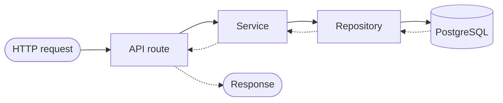
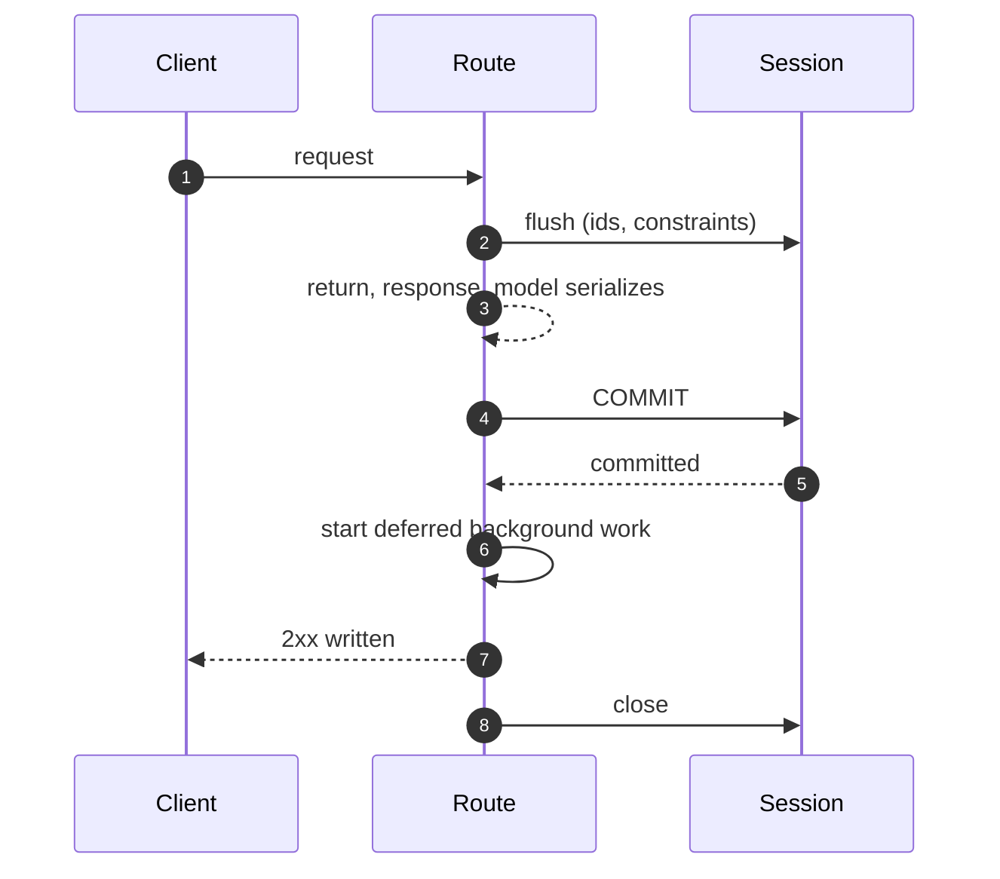

# Arquitectura { #architecture }

Este proyecto sigue una arquitectura por capas de **Repository + Service**. Cada
funcionalidad — usuarios, conversaciones, archivos, documentos RAG, fuentes de
sincronización — usa el mismo patrón:
**Modelos → Schemas → Repositorios → Servicios → Endpoints**.

## Flujo de una petición { #request-flow }



Las rutas nunca contienen llamadas directas a la base de datos. Todo el acceso a
datos pasa por servicios, que a su vez delegan en repositorios.

!!! info "Es un test, no una convención"

    `backend/tests/test_route_layering.py` falla si una ruta importa un
    repositorio - y falla igual de fuerte si su lista de permitidos conserva una
    excepción que ya no aplica.

La regla se había desviado en cinco módulos antes de que nada la comprobara —
ninguno de ellos una fuga, porque cada handler pasaba el scope que resultaba
conocer. Ese es el coste: un scope que posee una ruta es un scope que ningún test
de servicio puede ver, y el siguiente que lea la entidad tiene que saber que hay
que pasar lo mismo. La única excepción es un `Literal` de órdenes de ordenación,
importado como tipo y no como acceso a datos.

## Estructura de directorios (`backend/app/`) { #directory-structure-backendapp }

| Directorio / archivo | Para qué sirve |
|-----------|---------|
| `api/routes/v1/` | Endpoints HTTP, validación de la petición, autenticación |
| `api/deps.py` | Inyección de dependencias (sesión de db, usuario actual) |
| **`services/`** | **Lógica de negocio, orquestación** |
| ↳ `user.py` | CRUD de usuarios, actualizaciones de perfil |
| ↳ `conversation.py` | Gestión de conversaciones y mensajes |
| ↳ `message_rating.py` | CRUD de valoraciones de mensajes, estadísticas, exportación |
| ↳ `file_upload.py` | Gestión de la subida de archivos en el chat |
| ↳ `file_storage.py` | Abstracción del almacenamiento de archivos (local / S3) |
| ↳ `rag_document.py` | Ciclo de vida de un documento RAG |
| ↳ `rag_sync.py` | Orquestación de la sincronización con fuentes remotas |
| ↳ `sync_source.py` | CRUD de fuentes de sincronización, y el historial de ejecuciones de una fuente |
| ↳ `audit.py` | Lectura del rastro de auditoría de la propia organización de quien llama |
| **`repositories/`** | **Capa de acceso a datos, consultas a la base de datos** |
| ↳ `user.py` | Consultas de usuarios |
| ↳ `conversation.py` | Consultas de conversaciones |
| ↳ `chat_file.py` | Consultas de archivos del chat |
| ↳ `message_rating.py` | Consultas de valoraciones de mensajes |
| ↳ `rag_document.py` | Consultas de documentos RAG |
| ↳ `sync_log.py` | Consultas del log de sincronización |
| ↳ `sync_source.py` | Consultas de fuentes de sincronización |
| **`schemas/`** | **Modelos Pydantic de petición/respuesta** |
| ↳ `user.py` | Schemas de usuario |
| ↳ `conversation.py` | Schemas de conversación y mensaje |
| ↳ `file.py` | Schemas de subida de archivos |
| ↳ `message_rating.py` | Schemas de valoración de mensajes |
| ↳ `rag.py` | Schemas de consulta/respuesta de RAG |
| ↳ `sync_source.py` | Schemas de fuente de sincronización |
| **`db/models/`** | **Modelos de SQLAlchemy 2.0** |
| ↳ `user.py` | Modelo de usuario |
| ↳ `conversation.py` | Modelos de conversación y mensaje |
| ↳ `chat_file.py` | Modelo de archivo del chat |
| ↳ `message_rating.py` | Modelo de valoración de mensaje |
| ↳ `webhook.py` | Modelo de webhook |
| ↳ `rag_document.py` | Modelo de documento RAG |
| ↳ `sync_log.py` | Modelo de log de sincronización |
| ↳ `sync_source.py` | Modelo de fuente de sincronización |
| `core/config.py` | Ajustes mediante pydantic-settings |
| `core/security.py` | Utilidades de JWT / claves de API |
| `agents/` | Agents de IA y sus herramientas |
| `rag/` | Módulo RAG (embeddings, vector store, recuperación) |
| `rag/connectors/` | Conectores de sincronización (Google Drive, S3) |
| `commands/` | Comandos de CLI al estilo de Django |

## Responsabilidades de cada capa { #layer-responsibilities }

### Rutas de API (`api/routes/v1/`) { #api-routes-apiroutesv1 }
- Gestión de la petición y la respuesta HTTP
- Validación de la entrada mediante schemas de Pydantic
- Comprobaciones de autenticación y autorización
- **Nunca** contienen llamadas directas a la base de datos — siempre delegan en un
  servicio
- **Nunca** parsean entrada no confiable en la expresión de la ruta. Un
  `ValidationError` lanzado ahí es un `ValueError` pero no un
  `RequestValidationError`, así que ningún handler lo mapea y a quien llama se le
  responde 500 con `details: null` — que es como cada error en un YAML de spec
  editado a mano se reportaba como una caída (#873). Parsear es trabajo del
  servicio dueño, y el rechazo también: `import_spec` en `AgentRegistryService`
  responde a un documento roto con un 400 que nombra el campo, y nunca le devuelve
  a quien llama una cita de lo que envió.

### Servicios (`services/`) { #services-services }
- Lógica de negocio y validación
- Orquestan una o más llamadas a repositorios
- Lanzan excepciones de dominio (`NotFoundError`, `AlreadyExistsError`, etc.)
- Gestionan los límites de la transacción

### Repositorios (`repositories/`) { #repositories-repositories }
- Solo operaciones sobre la base de datos
- Sin lógica de negocio
- Usan `db.flush()` y no `commit()` — la sesión de la petición es la dueña de la
  transacción, y [hace commit antes de que la respuesta se envíe](#the-requests-transaction)
- Devuelven modelos de dominio

### Schemas (`schemas/`) { #schemas-schemas }
- Modelos `Create`, `Update` y `Response` separados por entidad
- Los schemas `Response` usan `model_config = ConfigDict(from_attributes=True)` para la conversión desde el ORM

### Modelos (`db/models/`) { #models-dbmodels }
- Definiciones de modelos de SQLAlchemy 2.0
- Las relaciones, los índices y los valores por defecto de las columnas viven aquí

### Conectores RAG (`rag/connectors/`) { #rag-connectors-ragconnectors }
- Adaptadores de sincronización conectables que implementan `BaseSyncConnector`
- Cada conector proporciona `list_files()` y `download_file()`
- Registrados en `CONNECTOR_REGISTRY` para descubrirlos en tiempo de ejecución

## La transacción de la petición { #the-requests-transaction }

Una petición, una sesión, una transacción, con commit en un solo sitio — y el
sitio importa tanto como el hecho.

Una ruta pide `DBSession` (`app/api/deps.py`), que resuelve `get_db_session`
(`app/db/session.py`). Todo lo que hay por debajo de la ruta comparte esa única
sesión: los servicios la reciben en su constructor, los repositorios la reciben
como primer argumento, y ninguno de los dos llama nunca a `commit()` — con una
excepción deliberada, el camino del run de un agent, descrito
[más abajo](#the-run-paths-two-commits). `flush()` envía las sentencias para que
la fila tenga un id y se hayan comprobado las restricciones; el commit ocurre una
vez, a la salida.

**A la salida significa antes de que la respuesta se escriba.** El alias declara
`Depends(get_db_session, scope="function")`, que registra el código de salida de
la sesión en la pila de salida que FastAPI desenrolla entre el retorno de la
operación de ruta y `await response(scope, receive, send)`. Así que el orden para
una petición es:

1. la ruta retorna, y `response_model` serializa lo que devolvió;
2. la transacción hace commit — o, si algo lanzó un error, rollback;
3. se arranca el trabajo en segundo plano que la petición aplazó (más abajo);
4. la respuesta se escribe en el socket;
5. la sesión se cierra.



!!! danger "Un 2xx significa que la escritura es legible, no solo que se aceptó"

    Ese orden es todo el contrato. Un `Depends(get_db_session)` desnudo en
    cualquier sitio reintroduce el comportamiento por defecto de FastAPI e
    intercambia los pasos 2 y 4 - `tests/api/test_db_session_scope.py` falla si hay
    uno.

Ese orden es lo que permite a un cliente actuar sobre su propia respuesta. El
valor por defecto de FastAPI para una dependencia con `yield` es
`scope="request"`, que pone los pasos 2 y 4 al revés — y aquí lo hizo hasta
[#353][353], donde una aceptación respondió 204 mientras la fila de membresía que
había creado se quedaba invisible para la siguiente petición durante 21,7 ms, y un
token de invitación se gastó 34 ms antes de que la transacción que lo acuñó
hiciera commit.

Tres consecuencias que merece conocer antes de escribir una ruta:

- **Un commit que falla es un 500, no una línea de log.** La respuesta todavía no
  se ha escrito, así que una restricción diferida o una conexión perdida le llega
  al cliente como un error en lugar de descubrirse detrás de un 2xx ya enviado. El
  paso 3 tampoco se ejecuta: el trabajo que esperaba a una transacción que no
  ocurrió se descarta, con un aviso que lo nombra.
- **Cualquier cosa que se trague un error de base de datos tiene que reiniciar la
  sesión.** Una sentencia que lanzó un error deja su transacción abortada, y el
  commit del paso 2 lanza error también. Las sondas de salud
  (`app/services/health.py`) son el caso en este código: se niegan a propagar, a
  propósito, así que hacen rollback antes de retornar.
- **Un cuerpo producido mientras la respuesta se está enviando necesita otra
  sesión.** Una `StreamingResponse` sobre un generador se itera durante el paso 3,
  momento en el que la sesión está cerrada. Esos endpoints toman
  `StreamingDBSession`, que conserva el scope por defecto de FastAPI y es por tanto
  de solo lectura: su transacción se resuelve después de haber respondido al
  cliente. Exactamente un endpoint la usa — la exportación CSV de valoraciones — y
  `tests/api/test_db_session_scope.py` rechaza un segundo sin que se tome una
  decisión al respecto.

El trabajo que sobrevive a la petición no usa esta sesión en absoluto. Los
handlers de WebSocket y los comandos de CLI abren `get_db_context()`, y las tareas
del worker `get_worker_db_context()`; los tres pasan por el mismo
`_managed_session`, así que hacen commit al salir limpiamente de su propio
`async with` y arrancan ahí mismo su trabajo aplazado — lo cual no tiene nada que
ver con una respuesta.

### Los dos commits del camino de un run { #the-run-paths-two-commits }

Un camino hace commit deliberadamente antes que «a la salida»: **el run de un
agent.**

El runner hace commit una vez *antes de llamar al modelo* y otra más en el
`finally` terminal — `AgentRunnerService._run`, y `ChatAgentRunner.run` para el
chat en streaming.

Una llamada al modelo tarda de segundos a minutos, y una transacción abierta
durante ella mantiene una conexión del pool `idle in transaction` todo ese tiempo.
Quince runs concurrentes eran antes el pool entero ([#12][12]).

Hacer commit primero compra dos cosas más: la fila del run es legible desde
cualquier otra sesión durante toda la vida del run, y la salida de un run reanudado
de la cola de aprobaciones es durable antes de que se reproduzca la llamada
aprobada — así que una caída a mitad de la reproducción no puede entregar la misma
aprobación dos veces ([#3][3]).

El commit terminal es la otra mitad. El contexto de sesión solo hace commit al
salir limpiamente, cosa que un run fallido, detenido por budget o cancelado no es,
y un run que falta en el historial es un run del que nadie responde.

Los dos límites se demuestran contra una base de datos real en
`tests/integration/test_run_commit_boundary.py`.

La visibilidad corta por los dos lados. Todo lo que antes razonaba «la fila de un
run en ejecución no se puede ver» razona ahora sobre una fila que *sí* se ve, y el
planificador de triggers de agents es el único sitio que lo hacía.

Su guardia contra solapamientos bloquea ante cualquier run no terminal en la
conversación del trigger — lo que ahora incluye el run vivo de un `run_now`
concurrente o de un evento disparado, una protección que la vieja invisibilidad no
podía ofrecer.

Mientras tanto, un worker que muere a mitad de un run deja una fila `running` que
nada en el proceso terminará jamás. Lo que acota esa fila es el barrido horario de
runs obsoletos, que la termina como `failed` pasado
`STALE_RUN_REAPED_AFTER_HOURS`. La señal de vida del disparo programado sigue
siendo su lease renovado (`app/repositories/agent_trigger.py::claim_due`).

[Gobernanza](governance.md#a-run-whose-process-died) tiene lo que el barrido
resuelve y lo que deja en paz deliberadamente.

### Despachar trabajo en segundo plano desde una petición { #dispatching-background-work-from-a-request }

**El trabajo que vaya a leer una fila que esta petición escribió se entrega con
`spawn_after_commit`, nunca con `spawn`** (los dos en
`app/core/background.py`):

```python
from app.core.background import spawn_after_commit

spawn_after_commit(self.db, ingest_document_flow(rag_document_id=str(doc.id)), name=...)
```

`spawn` crea la tarea de inmediato, y el loop la arranca en el siguiente punto de
suspensión — que es el paso 1 o el 2 de arriba, antes del commit. El flow abre una
sesión propia, correctamente, así que bajo `READ COMMITTED` no puede ver una fila
que esta petición no ha confirmado: busca el documento cuyo id se le dio, no
encuentra nada, y para. Eso es [#417][417], y su forma visible es una subida
respondida con `{"status": "processing"}` que se queda así para siempre.

`spawn_after_commit` encola en su lugar la corrutina en la sesión. Nada la arranca
hasta el paso 3, dos sentencias después de que `commit()` retorne, así que un flow
despachado de esta manera lee una fila que la base de datos ya ha aceptado. Así se
entregan la subida de un documento, una sincronización que alguien inició, el
stream de la conexión de un canal y el «run now» manual de un trigger. El orden se
demuestra contra una base de datos real en
`tests/integration/test_flow_starts_after_commit.py`.

En el otro extremo de la vida del proceso, el lifespan de la aplicación cierra el
círculo: después de que pare la admisión y se haya drenado el servicio, hace
`await` de `background.drain()` para todo lo que `spawn` entregó y sigue en vuelo,
**antes** de deshacerse del vector store, de Redis y de la sesión que esas tareas
leen. Sin eso, un apagado a mitad de una ingesta cancelaba el flow y dejaba el
documento en `processing` — la misma fila atascada de [#417][417], alcanzada desde
el otro extremo.

El disparo manual de un trigger está ahí por una segunda razón que merece
nombrarse, porque es la otra mitad de por qué una petición entrega trabajo a otro
lado: `POST /agents/{id}/triggers/{id}/run` hacía antes *await* del run que
arrancaba, así que un agent más lento que el read timeout de un proxy respondía 504
mientras el run seguía y hacía commit — un fallo reportado sobre algo que
funcionaba, y una invitación a pulsar el botón otra vez y disparar la programación
dos veces ([#658][658]). La ruta responde `202` y el disparo arranca después del
commit.

!!! warning "No es una cola que sobreviva al proceso"

    `spawn_after_commit` ejecuta el trabajo solo si el proceso vive lo bastante
    como para arrancarlo. Eso está bien para trabajo que una petición posterior
    puede reproducir, y no está bien para trabajo cuya *entrada* acaba de destruir
    el commit - la purga de una organización entrega las rutas y los nombres de
    colección de los que su propio commit borró el último registro, así que una
    caída entre las dos cosas los pierde para siempre.

    Donde eso aplica, la intención se escribe como una fila en la misma transacción
    y la entrega pasa a ser una optimización: `teardown_intents` nombra lo que queda
    por liberar, el flow borra la fila en cuanto lo ha hecho, y un barrido vuelve a
    despachar todo lo que nada terminó. La ausencia de la fila es la finalización,
    así que una tabla vacía significa que no queda nada pendiente.

Del sitio donde vive la cola se siguen dos cosas:

- **Pertenece a la sesión, no a la petición.** Un servicio que despacha un flow no
  necesita saber si lo llamaron desde una ruta, un handler de WebSocket, la CLI o
  un worker — que es por lo que esto no es el `BackgroundTasks` de FastAPI, cuya
  garantía es sobre la respuesta y que esos otros tres llamadores no tienen.
- **Una transacción con rollback no despacha nada.** El paso 3 se salta y las
  corrutinas encoladas se cierran, porque ejecutar trabajo cuya fila se tiró a la
  basura solo mueve el fallo a un sitio menos explicable.

`spawn` sigue siendo lo correcto para trabajo que posee todo lo que necesita — los
correos de notificación en `app/services/notifications.py` llevan su propio
contexto y no tocan ninguna fila. Ninguno de los dos es una cola de trabajos:
cualquier cosa que deba sobrevivir a un reinicio es un deployment de Prefect.

[3]: https://github.com/vstorm-co/agenticos/issues/3
[12]: https://github.com/vstorm-co/agenticos/issues/12
[353]: https://github.com/vstorm-co/agenticos/issues/353
[417]: https://github.com/vstorm-co/agenticos/issues/417
[658]: https://github.com/vstorm-co/agenticos/issues/658

## Runs de agents: una capability nunca consulta { #agent-runs-a-capability-never-fetches }

Las capas de arriba tienen una regla más dentro del run de un agent, y es la razón
de que el runner sea tan grande como es. **Una capability no toca la base de
datos.** Todo lo que necesite de ella — los nombres de colección que su spec
vincula, los skills que puede cargar, el workspace en el que escribe, los
delegados a los que puede llamar — lo resuelve el servicio *antes* de que empiece
el run y se lo entrega como `resources`, un dict que la capability puede leer y al
que no puede añadir. Lo que el modelo pide es *qué* buscar; nunca se entera de
*dónde*.

Dos entradas de ese dict son costuras hacia otros subsistemas y no datos sin más:

| Recurso | Lo deja el runner | Lo lee |
|---|---|---|
| `WORKSPACE_BACKEND_RESOURCE` | la sesión de sandbox abierta | la capability `sandbox` |
| `SUBAGENT_RUNTIME_RESOURCE` | el árbol de delegación resuelto | la capability `subagents` |

La delegación es el caso más afilado para la regla. Un delegado es una fila, y
también lo son su versión fijada, sus colecciones, sus skills y sus secretos:
cada uno pasa por `resolve_access` antes de leerse. Así que el runner recorre el
árbol entero — el anidamiento, el límite de profundidad, el rechazo de un
delegado que ya corre por encima de él en el mismo run — mientras todavía tiene
sesión y contexto de autenticación, y deja closures que construyen un agent ya
resuelto más un grabador que escribe una fila. Lo que queda para el tiempo de
ejecución es CPU y Pydantic AI.

No puede ser al revés: la `AsyncSession` de la petición la comparte todo lo que
hay en el run y no es segura ante la concurrencia, así que un árbol recorrido en
tiempo de ejecución sería una consulta desde dentro de la llamada a una
herramienta — y un fan-out serían varias a la vez, lo que corrompe la sesión que
está usando el resto de la petición en lugar de ser meramente lento.

La ausencia de un recurso nunca es un error. Una vista previa, un test unitario o
un agent al que le quitaron todos los delegados no resuelve nada, y la capability
no ofrece entonces delegados en lugar de lanzar un error — exactamente igual que
la capability de workspace cae de vuelta a un backend en memoria.

### Esquema { #schema }

`0007_delegated_runs` añade dos columnas a `agent_runs`.

**`parent_run_id`** es una clave foránea autorreferencial que dice qué run delegó
este, y es lo que mantiene honesto el total mensual de la organización — ver
[Gobernanza](governance.md#what-a-delegated-run-is-recorded-as).

Es `ON DELETE SET NULL` por la misma aritmética: borrar el padre elimina la fila
que contenía este coste, así que una fila de delegación que pasa a ser de primer
nivel es una que *debería* empezar a contar. Cascadear borraría el registro de un
dinero que se gastó.

**`subagent_task_id`** es el id de tarea propio de la librería de delegación, que
une la fila con el identificador que el modelo del padre vio en su transcripción.
Como una clave foránea solo puede poner a null su propia columna, ese
identificador sobrevive al borrado y `AgentRunRead` lo retiene — en lugar de
ponerlo a null con un trigger sobre la tabla de inserción más caliente del
esquema.

El índice sobre `parent_run_id` sirve a `list_runs(parent_run_id=...)`, que es lo
que pide `GET /runs?parent_run_id=`. Ver
[Gobernanza](governance.md#what-run-history-shows) para saber por qué el historial
de runs nunca lista los dos tipos de fila juntos.

## Borrar un miembro o un tenant { #deleting-a-member-or-a-tenant }

Unas cuantas claves foráneas provocarían, al borrar, justamente la escritura que
prohíbe una restricción `CHECK` — así que la cascada que declara el esquema y la
invariante que también declara están en desacuerdo, y el borrado lanza un error
dentro de la base de datos, como un 500, en lugar de hacer nada. Tres parejas se
reconcilian en el servicio antes de que la fila se vaya, dentro de la propia
transacción de la petición:

- **El secreto privado de quien se va.** `organization_secrets.owner_user_id` es
  `SET NULL`, pero `ck_secret_private_needs_owner` prohíbe un secreto privado sin
  dueño. `UserService.delete` promociona primero los secretos privados de quien se
  va a visibilidad de organización, así que el null que escribe la cascada es
  legal y la clave sigue siendo alcanzable por la organización en lugar de quedar
  varada.
- **Las organizaciones de quien las creó.** `organizations.created_by_user_id` es
  `RESTRICT`, y cada alta crea una organización personal, así que un `DELETE users`
  desnudo nunca funcionó para una cuenta real. La organización personal se elimina
  con su dueño; una compartida se le entrega a otro dueño, o el borrado se rechaza
  cuando no hay a quién entregársela.
- **Una colección con scope de organización.** `knowledge_bases.organization_id` es
  `SET NULL`, pero `ck_knowledge_bases_org_scope_has_org` prohíbe una fila con
  scope de organización sin organización. `OrganizationService.delete` elimina
  explícitamente las colecciones con scope de organización — tabla vectorial
  incluida — antes de que se vaya la fila de la organización; una colección
  personal que meramente lleva el id de la organización se le deja al `SET NULL`,
  que su scope permite. Como eliminar la tabla vectorial necesita el store con
  scope de petición, la ruta de borrado lo inyecta a través de una dependencia
  dedicada; cualquier otra ruta de organización usa el servicio normal y no
  construye un store que nunca tocaría.

## Qué le entregó un run a su modelo, y por qué es una tabla { #what-a-run-handed-its-model-and-why-it-is-a-table }

`run_manifests` guarda una fila por run: las instrucciones tal como se compusieron
y se enviaron, cada definición de herramienta tal como se le entregó al provider,
los ajustes, una entrada por petición al modelo, y la lista de mensajes de la
última petición. La escribe `AgentRunnerService.finish` en cada salida de un run,
y la lee `GET /runs/{id}/manifest` — ver
[Conceptos](concepts.md#a-run-and-what-it-handed-the-model) para saber qué se
registra y por qué no se puede reconstruir a partir del spec.

Tres decisiones de capas merecen escribirse, porque cada una es un sitio donde la
alternativa obvia es la equivocada.

**Una tabla, no una columna en `agent_runs`.** Esa tabla es la que más se lista en
el producto — el historial de runs, la pestaña de gasto, las cifras del dashboard,
la exportación CSV — y un documento JSONB con el JSON Schema de cada herramienta lo
leerían todas ellas para responder a una pregunta que ninguna hace. Una fila por
run, `ON DELETE CASCADE` desde el run y desde la organización, leída solo por la
vista de detalle.

**El registro ocurre en `app/agents/manifest.py`, no en el servicio.** El modelo
con el que se construye el agent se envuelve (`RecordingModel`, un `WrapperModel`
— la misma forma que usa `MeteredModel` para anotar el gasto de un subagent), así
que lo que queda escrito es `ModelRequestParameters` tal como lo recibió el
provider: después de cada hook `prepare`, después de que la búsqueda de
herramientas haya escondido lo que esconde, después de que se haya añadido la
herramienta de salida. El servicio persiste lo que recogió el envoltorio y no
decide nada sobre su contenido.

**Un adjunto de la transcripción se lee a través del run, no a través de quien lo
subió.**

`GET /files/{id}` está limitado a `ChatFile.user_id`, que es el scope correcto para
el compositor del chat y el equivocado para revisar un run. Leer un run es un
derecho de la organización y no de quien lo inició, así que las tarjetas de adjunto
en la transcripción de un colega se dibujaban y cada vista previa respondía 404.

`GET /runs/{run_id}/files/{file_id}` autoriza como lo hace la transcripción —
organización, luego `runs:view` — y solo entonces admite el archivo allí donde su
`message_id` nombra un turno de la propia conversación del run. Ese es el alcance
que la transcripción ya concede, y no más.

Las dos rutas sirven los bytes a través de `_chat_file_bytes.py`, así que lo que un
navegador puede *mostrar* no depende de cuál de las dos autorizó la lectura.

**La escritura está protegida *y* anidada.** Se llega a ella desde un bloque
`finally`, así que una excepción lanzada mientras se registra un run fallido
sustituiría el fallo por sí misma. Tragársela no basta por sí solo: un flush
fallido deja la sesión inservible, así que la propia escritura terminal del run se
perdería por un registro que nadie pidió. Se ejecuta dentro de `begin_nested()` por
la misma razón que `TranscriptService._attach` — un SAVEPOINT es lo que hace que
«esta escritura puede fallar sin consecuencias» sea cierto y no una aspiración.

## Un rechazo que nombra un campo { #a-refusal-that-names-a-field }

Todo rechazo sale en un único sobre, `{"error": {"code", "message", "details"}}`,
y un rechazo sobre un *campo* lo nombra en una sola forma:

```json
{"details": {"fields": [{"field": "spec.name", "message": "String should have at most 128 characters"}]}}
```

`fieldProblems` en `frontend/src/lib/api-error.ts` lee eso y nada más, que es lo
que permite a un formulario marcar el campo infractor en lugar de mostrar una
frase que quien lee tiene que buscar repasando la página. `app/core/field_errors.py`
es el único sitio donde se construye, y tiene tres puntos de entrada. Dos de ellos
leen Pydantic, y **quién eres como llamador decide qué significa el primer elemento
de `loc`**:

| | Para | `loc` empieza por |
|---|---|---|
| `request_field_problems` | `validation_exception_handler`, cada `RequestValidationError` | de dónde vino el valor (`body`, `query`, …), que se descarta |
| `field_problems(…, root=…)` | un servicio que valida un documento que el schema de una ruta no puede — una anulación de ingesta por subida, un YAML de spec editado a mano, el blob de configuración de una capability | un campo de ese documento, reportado bajo `root` |
| `refused_field(field, message, **context)` | una regla que un servicio enuncia en prosa y no en un modelo — un endpoint que lleva una contraseña, un bot de Mattermost que pierde su servidor, un documento YAML que nunca se parseó | — responde con el `BadRequestError` para que quien llama lo lance |

`refused_field` nombra la frase una vez, porque el `message` del sobre y el del
campo son la misma frase; quien lance otro estado construye los mismos `details`
con `field_details`. Dieciocho sitios de llamada respondían en su lugar
`details={"field": "<name>"}`, en singular, con la frase en el sobre, y ningún
formulario lo ha leído jamás — el mismo defecto en una tercera forma
([#891](https://github.com/vstorm-co/agenticos/issues/891)). Una cuarta grafía era
`details={"<field>": <value>}`, donde la clave era el nombre del campo y el valor
era lo que quien llamaba acababa de enviar: `model_profile.py` respondía a un id de
modelo rechazado con el id, en el cuerpo y en la línea de log de al lado
([#898](https://github.com/vstorm-co/agenticos/issues/898)).

Decidirlo por la cadena en su lugar leería mal un spec cuya clave prohibida de
primer nivel se llama literalmente `body`, que es una forma haciendo de dos — el
error al que este módulo existe para poner fin.

Hay dos propiedades más que conviene conocer antes de añadir un sitio de llamada.
Lee solo `loc` y `msg`, así que el valor rechazado no puede volver junto al campo
que rompió, y por eso esos sitios le pasan `exc.errors()` sin filtrar. Y `root`
es como llama al documento entero el formulario de quien llama, así que toda ruta
es relativa a él: eso le da a un `model_validator(mode="after")` dónde aterrizar
— reporta `loc: ()`, porque la regla rota abarca dos campos — y hace coincidir
los puntos de entrada, de modo que una anulación rechazada en la subida nombra lo
mismo que el 422 cuando esa pareja llega como ajustes de una colección.

Pasar en su lugar el propio `exc.errors()` de Pydantic fue
[#882](https://github.com/vstorm-co/agenticos/issues/882) — una segunda forma, que
llevaba `input`, `ctx` y `url`, que nada del frontend leía.

**Un rechazo agregado lleva las dos mitades.**

`validate_spec` reporta todos los problemas de un spec a la vez, y la mayoría son
referencias rotas sin ninguna entrada que marcar. Así que responde con
`details.problems` — una línea cada uno, que el Builder lista — y con
`details.fields` para el subconjunto que nombra una.

La configuración de una capability es la única parte de un spec que se dibuja como
un formulario generado, así que sus rechazos nombran la entrada:
`capabilities.knowledge.config.default_top_k`, con `specialists.researcher.` por
delante para una capability configurada dentro de un delegado, porque el Builder
dibuja un formulario por especialista.

Quedarse solo con la frase era la otra mitad de #882. Guardar un borrador no valida
en absoluto un schema de configuración, así que la validación al publicar es el
único sitio donde un ajuste mal escrito se rechaza.

**Dos clases de rechazo no nombran ningún campo, deliberadamente**, y la línea
entre ellas y el resto es lo que impide que una sola forma vuelva a significar dos
cosas:

- **Un rechazo sobre un valor que no envió ningún llamador.** El nombre de un
  archivo remoto lo elige quien pueda dejar un archivo en la carpeta sincronizada,
  y las dos comprobaciones de `app/services/rag/remote_names.py` corren dentro de
  una sincronización en segundo plano, donde quien lee es un log y no un
  formulario. Lo mismo para una fuente de Google Drive releída sin su credencial:
  la fila está guardada, y el `validate_config` del conector, derivado de su
  `CONFIG_MODEL`, es lo que la rechaza en la ruta.
- **Un conflicto.** `AlreadyExistsError` reporta un hecho sobre una fila que ya
  existe, no sobre la forma de lo que se envió — y cuál de las entradas de un
  formulario produjo el valor ya ocupado es algo que solo el formulario sabe, ya
  que el handle de un agent se deriva de un nombre que nadie escribió como handle.
  Eso lo reclama el `identifiedBy` de `submitFailure` en el cliente, así que un 409
  lleva el valor ocupado y ningún campo.

## Archivos clave { #key-files }

- Punto de entrada: `app/main.py`
- Configuración: `app/core/config.py`
- Dependencias: `app/api/deps.py`
- Utilidades de autenticación: `app/core/security.py`
- Handlers de excepciones: `app/api/exception_handlers.py`
- Rechazos a nivel de campo: `app/core/field_errors.py`

## Autenticación y autorización { #authentication-authorization }

### Métodos de autenticación { #authentication-methods }

El proyecto soporta dos métodos de autenticación, los dos siempre disponibles:

1. **JWT (JSON Web Tokens)** -- Usado por el frontend y los clientes de la API.
   - Iniciar sesión con `POST /api/v1/auth/login` devuelve `access_token` + `refresh_token`.
   - Los access tokens caducan tras `ACCESS_TOKEN_EXPIRE_MINUTES` (por defecto 30 min).
   - Los refresh tokens caducan tras `REFRESH_TOKEN_EXPIRE_MINUTES` (por defecto 7 días).
   - El frontend guarda los tokens como cookies HTTP-only.
   - La autenticación por WebSocket pasa el JWT como parámetro de consulta (`?token=<jwt>`) o como cookie.

2. **Clave de API** -- Usada para el acceso servidor a servidor y programático.
   - Se pasa en la cabecera `X-API-Key` (configurable con `API_KEY_HEADER`).
   - Una única clave compartida, fijada con la variable de entorno `API_KEY`.
   - Usa comparación en tiempo constante (`secrets.compare_digest`) para evitar ataques de temporización.

### Dónde aterriza una sesión recién creada { #where-a-fresh-session-lands }

Tres puertas establecen una sesión por tres caminos - el formulario de contraseña,
el callback de OAuth y un enlace mágico - y exactamente una de ellas decide dónde
acaba quien visita: `postSignInDestination` en
`frontend/src/lib/auth-landing.ts`, que respeta un deep link solo cuando es una
ruta del mismo origen y responde con el dashboard en cualquier otro caso. Tres
respuestas en tres sitios son deriva, y la deriva ha sido real dos veces: en el eje
de los roles, donde el aterrizaje se bifurcaba por rol, y en el eje de los
providers, donde la ida y vuelta de OAuth perdía `?returnTo=`.

Lo que difiere por puerta es solo cómo *viaja* la ruta:

| Puerta | Cómo llega la ruta al aterrizaje |
|---|---|
| Formulario de contraseña | nunca salió de la pestaña - se lee directamente de `?returnTo=` |
| Callback de OAuth | `sessionStorage`, que está permitido porque la ida y vuelta empieza y termina en la misma pestaña de este origen |
| Enlace mágico | una afirmación firmada en el token, porque el enlace se sigue desde un correo - otra pestaña, a menudo otra aplicación, donde `sessionStorage` está vacío por construcción |

La ruta del enlace mágico se rechaza en la **petición** en lugar de filtrarse en el
aterrizaje: `MagicLinkRequest.return_to` acepta una ruta de este despliegue y nada
que tenga un esquema, una segunda barra inicial, una barra invertida o un carácter
de control, así que un token al que se le pudiera hacer llevar una cadena
arbitraria nunca existe. El aterrizaje lo juzga otra vez de todos modos - una
comprobación que corre una vez, en el servidor, sobre un valor que después viaja
por un correo, es una comprobación con la que el cliente no puede contar.

`POST /auth/magic-link/verify` responde por tanto con `MagicLinkToken` - el par de
tokens más `return_to`, sin aplicar. Con su propio schema en lugar de un campo
nullable en `Token`, porque las otras tres respuestas de token no tienen ninguna
ruta de vuelta que llevar y un campo que en la mayoría de ellas es siempre null es
un campo que un cliente aprende a ignorar.

### Autorización { #authorization }

No hay columna de rol en el usuario ni dependencia de ruta basada en roles. Lo que
un miembro puede hacer dentro de una organización es un permiso del catálogo de
`app/core/permissions.py`, y qué filas puede tocar se resuelve fila a fila - ver
[Permisos](permissions.md) para el modelo entero.

Dos dependencias, y solo dos:

| Alias | Significa |
|---|---|
| `CurrentUser` | cualquier usuario autenticado |
| `CurrentAppAdmin` | el superadmin del despliegue (`users.is_app_admin`), para `/admin/*` y las rutas masivas de `/rag` |

Todo lo demás pasa por una de estas:

```python
# A permission, on a collection route.
@router.post("/agents", dependencies=[Depends(require(Perm.AGENTS_EDIT))])
async def create_agent(...): ...

# A permission on one row, resolved in the service.
if not await resolve_access(db, ctx, agent, Perm.AGENTS_EDIT, resource_type=AGENT):
    raise AuthorizationError(...)

# A permission decided by a parameter, resolved in the service: scope=org
# demands runs:view, scope=own only a signed-in caller. See Permissions,
# "Where the gates go".
return await service.usage(ctx, scope=scope, ...)
```

!!! note "`require(...)` no pinta nada en una ruta por recurso"

    Una puerta por rol no puede ver las concesiones de una fila, así que rechazaría
    a un Viewer con una concesión explícita de `edit` antes de que `resolve_access`
    llegara a ampliar su acceso. La misma forma aplica cuando es un *parámetro* el
    que decide la cuestión - `GET /stats/usage?scope=own` tiene que ser alcanzable
    por un miembro normal, así que su puerta vive en el servicio.
    `tests/api/test_platform_routes.py` lo hace cumplir todo.

!!! note "Una preferencia personal no lleva puerta alguna"

    Una fila con scope `(user_id, organization_id)` que solo su dueño lee y escribe
    no son datos de la organización, así que ningún permiso la protege y no hay
    ruta que llegue a la de otra persona. `GET`/`PUT`/`DELETE
    /me/dashboard-layout` (la disposición guardada del dashboard) y su estantería
    de `/presets` por debajo (las disposiciones con nombre entre las que alguien
    cambia) son el patrón: `CurrentUser` + `ActiveOrg`, con cada consulta filtrada
    por **los dos** ids. La clave compuesta es toda la frontera del tenant — una
    disposición o un preset guardado en una organización es invisible en otra
    *incluso para su dueño*, cosa que una comprobación por usuario sola dejaría
    pasar, así que `tests/integration/test_dashboard_layout.py` y
    `tests/integration/test_dashboard_preset.py` cubren exactamente eso. No hay
    ruta de *aplicar un preset*: aplicar uno es el `PUT` que hace el cliente con
    las entradas del preset como disposición activa, así que el dashboard conserva
    un solo camino de escritura y una sola validación para lo que dibuja.

    Una colocación puede llevar además `options` — la ventana propia de la tarjeta
    (`period`), su presentación (`style`) y su acotación (`agent_id`, `user_id`).
    **Una opción guardada es una petición, nunca una autorización**: llega a
    `GET /stats/usage` como parámetro de consulta y se rechaza allí si quien llama
    no puede leer lo que pide, igual que si hubiera escrito la URL a mano. Acotar a
    un colega es leer filas de otra persona, así que es `scope=org` y va detrás de
    `runs:view`; `scope=own` con un `user_id` es un 422 y no una reinterpretación
    silenciosa. Al escribir, el estilo y la ventana se validan contra los conjuntos
    cerrados que declara el registro del frontend
    (`tests/test_dashboard_registry.py` mantiene iguales los dos espejos); al leer,
    las opciones vuelven tal cual, porque un agent que se haya borrado desde
    entonces no debe llevarse por delante una disposición entera.

`UserRole`, `User.has_role()`, `RoleChecker`, `CurrentAdmin` y `CurrentSuperuser`
eran el modelo de la plantilla y ya no están, junto con la columna `users.role`,
que se fue con el aplastamiento en `0001_baseline`. Eran una tercera respuesta a
una pregunta que ya tenía dos.

### Protección contra IDOR { #idor-protection }

Dos predicados, y no son intercambiables. **La organización es lo que acota una
lectura; el usuario es lo que la estrecha más.**

- Los endpoints de conversación pasan `organization_id=active_org.id`. Sin eso una
  conversación se busca solo por clave primaria, y cualquiera que haya iniciado
  sesión y conozca un UUID lee — o añade a — una conversación de otro tenant.
- También pasan `user_id=current_user.id`, que restringe una fila a su dueño o a
  alguien con quien se compartió. La comprobación de tenant sola no basta: sin
  esto, cada miembro de una organización puede leer y añadir a la conversación de
  cualquier otro miembro.
- **Un compartido lleva la escritura solo con `edit`.** Leer y escribir son dos
  preguntas — `_may_read` y `_may_write` — y un compartido respondía antes a las
  dos con cualquier nivel que tuviera, así que los dos niveles que ofrece el
  diálogo de compartir significaban lo mismo: una conversación compartida para
  *ver* se podía renombrar, archivar, borrar, o dotar de un turno
  `role: "assistant"` que todo el mundo lee en `/chat` y que al modelo se le
  devuelve como si fueran sus propias palabras. El nivel se le enuncia a quien lo
  concede, así que es el nivel que se hace cumplir (#931).
- En `list_messages` ese único argumento hace dos trabajos — autoriza, *y* además
  enriquece cada mensaje con la valoración de quien llama. Esa sobrecarga es la
  razón de que su mitad autorizadora faltara tanto tiempo: la ruta lo pasaba, el
  argumento estaba claramente ahí en la revisión, y estaba haciendo el otro
  trabajo.
- Las descargas de archivos verifican `chat_file.user_id == current_user.id`, y
  adjuntar un archivo a un mensaje lleva el mismo dueño en el `WHERE`: un turno que
  nombra el id de archivo de otro usuario — o un archivo que ya está en un mensaje
  — se rechaza, nunca se aplica en silencio.

`ConversationService` hace imposible omitir la distinción: `organization_id` es un
argumento por palabra clave de tipo `UUID` **obligatorio** en cada lectura y cada
escritura de una conversación. Antes tenía `None` por defecto, `None` significaba
sin scope, y una omisión es indistinguible de una intención — dos rutas que servían
a miembros normales simplemente se lo dejaban, y cualquier usuario con sesión podía
leer y añadir a cualquier conversación del despliegue.

### Un favorito pertenece a quien lee, no al hilo { #a-favourite-belongs-to-the-reader-not-to-the-thread }

`conversation_favourites` es una fila por `(user_id, conversation_id)` y no un
booleano en `conversations`, porque una conversación se puede compartir y un hilo
de canal tiene participantes en lugar de un dueño: una columna dejaría que la
estrella de una persona decidiera dónde se sitúa el hilo para todo el que puede
verlo.

Cuatro consecuencias que merece conocer:

- **`POST`/`DELETE /conversations/{id}/favourite` se autorizan como una
  *lectura*.** Una estrella dice dónde se sitúa un hilo en la barra lateral de
  quien la pone y no cambia nada del hilo, así que alguien con quien se compartió
  una conversación puede marcarla exactamente igual que su dueño. Un `for_write`
  ahí le negaría la funcionalidad justo al lector para quien existe. Las dos rutas
  llevan `Auth` por la misma razón que cualquier otra lectura de una: sin contexto
  `_may_read_trigger_log` responde falso, y el log de ejecuciones de un trigger que
  quien llama puede abrir gracias a `runs:view` sería uno que no podría marcar
  (#1254).
- **`is_favourite` es de quien llama, y se estampa en `get_conversation`** — la
  única lectura por la que pasa toda lectura con scope de lector, en lugar de en
  cada ruta. Llegaba a dos respuestas de ocho mientras cada ruta tenía que
  acordarse, así que un `GET` o un PATCH le decía a alguien que había marcado un
  hilo que no lo había hecho (#1254). Una lectura sin lector — el listado de admin,
  el camino del run resolviendo un hilo — no pide las estrellas de nadie y no paga
  una consulta para decirlo, y una lectura que solo *autoriza* lo apaga
  explícitamente con `include_favourite=False`. Esas son las lecturas cuyo
  resultado se descarta o no es una conversación:
  `GET /conversations/{id}/messages`, que resuelve el hilo dos veces a través de
  `list_messages` y `conversation_cost`; las tres rutas de workspace; cada turno de
  un chat existente, a través de `agent._resolve_in_org`; y las escrituras —
  `add_message`, `delete_conversation` y `set_favourite`, que sobrescribe la propia
  marca. Encendido por defecto es lo que impide que una ruta que *sí* serializa una
  conversación se olvide; apagado es un acto deliberado en el sitio de llamada.
- **Marcar es idempotente bajo contención**, porque la inserción es
  `ON CONFLICT DO NOTHING` y no una lectura seguida de una inserción. Dos POST
  solapados para la misma pareja no vieron fila ninguno y el segundo violaba la
  clave primaria; el cliente además serializa su propia estrella pendiente por
  conversación, así que un doble clic no puede hacer que el DELETE se responda
  antes que el POST al que siguió.
- **La banda es un `ORDER BY`, no una agrupación de la página.** La barra lateral
  está paginada, así que un favorito ordenado hacia la página dos por recencia se
  sentaría bajo cincuenta hilos que no lo son. Dentro de cada banda el orden
  elegido sigue aplicándose, y la vista de archivados no tiene bandas en absoluto:
  una estrella sobrevive al archivado, pero una banda dentro del archivo sería un
  segundo sitio donde buscar lo que el archivado acaba de mover.

**Ya no hay manera de leer una conversación entre tenants.** El centinela que lo
deletreaba (`UNSCOPED`) tenía exactamente un llamador,
`/admin/conversations/{id}`, y los dos se fueron con el navegador de conversaciones
de todo el despliegue — Activity responde a «qué pasó» con el coste, el modelo, la
traza y lo que se le entregó al modelo al lado, que es la pregunta para la que se
estaba usando esa pantalla. Lo que queda de ello es
`GET /admin/conversations?user_id=`: los hilos de una cuenta concreta, listados
para el panel lateral de usuario del admin y nunca leídos.

### Qué pide el panel lateral de usuario del admin { #what-the-admin-user-drawer-asks-for }

`GET /admin/users/{id}/detail` es una ruta propia y no unos campos en
`GET /admin/users/{id}`, porque es una **vista** ensamblada a partir de tres tablas
- membresías, sesiones y la fila del usuario - y un usuario se lee en una docena de
sitios que no necesitan nada de eso.

Existe porque el panel no respondía a ninguna de las preguntas que tiene de verdad
un admin que abre una fila: mostraba el id, el correo que ya estaba en la tabla, el
nombre mostrado y una fecha de alta (#942). Lo que responde ahora es dónde tiene
acceso esta persona y con qué autoridad, cuándo estuvo aquí por última vez, y si
algo suyo sigue con la sesión iniciada. `last_seen_at` es **null en vez de estar
ausente** para una cuenta que nunca ha iniciado sesión, porque «creada y nunca
usada» y «dormida desde marzo» son decisiones distintas.

La ruta entera es `CurrentAppAdmin`: cada campo de ella es sobre otra persona.

Para los permisos completos a nivel de endpoint, ver `docs/permissions.md`.

## Procesamiento de archivos en el chat { #file-processing-in-chat }

Cuando un usuario sube un archivo en la interfaz de chat, se ejecuta el siguiente
pipeline:

```
Upload (POST /files/upload)
  -> Validate (MIME type + size)
  -> Classify (image / pdf / docx / text)
  -> Parse (extract text content)
  -> Store (save to media/{user_id}/)
  -> Record (create ChatFile in DB)
  -> Link (attach to message when sent)
```

### Tipos de archivo soportados { #supported-file-types }

| Categoría | Extensiones | Procesamiento |
|----------|-----------|------------|
| Imágenes | JPEG, PNG, WebP, GIF | Se guardan tal cual, se envían al LLM como binario para visión |
| PDF | .pdf | Texto extraído con el parser configurado |
| Documentos | .docx | Texto extraído con python-docx |
| Texto | .txt, .md | Decodificado directamente como UTF-8 |

### Elección del parser { #parser-selection }
Los adjuntos del chat se leen con PyMuPDF y no son configurables: un adjunto no
pertenece a ninguna colección, así que no hay configuración guardada de la que leer
una elección de parser. La elección del parser aplica a las colecciones de
conocimiento, donde es un ajuste por colección.

### Almacenamiento { #storage }

Los archivos se guardan en `media/{user_id}/` mediante `FileStorageService`. El
modelo `ChatFile` guarda `storage_path`, `filename`, `mime_type`, `size`,
`file_type` y `parsed_content` (el texto extraído). Solo el dueño del archivo puede
acceder a sus archivos.

### Límites de tamaño { #size-limits }

Hay dos, porque hay dos superficies. `MAX_UPLOAD_SIZE_MB` (50MB por defecto) es el
tope de un documento de la base de conocimiento; `CHAT_MAX_UPLOAD_SIZE_MB` (10MB
por defecto) es lo que se puede adjuntar en el chat. Son ajustes separados en lugar
de uno solo, porque un documento se trocea y se lee de vuelta por recuperación
mientras que un adjunto a un agent sin workspace se pega entero en el prompt — el
mismo tamaño falla de forma distinta en cada uno. `GET /api/v1/health` publica los
dos.

## El sistema RAG { #rag-system }

### Visión general de la arquitectura { #architecture-overview }

El sistema RAG (Retrieval Augmented Generation) proporciona una base de
conocimiento que el agent de IA puede buscar durante las conversaciones. Se compone
de:

```
Documents -> Parse -> Chunk -> Embed -> Vector Store
                                            |
User Query -> Embed -> Search -> Rerank? -> Results -> Agent Prompt
```

### Principio clave: el RAG es global { #key-principle-rag-is-global }

**Las colecciones se comparten entre TODOS los usuarios.** No hay aislamiento de
documentos por usuario. Esto significa:

- Cualquier usuario autenticado puede **buscar** en cualquier colección.
- Solo los **administradores** pueden crear/borrar colecciones, subir documentos,
  configurar fuentes de sincronización y ver los logs de sincronización.
- La base de conocimiento sirve como un recurso compartido de toda la organización.

### Componentes { #components }

| Componente | Archivo | Para qué sirve |
|-----------|------|---------|
| `DocumentProcessor` | `rag/documents.py` | Parsea archivos a texto (PDF, DOCX, TXT, imágenes) |
| `IngestionService` | `rag/ingestion.py` | Orquesta parse -> chunk -> embed -> store |
| `RetrievalService` | `rag/retrieval.py` | Gestiona las consultas de búsqueda con filtrado y puntuación |
| `EmbeddingService` | `rag/embeddings.py` | Genera embeddings con el provider configurado |
| `BaseVectorStore` | `rag/vectorstore.py` | Interfaz abstracta para las operaciones sobre la base de datos vectorial |
| `PgVectorStore` | `rag/vectorstore.py` | Implementación con pgvector (PostgreSQL) |

### Pipeline de ingesta { #ingestion-pipeline }

Los documentos se pueden ingerir mediante:

1. **CLI** -- `uv run agenticos cmd rag-ingest <path>`
2. **API** -- `POST /api/v1/rag/collections/{name}/ingest` (solo admin, subida de archivo)
3. **Fuentes de sincronización** -- Conectores configurados (Google Drive, S3) que
   traen documentos de forma programada o bajo demanda.

Cada documento ingerido se:
- Parsea a texto (parser elegido por colección, anulable por subida)
- Trocea en chunks (`chunk_size` / `chunk_overlap`, también por colección)
- Convierte en embeddings con el provider de embeddings configurado
- Guarda en la base de datos vectorial
- Sigue en SQL con el modelo `RAGDocument` y su estado (`processing`, `done`, `error`)

### Modos de sincronización { #sync-modes }

| Modo | Comportamiento |
|------|----------|
| `full` | Reemplaza todos los documentos (reingesta todo) |
| `new_only` | Añade archivos nuevos, reingesta los archivos cuyo hash de contenido cambió, se salta los que no cambiaron |
| `update_only` | Solo reingesta los archivos cambiados, se salta por completo los archivos nuevos |

### Conectores de sincronización { #sync-connectors }

Las fuentes remotas de documentos usan conectores enchufables en
`app/services/rag/connectors/`. Cada conector implementa `BaseSyncConnector` con
`list_files()` y `_fetch()`, declara un `SECRET_KIND` que nombra el secreto del
vault que lo autentica, y declara un `CONFIG_MODEL` - un modelo de Pydantic que
dice cómo encontrar los documentos, publicado al asistente como JSON Schema.
`download_file()` es concreto y decide dónde puede aterrizar un archivo. Ver
`docs/patterns.md` para saber cómo añadir uno, y
`docs/howto/add-sync-connector.md` para un ejemplo resuelto.

## Resumen { #recap }

- **Rutas → servicios → repositorios.** Una ruta nunca importa un repositorio.
- Un repositorio usa `db.flush()` y `db.refresh()`, **nunca** `db.commit()`. La
  sesión de la petición hace commit una vez, antes de que la respuesta se escriba.
- El camino del run de un agent es la única excepción sancionada: hace commit antes
  de la llamada al modelo y otra vez en el `finally` terminal.
- El trabajo en segundo plano que lee una fila que esta petición escribió se
  entrega con **`spawn_after_commit`**, nunca con `spawn`.
- Un dominio fino es un módulo; uno grueso es un subpaquete con una fachada, y nada
  fuera de él importa sus submódulos.
