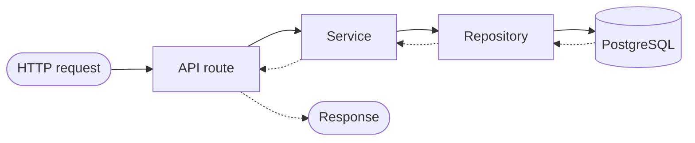
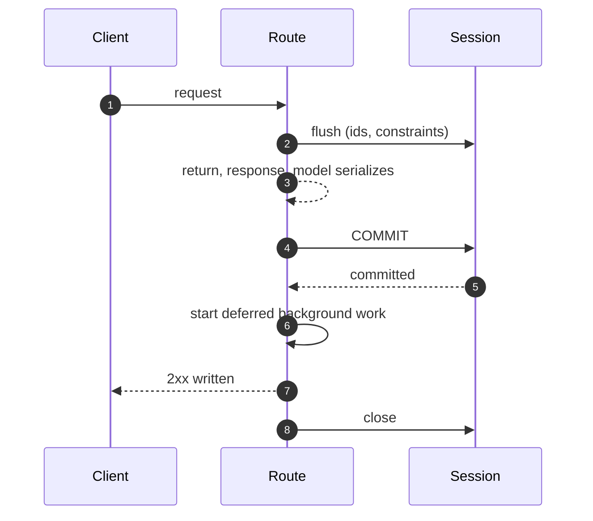

# Architektura { #architecture }

Ten projekt trzyma się architektury warstwowej **Repository + Service**. Każda
funkcja — użytkownicy, rozmowy, pliki, dokumenty RAG, źródła synchronizacji —
korzysta z tego samego wzorca:
**Models → Schemas → Repositories → Services → Endpoints**.

## Przepływ żądania { #request-flow }



Route'y nigdy nie zawierają bezpośrednich wywołań bazy danych. Cały dostęp do
danych idzie przez serwisy, które z kolei delegują do repozytoriów.

!!! info "To test, a nie konwencja"

    `backend/tests/test_route_layering.py` nie przechodzi, jeśli route importuje
    repozytorium — i nie przechodzi tak samo głośno, jeśli jego lista dozwolonych
    trzyma wyjątek, który już nie obowiązuje.

Zasada rozjechała się w pięciu modułach, zanim cokolwiek zaczęło jej pilnować —
w żadnym nie był to wyciek, bo każdy handler przekazywał ten zakres, który
akurat znał. I to jest właśnie koszt: zakres, którego właścicielem jest route, to zakres,
którego nie widzi żaden test serwisu, a następny czytelnik encji musi wiedzieć, że ma
przekazać to samo. Jedynym wyjątkiem jest `Literal` z porządkami sortowania,
importowany jako typ, a nie jako dostęp do danych.

## Struktura katalogów (`backend/app/`) { #directory-structure-backendapp }

| Katalog / plik | Do czego służy |
|-----------|---------|
| `api/routes/v1/` | Endpointy HTTP, walidacja żądań, uwierzytelnianie |
| `api/deps.py` | Wstrzykiwanie zależności (sesja bazy, bieżący użytkownik) |
| **`services/`** | **Logika biznesowa, orkiestracja** |
| ↳ `user.py` | CRUD użytkownika, aktualizacje profilu |
| ↳ `conversation.py` | Zarządzanie rozmowami i wiadomościami |
| ↳ `message_rating.py` | CRUD ocen wiadomości, statystyki, eksport |
| ↳ `file_upload.py` | Obsługa wgrywania plików w czacie |
| ↳ `file_storage.py` | Abstrakcja przechowywania plików (lokalnie / S3) |
| ↳ `rag_document.py` | Cykl życia dokumentu RAG |
| ↳ `rag_sync.py` | Orkiestracja synchronizacji ze zdalnym źródłem |
| ↳ `sync_source.py` | CRUD źródeł synchronizacji i historia przebiegów jednego źródła |
| ↳ `audit.py` | Odczyt śladu audytowego własnej organizacji wywołującego |
| **`repositories/`** | **Warstwa dostępu do danych, zapytania do bazy** |
| ↳ `user.py` | Zapytania o użytkowników |
| ↳ `conversation.py` | Zapytania o rozmowy |
| ↳ `chat_file.py` | Zapytania o pliki czatu |
| ↳ `message_rating.py` | Zapytania o oceny wiadomości |
| ↳ `rag_document.py` | Zapytania o dokumenty RAG |
| ↳ `sync_log.py` | Zapytania o logi synchronizacji |
| ↳ `sync_source.py` | Zapytania o źródła synchronizacji |
| **`schemas/`** | **Modele żądań/odpowiedzi Pydantic** |
| ↳ `user.py` | Schematy użytkownika |
| ↳ `conversation.py` | Schematy rozmów i wiadomości |
| ↳ `file.py` | Schematy wgrywania plików |
| ↳ `message_rating.py` | Schematy ocen wiadomości |
| ↳ `rag.py` | Schematy zapytań/odpowiedzi RAG |
| ↳ `sync_source.py` | Schematy źródeł synchronizacji |
| **`db/models/`** | **Modele SQLAlchemy 2.0** |
| ↳ `user.py` | Model użytkownika |
| ↳ `conversation.py` | Modele rozmów i wiadomości |
| ↳ `chat_file.py` | Model pliku czatu |
| ↳ `message_rating.py` | Model oceny wiadomości |
| ↳ `webhook.py` | Model webhooka |
| ↳ `rag_document.py` | Model dokumentu RAG |
| ↳ `sync_log.py` | Model logu synchronizacji |
| ↳ `sync_source.py` | Model źródła synchronizacji |
| `core/config.py` | Ustawienia przez pydantic-settings |
| `core/security.py` | Narzędzia do JWT / kluczy API |
| `agents/` | Agenci AI i narzędzia |
| `rag/` | Moduł RAG (embeddingi, magazyn wektorów, retrieval) |
| `rag/connectors/` | Konektory synchronizacji (Google Drive, S3) |
| `commands/` | Komendy CLI w stylu Django |

## Odpowiedzialności warstw { #layer-responsibilities }

### Route'y API (`api/routes/v1/`) { #api-routes-apiroutesv1 }
- Obsługa żądania i odpowiedzi HTTP
- Walidacja wejścia przez schematy Pydantic
- Sprawdzenia uwierzytelnienia i autoryzacji
- **Nigdy** nie zawierają bezpośrednich wywołań bazy — zawsze delegują do serwisu
- **Nigdy** nie parsują niezaufanego wejścia w wyrażeniu route'a. `ValidationError`
  podniesiony tam jest `ValueError`, ale nie `RequestValidationError`, więc żaden
  handler go nie mapuje i wywołujący dostaje 500 z `details: null` — i tak
  właśnie każdy błąd w ręcznie edytowanym YAML-u speca był raportowany jako
  awaria (#873). Parsowanie należy do serwisu, który jest właścicielem, i tak
  samo odmowa: `import_spec` na `AgentRegistryService` odpowiada na zepsuty
  dokument błędem 400, który nazywa pole, i nigdy nie cytuje wywołującemu tego,
  co ten przysłał.

### Serwisy (`services/`) { #services-services }
- Logika biznesowa i walidacja
- Orkiestrują jedno lub więcej wywołań repozytorium
- Podnoszą wyjątki domenowe (`NotFoundError`, `AlreadyExistsError` itd.)
- Zarządzają granicami transakcji

### Repozytoria (`repositories/`) { #repositories-repositories }
- Wyłącznie operacje na bazie danych
- Żadnej logiki biznesowej
- Używają `db.flush()`, a nie `commit()` — transakcja należy do sesji żądania,
  która [commituje ją przed wysłaniem odpowiedzi](#the-requests-transaction)
- Zwracają modele domenowe

### Schematy (`schemas/`) { #schemas-schemas }
- Osobne modele `Create`, `Update` i `Response` na encję
- Schematy `Response` używają `model_config = ConfigDict(from_attributes=True)` do konwersji z ORM

### Modele (`db/models/`) { #models-dbmodels }
- Definicje modeli SQLAlchemy 2.0
- Tu mieszkają relacje, indeksy i domyślne wartości kolumn

### Konektory RAG (`rag/connectors/`) { #rag-connectors-ragconnectors }
- Wymienne adaptery synchronizacji implementujące `BaseSyncConnector`
- Każdy konektor dostarcza `list_files()` i `download_file()`
- Rejestrowane w `CONNECTOR_REGISTRY`, żeby dało się je znaleźć w czasie działania

## Transakcja żądania { #the-requests-transaction }

Jedno żądanie, jedna sesja, jedna transakcja, commitowana w jednym miejscu — a to
miejsce liczy się tak samo jak sam fakt.

Route prosi o `DBSession` (`app/api/deps.py`), co rozwiązuje się do
`get_db_session` (`app/db/session.py`). Wszystko poniżej route'a dzieli tę jedną
sesję: serwisy przyjmują ją w konstruktorze, repozytoria jako pierwszy argument,
i ani jedne, ani drugie nigdy nie wołają `commit()` — z jednym celowym wyjątkiem,
ścieżką runu agenta, opisaną [niżej](#the-run-paths-two-commits). `flush()`
wysyła instrukcje, żeby wiersz miał id, a ograniczenia zostały sprawdzone; commit
następuje raz, po drodze na zewnątrz.

**Po drodze na zewnątrz znaczy: zanim odpowiedź zostanie zapisana.** Alias
deklaruje `Depends(get_db_session, scope="function")`, co rejestruje kod wyjścia
sesji na stosie wyjścia, który FastAPI rozwija między powrotem z operacji ścieżki
a `await response(scope, receive, send)`. Kolejność dla żądania jest więc taka:

1. route zwraca sterowanie, a `response_model` serializuje to, co zwrócił;
2. transakcja się commituje — albo, jeśli cokolwiek podniosło wyjątek, wycofuje;
3. startuje praca w tle odroczona przez żądanie (niżej);
4. odpowiedź zostaje zapisana do gniazda;
5. sesja zostaje zamknięta.



!!! danger "2xx znaczy, że zapis jest do odczytania, a nie tylko przyjęty"

    Ta kolejność to cały kontrakt. Gołe `Depends(get_db_session)` gdziekolwiek
    przywraca domyślne zachowanie FastAPI i zamienia kroki 2 i 4 miejscami —
    `tests/api/test_db_session_scope.py` nie przechodzi, gdy takie znajdzie.

Ta kolejność jest tym, co pozwala klientowi działać na podstawie własnej
odpowiedzi. Domyślnym zakresem FastAPI dla zależności z `yield` jest
`scope="request"`, który ustawia kroki 2 i 4 na odwrót — i tak było tutaj do
[#353][353], gdzie przyjęcie zaproszenia odpowiadało 204, podczas gdy utworzony
przez nie wiersz członkostwa pozostawał niewidoczny dla kolejnego żądania przez
21,7 ms, a token zaproszenia był zużywany 34 ms przed commitem transakcji, która
go wybiła.

Trzy konsekwencje, które warto znać, zanim napiszesz route:

- **Commit, który się nie powiedzie, to 500, a nie wiersz w logu.** Odpowiedź nie
  została jeszcze zapisana, więc odroczone ograniczenie albo utracone połączenie
  dociera do klienta jako błąd, zamiast być odkryte za wysłanym już 2xx. Krok 3
  też się nie wykonuje: praca czekająca na transakcję, której nie było, zostaje
  porzucona, z ostrzeżeniem, które ją nazywa.
- **Cokolwiek połyka błąd bazy danych, musi zresetować sesję.** Instrukcja, która
  podniosła wyjątek, zostawia swoją transakcję w stanie przerwanym, a commit
  w kroku 2 też podnosi wyjątek. Sondy zdrowia (`app/services/health.py`) to ten
  przypadek w kodzie: celowo nie propagują błędu, więc wycofują transakcję przed
  zwróceniem wyniku.
- **Ciało odpowiedzi wytwarzane w trakcie jej wysyłania potrzebuje innej sesji.**
  `StreamingResponse` nad generatorem jest iterowana w kroku 3, a wtedy sesja jest
  już zamknięta. Te endpointy biorą `StreamingDBSession`, która zachowuje domyślny
  zakres FastAPI i dlatego jest tylko do odczytu: jej transakcja rozstrzyga się po
  tym, jak klient dostał odpowiedź. Używa jej dokładnie jeden endpoint — eksport
  ocen do CSV — a `tests/api/test_db_session_scope.py` odrzuca drugi, dopóki nie
  zapadnie co do niego decyzja.

Praca, która przeżywa żądanie, w ogóle nie używa tej sesji. Handlery WebSocketów
i komendy CLI otwierają `get_db_context()`, a zadania workera
`get_worker_db_context()`; wszystkie trzy idą przez to samo `_managed_session`,
więc commitują przy czystym wyjściu z własnego `async with` i tam samo startują
swoją odroczoną pracę — co nie ma nic wspólnego z odpowiedzią.

### Dwa commity ścieżki runu { #the-run-paths-two-commits }

Jedna ścieżka celowo commituje wcześniej niż „po drodze na zewnątrz”:
**run agenta.**

Runner commituje raz *przed wywołaniem modelu* i jeszcze raz w końcowym
`finally` — `AgentRunnerService._run` oraz `ChatAgentRunner.run` dla
strumieniowanego czatu.

Wywołanie modelu trwa od sekund do minut, a transakcja zostawiona na ten czas
otwarta trzyma połączenie z puli w stanie `idle in transaction` przez cały ten
okres. Piętnaście równoległych runów potrafiło zająć całą pulę ([#12][12]).

Wcześniejszy commit kupuje jeszcze dwie rzeczy: wiersz runa jest do odczytania
z każdej innej sesji przez całe życie runa, a wyjście wznowionego runa z kolejki
zatwierdzeń jest trwałe, zanim zatwierdzone wywołanie zostanie odtworzone — więc
awaria w trakcie odtwarzania nie może wydać tego samego zatwierdzenia dwa razy
([#3][3]).

Końcowy commit to druga połowa. Kontekst sesji commituje tylko przy czystym
wyjściu, a run zakończony błędem, zatrzymany przez budżet albo anulowany czystym
wyjściem nie jest — a run, którego brakuje w historii, to run, za który nikt nie
odpowiada.

Obie granice są dowodzone na prawdziwej bazie danych w
`tests/integration/test_run_commit_boundary.py`.

Widoczność tnie w obie strony. Cokolwiek rozumowało wcześniej „wiersza
wykonującego się runa nie da się zobaczyć”, rozumuje teraz o wierszu, który
*jest* widziany, a scheduler triggerów agenta to jedyne miejsce, które tak
rozumowało.

Jego strażnik braku nakładania blokuje na każdym nieterminalnym runie w rozmowie
triggera — co teraz obejmuje też żywy run równoległego `run_now` albo odpalenia
zdarzeniem, czyli ochronę, której dawna niewidoczność nie mogła dać.

Tymczasem worker, który umiera w trakcie runu, zostawia wiersz `running`, którego
nic w procesie już nie dokończy. Ten wiersz ogranicza cogodzinne zamiatanie
przeterminowanych runów, które kończy go jako `failed` po przekroczeniu
`STALE_RUN_REAPED_AFTER_HOURS`. Własnym sygnałem życia zaplanowanego odpalenia
pozostaje odnawiana dzierżawa (`app/repositories/agent_trigger.py::claim_due`).

[Governance](governance.md#a-run-whose-process-died) mówi, co to zamiatanie
rozstrzyga, a czego celowo nie rusza.

### Zlecanie pracy w tle z żądania { #dispatching-background-work-from-a-request }

**Praca, która będzie czytać wiersz zapisany przez to żądanie, jest przekazywana
przez `spawn_after_commit`, nigdy przez `spawn`** (oba w
`app/core/background.py`):

```python
from app.core.background import spawn_after_commit

spawn_after_commit(self.db, ingest_document_flow(rag_document_id=str(doc.id)), name=...)
```

`spawn` tworzy zadanie natychmiast, a pętla startuje je w najbliższym punkcie
zawieszenia — czyli w kroku 1 albo 2 powyżej, przed commitem. Flow otwiera własną
sesję, i słusznie, więc pod `READ COMMITTED` nie widzi wiersza, którego to
żądanie nie zacommitowało: szuka dokumentu, którego id dostał, nic nie znajduje
i kończy. To jest [#417][417], a jego widoczna postać to wgranie pliku, na które
odpowiedziano `{"status": "processing"}` i tak już zostaje na zawsze.

`spawn_after_commit` zamiast tego kolejkuje korutynę na sesji. Nic jej nie
startuje aż do kroku 3, dwie instrukcje po tym, jak `commit()` wróci, więc flow
zlecony w ten sposób czyta wiersz, na który baza danych już się zgodziła. Tak
przekazywane są: wgranie dokumentu, synchronizacja, którą ktoś uruchomił,
strumień połączenia kanału i ręczne „run now” triggera. Ta kolejność jest
dowodzona na prawdziwej bazie danych w
`tests/integration/test_flow_starts_after_commit.py`.

Na drugim końcu życia procesu pętlę domyka lifespan aplikacji: po zatrzymaniu
przyjmowania żądań i opróżnieniu obsługi robi `await` na `background.drain()` dla
wszystkiego, co `spawn` przekazał, a co wciąż jest w locie — **zanim** zwolni
magazyn wektorów, Redis i sesję, z których te zadania czytają. Bez tego
wyłączenie w trakcie ingestii anulowało flow i zostawiało dokument
w `processing` — ten sam zablokowany wiersz co w [#417][417], osiągnięty
z drugiej strony.

Ręczne odpalenie triggera jest na tej liście z drugiego powodu, który warto
nazwać, bo to druga połowa odpowiedzi na pytanie, po co żądanie w ogóle
przekazuje pracę dalej: `POST /agents/{id}/triggers/{id}/run` kiedyś *czekał* na
run, który uruchomił, więc agent wolniejszy niż read timeout proxy odpowiadał
504, podczas gdy run szedł dalej i commitował — awaria zgłoszona dla czegoś, co
działało, i zaproszenie do naciśnięcia przycisku jeszcze raz i odpalenia
harmonogramu dwa razy ([#658][658]). Route odpowiada `202`, a odpalenie startuje
po commicie.

!!! warning "To nie jest kolejka, która przeżywa proces"

    `spawn_after_commit` wykona pracę tylko wtedy, gdy proces pożyje dość długo,
    by ją zacząć. To w porządku dla pracy, którą późniejsze żądanie może
    odtworzyć, i nie w porządku dla pracy, której *wejście* właśnie zniszczył
    commit — czyszczenie organizacji przekazuje dalej ścieżki i nazwy kolekcji,
    po których jego własny commit usunął ostatni ślad, więc awaria między jednym
    a drugim gubi je na dobre.

    Tam, gdzie to obowiązuje, zamiar jest zapisywany jako wiersz w tej samej
    transakcji, a przekazanie staje się optymalizacją: `teardown_intents` nazywa
    to, co zostało do zwolnienia, flow kasuje wiersz, gdy to zrobi, a zamiatanie
    zleca ponownie to, czego nic nie dokończyło. Brak wiersza jest ukończeniem,
    więc pusta tabela znaczy, że nic nie zostało do zrobienia.

Z tego, gdzie mieszka ta kolejka, wynikają dwie rzeczy:

- **Należy do sesji, a nie do żądania.** Serwis zlecający flow nie musi wiedzieć,
  czy wywołano go z route'a, z handlera WebSocketu, z CLI czy z workera — i
  dlatego nie są to `BackgroundTasks` z FastAPI, których gwarancja dotyczy
  odpowiedzi i których te trzy pozostałe wywołania nie mają.
- **Wycofana transakcja nie zleca niczego.** Krok 3 zostaje pominięty,
  a zakolejkowane korutyny zamknięte, bo uruchomienie pracy, której wiersz
  wyrzucono, tylko przenosi awarię w miejsce trudniejsze do wytłumaczenia.

`spawn` pozostaje właściwy dla pracy, która ma wszystko, czego potrzebuje — maile
z powiadomieniami w `app/services/notifications.py` niosą własny kontekst i nie
dotykają żadnego wiersza. Żadne z nich nie jest kolejką zadań: wszystko, co musi
przetrwać restart, jest deploymentem Prefecta.

[3]: https://github.com/vstorm-co/agenticos/issues/3
[12]: https://github.com/vstorm-co/agenticos/issues/12
[353]: https://github.com/vstorm-co/agenticos/issues/353
[417]: https://github.com/vstorm-co/agenticos/issues/417
[658]: https://github.com/vstorm-co/agenticos/issues/658

## Runy agenta: capability nigdy nie pobiera { #agent-runs-a-capability-never-fetches }

Powyższy podział na warstwy ma wewnątrz runu agenta jeszcze jedną zasadę i to
przez nią runner jest tak duży, jak jest. **Capability nie dotyka bazy danych.**
Wszystko, czego z niej potrzebuje — nazwy kolekcji, które wiąże jej spec, skille,
które może wczytać, workspace, do którego pisze, delegaci, których może wywołać —
jest rozwiązywane przez serwis *przed* startem runu i przekazywane jako
`resources`, słownik, który capability może czytać i do którego nie może nic
dodać. Model pyta o to, *czego* szukać; nigdy nie dowiaduje się, *gdzie*.

Dwa wpisy w tym słowniku są szwami do innych podsystemów, a nie zwykłymi danymi:

| Zasób | Zostawiony przez runner | Czytany przez |
|---|---|---|
| `WORKSPACE_BACKEND_RESOURCE` | otwarta sesja sandboksa | capability `sandbox` |
| `SUBAGENT_RUNTIME_RESOURCE` | rozwiązane drzewo delegacji | capability `subagents` |

Delegacja jest najostrzejszym przypadkiem tej zasady. Delegat jest wierszem; tak
samo jego przypięta wersja, jego kolekcje, jego skille i jego sekrety, a każde
z nich musi przejść przez `resolve_access`, zanim zostanie odczytane. Runner
obchodzi więc całe drzewo — zagnieżdżenie, ograniczenie głębokości, odmowę dla
delegata już działającego wyżej w tym samym runie — póki wciąż trzyma sesję
i kontekst uwierzytelnienia, i zostawia po sobie domknięcia budujące już
rozwiązanego agenta oraz rejestrator zapisujący jeden wiersz. W czasie działania
dzieje się praca procesora i Pydantic AI.

Odwrotnie być nie może: `AsyncSession` żądania jest dzielona przez wszystko
w runie i nie jest bezpieczna przy współbieżności, więc drzewo obchodzone
w czasie działania byłoby zapytaniem z wnętrza wywołania narzędzia —
a rozgałęzienie byłoby kilkoma takimi naraz, co nie tyle spowalnia, ile psuje
sesję używaną przez resztę żądania.

Brak zasobu nigdy nie jest błędem. Podgląd, test jednostkowy albo agent, któremu
usunięto wszystkich delegatów, nie rozwiązuje niczego, a capability nie oferuje
wtedy żadnych delegatów, zamiast podnosić wyjątek — dokładnie tak, jak capability
workspace'u spada do backendu trzymanego w pamięci.

### Schemat { #schema }

`0007_delegated_runs` dodaje dwie kolumny do `agent_runs`.

**`parent_run_id`** to samoodwołujący się klucz obcy mówiący, który run
oddelegował ten, i to on pilnuje uczciwości miesięcznej sumy organizacji — zobacz
[Governance](governance.md#what-a-delegated-run-is-recorded-as).

Jest `ON DELETE SET NULL` z tej samej arytmetyki: usunięcie rodzica kasuje
wiersz, który zawierał ten koszt, więc wiersz delegacji, który staje się wierszem
najwyższego poziomu, *powinien* zacząć się liczyć. Kaskada skasowałaby zapis
wydanych pieniędzy.

**`subagent_task_id`** to własne id zadania z biblioteki delegacji, które łączy
wiersz z uchwytem, jaki model rodzica widział w swoim transkrypcie. Ponieważ
klucz obcy może wyzerować tylko własną kolumnę, ten uchwyt przeżywa usunięcie
i jest wstrzymywany przez `AgentRunRead` — zamiast być zerowany przez trigger na
najgorętszej pod względem wstawień tabeli w schemacie.

Indeks na `parent_run_id` obsługuje `list_runs(parent_run_id=...)`, czyli to,
o co pyta `GET /runs?parent_run_id=`. Zobacz
[Governance](governance.md#what-run-history-shows), żeby dowiedzieć się, dlaczego
historia runów nigdy nie wypisuje obu rodzajów wierszy razem.

## Usuwanie członka albo tenanta { #deleting-a-member-or-a-tenant }

Kilka kluczy obcych wymusiłoby przy usuwaniu dokładnie ten zapis, którego
zabrania ograniczenie `CHECK` — więc kaskada deklarowana przez schemat
i deklarowany przez ten sam schemat niezmiennik są ze sobą sprzeczne, a usunięcie
podnosi wyjątek wewnątrz bazy jako 500, zamiast cokolwiek zrobić. Trzy takie pary
są godzone w serwisie, zanim wiersz zniknie, wewnątrz własnej transakcji żądania:

- **Prywatny sekret osoby odchodzącej.** `organization_secrets.owner_user_id` jest
  `SET NULL`, ale `ck_secret_private_needs_owner` zabrania prywatnego sekretu bez
  właściciela. `UserService.delete` najpierw podnosi prywatne sekrety
  odchodzącego do widoczności organizacji, więc null zapisywany przez kaskadę
  jest legalny, a klucz pozostaje osiągalny dla organizacji, zamiast zostać
  osierocony.
- **Organizacje twórcy.** `organizations.created_by_user_id` jest `RESTRICT`,
  a każda rejestracja tworzy organizację osobistą, więc gołe `DELETE users` nigdy
  nie zadziałało dla prawdziwego konta. Organizacja osobista jest usuwana razem
  z właścicielem; współdzielona jest przekazywana innemu właścicielowi, a gdy nie
  ma komu jej przekazać, usunięcie zostaje odrzucone.
- **Kolekcja o zasięgu organizacji.** `knowledge_bases.organization_id` jest
  `SET NULL`, ale `ck_knowledge_bases_org_scope_has_org` zabrania wiersza
  o zasięgu organizacji bez organizacji. `OrganizationService.delete` usuwa
  kolekcje o zasięgu organizacji jawnie — razem z tabelą wektorów — zanim zniknie
  wiersz organizacji; kolekcja osobista, która jedynie nosi id organizacji,
  zostaje oddana `SET NULL`, na co pozwala jej zasięg. Ponieważ usunięcie tabeli
  wektorów potrzebuje magazynu o zasięgu żądania, route usuwania podłącza go
  przez dedykowaną zależność; każdy inny route organizacji używa zwykłego serwisu
  i nie buduje magazynu, którego nigdy by nie dotknął.

## Co run przekazał swojemu modelowi i dlaczego jest to tabela { #what-a-run-handed-its-model-and-why-it-is-a-table }

`run_manifests` trzyma po jednym wierszu na run: instrukcje w postaci, w jakiej
je złożono i wysłano, każdą definicję narzędzia w postaci, w jakiej dostał ją
provider, ustawienia, po jednym wpisie na żądanie do modelu oraz listę wiadomości
ostatniego żądania. Zapisuje go `AgentRunnerService.finish` na każdej drodze
wyjścia z runu, a czyta `GET /runs/{id}/manifest` — zobacz
[Koncepcje](concepts.md#a-run-and-what-it-handed-the-model), żeby dowiedzieć się,
co jest zapisywane i dlaczego nie da się tego odtworzyć ze speca.

Trzy decyzje o warstwach warto zapisać, bo każda z nich to miejsce, w którym
oczywista alternatywa jest błędna.

**Tabela, a nie kolumna w `agent_runs`.** Ta tabela jest najczęściej wypisywaną
w produkcie — historia runów, zakładka wydatków, liczby na dashboardzie, eksport
do CSV — a dokument JSONB trzymający schemat JSON każdego narzędzia byłby przez
nie wszystkie czytany po to, by odpowiedzieć na pytanie, którego żadna z nich nie
zadaje. Jeden wiersz na run, `ON DELETE CASCADE` i od runu, i od organizacji,
czytany wyłącznie przez widok szczegółów.

**Zapisywanie dzieje się w `app/agents/manifest.py`, a nie w serwisie.** Model,
na którym zbudowany jest agent, jest opakowany (`RecordingModel`, czyli
`WrapperModel` — ten sam kształt, którego `MeteredModel` używa do księgowania
wydatków subagenta), więc zapisywane jest `ModelRequestParameters` w postaci,
w jakiej otrzymał je provider: po każdym hooku `prepare`, po tym, jak
wyszukiwanie narzędzi ukryło to, co ukrywa, po dodaniu narzędzia wyjściowego.
Serwis utrwala to, co zebrał wrapper, i nie decyduje o zawartości.

**Załącznik w transkrypcie odczytuje się przez run, a nie przez tego, kto go
wgrał.**

`GET /files/{id}` jest ograniczone do `ChatFile.user_id`, co jest właściwym
zasięgiem dla okna pisania wiadomości i niewłaściwym dla przeglądu runu. Odczyt
runu jest prawem organizacji, a nie tego, kto go uruchomił, więc karty
załączników w transkrypcie kolegi renderowały się, a każdy podgląd odpowiadał
404.

`GET /runs/{run_id}/files/{file_id}` autoryzuje tak jak transkrypt —
organizacja, potem `runs:view` — a następnie dopuszcza plik tylko tam, gdzie jego
`message_id` wskazuje turę rozmowy należącej do tego runu. Dokładnie tyle
zasięgu, ile daje już transkrypt, i ani trochę więcej.

Oba route'y podają bajty przez `_chat_file_bytes.py`, więc to, co przeglądarka
może *wyświetlić*, nie zależy od tego, który z nich autoryzował odczyt.

**Zapis jest osłonięty *i* zagnieżdżony.** Dochodzi się do niego z bloku
`finally`, więc wyjątek podniesiony podczas zapisywania nieudanego runu
zastąpiłby tę awarię sobą. Samo połknięcie go nie wystarczy: nieudany flush
zostawia sesję nie do użytku, więc własny końcowy zapis runu przepadłby na rzecz
zapisu, o który nikt nie prosił. Wykonuje się wewnątrz `begin_nested()` z tego
samego powodu co `TranscriptService._attach` — to SAVEPOINT sprawia, że „ten
zapis może się nieszkodliwie nie powieść” jest prawdą, a nie pobożnym życzeniem.

## Odmowa, która nazywa pole { #a-refusal-that-names-a-field }

Każda odmowa wychodzi w jednej kopercie,
`{"error": {"code", "message", "details"}}`, a odmowa dotycząca *pola* nazywa je
w jednym kształcie:

```json
{"details": {"fields": [{"field": "spec.name", "message": "String should have at most 128 characters"}]}}
```

`fieldProblems` w `frontend/src/lib/api-error.ts` czyta właśnie to i nic więcej,
i to dzięki temu formularz może oznaczyć wadliwe pole, zamiast pokazywać zdanie,
którego czytelnik musi szukać, przeglądając stronę od nowa.
`app/core/field_errors.py` to jedyne miejsce, w którym się ją buduje, i ma trzy
punkty wejścia. Dwa z nich czytają Pydantica, a **to, którym wywołującym jesteś,
decyduje, co znaczy pierwszy element `loc`**:

| | Dla | `loc` zaczyna się od |
|---|---|---|
| `request_field_problems` | `validation_exception_handler`, każdy `RequestValidationError` | miejsca, z którego przyszła wartość (`body`, `query`, …) — i to jest odrzucane |
| `field_problems(…, root=…)` | serwis walidujący dokument, którego nie potrafi schemat route'a — nadpisanie ustawień ingestii dla jednego wgrania, ręcznie edytowany YAML speca, blob konfiguracji capability | pola tego dokumentu, raportowanego pod `root` |
| `refused_field(field, message, **context)` | zasada, którą serwis wyraża prozą, a nie modelem — endpoint niosący hasło, bot Mattermosta tracący swój serwer, dokument YAML, który nigdy się nie sparsował | — zwraca `BadRequestError`, który wywołujący ma podnieść |

`refused_field` nazywa zdanie raz, bo `message` koperty i zdanie pola to jedno
i to samo zdanie; podnoszący, który potrzebuje innego statusu, buduje te same
`details` przez `field_details`. Osiemnaście miejsc wywołania odpowiadało zamiast
tego `details={"field": "<name>"}`, w liczbie pojedynczej, ze zdaniem w kopercie,
i żaden formularz nigdy tego nie przeczytał — ta sama wada w trzecim kształcie
([#891](https://github.com/vstorm-co/agenticos/issues/891)). Czwartym zapisem
było `details={"<field>": <value>}`, gdzie kluczem była nazwa pola, a wartością
to, co wywołujący właśnie przysłał: `model_profile.py` odpowiadał na odrzucone id
modelu tym właśnie id, w ciele odpowiedzi i w wierszu logu obok
([#898](https://github.com/vstorm-co/agenticos/issues/898)).

Decydowanie na podstawie samego łańcucha znaków źle odczytałoby speca, którego
zakazany klucz najwyższego poziomu nazywa się dosłownie `body`, czyli jeden
kształt stojący za dwa — dokładnie ten błąd, z którym ten moduł ma skończyć.

Zanim dodasz miejsce wywołania, warto znać jeszcze dwie własności. Czyta
wyłącznie `loc` i `msg`, więc odrzucona wartość nie może wrócić obok pola, które
zepsuła — i dlatego te miejsca wywołania podają jej `exc.errors()` bez
filtrowania. A `root` to nazwa, którą formularz wywołującego daje całemu
dokumentowi, więc każda ścieżka jest względem niego: to daje
`model_validator(mode="after")` miejsce, w którym może wylądować — zgłasza
`loc: ()`, bo zasada, którą złamał, dotyczy dwóch pól naraz — i sprawia, że
punkty wejścia się zgadzają, a nadpisanie odrzucone przy wgrywaniu nazywa
dokładnie to, co nazywa 422, gdy ta sama para przychodzi jako własne ustawienia
kolekcji.

Przepuszczanie zamiast tego własnego `exc.errors()` Pydantica było
[#882](https://github.com/vstorm-co/agenticos/issues/882) — drugim kształtem,
niosącym `input`, `ctx` i `url`, którego nic na frontendzie nie czytało.

**Zagregowana odmowa niesie obie połowy.**

`validate_spec` zgłasza wszystkie problemy speca naraz, a większość z nich to
zepsute odwołania, przy których nie ma czego oznaczyć. Odpowiada więc
`details.problems` — po wierszu na każdy, które Builder wypisuje — oraz
`details.fields` dla tego podzbioru, który pole nazywa.

Konfiguracja capability to jedyna część speca renderowana jako generowany
formularz, więc jej odmowy nazywają pole:
`capabilities.knowledge.config.default_top_k`, z `specialists.researcher.`
z przodu dla capability skonfigurowanej wewnątrz delegata, bo Builder renderuje
po jednym formularzu na specjalistę.

Zachowanie samego zdania było drugą połową #882. Zapis szkicu w ogóle nie
waliduje schematu konfiguracji, więc walidacja przy publikacji to jedyne miejsce,
w którym błędnie wpisane ustawienie zostaje kiedykolwiek odrzucone.

**Dwa rodzaje odmowy celowo nie nazywają żadnego pola**, a granica między nimi
a resztą jest tym, co powstrzymuje jeden kształt przed ponownym znaczeniem dwóch
rzeczy:

- **Odmowa dotycząca wartości, której nie przysłał żaden wywołujący.** Nazwę
  zdalnego pliku wybiera ten, kto może wrzucić plik do synchronizowanego folderu,
  a oba sprawdzenia w `app/services/rag/remote_names.py` wykonują się wewnątrz
  synchronizacji w tle, gdzie czytelnikiem jest log, a nie formularz. Tak samo
  przy źródle Google Drive odczytanym bez swojego poświadczenia: wiersz jest
  zapisany, a odmawia go przy route'cie `validate_config` konektora, wyprowadzone
  z jego `CONFIG_MODEL`.
- **Konflikt.** `AlreadyExistsError` zgłasza fakt o wierszu, który już istnieje,
  a nie o kształcie tego, co przysłano — a to, które z pól formularza
  wyprodukowało zajętą wartość, wie tylko formularz, bo uchwyt agenta wyprowadza
  się z nazwy, której nikt nie wpisał jako uchwytu. Bierze to na siebie
  `identifiedBy` z `submitFailure` po stronie klienta, więc 409 niesie zajętą
  wartość i żadnego pola.

## Kluczowe pliki { #key-files }

- Punkt wejścia: `app/main.py`
- Konfiguracja: `app/core/config.py`
- Zależności: `app/api/deps.py`
- Narzędzia uwierzytelniania: `app/core/security.py`
- Handlery wyjątków: `app/api/exception_handlers.py`
- Odmowy na poziomie pola: `app/core/field_errors.py`

## Uwierzytelnianie i autoryzacja { #authentication-authorization }

### Metody uwierzytelniania { #authentication-methods }

Projekt wspiera dwie metody uwierzytelniania, obie zawsze dostępne:

1. **JWT (JSON Web Tokens)** -- Używane przez frontend i klientów API.
   - Logowanie przez `POST /api/v1/auth/login` zwraca `access_token` + `refresh_token`.
   - Tokeny dostępu wygasają po `ACCESS_TOKEN_EXPIRE_MINUTES` (domyślnie 30 min).
   - Tokeny odświeżające wygasają po `REFRESH_TOKEN_EXPIRE_MINUTES` (domyślnie 7 dni).
   - Frontend trzyma tokeny jako ciasteczka HTTP-only.
   - Uwierzytelnienie WebSocketu przekazuje JWT jako parametr zapytania (`?token=<jwt>`) albo w ciasteczku.

2. **Klucz API** -- Używany do dostępu serwer-serwer i programistycznego.
   - Przekazywany nagłówkiem `X-API-Key` (konfigurowalnym przez `API_KEY_HEADER`).
   - Jeden współdzielony klucz ustawiany zmienną środowiskową `API_KEY`.
   - Używa porównania w stałym czasie (`secrets.compare_digest`), żeby zapobiec atakom czasowym.

### Gdzie ląduje świeża sesja { #where-a-fresh-session-lands }

Sesję ustanawiają trzy drzwi, trzema drogami — formularz z hasłem, callback OAuth
i magic link — a o tym, gdzie odwiedzający wyląduje, decyduje dokładnie jedno
miejsce: `postSignInDestination` w `frontend/src/lib/auth-landing.ts`, które
respektuje deep link tylko wtedy, gdy jest ścieżką w tym samym origin, a poza tym
odpowiada dashboardem. Trzy odpowiedzi w trzech miejscach to rozjazd, a ten
rozjazd zdarzył się naprawdę dwa razy: na osi ról, gdzie lądowanie rozwidlało się
według roli, i na osi providerów, gdzie podróż w obie strony przez OAuth gubiła
`?returnTo=`.

Między drzwiami różni się tylko to, jak ścieżka *podróżuje*:

| Drzwi | Jak ścieżka dociera do lądowania |
|---|---|
| Formularz z hasłem | nigdy nie opuściła karty — czytana wprost z `?returnTo=` |
| Callback OAuth | `sessionStorage`, co jest dozwolone, bo podróż w obie strony zaczyna się i kończy w tej samej karcie w tym samym origin |
| Magic link | podpisane oświadczenie w tokenie, bo w link klika się z maila — w innej karcie, często w innej aplikacji, gdzie `sessionStorage` jest pusty z definicji |

Ścieżka magic linku zostaje odrzucona już przy **żądaniu**, a nie odfiltrowana
przy lądowaniu: `MagicLinkRequest.return_to` przyjmuje ścieżkę na tym
deploymencie i nic ze schematem, z drugim wiodącym ukośnikiem, z odwrotnym
ukośnikiem ani ze znakiem sterującym, więc token, który dałoby się zmusić do
przeniesienia dowolnego łańcucha znaków, po prostu nie powstaje. Lądowanie i tak
ocenia ją ponownie — sprawdzenie, które wykonuje się raz, na serwerze, na
wartości wędrującej potem przez maila, to sprawdzenie, co do którego klient nie
może zakładać, że się odbyło.

`POST /auth/magic-link/verify` odpowiada więc przez `MagicLinkToken` — parę
tokenów plus `return_to`, niezastosowane. Własny schemat, a nie nullowalne pole
w `Token`, bo pozostałe trzy odpowiedzi z tokenami nie mają ścieżki powrotnej do
przeniesienia, a pole, które w większości z nich jest zawsze nullem, klient
szybko uczy się ignorować.

### Autoryzacja { #authorization }

Na użytkowniku nie ma kolumny z rolą ani zależności route'a opartej na roli. To,
co członek może robić wewnątrz organizacji, jest uprawnieniem z katalogu
w `app/core/permissions.py`, a to, których wierszy może dotknąć, rozstrzyga się
per wiersz — zobacz [Uprawnienia](permissions.md), żeby poznać cały model.

Dwie zależności, i tylko dwie:

| Alias | Znaczy |
|---|---|
| `CurrentUser` | każdy uwierzytelniony użytkownik |
| `CurrentAppAdmin` | superadmin deploymentu (`users.is_app_admin`), dla `/admin/*` i zbiorczych route'ów `/rag` |

Wszystko inne idzie przez jedno z:

```python
# A permission, on a collection route.
@router.post("/agents", dependencies=[Depends(require(Perm.AGENTS_EDIT))])
async def create_agent(...): ...

# A permission on one row, resolved in the service.
if not await resolve_access(db, ctx, agent, Perm.AGENTS_EDIT, resource_type=AGENT):
    raise AuthorizationError(...)

# A permission decided by a parameter, resolved in the service: scope=org
# demands runs:view, scope=own only a signed-in caller. See Permissions,
# "Where the gates go".
return await service.usage(ctx, scope=scope, ...)
```

!!! note "`require(...)` nie należy do route'a działającego na jednym zasobie"

    Bramka rolowa nie widzi grantów na wierszu, więc odrzuciłaby Viewera
    z jawnym grantem `edit`, zanim `resolve_access` zdążyłoby poszerzyć jego
    dostęp. Ten sam kształt obowiązuje, gdy o pytaniu decyduje *parametr* —
    `GET /stats/usage?scope=own` musi być osiągalne dla zwykłego członka, więc
    jego bramka mieszka w serwisie. `tests/api/test_platform_routes.py` pilnuje
    całości.

!!! note "Osobista preferencja nie niesie żadnej bramki"

    Wiersz o zasięgu `(user_id, organization_id)`, który czyta i zapisuje
    wyłącznie jego właściciel, nie jest danymi organizacji, więc nie bramkuje go
    żadne uprawnienie i nie ma route'a sięgającego do cudzego.
    `GET`/`PUT`/`DELETE /me/dashboard-layout` (zapisany układ dashboardu)
    i leżąca pod nim półka `/presets` (nazwane układy, między którymi ktoś się
    przełącza) są tym wzorcem: `CurrentUser` + `ActiveOrg`, każde zapytanie
    filtrowane po **obu** id. Klucz złożony jest całą granicą tenanta — układ albo
    preset zapisany w jednej organizacji jest niewidoczny w innej *nawet dla
    swojego właściciela*, co sama kontrola per użytkownik by przepuściła, więc
    `tests/integration/test_dashboard_layout.py`
    i `tests/integration/test_dashboard_preset.py` pokrywają dokładnie to. Nie ma
    route'a *zastosuj preset*: zastosowanie go to `PUT` klienta wpisujący wpisy
    presetu jako aktywny układ, dzięki czemu dashboard zachowuje jedną ścieżkę
    zapisu i jedną walidację tego, co renderuje.

    Umieszczenie karty może też nieść `options` — jej własne okno czasowe
    (`period`), sposób prezentacji (`style`) i zawężenie (`agent_id`, `user_id`).
    **Zapisana opcja jest prośbą, nigdy autoryzacją**: dociera do
    `GET /stats/usage` jako parametr zapytania i tam zostaje odrzucona, jeśli
    wywołujący nie może czytać tego, o co prosi — dokładnie tak, jak gdyby sam
    wpisał ten URL. Zawężenie do kolegi to czytanie cudzych wierszy, więc jest to
    `scope=org` i stoi za `runs:view`; `scope=own` z `user_id` daje 422, a nie
    ciche przeinterpretowanie. Przy zapisie styl i okno są walidowane wobec
    zamkniętych zbiorów deklarowanych przez rejestr frontendu
    (`tests/test_dashboard_registry.py` pilnuje równości obu odbić); przy odczycie
    opcje wracają dosłownie, bo agent, który został od tamtej pory usunięty, nie
    może pociągnąć za sobą całego układu.

`UserRole`, `User.has_role()`, `RoleChecker`, `CurrentAdmin` i
`CurrentSuperuser` były modelem z szablonu i zniknęły, razem z kolumną
`users.role`, która odeszła wraz ze zgnieceniem migracji w `0001_baseline`. Były trzecią odpowiedzią na pytanie,
które miało już dwie.

### Ochrona przed IDOR { #idor-protection }

Dwa predykaty i nie są wymienne. **Organizacja ogranicza odczyt; użytkownik
zawęża go dalej.**

- Endpointy rozmów przekazują `organization_id=active_org.id`. Bez tego rozmowa
  jest wyszukiwana wyłącznie po kluczu głównym, a każdy zalogowany wywołujący,
  który zna UUID, czyta rozmowę w innym tenancie — albo do niej dopisuje.
- Przekazują też `user_id=current_user.id`, co ogranicza wiersz do jego
  właściciela albo do kogoś, komu go udostępniono. Sama kontrola tenanta nie
  wystarcza: bez tego każdy członek organizacji może czytać rozmowy każdego
  innego członka i do nich dopisywać.
- **Udostępnienie niesie zapis dopiero na poziomie `edit`.** Odczyt i zapis to dwa
  pytania — `_may_read` i `_may_write` — a udostępnienie odpowiadało kiedyś na
  oba, niezależnie od poziomu, który niosło, więc dwa poziomy oferowane w oknie
  udostępniania znaczyły to samo: rozmowę udostępnioną do *podglądu* można było
  przemianować, zarchiwizować, usunąć albo dopisać do niej turę
  `role: "assistant"`, którą wszyscy czytają w `/chat`, a model dostaje z powrotem
  jako własne słowa. Poziom jest komunikowany temu, kto go nadaje, więc
  egzekwowany jest właśnie ten poziom (#931).
- W `list_messages` ten jeden argument robi dwie rzeczy — autoryzuje *i* wzbogaca
  każdą wiadomość o własną ocenę wywołującego. To przeciążenie jest powodem, dla
  którego jego autoryzująca połowa tak długo była nieobecna: route go
  przekazywał, argument był w przeglądzie kodu wyraźnie widoczny, a robił tę
  drugą robotę.
- Pobieranie plików sprawdza `chat_file.user_id == current_user.id`, a dołączenie
  pliku do wiadomości niesie tego samego właściciela w `WHERE`: tura wskazująca id
  pliku innego użytkownika — albo plik już przypięty do wiadomości — zostaje
  odrzucona, nigdy po cichu zastosowana.

`ConversationService` sprawia, że tego rozróżnienia nie da się pominąć:
`organization_id` jest **wymaganym** argumentem nazwanym typu `UUID` przy każdym
odczycie i zapisie rozmowy. Kiedyś miał wartość domyślną `None`, `None` znaczyło
„bez zasięgu”, a pominięcia nie da się odróżnić od zamiaru — dwa route'y
obsługujące zwykłych członków po prostu go nie podawały i każdy zalogowany
użytkownik mógł czytać dowolną rozmowę w deploymencie i do niej dopisywać.

### Ulubione należy do czytelnika, a nie do wątku { #a-favourite-belongs-to-the-reader-not-to-the-thread }

`conversation_favourites` to wiersz na parę `(user_id, conversation_id)`, a nie
wartość logiczna w `conversations`, bo rozmowę można udostępnić, a wątek w kanale
ma uczestników, a nie właściciela: kolumna pozwoliłaby gwiazdce jednej osoby
decydować o tym, gdzie wątek siedzi u wszystkich, którzy go widzą.

Cztery konsekwencje, które warto znać:

- **`POST`/`DELETE /conversations/{id}/favourite` są autoryzowane jak *odczyt*.**
  Gwiazdka mówi, gdzie wątek siedzi we własnym panelu bocznym osoby, która ją
  postawiła, i nie zmienia w wątku nic, więc ktoś, komu rozmowę udostępniono, może
  ją oznaczyć dokładnie tak jak jej właściciel. `for_write` odmówiłoby tu właśnie
  temu czytelnikowi, dla którego ta funkcja istnieje. Oba route'y niosą `Auth`
  z tego samego powodu co każdy inny odczyt rozmowy: bez kontekstu
  `_may_read_trigger_log` odpowiada fałszem, a log przebiegów triggera, który
  wywołujący może otworzyć dzięki `runs:view`, byłby czymś, czego nie mógłby
  oznaczyć gwiazdką (#1254).
- **`is_favourite` należy do wywołującego i jest stemplowane w
  `get_conversation`** — jedynym odczycie, przez który przechodzi każdy odczyt
  o zasięgu czytelnika, a nie przy każdym route'cie. Docierało do dwóch
  odpowiedzi na osiem, dopóki każdy route musiał o tym pamiętać, więc `GET` albo
  PATCH mówił komuś, kto oznaczył wątek gwiazdką, że tego nie zrobił (#1254).
  Odczyt bez czytelnika — listowanie dla admina, ścieżka runu rozwiązująca wątek —
  nie pyta o niczyje gwiazdki i nie płaci za to zapytaniem, a odczyt, który
  wyłącznie *autoryzuje*, wyłącza to jawnie przez `include_favourite=False`. To są
  te odczyty, których wynik zostaje odrzucony albo nie jest rozmową:
  `GET /conversations/{id}/messages`, który rozwiązuje wątek dwa razy, przez
  `list_messages` i `conversation_cost`; trzy route'y workspace'u; każda tura
  istniejącego czatu, przez `agent._resolve_in_org`; oraz zapisy — `add_message`,
  `delete_conversation` i `set_favourite`, który sam nadpisuje tę flagę. Domyślne
  włączenie jest tym, co powstrzymuje route, który *faktycznie* serializuje
  rozmowę, przed zapomnieniem; wyłączenie jest świadomym aktem w miejscu
  wywołania.
- **Oznaczanie gwiazdką jest idempotentne przy rywalizacji**, bo wstawienie jest
  `ON CONFLICT DO NOTHING`, a nie odczytem i wstawieniem po nim. Dwa nakładające
  się POST-y dla tej samej pary nie widziały wiersza i drugi naruszał klucz
  główny; klient dodatkowo szereguje własne oczekujące oznaczenie per rozmowa,
  więc podwójne kliknięcie nie może doprowadzić do odpowiedzi na DELETE przed
  POST-em, po którym nastąpił.
- **Pasmo to `ORDER BY`, a nie grupowanie strony.** Panel boczny jest
  stronicowany, więc ulubiona rozmowa wysortowana świeżością na drugą stronę
  siedziałaby pod pięćdziesięcioma wątkami, które ulubione nie są. Wewnątrz
  każdego pasma wybrane sortowanie nadal obowiązuje, a widok archiwum nie jest
  podzielony na pasma w ogóle: gwiazdka przeżywa archiwizację, ale pasmo wewnątrz
  archiwum byłoby drugim miejscem, w którym trzeba szukać tego, co archiwizacja
  właśnie przeniosła.

**Nie ma już sposobu, by przeczytać rozmowę w poprzek tenantów.** Wartownik, który
kiedyś to zapisywał (`UNSCOPED`), miał dokładnie jednego wywołującego,
`/admin/conversations/{id}`, i oba odeszły razem z przeglądarką rozmów
obejmującą cały deployment — Activity odpowiada na „co się stało” kosztem,
modelem, trace'em i tym, co obok podano modelowi, a to jest pytanie, do którego
tamten ekran był używany. To, co z niego zostało, to
`GET /admin/conversations?user_id=`: wątki jednego wskazanego konta, wypisywane
dla szuflady użytkownika w panelu admina i nigdy nieczytane.

### O co pyta szuflada użytkownika w panelu admina { #what-the-admin-user-drawer-asks-for }

`GET /admin/users/{id}/detail` jest osobnym route'em, a nie polami na
`GET /admin/users/{id}`, bo jest **widokiem** złożonym z trzech tabel — członkostw,
sesji i wiersza użytkownika — a użytkownika czyta się w kilkunastu miejscach,
z których żadne tego nie potrzebuje.

Istnieje, bo szuflada nie odpowiadała na żadne z pytań, jakie naprawdę ma admin
otwierający wiersz: pokazywała id, adres e-mail już obecny w tabeli, nazwę
wyświetlaną i datę dołączenia (#942). Teraz odpowiada na to, gdzie ta osoba ma
dostęp i z jaką władzą, kiedy ostatnio tu była i czy cokolwiek jej jest wciąż
zalogowane. `last_seen_at` jest **nullem, a nie polem nieobecnym** dla konta,
które nigdy się nie zalogowało, bo „utworzone i nigdy nieużyte” oraz „uśpione od
marca” to różne decyzje.

Cały route jest `CurrentAppAdmin`: każde pole w nim dotyczy kogoś innego.

Pełne uprawnienia na poziomie endpointów znajdziesz w `docs/permissions.md`.

## Przetwarzanie plików w czacie { #file-processing-in-chat }

Gdy użytkownik wgra plik w interfejsie czatu, wykonuje się następujący pipeline:

```
Upload (POST /files/upload)
  -> Validate (MIME type + size)
  -> Classify (image / pdf / docx / text)
  -> Parse (extract text content)
  -> Store (save to media/{user_id}/)
  -> Record (create ChatFile in DB)
  -> Link (attach to message when sent)
```

### Wspierane typy plików { #supported-file-types }

| Kategoria | Rozszerzenia | Przetwarzanie |
|----------|-----------|------------|
| Obrazy | JPEG, PNG, WebP, GIF | Zapisywane bez zmian, wysyłane do LLM jako dane binarne do analizy obrazu |
| PDF | .pdf | Tekst wyciągany skonfigurowanym parserem |
| Dokumenty | .docx | Tekst wyciągany przez python-docx |
| Tekst | .txt, .md | Dekodowane wprost jako UTF-8 |

### Wybór parsera { #parser-selection }
Załączniki czatu są czytane przez PyMuPDF i nie da się tego skonfigurować:
załącznik nie należy do żadnej kolekcji, więc nie ma zapisanej konfiguracji,
z której można by odczytać wybór parsera. Wybór parsera dotyczy kolekcji wiedzy,
gdzie jest ustawieniem per kolekcja.

### Przechowywanie { #storage }

Pliki są zapisywane do `media/{user_id}/` przez `FileStorageService`. Model
`ChatFile` przechowuje `storage_path`, `filename`, `mime_type`, `size`,
`file_type` oraz `parsed_content` (wyciągnięty tekst). Do swoich plików ma dostęp
wyłącznie ich właściciel.

### Limity rozmiaru { #size-limits }

Są dwa, bo są dwie powierzchnie. `MAX_UPLOAD_SIZE_MB` (domyślnie 50 MB) to limit
dokumentu w bazie wiedzy; `CHAT_MAX_UPLOAD_SIZE_MB` (domyślnie 10 MB) to tyle,
ile można załączyć w czacie. Są osobnymi ustawieniami, a nie jednym, bo dokument
jest dzielony na fragmenty i odczytywany z powrotem przez retrieval, podczas gdy
załącznik do agenta bez workspace'u jest wklejany w całości do promptu — ten sam
rozmiar zawodzi w każdym z tych przypadków inaczej. `GET /api/v1/health`
publikuje oba.

## System RAG { #rag-system }

### Przegląd architektury { #architecture-overview }

System RAG (Retrieval Augmented Generation) dostarcza bazę wiedzy, którą agent AI
może przeszukiwać w trakcie rozmów. Składa się z:

```
Documents -> Parse -> Chunk -> Embed -> Vector Store
                                            |
User Query -> Embed -> Search -> Rerank? -> Results -> Agent Prompt
```

### Zasada kluczowa: RAG jest globalny { #key-principle-rag-is-global }

**Kolekcje są współdzielone przez WSZYSTKICH użytkowników.** Nie ma izolacji
dokumentów per użytkownik. Oznacza to, że:

- Każdy uwierzytelniony użytkownik może **przeszukiwać** dowolną kolekcję.
- Tylko **administratorzy** mogą tworzyć i usuwać kolekcje, wgrywać dokumenty,
  konfigurować źródła synchronizacji i oglądać logi synchronizacji.
- Baza wiedzy służy jako zasób współdzielony w obrębie całej organizacji.

### Komponenty { #components }

| Komponent | Plik | Do czego służy |
|-----------|------|---------|
| `DocumentProcessor` | `rag/documents.py` | Parsuje pliki do tekstu (PDF, DOCX, TXT, obrazy) |
| `IngestionService` | `rag/ingestion.py` | Orkiestruje parse -> chunk -> embed -> store |
| `RetrievalService` | `rag/retrieval.py` | Obsługuje zapytania wyszukiwania z filtrowaniem i punktacją |
| `EmbeddingService` | `rag/embeddings.py` | Generuje embeddingi przez skonfigurowanego providera |
| `BaseVectorStore` | `rag/vectorstore.py` | Abstrakcyjny interfejs operacji na bazie wektorowej |
| `PgVectorStore` | `rag/vectorstore.py` | Implementacja na pgvector (PostgreSQL) |

### Pipeline ingestii { #ingestion-pipeline }

Dokumenty można wciągnąć przez:

1. **CLI** -- `uv run agenticos cmd rag-ingest <path>`
2. **API** -- `POST /api/v1/rag/collections/{name}/ingest` (tylko admin, wgranie pliku)
3. **Źródła synchronizacji** -- Skonfigurowane konektory (Google Drive, S3), które
   pobierają dokumenty według harmonogramu albo na żądanie.

Każdy wciągnięty dokument:
- Jest parsowany do tekstu (parser wybierany per kolekcja, do nadpisania per wgranie)
- Jest dzielony na fragmenty (`chunk_size` / `chunk_overlap`, też per kolekcja)
- Jest embedowany przez skonfigurowanego providera embeddingów
- Jest zapisywany w bazie wektorowej
- Jest śledzony w SQL przez model `RAGDocument` ze statusem (`processing`, `done`, `error`)

### Tryby synchronizacji { #sync-modes }

| Tryb | Zachowanie |
|------|----------|
| `full` | Zastępuje wszystkie dokumenty (wciąga wszystko od nowa) |
| `new_only` | Dodaje nowe pliki, wciąga od nowa pliki, których hasz treści się zmienił, pomija niezmienione |
| `update_only` | Wciąga od nowa wyłącznie zmienione pliki, nowe pomija całkowicie |

### Konektory synchronizacji { #sync-connectors }

Zdalne źródła dokumentów korzystają z wymiennych konektorów w
`app/services/rag/connectors/`. Każdy konektor implementuje `BaseSyncConnector`
z `list_files()` i `_fetch()`, deklaruje `SECRET_KIND` nazywające sekret
w vaulcie, który go uwierzytelnia, oraz deklaruje `CONFIG_MODEL` — model
Pydantic mówiący, jak znaleźć dokumenty, publikowany do kreatora jako JSON
Schema. `download_file()` jest
konkretne i decyduje, gdzie plik może wylądować. Zobacz `docs/patterns.md`, żeby
dowiedzieć się, jak dodać konektor, a `docs/howto/add-sync-connector.md` po
opracowany przykład.

## Podsumowanie { #recap }

- **Route'y → serwisy → repozytoria.** Route nigdy nie importuje repozytorium.
- Repozytorium używa `db.flush()` i `db.refresh()`, **nigdy** `db.commit()`.
  Sesja żądania commituje raz, zanim odpowiedź zostanie zapisana.
- Ścieżka runu agenta to jedyny usankcjonowany wyjątek: commituje przed
  wywołaniem modelu i jeszcze raz w końcowym `finally`.
- Praca w tle, która czyta wiersz zapisany przez to żądanie, jest przekazywana
  przez **`spawn_after_commit`**, nigdy przez `spawn`.
- Cienka domena to moduł; gruba to podpakiet z fasadą, a nic spoza niego nie
  importuje jego podmodułów.
