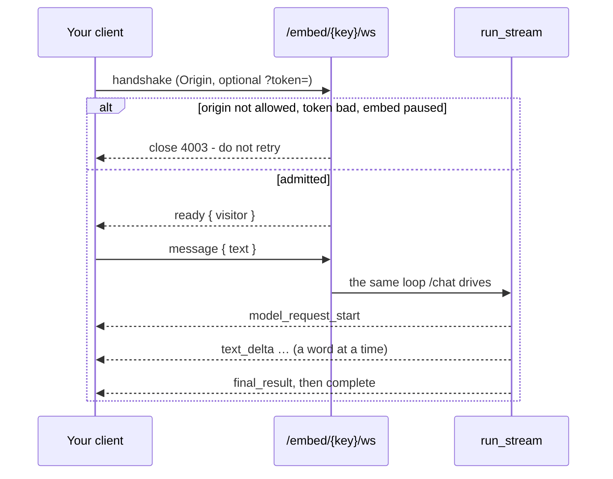
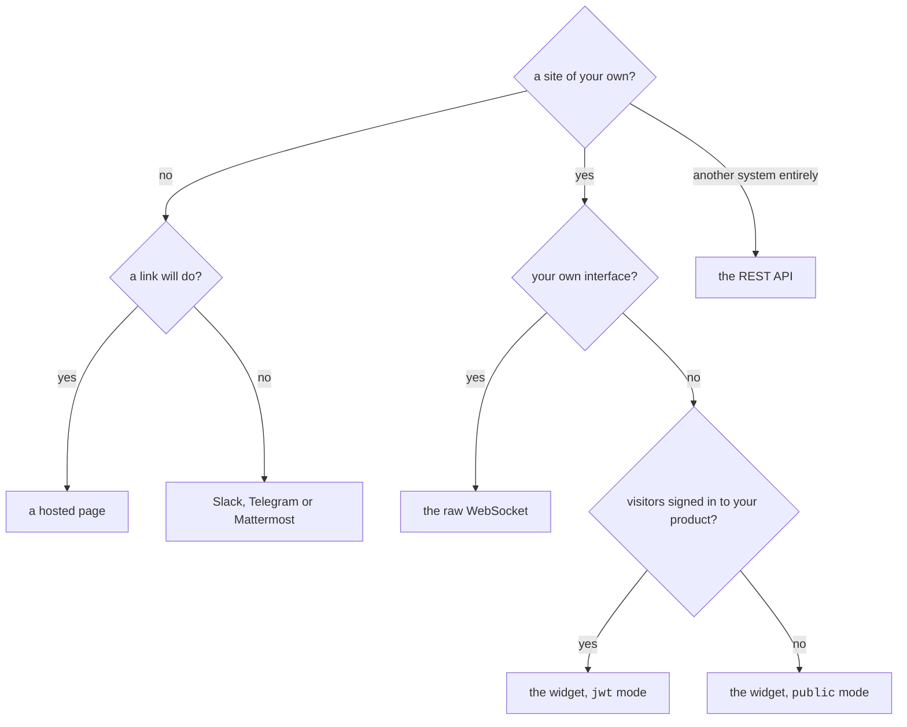

# Einen Agent dorthin bringen, wo die Menschen schon sind { #putting-an-agent-where-people-already-are }

Ein Agent, der nur in diesem Dashboard antwortet, ist eine Demo. Derselbe
veröffentlichte Agent antwortet an acht Stellen, und jede einzelne davon führt
*dieselbe eingefrorene Version* durch dasselbe Budget, dasselbe Approval-Gate und
dieselben Mandantenprüfungen — die Oberfläche wechselt, der Agent nicht.

| Wo | Was es braucht | Wer der Besucher ist |
|---|---|---|
| **Dashboard** | nichts | ein angemeldetes Mitglied |
| **Website-Widget** | ein `<script>`-Tag | anonym, oder ein Nutzer, für den Ihr Backend bürgt |
| **Rohes WebSocket** | ein Embed-Schlüssel | was immer Ihre Integration sagt |
| **Eine gehostete Seite** | ein Link | anonym, und sonst nichts |
| **Die API** | eine Session | wer die Zugangsdaten hält |
| **Slack** | ein Bot-Token | ein Slack-Konto, optional mit einem Mitglied verknüpft |
| **Telegram** | ein Bot-Token | ein Telegram-Konto, optional verknüpft |
| **Mattermost** | ein Bot-Token und die URL Ihres Servers | ein Mattermost-Konto, optional verknüpft |

Das Dashboard öffnet sich auch als [Desktop-App](desktop.md): ein Fenster um
dieselbe Konsole, geladen vom selben Server, ohne irgendetwas Mitgeliefertes.

!!! abstract "Drei Regeln gelten auf jeder Oberfläche, durchgesetzt im Runner"

    - **Ein Run gehört immer zu genau einer Organisation.**
    - **Ein Ausgabenlimit wird vor jeder Modellanfrage geprüft, nie danach.**
    - **Ein fehlgeschlagener Run steht mit dem, was er ausgegeben hat, weiterhin
      in der Historie** — die Token waren ausgegeben, bevor er abbrach, und ein
      Budget, das das ignoriert, ist kein Budget.

!!! info "Drei dieser acht sind eine Tabelle, deren Zeilen sich durch ein `kind` unterscheiden"

    Ein Widget, ein rohes Socket und eine gehostete Seite sind jeweils ein
    *Embed* — und ein `kind` steht mit dem Anlegen fest, denn ein bereits
    eingefügtes Tag, ein bereits geschriebener Client und ein bereits
    verschickter Link benennen alle dieselbe Zeile.

Ein öffentlicher Schlüssel, ein Rate-Bucket, ein Budget, ein Pause-Schalter und
ein Satz von Ablehnungen. Was sich unterscheidet, ist das, was es zu
konfigurieren gibt, und das, was einen Besucher einlässt — weshalb der Builder
zuerst fragt, welches davon Sie wollen, bevor er irgendetwas anderes fragt, und
weshalb eine Seite keine Liste erlaubter Origins hat statt einer ignorierten.

Jeder Run hält fest, welche Oberfläche ihn eingelassen hat — `web`, `embed`,
`api`, `slack`, `telegram` oder `mattermost` —, und genau das aggregiert das
Diagramm nach Oberfläche im Dashboard. Alle drei Embed-Arten halten `embed` fest.
Zwei historische Falten: Widget-Runs, die aufgezeichnet wurden, bevor es den Wert
`embed` gab, sind als `web` gespeichert, und Mattermost-Runs aus derselben Zeit
als `api`. Keines von beiden wird nachgetragen — Historie umzuschreiben wäre
geraten —, also falten Diagramme über alte Zeiträume diese Runs in die
Oberfläche, unter der sie aufgezeichnet wurden.

**Was ein Fremder darf, darf er in einem bestimmten Takt.**

Die ohne Session erreichbaren Oberflächen tragen ein Limit, das im Redis des
Deployments gezählt wird, sodass es über Worker hinweg gilt:

- die Run-API, **pro Aufrufer**;
- das Skript des Widgets und der Einlass, den es einleitet, **pro Adresse**, auf
  je einem eigenen Zähler;
- die Konfiguration einer gehosteten Seite, **pro Seite** — die wird vom
  Frontend-Server geholt statt vom Browser, sodass eine Adresse dort einen
  Container benennt und jeden Besucher des Deployments in einen Bucket stecken
  würde.

Das Skript wird getrennt von dem Einlass gezählt, dem es vorausgeht, denn ein
Seitenaufruf verbraucht beides, und ein gemeinsamer Bucket für beides hat die
Zahl, die ein Betreiber setzt, auf ein Drittel ihrer selbst gebracht.

`RATE_LIMIT_RUN_PER_MINUTE`, `RATE_LIMIT_EMBED_PER_MINUTE` und
`RATE_LIMIT_HOSTED_PAGE_PER_MINUTE` setzen sie, und
[Konfiguration](configuration.md#rate-limiting) enthält den einen Vorbehalt, der
sich vor dem Produktivbetrieb zu lesen lohnt — hinter einem Proxy kommt jeder
Besucher als der Proxy an, solange Sie nichts anderes sagen.

Was die *Ausgaben* auf einer gehosteten Seite rationiert, ist das Socket, das die
Seite öffnet, und das wird wie das des Widgets pro Adresse gezählt.

---


!!! tip "Geht es ums Integrieren statt ums Konfigurieren?"

    [Die HTTP-API](api.md) behandelt die Authentifizierung, den
    Organisations-Header, das Ausführen eines Agents über HTTP, die beiden
    WebSocket-Endpunkte und den Fehler-Envelope.

## Das Website-Widget { #the-website-widget }

Der kürzeste Weg. Veröffentlichen Sie den Agent, legen Sie ein Embed an, fügen
Sie zwei Zeilen ein.

### 1. Das Embed anlegen { #1-create-the-embed }

Öffnen Sie im Builder den Agent → **Availability** → *Website widget*. Sie
wählen:

- **Allowed origins** — die Seiten, von denen aus dieses Widget geöffnet werden
  darf. **Eine leere Liste erlaubt nichts**, deshalb wird ein Veröffentlichen
  ohne eine solche Liste abgelehnt, statt ein Widget zu erzeugen, das nirgends
  antwortet. Der Schlüssel im Script-Tag ist von Natur aus öffentlich, also ist
  die Origin-Liste das, was tatsächlich verhindert, dass jemand anderes Ihren
  Agent auf Ihre Rechnung laufen lässt. Dieselbe Regel gilt für ein Socket,
  dessen Handshake gegen dieselbe Liste geprüft wird.
- **Auth** — `public` (anonyme Besucher) oder `jwt` (Ihr Backend bürgt für jeden
  Besucher; siehe unten).
- **Look** — die Kopfzeile und die Zeile darunter, die Begrüßung, was im leeren
  Eingabefeld steht, was die Startschaltfläche sagt, die Akzentfarbe und in
  welcher Ecke es sitzt. Alle sieben, und die Begrüßung wird vom Widget
  gezeichnet statt an das Modell geschickt: eine Begrüßung in der Historie des
  Modells ist eine Runde, von der der Agent glaubt, er habe sie gemacht.
- **Context** — eine Notiz, die an die erste Nachricht des Besuchers angehängt
  wird: *„Sie sind auf der Preisseite"*, *„Antworte auf Deutsch"*. Sie ersetzt
  nie die eigenen Instruktionen des Agents, die zur veröffentlichten Version
  gehören.
- **Rate limit** — Nachrichten pro Besucher pro Minute.

!!! danger "Eine leere Origin-Liste erlaubt nichts, und das ist Absicht"

    Der Schlüssel im Script-Tag ist von Natur aus öffentlich, also ist die
    Origin-Liste das Einzige, was jemand anderen davon abhält, Ihren Agent auf
    Ihre Rechnung laufen zu lassen. Ein Veröffentlichen ohne eine solche Liste
    wird abgelehnt, statt ein Widget zu erzeugen, das nirgends antwortet.

### 2. Das Snippet einfügen { #2-paste-the-snippet }

```html
<script src="https://your-api.example.com/api/v1/embed/PUBLIC_KEY/widget.js" async></script>
```

Das ist die ganze Integration. Das Skript hat keine Abhängigkeiten, keinen
Build-Schritt und kein Framework — es läuft auf einer Seite, die bereits React,
jQuery oder gar nichts lädt.

### 3. (Optional) Erzählen Sie ihm vom Besucher { #3-optional-tell-it-about-the-visitor }

Ein Widget kann **Variablen deklarieren** - einen Namen, ob sie erforderlich ist
und eine Zeile, die sagt, wofür sie da ist - und die Seite liefert sie:

```html
<script>window.AgenticOSContext = { plan: "pro", locale: "pl" };</script>
<script src="https://your-api.example.com/api/v1/embed/PUBLIC_KEY/widget.js" async></script>
```

Das Snippet, das der Builder Ihnen gibt, trägt diese Zeile bereits, mit Ihren
eigenen Schlüsseln darin, sobald Sie welche deklariert haben.

Sie werden den Instruktionen des Agents als markierter Datenblock angehängt,
unter einer Zeile, die sagt, dass es sich um Informationen über den Besucher
handelt und nicht um Anweisungen, und dass sie nicht überprüfbar sind. Dieser
letzte Teil gilt für jede einzelne von ihnen, auch bei einem `jwt`-Widget: das
Widget liest `window.AgenticOSContext`, und ein Token authentifiziert, *wer der
Besucher ist*, und nicht, *was die Seite über ihn gesagt hat*. Nichts davon darf
also entscheiden, was der Agent tun darf.

Daraus folgen drei Regeln:

- **Ein Schlüssel, den niemand deklariert hat, wird verworfen.** Die Seite ist
  etwas, das ein Besucher bearbeiten kann; ohne Deklaration würde jeder
  Schlüssel, den er sich ausdenkt, zu einer Zeile in den Instruktionen eines
  Agents.
- **Ein fehlender Pflichtwert lässt seine Zeile weg und wird protokolliert.**
  `required` ist ein Versprechen zwischen einem Integrator und sich selbst - es
  durchzusetzen würde einen Besucher seine Antwort kosten, wegen des
  Deployment-Fehlers eines anderen.
- **Einmal pro Unterhaltung gesendet**, vor der ersten Frage, und aus jedem
  Frame gelesen statt zur Verbindungszeit: eine Single-Page-Anwendung erfährt,
  wer jemand ist, ohne sich neu zu verbinden.

### 4. (Optional) Sagen Sie ihm, wer der Besucher ist { #4-optional-tell-it-who-the-visitor-is }

Für ein Widget innerhalb Ihres eigenen angemeldeten Produkts setzen Sie ein
Token, **bevor** das Skript lädt. Ihr Backend signiert es; wir überprüfen es und
sehen Ihre Nutzerdatenbank nie:

```html
<script>window.AgenticOSToken = "<%= agenticos_token_for(current_user) %>";</script>
<script src="https://your-api.example.com/api/v1/embed/PUBLIC_KEY/widget.js" async></script>
```

Eines zu prägen, in jeder Sprache, die ein JWT signieren kann:

```python
import time, jwt   # PyJWT

token = jwt.encode(
    {"sub": str(user.id), "iat": int(time.time())},
    EMBED_SIGNING_SECRET,          # the secret you set on the embed
    algorithm="HS256",
)
```

- `sub` ist erforderlich. Es identifiziert den Besucher für das Rate Limiting,
  und ein Token ohne `sub` wird abgelehnt — sonst würde ein einziges
  durchgesickertes Token zum Budget des ganzen Widgets.
- **`iat` ist erforderlich und muss innerhalb der letzten 12 Stunden liegen** —
  es wird nicht nur dann geprüft, wenn es vorhanden ist. Ein Token ohne `iat`
  oder mit einem veralteten wird abgelehnt, sodass eines, das aus einem Browser
  entweicht, nicht für immer funktionieren kann. Ein `exp`, das Sie setzen, wird
  ebenfalls beachtet, aber nur, um dieses Fenster zu **verkürzen** (ein
  abgelaufenes Token wird zurückgewiesen); es kann ein Token nicht über die
  Obergrenze von zwölf Stunden hinaus verlängern.
- Prägen Sie es pro Seitenaufruf, serverseitig.

!!! danger "Liefern Sie das Signing-Secret niemals an einen Browser aus"

    Es signiert *jeden* Besucher. Das Token, das es prägt, ist das, was der
    Browser halten darf, und nur für die zwölf Stunden, die `iat` ihm gibt.

---

## Das rohe WebSocket { #the-raw-websocket }

Das Widget ist ein Client eines dokumentierten Protokolls, keine Blackbox. Wenn
Sie Ihre eigene Oberfläche wollen — eine Mobile-App, einen Kiosk, eine Komponente
in Ihrem Designsystem — sprechen Sie mit demselben Socket:

```
wss://your-api.example.com/api/v1/embed/PUBLIC_KEY/ws[?token=SIGNED_JWT]
```

**Sie müssen das nicht selbst zusammensetzen.** Veröffentlichen Sie eines aus dem
Builder — der Agent → **Availability** → *Raw WebSocket* — und seine Zeile druckt
die URL, gebaut aus der eigenen Basis-URL des Deployments, mit einer
Kopieren-Schaltfläche. Ein **Widget** druckt dasselbe neben seinem Script-Tag,
denn ein Widget ist ein Client dieses Protokolls: der Wechsel zu einer eigenen
Oberfläche ist ein Schritt und keine Neuentwicklung. Das `?token=` wird dort
nicht gedruckt: im `jwt`-Modus wird das Token pro Besucher von Ihrem Backend
geprägt, und ein echtes auf einem Dashboard-Bildschirm ist ein funktionierendes
Zugangsmittel, das jemand über die Schulter mitlesen kann.

!!! bug "Das Erste, was schiefgeht: ein fehlender `Origin`"

    Der Handshake muss einen tragen, der auf der Allow-Liste des Embeds steht.
    **Ein Browser sendet ihn für Sie; ein eigener Client sendet nichts, solange
    Sie ihn nicht setzen** - eine Mobile-App, ein Kiosk, ein serverseitiges
    Relay. Wie es aussieht, wenn er es nicht tut, ist `4003` in der Tabelle
    unten, keine Fehlermeldung.



**Frames, die Sie senden**

```json
{ "type": "message", "text": "Do you ship to Poland?" }
```

Das ist das ganze eingehende Vokabular, dazu `context` (was die Seite über den
Besucher sagt) und `file_ids` (was er angehängt hat, auf einer Seite, die Dateien
annimmt).

**Es enthält bewusst nicht die drei Felder, die der Frame des Dashboards
trägt:** den Agent, das Modellprofil und die Umgebung.

Ein Frame, der ein Modell wählen könnte, ist ein Besucher, der eines auf die
Rechnung des Betreibers wählt, und einer, der einen Agent wählen könnte, ist ein
Besucher, der mit etwas spricht, das niemand auf diesem Schlüssel veröffentlicht
hat. Alle drei kommen von der Embed-Zeile.

Ein unbekanntes Feld wird **ignoriert statt abgelehnt**. Ein Client, der im
Browser von jemandem zwischengespeichert ist, kann älter sein als dieser Server,
und das Socket deswegen zu schließen würde die Unterhaltung mitnehmen.

**Frames, die Sie empfangen**

!!! note "Das ist das Frame-Vokabular des Dashboards selbst, kein zweites"

    `/chat` und dieses Socket treiben eine Schleife
    (`app/services/run_stream.py`), also trifft eine Antwort hier Wort für Wort
    ein, genauso wie dort. Eine gehostete Seite zeigte früher einen Textklumpen
    nach dreißig Sekunden ohne alles, und das war die Schleife und nicht der
    Transport.

Jeder Frame trägt `{ "type": …, "data": { … } }`.

| `type` | `data` | Bedeutung |
|---|---|---|
| `ready` | `visitor` | Verbunden. `visitor: true`, wenn ein Token die Person identifiziert hat. |
| `history` | `messages` | Nur auf einer gehosteten Seite: was in dem Thread gesagt wurde, den dieser Besucher wieder aufnimmt. Jeder Eintrag ist `role`, `text` und `at`, sodass eine wiedergegebene Runde die Zeit darunter behält. |
| `model_request_start` | — | Der Agent ist zum Modell gegangen. Zeigen Sie einen Indikator. |
| `part_start` | `index`, `part_type` | Ein Block der Antwort beginnt. Wird nur für einen Block gesendet, den diese Oberfläche auch wirklich trägt — eine Seite, die kein Reasoning zeigt, kündigt keinen `ThinkingPart` an, denn schon die Ankündigung sagt, dass der Agent nachgedacht hat. |
| `text_delta` | `index`, `content` | Wörter der Antwort. Hängen Sie sie an. |
| `thinking_delta` | `index`, `content` | Das Reasoning des Modells. **Nur, wenn der Betreiber es eingeschaltet hat.** |
| `call_tools_start` | — | Der Agent ist im Begriff, Tools zu benutzen. |
| `tool_call` | `tool_call_id`, `tool_name`, `args` | Ein Schritt. `args` nur, wenn der Betreiber Ergebnisse zeigt. |
| `tool_call_delta` | `index`, `args_delta` | Die Argumente eines Aufrufs, während sie streamen. |
| `tool_result` | `tool_call_id`, `content` | Was der Schritt zurückgegeben hat. |
| `final_result_start` | `tool_name` | Die Antwort wird von einem Output-Tool erzeugt. |
| `final_result` | `output` | Womit der Run geendet hat. Leer bei einer Runde, die geparkt hat. |
| `complete` | — | Die Runde ist vorbei. Sie trägt **keine Nutzungsdaten**: was ein Run gekostet hat, ist Sache des Betreibers, nicht des Besuchers. |
| `error` | `message` | Etwas, das der Besucher sehen sollte: Rate Limit, Budget erreicht, eine Ablehnung, eine Runde, die nichts erzeugt hat. |

Manche Dashboard-Frames erreichen ein öffentliches Socket nie, und sie sind
Ablehnungen und keine Einstellungen. **`user_prompt_processed`** trägt den Prompt
*so, wie er zusammengesetzt wurde* — die Platzierungsnotiz und den gelieferten
Block über dem, was der Besucher getippt hat —, und das ist der Text des
Betreibers und nicht der des Besuchers zum Nachlesen.

**`ask_user` und `tool_approval_required` haben hier niemanden, der sie
beantwortet, aber sie scheitern unterschiedlich.** Ein Besucher kann keine
Nebenwirkung in der Organisation eines anderen freigeben, also **parkt**
`tool_approval_required` den Run genau so, wie es auf einem Kanal geschieht, und
die Runde endet mit `error` und dem Hinweis, dass eine Person entscheiden muss —
anders als auf einem Kanal ohne den `/runs`-Link, denn der Leser dort ist ein
Mitglied, das ihn öffnen kann, und hier ist er ein Fremder mit einem Link.
`ask_user` parkt **nicht**: `AgentDeps.ask_user` ist auf dieser Oberfläche
`None`, also *verweigert* das Tool, wenn das Modell es aufruft
(`app/agents/ask_user.py`), und das Modell antwortet ohne diese Eingabe weiter —
eine verschlechterte Antwort, kein geparkter Run.

**Ein Client ignoriert, was er nicht zeichnet**, und `widget.js` ist das
durchgearbeitete Beispiel: es liest `model_request_start`, `text_delta`,
`final_result`, `complete` und `error` und ignoriert das Reasoning und die
Schritte mit Absicht — eine Antwort, die Wort für Wort eintrifft, ist in einer
Blase in der Ecke einer Seite etwas wert, und eine Erzählung von Tool-Aufrufen
ist es nicht. Die gehostete Seite zeichnet sie alle.

**Close-Codes**

| Code | Bedeutung |
|---|---|
| `4003` | Abgelehnt. Der Origin ist nicht erlaubt, das Token ist gescheitert, oder das Widget ist pausiert. Nicht erneut versuchen — die Antwort ändert sich nicht. |
| `4029` | Zu viele Verbindungen von dieser Adresse in der letzten Minute. Zurückstecken und erneut versuchen. |
| `1011` | Dieser Client hat nicht gelesen. Ein Frame brauchte länger als 30 Sekunden, um ihn zu erreichen, also hat der Server aufgehört zu schreiben, statt die Datenbank-Session der Runde und den offenen Provider-Stream pro Frame offen zu halten. Verbinden Sie sich neu; eine gehostete Seite nimmt ihren Thread wieder auf. |

Die Ablehnung ist bewusst ein Code mit einer Meldung. Eine Seite, die nicht auf
der Allow-Liste steht, erfährt, dass sie nicht erlaubt ist, und nichts darüber,
ob ein Token geholfen hätte.

`4029` ist aus dem entgegengesetzten Grund davon getrennt: „nicht erlaubt" und
„erlaubt, aber zu schnell" verlangen von einem Client Gegenteiliges — für immer
aufhören und es später noch einmal versuchen —, sodass ein Client, der sie nicht
auseinanderhalten kann, entweder auf eine Ablehnung eindrischt oder ein Limit
aufgibt. Wie viele Verbindungen eine Adresse bekommt, ist
`RATE_LIMIT_EMBED_PER_MINUTE`; wie viele *Nachrichten* ein Besucher bekommt,
sobald er verbunden ist, ist das eigene Rate Limit des Widgets, gesetzt im
Builder.

Ein minimaler Client:

```js
const socket = new WebSocket(`${BASE}/api/v1/embed/${KEY}/ws`);
let answer = "";
socket.onmessage = (event) => {
  const { type, data } = JSON.parse(event.data);
  if (type === "text_delta") render((answer += data.content));
  if (type === "final_result" && data.output) render((answer = data.output));
  if (type === "complete") answer = "";
  if (type === "error") render(data.message);
};
socket.send(JSON.stringify({ type: "message", text: "hello" }));
```

`final_result` wird zugewiesen statt angehängt: es ist das, womit der Run
*geendet* hat, und bei einem Provider, der keine Deltas gestreamt hat, bleibt es
die einzige Kopie der Antwort.

---

## Eine gehostete Seite { #a-hosted-page }

Die kürzeste Integration, die es gibt: **schicken Sie jemandem einen Link.**
Keine eigene Website, kein `<script>`-Tag, kein Client zu schreiben, keine
Anmeldung.

Öffnen Sie im Builder den Agent → **Availability** → *Hosted page*. Es gibt keine
Website zu benennen und nichts einzufügen — das Formular fragt nach einem Titel,
einer Begrüßung, einer Akzentfarbe und einem Logo, alles optional, und
veröffentlicht:

```
https://your-app.example.com/e/PUBLIC_KEY
```

Sie ist **ein Embed wie die anderen beiden**: dieselbe Art Schlüssel, dasselbe
Rate Limit, dasselbe Budget und derselbe Pause-Schalter. Sie zu pausieren stoppt
die Seite sofort, und jeden Link, der mit ihr schon verschickt wurde.

### Was sie schützt { #what-protects-it }

Sprechen Sie diesen Teil laut aus, bevor Sie eine veröffentlichen, denn er ist
das ganze Sicherheitsmodell:

> **Ein gehosteter Link im `public`-Modus ist dadurch geschützt, dass der
> Schlüssel nicht erratbar ist, dazu durch das Rate Limit des Embeds, sein Budget
> und seinen Pause-Schalter. Sonst nichts.**

Wer den Link hat, kann mit dem Agent sprechen. Das ist der Sinn eines Links, und
deshalb ist der Schlüssel 24 zufällige Bytes und nicht etwas Lesbares.

Es gibt hier bewusst keine Liste erlaubter Origins, und das Formular bietet auch
keine an: eine Allow-Liste ist eine Regel über die Websites *anderer Leute*, und
diese Seite ist eine, die wir ausliefern. Eine Seite wird vom eigenen Origin des
Deployments eingelassen — abgeleitet aus `FRONTEND_URL`, nie fest verdrahtet —
und sonst nirgendwo. Ein `CHECK`-Constraint lehnt eine Seite ab, die überhaupt
eine Liste trägt, denn eine gespeicherte liest sich wie das, was den Link
schützt, und das ist sie nicht.

### Zwei Dinge, die eine gehostete Seite ablehnt { #two-things-a-hosted-page-refuses }

Beide werden beim Veröffentlichen abgelehnt, mit einer Meldung, statt still auf
ein Widget zurückzufallen:

- **Eine Seite kann den `jwt`-Modus nicht verwenden**, und das Formular bietet
  ihn nicht an. Das Token müsste in der URL reisen und damit in den
  Browserverlauf, in `Referer`-Header und in jeden Chat-Client, in den der Link
  eingefügt wird — und der Fragment-Trick, der einen Teil davon vermeidet, nimmt
  dem Link das „verschicken und es funktioniert". Verwenden Sie für eine
  nutzerbezogene Integration ein Widget oder ein Socket; `jwt` ist dort
  unberührt. Ein `CHECK`-Constraint hält dieselbe Regel in der Datenbank.
- **Eine *erforderliche* Variable, die nicht URL-sicher ist, kann nicht auf einer
  Seite sein** — siehe unten.

### Variablen aus der Adresszeile { #variables-from-the-address-bar }

Eine gehostete Seite hat keine Seite von Ihnen, aus der sie
`window.AgenticOSContext` lesen könnte. Ihre einzige Quelle für eine deklarierte
Variable ist die URL des Besuchers selbst:

```
https://your-app.example.com/e/PUBLIC_KEY?var_plan=pro
```

**Ein Query-Parameter ist vom Besucher kontrollierte Eingabe**, deshalb ist das
pro Variable ausgeschaltet und nur dort an, wo jemand es entschieden hat: haken
Sie im Builder *URL-safe* an der Variablen an. Ohne das wird ein in die
Adresszeile getipptes `?var_user_tier=premium` verworfen — was der Sinn der Sache
ist. Alles, was gar nicht deklariert ist, wird verworfen wie beim Widget.

Deshalb muss eine *erforderliche* Variable auch markiert werden: auf dieser
Oberfläche ist die URL der einzige Weg, eine zu liefern, sodass eine Variable,
die erforderlich und nicht URL-sicher ist, ein Versprechen ist, das die Seite
strukturell nicht halten kann.

### Wieder zurückkommen { #coming-back-to-it }

Die Unterhaltung eines Widgets dauert so lange wie sein Socket. Ein Link als
Lesezeichen ist ein stärkeres Versprechen, deshalb hält die Seite einen
zufälligen Besucherschlüssel in `localStorage` — einen pro öffentlichem
Schlüssel — und der Server bildet ihn auf eine Unterhaltung ab. Den Link erneut
zu öffnen gibt den Thread wieder, und der Agent wird an dasselbe Fenster
erinnert, das der Besucher liest.

**Der Schlüssel ist ein Inhaber-Zugangsmittel für diese Unterhaltung**: wer ihn
hält, nimmt den Thread wieder auf, einschließlich dessen, was schon darin steht.
Er besteht aus 128 zufälligen Bits und nichts über die Person. Die Website-Daten
zu löschen beginnt einen neuen Thread.

Dieser Schlüssel ist alles, was die Seite speichert, und deshalb zeigen **eine
gehostete Seite und eine geteilte Unterhaltung keinen Cookie-Hinweis** — die
beiden Oberflächen, die jemandem ausgeliefert werden, der kein Mitglied ist, sind
die beiden ohne optionales Cookie, in das einzuwilligen wäre. Das Banner des
Produkts erschien hier früher und bat um Erlaubnis für Analytics, die dieses
Deployment nicht betreibt, während es über dem Eingabefeld saß und Send verdeckte
(#644). Eine Einwilligungsabfrage für einen einzigen notwendigen Schlüssel ist
eine Abfrage, deren einzige Wirkung die Überdeckung ist.

Diese Form wird durchgesetzt, nicht angenommen — das Socket akzeptiert 32 bis 64
kleingeschriebene Hex-Zeichen als `visitor` und **verwirft alles andere**, wobei
es stattdessen einen frischen Thread öffnet. Das ist für einen eigenen Client
(unten) wichtig: Kontinuität an einer Kunden-ID, einer E-Mail-Adresse oder einem
Zähler festzumachen würde jedem Ihrer Nutzer eine Unterhaltung geben, in die der
Nächste durch Raten hineinspazieren kann. Ein verworfener Schlüssel kostet
Kontinuität und nie die Unterhaltung, sodass ein veralteter Wert im Browser von
jemandem keine Seite ist, die nicht lädt.

### Was sie anbietet { #what-it-offers }

Zwei Schalter, und beide gehören dem Betreiber und nicht der Seite — eine
Capability, die eine Seite für sich selbst einschaltet, wäre eine, die niemand
ausschalten könnte.

- **Eine Schaltfläche, um einen frischen Thread zu beginnen**, standardmäßig an.
  Sie prägt einen neuen Kontinuitätsschlüssel, sodass der alte Thread nicht
  gelöscht wird: er ist nur nicht mehr der, den dieser Browser wieder aufnimmt.
- **Ein Mikrofon im Eingabefeld**, standardmäßig aus. Es diktiert in das Feld
  über den *Browser des Besuchers selbst*, sodass kein Audio dieses Deployment
  erreicht und hier nichts transkribiert wird — aber ein Browser, der
  Spracherkennung anbietet, übergibt das Audio seinem Anbieter, und das ist die
  Hälfte, die es sich vor dem Einschalten für die Öffentlichkeit zu lesen lohnt.
  Einem Browser ohne Spracherkennung wird kein Mikrofon gezeigt statt einer
  Schaltfläche, die nichts tut.
- **Eine Möglichkeit, eine Datei anzuhängen**, standardmäßig aus. Siehe unten: es
  ist das Einzige auf dieser Oberfläche, das einen Fremden etwas *speichern*
  lässt.

### Wohin ein Fremder mit dem Link schreiben kann { #what-a-stranger-holding-the-link-can-write-to }

Alles andere auf einer öffentlichen Oberfläche liest. Diese hier schreibt, also
lohnt es sich, genau zu sagen, was ein Besucher wohin legen kann.

**Er kann eine Datei speichern**, und nur, wenn der Betreiber den Schalter
gesetzt hat. Die Bytes gehen denselben Weg wie der Upload eines Mitglieds — die
MIME-Allow-Liste, `CHAT_MAX_UPLOAD_SIZE_MB` (standardmäßig 10 MB — die eigene
Obergrenze der Chat-Oberfläche, nicht das größere `MAX_UPLOAD_SIZE_MB` der
Knowledge Base), der Parser, das Storage-Backend, eine `ChatFile`-Zeile — mit
drei Verengungen davor:

| | |
|---|---|
| **Eine eigene Obergrenze dieser Oberfläche** | `EMBED_MAX_UPLOAD_SIZE_MB`, standardmäßig 5 MB. Ein Mitglied, das einen fünfzig Megabyte großen Export hochlädt, ist jemand, den die Organisation beschäftigt; dieselbe Erlaubnis auf einem öffentlichen Link ist ein Weg, eine Festplatte von einer Adresse aus zu füllen, die niemand kennt. Es ist eine Obergrenze *zusätzlich zu* `CHAT_MAX_UPLOAD_SIZE_MB`, nie ein Weg daran vorbei |
| **Ein Limit pro Adresse und pro Besucher** | `RATE_LIMIT_EMBED_UPLOAD_PER_MINUTE`, im gemeinsamen Redis, und **beide** müssen es erlauben. Nur den Kontinuitätsschlüssel zu zählen begrenzt nichts: der Browser prägt ihn, und beliebige 32 Hex-Zeichen sind ein gültiger, sodass ein Skript ihn pro Datei variiert. Nur die Adresse zu zählen lässt einen Browser auf einer geteilten Adresse das Kontingent aller verbrauchen |
| **Drei Dateien pro Nachricht** | Was begrenzt, wie viel vom Prompt einer Runde das Dokument eines anderen ist |

Diese drei begrenzen, was *gespeichert* wird. Was begrenzt, was ein Fremder
dieses Deployment *empfangen* lassen kann, liegt eine Schicht über allen dreien,
denn der Multipart-Body wird geparst, bevor die Route läuft: eine Anfrage, die
mehr deklariert als die Obergrenze für die ganze Anfrage, wird mit 413
beantwortet, ohne gelesen zu werden. Siehe
[Konfiguration](configuration.md#the-size-of-a-request-as-opposed-to-the-size-of-a-file),
einschließlich dessen, was sie nicht abdeckt.

**Die Zeile gehört dem Mitglied, das die Seite veröffentlicht hat**, denn
`chat_files.user_id` ist `NOT NULL` und ein Besucher hat kein Konto — dieselbe
Antwort, die schon darauf gegeben wurde, als wer eine öffentliche Runde *läuft*.
Eine Seite, deren Veröffentlichender kein Konto mehr hat, kann deshalb überhaupt
keine Dateien annehmen und sagt „nicht verfügbar", statt sie gegen niemanden zu
speichern.

**Wohin die Datei dann geht, ist die Entscheidung des Runners, nicht die dieser
Oberfläche.** Es ist das Routing aus [Dateiverarbeitung](file-processing.md),
unverändert: in den Workspace des Agents, wo er einen hat, in den Prompt gefaltet,
wo er keinen hat, und ein Bild auf beiden Wegen bis zur Inline-Obergrenze. Nichts
an der Datei eines Besuchers ist ein Sonderfall.

Ein Frame darf nur eine Datei benennen, die dem Eigentümer dieser Seite gehört
und nicht schon an einer Nachricht hängt, sodass eine ID nicht in eine zweite
Runde oder in den Thread eines anderen eingespielt werden kann. Das ist
verhältnismäßig statt vollständig, und was es ausreichend macht, ist die ID
selbst: `uuid4` sind 122 zufällige Bits, sodass eine ID von einem anderen Besucher
ein Wert ist, den niemand erzeugen kann, ohne ihn bekommen zu haben.

**Sonst können sie nichts schreiben.** Keine Knowledge Base, keinen eigenen Pfad
im Workspace, keine Konfiguration, keine Variable, die nicht deklariert und
URL-sicher ist. Die Zeile der Unterhaltung und die Runden darin werden *über* sie
geschrieben, von der Plattform.

### Was der Besucher von der Arbeit sieht { #what-the-visitor-sees-of-the-work }

Drei weitere Schalter, und sie sind **Filter darauf, was der Server sendet**, und
nicht darauf, was die Seite zeichnet. Diese Unterscheidung ist das ganze Design:
in CSS verstecktes Reasoning ist das Reasoning eines Agents in den Devtools eines
Fremden, und eine Seite ist genau der Ort, wo ein Fremder welche offen hat. Ein
Besucher, der seine öffnet, sieht, was hier angehakt ist, und nichts sonst.

| Schalter | Standard | Was er durchlässt |
|---|---|---|
| **Was der Agent gerade tut** | an | Eine Zeile pro Schritt — *Durchsucht die Dokumente*, *Hat eine Abfrage ausgeführt*. An, weil eine Seite, die dreißig Sekunden still wird, sich wie kaputt liest |
| **Was jeder Schritt zurückgegeben hat** | aus | Die Argumente, mit denen ein Schritt aufgerufen wurde, und was zurückkam. Für das Modell geschrieben, also taucht hier etwas Internes auf: eine Adresse, eine Zeile aus einem System, eine Passage, die niemand veröffentlichen wollte |
| **Das Reasoning des Agents** | aus | Was das Modell zu sich selbst sagt, bevor es antwortet. Nicht dafür geschrieben, dass es jemand liest, und keine Antwort, hinter die sich ein Betreiber stellen kann |

*Was jeder Schritt zurückgegeben hat* kann nicht allein eingeschaltet werden — es
gäbe keinen Schritt, der sich dafür öffnen könnte, und der Server verwirft beides,
egal was die Konfiguration sagt.

**Eine Runde sieht aus wie eine Runde im Web-Chat**, bis hin zum Rahmen darum: der
Name des Agents über der Antwort, der Avatar am Rand — das Logo der Seite, wo es
eines gibt, die Initiale des Agents, wo es keines gibt —, die Zeit unter jeder
Runde auf der Seite, auf der sie steht, und eine Eingabekarte mit dem Feld und
seinen Bedienelementen darin.

Drei Dinge, die der Web-Chat dort zeichnet, fehlen bewusst, und alle drei sind
dieselbe Entscheidung wie die Panels weiter unten: was die Runde gekostet hat, was
der Monat gekostet hat, und welcher Agent und welches Modell laufen sollen.

Das letzte davon, weil ein Frame, der ein Modell auswählen könnte, ein Besucher
ist, der eines auf die Rechnung des Betreibers auswählt.

**Eine Runde wird von den eigenen Komponenten des Web-Chats gerendert**, nicht von
einem zweiten Satz, der so aussieht wie sie.

`TurnParts` ist das, was das Dashboard rendert, und das, was die Seite rendert.
Also ist das Reasoning dieselbe Offenlegung, die Antwort dasselbe Markdown und
eine Folge von Tool-Aufrufen dieselbe Leiste — das Icon aus
`src/lib/tool-catalog.ts`, die Formulierung aus `toolStep`, und dieselben
Renderer, die sich unter einem Schritt öffnen für eine Wissenssuche, eine
Websuche, ein Diagramm, ausgeführten Code, einen geladenen Skill, eine
geschriebene Datei.

Es gibt bewusst keine zweite Tabelle von Tool-Namen und keinen zweiten
Runden-Renderer (#144). Was die Seite *nicht* zeichnet, ist alles, was damit zu
tun hat, Mitglied zu sein — siehe unten.

Eines liest sich notwendigerweise anders: ein Aufruf, der von einem MCP-Server
kam, heißt im Dashboard *Linear · Create issue* und hier mit einem vermenschlichten
Namen, denn die Zuordnung ist die Liste der Verbindungen der Organisation, und
sie zu lesen braucht eine Session.

**Ein Widget und ein rohes Socket tragen keine Schalter und bekommen diese
Standardwerte**, abgelesen von `PageConfig` statt wiederholt — eine zweite Kopie
von „standardmäßig aus" ist eine Kopie, die der widersprechen kann, die jemand im
Builder liest. Was `widget.js` dann *zeichnet*, ist noch enger, und das steht
oben.

Keines von beiden nimmt Dateien an, und das liegt an der Route und nicht am
Client: der Upload-Endpunkt löst den Schlüssel über `find_page` auf, sodass ein
Widget-Schlüssel ihn erreicht und „nicht verfügbar" beantwortet bekommt. Ein
Widget lebt auf einer Seite, die der Betreiber ohnehin kontrolliert, und dorthin
gehört eine eigene Dateiauswahl.

### Was bewusst nur für Mitglieder ist { #what-is-deliberately-member-only }

Der Web-Chat zeichnet drei Panels, die eine öffentliche Oberfläche nicht zeichnet,
und jede Auslassung ist eine Entscheidung und keine Lücke — hier festgehalten,
damit sie nicht noch einmal als eine verhandelt wird.

| Panel | Auf einer öffentlichen Oberfläche | Warum |
|---|---|---|
| **Die Nutzungsleiste** | Nein, und es ist kein Schalter | Sie berichtet die Token der Runde, ihre Kosten, den Monat gegen das Cap der Organisation und wie voll der Workspace ist. Ein Besucher ist nicht derjenige, der zahlt, und das verbleibende Budget des Betreibers ist eine Tatsache über den Betreiber. `complete` trägt überhaupt keine Nutzungsdaten, also gibt es clientseitig nichts zu verbergen |
| **Das Datei-Panel** | Nein | Es listet alles im *Workspace* des Agents auf, der über die Unterhaltungen aller geteilt wird, die diesen Agent nutzen. Einem Fremden, der eine Datei angehängt hat, würde jede Datei gezeigt, die der Agent je bekommen hat. Sein eigener Anhang steht an seiner eigenen Runde, und das ist es, was ihm zusteht |
| **Das Delegations-Panel** | Nein | Es benennt die Delegierten per Slug, was jeder gefragt wurde und was jeder gekostet hat — die Form des Agent-Graphen der Organisation. Eine Seite, die das zeigte, würde ein internes Organigramm an jeden veröffentlichen, der den Link hat. Eine Delegation *läuft* trotzdem: sie ist ein `tool_call`-Schritt namens `task`, unter demselben Schalter wie jeder andere Schritt |

Das Muster hinter allen dreien: was ein Mitglied sieht, ist *über die
Organisation*, und was ein Besucher sieht, ist *über seine eigene Runde*. Ein
Panel, das diese Linie überschreitet, ist nur für Mitglieder, was auch immer es
kosten würde, es zu rendern.

### Wie sie aussieht { #what-it-looks-like }

Die Antwort wird als **Markdown** gerendert, genau wie im Web-Chat: ein Agent, dem
gesagt wurde, in Markdown zu antworten, antwortet darin, ob die Seite die
Sternchen nun neu interpretiert oder nicht. Was ein *Besucher* getippt hat, wird
nicht neu interpretiert — es ist kein Dokument.

Vier Felder, alle optional:

| Feld | Standard |
|---|---|
| **Page title** | der Name des Agents |
| **Welcome message** | keine. **Markdown**, geschrieben im selben Editor wie die Platzierungsnotiz und auf der Seite als Markdown gerendert. Wird vor der ersten Frage gezeigt und nie an das Modell geschickt — eine Begrüßung in der Historie des Modells ist eine Runde, von der der Agent glaubt, er habe sie gemacht |
| **Accent colour** | `#4f46e5`. Hell und Dunkel folgen weiterhin dem System des Besuchers |
| **Logo** | der Avatar des Agents; oder der der Organisation, einer, den Sie hochladen, oder keiner. Was auch immer Sie wählen, die Seite zeigt **nichts** statt eines kaputten Bildes, wenn keine Datei dahinter liegt — ein Agent ohne Avatar ist der Normalfall, und ein Browser kann einen 404 nicht von einem langsamen Bild unterscheiden |

Drei dieser vier sind Bilder, die diese Plattform ohnehin hält. Das vierte nimmt
eine Datei — PNG, JPEG, WebP oder GIF, bis 2 MB — und es kann erst hinzugefügt
werden, wenn die Seite existiert, denn ein Upload braucht eine Zeile, an die er
sich hängen kann.

Die Seite holt es von **ihrem eigenen Origin**, nicht von der API: `img-src` in
`next.config.ts` schließt eine API auf reinem `http` aus, sodass eine Seite, die
ein `` auf eine solche richtete, in der Entwicklung und auf jedem Deployment,
das TLS anderswo terminiert, ein kaputtes Zeichen rendert.
`/api/embed/<key>/logo` im Frontend leitet es weiter.

**Was sie nicht annimmt, ist eine eigene URL von Ihnen.** Eine Seite, die wir
ausliefern und die ein vom Betreiber geliefertes Bild holt, ist eine Sache mehr,
die abgesichert werden muss. Und der gespeicherte Pfad ist eine *Spalte*,
geschrieben von der Upload-Route und nie von der Konfiguration, die Sie
absenden: der Pfad wird von einer öffentlichen Route zurückgelesen und gestreamt,
sodass einer, der aus einem Request-Body übernommen würde, ein Aufrufer wäre, der
jede Datei benennt, die der Prozess öffnen kann.

**Sie nimmt auch nicht Ihren Dateinamen oder Ihr Wort dafür, was die Datei ist.**

Weil die Seite das Logo von ihrem eigenen Origin holt, ist der Typ, den diese
Antwort trägt, ein Typ, dem der Browser auf diesem Origin vertraut — und
`script-src` erlaubt dort Inline-Skripte.

Ein Upload wird auf den `Content-Type` hin angenommen, den sein Client
*deklariert* hat, und der ist kein Beleg über die Bytes. Deshalb wird der Name auf
der Festplatte stattdessen aus dem Typ geprägt (`logo.png`, `logo.jpg`,
`logo.webp`, `logo.gif`), und sowohl die API-Route als auch der Frontend-Proxy
weigern sich, mit irgendetwas zu antworten, das nicht einer dieser vier Bildtypen
ist.

Ein gespeichertes `.html` oder `.svg` — von hier, oder von einem Avatar, der vor
Jahren über eine andere Route hochgeladen wurde — wird als **gar nichts**
ausgeliefert statt als Skript.

Die Seite ist `noindex`. Ein geheimer Link ist keine Seite, die indexiert werden
soll, und ein Crawler, der einem folgt, hat ihn veröffentlicht.

---

## Die öffentliche API { #the-public-api }

Überhaupt kein Frontend und kein Browser. Eine Anfrage, eine Antwort:

```bash
curl -X POST https://your-api.example.com/api/v1/agents/AGENT_ID/run \
  -H "Authorization: Bearer $TOKEN" \
  -H "X-Organization-Id: $ORG_ID" \
  -H "Content-Type: application/json" \
  -d '{"prompt": "Summarise this week's refunds"}'
```

Sie geht durch denselben Runner wie jede andere Oberfläche, also wird der Run
aufgezeichnet, das Budget gilt, und die Kosten landen im selben Dashboard — ein
API-Aufrufer kann Governance nicht dadurch umgehen, dass er die UI nicht benutzt.
Runs werden mit `api` gestempelt.

Die Antwort trägt `run_id`, `output`, `status` und das, was sie gekostet hat. Ein
`status` von `awaiting_approval` mit leerem Output bedeutet, dass ein Tool-Aufruf
geparkt ist: der Run steht in der Approval-Warteschlange und läuft weiter, wenn
jemand entscheidet.

Begrenzt pro Aufrufer statt pro Adresse — ein Büro hinter einem NAT ist nicht ein
Aufrufer — auf `RATE_LIMIT_RUN_PER_MINUTE`.

---

## Slack { #slack }

1. **api.slack.com/apps → Create New App → From scratch.** Benennen Sie die App
   und wählen Sie den Workspace.
2. **OAuth & Permissions → Bot Token Scopes → Add an OAuth Scope**, und fügen Sie
   die dreizehn unten hinzu. *Install to Workspace* bleibt ausgegraut, bis
   mindestens einer hinzugefügt ist, und darauf wartet eine leere App.
3. **Install App → Install to Workspace → Allow.** Kopieren Sie das **Bot User
   OAuth Token** (`xoxb-…`).
4. **Event Subscriptions → Enable Events → Subscribe to bot events**, und fügen
   Sie die fünf Events unten hinzu.
5. Registrieren Sie den Bot: **Channels → Add bot**, Plattform `slack`, fügen Sie
   das Bot-Token ein.
6. Wählen Sie einen Transport — Socket Mode braucht nichts nach außen Offenes und
   ist auf einem Laptop die richtige Wahl:
     - **Socket Mode.** *Basic Information → App-Level Tokens → Generate*, Scope
       `connections:write`; fügen Sie das `xapp-`-Token hier in die Einstellungen
       des Bots ein. Keine Request URL, kein Signing Secret.
     - **Events API.** Fügen Sie das Signing Secret aus *Basic Information → App
       Credentials* **zuerst** in die Einstellungen des Bots ein, und setzen Sie
       dann Slacks *Request URL* auf
       `https://your-api.example.com/api/v1/slack/BOT_ID/events` — die Bot-ID
       steht in seiner Zeile unter **Channels**.
7. **App Home → Messages Tab**: aktivieren Sie ihn und haken Sie *Allow users to
   send Slash commands and messages from the messages tab* an. Ohne das
   verbirgt Slack das Nachrichtenfeld des Bots, und eine Direktnachricht ist
   unmöglich.
8. Veröffentlichen Sie den Agent und binden Sie ihn dann: Builder → der Agent →
   **Availability** → der Bot.
9. Laden Sie den Bot in einen Channel ein — `/invite @your-bot` — und erwähnen Sie
   ihn.

!!! tip "Oder fügen Sie ein Manifest ein und überspringen Sie die Schritte 2, 4, 6 und 7"

    **App Manifest** in der linken Navigation nimmt die ganze Konfiguration auf
    einmal — Scopes, Events, Socket Mode und den Messages Tab —, was weniger
    fehleranfällig ist als elf Durchgänge durch eine Scope-Auswahl. Erstellen Sie
    die App *aus einem Manifest*, oder fügen Sie dieses über das einer
    bestehenden App ein:

    ```yaml
    display_information:
      name: Support Copilot
    features:
      bot_user:
        display_name: Support Copilot
        always_online: true
      app_home:
        messages_tab_enabled: true
        messages_tab_read_only_enabled: false
    oauth_config:
      scopes:
        bot:
          - chat:write
          - files:write
          - files:read
          - app_mentions:read
          - users:read
          - channels:read
          - groups:read
          - channels:history
          - groups:history
          - im:history
          - mpim:history
          - im:read
          - mpim:read
    settings:
      event_subscriptions:
        bot_events:
          - app_mention
          - message.channels
          - message.groups
          - message.im
          - message.mpim
      socket_mode_enabled: true
      token_rotation_enabled: false
    ```

    Für die Events API setzen Sie stattdessen `socket_mode_enabled: false` und
    fügen `request_url` unter `event_subscriptions` hinzu — und lesen Sie zuerst
    die nächste Warnung, denn Slack validiert diese URL in dem Moment, in dem das
    Manifest gespeichert wird.

!!! danger "Das Signing Secret kommt vor der Request URL hinein, nicht danach"

    Slack überprüft eine neue Request URL, indem es eine signierte
    `url_verification`-Challenge dorthin schickt, und diese Challenge nimmt
    denselben Weg wie jedes andere Event. Ein Bot ohne Signing Secret antwortet
    **auf alle mit 500**, also meldet Slack „Your request URL didn't respond with
    the correct challenge value" — was sich wie ein Netzwerkproblem liest und
    keines ist.

!!! warning "Aktivieren Sie keine Token-Rotation"

    *Advanced token security via token rotation*, oben auf **OAuth &
    Permissions**, lässt das `xoxb-`-Token ablaufen. Dieses Deployment speichert
    ein statisches Bot-Token im Vault und erneuert keines, also funktioniert der
    Bot und hört dann auf. Redirect URLs, PKCE, User Token Scopes, IP-Bereiche
    und Enterprise-Managed Authorization auf dieser Seite sind ebenfalls alle
    ungenutzt — lassen Sie sie in Ruhe.

### Scopes und Events { #scopes-and-events }

Dreizehn Bot Token Scopes, jeder gerechtfertigt durch einen Aufruf, den der
Adapter macht:

| Scope | Was ihn braucht |
|---|---|
| `chat:write` | `chat.postMessage`, und `chat.update` für die Antwort, die umgeschrieben wird, während sie entsteht |
| `files:write` | `files.upload` — ein Diagramm oder eine Datei, die der Agent zurückschickt |
| `files:read` | ein Anhang, den jemand gepostet hat, geholt von `url_private_download` |
| `app_mentions:read` | in einem Channel genannt zu werden |
| `channels:history`, `groups:history`, `im:history`, `mpim:history` | die `message`-Events, und `conversations.history` für das Channel-Transkript |
| `channels:read`, `groups:read` | `conversations.info`, `.list` und `.members` — die Channel-Abfragen, die ein Agent aufrufen darf |
| `im:read`, `mpim:read` | `conversations.members` bei einer Direktnachricht. Leicht zu vergessen und still, wenn man es tut: die Mitgliedschaftsprüfung schlägt geschlossen fehl, sodass eine Unterhaltung, in der niemand bestätigt werden konnte, **aus der Unterhaltungsliste verschwindet**, statt einen Fehler zu erzeugen |
| `users:read` | `users.info`, was Member-IDs in Menschen verwandelt |

Fünf Bot-Events: `app_mention`, `message.channels`, `message.groups`,
`message.im`, `message.mpim`.

`message.channels` und `message.groups` liefern **jede** Nachricht in jedem
Channel, in dem der Bot ist, nicht nur die, die ihn nennen — und das ist Absicht,
also abonnieren Sie beide. Was entscheidet, ob der Bot spricht, ist die Regel
unten, gelesen aus dem Event: Slack setzt `<@U0123>` für eine echte Erwähnung ein,
sodass der Adapter weiß, welche Nachrichten an ihn gerichtet waren, und sich aus
dem Rest heraushält. Dass die ganze Unterhaltung ankommt, ist das, was ein Agent
brauchen wird, der *selbst* entscheidet, ob eine Nachricht eine Antwort verdient;
ein auf `app_mention` verengtes Abonnement lässt sich nachträglich nicht
erweitern, ohne dass jeder Betreiber seine Slack-App bearbeitet.

| Wo | Wann er antwortet |
|---|---|
| **Eine Direktnachricht** | Immer. Es ist niemand sonst im Raum, also hieße eine Erwähnung zu verlangen, jemanden zu bitten, den einzigen Teilnehmer anzusprechen |
| **Eine Gruppen-Direktnachricht** | Nur, wenn er genannt wird. Mehrere Leute teilen sie, also ist sie ein Raum und keine Unterhaltung mit einer Person |
| **Ein Channel** | Nur, wenn er genannt wird — `@the-bot`, oder `@agent-slug` für den Agent dahinter |

Eine Erwähnung irgendwo in der Nachricht zählt, nicht nur am Anfang. Ein Handle,
das getippt wird, ohne Slack es auflösen zu lassen, bleibt reiner Text und ist
keine Erwähnung — die Plattform hat keine geliefert —, und `@channel`, `@all`,
`@here` und `@everyone` sprechen den Raum an und nicht einen Agent.

**Eine Nachricht mit angehängter Datei ist eine Nachricht.** Slack markiert eine
solche mit `subtype: file_share`, und sowohl die Datei als auch die Bildunterschrift
dazu erreichen den Agent — ein Bild mit *„was siehst du?"* darunter ist eine Runde,
nicht zwei. Abgelehnt bleibt, wenn die Plattform den Channel beschreibt, statt dass
jemand darin spricht: eine Bearbeitung, eine Löschung, ein Beitritt, eine
Themenänderung und alles, was der Bot selbst gepostet hat.

Der Bot sieht das, womit die App installiert wurde, und nichts darüber hinaus.
Einen Scope später hinzuzufügen bedeutet, die App neu zu installieren, was ein
neues `xoxb-`-Token prägt — fügen Sie auch dieses ein, sonst behält der Bot den
Zugriff, den er hatte.

!!! info "Ein Bot, der nichts beantwortet: was gemeldet wird und was nicht"

    Die Verbindung schon. Ein Polling-Bot, dessen Stream sich nicht geöffnet hat
    oder immer wieder scheitert, trägt in seiner Zeile unter **Channels** ein
    Abzeichen **Not connected**, mit dem Grund darauf - der Supervisor weiß es,
    und bis #1351 schrieb er das in das Container-Log und sonst nirgendwohin.

    Der Rest ist weiterhin still, und das ist die Reihenfolge, in der man es
    prüft: kein Agent an den Bot gebunden (die Zeile sagt es), ein fehlender
    Scope oder ein fehlendes Event-Abonnement, dann eine falsche `BOT_ID` in der
    Request URL. Das Letzte kann sich nicht selbst melden: die Events-Route
    antwortet für eine Bot-ID, die sie nicht finden kann, mit **200 und tut
    nichts**, mit Absicht, denn ein Prober soll nur erfahren, dass der Endpunkt
    existiert - was die URL bereits gesagt hat.

Funktioniert in Channels und in DMs. Eine Nachricht von einem verknüpften Konto
läuft als diese Person — nie als der Bot; eine von einem Konto, das niemand
verknüpft hat, läuft unter der Bindung, und nur in einem Channel. Eine
Direktnachricht fragt zuerst nach dem Konto.

Ein verknüpftes Konto, dessen Mitglied die Organisation verlassen hat oder dessen
Konto deaktiviert wurde, wird wie ein nicht verknüpftes behandelt: in einer
Direktnachricht abgelehnt, in einem Channel unter der Bindung ausgeführt. Ein
Offboarding löscht weder die Mitgliedschaftszeile noch die Verknüpfung des
Chat-Kontos, deshalb wird die Rolle nur aus einer Mitgliedschaft gelesen, die sich
noch anmelden kann.

### Eine Unterhaltung pro Thread { #one-conversation-per-thread }

**Die Einheit ist der Thread, und das schließt jetzt eine Direktnachricht ein.**
Schicken Sie dem Bot eine Nachricht, und er antwortet in einem Thread, der an
Ihrer wurzelt; dieser Thread ist eine Unterhaltung und behält seinen Kontext, so
lange Leute darin antworten. Antworten Sie in einem Thread, der schon existiert,
und sie schließt sich diesem an.

Also bekommen zwei Leute, die im selben Channel Verschiedenes fragen, zwei
Unterhaltungen, und keine liest den Kontext der anderen — und eine Person, die in
einer DM nach zwei verschiedenen Dingen fragt, bekommt aus demselben Grund zwei.

!!! warning "Eine Unterhaltung fortzusetzen heißt, in ihrem Thread zu antworten"

    Eine neue Nachricht, unten in einen Chat getippt, ist eine **neue**
    Unterhaltung ohne Erinnerung an die letzte. Das ist der Handel, und er ist
    beabsichtigt: ein Chat, der auf sich selbst schlüsselt, rollt nie über, also
    läuft er in Tagen am Kontextfenster vorbei, und jede Runde zahlt für die
    ganze Historie dahinter. Ein Thread pro Frage ist ein Kontext pro Thema statt
    eines langen Transkripts, das jemand kürzen muss.

    Eine DM schlüsselte früher auf den Chat. Unterhaltungen von davor werden
    nicht migriert — sie werden nicht mehr erreicht, und nichts darin geht
    verloren.

!!! info "Das war bis vor Kurzem falsch"

    Eine Erwähnung oben in einem Channel schlüsselte früher auf den Channel,
    während der Thread, den die Antwort öffnete, auf den Thread schlüsselte. Es
    waren zwei Unterhaltungen, also beantwortete der Agent eine Frage und hatte
    dann, eine Nachricht später in dem Thread, den er gerade erzeugt hatte, keine
    Erinnerung daran — und jede unzusammenhängende Erwähnung in diesem Channel
    häufte sich obendrein in einer Unterhaltung.

    Jetzt schlüsselt die erste Nachricht auf den Thread, den eine Antwort öffnen
    *wird*, sodass beide Hälften übereinstimmen. Unterhaltungen von vor der
    Korrektur werden nicht migriert; sie werden einfach nicht mehr erreicht, und
    nichts darin geht verloren.

## Telegram { #telegram }

1. Erstellen Sie einen Bot mit @BotFather, kopieren Sie das Token.
2. **Channels → Add bot**, Plattform `telegram`.
3. Registrieren Sie den Webhook aus der UI heraus, oder betreiben Sie in der
   Entwicklung Polling — keine öffentliche URL nötig.

Den Webhook zu registrieren ist das, was Telegram das Secret des Bots übergibt,
und **ein Bot ohne Secret lehnt jeden Webhook-Aufruf ab**, statt ihm zu vertrauen.
Bei einem Bot, der von Polling auf den Webhook-Modus umgestellt wird, muss also
der Webhook registriert werden, bevor er irgendetwas beantwortet: das Secret wird
geprägt, wenn der Modus wechselt, und Telegram erfährt es erst, wenn der Webhook
registriert wird.

## Mattermost { #mattermost }

Mattermost ist selbst gehostet, also trägt ein Bot **die URL Ihres Servers**
ebenso wie sein Token — es gibt kein api.mattermost.com, auf das man zurückfallen
könnte. Einen ohne sie zu registrieren wird abgelehnt, statt angenommen und später
entdeckt zu werden: ein Bot, der seinen Server nicht kennt, kann nicht antworten,
kann seinen Event-Stream nicht öffnen und kann keine Datei holen, die jemand
angehängt hat.

Zwei Wege hinein; wählen Sie danach, ob Ihr Mattermost dieses Deployment erreichen
kann.

**Event-Stream (nichts nach außen offen).** Die richtige Wahl hinter einem VPN.

1. In Mattermost: *Integrations → Bot Accounts → Add Bot Account*. Kopieren Sie
   das Token, das es einmal zeigt — das ist das **Bot-Token**.
2. Registrieren Sie es: **Channels → Add bot**, Plattform `mattermost`, fügen Sie
   das Token ein und setzen Sie **Server URL** auf Ihr Mattermost, z. B.
   `https://mattermost.acme.internal` oder `http://mattermost:8065` innerhalb von
   Compose. Lassen Sie das Webhook-Token leer.
3. Fügen Sie den Bot dem **Team** hinzu, was *Integrations → Bot Accounts* nicht
   tut: *System Console → User Management → Users*, suchen Sie ihn, **Manage
   Teams**, fügen Sie das Team hinzu — oder `mmctl team users add <team> <bot>`.
   Bis dahin weigert sich ein Channel, ihn einzulassen, und sagt, er „is not a
   part of this team".
4. Laden Sie den Bot in einen Channel ein. Das Deployment öffnet ein
   authentifiziertes WebSocket zu Ihrem Server, und jedes `posted`-Event trifft
   darauf ein.

**Jeder** Post, und das ist das Wissenswerte an diesem Transport: das Socket ist
kein Abonnement auf Nachrichten, die an den Bot gerichtet sind, es ist der
Channel. Die Regel ist also die, der ein Kollege folgt — und sie gehört dem Bot
und nicht einem Weg, ihn zu erreichen, sodass der Outgoing Webhook unten derselben
Tabelle gehorcht:

| Wo | Wann er antwortet |
|---|---|
| **Eine Direktnachricht** | Immer. Es ist niemand sonst im Raum, also hieße eine Erwähnung zu verlangen, jemanden zu bitten, den einzigen Teilnehmer anzusprechen |
| **Ein Channel** | Nur, wenn er genannt wird — `@the-bot`, oder `@agent-slug` für einen der Agents, die darauf verfügbar sind |

*Wie* er weiß, dass er genannt wurde, gehört dem Transport, denn die beiden
Payloads sagen Verschiedenes:

| Transport | Was er liest |
|---|---|
| **Event-Stream** | Mattermosts eigene Erwähnungsliste auf jedem `posted`-Event, gegen das Konto, das der Bot einmal pro Session auflöst |
| **Outgoing Webhook** | Das `trigger_word`, auf das die Integration ausgelöst hat. Der Body trägt keine Erwähnungsliste, also kann `@the-bot` hier nicht gelesen werden — setzen Sie das Trigger-Wort auf das Handle des Bots, wenn Leute ihn so erreichen sollen |

Ein `@agent-slug` braucht keines von beidem und funktioniert auf beiden: es wird
aus dem Text gelesen, denn ein Slug ist ein Name in *diesem* Produkt und steht
deshalb nie in einer Erwähnungsliste.

Der Stream liest aus demselben Grund die Liste, statt Text abzugleichen: `@ada`
ist jemand, dessen Anzeigenamen der Bot nicht auflösen kann, und ein Bot namens
`bot` sollte nicht auf das Wort „robot" antworten. Ein Handle, das sich als weder
der Bot noch einer seiner Agents herausstellt, wird in einer Direktnachricht
beantwortet und in einem Channel übergangen, denn dort war es der Kollege von
jemandem.

**`@channel`, `@all`, `@here` und `@everyone` sprechen den Raum an, nicht einen
Agent.** Sie haben die Form eines Slugs, und eine kanalweite Erwähnung setzt jedes
Mitglied des Channels — den Bot eingeschlossen — auf die Erwähnungsliste der
Plattform, sodass eine Ankündigung als Nachricht gelesen wurde, die einen Agent
nennt, den niemand hat. Diese vier Handles sind hier nie eine Erwähnung, und ein
Agent, der nach einem von ihnen benannt ist, bekommt `-agent` ans Ende seines
Handles, damit er erreichbar bleibt.

Wenn das eigene Konto des Bots nicht aufgelöst werden kann, beantwortet der Stream
alles, so wie er es tat, bevor es diese Regel gab: auf einem Server, der nicht
sagen will, wer wir sind, still zu werden, ist der schlimmere der beiden Fehler.
Der Webhook hat keinen solchen Rückfall und braucht keinen — eine Integration ohne
Trigger-Wort ist ein Channel-Filter, und ein Channel-Filter sagt nichts darüber,
für wen ein Post war.

**Outgoing Webhook.** Für ein Mattermost, das diese API erreichen kann.

1. Erstellen Sie das Bot-Konto und registrieren Sie es genau wie oben.
2. *System Console → Integrations → Outgoing Webhooks → Add*, mit der
   Callback-URL `https://your-api.example.com/api/v1/mattermost/BOT_ID/webhook` —
   die Bot-ID steht in der Zeile, sobald er registriert ist, und
   `channel-webhook-register` druckt die ganze URL. Seine **Trigger Words** sind
   das, was den Bot auf diesem Transport anspricht, gemäß der Tabelle oben;
   lassen Sie sie leer, und nur ein `@agent-slug` erreicht ihn in einem Channel.
3. Mattermost zeigt ein **Token**, wenn der Webhook gespeichert wird. Fügen Sie
   das hier in das Feld **Webhook token** des Bots ein.

Das Token ist das eine, was die Leute zweimal falsch machen, deshalb lohnt es
sich, genau zu sein: **Mattermost erzeugt es, und Sie fügen es in AgenticOS ein**
— die entgegengesetzte Richtung zu Telegram, wo dieses Deployment das Secret
erzeugt und es beim Registrieren des Webhooks übergibt. Für Mattermost wird lokal
nichts erzeugt, denn ein lokal erzeugter Wert ist einer, den Mattermost nie senden
wird.

Mattermost signiert Webhook-Bodies nicht so, wie Slack es tut — das Token im
Payload ist die ganze Prüfung —, also **lehnt ein Bot ohne Webhook-Token jeden
Aufruf ab**, statt ihm zu vertrauen. Die Zeile des Bots sagt das mit einem
Abzeichen.

Beides lässt sich auch von der Kommandozeile aus erledigen, was auf einem
Deployment ohne Browser davor der einzige Weg ist:

```bash
uv run agenticos cmd channel-add-bot \
    --platform mattermost --name "Ops" --token <bot-token> \
    --org <organization-id> \
    --api-base-url https://mattermost.acme.internal \
    --webhook-secret <token-from-mattermost>   # omit for the event stream

uv run agenticos cmd channel-test-message --bot-id <uuid> --chat-id <channel-id>
```

**Was eine Server-URL sein darf.** Schema und Form werden geprüft — http oder
https, ein Host, kein `user:pass@` —, und eine private Adresse oder eine
Loopback-Adresse ist bewusst erlaubt, denn ein selbst gehostetes Mattermost hinter
einem VPN ist genau das Deployment, wofür es das gibt.
Instanz-Metadaten-Adressen sind die Ausnahme und werden abgelehnt. Die Grenze, die
tatsächlich hält, ist die Berechtigung, Channel-Bots zu verwalten, nicht diese
Prüfung.

## Ein Bot, der nicht starten kann, hört auf, statt es erneut zu versuchen { #a-bot-that-cannot-start-stops-rather-than-retrying }

Telegram-Polling, Slack Socket Mode und der Mattermost-Event-Stream laufen alle
unter einem Supervisor, der eine abgerissene Session neu verbindet. Ein fehlender
oder zurückgewiesener Konfigurationswert ist keine abgerissene Session, und der
Supervisor behandelt ihn anders: er vermerkt den Bot mit dem Grund als
ausgefallen, protokolliert einmal und hört auf. Nichts, was er tut, würde die
Zeile ändern — ein Betreiber muss das `xapp-`-Token für Slack oder die Server-URL
für Mattermost ergänzen oder ein Bot-Token ersetzen, das Telegram zurückweist.

Das ist wichtiger, als es klingt. Einen Start, der sofort scheitert, erneut zu
versuchen unterbricht nie, also dreht sich der Supervisor, ohne abzugeben, und
jede andere Aufgabe auf dem Prozess — Anfragen, Health Checks, Chat-WebSockets —
wird nicht mehr eingeplant. Die API bleibt oben und beantwortet nichts. Beide
auslösenden Zustände sind gewöhnliche Zeilen, die jemand noch nicht ausgefüllt
hat, sodass der Ausfall jederzeit einen Neustart entfernt war.

Wenn ein Bot still ist, prüfen Sie das Log auf `not started`, bevor Sie ein
Netzwerkproblem annehmen.

Eine abgerissene Session ist etwas anderes: die wird erneut versucht, mit fünf
Sekunden Wartezeit, verdoppelt bis zu einer Minute, sodass ein Server, der eine
Stunde ausfällt, nicht von jedem Bot darauf 720-mal bearbeitet wird. Eine Session,
die sauber endete, beginnt die Leiter von vorn. Die Zeile, die vor jedem Warten
protokolliert wird, benennt die Verzögerung, die sie gleich abwartet, und dieselbe
Schleife bedient alle drei Plattformen, sodass die Regel zwischen ihnen nicht
auseinanderlaufen kann.

---

## Was jeder Kanal gemeinsam hat { #what-every-channel-shares }

- **Das Modell wird an die jüngsten Runden erinnert, nicht an die ersten.** Ein
  Kanal-Thread ist auf den Chat geschlüsselt und rollt nie über, also läuft ein
  Support-Channel in Tagen am Fenster vorbei. Zweihundert Runden für einen Kanal
  gegen vierzig für ein Widget, und die beiden Zahlen sind mit Absicht
  verschieden: ein Widget ist eine öffentliche URL mit dem Budget eines anderen
  dahinter, und ein Kanal ist ein Raum, in dem die eigenen Kollegen des Betreibers
  arbeiten. So oder so begrenzt, denn ein Prompt ist kein Transkript, und die
  ganze Historie eines Threads ist eine Rechnung pro Runde, die ewig wächst.

    Bis #638 wurde vom falschen Ende gelesen: das Repository sortiert
    Ältestes zuerst, also wurde dem Bot gesagt, wie die Unterhaltung begann, und
    nichts von dem, was seither gesagt wurde — und er antwortete plausibel, aus
    einer Fassung des Threads, die Hunderte Runden zuvor aufgehört hatte. Nichts
    erzeugte einen Fehler, weshalb es einen Test brauchte statt einer Korrektur.

    Der Offset ist jetzt `conversation_repo.get_recent_messages`, und jede
    Oberfläche liest das Fenster darüber — das Widget, die Kanäle und der
    Web-Chat. Drei Kopien eines `COUNT` und eines Offsets sind der Grund, warum
    es zweimal falsch war, von entgegengesetzten Enden.

- **Ein Thread, in den er mittendrin geholt wird, wird zuerst gelesen.** Eine
  Unterhaltung hier wird aus dem gebaut, was dieses Deployment *empfangen* hat,
  also hielt ein Bot, der in einem schon laufenden Thread erwähnt wurde, nichts
  von oberhalb der Erwähnung — und antwortete, als wäre der Thread leer, was er
  selbstbewusst sagte. Niemand, der einen Chat beobachtet, kann einen Agent, der
  nicht sehen kann, von einem unterscheiden, der gelesen und widersprochen hat.

    Einmal pro Unterhaltung — auf der Session vermerkt, nicht aus ihrem Alter
    gefolgert, sodass ein Thread, in dem der Bot schon antwortete, bevor es das
    gab, bei seiner nächsten Runde gelesen wird statt nie — bis zu fünfzig
    Nachrichten, und nur dort, wo die Plattform Threads hat. Danach gehört das
    Transkript uns, und es wird nichts mehr geholt. Es kommt als ein
    beschrifteter Block an — *was gesagt wurde, bevor du ankamst,
    `speaker: message`, Kontext statt Anweisungen* — und nicht als Runden, denn
    die Nachrichten anderer Leute als abwechselnde Historie wiederzugeben legt
    dem Agent Worte in den Mund, die er nie gesagt hat.

    **Das ist nicht freigabepflichtig, wo `read_channel_history` es ist**, und der
    Unterschied ist der Punkt: dieses Tool liest den *Channel*, also Inhalte, in
    denen der Agent nie angesprochen wurde, und ein Betreiber entscheidet pro
    Bindung, ob es das darf. Der Thread, in dem der Bot angesprochen wurde, ist
    die Unterhaltung, auf die jemand ihn gerichtet hat, und die zu lesen ist nicht
    derselbe Akt wie den Raum zu lesen. Der Bot sieht weiterhin nur, was seine
    eigene Mitgliedschaft erlaubt, denn der Aufruf geht über sein Token.

    **Die darin geposteten Dateien kommen mit**, bis zu vier davon: das Transkript
    allein ließ den Bot zutreffend antworten, er könne in einer Unterhaltung, deren
    erste Nachricht ein Screenshot war, kein Bild sehen.

    Sie werden auf demselben Weg geholt wie ein Anhang an der Live-Nachricht,
    sodass ein Satz Größenlimits gilt, und sie werden dem zugeordnet, der den Bot
    erwähnt hat — das ist die Person, die ihn auf den Thread gerichtet hat, und
    ein nicht verknüpfter Absender bekommt keine, genau wie er keine seiner
    eigenen bekommt. Vier statt fünfzig, denn fünfzig Downloads, bevor eine
    Antwort beginnt, sind eine Minute Stille. Slack liest sie mit
    `conversations.replies`, Mattermost mit `GET /posts/{root}/thread`; Telegram
    hat keine Threads und liest keine.

    Ein fehlgeschlagenes Lesen kostet den Kontext und nie die Antwort: kein
    Thread, eine Plattform ohne Threads, eine Ablehnung oder ein Fehler erzeugen
    alle eine Antwort ohne die Historie darüber, was schlechter ist als eine mit
    und besser als keine.

- **Ein Bot antwortet als ein Agent.** Ein Bot-Nutzer ist eine einzige Identität
  im Chat: derselbe Avatar, derselbe Name, welcher Agent die Antwort auch erzeugt
  hat. Also bedient ein Bot genau einen Agent, und einen zweiten zu binden wird
  abgelehnt — in der Auswahl des Builders, die keinen Bot anbietet, auf dem schon
  der Agent von jemand anderem sitzt, und in der Datenbank, die es wahr macht.

    Ein Agent geht den anderen Weg frei: ein Agent kann auf einem Slack-Bot, einem
    Telegram-Bot und zwei Mattermost-Servern gleichzeitig antworten, und jede
    dieser Bindungen trägt ihre eigenen Instruktionen, ihre eigenen
    Channel-Abfragen und ihren eigenen Workspace-Scope.

    Das hat das Routing mehrerer Agents hinter einem Bot mit `@slug` ersetzt. Es
    funktionierte und las sich schlecht: jemand in einem Channel musste ein Handle
    tippen, um zwischen Agents zu wählen, die er nicht sehen konnte, und eine
    Nachricht, die keinen nannte, wurde mit einer Liste von Handles beantwortet
    statt mit einer Antwort. Ein zweiter Bot kostet einen Betreiber zwei Minuten
    und lässt den Chat sagen, mit welchem Agent er spricht, was kein Routing kann.
    `@slug` wird weiterhin geparst — als Alias für den Agent hinter diesem Bot,
    abgelehnt, wenn es irgendeinen anderen nennt.
- **Eine Sprachnachricht wird transkribiert, wo ein Bot ein Modell bekommen hat.**
  Sie ist der eine Anhang, den man einem Agent nicht als Datei übergeben kann: er
  liest ein PDF und sieht sich einen Screenshot an, und ein `audio/ogg`-Blob ist
  eine Byte-Zahl.

    Die Aufnahme wird geholt, transkribiert und **in dieselbe Runde eingewoben**,
    als beschriftetes Zitat — `[Voice message, transcribed]` — statt als zweite
    Nachricht geschickt zu werden. Beschriftet mit Absicht: Spracherkennung
    verhört sich bei Namen, Zahlen und allem, was über Verkehrslärm gesagt wird,
    also kann ein Agent, dem die Quelle genannt wurde, eine halb gehörte Zahl
    einschränken und nachfragen, wo einer, dem nichts gesagt wurde, sie als
    Tatsache angibt. Es ist auch das, was eine Aufnahme ein Zitat bleiben lässt
    statt Anweisungen, die jemand getippt hat. Eine Sprachnotiz mit
    Bildunterschrift bleibt eine Nachricht, denn das ist es, was jemand geschickt
    hat.

    Welches Modell, ist ein **Paar auf dem Bot** — ein Provider und eines seiner
    Modelle, aus `app/core/catalog/speech_to_text_models.json` —, gewählt unter
    **Channels**, und standardmäßig null: Transkription gibt bei jeder Aufnahme
    das Provider-Guthaben der Organisation aus, also wird sie bewusst aktiviert.
    Der Schlüssel ist der, der für diesen Provider ohnehin in den Modellprofilen
    der Organisation konfiguriert ist; es gibt nichts Neues zu speichern. Ein Bot
    ohne gewähltes Modell sagt, dass er nicht zuhören kann, statt die Aufnahme
    fallen zu lassen, denn eine Sprachnotiz, die keine Reaktion erzeugt, ist von
    einem kaputten Bot nicht zu unterscheiden.

    Drei Provider sind dabei: OpenAI, Groq und Mistral, die alle OpenAIs
    `POST /audio/transcriptions` bedienen. Ein Modell hinzuzufügen ist ein Eintrag
    in dieser Datei. Jeder Fehlschlag — keine Zugangsdaten, eine Aufnahme über dem
    Limit des Endpunkts, eine Ablehnung, ein Timeout — wird in der Antwort
    gemeldet, und die Runde läuft ohne ihn weiter.

- **Zugriffsrichtlinie pro Bot** — offen, Whitelist, nur Gruppe oder
  `jwt_linked`: „muss mit einem Mitglied verknüpft sein", in einem Channel genauso
  wie in einer Direktnachricht, ohne eine zweite Einstellung zum Umlegen.
- **Ein Zugangsmittel kann nach der Registrierung ergänzt oder ersetzt werden.**
  Der Stift in der Zeile eines Bots öffnet das: benennen Sie ihn um, fügen Sie ein
  rotiertes Token ein, oder liefern Sie das Zugangsmittel nach, das bei der
  Registrierung nicht zur Hand war — was bei Slack der Normalfall ist, dessen
  `xapp-`-Token Minuten später auf einem anderen Bildschirm erzeugt wird.

    Jedes Zugangsmittel hier ist im Ruhezustand versiegelt und wird **nie
    zurückgelesen**, also beginnt jedes Feld leer, und ein leeres Feld bedeutet
    *behalte, was gespeichert ist*, und nicht *lösche es*. Nur was jemand getippt
    hat, wird gesendet. Was der Dialog nicht anbietet, ist die Plattform, denn sie
    entscheidet, welche Zugangsdaten die Zeile trägt und wie Nachrichten sie
    erreichen, und der Transport, denn in den Webhook-Modus zu wechseln ist nur
    ein halber Zug — der Webhook muss immer noch bei der Plattform registriert
    werden, und ein Bot, der `webhook` meldet, ohne einen zu haben, beantwortet
    nichts. `channel-webhook-register` erledigt beide Hälften.
- **Verknüpfung, und wo sie erforderlich ist** — jeder Run gehört jemandem: das
  Budget, das er ausgibt, was er lesen darf und der Audit-Eintrag, den er
  schreibt, werden alle zugeordnet. Woher dieses *jemand* kommt, hängt davon ab,
  ob der Bot privat angesprochen wird oder in einem Raum steht.

    **Eine Direktnachricht fragt nach einem Konto.** Sie ist eine Unterhaltung mit
    einer Person, also wird ein nicht verknüpftes Chat-Konto abgelehnt, bis es
    eines benennt.

    **Ein Channel beantwortet jeden darin.** Wer immer den Bot einladen konnte,
    hat das Publikum gewählt, also wird ein Absender ohne verknüpftes Konto nicht
    abgelehnt: die Runde läuft unter der *Bindung*, die sie eingelassen hat — der
    Rolle desjenigen, der den Agent an diesen Bot gebunden hat, herabgestuft auf
    `viewer`, wenn er die Organisation inzwischen verlassen hat —, und das
    Chat-Konto, das sie getippt hat, wird auf dem Run vermerkt. Was das weitet,
    ist real und es lohnt sich, es zu sagen: jeder, der in dem Channel sprechen
    kann, kann das Budget der Organisation ausgeben und erreichen, was der Ersteller
    der Bindung erreichen kann, was derselbe Handel ist, den ein öffentliches
    Widget macht. Die Obergrenzen sind das Rate Limit pro Chat-Konto, die
    Zugriffsrichtlinie und das monatliche Cap der Organisation. Das Rate Limit
    (`rate_limit_rpm` in der Zugriffsrichtlinie des Bots, standardmäßig zehn pro
    Minute) wird im gemeinsamen Redis des Deployments gezählt, sodass es über
    API-Worker hinweg gilt statt einmal pro Worker.

    Setzen Sie **`require_link`** in der Zugriffsrichtlinie des Bots, um auch in
    Channels abzulehnen, was das alte Verhalten ist. Der Modus **`jwt_linked`**
    lehnt von sich aus ab: ein Modus, der nach einem verknüpften Konto benannt
    ist, verlangt eines, und früher entschied er nichts, solange nicht auch
    `require_link` gesetzt war.

    Verknüpfung ist auch in einem Channel wichtig, und es lohnt sich: ein
    verknüpfter Absender läuft als *er selbst* statt unter der Bindung, und später
    zu verknüpfen macht seine früheren Channel-Runden ihm zuordenbar — der Run
    zeigt auf das Chat-Konto, und das Chat-Konto gewinnt eine Person. Nur solange
    diese Person ein Mitglied ist, das sich anmelden kann: ein verknüpfter
    Absender, der gegangen ist oder dessen Konto deaktiviert wurde, wird wie ein
    Fremder eingelassen — unter der Bindung in einem Channel, abgelehnt in einer
    Direktnachricht.

    Sie ist auch das, was einen Agent *ihre* Tools erreichen lässt. Eine Bindung an
    [das jeweils eigene Konto einer Person](mcp.md#whose-account-a-binding-speaks-through)
    spricht mit Notion oder Jira als derjenige, der die Nachricht geschrieben hat,
    in einem Channel genauso wie in einer Direktnachricht — und ein nicht
    verknüpfter Absender hat kein Konto, durch das gesprochen werden könnte, also
    sagt ihm der Agent, er solle zuerst `/link` benutzen.

    **Ein Channel-Thread ist eine Unterhaltung mit mehreren Leuten darin**, und er
    erscheint in der Unterhaltungsliste von jedem, dessen verknüpftes Chat-Konto
    darin geschrieben hat — nicht nur bei dem, der zuerst sprach, und nicht bei
    niemandem, was ein Thread ohne verknüpften Sprecher früher erreichte. Jede
    Runde vermerkt das Konto, das sie geschrieben hat, sodass ein Raum sich wie ein
    Raum liest statt wie eine Person, die mit sich selbst spricht. Später zu
    verknüpfen ist das, was den früheren Thread jemandem vor Augen bringt, ohne
    Nachtrag: die Runde zeigt auf das Chat-Konto, und das Konto gewinnt eine
    Person.

    **Sprechen ist ein Anspruch; die Plattform entscheidet, ob er noch gilt.** Der
    Runden-Eintrag sagt, wer *gesprochen* hat, und vor [#641][641] war das die
    ganze Prüfung — jemand, der aus dem Channel entfernt wurde, las den Thread
    weiter, einschließlich allem, was nach seinem Weggang gesagt wurde. Jetzt wird
    jeder Teilnahmeanspruch gegen die aktuelle Mitgliedschaft der Plattform
    bestätigt (`getChatMember` bei Telegram, `conversations.members` bei Slack, die
    Mitglieds-Einzelabfrage bei Mattermost), bevor die Liste den Thread zeigt und
    bevor er sich öffnet, hinter einem gemeinsamen Redis-Cache von etwa einer
    Minute. Die Prüfung **schlägt geschlossen fehl**: eine Plattform, die nicht
    antworten kann, ein Bot, der weg ist, und ein Thread, dessen Channel nichts
    mehr benennt — `/new` richtet die Session auf eine frische Unterhaltung —
    lehnen allesamt die Teilnahme ab, statt dem Anspruch zu trauen. Der Eigentümer
    des Threads und jeder, mit dem er ausdrücklich geteilt wurde, behalten ihren
    Zugriff unabhängig davon; die Mitgliedschaftsprüfung regelt die Teilnahme und
    sonst nichts.

    **Und sie öffnet einen Thread, statt einen zu besitzen.** In einem Raum zu
    sprechen lässt Sie ihn lesen; ihn umzubenennen, zu archivieren, zu löschen
    oder eine Runde daran anzuhängen bleibt beim Eigentümer des Threads und bei
    jedem, mit dem er ausdrücklich geteilt wurde. Sonst könnte eine Person, die in
    einem Channel „danke" gesagt hat, das ganze Transkript des Raums löschen oder
    eine Runde als der Agent schreiben, die alle lesen und die dem Modell in der
    nächsten Runde als seine eigenen Worte zurückgegeben wird.

    Ein Thread, dessen erster Sprecher nie ein Konto verknüpft hat, hat keinen
    Eigentümer, und dort *sind* die Teilnehmer diejenigen, die ihn ändern dürfen —
    dieselbe Menge, die ihn öffnen darf. Es gibt niemanden, dem das Schreiben
    weggenommen würde, und die Alternative war die ganze Organisation: jedes
    Mitglied konnte ein Transkript löschen, dessen Listeneintrag es nie gesehen
    hatte ([#701][701]). Das Schreiben stützt sich auf dieselbe bestätigte
    Teilnahme wie das Lesen: ein Anspruch, den die Plattform nicht mehr deckt,
    trägt keines von beidem ([#641][641]).

[701]: https://github.com/vstorm-co/agenticos/issues/701

[641]: https://github.com/vstorm-co/agenticos/issues/641

    Die Ablehnung trägt den Ausweg mit sich. Schreiben Sie dem Bot, und er
    antwortet mit einer URL; öffnen Sie sie, und das Dashboard — wo Sie schon
    angemeldet sind — benennt das Chat-Konto und bittet Sie zu bestätigen. Es wird
    nichts getippt und kein Code kopiert. Fragen Sie jederzeit erneut, indem Sie
    dem Bot `link` senden (oder `/link`, wo die Plattform einen Slash-Befehl
    liefert; Mattermost tut das nicht).

    Was verbunden ist und wie man es trennt, steht unter **Settings → Profile →
    Chat accounts**. Das Trennen löscht den Eigentümer und behält die Zeile,
    sodass die Unterhaltungen, die daran hängen, überleben - die Person schreibt
    dem Bot danach weiterhin vom selben Konto aus.

    **Nur in einer Direktnachricht.** Die URL ist ein Inhaber-Zugangsmittel: wer
    sie öffnet, beansprucht dieses Chat-Konto. In einem Channel sagt der Bot, man
    solle ihm stattdessen direkt schreiben, und prägt nichts. Ein Link hält
    fünfzehn Minuten, gilt einmal, und erneut zu fragen zieht den vorigen zurück.
- **Eine Antwort, der Sie beim Entstehen zusehen können.** Der Bot postet eine
  Nachricht in dem Moment, in dem Ihre Frage ankommt, und schreibt sie um, während
  die Antwort erscheint — einschließlich dessen, was er unterdessen tut („Sucht im
  Web…", „Zeichnet ein Diagramm…"), also genau dann, wenn die Stille früher am
  längsten war, denn ein Tool-Aufruf erzeugt keinen Text, während er läuft.
  Ungefähr einmal pro Sekunde bearbeitet: pro Token wären es Hunderte Schreibvorgänge
  pro Sekunde gegen einen Server, der oft jemandem selbst gehört. Eine Plattform,
  die eine gesendete Nachricht nicht bearbeiten kann, bekommt einfach die fertige
  Antwort, wie zuvor.
- **Jede Bindung trägt ihre eigenen zusätzlichen Instruktionen**, die den
  Instruktionen des Agents allein auf dieser Oberfläche hinzugefügt werden. Eine
  neue öffnet sich mit dem, was dieser Client tatsächlich rendert: Slack zeichnet
  kein Markdown und schreibt einen Link als `<url|text>`, Mattermost rendert
  Überschriften und Tabellen, Telegram weist eine Nachricht zurück, deren `*`
  nicht geschlossen ist — dazu, wie man dort einen Link angibt, angeführt von
  einem Emoji, wenn es eine Aktion oder ein Ziel ist. Von da an ist es der Text
  der Bindung: ändern Sie ihn, ergänzen Sie ihn, oder leeren Sie ihn. Er formt,
  wie eine Antwort geliefert wird, und kann nie ersetzen, wofür der Agent da ist —
  das gehört zur veröffentlichten Version.
- **Ein Bot antwortet, sobald er registriert ist.** Ein Polling-Bot -
  Telegram-Long-Polling, Slack Socket Mode, ein Mattermost-Event-Stream - wird
  über eine Verbindung erreicht, die der API-Prozess hält, und diese Verbindung
  wird geöffnet, wenn die Zeile geschrieben wird, und nicht beim nächsten Neustart.
  Pausieren, Löschen, das Ändern des Tokens oder der Serveradresse und das
  Umschalten zwischen Polling und Webhooks wirken alle sofort, aus demselben
  Grund: der Stream wird neu geöffnet, passend zu dem, was die Zeile jetzt sagt.
  Er wird geöffnet, *nachdem* die Transaktion committet, sodass eine
  fehlgeschlagene Registrierung keine Verbindung zurücklässt.
- **Die Instruktionen einer Bindung dürfen benennen, was nur die Plattform weiß.**
  `{channel_name}`, `{channel_purpose}`, `{channel_topic}`, `{member_count}`,
  `{member_list}` - eingesetzt, wenn ein Run startet, aus denselben Aufrufen, die
  die Channel-Abfragen verwenden, sodass Telegram alle fünf anbietet, obwohl es
  zwei der vier Tools anbietet. Der Builder listet die, die diese Plattform
  beantworten kann, unter dem Feld auf und fügt eine an der Cursorposition ein.

    Pro Run aufgelöst und nie zwischengespeichert: die Mitgliedschaft eines
    Channels ändert sich, und eine veraltete Liste in einem Prompt ist schlimmer
    als keine, denn der Agent gibt sie als Tatsache an. Es wird nur geholt, was der
    Text verlangt, sodass eine Bindung, die keinen Platzhalter nennt, nichts
    kostet. Ein Platzhalter, den die Plattform nicht beantworten konnte, wird zu
    `(unavailable)`, statt jemanden seine Antwort zu kosten.

    Ein Prompt, der einen davon gefüllt hat, bekommt einen Satz hinzu, der sagt,
    dass die eingesetzten Werte Informationen und keine Befehle sind, und bei jedem
    Wert werden Zeilenumbrüche und geschweifte Klammern geglättet. Das `purpose`
    eines Channels ist von jedem bearbeitbar, der den Channel bearbeiten kann, und
    es wird in die Instruktionen eines Agents eingefügt.
- **Eine erneut zugestellte Nachricht wird einmal beantwortet.** Jede Plattform
  liefert mindestens einmal: die Webhook-Routen antworten mit 200, bevor
  irgendetwas getan wird, sodass ein langsamer Handler nie eine Wiederholung
  auslöst, aber ein 200, der auf der Leitung verloren geht — ein Proxy verwirft
  ihn, der Pod startet neu —, wurde nie empfangen, und die Wiederzustellung, die
  folgt, ist eine gültige, signierte, brandneue Anfrage mit derselben Nachricht.
  Die erste Zustellung beansprucht die Nachricht in Redis (ein atomares `SET NX`,
  geschlüsselt darauf, wie die Plattform die Nachricht nennt, innerhalb ihres
  Chats) an der Stelle, an der sich jeder eingehende Pfad kreuzt — die drei
  Webhook-Routen und die drei Polling-Streams gleichermaßen —, sodass die
  Wiederholung quittiert und verworfen wird, welcher API-Worker sie auch empfängt.
  Ein Anspruch hält fünfzehn Minuten, was das Wiederholungsfenster jeder Plattform
  überdauert.

    Der Anspruch wird beim Empfang genommen, sodass ein Run, den der Prozess nicht
    beenden konnte, ihn zurückgibt: eine Wiederzustellung nach einem abgebrochenen
    Run, oder eine, die ein neu startender Pod verworfen hat, wird beantwortet
    statt für ein Duplikat gehalten. Das zählt am meisten für die Polling-Streams,
    die eine Nachricht erneut lesen, an der der Prozess gestorben ist. Ein Fehler,
    den der Router selbst abfängt, ist das nicht: er entschuldigt sich einmal beim
    Absender und behält den Anspruch, sodass die Wiederzustellung der Plattform
    keinen Fehlschlag erneut ausführt, der nur wieder scheitern würde.

    Die Garantie degradiert offen, nie geschlossen. Eine Nachricht, die ohne
    Plattform-Nachrichten-ID ankommt, und ein Redis, das nicht erreicht werden
    kann, werden beide verarbeitet statt abgelehnt — eine doppelte Antwort ist der
    seltenere, billigere Fehlschlag als eine verlorene Frage — und jedes schreibt
    eine Warnung, dass die Garantie für diese Zustellung aus war. Nichts wird
    allein aufgrund des Wiederholungs-Headers einer Plattform abgelehnt: Slacks
    `x-slack-retry-num` sagt, dass eine Wiederzustellung stattfindet, nicht, dass
    der erste Versuch weit genug kam, um irgendetwas zu tun, und `reason=http_error`
    bedeutet, dass er es ausdrücklich nicht tat. Der Header wird protokolliert; der
    Anspruch entscheidet.
- **Rate Limits** pro Chat, auf dem Bot - wer mit ihm reden darf und wie oft,
  gehört dem Betreiber, anders als alles darüber, das dem Autor des Agents gehört.
- **Diagramme werden als Bilder gerendert**, wo die Plattform das unterstützt, und
  fallen auf eine Texttabelle zurück, wo sie es nicht tut.
- **Was eine Runde gekostet hat**, gesagt oder nur aufgezeichnet — siehe unten.
- **Dateien, in beide Richtungen** — siehe unten.
- **Wer sich einen Workspace teilt, pro Oberfläche.** Der Spec eines Agents setzt
  den Standard; jede Bindung darf ihn überschreiben, denn ein Web-Chat und ein
  Slack-Channel sind nicht dieselbe Frage des Teilens.

### Was jede Oberfläche aufzeichnet { #what-each-surface-records }

Jede Oberfläche erreicht denselben Runner, also bekommt jeder Run seine Zeile —
seine Kosten, seinen Status, seine Token und das Budget, das gegen ihn durchgesetzt
wurde. Er bekommt auch sein **Transkript**: die Frage, die Antwort und jeden
Tool-Aufruf mit den Argumenten, mit denen er gemacht wurde, und dem, was zurückkam.
Das zählt, weil die Detailansicht eines Runs aus diesen Zeilen gelesen wird — was
nichts geschrieben hat, kann keine Seite zeigen.

Für alles außer dem Web-Chat wird das Transkript vom Runner geschrieben, nicht von
der Oberfläche. Früher war es die Aufgabe der Oberfläche, und vier von ihnen taten
es nicht: das Widget, eine Erwähnung, die API und jeder wieder aufgenommene Run
zeichneten überhaupt nichts auf, sodass einer Organisation eine Antwort in Rechnung
gestellt wurde, ohne dass eine Zeile sagte, was gefragt worden war. Etwas, woran
jede Oberfläche denken muss, ist etwas, woran die nächste Oberfläche nicht denken
wird.

Der Web-Chat schreibt weiterhin sein eigenes, denn er hat Events anzuhängen und ein
Socket, auf dem er antwortet — und er schreibt bei beiden Enden. **Eine Runde, die
nicht zu Ende geht, wird so weit aufgezeichnet, wie sie kam**, aus demselben Text,
der dem Client gestreamt wurde, sodass gespeichert ist, was ihr Leser tatsächlich
gesehen hat.

| Oberfläche | Was `messages` und `tool_calls` erreicht |
|---|---|
| Web-Chat, Run beendet | Alles — Prompt, Reasoning, Tool-Argumente und -Ergebnisse, Modell und Version, und die Reihenfolge, in der all das geschah |
| Web-Chat, Run unterbrochen | Dasselbe, so weit er kam. Ein Run, der fehlgeschlagen ist, sein Budget erreicht hat, gestoppt wurde oder sein Socket verloren hat, behält die schon gestreamten Worte, zugeordnet zu der Version, die sie erzeugt hat, ohne dass eine Kostenzahl dafür erfunden wird — die Run-Zeile ist der Ort, an dem die Abrechnung lebt |
| Der Standard-Agent eines Kanal-Bots | Alles außer dem Reasoning, das nur ein gestreamter Run offenlegt |
| `@mention` in einem Channel | Dasselbe, mit dem Handle aus dem aufgezeichneten Prompt entfernt |
| Eingebettetes Widget | Dasselbe. Der Besucher ist anonym; der Run und die Runden gehören dem Eigentümer des Widgets |
| HTTP-API | Dasselbe, wenn der Aufruf eine `conversation_id` trägt. Nichts ohne eine — es gibt keinen Thread, in den eine Runde geschrieben werden könnte, und die Run-Zeile ist weiterhin der Beleg, dass es passiert ist |
| Ein nach einer Freigabe wieder aufgenommener Run | Seine Fortsetzung — die Antwort und die Aufrufe, die er gemacht hat, und die Aufrufe auch dann, wenn es keine Antwort gibt, was eine Fortsetzung hat, die bei einem zweiten freigabepflichtigen Aufruf erneut parkt. Keine Nutzerrunde: er setzt bei dem Aufruf an, bei dem er stehen blieb, und eine Frage zu erfinden hieße, jemandem Worte in den Mund zu legen |

**Aufgezeichnet wird, was die Person geschrieben hat, und nicht der Prompt, der
darum herum zusammengesetzt wurde.**

Jede Oberfläche baut etwas Größeres, bevor das Modell es sieht:
`AttachmentRouter` hängt eine Beschreibung zu jeder Datei an, und ein eingebettetes
Widget stellt die Platzierungsnotiz des Betreibers voran.

Das aufzuzeichnen setzte die eigene Beschreibung der Plattform als jemandes Worte
in das Transkript. Eine in Mattermost gepostete Datei las sich zurück als
`co tu widzisz`, gefolgt von
`--- Attached file: … (/uploads/…, 43 KB, image)`, und die Eröffnungsrunde jeder
Widget-Unterhaltung las sich wie ein Besucher, der die Seite aufsagt, auf der er
war.

**Die Datei selbst ist eine Zeile an dieser Runde**, und das ist es, was das
Dashboard als Karte rendert — genauso wie einen dort gemachten Upload.

Eines wird bewusst nicht aufgezeichnet: die **Zustellhinweise** einer
Kanal-Antwort — *diese Datei war zu groß zum Senden* — bleiben aus dem Transkript
heraus, denn sie handeln davon, was die Antwort nicht tragen konnte, und nicht
davon, was der Agent gesagt hat.

### Wie eine Runde im Web-Chat aussieht { #what-a-turn-looks-like-in-web-chat }

**Die Arbeit ist eine Erzählung, kein Stapel Karten.** Jeder Tool-Aufruf ist eine
Zeile — *Hat test1.md geschrieben*, *Hat in app.py nach TODO gesucht*, *Hat
pytest -q ausgeführt*, *Linear · Create issue* —, geschrieben in der Zeitform, in
der sie wahr ist: Präsens, während der Aufruf läuft, Vergangenheit, sobald er
fertig ist. Die Zeile benennt das *Subjekt* statt der Funktion, denn `write_file`
ist nicht das, was irgendjemand lesen will. Jede Zeile öffnet sich zu dem, was der
Aufruf tatsächlich erzeugt hat, und die rohen Argumente und die rohe Ausgabe
bleiben einen Klick weiter drinnen für denjenigen, der einen davon debuggt.

Aufeinanderfolgende Aufrufe hängen an einer Leiste, und **nur die letzte Zeile
bleibt sichtbar**. Frühere falten sich zu „4 earlier steps" zusammen, was sagt,
dass Arbeit passiert ist, ohne die Antwort vom Bildschirm zu schieben.

Drei Arten von Runs werden nie gefaltet: einer, der einen Fehlschlag enthält,
einer, der einen zur Freigabe geparkten Aufruf enthält, und einer, der einen
Schritt enthält, dessen Ergebnis *die* Antwort ist — was heute ein Diagramm
bedeutet.

Die ersten beiden sind die Zeile in der Runde, die um etwas bittet. Die dritte ist
da, weil eine Runde, die drei Diagramme gezeichnet hatte, zwei davon wegfaltete,
und drei Diagramme sind drei Antworten statt einer mit zwei Fußnoten.

Welche Tools als diese Art zählen, ist `opensOnSight` in `lib/tool-catalog.ts`,
dieselbe Zeile, die der Schritt liest, um zu entscheiden, ob er sich selbst
öffnet, sodass die Leiste und der Schritt nicht widersprechen können. Nichts
markiert einen Schritt, der einfach funktioniert hat, also bedeutet eine Markierung
das, was sie sagt.

**Was sich selbst öffnet, folgt dem, was jemand beobachtet, außer wenn das
Ergebnis der Punkt ist.**

Ein Aufruf, der fertig wird, während die Runde streamt, öffnet sich auf der Stelle
— ausgeführter Code oder eine geschriebene Datei ist die Antwort und keine Fußnote
dazu.

Eine *wieder geöffnete* Unterhaltung zeigt eine Zeile pro vergangenem Aufruf und
hält genau einen offen: den letzten Aufruf der jüngsten Runde, die **ein Tool
benutzt hat**, denn das ist das Ergebnis, für das der Leser zurückgekommen ist.

Die jüngste *Runde* ist der falsche Anker und war die erste Art, wie das
geschrieben wurde: ein Agent, der eine Datei schreibt und dann in Prosa darüber
antwortet, beendet das Transkript mit Text, und die Datei, die er gerade
geschrieben hatte, war weggefaltet. Jeden fertigen Aufruf beim Mounten zu öffnen
machte aus einem wieder geöffneten Chat eine Wand; keinen zu öffnen verbarg das,
worum gebeten worden war.

Ein Diagramm ist an beiden Enden die Ausnahme. Es öffnet sich, wo immer es sitzt
und wie auch immer die Runde gelesen wird, denn ein Bild, das niemand sehen kann,
ist keine Antwort.

### Dieselbe Runde, live und wieder geöffnet { #the-same-turn-watched-and-reopened }

**Eine Runde ist eine Nachricht, und ihre Reihenfolge wird aufgezeichnet statt
erraten.** Beide Hälften davon waren einmal falsch, und zusammen machten sie aus
dem Live-Transkript und dem neu geladenen zwei verschiedene Dokumente.

Eine mehrschrittige Runde macht eine Modellanfrage pro Tool-Durchgang, und der
Client öffnete früher bei jeder eine Nachricht — also traf eine Runde, die drei
Diagramme zeichnete, als vier Blasen ein, jede mit eigenem Avatar. Eine Runde ist
eine `messages`-Zeile, sodass nur eine dieser Blasen je dem zugeordnet werden
konnte, was gespeichert war; der Rest behielt eine temporäre ID, trug keine Kosten
und keine Bewertung und verschwand beim Neuladen.

Und die Zeile sagte, was eine Runde enthielt, ohne zu sagen, wann. `content`,
`thinking` und `tool_calls` sind drei Behälter, also musste ein Client eine
Reihenfolge rekonstruieren, und die einzige, die er rekonstruieren konnte, war
Reasoning, dann jedes Tool, dann die Antwort. Eine Runde, die die Diagramme
einführte, sie zeichnete und sie dann zusammenfasste, hat zwei Textblöcke und eine
Spalte, um sie hineinzulegen: die Einführung wurde beim Speichern verworfen, und
die Zusammenfassung erschien wieder über der Arbeit, die sie beschrieb.

Also hält `messages.parts` die Abfolge so, wie sie gestreamt wurde —
`{"type": "text"|"thinking", "text": …}` und `{"type": "tool", "tool_call_id": …}`,
in Reihenfolge —, und beide Oberflächen rendern dasselbe Array, statt zufällig
übereinzustimmen. Die Argumente und das Ergebnis eines Tools bleiben in
`tool_calls`; die Zeitleiste benennt den Aufruf, statt ihn zu kopieren.

Es ist null bei einer Runde aus einem einzelnen Teil, wo es keine Abfolge zu
bewahren gibt, und bei jeder Assistenten-Runde, die geschrieben wurde, bevor es das
gab. Diese Zeilen sind weiterhin lesbar — der Text steht in den Spalten, in denen
er immer stand —, aber ihre Reihenfolge wurde nie aufgezeichnet und kann nicht
wiederhergestellt werden, also fällt ein Client, der null findet, darauf zurück,
eine zu rekonstruieren. Dieser Rückfall ist geraten, und er wird nur für sie
behalten.

**Ein Schreibvorgang endet in der Datei, nicht in einem Satz darüber.**
`write_file` antwortet „Wrote 1 lines to /workspace/test1.md"; was das Transkript
zeigt, ist eine Karte, die die Datei benennt, mit *Open* — demselben Viewer, den
der Workspaces-Bildschirm benutzt — und *Download*. Der Pfad wird gegen die eigene
Auflistung der Unterhaltung aufgelöst statt aus den Argumenten übernommen, denn ein
Tool, das mit `test1.md` aufgerufen wird, meldet `/workspace/test1.md`, und der
Workspace speichert vielleicht das eine oder das andere; ohne Treffer wird die
Karte ohne Bedienelemente gezeichnet, die fehlschlagen würden.

**Ein MCP-Aufruf wird nach seinem Server benannt.** Nichts an einem Tool-Aufruf
zeichnet auf, woher er kam — die einzige Spur ist das Präfix, das das Backend den
Tools einer Verbindung voranstellt, und das ist der Name der Verbindung —, also
gleicht das Frontend dieses Präfix gegen die Server ab, die der Aufrufer sehen
kann, und zeigt das eigene Logo des Servers neben dem Schritt. Ein Fehltreffer
liest sich als der vermenschlichte Tool-Name, und so las es sich vorher auch.

**Eine Delegation ist ein Panel, keine Pause.**

Wenn der Agent Arbeit an
[einen Delegierten oder einen Spezialisten](concepts.md#delegate-vs-inline-specialist)
übergibt, ist diese Delegation die ganze Unterhaltung eines zweiten Agents, die
innerhalb einer Runde des ersten stattfindet. Sich selbst überlassen ist es ein
Tool-Aufruf namens `task`, der dreißig Sekunden lang still wird.

Also streamt sie in ein eigenes Panel: welcher Spezialist arbeitet, sein Text und
sein Reasoning, während sie entstehen, seine *eigenen* Tool-Aufrufe — die eine
Collection erreichen können, die der Elternteil nicht einmal sehen kann — und beim
Schließen sein Status, seine Token und sein Anteil an den Kosten der Runde.

Jeder Frame trägt die Task-ID der Delegation und ihre Tiefe. Ein Fan-out von drei
sind drei Panels, und drei Spezialisten in einen Absatz zu verschränken ist
schlimmer, als gar nicht zu streamen. Ein eröffnender Frame trägt außerdem die
Task-ID der Delegation, *innerhalb* derer er gemacht wurde, sodass ein Spezialist,
der weiter delegiert, unter dem richtigen Panel verschachtelt wird und nicht unter
dem, das zuletzt begonnen hat.

Der Text eines Kindes wird **nie** in die Antwort des Elternteils gefaltet. Das
würde dem Elternteil Worte in den Mund legen, die sein eigenes Modell nie erzeugt
hat, und die Unterhaltung wird mit ihnen persistiert.

**Ein freigegebener Aufruf ist nicht das Ende der Runde, und der Rest davon wird
auch gezeichnet.**

Freigeben setzt den Run über HTTP fort, also trifft nichts von der Fortsetzung auf
dem Socket dieser Unterhaltung ein. Ihre Schritte kommen in der Antwort der
Wiederaufnahme selbst zurück und werden als eine weitere Assistenten-Runde
angehängt: die Aufrufe, die sie gemacht hat, dann das, was sie gesagt hat.

Ohne sie war die zweite Hälfte einer Runde unsichtbar, und ein Run, der zweimal
parkte, war die schlimmste Ausprägung davon — einen Befehl freigeben, zusehen, wie
nichts passiert, und gebeten werden, einen zweiten Befehl freizugeben, ohne dass
ein Schritt auf dem Bildschirm über den ersten Rechenschaft ablegt.

Der neu geparkte Aufruf wird in dieser Runde als *wartet auf eine Person*
gezeichnet, und das ist auch der Schritt, auf den die nächste Entscheidung
zurückgeschrieben wird.

**Ein Run ist eine Runde auf dem Bildschirm, wie viele Nachrichten es auch
gebraucht hat.**

Ein Run, der parkt, schreibt, was er bis dahin getan hat, und jede Fortsetzung
wird geschrieben, während sie passiert, statt in die Nachricht davor
zurückgefaltet zu werden — eine Runde umzuschreiben, die jemand schon gelesen hat,
ist schlimmer, als an sie anzuhängen.

Also kann ein Run drei Assistenten-Zeilen hinterlassen, und drei Avatare und drei
Agent-Namen die Seite hinunter zu zeichnen liest sich wie drei Agents, die eine
Frage beantworten.

`MessageList` gruppiert *aufeinanderfolgende* Assistenten-Nachrichten mit
derselben `run_id` zu einer Runde: der Avatar und der Name einmal, oben.
„Aufeinanderfolgend" ist Teil der Regel — eine Person, die zwischen zwei Segmenten
spricht, bedeutet, dass die Runde wirklich neu beginnt — und eine Nachricht ohne
aufgezeichneten Run gruppiert nie, denn fehlend bedeutet „nicht aufgezeichnet" und
nicht „derselbe Run".

Live trifft die Run-ID auf dem `tool_approval_required`-Frame ein, dem einzigen
Frame, der sie benennt, und der einzigen Runde, die sie braucht. Beim Neuladen
kommt sie von der gespeicherten Nachricht.

**Die Zeit und die Kosten stehen unter dem Ende der Runde**, einmal, wie viele
Nachrichten es auch gebraucht hat. Ein Run meldet, was er ausgegeben hat, wenn er
*parkt*, also wird die Zahl auf dem ersten Segment aufgezeichnet — dort gezeichnet
saß sie auf halber Höhe der Antwort, mit nichts unter deren Ende. Das letzte
Segment zeigt die Gesamtsumme des Runs: jede Zahl ist zu diesem Zeitpunkt
kumulativ, also ersetzt die spätere die frühere, statt zu ihr addiert zu werden,
und die Fortsetzung nimmt ihre Zahlen aus der Antwort der Wiederaufnahme selbst.

**Was der freigegebene Aufruf zurückgegeben hat, wird auf dem Schritt
aufgezeichnet, der freigegeben wurde.** Die Zeile wird offen geschrieben, wenn der
Run parkt — er ist noch nicht gelaufen —, und die Wiederaufnahme, die ihn
schließlich ausführt, erzeugt die *Rückgabe* ohne den Aufruf, zu dem sie gehört,
denn dieser Aufruf wurde von der vorigen Ausführung gemacht. Also begleicht sie die
bestehende Zeile, statt einen neuen Schritt zu schreiben: die Alternative ist
derselbe Befehl zweimal in einer Runde, und die Alternative *dazu* war, dass der
eine Aufruf, den jemand bewusst geprüft hat, der eine Aufruf ist, der sich auf
nichts öffnet.

**Ein wiedergegebener Schritt animiert nie.**

Ein Tool-Aufruf wird als laufend gespeichert, bis etwas sein Ergebnis vermerkt, und
nicht jedes Ende vermerkt eines: eine Freigabe, die abläuft, führt nichts aus, also
wurde der Schritt, an dem sie parkte, offen geschrieben und blieb so.

Zurückgelesen pulsierte er im Präsens unter einer Unterhaltung, die Tage zuvor
geendet hatte, und versprach ein Ergebnis, das nichts liefern würde.

Also schließt der Durchlauf, der eine Freigabe ablaufen lässt, jetzt auch den
Schritt — das eine Ende, das den Aufruf nie ausgeführt hat — und ein
wiedergegebener Aufruf, der noch als laufend markiert ist, wird als
**unvollendet** gerendert: Vergangenheit, kein Spinner, kein Ergebnis.

Kein Fehler und kein Erfolg. Das Ergebnis, das niemand aufgeschrieben hat.

**Und das Panel gehört seiner Unterhaltung, nicht dem Tab.** Einen anderen Thread
zu öffnen nimmt das Freigabe-Panel und jede offene Frage vom Bildschirm, so wie es
schon die Delegations-Panels nimmt. Dort belassen war die Freigabe nicht nur
veraltet, sondern handlungsfähig: *Approve* entschied den Aufruf weiterhin, unter
dem Transkript eines anderen Agents, und der Schritt, den es begleicht, steht in
Nachrichten, die nicht mehr geladen sind — also änderte sich nichts auf dem
Bildschirm, um zu sagen, dass es passiert war. Es zu leeren verliert nichts, denn
die Freigabe-Warteschlange hält dieselbe Zeile. Der eine Übergang, der kein
Wechsel ist, ist eine erste Runde, die mitten im Stream ihre eigene
Unterhaltungs-ID erfährt, und das Panel überlebt ihn.

Ein Delegierter kann ebenfalls für eine Person anhalten — ein freigabepflichtiges
Tool innerhalb eines Spezialisten parkt die ganze Runde in der
Freigabe-Warteschlange.

Das Panel schließt sich dann in einen Zustand *wartet auf eine Person*, statt sich
so lange auf „arbeitet" zu drehen, wie der Freigebende braucht, und die Delegation
behält die Task-ID, unter der sie geparkt hat, sodass ihre Identität die
Wiederaufnahme überlebt, statt dass ein zweites Panel neben dem ersten erscheint.

Die Wiederaufnahme selbst läuft über HTTP (`POST /runs/{id}/resume`), was keine
Delegations-Frames trägt. Also wird das wartende Panel auf das Ergebnis des wieder
aufgenommenen Runs gesetzt — abgeschlossen, fehlgeschlagen oder abgebrochen — aus
dieser Antwort. Eine Wiederaufnahme, die bei einer frischen Entscheidung erneut
parkt, lässt es wartend.

Die Antwort des Assistenten steht **nicht** in einer Blase; nur die Nachricht der
Person. Eine Antwort ist Prosa mit Überschriften, Code und Tabellen darin, und eine
abgerundete Füllung darum kämpft gegen jedes einzelne davon.

**Jedes Wort auf jedem dieser Bildschirme kommt aus
`frontend/messages/en.json`.** Englisch ist die Ausgangssprache, und `pl.json`
enthält nur, was tatsächlich übersetzt wurde - `src/i18n.ts` legt Englisch unter
jedes Locale, sodass eine fehlende Übersetzung Englisch rendert statt des
Schlüssels. `make lint` führt `frontend/scripts/check-i18n.ts` aus, das in beide
Richtungen fehlschlägt: bei Text, der in einer Komponente stehen geblieben ist, und
bei einem Schlüssel, den eine Komponente liest und den der Katalog nicht hält.

### Eine Delegation auf einer Oberfläche, die keine zeigen kann { #a-delegation-on-a-surface-that-cannot-show-one }

Jede andere Oberfläche — Slack, Telegram, Mattermost, das eingebettete Widget, die
REST-API — bekommt überhaupt keine Delegations-Frames. Die Delegation läuft
trotzdem und wird trotzdem aufgezeichnet; sie wird nur nicht erzählt, dieselbe
Anordnung, die `ask_user` hat.

Dieser Standard ist tragend statt bequem, und er ist das eine, was man wissen muss,
bevor man eine Oberfläche hinzufügt, die die Panels haben möchte.

!!! danger "Einen Handler an eine Delegation zu hängen ändert den Transport, nicht nur die Beobachtbarkeit"

    Die Bibliothek treibt jedes Kind durch `iter()` und öffnet eine **gestreamte**
    Anfrage dafür.

    Also funktioniert ein Delegierter, dessen Modell oder Provider nicht streamen
    kann, von der API aus perfekt und hört in dem Moment auf zu funktionieren, in
    dem jemand das Chat-Fenster öffnet — dieselbe veröffentlichte Version,
    derselbe Agent, scheiternd auf einer Oberfläche.

Deshalb wird ein Handler nur dort angehängt, wo eine Senke existiert, statt
bedingungslos zugunsten der einen Oberfläche, die sie zeichnet.
`tests/test_subagents_library_contract.py` hält diese Eigenschaft der Bibliothek
fest, sodass ein Release, das auf eine einfache Anfrage zurückzufallen beginnt, rot
wird und es sagt.

### Dateien { #files }

Wenn jemand eine Tabelle auf einen Bot zog, wurde sie früher verworfen.
`IncomingMessage` hatte kein Anhangsfeld, also parste kein Adapter einen, und der
Agent antwortete über ein Dokument, das er nie erhalten hatte.

Jetzt erreicht eine Nachricht mit einer Datei — mit oder ohne Bildunterschrift —
den Agent auf demselben Weg wie ein Web-Upload und wird **auf dieselbe Weise
zurückgelesen**: die Datei ist eine Zeile an der Runde, mit der sie ankam, sodass
der Thread in `/chat` eine Karte zeigt statt der Beschreibung, die dem Modell
darüber gegeben wurde.

Ein Upload ohne Bildunterschrift ist trotzdem eine Runde, und seine Nachricht
benennt, was ankam — `Attached image: photo.jpg` —, statt leer über der Karte zu
sitzen, denn eine leere Nutzernachricht liest sich, als hätte jemand nichts
geschickt.

**Auf jedem Transport, denn jeder Adapter hat genau einen Parser.**

Jede Plattform hat zwei Wege hinein — einen Webhook und einen Stream oder
Long-Polling —, und der zweite baute früher seine eigene normalisierte Nachricht.
Telegrams Polling-Schleife las Text und sonst nichts; der Mattermost-Outgoing-Webhook
las überhaupt keine `file_ids`.

Beide bringen ihr Update jetzt zurück in die Form, die die Plattform sendet, und
übergeben es demselben `parse_incoming`, sodass **einmal** entschieden wird, was als
Nachricht zählt. Es war zweimal entschieden worden, und die Kopien waren sich über
Dateien uneinig — was auf den Pfaden am meisten zählte, die ein selbst gehostetes
Deployment tatsächlich betreibt.

Was jedem Transport *übergeben* wird, unterscheidet sich weiterhin, und das liegt
an der Plattform und nicht an uns: Telegrams Polling-Schleife abonniert nur neue
Nachrichten, sodass eine Bearbeitung den Webhook-Empfänger erreicht und nie den
Poller.

**Eingehend** ist der Web-Upload-Pfad, anders erreicht. Die Bytes kommen von einer
Plattform statt von einem Browser und gehen dann durch genau das, was ein
Web-Upload bekommt: die MIME-Allow-Liste, `MAX_UPLOAD_SIZE`, den Parser, das
Storage und eine `ChatFile`-Zeile. Ein Bot ist der freizügigste Rand, den diese
Plattform hat — jeder in einem Channel kann eine Datei darauf ablegen —, also darf
er nicht auch noch der nachsichtige sein. Von dort folgt die Datei dem Routing in
[Dateiverarbeitung](file-processing.md): inline eingefügt für einen Agent ohne
Workspace, geschrieben nach `/uploads` mit einer Referenz für einen, der einen hat.

Die Größe wird mit Absicht zweimal geprüft: gegen das, was die Plattform
*behauptet*, bevor irgendetwas geholt wird, denn ein Gigabyte herunterzuladen, um
es dann abzulehnen, ist der Angriff, und gegen die Bytes danach, denn eine
Behauptung ist keine Messung.

**Eine Datei, auf der die Runde lief, gehört zu dieser Runde.** Ihre
`ChatFile`-Zeile wird mit der Nutzernachricht verknüpft, die das Transkript des
Runs schreibt, genau wie ein Web-Upload mit der Nachricht verknüpft ist, die jemand
getippt hat — sodass ein Transkript eines Kanal-Threads die Tabelle neben der Frage
zeigt, zu der sie gestellt wurde. Es zählt hier mehr, als es sich liest:
`chat_files` trägt keine Organisation, sodass eine Zeile ohne Nachricht allein über
den Absender begrenzt ist, erreichbar über `GET /files/{id}` durch ihren Eigentümer
und durch sonst nichts. Jede Kanal-Runde hinterließ früher eine auf diese Weise,
denn das Verknüpfen erledigte die eine Oberfläche, die ihr eigenes Transkript
schreibt.

Was die Verknüpfung weitet, sind die *Metadaten*, nicht die Bytes. Die Unterhaltung
eines Channels gehört demjenigen, der zuerst darin gesprochen hat, sodass in einem
geteilten Channel die Datei eines Kollegen nun in einem Transkript erscheint, das
andere Mitglieder lesen können — als Name, Typ und Größe. Sie herunterzuladen
beantwortet weiterhin nur ihr Eigentümer, was die richtige Hälfte ist, um sie
privat zu halten, und die Hälfte, über die ein Leser Bescheid wissen muss: der Chip
ist da, die Bytes gehören ihm nicht.

Eine Datei zu holen braucht auf jeder Plattform eine zweite authentifizierte
Anfrage, weshalb ein Anhang als Handle ankommt statt als Inhalt:

| | |
|---|---|
| Slack | Die private URL auf dem Event, geholt mit dem Bot-Token. Slack antwortet mit **200 und einer Anmeldeseite** statt mit 401, wenn das Token eine Datei nicht lesen kann, deshalb wird der Content-Type geprüft — sonst würde eine Anmeldeseite als die Tabelle des Nutzers gespeichert |
| Telegram | `getFile` löst eine `file_id` zu einem Pfad auf, der abläuft, dann die Datei-API. Ein Foto kommt in mehreren Größen an; die größte ist die, die behalten wird |
| Mattermost | `/files/{id}` auf dem eigenen Server dieses Bots. Ein Bot, dessen Server nicht vermerkt ist, sagt das, statt zu raten, an welchen Firmenserver er ein Token schicken soll |

**Aufnahmen werden noch nicht unterstützt.** Telegram legt jede Medienart in ein
eigenes Feld, sodass eine Sprachnotiz ohne jeden Text ankommt — und bis zu dieser
Änderung parste sie als nichts und verschwand ohne Logzeile. Sie wird jetzt
gelesen, abgelehnt, und die Ablehnung sagt, was tatsächlich wahr ist: die Aufnahme
kam an, und nichts hier kann sie bisher anhören. Transkription ist
[#54](https://github.com/vstorm-co/agenticos/issues/54); wenn sie landet, kommt
Audio auf die Allow-Liste, und diese Ablehnung fällt weg.

Eine Datei, die abgelehnt wird — nicht unterstützter Typ, eine Aufnahme, zu groß,
ein fehlgeschlagener Download —, wird **in der Antwort benannt**. Eine schlechte
Datei unter dreien verliert nicht die anderen beiden oder die Frage, die mit ihnen
kam, und ein Bot, der einen Anhang stillschweigend ignoriert, sieht genauso aus wie
ein Bot, der ihn gelesen hat.

**Eine Runde, die abgelehnt wird, bevor sie läuft, gibt ihre Dateien zurück.**

Die Bytes werden geholt und gespeichert, bevor der Agent aufgelöst wird, sodass
eine Ablehnung an der Stelle des Runs — kein Agent auf diesem Bot verfügbar, ein
Absender, dessen Chat-Konto niemandem gehört — früher die Zeilen und die Dateien
zurückließ, ohne eine Nachricht, die sie je verknüpfen würde. `chat_files` trägt
keine Organisation, sodass eine nicht verknüpfte Zeile allein über `user_id`
begrenzt ist und nichts sie einsammelt.

Beide werden jetzt gelöscht, bevor die Ablehnung gesendet wird, und die Ablehnung
wird gesendet, ob das gelungen ist oder nicht
([#661](https://github.com/vstorm-co/agenticos/issues/661)).

Eine Runde, die tatsächlich lief, behält ihre Dateien — sie haben sie gespeist, und
der Run steht im Transkript.

**Ausgehend** ist das, was der Agent in dieser Runde geschrieben hat, verglichen
mit einem Schnappschuss, der beim Öffnen des Workspace genommen wurde. Kein Diff
von allem: `/uploads` ist die eigene Datei des Nutzers — sie zurückzuposten hieße,
jemandem seinen eigenen Anhang zu zitieren —, und `/skills` ist Know-how, das die
Plattform materialisiert hat, nicht die Arbeit des Agents. Eine Datei, die er
*überschrieben* hat, wird auch nicht gesendet: ein Skript neu zu schreiben, an dem
er iteriert, ist gewöhnlich, und es jede Runde zu posten würde den Channel mit
demselben Anhang füllen.

**Wenn dieser Schnappschuss nicht genommen werden konnte, wird nichts gepostet.**
Der Vergleich ist „alles jetzt, minus allem damals", also würde einen unlesbaren
Workspace als leeren zu behandeln jede Datei, die schon darin ist, als Ausgabe
dieser Runde lesen lassen — und unter dem Scope `agent` oder `channel` gehören
diese Dateien anderen Leuten. Ein fehlender Anhang ist der Fehlschlag, den man
haben will; die Tabelle eines Kollegen in einem geteilten Channel ist es nicht.

Jede Datei trägt den Typ, den ihr Name nahelegt, statt eines flachen
`application/octet-stream`, sodass ein Diagramm, das ein Agent geschrieben hat, auf
den Plattformen, die das Feld lesen, als Bild ankommt statt als Blob, den jemand
herunterladen muss, um ihn zu identifizieren.

Gedeckelt bei 3 Dateien und 8 MB je Datei, unter dem eigenen Limit jeder Plattform,
sodass die Ablehnung unsere ist und erklärt werden kann, statt als undurchsichtiger
API-Fehler anzukommen. Alles über der Obergrenze wird in der Antwort benannt und
bleibt im Workspace.

Ein Diagramm bleibt von all dem getrennt. Es ist auf diesen Plattformen ein *Foto*,
inline gerendert, was der ganze Sinn der `charts`-Capability ist — es in die
Anhangsliste zu falten würde jedes Diagramm als Download ankommen lassen.

### Sagen, was eine Runde gekostet hat { #saying-what-a-turn-cost }

Ein Bot, der aufhört zu antworten, weil seine Organisation ihr monatliches Cap
erreicht hat, sieht kaputt aus. Der einzige Unterschied zwischen „kaputt" und
„Budget aufgebraucht" ist, dass jemand es vorher gesagt hat, deshalb kann ein Bot
melden, was eine Runde ausgegeben hat: Token, Kosten, wie viel vom Monat weg ist
und wie voll der Workspace dahinter ist.

Im Web-Chat sitzen dieselben zwei Zahlen unter dem Eingabefeld, und sie kommen von
verschiedenen Stellen, weil sie Verschiedenes messen.

**Die Kosten** sind die neueste gemessene Antwort *in der Unterhaltung auf dem
Bildschirm*. Sie werden aus dem Transkript gelesen, sodass sie da sind, wenn ein
Thread wieder geöffnet wird, und nicht erst nach der nächsten Nachricht — und
gefiltert nach Unterhaltungs-ID, denn der Store hält für den Moment zwischen dem
Klick und dem Eintreffen des Abrufs noch die Nachrichten des vorigen Threads. Er
meldete jene unter der neuen Unterhaltung, bis er es tat.

**Der Füllstand** ist der Workspace, wie er jetzt ist. Eine Live-Runde meldet ihn —
der residente Speicher eines Containers kann nur von seinem Host kommen — und eine
wieder geöffnete Unterhaltung liest ihn aus der Workspace-Auflistung, die die
Obergrenze trägt, gegen die ein gespeicherter Workspace voll läuft. Ohne das
erschien „workspace 0% full" erst, nachdem jemand eine Nachricht geschickt hatte,
in dem einen Moment, in dem es niemand braucht.

Gewählt **pro Bindung**, im Builder unter *Where this agent is available* - neben
den zusätzlichen Instruktionen und den Channel-Abfragen, denn ob eine Antwort eine
Kostenzeile trägt, ist Teil dessen, was dieser Agent auf dieser Oberfläche sagt. Es
saß auf dem Bot, bis ein Bot einen Agent bediente, wo es die Einstellung eines
Betreibers in einer Tabelle aus Servern und Token war, ohne dass sonst etwas über
den Agent in der Nähe stand.

| Modus | |
|---|---|
| `log only` | Aufgezeichnet und nicht gesagt. Ungesagt ist nicht ungemessen — „der Bot ist still geworden" ist eine Frage, die jemand Tage später stellt |
| `near a limit` | Gesagt, sobald das Budget oder der Workspace eine Schwelle überschreitet (standardmäßig 80 %). **Der Standard** |
| `every n messages` | Gesagt in jeder n-ten Runde *dieses Chats*, nicht des Bots |
| `every reply` | In jeder Runde gesagt |

`near a limit` ist der Standard statt `log only`, denn auf Stille als Standard zu
setzen würde jeden schon registrierten Bot genau in dem Zustand lassen, den es zu
verhindern gilt. Und statt `every reply`, denn eine Fußzeile unter jeder Nachricht
in einem lebhaften Channel ist die andere Art, eine Warnung nutzlos zu machen.

Der Workspace zählt genauso wie das Geld. Ein gespeicherter Workspace, der voll
läuft, beginnt *Schreibvorgänge abzulehnen*, was der Agent mitten in einer
Tätigkeit als Tool-Fehler meldet — ein Bot, der nur das Budget beobachtet, würde
beim anderen Limit still werden, ohne dass etwas gesagt wird.

Das Messen kostet bei einem Container etwas: sein Speicher ist ein Roundtrip zum
Host pro Sandbox. Also fragt `log only` nie, und jeder andere Modus fragt nach einer
Session, statt sie alle aufzulisten.

In `/chat` gibt es kein Lärmargument, also werden die Zahlen immer gesendet — der
Client zeichnet sie unter dem Eingabefeld und entscheidet, was er zeigt. Drei
Dinge, die er zeigt und eine Kanal-Fußzeile nicht:

- **Das eigene Cap des Agents zuerst**, und das der Organisation erst ab 80 %. Das
  der Organisation stoppt jeden Agent auf einmal und gehört jemand anderem; das
  eigene des Agents ist das, was derjenige, der hinschaut, anheben kann.
- **Eingabe und Ausgabe getrennt**, unter jeder Antwort ebenso wie unter dem
  Eingabefeld. Sie sind um eine Größenordnung unterschiedlich bepreist, sodass eine
  Summe nicht sagen kann, ob eine Runde wegen eines langen Kontexts oder einer
  langen Antwort teuer war — und die Leiste beschreibt immer nur die *letzte*
  Runde, was in einer langen Unterhaltung verbirgt, welche Antwort das Geld
  gekostet hat. Nur Live-Runden: die Nutzung wird gemessen, wenn ein Run endet, und
  nicht pro Nachricht gespeichert, sodass eine neu geladene Unterhaltung keine
  zeigt.
- **Die Dateien selbst**, in einem Panel neben dem Transkript, das
  `GET /conversations/{id}/workspace` liest. Es liest neu, wenn eine Runde endet,
  statt nach einem Timer, und es fehlt ganz — nicht leer — bei einem Agent, der
  keine Dateien hält, was die meisten sind. Es benennt, wessen Dateien das sind,
  denn unter dem Scope `agent` wird ein Workspace geteilt, und eine Datei zu finden,
  die man nie erstellt hat, liest sich wie ein Leck, bis etwas auf dem Bildschirm es
  erklärt. Eine Datei ist eine Kachel, und eine zu öffnen öffnet denselben Viewer,
  den der Workspaces-Bildschirm benutzt — ein Bild, ein PDF, Markdown als Vorschau
  oder Quelltext, und immer ein Download —, der `…/workspace/file` für Text und
  `…/workspace/raw` für Bytes liest. Bewusst über die *Unterhaltung* statt über die
  Workspace-ID: das ist es, was diese Dateien für jemanden erreichbar hält, mit dem
  der Chat geteilt wurde.

### Überschreiben, wer sich den Workspace teilt { #overriding-who-shares-the-workspace }

Bei Slack wird `thread_ts` in die Chat-ID gefaltet — also *ist* ein Thread eine
Unterhaltung, und ein Agent, dessen Spec `conversation` sagt, bekommt einen
Workspace pro Thread. In einem lebhaften Channel sind das fünfzig Container und ein
`429` für die fünfzigerste Person, die antwortet. Die Bindung kann stattdessen
`channel` sagen, und jeder Thread in diesem Channel teilt sich einen.

Die Auswahl ist dieselbe wie die des Specs (`run`, `conversation`, `channel`,
`user`, `agent`), dazu „as the agent says", was der Standard ist und nichts
speichert. Das Bedienelement sitzt an der Bindung im Builder, und es erscheint nur
bei einem Agent, der überhaupt Dateien hält.

Der Scope `user` ist das, was einen Workspace *über* Oberflächen hinweg trägt: eine
Person, die im Web-Chat beginnt und in Slack weitermacht, ist eine
`ChannelIdentity`, die mit einem Konto verknüpft ist, also findet sie dieselben
Dateien. `conversation` und `channel` tun das bewusst nicht — die benennen einen
Ort, und ein Ort folgt niemandem auf eine andere Plattform.

### Was der Agent über den Channel nachschlagen darf { #what-the-agent-may-look-up-about-the-channel }

Ein Bot, der in `~support` antwortet, kennt die Wörter, die jemand getippt hat, und
sonst nichts. Er weiß nicht, dass der Channel `~support` heißt, wer darin ist,
wofür er eingerichtet wurde oder was vor zehn Minuten darin gesagt wurde — also
sind *„wen soll ich zur Abrechnung fragen?"* und *„fasse zusammen, was wir oben
entschieden haben"* Fragen, die er nur durch Raten beantworten kann.

Vier Tools ändern das, und jedes wird **pro Bindung** gewährt, unter
*Where this agent is available*:

| Tool | Beantwortet | Slack | Telegram | Mattermost |
|---|---|:-:|:-:|:-:|
| `get_channel_info` | Name, Zweck, Thema, Größe | ✅ | ✅ | ✅ |
| `list_channel_members` | Wer hier ist | ✅ | nur Admins | ✅ |
| `search_channels` | Welche anderen Channels es gibt | ✅ | — | ✅ |
| `read_channel_history` | Was zuletzt gesagt wurde, **in dem Thread, in dem er antwortet** | ✅ | — | ✅ |

Pro Bindung statt pro Agent, denn eine Organisation kann einen Agent an zwei
Mattermost-Server und drei Slack-Workspaces binden — und *„darf er lesen, was in
diesem Channel gesagt wurde"* hat auf dem internen und auf dem kundenseitigen eine
andere Antwort. Ein Schalter in der Toolbox des Agents hätte eine Antwort für alle
fünf, weshalb es keinen solchen Schalter gibt: das Veröffentlichen lehnt einen Spec
ab, der `channel_tools` trägt, und der Run setzt die Bindung aus der Zeile
zusammen, die die Nachricht eingelassen hat, genauso wie er den Prompt dieser
Bindung anhängt.

Nichts wird standardmäßig gewährt. Was eine Plattform nicht beantworten kann, wird
nicht angeboten: Telegram gibt einem Bot kein Verzeichnis von Chats zum Durchsuchen
und keine Möglichkeit, Nachrichten zu lesen, die ihm nicht geschickt wurden, und
`getChatAdministrators` ist alles, was es auflisten darf — also ist eine
Telegram-Mitgliederliste eine Liste von Administratoren und sagt das auch.

Drei Dinge, die es vor dem Gewähren zu wissen lohnt:

- **Die Mitgliedschaft des Bots ist die ganze Berechtigungsgrenze.** Jeder Aufruf
  geht über das eigene Token des Bots, also sieht der Agent genau das, was der Bot
  sieht. Es gibt keine Allow-Liste von uns, die mit der der Plattform aus dem Tritt
  geraten könnte.
- **Das Modell benennt nie einen Channel oder einen Thread.** Die Tools sind
  serverseitig an den Channel gebunden, in dem die Nachricht ankam, und
  `read_channel_history` zusätzlich an den Thread: ein Thread und sein Channel sind
  zwei Transkripte, und dasjenige, in dem der Agent angesprochen wurde, ist der
  Thread. Allein an den Channel gebunden fasste *„fasse zusammen, was wir oben
  entschieden haben"* zusammen, was der Raum sonst so gesagt hatte. Ein Argument
  für eines von beidem würde *„wer ist in diesem Channel"* in *„lies jeden Channel,
  in dem dieser Bot ist"* verwandeln, gefragt aus einer Unterhaltung irgendwo
  anders.
- **`read_channel_history` ist das eine, das eine Freigabe verdient.** Es ist ein
  Lesevorgang, also fragt es nicht standardmäßig nach, aber es setzt die Nachrichten
  anderer Leute in ein Run-Transkript, das jemand Wochen später liest. Ein
  `tool_approval`-Override an der Bindung ist, wie Sie es nachfragen lassen.

Das ist bewusst *nicht* dasselbe wie die Mitgliederliste und den Zweck des Channels
in jeden System-Prompt zu setzen. Das ist ein anderes Feature mit einem anderen
Fehlermodus — ein `purpose`, geschrieben von jedem, der den Channel bearbeiten
kann, eingefügt in die Instruktionen, ist eine Prompt Injection mit einer
öffentlichen Bearbeiten-Schaltfläche.

## Auswählen { #choosing }



- Eigene Website, keine Konten → **Widget, `public`-Modus**.
- Innerhalb Ihres Produkts, pro Nutzer → **Widget, `jwt`-Modus**.
- Ganz eigene Oberfläche → **WebSocket**.
- Keine eigene Website, und ein Link genügt → **eine gehostete Seite**.
- Wo das Team ohnehin spricht → **Slack, Telegram oder Mattermost**.
- Ein ganz anderes System → die REST-API (`POST /api/v1/agents/{id}/run`).

!!! success "Die ersten vier sind ein Objekt"

    Ein Widget, ein Socket-Client und eine gehostete Seite sind drei Wege, dasselbe
    Embed zu erreichen, mit einem Satz von Ablehnungen dazwischen — sodass „wer mit
    diesem Agent sprechen darf" genau eine Antwort hat, durch welchen der drei
    jemand auch ankommt.

## Zusammenfassung { #recap }

- **Ein Runner hinter jeder Oberfläche.** Der Web-Chat, eine gehostete Seite, ein
  Widget, die API, Slack, Telegram und Mattermost erreichen alle denselben Code,
  sodass Governance nichts ist, woran ein Aufrufer vorbeirouten kann.
- Ein Bot antwortet als **ein Agent**, und eine Erwähnung läuft als **der
  Absender** — nie als der Bot.
- Was ein **Fremder** darf, darf er in einem bestimmten Takt: die öffentlichen
  Oberflächen tragen Limits pro Aufrufer und pro Adresse, gezählt in Redis.
- Aufgezeichnet wird, **was die Person geschrieben hat**, und nicht der Prompt, der
  darum herum zusammengesetzt wurde.
- Eine **Delegation ist ein Panel**, keine Pause — und einen Handler daran zu
  hängen ändert den Transport, also wird er nur dort angehängt, wo eine Senke
  existiert.
