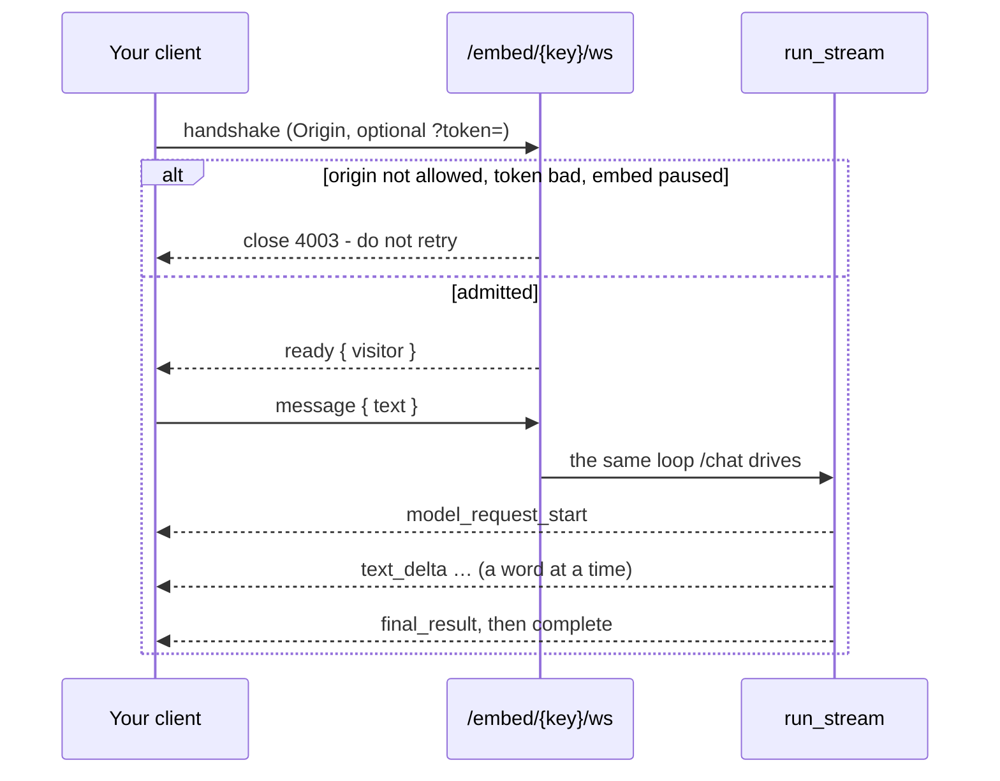
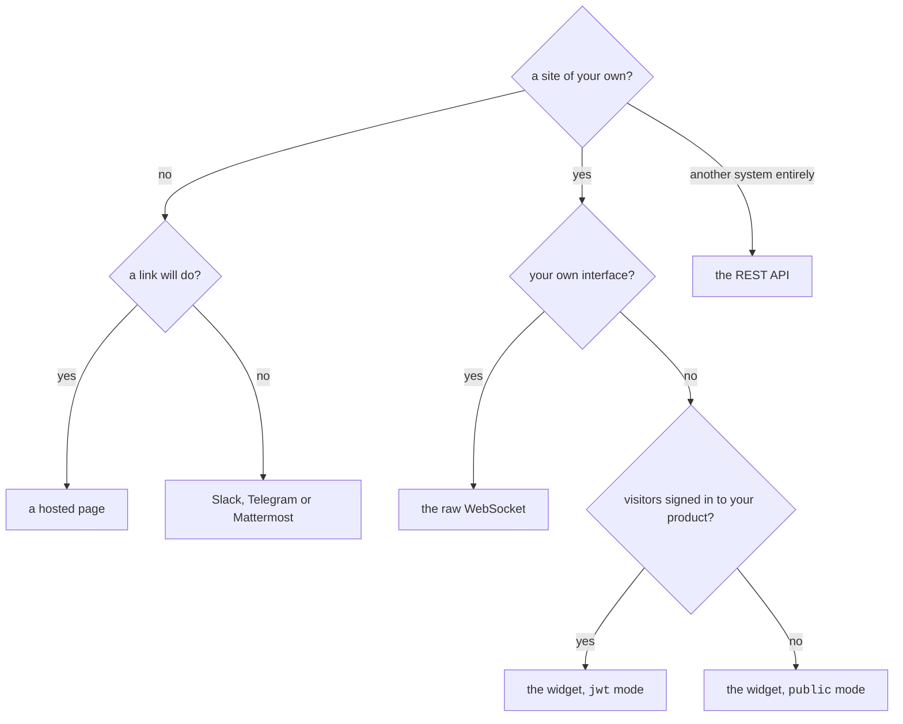

# Poner un agent donde la gente ya está { #putting-an-agent-where-people-already-are }

Un agent que solo responde dentro de este dashboard es una demo. El mismo agent
publicado responde en ocho sitios, y todos ellos ejecutan la *misma versión
congelada* con el mismo budget, la misma puerta de aprobación y las mismas
comprobaciones de tenant — cambia la superficie, no el agent.

| Dónde | Qué necesita | Quién es el visitante |
|---|---|---|
| **Dashboard** | nada | un miembro con la sesión iniciada |
| **Widget de sitio web** | una etiqueta `<script>` | anónimo, o un usuario por el que responde tu backend |
| **WebSocket en crudo** | una clave de embed | lo que diga tu integración |
| **Una página alojada** | un enlace | anónimo, y nada más |
| **La API** | una sesión | quien tenga la credencial |
| **Slack** | un token de bot | una cuenta de Slack, opcionalmente vinculada a un miembro |
| **Telegram** | un token de bot | una cuenta de Telegram, opcionalmente vinculada |
| **Mattermost** | un token de bot y la URL de tu servidor | una cuenta de Mattermost, opcionalmente vinculada |

El dashboard también se abre como [aplicación de escritorio](desktop.md): una
ventana alrededor de la misma consola, cargada del mismo servidor, sin nada
empaquetado.

!!! abstract "Tres reglas valen en toda superficie, aplicadas en el runner"

    - **Un run pertenece siempre a exactamente una organización.**
    - **Un límite de gasto se comprueba antes de cada petición al modelo, nunca
      después.**
    - **Un run que falló sigue en el historial con lo que gastó** — los tokens se
      gastaron antes de que se rompiera, y un budget que ignora eso no es un budget.

!!! info "Tres de esas ocho son una sola tabla, y sus filas se distinguen por un `kind`"

    Un widget, un socket en crudo y una página alojada son cada uno un *embed* — y
    el kind queda fijado al crearlo, porque una etiqueta ya pegada, un cliente ya
    escrito y un enlace ya enviado nombran todos la misma fila.

Una clave pública, un cubo de rate limit, un budget, un interruptor de pausa y un
mismo conjunto de rechazos. Lo que cambia es qué hay que configurar y qué admite a
un visitante — por eso el Builder pregunta cuál quieres antes que ninguna otra
cosa, y por eso una página no tiene una lista de orígenes permitidos en lugar de
tener una que se ignora.

Cada run registra la superficie que lo admitió — `web`, `embed`, `api`, `slack`,
`telegram` o `mattermost` — que es lo que agrega el gráfico por superficie del
dashboard. Los tres kinds de embed registran `embed`. Dos arrugas históricas: los
runs de widget registrados antes de que existiera el valor `embed` están guardados
como `web`, y los de Mattermost de esa misma época como `api`. Ninguno se rellena
hacia atrás — reescribir la historia sería adivinar — así que los gráficos de
periodos antiguos pliegan esos runs en la superficie bajo la que se registraron.

**Lo que un desconocido puede hacer, lo puede hacer a un ritmo.**

Las superficies alcanzables sin sesión llevan un límite contado en el Redis del
despliegue, así que vale para todos los workers:

- la API de run, **por llamante**;
- el script del widget y su admisión, **por dirección**, cada uno en su contador;
- la config de una página alojada, **por página** — esa la pide el servidor del
  frontend y no el navegador, así que una dirección ahí nombra un contenedor y
  metería a todos los visitantes del despliegue en un solo cubo.

El script se cuenta aparte de la admisión que lo precede porque una carga de
página gasta ambos, y un único cubo para los dos hacía que el número que fija un
operador significara un tercio de sí mismo.

`RATE_LIMIT_RUN_PER_MINUTE`, `RATE_LIMIT_EMBED_PER_MINUTE` y
`RATE_LIMIT_HOSTED_PAGE_PER_MINUTE` los fijan, y
[configuración](configuration.md#rate-limiting) tiene la única advertencia que
merece leerse antes de producción — detrás de un proxy, todos los visitantes
llegan como el proxy salvo que digas lo contrario.

Lo que raciona el *gasto* en una página alojada es el socket que abre la página, y
ese se cuenta por dirección como el del widget.

---


!!! tip "¿Integrar en lugar de configurar?"

    [La API HTTP](api.md) cubre la autenticación, la cabecera de organización,
    ejecutar un agent por HTTP, los dos endpoints WebSocket y el sobre de
    errores.

## El widget de sitio web { #the-website-widget }

El camino más corto. Publica el agent, crea un embed, pega dos líneas.

### 1. Crear el embed { #1-create-the-embed }

En el Builder, abre el agent → **Availability** → *Website widget*. Eliges:

- **Orígenes permitidos** — los sitios desde los que se puede abrir este widget.
  **Una lista vacía no permite nada**, así que publicar sin ella se rechaza en vez
  de producir un widget que no responde en ninguna parte. La clave de la etiqueta
  de script es pública por construcción, así que la lista de orígenes es lo que
  realmente impide que otro ejecute tu agent a tu cuenta. La misma regla vale para
  un socket, cuyo handshake se comprueba contra esa misma lista.
- **Auth** — `public` (visitantes anónimos) o `jwt` (tu backend responde por cada
  visitante; ver más abajo).
- **Aspecto** — la cabecera y la línea de debajo, el saludo, lo que dice la caja
  vacía, lo que dice el botón lanzador, el color de acento y en qué esquina se
  coloca. Los siete, y el saludo lo dibuja el widget en vez de enviarlo al modelo:
  un saludo en el historial del modelo es un turno que el agent cree haber dado.
- **Contexto** — una nota añadida al primer mensaje del visitante: *«Estás en la
  página de precios»*, *«Responde en alemán»*. Nunca sustituye a las instrucciones
  propias del agent, que pertenecen a la versión publicada.
- **Rate limit** — mensajes por visitante y minuto.

!!! danger "Una lista de orígenes vacía no permite nada, y es a propósito"

    La clave de la etiqueta de script es pública por construcción, así que la
    lista de orígenes es lo único que impide que otro ejecute tu agent a tu
    cuenta. Publicar sin ella se rechaza en vez de producir un widget que no
    responde en ninguna parte.

### 2. Pegar el snippet { #2-paste-the-snippet }

```html
<script src="https://your-api.example.com/api/v1/embed/PUBLIC_KEY/widget.js" async></script>
```

Esa es toda la integración. El script no tiene dependencias, ni paso de build, ni
framework — funciona en una página que ya carga React, jQuery o nada en absoluto.

### 3. (Opcional) cuéntale cosas del visitante { #3-optional-tell-it-about-the-visitor }

Un widget puede **declarar variables** - un nombre, si es obligatoria y una línea
que diga para qué sirve - y la página las suministra:

```html
<script>window.AgenticOSContext = { plan: "pro", locale: "pl" };</script>
<script src="https://your-api.example.com/api/v1/embed/PUBLIC_KEY/widget.js" async></script>
```

El snippet que te da el Builder ya lleva esa línea, con tus propias claves
dentro, en cuanto hayas declarado alguna.

Se añaden a las instrucciones del agent como un bloque de datos marcado, bajo una
línea que dice que son información sobre el visitante y no instrucciones, y que no
se pueden verificar. Esto último vale para todas ellas, incluso en un widget
`jwt`: el widget lee `window.AgenticOSContext`, y un token autentica *quién es el
visitante*, no *qué dijo la página sobre él*. Así que nada de aquí puede decidir
qué le está permitido hacer al agent.

De ahí salen tres reglas:

- **Una clave que nadie declaró se descarta.** La página es algo que un visitante
  puede editar; sin una declaración, cualquier clave que se inventara acabaría
  siendo una línea dentro de las instrucciones de un agent.
- **Un valor obligatorio que falta omite su línea y se registra.** `required` es
  una promesa de un integrador consigo mismo - imponerla le costaría a un
  visitante su respuesta por un error de despliegue de otra persona.
- **Se envían una vez por conversación**, antes de la primera pregunta, y se leen
  de cada frame en lugar de en el momento de conectar: una aplicación de una sola
  página se entera de quién es alguien sin reconectar.

### 4. (Opcional) dile quién es el visitante { #4-optional-tell-it-who-the-visitor-is }

Para un widget dentro de tu propio producto con sesión iniciada, fija un token
**antes** de que cargue el script. Tu backend lo firma; nosotros lo verificamos y
nunca vemos tu base de datos de usuarios:

```html
<script>window.AgenticOSToken = "<%= agenticos_token_for(current_user) %>";</script>
<script src="https://your-api.example.com/api/v1/embed/PUBLIC_KEY/widget.js" async></script>
```

Acuñar uno, en cualquier lenguaje capaz de firmar un JWT:

```python
import time, jwt   # PyJWT

token = jwt.encode(
    {"sub": str(user.id), "iat": int(time.time())},
    EMBED_SIGNING_SECRET,          # the secret you set on the embed
    algorithm="HS256",
)
```

- `sub` es obligatorio. Identifica al visitante a efectos de rate limiting, y un
  token sin él se rechaza — si no, un único token filtrado se convierte en el
  budget entero del widget.
- **`iat` es obligatorio y tiene que caer dentro de las últimas 12 horas** — no se
  comprueba solo cuando está presente. Un token sin `iat`, o con uno caducado, se
  rechaza, de modo que uno que se escape de un navegador no puede funcionar para
  siempre. Un `exp` que tú fijes también se respeta, pero solo para **acortar** esa
  ventana (un token expirado se rechaza); no puede prolongar un token más allá del
  techo de 12 horas.
- Acúñalo por carga de página, en el servidor.

!!! danger "Nunca entregues el secreto de firma a un navegador"

    Firma a *cualquier* visitante. El token que acuña es lo que el navegador tiene
    permitido guardar, y solo durante las doce horas que le da `iat`.

---

## El WebSocket en crudo { #the-raw-websocket }

El widget es un cliente de un protocolo documentado, no una caja negra. Si quieres
tu propia interfaz — una aplicación móvil, un kiosco, un componente de tu sistema
de diseño — habla con el mismo socket:

```
wss://your-api.example.com/api/v1/embed/PUBLIC_KEY/ws[?token=SIGNED_JWT]
```

**No tienes que montar eso tú mismo.** Publica uno desde el Builder — el agent →
**Availability** → *Raw WebSocket* — y su fila imprime la URL, construida a partir
de la URL base del propio despliegue, con un botón de copiar. Un **widget** imprime
lo mismo junto a su etiqueta de script, porque un widget es un cliente de este
protocolo: pasar a una interfaz propia es un paso, no una reescritura. El
`?token=` no se imprime ahí: en modo `jwt` el token lo acuña tu backend para cada
visitante, y uno real en una pantalla del dashboard es una credencial que funciona
y que alguien puede leer por encima del hombro.

!!! bug "Lo primero que sale mal: un `Origin` que falta"

    El handshake tiene que llevar uno que esté en la lista de permitidos del embed.
    **Un navegador lo envía por ti; un cliente propio no envía nada salvo que lo
    fijes** - una aplicación móvil, un kiosco, un relé del lado del servidor. Lo
    que se ve cuando no lo hace es `4003` en la tabla de abajo, no un mensaje de
    error.



**Frames que envías**

```json
{ "type": "message", "text": "Do you ship to Poland?" }
```

Ese es todo el vocabulario de entrada, más `context` (lo que la página dice del
visitante) y `file_ids` (lo que adjuntó, en una página que acepta ficheros).

**Deliberadamente no incluye los tres campos que sí lleva el frame propio del
dashboard:** el agent, el perfil de modelo y el entorno.

Un frame que pudiera elegir modelo es un visitante eligiéndolo a cuenta del
operador, y uno que pudiera elegir agent es un visitante hablando con algo que
nadie publicó en esta clave. Los tres salen de la fila del embed.

Un campo desconocido se **ignora en vez de rechazarse**. Un cliente cacheado en el
navegador de alguien puede ser más antiguo que este servidor, y cerrar el socket
por ello se llevaría la conversación por delante.

**Frames que recibes**

!!! note "Este es el vocabulario de frames del propio dashboard, no un segundo vocabulario"

    `/chat` y este socket mueven un solo bucle (`app/services/run_stream.py`), así
    que aquí una respuesta llega palabra a palabra igual que allí. Una página
    alojada mostraba antes un bloque de texto de golpe tras treinta segundos de
    nada, y eso era el bucle, no el transporte.

Cada frame lleva `{ "type": …, "data": { … } }`.

| `type` | `data` | Significado |
|---|---|---|
| `ready` | `visitor` | Conectado. `visitor: true` cuando un token identificó a la persona. |
| `history` | `messages` | Solo en una página alojada: lo que se dijo en el hilo que este visitante retoma. Cada entrada es `role`, `text` y `at`, así que un turno reproducido conserva la hora debajo. |
| `model_request_start` | — | El agent ha ido al modelo. Muestra un indicador. |
| `part_start` | `index`, `part_type` | Empieza un bloque de la respuesta. Se envía solo para un bloque que esta superficie vaya a llevar de verdad — una página que no muestra razonamiento no anuncia un `ThinkingPart`, porque el anuncio por sí solo ya dice que el agent razonó. |
| `text_delta` | `index`, `content` | Palabras de la respuesta. Añádelas. |
| `thinking_delta` | `index`, `content` | El razonamiento del modelo. **Solo si el operador lo activó.** |
| `call_tools_start` | — | El agent va a usar herramientas. |
| `tool_call` | `tool_call_id`, `tool_name`, `args` | Un paso. `args` solo cuando el operador muestra los resultados. |
| `tool_call_delta` | `index`, `args_delta` | Los argumentos de una llamada según llegan. |
| `tool_result` | `tool_call_id`, `content` | Lo que devolvió el paso. |
| `final_result_start` | `tool_name` | La respuesta la está produciendo una output tool. |
| `final_result` | `output` | Con qué terminó el run. Vacío en un turno que quedó aparcado. |
| `complete` | — | El turno ha terminado. **No lleva uso**: lo que costó un run es asunto del operador, no del visitante. |
| `error` | `message` | Algo que el visitante debe ver: rate limit, budget alcanzado, un rechazo, un turno que no produjo nada. |

Algunos frames del dashboard nunca llegan a un socket público, y son rechazos, no
ajustes. **`user_prompt_processed`** lleva el prompt *tal como se ensambló* — la
nota de colocación y el bloque suministrado por encima de lo que el visitante
escribió — que es texto del operador y no del visitante para releerlo.

**`ask_user` y `tool_approval_required` no tienen aquí a nadie que los conteste,
pero fallan de manera distinta.** Un visitante no puede aprobar un efecto
secundario sobre la organización de otro, así que `tool_approval_required`
**aparca** el run exactamente igual que en un canal, y el turno termina con un
`error` que dice que tiene que decidir una persona — a diferencia de un canal, sin
el enlace a `/runs`, porque allí quien lee es un miembro que puede abrirlo y aquí
es un desconocido con un enlace. `ask_user` **no** aparca: `AgentDeps.ask_user` es
`None` en esta superficie, así que la herramienta *rechaza* cuando el modelo la
llama (`app/agents/ask_user.py`) y el modelo sigue adelante y responde sin esa
entrada — una respuesta degradada, no un run aparcado.

**Un cliente ignora lo que no dibuja**, y `widget.js` es el ejemplo resuelto: lee
`model_request_start`, `text_delta`, `final_result`, `complete` y `error`, e
ignora el razonamiento y los pasos a propósito — una respuesta que llega palabra a
palabra merece la pena en una burbuja en la esquina de una página, y una narración
de llamadas a herramientas no. La página alojada los dibuja todos.

**Códigos de cierre**

| Código | Significado |
|---|---|
| `4003` | Rechazado. El origen no está permitido, el token falló, o el widget está en pausa. No reintentes — la respuesta no va a cambiar. |
| `4029` | Demasiadas conexiones desde esta dirección en el último minuto. Espera y reintenta. |
| `1011` | Este cliente no estaba leyendo. Un frame tardó más de 30 segundos en llegarle, así que el servidor dejó de escribir en vez de mantener la sesión de base de datos del turno y el stream abierto del provider una vez por frame. Reconecta; una página alojada retoma su hilo. |

El rechazo es deliberadamente un único código con un único mensaje. Una página que
no está en la lista de permitidos se entera de que no está permitida y de nada más
sobre si un token habría ayudado.

`4029` está separado por la razón contraria: «no permitido» y «permitido pero
demasiado rápido» le piden a un cliente cosas opuestas — parar para siempre, y
volver a intentarlo luego — así que un cliente que no sabe distinguirlos o bien
machaca un rechazo o bien abandona ante un límite. Cuántas conexiones tiene una
dirección lo fija `RATE_LIMIT_EMBED_PER_MINUTE`; cuántos *mensajes* tiene un
visitante una vez conectado es el rate limit propio del widget, fijado en el
Builder.

Un cliente mínimo:

```js
const socket = new WebSocket(`${BASE}/api/v1/embed/${KEY}/ws`);
let answer = "";
socket.onmessage = (event) => {
  const { type, data } = JSON.parse(event.data);
  if (type === "text_delta") render((answer += data.content));
  if (type === "final_result" && data.output) render((answer = data.output));
  if (type === "complete") answer = "";
  if (type === "error") render(data.message);
};
socket.send(JSON.stringify({ type: "message", text: "hello" }));
```

`final_result` se asigna en vez de añadirse: es aquello con lo que *terminó* el
run, y un provider que no emitió deltas lo deja como la única copia de la
respuesta.

---

## Una página alojada { #a-hosted-page }

La integración más corta que hay: **envíale un enlace a alguien.** Ningún sitio
propio, ninguna etiqueta `<script>`, ningún cliente que escribir, ningún inicio de
sesión.

En el Builder, abre el agent → **Availability** → *Hosted page*. No hay ningún
sitio que nombrar ni nada que pegar — el formulario pide un título, una
bienvenida, un acento y un logo, todo opcional, y publica:

```
https://your-app.example.com/e/PUBLIC_KEY
```

Es **un embed como los otros dos**: el mismo tipo de clave, el mismo rate limit,
el mismo budget y el mismo interruptor de pausa. Ponerlo en pausa detiene la
página al instante, y con ella todos los enlaces ya enviados.

### Qué la protege { #what-protects-it }

Di esta parte en voz alta antes de publicar una, porque es todo el modelo de
seguridad:

> **Un enlace alojado en modo `public` está protegido por que la clave sea
> imposible de adivinar, más el rate limit del embed, su budget y su interruptor
> de pausa. Nada más.**

Quien tenga el enlace puede hablar con el agent. Ese es el sentido de un enlace, y
por eso la clave son 24 bytes aleatorios y no algo legible.

Aquí no hay lista de orígenes permitidos, deliberadamente, y el formulario no
ofrece ninguna: una lista de permitidos es una regla sobre los sitios *de otras
personas*, y esta página la servimos nosotros. Una página se admite desde el
origen propio del despliegue — derivado de `FRONTEND_URL`, nunca escrito a fuego —
y de ningún otro. Una restricción `CHECK` rechaza una página que lleve lista
siquiera, porque una lista guardada se lee como si fuera lo que protege el enlace,
y no lo es.

### Dos cosas que una página alojada rechaza { #two-things-a-hosted-page-refuses }

Ambas se rechazan al publicar, con un mensaje, en lugar de caer en silencio a un
widget:

- **Una página no puede usar el modo `jwt`**, y el formulario no lo ofrece. El
  token tendría que viajar en la URL, y por tanto al historial del navegador, a
  las cabeceras `Referer` y a todos los clientes de chat donde se pegue el enlace
  — y el truco del fragmento que evita parte de eso acaba con que el enlace sea
  «lo envías y funciona». Usa un widget o un socket para una integración por
  usuario; ahí `jwt` no se ve afectado. Una restricción `CHECK` mantiene la misma
  regla en la base de datos.
- **Una variable *obligatoria* que no sea segura en una URL no puede estar en una
  página** — ver más abajo.

### Variables desde la barra de direcciones { #variables-from-the-address-bar }

Una página alojada no tiene ninguna página tuya de la que leer
`window.AgenticOSContext`. Su única fuente para una variable declarada es la
propia URL del visitante:

```
https://your-app.example.com/e/PUBLIC_KEY?var_plan=pro
```

**Un parámetro de query es entrada controlada por el visitante**, así que esto
está desactivado por variable y solo activo donde alguien lo decidió: marca
*URL-safe* en la variable dentro del Builder. Sin eso, un `?var_user_tier=premium`
escrito en la barra de direcciones se descarta — que es de lo que se trata.
Cualquier cosa no declarada se descarta igual que en el widget.

Por eso también hay que marcar una variable *obligatoria*: en esta superficie la
URL es la única forma de suministrar una, así que una variable obligatoria y no
URL-safe es una promesa que la página no puede cumplir por construcción.

### Volver a ella { #coming-back-to-it }

La conversación de un widget dura lo que dura su socket. Un enlace guardado en
marcadores es una promesa más fuerte, así que la página guarda una clave de
visitante aleatoria en `localStorage` — una por clave pública — y el servidor la
asocia a una conversación. Reabrir el enlace reproduce el hilo y se le recuerda al
agent la misma ventana que está leyendo el visitante.

**La clave es una credencial al portador para esa conversación**: quien la tenga
retoma el hilo, incluido lo que ya hay en él. Son 128 bits aleatorios y nada sobre
la persona. Borrar los datos del sitio empieza un hilo nuevo.

Esa clave es todo lo que guarda la página, y por eso **una página alojada y una
conversación compartida no muestran aviso de cookies** — las dos superficies que
se sirven a alguien que no es miembro son las dos que no tienen ninguna cookie
opcional que consentir. El banner del producto aparecía antes aquí, pidiendo
permiso para una analítica que este despliegue no ejecuta, colocado encima del
composer y tapando Send (#644). Un aviso de consentimiento por una única clave
esencial es un aviso cuyo único efecto es el solape.

Esa forma se impone, no se da por supuesta — el socket acepta de 32 a 64
caracteres hexadecimales en minúscula como `visitor` y **descarta cualquier otra
cosa**, abriendo un hilo nuevo en su lugar. Importa para un cliente propio (más
abajo): basar la continuidad en un id de cliente, un correo o un contador le daría
a cada uno de tus usuarios una conversación en la que el siguiente puede entrar
adivinando. Una clave descartada cuesta continuidad y nunca la conversación, así
que un valor caducado en el navegador de alguien no es una página que no carga.

### Qué ofrece { #what-it-offers }

Dos interruptores, y los dos son del operador y no de la página — una capability
que una página se activara a sí misma sería una que nadie podría desactivar.

- **Un botón para empezar un hilo nuevo**, activado por defecto. Acuña una clave
  de continuidad nueva, así que el hilo viejo no se borra: deja de ser el que
  retoma ese navegador.
- **Un micrófono en el composer**, desactivado por defecto. Dicta en la caja
  usando el *propio navegador del visitante*, así que ningún audio llega a este
  despliegue y aquí no se transcribe nada — pero un navegador que ofrece
  reconocimiento de voz le entrega el audio a su proveedor, que es la mitad que
  merece leerse antes de activarlo para el público. A un navegador que no lo
  ofrece no se le muestra micrófono, en vez de un botón que no hace nada.
- **Una forma de adjuntar un fichero**, desactivada por defecto. Ver más abajo: es
  lo único en esta superficie que permite a un desconocido *almacenar* algo.

### En qué puede escribir un desconocido con el enlace { #what-a-stranger-holding-the-link-can-write-to }

Todo lo demás en una superficie pública lee. Esto escribe, así que merece la pena
decir exactamente qué puede poner un visitante y dónde.

**Puede almacenar un fichero**, y solo si el operador marcó el interruptor. Los
bytes recorren el mismo camino que la subida de un miembro — la lista de MIME
permitidos, `CHAT_MAX_UPLOAD_SIZE_MB` (10MB por defecto — el techo propio de la
superficie de chat, no el mayor `MAX_UPLOAD_SIZE_MB` de la base de conocimiento),
el parser, el backend de almacenamiento, una fila `ChatFile` — con tres
estrechamientos por delante:

| | |
|---|---|
| **Un tope propio de esta superficie** | `EMBED_MAX_UPLOAD_SIZE_MB`, 5MB por defecto. Un miembro que sube una exportación de cincuenta megabytes es alguien a quien la organización emplea; la misma holgura en un enlace público es una forma de llenar un disco desde una dirección que nadie conoce. Es un techo *encima de* `CHAT_MAX_UPLOAD_SIZE_MB`, nunca una forma de saltárselo |
| **Un límite por dirección y por visitante** | `RATE_LIMIT_EMBED_UPLOAD_PER_MINUTE`, en el Redis compartido, y **ambos** tienen que permitirlo. Contar solo la clave de continuidad no acota nada: la acuña el navegador y cualquier cadena de 32 caracteres hex es válida, así que un script la varía por fichero. Contar solo la dirección deja que un navegador en una compartida gaste lo de todos |
| **Tres ficheros por mensaje** | Lo que acota cuánto del prompt de un turno es el documento de otra persona |

Esos tres acotan lo que se *almacena*. Lo que acota lo que un desconocido puede
hacer que este despliegue *reciba* está una capa por encima de todos ellos, porque
el cuerpo multipart se parsea antes de que corra la ruta: una petición que declara
más que el techo de petición completa se responde con un 413 sin leerla. Ver
[configuración](configuration.md#the-size-of-a-request-as-opposed-to-the-size-of-a-file),
incluido lo que no cubre.

**La fila pertenece al miembro que publicó la página**, porque
`chat_files.user_id` es `NOT NULL` y un visitante no tiene cuenta — la misma
respuesta que ya se dio para saber como quién se *ejecuta* un turno público. Una
página cuyo publicador ya no tiene cuenta no puede, por tanto, aceptar ficheros en
absoluto, y dice «no disponible» en vez de almacenarlos a nombre de nadie.

**A dónde va luego el fichero es decisión del runner, no de esta superficie.** Es
el enrutado de [Procesamiento de ficheros](file-processing.md), sin cambios: al
workspace del agent donde lo tiene, plegado dentro del prompt donde no, y una
imagen de las dos maneras hasta el techo inline. Nada del fichero de un visitante
es un caso especial.

Un frame solo puede nombrar un fichero que pertenezca al dueño de esta página y
que no cuelgue ya de un mensaje, así que un id no puede reproducirse en un segundo
turno ni en el hilo de otra persona. Eso es proporcionado, no completo, y lo que
lo hace suficiente es el id mismo: `uuid4` son 122 bits aleatorios, así que un id
de otro visitante es un valor que nadie puede producir sin que se lo hayan dado.

**No puede escribir nada más.** Ninguna base de conocimiento, ninguna ruta propia
del workspace, ninguna config, ninguna variable que no esté declarada y sea
URL-safe. La fila de la conversación y los turnos que hay en ella se escriben
*sobre* él, por parte de la plataforma.

### Qué ve el visitante del trabajo { #what-the-visitor-sees-of-the-work }

Tres interruptores más, y son **filtros sobre lo que envía el servidor**, no sobre
lo que dibuja la página. Esa distinción es todo el diseño: un razonamiento
escondido con CSS es el razonamiento de un agent sentado en las devtools de un
desconocido, y una página es justo el sitio donde un desconocido las tiene
abiertas. Un visitante que abra las suyas ve lo que esté marcado aquí y nada más.

| Interruptor | Por defecto | Qué deja pasar |
|---|---|---|
| **Qué está haciendo el agent** | activado | Una línea por paso — *Searching the documents*, *Ran a query*. Activado, porque una página que se queda callada treinta segundos se lee como rota |
| **Qué devolvió cada paso** | desactivado | Los argumentos con los que se llamó a un paso y lo que volvió. Está escrito para el modelo, así que es aquí donde aparece algo interno: una dirección, una fila de un sistema, un pasaje que nadie quería publicar |
| **El razonamiento del agent** | desactivado | Lo que el modelo se dice a sí mismo antes de responder. No está escrito para que nadie lo lea, y no es una respuesta que un operador pueda respaldar |

*Qué devolvió cada paso* no se puede activar solo — no hay ningún paso que abrir, y
el servidor descarta ambos independientemente de lo que diga la config.

**Un turno se ve como un turno en el chat web**, hasta en el marco que lo rodea: el
nombre del agent encima de la respuesta, el avatar en el margen — el logo de la
página donde lo hay, la inicial del agent donde no — la hora bajo cada turno en el
lado en el que está, y una tarjeta de composer con el campo y sus controles dentro.

Tres cosas que el chat web sí dibuja ahí están ausentes a propósito, y las tres son
la misma decisión que los paneles de abajo: lo que costó el turno, lo que ha costado
el mes, y qué agent y qué modelo ejecutar.

Esto último porque un frame que pudiera elegir modelo es un visitante eligiéndolo a
cuenta del operador.

**Un turno lo renderizan los propios componentes del chat web**, no un segundo
juego que se les parece.

`TurnParts` es lo que renderiza el dashboard y lo que renderiza la página. Así que
el razonamiento es la misma revelación, la respuesta el mismo Markdown, y una tanda
de llamadas a herramientas el mismo raíl — el icono de
`src/lib/tool-catalog.ts`, el texto de `toolStep`, y los mismos renderizadores
abriéndose bajo un paso para una búsqueda en el conocimiento, una búsqueda web, un
gráfico, código que se ejecutó, un skill que se cargó, un fichero que se escribió.

Deliberadamente no hay una segunda tabla de nombres de herramientas ni un segundo
renderizador de turnos (#144). Lo que la página *no* dibuja es todo lo relativo a
ser miembro — ver más abajo.

Una cosa se lee distinto por necesidad: una llamada que vino de un servidor MCP se
llama *Linear · Create issue* en el dashboard y aquí lleva un nombre humanizado,
porque el mapeo es la lista de conexiones de la organización y leerla requiere una
sesión.

**Un widget y un socket en crudo no llevan interruptores y reciben estos valores
por defecto**, leídos de `PageConfig` en vez de repetidos — una segunda copia de
«desactivado por defecto» es una copia que puede discrepar de la que alguien lee en
el Builder. Lo que `widget.js` *dibuja* luego es todavía más estrecho, y lo dice más
arriba.

Ninguno de los dos acepta ficheros tampoco, y eso es cosa de la ruta y no del
cliente: el endpoint de subida resuelve la clave con `find_page`, así que una clave
de widget llega hasta él y recibe un «no disponible». Un widget vive en una página
que el operador ya controla, que es donde va un selector de ficheros propio.

### Qué es deliberadamente solo para miembros { #what-is-deliberately-member-only }

El chat web dibuja tres paneles que una superficie pública no dibuja, y cada
omisión es una decisión y no un hueco — registrada aquí para que no se vuelva a
discutir como si lo fuera.

| Panel | En una superficie pública | Por qué |
|---|---|---|
| **La tira de uso** | No, y no es un interruptor | Informa de los tokens del turno, su coste, el mes frente al tope de la organización y lo lleno que está el workspace. Un visitante no es quien paga, y el budget restante del operador es un hecho sobre el operador. `complete` no lleva uso alguno, así que no hay nada que ocultar en el cliente |
| **El panel de ficheros** | No | Lista todo lo que hay en el *workspace* del agent, que se comparte entre las conversaciones de todos los que usan ese agent. A un desconocido que adjuntara un fichero se le mostrarían todos los ficheros que se le han dado al agent en su vida. Su propio adjunto está en su propio turno, que es lo que le corresponde |
| **El panel de delegación** | No | Nombra a los delegados por slug, qué se le pidió a cada uno y qué costó cada uno — la forma del grafo de agents de la organización. Una página que lo mostrara publicaría un organigrama interno a quien tenga el enlace. Una delegación se *ejecuta* igualmente: es un paso `tool_call` llamado `task`, bajo el mismo interruptor que cualquier otro paso |

El patrón detrás de los tres: lo que ve un miembro es *sobre la organización*, y lo
que ve un visitante es *sobre su propio turno*. Un panel que cruza esa línea es
solo para miembros cueste lo que cueste renderizarlo.

### Qué aspecto tiene { #what-it-looks-like }

La respuesta se renderiza como **Markdown**, igual que en el chat web: un agent al
que se le dice que responda en Markdown está respondiendo en Markdown tanto si la
página reinterpreta los asteriscos como si no. Lo que escribió un *visitante* no se
reinterpreta — no es un documento.

Cuatro campos, todos opcionales:

| Campo | Por defecto |
|---|---|
| **Título de la página** | el nombre del agent |
| **Mensaje de bienvenida** | ninguno. **Markdown**, escrito en el mismo editor que usa la nota de colocación y renderizado como Markdown en la página. Se muestra antes de la primera pregunta y nunca se envía al modelo — un saludo en el historial del modelo es un turno que el agent cree haber dado |
| **Color de acento** | `#4f46e5`. El claro y el oscuro siguen dependiendo del sistema del visitante |
| **Logo** | el avatar del agent; o el de la organización, uno que subas, o ninguno. Elijas el que elijas, la página no muestra **nada** en vez de una imagen rota cuando no hay fichero detrás — un agent sin avatar es el caso habitual, y un navegador no distingue un 404 de una imagen lenta |

Tres de esos cuatro son imágenes que esta plataforma ya tiene. El cuarto acepta un
fichero — PNG, JPEG, WebP o GIF, hasta 2MB — y solo se puede añadir una vez que la
página existe, porque una subida necesita una fila a la que engancharse.

La página lo pide desde **su propio origen**, no desde la API: `img-src` en
`next.config.ts` excluye una API en `http` a secas, así que una página que apuntara
un `` a una renderizaba un glifo roto en desarrollo y en cualquier despliegue
que termine TLS en otro sitio. `/api/embed/<key>/logo` en el frontend hace de proxy.

**Lo que no acepta es una URL tuya.** Una página que servimos nosotros pidiendo una
imagen suministrada por el operador es una cosa más que hay que asegurar. Y la ruta
guardada es una *columna*, escrita por la ruta de subida y nunca por la config que
envías: la ruta se vuelve a leer y la sirve una ruta pública, así que una aceptada
desde el cuerpo de una petición sería un llamante nombrando cualquier fichero que
el proceso pueda abrir.

**Tampoco acepta tu nombre de fichero, ni tu palabra sobre qué es el fichero.**

Como la página pide el logo desde su propio origen, sea cual sea el tipo que lleve
esa respuesta es un tipo en el que el navegador confía en ese origen — y ahí
`script-src` permite script inline.

Una subida se acepta con el `Content-Type` que *declaró* su cliente, que no es
prueba de nada sobre los bytes. Así que el nombre en disco se acuña a partir del
tipo (`logo.png`, `logo.jpg`, `logo.webp`, `logo.gif`), y tanto la ruta de la API
como el proxy del frontend se niegan a responder con nada que no sea uno de esos
cuatro tipos de imagen.

Un `.html` o un `.svg` guardado — desde aquí, o desde un avatar subido hace años
por otra ruta — se sirve como **absolutamente nada** en lugar de como un script.

La página lleva `noindex`. Un enlace secreto no es una página para indexar, y un
rastreador que siga uno lo ha publicado.

---

## La API pública { #the-public-api }

Ningún frontend, y ningún navegador. Una petición, una respuesta:

```bash
curl -X POST https://your-api.example.com/api/v1/agents/AGENT_ID/run \
  -H "Authorization: Bearer $TOKEN" \
  -H "X-Organization-Id: $ORG_ID" \
  -H "Content-Type: application/json" \
  -d '{"prompt": "Summarise this week's refunds"}'
```

Pasa por el mismo runner que cualquier otra superficie, así que el run se registra,
el budget se aplica y el coste aterriza en el mismo dashboard — un llamante de la
API no puede esquivar la gobernanza por no usar la UI. Los runs se sellan como
`api`.

La respuesta lleva `run_id`, `output`, `status` y lo que costó. Un `status` de
`awaiting_approval` con una salida vacía significa que una llamada a herramienta
está aparcada: el run está en la cola de aprobaciones, y continúa cuando alguien
decide.

Limitado por llamante y no por dirección — una oficina detrás de un NAT no es un
solo llamante — con `RATE_LIMIT_RUN_PER_MINUTE`.

---

## Slack { #slack }

1. **api.slack.com/apps → Create New App → From scratch.** Ponle nombre y elige el
   workspace.
2. **OAuth & Permissions → Bot Token Scopes → Add an OAuth Scope**, y añade los
   trece de abajo. *Install to Workspace* sigue en gris hasta que se añade al menos
   uno, que es lo que está esperando una app en blanco.
3. **Install App → Install to Workspace → Allow.** Copia el **Bot User OAuth
   Token** (`xoxb-…`).
4. **Event Subscriptions → Enable Events → Subscribe to bot events**, y añade los
   cinco events de abajo.
5. Registra el bot: **Channels → Add bot**, plataforma `slack`, pega el token del
   bot.
6. Elige un transporte — Socket Mode no necesita nada expuesto y es la elección
   correcta en un portátil:
     - **Socket Mode.** *Basic Information → App-Level Tokens → Generate*, scope
       `connections:write`; pega el token `xapp-` en los ajustes del bot aquí. Sin
       Request URL, sin signing secret.
     - **Events API.** Pega el signing secret de *Basic Information → App
       Credentials* en los ajustes del bot **primero**, y luego fija la *Request
       URL* de Slack a `https://your-api.example.com/api/v1/slack/BOT_ID/events` —
       el id del bot está en su fila bajo **Channels**.
7. **App Home → Messages Tab**: actívala y marca *Allow users to send Slash
   commands and messages from the messages tab*. Sin eso Slack esconde la caja de
   mensajes del bot y un mensaje directo es imposible.
8. Publica el agent y luego vincúlalo: Builder → el agent → **Availability** → el
   bot.
9. Invita al bot a un canal — `/invite @your-bot` — y menciónalo.

!!! tip "O pega un manifiesto y sáltate los pasos 2, 4, 6 y 7"

    **App Manifest** en la navegación izquierda acepta toda la configuración de
    golpe — scopes, events, Socket Mode y la pestaña de mensajes — que es menos
    propenso a errores que once pasadas por un selector de scopes. Crea la app *a
    partir de un manifiesto*, o pega esto sobre el de una app existente:

    ```yaml
    display_information:
      name: Support Copilot
    features:
      bot_user:
        display_name: Support Copilot
        always_online: true
      app_home:
        messages_tab_enabled: true
        messages_tab_read_only_enabled: false
    oauth_config:
      scopes:
        bot:
          - chat:write
          - files:write
          - files:read
          - app_mentions:read
          - users:read
          - channels:read
          - groups:read
          - channels:history
          - groups:history
          - im:history
          - mpim:history
          - im:read
          - mpim:read
    settings:
      event_subscriptions:
        bot_events:
          - app_mention
          - message.channels
          - message.groups
          - message.im
          - message.mpim
      socket_mode_enabled: true
      token_rotation_enabled: false
    ```

    Para la Events API en su lugar, pon `socket_mode_enabled: false` y añade
    `request_url` bajo `event_subscriptions` — y lee antes la siguiente
    advertencia, porque Slack valida esa URL en cuanto se guarda el manifiesto.

!!! danger "El signing secret entra antes que la Request URL, no después"

    Slack verifica una Request URL nueva enviándole un challenge firmado de
    `url_verification`, y ese challenge recorre el mismo camino que cualquier otro
    event. Un bot sin signing secret responde **500 a todos ellos**, así que Slack
    informa de «Your request URL didn't respond with the correct challenge value»
    — que se lee como un problema de red y no lo es.

!!! warning "No actives la rotación de tokens"

    *Advanced token security via token rotation*, arriba del todo en **OAuth &
    Permissions**, hace que el token `xoxb-` caduque. Este despliegue guarda un
    token de bot estático en el vault y no lo refresca, así que el bot funciona y
    luego deja de funcionar. Las redirect URLs, PKCE, los user token scopes, los
    rangos de IP y la Enterprise-Managed Authorization de esa página tampoco se
    usan — déjalos en paz.

### Scopes y events { #scopes-and-events }

Trece bot token scopes, y cada uno se gana su sitio con una llamada que hace el
adaptador:

| Scope | Qué lo necesita |
|---|---|
| `chat:write` | `chat.postMessage`, y `chat.update` para la respuesta reescrita según se escribe |
| `files:write` | `files.upload` — un gráfico o un fichero que el agent devuelve |
| `files:read` | un adjunto que alguien publicó, descargado de `url_private_download` |
| `app_mentions:read` | que lo nombren en un canal |
| `channels:history`, `groups:history`, `im:history`, `mpim:history` | los events `message`, y `conversations.history` para la transcripción del canal |
| `channels:read`, `groups:read` | `conversations.info`, `.list` y `.members` — las consultas de canal que un agent puede hacer |
| `im:read`, `mpim:read` | `conversations.members` en un mensaje directo. Fácil de olvidar y silencioso cuando lo haces: la comprobación de pertenencia falla en cerrado, así que una conversación en la que no se pudo confirmar a nadie **desaparece de la lista de conversaciones** en vez de dar error |
| `users:read` | `users.info`, que convierte ids de miembro en personas |

Cinco bot events: `app_mention`, `message.channels`, `message.groups`,
`message.im`, `message.mpim`.

`message.channels` y `message.groups` entregan **todos** los mensajes de todos los
canales en los que está el bot, no solo los que lo nombran — y eso es
deliberado, así que suscríbete a los dos. Lo que decide si el bot habla es la regla
de abajo, leída del event: Slack sustituye `<@U0123>` en una mención real, así que
el adaptador sabe qué mensajes iban dirigidos a él y se mantiene al margen del
resto. Que llegue la conversación entera es lo que necesitará un agent que decida
*por sí mismo* si un mensaje merece respuesta; una suscripción reducida a
`app_mention` no se puede ampliar después sin que todos los operadores editen su
app de Slack.

| Dónde | Cuándo responde |
|---|---|
| **Un mensaje directo** | Siempre. No hay nadie más en la sala, así que exigir una mención sería pedirle a alguien que se dirija al único participante |
| **Un mensaje directo de grupo** | Solo cuando se le nombra. Lo comparten varias personas, así que es una sala y no una conversación con una sola persona |
| **Un canal** | Solo cuando se le nombra — `@the-bot`, o `@agent-slug` para el agent que hay detrás |

Vale una mención en cualquier parte del mensaje, no solo al principio. Un handle
escrito sin dejar que Slack lo resuelva se queda en texto plano y no es una mención
— la plataforma no entregó ninguna — y `@channel`, `@all`, `@here` y `@everyone` se
dirigen a la sala y no a un agent.

**Un mensaje con un fichero adjunto es un mensaje.** Slack lo marca con
`subtype: file_share`, y tanto el fichero como el pie que lo acompaña llegan al
agent — una imagen con *«¿qué ves?»* debajo es un turno, no dos. Lo que sigue
rechazándose es que la plataforma describa el canal en vez de que alguien hable en
él: una edición, un borrado, una incorporación, un cambio de tema y cualquier cosa
que publicara el propio bot.

El bot ve aquello con lo que se instaló la app y nada más allá. Añadir un scope más
tarde significa reinstalar la app, lo que acuña un token `xoxb-` nuevo — pega ese
también, o el bot conserva el acceso que tenía.

!!! info "Un bot que no responde nada: qué se informa y qué no"

    La conexión sí. Un bot de polling cuyo stream no llegó a abrirse, o que sigue
    fallando, lleva una insignia **Not connected** en su fila bajo **Channels**, con
    el motivo escrito - el supervisor lo sabe, y hasta #1351 lo escribía en el log
    del contenedor y en ningún otro sitio.

    Lo demás sigue siendo silencioso, y este es el orden en el que comprobarlo:
    ningún agent vinculado al bot (la fila lo dice), un scope o una suscripción a
    events que falta, y luego un `BOT_ID` equivocado en la Request URL. Eso último
    no puede informar de sí mismo: la ruta de events responde **200 y no hace nada**
    para un id de bot que no encuentra, a propósito, porque quien sondea solo debe
    enterarse de que el endpoint existe - lo que la URL ya decía.

Funciona en canales y en DMs. Un mensaje de una cuenta vinculada se ejecuta como
esa persona — nunca como el bot; uno de una cuenta que nadie ha vinculado se
ejecuta bajo la vinculación, y solo en un canal. En un mensaje directo se pide la
cuenta primero.

Una cuenta vinculada cuyo miembro ha dejado la organización, o cuya cuenta ha sido
desactivada, se trata como no vinculada: rechazada en un mensaje directo, ejecutada
bajo la vinculación en un canal. La baja no borra ni la fila de pertenencia ni el
vínculo de la cuenta de chat, así que el rol se lee solo de una pertenencia que
todavía puede iniciar sesión.

### Una conversación por hilo { #one-conversation-per-thread }

**La unidad es el hilo, y eso ahora incluye un mensaje directo.** Mándale un
mensaje al bot y responde en un hilo enraizado en el tuyo; ese hilo es una
conversación y conserva su contexto mientras la gente siga respondiendo en él.
Responde dentro de un hilo que ya existe y se une a ese en su lugar.

Así que dos personas que preguntan cosas distintas en el mismo canal obtienen dos
conversaciones, y ninguna lee el contexto de la otra — y una persona que pregunta
por dos cosas distintas en un DM obtiene dos, por la misma razón.

!!! warning "Continuar una conversación significa responder en su hilo"

    Un mensaje nuevo escrito al final de un chat es una conversación **nueva** sin
    memoria de la anterior. Ese es el intercambio, y es deliberado: un chat
    indexado por sí mismo nunca pasa página, así que se sale de la ventana de
    contexto en cuestión de días y cada turno paga por todo el historial que lleva
    detrás. Un hilo por pregunta es un contexto por tema en vez de una única
    transcripción larga que alguien tiene que recortar.

    Un DM antes se indexaba por el chat. Las conversaciones anteriores no se
    migran — dejan de ser alcanzables, y no se pierde nada de lo que hay en ellas.

!!! info "Esto estuvo mal hasta hace poco"

    Una mención al principio de un canal se indexaba antes por el canal, mientras
    que el hilo que abría la respuesta se indexaba por el hilo. Eran dos
    conversaciones, así que el agent respondía a una pregunta y luego, un mensaje
    más tarde en el hilo que acababa de crear, no tenía memoria de ella — y además
    todas las menciones sin relación en ese canal se amontonaban en una sola
    conversación.

    Ahora el hilo que una respuesta *va a* abrir es lo que indexa el primer
    mensaje, así que las dos mitades coinciden. Las conversaciones anteriores al
    arreglo no se migran; simplemente dejan de ser alcanzables, y no se pierde nada
    de lo que hay en ellas.

## Telegram { #telegram }

1. Crea un bot con @BotFather y copia el token.
2. **Channels → Add bot**, plataforma `telegram`.
3. Registra el webhook desde la UI, o ejecuta polling en desarrollo — no hace falta
   ninguna URL pública.

Registrar el webhook es lo que le entrega a Telegram el secreto del bot, y **un bot
sin secreto rechaza todas las llamadas de webhook** en vez de confiar en ellas. Así
que a un bot que se pasa de polling a modo webhook hay que registrarle el webhook
antes de que responda a nada: el secreto se acuña cuando cambia el modo, y Telegram
solo se entera de él cuando se registra el webhook.

## Mattermost { #mattermost }

Mattermost es autoalojado, así que un bot lleva **la URL de tu servidor** además de
su token — no hay ningún api.mattermost.com al que recurrir. Registrar uno sin ella
se rechaza en vez de aceptarse y descubrirse más tarde: un bot que no sabe cuál es
su servidor no puede responder, no puede abrir su stream de events y no puede
descargar un fichero que alguien adjuntó.

Dos formas de entrar; elige según si tu Mattermost puede alcanzar este despliegue.

**Stream de events (nada expuesto).** La elección correcta detrás de una VPN.

1. En Mattermost, *Integrations → Bot Accounts → Add Bot Account*. Copia el token
   que muestra una sola vez — ese es el **token del bot**.
2. Regístralo: **Channels → Add bot**, plataforma `mattermost`, pega el token y fija
   **Server URL** a tu Mattermost, por ejemplo
   `https://mattermost.acme.internal` o `http://mattermost:8065` dentro de compose.
   Deja vacío el token del webhook.
3. Añade el bot al **equipo**, cosa que *Integrations → Bot Accounts* no hace:
   *System Console → User Management → Users*, búscalo, **Manage Teams**, añade el
   equipo — o `mmctl team users add <team> <bot>`. Hasta entonces un canal se niega
   a admitirlo, diciendo que «is not a part of this team».
4. Invita al bot a un canal. El despliegue abre un WebSocket autenticado hacia tu
   servidor y todos los events `posted` llegan por ahí.

**Todas** las publicaciones, que es lo que hay que saber de este transporte: el
socket no es una suscripción a los mensajes dirigidos al bot, es el canal. Así que
la regla es la que sigue un compañero — y pertenece al bot y no a una forma
concreta de alcanzarlo, de modo que el webhook saliente de abajo obedece la misma
tabla:

| Dónde | Cuándo responde |
|---|---|
| **Un mensaje directo** | Siempre. No hay nadie más en la sala, así que exigir una mención sería pedirle a alguien que se dirija al único participante |
| **Un canal** | Solo cuando se le nombra — `@the-bot`, o `@agent-slug` para uno de los agents expuestos en él |

*Cómo* sabe que lo han nombrado es cosa del transporte, porque los dos payloads
dicen cosas distintas:

| Transporte | Qué lee |
|---|---|
| **Stream de events** | La propia lista de menciones de Mattermost en cada event `posted`, contra la cuenta que el bot resuelve una vez por sesión |
| **Webhook saliente** | La `trigger_word` con la que disparó la integración. El cuerpo no lleva lista de menciones, así que aquí no se puede leer `@the-bot` — pon la trigger word igual al handle del bot si es así como la gente debe alcanzarlo |

Un `@agent-slug` no necesita ninguna de las dos y funciona en ambos: se lee del
texto, porque un slug es un nombre de *este* producto y por tanto nunca está en una
lista de menciones.

El stream lee la lista en vez de buscar coincidencias en el texto por la misma
razón: `@ada` es alguien cuyo nombre visible el bot no puede resolver, y un bot
llamado `bot` no debería responder a la palabra «robot». Un handle que resulta no
nombrar ni al bot ni a uno de sus agents se responde en un mensaje directo y se
deja pasar en un canal, porque allí era el compañero de alguien.

**`@channel`, `@all`, `@here` y `@everyone` se dirigen a la sala, no a un agent.**
Tienen la forma de un slug, y una mención a todo el canal mete a todos los miembros
del canal — el bot incluido — en la propia lista de menciones de la plataforma, así
que un anuncio se leía como un mensaje que nombra a un agent que nadie tiene. Esos
cuatro handles nunca son una mención aquí, y un agent llamado como uno de ellos
recibe `-agent` al final de su handle para que siga siendo alcanzable.

Si la cuenta propia del bot no se puede resolver, el stream responde a todo, como
hacía antes de que existiera esta regla: quedarse callado en un servidor que no
quiso decir quiénes somos es el peor de los dos fallos. El webhook no tiene ese
recurso ni lo necesita — una integración sin trigger word es un filtro de canal, y
un filtro de canal no dice nada sobre para quién era una publicación.

**Webhook saliente.** Para un Mattermost que puede alcanzar esta API.

1. Crea la cuenta de bot y regístrala exactamente como arriba.
2. *System Console → Integrations → Outgoing Webhooks → Add*, con la URL de
   callback `https://your-api.example.com/api/v1/mattermost/BOT_ID/webhook` — el id
   del bot está en la fila una vez registrado, y `channel-webhook-register` imprime
   la URL entera. Sus **trigger words** son lo que se dirige al bot en este
   transporte, según la tabla de arriba; déjalas vacías y solo un `@agent-slug` lo
   alcanza en un canal.
3. Mattermost muestra un **token** cuando se guarda el webhook. Pega ese en el
   campo **Webhook token** del bot aquí.

El token es lo único que la gente equivoca dos veces, así que merece la pena ser
exacto: **lo genera Mattermost, y tú lo pegas en AgenticOS** — la dirección
contraria a Telegram, donde este despliegue genera el secreto y se lo entrega
cuando se registra el webhook. Para Mattermost no se genera nada localmente, porque
un valor generado localmente es uno que Mattermost nunca va a enviar.

Mattermost no firma los cuerpos de webhook como hace Slack — el token del payload
es toda la comprobación — así que **un bot sin token de webhook rechaza todas las
llamadas** en vez de confiar en ellas. La fila del bot lo dice con una insignia.

Cualquiera de las dos formas se puede hacer desde la línea de comandos, que es la
única forma en un despliegue al que nadie apunta con un navegador:

```bash
uv run agenticos cmd channel-add-bot \
    --platform mattermost --name "Ops" --token <bot-token> \
    --org <organization-id> \
    --api-base-url https://mattermost.acme.internal \
    --webhook-secret <token-from-mattermost>   # omit for the event stream

uv run agenticos cmd channel-test-message --bot-id <uuid> --chat-id <channel-id>
```

**Qué puede ser una URL de servidor.** Se comprueban el esquema y la forma — http
o https, un host, sin `user:pass@` — y una dirección privada o de loopback se
permite deliberadamente, porque un Mattermost autoalojado detrás de una VPN es
justo el despliegue para el que existe esto. Las direcciones de metadatos de
instancia son la excepción y se rechazan. La frontera que realmente sostiene esto
es el permiso para gestionar bots de canal, no esta comprobación.

## Un bot que no puede arrancar se detiene, en vez de reintentar { #a-bot-that-cannot-start-stops-rather-than-retrying }

El polling de Telegram, el Socket Mode de Slack y el stream de events de Mattermost
corren todos bajo un mismo supervisor que reconecta una sesión caída. Un valor de
configuración que falta o que se rechaza no es una sesión caída, y el supervisor lo
trata de otra manera: registra el bot como caído con el motivo, lo escribe en el
log una vez y se detiene. Nada de lo que haga cambiaría la fila — un operador tiene
que añadir el token `xapp-` de Slack o la URL del servidor de Mattermost, o
sustituir un token de bot que Telegram rechaza.

Esto importa más de lo que parece. Reintentar un arranque que falla de inmediato
nunca suspende, así que el supervisor gira sin ceder y todas las demás tareas del
proceso — peticiones, health checks, WebSockets de chat — dejan de planificarse. La
API sigue en pie y no responde nada. Los dos estados que lo disparan son filas
corrientes que alguien todavía no ha rellenado, así que el fallo estaba a un
reinicio de distancia en cualquier momento.

Si un bot está callado, busca `not started` en el log antes de dar por supuesto que
hay un problema de red.

Una sesión caída es otra cosa: esa sí se reintenta, esperando cinco segundos y
doblando hasta un minuto, así que a un servidor caído durante una hora no lo
machacan 720 veces todos los bots que hay en él. Una sesión que terminó
limpiamente vuelve a empezar la escalera. La línea registrada antes de cada espera
nombra el retardo que va a esperar, y el mismo bucle sirve a las tres plataformas,
así que la política no puede desviarse entre ellas.

---

## Qué comparte cada canal { #what-every-channel-shares }

- **Al modelo se le recuerdan los turnos más recientes, no los primeros.** Un hilo
  de canal se indexa por el chat y nunca pasa página, así que un canal de soporte
  se sale de la ventana en días. Doscientos turnos para un canal frente a cuarenta
  para un widget, y los dos números son distintos a propósito: un widget es una URL
  pública con el budget de otra persona detrás, y un canal es una sala en la que
  trabajan los propios compañeros del operador. Acotado en ambos casos, porque un
  prompt no es una transcripción y el historial completo de un hilo es una factura
  por turno que crece para siempre.

    Se leía por el extremo equivocado hasta #638: el repositorio ordena de más
    antiguo a más reciente, así que al bot se le contaba cómo empezó la
    conversación y nada de lo dicho desde entonces — y respondía de forma
    plausible, desde una versión del hilo que se había detenido cientos de turnos
    atrás. Nada daba error, y por eso necesitaba un test más que un arreglo.

    El desplazamiento está ahora en `conversation_repo.get_recent_messages`, y
    todas las superficies leen la ventana a través de él — el widget, los canales y
    el chat web. Tres copias de un `COUNT` y un desplazamiento es como llegó a
    estar mal dos veces, desde extremos opuestos.

- **Un hilo al que se le mete a mitad de camino se lee primero.** Una conversación
  aquí se construye con lo que este despliegue *recibió*, así que un bot mencionado
  en un hilo que ya estaba en marcha no tenía nada por encima de la mención — y
  respondía como si el hilo estuviera vacío, cosa que decía con confianza. Nadie
  que mire un chat puede distinguir un agent que no ve de uno que ha leído y
  discrepa.

    Una vez por conversación — registrado en la sesión, no deducido de su
    antigüedad, así que un hilo en el que el bot ya respondía antes de que esto
    existiera se lee en su siguiente turno y no nunca — hasta cincuenta mensajes, y
    solo donde la plataforma tiene hilos. A partir de ahí la transcripción es
    nuestra y no se vuelve a pedir nada. Llega como un bloque etiquetado — *lo que
    se dijo antes de que llegaras, `speaker: message`, contexto y no instrucciones*
    — y no como turnos, porque reproducir los mensajes de otras personas como un
    historial alterno le pone al agent en la boca palabras que nunca dijo.

    **Esto no está sujeto a un permiso, donde `read_channel_history` sí lo está**, y
    la diferencia es lo importante: esa herramienta lee el *canal*, que es contenido
    en el que nunca se dirigieron al agent, y un operador decide por vinculación si
    puede. El hilo en el que se le habló al bot es la conversación a la que alguien
    lo apuntó, y leer eso no es el mismo acto que leer la sala. El bot sigue viendo
    solo lo que su propia pertenencia permite, porque la llamada va con su token.

    **Los ficheros publicados en él vienen también**, hasta cuatro: la transcripción
    por sí sola dejaba que el bot respondiera, con toda exactitud, que no veía
    ninguna imagen en una conversación cuyo primer mensaje era una captura.

    Se descargan por el mismo camino que un adjunto del mensaje en vivo, así que se
    aplica un único juego de límites de tamaño, y se atribuyen a quien mencionó al
    bot — esa es la persona que lo apuntó al hilo, y un remitente no vinculado no
    recibe ninguno, exactamente igual que no recibe ninguno de los suyos. Cuatro y
    no cincuenta, porque cincuenta descargas antes de que empiece una respuesta son
    un minuto de silencio. Slack los lee con `conversations.replies`, Mattermost con
    `GET /posts/{root}/thread`; Telegram no tiene hilos y no lee ninguno.

    Una lectura que falla cuesta el contexto y nunca la respuesta: que no haya hilo,
    una plataforma sin ellos, un rechazo o un error producen todos una respuesta sin
    el historial por encima, que es peor que una con él y mejor que ninguna.

- **Un bot responde como un agent.** Un usuario bot es una única identidad en el
  chat: el mismo avatar, el mismo nombre, sea cual sea el agent que produjo la
  respuesta. Así que un bot sirve exactamente a un agent, y vincular un segundo se
  rechaza — en el selector del Builder, que no ofrece un bot en el que ya está el
  agent de otra persona, y en la base de datos, que es lo que lo hace cierto.

    Un agent va en el otro sentido sin restricciones: un agent puede responder en un
    bot de Slack, un bot de Telegram y dos servidores de Mattermost a la vez, y cada
    una de esas vinculaciones lleva sus propias instrucciones, sus propias consultas
    de canal y su propio alcance de workspace.

    Esto sustituyó al enrutado de varios agents detrás de un bot con `@slug`.
    Funcionaba y se leía mal: alguien en un canal tenía que escribir un handle para
    elegir entre agents que no veía, y a un mensaje que no nombraba a ninguno se le
    respondía con una lista de handles en vez de con una respuesta. Un segundo bot
    le cuesta a un operador dos minutos y hace que el chat diga con qué agent está
    hablando, cosa que ningún enrutado puede. `@slug` se sigue interpretando — como
    un alias del agent que hay detrás de este bot, rechazado cuando nombra a
    cualquier otro.
- **Un mensaje de voz se transcribe, allí donde a un bot se le ha dado un modelo.**
  Es el único adjunto que no se le puede entregar a un agent como fichero: lee un
  PDF y mira una captura, y un blob `audio/ogg` es un recuento de bytes.

    La grabación se descarga, se transcribe y se **teje dentro del mismo turno**
    como una cita etiquetada — `[Voice message, transcribed]` — en vez de enviarse
    como un segundo mensaje. Etiquetada a propósito: el reconocimiento de voz oye
    mal los nombres, los números y cualquier cosa dicha con tráfico de fondo, así
    que un agent al que se le dice la fuente puede matizar una cifra que oyó a
    medias y preguntar, mientras que uno al que no se le dice nada la afirma como un
    hecho. Es también lo que mantiene una grabación como cita y no como
    instrucciones que alguien escribió. Una nota de voz con pie sigue siendo un
    mensaje, porque eso es lo que alguien envió.

    Qué modelo es un **par en el bot** — un provider y uno de sus modelos, de
    `app/core/catalog/speech_to_text_models.json` — elegido bajo **Channels**, y
    nulo por defecto: la transcripción gasta el crédito de provider de la
    organización en cada grabación, así que hay que activarla explícitamente. La
    clave es la que ya está configurada para ese provider en los perfiles de modelo
    de la organización; no hay nada nuevo que guardar. Un bot sin modelo elegido
    dice que no puede escuchar en vez de descartar la grabación, porque una nota de
    voz que no produce ninguna reacción es indistinguible de un bot roto.

    Vienen tres providers: OpenAI, Groq y Mistral, todos sirviendo el
    `POST /audio/transcriptions` de OpenAI. Añadir un modelo es una entrada en ese
    fichero. Todos los fallos — que no haya credencial, una grabación por encima
    del límite del endpoint, un rechazo, un timeout — se informan en la respuesta y
    el turno sigue adelante sin ella.

- **Política de acceso por bot** — open, whitelist, group-only, o `jwt_linked`:
  «tiene que estar vinculado a un miembro», tanto en un canal como en un mensaje
  directo, sin ningún segundo ajuste que cambiar.
- **Una credencial se puede añadir o sustituir después del registro.** El lápiz de
  la fila de un bot lo abre: renómbralo, pega un token rotado, o suministra la
  credencial que no tenías a mano cuando se registró — que es el caso corriente en
  Slack, cuyo token `xapp-` se genera en otra pantalla unos minutos después.

    Todas las credenciales de aquí están selladas en reposo y **nunca se vuelven a
    leer**, así que cada campo empieza vacío y un campo vacío significa *conserva lo
    que hay guardado* y no *bórralo*. Solo se envía lo que alguien escribió. Lo que
    el diálogo no ofrece es la plataforma, porque decide qué credenciales lleva la
    fila y cómo le llegan los mensajes, y el transporte, porque pasar a modo webhook
    es solo medio movimiento — el webhook todavía tiene que registrarse en la
    plataforma, y un bot que informa de `webhook` sin tener uno no responde nada.
    `channel-webhook-register` hace las dos mitades.
- **La vinculación, y dónde es obligatoria** — cada run pertenece a alguien: el
  budget que gasta, lo que puede leer y la entrada de auditoría que escribe se
  atribuyen todos. De dónde sale ese *alguien* depende de si se le está hablando al
  bot en privado o está de pie en una sala.

    **Un mensaje directo pide una cuenta.** Es una conversación con una sola
    persona, así que una cuenta de chat no vinculada se rechaza hasta que nombre
    una.

    **Un canal responde a cualquiera que esté en él.** Quien pudo invitar al bot
    eligió la audiencia, así que a un remitente sin cuenta vinculada no se le
    rechaza: el turno se ejecuta bajo la *vinculación* que lo admitió — el rol de
    quien ató el agent a este bot, bajando a `viewer` si desde entonces ha dejado la
    organización — y la cuenta de chat que lo escribió queda registrada en el run.
    Lo que eso amplía es real y merece decirse: cualquiera que pueda hablar en el
    canal puede gastar el budget de la organización y alcanzar lo que alcanza el
    creador de la vinculación, que es el mismo trato que hace un widget público. Los
    techos son el rate limit por cuenta de chat, la política de acceso y el tope
    mensual de la organización. El rate limit (`rate_limit_rpm` en la política de
    acceso del bot, diez por minuto por defecto) se cuenta en el Redis compartido
    del despliegue, así que vale para todos los workers de la API y no una vez por
    worker.

    Pon **`require_link`** en la política de acceso del bot para rechazar también en
    los canales, que es el comportamiento antiguo. El modo **`jwt_linked`** rechaza
    por sí solo: un modo que lleva el nombre de una cuenta vinculada pide una, y
    antes no decidía nada salvo que además estuviera puesto `require_link`.

    La vinculación sigue importando en un canal, y merece la pena hacerla: un
    remitente vinculado se ejecuta como *él mismo* en vez de bajo la vinculación, y
    vincularse más tarde hace que sus turnos anteriores en el canal le sean
    atribuibles — el run apunta a la cuenta de chat, y la cuenta de chat gana una
    persona. Solo mientras esa persona sea un miembro que pueda iniciar sesión: un
    remitente vinculado que se ha ido, o cuya cuenta fue desactivada, se admite como
    se admite a un desconocido — bajo la vinculación en un canal, rechazado en un
    mensaje directo.

    Es también lo que deja que un agent alcance *sus* herramientas. Una vinculación
    a [la cuenta propia de cada persona](mcp.md#whose-account-a-binding-speaks-through)
    habla con Notion o Jira como quien escribió el mensaje, tanto en un canal como
    en un mensaje directo — y un remitente no vinculado no tiene ninguna cuenta a
    través de la que hablar, así que el agent le dice que haga `/link` primero.

    **Un hilo de canal es una conversación con varias personas dentro**, y aparece
    en la lista de conversaciones de todos aquellos cuya cuenta de chat vinculada ha
    escrito en él — no solo de quien habló primero, y no de nadie, que es a donde
    llegaba antes un hilo sin ningún hablante vinculado. Cada turno registra la
    cuenta que lo escribió, así que una sala se lee como una sala y no como una
    persona hablando sola. Vincularse después es lo que pone el hilo anterior
    delante de alguien, sin relleno hacia atrás: el turno apunta a la cuenta de chat
    y la cuenta gana una persona.

    **Hablar es una afirmación; la plataforma decide si sigue siendo cierta.** El
    registro del turno dice quién *habló*, y antes de [#641][641] esa era toda la
    comprobación — alguien expulsado del canal seguía leyendo el hilo, incluido todo
    lo dicho después de irse. Ahora cada afirmación de participación se confirma
    contra la pertenencia actual de la plataforma (`getChatMember` en Telegram,
    `conversations.members` en Slack, la consulta de miembro por usuario en
    Mattermost) antes de que el listado muestre el hilo y antes de que se abra,
    detrás de una caché compartida en Redis de un minuto aproximadamente. La
    comprobación **falla en cerrado**: una plataforma que no puede responder, un bot
    que ya no está y un hilo cuyo canal ya no nombra nada — `/new` vuelve a apuntar
    la sesión a una conversación nueva — rechazan todos la participación en vez de
    fiarse de la afirmación. El dueño del hilo y cualquiera con quien se compartiera
    explícitamente conservan su acceso en cualquier caso; la comprobación de
    pertenencia controla la participación y nada más.

    **Y abre un hilo en vez de ser su dueño.** Hablar en una sala te admite a
    leerla; renombrarla, archivarla, borrarla o añadirle un turno sigue siendo cosa
    del dueño del hilo y de cualquiera con quien se compartiera explícitamente. Si
    no, una persona que dijo «gracias» en un canal podría borrar toda la
    transcripción de la sala, o escribir un turno como el agent que todos leen y que
    al modelo se le devuelve como sus propias palabras en el turno siguiente.

    Un hilo cuyo primer hablante nunca vinculó una cuenta no tiene dueño, y ahí los
    participantes *son* quienes pueden cambiarlo — el mismo conjunto que puede
    abrirlo. No hay nadie a quien se le estaría quitando la escritura, y la
    alternativa era toda la organización: cualquier miembro podía borrar una
    transcripción cuya entrada en la lista no había visto nunca ([#701][701]). La
    escritura se apoya en la misma participación confirmada que la lectura: una
    afirmación que la plataforma ya no respalda no lleva ninguna de las dos
    ([#641][641]).

[701]: https://github.com/vstorm-co/agenticos/issues/701

[641]: https://github.com/vstorm-co/agenticos/issues/641

    El rechazo lleva dentro la salida. Mándale un mensaje al bot y responde con una
    URL; ábrela, y el dashboard — donde ya has iniciado sesión — nombra la cuenta de
    chat y te pide que confirmes. No se escribe nada y no se copia ningún código.
    Pídelo de nuevo cuando quieras enviándole al bot `link` (o `/link` donde la
    plataforma entrega una barra; Mattermost no).

    Qué hay conectado, y cómo desconectarlo, está en **Settings → Profile → Chat
    accounts**. Desconectar borra al dueño y conserva la fila, así que las
    conversaciones que cuelgan de ella sobreviven - la persona sigue escribiéndole
    al bot desde la misma cuenta después.

    **Solo en un mensaje directo.** La URL es una credencial al portador: quien la
    abra reclama esa cuenta de chat. En un canal el bot dice que le escribas
    directamente y no acuña nada. Un enlace dura quince minutos, sirve una sola vez,
    y pedir otro retira el anterior.
- **Una respuesta que puedes ver escribirse.** El bot publica un mensaje en cuanto
  llega tu pregunta y lo reescribe según va apareciendo la respuesta — incluido lo
  que está haciendo mientras tanto («Searching the web…», «Drawing a chart…»), que
  es cuando el silencio solía ser más largo, porque una llamada a herramienta no
  produce texto mientras se ejecuta. Editado más o menos una vez por segundo: por
  token serían cientos de escrituras por segundo contra un servidor que a menudo es
  de alguien. Una plataforma que no puede editar un mensaje enviado recibe
  simplemente la respuesta terminada, como antes.
- **Cada vinculación lleva sus propias instrucciones extra**, añadidas a las del
  agent solo en esa superficie. Una nueva se abre con lo que ese cliente renderiza
  de verdad: Slack no dibuja Markdown y escribe un enlace como `<url|text>`,
  Mattermost renderiza encabezados y tablas, Telegram rechaza un mensaje con un `*`
  sin cerrar — más cómo dar un enlace allí, encabezado con un emoji cuando es una
  acción o un destino. A partir de ahí es el texto de la vinculación: cámbialo,
  añádele o bórralo. Da forma a cómo se entrega una respuesta y nunca puede
  sustituir a para qué sirve el agent — eso pertenece a la versión publicada.
- **Un bot responde en cuanto se registra.** Un bot de polling - long-polling de
  Telegram, Socket Mode de Slack, un stream de events de Mattermost - se alcanza
  por una conexión que mantiene el proceso de la API, y esa conexión se abre cuando
  se escribe la fila y no en el siguiente reinicio. Pausar, borrar, cambiar el token
  o la dirección del servidor y alternar entre polling y webhooks surten efecto de
  inmediato, por la misma razón: el stream se vuelve a abrir para coincidir con lo
  que la fila dice ahora. Se abre *después* de que la transacción confirme, así que
  un registro que falla no deja ninguna conexión detrás.
- **Las instrucciones de una vinculación pueden nombrar lo que solo sabe la
  plataforma.** `{channel_name}`, `{channel_purpose}`, `{channel_topic}`,
  `{member_count}`, `{member_list}` - rellenados cuando arranca un run, con las
  mismas llamadas que usan las consultas de canal, así que Telegram ofrece los cinco
  aunque ofrezca dos de las cuatro herramientas. El Builder lista bajo la caja los
  que esta plataforma puede responder e inserta uno en el cursor.

    Se resuelven por run y nunca se cachean: la pertenencia a un canal cambia, y una
    lista caducada en un prompt es peor que ninguna porque el agent la afirma como
    un hecho. Solo se pide lo que la prosa pide, así que una vinculación que no
    nombra ningún marcador no cuesta nada. Un marcador que la plataforma no pudo
    responder se convierte en `(unavailable)` en vez de costarle a alguien su
    respuesta.

    Un prompt que rellenó alguno de ellos gana una frase que dice que los valores
    sustituidos son información y no órdenes, y a cada valor se le aplanan los
    saltos de línea y las llaves. El `purpose` de un canal lo puede editar
    cualquiera que pueda editar el canal, y se está pegando dentro de las
    instrucciones de un agent.
- **Un mensaje reentregado se responde una vez.** Todas las plataformas entregan al
  menos una vez: las rutas de webhook responden 200 antes de hacer ningún trabajo,
  así que un handler lento nunca dispara un reintento, pero un 200 perdido por el
  camino — un proxy lo tira, el pod se reinicia — nunca se recibió, y la reentrega
  que viene después es una petición válida, firmada y completamente nueva que lleva
  el mismo mensaje. La primera entrega reclama el mensaje en Redis (un `SET NX`
  atómico, indexado por como la plataforma llame al mensaje, dentro de su chat) en
  el punto por el que pasan todos los caminos de entrada — las tres rutas de webhook
  y los tres streams de polling por igual — así que el reintento se acepta y se
  descarta, sea cual sea el worker de la API que lo reciba. Una reclamación dura
  quince minutos, que sobrevive a la ventana de reintentos de cualquier plataforma.

    La reclamación se toma al recibir, así que un run que el proceso no pudo
    terminar la devuelve: una reentrega tras un run cancelado, o una que un pod
    reiniciándose dejó caer, se responde en vez de confundirse con un duplicado. Eso
    importa sobre todo para los streams de polling, que vuelven a leer un mensaje en
    el que murió el proceso. Un error que el propio router captura no es eso: se
    disculpa una vez con el remitente y conserva la reclamación, para que la
    reentrega de la plataforma no vuelva a ejecutar un fallo que solo volvería a
    fallar.

    La garantía se degrada en abierto, nunca en cerrado. Un mensaje que llega sin id
    de mensaje de la plataforma, y un Redis que no se puede alcanzar, se procesan
    ambos en vez de rechazarse — una respuesta duplicada es el fallo más raro y más
    barato que una pregunta perdida — y cada uno escribe un aviso diciendo que la
    garantía estuvo desactivada para esa entrega. Nada se rechaza solo por la
    cabecera de reintento de una plataforma: el `x-slack-retry-num` de Slack dice
    que se está produciendo una reentrega, no que el primer intento llegara lo
    bastante lejos como para hacer algo, y `reason=http_error` significa que
    explícitamente no lo hizo. La cabecera se registra; decide la reclamación.
- **Rate limits** por chat, en el bot - quién puede hablarle y con qué frecuencia es
  cosa del operador, a diferencia de todo lo de arriba, que es del autor del agent.
- **Los gráficos se renderizan como imágenes** donde la plataforma lo permite, y
  caen a una tabla de texto donde no.
- **Lo que costó un turno**, dicho o solo registrado — ver más abajo.
- **Ficheros, en ambos sentidos** — ver más abajo.
- **Quién comparte un workspace, por superficie.** El spec de un agent fija el valor
  por defecto; cada vinculación puede anularlo, porque un chat web y un canal de
  Slack no plantean la misma pregunta sobre compartir.

### Qué registra cada superficie { #what-each-surface-records }

Todas las superficies llegan al mismo runner, así que todos los runs tienen su fila
— su coste, su estado, sus tokens y el budget aplicado contra él. También tienen su
**transcripción**: la pregunta, la respuesta y cada llamada a herramienta con los
argumentos con los que se hizo y lo que volvió. Eso importa porque el detalle de un
run se lee de esas filas — lo que nada escribió, ninguna página puede mostrarlo.

Para todo salvo el chat web la transcripción la escribe el runner, no la superficie.
Antes era tarea de la superficie, y cuatro de ellas no la hacían: el widget, una
mención, la API y todos los runs reanudados no registraban absolutamente nada, así
que a una organización se le facturaba una respuesta sin ninguna fila que dijera qué
se preguntó. Algo que todas las superficies tienen que acordarse de hacer es algo
que la siguiente superficie no hará.

El chat web sigue escribiendo la suya, porque tiene events que adjuntar y un socket
al que responder — y escribe en ambos finales. **Un turno que no termina se registra
hasta donde llegó**, a partir del mismo texto que se le transmitió al cliente, así
que lo que se guarda es lo que su lector vio de verdad.

| Superficie | Qué llega a `messages` y `tool_calls` |
|---|---|
| Chat web, run terminado | Todo — prompt, razonamiento, argumentos y resultados de herramientas, modelo y versión, y el orden en el que ocurrió todo |
| Chat web, run interrumpido | Lo mismo, hasta donde llegó. Un run que falló, que alcanzó su budget, que se detuvo o que perdió su socket conserva las palabras ya transmitidas, atribuidas a la versión que las produjo, sin inventarle ninguna cifra de coste — la contabilidad vive en la fila del run |
| El agent por defecto de un bot de canal | Todo salvo el razonamiento, que solo expone un run transmitido |
| `@mention` en un canal | Lo mismo, con el handle quitado del prompt registrado |
| Widget embebido | Lo mismo. El visitante es anónimo; el run y los turnos pertenecen al dueño del widget |
| API HTTP | Lo mismo cuando la llamada lleva un `conversation_id`. Nada sin él — no hay ningún hilo en el que escribir un turno, y la fila del run sigue siendo el registro de que ocurrió |
| Un run reanudado tras una aprobación | Su continuación — la respuesta y las llamadas que hizo, y las llamadas incluso cuando no hay respuesta, que es lo que tiene una continuación que vuelve a aparcarse en una segunda llamada con puerta. Ningún turno de usuario: retoma en la llamada en la que se detuvo, e inventar una pregunta sería poner palabras en boca de alguien |

**Lo que se registra es lo que escribió la persona, no el prompt ensamblado a su
alrededor.**

Todas las superficies construyen algo más grande antes de que el modelo lo vea:
`AttachmentRouter` añade un informe sobre cada fichero, y un widget embebido
antepone la nota de colocación del operador.

Registrar eso metía el informe de la propia plataforma en la transcripción como si
fueran las palabras de alguien. Un fichero publicado en Mattermost se releía como
`co tu widzisz` seguido de `--- Attached file: … (/uploads/…, 43 KB, image)`, y el
turno inicial de todas las conversaciones de widget se leía como un visitante
recitando la página en la que estaba.

**El fichero en sí es una fila en ese turno**, que es lo que el dashboard renderiza
como una tarjeta — igual que una subida hecha allí.

Una cosa deliberadamente no se registra: las **notas de entrega** de una respuesta
de canal — *este fichero era demasiado grande para enviarlo* — se quedan fuera de la
transcripción, porque hablan de lo que la respuesta no pudo llevar y no de lo que
dijo el agent.

### Qué aspecto tiene un turno en el chat web { #what-a-turn-looks-like-in-web-chat }

**El trabajo es una narración, no un montón de tarjetas.** Cada llamada a herramienta
es una línea — *Wrote test1.md*, *Searched for TODO in app.py*, *Ran pytest -q*,
*Linear · Create issue* — escrita en el tiempo verbal en el que es cierta: presente
mientras la llamada se ejecuta, pasado una vez hecha. La línea nombra el *asunto* y
no la función, porque `write_file` no es lo que nadie quiere leer. Cada línea se abre
hacia lo que la llamada produjo de verdad, y los argumentos y la salida en crudo se
quedan un clic más adentro para quien esté depurando una.

Las llamadas consecutivas cuelgan de un mismo raíl, y **solo la última fila sigue
visible**. Las anteriores se pliegan en «4 earlier steps», que dice que hubo trabajo
sin echar la respuesta fuera de la pantalla.

Tres tipos de tanda no se pliegan nunca: una que contiene un fallo, una que contiene
una llamada aparcada a la espera de aprobación, y una que contiene un paso cuyo
resultado *es* la respuesta — que hoy significa un gráfico.

Las dos primeras son la línea del turno que está pidiendo algo. La tercera está ahí
porque un turno que dibujó tres gráficos plegaba dos de ellos, y tres gráficos son
tres respuestas y no una con dos notas al pie.

Qué herramientas cuentan como de ese tipo es `opensOnSight` en
`lib/tool-catalog.ts`, la misma fila que lee el paso para decidir si se abre solo,
así que el raíl y el paso no pueden discrepar. Nada marca un paso que simplemente
funcionó, así que una marca significa lo que dice.

**Lo que se abre solo sigue a lo que alguien está mirando, salvo cuando el resultado
es lo importante.**

Una llamada que termina mientras el turno se está transmitiendo se abre en el acto —
código que se ejecutó, o un fichero que se escribió, es la respuesta y no una nota al
pie de ella.

Una conversación *reabierta* muestra una línea por cada llamada pasada y mantiene
abierta exactamente una: la última llamada del turno más reciente que **usó una
herramienta**, que es el resultado por el que ha vuelto el lector.

El *turno* más reciente es el ancla equivocada, y fue la primera forma en que se
escribió esto: un agent que escribe un fichero y luego responde sobre él en prosa
termina la transcripción con texto, y el fichero que acababa de escribir se plegaba.
Abrir todas las llamadas terminadas al montar convertía un chat reabierto en un muro;
no abrir ninguna escondía justo lo que se había pedido.

Un gráfico es la excepción por ambos lados. Se abre esté donde esté y se lea como se
lea el turno, porque una imagen que nadie puede ver no es una respuesta.

### El mismo turno, en directo y reabierto { #the-same-turn-watched-and-reopened }

**Un turno es un mensaje, y su orden se registra en vez de adivinarse.** Las dos
mitades de eso fueron falsas en su día, y juntas hacían que la transcripción en
directo y la recargada fueran dos documentos distintos.

Un turno de varios pasos hace una petición al modelo por cada ronda de herramientas, y
el cliente abría antes un mensaje en cada una — así que un turno que dibujaba tres
gráficos llegaba como cuatro burbujas, cada una con su propio avatar. Un turno es una
fila de `messages`, así que solo una de esas burbujas podía llegar a casar con lo
guardado; las demás conservaban un id temporal, no llevaban coste ni valoración, y
desaparecían al recargar.

Y la fila decía qué contenía un turno sin decir cuándo. `content`, `thinking` y
`tool_calls` son tres cubos, así que un cliente tenía que reconstruir un orden y el
único que podía reconstruir era razonamiento, luego todas las herramientas, luego la
respuesta. Un turno que presentaba los gráficos, los dibujaba y luego los resumía
tiene dos bloques de texto y una sola columna donde meterlos: la introducción se
perdía al guardar y el resumen reaparecía por encima del trabajo que describía.

Así que `messages.parts` guarda la secuencia tal como se transmitió —
`{"type": "text"|"thinking", "text": …}` y `{"type": "tool", "tool_call_id": …}`, en
orden — y las dos superficies renderizan el mismo array en vez de coincidir por
casualidad. Los argumentos y el resultado de una herramienta siguen en `tool_calls`;
la línea de tiempo nombra la llamada en vez de copiarla.

Es null en un turno de una sola parte, donde no hay secuencia que preservar, y en
todos los turnos de asistente escritos antes de que esto existiera. Esas filas se
siguen pudiendo leer — el texto está en las columnas de siempre — pero su orden nunca
se registró y no se puede recuperar, así que un cliente que encuentra null recurre a
reconstruir uno. Ese recurso es una conjetura, y se conserva solo para ellas.

**Una escritura termina en el fichero, no en una frase sobre él.** `write_file`
responde «Wrote 1 lines to /workspace/test1.md»; lo que muestra la transcripción es
una tarjeta que nombra el fichero, con *Open* — el mismo visor que usa la pantalla
Workspaces — y *Download*. La ruta se resuelve contra el listado propio de la
conversación en vez de fiarse de los argumentos, porque una herramienta llamada con
`test1.md` informa de `/workspace/test1.md` y el workspace puede guardar cualquiera de
las dos; si no hay coincidencia la tarjeta se dibuja sin controles que fallarían.

**Una llamada MCP lleva el nombre de su servidor.** Nada en una llamada a herramienta
registra de dónde vino — el único rastro es el prefijo que el backend pone en las
herramientas de una conexión, que es el nombre de la conexión — así que el frontend
casa ese prefijo con los servidores que el llamante puede ver y muestra el logo del
propio servidor junto al paso. Un fallo se lee como el nombre humanizado de la
herramienta, que es como se leía antes.

**Una delegación es un panel, no una pausa.**

Cuando el agent le pasa trabajo a
[un delegado o un especialista](concepts.md#delegate-vs-inline-specialist), esa
delegación es la conversación entera de un segundo agent ocurriendo dentro de un turno
del primero. A su aire es una llamada a herramienta llamada `task` que se queda
callada treinta segundos.

Así que se transmite a un panel propio: qué especialista está trabajando, su texto y su
razonamiento según se generan, sus *propias* llamadas a herramientas — que pueden
alcanzar una colección que el padre ni siquiera ve — y al cerrarse su estado, sus
tokens y su parte del coste del turno.

Cada frame lleva el id de tarea de la delegación y su profundidad. Un abanico de tres
son tres paneles, y entrelazar a tres especialistas en un mismo párrafo es peor que no
transmitir nada. Un frame de apertura lleva además el id de tarea de la delegación
*dentro de la cual* se hizo, así que un especialista que delega a su vez se anida bajo
el panel correcto y no bajo el que empezó más recientemente.

El texto de un hijo **nunca** se pliega dentro de la respuesta del padre. Eso pondría
en boca del padre palabras que su propio modelo nunca generó, y la conversación se
persiste con ellas.

**Una llamada aprobada no es el final del turno, y el resto también se dibuja.**

Aprobar continúa el run por HTTP, así que nada de la continuación llega por el socket
de esta conversación. Sus pasos vuelven en la propia respuesta de la reanudación y se
añaden como un turno de asistente más: las llamadas que hizo, y luego lo que dijo.

Sin ellos la segunda mitad de un turno era invisible, y un run que se aparcaba dos
veces era la peor versión de eso — apruebas un comando, no ves que pase nada, y se te
pide que apruebes un segundo comando sin ningún paso en pantalla que dé cuenta del
primero.

La llamada recién aparcada se dibuja en ese turno como *a la espera de una persona*,
que es además el paso sobre el que se escribe de vuelta la siguiente decisión.

**Un run es un turno en pantalla, por muchos mensajes que le hayan hecho falta.**

Un run que se aparca escribe lo que había hecho hasta entonces, y cada continuación
se escribe según ocurre en vez de plegarse de nuevo en el mensaje anterior —
reescribir un turno que alguien ya ha leído es peor que añadirle algo.

Así que un run puede dejar tres filas de asistente, y dibujar tres avatares y tres
nombres de agent a lo largo de la página se lee como tres agents respondiendo a una
pregunta.

`MessageList` agrupa los mensajes de asistente *consecutivos* que llevan el mismo
`run_id` en un solo turno: el avatar y el nombre una vez, arriba. Lo de consecutivos
es parte de la regla — que hable una persona entre dos segmentos significa que el
turno se reinicia de verdad — y un mensaje sin run registrado no se agrupa nunca,
porque ausente significa «no registrado» y no «el mismo run».

En directo, el id del run llega en el frame `tool_approval_required`, que es el único
frame que lo nombra y el único turno que lo necesita. Al recargar sale del mensaje
guardado.

**La hora y el coste van bajo el final del turno**, una vez, por muchos mensajes que
haya hecho falta. Un run informa de lo que ha gastado cuando se *aparca*, así que la
cifra se registra en el primer segmento — dibujada ahí quedaba a media respuesta, sin
nada bajo su final. El último segmento muestra el total del run: cada cifra es
acumulada hasta ese punto, así que la posterior sustituye a la anterior en vez de
sumarse a ella, y la continuación toma sus números de la propia respuesta de la
reanudación.

**Lo que devolvió la llamada aprobada se registra en el paso que se aprobó.** La fila
se escribe abierta cuando el run se aparca — todavía no se ha ejecutado — y la
reanudación que finalmente la ejecuta produce el *retorno* sin la llamada a la que
pertenece, porque esa llamada la hizo la ejecución anterior. Así que salda la fila
existente en vez de escribir un paso nuevo: la alternativa es el mismo comando dos
veces en un turno, y la alternativa a *eso* era que la única llamada que alguien
revisó deliberadamente fuera la única llamada que no abría a nada.

**Un paso reproducido nunca se anima.**

Una llamada a herramienta se guarda como en ejecución hasta que algo registra su
desenlace, y no todos los finales registran uno: una aprobación que caduca no ejecuta
nada, así que el paso en el que se aparcó se escribió abierto y así se quedó.

Al releerlo, latía en presente bajo una conversación que había terminado días antes,
prometiendo un resultado que nada iba a entregar.

Así que el barrido que caduca una aprobación cierra ahora también el paso — el único
final que nunca ejecutó la llamada — y una llamada reproducida que sigue marcada como
en vuelo se renderiza como **sin terminar**: en pasado, sin ruleta, sin resultado.

Ni un error ni un éxito. El desenlace que nadie anotó.

**Y el panel pertenece a su conversación, no a la pestaña.** Abrir otro hilo se lleva
de la pantalla el panel de aprobación y cualquier pregunta pendiente, igual que ya se
lleva los paneles de delegación. Si se dejaba ahí, la aprobación no solo estaba
caducada sino que era accionable: *Approve* seguía decidiendo la llamada, desde
debajo de la transcripción de otro agent, y el paso que salda está en mensajes que ya
no están cargados — así que nada en pantalla cambiaba para decir que había ocurrido.
Limpiarlo no pierde nada, porque la cola de aprobaciones tiene la misma fila. La
única transición que no es un cambio es un primer turno que se entera de su propio id
de conversación a mitad de la transmisión, y el panel sobrevive a eso.

Un delegado también puede detenerse a esperar a una persona — una herramienta con
puerta dentro de un especialista aparca el turno entero en la cola de aprobaciones.

El panel se cierra entonces en un estado de *a la espera de una persona* en vez de
girar sobre «working» todo el tiempo que tarde quien aprueba, y la delegación conserva
el id de tarea bajo el que se aparcó, así que su identidad sobrevive a la reanudación
en vez de aparecer un segundo panel al lado del primero.

La reanudación misma corre por HTTP (`POST /runs/{id}/resume`), que no lleva frames de
delegación. Así que el panel en espera se mueve al desenlace propio del run reanudado
— completado, fallido o cancelado — a partir de esa respuesta. Una reanudación que se
vuelve a aparcar en una decisión nueva lo deja esperando.

La respuesta del asistente **no** va en una burbuja; solo el mensaje de la persona.
Una respuesta es prosa con encabezados, código y tablas dentro, y un relleno redondeado
alrededor pelea con todos ellos.

**Cada palabra de cualquiera de estas pantallas sale de `frontend/messages/en.json`.**
El inglés es el idioma de origen y `pl.json` solo tiene lo que se ha traducido de
verdad - `src/i18n.ts` fusiona el inglés por debajo de cada locale, así que una
traducción que falta renderiza inglés y no la clave. `make lint` ejecuta
`frontend/scripts/check-i18n.ts`, que falla en ambos sentidos: por texto dejado en un
componente, y por una clave que un componente lee y que el catálogo no tiene.

### Una delegación en una superficie que no puede mostrarla { #a-delegation-on-a-surface-that-cannot-show-one }

Todas las demás superficies — Slack, Telegram, Mattermost, el widget embebido, la API
REST — no reciben ningún frame de delegación. La delegación se ejecuta igual y se
registra igual; simplemente no se narra, el mismo arreglo que tiene `ask_user`.

Ese valor por defecto sostiene el edificio en vez de ser una comodidad, y es lo único
que hay que saber antes de añadir una superficie que quiera los paneles.

!!! danger "Enganchar un handler a una delegación cambia el transporte, no solo la observabilidad"

    La librería mueve a cada hijo con `iter()` y abre una petición **transmitida**
    para él.

    Así que un delegado cuyo modelo o provider no puede transmitir funciona
    perfectamente desde la API y deja de funcionar en el momento en que alguien abre
    la ventana de chat — la misma versión publicada, el mismo agent, fallando en una
    sola superficie.

Por eso un handler se engancha solo donde existe un sumidero, en vez de
incondicionalmente en beneficio de la única superficie que los dibuja.
`tests/test_subagents_library_contract.py` fija esa propiedad de la librería, así que
una release que empiece a caer a una petición normal se pone en rojo y lo dice.

### Ficheros { #files }

Que alguien soltara una hoja de cálculo sobre un bot solía terminar en que se
descartara. `IncomingMessage` no tenía campo de adjunto, así que ningún adaptador
parseaba uno y el agent respondía sobre un documento que nunca recibió.

Ahora un mensaje con un fichero — con pie o sin él — llega al agent igual que una
subida web, y **se relee igual**: el fichero es una fila en el turno con el que llegó,
así que el hilo en `/chat` muestra una tarjeta y no el informe que se le dio al modelo
sobre él.

Una subida sin pie sigue siendo un turno, y su mensaje nombra lo que llegó —
`Attached image: photo.jpg` — en vez de quedarse en blanco encima de la tarjeta,
porque un mensaje de usuario en blanco se lee como alguien que no envía nada.

**En todos los transportes, porque cada adaptador tiene exactamente un parser.**

Cada plataforma tiene dos formas de entrar — un webhook y un stream, o long-polling —
y la segunda construía antes su propio mensaje normalizado. El bucle de polling de
Telegram leía texto y nada más; el webhook saliente de Mattermost no leía ningún
`file_ids`.

Ahora los dos devuelven su actualización a la forma que envía la plataforma y se la
entregan al mismo `parse_incoming`, así que qué cuenta como mensaje se decide **una
vez**. Se había decidido dos veces, y las copias discrepaban sobre los ficheros — cosa
que importaba sobre todo en los caminos que ejecuta de verdad un despliegue
autoalojado.

Lo que se le *entrega* a cada transporte sigue siendo distinto, y eso es cosa de la
plataforma y no nuestra: el bucle de polling de Telegram se suscribe solo a mensajes
nuevos, así que una edición llega al receptor del webhook y nunca al poller.

**La entrada** es el camino de subida web alcanzado de otra manera. Los bytes vienen
de una plataforma en vez de de un navegador y luego pasan exactamente por lo que pasa
una subida web: la lista de MIME permitidos, `MAX_UPLOAD_SIZE`, el parser, el
almacenamiento y una fila `ChatFile`. Un bot es el borde más permisivo que tiene esta
plataforma — cualquiera en un canal puede soltarle un fichero — así que no puede ser
además el laxo. Desde ahí el fichero sigue el enrutado de
[Procesamiento de ficheros](file-processing.md): pegado en línea para un agent sin
workspace, escrito en `/uploads` con una referencia para uno que lo tiene.

El tamaño se comprueba dos veces a propósito: contra lo que la plataforma *afirma*
antes de descargar nada, porque descargar un gigabyte para luego rechazarlo es el
ataque, y contra los bytes después, porque una afirmación no es una medición.

**Un fichero con el que se ejecutó el turno pertenece a ese turno.** Su fila
`ChatFile` se enlaza al mensaje de usuario que escribe la transcripción del run,
exactamente igual que una subida web se enlaza al mensaje que alguien escribió — así
que una transcripción de un hilo de canal muestra la hoja de cálculo junto a la
pregunta que se hizo sobre ella. Importa más de lo que parece: `chat_files` no lleva
organización, así que una fila sin mensaje queda acotada solo por el remitente,
alcanzable a través de `GET /files/{id}` por su dueño y por nadie más. Todos los
turnos de canal dejaban antes una así, porque el enlazado lo hacía la única superficie
que escribe su propia transcripción.

Lo que el enlace amplía son los *metadatos*, no los bytes. La conversación de un canal
pertenece a quien habló primero en él, así que en un canal compartido el fichero de un
compañero aparece ahora en una transcripción que otros miembros pueden leer — como un
nombre, un tipo y un tamaño. Descargarlo sigue respondiendo solo a su dueño, que es la
mitad correcta que hay que mantener privada y la mitad de la que hay que avisar a un
lector: la etiqueta está ahí, los bytes no son suyos.

Descargar un fichero necesita una segunda petición autenticada en todas las
plataformas, que es la razón de que un adjunto llegue como un identificador y no como
contenido:

| | |
|---|---|
| Slack | La URL privada del event, descargada con el token del bot. Slack responde **200 con una página de inicio de sesión** en vez de 401 cuando el token no puede leer un fichero, así que se comprueba el content type — si no, se guardaría una página de login como la hoja de cálculo del usuario |
| Telegram | `getFile` resuelve un `file_id` a una ruta que caduca, y luego la API de ficheros. Una foto llega en varios tamaños; el que se conserva es el mayor |
| Mattermost | `/files/{id}` en el servidor propio de ese bot. Un bot cuyo servidor no está registrado lo dice en vez de adivinar al servidor de qué empresa mandarle un token |

**Las grabaciones todavía no están soportadas.** Telegram pone cada tipo de medio en
su propio campo, así que una nota de voz llega sin ningún texto — y hasta este cambio
se parseaba como nada y desaparecía sin una línea de log. Ahora se lee, se rechaza, y
el rechazo dice lo que de verdad es cierto: la grabación llegó y aquí todavía no hay
nada que pueda escucharla. La transcripción es
[#54](https://github.com/vstorm-co/agenticos/issues/54); cuando aterrice, el audio se
sumará a la lista de permitidos y ese rechazo desaparecerá.

Un fichero que se rechaza — tipo no soportado, una grabación, demasiado grande, una
descarga que falló — se **nombra en la respuesta**. Un fichero malo entre tres no
pierde los otros dos ni la pregunta que venía con ellos, y un bot que ignora un
adjunto en silencio se parece exactamente a un bot que lo leyó.

**Un turno rechazado antes de ejecutarse devuelve sus ficheros.**

Los bytes se descargan y se guardan antes de resolver el agent, así que un rechazo
lanzado en lugar del run — ningún agent expuesto en este bot, un remitente cuya cuenta
de chat no es de nadie — dejaba antes atrás las filas y los ficheros sin ningún
mensaje que llegara nunca a enlazarlos. `chat_files` no lleva organización, así que
una fila sin enlazar queda acotada solo por `user_id` y nada la recoge.

Ahora se borran los dos antes de enviar el rechazo, y el rechazo se envía tanto si eso
salió bien como si no
([#661](https://github.com/vstorm-co/agenticos/issues/661)).

Un turno que sí llegó a ejecutarse conserva sus ficheros — lo alimentaron, y el run
está en la transcripción.

**La salida** es lo que el agent escribió en este turno, comparado con una instantánea
tomada cuando se abrió el workspace. No un diff de todo: `/uploads` es el fichero
propio del usuario — devolverlo es citarle a alguien su propio adjunto — y `/skills`
es saber hacer que materializó la plataforma, no trabajo del agent. Un fichero que
*sobrescribió* tampoco se envía: reescribir un script sobre el que está iterando es lo
normal, y publicarlo en cada turno llenaría el canal con el mismo adjunto.

**Si esa instantánea no se pudo tomar, no se publica nada.** La comparación es «todo
lo de ahora, menos todo lo de entonces», así que tratar un workspace ilegible como uno
vacío haría que todos los ficheros que ya hubiera en él se leyeran como la salida de
este turno — y bajo alcance `agent` o `channel` esos ficheros son de otras personas.
Un adjunto que falta es el fallo que merece la pena tener; la hoja de cálculo de un
compañero en un canal compartido no lo es.

Cada fichero lleva el tipo que su nombre implica y no un `application/octet-stream`
plano, así que un gráfico que escribió un agent llega como una imagen en las
plataformas que leen ese campo, en vez de como un blob que alguien tiene que descargar
para identificar.

Con un tope de 3 ficheros y 8 MB cada uno, por debajo del límite propio de cada
plataforma para que el rechazo sea nuestro y se pueda explicar en vez de llegar como
un error opaco de la API. Todo lo que pase del tope se nombra en la respuesta y se
queda en el workspace.

Un gráfico se mantiene aparte de todo esto. Es una *foto* en estas plataformas,
renderizada en línea, que es todo el sentido de la capability `charts` — plegarlo
dentro de la lista de adjuntos haría que todos los gráficos llegaran como una
descarga.

### Decir lo que costó un turno { #saying-what-a-turn-cost }

Un bot que deja de responder porque su organización alcanzó su tope mensual parece
roto. La única diferencia entre «roto» y «sin budget» es que alguien lo haya dicho de
antemano, así que un bot puede informar de lo que gastó un turno: tokens, coste,
cuánto del mes se ha ido y lo lleno que está el workspace que hay detrás.

En el chat web esos mismos dos números están bajo el composer, y vienen de sitios
distintos porque miden cosas distintas.

**El coste** es la respuesta medida más reciente *de la conversación que hay en
pantalla*. Se lee de la transcripción, así que está ahí cuando se reabre un hilo y no
después del siguiente mensaje — y filtrado por id de conversación, porque el store
todavía tiene los mensajes del hilo anterior durante el instante que va del clic a que
aterrice la petición. Los informaba bajo la conversación nueva hasta que se filtró.

**El llenado** es el workspace tal como está ahora. Un turno en vivo lo informa — la
memoria residente de un contenedor solo puede venir de su host — y una conversación
reabierta lo lee del listado del workspace, que lleva el techo contra el que se llena
un workspace almacenado. Sin eso, «workspace 0% full» aparecía solo después de que
alguien enviara un mensaje, el único momento en que nadie lo necesita.

Se elige **por vinculación**, en el Builder bajo *Where this agent is available* -
junto a las instrucciones extra y las consultas de canal, porque si una respuesta
lleva un pie con el coste es parte de lo que este agent dice en esta superficie.
Estaba en el bot hasta que un bot pasó a servir a un agent, donde era un ajuste del
operador en una tabla de servidores y tokens sin nada más sobre el agent cerca.

| Modo | |
|---|---|
| `log only` | Registrado y no dicho. No dicho no es no medido — «el bot se quedó callado» es una pregunta que alguien hace días después |
| `near a limit` | Se dice en cuanto el budget o el workspace pasan un umbral (80% por defecto). **El valor por defecto** |
| `every n messages` | Se dice cada n turnos *de ese chat*, no del bot |
| `every reply` | Se dice en cada turno |

`near a limit` es el valor por defecto en vez de `log only`, porque poner el silencio
por defecto dejaría a todos los bots ya registrados exactamente en el estado que esto
existe para evitar. Y en vez de `every reply`, porque un pie bajo cada mensaje de un
canal concurrido es la otra forma de hacer inútil un aviso.

El workspace cuenta igual que el dinero. Un workspace almacenado que se llena empieza
a *rechazar escrituras*, cosa que el agent informa como un error de herramienta en
mitad de hacer algo — un bot que solo vigilara el budget se quedaría callado ante el
otro límite sin decir nada.

Medir cuesta algo cuando hay un contenedor: su memoria es una ida y vuelta al host por
cada sandbox. Así que `log only` no pregunta nunca, y todos los demás modos preguntan
por una sesión en vez de listarlas todas.

En `/chat` no hay ningún argumento de ruido, así que los números se envían siempre —
el cliente los dibuja bajo la entrada y decide qué mostrar. Tres cosas que muestra y
que un pie de canal no:

- **El tope propio del agent primero**, y el de la organización solo pasado el 80%. El
  de la organización para todos los agents a la vez y pertenece a otra persona; el
  propio del agent es el que puede subir quien lo está mirando.
- **Entrada y salida por separado**, bajo cada respuesta además de bajo la entrada.
  Tienen precios que se diferencian en un orden de magnitud, así que un total no puede
  decir si un turno salió caro por un contexto largo o por una respuesta larga — y la
  tira solo describe el *último* turno, lo que en una conversación larga esconde qué
  respuesta se llevó el dinero. Solo en turnos en vivo: el uso se mide cuando termina
  un run y no se guarda por mensaje, así que una conversación recargada no muestra
  ninguno.
- **Los propios ficheros**, en un panel junto a la transcripción que lee
  `GET /conversations/{id}/workspace`. Se relee cuando termina un turno y no con un
  temporizador, y está completamente ausente — no vacío — para un agent que no guarda
  ficheros, que son la mayoría. Dice de quién son estos ficheros, porque bajo alcance
  `agent` un workspace se comparte y encontrar un fichero que nunca creaste se lee
  como una fuga hasta que algo en pantalla lo explica. Un fichero es una baldosa, y
  abrir uno abre el mismo visor que usa la pantalla Workspaces — una imagen, un PDF,
  markdown como vista previa o como fuente, y siempre una descarga — leyendo
  `…/workspace/file` para el texto y `…/workspace/raw` para los bytes. A través de la
  *conversación* y no del id del workspace, deliberadamente: eso es lo que mantiene
  estos ficheros alcanzables para alguien con quien se compartió el chat.

### Anular quién comparte el workspace { #overriding-who-shares-the-workspace }

En Slack, `thread_ts` se pliega dentro del id del chat — así que un hilo *es* una
conversación, y un agent cuyo spec dice `conversation` obtiene un workspace por hilo.
En un canal concurrido eso son cincuenta contenedores y un `429` para la
quincuagésima primera persona que responda. La vinculación puede decir `channel` en su
lugar, y todos los hilos de ese canal comparten uno.

Las opciones son las mismas que las del spec (`run`, `conversation`, `channel`,
`user`, `agent`), más «como diga el agent», que es la opción por defecto y no guarda
nada. El control está en la vinculación dentro del Builder, y solo aparece para un
agent que guarde ficheros.

El alcance `user` es lo que lleva un workspace *entre* superficies: una persona que
empieza en el chat web y continúa en Slack es una `ChannelIdentity` enlazada a una
cuenta, así que encuentra los mismos ficheros. `conversation` y `channel`
deliberadamente no lo hacen — esos nombran un lugar, y un lugar no sigue a alguien a
otra plataforma.

### Qué puede consultar el agent sobre el canal { #what-the-agent-may-look-up-about-the-channel }

Un bot que responde en `~support` conoce las palabras que alguien escribió y nada más.
No sabe que el canal se llama `~support`, ni quién está en él, ni para qué se creó, ni
qué se dijo en él hace diez minutos — así que *«¿a quién le pregunto sobre
facturación?»* y *«resume lo que decidimos arriba»* son preguntas que solo puede
responder adivinando.

Cuatro herramientas cambian eso, y cada una se concede **por vinculación**, bajo
*Where this agent is available*:

| Herramienta | Responde | Slack | Telegram | Mattermost |
|---|---|:-:|:-:|:-:|
| `get_channel_info` | Nombre, propósito, tema, tamaño | ✅ | ✅ | ✅ |
| `list_channel_members` | Quién está aquí | ✅ | solo admins | ✅ |
| `search_channels` | Qué otros canales existen | ✅ | — | ✅ |
| `read_channel_history` | Qué se dijo hace poco, **en el hilo en el que está respondiendo** | ✅ | — | ✅ |

Por vinculación y no por agent, porque una organización puede vincular un agent a dos
servidores de Mattermost y tres workspaces de Slack — y *«¿puede leer lo que se dijo
en este canal?»* tiene una respuesta distinta en el interno y en el del cliente. Un
interruptor en el Toolbox del agent tendría una sola respuesta para los cinco, y por
eso no existe tal interruptor: publicar rechaza un spec que lleve `channel_tools`, y
el run ensambla la vinculación a partir de la fila que admitió el mensaje, igual que
añade el prompt de esa vinculación.

No se concede nada por defecto. Lo que una plataforma no puede responder no se ofrece:
Telegram no le da a un bot ningún directorio de chats que buscar ni forma de leer
mensajes que no se le enviaron, y `getChatAdministrators` es todo lo que puede listar
— así que una lista de miembros de Telegram es una lista de administradores y lo dice.

Tres cosas que merece la pena saber antes de concederlas:

- **La pertenencia del bot es toda la frontera de permisos.** Todas las llamadas van
  con el token propio del bot, así que el agent ve exactamente lo que ve el bot. No
  hay ninguna lista de permitidos nuestra que pueda desincronizarse de la de la
  plataforma.
- **El modelo nunca nombra un canal, ni un hilo.** Las herramientas se atan en el
  servidor al canal en el que llegó el mensaje, y `read_channel_history` también al
  hilo: un hilo y su canal son dos transcripciones, y aquella en la que se le habló al
  agent es el hilo. Atada solo al canal, *«resume lo que decidimos arriba»* resumía
  cualquier otra cosa que la sala hubiera estado diciendo. Un argumento para
  cualquiera de las dos convertiría *«quién está en este canal»* en *«lee cualquier
  canal en el que esté este bot»*, preguntado desde una conversación de otro sitio.
- **`read_channel_history` es la que merece la pena poner tras una puerta.** Es una
  lectura, así que no pregunta por defecto, pero mete los mensajes de otras personas
  en una transcripción de run que alguien lee semanas después. Una anulación de
  `tool_approval` en la vinculación es la forma de hacer que pregunte.

Esto deliberadamente *no* es lo mismo que meter la lista de miembros y el propósito
del canal en cada system prompt. Eso es otra funcionalidad con otro modo de fallo — un
`purpose` escrito por cualquiera que pueda editar el canal, pegado dentro de las
instrucciones, es una inyección de prompt con un botón de editar público.

## Elegir { #choosing }



- Un sitio propio, sin cuentas → **widget, modo `public`**.
- Dentro de tu producto, por usuario → **widget, modo `jwt`**.
- Una interfaz enteramente propia → **WebSocket**.
- Ningún sitio propio, y con un enlace basta → **una página alojada**.
- Donde el equipo ya habla → **Slack, Telegram o Mattermost**.
- Otro sistema completamente distinto → la API REST (`POST /api/v1/agents/{id}/run`).

!!! success "Los cuatro primeros son un mismo objeto"

    Un widget, un cliente de socket y una página alojada son tres formas de alcanzar
    el mismo embed, con un único conjunto de rechazos entre medias — así que «quién
    puede hablar con este agent» tiene exactamente una respuesta, por cual de los
    tres llegue alguien.

## Resumen { #recap }

- **Un runner detrás de cada superficie.** El chat web, una página alojada, un
  widget, la API, Slack, Telegram y Mattermost llegan todos al mismo código, así que
  la gobernanza no es algo que un llamante pueda esquivar.
- Un bot responde como **un agent**, y una mención se ejecuta como **el remitente** —
  nunca como el bot.
- Lo que un **desconocido** puede hacer, lo puede hacer a un ritmo: las superficies
  públicas llevan límites por llamante y por dirección contados en Redis.
- Lo que se registra es **lo que escribió la persona**, no el prompt ensamblado a su
  alrededor.
- Una **delegación es un panel**, no una pausa — y engancharle un handler cambia el
  transporte, así que solo se engancha donde existe un sumidero.
