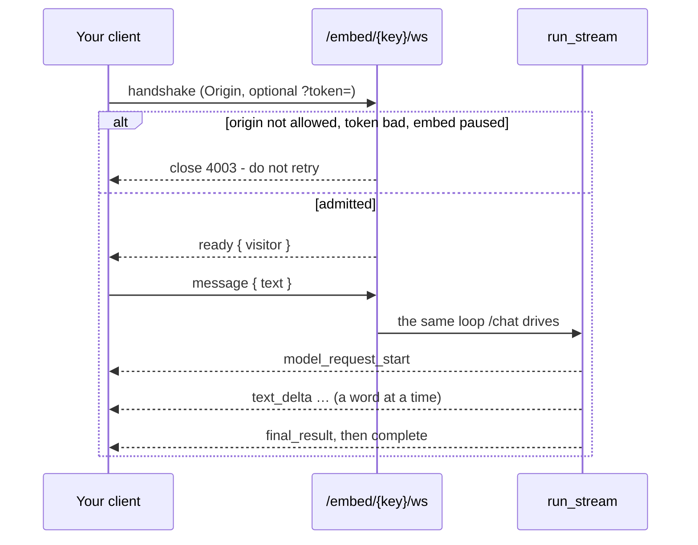
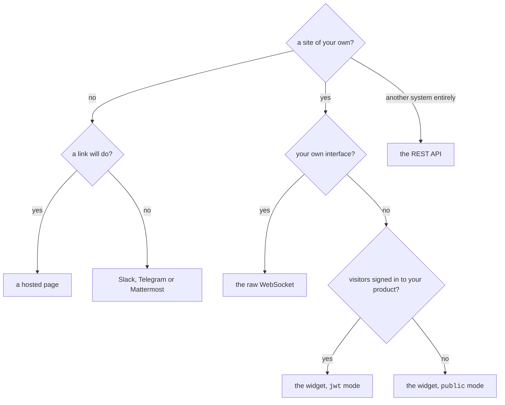

# Postawić agenta tam, gdzie ludzie już są { #putting-an-agent-where-people-already-are }

Agent, który odpowiada wyłącznie w tym dashboardzie, to demo. Ten sam
opublikowany agent odpowiada w ośmiu miejscach, a każde z nich uruchamia *tę samą
zamrożoną wersję* przez ten sam budżet, tę samą bramkę zatwierdzania i te same
kontrole tenanta — zmienia się powierzchnia, nie agent.

| Gdzie | Czego potrzebuje | Kim jest odwiedzający |
|---|---|---|
| **Dashboard** | niczego | zalogowany członek |
| **Widget na stronie** | tag `<script>` | anonimowy albo użytkownik, za którego ręczy twój backend |
| **Surowy WebSocket** | klucz embeda | tym, co powie twoja integracja |
| **Hostowana strona** | link | anonimowy i nic ponadto |
| **API** | sesja | ten, kto trzyma poświadczenie |
| **Slack** | token bota | konto Slacka, opcjonalnie powiązane z członkiem |
| **Telegram** | token bota | konto Telegrama, opcjonalnie powiązane |
| **Mattermost** | token bota i URL twojego serwera | konto Mattermosta, opcjonalnie powiązane |

Dashboard otwiera się też jako [aplikacja desktopowa](desktop.md): okno wokół tej
samej konsoli, ładowanej z tego samego serwera, bez niczego w paczce.

!!! abstract "Na każdej powierzchni obowiązują trzy zasady, egzekwowane w runnerze"

    - **Run zawsze należy do dokładnie jednej organizacji.**
    - **Limit wydatków jest sprawdzany przed każdym żądaniem do modelu, nigdy po.**
    - **Run, który się nie powiódł, nadal jest w historii wraz z tym, co wydał** —
      tokeny zostały wydane, zanim się zepsuł, a budżet, który to ignoruje, nie
      jest budżetem.

!!! info "Trzy z tych ośmiu to jedna tabela, a jej wiersze różnią się polem `kind`"

    Widget, surowy socket i hostowana strona to każde z osobna *embed* — a kind
    jest ustalany przy tworzeniu, bo wklejony już tag, napisany już klient
    i wysłany już link wskazują ten sam wiersz.

Jeden klucz publiczny, jeden kubełek rate limitu, jeden budżet, jeden przełącznik
pauzy i jeden zestaw odmów. Różni się to, co jest do skonfigurowania, i to, co
wpuszcza odwiedzającego — dlatego Builder pyta, którego chcesz, zanim zapyta
o cokolwiek innego, i dlatego strona nie ma listy dozwolonych originów, zamiast
mieć listę ignorowaną.

Każdy run zapisuje powierzchnię, która go wpuściła — `web`, `embed`, `api`,
`slack`, `telegram` albo `mattermost` — i to właśnie agreguje dashboardowy wykres
w podziale na powierzchnie. Wszystkie trzy rodzaje embeda zapisują `embed`. Dwie
historyczne rysy: runy widgetu zapisane, zanim istniała wartość `embed`, są
przechowywane jako `web`, a runy z Mattermosta z tej samej epoki jako `api`.
Żadne z nich nie są uzupełniane wstecz — przepisywanie historii byłoby
zgadywaniem — więc wykresy za stare okresy zaliczają te runy do powierzchni, pod
którą zostały zapisane.

**Co obcemu wolno, wolno mu w pewnym tempie.**

Powierzchnie osiągalne bez sesji mają limit liczony w Redisie tego deploymentu,
więc obowiązuje on we wszystkich workerach:

- run API, **na wywołującego**;
- skrypt widgetu i jego wpuszczenie, **na adres**, każde na własnym liczniku;
- config hostowanej strony, **na stronę** — ten pobiera serwer frontendu, a nie
  przeglądarka, więc adres wskazuje tam kontener i wrzuciłby każdego
  odwiedzającego w deploymencie do jednego kubełka.

Skrypt jest liczony osobno od wpuszczenia, które poprzedza, bo załadowanie strony
zużywa oba, a wspólny kubełek dla obu sprawiał, że liczba ustawiana przez
operatora znaczyła jedną trzecią siebie.

Ustawiają je `RATE_LIMIT_RUN_PER_MINUTE`, `RATE_LIMIT_EMBED_PER_MINUTE` i
`RATE_LIMIT_HOSTED_PAGE_PER_MINUTE`, a
[konfiguracja](configuration.md#rate-limiting) niesie jedno zastrzeżenie warte
przeczytania przed produkcją — za proxy każdy odwiedzający przychodzi jako proxy,
chyba że powiesz inaczej.

Tym, co racjonuje *wydatki* na hostowanej stronie, jest socket, który ta strona
otwiera, a on jest liczony na adres, tak jak socket widgetu.

---


!!! tip "Integrujesz, a nie konfigurujesz?"

    [HTTP API](api.md) opisuje uwierzytelnianie, nagłówek organizacji,
    uruchamianie agenta po HTTP, dwa endpointy WebSocket i kopertę błędu.

## Widget na stronie { #the-website-widget }

Najkrótsza droga. Opublikuj agenta, utwórz embed, wklej dwie linijki.

### 1. Utwórz embed { #1-create-the-embed }

W Builderze otwórz agenta → **Availability** → *Website widget*. Wybierasz:

- **Allowed origins** — strony, z których ten widget może zostać otwarty. **Pusta
  lista nie pozwala na nic**, więc publikacja bez niej jest odrzucana, zamiast
  dawać widget, który nigdzie nie odpowiada. Klucz w tagu skryptu jest publiczny
  z natury, więc to lista originów jest tym, co faktycznie powstrzymuje kogoś
  innego przed uruchamianiem twojego agenta na twój rachunek. Ta sama zasada
  obowiązuje socket, którego handshake jest sprawdzany względem tej samej listy.
- **Auth** — `public` (anonimowi odwiedzający) albo `jwt` (twój backend ręczy za
  każdego odwiedzającego; zobacz niżej).
- **Look** — nagłówek i linijka pod nim, powitanie, co mówi puste pole, co mówi
  przycisk otwierający, kolor akcentu i róg, w którym siedzi. Wszystkie siedem,
  a powitanie rysuje widget, zamiast wysyłać je do modelu: powitanie w historii
  modelu to tura, o której agent sądzi, że ją odbył.
- **Context** — notatka doklejana do pierwszej wiadomości odwiedzającego: *„Jesteś
  na stronie z cennikiem"*, *„Odpowiadaj po polsku"*. Nigdy nie zastępuje
  własnych instrukcji agenta, które należą do opublikowanej wersji.
- **Rate limit** — wiadomości na odwiedzającego na minutę.

!!! danger "Pusta lista originów nie pozwala na nic i jest to zamierzone"

    Klucz w tagu skryptu jest publiczny z natury, więc lista originów jest
    jedyną rzeczą, która powstrzymuje kogoś innego przed uruchamianiem twojego
    agenta na twój rachunek. Publikacja bez niej jest odrzucana, zamiast dawać
    widget, który nigdzie nie odpowiada.

### 2. Wklej snippet { #2-paste-the-snippet }

```html
<script src="https://your-api.example.com/api/v1/embed/PUBLIC_KEY/widget.js" async></script>
```

To cała integracja. Skrypt nie ma zależności, kroku budowania ani frameworka —
działa na stronie, która ładuje już React, jQuery albo nic w ogóle.

### 3. (Opcjonalnie) powiedz mu o odwiedzającym { #3-optional-tell-it-about-the-visitor }

Widget może **zadeklarować zmienne** — nazwę, to, czy jest wymagana, i linijkę
mówiącą, do czego służy — a strona je dostarcza:

```html
<script>window.AgenticOSContext = { plan: "pro", locale: "pl" };</script>
<script src="https://your-api.example.com/api/v1/embed/PUBLIC_KEY/widget.js" async></script>
```

Snippet, który wręcza ci Builder, niesie już tę linijkę, z twoimi własnymi
kluczami w środku, gdy tylko jakieś zadeklarujesz.

Są doklejane do instrukcji agenta jako oznaczony blok danych, pod linijką
mówiącą, że to informacje o odwiedzającym, a nie instrukcje, i że nie da się ich
zweryfikować. To ostatnie jest prawdą o każdej z nich, także na widgecie `jwt`:
widget czyta `window.AgenticOSContext`, a token uwierzytelnia *kim odwiedzający
jest*, a nie *co strona o nim powiedziała*. Więc nic tutaj nie może decydować
o tym, co agentowi wolno.

Wynikają z tego trzy zasady:

- **Klucz, którego nikt nie zadeklarował, jest odrzucany.** Stronę odwiedzający
  może edytować; bez deklaracji każdy wymyślony przez niego klucz stałby się
  linijką wewnątrz instrukcji agenta.
- **Brakująca wymagana wartość pomija swoją linijkę i trafia do logu.**
  `required` to obietnica integratora złożona samemu sobie — egzekwowanie jej
  kosztowałoby odwiedzającego odpowiedź przez cudzy błąd we wdrożeniu.
- **Wysyłane raz na rozmowę**, przed pierwszym pytaniem, i odczytywane z każdej
  ramki, a nie w chwili połączenia: aplikacja single-page dowiaduje się, kim ktoś
  jest, bez ponownego łączenia.

### 4. (Opcjonalnie) powiedz mu, kim jest odwiedzający { #4-optional-tell-it-who-the-visitor-is }

Dla widgetu wewnątrz twojego własnego produktu z logowaniem ustaw token
**zanim** załaduje się skrypt. Twój backend go podpisuje; my go weryfikujemy
i nigdy nie widzimy twojej bazy użytkowników:

```html
<script>window.AgenticOSToken = "<%= agenticos_token_for(current_user) %>";</script>
<script src="https://your-api.example.com/api/v1/embed/PUBLIC_KEY/widget.js" async></script>
```

Wybicie takiego tokena, w dowolnym języku, który potrafi podpisać JWT:

```python
import time, jwt   # PyJWT

token = jwt.encode(
    {"sub": str(user.id), "iat": int(time.time())},
    EMBED_SIGNING_SECRET,          # the secret you set on the embed
    algorithm="HS256",
)
```

- `sub` jest wymagane. Identyfikuje odwiedzającego na potrzeby rate limitingu,
  a token bez niego jest odrzucany — w przeciwnym razie jeden wyciekły token
  staje się budżetem całego widgetu.
- **`iat` jest wymagane i musi mieścić się w ostatnich 12 godzinach** — nie jest
  sprawdzane tylko wtedy, gdy jest obecne. Token bez `iat` albo z przeterminowanym
  jest odrzucany, więc taki, który wycieknie z przeglądarki, nie może działać
  wiecznie. Ustawione przez ciebie `exp` też jest respektowane, ale wyłącznie po
  to, by to okno **skrócić** (token wygasły zostaje odrzucony); nie może
  przedłużyć tokena ponad sufit dwunastu godzin.
- Wybijaj go przy każdym załadowaniu strony, po stronie serwera.

!!! danger "Nigdy nie wysyłaj sekretu podpisującego do przeglądarki"

    Podpisuje on *dowolnego* odwiedzającego. Token, który wybija, jest tym, co
    przeglądarce wolno trzymać, i tylko przez te dwanaście godzin, które daje mu
    `iat`.

---

## Surowy WebSocket { #the-raw-websocket }

Widget jest klientem udokumentowanego protokołu, a nie czarną skrzynką. Jeśli
chcesz własnego UI — aplikacji mobilnej, kiosku, komponentu w swoim design
systemie — rozmawiaj z tym samym socketem:

```
wss://your-api.example.com/api/v1/embed/PUBLIC_KEY/ws[?token=SIGNED_JWT]
```

**Nie musisz składać go samodzielnie.** Opublikuj taki socket z Buildera — agent
→ **Availability** → *Raw WebSocket* — a jego wiersz wypisze URL, zbudowany
z własnego bazowego URL-a deploymentu, z przyciskiem kopiowania. **Widget**
wypisuje to samo obok swojego tagu skryptu, bo widget jest klientem tego
protokołu: przejście na własny interfejs to krok, a nie przepisywanie od nowa.
`?token=` nie jest tam wypisywany: w trybie `jwt` token wybija dla każdego
odwiedzającego twój backend, a prawdziwy token na ekranie dashboardu to działające
poświadczenie, które ktoś może odczytać przez ramię.

!!! bug "Pierwsza rzecz, która idzie nie tak: brakujący `Origin`"

    Handshake musi go nieść, i to z listy dozwolonych embeda. **Przeglądarka
    wysyła go za ciebie; twój własny klient nie wysyła nic, dopóki go nie
    ustawisz** — aplikacja mobilna, kiosk, przekaźnik po stronie serwera. To, jak
    to wygląda, gdy go nie wyśle, to `4003` w tabeli niżej, a nie komunikat
    o błędzie.



**Ramki, które wysyłasz**

```json
{ "type": "message", "text": "Do you ship to Poland?" }
```

To całe słownictwo przychodzące, plus `context` (co strona mówi o odwiedzającym)
i `file_ids` (co załączył, na stronie, która przyjmuje pliki).

**Celowo nie obejmuje trzech pól, które niesie własna ramka dashboardu:** agenta,
profilu modelu i środowiska.

Ramka, która mogłaby wybrać model, to odwiedzający wybierający go na rachunek
operatora, a taka, która mogłaby wybrać agenta, to odwiedzający rozmawiający
z czymś, czego nikt nie opublikował na tym kluczu. Wszystkie trzy biorą się
z wiersza embeda.

Nieznane pole jest **ignorowane, a nie odrzucane**. Klient zbuforowany w czyjejś
przeglądarce może być starszy niż ten serwer, a zamknięcie z tego powodu socketu
zabrałoby ze sobą rozmowę.

**Ramki, które odbierasz**

!!! note "To jest własne słownictwo ramek dashboardu, a nie drugie takie"

    `/chat` i ten socket napędzają jedną pętlę (`app/services/run_stream.py`),
    więc odpowiedź przychodzi tutaj słowo po słowie tak samo jak tam. Hostowana
    strona pokazywała kiedyś jedną bryłę tekstu po trzydziestu sekundach niczego
    i to była pętla, a nie transport.

Każda ramka niesie `{ "type": …, "data": { … } }`.

| `type` | `data` | Znaczenie |
|---|---|---|
| `ready` | `visitor` | Połączono. `visitor: true`, gdy token zidentyfikował osobę. |
| `history` | `messages` | Tylko na hostowanej stronie: co zostało powiedziane w wątku, który ten odwiedzający wznawia. Każdy wpis to `role`, `text` i `at`, więc odtworzona tura zachowuje pod sobą swój czas. |
| `model_request_start` | — | Agent poszedł do modelu. Pokaż wskaźnik. |
| `part_start` | `index`, `part_type` | Zaczyna się blok odpowiedzi. Wysyłane tylko dla bloku, który ta powierzchnia faktycznie poniesie — strona niepokazująca rozumowania nie zapowiada `ThinkingPart`, bo sama zapowiedź mówi, że agent rozumował. |
| `text_delta` | `index`, `content` | Słowa odpowiedzi. Doklejaj je. |
| `thinking_delta` | `index`, `content` | Rozumowanie modelu. **Tylko jeśli operator to włączył.** |
| `call_tools_start` | — | Agent zaraz użyje narzędzi. |
| `tool_call` | `tool_call_id`, `tool_name`, `args` | Krok. `args` tylko wtedy, gdy operator pokazuje wyniki. |
| `tool_call_delta` | `index`, `args_delta` | Argumenty wywołania w miarę, jak płyną strumieniem. |
| `tool_result` | `tool_call_id`, `content` | Co zwrócił ten krok. |
| `final_result_start` | `tool_name` | Odpowiedź jest produkowana przez narzędzie wyjściowe. |
| `final_result` | `output` | Czym run się zakończył. Puste w turze, która zaparkowała. |
| `complete` | — | Tura się skończyła. Nie niesie **żadnego usage**: ile run kosztował, to sprawa operatora, nie odwiedzającego. |
| `error` | `message` | Coś, co odwiedzający powinien zobaczyć: rate limit, osiągnięty budżet, odmowę, turę, która nic nie wyprodukowała. |

Niektóre ramki dashboardu nigdy nie docierają do publicznego socketu i są
odmowami, a nie ustawieniami. **`user_prompt_processed`** niesie prompt *w
postaci złożonej* — notatkę o umiejscowieniu i dostarczony blok ponad tym, co
wpisał odwiedzający — czyli tekst operatora, a nie coś, co odwiedzający ma
odczytywać z powrotem.

**`ask_user` i `tool_approval_required` nie mają tu nikogo, kto by na nie
odpowiedział, ale zawodzą inaczej.** Odwiedzający nie może zatwierdzić efektu
ubocznego w cudzej organizacji, więc `tool_approval_required` **parkuje** run
dokładnie tak, jak robi to na kanale, a tura kończy się ramką `error` mówiącą, że
musi zdecydować człowiek — inaczej niż na kanale, bez linku do `/runs`, bo tam
czytelnikiem jest członek, który może go otworzyć, a tutaj obcy trzymający link.
`ask_user` **nie** parkuje: `AgentDeps.ask_user` jest na tej powierzchni `None`,
więc narzędzie *odmawia*, gdy model je wywoła (`app/agents/ask_user.py`), a model
idzie dalej i odpowiada bez tego wejścia — odpowiedź zdegradowana, a nie
zaparkowany run.

**Klient ignoruje to, czego nie rysuje**, a `widget.js` jest tego rozpracowanym
przykładem: czyta `model_request_start`, `text_delta`, `final_result`, `complete`
i `error`, a rozumowanie i kroki ignoruje celowo — odpowiedź przychodząca słowo
po słowie jest warta pokazania w dymku w rogu strony, a narracja wywołań narzędzi
nie. Hostowana strona rysuje je wszystkie.

**Kody zamknięcia**

| Kod | Znaczenie |
|---|---|
| `4003` | Odmowa. Origin jest niedozwolony, token nie przeszedł albo widget jest zapauzowany. Nie ponawiaj — odpowiedź się nie zmieni. |
| `4029` | Za dużo połączeń z tego adresu w ostatniej minucie. Odczekaj i spróbuj ponownie. |
| `1011` | Ten klient nie czytał. Ramka potrzebowała ponad 30 sekund, by do niego dotrzeć, więc serwer przestał pisać, zamiast trzymać sesję bazodanową tury i otwarty strumień providera raz na ramkę. Połącz się ponownie; hostowana strona wznawia swój wątek. |

Odmowa to celowo jeden kod z jednym komunikatem. Strona, której nie ma na liście
dozwolonych, dowiaduje się, że jest niedozwolona, i niczego o tym, czy token by
pomógł.

`4029` jest od niej oddzielony z odwrotnego powodu: „niedozwolone" i „dozwolone,
ale za szybko" proszą klienta o przeciwne rzeczy — przestań na zawsze i spróbuj
ponownie później — więc klient, który ich nie rozróżnia, albo młóci w odmowę,
albo porzuca limit. Ile połączeń dostaje adres, mówi
`RATE_LIMIT_EMBED_PER_MINUTE`; ile *wiadomości* dostaje odwiedzający po
połączeniu, mówi własny rate limit widgetu, ustawiany w Builderze.

Minimalny klient:

```js
const socket = new WebSocket(`${BASE}/api/v1/embed/${KEY}/ws`);
let answer = "";
socket.onmessage = (event) => {
  const { type, data } = JSON.parse(event.data);
  if (type === "text_delta") render((answer += data.content));
  if (type === "final_result" && data.output) render((answer = data.output));
  if (type === "complete") answer = "";
  if (type === "error") render(data.message);
};
socket.send(JSON.stringify({ type: "message", text: "hello" }));
```

`final_result` jest przypisywany, a nie doklejany: to jest to, czym run się
*zakończył*, a provider, który nie przysłał strumieniem żadnych delt, zostawia go
jako jedyną kopię odpowiedzi.

---

## Hostowana strona { #a-hosted-page }

Najkrótsza integracja, jaka istnieje: **wyślij komuś link.** Żadnej własnej
strony, żadnego tagu `<script>`, żadnego klienta do napisania, żadnego logowania.

W Builderze otwórz agenta → **Availability** → *Hosted page*. Nie ma tu żadnej
strony do wskazania ani niczego do wklejenia — formularz pyta o tytuł, powitanie,
kolor akcentu i logo, wszystko opcjonalne, i publikuje:

```
https://your-app.example.com/e/PUBLIC_KEY
```

To **embed jak dwa pozostałe**: ten sam rodzaj klucza, ten sam rate limit, ten
sam budżet i ten sam przełącznik pauzy. Zapauzowanie zatrzymuje stronę
natychmiast, a wraz z nią każdy już wysłany link.

### Co ją chroni { #what-protects-it }

Powiedz tę część na głos, zanim taką stronę opublikujesz, bo to cały model
bezpieczeństwa:

> **Hostowany link w trybie `public` chroni to, że klucza nie da się zgadnąć,
> plus rate limit embeda, jego budżet i jego przełącznik pauzy. Nic poza tym.**

Kto ma link, może rozmawiać z agentem. Na tym polega link i dlatego klucz to 24
losowe bajty, a nie coś czytelnego.

Nie ma tutaj listy dozwolonych originów, celowo, i formularz jej nie oferuje:
lista dozwolonych to reguła o *cudzych* stronach, a tę stronę serwujemy my.
Strona jest wpuszczana z własnego originu deploymentu — wyprowadzonego
z `FRONTEND_URL`, nigdy zahardkodowanego — i znikąd indziej. Ograniczenie `CHECK`
odrzuca stronę, która w ogóle niesie taką listę, bo zapisana lista czyta się jako
to, co chroni link, a nim nie jest.

### Dwie rzeczy, których hostowana strona odmawia { #two-things-a-hosted-page-refuses }

Obie są odrzucane przy publikacji, z komunikatem, zamiast po cichu cofać się do
widgetu:

- **Strona nie może używać trybu `jwt`** i formularz go nie oferuje. Token
  musiałby podróżować w URL-u, a więc do historii przeglądarki, nagłówków
  `Referer` i każdego komunikatora, do którego link zostanie wklejony — a
  sztuczka z fragmentem, która części tego unika, odbiera linkowi bycie „wyślij
  go i działa". Do integracji per użytkownik użyj widgetu albo socketu; `jwt`
  pozostaje tam bez zmian. Ograniczenie `CHECK` trzyma tę samą regułę w bazie.
- **Zmienna *wymagana*, która nie jest URL-safe, nie może być na stronie** —
  zobacz niżej.

### Zmienne z paska adresu { #variables-from-the-address-bar }

Hostowana strona nie ma żadnej twojej strony, z której mogłaby odczytać
`window.AgenticOSContext`. Jej jedynym źródłem zadeklarowanej zmiennej jest
własny URL odwiedzającego:

```
https://your-app.example.com/e/PUBLIC_KEY?var_plan=pro
```

**Parametr query to wejście kontrolowane przez odwiedzającego**, więc jest to
wyłączone osobno dla każdej zmiennej i włączone tylko tam, gdzie ktoś tak
zdecydował: zaznacz *URL-safe* przy zmiennej w Builderze. Bez tego
`?var_user_tier=premium` wpisane w pasek adresu jest odrzucane — i o to chodzi.
Cokolwiek w ogóle niezadeklarowanego jest odrzucane tak samo jak na widgecie.

To także powód, dla którego zmienna *wymagana* musi być oznaczona: na tej
powierzchni URL jest jedynym sposobem jej dostarczenia, więc zmienna wymagana
i nie-URL-safe to obietnica, której strona strukturalnie nie może dotrzymać.

### Powrót do niej { #coming-back-to-it }

Rozmowa widgetu trwa tyle, co jego socket. Link w zakładkach to silniejsza
obietnica, więc strona trzyma losowy klucz odwiedzającego w `localStorage` — po
jednym na klucz publiczny — a serwer mapuje go na rozmowę. Ponowne otwarcie linku
odtwarza wątek, a agentowi przypomniane zostaje to samo okno, które czyta
odwiedzający.

**Klucz jest poświadczeniem na okaziciela dla tej rozmowy**: kto go trzyma,
wznawia wątek, razem z tym, co już w nim jest. To 128 losowych bitów i nic
o osobie. Wyczyszczenie danych witryny zaczyna nowy wątek.

Ten klucz to całość tego, co strona przechowuje, i dlatego **hostowana strona
i udostępniona rozmowa nie pokazują monitu o ciasteczkach** — dwie powierzchnie
serwowane komuś, kto nie jest członkiem, to dwie, w których nie ma opcjonalnego
ciasteczka wymagającego zgody. Baner produktu pojawiał się tu kiedyś, prosząc
o zgodę na analitykę, której ten deployment nie prowadzi, siedząc przy tym nad
composerem i zasłaniając Send (#644). Monit o zgodę na jeden niezbędny klucz to
monit, którego jedynym efektem jest to zasłonięcie.

Ten kształt jest egzekwowany, a nie zakładany — socket przyjmuje jako `visitor`
od 32 do 64 małych znaków szesnastkowych i **odrzuca cokolwiek innego**,
otwierając w zamian świeży wątek. Ma to znaczenie dla twojego własnego klienta
(niżej): oparcie ciągłości na id klienta, adresie e-mail albo liczniku
wręczyłoby każdemu z twoich użytkowników rozmowę, do której następna osoba może
wejść, zgadując. Odrzucony klucz kosztuje ciągłość, a nigdy rozmowę, więc
nieaktualna wartość w czyjejś przeglądarce to nie strona, która się nie załaduje.

### Co oferuje { #what-it-offers }

Dwa przełączniki, i oba należą do operatora, a nie do strony — capability, którą
strona włączyłaby sobie sama, byłaby taką, której nikt nie mógłby wyłączyć.

- **Przycisk do rozpoczęcia świeżego wątku**, domyślnie włączony. Wybija nowy
  klucz ciągłości, więc stary wątek nie jest usuwany: przestaje być tym, który ta
  przeglądarka wznawia.
- **Mikrofon w composerze**, domyślnie wyłączony. Dyktuje do pola przez *własną
  przeglądarkę odwiedzającego*, więc żadne audio nie dociera do tego deploymentu
  i nic nie jest tutaj transkrybowane — ale przeglądarka, która oferuje
  rozpoznawanie mowy, przekazuje audio swojemu dostawcy, i to jest ta połowa
  warta przeczytania przed włączeniem tego dla publiczności. Przeglądarce bez
  rozpoznawania mowy nie jest pokazywany żaden mikrofon, zamiast przycisku, który
  nic nie robi.
- **Sposób na załączenie pliku**, domyślnie wyłączony. Zobacz niżej: to jedyna
  rzecz na tej powierzchni, która pozwala obcemu coś *zapisać*.

### Dokąd może pisać obcy trzymający link { #what-a-stranger-holding-the-link-can-write-to }

Wszystko inne na powierzchni publicznej czyta. Ta pisze, więc warto powiedzieć
dokładnie, co odwiedzający może gdzie położyć.

**Może zapisać plik**, i tylko wtedy, gdy operator zaznaczył przełącznik. Bajty
idą tą samą ścieżką co upload członka — lista dozwolonych typów MIME,
`CHAT_MAX_UPLOAD_SIZE_MB` (domyślnie 10 MB — własny sufit powierzchni czatu, a
nie większy `MAX_UPLOAD_SIZE_MB` knowledge base), parser, backend storage, wiersz
`ChatFile` — z trzema zawężeniami przed nią:

| | |
|---|---|
| **Własny limit tej powierzchni** | `EMBED_MAX_UPLOAD_SIZE_MB`, domyślnie 5 MB. Członek wgrywający pięćdziesięciomegabajtowy eksport to ktoś, kogo organizacja zatrudnia; to samo przyzwolenie na publicznym linku to sposób na zapełnienie dysku z adresu, którego nikt nie zna. To sufit *na wierzchu* `CHAT_MAX_UPLOAD_SIZE_MB`, nigdy droga obok niego |
| **Limit na adres i na odwiedzającego** | `RATE_LIMIT_EMBED_UPLOAD_PER_MINUTE`, we wspólnym Redisie, i **oba** muszą na to pozwolić. Liczenie samego klucza ciągłości nie ogranicza niczego: wybija go przeglądarka, a poprawne jest dowolne 32 znaki szesnastkowe, więc skrypt zmienia go przy każdym pliku. Liczenie samego adresu pozwala jednej przeglądarce na adresie współdzielonym wydać limit wszystkich |
| **Trzy pliki do jednej wiadomości** | Co ogranicza, jak duża część promptu jednej tury to cudzy dokument |

Te trzy ograniczają to, co zostaje *zapisane*. To, co ogranicza, co obcy może
kazać temu deploymentowi *odebrać*, jest o warstwę wyżej od nich wszystkich, bo
ciało multipart jest parsowane, zanim uruchomi się route: żądanie deklarujące
więcej niż sufit całego żądania dostaje odpowiedź 413 bez czytania. Zobacz
[konfigurację](configuration.md#the-size-of-a-request-as-opposed-to-the-size-of-a-file),
razem z tym, czego nie obejmuje.

**Wiersz należy do członka, który opublikował stronę**, bo `chat_files.user_id`
jest `NOT NULL`, a odwiedzający nie ma konta — ta sama odpowiedź, która już
padła na pytanie, jako kto *wykonuje się* tura publiczna. Strona, której
publikujący stracił konto, nie może więc w ogóle przyjmować plików i mówi „not
available", zamiast zapisywać je na nikogo.

**Dokąd plik trafia dalej, decyduje runner, a nie ta powierzchnia.** To
routing z [Przetwarzania plików](file-processing.md), niezmieniony: do workspace'u
agenta tam, gdzie agent go ma, wpleciony w prompt tam, gdzie nie ma, a obraz
w obie strony do sufitu inline. Nic w pliku odwiedzającego nie jest przypadkiem
szczególnym.

Ramka może wskazać tylko plik, który należy do właściciela tej strony i nie wisi
już przy jakiejś wiadomości, więc id nie da się odtworzyć w drugiej turze ani
w cudzym wątku. To rozwiązanie proporcjonalne, a nie kompletne, a wystarczające
czyni je samo id: `uuid4` to 122 losowe bity, więc id od innego odwiedzającego to
wartość, której nikt nie wyprodukuje, nie dostawszy jej wcześniej.

**Nic innego zapisać nie może.** Żadnej knowledge base, żadnej własnej ścieżki
w workspace'ie, żadnego configu, żadnej zmiennej, która nie jest zadeklarowana
i URL-safe. Wiersz rozmowy i tury w nim są pisane *o nim*, przez platformę.

### Co odwiedzający widzi z tej pracy { #what-the-visitor-sees-of-the-work }

Kolejne trzy przełączniki i są to **filtry tego, co wysyła serwer**, a nie tego,
co rysuje strona. Ta różnica to cały projekt: rozumowanie ukryte w CSS to
rozumowanie agenta siedzące w devtoolsach obcej osoby, a strona jest dokładnie
tym miejscem, gdzie obcy ma je otwarte. Odwiedzający, który otworzy swoje, widzi
to, co jest tutaj zaznaczone, i nic poza tym.

| Przełącznik | Domyślnie | Co przepuszcza |
|---|---|---|
| **Co agent robi** | włączony | Jedna linijka na krok — *Searching the documents*, *Ran a query*. Włączony, bo strona, która milknie na trzydzieści sekund, czyta się jak zepsuta |
| **Co zwrócił każdy krok** | wyłączony | Argumenty, z jakimi krok został wywołany, i to, co wróciło. Pisane dla modelu, więc to tutaj wypływa coś wewnętrznego: adres, wiersz z jakiegoś systemu, fragment, którego nikt nie zamierzał publikować |
| **Rozumowanie agenta** | wyłączony | Co model mówi sam do siebie, zanim odpowie. Nie jest pisane po to, by ktokolwiek to czytał, i nie jest odpowiedzią, za którą operator może stanąć |

*Co zwrócił każdy krok* nie da się włączyć samodzielnie — nie byłoby kroku, który
mógłby się dla tego otworzyć, i serwer odrzuca oba niezależnie od tego, co mówi
config.

**Tura wygląda jak tura w czacie webowym**, aż po ramę wokół niej: nazwa agenta
nad odpowiedzią, awatar na marginesie — logo strony tam, gdzie jest, inicjał
agenta tam, gdzie go nie ma — czas pod każdą turą po tej stronie, po której ona
jest, i jedna karta composera z polem i jego kontrolkami w środku.

Trzech rzeczy, które rysuje tam czat webowy, celowo brakuje, a wszystkie trzy to
ta sama decyzja co panele niżej: ile kosztowała tura, ile kosztował miesiąc oraz
którego agenta i model uruchomić.

To ostatnie dlatego, że ramka, która mogłaby wybrać model, to odwiedzający
wybierający go na rachunek operatora.

**Tura jest renderowana własnymi komponentami czatu webowego**, a nie drugim
zestawem, który wygląda jak tamte.

`TurnParts` to to, co renderuje dashboard, i to, co renderuje strona. Więc
rozumowanie jest tym samym rozwinięciem, odpowiedź tym samym Markdownem,
a ciąg wywołań narzędzi tą samą szyną — ikona z `src/lib/tool-catalog.ts`,
sformułowania z `toolStep` i te same renderery otwierające się pod krokiem dla
wyszukiwania w wiedzy, wyszukiwania w sieci, wykresu, kodu, który się wykonał,
załadowanego skilla, zapisanego pliku.

Celowo nie ma drugiej tabeli nazw narzędzi ani drugiego renderera tury (#144).
Tym, czego strona *nie* rysuje, jest wszystko, co dotyczy bycia członkiem —
zobacz niżej.

Jedna rzecz z konieczności czyta się inaczej: wywołanie, które przyszło z serwera
MCP, nazywa się w dashboardzie *Linear · Create issue*, a tutaj nosi nazwę
uczłowieczoną, bo mapowanie to lista połączeń organizacji, a jej odczytanie
wymaga sesji.

**Widget i surowy socket nie niosą żadnych przełączników i dostają te domyślne
wartości**, odczytywane z `PageConfig`, a nie powtarzane — druga kopia
„domyślnie wyłączone" to kopia, która może się nie zgadzać z tą, którą ktoś czyta
w Builderze. To, co `widget.js` następnie *rysuje*, jest jeszcze węższe i mówi
o tym wyżej.

Żaden z nich nie przyjmuje też plików, i to kwestia route'a, a nie klienta:
endpoint uploadu rozwiązuje klucz przez `find_page`, więc klucz widgetu do niego
dociera i dostaje odpowiedź „not available". Widget żyje na stronie, którą
operator i tak kontroluje, i to tam jest miejsce na jego własny wybór plików.

### Co jest celowo tylko dla członków { #what-is-deliberately-member-only }

Czat webowy rysuje trzy panele, których powierzchnia publiczna nie rysuje, a każde
pominięcie jest decyzją, a nie luką — zapisaną tutaj, żeby nie procesować się
o nią ponownie.

| Panel | Na powierzchni publicznej | Dlaczego |
|---|---|---|
| **Pasek usage** | Nie, i nie jest to przełącznik | Raportuje tokeny tury, jej koszt, miesiąc względem limitu organizacji i to, jak pełny jest workspace. Odwiedzający nie jest tym, kto płaci, a pozostały budżet operatora to fakt o operatorze. `complete` nie niesie żadnego usage, więc nie ma niczego do ukrywania po stronie klienta |
| **Panel plików** | Nie | Wylicza wszystko w *workspace'ie* agenta, który jest wspólny dla rozmów wszystkich korzystających z tego agenta. Obcemu, który załączył jeden plik, pokazano by każdy plik, jaki ten agent kiedykolwiek dostał. Jego własny załącznik jest przy jego własnej turze i to mu się należy |
| **Panel delegacji** | Nie | Nazywa delegatów po slugu, mówi, o co każdy został poproszony i ile każdy kosztował — czyli kształt grafu agentów organizacji. Strona, która by go pokazała, opublikowałaby wewnętrzny schemat organizacyjny każdemu, kto ma link. Delegacja nadal się *wykonuje*: to jeden krok `tool_call` o nazwie `task`, pod tym samym przełącznikiem co każdy inny krok |

Wzorzec stojący za wszystkimi trzema: to, co widzi członek, jest *o organizacji*,
a to, co widzi odwiedzający, jest *o jego własnej turze*. Panel, który przekracza
tę linię, jest tylko dla członków, niezależnie od tego, ile kosztowałoby jego
narysowanie.

### Jak wygląda { #what-it-looks-like }

Odpowiedź renderuje się jako **Markdown**, tak samo jak w czacie webowym: agent,
któremu kazano odpowiadać w Markdownie, odpowiada w nim niezależnie od tego, czy
strona interpretuje gwiazdki. To, co wpisał *odwiedzający*, nie jest
interpretowane — to nie jest dokument.

Cztery pola, wszystkie opcjonalne:

| Pole | Domyślnie |
|---|---|
| **Tytuł strony** | nazwa agenta |
| **Wiadomość powitalna** | brak. **Markdown**, pisany w tym samym edytorze co notatka o umiejscowieniu i renderowany na stronie jako Markdown. Pokazywany przed pierwszym pytaniem i nigdy nie wysyłany do modelu — powitanie w historii modelu to tura, o której agent sądzi, że ją odbył |
| **Kolor akcentu** | `#4f46e5`. Tryb jasny i ciemny nadal idą za systemem odwiedzającego |
| **Logo** | awatar agenta; albo awatar organizacji, wgrany przez ciebie plik, albo nic. Cokolwiek wybierzesz, strona pokazuje **nic**, a nie zepsuty obrazek, gdy nie stoi za tym żaden plik — agent bez awatara to przypadek zwyczajny, a przeglądarka nie odróżni 404 od wolno ładującego się obrazka |

Trzy z tych czterech to obrazy, które ta platforma już trzyma. Czwarte przyjmuje
plik — PNG, JPEG, WebP albo GIF, do 2 MB — i można je dodać dopiero wtedy, gdy
strona istnieje, bo upload potrzebuje wiersza, do którego się doczepi.

Strona pobiera je z **własnego originu**, a nie z API: `img-src`
w `next.config.ts` wyklucza API na gołym `http`, więc strona kierująca `` na
takie API rysowała zepsuty znaczek w dev i na każdym deploymencie terminującym
TLS gdzie indziej. `/api/embed/<key>/logo` na frontendzie robi za proxy.

**Czego nie przyjmuje, to twojego własnego URL-a.** Serwowana przez nas strona
pobierająca obraz dostarczony przez operatora to jeszcze jedna rzecz do
zabezpieczenia. A zapisana ścieżka to *kolumna*, pisana przez route uploadu
i nigdy przez config, który przesyłasz: ścieżka jest odczytywana i strumieniowana
przez publiczny route, więc przyjęta z ciała żądania byłaby wywołującym
wskazującym dowolny plik, który proces potrafi otworzyć.

**Nie przyjmuje też twojej nazwy pliku ani twojego zapewnienia, czym ten plik
jest.**

Ponieważ strona pobiera logo z własnego originu, jakikolwiek typ niesie ta
odpowiedź, jest typem, któremu przeglądarka na tym originie ufa — a `script-src`
pozwala tam na skrypt inline.

Upload jest przyjmowany na podstawie `Content-Type`, który *zadeklarował* jego
klient, a to nie jest dowód na temat bajtów. Więc nazwa na dysku jest zamiast tego
wybijana z typu (`logo.png`, `logo.jpg`, `logo.webp`, `logo.gif`), a zarówno route
API, jak i proxy frontendu odmawiają odpowiedzi czymkolwiek, co nie jest jednym
z tych czterech typów obrazu.

Zapisany `.html` albo `.svg` — stąd albo z awatara wgranego lata temu inną drogą
— jest serwowany jako **zupełnie nic**, a nie jako skrypt.

Strona jest `noindex`. Sekretny link to nie strona do zaindeksowania, a crawler,
który za nim pójdzie, właśnie ją opublikował.

---

## Publiczne API { #the-public-api }

Żadnego frontendu i żadnej przeglądarki. Jedno żądanie, jedna odpowiedź:

```bash
curl -X POST https://your-api.example.com/api/v1/agents/AGENT_ID/run \
  -H "Authorization: Bearer $TOKEN" \
  -H "X-Organization-Id: $ORG_ID" \
  -H "Content-Type: application/json" \
  -d '{"prompt": "Summarise this week's refunds"}'
```

Idzie przez ten sam runner co każda inna powierzchnia, więc run jest zapisywany,
budżet obowiązuje, a koszt ląduje w tym samym dashboardzie — wywołujący API nie
objedzie governance, nie używając UI. Runy są stemplowane jako `api`.

Odpowiedź niesie `run_id`, `output`, `status` i to, ile kosztował. `status`
równy `awaiting_approval` przy pustym output oznacza, że wywołanie narzędzia jest
zaparkowane: run jest w kolejce zatwierdzeń i będzie kontynuowany, gdy ktoś
zdecyduje.

Limitowany na wywołującego, a nie na adres — biuro za jednym NAT-em to nie jeden
wywołujący — wartością `RATE_LIMIT_RUN_PER_MINUTE`.

---

## Slack { #slack }

1. **api.slack.com/apps → Create New App → From scratch.** Nadaj aplikacji nazwę
   i wybierz workspace.
2. **OAuth & Permissions → Bot Token Scopes → Add an OAuth Scope** i dodaj
   trzynaście scope'ów wymienionych niżej. *Install to Workspace* pozostaje
   wyszarzone, dopóki nie zostanie dodany co najmniej jeden — na to właśnie czeka
   pusta aplikacja.
3. **Install App → Install to Workspace → Allow.** Skopiuj **Bot User OAuth
   Token** (`xoxb-…`).
4. **Event Subscriptions → Enable Events → Subscribe to bot events** i dodaj pięć
   eventów wymienionych niżej.
5. Zarejestruj bota: **Channels → Add bot**, platforma `slack`, wklej token
   bota.
6. Wybierz transport — Socket Mode nie wymaga wystawiania niczego na zewnątrz
   i jest właściwym wyborem na laptopie:
     - **Socket Mode.** *Basic Information → App-Level Tokens → Generate*, scope
       `connections:write`; wklej token `xapp-` w ustawieniach bota tutaj. Żadnego
       Request URL, żadnego signing secret.
     - **Events API.** **Najpierw** wklej signing secret z *Basic Information →
       App Credentials* w ustawieniach bota, a dopiero potem ustaw slackowy
       *Request URL* na `https://your-api.example.com/api/v1/slack/BOT_ID/events`
       — id bota jest w jego wierszu pod **Channels**.
7. **App Home → Messages Tab**: włącz go i zaznacz *Allow users to send Slash
   commands and messages from the messages tab*. Bez tego Slack ukrywa pole
   wiadomości bota i wiadomość bezpośrednia jest niemożliwa.
8. Opublikuj agenta, a potem go podepnij: Builder → agent → **Availability** →
   bot.
9. Zaproś bota na kanał — `/invite @your-bot` — i wspomnij o nim.

!!! tip "Albo wklej manifest i pomiń kroki 2, 4, 6 i 7"

    **App Manifest** w lewej nawigacji przyjmuje całą konfigurację naraz —
    scope'y, eventy, Socket Mode i zakładkę wiadomości — co jest mniej podatne na
    błąd niż jedenaście przejść przez wybierak scope'ów. Utwórz aplikację
    *z manifestu* albo wklej ten manifest na manifest istniejącej aplikacji:

    ```yaml
    display_information:
      name: Support Copilot
    features:
      bot_user:
        display_name: Support Copilot
        always_online: true
      app_home:
        messages_tab_enabled: true
        messages_tab_read_only_enabled: false
    oauth_config:
      scopes:
        bot:
          - chat:write
          - files:write
          - files:read
          - app_mentions:read
          - users:read
          - channels:read
          - groups:read
          - channels:history
          - groups:history
          - im:history
          - mpim:history
          - im:read
          - mpim:read
    settings:
      event_subscriptions:
        bot_events:
          - app_mention
          - message.channels
          - message.groups
          - message.im
          - message.mpim
      socket_mode_enabled: true
      token_rotation_enabled: false
    ```

    Dla Events API ustaw zamiast tego `socket_mode_enabled: false` i dodaj
    `request_url` pod `event_subscriptions` — i przeczytaj najpierw następne
    ostrzeżenie, bo Slack waliduje ten URL w chwili zapisania manifestu.

!!! danger "Signing secret wchodzi przed Request URL, a nie po nim"

    Slack weryfikuje nowy Request URL, wysyłając na niego podpisane wyzwanie
    `url_verification`, a to wyzwanie idzie tą samą ścieżką co każdy inny event.
    Bot bez signing secret odpowiada **500 na wszystkie**, więc Slack raportuje
    „Your request URL didn't respond with the correct challenge value" — co czyta
    się jak problem sieciowy, a nim nie jest.

!!! warning "Nie włączaj rotacji tokenów"

    *Advanced token security via token rotation*, na górze **OAuth &
    Permissions**, sprawia, że token `xoxb-` wygasa. Ten deployment trzyma
    statyczny token bota w vaulcie i go nie odświeża, więc bot działa, a potem
    przestaje. Redirect URL-e, PKCE, scope'y tokenów użytkownika, zakresy IP
    i Enterprise-Managed Authorization na tej stronie też są nieużywane —
    zostaw je w spokoju.

### Scope'y i eventy { #scopes-and-events }

Trzynaście scope'ów tokena bota, każdy zasłużony wywołaniem, które wykonuje
adapter:

| Scope | Co go potrzebuje |
|---|---|
| `chat:write` | `chat.postMessage` oraz `chat.update` dla odpowiedzi przepisywanej w miarę, jak powstaje |
| `files:write` | `files.upload` — wykres albo plik, który agent odsyła |
| `files:read` | załącznik, który ktoś wrzucił, pobierany z `url_private_download` |
| `app_mentions:read` | bycie zawołanym po nazwie na kanale |
| `channels:history`, `groups:history`, `im:history`, `mpim:history` | eventy `message` oraz `conversations.history` dla zapisu kanału |
| `channels:read`, `groups:read` | `conversations.info`, `.list` i `.members` — odpytania o kanał, które agent może wywołać |
| `im:read`, `mpim:read` | `conversations.members` na wiadomości bezpośredniej. Łatwo go pominąć i cicho, gdy się to zrobi: sprawdzenie członkostwa zawodzi domyślnie na „nie", więc rozmowa, w której nikogo nie dało się potwierdzić, **znika z listy rozmów**, zamiast dawać błąd |
| `users:read` | `users.info`, które zamienia id członków w ludzi |

Pięć eventów bota: `app_mention`, `message.channels`, `message.groups`,
`message.im`, `message.mpim`.

`message.channels` i `message.groups` dostarczają **każdą** wiadomość z każdego
kanału, na którym jest bot, a nie tylko te, które go wołają — i jest to celowe,
więc zasubskrybuj oba. O tym, czy bot się odezwie, decyduje reguła niżej,
odczytywana z eventu: Slack podstawia `<@U0123>` za prawdziwą wzmiankę, więc
adapter wie, które wiadomości były skierowane do niego, i trzyma się z dala od
reszty. To, że przychodzi cała rozmowa, będzie potrzebne agentowi, który *sam*
decyduje, czy wiadomość zasługuje na odpowiedź; subskrypcji zawężonej do
`app_mention` nie da się poszerzyć po fakcie bez edycji aplikacji Slacka przez
każdego operatora.

| Gdzie | Kiedy odpowiada |
|---|---|
| **Wiadomość bezpośrednia** | Zawsze. Nie ma w pokoju nikogo innego, więc wymaganie wzmianki byłoby proszeniem kogoś, by zwrócił się do jedynego uczestnika |
| **Grupowa wiadomość bezpośrednia** | Tylko gdy zawołany. Dzieli ją kilka osób, więc jest to pokój, a nie rozmowa z jedną osobą |
| **Kanał** | Tylko gdy zawołany — `@the-bot` albo `@agent-slug` dla agenta, który za nim stoi |

Wzmianka liczy się w dowolnym miejscu wiadomości, nie tylko na początku. Uchwyt
wpisany bez pozwolenia Slackowi na jego rozwiązanie zostaje zwykłym tekstem i nie
jest wzmianką — platforma żadnej nie dostarczyła — a `@channel`, `@all`, `@here`
i `@everyone` zwracają się do pokoju, a nie do agenta.

**Wiadomość z załączonym plikiem to wiadomość.** Slack oznacza taką przez
`subtype: file_share` i zarówno plik, jak i wysłany z nim podpis docierają do
agenta — obraz z *„co widzisz?"* pod spodem to jedna tura, a nie dwie. Nadal
odrzucane pozostaje to, w czym platforma opisuje kanał, zamiast ktoś w nim mówić:
edycja, usunięcie, dołączenie, zmiana tematu i cokolwiek, co wrzucił sam bot.

Bot widzi to, z czym aplikacja została zainstalowana, i nic ponadto. Dodanie
scope'a później oznacza reinstalację aplikacji, która wybija nowy token `xoxb-` —
wklej i ten, bo inaczej bot zachowa dostęp, który miał.

!!! info "Bot, który na nic nie odpowiada: co jest raportowane, a co nie"

    Połączenie jest. Bot pollujący, którego strumień się nie otworzył albo
    wciąż zawodzi, ma na swoim wierszu pod **Channels** plakietkę **Not
    connected** wraz z powodem — supervisor wie, a do #1351 wpisywał to do logu
    kontenera i nigdzie indziej.

    Reszta nadal milczy, a to jest kolejność, w jakiej należy to sprawdzać:
    brak agenta podpiętego do bota (wiersz to mówi), brakujący scope albo
    subskrypcja eventu, a potem błędne `BOT_ID` w Request URL. To ostatnie nie
    może zgłosić się samo: route eventów odpowiada **200 i nic nie robi** na id
    bota, którego nie potrafi znaleźć, i to celowo, bo sondujący powinien się
    dowiedzieć jedynie, że endpoint istnieje — co już powiedział mu URL.

Działa na kanałach i w DM-ach. Wiadomość z powiązanego konta wykonuje się jako ta
osoba — nigdy jako bot; wiadomość z konta, którego nikt nie powiązał, wykonuje
się pod powiązaniem i tylko na kanale. Wiadomość bezpośrednia prosi najpierw
o konto.

Powiązane konto, którego członek opuścił organizację albo którego konto zostało
dezaktywowane, jest traktowane jak niepowiązane: odrzucone w wiadomości
bezpośredniej, wykonane pod powiązaniem na kanale. Offboarding nie czyści ani
wiersza członkostwa, ani powiązania konta czatowego, więc rola jest odczytywana
wyłącznie z członkostwa, które nadal może się zalogować.

### Jedna rozmowa na wątek { #one-conversation-per-thread }

**Jednostką jest wątek, a to obejmuje teraz także wiadomość bezpośrednią.**
Wyślij botowi wiadomość, a odpowie w wątku zakorzenionym w twojej; ten wątek to
jedna rozmowa i trzyma swój kontekst tak długo, jak długo ludzie w nim
odpowiadają. Odpowiedz wewnątrz wątku, który już istnieje, a bot dołączy do
tamtego.

Więc dwie osoby pytające o różne rzeczy na tym samym kanale dostają dwie rozmowy
i żadna nie czyta kontekstu drugiej — a jedna osoba pytająca w DM-ie o dwie różne
rzeczy dostaje dwie, z tego samego powodu.

!!! warning "Kontynuowanie rozmowy znaczy odpowiadanie w jej wątku"

    Nowa wiadomość wpisana na dole czatu to **nowa** rozmowa bez pamięci
    o poprzedniej. Taki jest kompromis i jest zamierzony: czat kluczowany sam na
    siebie nigdy się nie przewija, więc w kilka dni wychodzi poza okno kontekstu,
    a każda tura płaci za całą historię za sobą. Wątek na pytanie to kontekst na
    temat, zamiast jednego długiego zapisu, który ktoś musi przycinać.

    DM kluczował się kiedyś na czat. Rozmowy sprzed tej zmiany nie są migrowane —
    przestają być osiągalne, a nic w nich nie ginie.

!!! info "Do niedawna było to zrobione źle"

    Wzmianka na górze kanału kluczowała się kiedyś na kanał, podczas gdy wątek
    otwarty przez odpowiedź kluczował się na wątek. Były to dwie rozmowy, więc
    agent odpowiadał na pytanie, a potem, jedną wiadomość później w wątku, który
    sam przed chwilą utworzył, nie pamiętał go — a w dodatku każda niezwiązana
    wzmianka na tym kanale piętrzyła się w jednej rozmowie.

    Teraz pierwsza wiadomość kluczuje się na wątek, który odpowiedź *dopiero*
    otworzy, więc obie połówki się zgadzają. Rozmowy sprzed poprawki nie są
    migrowane; po prostu przestają być osiągalne, a nic w nich nie ginie.

## Telegram { #telegram }

1. Utwórz bota u @BotFather, skopiuj token.
2. **Channels → Add bot**, platforma `telegram`.
3. Zarejestruj webhook z poziomu UI albo uruchom polling w środowisku
   deweloperskim — publiczny URL nie jest potrzebny.

To rejestracja webhooka wręcza Telegramowi sekret bota, a **bot bez sekretu
odrzuca każde wywołanie webhooka**, zamiast mu zaufać. Więc bot przełączony
z pollingu na tryb webhooka musi mieć zarejestrowany webhook, zanim cokolwiek
odpowie: sekret jest wybijany przy zmianie trybu, a Telegram dowiaduje się o nim
dopiero przy rejestracji webhooka.

## Mattermost { #mattermost }

Mattermost jest self-hostowany, więc bot niesie **URL twojego serwera** obok
swojego tokena — nie ma api.mattermost.com, do którego można by się cofnąć.
Rejestracja bota bez tego URL-a jest odrzucana, a nie przyjmowana i odkrywana
później: bot, który nie zna swojego serwera, nie może odpowiedzieć, nie może
otworzyć swojego strumienia eventów i nie może pobrać pliku, który ktoś załączył.

Dwie drogi do środka; wybieraj według tego, czy twój Mattermost może sięgnąć do
tego deploymentu.

**Strumień eventów (nic nie wystawione na zewnątrz).** Właściwy wybór za VPN-em.

1. W Mattermoście *Integrations → Bot Accounts → Add Bot Account*. Skopiuj token,
   który zostanie pokazany raz — to jest **token bota**.
2. Zarejestruj go: **Channels → Add bot**, platforma `mattermost`, wklej token
   i ustaw **Server URL** na swój Mattermost, np.
   `https://mattermost.acme.internal` albo `http://mattermost:8065` wewnątrz
   compose. Pole tokena webhooka zostaw puste.
3. Dodaj bota do **zespołu**, czego *Integrations → Bot Accounts* nie robi:
   *System Console → User Management → Users*, znajdź go, **Manage Teams**, dodaj
   zespół — albo `mmctl team users add <team> <bot>`. Do tego czasu kanał odmawia
   go wpuścić, mówiąc, że „is not a part of this team".
4. Zaproś bota na kanał. Deployment otwiera uwierzytelniony WebSocket do twojego
   serwera i każdy event `posted` przychodzi właśnie na nim.

**Każdy** post, i to jest rzecz, którą trzeba wiedzieć o tym transporcie: socket
nie jest subskrypcją wiadomości skierowanych do bota, jest kanałem. Więc regułą
jest ta, którą kieruje się kolega z pracy — a należy ona do bota, a nie do jednego
sposobu dotarcia do niego, więc webhook wychodzący niżej słucha tej samej tabeli:

| Gdzie | Kiedy odpowiada |
|---|---|
| **Wiadomość bezpośrednia** | Zawsze. Nie ma w pokoju nikogo innego, więc wymaganie wzmianki byłoby proszeniem kogoś, by zwrócił się do jedynego uczestnika |
| **Kanał** | Tylko gdy zostanie zawołany — `@the-bot` albo `@agent-slug` dla jednego z agentów na nim wystawionych |

*Skąd* wie, że został zawołany, należy już do transportu, bo oba payloady mówią
różne rzeczy:

| Transport | Co czyta |
|---|---|
| **Strumień eventów** | Własną listę wzmianek Mattermosta przy każdym evencie `posted`, zestawioną z kontem, które bot rozwiązuje raz na sesję |
| **Webhook wychodzący** | `trigger_word`, na którym odpaliła się integracja. Ciało nie niesie listy wzmianek, więc `@the-bot` nie da się tu odczytać — ustaw trigger word na uchwyt bota, jeśli tak mają do niego trafiać ludzie |

`@agent-slug` nie potrzebuje żadnego z nich i działa na obu: jest odczytywany
z tekstu, bo slug to nazwa w *tym* produkcie, więc nigdy nie ma go na liście
wzmianek.

Strumień czyta listę, zamiast dopasowywać tekst, z tego samego powodu: `@ada` to
ktoś, czyjej nazwy wyświetlanej bot nie potrafi rozwiązać, a bot nazwany `bot`
nie powinien odpowiadać na słowo „robot". Uchwyt, który okazuje się nie nazywać
ani bota, ani żadnego z jego agentów, dostaje odpowiedź w wiadomości bezpośredniej
i jest pomijany na kanale, bo tam był czyimś kolegą z pracy.

**`@channel`, `@all`, `@here` i `@everyone` zwracają się do pokoju, a nie do
agenta.** Mają kształt sluga, a wzmianka obejmująca cały kanał umieszcza każdego
członka kanału — łącznie z botem — na własnej liście wzmianek platformy, więc
ogłoszenie czytało się jak wiadomość wołająca agenta, którego nikt nie ma. Te
cztery uchwyty nigdy nie są tutaj wzmianką, a agent nazwany tak jak któryś z nich
dostaje `-agent` na końcu uchwytu, żeby pozostał osiągalny.

Jeśli własnego konta bota nie da się rozwiązać, strumień odpowiada na wszystko,
tak jak robił, zanim ta reguła istniała: zamilknięcie na serwerze, który nie chce
powiedzieć, kim jesteśmy, jest gorszą z dwóch porażek. Webhook nie ma takiego
zachowania awaryjnego i go nie potrzebuje — integracja bez trigger worda to filtr
kanału, a filtr kanału nie mówi nic o tym, do kogo post był skierowany.

**Webhook wychodzący.** Dla Mattermosta, który może sięgnąć do tego API.

1. Utwórz konto bota i zarejestruj je dokładnie tak jak wyżej.
2. *System Console → Integrations → Outgoing Webhooks → Add*, z callback URL
   `https://your-api.example.com/api/v1/mattermost/BOT_ID/webhook` — id bota jest
   w wierszu, gdy tylko bot zostanie zarejestrowany, a `channel-webhook-register`
   wypisuje cały URL. Jego **trigger words** są tym, co adresuje bota na tym
   transporcie, zgodnie z tabelą wyżej; zostaw je puste, a na kanale dotrze do
   niego tylko `@agent-slug`.
3. Mattermost pokazuje **token**, gdy webhook zostanie zapisany. Wklej go tutaj
   w pole **Webhook token** bota.

Token to ta jedna rzecz, którą ludzie mylą dwukrotnie, więc warto być
precyzyjnym: **generuje go Mattermost, a ty wklejasz go do AgenticOS** — odwrotny
kierunek niż w Telegramie, gdzie to ten deployment generuje sekret i wręcza go
przy rejestracji webhooka. Dla Mattermosta nic nie jest generowane lokalnie, bo
wartość wygenerowana lokalnie to wartość, której Mattermost nigdy nie wyśle.

Mattermost nie podpisuje ciał webhooków tak, jak robi to Slack — token w payloadzie
jest całym sprawdzeniem — więc **bot bez tokena webhooka odrzuca każde wywołanie**,
zamiast mu zaufać. Wiersz bota mówi o tym plakietką.

Każdą z tych dróg da się przejść z linii poleceń, co jest jedynym sposobem na
deploymencie, na który nie jest skierowana żadna przeglądarka:

```bash
uv run agenticos cmd channel-add-bot \
    --platform mattermost --name "Ops" --token <bot-token> \
    --org <organization-id> \
    --api-base-url https://mattermost.acme.internal \
    --webhook-secret <token-from-mattermost>   # omit for the event stream

uv run agenticos cmd channel-test-message --bot-id <uuid> --chat-id <channel-id>
```

**Czym może być URL serwera.** Schemat i kształt są sprawdzane — http albo
https, host, bez `user:pass@` — a adres prywatny lub loopback jest celowo
dozwolony, bo self-hostowany Mattermost za VPN-em to właśnie ten deployment, dla
którego to istnieje. Adresy metadanych instancji są wyjątkiem i są odrzucane.
Granicą, która faktycznie trzyma, jest uprawnienie do zarządzania botami kanałów,
a nie to sprawdzenie.

## Bot, który nie może wystartować, zatrzymuje się, zamiast ponawiać { #a-bot-that-cannot-start-stops-rather-than-retrying }

Polling Telegrama, Socket Mode Slacka i strumień eventów Mattermosta chodzą pod
jednym supervisorem, który ponownie łączy zerwaną sesję. Brakująca albo odrzucona
wartość konfiguracyjna nie jest zerwaną sesją i supervisor traktuje ją inaczej:
zapisuje bota jako położonego wraz z powodem, loguje raz i zatrzymuje się. Nic,
co by zrobił, nie zmieniłoby tego wiersza — operator musi dodać slackowy token
`xapp-` albo URL serwera Mattermosta, albo podmienić token bota, który Telegram
odrzuca.

Ma to większe znaczenie, niż brzmi. Ponawianie startu, który zawodzi
natychmiast, nigdy się nie zawiesza, więc supervisor kręci się bez oddawania
sterowania, a każde inne zadanie w procesie — żądania, health checki, czatowe
WebSockety — przestaje być planowane. API stoi i na nic nie odpowiada. Oba stany
wyzwalające to zwykłe wiersze, których ktoś jeszcze nie wypełnił, więc ta awaria
była w każdej chwili o jeden restart stąd.

Jeśli bot milczy, poszukaj w logu `not started`, zanim założysz problem sieciowy.

Zerwana sesja to co innego: ta jest ponawiana, z odczekaniem pięciu sekund
podwajanym do minuty, więc serwer położony na godzinę nie jest młócony 720 razy
przez każdego bota na nim. Sesja, która skończyła się czysto, zaczyna drabinę od
nowa. Linia logowana przed każdym czekaniem podaje opóźnienie, które za chwilę
odczeka, a ta sama pętla obsługuje wszystkie trzy platformy, więc polityka nie
może się między nimi rozjechać.

---

## Co jest wspólne dla każdego kanału { #what-every-channel-shares }

- **Modelowi przypominane są najnowsze tury, a nie pierwsze.** Wątek kanałowy
  jest kluczowany na czat i nigdy się nie przewija, więc kanał wsparcia
  przekracza okno w kilka dni. Dwieście tur dla kanału wobec czterdziestu dla
  widgetu, a te dwie liczby różnią się celowo: widget to publiczny URL, za którym
  stoi cudzy budżet, a kanał to pokój, w którym pracują właśni koledzy operatora.
  Ograniczone w obu przypadkach, bo prompt to nie zapis rozmowy, a cała historia
  jednego wątku to rachunek za turę, który rośnie bez końca.

    Do #638 czytało to z niewłaściwego końca: repozytorium sortuje od
    najstarszych, więc botowi mówiono, jak rozmowa się zaczęła, i nic z tego, co
    powiedziano od tamtej pory — a on odpowiadał wiarygodnie, z wersji wątku,
    która zatrzymała się setki tur wcześniej. Nic nie rzucało błędu i dlatego
    potrzebny był test, a nie poprawka.

    Offset siedzi teraz w `conversation_repo.get_recent_messages` i każda
    powierzchnia czyta przez niego okno — widget, kanały i czat webowy. Trzy
    kopie jednego `COUNT` i jednego offsetu to sposób, w jaki stało się to błędne
    dwa razy, z przeciwnych końców.

- **Wątek, do którego bot zostaje wciągnięty w połowie, jest najpierw czytany.**
  Rozmowa jest tu budowana z tego, co ten deployment *odebrał*, więc bot zawołany
  w wątku, który już trwał, nie trzymał niczego sprzed wzmianki — i odpowiadał
  tak, jakby wątek był pusty, i mówił to pewnym tonem. Nikt, kto patrzy na czat,
  nie odróżni agenta, który nie widzi, od takiego, który przeczytał i się nie
  zgodził.

    Raz na rozmowę — zapisane na sesji, a nie wnioskowane z jej wieku, więc
    wątek, w którym bot odpowiadał, zanim to istniało, jest czytany przy swojej
    następnej turze, a nie nigdy — do pięćdziesięciu wiadomości i tylko tam,
    gdzie platforma ma wątki. Potem zapis rozmowy należy do nas i nic nie jest
    pobierane ponownie. Przychodzi jako jeden oznaczony blok — *co zostało
    powiedziane, zanim przyszedłeś, `speaker: message`, kontekst, a nie
    instrukcje* — a nie jako tury, bo odtwarzanie cudzych wiadomości jako
    naprzemiennej historii wkłada agentowi w usta słowa, których nigdy nie
    powiedział.

    **To nie jest za bramką, a `read_channel_history` jest**, i o tę różnicę
    chodzi: tamto narzędzie czyta *kanał*, czyli treść, w której nikt się do
    agenta nie zwracał, i operator decyduje per powiązanie, czy wolno. Wątek,
    w którym do bota mówiono, to rozmowa, na którą ktoś go skierował, a czytanie
    jej to nie ten sam czyn co czytanie pokoju. Bot nadal widzi tylko to, na co
    pozwala jego własne członkostwo, bo wywołanie idzie przez jego token.

    **Wrzucone w nim pliki też przychodzą**, do czterech: sam zapis rozmowy
    pozwalał botowi odpowiedzieć, zgodnie z prawdą, że nie widzi żadnego obrazu
    w rozmowie, której pierwszą wiadomością był zrzut ekranu.

    Są pobierane tą samą ścieżką co załącznik na bieżącej wiadomości, więc
    obowiązuje jeden zestaw limitów rozmiaru, i są przypisywane temu, kto zawołał
    bota — to osoba, która skierowała go na wątek, a nadawca bez powiązania nie
    dostaje żadnych, dokładnie tak, jak nie dostaje żadnych własnych. Cztery,
    a nie pięćdziesiąt, bo pięćdziesiąt pobrań przed rozpoczęciem odpowiedzi to
    minuta ciszy. Slack czyta je przez `conversations.replies`, Mattermost przez
    `GET /posts/{root}/thread`; Telegram nie ma wątków i nie czyta żadnego z nich.

    Nieudany odczyt kosztuje kontekst, a nigdy odpowiedź: brak wątku, platforma
    bez wątków, odmowa albo błąd — wszystkie dają odpowiedź bez historii nad nią,
    co jest gorsze niż z nią i lepsze niż żadna.

- **Jeden bot odpowiada jako jeden agent.** Użytkownik-bot to pojedyncza
  tożsamość w czacie: ten sam awatar, ta sama nazwa, niezależnie od tego, który
  agent wyprodukował odpowiedź. Więc bot obsługuje dokładnie jednego agenta,
  a podpięcie drugiego jest odrzucane — w wybieraku Buildera, który nie oferuje
  bota, na którym siedzi już cudzy agent, i w bazie danych, co czyni to prawdą.

    Agent idzie w drugą stronę swobodnie: jeden agent może odpowiadać na bocie
    Slacka, bocie Telegrama i dwóch serwerach Mattermosta naraz, a każde z tych
    powiązań niesie własne instrukcje, własne odpytania o kanał i własny zakres
    workspace'u.

    Zastąpiło to routowanie kilku agentów za jednym botem przez `@slug`.
    Działało i źle się czytało: ktoś na kanale musiał wpisać uchwyt, żeby wybrać
    spośród agentów, których nie widział, a wiadomość, która nie wołała żadnego,
    dostawała w odpowiedzi listę uchwytów zamiast odpowiedzi. Drugi bot kosztuje
    operatora dwie minuty i sprawia, że czat mówi, z którym agentem rozmawia,
    czego żadna ilość routowania nie potrafi. `@slug` nadal się parsuje — jako
    alias agenta stojącego za tym botem, odrzucany, gdy woła jakiegokolwiek
    innego.
- **Wiadomość głosowa jest transkrybowana tam, gdzie botowi dano model.** To
  jedyny załącznik, którego agentowi nie da się wręczyć jako pliku: czyta PDF
  i patrzy na zrzut ekranu, a blob `audio/ogg` to dla niego liczba bajtów.

    Nagranie jest pobierane, transkrybowane i **wplatane w tę samą turę** jako
    oznaczony cytat — `[Voice message, transcribed]` — a nie wysyłane jako druga
    wiadomość. Oznaczone celowo: rozpoznawanie mowy przesłyszy się przy nazwiskach,
    liczbach i wszystkim, co powiedziano w hałasie ulicy, więc agent, któremu
    podano źródło, może asekurować liczbę, którą usłyszał połowicznie, i dopytać,
    podczas gdy ten, któremu nie powiedziano nic, podaje ją jako fakt. To także
    trzyma nagranie w roli cytatu, a nie instrukcji, którą ktoś wpisał. Notatka
    głosowa z podpisem zostaje jedną wiadomością, bo tym właśnie ktoś ją wysłał.

    Który model, to **para na bocie** — provider i jeden z jego modeli,
    z `app/core/catalog/speech_to_text_models.json` — wybierana pod **Channels**
    i domyślnie pusta: transkrypcja wydaje kredyt providera organizacji przy
    każdym nagraniu, więc trzeba się na nią zdecydować. Kluczem jest ten już
    skonfigurowany dla tego providera w profilach modeli organizacji; nie ma nic
    nowego do zapisania. Bot bez wybranego modelu mówi, że nie potrafi słuchać,
    zamiast porzucać nagranie, bo notatka głosowa, która nie wywołuje żadnej
    reakcji, jest nie do odróżnienia od zepsutego bota.

    Dostępni są trzej providerzy: OpenAI, Groq i Mistral, wszyscy obsługujący
    `POST /audio/transcriptions` od OpenAI. Dodanie modelu to wpis w tym pliku.
    Każda porażka — brak poświadczenia, nagranie ponad limit endpointu, odmowa,
    timeout — jest raportowana w odpowiedzi, a tura toczy się dalej bez niej.

- **Polityka dostępu per bot** — open, whitelist, group-only albo `jwt_linked`:
  „musi być powiązany z członkiem", na kanale tak samo jak w wiadomości
  bezpośredniej, bez drugiego ustawienia do przestawienia.
- **Poświadczenie można dodać albo podmienić po rejestracji.** Ołówek w wierszu
  bota to otwiera: zmień nazwę, wklej zrotowany token albo dostarcz
  poświadczenie, którego nie było pod ręką przy rejestracji — co jest przypadkiem
  zwyczajnym w Slacku, gdzie token `xapp-` generuje się na innym ekranie kilka
  minut później.

    Każde poświadczenie jest tutaj zapieczętowane w spoczynku i **nigdy nie
    odczytywane z powrotem**, więc każde pole zaczyna puste, a puste pole znaczy
    *zostaw to, co jest zapisane*, a nie *wyczyść to*. Wysyłane jest tylko to, co
    ktoś wpisał. Czego okno nie oferuje, to platformy, bo to ona decyduje, jakie
    poświadczenia niesie wiersz i jak docierają do niego wiadomości, oraz
    transportu, bo przełączenie na tryb webhooka to tylko połowa ruchu — webhook
    trzeba jeszcze zarejestrować na platformie, a bot, który raportuje `webhook`
    bez niej, nie odpowiada na nic. `channel-webhook-register` robi obie połowy.
- **Powiązanie i to, gdzie jest wymagane** — każdy run należy do kogoś: budżet,
  który wydaje, to, co może czytać, i wpis audytowy, który pisze, są przypisane.
  Skąd bierze się ten *ktoś*, zależy od tego, czy do bota mówi się prywatnie, czy
  stoi on w pokoju.

    **Wiadomość bezpośrednia prosi o konto.** To rozmowa z jedną osobą, więc
    niepowiązane konto czatowe jest odrzucane, dopóki konta nie wskaże.

    **Kanał odpowiada każdemu, kto na nim jest.** Kto mógł zaprosić bota, ten
    wybrał publiczność, więc nadawca bez powiązanego konta nie jest odrzucany:
    tura wykonuje się pod *powiązaniem*, które ją wpuściło — z rolą tego, kto
    podpiął agenta do tego bota, spadającą do `viewer`, jeśli ta osoba od tamtej
    pory opuściła organizację — a konto czatowe, które ją napisało, jest
    zapisywane na runie. To, co się przez to poszerza, jest realne i warte
    powiedzenia: każdy, kto może mówić na kanale, może wydawać budżet organizacji
    i sięgnąć tam, gdzie sięga twórca powiązania, a jest to ten sam kompromis,
    który zawiera publiczny widget. Sufitami są rate limit na konto czatowe,
    polityka dostępu i miesięczny limit organizacji. Rate limit
    (`rate_limit_rpm` w polityce dostępu bota, domyślnie dziesięć na minutę) jest
    liczony we wspólnym Redisie deploymentu, więc obowiązuje we wszystkich
    workerach API, a nie raz na workera.

    Ustaw **`require_link`** w polityce dostępu bota, żeby odrzucać także na
    kanałach, co jest starym zachowaniem. Tryb **`jwt_linked`** odrzuca sam
    z siebie: tryb nazwany od powiązanego konta prosi o nie, a kiedyś nie
    decydował o niczym, dopóki nie ustawiono też `require_link`.

    Powiązanie nadal ma znaczenie na kanale i warto je zrobić: powiązany nadawca
    wykonuje się jako *on sam*, a nie pod powiązaniem, a powiązanie założone
    później sprawia, że jego wcześniejsze tury z kanału dają się jemu przypisać —
    run wskazuje konto czatowe, a konto czatowe zyskuje osobę. Tylko dopóki ta
    osoba jest członkiem, który może się zalogować: powiązany nadawca, który
    odszedł albo którego konto zdezaktywowano, jest wpuszczany tak jak obcy — pod
    powiązaniem na kanale, odrzucany w wiadomości bezpośredniej.

    To także ono pozwala agentowi sięgnąć do *ich* narzędzi. Powiązanie
    z [własnym kontem każdej osoby](mcp.md#whose-account-a-binding-speaks-through)
    rozmawia z Notion albo Jirą jako ten, kto napisał wiadomość, na kanale tak
    samo jak w wiadomości bezpośredniej — a nadawca bez powiązania nie ma konta,
    przez które mógłby mówić, więc agent każe mu najpierw zrobić `/link`.

    **Wątek kanałowy to jedna rozmowa z kilkoma osobami w środku** i pojawia się
    na liście rozmów każdego, czyje powiązane konto czatowe w nim pisało — nie
    tylko tego, kto odezwał się pierwszy, i nie nikogo, do czego docierał kiedyś
    wątek bez powiązanego mówcy. Każda tura zapisuje konto, które ją napisało,
    więc pokój czyta się jak pokój, a nie jak jedna osoba mówiąca do siebie. To
    powiązanie założone potem stawia wcześniejszy wątek komuś przed oczami, bez
    uzupełniania wstecz: tura wskazuje konto czatowe, a konto zyskuje osobę.

    **Odezwanie się to roszczenie; platforma decyduje, czy nadal się trzyma.**
    Zapis tury mówi, kto się *odezwał*, i przed [#641][641] było to całe
    sprawdzenie — ktoś usunięty z kanału dalej czytał wątek, łącznie ze
    wszystkim, co powiedziano po jego odejściu. Teraz każde roszczenie o udział
    jest potwierdzane względem bieżącego członkostwa na platformie
    (`getChatMember` w Telegramie, `conversations.members` w Slacku, odpytanie
    o pojedynczego członka w Mattermoście), zanim listing pokaże wątek i zanim
    wątek się otworzy, za wspólnym cache'em w Redisie na mniej więcej minutę.
    Sprawdzenie **zawodzi domyślnie na „nie"**: platforma, która nie potrafi
    odpowiedzieć, bot, którego już nie ma, i wątek, którego kanału nic już nie
    nazywa — `/new` przestawia sesję na świeżą rozmowę — wszystkie odmawiają
    udziału, zamiast zaufać roszczeniu. Właściciel wątku i każdy, komu wątek
    jawnie udostępniono, zachowują dostęp niezależnie od tego; sprawdzenie
    członkostwa bramkuje udział i nic poza tym.

    **I otwiera wątek, a nie czyni cię jego właścicielem.** Odezwanie się
    w pokoju wpuszcza cię do jego czytania; zmiana nazwy, zarchiwizowanie,
    usunięcie albo dopisanie do niego tury zostaje przy właścicielu wątku i przy
    każdym, komu jawnie go udostępniono. Inaczej jedna osoba, która napisała na
    kanale „dzięki", mogłaby usunąć cały zapis rozmowy tego pokoju albo napisać
    turę jako agent, którą wszyscy przeczytają, a model dostanie z powrotem jako
    własne słowa w następnej turze.

    Wątek, którego pierwszy mówca nigdy nie powiązał konta, nie ma właściciela
    i tam to uczestnicy *są* tymi, którzy mogą go zmieniać — ten sam zbiór, który
    może go otworzyć. Nie ma nikogo, komu zapis byłby odbierany, a alternatywą
    była cała organizacja: dowolny członek mógł usunąć zapis rozmowy, którego
    wpisu na liście nigdy nie widział ([#701][701]). Zapis opiera się na tym
    samym potwierdzonym udziale co odczyt: roszczenie, za którym platforma już
    nie stoi, nie niesie żadnego z nich ([#641][641]).

[701]: https://github.com/vstorm-co/agenticos/issues/701

[641]: https://github.com/vstorm-co/agenticos/issues/641

    Odmowa niesie ze sobą wyjście. Napisz do bota, a odpowie URL-em; otwórz go,
    a dashboard — gdzie już jesteś zalogowany — nazwie konto czatowe i poprosi
    o potwierdzenie. Nic się nie wpisuje i nie kopiuje się żadnego kodu. Poproś
    ponownie w dowolnej chwili, wysyłając botowi `link` (albo `/link` tam, gdzie
    platforma dostarcza ukośnik; Mattermost nie dostarcza).

    Co jest podłączone i jak to odłączyć, znajdziesz pod **Settings → Profile →
    Chat accounts**. Odłączenie czyści właściciela i zachowuje wiersz, więc
    rozmowy wiszące przy nim przeżywają — ta osoba i tak pisze potem do bota
    z tego samego konta.

    **Tylko w wiadomości bezpośredniej.** Ten URL to poświadczenie na okaziciela:
    kto go otworzy, ten przejmuje to konto czatowe. Na kanale bot mówi, żeby
    napisać do niego bezpośrednio, i niczego nie wybija. Link żyje piętnaście
    minut, działa raz, a ponowna prośba wycofuje poprzedni.
- **Odpowiedź, którą możesz oglądać w trakcie pisania.** Bot wrzuca wiadomość
  w chwili, gdy przychodzi twoje pytanie, i przepisuje ją, w miarę jak pojawia
  się odpowiedź — łącznie z tym, co robi w międzyczasie („Searching the web…",
  „Drawing a chart…"), czyli wtedy, gdy cisza bywała najdłuższa, bo wywołanie
  narzędzia nie produkuje tekstu, kiedy trwa. Edytowana mniej więcej raz na
  sekundę: po tokenie byłyby to setki zapisów na sekundę do serwera, który często
  jest czyjś własny. Platforma, która nie potrafi edytować wysłanej wiadomości,
  po prostu dostaje gotową odpowiedź, jak wcześniej.
- **Każde powiązanie niesie własne dodatkowe instrukcje**, dopisywane do
  instrukcji agenta wyłącznie na tej powierzchni. Nowe otwiera się z tym, co ten
  klient faktycznie renderuje: Slack nie rysuje Markdowna i zapisuje link jako
  `<url|text>`, Mattermost renderuje nagłówki i tabele, Telegram odrzuca
  wiadomość z niedomkniętą `*` — plus to, jak podać tam link, poprzedzony emoji,
  gdy jest akcją albo miejscem docelowym. Od tej pory jest to tekst powiązania:
  zmień go, dopisz do niego albo go wyczyść. Kształtuje sposób dostarczenia
  odpowiedzi i nigdy nie może zastąpić tego, do czego agent służy — to należy do
  opublikowanej wersji.
- **Bot odpowiada, gdy tylko zostanie zarejestrowany.** Bot pollujący — Telegram
  na long-pollingu, Socket Mode Slacka, strumień eventów Mattermosta — jest
  osiągalny przez połączenie, które trzyma proces API, a to połączenie jest
  otwierane w momencie zapisania wiersza, a nie przy następnym restarcie.
  Zapauzowanie, usunięcie, zmiana tokena albo adresu serwera i przełączenie
  między pollingiem a webhookami — wszystko to działa natychmiast, z tego samego
  powodu: strumień jest otwierany ponownie, żeby pasował do tego, co wiersz teraz
  mówi. Jest otwierany *po* zatwierdzeniu transakcji, więc nieudana rejestracja
  nie zostawia za sobą żadnego połączenia.
- **Instrukcje powiązania mogą wołać to, co wie tylko platforma.**
  `{channel_name}`, `{channel_purpose}`, `{channel_topic}`, `{member_count}`,
  `{member_list}` — wypełniane przy starcie runa, z tych samych wywołań, których
  używają odpytania o kanał, więc Telegram oferuje wszystkie pięć, choć oferuje
  dwa z czterech narzędzi. Builder wylicza pod polem te, na które ta platforma
  potrafi odpowiedzieć, i wstawia wybrane w miejscu kursora.

    Rozwiązywane przy każdym runie i nigdy nie cache'owane: członkostwo kanału
    się zmienia, a nieaktualna lista w prompcie jest gorsza niż żadna, bo agent
    podaje ją jako fakt. Pobierane jest tylko to, o co prosi proza, więc
    powiązanie, które nie woła żadnego placeholdera, nie kosztuje nic.
    Placeholder, na który platforma nie potrafiła odpowiedzieć, staje się
    `(unavailable)`, zamiast kosztować kogoś jego odpowiedź.

    Prompt, który którykolwiek z nich wypełnił, zyskuje zdanie mówiące, że
    podstawione wartości są informacją, a nie poleceniami, a każda wartość ma
    spłaszczone łamania linii i nawiasy klamrowe. `purpose` kanału może
    edytować każdy, kto może edytować kanał, a jest on wklejany do instrukcji
    agenta.
- **Ponownie dostarczona wiadomość dostaje odpowiedź raz.** Każda platforma
  dostarcza co najmniej raz: route'y webhooków odpowiadają 200 przed jakąkolwiek
  pracą, żeby wolny handler nigdy nie wyzwolił ponowienia, ale 200 zgubione po
  drodze — połknięte przez proxy, restart poda — nigdy nie zostało odebrane,
  a ponowne dostarczenie, które po tym następuje, to poprawne, podpisane,
  zupełnie nowe żądanie niosące tę samą wiadomość. Pierwsze dostarczenie
  rezerwuje wiadomość w Redisie (jedno atomowe `SET NX`, kluczowane tym, jak
  platforma nazywa tę wiadomość, wewnątrz jej czatu) w punkcie, przez który
  przechodzi każda ścieżka przychodząca — tak samo trzy route'y webhooków, jak
  i trzy strumienie pollujące — więc ponowienie jest kwitowane i porzucane,
  niezależnie od tego, który worker API je odbierze. Rezerwacja żyje piętnaście
  minut, co przeżywa okno ponowień każdej platformy.

    Rezerwacja jest brana przy odbiorze, więc run, którego proces nie zdołał
    dokończyć, ją oddaje: ponowne dostarczenie po anulowanym runie albo po takim,
    który porzucił restartujący się pod, dostaje odpowiedź, zamiast zostać
    wziętym za duplikat. Ma to największe znaczenie dla strumieni pollujących,
    które ponownie czytają wiadomość, na której proces umarł. Błąd, który router
    złapie sam, to co innego: przeprasza wtedy nadawcę raz i zatrzymuje
    rezerwację, więc ponowne dostarczenie z platformy nie wykonuje jeszcze raz
    porażki, która i tak by się powtórzyła.

    Gwarancja degraduje się na otwarcie, nigdy na zamknięcie. Wiadomość, która
    przychodzi bez platformowego id wiadomości, oraz Redis, do którego nie da się
    sięgnąć, są jedno i drugie przetwarzane, a nie odrzucane — zdublowana
    odpowiedź to rzadsza i tańsza porażka niż porzucone pytanie — i każde z nich
    zapisuje ostrzeżenie mówiące, że dla tego dostarczenia gwarancja była
    wyłączona. Nic nie jest odrzucane na podstawie samego nagłówka ponowień
    platformy: slackowe `x-slack-retry-num` mówi, że ponowne dostarczenie ma
    miejsce, a nie że pierwsza próba zaszła dość daleko, by cokolwiek zrobić,
    a `reason=http_error` znaczy, że wprost nie zaszła. Nagłówek trafia do logu;
    decyduje rezerwacja.
- **Rate limity** na czat, na bocie — to, kto może do niego mówić i jak często,
  należy do operatora, w odróżnieniu od wszystkiego powyżej, które należy do
  autora agenta.
- **Wykresy renderują się jako obrazy** tam, gdzie platforma je obsługuje,
  i cofają się do tabeli tekstowej tam, gdzie nie.
- **Ile kosztowała tura**, powiedziane albo tylko zapisane — zobacz niżej.
- **Pliki, w obie strony** — zobacz niżej.
- **Kto dzieli workspace, per powierzchnia.** Spec agenta ustawia wartość
  domyślną; każde powiązanie może ją nadpisać, bo czat webowy i kanał na Slacku
  to nie to samo pytanie o współdzielenie.

### Co zapisuje każda powierzchnia { #what-each-surface-records }

Każda powierzchnia dociera do tego samego runnera, więc każdy run dostaje swój
wiersz — swój koszt, swój status, swoje tokeny i budżet wyegzekwowany względem
niego. Dostaje też swój **zapis rozmowy**: pytanie, odpowiedź i każde wywołanie
narzędzia wraz z argumentami, z jakimi zostało zrobione, i tym, co wróciło. Ma to
znaczenie, bo szczegóły runa są czytane właśnie z tych wierszy — czego nic nie
zapisało, tego żadna strona nie pokaże.

Dla wszystkiego poza czatem webowym zapis rozmowy pisze runner, a nie
powierzchnia. Kiedyś było to zadaniem powierzchni i cztery z nich tego nie
robiły: widget, wzmianka, API i każdy wznowiony run nie zapisywały zupełnie nic,
więc organizacja dostawała rachunek za odpowiedź bez wiersza mówiącego, o co
zapytano. Rzecz, o której musi pamiętać każda powierzchnia, to rzecz, o której
następna powierzchnia nie pamięta.

Czat webowy nadal pisze swój własny, bo ma eventy do dołączenia i socket, na
którym odpowiada — i pisze przy obu zakończeniach. **Tura, która się nie kończy,
jest zapisywana do miejsca, do którego doszła**, z tego samego tekstu, który
strumieniem poszedł do klienta, więc to, co jest zapisane, jest tym, co jej
czytelnik faktycznie zobaczył.

| Powierzchnia | Co dociera do `messages` i `tool_calls` |
|---|---|
| Czat webowy, run zakończony | Wszystko — prompt, rozumowanie, argumenty i wyniki narzędzi, model i wersja oraz kolejność, w jakiej to wszystko się działo |
| Czat webowy, run przerwany | To samo, do miejsca, do którego doszedł. Run, który zawiódł, dobił do swojego budżetu, został zatrzymany albo stracił socket, zachowuje słowa już wysłane strumieniem, przypisane do wersji, która je wyprodukowała, bez wymyślonej dla niego liczby kosztu — księgowość mieszka w wierszu runa |
| Domyślny agent bota kanałowego | Wszystko poza rozumowaniem, które odsłania tylko run strumieniowany |
| `@mention` na kanale | To samo, z uchwytem usuniętym z zapisanego promptu |
| Osadzony widget | To samo. Odwiedzający jest anonimowy; run i tury należą do właściciela widgetu |
| HTTP API | To samo, gdy wywołanie niesie `conversation_id`. Nic bez niego — nie ma wątku, w który dałoby się wpisać turę, a wiersz runa i tak jest zapisem tego, że się to zdarzyło |
| Run wznowiony po zatwierdzeniu | Jego kontynuację — odpowiedź i wywołania, które wykonał, a wywołania także wtedy, gdy odpowiedzi nie ma, co ma kontynuacja parkująca ponownie na drugim bramkowanym wywołaniu. Żadnej tury użytkownika: podejmuje pracę przy wywołaniu, na którym stanął, a wymyślenie pytania włożyłoby komuś słowa w usta |

**Zapisywane jest to, co napisał człowiek, a nie prompt złożony wokół tego.**

Każda powierzchnia buduje przed pokazaniem modelowi coś większego:
`AttachmentRouter` dokleja briefing o każdym pliku, a osadzony widget dopisuje
z przodu notatkę o umiejscowieniu od operatora.

Zapisywanie tego wstawiało własny briefing platformy do zapisu rozmowy jako czyjeś
słowa. Plik wrzucony w Mattermoście czytało się z powrotem jako `co tu widzisz`,
a po nim `--- Attached file: … (/uploads/…, 43 KB, image)`, a otwierająca tura
każdej rozmowy w widgecie czytała się jak odwiedzający recytujący stronę, na
której był.

**Sam plik jest wierszem przy tej turze**, i to właśnie dashboard renderuje jako
kartę — tak samo jak upload zrobiony tam.

Jedna rzecz celowo nie jest zapisywana: **notatki o dostarczeniu** przy
odpowiedzi na kanale — *ten plik był za duży, żeby go wysłać* — zostają poza
zapisem rozmowy, bo dotyczą tego, czego odpowiedź nie mogła unieść, a nie tego,
co agent powiedział.

### Jak wygląda tura w czacie webowym { #what-a-turn-looks-like-in-web-chat }

**Praca jest narracją, a nie stertą kart.** Każde wywołanie narzędzia to jedna
linijka — *Wrote test1.md*, *Searched for TODO in app.py*, *Ran pytest -q*,
*Linear · Create issue* — napisana w czasie, w którym jest prawdziwa:
teraźniejszym, gdy wywołanie trwa, przeszłym, gdy już się wykonało. Linijka
nazywa *przedmiot*, a nie funkcję, bo `write_file` to nie jest to, co ktokolwiek
chce czytać. Każda linijka otwiera się w to, co wywołanie faktycznie
wyprodukowało, a surowe argumenty i wyjście zostają jedno kliknięcie dalej, dla
kogoś, kto to debuguje.

Kolejne następujące po sobie wywołania wiszą na jednej szynie i **widoczny
zostaje tylko ostatni wiersz**. Wcześniejsze zwijają się w „4 earlier steps", co
mówi, że praca się wydarzyła, nie spychając odpowiedzi poza ekran.

Trzy rodzaje ciągów nigdy nie są zwijane: taki, który trzyma porażkę, taki, który
trzyma wywołanie zaparkowane do zatwierdzenia, i taki, który trzyma krok, którego
wynik *jest* odpowiedzią — co dziś znaczy wykres.

Pierwsze dwa to ta linijka w turze, która o coś prosi. Trzeci jest tu dlatego, że
tura, która narysowała trzy wykresy, dwa z nich zwijała, a trzy wykresy to trzy
odpowiedzi, a nie jedna z dwoma przypisami.

Które narzędzia liczą się jako ten rodzaj, mówi `opensOnSight`
w `lib/tool-catalog.ts`, ten sam wiersz, który krok czyta, decydując, czy się
otworzyć, więc szyna i krok nie mogą się nie zgadzać. Nic nie oznacza kroku,
który po prostu zadziałał, więc oznaczenie znaczy to, co mówi.

**To, co otwiera się samo, idzie za tym, na co ktoś patrzy, poza sytuacją, gdy to
wynik jest sednem.**

Wywołanie, które kończy się, gdy tura jeszcze płynie strumieniem, otwiera się na
miejscu — kod, który się wykonał, albo plik, który został zapisany, jest
odpowiedzią, a nie przypisem do niej.

*Ponownie otwarta* rozmowa pokazuje jedną linijkę na każde przeszłe wywołanie
i trzyma otwarte dokładnie jedno: ostatnie wywołanie najnowszej tury, która
**użyła narzędzia**, czyli wynik, po który czytelnik wrócił.

Najnowsza *tura* to zła kotwica i tak właśnie napisano to za pierwszym razem:
agent, który zapisuje plik, a potem prozą o nim odpowiada, kończy zapis rozmowy
tekstem, a plik, który przed chwilą zapisał, był zwijany. Otwieranie przy
montowaniu każdego zakończonego wywołania zamieniało ponownie otwarty czat
w ścianę; nieotwieranie żadnego ukrywało to, o co proszono.

Wykres jest wyjątkiem po obu stronach. Otwiera się, gdziekolwiek siedzi
i jakkolwiek tura jest czytana, bo obraz, którego nikt nie widzi, nie jest
odpowiedzią.

### Ta sama tura, oglądana na żywo i otwarta ponownie { #the-same-turn-watched-and-reopened }

**Tura to jedna wiadomość, a jej kolejność jest zapisywana, a nie zgadywana.**
Obie połowy tego zdania były kiedyś nieprawdą i razem czyniły z zapisu na żywo
i z zapisu po przeładowaniu dwa różne dokumenty.

Tura wielokrokowa robi jedno żądanie do modelu na rundę narzędzi, a klient
otwierał kiedyś przy każdym z nich wiadomość — więc tura, która narysowała trzy
wykresy, przychodziła jako cztery dymki, każdy z własnym awatarem. Jedna tura to
jeden wiersz w `messages`, więc tylko jeden z tych dymków dawał się w ogóle
dopasować do tego, co zapisano; reszta trzymała tymczasowe id, nie niosła kosztu
ani oceny i znikała po przeładowaniu.

A wiersz mówił, co tura zawierała, nie mówiąc kiedy. `content`, `thinking`
i `tool_calls` to trzy kubełki, więc klient musiał rekonstruować kolejność,
a jedyna, jaką potrafił zrekonstruować, to rozumowanie, potem każde narzędzie,
potem odpowiedź. Tura, która wprowadziła wykresy, narysowała je, a potem je
podsumowała, ma dwa bloki tekstu i jedną kolumnę, w którą można je włożyć:
wprowadzenie było gubione przy zapisie, a podsumowanie pojawiało się ponownie nad
pracą, którą opisywało.

Więc `messages.parts` trzyma sekwencję taką, jaka poszła strumieniem —
`{"type": "text"|"thinking", "text": …}` i `{"type": "tool", "tool_call_id": …}`,
po kolei — a obie powierzchnie renderują tę samą tablicę, zamiast zgadzać się
przez przypadek. Argumenty i wynik narzędzia zostają w `tool_calls`; oś czasu
nazywa wywołanie, zamiast je kopiować.

Jest null w turze złożonej z jednej części, gdzie nie ma sekwencji do zachowania,
i w każdej turze asystenta zapisanej, zanim to istniało. Te wiersze nadal da się
czytać — tekst jest w kolumnach, w których zawsze był — ale ich kolejność nigdy
nie została zapisana i nie da się jej odzyskać, więc klient, który znajdzie null,
cofa się do rekonstruowania kolejności. To cofnięcie jest zgadywaniem i trzymane
jest wyłącznie dla nich.

**Zapis kończy się w pliku, a nie w zdaniu o nim.** `write_file` odpowiada „Wrote
1 lines to /workspace/test1.md"; to, co pokazuje zapis rozmowy, to karta nazywająca
plik, z *Open* — tą samą przeglądarką, której używa ekran Workspaces — i
*Download*. Ścieżka jest rozwiązywana względem własnego listingu rozmowy, a nie
brana na wiarę z argumentów, bo narzędzie wywołane z `test1.md` raportuje
`/workspace/test1.md`, a workspace może trzymać jedno albo drugie; bez
dopasowania karta jest rysowana bez kontrolek, które by zawiodły.

**Wywołanie MCP jest nazywane po swoim serwerze.** Nic w wywołaniu narzędzia nie
zapisuje, skąd ono przyszło — jedynym śladem jest prefiks, który backend nakłada
na narzędzia połączenia, czyli nazwa tego połączenia — więc frontend dopasowuje
ten prefiks do serwerów, które wywołujący widzi, i pokazuje przy kroku własne
logo serwera. Brak trafienia czyta się jako uczłowieczoną nazwę narzędzia, czyli
tak, jak czytało się wcześniej.

**Delegacja to panel, a nie pauza.**

Kiedy agent przekazuje pracę
[delegatowi albo specjaliście](concepts.md#delegate-vs-inline-specialist), ta
delegacja jest całą rozmową drugiego agenta dziejącą się wewnątrz jednej tury
pierwszego. Zostawiona sama sobie jest wywołaniem narzędzia o nazwie `task`,
które milknie na trzydzieści sekund.

Więc płynie strumieniem do własnego panelu: który specjalista pracuje, jego tekst
i jego rozumowanie w miarę powstawania, jego *własne* wywołania narzędzi — które
mogą sięgnąć do kolekcji, jakiej rodzic nawet nie widzi — a przy zamknięciu jego
status, jego tokeny i jego udział w koszcie tury.

Każda ramka niesie id zadania delegacji i jej głębokość. Rozejście na trzy to
trzy panele, a przeplatanie trzech specjalistów w jeden akapit jest gorsze niż
nieprzesyłanie strumieniem w ogóle. Ramka otwierająca niesie też id zadania
delegacji, *wewnątrz* której powstała, więc specjalista, który deleguje dalej,
zagnieżdża się pod właściwym panelem, a nie pod tym, który zaczął się ostatnio.

Tekst dziecka **nigdy** nie jest wtapiany w odpowiedź rodzica. Wkładałoby to
rodzicowi w usta słowa, których jego własny model nigdy nie wygenerował, a rozmowa
jest z nimi utrwalana.

**Zatwierdzone wywołanie nie jest końcem tury, a reszta tury też jest rysowana.**

Zatwierdzenie kontynuuje run po HTTP, więc nic z tej kontynuacji nie przychodzi na
socket tej rozmowy. Jej kroki wracają we własnej odpowiedzi wznowienia i są
dopisywane jako jeszcze jedna tura asystenta: wywołania, które wykonał, a potem
to, co powiedział.

Bez nich druga połowa tury była niewidoczna, a run, który zaparkował dwa razy, był
najgorszą wersją tego — zatwierdzasz polecenie, patrzysz, jak nic się nie dzieje,
i zostajesz poproszony o zatwierdzenie drugiego polecenia bez żadnego kroku na
ekranie, który rozliczałby pierwsze.

Nowo zaparkowane wywołanie jest rysowane w tej turze jako *czekające na
człowieka*, i to na ten sam krok zostaje potem wpisana kolejna decyzja.

**Jeden run to jedna tura na ekranie, ile by wiadomości nie zajął.**

Run, który parkuje, zapisuje to, co zdążył zrobić, a każda kontynuacja jest
zapisywana w miarę, jak się dzieje, a nie wtapiana z powrotem w wiadomość sprzed
niej — przepisywanie tury, którą ktoś już przeczytał, jest gorsze niż dopisywanie
do niej.

Więc jeden run może zostawić trzy wiersze asystenta, a narysowanie trzech awatarów
i trzech nazw agenta w dół strony czyta się jak trzech agentów odpowiadających na
jedno pytanie.

`MessageList` grupuje *następujące po sobie* wiadomości asystenta niosące to samo
`run_id` w jedną turę: awatar i nazwa raz, na górze. „Następujące po sobie" jest
częścią reguły — człowiek odzywający się między dwoma segmentami znaczy, że tura
naprawdę zaczyna się od nowa — a wiadomość bez zapisanego runa nigdy się nie
grupuje, bo brak znaczy „niezapisane", a nie „ten sam run".

Na żywo id runa przychodzi na ramce `tool_approval_required`, która jest jedyną
ramką, która je nazywa, i dotyczy jedynej tury, która go potrzebuje. Po
przeładowaniu bierze się z zapisanej wiadomości.

**Czas i koszt idą pod koniec tury**, raz, ile by wiadomości ta tura nie zajęła.
Run raportuje, ile wydał, gdy *parkuje*, więc liczba jest zapisywana na pierwszym
segmencie — narysowana tam siedziała w połowie odpowiedzi, bez niczego pod jej
końcem. Ostatni segment pokazuje sumę runa: każda liczba jest narastająca na dany
moment, więc późniejsza zastępuje wcześniejszą, a nie jest do niej dodawana,
a kontynuacja bierze swoje liczby z własnej odpowiedzi wznowienia.

**To, co zwróciło zatwierdzone wywołanie, jest zapisywane na tym kroku, który
zatwierdzono.** Wiersz jest zapisywany jako otwarty, gdy run parkuje — wywołanie
jeszcze się nie wykonało — a wznowienie, które wreszcie je wykonuje, produkuje
*zwrot* bez wywołania, do którego on należy, bo tamto wywołanie zrobiło poprzednie
uruchomienie. Więc domyka istniejący wiersz, zamiast zapisywać nowy krok:
alternatywą jest to samo polecenie dwa razy w jednej turze, a alternatywą *dla
tego* było to, że jedyne wywołanie, które ktoś świadomie przejrzał, było jedynym
wywołaniem otwierającym się w nicość.

**Odtworzony krok nigdy się nie animuje.**

Wywołanie narzędzia jest przechowywane jako trwające, dopóki coś nie zapisze jego
wyniku, a nie każde zakończenie taki wynik zapisuje: zatwierdzenie, które wygasa,
nie wykonuje niczego, więc krok, na którym zaparkowało, został zapisany jako
otwarty i taki został.

Odczytany z powrotem, pulsował w czasie teraźniejszym pod rozmową, która skończyła
się dni wcześniej, obiecując wynik, którego nic nie zamierzało dostarczyć.

Więc przemiatanie, które wygasza zatwierdzenie, zamyka teraz także krok — to
jedyne zakończenie, które nigdy nie wykonało wywołania — a odtworzone wywołanie
wciąż oznaczone jako w locie renderuje się jako **niedokończone**: czas przeszły,
bez spinnera, bez wyniku.

Nie błąd i nie sukces. Wynik, którego nikt nie zapisał.

**A panel należy do swojej rozmowy, a nie do karty przeglądarki.** Otwarcie innego
wątku zdejmuje z ekranu panel zatwierdzeń i każde oczekujące pytanie, tak jak już
zdejmuje panele delegacji. Zostawione tam zatwierdzenie było nie tylko
nieaktualne, ale i wykonalne: *Approve* nadal decydowało o wywołaniu, spod zapisu
rozmowy innego agenta, a krok, który domyka, jest w wiadomościach, których już
nie załadowano — więc nic na ekranie nie zmieniało się, by powiedzieć, że to się
stało. Wyczyszczenie niczego nie gubi, bo kolejka zatwierdzeń trzyma ten sam
wiersz. Jedynym przejściem, które nie jest przełączeniem, jest pierwsza tura
poznająca własne id rozmowy w trakcie strumienia — i panel to przeżywa.

Delegat też może zatrzymać się na człowieku — bramkowane narzędzie wewnątrz
specjalisty parkuje w kolejce zatwierdzeń całą turę.

Panel zamyka się wtedy w stan *czekania na człowieka*, zamiast kręcić się na
„pracuję" tak długo, jak długo zajmie to zatwierdzającemu, a delegacja zachowuje
id zadania, pod którym zaparkowała, więc jej tożsamość przeżywa wznowienie,
zamiast obok pierwszego panelu pojawiać się drugi.

Samo wznowienie idzie po HTTP (`POST /runs/{id}/resume`), które nie niesie ramek
delegacji. Więc czekający panel jest przestawiany na własny wynik wznowionego
runa — zakończony, nieudany albo anulowany — z tamtej odpowiedzi. Wznowienie,
które parkuje ponownie na świeżej decyzji, zostawia go czekającego.

Odpowiedź asystenta **nie** jest w dymku; w dymku jest tylko wiadomość człowieka.
Odpowiedź to proza z nagłówkami, kodem i tabelami w środku, a zaokrąglone tło
wokół tego walczy z każdym z nich.

**Każde słowo na którymkolwiek z tych ekranów pochodzi
z `frontend/messages/en.json`.** Angielski jest językiem źródłowym, a `pl.json`
trzyma tylko to, co faktycznie przetłumaczono — `src/i18n.ts` podkłada angielski
pod każdy locale, więc brakujące tłumaczenie renderuje się po angielsku, a nie
jako klucz. `make lint` uruchamia `frontend/scripts/check-i18n.ts`, które zawodzi
w obie strony: na tekście zostawionym w komponencie i na kluczu, który komponent
czyta, a którego katalog nie trzyma.

### Delegacja na powierzchni, która nie potrafi jej pokazać { #a-delegation-on-a-surface-that-cannot-show-one }

Każda inna powierzchnia — Slack, Telegram, Mattermost, osadzony widget, REST API
— nie dostaje żadnych ramek delegacji. Delegacja nadal się wykonuje i nadal jest
zapisywana; po prostu nie jest relacjonowana, w tym samym układzie co `ask_user`.

Ta wartość domyślna jest nośna, a nie wygodna, i jest tą jedną rzeczą, którą
trzeba wiedzieć przed dodaniem powierzchni, która chce mieć panele.

!!! danger "Podpięcie handlera do delegacji zmienia transport, a nie tylko obserwowalność"

    Biblioteka prowadzi każde dziecko przez `iter()` i otwiera dla niego
    **strumieniowane** żądanie.

    Więc delegat, którego model albo provider nie potrafi strumieniować, działa
    doskonale z poziomu API i przestaje działać w chwili, gdy ktoś otworzy okno
    czatu — ta sama opublikowana wersja, ten sam agent, zawodzący na jednej
    powierzchni.

Dlatego handler jest podpinany tylko tam, gdzie istnieje odbiornik, a nie
bezwarunkowo, dla dobra tej jednej powierzchni, która je rysuje.
`tests/test_subagents_library_contract.py` przypina tę właściwość biblioteki, więc
wydanie, które zacznie cofać się do zwykłego żądania, robi się czerwone i mówi
o tym.

### Pliki { #files }

Arkusz kalkulacyjny wrzucony botu bywał kiedyś porzucany. `IncomingMessage` nie
miało pola na załącznik, więc żaden adapter go nie parsował, a agent odpowiadał
o dokumencie, którego nigdy nie dostał.

Teraz wiadomość z plikiem — z podpisem albo bez — dociera do agenta tak samo jak
upload z sieci i jest **czytana z powrotem tak samo**: plik jest wierszem przy
turze, z którą przyszedł, więc wątek w `/chat` pokazuje kartę, a nie briefing,
który dostał o nim model.

Upload bez podpisu nadal jest turą, a jego wiadomość nazywa to, co przyszło —
`Attached image: photo.jpg` — zamiast siedzieć pusta nad kartą, bo pusta
wiadomość użytkownika czyta się, jakby ktoś nie wysłał niczego.

**Na każdym transporcie, bo każdy adapter ma dokładnie jeden parser.**

Każda platforma ma dwie drogi do środka — webhook i strumień albo long-polling —
a ta druga budowała kiedyś własną znormalizowaną wiadomość. Pętla pollująca
Telegrama czytała tekst i nic więcej; webhook wychodzący Mattermosta nie czytał
`file_ids` w ogóle.

Oba przywracają teraz swojemu update'owi kształt, w jakim wysyła go platforma,
i wręczają go temu samemu `parse_incoming`, więc to, co liczy się jako wiadomość,
rozstrzygane jest **raz**. Rozstrzygane było dwa razy, a kopie nie zgadzały się co
do plików — co miało największe znaczenie na ścieżkach, którymi self-hostowany
deployment faktycznie chodzi.

To, co każdy transport dostaje *do ręki*, nadal się różni i jest to sprawka
platformy, a nie nasza: pętla pollująca Telegrama subskrybuje wyłącznie nowe
wiadomości, więc edycja dociera do odbiornika webhooka i nigdy do pollera.

**Przychodzące** to ścieżka uploadu z sieci osiągnięta inaczej. Bajty przychodzą
z platformy zamiast z przeglądarki, a potem idą dokładnie przez to, co dostaje
upload z sieci: listę dozwolonych typów MIME, `MAX_UPLOAD_SIZE`, parser, storage
i wiersz `ChatFile`. Bot to najbardziej przepuszczalna krawędź, jaką ta platforma
ma — każdy na kanale może wrzucić na niego plik — więc nie może być zarazem tą
pobłażliwą. Stamtąd plik idzie za routingiem z [Przetwarzania
plików](file-processing.md): wklejony inline dla agenta bez workspace'u, zapisany
do `/uploads` wraz z odwołaniem dla takiego, który go ma.

Rozmiar jest sprawdzany dwa razy celowo: względem tego, co platforma *twierdzi*,
zanim cokolwiek zostanie pobrane, bo ściągnięcie gigabajta po to, by go potem
odrzucić, jest właśnie atakiem, oraz względem bajtów już po fakcie, bo
twierdzenie to nie pomiar.

**Plik, na którym wykonała się tura, należy do tej tury.** Jego wiersz `ChatFile`
jest powiązany z wiadomością użytkownika, którą zapisuje zapis rozmowy runa,
dokładnie tak, jak upload z sieci jest powiązany z wiadomością, którą ktoś
wpisał — więc zapis wątku kanałowego pokazuje arkusz obok pytania, o które
w związku z nim zapytano. Ma to tu większe znaczenie, niż się czyta:
`chat_files` nie niesie organizacji, więc wiersz bez wiadomości jest ograniczony
samym nadawcą, osiągalny przez `GET /files/{id}` przez jego właściciela i przez
nikogo innego. Każda tura kanałowa zostawiała kiedyś taki wiersz, bo powiązaniem
zajmowała się ta jedna powierzchnia, która pisze własny zapis rozmowy.

To, co powiązanie poszerza, to *metadane*, a nie bajty. Rozmowa na kanale należy
do tego, kto odezwał się w niej pierwszy, więc na kanale współdzielonym plik
kolegi pojawia się teraz w zapisie rozmowy, który mogą czytać inni członkowie —
jako nazwa, typ i rozmiar. Pobranie go nadal odpowiada tylko jego właścicielowi
i to jest ta właściwa połowa, którą trzeba trzymać prywatnie, i ta, o której
trzeba czytelnikowi powiedzieć: plakietka tam jest, bajty nie są jego.

Pobranie pliku wymaga na każdej platformie drugiego uwierzytelnionego żądania
i dlatego załącznik przychodzi jako uchwyt, a nie jako treść:

| | |
|---|---|
| Slack | Prywatny URL na evencie, pobierany tokenem bota. Slack odpowiada **200 ze stroną logowania**, a nie 401, gdy token nie może odczytać pliku, więc sprawdzany jest typ treści — inaczej strona logowania zostałaby zapisana jako arkusz użytkownika |
| Telegram | `getFile` rozwiązuje `file_id` na ścieżkę, która wygasa, a potem API plików. Zdjęcie przychodzi w kilku rozmiarach; zachowywany jest największy |
| Mattermost | `/files/{id}` na własnym serwerze tego bota. Bot, którego serwer nie jest zapisany, mówi to wprost, zamiast zgadywać, do serwera której firmy wysłać token |

**Nagrania nie są jeszcze obsługiwane.** Telegram wkłada każdy rodzaj mediów we
własne pole, więc notatka głosowa przychodzi zupełnie bez tekstu — i do tej zmiany
parsowała się jako nic i znikała bez linijki w logu. Teraz jest czytana,
odrzucana, a odmowa mówi to, co jest faktycznie prawdą: nagranie dotarło i nic
tutaj nie potrafi go jeszcze wysłuchać. Transkrypcja to
[#54](https://github.com/vstorm-co/agenticos/issues/54); gdy wyląduje, audio
dołączy do listy dozwolonych, a ta odmowa zniknie.

Plik, który zostaje odrzucony — nieobsługiwany typ, nagranie, za duży, nieudane
pobranie — jest **nazwany w odpowiedzi**. Jeden zły plik na trzy nie gubi dwóch
pozostałych ani pytania, które z nimi przyszło, a bot, który po cichu ignoruje
załącznik, wygląda dokładnie jak bot, który go przeczytał.

**Tura odrzucona przed wykonaniem oddaje swoje pliki.**

Bajty są pobierane i zapisywane, zanim agent zostanie rozwiązany, więc odmowa
podniesiona w miejscu runa — brak agenta wystawionego na tym bocie, nadawca,
którego konto czatowe jest niczyje — zostawiała kiedyś za sobą wiersze i pliki bez
wiadomości, która kiedykolwiek by je powiązała. `chat_files` nie niesie
organizacji, więc niepowiązany wiersz jest ograniczony samym `user_id` i nic go
nie sprząta.

Jedno i drugie jest teraz usuwane przed wysłaniem odmowy, a odmowa jest wysyłana
niezależnie od tego, czy to się powiodło
([#661](https://github.com/vstorm-co/agenticos/issues/661)).

Tura, która faktycznie się wykonała, zachowuje swoje pliki — nakarmiły ją, a run
jest w zapisie rozmowy.

**Wychodzące** to to, co agent zapisał w tej turze, porównane ze zrzutem zrobionym
przy otwarciu workspace'u. Nie różnica wszystkiego: `/uploads` to własny plik
użytkownika — odesłanie go to cytowanie komuś jego własnego załącznika —
a `/skills` to know-how zmaterializowane przez platformę, a nie praca agenta. Plik,
który agent *nadpisał*, też nie jest wysyłany: przepisywanie skryptu, nad którym
iteruje, jest czymś zwyczajnym, a wrzucanie go w każdej turze zapełniłoby kanał
tym samym załącznikiem.

**Jeśli tego zrzutu nie dało się zrobić, nic nie jest wrzucane.** Porównanie brzmi
„wszystko teraz minus wszystko wtedy", więc potraktowanie nieczytelnego
workspace'u jako pustego sprawiłoby, że każdy plik już w nim leżący czytałby się
jako wyjście tej tury — a w zakresie `agent` albo `channel` te pliki należą do
innych ludzi. Brakujący załącznik to ta porażka, którą warto mieć; arkusz kolegi
na współdzielonym kanale nie.

Każdy plik niesie typ, który wynika z jego nazwy, a nie płaskie
`application/octet-stream`, więc wykres zapisany przez agenta przychodzi jako
obrazek na platformach, które to pole czytają, a nie jako blob, który ktoś musi
pobrać, żeby go rozpoznać.

Limit to 3 pliki po 8 MB każdy, poniżej własnego limitu każdej platformy, żeby
odmowa była nasza i dała się wyjaśnić, zamiast przychodzić jako nieprzejrzysty
błąd API. Wszystko ponad ten limit jest nazwane w odpowiedzi i zostaje
w workspace'ie.

Wykres zostaje osobno od tego wszystkiego. Na tych platformach jest *zdjęciem*,
renderowanym inline, i o to właśnie chodzi w capability `charts` — wciągnięcie go
na listę załączników sprawiłoby, że każdy wykres przychodziłby jako plik do
pobrania.

### Mówienie, ile kosztowała tura { #saying-what-a-turn-cost }

Bot, który przestaje odpowiadać, bo jego organizacja dobiła do miesięcznego
limitu, wygląda na zepsuty. Jedyną różnicą między „zepsuty" a „po budżecie" jest
to, że ktoś powiedział o tym wcześniej, więc bot może raportować, ile wydała tura:
tokeny, koszt, ile z miesiąca poszło i jak pełny jest workspace za nim.

W czacie webowym te same dwie liczby siedzą pod composerem i biorą się z różnych
miejsc, bo mierzą różne rzeczy.

**Koszt** to najnowsza zmierzona odpowiedź *w rozmowie widocznej na ekranie*. Jest
odczytywany z zapisu rozmowy, więc jest na miejscu, gdy wątek zostaje otwarty
ponownie, a nie dopiero po następnej wiadomości — i filtrowany po id rozmowy, bo
store przez moment między kliknięciem a dotarciem odpowiedzi wciąż trzyma
wiadomości poprzedniego wątku. Do czasu tej zmiany raportował je pod nową rozmową.

**Zapełnienie** to workspace w stanie bieżącym. Raportuje je tura na żywo — pamięć
rezydentna kontenera może przyjść tylko od jego hosta — a rozmowa otwarta ponownie
czyta je z listingu workspace'u, który niesie sufit, względem którego zapisany
workspace się zapełnia. Bez tego „workspace 0% full" pojawiało się dopiero po
wysłaniu przez kogoś wiadomości, czyli w tej jednej chwili, w której nikt tego nie
potrzebuje.

Wybierane **per powiązanie**, w Builderze pod *Where this agent is available* —
obok dodatkowych instrukcji i odpytań o kanał, bo to, czy odpowiedź niesie stopkę
z kosztem, jest częścią tego, co ten agent mówi na tej powierzchni. Siedziało na
bocie do czasu, gdy bot zaczął obsługiwać jednego agenta, i było wtedy ustawieniem
operatora w tabeli serwerów i tokenów, bez niczego innego o agencie w pobliżu.

| Tryb | |
|---|---|
| `log only` | Zapisywane i niewypowiadane. Niewypowiedziane nie znaczy niezmierzone — „bot zamilkł" to pytanie, które ktoś zadaje kilka dni później |
| `near a limit` | Wypowiadane, gdy budżet albo workspace przekroczy próg (domyślnie 80%). **Wartość domyślna** |
| `every n messages` | Wypowiadane co n-tą turę *tego czatu*, a nie bota |
| `every reply` | Wypowiadane w każdej turze |

`near a limit` jest wartością domyślną zamiast `log only`, bo domyślne milczenie
zostawiłoby każdego już zarejestrowanego bota dokładnie w tym stanie, któremu to
rozwiązanie ma zapobiegać. I zamiast `every reply`, bo stopka pod każdą wiadomością
na ruchliwym kanale to drugi sposób na uczynienie ostrzeżenia bezużytecznym.

Liczy się workspace, a nie tylko pieniądze. Zapisany workspace, który się
zapełnia, zaczyna *odmawiać zapisów*, co agent raportuje jako błąd narzędzia
w środku robienia czegoś — bot, który pilnowałby tylko budżetu, zamilkłby na tym
drugim limicie, nic nie mówiąc.

Mierzenie coś kosztuje przy kontenerze: jego pamięć to podróż w obie strony do
hosta na każdy sandbox. Więc `log only` nigdy nie pyta, a każdy inny tryb pyta
o jedną sesję, zamiast wyliczać je wszystkie.

W `/chat` nie ma argumentu o hałasie, więc liczby są wysyłane zawsze — klient
rysuje je pod polem wejściowym i decyduje, co pokazać. Trzy rzeczy, które pokazuje,
a których stopka kanałowa nie:

- **Najpierw własny limit agenta**, a limit organizacji dopiero powyżej 80%. Limit
  organizacji zatrzymuje wszystkich agentów naraz i należy do kogoś innego; własny
  limit agenta to ten, który patrzący może podnieść.
- **Wejście i wyjście osobno**, pod każdą odpowiedzią, a także pod polem
  wejściowym. Ich ceny dzieli rząd wielkości, więc suma nie powie, czy tura była
  droga przez długi kontekst, czy przez długą odpowiedź — a pasek opisuje zawsze
  tylko *ostatnią* turę, co w długiej rozmowie ukrywa, która odpowiedź kosztowała
  te pieniądze. Tylko tury na żywo: usage jest mierzone, gdy run się kończy, i nie
  jest zapisywane na wiadomość, więc przeładowana rozmowa nie pokazuje żadnego.
- **Same pliki**, w panelu obok zapisu rozmowy, czytającym
  `GET /conversations/{id}/workspace`. Odczytuje ponownie po zakończeniu tury,
  a nie na timerze, i jest zupełnie nieobecny — a nie pusty — dla agenta, który
  nie trzyma plików, czyli dla większości. Mówi, czyje to pliki, bo w zakresie
  `agent` jeden workspace jest współdzielony, a znalezienie pliku, którego nigdy
  się nie utworzyło, czyta się jak wyciek, dopóki coś na ekranie tego nie wyjaśni.
  Plik jest kafelkiem, a otwarcie go otwiera tę samą przeglądarkę, której używa
  ekran Workspaces — obraz, PDF, markdown jako podgląd albo źródło i zawsze
  pobranie — czytając `…/workspace/file` dla tekstu i `…/workspace/raw` dla bajtów.
  Przez *rozmowę*, a nie przez id workspace'u, i to celowo: to właśnie trzyma te
  pliki osiągalnymi dla kogoś, komu czat udostępniono.

### Nadpisywanie tego, kto dzieli workspace { #overriding-who-shares-the-workspace }

W Slacku `thread_ts` jest wtapiane w id czatu — więc wątek *jest* rozmową,
a agent, którego spec mówi `conversation`, dostaje jeden workspace na wątek. Na
ruchliwym kanale to pięćdziesiąt kontenerów i `429` dla pięćdziesiątej pierwszej
osoby, która odpowie. Powiązanie może zamiast tego powiedzieć `channel` i wtedy
każdy wątek na tym kanale dzieli jeden.

Do wyboru jest to samo co w spec (`run`, `conversation`, `channel`, `user`,
`agent`) plus „tak, jak mówi agent", co jest wartością domyślną i nie zapisuje
niczego. Kontrolka jest na powiązaniu w Builderze i pojawia się tylko dla agenta,
który w ogóle trzyma pliki.

Zakres `user` to ten, który przenosi workspace *między* powierzchniami: osoba,
która zaczyna w czacie webowym, a kontynuuje w Slacku, to jedna `ChannelIdentity`
powiązana z jednym kontem, więc znajdzie te same pliki. `conversation` i `channel`
celowo tego nie robią — one nazywają miejsce, a miejsce nie idzie za kimś na inną
platformę.

### Czego agent może się dowiedzieć o kanale { #what-the-agent-may-look-up-about-the-channel }

Bot odpowiadający na `~support` zna słowa, które ktoś wpisał, i nic poza tym. Nie
wie, że kanał nazywa się `~support`, kto na nim jest, po co go założono ani co
powiedziano na nim dziesięć minut temu — więc *„kogo powinienem zapytać
o rozliczenia?"* i *„podsumuj, co ustaliliśmy powyżej"* to pytania, na które może
odpowiedzieć tylko zgadując.

Zmieniają to cztery narzędzia i każde jest przyznawane **per powiązanie**, pod
*Where this agent is available*:

| Narzędzie | Odpowiada na | Slack | Telegram | Mattermost |
|---|---|:-:|:-:|:-:|
| `get_channel_info` | Nazwa, cel, temat, rozmiar | ✅ | ✅ | ✅ |
| `list_channel_members` | Kto tu jest | ✅ | tylko administratorzy | ✅ |
| `search_channels` | Jakie inne kanały istnieją | ✅ | — | ✅ |
| `read_channel_history` | Co powiedziano ostatnio, **w wątku, w którym odpowiada** | ✅ | — | ✅ |

Per powiązanie, a nie per agent, bo organizacja może podpiąć jednego agenta do
dwóch serwerów Mattermosta i trzech workspace'ów Slacka — a *„czy może czytać to,
co powiedziano na tym kanale"* ma inną odpowiedź na tym wewnętrznym i na tym
klienckim. Przełącznik w Toolboksie agenta miałby jedną odpowiedź dla wszystkich
pięciu i dlatego takiego przełącznika nie ma: publikacja odrzuca spec niosący
`channel_tools`, a run składa powiązanie z wiersza, który wpuścił wiadomość, tak
samo jak dopisuje prompt tego powiązania.

Domyślnie nie jest przyznawane nic. Czego platforma nie potrafi odpowiedzieć,
tego się nie oferuje: Telegram nie daje botowi żadnego katalogu czatów do
przeszukania ani żadnego sposobu na czytanie wiadomości, których do niego nie
wysłano, a `getChatAdministrators` to całość tego, co może wylistować — więc lista
członków w Telegramie to lista administratorów i mówi to wprost.

Trzy rzeczy warte wiedzy przed ich przyznaniem:

- **Członkostwo bota jest całą granicą uprawnień.** Każde wywołanie idzie przez
  własny token bota, więc agent widzi dokładnie to, co widzi bot. Nie ma żadnej
  naszej listy dozwolonych, która mogłaby rozjechać się z listą samej platformy.
- **Model nigdy nie nazywa kanału ani wątku.** Narzędzia są wiązane po stronie
  serwera z kanałem, na który przyszła wiadomość, a `read_channel_history` także
  z wątkiem: wątek i jego kanał to dwa zapisy rozmowy, a ten, w którym mówiono do
  agenta, to wątek. Związane z samym kanałem, *„podsumuj, co ustaliliśmy
  powyżej"* podsumowywało cokolwiek innego, co pokój akurat mówił. Argument dla
  któregokolwiek z nich zamieniłby *„kto jest na tym kanale"* w *„przeczytaj
  dowolny kanał, na którym jest ten bot"*, zapytane z rozmowy toczącej się gdzie
  indziej.
- **`read_channel_history` to to jedno, które warto bramkować.** Jest odczytem,
  więc domyślnie nie pyta, ale wkłada cudze wiadomości do zapisu runa, który ktoś
  czyta tygodnie później. Nadpisanie `tool_approval` na powiązaniu to sposób, by
  kazać mu pytać.

To celowo *nie* jest to samo co wkładanie listy członków kanału i jego celu
w każdy system prompt. To inna funkcja z innym trybem awarii — `purpose` napisany
przez kogokolwiek, kto może edytować kanał, wklejony do instrukcji, jest prompt
injection z publicznym przyciskiem edycji.

## Wybór { #choosing }



- Własna strona, bez kont → **widget, tryb `public`**.
- Wewnątrz twojego produktu, per użytkownik → **widget, tryb `jwt`**.
- Całkowicie własny interfejs → **WebSocket**.
- Brak własnej strony, a link wystarczy → **hostowana strona**.
- Tam, gdzie zespół już rozmawia → **Slack, Telegram albo Mattermost**.
- Zupełnie inny system → REST API (`POST /api/v1/agents/{id}/run`).

!!! success "Pierwsze cztery to jeden obiekt"

    Widget, klient socketu i hostowana strona to trzy sposoby dotarcia do tego
    samego embeda, z jednym zestawem odmów pomiędzy nimi — więc „kto może
    rozmawiać z tym agentem" ma dokładnie jedną odpowiedź, którymkolwiek z tych
    trzech ktoś przyjdzie.

## Podsumowanie { #recap }

- **Jeden runner za każdą powierzchnią.** Czat webowy, hostowana strona, widget,
  API, Slack, Telegram i Mattermost docierają do tego samego kodu, więc governance
  nie jest czymś, co wywołujący może objechać.
- Bot odpowiada jako **jeden agent**, a wzmianka wykonuje się jako **nadawca** —
  nigdy jako bot.
- Co obcemu wolno, wolno mu w pewnym tempie: powierzchnie publiczne niosą limity
  na wywołującego i na adres, liczone w Redisie.
- Zapisywane jest **to, co napisał człowiek**, a nie prompt złożony wokół tego.
- **Delegacja to panel**, a nie pauza — a podpięcie do niej handlera zmienia
  transport, więc podpinany jest tylko tam, gdzie istnieje odbiornik.
