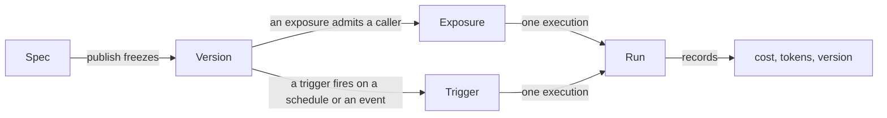

# Begriffe { #concepts }

Fünf Substantive. Alles im Produkt ist aus ihnen gebaut, und die meiste
Verwirrung darüber rührt daher, eines für ein anderes zu halten.

Wenn Sie sonst nichts auf dieser Seite lesen, lesen Sie die ersten beiden.

## Spec { #spec }

**Der Agent, als Daten.**

Instruktionen, ein Model-Profil, Capability-Bindings, Verweise auf Collections
und Skills, ein Budget und wem Bescheid zu geben ist, wenn etwas passiert.
Definiert ist er in [`app/agents/spec.py`](reference/spec.md) und von Pydantic
validiert.

Ein Agent hat genau einen *Draft*-Spec, den der Builder laufend bearbeitet und
speichert.

Der Spec hält zwei Regeln ein, und sie sind es, die ihn nützlich machen.

!!! abstract "Verweise, niemals Werte"

    Ein Spec benennt ein Model-Profil, eine Collection, eine Tool-id. Er bettet
    nie einen Model-String, einen Connection-String oder ein Secret ein.

    Das macht es unbedenklich, ihn in Ihr eigenes Repository zu committen, und
    erlaubt einer Organisation, einen Schlüssel zu rotieren, ohne einen einzigen
    Agent anzufassen.

!!! abstract "Additive Weiterentwicklung"

    Neue Felder bekommen Vorgabewerte, sodass ein heute veröffentlichter Agent
    auch nach einem Upgrade noch lädt. Ein Feld zu entfernen oder umzubenennen
    ist eine Migration, keine Bearbeitung.

!!! info "Ein Template ist ein Spec, den jemand schon geschrieben hat"

    Die [Agent-Templates](first-agent.md#3-build-the-agent), die mit der
    Plattform ausgeliefert werden, sind Specs mit allem, was ein Ordner in einem
    Image wissen kann: die Instruktionen, die Capabilities und die zu
    installierenden Skills. Sie benennen kein Model und keine Collection, denn
    das sind UUIDs, die niemand außerhalb Ihres Deployments hat — weshalb ein
    installiertes Template ein Draft ist.

## Version { #version }

**Ein eingefrorener Spec.**

Das Veröffentlichen kopiert den Draft in eine Version und richtet den Agent
darauf aus. Runs halten fest, welche Version ausgeführt wurde.

Deshalb bleibt *was hat dieser Agent letzten Dienstag getan* auch nach einem
Dutzend Bearbeitungen beantwortbar. Deshalb veröffentlicht ein Rollback auch eine
**neue** Version, kopiert aus der alten, statt Historie zu löschen — die
Zeitleiste zeigt, dass ein Rollback stattgefunden hat, statt so zu tun, als habe
es die schlechte Version nie gegeben.

### Environments { #environments }

**Environments** sind benannte Zeiger auf Versionen, und jedes sagt, ob eine
Veröffentlichung es verschieben darf.

!!! important "Veröffentlichen prägt eine Version. Sie irgendwohin zu stellen, ist eine eigene Entscheidung"

    Früher hat das Veröffentlichen das Default-Environment verschoben, welches es
    auch war, sodass das Korrigieren eines Prompts im selben Klick verändert hat,
    womit der Live-Bot antwortet — und nichts auf dem Bildschirm sagte das.

Ein Environment wartet also entweder:

- **darauf, dass etwas darauf promotet wird** — so verhält sich `production`, das
  Default; oder
- **es folgt jeder Veröffentlichung** — was ein `dev`, in dem jemand iteriert,
  meistens will.

Zwei Folgen sind erwähnenswert:

1. Die **erste** Veröffentlichung legt `production` auf der eben geprägten
   Version an, denn ein Agent ohne Environment hat überhaupt keinen Ort zum
   Laufen.
2. Ein **Rollback landet auf demselben Weg** wie eine Veröffentlichung — es *ist*
   die Veröffentlichung eines älteren Specs. Eine alte Version wieder vor Menschen
   zu stellen, ist daher ein Klick auf ihrer Verlaufszeile (promote), keine
   Nebenwirkung des Wiederherstellens des Drafts.

Ein Channel-Bot, der an ein Environment gebunden ist, bedient dessen Version.
`Agent.current_version_id` ist der Zeiger des Default-Environments, über den eine
Oberfläche auflöst, die kein Environment benennt — er bewegt sich also mit, wenn
sich dieses Environment bewegt.

!!! tip "Versionen müssen nicht alle auf einmal live gehen"

    Ein [Environment](environments.md) ist ein Name, der an eine Version geheftet
    ist, sodass `staging` Version 7 bedienen kann, während `production` auf 6
    bleibt. Veröffentlichen prägt die Version; sie irgendwohin zu stellen, ist
    eine eigene Entscheidung.

## Exposure { #exposure }

**Wo ein Agent erreichbar ist, und für wen.**

Web-Chat, ein HTTP-API-Key, ein öffentlicher Link, ein Slack- oder Telegram-Bot,
ein eingebettetes Widget.

!!! success "Jede Oberfläche geht durch einen Runner"

    Budgets, Approvals, das Audit-Protokoll und die Berechtigungsprüfungen sind
    identisch, ob ein Run aus dem Chatfenster oder aus einer Slack-Erwähnung kam,
    denn es gibt genau einen Codepfad, der einen Agent ausführt.

Bei Channels sind zwei Regeln für sich genommen erwähnenswert:

- **Ein Bot antwortet als ein Agent.** Er ist eine einzige Identität im Chat,
  also wird das Binden eines zweiten Agents an einen Bot abgelehnt, und `@slug`
  ist ein Alias für den Agent dahinter statt eine Möglichkeit, zwischen mehreren
  zu wählen.
- **Der Run wird als der Absender ausgeführt**, nie als der Bot. Eine
  unverknüpfte Chat-Identität wird abgelehnt, statt ohne Rolle ausgeführt zu
  werden, denn ein Run, für den niemand zur Rechenschaft gezogen werden kann, ist
  schlimmer als ein Run, der nicht stattgefunden hat.

## Trigger { #trigger }

**Wann ein Agent läuft, ohne dass jemand an der Tastatur sitzt.**

Wie eine Exposure ist ein Trigger operativer Zustand neben dem Agent statt Teil
des Specs. Sie fügen einen hinzu, pausieren und entfernen ihn, ohne eine Version
zu prägen, und er wird nicht in Ihr YAML exportiert — er trägt Dinge, die ein
Spec nicht kann, etwa ein Subjekt und wann er zuletzt ausgelöst hat.

### Er läuft als eine Person { #it-runs-as-a-person }

Ein ausgelöster Run wird **als das Mitglied ausgeführt, das den Trigger angelegt
hat**, bei jedem Auslösen neu aufgelöst, nie als ein erfundener Servicenutzer. Es
ist wieder die Regel der Channel-Erwähnung, aus demselben Grund.

Wenn dieses Mitglied den Agent nicht mehr ausführen darf — es hat die
Organisation verlassen, oder sein Grant darauf wurde entzogen —, **deaktiviert
sich der Trigger selbst und hält fest, warum**, statt eine Ablehnung ewig zu
wiederholen.

### Alles Weitere ist ein gewöhnlicher Run { #everything-else-is-an-ordinary-run }

Weil er durch denselben Runner geht: Das Budget wird gleich durchgesetzt, ein
Approval parkt ihn gleich, das Audit-Protokoll benennt ihn gleich.

Er ist mit der Oberfläche `schedule` gestempelt, sodass *wie wird dieser Agent
genutzt* einen unbeaufsichtigten Run von dem einer Person unterscheiden kann.
Jedes Auslösen ist ein eigener Run in Activity, und seine Antworten sammeln sich
in einer Run-Log-Unterhaltung, die der Trigger einmal eröffnet — sofort, sobald
der Trigger angelegt ist, sodass er ein anklickbarer Eintrag ist, bevor er je
ausgelöst hat.

### Zwei Arten auszulösen { #two-ways-to-fire }

=== "Ein Zeitplan"

    Löst nach der Uhr aus, in einer von zwei Formen:

    - Ein **Intervall** — "alle N Sekunden", feinstens eine Minute, da ein
      Heartbeat die fälligen einmal pro Minute abholt.
    - Ein **Cron**-Ausdruck, in UTC ausgewertet — `0 9 * * *` für 09:00 täglich,
      oder jedes andere fünfspaltige Crontab. Eine sechsspaltige Form mit einer
      Sekundenspalte wird abgelehnt: Sekunden sind eine Taktung, die der
      Heartbeat im Minutentakt nicht einhalten kann.

    Der Service berechnet für beide den nächsten Auslösezeitpunkt auf dieselbe
    Weise, und ein Run, der sein eigenes Intervall überdauert, wird vor dem
    nächsten Auslösen fertig, statt sich auf sich selbst zu stapeln.

=== "Ein Ereignis"

    Löst bei einer Ankunft aus: ein GitHub-Issue, eine eingehende E-Mail oder die
    Auffang-API-Quelle — alles, was signiertes JSON per POST senden kann, sodass
    ein Code-Schritt in Zapier oder Make, oder ein kleines Skript, alles Weitere
    abdeckt, worauf Sie auslösen wollen.

    Es kommt als signierter Webhook an, den die Plattform gegen ein
    Secret je Trigger prüft, das [im Vault versiegelt](secrets.md) ist, wird gegen
    einen optionalen Filter je Quelle abgeglichen, und dann läuft der Agent mit
    der an seinen Prompt angehängten Payload.

    Ein Ereignis hat **kein nächstes Auslösen** — nichts ist fällig, bis eine
    Zustellung eintrifft —, sodass der Heartbeat es nie sieht.

    Eine Quelle zu ergänzen ist ein Wert in einem Enum und ein Zweig in einem
    Modul. An der Zeile ändert es nichts.

### Jetzt ausführen { #run-now }

Jeder Trigger lässt sich außerdem **jetzt ausführen**: ein zusätzliches Auslösen
auf Zuruf, das seine Taktung unberührt lässt.

Es wird *angenommen* statt abgewartet. Die Anfrage antwortet, sobald das Auslösen
als eigener Flow-Run an den Worker übergeben ist — dieselbe dauerhafte Tür, durch
die ein geplantes oder zugestelltes Auslösen geht —, und der Run erscheint in der
Run-Log-Unterhaltung des Triggers, während er läuft.

So hält ein Agent, der Minuten braucht, die Anfrage des Browsers nicht offen, bis
ein Proxy aufgibt, und ein angenommenes Auslösen überlebt den API-Prozess, der es
angenommen hat.

Jeder Zeitplan und jedes Ereignis in einer Organisation wird über ihre Agents
hinweg gemeinsam aufgelistet, jeweils gefiltert auf die, die Sie ausführen dürfen
— dasselbe `agents:run` je Ressource, das auch das Anlegen absichert.

!!! tip "Im Produkt heißen sie Routines"

    Beide Familien zusammen sind **Routines**: ein Dachbegriff, den die
    Navigation, die Chat-Seitenleiste, das Onboarding und die polnische Fassung
    (*Rutyny*) gleichermaßen verwenden, sodass eine Person überall, wo das
    Feature auftaucht, einem Wort begegnet.

    Die organisationsweite Liste ist `/routines`, und das Dashboard trägt ein
    **Routines-Widget** — eine hinzufügbare Karte, die Taktung, nächstes Auslösen
    sowie Ergebnis, Kosten und Bewertung des letzten Runs jeder Routine zeigt. Die
    unbeaufsichtigte Hälfte einer Organisation ist mit demselben Blick sichtbar wie
    die beaufsichtigte.

[Trigger und Zeitpläne](triggers.md) erzählt die ganze Geschichte.

## Run { #run }

**Eine Ausführung.** Sie hat ein Subjekt, eine Version, eine Oberfläche, einen
Status, Token-Zählungen und Kosten.

**Ein Run, der fehlschlägt, hält trotzdem fest, was er ausgegeben hat.**

*Wie* er geendet hat, ist ein eigener Status statt `failed`, denn wer nach
Problemen filtert, sollte nicht durch korrekt arbeitende Plattform waten müssen:

| Status | Der Run |
|---|---|
| `failed` | ist kaputtgegangen |
| `budget_exceeded` | hat eine Obergrenze erreicht — ein Ausgabenlimit, das seine Arbeit tut |
| `guardrail_blocked` | wurde von einem [Guardrail](reference/capabilities.md#guardrails) abgelehnt |
| `cancelled` | wurde gestoppt: die Stopp-Schaltfläche im Composer, ein weggefallener Socket, eine von oben abgebrochene Delegation. Auf jeder Oberfläche, nicht nur der streamenden |
| `awaiting_approval` | ist auf einem Approval geparkt und ist **fortsetzbar** — sein Nachrichtenverlauf ist gespeichert, sodass die Entscheidung für die Unterhaltung gilt, zu der sie gehört |

Ein Run, der *innerhalb einer Delegation* parkt, speichert eine Ebene je Agent,
jede mit ihrer eigenen Unterhaltung, sodass ein Approval den stehengebliebenen
Delegierten fortsetzt, statt seine Arbeit neu zu beginnen.

!!! note "Ein Run kann einen anderen Run enthalten"

    Eine Delegation bekommt eine eigene Zeile in `agent_runs` mit
    `parent_run_id`, sodass *was hat der Rechercheur diesen Monat gekostet* eine
    Antwort hat — während beide ein Spend-Ledger teilen.

    Es gibt bewusst keinen Status `delegated`. `parent_run_id` beantwortet "wie
    hat dieser Run begonnen"; der Status beantwortet "wie hat er geendet". Zwei
    Fragen.

### Ein Run und sein Transkript { #a-run-and-its-transcript }

Ein Run sagt, was er gekostet hat. `messages.run_id` sagt, was er *getan* hat.

Jeder Zug, den ein Run erzeugt hat, trägt die id des Runs, sodass "die Schritte
dieses Runs" eine Abfrage statt einer Vermutung ist — was ein Aufriss aus der
Run-Historie über `GET /runs/{id}/transcript` liest.

Dieser Lesezugriff ist **autorisiert, nicht besessen**. Eine Kollegin mit
`runs:view` liest einen Run, den jemand anders gestartet hat, denn ein Run gehört
der Organisation und nicht dem, der ihn gestartet hat. Der Run eines anderen
Mandanten liest sich als abwesend — dasselbe 404, mit dem eine unbekannte id
antwortet — und ein Run, der ohne Unterhaltung lief, sagt das mit einer
`conversation_id` von null statt mit einer leeren Liste.

Es ist eine eigene Route und kein Filter auf dem Unterhaltungs-Endpunkt, sodass
dieser Endpunkt selbst auf den Eigentümer beschränkt bleibt. Siehe
[Governance](governance.md#what-run-history-shows).

`?scope=conversation` weitet denselben Lesezugriff auf den ganzen Strang aus, in
dem der Run sitzt, für eine Detailansicht, die den Run im Zusammenhang zeigt und
zu ihm scrollt. Das ist eine Bequemlichkeit und kein Übergriff: Jeder Zug, den
ein Run schreibt, trägt seine `run_id` — die Frage des Nutzers eingeschlossen —,
sodass ein Inhaber von `runs:view` den Strang ohnehin durch Iterieren über die
Transkripte seiner Runs zusammensetzen könnte. Der Detail-Lesezugriff trägt
außerdem `prev_run_id` / `next_run_id`, die Runs beiderseits *in derselben
Unterhaltung*, sodass das Durchschreiten eines Strangs zwei Pfeile statt Wege
zurück zur Liste sind.

!!! warning "Die Verknüpfung ist eine Spalte, kein Zeitfenster — und das ist Absicht"

    Zwei Runs, die in einer Unterhaltung gestartet wurden, verschränken sich.
    Nachrichten zwischen `started_at` und `ended_at` zu fenstern liefert die Züge
    des ersten Runs *und* die des zweiten, und ein Run ohne `ended_at` —
    abgebrochen oder noch laufend — liefert überhaupt nichts.

    Beides ist falsch auf eine Weise, die der Leser nicht sehen kann.

Der Prompt wird geschrieben, *bevor* die Run-Zeile existiert, denn ein Aufbau,
der abgelehnt wird — ein gelöschtes Secret, ein bei einem Deploy entferntes
Model-Profil —, darf nicht verlieren, was jemand getippt hat. Er wird verknüpft,
sobald es einen Run gibt, mit dem er zu verknüpfen ist.

Einen Run zu löschen setzt die Spalte auf null, statt die Züge zu löschen: Die
Worte sind trotzdem gesagt worden, und die Unterhaltung ist der Ort, an dem
jemand sie liest.

Einen Zug zu verknüpfen ist nicht dasselbe wie ihn zu schreiben, und was jede
Oberfläche tatsächlich schreibt, ist eine eigene Frage, die diese Spalte nicht
beantworten kann, da sie bereits vorhandene Zeilen verknüpft. Die nicht
streamenden Oberflächen werden vom Runner geschrieben statt von sich selbst, was
sie einheitlich gemacht hat; die Ausnahmen stehen unter
[Oberflächen](channels.md#what-each-surface-records).

Die Run-Historie filtert auf genau das. `GET /runs` nimmt eine kommagetrennte
Liste von Status entgegen (`?status=failed,budget_exceeded`), denn die Frage des
Betreibers ist eine *Menge* von Ausgängen statt ein Status nach dem anderen. Ein
unbekannter Status wird abgelehnt, statt stillschweigend auf nichts zu passen —
eine leere Seite muss "keine solchen Runs" bedeuten.

### Ein Run und das, was er dem Model übergeben hat { #a-run-and-what-it-handed-the-model }

Das Transkript sagt, was gefragt wurde und was zurückkam. Es sagt nicht, was dem
Model **gegeben** wurde — welcher Prompt, welche Tools, wie beschrieben, unter
welchen Einstellungen —, und nichts davon lässt sich hinterher herleiten.

Was dem Model gesagt wurde, sind die Instruktionen des Specs plus die der
Plattform, plus was ein Channel-Binding angehängt hat, plus die gebundenen
Skills, plus der jeweils
[System-Reminder](reference/capabilities.md), der bei dieser Anfrage gegriffen
hat. Was es aufrufen konnte, ist die Capability-Registry plus die MCP-Server der
Organisation, minus dessen, was die [Tool-Suche](mcp.md) verborgen hat.

Das aus dem gespeicherten Spec zu rekonstruieren wäre eine zweite
Implementierung des Builders, und eine zweite Implementierung ist etwas, das der
ersten widerspricht.

Es wird also **aufgezeichnet statt rekonstruiert.** Das Model, auf dem der Agent
läuft, ist umhüllt, und jede Anfrage wird beim Durchlaufen mitgeschrieben:

- die Instruktionen und die System-Teile;
- jede Tool-Definition genau so, wie sie dem Provider übergeben wurde;
- die Einstellungen, die gesendet wurden;
- ein Eintrag je Anfrage mit ihrer Dauer, ihren Tokens und dem, was sie als
  Nächstes aufrufen wollte;
- die vollständige Nachrichtenliste der letzten Anfrage.

Was gespeichert ist, ist demnach das, was gesendet wurde.

`GET /runs/{id}/manifest` liest es zurück, autorisiert wie das Transkript —
Existenz zuerst gegen Ihre Organisation aufgelöst, dann `runs:view`.

!!! danger "Zwei Dinge, die es bewusst nicht tut"

    Es zeichnet nie Provider-Passthrough auf (`extra_headers`, `extra_body`),
    denn dort reitet ein Provider-Credential mit, und [der Vault](secrets.md) ist
    der einzige Ort, an dem ein Secret aufbewahrt wird.

    Und ein Run, der nie ein Model erreicht hat — von einem Budget gestoppt, auf
    dem Weg hinein von einem Guardrail blockiert —, zeichnet nichts auf und
    antwortet 404, denn ein leeres Dokument würde behaupten, dem Agent seien kein
    Prompt und keine Tools gegeben worden.

Eine Aufzeichnung, die zu groß zum Aufbewahren ist, wird **gekürzt statt
abgelehnt**, und sagt das. In Stufen, jede davon gemessen: Zuerst gehen die
Nachrichten, dann die Argumentschemata der Tools, dann die Tool-Beschreibungen
und zuletzt der Prompt selbst. Die letzten beiden werden auf eine
wiedererkennbare Länge gestutzt statt weggelassen, denn die eigenen Instruktionen
eines Agents und die Beschreibung eines entfernten MCP-Tools sind unbegrenzt und
sind das, was eine Aufzeichnung übergroß macht, sobald Nachrichten und Schemata
weg sind.

Was alles überlebt, was auch geschieht, sind die Einstellungen und der
Anfragen-Wasserfall.

Eine Anfrage, die **fehlgeschlagen** ist, ist ein Eintrag in diesem Wasserfall
wie jeder andere, gestreamt oder nicht. Sie trägt die Klasse der Ausnahme und nie
deren Meldung, denn ein Provider-SDK schreibt die fehlschlagende URL — und damit
einen Schlüssel in ihrem Query-String — in diesen String.

---

## Drei weitere, weil sie leicht zu verwechseln sind { #three-more-because-they-are-easy-to-confuse }

### Capability gegen Tool { #capability-vs-tool }

Eine **Capability** ist eine Einheit, die jemand gewährt: `knowledge`,
`web_research`, `code_execution`. Sie kann mehrere **Tools** beisteuern, und sie
trägt die Konfiguration und die Approval-Richtlinie.

Ein Approval löst vom Spezifischsten her auf:

1. die eigene Übersteuerung des Tools, dann
2. der Modus der Capability, dann
3. ob die Capability `side_effecting` ist.

Der Builder nennt das *Ergebnis* in Worten, statt die Regel zu beschreiben, denn
eine Regel, die der Leser im Kopf durchrechnen muss, ist eine Einstellung, die
niemand anzufassen wagt.

Siehe den [Capability-Katalog](reference/capabilities.md) für das, was
mitgeliefert wird, und [Eine Capability ergänzen](howto/add-capability.md) für
eine neue.

!!! note "MCP-Tools sind die Ausnahme von allem oben Genannten"

    Tools, die von einem [MCP-Server](mcp.md) kommen, werden zur Laufzeit
    entdeckt, sodass nichts sie deklariert hat und nichts sie absichert.

### Collection gegen Skill { #collection-vs-skill }

Eine **Collection** sind Dokumente, gechunkt und eingebettet, und sie wird
*durchsucht*. Das Model wählt, wonach es sucht; es kann nie ausweiten, wo es
sucht.

Ein **Skill** ist ein Ordner voller Markdown — eine `SKILL.md` und was sonst
dazugehört — und er wird *gelesen*. Seine Beschreibung ist der einzige Teil, den
das Model sieht, bevor es entscheidet, ob es ihn öffnet, weshalb die Beschreibung
eines Skills sagen sollte, **wann er zutrifft**, statt was darin steht.

Der praktische Unterschied: Retrieval kostet einen Embedding-Aufruf je Suche und
liefert Fragmente. Ein Skill kostet nichts, bis er geöffnet wird, und liefert
dann das ganze Dokument.

Siehe [Skills](skills.md) für das Format und den vollständigen Vergleich.

### Delegate gegen Inline-Spezialist { #delegate-vs-inline-specialist }

Ein Agent kann einen Teil einer Aufgabe an einen anderen Agent abgeben. Es gibt
zwei Arten zu sagen, wer dieser andere Agent ist, sie sehen im Vokabular des
Builders gleich aus, und fast alles, worauf es bei Delegation ankommt, folgt
daraus, welche Sie gewählt haben.

Ein **Delegate** ist ein anderer veröffentlichter Agent der Organisation,
referenziert über `agent_id` *und* `agent_version_id` — gepinnt. Er wird über
seinen Slug angesprochen, dieselbe Kennung, die eine Channel-Erwähnung auflöst.

Ein **Inline-Spezialist** ist innerhalb des Specs des Eltern-Agents definiert:
ein Name, eine Beschreibung, die das Model des Elternteils vor dem Delegieren
liest, Instruktionen und — weil ein Zusammenfasser, der die Collection nicht
lesen kann, nutzlos ist — sein eigenes Model, seine eigenen Capabilities, seine
eigenen Collections und Skills und sein eigenes Schrittlimit.

Das macht einen Spezialisten in jeder Hinsicht bis auf eine zu einem Agent. Vier
Dinge machen hier etwas zu einem Agent:

| | Ein veröffentlichter Delegate | Ein Inline-Spezialist |
|---|---|---|
| **Versioniert** | ja — gepinnt, und ein Pin bewegt sich nur, wenn jemand ihn bewegt | **nein** |
| **Bei der Veröffentlichung berechtigungsgeprüft** | ja — `agents:run` auf dieser Zeile | ja — dieselben Prüfungen von Scope, Secret, Collection und Skill wie bei den eigenen Bindings des Elternteils |
| **Eigene Capabilities** | ja — die seines veröffentlichten Specs | ja — seine eigenen, plus das, was das Elternteil teilt |
| **Gemessen und gedeckelt** | ja | ja — durch die Obergrenzen des Runs, was [innerhalb jeder Delegation bindet](governance.md#delegation-spends-the-parents-budget) |

**Die fehlende ist die Version**, und alles, was ein Spezialist nicht kann, folgt
daraus: Nichts sonst kann ihn referenzieren, das Bearbeiten des Elternteils
verändert ihn, er bekommt keine eigene Run-Zeile, und er kann nicht weiter
delegieren.

Ein veröffentlichter Delegate ist überprüfbar und exportierbar. Ein Spezialist
ist ein Absatz im Spec eines anderen.

Nehmen Sie also einen Spezialisten für Arbeit, die keine Veröffentlichung eines
Agents verlangen sollte — "fasse das in drei Stichpunkten zusammen" —, und einen
Delegate für eine Fähigkeit, die die Organisation besitzt und wiederverwendet.

#### Dynamische Spezialisten, und der Weg heraus { #dynamic-specialists-and-the-way-out }

Unterhalb des Inline-Spezialisten sitzt eine dritte Art: ein **dynamischer
Spezialist**, zur Laufzeit vom Model erfunden unter
[`allow_dynamic`](reference/capabilities.md#delegation).

Er ist ein Spezialist, der nicht einmal im Spec eines Elternteils steht, und er
wird nirgends persistiert — einen aufzubewahren hieße, einen Agent zu
veröffentlichen, und das Veröffentlichen ist die Handlung einer Person.

Diese Regel ist eine Gestaltungsentscheidung statt einer Einschränkung, und was
sie dazu macht, ist der Ausgang: Eine Person kann einen Spezialisten zu einem
Draft-Agent **promoten**.

Das Promoten funktioniert bei einem Inline-Spezialisten im Builder und bei einem
dynamischen aus dem Delegations-Panel des Chats, solange der Run, der ihn
erzeugt hat, noch auf dem Bildschirm ist — das einzige Fenster, in dem die
Definition eines dynamischen Spezialisten lesbar ist, da sie auf dem
Eröffnungsframe der Delegation mitreitet und nach dem Zug nichts sie speichert.

Es erzeugt einen gewöhnlichen Draft aus Instruktionen, Model, Capabilities,
Collections und Skills des Spezialisten, im Besitz dessen, der ihn promotet hat,
und der üblichen Prüfung auf `agents:edit` unterworfen. Und dort hört es auf: Es
veröffentlicht nicht, pinnt den neuen Agent nicht als Delegate seines Elternteils
und entfernt den Spezialisten nicht, aus dem er stammt. Jedes davon ist die
nächste Entscheidung, mit der üblichen Validierung davor.

Ohne diesen Ausgang war die einzige Art, einen guten Spezialisten zu behalten,
seine Instruktionen aus einem Chatprotokoll herauszukopieren — was einen Agent
erzeugt, dessen Herkunft niemand sehen kann, genau jenes Ergebnis eines
ungeführten Agents, das die Persistenzregel verhindern soll.

!!! important "Ein Begriff von 'Agent', rekursiv verwendet"

    Das Risiko, zu dessen Eindämmung diese Form existiert, ist ein *zweiter*,
    paralleler Begriff von Agent — einer, den die Validierung beim
    Veröffentlichen nicht abläuft und den das Berechtigungsmodell nicht sehen
    kann. Ein Spezialist wäre der naheliegende Ort dafür gewesen: Er sieht nicht
    aus wie ein Agent, was genau der Grund ist, warum er der verlockende Ort ist,
    um eine Collection zu erreichen, die niemand geteilt hat, oder eine
    Capability, die niemand gewährt hat.

    Eingedämmt wird es dadurch, dass kein zweites Format geschrieben wird. Ein
    Spezialist ist eine typisierte *Teilmenge* des Specs, nutzt dieselben
    Capability-Bindings, wird vom selben rekursiven Veröffentlichungsdurchlauf
    geprüft und vom selben Builder zusammengesetzt. Ein Spec-Typ, ein Validator,
    ein Builder, eine Builder-Komponente — jedes rekursiv verwendet. Wenn eines
    davon eine zweite Kopie für Spezialisten bekommt, ist die Kopie der Fehler.

**Ein Pin schlägt laut fehl, statt zu driften.** Ein Delegate, dessen gepinnte
Version nicht mehr existiert, lässt den Run fehlschlagen und benennt den
Delegate. Es gibt bewusst kein Zurückfallen auf seine aktuelle Version: Der Grund
zu pinnen ist, dass sich ohne Entscheidung nichts ändert, und ein stilles Upgrade
ist schlimmer als eine Ablehnung, weil niemand es erfährt.

Bezahlt wird das im Builder, der jeden Pin mit dem vergleicht, was der Delegate
jetzt veröffentlicht, und anbietet, ihn weiterzusetzen.

Siehe die [`subagents`-Capability](reference/capabilities.md#delegation) für die
Obergrenzen und die Tools, und
[Berechtigungen](permissions.md#delegation-is-not-a-privilege-boundary) dafür,
wer an was delegieren darf.

---

## Model-Profile { #model-profiles }

Ein **Model-Profil** ist ein benanntes Model, hinterlegt mit einem gespeicherten
Schlüssel: `openai default`, `OpenRouter prod`. Agents zeigen auf Profile, nie
auf Model-Strings.

Diese Indirektion ist der Sinn der Sache. Einen Schlüssel zu rotieren oder jeden
Agent von einem Model auf ein anderes zu bewegen, ist eine Änderung an einem
Profil statt an vierzig Specs.

Ein Profil ohne Credential dahinter ist überall, wo es erscheint, mit `no key`
markiert, denn das ist die eine Tatsache, die darüber entscheidet, ob der Agent
überhaupt laufen kann.

Die Preise kommen von
[`genai-prices`](https://github.com/pydantic/genai-prices), das Pydantic pflegt,
statt aus einer Tabelle in diesem Repository — eine handgepflegte Tabelle kann
gestaffelte Preise nicht ausdrücken und veraltet stillschweigend. Ein Model, das
das Paket nicht kennt, wird mit einer Warnung zu null erfasst, und die Summe des
Runs wird als Untergrenze gekennzeichnet, statt geraten zu werden.

Siehe [Models und Provider](models.md) für die siebenundzwanzig Provider, das
Credential, das jeder von ihnen will, und das Verhalten von Fallbacks.

## Organisationen { #organizations }

Jede Ressource ist unter einer Organisation abgelegt.

Die Isolation wird vom **Schema** durchgesetzt — `NOT NULL`-Spalten,
Check-Constraints, je Mandant gefasste Unique-Constraints — statt nur von der
Service-Schicht, sodass eine vergessene `WHERE`-Klausel eine Constraint-Verletzung
ist statt eines Datenlecks.

Der Vault geht weiter: Der Chiffretext eines Secrets ist an die Organisation
gebunden, die es gespeichert hat, sodass eine zwischen Mandanten kopierte Zeile
nicht entschlüsselt werden kann.

## Zusammenfassung { #recap }

- Ein **Spec** ist der Agent als Daten, er hält Verweise und nie Werte.
- **Veröffentlichen** friert ihn zu einer **Version** ein, und ein *Environment*
  ist eine eigene Entscheidung darüber, welcher Version Menschen begegnen.
- Eine **Exposure** ist, wo er erreichbar ist; ein **Trigger** ist, wann er
  läuft, ohne dass jemand zusieht. Beides ist operativer Zustand neben dem Spec,
  nicht darin.
- Ein **Run** ist eine Ausführung, und er hält fest, was er gekostet hat, auch
  wenn er fehlgeschlagen ist.
- Jede Oberfläche, jeder Trigger und jede Delegation geht durch **einen Runner**,
  weshalb Governance nichts ist, worum ein Aufrufer herumrouten kann.

## Weiter { #next }

- :material-account-key:{ .lg .middle } **[Berechtigungen](permissions.md)**

    Rollen, Scopes und Grants.

- :material-shield-check:{ .lg .middle } **[Governance](governance.md)**

    Budgets, Approvals, Alarme, Audit.

- :material-toolbox:{ .lg .middle } **[Capabilities](reference/capabilities.md)**

    Was einem Agent gegeben werden kann.

- :material-connection:{ .lg .middle } **[MCP](mcp.md)**

    Die Tools, die hier niemand schreiben muss.

Außerdem: [Models](models.md) für Provider und Kosten, [Secrets](secrets.md)
dafür, warum ein Chiffretext den Mandanten nicht wechseln kann, und
[Architektur](architecture.md) dafür, wie der Code angeordnet ist.
