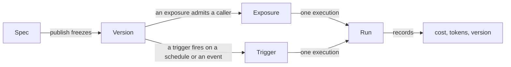

# Conceptos { #concepts }

Cinco sustantivos. Todo lo que hay en el producto está construido con ellos, y
casi toda la confusión sobre él viene de tomar uno por otro.

Si no lees nada más de esta página, lee los dos primeros.

## Spec { #spec }

**El agent, como datos.**

Instrucciones, un perfil de modelo, bindings de capabilities, referencias a
colecciones y skills, un budget, y a quién avisar cuando pasa algo. Está definido
en [`app/agents/spec.py`](reference/spec.md) y lo valida Pydantic.

Un agent tiene exactamente un spec *borrador*, que el Builder edita y guarda de
forma continua.

El spec cumple dos reglas, y son las que lo hacen útil.

!!! abstract "Referencias, nunca valores"

    Un spec nombra un perfil de modelo, una colección, el id de una tool. Nunca
    empotra una cadena de modelo, una cadena de conexión ni un secreto.

    Eso es lo que hace seguro subirlo a tu propio repositorio, y lo que permite a
    una organización rotar una clave sin tocar un solo agent.

!!! abstract "Evolución aditiva"

    Los campos nuevos llevan valores por defecto, así que un agent publicado hoy
    sigue cargando después de una actualización. Quitar o renombrar un campo es
    una migración, no una edición.

!!! info "Una plantilla es un spec que ya escribió alguien"

    Las [plantillas de agent](first-agent.md#3-build-the-agent) que vienen con la
    plataforma son specs con todo lo que una carpeta dentro de una imagen puede
    saber: las instrucciones, las capabilities y los skills que hay que instalar.
    No nombran ni modelo ni colección, porque esos son UUIDs que nadie fuera de
    tu despliegue tiene - que es por lo que una plantilla instalada es un
    borrador.

## Versión { #version }

**Un spec congelado.**

Publicar copia el borrador en una versión y apunta el agent a ella. Los runs
registran qué versión se ejecutó.

Por eso *qué hizo este agent el martes pasado* sigue teniendo respuesta después
de una docena de ediciones. Y también por eso un rollback publica una **nueva**
versión copiada de la antigua en lugar de borrar historial — la línea de tiempo
muestra que hubo un rollback, en vez de fingir que la versión mala nunca existió.

### Entornos { #environments }

Los **entornos** son punteros con nombre hacia versiones, y cada uno dice si una
publicación puede moverlo.

!!! important "Publicar acuña una versión. Ponerla en algún sitio es otra decisión"

    Publicar solía reapuntar el entorno por defecto fuera cual fuera, así que
    arreglar un prompt cambiaba lo que respondía el bot en vivo, en el mismo
    clic, sin que nada en pantalla lo dijera.

Así que un entorno o bien:

- **espera a que asciendan algo a él** — que es lo que hace `production`, el
  entorno por defecto; o
- **sigue cada publicación** — que es lo que suele querer un `dev` en el que
  alguien está iterando.

Dos consecuencias que vale la pena enunciar:

1. La **primera** publicación crea `production` sobre la versión que acaba de
   acuñar, porque un agent sin entorno no tiene dónde ejecutarse.
2. Un **rollback aterriza igual** que una publicación — *es* una publicación de
   un spec más antiguo. Así que volver a poner una versión antigua delante de la
   gente es un clic en su fila del historial (promover), no un efecto colateral
   de restaurar el borrador.

Un bot de canal atado a un entorno sirve la versión de ese entorno.
`Agent.current_version_id` es el puntero del entorno por defecto, que es lo que
resuelve una superficie que no nombra ningún entorno — así que se mueve cuando
ese entorno se mueve.

!!! tip "Las versiones no tienen que salir todas a la vez"

    Un [entorno](environments.md) es un nombre fijado a una versión, así que
    `staging` puede servir la versión 7 mientras `production` se queda en la 6.
    Publicar acuña la versión; ponerla en algún sitio es otra decisión.

## Exposición { #exposure }

**Dónde se puede alcanzar un agent, y quién.**

Chat web, una clave de API HTTP, un enlace público, un bot de Slack o Telegram,
un widget embebido.

!!! success "Todas las superficies pasan por un único runner"

    Los budgets, las aprobaciones, el rastro de auditoría y las comprobaciones de
    permisos son idénticos venga el run de la ventana de chat o de una mención en
    Slack, porque hay exactamente un camino de código que ejecuta un agent.

Los canales tienen dos reglas que merecen enunciarse aparte:

- **Un bot responde como un solo agent.** Es una única identidad en el chat, así
  que atar un segundo agent a un bot se rechaza, y `@slug` es un alias del agent
  que hay detrás y no una forma de elegir entre varios.
- **El run se ejecuta como quien envía**, nunca como el bot. Una identidad de
  chat sin vincular se rechaza en vez de ejecutarse sin rol, porque un run del
  que nadie responde es peor que un run que no ocurrió.

## Trigger { #trigger }

**Cuándo se ejecuta un agent sin nadie al teclado.**

Igual que una exposición, un trigger es estado operativo junto al agent y no
parte del spec. Lo añades, lo pausas y lo quitas sin acuñar una versión, y no se
exporta en tu YAML — lleva cosas que un spec no puede llevar, como un sujeto y
cuándo se disparó por última vez.

### Se ejecuta como una persona { #it-runs-as-a-person }

Un run disparado se ejecuta **como el miembro que creó el trigger**, resuelto de
nuevo en cada disparo, nunca como un usuario de servicio inventado. Es otra vez
la regla de la mención en un canal, por la misma razón.

Cuando ese miembro ya no puede ejecutar el agent — dejó la organización, o se le
revocó su grant sobre él — el trigger **se desactiva a sí mismo y registra por
qué**, en vez de reintentar un rechazo eternamente.

### Todo lo demás es un run corriente { #everything-else-is-an-ordinary-run }

Porque pasa por el mismo runner: el budget se aplica igual, una aprobación lo
aparca igual, el rastro de auditoría lo nombra igual.

Lleva estampada la superficie `schedule`, así que *cómo se usa este agent* puede
distinguir un run desatendido del de una persona. Cada disparo es su propio run
en Activity, y sus respuestas se acumulan en una única conversación de registro
que el trigger abre una vez — de forma anticipada, en el momento en que se crea
el trigger, así que es un elemento en el que puedes pulsar antes de que se haya
disparado nunca.

### Dos formas de disparar { #two-ways-to-fire }

=== "Un horario"

    Dispara según el reloj, con una de dos formas:

    - Un **intervalo** — "cada N segundos", con el minuto como grano más fino, ya
      que un heartbeat reclama los vencidos una vez por minuto.
    - Una expresión **cron** evaluada en UTC — `0 9 * * *` para las 09:00 de cada
      día, o cualquier crontab de cinco campos. Una forma de seis campos con
      columna de segundos se rechaza: los segundos son una cadencia que el
      heartbeat de una vez por minuto no puede honrar.

    El servicio calcula el siguiente disparo de cada uno de la misma manera, y un
    run que sobrevive a su propio intervalo termina antes del siguiente disparo
    en lugar de apilarse sobre sí mismo.

=== "Un evento"

    Dispara ante una llegada: una issue de GitHub, un correo entrante, o la
    fuente API comodín — cualquier cosa capaz de hacer POST de JSON firmado, así
    que un paso de código de Zapier o Make, o un script pequeño, cubre lo demás
    con lo que quieras disparar.

    Llega como un webhook firmado que la plataforma verifica contra un secreto
    por trigger [sellado en el vault](secrets.md), se contrasta con un filtro
    opcional por fuente, y entonces el agent se ejecuta con el payload añadido a
    su prompt.

    Un evento **no tiene siguiente disparo** — nada vence hasta que aterriza una
    entrega — así que el heartbeat nunca lo ve.

    Añadir una fuente es un valor en un enum y una rama en un módulo. No cambia
    nada en la fila.

### Run now { #run-now }

Cualquier trigger puede además **ejecutarse ahora**: un disparo extra bajo
demanda que deja su cadencia intacta.

Se *acepta* en lugar de esperarse. La petición responde en cuanto el disparo se
le entrega al worker como su propio flow run — la misma puerta durable por la que
pasa un disparo programado o entregado — y el run aparece en la conversación de
registro del trigger según ocurre.

Así que un agent que tarda minutos no mantiene abierta la petición del navegador
hasta que un proxy se rinde con ella, y un disparo aceptado sobrevive al proceso
de API que lo aceptó.

Cada horario y cada evento de una organización se listan juntos a lo largo de sus
agents, cada uno filtrado a los que puedes ejecutar — el mismo `agents:run` por
recurso que controla crear uno.

!!! tip "En el producto se llaman Routines"

    Las dos familias juntas son **Routines**: un único nombre paraguas que usan
    la navegación, la barra lateral del chat, el onboarding y la copia polaca
    (*Rutyny*), para que una persona se encuentre una sola palabra allá donde
    aparezca la funcionalidad.

    La lista de toda la organización es `/routines`, y el dashboard lleva un
    **widget Routines** — una tarjeta añadible que muestra la cadencia de cada
    routine, su siguiente disparo, y el resultado, el coste y la valoración del
    último run. La mitad desatendida de una organización se ve de la misma
    ojeada que la atendida.

[Triggers y horarios](triggers.md) cuenta la historia entera.

## Run { #run }

**Una ejecución.** Tiene un sujeto, una versión, una superficie, un estado,
recuentos de tokens y un coste.

**Un run que falla registra igualmente lo que gastó.**

*Cómo* terminó es un estado propio en lugar de `failed`, porque un operador que
filtra buscando problemas no debería tener que vadear la plataforma funcionando
correctamente:

| Estado | El run |
|---|---|
| `failed` | se rompió |
| `budget_exceeded` | alcanzó un tope — un límite de gasto haciendo su trabajo |
| `guardrail_blocked` | lo rechazó un [guardrail](reference/capabilities.md#guardrails) |
| `cancelled` | se detuvo: el botón de parar del compositor, un socket que se fue, una delegación cancelada desde arriba. En todas las superficies, no solo en la de streaming |
| `awaiting_approval` | quedó aparcado en una aprobación, y es **reanudable** — su historial de mensajes está guardado, así que la decisión se aplica a la conversación a la que pertenece |

Un run que se aparca *dentro de una delegación* guarda un nivel por agent, cada
uno con su propia conversación, así que aprobar continúa el delegado que se paró
en vez de empezar su trabajo otra vez.

!!! note "Un run puede contener otro run"

    Una delegación obtiene su propia fila en `agent_runs` con `parent_run_id`,
    así que *cuánto costó el investigador este mes* tiene respuesta — mientras
    ambos comparten un único libro de gasto.

    Deliberadamente no hay un estado `delegated`. `parent_run_id` responde "cómo
    empezó este run"; el estado responde "cómo terminó". Dos preguntas.

### Un run y su transcripción { #a-run-and-its-transcript }

Un run dice lo que costó. `messages.run_id` dice lo que *hizo*.

Cada turno que produjo un run lleva el id del run, así que "los pasos de este
run" es una consulta y no una conjetura — que es lo que lee, a través de
`GET /runs/{id}/transcript`, un desglose desde el historial de runs.

Esa lectura está **autorizada, no poseída**. Un colega con `runs:view` lee un run
que empezó otra persona, porque un run pertenece a la organización y no a quien
lo lanzó. El run de otro tenant se lee como ausente — el mismo 404 con el que
responde un id desconocido — y un run que se ejecutó sin conversación lo dice con
un `conversation_id` nulo en vez de con una lista vacía.

Es una ruta propia y no un filtro sobre el endpoint de conversaciones, así que el
endpoint de conversaciones sigue acotado a su propietario. Mira
[Governance](governance.md#what-run-history-shows).

`?scope=conversation` amplía esa misma lectura a todo el hilo en el que está el
run, para una vista de detalle que muestra el run en contexto y se desplaza hasta
él. Es una comodidad y no un alcance mayor: cada turno que escribe un run lleva
su `run_id` — la pregunta del usuario incluida — así que quien tenga `runs:view`
ya podía armar el hilo iterando las transcripciones de sus runs. La lectura de
detalle lleva además `prev_run_id` / `next_run_id`, los runs a uno y otro lado
*en la misma conversación*, así que recorrer un hilo son dos flechas en vez de
viajes de vuelta a la lista.

!!! warning "El enlace es una columna, no una ventana de tiempo — y es deliberado"

    Dos runs empezados en una conversación se entrelazan. Ventanear los mensajes
    entre `started_at` y `ended_at` devuelve los turnos del primer run *y* los
    del segundo, y un run sin `ended_at` — cancelado, o todavía en marcha — no
    devuelve nada en absoluto.

    Las dos cosas están mal de una forma que quien lee no puede ver.

El prompt se escribe *antes* de que exista la fila del run, porque una
construcción que se rechaza — un secreto borrado, un perfil de modelo quitado en
un despliegue — no debe perder lo que alguien tecleó. Se enlaza en cuanto hay un
run al que enlazarlo.

Borrar un run pone la columna a nulo en lugar de borrar los turnos: las palabras
se dijeron igualmente, y la conversación es donde alguien las lee.

Enlazar un turno no es lo mismo que escribirlo, y qué escribe de verdad cada
superficie es una pregunta aparte que esta columna no puede responder, ya que
enlaza filas que ya existen. Las superficies sin streaming las escribe el runner
en vez de escribirse ellas mismas, que es lo que las hizo uniformes; las
excepciones están en [Superficies](channels.md#what-each-surface-records).

El historial de runs filtra exactamente por esto. `GET /runs` acepta una lista de
estados separados por comas (`?status=failed,budget_exceeded`), porque la
pregunta del operador es un *conjunto* de resultados y no un estado cada vez. Un
estado desconocido se rechaza en lugar de no coincidir con nada en silencio — una
página vacía tiene que significar "no hay tales runs".

### Un run y lo que le entregó al modelo { #a-run-and-what-it-handed-the-model }

La transcripción dice qué se preguntó y qué volvió. No dice qué se le **dio** al
modelo — qué prompt, qué tools, descritas cómo, bajo qué ajustes — y nada de eso
es derivable después.

Lo que se le dijo al modelo son las instrucciones del spec más las de la
plataforma, más lo que añadiera un binding de canal, más los skills atados, más
el [recordatorio de sistema](reference/capabilities.md) que se disparara en esa
petición. Lo que podía llamar es el registro de capabilities más los servidores
MCP de la organización, menos lo que escondiera la [búsqueda de tools](mcp.md).

Reconstruir eso a partir del spec guardado sería una segunda implementación del
builder, y una segunda implementación es algo que acaba discrepando de la
primera.

Así que se **registra en lugar de reconstruirse.** El modelo sobre el que se
ejecuta el agent va envuelto, y cada petición se anota tal como pasa:

- las instrucciones y las partes de sistema;
- cada definición de tool exactamente como se le entregó al provider;
- los ajustes que se enviaron;
- una entrada por petición con su duración, sus tokens y lo que pidió llamar a
  continuación;
- la lista completa de mensajes de la última petición.

Lo que se guarda es, por tanto, lo que se envió.

`GET /runs/{id}/manifest` lo lee de vuelta, autorizado igual que la
transcripción — la existencia se resuelve primero contra tu organización, y
después `runs:view`.

!!! danger "Dos cosas que deliberadamente no hace"

    Nunca registra el passthrough del provider (`extra_headers`, `extra_body`),
    porque ahí es donde viaja una credencial de provider y
    [el vault](secrets.md) es el único sitio donde se guarda un secreto.

    Y un run que nunca llegó a un modelo — parado por un budget, bloqueado por un
    guardrail a la entrada — no registra nada y responde 404, porque un documento
    vacío afirmaría que al agent no se le dio ni prompt ni tools.

Un registro demasiado grande para guardarse se **recorta en vez de rechazarse**,
y lo dice. Por etapas, cada una medida: primero se van los mensajes, luego los
esquemas de argumentos de las tools, luego las descripciones de las tools, y por
último el prompt mismo. Esos dos se cortan a una longitud reconocible en lugar de
tirarse, porque las instrucciones propias de un agent y la descripción de una
tool de un MCP remoto no tienen cota, y son lo que hace que un registro se pase
de tamaño una vez que ya no están ni los mensajes ni los esquemas.

Lo que sobrevive pase lo que pase son los ajustes y la cascada de peticiones.

Una petición que **falló** es una entrada más de esa cascada, con streaming o sin
él. Lleva la clase de la excepción y nunca su mensaje, ya que el SDK de un
provider pone la URL que falla — y por tanto una clave en su query string — en
esa cadena.

---

## Tres más, porque se confunden con facilidad { #three-more-because-they-are-easy-to-confuse }

### Capability vs. tool { #capability-vs-tool }

Una **capability** es una unidad que alguien concede: `knowledge`,
`web_research`, `code_execution`. Puede aportar varias **tools**, y lleva consigo
la configuración y la política de aprobación.

La aprobación se resuelve de lo más específico a lo menos:

1. el override de la propia tool, luego
2. el modo de la capability, luego
3. si la capability es `side_effecting`.

El Builder enuncia el *resultado* con palabras en lugar de describir la regla,
porque una regla que quien lee tiene que ejecutar en su cabeza es un ajuste que
nadie se atreve a tocar.

Mira el [catálogo de capabilities](reference/capabilities.md) para lo que viene
de serie, y [Añadir una capability](howto/add-capability.md) para una nueva.

!!! note "Las tools de MCP son la excepción a todo lo anterior"

    Las tools que llegan de un [servidor MCP](mcp.md) se descubren en tiempo de
    ejecución, así que nada las declaró y nada las controla.

### Colección vs. skill { #collection-vs-skill }

Una **colección** son documentos, troceados y embebidos, y se *busca* en ella. El
modelo elige qué buscar; nunca puede ampliar dónde busca.

Un **skill** es una carpeta de Markdown — un `SKILL.md` y los archivos que le
acompañen — y se *lee*. Su descripción es la única parte que ve el modelo antes
de decidir si abrirlo, que es por lo que la descripción de un skill debería decir
**cuándo se aplica** en vez de qué hay dentro.

La diferencia práctica: la recuperación cuesta una llamada de embedding por
búsqueda y devuelve fragmentos. Un skill no cuesta nada hasta que se abre, y
entonces devuelve el documento entero.

Mira [Skills](skills.md) para el formato y la comparación completa.

### Delegado vs. especialista inline { #delegate-vs-inline-specialist }

Un agent puede pasarle parte de un trabajo a otro agent. Hay dos formas de decir
quién es ese otro agent, se parecen dentro del vocabulario del propio Builder, y
casi todo lo que importa de la delegación se sigue de cuál de las dos elegiste.

Un **delegado** es otro agent publicado de la organización, referenciado por
`agent_id` *y* `agent_version_id` — fijado. Se le direcciona por su slug, el
mismo identificador que resuelve una mención en un canal.

Un **especialista inline** se define dentro del spec del propio padre: un nombre,
una descripción que el modelo del padre lee antes de delegar, instrucciones y —
porque un resumidor que no puede leer la colección no sirve de nada — su propio
modelo, sus propias capabilities, sus propias colecciones y skills, y su propio
límite de pasos.

Lo que convierte a un especialista en un agent en todo salvo en una cosa. Cuatro
cosas hacen que algo sea un agent aquí:

| | Un delegado publicado | Un especialista inline |
|---|---|---|
| **Versionado** | sí — fijado, y un pin solo se mueve cuando alguien lo mueve | **no** |
| **Comprobado por permisos al publicar** | sí — `agents:run` sobre esa fila | sí — las mismas comprobaciones de scope, secreto, colección y skill que reciben los bindings del propio padre |
| **Con capabilities propias** | sí — las de su spec publicado | sí — las suyas, más lo que comparta el padre |
| **Medido y con tope** | sí | sí — por los topes del run, que es [lo que ata dentro de cualquier delegación](governance.md#delegation-spends-the-parents-budget) |

**La que falta es la versión**, y de ahí se sigue todo lo que un especialista no
puede hacer: nada más puede referenciarlo, editar al padre lo cambia, no recibe
una fila de run propia, y no puede delegar más abajo.

Un delegado publicado es revisable y exportable. Un especialista es un párrafo
dentro del spec de otro.

Así que usa un especialista para trabajo que no debería exigir publicar un agent
— "resume esto en tres viñetas" — y un delegado para una capacidad que la
organización posee y reutiliza.

#### Especialistas dinámicos, y la salida { #dynamic-specialists-and-the-way-out }

Un tercer tipo se sitúa por debajo del inline: un **especialista dinámico**,
inventado por el modelo en tiempo de ejecución bajo
[`allow_dynamic`](reference/capabilities.md#delegation).

Es un especialista que ni siquiera está escrito en el spec de un padre, y no se
persiste en ninguna parte — guardar uno significaría publicar un agent, y
publicar es una acción de una persona.

Esa regla es un diseño y no una limitación, y lo que la convierte en tal es la
salida: una persona puede **promover** un especialista a un agent borrador.

La promoción funciona sobre un especialista inline en el Builder, y sobre uno
dinámico desde el panel de delegación del chat mientras el run que lo creó sigue
en pantalla — la única ventana en la que la definición de un especialista
dinámico es legible, ya que viaja en el frame de apertura de la delegación y nada
la guarda después del turno.

Crea un borrador corriente a partir de las instrucciones, el modelo, las
capabilities, las colecciones y los skills del especialista, propiedad de quien
lo promovió y sujeto a la comprobación habitual de `agents:edit`. Y ahí se para:
no publica, no fija el agent nuevo como delegado de su padre, y no quita el
especialista del que salió. Cada una de esas cosas es la siguiente decisión, con
la validación normal por delante.

Sin esta salida, la única forma de conservar un buen especialista era copiar sus
instrucciones de un log de chat — lo que produce un agent cuya procedencia nadie
puede ver, exactamente el resultado de agent sin rastro que la regla de
persistencia existe para evitar.

!!! important "Una sola noción de 'agent', usada recursivamente"

    El riesgo que esta forma existe para contener es una *segunda* noción
    paralela de agent — una que la validación al publicar no recorre y que el
    modelo de permisos no ve. Un especialista habría sido el sitio obvio para
    ella: no parece un agent, que es justo por lo que es el sitio tentador para
    alcanzar una colección que nadie compartió o una capability que nadie
    concedió.

    Se contiene negándose a escribir un segundo formato. Un especialista es un
    *subconjunto* tipado del spec, que usa los mismos bindings de capability, lo
    comprueba la misma pasada recursiva al publicar, y lo ensambla el mismo
    builder. Un tipo de spec, un validador, un builder, un componente Builder —
    cada uno usado recursivamente. Si a alguno de ellos le sale una segunda copia
    para especialistas, la copia es el bug.

**Un pin falla en voz alta en vez de derivar.** Un delegado cuya versión fijada
ya no existe hace fallar el run y nombra al delegado. Deliberadamente no se cae
hacia su versión actual: la razón de fijar es que nada cambie sin una decisión, y
una actualización silenciosa es peor que un rechazo porque nadie se entera.

El coste de eso se paga en el Builder, que compara cada pin con lo que el
delegado publica ahora y ofrece moverlo.

Mira la [capability `subagents`](reference/capabilities.md#delegation) para los
techos y las tools, y
[Permisos](permissions.md#delegation-is-not-a-privilege-boundary) para quién
puede delegar en qué.

---

## Perfiles de modelo { #model-profiles }

Un **perfil de modelo** es un modelo con nombre respaldado por una clave
guardada: `openai default`, `OpenRouter prod`. Los agents apuntan a perfiles,
nunca a cadenas de modelo.

Esa indirección es lo importante. Rotar una clave, o mover cada agent de un
modelo a otro, es una edición en un perfil y no en cuarenta specs.

Un perfil sin credencial detrás se marca como `no key` allá donde aparezca,
porque ese es el único dato que decide si el agent puede ejecutarse siquiera.

Los precios vienen de [`genai-prices`](https://github.com/pydantic/genai-prices),
que mantiene Pydantic, en lugar de una tabla en este repositorio — una tabla
mantenida a mano no puede expresar precios por tramos y se queda obsoleta en
silencio. Un modelo que el paquete no conoce se registra a cero con un aviso, y
el total del run se marca como un suelo en vez de adivinarse.

Mira [Modelos y providers](models.md) para los veintisiete providers, la
credencial que quiere cada uno, y cómo se comportan los fallbacks.

## Organizaciones { #organizations }

Todos los recursos están archivados bajo una organización.

El aislamiento lo impone el **esquema** — columnas `NOT NULL`, restricciones
check, restricciones únicas acotadas por tenant — y no solo la capa de servicio,
así que un `WHERE` que se olvida es una violación de restricción en lugar de una
fuga de datos.

El vault va más allá: el ciphertext de un secreto está atado a la organización
que lo guardó, así que una fila copiada entre tenants no se puede descifrar.

## Resumen { #recap }

- Un **spec** es el agent como datos, que lleva referencias y nunca valores.
- **Publicar** lo congela en una **versión**, y un *entorno* es una decisión
  aparte sobre qué versión se encuentra la gente.
- Una **exposición** es dónde se le puede alcanzar; un **trigger** es cuándo se
  ejecuta sin nadie mirando. Las dos son estado operativo junto al spec, no
  dentro de él.
- Un **run** es una ejecución, y registra lo que costó incluso cuando falló.
- Todas las superficies, triggers y delegaciones pasan por **un único runner**,
  que es por lo que la gobernanza no es algo que quien llama pueda rodear.

## Siguiente { #next }

- :material-account-key:{ .lg .middle } **[Permisos](permissions.md)**

    Roles, scopes y concesiones.

- :material-shield-check:{ .lg .middle } **[Governance](governance.md)**

    Budgets, aprobaciones, alertas, auditoría.

- :material-toolbox:{ .lg .middle } **[Capabilities](reference/capabilities.md)**

    Lo que se le puede dar a un agent.

- :material-connection:{ .lg .middle } **[MCP](mcp.md)**

    Las tools que aquí no tiene que escribir nadie.

También: [Modelos](models.md) para providers y coste, [Secretos](secrets.md) para
por qué un ciphertext no puede cambiar de tenant, y
[Arquitectura](architecture.md) para cómo está dispuesto el código.
