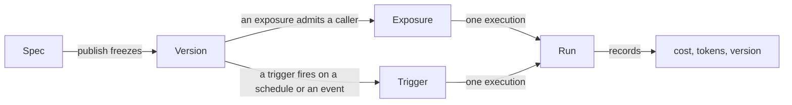

# Concepts

Five nouns. Everything in the product is built from them, and most confusion
about it comes from taking one for another.

If you read nothing else on this page, read the first two.

## Spec

**The agent, as data.**

Instructions, a model profile, capability bindings, collection and skill
references, a budget, and who to tell when something happens. It is defined in
[`app/agents/spec.py`](reference/spec.md) and validated by Pydantic.

An agent has exactly one *draft* spec, which the Builder edits and saves
continuously.

The spec keeps two rules, and they are what make it useful.

!!! abstract "References, never values"

    A spec names a model profile, a collection, a tool id. It never embeds a
    model string, a connection string or a secret.

    That is what makes it safe to commit to your own repository, and what lets an
    organization rotate a key without touching a single agent.

!!! abstract "Additive evolution"

    New fields get defaults, so an agent published today still loads after an
    upgrade. Removing or renaming a field is a migration, not an edit.

## Version

**A frozen spec.**

Publishing copies the draft into a version and points the agent at it. Runs record
which version executed.

This is why *what did this agent do last Tuesday* stays answerable after a dozen
edits. It is also why a rollback publishes a **new** version copied from the old
one rather than deleting history — the timeline shows that a rollback happened,
instead of pretending the bad version never existed.

### Environments

**Environments** are named pointers at versions, and each says whether a publish
may move it.

!!! important "Publishing mints a version. Putting it somewhere is a separate decision"

    Publish used to repoint the default environment whatever it was, so fixing a
    prompt changed what the live bot answered with, in the same click, with
    nothing on screen saying so.

So an environment either:

- **waits to be promoted onto** — which is what `production`, the default, does; or
- **follows every publish** — which is what a `dev` somebody is iterating in
  usually wants.

Two consequences worth stating:

1. The **first** publish creates `production` on the version it just minted,
   because an agent with no environment has nowhere to run at all.
2. A **rollback lands the same way** as a publish — it *is* a publish of an older
   spec. So putting an old version back in front of people is one click on its
   history row (promote), not a side effect of restoring the draft.

A channel bot bound to an environment serves its version.
`Agent.current_version_id` is the default environment's pointer, which is what a
surface naming no environment resolves through — so it moves when that environment
moves.

## Exposure

**Where an agent is reachable, and by whom.**

Web chat, an HTTP API key, a public link, a Slack or Telegram bot, an embedded
widget.

!!! success "Every surface goes through one runner"

    Budgets, approvals, the audit trail and the permission checks are identical
    whether a run came from the chat window or a Slack mention, because there is
    exactly one code path that executes an agent.

Channels have two rules worth stating on their own:

- **A bot answers as one agent.** It is a single identity in the chat, so binding
  a second agent to one bot is refused, and `@slug` is an alias for the agent
  behind it rather than a way to pick between several.
- **The run executes as the sender**, never as the bot. An unlinked chat identity
  is refused rather than run with no role, because a run nobody can be held to is
  worse than a run that did not happen.

## Trigger

**When an agent runs with nobody at the keyboard.**

Like an exposure, a trigger is operational state beside the agent rather than part
of the spec. You add, pause and remove one without minting a version, and it is
not exported in your YAML — it carries things a spec cannot, such as a subject and
when it last fired.

### It runs as a person

A triggered run executes **as the member who created the trigger**, re-resolved
every fire, never as an invented service user. It is the channel-mention rule
again, for the same reason.

When that member can no longer run the agent — they left the organization, or
their grant on it was revoked — the trigger **disables itself and records why**,
rather than retrying a refusal for ever.

### Everything else is an ordinary run

Because it goes through the same runner: the budget is enforced the same way, an
approval parks it the same way, the audit trail names it the same way.

It is stamped the `schedule` surface, so *how is this agent used* can tell an
unattended run from a person's. Each fire is its own run in Activity, and its
answers accumulate in one run-log conversation the trigger opens once — eagerly,
the moment the trigger is created, so it is a clickable item before it has ever
fired.

### Two ways to fire

=== "A schedule"

    Fires on the clock, one of two shapes:

    - An **interval** — "every N seconds", a minute at the finest, since a
      heartbeat claims the due ones once a minute.
    - A **cron** expression evaluated in UTC — `0 9 * * *` for 09:00 each day, or
      any five-field crontab. A six-field shape with a seconds column is refused:
      seconds are a cadence the once-a-minute heartbeat cannot honour.

    The service computes the next fire for each the same way, and a run that
    outlives its own interval finishes before the next fire rather than piling up
    on itself.

=== "An event"

    Fires on an arrival: a GitHub issue, an inbound email, or the catch-all API
    source — anything that can POST signed JSON, so a Zapier or Make code step, or
    a small script, covers whatever else you want to fire on.

    It arrives as a signed webhook the platform verifies against a per-trigger
    secret [sealed in the vault](secrets.md), matched against an optional
    per-source filter, and then the agent runs with the payload appended to its
    prompt.

    An event has **no next fire** — nothing is due until a delivery lands — so the
    heartbeat never sees it.

    Adding a source is a value in one enum and a branch in one module. It changes
    nothing on the row.

### Run now

Any trigger can also be **run now**: one extra fire on demand that leaves its
cadence untouched.

It is *accepted* rather than awaited. The request answers as soon as the fire is
handed to the worker as its own flow run — the same durable door a scheduled or
delivered fire goes through — and the run appears in the trigger's run-log
conversation as it happens.

So an agent that takes minutes does not hold the browser's request open until a
proxy gives up on it, and an accepted fire survives the API process that accepted
it.

Every schedule and event in an organization is listed together across its agents,
each filtered to the ones you may run — the same per-resource `agents:run` that
gates creating one.

!!! tip "They are called Routines in the product"

    The two families together are **Routines**: one umbrella name the nav, the
    chat sidebar, the onboarding and the Polish copy (*Rutyny*) all use, so a
    person meets one word wherever the feature surfaces.

    The org-wide list is `/routines`, and the dashboard carries a **Routines
    widget** — an addable card showing each routine's cadence, next fire, and the
    last run's outcome, cost and rating. The unattended half of an organization is
    visible at the same glance as the attended one.

[Triggers and schedules](triggers.md) is the whole story.

## Run

**One execution.** It has a subject, a version, a surface, a status, token counts
and a cost.

**A run that fails still records what it spent.**

How it *ended* is a status of its own rather than `failed`, because an operator
filtering for problems should not have to wade through the platform working
correctly:

| Status | The run |
|---|---|
| `failed` | broke |
| `budget_exceeded` | reached a cap — a spending limit doing its job |
| `guardrail_blocked` | was refused by a [guardrail](reference/capabilities.md#guardrails) |
| `cancelled` | was stopped: the composer's stop button, a socket that went away, a delegation cancelled from above. On every surface, not only the streaming one |
| `awaiting_approval` | parked on an approval, and is **resumable** — its message history is stored, so the decision applies to the conversation it belongs to |

A run that parks *inside a delegation* stores one level per agent, each with its
own conversation, so approving continues the delegate that stopped rather than
starting its work again.

!!! note "A run can contain another run"

    A delegation gets an `agent_runs` row of its own carrying `parent_run_id`, so
    *what did the researcher cost this month* has an answer — while both share one
    spend ledger.

    There is deliberately no `delegated` status. `parent_run_id` answers "how did
    this run start"; the status answers "how did it end". Two questions.

### A run and its transcript

A run says what it cost. `messages.run_id` says what it *did*.

Every turn a run produced carries the run's id, so "the steps of this run" is one
query rather than a guess — which is what a drill-down from run history reads
through `GET /runs/{id}/transcript`.

That read is **authorized, not owned**. A colleague holding `runs:view` reads a
run somebody else started, because a run belongs to the organization rather than
to its starter. Another tenant's run reads as absent — the same 404 an unknown id
answers with — and a run that ran with no conversation says so with a null
`conversation_id` rather than an empty list.

It is a route of its own and not a filter on the conversation endpoint, so the
conversation endpoint itself stays owner-scoped. See
[Governance](governance.md#what-run-history-shows).

`?scope=conversation` widens the same read to the whole thread the run sits in,
for a detail view that shows the run in context and scrolls to it. That is a
convenience rather than a reach: every turn a run writes carries its `run_id` —
the user's question included — so a holder of `runs:view` could already assemble
the thread by iterating its runs' transcripts. The detail read also carries
`prev_run_id` / `next_run_id`, the runs either side *in the same conversation*, so
stepping through a thread is two arrows rather than trips back to the list.

!!! warning "The link is a column, not a time window — and that is deliberate"

    Two runs started in one conversation interleave. Windowing messages between
    `started_at` and `ended_at` returns the first run's turns *and* the second's,
    and a run with no `ended_at` — cancelled, or still going — returns nothing at
    all.

    Both are wrong in a way the reader cannot see.

The prompt is written *before* the run row exists, because a build that refuses —
a deleted secret, a model profile removed in a deploy — must not lose what
somebody typed. It is linked as soon as there is a run to link it to.

Deleting a run nulls the column instead of deleting the turns: the words were
still said, and the conversation is where somebody reads them.

Linking a turn is not the same as writing one, and what each surface actually
writes is a separate question this column cannot answer, since it links rows that
already exist. The non-streaming surfaces are written by the runner rather than by
themselves, which is what made them uniform; the exceptions are under
[Surfaces](channels.md#what-each-surface-records).

Run history filters on exactly this. `GET /runs` takes a comma-separated list of
statuses (`?status=failed,budget_exceeded`), because the operator's question is a
*set* of outcomes rather than one status at a time. An unknown status is refused
rather than silently matching nothing — an empty page must mean "no such runs".

### A run and what it handed the model

The transcript says what was asked and what came back. It does not say what the
model was **given** — which prompt, which tools, described how, under which
settings — and none of that is derivable afterwards.

What the model was told is the spec's instructions plus the platform's, plus
whatever a channel binding appended, plus the bound skills, plus whichever
[system reminder](reference/capabilities.md) fired on that request. What it could
call is the capability registry plus the organization's MCP servers, minus
whatever [tool search](mcp.md) hid.

Reconstructing that from the stored spec would be a second implementation of the
builder, and a second implementation is a thing that disagrees with the first.

So it is **recorded rather than reconstructed.** The model the agent runs on is
wrapped, and each request is written down as it passes:

- the instructions and system parts;
- every tool definition exactly as the provider was handed it;
- the settings that were sent;
- one entry per request with its duration, tokens and what it asked to call next;
- the last request's whole message list.

What is stored is therefore what was sent.

`GET /runs/{id}/manifest` reads it back, authorized the way the transcript is —
existence resolved against your organization first, then `runs:view`.

!!! danger "Two things it deliberately does not do"

    It never records provider passthrough (`extra_headers`, `extra_body`), because
    that is where a provider credential rides and [the vault](secrets.md) is the
    only place a secret is kept.

    And a run that never reached a model — stopped by a budget, blocked by a
    guardrail on the way in — records nothing and answers 404, because an empty
    document would claim the agent was given no prompt and no tools.

A record too large to keep is **trimmed rather than refused**, and says so. In
stages, each one measured: the messages go first, then the tool argument schemas,
then the tool descriptions, and last the prompt itself. Those two are cut to a
recognisable length rather than dropped, because an agent's own instructions and a
remote MCP tool's description are unbounded, and are what makes a record oversized
once the messages and the schemas are gone.

What survives whatever happens is the settings and the request waterfall.

A request that **failed** is an entry in that waterfall like any other, streamed or
not. It carries the exception's class and never its message, since a provider SDK
puts the failing URL — and therefore a key in its query string — in that string.

---

## Three more, because they are easy to confuse

### Capability vs tool

A **capability** is a unit somebody grants: `knowledge`, `web_research`,
`code_execution`. It may contribute several **tools**, and it carries the
configuration and the approval policy.

Approval resolves most-specific-first:

1. the tool's own override, then
2. the capability's mode, then
3. whether the capability is `side_effecting`.

The Builder states the *outcome* in words rather than describing the rule, because
a rule the reader has to run in their head is a setting nobody dares touch.

See the [capability catalog](reference/capabilities.md) for what ships, and
[Add a capability](howto/add-capability.md) for a new one.

!!! note "MCP tools are the exception to all of the above"

    Tools that arrive from an [MCP server](mcp.md) are discovered at run time, so
    nothing declared them and nothing gates them.

### Collection vs skill

A **collection** is documents, chunked and embedded, and it is *searched*. The
model chooses what to look for; it can never widen where it looks.

A **skill** is a folder of Markdown — a `SKILL.md` and whatever files go with it —
and it is *read*. Its description is the only part the model sees before deciding
whether to open it, which is why a skill's description should say **when it
applies** rather than what is inside it.

The practical difference: retrieval costs an embedding call per search and returns
fragments. A skill costs nothing until it is opened, and then returns the whole
document.

See [Skills](skills.md) for the format and the comparison in full.

### Delegate vs inline specialist

An agent can hand part of a job to another agent. There are two ways to say who
that other agent is, they look alike in the Builder's own vocabulary, and almost
everything that matters about delegation follows from which one you picked.

A **delegate** is another published agent in the organization, referenced by
`agent_id` *and* `agent_version_id` — pinned. It is addressed by its slug, the same
handle a channel mention resolves.

An **inline specialist** is defined inside the parent's own spec: a name, a
description the parent's model reads before delegating, instructions, and — because
a summariser that cannot read the collection is useless — its own model, its own
capabilities, its own collections and skills, and its own step limit.

Which makes a specialist an agent in every way except one. Four things make
something an agent here:

| | A published delegate | An inline specialist |
|---|---|---|
| **Versioned** | yes — pinned, and a pin only moves when somebody moves it | **no** |
| **Permission-checked at publish** | yes — `agents:run` on that row | yes — the same scope, secret, collection and skill checks the parent's own bindings get |
| **Its own capabilities** | yes — its published spec's | yes — its own, plus what the parent shares |
| **Metered and capped** | yes | yes — by the run's caps, which is [what binds inside any delegation](governance.md#delegation-spends-the-parents-budget) |

**The missing one is the version**, and everything a specialist cannot do follows
from it: nothing else can reference it, editing the parent changes it, it gets no
run row of its own, and it cannot delegate further.

A published delegate is reviewable and exportable. A specialist is a paragraph in
somebody else's spec.

So use a specialist for work that should not require publishing an agent —
"summarise this in three bullets" — and a delegate for a capability the
organization owns and reuses.

#### Dynamic specialists, and the way out

A third kind sits below the inline one: a **dynamic specialist**, invented by the
model at run time under
[`allow_dynamic`](reference/capabilities.md#delegation).

It is a specialist that is not even written down in a parent's spec, and it is
persisted nowhere — keeping one would mean publishing an agent, and publishing is a
person's action.

That rule is a design rather than a limitation, and the thing that makes it one is
the exit: a person can **promote** a specialist to a draft agent.

Promotion works on an inline specialist in the Builder, and on a dynamic one from
the chat delegation panel while the run that created it is still on screen — the
only window a dynamic specialist's definition is legible, since it rides the
delegation's opening frame and nothing stores it after the turn.

It creates an ordinary draft from the specialist's instructions, model,
capabilities, collections and skills, owned by whoever promoted it and subject to
the usual `agents:edit` check. And it stops there: it does not publish, does not
pin the new agent as a delegate of its parent, and does not remove the specialist
it came from. Each of those is the next decision, with the normal validation in
front of it.

Without this exit, the only way to keep a good specialist was to copy its
instructions out of a chat log — which produces an agent whose provenance nobody
can see, exactly the untracked-agent outcome the persistence rule exists to
prevent.

!!! important "One notion of 'agent', used recursively"

    The risk this shape exists to contain is a *second*, parallel notion of agent
    — one that publish validation does not walk and the permission model cannot
    see. A specialist would have been the obvious place for it: it does not look
    like an agent, which is exactly why it is the tempting place to reach a
    collection nobody shared or a capability nobody granted.

    It is contained by refusing to write a second format. A specialist is a typed
    *subset* of the spec, using the same capability bindings, checked by the same
    recursive publish pass, and assembled by the same builder. One spec type, one
    validator, one builder, one Builder component — each used recursively. If any
    of those grows a second copy for specialists, the copy is the bug.

**A pin fails loudly rather than drifting.** A delegate whose pinned version no
longer exists fails the run and names the delegate. There is deliberately no
falling back to its current version: the reason to pin is that nothing changes
without a decision, and a silent upgrade is worse than a refusal because nobody
finds out.

The cost of that is paid in the Builder, which compares each pin against what the
delegate publishes now and offers to move it.

See the [`subagents` capability](reference/capabilities.md#delegation) for the
ceilings and the tools, and
[Permissions](permissions.md#delegation-is-not-a-privilege-boundary) for who may
delegate to what.

---

## Model profiles

A **model profile** is a named model backed by a stored key: `openai default`,
`OpenRouter prod`. Agents point at profiles, never at model strings.

That indirection is the point. Rotating a key, or moving every agent from one model
to another, is an edit to one profile rather than to forty specs.

A profile with no credential behind it is marked `no key` everywhere it appears,
because that is the one fact deciding whether the agent can run at all.

Prices come from [`genai-prices`](https://github.com/pydantic/genai-prices), which
Pydantic maintains, rather than from a table in this repository — a hand-kept table
cannot express tiered pricing and goes stale silently. A model the package does not
know is recorded at zero with a warning, and the run's total is flagged as a floor
rather than guessed at.

See [Models and providers](models.md) for the twenty-seven providers, the
credential each one wants, and how fallbacks behave.

## Organizations

Every resource is filed under an organization.

Isolation is enforced by the **schema** — `NOT NULL` columns, check constraints,
unique constraints scoped per tenant — rather than only by the service layer, so a
missed `WHERE` clause is a constraint violation instead of a data leak.

The vault goes further: a secret's ciphertext is bound to the organization that
stored it, so a row copied between tenants cannot be decrypted.

## Recap

- A **spec** is the agent as data, holding references and never values.
- **Publishing** freezes it into a **version**, and an *environment* is a separate
  decision about which version people meet.
- An **exposure** is where it is reachable; a **trigger** is when it runs with
  nobody watching. Both are operational state beside the spec, not in it.
- A **run** is one execution, and it records what it cost even when it failed.
- Every surface, trigger and delegation goes through **one runner**, which is why
  governance is not something a caller can route around.

## Next

- :material-account-key:{ .lg .middle } **[Permissions](permissions.md)**

    Roles, scopes and grants.

- :material-shield-check:{ .lg .middle } **[Governance](governance.md)**

    Budgets, approvals, alerts, audit.

- :material-toolbox:{ .lg .middle } **[Capabilities](reference/capabilities.md)**

    What an agent can be given.

- :material-connection:{ .lg .middle } **[MCP](mcp.md)**

    The tools nobody here has to write.

Also: [Models](models.md) for providers and cost, [Secrets](secrets.md) for why a
ciphertext cannot move tenants, and [Architecture](architecture.md) for how the
code is laid out.
