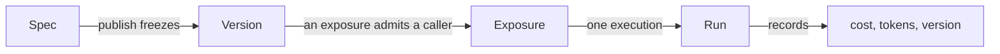

# Concepts

Four nouns. Everything in the product is built from them, and most confusion
about it comes from conflating two.

## Spec

**The agent, as data.** Instructions, a model profile, capability bindings,
collection and skill references, a budget, and who to tell when something
happens. Defined in
[`app/agents/spec.py`](reference/spec.md) and validated by Pydantic.

Two rules the spec keeps, and they are what make it useful:

**References, never values.** A spec names a model profile, a collection, a tool
id. It never embeds a model string, a connection string or a secret. That is what
makes it safe to commit to a client's repository, and what lets an organization
rotate a key without touching a single agent.

**Additive evolution.** New fields get defaults, so an agent published today
still loads after an upgrade. Removing or renaming a field is a migration, not an
edit.

An agent has exactly one *draft* spec, which the Builder edits and saves
continuously.

## Version

**A frozen spec.** Publishing copies the draft into a version and points the
agent at it. Runs record which version executed.

This is why "what did this agent do last Tuesday" stays answerable after a dozen
edits, and it is why a rollback publishes a *new* version copied from the old one
rather than deleting history - the timeline shows that a rollback happened
instead of pretending the bad version never existed.

**Environments** are named pointers at versions. Publishing moves only the
default; every other environment stays pinned until a version is promoted onto
it. A channel bot bound to an environment serves its version.

## Exposure

**Where an agent is reachable, and by whom.** Web chat, an HTTP API key, a public
link, a Slack or Telegram bot, an embedded widget.

The important property: *every surface goes through one runner*. Budgets,
approvals, the audit trail and the permission checks are identical whether a run
came from the chat window or a Slack mention, because there is exactly one code
path that executes an agent.

Channel mentions have one rule worth stating on its own. `@slug` resolves only
inside the bot's own organization, and the run executes as the **sender**, never
as the bot. An unlinked chat identity is refused rather than run with no role -
because a run nobody can be held to is worse than a run that did not happen.

## Run

**One execution.** It has a subject, a version, a surface, a status, token counts
and a cost.

A run that fails still records what it spent. A run that stops on its budget is
recorded as `budget_exceeded` rather than `failed`, so an operator filtering for
problems does not wade through the platform working correctly. A run somebody
stopped - the composer's stop button, a socket that went away, a delegation
cancelled from above - is `cancelled` for the same reason, on every surface and
not only the streaming one. A run that parks on an approval is
`awaiting_approval` and is resumable - its message history is
stored so the decision can be applied to the conversation it belongs to. A run that
parks *inside a delegation* stores one level per agent, each with its own
conversation, so approving continues the delegate that stopped rather than starting
its work again.

A run can also contain another run. When an agent delegates to a published agent,
that delegation gets an `agent_runs` row of its own carrying `parent_run_id` - so
"what did the researcher cost this month" has an answer - while both share one
spend ledger. There is no `delegated` status, because how a run *ended* and how it
*started* are two questions and `parent_run_id` answers the second.

---

## Three more, because they are easy to confuse

### Capability vs tool

A **capability** is a unit somebody grants: `knowledge`, `web_research`,
`code_execution`. It may contribute several **tools**, and it carries the
configuration and the approval policy.

Approval resolves most-specific-first: the tool's own override, then the
capability's mode, then whether the capability is `side_effecting`. The Builder
states the outcome in words rather than describing the rule, because a rule the
reader has to run in their head is a setting nobody dares touch.

See the [capability catalog](reference/capabilities.md) for what ships, and
[Adding a capability](howto/add-capability.md) for a new one. Tools that arrive
from an [MCP server](mcp.md) are the exception to all of the above: they are
discovered at run time, so nothing declared them and nothing gates them.

### Collection vs skill

A **collection** is documents, chunked and embedded, and it is *searched*. The
model chooses what to look for; it can never widen where it looks.

A **skill** is a folder of Markdown - a `SKILL.md` and whatever files go with it
- and it is *read*. Its description is the only part the model sees before
deciding whether to open it, which is why a skill's description should say *when
it applies* rather than what is inside it.

The practical difference: retrieval costs an embedding call per search and returns
fragments. A skill costs nothing until it is opened and then returns the whole
document.

See [Skills](skills.md) for the format and the comparison in full.

### Delegate vs inline specialist

An agent can hand part of a job to another agent. There are two ways to say who
that other agent is, they look alike in the Builder's own vocabulary, and almost
everything that matters about delegation follows from which one you picked.

A **delegate** is another published agent in the organization, referenced by
`agent_id` *and* `agent_version_id` - pinned. It is addressed by its slug, the
same handle a channel mention resolves.

An **inline specialist** is defined inside the parent's own spec: a name, a
description the parent's model reads before delegating, instructions, and - because
a summariser that cannot read the collection is useless - its own model, its own
capabilities, its own collections and skills, and its own step limit.

Which makes a specialist an agent in every way except one, and it is worth being
precise about which. Four things make something an agent here:

| | A published delegate | An inline specialist |
|---|---|---|
| **Versioned** | yes - pinned, and a pin only moves when somebody moves it | **no** |
| **Permission-checked at publish** | yes - `agents:run` on that row | yes - the same scope, secret, collection and skill checks the parent's own bindings get |
| **Its own capabilities** | yes - its published spec's | yes - its own, plus what the parent shares |
| **Metered and capped** | yes | yes - by the run's caps, which is [what binds inside any delegation](governance.md#delegation-spends-the-parents-budget) |

**The missing one is the version**, and everything a specialist cannot do follows
from it: nothing else can reference it, editing the parent changes it, it gets no
run row of its own, and it cannot delegate further. A published delegate is
reviewable and exportable; a specialist is a paragraph in somebody else's spec.

So a specialist is for the work that should not require publishing an agent -
"summarise this in three bullets" - and a delegate is for a capability the
organization owns and reuses.

!!! important "One notion of 'agent', used recursively"

    The risk this shape exists to contain is a *second*, parallel notion of agent
    - one that publish validation does not walk and the permission model cannot
    see. A specialist would have been the obvious place for it: it does not look
    like an agent, which is exactly why it is the tempting place to reach a
    collection nobody shared or a capability nobody granted.

    It is contained by refusing to write a second format. A specialist is a typed
    *subset* of the spec, using the same capability bindings, checked by the same
    recursive publish pass, and assembled by the same builder. One spec type, one
    validator, one builder, one Builder component - each used recursively. If any
    of those grows a second copy for specialists, the copy is the bug.

**A pin fails loudly rather than drifting.** A delegate whose pinned version no
longer exists fails the run and names the delegate; there is deliberately no fall
back to its current version, because the reason to pin is that nothing changes
without a decision and a silent upgrade is worse than a refusal - nobody finds
out. The cost of that is paid in the Builder, which compares each pin against what
the delegate publishes now and offers to move it.

See the [`subagents` capability](reference/capabilities.md#delegation) for the
ceilings and the tools, and [Permissions](permissions.md#delegation-is-not-a-privilege-boundary)
for who may delegate to what.

---

## Model profiles

A **model profile** is a named model backed by a stored key: `openai default`,
`OpenRouter prod`. Agents point at profiles, never at model strings.

That indirection is the point. Rotating a key, or moving every agent from one
model to another, is an edit to one profile rather than to forty specs. A profile
with no credential behind it is marked `no key` everywhere it appears, because
that is the one fact deciding whether the agent can run at all.

Prices come from
[`genai-prices`](https://github.com/pydantic/genai-prices), which Pydantic
maintains, rather than from a table in this repository - a hand-kept table cannot
express tiered pricing and goes stale silently. A model the package does not know
is recorded at zero with a warning, and the run's total is flagged as a floor
rather than guessed at.

See [Models and providers](models.md) for the twenty-seven providers, the
credential each one wants, and how fallbacks behave.

## Organizations

Every resource is filed under an organization. Isolation is enforced by the
schema - `NOT NULL` columns, check constraints, unique constraints scoped per
tenant - rather than only by the service layer, so a missed `WHERE` clause is a
constraint violation instead of a data leak.

The vault goes further: a secret's ciphertext is bound to the organization that
stored it, so a row copied between tenants cannot be decrypted.

## Next

- [Permissions](permissions.md) - roles, scopes and grants.
- [Governance](governance.md) - budgets, approvals, alerts, audit.
- [Capabilities](reference/capabilities.md) - what an agent can be given.
- [MCP](mcp.md) - the tools nobody here has to write.
- [Models](models.md) - providers, profiles, fallbacks, cost.
- [Secrets](secrets.md) - the vault, and why a ciphertext cannot move tenants.
- [Architecture](architecture.md) - how the code is laid out.
