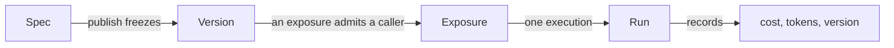

# Concepts

Four nouns. Everything in the product is built from them, and most confusion
about it comes from conflating two.

## Spec

**The agent, as data.** Instructions, a model profile, capability bindings,
collection and skill references, a budget, and who to tell when something
happens. Defined in
[`app/agents/spec.py`](reference/spec.md) and validated by Pydantic.

Two rules the spec keeps, and they are what make it useful:

**References, never values.** A spec names a model profile, a collection, a tool
id. It never embeds a model string, a connection string or a secret. That is what
makes it safe to commit to a client's repository, and what lets an organization
rotate a key without touching a single agent.

**Additive evolution.** New fields get defaults, so an agent published today
still loads after an upgrade. Removing or renaming a field is a migration, not an
edit.

An agent has exactly one *draft* spec, which the Builder edits and saves
continuously.

## Version

**A frozen spec.** Publishing copies the draft into a version and points the
agent at it. Runs record which version executed.

This is why "what did this agent do last Tuesday" stays answerable after a dozen
edits, and it is why a rollback publishes a *new* version copied from the old one
rather than deleting history - the timeline shows that a rollback happened
instead of pretending the bad version never existed.

**Environments** are named pointers at versions. Publishing moves only the
default; every other environment stays pinned until a version is promoted onto
it. A channel bot bound to an environment serves its version.

## Exposure

**Where an agent is reachable, and by whom.** Web chat, an HTTP API key, a public
link, a Slack or Telegram bot, an embedded widget.

The important property: *every surface goes through one runner*. Budgets,
approvals, the audit trail and the permission checks are identical whether a run
came from the chat window or a Slack mention, because there is exactly one code
path that executes an agent.

Channel mentions have one rule worth stating on its own. `@slug` resolves only
inside the bot's own organization, and the run executes as the **sender**, never
as the bot. An unlinked chat identity is refused rather than run with no role -
because a run nobody can be held to is worse than a run that did not happen.

## Run

**One execution.** It has a subject, a version, a surface, a status, token counts
and a cost.

A run that fails still records what it spent. A run that stops on its budget is
recorded as `budget_exceeded` rather than `failed`, so an operator filtering for
problems does not wade through the platform working correctly. A run that parks on
an approval is `awaiting_approval` and is resumable - its message history is
stored so the decision can be applied to the conversation it belongs to.

Run history filters on exactly this: `GET /runs` takes a comma-separated list of
statuses (`?status=failed,budget_exceeded`), because the operator's question is
a set of outcomes, not one status at a time. An unknown status is refused rather
than silently matching nothing - an empty page must mean "no such runs".

---

## Two more, because they are easy to confuse

### Capability vs tool

A **capability** is a unit somebody grants: `knowledge`, `web_research`,
`code_execution`. It may contribute several **tools**, and it carries the
configuration and the approval policy.

Approval resolves most-specific-first: the tool's own override, then the
capability's mode, then whether the capability is `side_effecting`. The Builder
states the outcome in words rather than describing the rule, because a rule the
reader has to run in their head is a setting nobody dares touch.

See the [capability catalog](reference/capabilities.md) for what ships, and
[Adding a capability](howto/add-capability.md) for a new one. Tools that arrive
from an [MCP server](mcp.md) are the exception to all of the above: they are
discovered at run time, so nothing declared them and nothing gates them.

### Collection vs skill

A **collection** is documents, chunked and embedded, and it is *searched*. The
model chooses what to look for; it can never widen where it looks.

A **skill** is a folder of Markdown - a `SKILL.md` and whatever files go with it
- and it is *read*. Its description is the only part the model sees before
deciding whether to open it, which is why a skill's description should say *when
it applies* rather than what is inside it.

The practical difference: retrieval costs an embedding call per search and returns
fragments. A skill costs nothing until it is opened and then returns the whole
document.

See [Skills](skills.md) for the format and the comparison in full.

---

## Model profiles

A **model profile** is a named model backed by a stored key: `openai default`,
`OpenRouter prod`. Agents point at profiles, never at model strings.

That indirection is the point. Rotating a key, or moving every agent from one
model to another, is an edit to one profile rather than to forty specs. A profile
with no credential behind it is marked `no key` everywhere it appears, because
that is the one fact deciding whether the agent can run at all.

Prices come from
[`genai-prices`](https://github.com/pydantic/genai-prices), which Pydantic
maintains, rather than from a table in this repository - a hand-kept table cannot
express tiered pricing and goes stale silently. A model the package does not know
is recorded at zero with a warning, and the run's total is flagged as a floor
rather than guessed at.

See [Models and providers](models.md) for the twenty-seven providers, the
credential each one wants, and how fallbacks behave.

## Organizations

Every resource is filed under an organization. Isolation is enforced by the
schema - `NOT NULL` columns, check constraints, unique constraints scoped per
tenant - rather than only by the service layer, so a missed `WHERE` clause is a
constraint violation instead of a data leak.

The vault goes further: a secret's ciphertext is bound to the organization that
stored it, so a row copied between tenants cannot be decrypted.

## Next

- [Permissions](permissions.md) - roles, scopes and grants.
- [Governance](governance.md) - budgets, approvals, alerts, audit.
- [Capabilities](reference/capabilities.md) - what an agent can be given.
- [MCP](mcp.md) - the tools nobody here has to write.
- [Models](models.md) - providers, profiles, fallbacks, cost.
- [Secrets](secrets.md) - the vault, and why a ciphertext cannot move tenants.
- [Architecture](architecture.md) - how the code is laid out.
