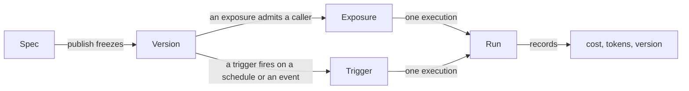

# Koncepcje { #concepts }

Pięć rzeczowników. Wszystko w produkcie jest z nich zbudowane, a większość
nieporozumień wokół niego bierze się z brania jednego za drugi.

Jeśli nie przeczytasz nic więcej na tej stronie, przeczytaj pierwsze dwa.

## Spec { #spec }

**Agent jako dane.**

Instrukcje, profil modelu, powiązania capability, odwołania do kolekcji i
skilli, budżet oraz to, kogo zawiadomić, gdy coś się stanie. Jest zdefiniowany w
[`app/agents/spec.py`](reference/spec.md) i walidowany przez Pydantic.

Agent ma dokładnie jednego speca *roboczego* (draft), którego Builder edytuje i
zapisuje na bieżąco.

Spec trzyma się dwóch reguł i to właśnie one czynią go użytecznym.

!!! abstract "Odwołania, nigdy wartości"

    Spec nazywa profil modelu, kolekcję, id narzędzia. Nigdy nie zaszywa w sobie
    ciągu z nazwą modelu, connection stringa ani sekretu.

    To właśnie dlatego bezpiecznie jest wrzucić go do własnego repozytorium i
    dlatego organizacja może zrotować klucz, nie dotykając ani jednego agenta.

!!! abstract "Rozwój przez dodawanie"

    Nowe pola dostają wartości domyślne, więc agent opublikowany dziś nadal
    wczytuje się po aktualizacji. Usunięcie albo zmiana nazwy pola to migracja,
    a nie edycja.

!!! info "Szablon to spec, który ktoś już napisał"

    [Szablony agentów](first-agent.md#3-build-the-agent) dostarczane z platformą
    to spece zawierające wszystko, co folder w obrazie może wiedzieć:
    instrukcje, capability i skille do zainstalowania. Nie nazywają żadnego
    modelu ani żadnej kolekcji, bo to są UUID-y, których nikt spoza twojego
    wdrożenia nie ma - i dlatego zainstalowany szablon jest draftem.

## Wersja { #version }

**Zamrożony spec.**

Publikacja kopiuje draft do wersji i wskazuje na nią agenta. Runy zapisują,
która wersja została wykonana.

Dlatego *co ten agent zrobił w zeszły wtorek* pozostaje pytaniem, na które da się
odpowiedzieć po kilkunastu edycjach. Dlatego też rollback publikuje **nową**
wersję skopiowaną ze starej, zamiast kasować historię — oś czasu pokazuje, że
rollback się wydarzył, zamiast udawać, że zła wersja nigdy nie istniała.

### Środowiska { #environments }

**Środowiska** to nazwane wskaźniki na wersje, a każde z nich mówi, czy
publikacja może nim ruszyć.

!!! important "Publikacja bije wersję. Postawienie jej gdzieś to osobna decyzja"

    Publikacja przestawiała kiedyś domyślne środowisko, jakiekolwiek by nie było,
    więc poprawienie promptu zmieniało w tym samym kliknięciu to, czym
    odpowiadał działający bot, i nic na ekranie o tym nie mówiło.

Środowisko zatem albo:

- **czeka, aż coś zostanie na nie wypromowane** — tak działa `production`,
  domyślne; albo
- **podąża za każdą publikacją** — czego zwykle oczekuje się od `dev`, w którym
  ktoś iteruje.

Dwie konsekwencje warte powiedzenia:

1. **Pierwsza** publikacja tworzy `production` na wersji, którą właśnie wybiła,
   bo agent bez środowiska nie ma się w ogóle gdzie uruchomić.
2. **Rollback ląduje tak samo** jak publikacja — *jest* publikacją starszego
   speca. Postawienie starej wersji z powrotem przed ludźmi to jedno kliknięcie
   w jej wierszu historii (promote), a nie efekt uboczny przywrócenia draftu.

Bot kanału powiązany ze środowiskiem serwuje jego wersję.
`Agent.current_version_id` to wskaźnik środowiska domyślnego i to przez niego
rozwiązuje się powierzchnia, która nie nazywa żadnego środowiska — więc przesuwa
się, gdy przesuwa się to środowisko.

!!! tip "Wersje nie muszą wchodzić na żywo wszystkie naraz"

    [Środowisko](environments.md) to nazwa przypięta do wersji, więc `staging`
    może serwować wersję 7, podczas gdy `production` zostaje na 6. Publikacja
    bije wersję; postawienie jej gdzieś to osobna decyzja.

## Ekspozycja { #exposure }

**Gdzie agent jest osiągalny i dla kogo.**

Czat webowy, klucz API HTTP, publiczny link, bot Slacka lub Telegrama, osadzony
widget.

!!! success "Każda powierzchnia idzie przez jeden runner"

    Budżety, zatwierdzenia, ślad audytowy i sprawdzenia uprawnień są identyczne
    niezależnie od tego, czy run przyszedł z okna czatu, czy ze wzmianki na
    Slacku, bo istnieje dokładnie jedna ścieżka kodu, która wykonuje agenta.

Kanały mają dwie reguły warte osobnego powiedzenia:

- **Bot odpowiada jako jeden agent.** To pojedyncza tożsamość na czacie, więc
  powiązanie drugiego agenta z jednym botem jest odrzucane, a `@slug` to alias
  stojącego za nim agenta, a nie sposób na wybieranie spośród kilku.
- **Run wykonuje się jako nadawca**, nigdy jako bot. Niepowiązana tożsamość
  czatowa jest odrzucana, zamiast uruchamiać run bez roli, bo run, za który
  nikogo nie da się rozliczyć, jest gorszy niż run, który się nie odbył.

## Trigger { #trigger }

**Kiedy agent uruchamia się, gdy nikt nie siedzi przy klawiaturze.**

Podobnie jak ekspozycja, trigger jest stanem operacyjnym obok agenta, a nie
częścią speca. Dodajesz go, wstrzymujesz i usuwasz bez wybijania wersji i nie
jest eksportowany do twojego YAML-a — niesie rzeczy, których spec nieść nie może,
takie jak podmiot i moment ostatniego odpalenia.

### Uruchamia się jako człowiek { #it-runs-as-a-person }

Run z triggera wykonuje się **jako członek, który utworzył trigger**, rozwiązywany
na nowo przy każdym odpaleniu, nigdy jako wymyślony użytkownik serwisowy. To ta
sama reguła co przy wzmiance na kanale i z tego samego powodu.

Kiedy ten członek nie może już uruchamiać agenta — odszedł z organizacji albo
odebrano mu grant na niego — trigger **wyłącza się sam i zapisuje dlaczego**,
zamiast w nieskończoność ponawiać odmowę.

### Cała reszta to zwykły run { #everything-else-is-an-ordinary-run }

Bo idzie przez ten sam runner: budżet jest egzekwowany tak samo, zatwierdzenie
parkuje go tak samo, ślad audytowy nazywa go tak samo.

Jest stemplowany powierzchnią `schedule`, więc pytanie *jak ten agent jest
używany* potrafi odróżnić run bez nadzoru od runa człowieka. Każde odpalenie to
osobny run w Activity, a jego odpowiedzi zbierają się w jednej rozmowie będącej
dziennikiem runów, którą trigger otwiera raz — zawczasu, w momencie utworzenia
triggera, więc jest klikalną pozycją, zanim jeszcze kiedykolwiek się odpali.

### Dwa sposoby odpalania { #two-ways-to-fire }

=== "Harmonogram"

    Odpala się z zegara, w jednej z dwóch postaci:

    - **Interwał** — „co N sekund”, najdrobniej co minutę, bo heartbeat zgarnia
      należne raz na minutę.
    - Wyrażenie **cron** obliczane w UTC — `0 9 * * *` dla 09:00 każdego dnia
      albo dowolny pięciopolowy crontab. Sześciopolowa postać z kolumną sekund
      jest odrzucana: sekundy to kadencja, której heartbeat chodzący raz na
      minutę nie jest w stanie dotrzymać.

    Serwis liczy następne odpalenie dla obu tak samo, a run, który przeżyje swój
    własny interwał, kończy się przed kolejnym odpaleniem, zamiast nawarstwiać
    się sam na sobie.

=== "Zdarzenie"

    Odpala się na przyjściu czegoś: issue z GitHuba, przychodzącego maila albo
    uniwersalnego źródła API — wszystkiego, co potrafi wysłać POST-em podpisany
    JSON, więc krok kodu w Zapierze czy Make, albo mały skrypt, pokrywa
    cokolwiek innego, na czym chcesz odpalać.

    Przychodzi jako podpisany webhook, który platforma weryfikuje względem
    sekretu przypisanego do triggera i [zapieczętowanego w vault](secrets.md),
    dopasowuje do opcjonalnego filtra danego źródła, a potem agent uruchamia się
    z payloadem doklejonym do swojego promptu.

    Zdarzenie **nie ma następnego odpalenia** — nic nie jest należne, dopóki nie
    wyląduje dostarczenie — więc heartbeat nigdy go nie widzi.

    Dodanie źródła to wartość w jednym enumie i gałąź w jednym module. Nie
    zmienia niczego w wierszu.

### Uruchom teraz { #run-now }

Każdy trigger można też **uruchomić teraz**: jedno dodatkowe odpalenie na
żądanie, które nie rusza jego kadencji.

Jest ono *przyjmowane*, a nie oczekiwane. Żądanie odpowiada, gdy tylko odpalenie
zostanie przekazane workerowi jako jego własny flow run — te same trwałe drzwi,
przez które przechodzi odpalenie z harmonogramu albo z dostarczenia — a run
pojawia się w rozmowie-dzienniku runów triggera na bieżąco.

Dzięki temu agent, który pracuje minutami, nie trzyma otwartego żądania
przeglądarki, aż proxy da za wygraną, a przyjęte odpalenie przeżywa proces API,
który je przyjął.

Każdy harmonogram i każde zdarzenie w organizacji są wypisane razem, w poprzek
jej agentów, przefiltrowane do tych, które wolno ci uruchamiać — to samo
`agents:run` na poziomie zasobu, które bramkuje ich tworzenie.

!!! tip "W produkcie nazywają się Routines"

    Obie rodziny razem to **Routines**: jedna parasolowa nazwa, której używają
    nawigacja, boczny pasek czatu, onboarding i polskie tłumaczenie (*Rutyny*),
    więc człowiek spotyka jedno słowo, gdziekolwiek ta funkcja wychodzi na
    wierzch.

    Lista obejmująca całą organizację to `/routines`, a dashboard ma **kafelek
    Routines** — dodawalną kartę pokazującą kadencję każdej rutyny, następne
    odpalenie oraz wynik, koszt i ocenę ostatniego runa. Nienadzorowana połowa
    organizacji jest widoczna tym samym rzutem oka co ta nadzorowana.

[Triggery i harmonogramy](triggers.md) to cała historia.

## Run { #run }

**Jedno wykonanie.** Ma podmiot, wersję, powierzchnię, status, liczniki tokenów
i koszt.

**Run, który się nie powiedzie, i tak zapisuje, ile wydał.**

To, jak się *skończył*, jest osobnym statusem, a nie `failed`, bo operator
filtrujący pod kątem problemów nie powinien przedzierać się przez poprawnie
działającą platformę:

| Status | Run |
|---|---|
| `failed` | zepsuł się |
| `budget_exceeded` | dobił do limitu — limit wydatków robiący swoje |
| `guardrail_blocked` | został odrzucony przez [guardrail](reference/capabilities.md#guardrails) |
| `cancelled` | został zatrzymany: przyciskiem stop w kompozytorze, przez zerwany socket, przez delegację anulowaną z góry. Na każdej powierzchni, nie tylko na strumieniowej |
| `awaiting_approval` | zaparkował na zatwierdzeniu i jest **wznawialny** — jego historia wiadomości jest zapisana, więc decyzja dotyczy rozmowy, do której należy |

Run, który parkuje *wewnątrz delegacji*, zapisuje po jednym poziomie na agenta,
każdy z własną rozmową, więc zatwierdzenie kontynuuje delegata, który się
zatrzymał, zamiast zaczynać jego pracę od nowa.

!!! note "Run może zawierać inny run"

    Delegacja dostaje własny wiersz w `agent_runs` niosący `parent_run_id`, więc
    pytanie *ile kosztował w tym miesiącu ten researcher* ma odpowiedź — przy
    czym oba dzielą jedną księgę wydatków.

    Statusu `delegated` celowo nie ma. `parent_run_id` odpowiada na „jak ten run
    się zaczął”; status odpowiada na „jak się skończył”. Dwa pytania.

### Run i jego transkrypt { #a-run-and-its-transcript }

Run mówi, ile kosztował. `messages.run_id` mówi, co *zrobił*.

Każda tura, którą run wyprodukował, niesie id runa, więc „kroki tego runa” to
jedno zapytanie, a nie zgadywanie — i właśnie to czyta zejście z historii runów
przez `GET /runs/{id}/transcript`.

Ten odczyt jest **autoryzowany, a nie własnościowy**. Kolega z `runs:view` czyta
run uruchomiony przez kogoś innego, bo run należy do organizacji, a nie do tego,
kto go zaczął. Run innego tenanta czyta się jako nieobecny — to samo 404, którym
odpowiada nieznane id — a run, który wykonał się bez rozmowy, mówi o tym pustym
`conversation_id`, a nie pustą listą.

To osobna trasa, a nie filtr na endpointcie rozmowy, więc sam endpoint rozmowy
pozostaje ograniczony do właściciela. Zobacz
[Governance](governance.md#what-run-history-shows).

`?scope=conversation` poszerza ten sam odczyt na cały wątek, w którym siedzi run,
na potrzeby widoku szczegółów pokazującego run w kontekście i przewijającego do
niego. To wygoda, a nie sięgnięcie dalej: każda tura, którą run zapisuje, niesie
swój `run_id` — łącznie z pytaniem użytkownika — więc posiadacz `runs:view` mógł
już złożyć ten wątek, iterując po transkryptach jego runów. Odczyt szczegółów
niesie też `prev_run_id` / `next_run_id`, czyli runy po obu stronach *w tej samej
rozmowie*, więc przechodzenie po wątku to dwie strzałki, a nie wycieczki z
powrotem do listy.

!!! warning "To powiązanie jest kolumną, a nie oknem czasowym — i tak ma być"

    Dwa runy zaczęte w jednej rozmowie przeplatają się. Wycięcie wiadomości
    oknem między `started_at` a `ended_at` zwraca tury pierwszego runa *oraz*
    drugiego, a run bez `ended_at` — anulowany albo wciąż trwający — nie zwraca
    zupełnie nic.

    Oba są błędne w sposób, którego czytelnik nie widzi.

Prompt jest zapisywany *zanim* powstanie wiersz runa, bo złożenie agenta, które
kończy się odmową — skasowany sekret, profil modelu usunięty przy wdrożeniu —
nie może zgubić tego, co ktoś napisał. Zostaje powiązany, gdy tylko jest run, z
którym da się go powiązać.

Skasowanie runa zeruje kolumnę, zamiast kasować tury: te słowa i tak padły, a
rozmowa jest miejscem, w którym ktoś je czyta.

Powiązanie tury to nie to samo co jej zapisanie, a to, co każda powierzchnia
faktycznie zapisuje, jest osobnym pytaniem, na które ta kolumna nie odpowiada,
skoro wiąże wiersze, które już istnieją. Powierzchnie niestrumieniowe są
zapisywane przez runnera, a nie przez siebie same, i to właśnie ujednoliciło je;
wyjątki są w [Powierzchniach](channels.md#what-each-surface-records).

Historia runów filtruje dokładnie po tym. `GET /runs` przyjmuje listę statusów
rozdzieloną przecinkami (`?status=failed,budget_exceeded`), bo pytanie operatora
dotyczy *zbioru* wyników, a nie jednego statusu naraz. Nieznany status jest
odrzucany, zamiast po cichu nie pasować do niczego — pusta strona musi znaczyć
„nie ma takich runów”.

### Run i to, co przekazał modelowi { #a-run-and-what-it-handed-the-model }

Transkrypt mówi, o co zapytano i co wróciło. Nie mówi, co model **dostał** —
który prompt, które narzędzia, opisane jak, przy jakich ustawieniach — i nic z
tego nie da się wywnioskować po fakcie.

To, co powiedziano modelowi, to instrukcje speca plus instrukcje platformy, plus
to, co dokleiło powiązanie z kanałem, plus powiązane skille, plus ten
[system reminder](reference/capabilities.md), który odpalił się przy tym żądaniu.
To, co model mógł wywołać, to rejestr capability plus serwery MCP organizacji,
minus to, co ukrył [tool search](mcp.md).

Odtwarzanie tego ze składowanego speca byłoby drugą implementacją buildera, a
druga implementacja to coś, co nie zgadza się z pierwszą.

Dlatego to jest **zapisywane, a nie odtwarzane.** Model, na którym działa agent,
jest opakowany, a każde żądanie zostaje spisane w locie:

- instrukcje i części systemowe;
- każda definicja narzędzia dokładnie w takiej postaci, w jakiej dostał ją
  provider;
- wysłane ustawienia;
- jeden wpis na żądanie, z jego czasem trwania, tokenami i tym, co poprosiło
  wywołać dalej;
- pełna lista wiadomości ostatniego żądania.

To, co jest zapisane, jest więc tym, co zostało wysłane.

`GET /runs/{id}/manifest` odczytuje to z powrotem, autoryzowane tak samo jak
transkrypt — istnienie rozstrzygane najpierw względem twojej organizacji, potem
`runs:view`.

!!! danger "Dwie rzeczy, których celowo nie robi"

    Nigdy nie zapisuje przekazywania wprost do providera (`extra_headers`,
    `extra_body`), bo to tam jedzie poświadczenie providera, a
    [vault](secrets.md) jest jedynym miejscem, w którym trzyma się sekret.

    A run, który nigdy nie dotarł do modelu — zatrzymany przez budżet,
    zablokowany przez guardrail na wejściu — nie zapisuje nic i odpowiada 404, bo
    pusty dokument twierdziłby, że agent nie dostał żadnego promptu i żadnych
    narzędzi.

Zapis zbyt duży, by go zachować, jest **przycinany, a nie odrzucany**, i mówi o
tym. Etapami, z których każdy jest mierzony: najpierw idą wiadomości, potem
schematy argumentów narzędzi, potem opisy narzędzi, a na końcu sam prompt. Te
dwa ostatnie są cięte do rozpoznawalnej długości, a nie wyrzucane, bo własne
instrukcje agenta i opis zdalnego narzędzia MCP są nieograniczone i to one czynią
zapis przerośniętym, gdy wiadomości i schematów już nie ma.

Tym, co przetrwa cokolwiek się stanie, są ustawienia i wodospad żądań.

Żądanie, które **się nie powiodło**, jest wpisem w tym wodospadzie jak każdy
inny, strumieniowane czy nie. Niesie klasę wyjątku i nigdy jego komunikat, bo SDK
providera wstawia w ten ciąg URL, który zawiódł — a więc i klucz w jego query
stringu.

---

## Jeszcze trzy, bo łatwo je pomylić { #three-more-because-they-are-easy-to-confuse }

### Capability a narzędzie { #capability-vs-tool }

**Capability** to jednostka, którą ktoś przyznaje: `knowledge`, `web_research`,
`code_execution`. Może wnieść kilka **narzędzi** i niesie konfigurację oraz
politykę zatwierdzeń.

Zatwierdzenie rozstrzyga się od najbardziej szczegółowego:

1. własne nadpisanie narzędzia, potem
2. tryb capability, potem
3. to, czy capability jest `side_effecting`.

Builder podaje *wynik* słowami, zamiast opisywać regułę, bo reguła, którą
czytelnik musi przeliczyć w głowie, to ustawienie, którego nikt nie śmie
dotknąć.

Zobacz [katalog capability](reference/capabilities.md), żeby poznać to, co jest w
zestawie, i [Dodaj capability](howto/add-capability.md), żeby dodać nową.

!!! note "Narzędzia MCP są wyjątkiem od wszystkiego powyższego"

    Narzędzia, które przychodzą z [serwera MCP](mcp.md), są odkrywane w czasie
    uruchomienia, więc nic ich nie zadeklarowało i nic ich nie bramkuje.

### Kolekcja a skill { #collection-vs-skill }

**Kolekcja** to dokumenty pocięte na fragmenty i zembedowane, i się ją
*przeszukuje*. Model wybiera, czego szukać; nigdy nie może poszerzyć tego, gdzie
szuka.

**Skill** to folder Markdownu — `SKILL.md` i jakiekolwiek pliki idące z nim w
parze — i się go *czyta*. Jego opis jest jedyną częścią, którą model widzi przed
decyzją, czy go otworzyć, i dlatego opis skilla powinien mówić, **kiedy ma
zastosowanie**, a nie co jest w środku.

Praktyczna różnica: wyszukiwanie kosztuje jedno wywołanie embedujące na każde
szukanie i zwraca fragmenty. Skill nie kosztuje nic, dopóki nie zostanie
otwarty, a wtedy zwraca cały dokument.

Zobacz [Skille](skills.md), żeby poznać format i pełne porównanie.

### Delegat a specjalista inline { #delegate-vs-inline-specialist }

Agent może oddać część zadania innemu agentowi. Są dwa sposoby, żeby powiedzieć,
kim jest ten drugi agent, wyglądają podobnie we własnym słowniku Buildera, a
prawie wszystko, co w delegacji się liczy, wynika z tego, który wybrałeś.

**Delegat** to inny opublikowany agent w organizacji, wskazany przez `agent_id`
*oraz* `agent_version_id` — przypięty. Adresuje się go slugiem, tym samym
uchwytem, który rozwiązuje wzmianka na kanale.

**Specjalista inline** jest zdefiniowany wewnątrz speca rodzica: nazwa, opis,
który model rodzica czyta przed delegowaniem, instrukcje oraz — bo streszczacz
nieumiejący czytać kolekcji jest bezużyteczny — własny model, własne capability,
własne kolekcje i skille oraz własny limit kroków.

To czyni specjalistę agentem pod każdym względem prócz jednego. Cztery rzeczy
czynią tu coś agentem:

| | Opublikowany delegat | Specjalista inline |
|---|---|---|
| **Wersjonowany** | tak — przypięty, a przypięcie rusza się tylko wtedy, gdy ktoś nim ruszy | **nie** |
| **Sprawdzany pod kątem uprawnień przy publikacji** | tak — `agents:run` na tym wierszu | tak — te same sprawdzenia zakresów, sekretów, kolekcji i skilli, które dostają własne powiązania rodzica |
| **Własne capability** | tak — te z jego opublikowanego speca | tak — własne plus to, czym dzieli się rodzic |
| **Mierzony i limitowany** | tak | tak — limitami runa, co [obowiązuje wewnątrz każdej delegacji](governance.md#delegation-spends-the-parents-budget) |

**Brakującą rzeczą jest wersja** i wynika z niej wszystko, czego specjalista nie
może: nic innego nie może się do niego odwołać, edycja rodzica go zmienia, nie
dostaje własnego wiersza runa i nie może delegować dalej.

Opublikowany delegat da się przejrzeć i wyeksportować. Specjalista to akapit w
czyimś specu.

Używaj więc specjalisty do pracy, która nie powinna wymagać publikowania agenta —
„streść to w trzech punktach” — a delegata do zdolności, którą organizacja
posiada i wykorzystuje wielokrotnie.

#### Specjaliści dynamiczni i droga wyjścia { #dynamic-specialists-and-the-way-out }

Pod tym inline siedzi trzeci rodzaj: **specjalista dynamiczny**, wymyślony przez
model w czasie uruchomienia pod
[`allow_dynamic`](reference/capabilities.md#delegation).

To specjalista, który nie jest nawet zapisany w specu rodzica i nie jest nigdzie
utrwalany — zachowanie go oznaczałoby opublikowanie agenta, a publikacja jest
czynnością człowieka.

Ta reguła jest projektem, a nie ograniczeniem, i tym, co ją nim czyni, jest
wyjście: człowiek może **wypromować** specjalistę do agenta w wersji roboczej.

Promocja działa na specjaliście inline w Builderze, a na dynamicznym z panelu
delegacji na czacie, dopóki run, który go stworzył, jest jeszcze na ekranie — to
jedyne okno, w którym definicja specjalisty dynamicznego jest czytelna, bo jedzie
ona w otwierającej ramce delegacji i nic nie przechowuje jej po zakończeniu tury.

Tworzy zwykły draft z instrukcji, modelu, capability, kolekcji i skilli
specjalisty, należący do tego, kto go wypromował, i podlegający zwykłemu
sprawdzeniu `agents:edit`. I na tym się zatrzymuje: nie publikuje, nie przypina
nowego agenta jako delegata jego rodzica i nie usuwa specjalisty, z którego
powstał. Każda z tych rzeczy to następna decyzja, z normalną walidacją przed nią.

Bez tego wyjścia jedynym sposobem na zachowanie dobrego specjalisty było
skopiowanie jego instrukcji z logu czatu — co daje agenta, którego pochodzenia
nikt nie widzi, czyli dokładnie ten skutek w postaci nieśledzonego agenta,
któremu reguła o nieutrwalaniu ma zapobiegać.

!!! important "Jedno pojęcie „agenta”, używane rekurencyjnie"

    Ryzykiem, przed którym ten kształt ma chronić, jest *drugie*, równoległe
    pojęcie agenta — takie, po którym walidacja publikacji nie chodzi i którego
    model uprawnień nie widzi. Specjalista byłby dla niego oczywistym miejscem:
    nie wygląda jak agent i właśnie dlatego jest kuszącym miejscem, żeby sięgnąć
    po kolekcję, której nikt nie udostępnił, albo capability, której nikt nie
    przyznał.

    Chroni przed tym odmowa napisania drugiego formatu. Specjalista to
    otypowany *podzbiór* speca, używający tych samych powiązań capability,
    sprawdzany tym samym rekurencyjnym przebiegiem publikacji i składany przez
    ten sam builder. Jeden typ speca, jeden walidator, jeden builder, jeden
    komponent Buildera — każdy używany rekurencyjnie. Jeśli któremukolwiek z nich
    wyrośnie druga kopia na potrzeby specjalistów, ta kopia jest błędem.

**Przypięcie zawodzi głośno, zamiast dryfować.** Delegat, którego przypięta
wersja już nie istnieje, kończy run błędem i nazywa tego delegata. Celowo nie ma
cofania się do jego bieżącej wersji: powodem przypinania jest to, że nic nie
zmienia się bez decyzji, a cicha aktualizacja jest gorsza od odmowy, bo nikt się
o niej nie dowiaduje.

Koszt tego jest płacony w Builderze, który porównuje każde przypięcie z tym, co
delegat publikuje teraz, i proponuje jego przesunięcie.

Zobacz [capability `subagents`](reference/capabilities.md#delegation), żeby
poznać pułapy i narzędzia, oraz
[Uprawnienia](permissions.md#delegation-is-not-a-privilege-boundary), żeby
dowiedzieć się, kto komu może delegować.

---

## Profile modeli { #model-profiles }

**Profil modelu** to nazwany model wsparty przechowywanym kluczem:
`openai default`, `OpenRouter prod`. Agenci wskazują na profile, nigdy na ciągi z
nazwami modeli.

W tej pośredniości rzecz cała. Zrotowanie klucza albo przeniesienie wszystkich
agentów z jednego modelu na inny to edycja jednego profilu, a nie czterdziestu
speców.

Profil, za którym nie stoi żadne poświadczenie, jest oznaczony `no key`
wszędzie, gdzie się pojawia, bo to jedyny fakt rozstrzygający, czy agent może się
w ogóle uruchomić.

Ceny pochodzą z [`genai-prices`](https://github.com/pydantic/genai-prices),
utrzymywanego przez Pydantic, a nie z tabelki w tym repozytorium — tabelka
prowadzona ręcznie nie potrafi wyrazić cen progowych i po cichu się starzeje.
Model, którego pakiet nie zna, jest zapisywany z kosztem zero i ostrzeżeniem, a
suma runa jest oznaczana jako dolna granica, zamiast być zgadywana.

Zobacz [Modele i providery](models.md), żeby poznać dwadzieścia siedem
providerów, poświadczenie, którego chce każdy z nich, i zachowanie mechanizmów
zapasowych.

## Organizacje { #organizations }

Każdy zasób jest przypisany do organizacji.

Izolacja jest egzekwowana przez **schemat** — kolumny `NOT NULL`, ograniczenia
check, ograniczenia unikalności o zasięgu jednego tenanta — a nie tylko przez
warstwę serwisów, więc pominięta klauzula `WHERE` jest naruszeniem ograniczenia
zamiast wyciekiem danych.

Vault idzie dalej: szyfrogram sekretu jest związany z organizacją, która go
zapisała, więc wiersza skopiowanego między tenantami nie da się odszyfrować.

## Podsumowanie { #recap }

- **Spec** to agent jako dane, trzymający odwołania i nigdy wartości.
- **Publikacja** zamraża go w **wersję**, a *środowisko* to osobna decyzja o tym,
  którą wersję spotykają ludzie.
- **Ekspozycja** to miejsce, w którym jest osiągalny; **trigger** to moment, w
  którym uruchamia się, gdy nikt nie patrzy. Oba są stanem operacyjnym obok
  speca, a nie w nim.
- **Run** to jedno wykonanie i zapisuje, ile kosztował, nawet gdy się nie
  powiódł.
- Każda powierzchnia, każdy trigger i każda delegacja idą przez **jeden runner** i
  dlatego nadzoru nie da się obejść z poziomu wywołującego.

## Dalej { #next }

- :material-account-key:{ .lg .middle } **[Uprawnienia](permissions.md)**

    Role, zakresy i granty.

- :material-shield-check:{ .lg .middle } **[Governance](governance.md)**

    Budżety, zatwierdzenia, alerty, audyt.

- :material-toolbox:{ .lg .middle } **[Capability](reference/capabilities.md)**

    Co można dać agentowi.

- :material-connection:{ .lg .middle } **[MCP](mcp.md)**

    Narzędzia, których nikt tutaj nie musi pisać.

Ponadto: [Modele](models.md) o providerach i koszcie, [Sekrety](secrets.md) o
tym, dlaczego szyfrogram nie może zmienić tenanta, i
[Architektura](architecture.md) o tym, jak rozłożony jest kod.
