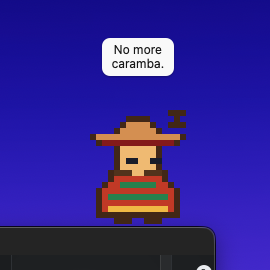

# Die Desktop-App { #the-desktop-app }

AgenticOS läuft im Browser, und so nutzen es die meisten. Die Desktop-App ist ein
Zusatz für alle, die es im Dock haben wollen: die Konsole in einem eigenen
Fenster, dazu ein Haustier und ein Screenshot-Kürzel. Nichts an der Plattform
braucht sie.

<figure markdown>
  { width="270" }
  <figcaption>Amigo, eines von fünf Haustieren. No more caramba in your AI.</figcaption>
</figure>

Die Anwendung im Fenster ist dieselbe Next.js-Konsole, die der Server ohnehin
ausliefert, vom Server geladen, also trägt sie dieselbe Anmeldung, dieselben
Berechtigungen und dieselben Mandantenprüfungen wie ein Browser-Tab.

Es ist eine [Tauri](https://tauri.app)-Hülle in `desktop/`, und sie hält genau
eine Einstellung: die Adresse des Servers. Der erste Start fragt danach, "Shell →
Change server…" fragt erneut, und alles dazwischen ist die Konsole.

!!! note "Es ist eine Hülle, kein Build des Frontends"

    `frontend/` ist eine Next.js-Anwendung mit einer Serverhälfte - neunzig und
    mehr Route-Handler, die zum Backend proxen, Session-Cookies, die sie setzen,
    Middleware, die die Locale wählt, und serverseitig gerenderte Seiten. Nichts
    davon läuft in einer Desktop-Binärdatei, also versucht es die Hülle gar nicht:
    sie öffnet die URL des Deployments so, wie ein Browser es täte. Ein Deployment
    ist das, was Sie installieren; die App ist, wie Sie es öffnen.

## Sie ausführen { #running-it }

Rust von [rustup](https://rustup.rs) und die Webview der Plattform - WebKit unter
macOS, WebView2 unter Windows, WebKitGTK unter Linux - sind die Voraussetzungen;
Tauris eigene
[Seite zu den Voraussetzungen](https://v2.tauri.app/start/prerequisites/) hat die
Liste pro Plattform. Die Tauri-CLI ist in `desktop/package.json` festgelegt, und
`make install` holt sie mit allem anderen.

```bash
make desktop-dev     # opens the shell; type the address of a console
make desktop-build   # a .app / .dmg, .msi or .deb/.AppImage for this machine
make desktop-check   # rustfmt, clippy with warnings denied, and the tests
```

Beim ersten Mal zeigt das Fenster ein Formular mit der Frage, wo der Server ist,
vorbelegt mit `http://localhost:3000` - einem `make dev`-Stack. Ein bloßer Host
(`agenticos.acme.com`) wird über HTTPS geöffnet. Alles, was keine Webadresse ist,
wird im Formular abgelehnt.

!!! warning "Schlichtes `http://` gilt nur für diese Maschine"

    `localhost`, `127.0.0.1` und `::1` dürfen im Klartext erreicht werden; jeder
    andere Host wird abgelehnt, bis er `https://` ist. Die Konsole schickt das
    Passwort und bekommt das Token über diese Verbindung zurück, und ein LAN ist
    genau der Ort, an dem jemand anderes mitlesen kann.

Eine Adresse, auf der nichts antwortet, wird ebenfalls abgelehnt: die Hülle
öffnet eine TCP-Verbindung, bevor sie die Webview irgendwohin zeigen lässt, denn
WebKit malt eine abgewiesene Verbindung als leeres weißes Fenster. Dieselbe Probe
läuft bei jedem Start, sodass ein Stack, der unten ist, Sie mit der Begründung
zurück auf das Formular bringt statt vor ein leeres Fenster.

Die Antwort wird als `server.json` im Konfigurationsverzeichnis der Plattform für
die App abgelegt - `~/Library/Application Support/co.vstorm.agenticos/` unter
macOS, `%APPDATA%\\co.vstorm.agenticos\\` unter Windows,
`~/.config/co.vstorm.agenticos/` unter Linux - und bei jedem Start erneut gelesen.

Eine Datei, die sich nicht mehr parsen lässt - ein Tippfehler beim Bearbeiten von
Hand - wird beim nächsten Start als `server.json.invalid` beiseitegelegt, und das
Verbindungsformular speichert eine frische.

Eine falsche Adresse wird auf vier Wegen korrigiert, je nachdem welcher am
nächsten liegt: **Settings…** (`⌘,`, auch am Tray-Symbol und im Rechtsklick-Menü
des Haustiers, sodass es selbst dann erreichbar ist, wenn das Fenster die falsche
Seite zeigt), **Shell → Change server…**, Bearbeiten dieser Datei, oder Start mit
`--server http://localhost:3000` aus einem Terminal, was sie ebenfalls speichert.

## Das Haustier { #the-pet }

Ein kleines Pixel-Art-Wesen in einem eigenen transparenten Fenster, das immer
obenauf liegt: es sitzt auf dem Desktop, während die Konsole offen, minimiert
oder geschlossen ist, so wie die Haustiere von Codex. Ziehen Sie es irgendwohin;
klicken Sie es an, und es winkt; doppelklicken Sie es, und es hüpft und holt die
Konsole nach vorn, wobei es sie wieder öffnet, falls Sie das Fenster geschlossen
hatten. Sich selbst überlassen döst es vor sich hin, schaut sich um, schlendert
ein Stück über den Bildschirm und dreht am Rand um, und hin und wieder nickt es
ein.

Fahren Sie darüber, und über seinem Kopf erscheint eine Schaltfläche **+ New
chat**; sie setzt die Konsole auf eine frische Unterhaltung und öffnet das
Fenster, falls es geschlossen war. Klicken Sie es an, und es sagt etwas, in einer
Sprechblase, mit eigener Stimme. Streicheln Sie es - den Cursor ein paar Mal hin
und her darüber - und es schließt die Augen, und ein Herz steigt auf. Während es
herumsteht, folgen seine Augen dem Cursor. Nach Einbruch der Dunkelheit döst es
dort, wo es sonst geschlendert wäre. Nach einem Zug abgesetzt, landet es mit
einem kleinen Hüpfer.

Rechtsklick auf das Haustier öffnet sein Menü: ein neuer Chat, die Konsole,
welches Haustier es ist und ob es angezeigt wird. Dasselbe Menü liegt am
Tray-Symbol (dem Menüleisten-Extra unter macOS) und unter **Pet** in der
Menüleiste, und alle drei sind ein einziger Satz von Einträgen, sodass ein Haken,
der an einer Stelle geändert wird, auch an den anderen geändert ist.

**Show pet** (Cmd/Ctrl+Shift+P) räumt es weg und holt es zurück; dasselbe Menü
wählt, welches Haustier es ist - Orbit, ein rundes mit Antenne; Boxy, ein
Terminal auf Beinen; Ghost, das schwebt; Sprout, ein Samen mit einem Blatt;
Amigo, mit Sombrero und Schnurrbart, für no more caramba in your AI. Wo es
zurückgelassen wurde, ob es angezeigt wird und welches Haustier es ist, liegt
neben der Serveradresse, sodass das Haustier beim nächsten Start dort ist, wo Sie
es hingesetzt haben. Unter der Einstellung des Betriebssystems für reduzierte
Bewegung steht es still und bleibt ziehbar.

Die Grafik wird zur Laufzeit in `desktop/ui/pet-sprites.js` zusammengesetzt: jedes
Haustier ist ein Körper und eine Beschreibung, wo Augen, Füße und Arm sitzen, und
jede Animation sind ein paar Zeilen Positionen, die sich alle fünf teilen, statt
eines Sprite-Sheets pro Haustier. Was jedes sagt, steht in `pet-lines.js`; das
Verhalten und jede Regel darüber, wann ein Streicheln zählt oder wohin die Augen
zeigen, steht in `pet-engine.js`, rein und getestet. Sein eigenes Fenster ist das,
was es zu einem Haustier statt zu einem Widget macht, und was es kostet:
`macOSPrivateApi` in `tauri.conf.json`, weil ein transparentes Fenster unter macOS
das braucht, was den Mac App Store ausschließt - kein Ort, an den eine selbst
gehostete Konsole ohnehin wollte.

!!! note "Es weiß noch nicht, was die Agents tun"

    Das Haustier von Codex trägt eine Sprechblase, die sagt, dass ein Run läuft
    oder eine Freigabe wartet. Unseres kann das noch nicht: die Konsole ist eine
    entfernte Seite ohne IPC in die Hülle, und ihr eine zu geben bedeutet eine
    Capability mit `remote`-URLs plus einen Hook im Frontend, der Aktivität
    meldet. Das ist die Nacharbeit; das Haustier hier ist Gesellschaft, keine
    Statuslampe.

## Screenshot in einen neuen Chat { #screenshot-to-a-new-chat }

Drücken Sie das Kürzel - standardmäßig `⌘⇧A`, wo immer Sie sind - und das
Fadenkreuz von Cmd+Shift+4 erscheint. Wählen Sie einen Bereich, und die Konsole
kommt in einem frischen Chat nach vorn, mit dem Bild bereits angehängt, bereit für
die Frage. Escape bricht ab. Dieselbe Aktion liegt im Menü des Haustiers und am
Tray-Symbol.

**Settings…** (`⌘,`, unter Shell, am Tray-Symbol und im Rechtsklick-Menü des
Haustiers) legt es neu: Feld anklicken, die Modifikatoren halten und eine Taste
drücken. Eine Kombination braucht mindestens einen Modifikator - ein globales
Kürzel auf einem bloßen Buchstaben würde das Tippen in jeder Anwendung
verschlucken - und eine, die eine andere Anwendung bereits hält, wird abgelehnt,
wobei die alte Belegung erhalten bleibt. **Clear** schaltet es aus. Belegungen
liegen neben der Serveradresse. Eine Belegung, die beim Start nicht genommen
werden konnte, weil eine andere Anwendung zuerst da war, wird auf derselben Seite
benannt, sodass sie ersetzt werden kann, statt dort belegt auszusehen.

!!! note "Zwei Modifikatoren allein können kein Kürzel sein"

    Linke Command-Taste plus rechte Command-Taste ist ein Akkord, keine Taste: die
    Hotkey-Registrierung des Betriebssystems, die die Hülle nutzt, braucht eine
    Taste, die kein Modifikator ist, in der Kombination. Einen Akkord aus reinen
    Modifikatoren zu erkennen bedeutet einen Accessibility-Event-Tap, der jeden
    Tastendruck beobachtet, und jeden Nutzer darum zu bitten, das zu gewähren.
    Nicht in dieser Version.

Der erste Druck fragt macOS, ob AgenticOS den Bildschirm aufzeichnen darf.
Solange das nicht erlaubt ist, kann nichts aufgenommen werden - das Werkzeug des
Systems beendet sich still ohne Fadenkreuz - also prüft die Hülle zuerst, öffnet
Systemeinstellungen → Privacy & Security → Screen Recording, und das Haustier
sagt "Allow screen recording, then restart me." Die Erlaubnis geht an die
*verantwortliche* Anwendung: das AgenticOS-Bundle, sobald es paketiert ist, aber
unter `make desktop-dev` an das Terminal, aus dem die Binärdatei gestartet wurde,
oder an die IDE, die sie beherbergt - und die ist es, die in dieser Liste
anzuhaken ist. Eine Erlaubnis wirkt nach einem Neustart.

Das Bild erreicht den Composer so, wie es eine ausgewählte Datei tut: die Hülle
führt ein Skript in der Konsolenseite aus, das das PNG an das Datei-Eingabefeld
des Composers übergibt, sodass Upload, Größenbegrenzung und Vorschau die der
Konsole selbst sind. Es wird nur an die Chat-Seite auf dem Origin des
konfigurierten Servers übergeben - nie an eine andere Seite, zu der das Fenster
abgewandert sein mag - und nur innerhalb von zwei Minuten nach dem Druck; eine
Aufnahme, die nirgendwo ankam, wird verworfen. Für Windows und Linux ist noch
keine Aufnahme verdrahtet.

## Was sie bewusst nicht tut { #what-it-deliberately-does-not-do }

- **Keine lokale Ausführung.** Die Hülle hat über eine einzige JSON-Datei hinaus
  keinen Zugriff auf die Maschine. Ein Agent, der Befehle auf dem Laptop
  ausführt, von dem aus er geöffnet wurde, ist ein anderes Feature mit einem
  anderen Berechtigungsmodell - eine dritte Art von Sandbox-Verbindung neben
  Docker und Daytona, an die Maschine einer Person gebunden statt an die
  Organisation - und dieses ist es nicht.
- **Kein Offline-Modus.** Ist der Server nicht erreichbar, zeigt das Fenster die
  eigene Fehlerseite der Webview; "Shell → Reload" versucht es erneut.
- **Keine Navigationssperre.** Ein Link, der den Origin des Servers verlässt,
  öffnet sich im Fenster statt im Systembrowser, denn ein OAuth-Ablauf -
  Anmelden, einen MCP-Server verbinden - verlässt den Origin und muss zu
  derselben Webview zurückkommen, damit sein Cookie landet. Solange das Fenster
  eine andere Seite zeigt, nennt sein Titel diesen Host - das eine Stück Chrom,
  das eine Seite nicht malen kann, da es keine Adressleiste gibt - und `⌘,` oder
  "Shell → Change server…" ist der Weg zurück, wenn eine Seite keinen Link nach
  Hause hat. Diese Abläufe in den Systembrowser zu verlegen ist
  [#1532](https://github.com/vstorm-co/agenticos/issues/1532).
- **Die Anmeldung bleibt im Fenster, und das Fenster sagt, es sei Safari.**
  WebKits nackter User Agent ist das, was Google als eingebetteten Browser
  ablehnt (`disallowed_useragent`); das Konsolenfenster trägt Safaris
  Versions-Token auf derselben Engine, sodass die Google-Anmeldung funktioniert.
  Die Übergabe, die Google bevorzugt - der Systembrowser und ein Deep Link
  zurück - braucht einen einmaligen Austausch, den das Backend noch nicht hat,
  und ist [#1532](https://github.com/vstorm-co/agenticos/issues/1532).

## Wo sie im Baum liegt { #where-it-sits-in-the-tree }

`desktop/ui/` ist das Verbindungsformular und das Haustier, statische Dateien
ohne Build-Schritt; `bun test` führt dort die Sprite- und Verhaltenstests des
Haustiers aus. `desktop/src-tauri/` ist die Rust-Seite: die Befehle, die die
beiden Seiten aufrufen, die beiden Fenster und das Menü. `desktop-check` ist
weder Teil von `make lint` noch von `make check`: die CI hat noch keine
Rust-Toolchain, und `tests/test_ci_parity.py` würde ein `check` ablehnen, das
einen Schritt ausführt, den die CI nicht ausführt. Führen Sie es aus, bevor Sie
eine Änderung unter `desktop/` pushen.

## Zusammenfassung { #recap }

- **Die Konsole bleibt auf dem Server.** Die Hülle öffnet sie; nichts wird
  mitgeliefert.
- **Eine Datei mit Einstellungen.** Die Serveradresse, einmal erfragt, und wo das
  Haustier zurückgelassen wurde, beides über das Menü änderbar.
- **Ein Screenshot ist ein Kürzel entfernt.** `⌘⇧A`, ein Bereich, ein frischer
  Chat mit dem Bild daran; neu belegt unter Settings (`⌘,`).
- **Noch nichts Lokales.** Lokale Ausführung ist eine Art von
  Sandbox-Verbindung, die zu entwerfen ist, und kein Schalter an dieser Hülle.
