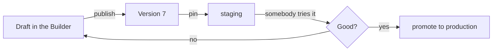

# Umgebungen { #environments }

Einen Agent zu veröffentlichen prägt eine [Version](concepts.md#version). Eine
**Umgebung** ist ein Name, der auf eine davon zeigt — `production`, `staging`,
`dev` —, sodass Sie eine neue Version irgendwo ausprobieren können, bevor alle
ihr begegnen.

Ohne Umgebungen sind Veröffentlichen und Ausliefern ein und dieselbe Handlung.
Mit ihnen sind es zwei Entscheidungen: die Version zu prägen, und sie irgendwohin
zu stellen.

## Was eine Umgebung ist { #what-an-environment-is }

Ein Name, eine Version, an die sie geheftet ist, und optional ein eigenes Ziel
für das Tracing. Jeder Agent hat eine **Standardumgebung**, und die bekommt eine
schlichte Oberfläche, wenn niemand etwas anderes gesagt hat.

| | |
|---|---|
| **Name** | Kleingeschrieben, mit Bindestrichen, bis zu 64 Zeichen — er taucht in URLs auf und wird zum Tracing-Tag, `Production (EU)` und `production-eu` dürfen also nicht zwei Dinge sein |
| **Version** | Welche veröffentlichte Version hier antwortet. Einen ungehefteten Zustand gibt es nicht |
| **Tracks latest** | Ob eine Veröffentlichung diese Umgebung von sich aus umhängt. Standardmäßig aus |
| **Tracing** | Ein Logfire-Write-Token aus dem Vault, damit die Runs dieser Umgebung in ihrem eigenen Projekt landen |

!!! info "Es gibt keine Umgebung ohne Version"

    Eine ungeheftete Umgebung wäre ein Name, der mit nichts antwortet, und die
    erste dorthin geleitete Nachricht würde weit entfernt von dem Formular
    fehlschlagen, das sie angelegt hat. Legen Sie eine an, ohne eine Version zu
    nennen, startet sie bei dem, was die Standardumgebung ausliefert.

## Der Ablauf, für den sie da ist { #the-workflow-it-is-for }

1. Den Draft bearbeiten, veröffentlichen. Das prägt eine Version und ändert
   nichts, was irgendjemand gerade benutzt.
2. `staging` darauf zeigen lassen und Ihren Test-Slack-Bot oder einen privaten
   Link an `staging` binden.
3. Sie gegen echte Fragen ausprobieren.
4. `production` auf dieselbe Version promoten — eine Änderung, kein erneutes
   Veröffentlichen.

Ein Rollback ist derselbe Zug rückwärts: `production` wieder auf die Version
zeigen lassen, die funktioniert hat. Die alte Version ist noch da, noch lesbar,
noch ausführbar.

## `tracks_latest`, und warum es aus ist { #tracks_latest-and-why-it-is-off }

Eine Umgebung mit eingeschaltetem **tracks latest** wird von jeder
Veröffentlichung umgehängt. Das ist die richtige Einstellung für `dev` und fast
nie die richtige für `production`.

Aus ist absichtlich die Voreinstellung: Veröffentlichen prägt eine Version, und
zu entscheiden, wo diese Version läuft, ist eine eigene Handlung. Beides zu
koppeln heißt, dass eine unfertige Änderung einen Kunden erreicht, weil jemand
auf Publish geklickt hat, um seine Arbeit zu sichern.

## Eine Oberfläche an eine binden { #binding-a-surface-to-one }

Eine [Exposure](concepts.md#exposure) — ein Slack-Bot, ein Widget, eine gehostete
Seite, eine API-Zielgruppe — kann die Umgebung nennen, der sie dient. Lässt sie
das weg, bekommt sie die Standardumgebung.

Das macht die Trennung nützlich: ein Dev-Bot, der an `dev` gebunden ist, dient
dem, was `dev` heftet, während das Widget auf Ihrer Website auf `production`
bleibt, bis Sie es bewegen. Ein Agent, zwei Zielgruppen, zwei Versionen, eine
Buchführung.

## Tracing pro Umgebung { #tracing-per-environment }

Eine Umgebung kann ihr eigenes Logfire-Write-Token tragen, versiegelt
[im Vault](secrets.md), dazu einen Dienstnamen. Ihre Runs tracen in dieses
Projekt, getaggt mit dem Namen der Umgebung.

Das hält ein Staging-Experiment aus dem Dashboard heraus, das jemand auf
Produktionsvorfälle hin beobachtet — und es geht pro Umgebung statt pro
Deployment, weil die beiden wirklich verschiedene Projekte sind.

## Was die Standardumgebung nicht ist { #what-the-default-environment-is-not }

Die Standardumgebung wird **vom Veröffentlichen verwaltet**, nicht von dieser
API. Sie können sie nicht löschen, keine andere Umgebung auf sie umbenennen und
nicht von Hand umschalten, welche die Standardumgebung ist.

"Was bekommt eine schlichte Oberfläche" in zwei Hände zu legen heißt, dass die
beiden irgendwann uneins sind, und die Uneinigkeit zeigt sich darin, dass ein
Kunde einer Version begegnet, die niemand ausgeliefert hat.

## Zusammenfassung { #recap }

- Eine Umgebung ist ein **Name, der an eine Version geheftet ist**; jeder Agent
  hat eine Standardumgebung.
- Veröffentlichen prägt eine Version. **Sie irgendwohin zu stellen ist eine
  eigene Entscheidung** — deshalb ist `tracks_latest` standardmäßig aus.
- Eine **Oberfläche kann ihre Umgebung nennen**, sodass ein Dev-Bot und ein
  öffentliches Widget verschiedene Versionen eines Agents ausliefern können.
- **Ein Rollback ist ein Umhängen**, weil alte Versionen lesbar und ausführbar
  bleiben.
- Die Standardumgebung wird vom Veröffentlichen verwaltet und ist hier bewusst
  nicht bearbeitbar.
