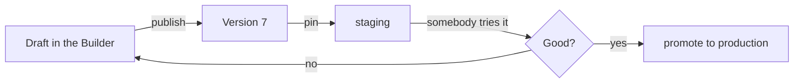

# Umgebungen { #environments }

Einen Agent zu veröffentlichen prägt eine [Version](concepts.md#version). Eine
**Umgebung** ist ein Name, der auf eine davon zeigt — `production`, `staging`,
`dev` —, sodass Sie eine neue Version irgendwo ausprobieren können, bevor alle
ihr begegnen.

Ohne Umgebungen sind Veröffentlichen und Ausliefern ein und dieselbe Handlung.
Mit ihnen sind es zwei Entscheidungen: die Version zu prägen, und sie irgendwohin
zu stellen.

## Was eine Umgebung ist { #what-an-environment-is }

Ein Name, eine Version, an die sie geheftet ist, und optional ein eigenes Ziel
für das Tracing. Jeder Agent hat eine **Standardumgebung**, und die bekommt eine
schlichte Oberfläche, wenn niemand etwas anderes gesagt hat.

| | |
|---|---|
| **Name** | Kleingeschrieben, mit Bindestrichen, bis zu 64 Zeichen — er taucht in URLs auf und wird zum Tracing-Tag, `Production (EU)` und `production-eu` dürfen also nicht zwei Dinge sein |
| **Version** | Welche veröffentlichte Version hier antwortet. Einen ungehefteten Zustand gibt es nicht |
| **Tracks latest** | Ob eine Veröffentlichung diese Umgebung von sich aus umhängt. Standardmäßig aus |
| **Tracing** | Ein Logfire-Write-Token aus dem Vault, damit die Runs dieser Umgebung in ihrem eigenen Projekt landen |

!!! info "Es gibt keine Umgebung ohne Version"

    Eine ungeheftete Umgebung wäre ein Name, der mit nichts antwortet, und die
    erste dorthin geleitete Nachricht würde weit entfernt von dem Formular
    fehlschlagen, das sie angelegt hat. Legen Sie eine an, ohne eine Version zu
    nennen, startet sie bei dem, was die Standardumgebung ausliefert.

## Der Ablauf, für den sie da ist { #the-workflow-it-is-for }

```mermaid
flowchart LR
    D[Draft in the Builder] -->|publish| V[Version 7]
    V -->|pin| S[staging]
    S -->|somebody tries it| OK{Good?}
    OK -->|yes| P[promote to production]
    OK -->|no| D
```

1. Den Draft bearbeiten, veröffentlichen. Das prägt eine Version und ändert
   nichts, was irgendjemand gerade benutzt.
2. `staging` darauf zeigen lassen und Ihren Test-Slack-Bot oder einen privaten
   Link an `staging` binden.
3. Sie gegen echte Fragen ausprobieren.
4. `production` auf dieselbe Version promoten — eine Änderung, kein erneutes
   Veröffentlichen.

Ein Rollback ist derselbe Zug rückwärts: `production` wieder auf die Version
zeigen lassen, die funktioniert hat. Die alte Version ist noch da, noch lesbar,
noch ausführbar.

## `tracks_latest`, und warum es aus ist { #tracks_latest-and-why-it-is-off }

Eine Umgebung mit eingeschaltetem **tracks latest** wird von jeder
Veröffentlichung umgehängt. Das ist die richtige Einstellung für `dev` und fast
nie die richtige für `production`.

Aus ist absichtlich die Voreinstellung: Veröffentlichen prägt eine Version, und
zu entscheiden, wo diese Version läuft, ist eine eigene Handlung. Beides zu
koppeln heißt, dass eine unfertige Änderung einen Kunden erreicht, weil jemand
auf Publish geklickt hat, um seine Arbeit zu sichern.

Die eine Ausnahme ist das `production`, das die erste Veröffentlichung anlegt.
Solange es die einzige Umgebung des Agents ist, gibt es nichts, von dem aus man
heraufstufen könnte, also folgt es Veröffentlichungen; heften Sie es an, sobald ein
`dev` oder ein `staging` daneben steht.

## Eine Oberfläche an eine binden { #binding-a-surface-to-one }

Eine [Exposure](concepts.md#exposure) — ein Slack-Bot, ein Widget, eine gehostete
Seite, eine API-Zielgruppe — kann die Umgebung nennen, der sie dient. Lässt sie
das weg, bekommt sie die Standardumgebung.

Das macht die Trennung nützlich: ein Dev-Bot, der an `dev` gebunden ist, dient
dem, was `dev` heftet, während das Widget auf Ihrer Website auf `production`
bleibt, bis Sie es bewegen. Ein Agent, zwei Zielgruppen, zwei Versionen, eine
Buchführung.

Eine Seite, die der Agent veröffentlicht, folgt derselben Trennung. Ein Run in
einer benannten Umgebung veröffentlicht ein eigenes
[App](artifacts.md#one-name-one-link), sodass ein Versuch mit `dev` am
Wochenbericht nie die Seite neu veröffentlicht, die Leser in Produktion öffnen.
Eine Umgebung mit einem Run, der noch läuft oder auf eine Freigabe wartet, lässt
sich erst entfernen, wenn der Run endet: Das Löschen würde diesen Run der Standardumgebung übergeben und seine
Seiten denen von Produktion.

## Aus dem Builder heraus ausprobieren { #trying-it-from-the-builder }

**Testen** im Kopf des Builders öffnet einen Chat neben dem Builder statt darüber -
denselben Chat wie `/chat`, mit Streaming, Tool-Schritten, Freigabekarten und
Rückfragen. Er antwortet als **Entwurf**, mit Ihren unveröffentlichten Änderungen,
oder als Version einer beliebigen Umgebung, und sagt, welche. Für einen Test des
Entwurfs wird nichts veröffentlicht: Er muss die Prüfungen einer Veröffentlichung
bestehen, und nur wer den Agent bearbeiten darf, kann ihn ausführen. Ein Run, der
auf eine Freigabe wartet, setzt auf dem Entwurf fort, wie er beim Start des Runs
war.

Jede Runde dort ist ein **Test-Run**: budgetiert und aufgezeichnet wie jeder
andere, in der Aktivität als `Test` markiert und dort filterbar (**Mit Test-Runs**,
**Ohne Test-Runs**, **Nur Test-Runs**; `?test=true` oder `false` an
`GET /api/v1/runs`). Der Bereich startet ein neues Gespräch, sendet nach einer
Änderung die letzte Nachricht erneut und behält ein paar angeheftete Prompts, die
sich mit einem Klick erneut ausführen lassen. Seine Breite, was antwortet, und die
angehefteten Prompts werden pro Agent im Browser gespeichert. Der Chat-Frame sendet
in jeder Runde `draft: true` oder `test: true` mit einer `environment_id`.

**Vergleichen** stellt zwei Chats nebeneinander - den Entwurf und die Produktion
oder zwei Umgebungen -, und das Feld darüber fragt beide gleichzeitig dasselbe,
sodass sich die Antworten nur darin unterscheiden, was antwortet. **Was der
Entwurf ändert** zeigt den Entwurf gegenüber der veröffentlichten Version, als
denselben Diff, den die Versionshistorie zeichnet. Ein Druck auf <kbd>T</kbd>
irgendwo im Builder, außerhalb eines Textfelds, öffnet oder schließt den Bereich.

## Tracing pro Umgebung { #tracing-per-environment }

Eine Umgebung kann ihr eigenes Logfire-Write-Token tragen, versiegelt
[im Vault](secrets.md), dazu einen Dienstnamen. Ihre Runs tracen in dieses
Projekt, getaggt mit dem Namen der Umgebung.

Das hält ein Staging-Experiment aus dem Dashboard heraus, das jemand auf
Produktionsvorfälle hin beobachtet — und es geht pro Umgebung statt pro
Deployment, weil die beiden wirklich verschiedene Projekte sind.

Wohin die Traces gehen, gehört der Umgebung; *wie viel sie tragen*, dem Agent.
Der [observability](reference/spec.md#observability)-Block eines Agents hat einen
`content`-Modus: `full` zeichnet die Nachricht, die Ausgabe des Modells und jedes
Tool-Argument auf, `none` nur Zeit, Tokens, Kosten und Tool-Namen. Bei einem
Projekt über Gesundheits-, Rechts- oder HR-Daten ist `none` das, was eine Kopie
der geschützten Inhalte davon abhält, die Maschine zu verlassen. Das Token der
Umgebung leitet den Run um, überschreibt diese Wahl aber nicht.

## Was die Standardumgebung nicht ist { #what-the-default-environment-is-not }

Die Standardumgebung wird **vom Veröffentlichen verwaltet**, nicht von dieser
API. Sie können sie nicht löschen, keine andere Umgebung auf sie umbenennen und
nicht von Hand umschalten, welche die Standardumgebung ist.

"Was bekommt eine schlichte Oberfläche" in zwei Hände zu legen heißt, dass die
beiden irgendwann uneins sind, und die Uneinigkeit zeigt sich darin, dass ein
Kunde einer Version begegnet, die niemand ausgeliefert hat.

## Zusammenfassung { #recap }

- Eine Umgebung ist ein **Name, der an eine Version geheftet ist**; jeder Agent
  hat eine Standardumgebung.
- Veröffentlichen prägt eine Version. **Sie irgendwohin zu stellen ist eine
  eigene Entscheidung** — deshalb ist `tracks_latest` bei einer Umgebung aus, die
  Sie hinzufügen; das `production` der ersten Veröffentlichung folgt, bis Sie es
  anheften.
- Eine **Oberfläche kann ihre Umgebung nennen**, sodass ein Dev-Bot und ein
  öffentliches Widget verschiedene Versionen eines Agents ausliefern können.
- **Ein Rollback ist ein Umhängen**, weil alte Versionen lesbar und ausführbar
  bleiben.
- Die Standardumgebung wird vom Veröffentlichen verwaltet und ist hier bewusst
  nicht bearbeitbar.
