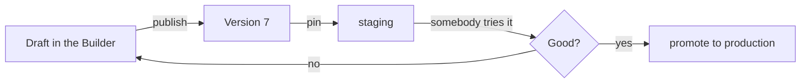

# Entornos { #environments }

Publicar un agent acuña una [versión](concepts.md#version). Un **entorno** es un
nombre que apunta a una de ellas — `production`, `staging`, `dev` — para que
puedas probar una versión nueva en algún sitio antes de que la conozca todo el
mundo.

Sin entornos, publicar y lanzar son el mismo acto. Con ellos son dos decisiones:
acuñar la versión, y ponerla en algún sitio.

## Qué es un entorno { #what-an-environment-is }

Un nombre, una versión a la que está fijado y, opcionalmente, su propio destino de
trazas. Todos los agents tienen un entorno **por defecto**, y eso es lo que recibe
una superficie corriente cuando nadie ha dicho otra cosa.

| | |
|---|---|
| **Nombre** | En minúsculas, con guiones, hasta 64 caracteres — aparece en las URL y se convierte en la etiqueta de trazas, así que `Production (EU)` y `production-eu` no pueden ser dos cosas |
| **Versión** | Qué versión publicada responde aquí. No existe un estado sin fijar |
| **Tracks latest** | Si publicar reapunta este entorno por su cuenta. Desactivado por defecto |
| **Trazas** | Un write token de Logfire sacado del vault, para que los runs de este entorno aterricen en su propio proyecto |

!!! info "No hay entorno sin versión"

    Un entorno sin fijar sería un nombre que no responde con nada, y el primer
    mensaje enrutado a él fallaría muy lejos del formulario que lo creó. Créalo
    sin nombrar una versión y arranca con lo que sirva el entorno por defecto.

## El flujo de trabajo para el que existe { #the-workflow-it-is-for }

1. Edita el draft y publica. Eso acuña una versión y no cambia nada de lo que
   nadie esté usando.
2. Apunta `staging` a ella, y liga tu bot de Slack de pruebas o un enlace privado
   a `staging`.
3. Pruébala contra preguntas reales.
4. Promociona `production` a esa misma versión — una edición, sin volver a
   publicar.

Volver atrás es el mismo movimiento en sentido contrario: reapuntar `production` a
la versión que funcionaba. La versión antigua sigue ahí, sigue siendo legible y
sigue siendo ejecutable.

## `tracks_latest`, y por qué está desactivado { #tracks_latest-and-why-it-is-off }

Un entorno con **tracks latest** activado se reapunta con cada publicación. Ese es
el ajuste correcto para `dev` y casi nunca el correcto para `production`.

Que esté desactivado por defecto es deliberado: publicar acuña una versión, y
decidir dónde se ejecuta esa versión es un acto aparte. Acoplarlos significa que
una edición sin terminar llega a un cliente porque alguien pulsó Publish para
guardar su trabajo.

## Ligar una superficie a uno { #binding-a-surface-to-one }

Una [exposición](concepts.md#exposure) — un bot de Slack, un widget, una página
alojada, una audiencia de la API — puede nombrar el entorno al que sirve. Si se
omite, recibe el de por defecto.

Eso es lo que hace útil la separación: un bot de desarrollo ligado a `dev` sirve
lo que `dev` tenga fijado, mientras el widget de tu web se queda en `production`
hasta que tú lo muevas. Un agent, dos audiencias, dos versiones, una sola
contabilidad.

## Trazas por entorno { #tracing-per-environment }

Un entorno puede llevar su propio write token de Logfire, sellado en
[el vault](secrets.md), más un nombre de servicio. Sus runs trazan en ese
proyecto, etiquetados con el nombre del entorno.

Esto es lo que mantiene un experimento de staging fuera del dashboard que alguien
vigila por los incidentes de producción — y es por entorno y no por despliegue
porque los dos son proyectos genuinamente distintos.

## Lo que el entorno por defecto no es { #what-the-default-environment-is-not }

El de por defecto lo **gestiona la publicación**, no esta API. No puedes borrarlo,
renombrar otro entorno encima de él ni cambiar a mano cuál es el de por defecto.

Poner "qué recibe una superficie corriente" en dos manos significa que tarde o
temprano no se pondrán de acuerdo, y ese desacuerdo aflora como un cliente que se
encuentra con una versión que nadie lanzó.

## Recapitulación { #recap }

- Un entorno es un **nombre fijado a una versión**; todos los agents tienen uno
  por defecto.
- Publicar acuña una versión. **Ponerla en algún sitio es una decisión aparte** —
  por eso `tracks_latest` está desactivado por defecto.
- Una **superficie puede nombrar su entorno**, así que un bot de desarrollo y un
  widget público pueden servir versiones distintas de un mismo agent.
- **Volver atrás es reapuntar**, porque las versiones antiguas siguen siendo
  legibles y ejecutables.
- El entorno por defecto lo gestiona la publicación, y deliberadamente no se edita
  aquí.
