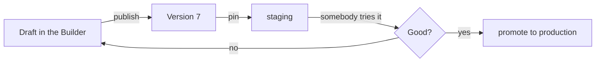

# Environments

Publishing an agent mints a [version](concepts.md#version). An **environment** is
a name that points at one of them — `production`, `staging`, `dev` — so you can
try a new version somewhere before everybody meets it.

Without environments, publish and release are the same act. With them, they are
two decisions: minting the version, and putting it somewhere.

## What an environment is

A name, a version it is pinned to, and optionally its own tracing destination.
Every agent has a **default** environment, and that is what a plain surface gets
when nobody said otherwise.

| | |
|---|---|
| **Name** | Lower-case, hyphenated, up to 64 characters — it appears in URLs and becomes the tracing tag, so `Production (EU)` and `production-eu` must not be two things |
| **Version** | Which published version answers here. There is no unpinned state |
| **Tracks latest** | Whether publishing repoints this environment on its own. Off by default |
| **Tracing** | A Logfire write token from the vault, so this environment's runs land in their own project |

!!! info "There is no environment without a version"

    An unpinned environment would be a name that answers with nothing, and the
    first message routed to it would fail a long way from the form that created
    it. Create one without naming a version and it starts at whatever the
    default serves.

## The workflow it is for

1. Edit the draft, publish. That mints a version and changes nothing anybody is
   using.
2. Point `staging` at it, and bind your test Slack bot or a private link to
   `staging`.
3. Try it against real questions.
4. Promote `production` onto the same version — one edit, no republishing.

Rolling back is the same move backwards: repoint `production` at the version
that worked. The old version is still there, still readable, still runnable.

## `tracks_latest`, and why it is off

An environment with **tracks latest** on is repointed by every publish. That is
the right setting for `dev` and almost never right for `production`.

Off is the default deliberately: publishing mints a version, and deciding where
that version runs is a separate act. Coupling them means an unfinished edit
reaches a customer because somebody clicked Publish to save their work.

## Binding a surface to one

An [exposure](concepts.md#exposure) — a Slack bot, a widget, a hosted page, an
API audience — can name the environment it serves. Omitted, it gets the default.

That is what makes the split useful: a dev bot bound to `dev` serves whatever
`dev` pins, while the widget on your website stays on `production` until you
move it. One agent, two audiences, two versions, one set of books.

## Tracing per environment

An environment can carry its own Logfire write token, sealed in
[the vault](secrets.md), plus a service name. Its runs trace into that project,
tagged with the environment's name.

This is what keeps a staging experiment out of the dashboard somebody watches
for production incidents — and it is per environment rather than per deployment
because the two are genuinely different projects.

## What the default environment is not

The default is **managed by publishing**, not by this API. You cannot delete it,
rename another environment onto it, or hand-toggle which one is default.

Putting "what does a plain surface get" into two hands means they eventually
disagree, and the disagreement surfaces as a customer meeting a version nobody
released.

## Recap

- An environment is a **name pinned to a version**; every agent has a default.
- Publishing mints a version. **Putting it somewhere is a separate decision** —
  that is why `tracks_latest` is off by default.
- A **surface can name its environment**, so a dev bot and a public widget can
  serve different versions of one agent.
- **Rolling back is repointing**, because old versions stay readable and
  runnable.
- The default environment is managed by publish, and deliberately not editable
  here.
