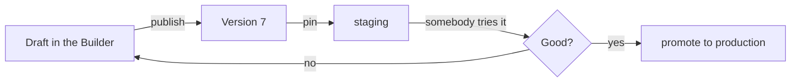

# Środowiska { #environments }

Publikacja agenta wybija [wersję](concepts.md#version). **Środowisko** to nazwa,
która wskazuje na jedną z nich — `production`, `staging`, `dev` — dzięki czemu
możesz wypróbować nową wersję gdzieś, zanim spotkają ją wszyscy.

Bez środowisk publikacja i wydanie to ten sam akt. Ze środowiskami to dwie
decyzje: wybicie wersji i umieszczenie jej gdzieś.

## Czym jest środowisko { #what-an-environment-is }

Nazwą, wersją, do której jest przypięte, i opcjonalnie własnym miejscem
docelowym śladów. Każdy agent ma środowisko **domyślne** i to właśnie ono
obsługuje zwykłą powierzchnię, gdy nikt nie powiedział inaczej.

| | |
|---|---|
| **Nazwa** | Małe litery, z myślnikami, do 64 znaków — pojawia się w URL-ach i staje się tagiem śladów, więc `Production (EU)` i `production-eu` nie mogą być dwiema rzeczami |
| **Wersja** | Która opublikowana wersja tu odpowiada. Nie ma stanu bez przypięcia |
| **Tracks latest** | Czy publikacja sama przekierowuje to środowisko. Domyślnie wyłączone |
| **Ślady** | Token zapisu Logfire z vaulta, żeby runy tego środowiska lądowały we własnym projekcie |

!!! info "Nie ma środowiska bez wersji"

    Nieprzypięte środowisko byłoby nazwą, która odpowiada niczym, a pierwsza
    wiadomość do niego skierowana zawiodłaby daleko od formularza, który je
    utworzył. Utwórz jedno bez nazwania wersji, a zacznie od tego, co serwuje
    środowisko domyślne.

## Przepływ pracy, dla którego to jest { #the-workflow-it-is-for }

1. Edytuj draft, opublikuj. To wybija wersję i nie zmienia niczego, z czego ktoś
   korzysta.
2. Wskaż nią `staging` i podepnij swojego testowego bota Slacka albo prywatny
   link do `staging`.
3. Wypróbuj go na prawdziwych pytaniach.
4. Wypromuj `production` na tę samą wersję — jedna edycja, bez ponownej
   publikacji.

Rollback to ten sam ruch wstecz: przekieruj `production` na wersję, która
działała. Stara wersja wciąż tam jest, wciąż da się ją odczytać i uruchomić.

## `tracks_latest` i dlaczego jest wyłączone { #tracks_latest-and-why-it-is-off }

Środowisko z włączonym **tracks latest** jest przekierowywane przez każdą
publikację. To właściwe ustawienie dla `dev` i prawie nigdy właściwe dla
`production`.

Domyślne wyłączenie jest celowe: publikacja wybija wersję, a decyzja o tym, gdzie
ta wersja działa, jest osobnym aktem. Sprzęgnięcie ich oznacza, że niedokończona
edycja dociera do klienta, bo ktoś kliknął Publish, żeby zapisać swoją pracę.

## Podpinanie powierzchni do środowiska { #binding-a-surface-to-one }

[Ekspozycja](concepts.md#exposure) — bot Slacka, widget, hostowana strona,
odbiorca API — może nazwać środowisko, które obsługuje. Pominięta, dostaje
domyślne.

To właśnie czyni ten podział użytecznym: bot deweloperski podpięty do `dev`
serwuje to, co przypina `dev`, podczas gdy widget na twojej stronie zostaje na
`production`, dopóki go nie przeniesiesz. Jeden agent, dwie publiczności, dwie
wersje, jeden komplet ksiąg.

## Ślady per środowisko { #tracing-per-environment }

Środowisko może nieść własny token zapisu Logfire, zapieczętowany w
[vaulcie](secrets.md), oraz nazwę usługi. Jego runy trafiają do śladów w tamtym
projekcie, otagowane nazwą środowiska.

To właśnie trzyma eksperyment ze stagingu z dala od dashboardu, który ktoś
obserwuje pod kątem incydentów produkcyjnych — i jest per środowisko, a nie per
deployment, bo te dwa to naprawdę różne projekty.

## Czym domyślne środowisko nie jest { #what-the-default-environment-is-not }

Środowisko domyślne jest **zarządzane przez publikację**, a nie przez to API. Nie
możesz go usunąć, przemianować innego środowiska na nie ani ręcznie przełączyć,
które jest domyślne.

Oddanie odpowiedzi na pytanie "co dostaje zwykła powierzchnia" w dwie ręce
oznacza, że one w końcu się poróżnią, a ta różnica wychodzi na jaw jako klient
spotykający wersję, której nikt nie wydał.

## Podsumowanie { #recap }

- Środowisko to **nazwa przypięta do wersji**; każdy agent ma domyślne.
- Publikacja wybija wersję. **Umieszczenie jej gdzieś to osobna decyzja** —
  dlatego `tracks_latest` jest domyślnie wyłączone.
- **Powierzchnia może nazwać swoje środowisko**, więc bot deweloperski i
  publiczny widget mogą serwować różne wersje jednego agenta.
- **Rollback to przekierowanie**, bo stare wersje pozostają czytelne i
  uruchamialne.
- Środowisko domyślne jest zarządzane przez publikację i celowo nie da się go tu
  edytować.
