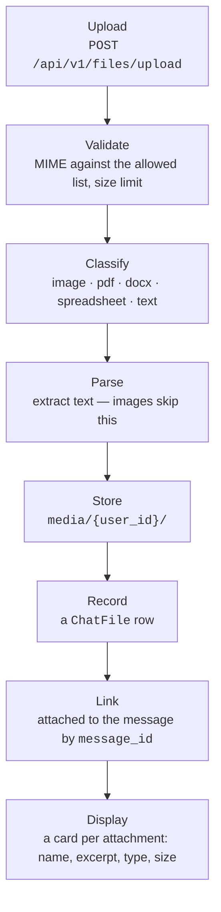
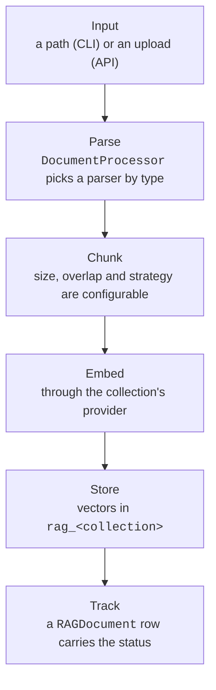

# Dateiverarbeitung { #file-processing }

Dieses Dokument beschreibt, wie Dateien in zwei Zusammenhängen behandelt werden:
Datei-Uploads im Chat, die der Person gehören, die sie gemacht hat, und die
Ingestion von RAG-Dokumenten, die zu einer Collection gehört und daran gebunden
ist, [wer sie erreichen darf](#who-may-reach-a-collection).

## Datei-Uploads im Chat { #chat-file-uploads }

Wenn jemand im Chat eine Datei hochlädt, läuft die folgende Pipeline:

### Ablauf { #flow }



Die Antwort auf den Upload trägt eine `preview` — die ersten drei Zeilen des
extrahierten Textes, begrenzt auf 240 Zeichen — damit die Karte zeigen kann, was
*in* der Datei steht, und nicht nur, wie sie heißt. Der Browser kann das nicht
selbst herleiten: ein PDF ist Bytes, bis dieser Dienst es geparst hat, und der
Client hält eine Id und einen Dateinamen, sobald der Upload geantwortet hat. Sie
ist `null` für ein Bild und für eine Datei, die kein Parser lesen konnte, und
eine Karte ohne Auszug zeigt ihr Vorschaubild oder allein ihren Namen.

### Die blockierende Arbeit läuft außerhalb des Request-Loops, auf einem eigenen Pool { #the-blocking-work-runs-off-the-request-loop-on-its-own-pool }

Einen Upload zu parsen — PyMuPDF über jede Seite, openpyxl über jede Zelle, ein
Dekodieren der ganzen Datei — und seine Bytes zu lesen oder zu schreiben, ist
blockierend und hat keinen Unterbrechungspunkt. Deshalb läuft es auf einem
Thread statt auf dem Request-Loop; ein einziger großer Upload würde sonst jede
andere Anfrage und jeden Agent-Stream auf dem Worker einfrieren.

Sie laufen auf einem **dedizierten, begrenzten** Pool (`app/core/blocking.py`,
dimensioniert über `FILE_IO_MAX_WORKERS`), nicht auf dem gemeinsamen
Default-Executor von `asyncio`. Dieser Executor trägt auch das Passwort-Hashing
mit `bcrypt` und das DNS für angeheftete Hosts, und ein Schwall von Uploads darf
dort nicht jeden Worker besetzen und Anmeldung und ausgehende Anfragen hinter
einem unbegrenzten Rückstau von Upload-Puffern warten lassen
([#1108](https://github.com/vstorm-co/agenticos/issues/1108)).

Der Schreibvorgang ist außerdem **abbruchsicher**. Ein Executor kann ein
laufendes `write_bytes` nicht unterbrechen, deshalb wartet ein abgebrochener
Upload das Schreiben ab und löscht die Datei, die er angelegt hat — der Aufrufer
erhält nie einen Speicherpfad, könnte die Waise also weder verzeichnen noch
aufräumen.

### Die ganze Seite ist das Ablageziel { #the-whole-page-is-the-drop-target }

Eine über den Chat gezogene Datei wird **überall auf ihm** angenommen, nicht auf
dem Eingabefeld. Das Eingabefeld war das einzige Ziel, was das Anhängen zu einem
Spiel machte, einen wenige Zentimeter hohen Streifen zu treffen — und ihn zu
verfehlen war kein Nichts: die Vorgabe des Browsers für eine abgelegte Datei ist,
sie zu *öffnen*, also navigierte der Tab von der Unterhaltung weg und von allem,
was halb getippt darin stand. Dasselbe `preventDefault`, das die Seite die Datei
nehmen lässt, hindert den Browser daran, sie zu nehmen; auf dem Fenster zu
lauschen behebt also beide Hälften auf einmal.

Während eine Datei über der Seite schwebt, legt sich eine Überlagerung darüber:
der Grund unscharf, eine gestrichelte Karte in der Mitte, und die Größengrenze
pro Datei darauf geschrieben — ein 60-MB-Video, das *nach* dem Ziehen abgelehnt
wird, ist ein Hin und Her, das niemand hätte machen müssen. Sie wird per Portal
in den Body gehängt statt vom Eingabefeld aus positioniert, denn `fixed` wird
gegen den nächsten transformierten Vorfahren gemessen, und ein einziges
`backdrop-blur` auf einem Wrapper darüber würde die Überlagerung still in eine
Ecke schrumpfen.

Zwei Dinge tut sie bewusst nicht. Ein Ziehen, das etwas **anderes** als Dateien
trägt — markierter Text, ein Link, eine der ziehbaren Zeilen der App selbst —
wird völlig in Ruhe gelassen, nicht einmal unterbunden. Und nichts wird
angenommen, solange das Eingabefeld deaktiviert ist: eine archivierte
Unterhaltung, ein Run, der auf eine Freigabe wartet. Dass die Überlagerung nicht
erscheint, sagt genau das.

### Ein langer Einfügevorgang ist eine Datei { #a-long-paste-is-a-file }

Mehr als **2000 Zeichen** in das Eingabefeld einzufügen lädt den Text als
`pasted-<date>.txt` hoch, statt ihn einzusetzen. Das Textfeld bleibt unberührt,
die Frage wird also neben das getippt, worum es geht, und das Transkript hält
einen Anhang statt einer einzigen riesigen Sprechblase.

Die Schwelle ist der ganze Entwurf. Wer einen Absatz einfügt und die
Eingabetaste drückt, wollte, dass das die Nachricht *ist*, deshalb liegt sie über
allem, was ein Mensch als Frage einfügen würde — grob 350 Wörter — und unter
jedem Dokument. Darunter hat sich nichts geändert: der Text landet im Textfeld
wie eh und je.

Danach ist es ein gewöhnlicher `text/plain`-Anhang, und alles Weitere unten gilt
unverändert für ihn, und genau das ist der Punkt: ein Agent mit einem Workspace
bekommt das Eingefügte als Datei, die er öffnen kann, und einer ohne bekommt den
Text in seinem Prompt.

### Unterstützte Dateitypen { #supported-file-types }

| Kategorie | MIME-Typen | Endungen | Verarbeitung |
|----------|-----------|------------|------------|
| **Bilder** | image/jpeg, image/png, image/webp, image/gif | .jpg, .png, .webp, .gif | Unverändert gespeichert. Als `BinaryContent` an das LLM zur Bildanalyse gesendet. |
| **PDF** | application/pdf | .pdf | Text über den konfigurierten PDF-Parser extrahiert. Als Kontext an den Prompt angehängt. |
| **DOCX** | application/vnd.openxmlformats-officedocument.wordprocessingml.document | .docx | Absätze über `python-docx` extrahiert. Als Kontext an den Prompt angehängt. |
| **Tabelle** | …spreadsheetml.sheet, …ms-excel.sheet.macroEnabled.12 | .xlsx, .xlsm | Jedes Blatt über `openpyxl` gelesen, benannt, Zeilen tabulatorgetrennt. Als Kontext an den Prompt angehängt. `.xls` wird abgelehnt — ein anderes Format, das einen anderen Leser braucht. |
| **Text** | text/plain, text/markdown | .txt, .md | Direkt als UTF-8 dekodiert. Als Kontext an den Prompt angehängt. |

### Wohin ein Anhang geht, hängt vom Agent ab { #where-an-attachment-goes-depends-on-the-agent }

Die Spalte "an den Prompt angehängt" oben beschreibt, was mit einem Agent **ohne
Workspace** geschieht, und zwar mit der ganzen Datei, in jeder Runde. Ein
zweihundertseitiger Bericht kostet sein volles Token-Gewicht, wenn die erste
Frage gestellt wird, und noch einmal bei "und wie war es im März"; eine
fünfzig Megabyte große CSV lässt sich gar nicht anhängen.

Ein Agent mit der [Capability `sandbox`](reference/capabilities.md#files-shell)
bekommt die Datei statt des Textes:

| Anhang | Ohne Workspace | Mit einem Workspace |
|---|---|---|
| text, csv, md, json | geparster Text inline eingefügt | nach `uploads/` geschrieben, die Nachricht trägt eine Referenz und die ersten 20 Zeilen |
| pdf, docx, Tabelle | geparster Text inline eingefügt | nach `uploads/` geschrieben, mit dem extrahierten Text daneben, sofern die Laufzeitumgebung sie nicht selbst lesen kann; Referenz und die ersten 20 Zeilen |
| Bild | `BinaryContent` | `BinaryContent` **und** geschrieben; die Referenz nennt den Pfad |

**Der extrahierte Text kommt nur dort mit, wo nichts das Original lesen kann.**
Eine `.txt` des Parsens wurde früher neben jedes PDF, jede `.docx` und jede
Tabelle geschrieben, mit der Begründung, dass eine Shell für keines davon eine
Bibliothek hat — `read_file` auf einer `.xlsx` liefert Buchstabensalat, und
`run_python` hat überhaupt kein Dateisystem. Auf einer Laufzeitumgebung mit `lit`
ist diese Begründung überholt: `lit parse q3.xlsx -o q3.md` ist ein Befehl, mit
OCR für einen Scan und LibreOffice für die Altformate (`sandbox.md`), das
Geschwister ist also eine zweite Kopie des Dateiinhalts auf der Platte, um einen
Tool-Aufruf zu sparen.

Überall sonst wird sie weiterhin geschrieben, und das Kriterium ist nicht die
Art des Backends: ein `state`-Workspace ist nur Dateien ganz ohne Shell, eine
Daytona-Sandbox und die eigene Laufzeitumgebung eines Deployments tragen, was
ihr Image trägt, und keine davon hat `lit`. Die Bedingung ist, ob dieses
Deployment die Laufzeitumgebung dem Modell *beschrieben* hat — dieselbe
Einweisung, die der Run an seine Instruktionen anhängt. Ist gesagt, dass es `lit`
gibt, kein Geschwister; sonst geht der Text neben die Datei.

Das Parsen geschieht so oder so serverseitig, denn der *Text* ist das, was ein
Agent ohne Workspace bekommt und woraus die 20 Zeilen in der Nachricht stammen.
Den Upload ohne Parsen anzunehmen würde einen Agent mit Workspace als unlesbare
Bytes erreichen und einen ohne Workspace als gar nichts.

**Ein abgelehnter Schreibvorgang wird einmal gesagt, über den Workspace.** Ein
Run, dessen Workspace eine Datei nicht annimmt, ist ein Run, dessen Shell- und
Datei-Tools ebenfalls scheitern werden, und eine Zeile pro Datei kann das nicht
sagen: eine Runde las jeden Fehlschlag als Problem mit dem Befehl, den sie gerade
geschrieben hatte, und versuchte es weiter — `ls`, dann ein `curl` auf eine
`data:`-URI, dann drei Behelfslösungen, der Person angeboten, über zwei Runden
hinweg. Ein Satz sagt jetzt, dass der Workspace nicht verfügbar ist und dass ein
weiterer Versuch auf dieselbe Weise scheitern wird.

Die Referenz ist das, was das Modell tatsächlich liest:

```
Attached file: raport.csv (/uploads/3f2a1b9c-raport.csv, 2.4 MB, text)
First 20 lines:
month,total
jan,10
...
```

Genug, um einen Vertriebsexport von einem Log zu unterscheiden und die
Spaltennamen zu sehen — und genau das braucht das Modell, um zu entscheiden, ob
sich ein Tool-Aufruf für den Rest lohnt. Die Datei hat aufgehört, Kontext zu
sein, und ist zu Daten geworden.

Vier Dinge daran sind Absicht:

- **Bilder gehen beide Wege.** Das Modell muss das Bild weiterhin *sehen* — dafür
  ist ein multimodales Modell da, und eine Pfadangabe ist kein Ersatz — und es
  muss es auch verkleinern oder zuschneiden können, wofür es Bytes auf einem
  Dateisystem braucht. Oberhalb von `SANDBOX_INLINE_IMAGE_MAX_BYTES` wird nur die
  Datei behalten, denn ab diesem Punkt lohnt es sich nicht mehr, die Bytes zweimal
  zu bezahlen.
- **Ein PDF bekommt beide Hälften.** Die Bytes sind das, worum jemand gebeten hat;
  der Text, den diese Plattform ohnehin extrahiert hat, ist die Hälfte, die eine
  Shell tatsächlich lesen kann.
- **Dieselbe Datei wird einmal geschrieben.** Der Pfad wird aus der `ChatFile`-Id
  abgeleitet, sie in Runde fünf erneut anzuhängen löst sich also auf den Pfad auf,
  den sie schon hat — ein Upload kostet einen Schreibvorgang, nicht einen pro
  Runde für den Rest der Unterhaltung.
- **Dem Dateinamen wird nicht vertraut.** Aus `../../etc/passwd` wird
  `etc_passwd`; zwei Dateien namens `report.csv` können einander nicht
  überschreiben.

Eine Datei, die nicht gespeichert werden kann — ein voller Workspace — fällt auf
den Inline-Weg zurück, statt zu verschwinden, und eine, die der Dateispeicher
nicht laden kann, wird übersprungen, statt die Runde scheitern zu lassen: die
Person hat eine Frage gestellt, und ohne den Anhang zu antworten ist besser, als
nicht zu antworten.

Das Routing geschieht in `app/services/attachments.py`, aufgerufen vom
Chat-Runner statt von jeder Oberfläche einzeln. Es muss dort liegen: wohin eine
Datei geht, hängt davon ab, ob der Agent einen Workspace hat, und das entscheidet
`prepare`, das noch nicht gelaufen ist, wenn eine Oberfläche ihren Prompt
zusammenbaut.

### PDF-Parsing (Chat) { #pdf-parsing-chat }

Chat-Anhänge werden mit **PyMuPDF** gelesen, und das ist nicht konfigurierbar.
Ein Anhang gehört zu keiner Collection, es gibt also keine gespeicherte
Konfiguration, aus der eine Parser-Wahl gelesen werden könnte.

Die Variable `CHAT_PDF_PARSER`, die früher zwischen drei Parsern wählte, gibt es
nicht mehr. Beide Alternativen waren in `except Exception: return
self._parse_pdf_pymupdf(data)` gehüllt, ein Deployment, das sie auf `llamaparse`
oder `liteparse` setzte, benutzte also stillschweigend ohnehin PyMuPDF — und der
LiteParse-Zweig hätte überhaupt nicht funktionieren können, denn er rief eine
Methode `parse_async` auf, die die Anbindung nicht definiert.

### Größengrenzen { #size-limits }

!!! warning "Zwei Obergrenzen, und der Browser hat seine eigene Kopie der einen"

    Ein Chat-Anhang wird von `CHAT_MAX_UPLOAD_SIZE_MB` (10 MB) abgelehnt, ein
    Dokument der Wissensdatenbank von `MAX_UPLOAD_SIZE_MB` (50 MB). Der
    Frontend-Container liest dasselbe `CHAT_MAX_UPLOAD_SIZE_MB` zur Laufzeit,
    geben Sie also beiden Containern einen Wert: zu hoch auf der Browser-Seite und
    das Eingabefeld nimmt eine Datei an, die die API ablehnt, zu niedrig und es
    lehnt eine ab, die die API genommen hätte.

- Maximale Anhangsgröße: `CHAT_MAX_UPLOAD_SIZE_MB` (Vorgabe: **10 MB**). Das ist
  die eigene Grenze dieses Abschnitts — ein Chat-Anhang wird von dieser Zahl
  abgelehnt, nicht vom größeren `MAX_UPLOAD_SIZE_MB` der Wissensdatenbank, und die
  beiden sind getrennte Einstellungen, weil ein Anhang an einen Agent ohne
  Workspace ganz in den Prompt eingefügt wird, während ein Dokument der
  Wissensdatenbank gechunkt und eingebettet wird.
- Ein Dokument der Wissensdatenbank ist stattdessen durch `MAX_UPLOAD_SIZE_MB`
  gedeckelt (Vorgabe: **50 MB**).
- Der ganze Anfragekörper ist über beiden gedeckelt, beim größeren der beiden plus
  einem Zuschlag für Multipart, das Anheben einer der Obergrenzen hebt also diese
  mit an.
- Die Grenze wird serverseitig durchgesetzt, nachdem der Dateiinhalt gelesen wurde.
  Die eigene Prüfung des Browsers liest dasselbe `CHAT_MAX_UPLOAD_SIZE_MB` aus der
  Umgebung des Frontend-Containers, den beiden Containern sollte also ein Wert
  gegeben werden: zu hoch und das Eingabefeld nimmt eine Datei an, die die API
  ablehnt, zu niedrig und es lehnt eine ab, die die API genommen hätte.

### Speicherung { #storage }

Dateien werden vom `FileStorageService` in das Verzeichnis `media/` gespeichert:

```
media/
  {user_id}/
    document.pdf
    screenshot.png
    ...
```

### Das Modell ChatFile { #chatfile-model }

Das Datenbankmodell `ChatFile` verfolgt hochgeladene Dateien:

| Feld | Typ | Beschreibung |
|-------|------|-------------|
| `id` | UUID | Primärschlüssel |
| `user_id` | UUID/FK | Eigentümer (für die Zugriffskontrolle verwendet) |
| `filename` | String | Ursprünglicher Dateiname |
| `mime_type` | String | MIME-Typ (z. B. `application/pdf`) |
| `size` | Integer | Dateigröße in Bytes |
| `storage_path` | String | Relativer Pfad im Speicher |
| `file_type` | String | Klassifizierter Typ: `image`, `pdf`, `docx`, `spreadsheet`, `text` |
| `parsed_content` | Text | Extrahierter Textinhalt (NULL bei Bildern) |
| `message_id` | UUID/FK | Verknüpfte Nachricht (gesetzt beim Senden der Nachricht) |
| `created_at` | DateTime | Zeitpunkt des Uploads |

### Eigentum und Zugriff { #ownership-access }

- Nur der Eigentümer einer Datei kann seine Dateien herunterladen (`GET /files/{id}`).
- Die Methode `FileUploadService.get_user_file()` vergleicht `chat_file.user_id`
  mit der Id des anfragenden Nutzers. Bei Nichtübereinstimmung liefert sie
  `NotFoundError`.
- **Eigentum ist die ganze Regel, und nichts weitet sie.** Keine Berechtigung,
  keine Rolle in einer Organisation und kein Grant erreicht über diese API die
  Chat-Datei einer anderen Person — anders als eine Collection, die ein Grant
  öffnen kann. Verglichen wird gegen `user_id`, und es gibt keinen zweiten Zweig,
  der einen weiteren Fall halten könnte.
- **Der Verknüpfungsschritt nimmt dieselbe Regel.** Eine Nachricht hängt nur die
  eigenen *nicht verknüpften* Dateien der absendenden Person an: eine Id, die die
  Datei eines anderen Nutzers nennt, oder eine, die bereits an einer Nachricht
  hängt, wird abgelehnt statt still angewendet — eine Runde kann also weder den
  Dateinamen einer fremden Person darstellen noch einen Anhang von der Nachricht
  ziehen, an der er schon hängt.

## Ingestion von RAG-Dokumenten { #rag-document-ingestion }

Wenn Dokumente in die RAG-Wissensdatenbank eingelesen werden (über CLI oder API),
übernimmt eine andere Pipeline das Parsen, Chunken und Einbetten.

### Ablauf der Ingestion { #ingestion-flow }



!!! note "Über die API ist die Reihenfolge umgekehrt"

    Die `RAGDocument`-Zeile wird **zuerst** geschrieben, und die vier mittleren
    Schritte laufen in einer Hintergrundaufgabe mit einer eigenen Session - und
    deshalb antwortet ein Upload mit `202 {"status": "processing"}`, statt zu
    warten.

Es gibt zwei Adressen, an denen ein Upload ankommen kann —
`POST /rag/collections/{name}/ingest` und `POST /kb/{kb_id}/documents` — und
beide antworten mit **202** und derselben `RAGIngestResponse`, mit jedem Feld
davon, `"document_id": null` eingeschlossen. Die Id des Dokuments im Vektorspeicher
existiert nicht, bevor der Worker es indexiert hat.

Eine der beiden ließ den Schlüssel früher weg, statt ihn null zu senden, ein
Client, der die Antwort normalisierte, bekam also von jeder eine andere Form
([#560](https://github.com/vstorm-co/agenticos/issues/560)).

!!! danger "Die Aufgabe wird gestartet, nachdem die Transaktion der Anfrage committet"

    Sie wird mit `spawn_after_commit` übergeben, **nicht** mit `spawn`, und von der
    Session selbst gestartet, sobald die Zeile dauerhaft ist.

    Früher losgeschickt würde sie das Dokument über seine Id suchen, nichts finden
    und anhalten — und den Upload, den sie bereits bestätigt hatte, für immer in
    `processing` zurücklassen
    ([#417](https://github.com/vstorm-co/agenticos/issues/417)).

Dasselbe gilt für einen Sync: die `SyncLog`-Zeile existiert vor ihrem Flow. Siehe
[Hintergrundarbeit aus einer Anfrage heraus anstoßen](architecture.md#dispatching-background-work-from-a-request).

**Jeder Flow baut seine eigene Engine für den Vektorspeicher und verwirft sie mit
der Arbeit des Flows.**

**Ein Loop besitzt die Pools des Prozesses, und alles andere baut seine eigene
Engine.** Die Lifespan der API beansprucht sie beim Start: sie bedient jede
Anfrage und verwirft sie beim Herunterfahren, sie ist also der eine Loop, dessen
Verbindungen sie zwischenspeichern dürfen. Außerhalb dieses Loops verhält sich
`get_db_context` wie `get_worker_db_context` — eine `NullPool`-Engine für den
Aufruf, am Ende verworfen — denn es wird aus Prefect-Flows erreicht (der Bericht,
die MCP-Aktualisierung, Einladungs- und Freigabeaufgaben, die Kanal-Loops) und
aus dem Embedding-Resolver eines Agents, jeweils auf einem eigenen Loop
([#1079](https://github.com/vstorm-co/agenticos/issues/1079)).

Die Wissenssuche eines Agents folgt derselben Regel für ihren Vektorspeicher: der
Prozessspeicher auf dem besitzenden Loop und `agent_vector_engine` — ohne Pool —
überall sonst. Er ist der eine Vektor-Aufrufer, der nicht wissen kann, auf welchem
Loop er ist, und sein Retrieval-Speicher ist für die Lebensdauer des Prozesses
zwischengespeichert; ein gepoolter Speicher, den sich zwei Loops in einem Worker
teilen, gibt dem zweiten eine Verbindung, die der erste geöffnet hat. Den Pool
für die API zu behalten begrenzt das: `NullPool` öffnet eine Verbindung je
Entnahme und deckelt nichts, während der Pool bei
`DB_POOL_SIZE + DB_MAX_OVERFLOW` in eine Warteschlange geht.

### Unterstützte Formate { #supported-formats }

`.txt`, `.md` und `.docx` werden von den eingebauten Python-Parsern gelesen,
gleich welchen Parser die Collection hat. Darüber hinaus folgt die Menge dem
Parser:

| Parser | Liest außerdem | Braucht |
|--------|-----------|-------|
| PyMuPDF | `.pdf` | nichts |
| LiteParse | `.pdf`; Bilder (`.png`, `.jpg`, `.tiff`, `.svg`, …); Office-Formate (`.xlsx`, `.pptx`, `.odt`, `.csv`, `.rtf`, …) | LibreOffice **nur für Office-Formate** — Bilder werden nativ konvertiert |
| LlamaParse | `.pdf`, `.pptx`, `.xlsx`, `.csv`, `.rtf`, `.epub`, `.html`, Bilder | `LLAMAPARSE_API_KEY` |

Das Dockerfile des Backends installiert LibreOffice und Tesseract, Office-Formate
und OCR funktionieren im Container also von Haus aus. Läuft das Backend außerhalb
von Docker, wird ein Office-Upload in eine LiteParse-Collection mit einer
Meldung abgelehnt, die LibreOffice nennt, statt während der Konvertierung zu
scheitern.

`GET /api/v1/rag/supported-formats?parser=liteparse` antwortet für einen Parser.
Diese Mengen sind das, was `DocumentProcessor` tatsächlich routen kann —
festgehalten von `backend/tests/test_supported_formats.py`, denn früher waren sie
Wunschdenken: eine `.xlsx` wurde angenommen, gespeichert, bekam eine Dokumentzeile
und wurde losgeschickt, und starb dann im Worker als "Unsupported file type".

### Parser-Wahl (RAG) { #parser-selection-rag }

Pro Collection, auf `/rag`, und pro Upload überschreibbar — keine
Umgebungsvariable. Gespeichert auf `knowledge_bases.ingestion_config`.

| Parser | Am besten für |
|--------|----------|
| PyMuPDF (Vorgabe) | Schnelle lokale Verarbeitung, textlastige Dokumente; der einzige, der eingebettete Bilder zur Beschreibung extrahiert |
| LiteParse | Lokal, ohne Schlüssel, layoutbewusst; liest Office-Formate und Bilder; Markdown-Ausgabe |
| LlamaParse | Komplexe Layouts und gescannte PDFs; Cloud, seitenweise abgerechnet |

### LiteParse-Optionen { #liteparse-options }

| Einstellung | Vorgabe | Anmerkungen |
|---------|---------|-------|
| `liteparse_output_format` | `markdown` | Rekonstruiert Überschriften, Tabellen und Listen — genau das, woran die Chunking-Strategie `markdown` trennt. `text` behält das räumliche Raster. |
| `auto_ocr` | `true` | Führt LiteParse' günstige Prüfung der Textebene je Dokument aus und setzt OCR nur dort ein, wo es nötig ist. OCR dominiert die Kosten eines Parsevorgangs. |
| `ocr_language` | `eng` | Tesseract-Codes — drei Buchstaben, mit `+` verbunden für mehrere (`eng+pol`). Eine Sprache ohne installiertes Paket liest nichts; fügen Sie `tesseract-ocr-<lang>` in das Dockerfile ein. |
| `liteparse_dpi` | `150` | Höher liest blasse Scans, ist aber langsamer. |
| `max_pages` | `1000` | Die Einstellung, die die Kosten eines Dokuments begrenzt; `parse_timeout_seconds` begrenzt nur die Wartezeit. |

### Chunking-Konfiguration { #chunking-configuration }

Pro Collection, neben dem Parser:

| Einstellung | Vorgabe | Beschreibung |
|---------|---------|-------------|
| `chunk_size` | `512` | Höchstzahl der Zeichen pro Chunk |
| `chunk_overlap` | `50` | Zeichen der Überlappung; muss kleiner sein als `chunk_size` |
| `chunking_strategy` | `recursive` | Strategie: `recursive`, `markdown`, `fixed` |

**Vergleich der Strategien:**

| Strategie | Am besten für |
|----------|----------|
| `recursive` | Allgemeiner Text; trennt an Absätzen, dann Zeilen, dann Wörtern, dann Zeichen |
| `markdown` | Markdown und strukturierte Dokumente; trennt an Überschriftengrenzen, dann innerhalb jedes Abschnitts nach Größe |
| `fixed` | Gleichmäßige Chunk-Größen; trennt nur an Zeilenenden, eine lange Zeile wird also ganz ausgegeben |

Alle drei stammen aus `app/services/rag/_splitters.py`, das in
[#158](https://github.com/vstorm-co/agenticos/issues/158)
`langchain-text-splitters` ersetzt hat — zu den acht Paketen dahinter gehörte
`langsmith`, ein zweites SDK für gehostete Telemetrie in einer Plattform, die
sich auf Logfire festgelegt hat.

Drei Dinge darüber sollte man wissen, bevor man an den Zahlen dreht:

- **`chunk_overlap` ist eine Obergrenze, keine Zusicherung.** Ein Chunk wiederholt
  so viel vom vorherigen, wie noch unter `chunk_size` passt, und das ist häufig
  weniger als die Einstellung und manchmal gar nichts.
- **Ein Stück ohne verbliebenen Trenner wird ganz ausgegeben, nicht zerschnitten.**
  `fixed` trennt nur an Zeilenenden, eine 4 KB lange Zeile wird also ein 4 KB
  großer Chunk; der Splitter schreibt eine Warnung, statt dem Embedding-Modell
  etwas zu geben, das es zurückweisen wird. Die Warnung bedeutet *über*
  `chunk_size` — eine Zeile von genau `chunk_size` Zeichen liegt innerhalb der
  Grenze und geht stillschweigend durch.
- **`markdown` behält die Überschrift im Chunk**, und bis #158 wandte es weder
  `chunk_size` noch `chunk_overlap` an — ein 50 KB großer Abschnitt zwischen zwei
  `##` war ein Chunk. Es lässt nun den rekursiven Splitter über jeden Abschnitt
  laufen, beide Einstellungen bedeuten bei dieser Strategie also dasselbe wie bei
  den anderen.

Chunk-Grenzen sind das, wogegen eine Suche trifft, eine vor dieser Änderung
eingelesene Collection behält also die Chunks, mit denen sie eingelesen wurde.
Laden Sie ein Dokument erneut hoch oder führen Sie
`uv run agenticos cmd rag-ingest` erneut aus, um es neu zu chunken.

**Wie viele Chunks ein Dokument hat, entscheidet, wie lange das Speichern dauert,
aber nicht mehr, wie viele Roundtrips es kostet.**

`insert_document` schreibt sie mit 200 Zeilen je Statement (`executemany`, das
asyncpg pipelined). Früher setzte es in einer Python-Schleife innerhalb einer
offenen Transaktion ein `INSERT` pro Chunk ab — ein 200-seitiges PDF bei der
voreingestellten `chunk_size` waren also ein- bis dreitausend sequenzielle
Roundtrips: fünf bis fünfzehn Sekunden gegen ein verwaltetes Postgres bei 3-5 ms,
bevor ein einziges Embedding bezahlt war
([#950](https://github.com/vstorm-co/agenticos/issues/950)).

Es wird in Stapeln geschrieben statt in einem Statement für das ganze Dokument,
weil die Parameterliste im Speicher gehalten wird und jede Zeile ihr Embedding
als Text gerendert trägt — bei 3072 Dimensionen zehntausende Bytes pro Zeile.

**Eine Überschreibung wird gegen das zusammengeführte Paar geprüft, nicht gegen
ihren eigenen Wert.**

Ein `ingestion`-Feld pro Upload trägt nur, was es ändert, `chunk_overlap: 4096`
an eine Collection gesendet, die bei 512 chunkt, sind also zwei einzeln legale
Zahlen und eine Konfiguration, die fast alles wiederholt, worüber sie
hinausgeht.

Die Zusammenführung validiert erneut, und der Upload wird mit einer **400**
abgelehnt, die beide Einstellungen in `details.fields` nennt — bevor die Datei
gespeichert ist und bevor eine Dokumentzeile existiert, es gibt also nichts zu
wiederholen oder aufzuräumen.

Bis [#874](https://github.com/vstorm-co/agenticos/issues/874) antwortete sie mit
500 und leerem `details`: die Zusammenführung warf einen rohen Pydantic-Fehler,
der keinen Handler erreicht. Dasselbe Paar, als eigene Konfiguration einer
Collection gesendet, wurde immer mit einer 422 abgelehnt, denn dort ist es ein
Feld eines JSON-Körpers, und FastAPI validiert es, bevor die Route betreten wird.

Beide Ablehnungen nennen dieselben Felder, `ingestion_config` für die Paarregel
und `ingestion_config.chunk_size` für eine Einstellung für sich — das Formular
markiert also eine Stelle, welcher Einstiegspunkt auch abgelehnt hat. (Die
Paarregel nennt das Objekt, weil Pydantic einen `model_validator(mode="after")`
keinem der beiden Felder zuordnet, um die es geht.) Die 400 nannte ihre Felder
bis [#882](https://github.com/vstorm-co/agenticos/issues/882) unter
`details.errors`, in Pydantics eigenem Fehlerformat, das im Frontend nichts las:
der Satz erreichte einen Toast, und kein Eingabefeld wurde je hervorgehoben.

### Embeddings — das Modell, wessen Endpunkt antwortet und wessen Schlüssel zahlt { #embeddings-the-model-whose-endpoint-answers-and-whose-key-pays }

Alle drei werden **pro Collection** entschieden, nicht pro Deployment, von
`app/services/embedding_resolution.py` über den Katalog in
`app/core/catalog/embedding_providers.json`:

| | |
|---|---|
| **Modell und Breite** | Bei der Erstellung auf der Wissensdatenbank festgehalten (`embedding_model`, `embedding_dim`) und danach nie geändert — `PgVectorStore` schreibt `embedding vector(N)` ein einziges Mal, ein zweites Modell lässt sich also entweder nicht schreiben oder wird still gegen Vektoren aus einem anderen Raum verglichen. `EMBEDDING_MODEL` entscheidet nur, womit eine *neue* Collection gebaut wird. |
| **Provider** | Welcher OpenAI-kompatible Endpunkt dieses Modell bedient (`embedding_provider`). **Änderbar**, anders als das Modell: dasselbe Modell in derselben Breite erzeugt Vektoren im selben Raum, von wo aus es auch bedient wird, `PATCH /kb/{id}` verschiebt eine Collection also zwischen Providern und lässt alles bereits Indexierte gültig. |
| **Zugangsdaten** | Der auf der Collection gewählte Vault-Schlüssel (`embedding_secret_id`), der der Organisation in Rechnung gestellt wird und der ein Schlüssel **für diesen Provider** sein muss. Eine Collection auf dem Provider, zu dem der eigene Schlüssel des Deployments gehört, darf stattdessen über `OPENROUTER_API_KEY` einbetten. |

Auf welche Wissensdatenbank sich der Name einer Collection auflöst, ist selbst
eine Tenant-Frage. `collection_name` ist indiziert, aber **nicht eindeutig** —
zwei Organisationen können eine Collection gleich nennen und sich eine
Vektortabelle teilen — deshalb ist die Auflösung auf die Organisation begrenzt,
*für* die eingebettet wird: die des einlesenden Flows, die des suchenden Agents.
Die von der Datenbank zuerst sortierte Zeile zu nehmen würde das Modell eines
anderen Tenants auflösen und *dessen* Vault-Schlüssel für diese Anfrage
entsiegeln, ihm die Rechnung stellen und den Text dieser Organisation durch
seine Zugangsdaten laufen lassen
([#913](https://github.com/vstorm-co/agenticos/issues/913)). Ein geteilter Name
löst daher die eigene Konfiguration jeder Organisation auf, mit Rückfall auf
eine app-weite Collection, aber nie auf die eines dritten Tenants.

!!! warning "Ein Collection-Name ist ein Embedding-Raum"

    Pro Organisation aufzulösen ist nur deshalb sicher, weil sich alle Zeilen zu
    einem Collection-Namen darüber einig sind, wie eingebettet wird. Eine
    Wissensdatenbank, die gegen einen bereits existierenden Namen angelegt wird,
    **übernimmt** Modell, Breite, Provider und Vault-Schlüssel dieser Collection,
    und eine ausdrückliche Wahl, die dem widerspricht, wird abgelehnt statt
    stillschweigend überschrieben. Ohne das könnte eine physische Tabelle zwei
    Embedding-Räume halten: pgvector lehnt den Vergleich rundheraus ab, wo die
    Breiten sich unterscheiden, und wo sie zufällig übereinstimmen, bewertet es die
    Vektoren des einen Modells gegen die des anderen und antwortet mit plausiblem
    Unsinn.

Der Provider war früher fest verdrahtet: jede Anfrage ging an `openrouter.ai`,
eine Organisation mit einem OpenAI-Schlüssel konnte ihn also nicht nutzen, ein
Schlüssel, der zu einem anderen Konto wanderte, bedeutete, die Collection neu
anzulegen und jedes Dokument erneut einzulesen, und nichts hinderte eine
Collection daran, die Zugangsdaten eines Anbieters an die Adresse eines anderen
zu senden. Der Katalog ist auch das, womit `GET /rag/embedding-models` antwortet,
das Anlageformular bietet also die Modelle an, die ein Provider tatsächlich
bedienen kann — früher bot es jedes Modell an, für das dieser Build eine *Breite*
kannte, darunter drei Sentence-Transformer-Gewichte, die hier nichts aufrufen
kann.

Der Schlüssel wird bei der Erstellung validiert. Ein Schlüssel, den eine andere
Organisation hält, einer mit dem falschen Zweck oder einer, den die wählende
Person selbst nicht sehen kann, wird dort abgelehnt, wo sie es beheben kann.

Der letzte Fall ist der Grund, warum das Binden `secrets:view` auf dem Schlüssel
braucht und nicht nur `collections:edit` auf der Collection: **einen Schlüssel zu
binden heißt, ihn zu verleihen**, denn die Embeddings der Collection rechnen für
jeden ab, der in die Collection schreiben kann.

Die Auswahl bot immer nur Schlüssel an, die die wählende Person sehen kann — aber
die API nimmt eine Id, und eine Id lässt sich raten. Bis
[#912](https://github.com/vstorm-co/agenticos/issues/912) konnte ein Member den
**privaten** Schlüssel eines anderen Mitglieds binden, indem er dessen UUID
angab.

Ein Schlüssel, den sie nicht sehen können, wird als einer abgelehnt, den der
Vault nicht hält, damit die Ablehnung nicht die privaten Secrets anderer
aufzählen kann.

Zur Embedding-Zeit wird nichts abgelehnt: ein gewählter Schlüssel, der seither
gelöscht wurde, nicht entsiegelt werden kann oder keinen API-Schlüssel hält,
fällt auf den des Deployments zurück, denn *wessen Schlüssel zahlt* darf nie
entscheiden, *ob Dokumente gefunden werden können*.

**Dieser Rückfall endet bei dem Provider, zu dem der Schlüssel des Deployments
gehört.** Eine Collection, die über jemand anderen einbettet, löst sich auf
*keinen* Schlüssel auf statt auf den einer anderen Partei — die Anfrage würde am
anderen Ende ohnehin abgelehnt, nachdem sie die Zugangsdaten schon dorthin
getragen hat — und die Ablehnung nennt dann Collection und Provider, statt eine
Variable zu nennen, die nicht geholfen hätte.

Dieser Rückfall wird angekündigt statt angenommen. Die Auflösung trägt mit, auf
welcher der fünf Quellen sie gelandet ist, die Ingestion schreibt die
verschlechterten Fälle in das Log des Prefect-Runs, und ein Deployment ohne
eigenen Schlüssel scheitert mit einer Meldung, die die Collection nennt und
welchen Schlüssel es versucht hat — nicht mit dem Rat, eine Variable zu setzen,
zu einer Collection, die bereits einen Schlüssel hatte. Vor #306 war der
Ingestion-Worker der eine Aufrufer, der den Resolver überhaupt nie fragte, jedes
hochgeladene Dokument wurde also mit Modell und Schlüssel des Deployments
eingebettet, was seine Collection auch gewählt hatte.

### Vektorspeicher { #vector-storage }
Vektoren werden in **pgvector** gespeichert, in der vorhandenen
PostgreSQL-Datenbank. Es sind keine zusätzlichen Dienste nötig.

**Eine Tabelle pro Collection, zur Laufzeit angelegt.**

Der Speicher setzt `CREATE TABLE IF NOT EXISTS rag_<collection>` ab, wenn zum
ersten Mal in eine Collection geschrieben wird, diese Tabellen existieren also in
der Datenbank und sonst nirgends. Kein Modell deklariert sie und keine Migration
legt sie an, denn ein Deployment hält so viele, wie jemand Wissensdatenbanken
angelegt hat.

Alembic besitzt sie nicht, und `alembic/env.py` sagt das über `include_name`.
Ohne das las `make db-check` jede davon als Tabelle, die die Modelle entfernt
hätten, und scheiterte auf jeder Datenbank, in die je ein Dokument eingelesen
worden war.

Das Kriterium steht in `app/db/vector_tables.py`, und es ist absichtlich enger als
das Präfix: `rag_documents` *ist* eine Modelltabelle, und sie auszuschließen
hätte das Tor genau für die eine Tabelle abgeschaltet, durch die die Ingestion
schreibt.

Der Speicher beantwortet dieselbe Frage mit demselben Kriterium:
`list_collections`, was `rag-collections` ausgibt, meldet eine `rag_`-Tabelle nur
dann, wenn kein Modell sie deklariert. Allein auf das Präfix zu treffen ließ es
`rag_documents` als Collection namens `documents` melden — eine, die niemand
angelegt hatte, deren "Vektoranzahl" die Zahl der eingelesenen Dokumente war, und
die jeder Aufrufer dann durchsuchen lassen konnte.

#### Wie eine Collection heißen darf { #what-a-collection-may-be-called }

Ein Collection-Name ist eine Zeichenkette, die ein Aufrufer wählt und aus der der
Speicher Bezeichner baut, deshalb **entscheidet eine Funktion, ob er brauchbar
ist** — `validate_collection_name` in `app/db/vector_tables.py`. Vier
Ablehnungen, jede eine 400:

| Abgelehnt | Weil |
|---|---|
| Kein nackter Bezeichner — `foo-bar`, `2024_reports`, alles mit einem Leerzeichen oder einem Anführungszeichen | Der Speicher setzt den Namen unquotiert in DDL ein. Eine führende Ziffer *sieht* nur sicher aus: das Präfix `rag_` liefert den Buchstaben, der dem Namen fehlt. |
| Jede Großschreibung — `Handbook` | Postgres klappt einen unquotierten Bezeichner um, `Handbook` und `handbook` sind also eine Tabelle. Nichts oberhalb der Datenbank kann das sehen: Namen werden überall sonst als ganze Zeichenketten verglichen, die beiden sind also zwei Zeilen, die die Plattform für zwei Collections hält. Abgelehnt statt kleingeschrieben — einen Namen zu speichern, den der Aufrufer nicht getippt hat, ist genau die Umdeutung, die diese Regel verhindern soll. |
| Länger als 45 Zeichen | Postgres behält 63 Bytes eines Bezeichners und schneidet den Rest stillschweigend ab. `rag_<name>` passt bei 59, `rag_<name>_embedding_idx` aber nicht, und die Grenze richtet sich nach dem längsten Bezeichner — nicht nach dem kürzesten. |
| `all` | Reserviert. |
| Eine Tabelle, die den Modellen gehört — `documents` | Siehe unten. |

Zwei davon sind derselbe Fehlschlag, nur anders erreicht, und beide sind einen
Satz wert. Die **Längengrenze** ist die, die sich wie Pedanterie liest und keine
ist.

Zwei Collections, die bis zum Abschneidepunkt übereinstimmen, sind **ein
Objekt**:

- **Eine Tabelle**, wenn der Name zu lang war — dann zerstört das `DROP` jeder der
  beiden Organisationen die Vektoren der anderen, und jede Suche geht quer über
  beide.
- **Ein Index**, wenn nur der Indexname zu lang war, was leiser ist:
  `CREATE INDEX IF NOT EXISTS` findet den Index der ersten Collection schon vor und
  baut nichts, und lässt die zweite unindiziert, in der Breite, in der die erste
  gebaut wurde.

Nichts oberhalb der Datenbank kann eines von beiden sehen, denn ein
Collection-Name wird überall sonst als ganze Zeichenkette verglichen.

Und genau deshalb zählt auch die **Groß- und Kleinschreibung**: eine Schreibweise
ist ein kürzerer Weg zur selben geteilten Tabelle, und Großschreibung abzulehnen
schließt einen zweiten mit. `_collection_exists` verglich `rag_Handbook` mit
`information_schema.tables`, das den umgeklappten Namen speichert, es traf also
nie zu, und `search`, `get_documents` und `get_document_chunks` antworteten
**leer** für jede Collection mit einem Großbuchstaben darin.

Dieser Weg ist beseitigt statt repariert: ein solcher Name wird jetzt dort
abgelehnt, wo der Tabellenname gebaut wird, bevor irgendetwas fragen kann.

**Eine Collection darf nicht nach einer Tabelle heißen, die den Modellen gehört**,
und das ist das Laufzeittabellen-Kriterium ein drittes Mal gelesen — an einen
Namen gestellt, bevor seine Tabelle existiert. Abgelehnt sowohl an der API als
auch im Speicher selbst, denn `rag-drop <name>` erreicht den Speicher ohne Route
dazwischen. Der Name, der das nötig machte, ist `documents`: mit Präfix *ist* er
die Verfolgungstabelle, eine solche Collection zu löschen richtete also
`DROP TABLE IF EXISTS` auf die Ingestion-Historie jeder Organisation. Die
Ablehnung ist abgeleitet statt aufgelistet, eine später hinzugefügte Modelltabelle
mit `rag_`-Präfix ist also abgedeckt, und eine Collection namens
`documents_archive` — die ein wörtlicher Ausschluss mitgenommen hätte — ist nicht
betroffen.

**Und der Name muss frei sein.**

Der Vektor-Namensraum gilt für das ganze Deployment: zwei Wissensdatenbanken, die
einen Collection-Namen halten, teilen sich eine Tabelle. Ein Name, der bereits
außerhalb der Reichweite des Aufrufers gehalten wird, wird deshalb mit einer 409
abgelehnt — `CollectionAccessService.claim`, das sowohl `POST /kb` als auch
`POST /rag/collections/{name}` aufrufen.

Früher tat das nur eines von beiden. `POST /kb` schrieb, welchen
`collection_name` es auch gesendet bekam, ein Mitglied mit `collections:edit`
konnte eine Wissensdatenbank also auf die Vektortabelle einer anderen
Organisation richten und sie danach durch jedes Tor lesen und beschreiben — denn
eine Collection wird über diejenige Wissensdatenbank aufgelöst, die der Aufrufer
lesen *kann*, und jetzt ist eine davon seine.

Ein Name, den ein Aufrufer nicht angibt, wird aus dem Anzeigenamen plus sechs
zufälligen Hexzeichen abgeleitet und auf demselben Weg beansprucht, statt ihm
wegen seiner Zufälligkeit zu vertrauen.

**Und ein Name mitten im Abbau ist auch nicht frei.** Eine Collection zu löschen
entfernt ihre Wissensdatenbank-Zeilen in der Anfrage, lässt die physische
Vektortabelle `rag_<name>` aber erst *nach* dem Commit der Anfrage fallen, einem
dauerhaften Worker übergeben — ein Rollback behält die Tabelle also neben den
Zeilen, die er wiederherstellt, und ein Prozess, der mitten im Aufräumen stirbt,
lässt sie nicht verwaisen. Zwischen diesem Commit und dem Löschen hat der Name
keine Zeile, seine Tabelle hält aber noch die Chunks des alten Tenants, deshalb
lehnt `claim` auch einen in `collection_teardowns` reservierten Namen ab — eine
Zeile, die *mit* dem Löschen committet und geleert wird, sobald die Tabelle weg
ist. Ohne sie würde ein Anspruch in diesem Fenster per
`CREATE TABLE IF NOT EXISTS` die verbliebene Tabelle übernehmen und die Daten
eines anderen Tenants lesen (#1362). Ein **Upload** auf einen reservierten Namen
wird aus denselben Gründen abgelehnt: `RAGDocumentService.dispatch_upload` prüft
die Reservierung, bevor es die Collection anlegt, eine in das Fenster gerutschte
Ingestion kann die Tabelle, die das Löschen gleich zerstört, also nicht neu
anlegen und ihre eigenen Chunks daran verlieren (#1364). Die
**Worker**-Ingestion-Wege — ein Sync, ein erneuter Versuch — prüfen sie ebenfalls,
am `still_wanted`-Tor unmittelbar vor dem Vektorschreiben, ein Sync in eine
geleerte Vorgabe (deren Zeile das Leeren behält) hält also an, statt eine Tabelle
neu zu füllen, die gerade gelöscht wird (#1382). Beides sind
Best-Effort-Prüfungen der Reservierung und keine mit Sperren serialisierte
Abfolge: die Teardown-Sperre über einen Schreibvorgang zu halten würde gegen eine
Organisationsbereinigung verklemmen, die zuerst die `organizations`-Zeile sperrt,
das Schließen des letzten schmalen Fensters bleibt deshalb #1382 überlassen.

Eine Reservierung, deren Löschen nie lief — verloren durch einen Absturz zwischen
Commit und Anstoß oder durch ein Löschen, das endgültig scheitert — würde ihren
Namen für immer blockieren, denn nichts sonst versucht es erneut. Ein
**stündlicher Durchlauf** (`teardown-reservation-sweep`) erntet diese ab: für jede
Reservierung, die älter als eine Stunde ist, wiederholt er das Löschen und gibt
den Namen frei, ein Name geht also nicht endgültig verloren, weil ein
Worker-Durchlauf es tat (#1364).

**Eine Vorgabe-Wissensdatenbank wird geleert, nicht gelöscht.** Eine
Vorgabe-Collection zu löschen behält ihre Wissensdatenbank-Zeile — die
Organisation behält eine brauchbare Vorgabe — aber ihre Vektortabelle wird
trotzdem gelöscht, die damit entfernten Dokumente hören also auf, durchsuchbar zu
sein, statt in einer Tabelle zu verharren, die nichts auflistet (#1361). Eine
Suche liest die fehlende Tabelle als leer, und der nächste Upload legt sie neu
an. Die Tabelle wird nur dann verschont, wenn eine Geschwister-Wissensdatenbank
denselben Namen hält, denn der Vektor-Namensraum ist nicht Tenant-eindeutig und
sie zu löschen würde deren Chunks mitnehmen (#913).

`documents` war auch die **Vorgabe**-Collection, der CLI-Schnellstart zielte also
früher auf die Verfolgungstabelle; die Vorgabe ist jetzt `default`. Eine
Wissensdatenbank, die vor dieser Änderung mit dem alten Namen angelegt wurde,
existiert weiterhin und lässt sich weiterhin löschen, aber es kann nichts in sie
eingelesen werden — löschen Sie sie und legen Sie eine unter einem anderen Namen
an. Dabei geht nichts verloren: eine Ingestion in diese Collection war nie
erfolgreich, denn den Vektorindex auf einer Tabelle ohne `embedding`-Spalte zu
bauen scheitert.

### Wer eine Collection erreichen darf { #who-may-reach-a-collection }

Collections sind nicht global, und niemand innerhalb einer Organisation ist für
diesen Zweck ein "Admin" — es gibt hier keine Rollen auf einer Route, nur
Berechtigungen ([Berechtigungen](permissions.md)).

Eine Collection hat zwei Namen. Der eine ist die Vektortabelle, in der die Chunks
liegen, und das ist eine Zeichenkette, die jeder Aufrufer in eine URL tippen
kann; der andere ist die `knowledge_bases`-Zeile, die sie besitzt, und nur diese
Zeile kennt eine Organisation. **Die Zeile ist die Autorität**: jede `/rag`- und
`/kb`-Route löst den Namen über sie auf, in
`app/services/collection_access.py`, bevor sie einen Vektor, ein Dokument oder
eine Sync-Source anfasst. Die Auflistung und die Routen pro Ressource lesen die
Regel an dieser einen Stelle, denn es waren zwei Kopien davon —
`/rag/collections` filterte nach Organisation, während `/rag/collections/{name}/info`
es nicht tat — die einst einen Tenant die Daten eines anderen lesen ließen.

Drei Geltungsbereiche auf der Zeile, und keinen vierten:

| Geltungsbereich | Darf lesen | Darf schreiben |
|---|---|---|
| `personal` | ihr Eigentümer | ihr Eigentümer |
| `org` | `collections:view`, das die Zeile erreicht | `collections:edit`, das die Zeile erreicht |
| `app` | jeder im Deployment | der Deployment-Superadmin (`is_app_admin`) |

"Die Zeile erreichen" ist `resolve_access`, dieselbe Entscheidung, die jede
teilbare Ressource trifft: der Geltungsbereich des Aufrufers für diese
Berechtigung, geweitet durch jeden ausdrücklichen Grant auf genau diese
Collection. Ein Grant weitet, was eine Rolle erlaubt, und verengt es nie,
deshalb **kann ein Viewer mit einem ausdrücklichen `edit`-Grant diese Collection
verwalten** — der Fall, den ein Rollentor ablehnen würde, bevor es überhaupt
hinsieht. Deshalb tragen die Routen pro Ressource kein `require(...)` und
übergeben die Entscheidung stattdessen an den Service.

Was das je Operation bringt:

| | |
|---|---|
| Suche — `POST /rag/search` und das Retrieval-Tool des Agents | `collections:view`. Jede genannte Collection wird aufgelöst, bevor der erste Vektor gelesen wird, und eine, die der Aufrufer nicht erreichen kann, lässt die **ganze** Suche abgelehnt werden, statt still aus ihr entfernt zu werden |
| Lesen — Collections und Dokumente auflisten, Collection-Kennzahlen, der geparste Text oder die Originaldatei eines Dokuments, Sync- und Ingestion-Logs | `collections:view`, und jede Antwort hält nur die Collections, die dieser Aufrufer erreichen kann |
| Schreiben — eine Collection anlegen und löschen, hochladen, einlesen, erneut versuchen, ein Dokument löschen, eine Sync-Source konfigurieren oder abbrechen | `collections:edit` |
| `POST /rag/sync/local` | Die eine Ausnahme, und sie behält `is_app_admin`: ihr `path` nennt ein Verzeichnis auf dem **Server** statt etwas, das einem Tenant gehört, sie für `collections:edit` zu öffnen würde also jedem Mitglied das Lesen beliebiger Serverdateien geben, eingelesen in eine Collection, die es danach durchsuchen kann |

Eine Ablehnung wird als **"Collection not found"** gemeldet, mit derselben
Meldung und denselben Details, die eine nicht vorhandene Collection erzeugt.
Alles andere macht die API zu einem Orakel: diese Namen leiten sich davon ab, wie
Menschen ihre Wissensdatenbanken nennen, zu bestätigen, dass
`acme_handbook_d1fac1` irgendwo existiert, ist also bereits eine Information.

**Innerhalb einer Collection gibt es keine Isolierung pro Dokument.** Der Zugriff
wird an der Collection entschieden, eine zu erreichen erreicht also jedes Dokument
darin — und genau das ist abzuwägen, wenn man entscheidet, was wohin eingelesen
wird.

### Dokumentverfolgung { #document-tracking }


Eingelesene Dokumente werden in der SQL-Datenbank über das Modell `RAGDocument`
verfolgt:

| Feld | Beschreibung |
|-------|-------------|
| `collection_name` | Ziel-Collection |
| `filename` | Ursprünglicher Dateiname |
| `filesize` | Dateigröße in Bytes |
| `filetype` | Dateiendung (ohne Punkt) |
| `status` | `processing`, `done` oder `error` — die Mitglieder von `DocumentStatus`, und die einzigen drei Werte, die die Spalte hält. Die Zahl der *indexierten* Dokumente einer Collection filtert auf `done`; bis [#148](https://github.com/vstorm-co/agenticos/issues/148) filterte sie auf einen vierten Wert, den nie etwas geschrieben hat, jede Wissensdatenbank meldete also `indexed_count: 0`, wie viele Dokumente auch fertig geworden waren |
| `error_message` | Was gescheitert ist, wenn `status` gleich `error` ist — siehe unten |
| `vector_document_id` | Id im Vektorspeicher |
| `chunk_count` | Zahl der erzeugten Chunks. Seit [#147](https://github.com/vstorm-co/agenticos/issues/147) festgehalten; ein davor eingelesenes Dokument hält `0`, und die Karte seiner Collection meldet zu wenig, bis es neu eingelesen wird |
| `storage_path` | Pfad zur Originaldatei (für erneute Ingestion/Download) |
| `created_at` | Startzeit der Ingestion |
| `completed_at` | Abschlusszeit der Ingestion |

**Ein Ersatz setzt die Zeile außer Dienst, die er ersetzt.** Jeder
Ingestion-Weg — der Upload, die CLI, ein Sync-Durchlauf — schreibt eine *neue*
Verfolgungszeile, während eine Ingestion mit `replace=true` das Vektordokument
löscht, das sie ablöst, und eines einfügt. Die ältere Zeile bleibt also zurück und
beschreibt Vektoren, die niemand hält: ihr `chunk_count` wird weiterhin in die
Summen der Collection eingerechnet, und ihre Ansicht des geparsten Inhalts hat
nichts zu lesen. Eine abgeschlossene Ingestion löscht deshalb die
Verfolgungszeilen, die auf das ersetzte Vektordokument zeigen, samt ihren
gespeicherten Kopien der Datei. Ohne das meldete ein nächtlich synchronisiertes
Verzeichnis eine Collection, die jede Nacht um ihre eigene Größe wuchs.

**Ein synchronisiertes Dokument behält kein Original und sagt das.** Der
Upload-Weg speichert eine Kopie unter `rag/{collection}` und ein Sync nicht: die
Bytes einer synchronisierten Datei liegen in dem System, aus dem sie kam, und
jede einzelne davon auf die Platte dieses Deployments zu spiegeln, damit eine
Schaltfläche funktioniert, sind Kosten pro Korpus statt pro Fehlschlag. Also ist
`storage_path` für diese leer und `has_file` falsch, und genau das muss eine
Oberfläche lesen, die einen Download anbietet. **Den Sync erneut auszuführen ist
der erneute Versuch** — seit
[#990](https://github.com/vstorm-co/agenticos/issues/990) überspringt er alles
Unveränderte und holt genau das erneut, wozu es kein Dokument gibt, vier
Fehlschläge von vierzig zu wiederholen kostet also vier Übertragungen statt
vierzig.

**Jeder Weg öffnet die Zeile, bevor die Datei indexiert wird.**

Danach geschrieben, ließ eine Zeile, deren Schreiben scheiterte — ein
Datenbankaussetzer, ein Name, der länger ist als die Spalte — das Vektordokument
gespeichert und unverfolgt zurück. Der nächste `new_only`-Durchlauf traf dann
seinen Hash und *übersprang* die Datei, bevor er das Schreiben erreichte, sie
blieb also durchsuchbar, unsichtbar und für immer unlöschbar.

Der schlimmste Fall dieser Reihenfolge ist eine Zeile, die `processing` sagt,
neben einem Dokument, das fertig ist, und das ist sichtbar und lässt sich löschen.

Der Connector-Sync hörte in
[#992](https://github.com/vstorm-co/agenticos/issues/992) auf, danach zu
schreiben, und der für lokale Verzeichnisse in
[#997](https://github.com/vstorm-co/agenticos/issues/997) — was einer lokal
synchronisierten Datei, die sich nicht parsen lässt, auch eine Zeile und einen
Grund gab. Sie hatte keines von beidem, ein Sync-Log, das meldete, vier von
vierzig seien gescheitert, nannte also keine davon.

**Eine synchronisierte Zeile sagt, welche Datei sie verfolgt**, in `source_path`:
`gdrive://<id>`, `s3://bucket/key`, oder ein absoluter Pfad bei einem lokalen
oder CLI-Sync. Das ist es, was einen früheren Versuch an *derselben Datei* außer
Dienst setzt — ein gescheitertes Parsen schreibt keine Vektoren, die Außerdienststellung
in `complete_ingestion` hat also nichts zum Abgleichen, und früher überlebten
beide Zeilen, eine mehr pro Fehlschlag, jede zählte in den `document_count` der
Collection ([#996](https://github.com/vstorm-co/agenticos/issues/996)).

**Ein Upload speichert keine Adresse** und setzt deshalb nichts außer Dienst. Sein
einziger Name ist ein Basisname, und der ist keine Adresse: zwei Menschen können
verschiedene `report.pdf` hochladen und, bei `replace=false`, meinen, dass beide
existieren sollen. Nach diesem Namen außer Dienst zu stellen würde die
gescheiterte Zeile der ersten löschen — ihre Diagnose, ihren erneuten Versuch und
ihre gespeicherte Datei — für einen Aufrufer, der um nichts dergleichen gebeten
hat. Eine Adresse `NULL` trifft auf keinen Vergleich zu, und das ist die
gewünschte Antwort und keine, die zu umgehen wäre, und es ist das, was jede vor
der Spalte geschriebene Zeile hält.

Drei Dinge entscheiden, was eine Außerdienststellung mitnehmen darf, und jedes
davon war zuerst falsch:

- **Nach Adresse, nie nach Dateiname.** Das ist die Kollision, die
  [#990](https://github.com/vstorm-co/agenticos/issues/990) auf der Vektorseite
  beseitigt hat, aus der anderen Richtung erreicht: `a/readme.md` und
  `b/readme.md` in einem Bucket teilen sich einen Basisnamen, ein Namenstreffer
  löscht also die Zeile der anderen Datei.
- **`ERROR`, nicht "hat keine Vektor-Id".** Das sind verschiedene Mengen, und sie
  als eine zu behandeln ist eine Race Condition: eine `PROCESSING`-Zeile gehört zu
  einem noch laufenden Versuch, und bei zwei überlappenden Ingestionen einer
  Quelle würde die zweite die lebende Zeile der ersten löschen — woraufhin die
  erste fertig wird, die Vektoren ersetzt und keine Zeile zum Abschließen findet.
- **Ein gescheitertes *Ablösen* ist keine gescheiterte Ingestion.** `ingest_file`
  fügt das neue Dokument ein, bevor es das ersetzte löscht, ein Löschen, das eine
  Ausnahme warf, lieferte also früher einen Fehler zurück, während die Vektoren
  dalagen — eine `ERROR`-Zeile ohne Vektor-Id, die der nächste Versuch außer
  Dienst gestellt und damit die Vektoren verwaist hätte. Dass das Einfügen
  geklappt hat, ist die ganze Antwort: das verbliebene alte Dokument wird
  protokolliert, und ein Duplikat, das jemand sehen und löschen kann, ist kein zu
  meldender Fehlschlag.

Der Connector-Sync schrieb bis
[#992](https://github.com/vstorm-co/agenticos/issues/992) überhaupt keine Zeile —
der Satz oben galt nur für den Upload, die CLI und den *lokalen* Sync. Ein
Dokument aus einem Drive-Ordner war durchsuchbar und unsichtbar: nicht im Tab
Documents der Wissensdatenbank (`GET /kb/{kb_id}/documents` liest `get_for_kb`),
nicht im eigenen `document_count` der Collection, per Löschen nicht erreichbar,
und ein Fehlschlag war eine Zahl im Sync-Log ohne einen Grund pro Datei
irgendwo.

Gescheiterte Ingestionen lassen sich über `POST /rag/documents/{id}/retry` erneut
versuchen. Es liest `storage_path` neu — die Kopie, die der Upload genau dafür
behalten hat — und stößt das Parsen erneut an, wobei es ersetzt, was der
gescheiterte Versuch indexiert hat. Ein Dokument, das nicht gescheitert ist oder
das keine gespeicherte Datei hat — eines, das älter ist als das Aufbewahren durch
Uploads, oder eines, das ein Sync eingelesen hat — wird mit einer 400 abgelehnt,
statt nach `processing` versetzt zu werden
([#441](https://github.com/vstorm-co/agenticos/issues/441)).

### Was eine gescheiterte Ingestion sagt { #what-a-failed-ingest-says }

`error_message` ist eine gespeicherte Spalte, dargestellt auf der Dokumentseite
und in der Sync-Historie einer Source, für jeden, der die Collection sehen kann.
Sie trägt deshalb eine Zusammenfassung statt dessen, was der gescheiterte Client
zufällig gesagt hat:

```
The document could not be indexed (AuthenticationError) - check the
collection's embedding credential, then retry the upload. The worker log has
the full error.
```

Drei Teile, und jeder ist aus einem Grund da. **Die Phase** — Parsen, Indexieren,
das Ergebnis festhalten, oder ein ganzer Sync — ist das eine, was die lesende
Person hinterher nicht herausfinden kann, und sie trennt eine Datei, die der
Parser dieser Collection nicht liest, von Zugangsdaten, die der Provider
abgelehnt hat. **Der Typ der Ausnahme** wird behalten, weil ein Klassenname ein
Symbol ist: er sagt, dass die Zugangsdaten abgelehnt wurden oder die Gegenstelle
in eine Zeitüberschreitung lief, ohne den Host zu nennen, der das gesagt hat.
**Der Rat** ist das, was die lesende Person tatsächlich tun kann.

Ein Fehlschlag wird von bis zu drei Handlern gemeldet — der Phase, die ihn
ausgelöst hat, der Prüfung, dass ein zurückgegebener Fehlschlag nicht `done` ist,
und dem Auffangnetz des Flows — und der **erste**, der ihn festhält, behält die
Zeile, denn er ist der innerste und der genaueste. Ein erneuter Versuch löscht die
Meldung, damit der nächste Versuch seine eigene festhält.

Eine Ablehnung, die diese Plattform selbst ausgesprochen hat, wird stattdessen
unverändert durchgereicht, denn ihre Meldung ist hier geschrieben und das
Nützlichste, was sich zeigen lässt: *"No embedding credential is configured for
this collection"*, *"Organization monthly budget exhausted: $40.15 spent of
$40.00 limit"*.

**Nicht** gespeichert wird der eigene Text des gescheiterten Clients. Ein
Provider-SDK, `httpx`, `boto3` und der Google-Drive-Client legen alle die Anfrage,
die sie gerade machten, in ihre Ausnahmemeldung, und das heißt regelmäßig ein
Endpunkt, ein interner Host, ein Bucket oder eine URL mit einem Schlüssel im
Query-String — und anders als ein HTTP-Fehlerkörper wird eine Spalte Wochen später
erneut gelesen, von jedem, der das gescheiterte Dokument öffnet. Dieser Text ist
nicht verloren: jede dieser Aufrufstellen protokolliert ihn mit
`logger.exception`, das Worker-Log hat also Meldung und Traceback, und ein
Prefect-Flow, der erneut wirft, hat beides in seinem Run.
`app/services/rag/failures.py` ist die Stelle, an der die beiden getrennt werden.

Das Log ist ein kleineres Publikum als die Spalte, kein sicheres — behandeln Sie
ein Worker-Log als etwas, das nur Betreiber lesen, und siehe [#440] dafür, warum
der Redaction-Filter, den dieses Deployment mitliefert, es derzeit nicht säubert.

[#440]: https://github.com/vstorm-co/agenticos/issues/440


### Sync-Vorgänge { #sync-operations }

Sync-Vorgänge werden über das Modell `SyncLog` verfolgt, das Source, Modus,
Gesamtzahl der Dateien, die Zähler für eingelesen/aktualisiert/übersprungen/gescheitert
und die Zeiten festhält. Die Sync-Historie sehen Sie über `GET /rag/sync/logs`.

**Welchem gespeicherten Dokument eine Datei entspricht, ist eine Frage, und eine
indizierte.**

`IngestionService.existing_document` gibt sie an `find_existing_document` des
Speichers weiter, das das Dokument einen Metadatenschlüssel nach dem anderen
nachschlägt — `source_path`, dann einen `filename`, unter dem das Dokument nicht
mit einem anderen Pfad adressiert ist, dann `content_hash` — in dieser Reihenfolge
und beim ersten Treffer endend.

Es antwortet mit der Id des Dokuments **und** seinem gespeicherten
`content_hash`, und die beiden kommen absichtlich zusammen zurück: sie sind
Tatsachen über *ein* Dokument. Von getrennten Abfragen mit unterschiedlichen
Regeln berechnet könnten sie sich widersprechen, und so verglich ein Sync den Hash
einer lebenden Datei mit dem eines anderen Dokuments und bettete entweder jede
Nacht eine unveränderte Datei neu ein oder übersprang eine geänderte als aktuell
([#548](https://github.com/vstorm-co/agenticos/issues/548)).

`PgVectorStore` bedient jede Abfrage aus einem **Hash**-Index auf diesem
Metadatenschlüssel. Hash statt Btree, denn die Abfragen sind reine
Gleichheitsabfragen und ein `source_path` ist unbegrenzt — ein Btree würde an
seiner Zeilengrößengrenze scheitern und die Ingestion mitnehmen.

Die Indizes werden mit der Laufzeittabelle angelegt und von der Migration
`0058_backfill_rag_lookup_indexes` auf ältere Collections nachgetragen. Das macht
die Prüfung zu einer Handvoll indizierter Statements, statt zu dem Lesen der
ganzen `rag_<collection>`-Tabelle in den Speicher des Workers, das sie früher war
— einmal pro eingelesenem Dokument, auf einer Collection, die hunderttausende
Chunks halten kann
([#1102](https://github.com/vstorm-co/agenticos/issues/1102), die Ingestion-Hälfte
von [#27](https://github.com/vstorm-co/agenticos/issues/27); die andere Hälfte hat
die Auflistung der verfolgten Dokumente paginiert).

Ein Rückfall in der Basisklasse antwortet weiterhin, indem sie die Auflistung
liest, für einen Speicher, der sich auf keinen Index stützen kann.

`new_only` überspringt eine Datei, deren gespeicherter Hash übereinstimmt,
`update_only` überspringt eine unveränderte und ignoriert eine neue, und `full`
ersetzt, worauf es auch trifft. Ein Speicher, der die Auflistung nicht beantworten
kann, wird als "kein Treffer" behandelt statt als Treffer: eine gescheiterte
Abfrage ist kein Beleg dafür, dass ein Dokument fehlt, aber so zu handeln, als
*wäre* ein Dokument da, würde eines löschen.

**Beide Flows, und sie müssen übereinstimmen.** Eine `sync_mode`-Spalte speist ein
lokales Verzeichnis und einen Connector gleichermaßen, ein Modus, der für jeden
etwas anderes bedeutet, ist also der Defekt, was einer von beiden allein auch tut.

Ein Connector-Sync setzte bis
[#990](https://github.com/vstorm-co/agenticos/issues/990) nichts davon um.
`sync_mode` erreichte nur das `replace`-Argument von `ingest_file`, und
`ingest_file` überspringt nie — beim voreingestellten `new_only` wurde das
vorherige Dokument also weder gefunden noch gelöscht, und bei jedem Durchlauf
wurde eine **zweite Kopie** eingefügt.

Eine Woche nächtlicher Syncs waren sieben Kopien jedes Chunks, in jeder Suche
gegeneinander bewertet und jede einzelne in Embeddings bezahlt. Der Zähler
`skipped` daneben wurde initialisiert und nie erhöht, und das ist ein Sync-Log,
das jede Nacht wahrheitsgemäß `skipped=0` meldet.

Wo die Entscheidung fällt, unterscheidet sich zwischen ihnen, denn die Bytes einer
entfernten Datei kosten etwas beim Holen. `update_only` braucht keine Bytes, um
eine Datei zu überspringen, die es nie gesehen hat, diese Antwort wird also vor
dem Download gegeben; ein Hash braucht sie, eine unveränderte Datei wird also nach
einem Download und vor dem Embedding erkannt, das die teure Hälfte ist. Ein
gespeichertes Dokument ohne `content_hash` wird neu eingelesen, statt als aktuell
angenommen zu werden: eine Datei zu überspringen, die sich geändert haben könnte,
ist die Antwort, die nichts später korrigiert. Eine ersetzte Datei wird als
**Aktualisierung** gezählt statt als Ingestion, abgelesen an
`replaced_document_id` statt am eigenen Satz des Ergebnisses.

**Zwei Dinge zum Abgleich, und beide entscheiden, ob ein Dokument überlebt.**

Das vorletzte Mittel von `existing_document` ist ein Treffer auf den
*Dateinamen*, und es existiert, damit eine über den Browser hochgeladene und
später aus dem Ordner, aus dem sie kam, synchronisierte Datei ersetzt statt
dupliziert wird — ein Upload speichert seinen Dateinamen als `source_path`, die
beiden stimmen also überein und sie bleibt über den Namen erreichbar.

Ein Dokument, das eine **andere** Adresse nennt, kommt dafür nicht in Frage. In
einem Bucket mit `a/readme.md` neben `b/readme.md` fand der zweite Schlüssel das
Dokument des ersten über den Namen, gleicher Inhalt übersprang es also und
ungleicher Inhalt ersetzte das erste — so oder so konnte ein erster Sync nicht
beide behalten, und er sagte nichts.

Dieselbe Kollision galt für zwei lokale Dateien eines Namens in verschiedenen
Verzeichnissen.

Und ein Ersatz **fügt ein, bevor er löscht**. In `insert_document` werden die
Embeddings berechnet, ein Provider, der zwischen den beiden Statements ablehnte,
ließ die Collection also früher mit keinem der beiden Dokumente zurück — dauerhaft,
denn eine gescheiterte Ingestion wird zurückgegeben statt geworfen, und nichts
versucht sie erneut. Beide für die Dauer eines Einfügens ist ein Zustand, den eine
Suche übersteht; keines nicht.

Die eigene Historie einer Source ist
`GET /kb/{kb_id}/sync-sources/{source_id}/logs`. Die Source wird zuerst gegen
diese Wissensdatenbank aufgelöst, eine Source, die zu einer anderen
Wissensdatenbank gehört, antwortet also mit **404** statt mit einer leeren Liste —
die beiden stellen sonst denselben Bildschirm dar, und eine davon ist eine
Anfrage, die hätte scheitern sollen. Ihre Durchläufe werden dann nach Source-Id
gelesen, und das ist es, was `limit` und `total` dieselbe Menge von Zeilen
beschreiben lässt: eine auf eine andere Wissensdatenbank umgehängte Source behält
ihre früheren Durchläufe unter dem Collection-Namen, den sie damals hatte, und die
fielen früher von der Seite, nachdem `limit` sie bereits beschnitten hatte.

### Was eine Sync-Source nicht entscheiden darf { #what-a-sync-source-is-not-allowed-to-decide }

!!! danger "Wer eine Datei in einen geteilten Ordner legen kann, wählt die Zeichenkette, die der nächste Sync verarbeitet"

    Zwei dieser Zeichenketten wurden früher für bare Münze genommen: ein Dateiname,
    der ein Pfad war (`../../../../home/app/.ssh/authorized_keys` ist ein zulässiger
    Drive-Name), und eine Ordner-Id, die die Abfragesprache von Drive erreichte.
    `remote_names.py` lehnt beides ab, und `BaseSyncConnector` - kein Connector -
    entscheidet, wo ein Byte landet, ein später hinzugefügter Connector erbt die
    Ablehnung also, statt sich an sie erinnern zu müssen.

Der Inhalt einer Source gehört nicht dem Deployment zum Vertrauen, und bei einem
außerhalb der Organisation geteilten Drive-Ordner nicht einmal dem Tenant: Teilen
ist das, *wofür* das Teilen von Ordnern da ist.

!!! danger "Ein Dateiname ist eine Beschriftung, keine Pfadkomponente"

    `../../../../home/app/.ssh/authorized_keys` ist ein zulässiger Dateiname in
    Drive, und der Connector schrieb `dest_dir / file.name` wörtlich — außerhalb des
    temporären Verzeichnisses, das der Worker angelegt hatte, überall dorthin, wo
    seine uid schreiben konnte, und las dann von dort ein.

Der Name wird jetzt auf seine letzte Komponente reduziert, und das Ergebnis wird
*aufgelöst und bestätigt* als Kind des Sync-Verzeichnisses. So sind `..`, seine
Kodierungen, seine Doppelgänger und ein bereits im Verzeichnis liegender Symlink
**eine Frage** statt einer Liste von Schreibweisen, mit der man Schritt halten
muss.

Ein Name, der überhaupt keine Komponente ist — `..`, `.`, `/` — wird abgelehnt.
Alles andere landet als eine Datei darin.

**Das Ziel ist die Antwort von `BaseSyncConnector`, nicht die eines Connectors.**
Eine Implementierung bekommt einen Pfad übergeben und schreibt darauf (`_fetch`),
und das ist es, was einen später hinzugefügten Connector die Ablehnung erben
lässt, statt sich an sie erinnern zu müssen.

**Eine Ordner-Id erreicht eine Abfragesprache.** Die Drive-Abfrage umschließt eine
Eltern-Id mit einfachen Anführungszeichen, `x' in parents or name contains 'salary`
ist also eine wohlgeformte, weitere Abfrage. Eine Ordner-Id wird jetzt gegen das
geprüft, was Google ausgeben kann — Buchstaben, Ziffern, `-` und `_` — und zwar
dort, wo die Abfrage gebaut wird, und das ist der eine Trichter, durch den sowohl
der konfigurierte Ordner als auch jede Unterordner-Id läuft. `validate_config`
stellt dieselbe Frage, ein feindseliger Wert wird also von der Route beantwortet,
die ihn angenommen hat, und nicht von einem Sync-Log eine Stunde später.

**Eine Google-Drive-Source läuft mit ihren eigenen Zugangsdaten oder gar nicht.**
Der Connector fiel früher auf `GOOGLE_DRIVE_CREDENTIALS_FILE` zurück, sobald
`service_account_json` fehlte, und das hieß, dass die Ordner-Id eines Tenants
wählte, was unter dem Service-Account des *Betreibers* aufgelistet war und was
immer mit diesem Account geteilt worden war. Der Rückfall ist weg; die Einstellung
bedient jetzt nur noch den CLI-Befehl `rag-sync-gdrive`, den ein Betreiber aus
seiner eigenen Shell ausführt.

### Die Zugangsdaten sind ein Vault-Secret, kein Konfigurationsfeld { #the-credential-is-a-vault-secret-not-a-config-field }

!!! danger "Zugangsdaten gehören nie in das `CONFIG_MODEL` eines Connectors"

    `sync_sources.config` sagt, wie die Dokumente zu *finden* sind. Was
    authentifiziert, ist ein Vault-Secret, das die Source in `secret_id` nennt - und
    es gibt keinen deploymentweiten Rückfall, denn ein Rückfall bedeutet, dass die
    Ordner-Id eines Tenants wählt, was unter der Identität des Betreibers gelesen
    wird.

Was die Source in `secret_id` nennt, ist ein `gcp_service_account` für Drive oder
ein `aws_credentials`-Paar für S3, vom Connector als `SECRET_KIND` deklariert und
dem Assistenten als `secret_kind` in der Connector-Auflistung angeboten.

Früher stand es in `config`, verschlüsselt von `app/core/crypto.py` — ein
deploymentweiter Fernet-Schlüssel über den Zugangsdaten jedes Tenants, und das ist
genau die Schwäche, die der Vault beseitigen soll, und die eine Stelle, an der
"es gibt kein zweites Verfahren" aus `CLAUDE.md` unwahr war. Dieses Modul ist weg
([#937](https://github.com/vstorm-co/agenticos/issues/937)). Daraus folgen drei
Dinge:

- **Zugangsdaten werden einmal hinzugefügt und referenziert.** Fünf
  Wissensdatenbanken, gespeist aus einem Drive-Ordner, hießen früher, dass dasselbe
  JSON fünfmal eingefügt, fünfmal rotiert und an fünf Stellen zurückgezogen wurde.
  Eine Integration zu klonen kopiert jetzt die Referenz.
- **Der Assistent bietet an, was die Organisation hält**, gefiltert auf die Art, die
  der Connector braucht, und verlinkt auf den Vault, wenn es nichts gibt —
  `InlineSecret` wird hier nicht verwendet, weil es nur `api_key` behandelt, und ein
  Service-Account ist ein mehrfeldriges Formular, dessen ehrlicher Platz der Vault
  ist.
- **Der Service lehnt eine Konfiguration ab, die Zugangsdaten trägt.** Die alten
  Feldnamen zu posten wird mit "a credential does not go in a source's
  configuration" beantwortet, statt verworfen zu werden, sodass die Source
  gespeichert wird und sich dann nicht authentifizieren kann.

Gelesen wird es dort, wo es eine Session und einen Tenant gibt: der Worker
entsiegelt das Secret für die eigene Organisation der Source und übergibt es dem
Connector neben der Konfiguration. Ein Connector kann den Vault nicht selbst
erreichen, und eine Source, deren Secret gelöscht wurde, synchronisiert nicht
weiter — die Connectors haben keinen deploymentweiten Rückfall und dürfen keinen
bekommen.

### Wer am Ende lesen kann, was eine Source eingelesen hat { #who-ends-up-able-to-read-what-a-source-ingested }

**Die Collection ist die Berechtigungsgrenze, und die Reichweite einer Source ist
die Berechtigung ihrer Zugangsdaten, verengt durch ihre eigene Konfiguration.**
Eine Sync-Source liest in genau eine Collection ein, der Zugriff wird an der
Collection entschieden (siehe
[Wer eine Collection erreichen darf](#who-may-reach-a-collection)), und es gibt
keine Isolierung pro Dokument innerhalb einer — also **wird alles, was diese
Source liest, lesbar für jeden, der diese Collection lesen kann.**

Die beiden Hälften dieser Reichweite sind nicht gleich verlässlich, und das ist
der Teil, den man wissen sollte.

Eine Drive-Source ist durch ihre `folder_id` begrenzt und eine S3-Source durch
ihren `bucket` und `prefix`, weit reichende Zugangsdaten, die auf einen Ordner
gerichtet sind, lesen also einen Ordner ein.

Aber `config` ist ein Feld auf der Zeile, bearbeitbar von jedem, der
`collections:edit` auf dieser Collection hält.

!!! warning "Die Konfiguration verengt die Reichweite, und man kann sich nicht darauf verlassen, dass sie sie eng hält"

    Die Berechtigungen der Zugangsdaten selbst sind eine Obergrenze, die nichts in
    diesem Produkt anheben kann.

    Ein Confluence-Token, das für die ganze Instanz gilt, auf einer Source, die
    jemand später auf einen weiteren Space richtet, veröffentlicht die ganze Instanz
    an jedes Mitglied, das `collections:view` hält. Dasselbe Token, auf einen Space
    begrenzt, kann das nicht, was die Konfiguration auch sagt.

Das ist eine Entscheidung, die jemand treffen muss, und die Antwort der Plattform
ist, sie **ausdrücklich statt raffiniert** zu machen. Die Alternative — die
eigenen ACLs jeder Source in den Speicher zu spiegeln und beim Retrieval zu
filtern — steht nicht auf der Roadmap, und die Gründe sind es wert, genannt zu
werden, damit sie nicht erneut als offensichtlicher Gewinn vorgeschlagen wird:

- **Es gibt keine Identitätszuordnung.** Eine SharePoint-ACL nennt
  Entra-Prinzipale, eine in Confluence nennt Atlassian-Konten, und keine von beiden
  ist eine `organization_members`-Zeile. Die Entsprechung über die E-Mail-Adresse zu
  erraten ist der Weg, auf dem eine Plattform der falschen Person Zugriff auf das
  richtige Dokument gibt.
- **Eine ACL ist ein bewegliches Ziel.** Eine in der Source geänderte Berechtigung
  ist hier bis zum nächsten Sync unsichtbar, eine gespiegelte ACL ist also
  *veraltete Autorisierung* — schlimmer als keine, weil sie wie eine Antwort
  aussieht.
- **Ein Crawler hat überhaupt keine ACL**, und die eines Git-Repositories gehört der
  Hosting-Plattform statt dem Dokument. Ein Modell, das nur für zwei der in Frage
  kommenden Connectors funktioniert, ist nicht das Modell.

Die Regel für diejenigen, die eine Source anlegen, und das, was ein Schritt im
Assistenten sagen muss, lautet also: **begrenzen Sie die Zugangsdaten, nicht nur
die Konfiguration.** Ein Service-Account, der in einen Ordner geteilt wurde, eine
Entra-App, die für eine Site statt für einen Tenant freigegeben ist, ein
Confluence-Token, das auf einen Space begrenzt ist — das ist die Hälfte der
Reichweite, die eine Bearbeitung der Source nicht weiten kann. Weit reichende
Zugangsdaten auf eine `personal`-Collection zu richten verengt die Lesenden, aber
nicht das Eingelesene; enge Zugangsdaten auf einer `org`-Collection sind die Form,
die anzustreben ist.

**Wer es entschieden hat, wird festgehalten.** Eine Source anzulegen, zu klonen,
umzuhängen und zu löschen schreibt jeweils einen Audit-Eintrag -
`sync_source.created`, `.updated`, `.deleted` - der die handelnde Person, den
Connector, die Collection und die *Id* des Secrets nennt, nie das
Konfigurationsdokument. Eine Änderung, die die Source zu einer anderen Collection
verschiebt, hält auch die fest, die sie verlassen hat, denn eine Umbenennung und
ein Wechsel des Publikums sind sonst derselbe Eintrag. Ein Klon wird als Anlegen
festgehalten, das die Zeile nennt, aus der er stammt: er richtet Zugangsdaten, die
jemand bereits begrenzt hat, auf eine andere Collection, sein Publikum ändert sich
also, während sich an den Zugangsdaten nichts ändert (#983).

**Und es wird vorher gesagt, nicht erst hinterher.**

Der letzte Schritt des Assistenten — der, der die Collection entscheidet — nennt
die Zugangsdaten und das Publikum *zusammen*, denn das Paar ist die Entscheidung:

> *"&lt;credential&gt; can read whatever it has been granted, and everything it
> ingests becomes searchable in &lt;collection&gt; by …"*

Ein Connector, der sich mit nichts authentifiziert, hat keine Zugangsdaten zu
nennen, und der Satz erfindet keine. Ebenso wenig nennt er welche, deren Leser
kein `secrets:view` hält.

Jeder Geltungsbereich beendet diesen Satz anders — `personal` ist sein Eigentümer,
`org` ist jeder, der die Collection sehen kann, `app` ist jeder im Deployment —
und eine Integration, die unter keiner Wissensdatenbank abgelegt ist, sagt, dass
sie noch nichts durchsuchen kann.

Der Satz wartet nicht auf die *Auswahl* der Collection, die nur dort erscheint, wo
es mehr als eine zur Wahl gibt. Der Fall, aus dem das gemeldet wurde, ist eine
Wissensdatenbank, die genau eine anbietet, wo es nichts zu wählen gibt und die
Folge dieselbe ist (#982).

Das Klonen sagt es ebenfalls, und aus dem Grund oben: es ist der einzige Weg, das
Publikum einer Source aus der eigenen UI dieses Produkts heraus zu ändern. Eine
bestehende umzuhängen ist ein `PATCH` auf `collection_name`, das heute kein
Bildschirm sendet - es gibt keinen Editor für Sources - es ist also über die API
und die CLI erreichbar, wo der Audit-Eintrag oben es festhält.

### Was ein neuer Connector schuldet { #what-a-new-connector-owes }

Ein Connector ist `list_files` + `_fetch` + ein `CONFIG_MODEL`, und die API-Aufrufe
sind der günstige Teil. `CONFIG_MODEL` ist ein Pydantic-Modell der
Konfigurationsfelder; die Auflistung veröffentlicht dessen
`model_json_schema()` als `config_schema`, der Assistent zeichnet das Formular
also mit `SchemaForm` - dieselbe Form, die auch eine Capability veröffentlicht
([#1093](https://github.com/vstorm-co/agenticos/issues/1093)).

**Ein Objektspeicher
ist weniger als das**: S3, Azure Blob und GCS sind ein Connector mit drei Clients,
deshalb hält `ObjectStoreConnector` die Auflistungsschleife, die Adresse
`<scheme>://<container>/<key>` und das Überspringen von Verzeichnismarkierungen,
und eine Unterklasse liefert einen Client, ein `SCHEME` und die Angabe, welches
`CONFIG_MODEL`-Feld den Container nennt - `bucket` für S3 und GCS, `container` für
Azure. `S3Connector` ist diese Unterklasse
([#988](https://github.com/vstorm-co/agenticos/issues/988)); seine beiden Hooks
sind bewusst blockierend, denn alle drei SDKs sind es, und die gemeinsame Klasse
führt sie auf einem Worker-Thread aus.

Drei Dinge sind nicht günstig, und ein Connector ohne sie ist eine Rechnung oder
eine Überraschung statt einer Funktion:

- **Ein Änderungssignal.** Der Sync-Weg vergleicht seit
  [#990](https://github.com/vstorm-co/agenticos/issues/990) eines, und was er
  vergleicht, ist ein `content_hash` der Bytes — was heißt, dass er eine Datei
  herunterlädt, um herauszufinden, dass sie unverändert war. Das spart das Embedding
  und nicht die Übertragung. Ein Connector, der "geändert?" *ohne* die Bytes
  beantworten kann, sollte das in seinem Docstring sagen — ein `delta`-Token aus
  Graph, die `version.number` einer Seite, eine Commit-Sha, ein HTTP-`ETag` — denn
  ein Signal, das der Flow vor dem Download lesen kann, ist der Unterschied
  zwischen einem nächtlichen Sync, der eine Auflistung kostet, und einem, der den
  ganzen Ordner kostet. `content_hash` ist der Rückfall dort, wo das entfernte
  System ehrlich keines anbietet.
- **Zugangsdaten, die an der Source begrenzt sind.** Siehe den Abschnitt oben. Das
  `SECRET_KIND` eines Connectors sagt, welche Form die Zugangsdaten haben; nichts in
  der Plattform kann sagen, wie weit sie ausgestellt wurden, und deshalb gehört die
  Anleitung dorthin, wo die Source angelegt wird.
- **Eine Dateizahl, über die jemand nachgedacht hat.** Die Dokumentauflistung einer
  Collection zu lesen ist weiterhin ein voller Scan
  ([#27](https://github.com/vstorm-co/agenticos/issues/27)), ein Connector, der
  tausende Dateien bringt, macht diese Paginierung also dringend statt ordentlich.

**Ein Sync-Connector ist kein MCP-Server.** MCP ist, wie ein Agent ein Produkt
*live* erreicht, mitten im Run; eine Sync-Source ist ein geplanter Massenabzug mit
Änderungserkennung, dessen Ausgabe Chunks in pgvector sind. Notion als Tool ist
ein MCP-Server; Notion als Korpus ist ein Connector. Mehrere Kandidaten sind
ehrlicherweise beides, und die Frage, die vor dem Schreiben zu beantworten ist,
lautet, welche Hälfte gebaut wird — siehe [mcp](mcp.md).

Welche Connectors gebaut werden, und in welcher Reihenfolge, wird in
[#938](https://github.com/vstorm-co/agenticos/issues/938) entschieden: ein
Web-Crawler ([#984](https://github.com/vstorm-co/agenticos/issues/984)),
SharePoint und OneDrive
([#985](https://github.com/vstorm-co/agenticos/issues/985)), Confluence
([#986](https://github.com/vstorm-co/agenticos/issues/986)), die Dokumentation
eines Git-Repositories
([#987](https://github.com/vstorm-co/agenticos/issues/987)), und dann Azure Blob
und GCS, deren Bedingung erfüllt ist: `S3Connector` ist eine Unterklasse von
`ObjectStoreConnector`, jeder davon ist also ein Client und ein `CONNECTOR_TYPE`
statt einer zweiten Kopie der Auflistungsschleife
([#988](https://github.com/vstorm-co/agenticos/issues/988)). Gegen Notion, Slack
und E-Mail-Archive ist vorerst **entschieden**, jeweils aus einem dort
festgehaltenen Grund — die letzten beiden, weil eine Unterhaltung sich schlecht
abrufen lässt und die Kanal-Integrationen einen Agent bereits *in* Slack setzen.

### Die Ablehnung eines Connectors nennt das Feld, um das es geht { #a-connectors-refusal-names-the-field-it-is-about }

`validate_config` antwortet mit einem `ConfigRefusal` — einem Satz und dem Feld,
um das dieser Satz geht — oder mit `None`, wenn die Konfiguration akzeptabel ist.
Der Connector nennt sein eigenes `CONFIG_MODEL`-Feld; `SyncSourceService`
verwurzelt das gegen das Dokument, das der Assistent gepostet hat (`folder_id` →
`config.folder_id`), und wirft es mit `refused_field`, es erreicht den Browser
also als `details["fields"]` in der einen Form, die ein Formular liest
(`app/core/field_errors.py`), und der Konfigurationsschritt markiert das
Eingabefeld, das der Connector abgelehnt hat.

Früher antwortete es mit `(bool, str | None)`, und ein Flag mit einem Satz kann
nicht sagen, *welches von vier Eingabefeldern* falsch war. Die Prüfung der
Ordner-Id oben wusste es, die lesende Person nicht: der Assistent zeigte eine
Zeile Prosa unter vier Kästchen.

Ein Feld zu nennen ist optional, und das ist Absicht. Ein Connector darf eine
Konfiguration ablehnen, ohne einen Teil davon dafür verantwortlich zu machen —
eine Verbindung, die scheitert, zwei Zugangsdaten, die nicht zum selben Konto
gehören — und `ConfigRefusal(message=...)` ohne Feld ist dort die ehrliche
Antwort. Einen Feldnamen zu erfinden würde jemanden losschicken, einen Wert zu
bearbeiten, der angenommen wurde. `checked_drive_folder_id` nennt aus demselben
Grund keines: es beantwortet drei Senken, und nur einer davon wurde ein Formular
zum Markieren gesendet.

### Bildbeschreibung { #image-description }

Bei der Verarbeitung von Dokumenten, die Bilder enthalten, kann das System Bilder
optional mithilfe der Bildfähigkeiten eines LLM beschreiben. Die Bildbeschreibung
ist eine Einstellung pro Collection: schalten Sie sie in der
Ingestion-Konfiguration der Wissensdatenbank ein und wählen Sie dort ein
bildfähiges Modellprofil. Die Auswahl ist dieselbe, die der Agent-Builder nutzt,
ein Provider, ein Modell und sein Schlüssel lassen sich also festlegen, ohne den
Dialog zu verlassen — ein Deployment ohne Modellprofile ist keine Sackgasse. Was
sie nicht anbietet, ist das Löschen eines Profils: das gehört dorthin, wo die
Modelle einer Organisation verwaltet werden, denn jeder Agent, der darauf zeigt,
verliert es. Die erzeugten Beschreibungen werden in den Dokumenttext aufgenommen,
für eine bessere semantische Suche.

## Aus einem Kanal { #from-a-channel }

Eine Datei, die an einen Slack-, Telegram- oder Mattermost-Bot gesendet wird,
kommt hier herein, nicht daneben. Der Adapter holt sie mit den eigenen
Zugangsdaten des Bots, sie durchläuft dieselbe Validierung wie ein Upload aus dem
Browser, und sie wird dieselbe `ChatFile`-Zeile — das Routing oben gilt also
unverändert, und ein Kanal kann nicht zum nachsichtigen Weg werden.

Was sich unterscheidet, ist nur, wie eine Ablehnung aussieht: es gibt kein
Formular, in dem ein Fehler gezeigt werden könnte, eine Datei, die zu groß war
oder einen nicht unterstützten Typ hatte, wird also in der Antwort des Bots
benannt. Siehe [Kanäle](channels.md#files).

## Zusammenfassung { #recap }

- Ein Upload antwortet mit **202** und wird im Worker indexiert, mit
  `spawn_after_commit` übergeben, damit die Zeile dauerhaft ist, bevor etwas nach
  ihr sucht.
- Parsen und Byte-I/O laufen auf einem **dedizierten, begrenzten Pool**, nie auf
  dem gemeinsamen Executor, der auch das Passwort-Hashing trägt.
- **Eine Tabelle pro Collection**, zur Laufzeit angelegt, in Alembic von nichts
  besessen — und der Name muss frei sein, denn der Vektor-Namensraum gilt für das
  ganze Deployment.
- Jeder Worker-Flow baut und **verwirft seine eigene Engine**. Ein
  Verbindungsfehler mitten in einem großen Stapel hat diese Form.
- **Zugangsdaten sind eine Obergrenze; die Konfiguration ist es nicht.** Ein weit
  reichendes Token an eine Collection zu binden veröffentlicht alles, was es
  erreichen kann, an jeden, der die Collection sehen kann.
