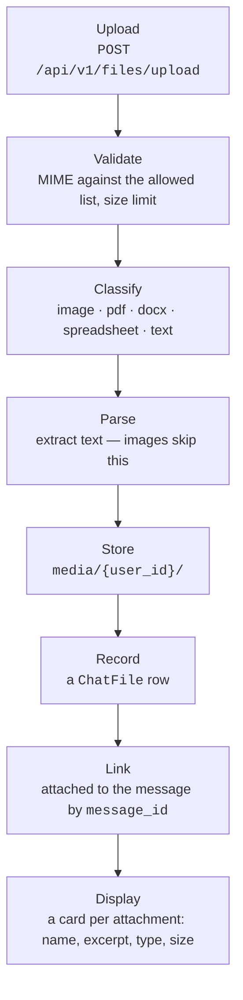
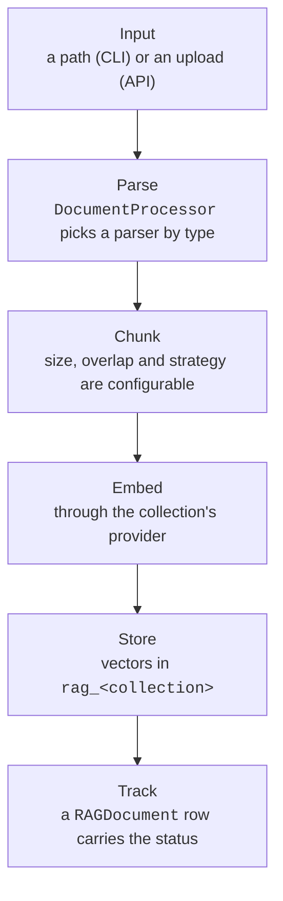

# Procesamiento de archivos { #file-processing }

Este documento cubre cómo se tratan los archivos en dos contextos: las subidas
de archivos en el chat, que pertenecen a la persona que las hizo, y la ingesta
de documentos RAG, que pertenece a una colección y depende de
[quién puede llegar a ella](#who-may-reach-a-collection).

## Subidas de archivos en el chat { #chat-file-uploads }

Cuando alguien sube un archivo en la interfaz de chat, se ejecuta esta pipeline:

### El flujo { #flow }



La respuesta de la subida lleva un `preview` — las tres primeras líneas del
texto extraído, acotadas a 240 caracteres — para que la tarjeta muestre qué hay
*dentro* del archivo y no solo cómo se llama. El navegador no puede derivarlo:
un PDF son bytes hasta que este servicio lo ha parseado, y el cliente solo tiene
un id y un nombre cuando la subida ha respondido. Es `null` para una imagen y
para un archivo que ningún parser pudo leer, y una tarjeta sin extracto muestra
su miniatura o solo su nombre.

### El trabajo bloqueante sale del bucle de peticiones, a su propio pool { #the-blocking-work-runs-off-the-request-loop-on-its-own-pool }

Parsear una subida — PyMuPDF sobre cada página, openpyxl sobre cada celda, una
decodificación del archivo entero — y leer o escribir sus bytes son operaciones
bloqueantes sin punto de suspensión. Por eso se ejecutan en un hilo y no en el
bucle de peticiones; si no, una subida grande congelaría todas las demás
peticiones y streams de agents del worker.

Se ejecutan en un pool **dedicado y acotado** (`app/core/blocking.py`,
dimensionado por `FILE_IO_MAX_WORKERS`), no en el executor por defecto compartido
de `asyncio`. Ese executor también carga con el hash de contraseñas de `bcrypt` y
con el DNS de hosts fijados, y una ráfaga de subidas no debe ocupar todos sus
workers y dejar el inicio de sesión y las peticiones salientes en cola detrás de
un backlog sin límite de búferes de subida
([#1108](https://github.com/vstorm-co/agenticos/issues/1108)).

La escritura además es **segura ante la cancelación**. Un executor no puede
interrumpir un `write_bytes` en curso, así que una subida cancelada espera a que
la escritura termine y borra el archivo que creó — el llamante nunca recibe una
ruta de almacenamiento, así que de otro modo no podría ni registrar ni limpiar el
huérfano.

### Toda la página es la zona de soltado { #the-whole-page-is-the-drop-target }

Un archivo arrastrado sobre el chat se acepta **en cualquier punto de ella**, no
sobre el campo de redacción. El campo de redacción era el único destino, lo que
convertía adjuntar algo en un juego de acertar en una franja de pocos
centímetros — y fallar no era inocuo: lo que el navegador hace por defecto con un
archivo soltado es *abrirlo*, así que la pestaña se iba de la conversación y de
lo que hubiera a medio escribir en ella. El mismo `preventDefault` que deja a la
página quedarse el archivo es el que impide que se lo quede el navegador, así que
escuchar en la ventana arregla las dos mitades a la vez.

Mientras un archivo está sobre la página, una capa la cubre: el fondo
desenfocado, una tarjeta punteada en el centro y el límite de tamaño por archivo
escrito en ella — un vídeo de 60 MB rechazado *después* del arrastre es un viaje
de ida y vuelta que nadie necesitaba hacer. Se monta por portal en el body en vez
de posicionarse desde el campo de redacción, porque `fixed` se mide contra el
ancestro transformado más cercano y un solo `backdrop-blur` en un wrapper de
arriba encogería la capa a una esquina sin decir nada.

Hay dos cosas que deliberadamente no hace. Un arrastre que lleva algo **que no
son** archivos — texto seleccionado, un enlace, una de las propias filas
arrastrables de la app — se deja completamente en paz, ni siquiera se previene. Y
no se acepta nada mientras el campo de redacción está deshabilitado: una
conversación archivada, un run esperando una aprobación. Que la capa no aparezca
es lo que lo dice.

### Un pegado largo es un archivo { #a-long-paste-is-a-file }

Pegar más de **2000 caracteres** en el campo de redacción sube el texto como
`pasted-<date>.txt` en lugar de insertarlo. El textarea se queda intacto, así que
la pregunta se escribe al lado de aquello sobre lo que trata, y la transcripción
guarda un adjunto en vez de una burbuja enorme.

El umbral es todo el diseño. Quien pega un párrafo y pulsa enter quería que eso
*fuera* el mensaje, así que queda por encima de cualquier cosa que una persona
pegaría como pregunta — unas 350 palabras — y por debajo de cualquier documento.
Por debajo de él no cambió nada: el texto cae en el textarea como siempre.

A partir de ahí es un adjunto `text/plain` normal y todo lo de abajo le aplica
sin cambios, que es la gracia: un agent con un workspace recibe el pegado como un
archivo que puede abrir, y uno sin workspace recibe el texto en su prompt.

### Tipos de archivo admitidos { #supported-file-types }

| Categoría | Tipos MIME | Extensiones | Procesamiento |
|----------|-----------|------------|------------|
| **Imágenes** | image/jpeg, image/png, image/webp, image/gif | .jpg, .png, .webp, .gif | Se guardan tal cual. Se envían al LLM como `BinaryContent` para análisis de visión. |
| **PDF** | application/pdf | .pdf | Texto extraído con el parser de PDF configurado. Se añade al prompt como contexto. |
| **DOCX** | application/vnd.openxmlformats-officedocument.wordprocessingml.document | .docx | Párrafos extraídos con `python-docx`. Se añaden al prompt como contexto. |
| **Hoja de cálculo** | …spreadsheetml.sheet, …ms-excel.sheet.macroEnabled.12 | .xlsx, .xlsm | Cada hoja se lee con `openpyxl`, se nombra y sus filas se separan por tabuladores. Se añade al prompt como contexto. `.xls` se rechaza — es otro formato y necesita otro lector. |
| **Texto** | text/plain, text/markdown | .txt, .md | Se decodifica directamente como UTF-8. Se añade al prompt como contexto. |

### Adónde va un adjunto depende del agent { #where-an-attachment-goes-depends-on-the-agent }

La columna "se añade al prompt" de arriba es lo que le pasa a un agent **sin
workspace**, y es el archivo entero, en cada turno. Un informe de doscientas
páginas cuesta todo su peso en tokens cuando el usuario hace la primera pregunta
y otra vez cuando pregunta "¿y qué tal marzo?"; un CSV de cincuenta megabytes no
se puede adjuntar siquiera.

Un agent con la [capability `sandbox`](reference/capabilities.md#files-shell)
recibe el archivo en lugar del texto:

| Adjunto | Sin workspace | Con un workspace |
|---|---|---|
| text, csv, md, json | texto parseado pegado en línea | escrito en `uploads/`, el mensaje lleva una referencia y las 20 primeras líneas |
| pdf, docx, hoja de cálculo | texto parseado pegado en línea | escrito en `uploads/`, con el texto extraído al lado salvo que el runtime pueda leerlo; referencia y 20 primeras líneas |
| imagen | `BinaryContent` | `BinaryContent` **y** escrita; la referencia nombra la ruta |

**El texto extraído lo acompaña solo cuando nada puede leer el original.** Antes
se escribía un `.txt` del parseo junto a cada PDF, `.docx` y hoja de cálculo,
con el razonamiento de que un shell no tiene librería para ninguno de ellos —
`read_file` sobre un `.xlsx` devuelve galimatías, y `run_python` no tiene sistema
de archivos. En un runtime que lleva `lit` ese razonamiento está caduco: `lit
parse q3.xlsx -o q3.md` es un solo comando, con OCR para un escaneo y LibreOffice
para los formatos heredados (`sandbox.md`), así que el archivo hermano es una
segunda copia del contenido en disco para ahorrar una llamada de herramienta.

Se sigue escribiendo en todos los demás casos, y el predicado no es el tipo de
backend: un workspace `state` son archivos sin ningún shell, una sandbox de
Daytona y el runtime propio de un deployment llevan lo que lleve su imagen, y
ninguno tiene `lit`. La condición es si este deployment le *describió* el runtime
al modelo — la misma información que el run añade a sus instrucciones. Si se le
dijo que tiene `lit`, no hay hermano; en cualquier otro caso, el texto va al lado
del archivo.

El parseo sigue ocurriendo en el servidor de todos modos, porque el *texto* es lo
que recibe un agent sin workspace y de donde salen las 20 líneas del mensaje.
Aceptar la subida sin parsear llegaría a un agent con workspace como bytes
ilegibles y a uno sin workspace como nada en absoluto.

**Una escritura rechazada se dice una vez, sobre el workspace.** Un run cuyo
workspace no admite un archivo es un run cuyo shell y herramientas de archivo
también fallarán, y una línea por archivo no puede decir eso: un turno leyó cada
fallo como un problema con el comando que acababa de escribir y siguió
intentándolo — `ls`, luego un `curl` de una URI `data:`, luego tres soluciones
propuestas a la persona, a lo largo de dos turnos. Ahora una sola frase dice que
el workspace no está disponible y que otro intento fallará igual.

La referencia es lo que el modelo lee de verdad:

```
Attached file: raport.csv (/uploads/3f2a1b9c-raport.csv, 2.4 MB, text)
First 20 lines:
month,total
jan,10
...
```

Suficiente para distinguir una exportación de ventas de un log y para ver los
nombres de las columnas — que es lo que el modelo necesita para decidir si leer
el resto vale una llamada de herramienta. El archivo ha dejado de ser contexto y
se ha convertido en datos.

Cuatro cosas de esto son deliberadas:

- **Las imágenes van por los dos caminos.** El modelo todavía tiene que *ver* la
  imagen — para eso sirve un modelo multimodal, y una cadena con una ruta no la
  sustituye — y además tiene que poder redimensionarla o recortarla, lo que exige
  bytes en un sistema de archivos. Por encima de
  `SANDBOX_INLINE_IMAGE_MAX_BYTES` solo se guarda el archivo, porque pasado ese
  punto pagar dos veces por los bytes deja de compensar.
- **Un PDF recibe las dos mitades.** Los bytes son lo que una persona pidió que
  se le diera; el texto que esta plataforma ya extrajo es la mitad que un shell
  puede leer de verdad.
- **El mismo archivo se escribe una vez.** La ruta se deriva del id del
  `ChatFile`, así que readjuntarlo en el turno cinco resuelve a la ruta que ya
  tiene — una subida cuesta una escritura, no una por turno durante el resto de
  la conversación.
- **No se confía en el nombre del archivo.** `../../etc/passwd` se convierte en
  `etc_passwd`; dos archivos llamados `report.csv` no pueden sobrescribirse.

Un archivo que no se puede almacenar — un workspace lleno — cae de vuelta al
camino en línea en lugar de desaparecer, y uno que el almacén de archivos no
puede cargar se omite en vez de hacer fallar el turno: la persona hizo una
pregunta, y responder sin el adjunto es mejor que no responder.

El enrutado ocurre en `app/services/attachments.py`, llamado desde el runner del
chat y no desde cada superficie. Tiene que estar ahí: adónde va un archivo
depende de si el agent tiene workspace, y eso lo decide `prepare`, que no se ha
ejecutado cuando una superficie está montando su prompt.

### Parseo de PDF (chat) { #pdf-parsing-chat }

Los adjuntos del chat se leen con **PyMuPDF**, y eso no es configurable. Un
adjunto no pertenece a ninguna colección, así que no hay configuración guardada
de la que leer una elección de parser.

La variable `CHAT_PDF_PARSER` que antes elegía entre tres parsers ya no existe.
Las dos alternativas estaban envueltas en `except Exception: return
self._parse_pdf_pymupdf(data)`, así que un deployment que la pusiera en
`llamaparse` o `liteparse` llevaba usando PyMuPDF igualmente sin decir nada — y
la rama de LiteParse no podría haber funcionado en absoluto, porque llamaba a un
método `parse_async` que el binding no define.

### Límites de tamaño { #size-limits }

!!! warning "Dos techos, y el navegador tiene su propia copia de uno"

    Un adjunto de chat lo rechaza `CHAT_MAX_UPLOAD_SIZE_MB` (10 MB); un documento
    de la base de conocimiento, `MAX_UPLOAD_SIZE_MB` (50 MB). El contenedor del
    frontend lee el mismo `CHAT_MAX_UPLOAD_SIZE_MB` en tiempo de ejecución, así
    que dale un solo valor a los dos contenedores: demasiado alto en el lado del
    navegador y el campo de redacción acepta un archivo que la API rechaza,
    demasiado bajo y rechaza uno que la API aceptaría.

- Tamaño máximo de un adjunto: `CHAT_MAX_UPLOAD_SIZE_MB` (por defecto: **10 MB**).
  Este es el límite propio de esta sección — un adjunto de chat lo rechaza este
  número, no el `MAX_UPLOAD_SIZE_MB` más grande de la base de conocimiento, y son
  dos ajustes separados porque un adjunto para un agent sin workspace se pega
  entero en el prompt mientras que un documento de la base de conocimiento se
  fragmenta y se convierte en embeddings.
- Un documento de la base de conocimiento lo acota `MAX_UPLOAD_SIZE_MB` (por
  defecto: **50 MB**).
- El cuerpo entero de la petición está acotado por encima de ambos, en el mayor
  de los dos más un margen para multipart, así que subir cualquiera de los dos
  techos sube ese con él.
- El límite se aplica en el servidor tras leer el contenido del archivo. La
  comprobación propia del navegador lee el mismo `CHAT_MAX_UPLOAD_SIZE_MB` del
  entorno del contenedor del frontend, así que a los dos contenedores hay que
  darles un solo valor: demasiado alto y el campo de redacción acepta un archivo
  que la API rechaza, demasiado bajo y rechaza uno que la API aceptaría.

### Almacenamiento { #storage }

`FileStorageService` guarda los archivos en el directorio `media/`:

```
media/
  {user_id}/
    document.pdf
    screenshot.png
    ...
```

### El modelo ChatFile { #chatfile-model }

El modelo de base de datos `ChatFile` registra los archivos subidos:

| Campo | Tipo | Descripción |
|-------|------|-------------|
| `id` | UUID | Clave primaria |
| `user_id` | UUID/FK | Propietario (se usa para el control de acceso) |
| `filename` | String | Nombre original del archivo |
| `mime_type` | String | Tipo MIME (p. ej. `application/pdf`) |
| `size` | Integer | Tamaño del archivo en bytes |
| `storage_path` | String | Ruta relativa en el almacenamiento |
| `file_type` | String | Tipo clasificado: `image`, `pdf`, `docx`, `spreadsheet`, `text` |
| `parsed_content` | Text | Texto extraído (NULL para imágenes) |
| `message_id` | UUID/FK | Mensaje enlazado (se fija al enviar el mensaje) |
| `created_at` | DateTime | Momento de la subida |

### Propiedad y acceso { #ownership-access }

- Solo el propietario del archivo puede descargar sus archivos (`GET /files/{id}`).
- El método `FileUploadService.get_user_file()` compara `chat_file.user_id` con el
  ID del usuario que hace la petición. Devuelve `NotFoundError` si no coinciden.
- **La propiedad es toda la regla, y nada la amplía.** Ningún permiso, ningún rol
  de organización y ningún grant llega al archivo de chat de otra persona por
  esta API — a diferencia de una colección, que un grant sí puede abrir. La
  comparación es contra `user_id` y no hay una segunda rama que cubra un caso más
  amplio.
- **El paso de enlazado sigue la misma regla.** Un mensaje adjunta únicamente los
  archivos *sin enlazar* del propio remitente: un id que nombra el archivo de
  otro usuario, o uno que ya está en un mensaje, se rechaza en lugar de aplicarse
  en silencio — así que un turno no puede ni mostrar el nombre de archivo de un
  desconocido ni arrancar un adjunto del mensaje del que ya cuelga.

## Ingesta de documentos RAG { #rag-document-ingestion }

Cuando se ingieren documentos en la base de conocimiento RAG (por CLI o por API),
una pipeline distinta se encarga del parseo, la fragmentación y los embeddings.

### El flujo de ingesta { #ingestion-flow }



!!! note "Por la API el orden es el contrario"

    La fila `RAGDocument` se escribe **primero** y los cuatro pasos intermedios
    se ejecutan en una tarea en segundo plano con una sesión propia - por eso una
    subida responde `202 {"status": "processing"}` en vez de esperar.

Hay dos direcciones a las que puede llegar una subida —
`POST /rag/collections/{name}/ingest` y `POST /kb/{kb_id}/documents` — y las dos
responden **202** con el mismo `RAGIngestResponse`, con todos sus campos,
`"document_id": null` incluido. El id del documento en el almacén de vectores no
existe hasta que el worker lo ha indexado.

Una de las dos omitía la clave en lugar de enviarla nula, así que un cliente que
normalizara la respuesta recibía una forma distinta de cada una
([#560](https://github.com/vstorm-co/agenticos/issues/560)).

!!! danger "La tarea se inicia después de que la transacción de la petición haga commit"

    Se entrega con `spawn_after_commit`, **no** con `spawn`, y la inicia la
    propia sesión una vez que la fila es duradera.

    Despachada antes, buscaría el documento por id, no encontraría nada y se
    detendría — dejando para siempre en `processing` la subida que ya había
    confirmado
    ([#417](https://github.com/vstorm-co/agenticos/issues/417)).

Lo mismo vale para una sincronización: la fila `SyncLog` existe antes que su
flow. Consulta
[Despachar trabajo en segundo plano desde una petición](architecture.md#dispatching-background-work-from-a-request).

**Cada flow construye su propio engine para el almacén de vectores, y lo
descarta junto con el trabajo del flow.**

**Un solo bucle es dueño de los pools del proceso, y todo lo demás construye su
propio engine.** El lifespan de la API los reclama al arrancar: atiende cada
petición y los descarta al apagarse, así que es el único bucle cuyas conexiones
pueden cachear. Fuera de ese bucle `get_db_context` se comporta como
`get_worker_db_context` — un engine con `NullPool` para la llamada, descartado al
final — porque se llega a él desde flows de Prefect (el informe, el refresco de
MCP, las tareas de invitación y de aprobación, los bucles de canal) y desde el
resolvedor de embeddings de un agent, cada uno en un bucle propio
([#1079](https://github.com/vstorm-co/agenticos/issues/1079)).

La búsqueda de conocimiento de un agent sigue la misma regla para su almacén de
vectores: el almacén del proceso en el bucle propietario, y `agent_vector_engine`
— sin pool — en cualquier otro sitio. Es el único llamante de vectores que no
puede saber en qué bucle está, y su almacén de recuperación se cachea durante
toda la vida del proceso, así que un almacén con pool compartido entre dos bucles
de un worker le entrega al segundo una conexión que abrió el primero. Conservar
el pool para la API es lo que acota esto: `NullPool` abre una conexión por
checkout y no limita nada, mientras que el pool hace cola en
`DB_POOL_SIZE + DB_MAX_OVERFLOW`.

### Formatos admitidos { #supported-formats }

`.txt`, `.md` y `.docx` los leen los parsers integrados de Python sea cual sea el
parser de la colección. Más allá de esos, el conjunto sigue al parser:

| Parser | Lee además | Necesita |
|--------|-----------|-------|
| PyMuPDF | `.pdf` | nada |
| LiteParse | `.pdf`; imágenes (`.png`, `.jpg`, `.tiff`, `.svg`, …); formatos ofimáticos (`.xlsx`, `.pptx`, `.odt`, `.csv`, `.rtf`, …) | LibreOffice **solo para los formatos ofimáticos** — las imágenes se convierten de forma nativa |
| LlamaParse | `.pdf`, `.pptx`, `.xlsx`, `.csv`, `.rtf`, `.epub`, `.html`, imágenes | `LLAMAPARSE_API_KEY` |

El Dockerfile del backend instala LibreOffice y Tesseract, así que los formatos
ofimáticos y el OCR funcionan de serie en un contenedor. Si ejecutas el backend
fuera de Docker, una subida ofimática a una colección con LiteParse se rechaza
con un mensaje que nombra LibreOffice en vez de fallar durante la conversión.

`GET /api/v1/rag/supported-formats?parser=liteparse` responde para un parser.
Estos conjuntos son lo que `DocumentProcessor` puede enrutar de verdad — fijados
por `backend/tests/test_supported_formats.py`, porque antes eran aspiracionales:
un `.xlsx` se aceptaba, se almacenaba, recibía una fila de documento y se
despachaba, y luego moría en un worker como "Unsupported file type".

### Elección de parser (RAG) { #parser-selection-rag }

Por colección, en `/rag`, y se puede sobrescribir por subida — no es una variable
de entorno. Se guarda en `knowledge_bases.ingestion_config`.

| Parser | Mejor para |
|--------|----------|
| PyMuPDF (por defecto) | Procesamiento local rápido, documentos con mucho texto; el único que extrae imágenes incrustadas para describirlas |
| LiteParse | Local, sin clave, consciente del diseño; lee formatos ofimáticos e imágenes; salida en markdown |
| LlamaParse | Diseños complejos y PDF escaneados; en la nube, facturado por página |

### Opciones de LiteParse { #liteparse-options }

| Ajuste | Por defecto | Notas |
|---------|---------|-------|
| `liteparse_output_format` | `markdown` | Reconstruye encabezados, tablas y listas — aquello por lo que corta la estrategia de fragmentación `markdown`. `text` conserva la rejilla espacial. |
| `auto_ocr` | `true` | Ejecuta la comprobación barata de capa de texto de LiteParse por documento y aplica OCR solo a lo que lo necesita. El OCR domina el coste de un parseo. |
| `ocr_language` | `eng` | Códigos de Tesseract — tres letras, unidos con `+` para varios (`eng+pol`). Un idioma sin su paquete instalado no lee nada; añade `tesseract-ocr-<lang>` al Dockerfile. |
| `liteparse_dpi` | `150` | Más alto lee escaneos tenues, más lento. |
| `max_pages` | `1000` | El ajuste que acota el coste de un documento; `parse_timeout_seconds` solo acota la espera. |

### Configuración de la fragmentación { #chunking-configuration }

Por colección, junto al parser:

| Ajuste | Por defecto | Descripción |
|---------|---------|-------------|
| `chunk_size` | `512` | Caracteres máximos por fragmento |
| `chunk_overlap` | `50` | Caracteres de solapamiento; tiene que ser menor que `chunk_size` |
| `chunking_strategy` | `recursive` | Estrategia: `recursive`, `markdown`, `fixed` |

**Comparación de estrategias:**

| Estrategia | Mejor para |
|----------|----------|
| `recursive` | Texto general; corta por párrafo, luego por línea, luego por palabra, luego por carácter |
| `markdown` | Documentos markdown o estructurados; corta en los límites de encabezado y luego por tamaño dentro de cada sección |
| `fixed` | Fragmentos de tamaño uniforme; corta solo en fin de línea, así que una línea larga se emite entera |

Las tres vienen de `app/services/rag/_splitters.py`, que sustituyó a
`langchain-text-splitters` en [#158](https://github.com/vstorm-co/agenticos/issues/158)
— los ocho paquetes que había detrás incluían `langsmith`, un segundo SDK de
telemetría alojada en una plataforma que se estandarizó sobre Logfire.

Hay tres cosas que conviene saber sobre ellas antes de tocar los números:

- **`chunk_overlap` es un techo, no una garantía.** Un fragmento repite del
  anterior tanto como quepa por debajo de `chunk_size`, lo que a menudo es menos
  que el ajuste y a veces nada en absoluto.
- **Un trozo sin separador que le quede se emite entero, no cortado.** `fixed`
  corta solo en fin de línea, así que una línea de 4 KB se convierte en un
  fragmento de 4 KB; el splitter registra un aviso en vez de entregarle al modelo
  de embeddings algo que va a rechazar. El aviso significa *por encima* de
  `chunk_size` — una línea de exactamente `chunk_size` caracteres está dentro del
  límite y pasa en silencio.
- **`markdown` conserva el encabezado en el fragmento**, y hasta #158 no aplicaba
  ni `chunk_size` ni `chunk_overlap` — una sección de 50 KB entre dos `##` era un
  solo fragmento. Ahora ejecuta el splitter recursivo sobre cada sección, así que
  los dos ajustes significan en esta estrategia lo mismo que en las otras.

Los límites de los fragmentos son contra lo que casa una búsqueda, así que una
colección ingerida antes de ese cambio conserva los fragmentos con los que se
ingirió. Vuelve a subir un documento, o vuelve a ejecutar
`uv run agenticos cmd rag-ingest`, para refragmentarlo.

**Cuántos fragmentos tiene un documento decide cuánto tarda en guardarse, pero ya
no cuántos viajes de ida y vuelta cuesta.**

`insert_document` los escribe de 200 filas por sentencia (`executemany`, que
asyncpg encadena en pipeline). Antes emitía un `INSERT` por fragmento en un bucle
de Python dentro de una transacción abierta — así que un PDF de 200 páginas con
el `chunk_size` por defecto eran de mil a tres mil viajes secuenciales: de cinco
a quince segundos contra un Postgres gestionado a 3-5 ms, antes de pagar un solo
embedding ([#950](https://github.com/vstorm-co/agenticos/issues/950)).

Se hace por lotes y no en una sola sentencia para todo el documento porque la
lista de parámetros se mantiene en memoria y cada fila lleva su embedding
renderizado como texto — con 3072 dimensiones, decenas de kilobytes por fila.

**Una sobrescritura se comprueba contra el par ya combinado, no contra su propio
valor.**

Un campo `ingestion` por subida lleva solo lo que cambia, así que un
`chunk_overlap: 4096` enviado a una colección que fragmenta a 512 son dos números
legales por separado y una configuración que repite casi todo lo que avanza.

La combinación vuelve a validar, y la subida se rechaza con un **400** que nombra
los dos ajustes en `details.fields` — antes de almacenar el archivo y antes de
que exista una fila de documento, así que no hay nada que reintentar ni limpiar.

Respondía 500 con un `details` vacío hasta
[#874](https://github.com/vstorm-co/agenticos/issues/874): la combinación lanzaba
un error de Pydantic en crudo, que no llega a ningún handler. El mismo par
enviado como configuración propia de una colección siempre se rechazaba con un
422, porque ahí es un campo de un cuerpo JSON y FastAPI lo valida antes de entrar
en la ruta.

Los dos rechazos nombran los mismos campos, `ingestion_config` para la regla del
par e `ingestion_config.chunk_size` para un ajuste suelto — así que el formulario
marca un solo sitio sea cual sea el punto de entrada que rechazó. (La regla del
par nombra el objeto porque Pydantic no atribuye un
`model_validator(mode="after")` a ninguno de los dos campos de los que trata.) El
400 nombraba sus campos bajo `details.errors` hasta
[#882](https://github.com/vstorm-co/agenticos/issues/882), en el formato de error
propio de Pydantic, que nada del frontend leía: la frase llegaba a un toast y
nunca se resaltaba ningún input.

### Embeddings — el modelo, qué endpoint responde y qué clave paga { #embeddings-the-model-whose-endpoint-answers-and-whose-key-pays }

Los tres se deciden **por colección**, no por deployment, en
`app/services/embedding_resolution.py` sobre el catálogo de
`app/core/catalog/embedding_providers.json`:

| | |
|---|---|
| **Modelo y anchura** | Se registran en la base de conocimiento al crearla (`embedding_model`, `embedding_dim`) y no cambian nunca después — `PgVectorStore` escribe `embedding vector(N)` una sola vez, así que un segundo modelo o no se puede escribir o se compara en silencio con vectores de otro espacio. `EMBEDDING_MODEL` decide únicamente con qué se construye una colección *nueva*. |
| **Provider** | Qué endpoint compatible con OpenAI sirve ese modelo (`embedding_provider`). **Es modificable**, a diferencia del modelo: el mismo modelo con la misma anchura produce vectores del mismo espacio se sirva desde donde se sirva, así que `PATCH /kb/{id}` mueve una colección entre providers y deja válido todo lo ya indexado. |
| **Credencial** | La clave del vault elegida en la colección (`embedding_secret_id`), que es lo que se le factura a la organización y que tiene que ser una clave **de ese provider**. Una colección en el provider al que pertenece la clave propia del deployment puede, en su lugar, generar embeddings con `OPENROUTER_API_KEY`. |

Qué base de conocimiento resuelve un nombre de colección es cuestión de tenants.
`collection_name` está indexado pero **no es único** — dos organizaciones pueden
llamar igual a una colección y compartir tabla — así que la resolución se acota a
la organización *del* embedding: la del flow que ingiere, la del agent que busca.
Quedarse con la primera fila que ordene la base de datos resolvería el modelo de
otro tenant y abriría *su* clave del vault: se le factura, y el texto de esta
organización pasa por ella
([#913](https://github.com/vstorm-co/agenticos/issues/913)). Un nombre compartido
resuelve así la configuración de cada una, cayendo a una colección de ámbito app,
nunca a la de un tercero.

!!! warning "Un nombre de colección es un espacio de embeddings"

    Resolver por organización solo es seguro porque todas las filas con un mismo
    nombre de colección coinciden en cómo generan embeddings. Una base de
    conocimiento creada contra un nombre que ya existe **adopta** el modelo, la
    anchura, el provider y la clave del vault de esa colección, y una elección
    explícita que discrepe se rechaza en vez de sobrescribirse calladamente. Sin
    eso, una misma tabla física podría contener dos espacios de embeddings:
    pgvector rechaza de plano la comparación cuando las anchuras difieren, y
    cuando coinciden por casualidad clasifica los vectores de un modelo contra
    los de otro y responde con disparates verosímiles.

El provider estaba antes escrito a fuego: cada petición iba a `openrouter.ai`, de
modo que una organización con una clave de OpenAI no podía usarla, una clave
movida a otra cuenta obligaba a recrear la colección y a reingerir cada
documento, y nada impedía que una colección enviara la credencial de un proveedor
a la dirección de otro. El catálogo es además con lo que responde
`GET /rag/embedding-models`, así que el formulario de creación ofrece los modelos
que un provider puede servir de verdad — antes ofrecía todos los modelos de los
que este build conocía la *anchura*, tres de ellos pesos de sentence-transformers
que aquí nada puede llamar.

La clave se valida al crear. Una clave que tiene otra organización, una de
propósito equivocado o una que quien elige no puede ver se rechaza ahí, donde la
persona que elige puede arreglarlo.

Eso último es por lo que vincular una clave necesita `secrets:view` sobre la
clave y no solo `collections:edit` sobre la colección: **vincular una clave es
prestarla**, ya que los embeddings de la colección se la facturan a todo el que
pueda escribir en ella.

El selector solo ofreció siempre claves que quien elige puede ver — pero la API
acepta un id, y un id es adivinable. Hasta
[#912](https://github.com/vstorm-co/agenticos/issues/912) un Member podía
vincular la clave **privada** de otro miembro aportando su UUID.

Una clave que no pueden ver se rechaza como una que el vault no tiene, para que
el rechazo no pueda enumerar los secretos privados de otra persona.

En el momento de generar embeddings no se rechaza nada: una clave elegida que
desde entonces se ha borrado, que no se puede abrir o que no contiene una clave
de API cae a la del deployment, porque *qué clave paga* nunca debe decidir *si se
pueden encontrar los documentos*.

**Esa caída se detiene en el provider al que pertenece la clave del deployment.**
Una colección que genera embeddings a través de cualquier otro resuelve a
*ninguna* clave en vez de a la de otra persona — la petición se rechazaría en el
otro extremo de todas formas, habiendo llevado ya la credencial hasta allí — y el
rechazo dice entonces qué colección y qué provider, en lugar de nombrar una
variable que no habría ayudado.

Esa caída se anuncia en vez de darse por supuesta. La resolución lleva en cuál de
las cinco fuentes cayó, la ingesta escribe las degradadas en el log del run de
Prefect, y un deployment sin clave propia falla con un mensaje que nombra la
colección y qué clave intentó — no con el consejo de definir una variable acerca
de una colección que ya tenía clave. Antes de #306 el worker de ingesta era el
único llamante que nunca preguntaba al resolvedor, así que cada documento subido
se embebía con el modelo y la clave del deployment eligiera lo que eligiera su
colección.

### Almacenamiento de vectores { #vector-storage }

Los vectores se guardan en **pgvector** usando la base de datos PostgreSQL
existente. No hacen falta servicios adicionales.

**Una tabla por colección, creada en tiempo de ejecución.**

El almacén emite `CREATE TABLE IF NOT EXISTS rag_<collection>` la primera vez que
se escribe en una colección, así que esas tablas existen en la base de datos y en
ningún otro sitio. Ningún modelo las declara y ninguna migración las crea, porque
un deployment tiene tantas como bases de conocimiento haya hecho alguien.

Alembic no es su dueño, y `alembic/env.py` lo dice a través de `include_name`. Sin
eso, `make db-check` leía cada una como una tabla que los modelos habían
eliminado, y fallaba en cualquier base de datos que hubiera ingerido un documento
alguna vez.

El predicado vive en `app/db/vector_tables.py`, y es más estrecho que el prefijo a
propósito: `rag_documents` *sí* es una tabla de modelo, y excluirla habría apagado
la verificación precisamente para la única tabla a través de la cual escribe la
ingesta.

El almacén responde a la misma pregunta con el mismo predicado:
`list_collections`, que es lo que imprime `rag-collections`, informa de una tabla
`rag_` solo cuando ningún modelo la declara. Casar únicamente por el prefijo hacía
que informara de `rag_documents` como una colección llamada `documents` — una que
nadie creó, cuyo "recuento de vectores" era el número de documentos ingeridos y a
la que cualquier llamante podía pedir luego que buscara.

#### Cómo puede llamarse una colección { #what-a-collection-may-be-called }

El nombre de una colección es una cadena que elige un llamante y con la que el
almacén construye identificadores, así que **una sola función decide si es
usable** — `validate_collection_name`, en `app/db/vector_tables.py`. Cuatro
rechazos, cada uno un 400:

| Rechazado | Porque |
|---|---|
| No es un identificador desnudo — `foo-bar`, `2024_reports`, cualquier cosa con un espacio o una comilla | El almacén interpola el nombre en el DDL sin entrecomillar. Un dígito inicial solo *parece* seguro: el prefijo `rag_` aporta la letra que le falta al nombre. |
| Cualquier mayúscula — `Handbook` | Postgres pliega un identificador sin comillas, así que `Handbook` y `handbook` son una sola tabla. Nada por encima de la base de datos puede verlo: en todos los demás sitios los nombres se comparan como cadenas enteras, así que los dos son dos filas que la plataforma cree que son dos colecciones. Se rechaza en vez de pasarlo a minúsculas — guardar un nombre que el llamante no escribió es exactamente la reinterpretación que esta regla existe para evitar. |
| Más de 45 caracteres | Postgres se queda con 63 bytes de un identificador y trunca el resto en silencio. `rag_<name>` cabe con 59, pero `rag_<name>_embedding_idx` no, y la cota es el identificador más largo, no el más corto. |
| `all` | Reservado. |
| Una tabla de la que son dueños los modelos — `documents` | Véase abajo. |

Dos de estos son el mismo fallo alcanzado por caminos distintos, y los dos
merecen una frase. La **cota de longitud** es la que se lee como pedantería y no
lo es.

Dos colecciones que coinciden hasta el punto de truncado son **un solo objeto**:

- **Una tabla**, si el nombre era demasiado largo — así que el `DROP` de
  cualquiera de las dos organizaciones destruye los vectores de la otra, y cada
  búsqueda cruza entre ambas.
- **Un índice**, si solo lo era el nombre del índice, que es más silencioso:
  `CREATE INDEX IF NOT EXISTS` encuentra el índice de la primera colección ya
  ahí y no construye nada, dejando la segunda sin indexar con la anchura con la
  que se construyó la primera.

Nada por encima de la base de datos puede ver ninguno de los dos, porque el
nombre de una colección se compara como cadena entera en todos los demás sitios.

Por eso mismo importan también las **mayúsculas**: una grafía es un camino más
corto a la misma tabla compartida, y rechazar las mayúsculas cierra un segundo
camino con él. `_collection_exists` comparaba `rag_Handbook` contra
`information_schema.tables`, que guarda el nombre plegado, así que nunca casaba y
`search`, `get_documents` y `get_document_chunks` respondían **vacío** para
cualquier colección con una mayúscula.

Ese camino se ha eliminado en vez de arreglarse: un nombre así ahora se rechaza
donde se construye el nombre de la tabla, antes de que nada pueda preguntar.

**Una colección no puede llamarse como una tabla de la que son dueños los
modelos**, que es el predicado de tablas en tiempo de ejecución leído de una
tercera manera — preguntado sobre un nombre antes de que su tabla exista. Se
rechaza tanto en la API como en el propio almacén, porque `rag-drop <name>` llega
al almacén sin ninguna ruta por medio. El nombre que hizo necesario esto es
`documents`: con el prefijo, *es* la tabla de seguimiento, así que borrar una
colección así apuntaba un `DROP TABLE IF EXISTS` al historial de ingesta de todas
las organizaciones. El rechazo se deriva en vez de listarse, así que una tabla de
modelo con prefijo `rag_` añadida más tarde queda cubierta, y una colección
llamada `documents_archive` — que una exclusión literal se habría llevado por
delante — no se ve afectada.

**Y el nombre tiene que estar libre.**

El espacio de nombres de vectores es global del deployment: dos bases de
conocimiento con un mismo nombre de colección comparten una tabla. Así que un
nombre ya ocupado fuera del alcance del llamante se rechaza con un 409 —
`CollectionAccessService.claim`, al que llaman tanto `POST /kb` como
`POST /rag/collections/{name}`.

Antes solo lo hacía uno de ellos. `POST /kb` escribía el `collection_name` que le
mandaran, así que un miembro con `collections:edit` podía apuntar una base de
conocimiento a la tabla de vectores de otra organización y luego leerla y
escribirla a través de cada barrera — porque una colección se resuelve a través
de la base de conocimiento que el llamante *sí* puede leer, y ahora una de ellas
es suya.

Un nombre que el llamante no aporta se deriva del nombre visible más seis
caracteres hexadecimales aleatorios, y se reclama por el mismo camino en lugar de
darlo por bueno por ser aleatorio.

**Y un nombre a medio desmontar tampoco está libre.** Borrar una colección elimina
sus filas de base de conocimiento dentro de la petición, pero elimina la tabla
física de vectores `rag_<name>` solo *después* de que la petición haga commit,
entregándoselo a un worker duradero — así que un rollback conserva la tabla junto
a las filas que restaura, y un proceso que muere a mitad de la limpieza no la deja
huérfana. Entre ese commit y el borrado el nombre no tiene fila pero su tabla
todavía guarda los fragmentos del antiguo tenant, así que `claim` rechaza además
un nombre reservado en `collection_teardowns` — una fila confirmada *junto con* el
borrado y limpiada una vez que la tabla ya no está. Sin ella, una reclamación en
esa ventana haría que `CREATE TABLE IF NOT EXISTS` adoptara la tabla superviviente
y leyera los datos de otro tenant (#1362). Una **subida** a un nombre reservado se
rechaza por lo mismo: `RAGDocumentService.dispatch_upload` comprueba la reserva
antes de crear la colección, así que una ingesta colada en la ventana no puede
recrear la tabla que el borrado está a punto de destruir y perder en ella sus
propios fragmentos (#1364). Los caminos de ingesta del **worker** — una
sincronización, un reintento — también la comprueban, en la barrera `still_wanted`
justo antes de la escritura de vectores, así que una sincronización hacia un
predeterminado vaciado (cuya fila el vaciado conserva) se detiene en vez de
repoblar una tabla que se está borrando (#1382). Las dos son comprobaciones de
reserva de mejor esfuerzo y no una serialización con bloqueo: sostener el bloqueo
de desmontaje durante una escritura provocaría un interbloqueo contra la purga de
una organización, que bloquea antes la fila de `organizations`, así que cerrar la
última ventana estrecha queda para #1382.

Una reserva cuyo borrado nunca llegó a ejecutarse — perdida por una caída entre
el commit y el despacho, o por un borrado que falla definitivamente — bloquearía
su nombre para siempre, ya que nada más lo reintenta. Un **barrido horario**
(`teardown-reservation-sweep`) recoge esas: para cualquier reserva de más de una
hora reintenta el borrado y libera el nombre, para que un nombre no se pierda
para siempre porque se perdiera una ejecución de un worker (#1364).

**Una base predeterminada se vacía, no se borra.** Eliminar una colección
predeterminada conserva su fila de base de conocimiento — la organización mantiene
un predeterminado usable — pero su tabla de vectores se elimina igualmente, así
que los documentos borrados con ella dejan de ser buscables en vez de quedarse en
una tabla que nada lista (#1361). Una búsqueda lee la tabla ausente como vacía y
la siguiente subida la recrea. La tabla se salva únicamente cuando una base
hermana sigue teniendo el mismo nombre, ya que el espacio de nombres de vectores
no es único por tenant y eliminarla se llevaría también sus fragmentos (#913).

`documents` era además la colección **predeterminada**, así que el inicio rápido
de la CLI apuntaba a la tabla de seguimiento; ahora el predeterminado es
`default`. Una base de conocimiento creada con el nombre antiguo antes de este
cambio sigue existiendo y se puede seguir borrando, pero no se puede ingerir nada
en ella — bórrala y crea una con otro nombre. Al hacerlo no se pierde nada: una
ingesta en esa colección nunca ha funcionado, porque construir el índice de
vectores sobre una tabla sin columna `embedding` falla.

### Quién puede llegar a una colección { #who-may-reach-a-collection }

Las colecciones no son globales, y nadie dentro de una organización es "admin" a
estos efectos — aquí no hay roles en una ruta, solo permisos
([permisos](permissions.md)).

Una colección tiene dos nombres. Uno es la tabla de vectores donde viven los
fragmentos, una cadena que cualquier llamante puede escribir en una URL; el otro,
la fila de `knowledge_bases` que la posee, y solo esa fila conoce una
organización. **La fila es la autoridad**: cada ruta `/rag` y `/kb` resuelve el
nombre a través de ella, en `app/services/collection_access.py`, antes de tocar un
vector, un documento o una fuente de sincronización. El listado y las rutas por
recurso leen la regla de ese único sitio, porque fueron dos copias de ella —
`/rag/collections` filtrando por organización mientras `/rag/collections/{name}/info`
no lo hacía — las que una vez dejaron a un tenant leer los de otro.

Tres ámbitos en la fila, y no hay un cuarto:

| Ámbito | Puede leer | Puede escribir |
|---|---|---|
| `personal` | su propietario | su propietario |
| `org` | `collections:view` que alcance la fila | `collections:edit` que alcance la fila |
| `app` | cualquiera en el deployment | el superadmin del deployment (`is_app_admin`) |

"Alcanzar la fila" es `resolve_access`, la misma decisión que toma cada recurso
compartible: el ámbito del llamante para ese permiso, ampliado por cualquier grant
explícito sobre esa colección concreta. Un grant amplía lo que el rol permite y
nunca lo estrecha, así que **un Viewer con un grant explícito de `edit` puede
gestionar esa colección** — el caso que una barrera de rol rechazaría antes de
mirar siquiera. Por eso las rutas por recurso no llevan `require(...)` y le pasan
la decisión al servicio.

Lo que eso da, por operación:

| | |
|---|---|
| Búsqueda — `POST /rag/search`, y la herramienta de recuperación del agent | `collections:view`. Cada colección nombrada se resuelve antes de leer el primer vector, y una a la que el llamante no llega rechaza la búsqueda **entera** en vez de quedar excluida de ella sin más |
| Lectura — listar colecciones y documentos, estadísticas de una colección, el texto parseado de un documento o su archivo original, logs de sincronización y de ingesta | `collections:view`, y cada respuesta contiene solo las colecciones a las que ese llamante llega |
| Escritura — crear y borrar una colección, subir, ingerir, reintentar, borrar un documento, configurar o cancelar una fuente de sincronización | `collections:edit` |
| `POST /rag/sync/local` | La única excepción, y conserva `is_app_admin`: su `path` nombra un directorio del **servidor** y no algo que posea un tenant, así que abrirlo a `collections:edit` le daría a cada miembro la lectura de archivos arbitrarios del servidor, ingeridos en una colección que luego puede buscar |

Un rechazo se informa como **"Collection not found"**, con el mismo mensaje y los
mismos detalles que produce una colección ausente. Cualquier otra cosa convierte
la API en un oráculo: estos nombres se derivan de cómo llama la gente a sus bases
de conocimiento, así que confirmar que `acme_handbook_d1fac1` existe en algún
sitio ya es información.

**Dentro de una colección no hay aislamiento por documento.** El acceso se decide
en la colección, así que llegar a una es llegar a todos sus documentos — que es lo
que hay que sopesar al decidir qué se ingiere dónde.

### Seguimiento de documentos { #document-tracking }


Los documentos ingeridos se registran en la base de datos SQL con el modelo
`RAGDocument`:

| Campo | Descripción |
|-------|-------------|
| `collection_name` | Colección de destino |
| `filename` | Nombre original del archivo |
| `filesize` | Tamaño del archivo en bytes |
| `filetype` | Extensión del archivo (sin punto) |
| `status` | `processing`, `done` o `error` — los miembros de `DocumentStatus`, y los únicos tres valores que guarda la columna. El recuento de *indexados* de una colección filtra por `done`; filtraba por un cuarto valor que nada ha escrito nunca hasta [#148](https://github.com/vstorm-co/agenticos/issues/148), así que cada base de conocimiento informaba de `indexed_count: 0` por muchos documentos que hubieran terminado |
| `error_message` | Qué falló, si `status` es `error` — véase abajo |
| `vector_document_id` | ID en el almacén de vectores |
| `chunk_count` | Número de fragmentos creados. Se registra desde [#147](https://github.com/vstorm-co/agenticos/issues/147); un documento ingerido antes tiene `0` y la tarjeta de su colección informa de menos de la cuenta hasta que se reingiera |
| `storage_path` | Ruta al archivo original (para reingesta o descarga) |
| `created_at` | Hora de inicio de la ingesta |
| `completed_at` | Hora de finalización de la ingesta |

**Una sustitución retira la fila a la que sustituye.** Cada camino de ingesta — la
subida, la CLI, una ejecución de sincronización — escribe una fila de seguimiento
*nueva*, mientras que una ingesta con `replace=true` borra el documento vectorial
al que sustituye e inserta otro. Así que la fila más antigua se queda describiendo
vectores que nadie tiene: su `chunk_count` se sigue sumando a los totales de la
colección, y su vista de contenido parseado no tiene nada que leer. Por eso
completar una ingesta borra las filas de seguimiento que apuntan al documento
vectorial al que sustituyó, junto con sus copias guardadas del archivo. Sin eso,
un directorio sincronizado cada noche informaba de una colección que crecía su
propio tamaño cada noche.

**Un documento sincronizado no conserva original, y lo dice.** El camino de subida
guarda una copia bajo `rag/{collection}` y una sincronización no: los bytes de un
archivo sincronizado viven en el sistema del que vino, y replicar cada uno de
ellos en el disco de este deployment para que funcione un botón es un coste por
corpus en vez de por fallo. Así que `storage_path` está vacío en estos y `has_file`
es falso, que es lo que tiene que leer una superficie que ofrezca una descarga.
**Volver a ejecutar la sincronización es el reintento** — desde
[#990](https://github.com/vstorm-co/agenticos/issues/990) omite todo lo que no ha
cambiado y vuelve a traer exactamente lo que no tiene documento, así que reintentar
cuatro fallos de cuarenta cuesta cuatro transferencias y no cuarenta.

**Cada camino abre la fila antes de indexar el archivo.**

Escrita después, una fila cuya escritura fallaba — un parpadeo de la base de
datos, un nombre más largo que la columna — dejaba el documento vectorial
almacenado y sin seguimiento. La siguiente ejecución `new_only` casaba entonces su
hash y *omitía* el archivo antes de llegar a la escritura, así que seguía siendo
buscable, invisible e imborrable para siempre.

El peor caso de este orden es una fila que dice `processing` junto a un documento
que terminó, lo cual es visible y se puede borrar.

La sincronización por conector dejó de escribir después en
[#992](https://github.com/vstorm-co/agenticos/issues/992), y la de directorio
local en [#997](https://github.com/vstorm-co/agenticos/issues/997) — que además le
dio fila y motivo a un archivo sincronizado localmente que no se puede parsear. No
tenía ninguna de las dos cosas, así que un log de sincronización que decía que
cuatro de cuarenta habían fallado no nombraba ninguno.

**Una fila sincronizada dice qué archivo sigue**, en `source_path`:
`gdrive://<id>`, `s3://bucket/key`, o una ruta absoluta para una sincronización
local o de la CLI. Eso es lo que retira un intento anterior sobre el *mismo
archivo* — un parseo fallido no escribe vectores, así que la retirada de
`complete_ingestion` no tiene nada con lo que casar y antes sobrevivían las dos
filas, una más por cada fallo, contando cada una para el `document_count` de la
colección ([#996](https://github.com/vstorm-co/agenticos/issues/996)).

**Una subida no guarda dirección**, y por eso no retira nada. Su único nombre es un
nombre base, que no es una dirección: dos personas pueden subir dos `report.pdf`
distintos y, con `replace=false`, querer que existan los dos. Retirar por ese
nombre borraría la fila fallida del primero — su diagnóstico, su reintento y su
archivo guardado — para un llamante que no pidió nada de eso. Una dirección `NULL`
no casa con ninguna comparación, que es la respuesta que se quiere y no una que
haya que esquivar, y es lo que tiene cada fila escrita antes de existir la columna.

Tres cosas deciden qué puede llevarse una retirada, y cada una de ellas se
equivocó primero:

- **Por dirección, nunca por nombre de archivo.** Esa es la colisión que
  [#990](https://github.com/vstorm-co/agenticos/issues/990) quitó del lado de los
  vectores, alcanzada desde el otro extremo: `a/readme.md` y `b/readme.md` en un
  mismo bucket comparten nombre base, así que casar por nombre borra la fila del
  otro archivo.
- **`ERROR`, no "no tiene id de vector".** Son conjuntos distintos, y tratarlos
  como uno solo es una carrera: una fila `PROCESSING` pertenece a un intento aún
  en curso, y de dos ingestas solapadas de un mismo origen la segunda borraría la
  fila viva de la primera — tras lo cual la primera termina, sustituye los
  vectores y no encuentra fila que completar.
- **Una *sustitución* fallida no es una ingesta fallida.** `ingest_file` inserta el
  documento nuevo antes de borrar aquel al que sustituye, así que un borrado que
  lanzaba una excepción devolvía un error mientras los vectores estaban ahí — una
  fila `ERROR` sin id de vector, que el siguiente intento retiraría dejándolos
  huérfanos. Que la inserción haya funcionado es toda la respuesta: el documento
  antiguo que queda se registra en el log, y un duplicado que alguien puede ver y
  borrar no es un fallo del que informar.

La sincronización por conector no escribía fila alguna hasta
[#992](https://github.com/vstorm-co/agenticos/issues/992) — la frase de arriba
valía solo para la subida, la CLI y la sincronización *local*. Un documento de una
carpeta de Drive era buscable e invisible: ausente de la pestaña Documents de la
base de conocimiento (`GET /kb/{kb_id}/documents` lee `get_for_kb`), ausente del
propio `document_count` de la colección, inalcanzable por un borrado, y un fallo
era un número en el log de sincronización sin motivo por archivo en ningún sitio.

Las ingestas fallidas se pueden reintentar con `POST /rag/documents/{id}/retry`.
Vuelve a leer `storage_path` — la copia que la subida guardó exactamente para esto
— y despacha el parseo otra vez, sustituyendo lo que indexara el intento fallido.
Un documento que no falló, o que no tiene archivo guardado — uno anterior a que
las subidas guardaran el suyo, o uno que ingirió una sincronización — se rechaza
con un 400 en vez de pasar a `processing`
([#441](https://github.com/vstorm-co/agenticos/issues/441)).

### Qué dice una ingesta fallida { #what-a-failed-ingest-says }

`error_message` es una columna almacenada, que se muestra en la página de
documentos y en el historial de sincronización de una fuente a todo el que pueda
ver la colección. Así que lleva un resumen y no lo que dijera el cliente que
falló:

```
The document could not be indexed (AuthenticationError) - check the
collection's embedding credential, then retry the upload. The worker log has
the full error.
```

Tres partes, y cada una está por un motivo. **La etapa** — parsear, indexar,
registrar el resultado o una sincronización entera — es lo único que el lector no
puede deducir después, y separa un archivo que el parser de esta colección no lee
de una credencial que el provider rechazó. **El tipo de la excepción** se conserva
porque un nombre de clase es un símbolo: dice que la credencial fue rechazada o
que el sistema de arriba agotó el tiempo sin nombrar al host que lo dijo. **El
consejo** es lo que el lector puede hacer de verdad.

Un mismo fallo lo informan hasta tres handlers — la etapa que lo lanzó, la
comprobación de que un fallo devuelto no es `done` y la red de seguridad del flow
— y el **primero** que lo registra se queda con la fila, porque es el más interno
y el más específico. Un reintento limpia el mensaje, así que el siguiente intento
registra el suyo.

Un rechazo que esta plataforma lanzó ella misma se pasa entero, en cambio, porque
su mensaje está escrito aquí y es lo más útil que se puede mostrar: *"No embedding
credential is configured for this collection"*, *"Organization monthly budget
exhausted: $40.15 spent of $40.00 limit"*.

Lo que **no** se guarda es el texto del cliente que falló. Un SDK de provider,
`httpx`, `boto3` y el cliente de Google Drive ponen la petición que hacían en su
mensaje de excepción, a menudo un endpoint, un host interno, un bucket o una URL
con una clave en su query string — y, a diferencia de un cuerpo de error HTTP,
una columna la relee semanas después quien abra el documento fallido. No se
pierde: todas estas llamadas lo registran con `logger.exception`, así que el log
del worker tiene el mensaje y la traza, y un flow de Prefect que relanza los
tiene en su run. `app/services/rag/failures.py` es donde se separan ambos.

El log es un público más pequeño que la columna, no uno seguro — trata el log de
un worker como algo que solo leen los operadores, y consulta [#440] para ver por
qué el filtro de redacción que trae este deployment no lo limpia hoy por hoy.

[#440]: https://github.com/vstorm-co/agenticos/issues/440


### Operaciones de sincronización { #sync-operations }

Las operaciones de sincronización se registran con el modelo `SyncLog`, que anota
la fuente, el modo, el total de archivos, los recuentos de
ingeridos/actualizados/omitidos/fallidos y los tiempos. El historial se consulta
con `GET /rag/sync/logs`.

**A qué documento guardado corresponde un archivo es una sola pregunta, y una
pregunta indexada.**

`IngestionService.existing_document` se la pasa a `find_existing_document` del
almacén, que busca el documento por una clave de metadatos cada vez —
`source_path`, luego un `filename` que el documento no haya direccionado bajo otra
ruta, luego `content_hash` — en ese orden de precedencia, parando en el primer
acierto.

Responde con el id del documento **y** con su `content_hash` guardado, y los dos
vuelven juntos a propósito: son hechos sobre *un* documento. Calculados por
búsquedas separadas con reglas distintas podrían discrepar, así que una
sincronización comparaba el hash de un archivo vivo con el de otro documento y o
bien reembebía cada noche un archivo sin cambios o bien omitía como actual uno que
sí había cambiado ([#548](https://github.com/vstorm-co/agenticos/issues/548)).

`PgVectorStore` sirve cada búsqueda desde un índice **hash** sobre esa clave de
metadatos. Hash y no btree, porque las búsquedas son solo de igualdad y un
`source_path` no tiene cota — un btree fallaría su límite de tamaño de fila y se
llevaría la ingesta por delante.

Los índices se construyen con la tabla de tiempo de ejecución y se rellenan en las
colecciones más antiguas con la migración `0058_backfill_rag_lookup_indexes`. Eso
convierte la comprobación en un puñado de sentencias indexadas, en vez de la
lectura de la tabla `rag_<collection>` entera en la memoria del worker que era
antes — una vez por documento ingerido, en una colección que podía tener cientos
de miles de fragmentos
([#1102](https://github.com/vstorm-co/agenticos/issues/1102), la mitad de ingesta
de [#27](https://github.com/vstorm-co/agenticos/issues/27); la otra mitad paginó
el listado de documentos seguidos).

Queda un respaldo en la clase base que responde leyendo el listado, para un
almacén que no tenga índice en el que apoyarse.

`new_only` omite un archivo cuyo hash guardado coincide, `update_only` omite uno
que no ha cambiado e ignora uno que es nuevo, y `full` sustituye todo lo que casa.
Un almacén que no puede responder al listado se trata como "sin coincidencia" y no
como una coincidencia: una consulta fallida no es prueba de que un documento esté
ausente, pero actuar como si un documento *estuviera* presente borraría uno.

**Los dos flows, y tienen que estar de acuerdo.** Una sola columna `sync_mode`
alimenta a un directorio local y a un conector por igual, así que un modo que
signifique una cosa para cada uno es el defecto haga lo que haga cualquiera de los
dos por su cuenta.

Una sincronización por conector no implementaba nada de esto hasta
[#990](https://github.com/vstorm-co/agenticos/issues/990). `sync_mode` solo
llegaba al argumento `replace` de `ingest_file`, e `ingest_file` nunca omite — así
que con el `new_only` por defecto el documento anterior ni se encontraba ni se
borraba y se insertaba una **segunda copia** en cada ejecución.

Una semana de sincronizaciones nocturnas eran siete copias de cada fragmento,
clasificadas unas contra otras en cada búsqueda y pagada cada una en embeddings.
El contador de `skipped` de al lado se inicializaba y nunca se incrementaba, que es
un log de sincronización informando con toda verdad de `skipped=0` cada noche.

Dónde se decide difiere entre ambos, porque los bytes de un archivo remoto
cuestan traerlos. `update_only` no necesita bytes para omitir un archivo que
nunca ha visto, así que esa respuesta se da antes de la descarga; un hash sí, así
que un archivo sin cambios se reconoce después de una descarga y antes del
embedding, que es la mitad cara. Un documento guardado que no lleva
`content_hash` se reingiere en vez de darse por actual: omitir un archivo que
puede haber cambiado es la respuesta que nada corrige después. Un archivo
sustituido se cuenta como **actualización** y no como ingesta, leído de
`replaced_document_id` y no de la frase que devuelve el resultado.

**Dos cosas sobre el emparejado, y las dos deciden si un documento sobrevive.**

El penúltimo recurso de `existing_document` es un emparejado por *nombre de
archivo*, y existe para que un archivo subido por el navegador y sincronizado más
tarde desde la carpeta de la que vino se sustituya en vez de duplicarse — una
subida guarda su nombre de archivo como su `source_path`, así que los dos coinciden
y sigue siendo alcanzable por nombre.

Un documento que nombra una dirección **distinta** no es candidato para eso. En un
bucket con `a/readme.md` junto a `b/readme.md`, la segunda clave encontraba por
nombre el documento de la primera, así que un contenido igual lo omitía y un
contenido distinto sustituía al primero — de cualquiera de las dos formas una
primera sincronización no podía quedarse con los dos, y no decía nada.

La misma colisión se daba con dos archivos locales de un mismo nombre en
directorios distintos.

Y una sustitución **inserta antes de borrar**. `insert_document` es donde se
calculan los embeddings, así que un provider que rechazara entre las dos sentencias
dejaba antes a la colección sin ninguno de los dos documentos — de forma
permanente, porque una ingesta fallida se devuelve en vez de lanzarse y nada la
reintenta. Tener los dos durante lo que dura una inserción es un estado que una
búsqueda sobrevive; no tener ninguno, no.

El historial propio de una fuente está en
`GET /kb/{kb_id}/sync-sources/{source_id}/logs`. La fuente se resuelve primero
contra esa base de conocimiento, así que una fuente que pertenece a otra base
responde **404** en vez de una lista vacía — por lo demás las dos pintan la misma
pantalla, y una de ellas es una petición que debería haber fallado. Sus ejecuciones
se leen por id de fuente, que es lo que mantiene a `limit` y `total` describiendo
el mismo conjunto de filas: una fuente reapuntada a otra base conserva sus
ejecuciones anteriores bajo el nombre de colección que tenía entonces, y antes se
caían de la página después de que `limit` ya la hubiera recortado.

### Qué no le corresponde decidir a una fuente de sincronización { #what-a-sync-source-is-not-allowed-to-decide }

!!! danger "Quien pueda dejar un archivo en una carpeta compartida elige la cadena que gestionará la siguiente sincronización"

    Dos de esas cadenas se tomaban antes al pie de la letra: un nombre de archivo
    que era una ruta (`../../../../home/app/.ssh/authorized_keys` es un nombre
    legal en Drive), y un id de carpeta que llegaba al lenguaje de consulta de
    Drive. `remote_names.py` rechaza los dos, y `BaseSyncConnector` - no un
    conector - decide dónde aterriza un byte, así que un conector añadido después
    hereda el rechazo en vez de tener que acordarse de él.

El contenido de una fuente no es del deployment para fiarse de él, y en una
carpeta de Drive compartida fuera de la organización ni siquiera es del tenant:
compartir es *para lo que sirve* compartir una carpeta.

!!! danger "Un nombre de archivo es una etiqueta, no un componente de ruta"

    `../../../../home/app/.ssh/authorized_keys` es un nombre de archivo legal en
    Drive, y el conector escribía `dest_dir / file.name` tal cual — fuera del
    directorio temporal que había hecho el worker, allá donde su uid pudiera
    escribir, y luego ingería desde ahí.

El nombre se reduce ahora a su último componente, y el resultado se *resuelve y se
confirma* como hijo del directorio de sincronización. Así que `..`, sus
codificaciones, sus imitaciones y un enlace simbólico ya presente en el directorio
son **una sola pregunta** en vez de una lista de grafías que hay que mantener al
día.

Un nombre que no es componente alguno — `..`, `.`, `/` — se rechaza. Cualquier otra
cosa aterriza dentro como un archivo.

**El destino es la respuesta de `BaseSyncConnector`, no la de un conector.** A una
implementación se le entrega una ruta y escribe en ella (`_fetch`), que es lo que
hace que un conector añadido después herede el rechazo en vez de tener que
acordarse de él.

**Un id de carpeta llega a un lenguaje de consulta.** La consulta de Drive envuelve
un id de padre en comillas simples, así que `x' in parents or name contains 'salary`
es una consulta bien formada y más amplia. Un id de carpeta se comprueba ahora
contra lo que Google puede emitir — letras, dígitos, `-` y `_` — allí donde se
construye la consulta, que es el único embudo por el que pasan tanto la carpeta
configurada como el id de cada subcarpeta. `validate_config` hace la misma
pregunta, así que un valor hostil lo responde la ruta que lo aceptó y no un log de
sincronización una hora después.

**Una fuente de Google Drive funciona con su propia credencial o no funciona.** El
conector caía antes a `GOOGLE_DRIVE_CREDENTIALS_FILE` siempre que faltaba
`service_account_json`, lo que significaba que el id de carpeta de un tenant
elegía qué se listaba bajo la cuenta de servicio del *operador* y todo lo que se
hubiera compartido con esa cuenta. Esa caída ya no existe; el ajuste sirve ahora
únicamente al comando de CLI `rag-sync-gdrive`, que un operador ejecuta desde su
propio shell.

### La credencial es un secreto del vault, no un campo de configuración { #the-credential-is-a-vault-secret-not-a-config-field }

!!! danger "Una credencial nunca va en el `CONFIG_MODEL` de un conector"

    `sync_sources.config` dice cómo *encontrar* los documentos. Lo que autentica es
    un secreto del vault que la fuente nombra en `secret_id` - y no hay caída de
    ámbito de deployment, porque una caída significa que el id de carpeta de un
    tenant elige qué se lee bajo la identidad del operador.

Lo que la fuente nombra en `secret_id` es un `gcp_service_account` para Drive o un
par `aws_credentials` para S3, declarado por el conector como `SECRET_KIND` y
ofrecido al asistente como `secret_kind` en el listado de conectores.

Antes estaba en `config`, cifrado por `app/core/crypto.py` — una sola clave Fernet
de ámbito de deployment sobre la credencial de cada tenant, que es justo la
debilidad que el vault existe para eliminar, y el único sitio donde el "no hay un
segundo mecanismo" de `CLAUDE.md` no era cierto. Ese módulo ya no existe
([#937](https://github.com/vstorm-co/agenticos/issues/937)). De ahí salen tres
cosas:

- **Una credencial se añade una vez y se referencia.** Cinco bases de conocimiento
  alimentadas desde una carpeta de Drive significaban antes el mismo JSON pegado
  cinco veces, rotado cinco veces y revocado en cinco sitios. Clonar una
  integración ahora copia la referencia.
- **El asistente ofrece lo que tiene la organización**, filtrado al tipo que el
  conector necesita, y enlaza al Vault cuando no hay ninguno — `InlineSecret` no se
  usa aquí porque solo gestiona `api_key`, y una cuenta de servicio es un
  formulario de varios campos cuyo sitio honesto es el Vault.
- **El servicio rechaza una configuración que lleva una credencial.** Enviar los
  nombres de campo antiguos se responde con "a credential does not go in a
  source's configuration", en vez de descartarlos para que la fuente se guarde y
  luego no pueda autenticarse.

Leerla ocurre donde hay una sesión y un tenant: el worker abre el secreto para la
organización de la propia fuente y se lo entrega al conector junto a la
configuración. Un conector no puede llegar al vault por sí mismo, y una fuente
cuyo secreto se ha borrado no sincroniza más — los conectores no tienen caída de
ámbito de deployment y no deben adquirir una.

### Quién acaba pudiendo leer lo que una fuente ingirió { #who-ends-up-able-to-read-what-a-source-ingested }

**La colección es la frontera de permisos, y el alcance de una fuente son los
permisos de su credencial estrechados por su propia configuración.** Una fuente de
sincronización ingiere exactamente en una colección, el acceso se decide en la
colección (véase [Quién puede llegar a una colección](#who-may-reach-a-collection))
y dentro de una no hay aislamiento por documento — así que **todo lo que esa fuente
lee pasa a ser legible por todo el que pueda leer esa colección.**

Las dos mitades de ese alcance no son igual de fiables, que es la parte que
conviene saber.

Una fuente de Drive está acotada por su `folder_id` y una de S3 por su `bucket` y
su `prefix`, así que una credencial amplia apuntada a una carpeta ingiere una
carpeta.

Pero `config` es un campo de la fila, editable por cualquiera que tenga
`collections:edit` sobre esa colección.

!!! warning "La configuración estrecha el alcance y no se puede confiar en que lo mantenga estrecho"

    Los permisos de la propia credencial son un techo que nada en este producto
    puede subir.

    Un token de Confluence válido para toda la instancia, en una fuente que alguien
    reapunta luego a un espacio más amplio, publica la instancia entera a cada
    miembro que tenga `collections:view`. El mismo token acotado a un espacio no
    puede, diga lo que diga la configuración.

Esa es una decisión que alguien tiene que tomar, y la respuesta de la plataforma es
hacerla **explícita en vez de ingeniosa**. La alternativa — replicar las ACL de
cada fuente en el almacén y filtrar en la recuperación — no está en la hoja de
ruta, y los motivos merecen decirse para que no se vuelva a proponer como una
victoria obvia:

- **No hay un mapa de identidades.** Una ACL de SharePoint nombra principales de
  Entra, una de Confluence nombra cuentas de Atlassian, y ninguna es una fila de
  `organization_members`. Adivinar la correspondencia por dirección de correo es
  como una plataforma le da al documento correcto acceso a la persona equivocada.
- **Una ACL es un blanco móvil.** Un permiso cambiado en la fuente es invisible
  aquí hasta la siguiente sincronización, así que una ACL replicada es
  *autorización caducada* — peor que ninguna, porque parece una respuesta.
- **Un crawler no tiene ACL en absoluto**, y la de un repositorio de git es la de
  la plataforma que lo aloja y no la del documento. Un modelo que solo funciona
  para dos de los conectores candidatos no es el modelo.

Así que la regla para quien crea una fuente, y lo que un paso del asistente tiene
que decir: **acota la credencial, no solo la configuración.** Una cuenta de
servicio compartida en una sola carpeta, una app de Entra consentida para un sitio
y no para un tenant, un token de Confluence limitado a un espacio — esa es la mitad
del alcance que una edición de la fuente no puede ampliar. Apuntar una credencial
amplia a una colección `personal` estrecha los lectores pero no lo que se ingirió;
una credencial estrecha en una colección `org` es la forma a la que hay que
apuntar.

**Quién lo decidió queda registrado.** Crear, clonar, reapuntar y borrar una fuente
escriben cada uno una entrada de auditoría - `sync_source.created`, `.updated`,
`.deleted` - que nombra al actor, el conector, la colección y el *id* del secreto,
nunca el documento de configuración. Una actualización que mueve la fuente a otra
colección registra también la que dejó, porque si no un cambio de nombre y un
cambio de audiencia son la misma entrada. Un clon se registra como una creación que
nombra la fila de la que salió: apunta a otra colección una credencial que alguien
ya había acotado, así que su audiencia cambia mientras que nada de la credencial lo
hace (#983).

**Y se dice antes del hecho, no solo después.**

El último paso del asistente — el que decide la colección — nombra la credencial y
la audiencia *juntas*, porque el par es la decisión:

> *"&lt;credential&gt; puede leer todo aquello a lo que se le haya dado acceso, y
> todo lo que ingiera pasa a ser buscable en &lt;collection&gt; por …"*

Un conector que no autentica con nada no tiene credencial que nombrar, y la frase
no se la inventa. Tampoco nombra una cuyo lector no tenga `secrets:view`.

Cada ámbito termina esa frase de forma distinta — `personal` es su propietario,
`org` es todo el que pueda ver la colección, `app` es cualquiera en el deployment —
y una integración archivada bajo ninguna base de conocimiento dice que todavía
nada puede buscarla.

La frase no espera al *selector* de colección, que solo aparece cuando hay más de
una colección entre las que elegir. El caso desde el que se archivó esto es una
base de conocimiento que ofrece exactamente una, donde no hay nada que elegir y la
consecuencia es la misma (#982).

Clonar también lo dice, y por el motivo de arriba: es la única forma de cambiar la
audiencia de una fuente desde la propia UI de este producto. Reapuntar una
existente es un `PATCH` sobre `collection_name`, que hoy no envía ninguna pantalla
- no hay un editor de fuentes - así que se llega a ello por la API y por la CLI,
donde la entrada de auditoría de arriba es lo que lo registra.

### Qué debe traer un conector nuevo { #what-a-new-connector-owes }

Un conector es `list_files` + `_fetch` + un `CONFIG_MODEL`, y las llamadas a la
API son la parte barata. `CONFIG_MODEL` es un modelo de Pydantic de los campos de
configuración; el listado publica su `model_json_schema()` como `config_schema`,
así que el asistente dibuja el formulario con `SchemaForm` - la misma forma que
publica una capability
([#1093](https://github.com/vstorm-co/agenticos/issues/1093)).

**Un almacén de objetos es menos que eso**: S3, Azure Blob y GCS son un conector
con tres clientes, así que `ObjectStoreConnector` sostiene el bucle de listado, la
dirección `<scheme>://<container>/<key>` y el salto de los marcadores de
directorio, y una subclase aporta un cliente, un `SCHEME` y qué campo del
`CONFIG_MODEL` nombra el contenedor - `bucket` para S3 y GCS, `container` para
Azure. `S3Connector` es esa subclase
([#988](https://github.com/vstorm-co/agenticos/issues/988)); sus dos hooks son
bloqueantes a propósito, porque los tres SDK lo son, y la clase compartida los
ejecuta en un hilo de worker.

Hay tres cosas que no son baratas, y un conector sin ellas es una factura o una
sorpresa en vez de una funcionalidad:

- **Una señal de cambio.** El camino de sincronización compara una desde
  [#990](https://github.com/vstorm-co/agenticos/issues/990), y lo que compara es un
  `content_hash` de los bytes — lo que significa que descarga un archivo para
  averiguar que no había cambiado. Eso ahorra el embedding y no la transferencia.
  Un conector que sepa responder a "¿ha cambiado?" *sin* los bytes debería decirlo
  en su docstring — un token `delta` de Graph, el `version.number` de una página,
  un sha de commit, un `ETag` de HTTP — porque una señal que el flow pueda leer
  antes de la descarga es la diferencia entre una sincronización nocturna que
  cuesta un listado y una que cuesta la carpeta entera. `content_hash` es el
  recurso de reserva para cuando el sistema remoto no ofrece ninguna.
- **Una credencial acotada en la fuente.** Véase la sección anterior. El
  `SECRET_KIND` de un conector dice qué forma tiene la credencial; nada en la
  plataforma puede decir con cuánta amplitud se emitió, y por eso la orientación va
  donde se crea la fuente.
- **Un recuento de archivos que alguien haya pensado.** Leer el listado de
  documentos de una colección sigue siendo un escaneo completo
  ([#27](https://github.com/vstorm-co/agenticos/issues/27)), así que un conector
  que traiga miles de archivos convierte esa paginación en urgente y no en un
  detalle.

**Un conector de sincronización no es un servidor MCP.** MCP es cómo un agent llega
a un producto *en vivo*, a mitad de run; una fuente de sincronización es una
extracción masiva programada con detección de cambios cuya salida son fragmentos en
pgvector. Notion-como-herramienta es un servidor MCP; Notion-como-corpus es un
conector. Varios candidatos son honestamente las dos cosas, y la pregunta que hay
que responder antes de escribir uno es qué mitad se está construyendo — véase
[mcp](mcp.md).

Qué conectores se están construyendo, y en qué orden, se decide en
[#938](https://github.com/vstorm-co/agenticos/issues/938): un crawler web
([#984](https://github.com/vstorm-co/agenticos/issues/984)), SharePoint y OneDrive
([#985](https://github.com/vstorm-co/agenticos/issues/985)), Confluence
([#986](https://github.com/vstorm-co/agenticos/issues/986)), la documentación de un
repositorio de git
([#987](https://github.com/vstorm-co/agenticos/issues/987)), y luego Azure Blob y
GCS, cuya condición está cumplida: `S3Connector` es una subclase de
`ObjectStoreConnector`, así que cada uno de esos es un cliente y un
`CONNECTOR_TYPE` en vez de una segunda copia del bucle de listado
([#988](https://github.com/vstorm-co/agenticos/issues/988)). Notion, Slack y los
archivos de correo se han decidido **en contra** por ahora, cada uno por un motivo
registrado ahí — los dos últimos porque una conversación se recupera mal y las
integraciones de canal ya ponen un agent *dentro* de Slack.

### El rechazo de un conector nombra el campo del que trata { #a-connectors-refusal-names-the-field-it-is-about }

`validate_config` responde con un `ConfigRefusal` — una frase, y el campo del que
trata esa frase — o con `None` cuando la configuración es aceptable. El conector
nombra su propio campo de `CONFIG_MODEL`; `SyncSourceService` lo enraíza contra el
documento que envió el asistente (`folder_id` → `config.folder_id`) y lo lanza con
`refused_field`, así que llega al navegador como `details["fields"]` en la única
forma que lee un formulario (`app/core/field_errors.py`) y el paso de configuración
marca el input que el conector rechazó.

Antes respondía `(bool, str | None)`, y un flag con una frase no puede decir *cuál
de cuatro inputs* estaba mal. La comprobación del id de carpeta de arriba lo sabía,
el lector no: el asistente mostraba una línea de prosa bajo cuatro cajas.

Nombrar un campo es opcional, y deliberadamente. Un conector puede rechazar una
configuración sin culpar a una parte de ella — una conectividad que falla, dos
credenciales que no pertenecen a la misma cuenta — y `ConfigRefusal(message=...)`
sin campo es ahí la respuesta honesta. Inventarse un nombre de campo mandaría a
alguien a editar un valor que sí se aceptó. `checked_drive_folder_id` no nombra
ninguno por el mismo motivo: responde a tres destinos y solo a uno de ellos se le
envió un formulario que marcar.

### Descripción de imágenes { #image-description }

Al procesar documentos con imágenes, el sistema puede describirlas opcionalmente
con la visión de un LLM. Es un ajuste por colección: actívalo en la configuración
de ingesta de la base de conocimiento y elige un perfil de modelo con visión. El
selector es el del builder de agents: un provider, un modelo y su clave se
definen sin salir del diálogo — un deployment sin perfiles de modelo no es un
callejón sin salida. Lo que no ofrece es borrar un perfil: eso va donde se
gestionan los modelos de una organización, porque cada agent apuntado a uno lo
pierde. Las descripciones generadas se incluyen en el texto del documento, para
mejor búsqueda semántica.

## Desde un canal { #from-a-channel }

Un archivo enviado a un bot de Slack, Telegram o Mattermost entra por aquí, no al
lado de aquí. El adaptador lo trae con la credencial del propio bot, pasa por la
misma validación que una subida desde el navegador y se convierte en la misma fila
`ChatFile` — así que el enrutado de arriba aplica sin cambios y un canal no puede
convertirse en el camino permisivo.

Lo único que difiere es el aspecto de un rechazo: no hay formulario en el que
mostrar un error, así que un archivo demasiado grande o de un tipo no admitido se
nombra en la respuesta del bot. Consulta [Canales](channels.md#files).

## Recapitulación { #recap }

- Una subida responde **202** y se indexa en el worker, entregada con
  `spawn_after_commit` para que la fila sea duradera antes de que nada la busque.
- El parseo y la E/S de bytes se ejecutan en un **pool dedicado y acotado**, nunca
  en el executor compartido que también carga con el hash de contraseñas.
- **Una tabla por colección**, creada en tiempo de ejecución, sin dueño en Alembic
  — y el nombre tiene que estar libre, porque el espacio de nombres de vectores es
  global del deployment.
- Cada flow del worker construye y **descarta su propio engine**. Un error de
  conexión a mitad de un lote grande tiene esta forma.
- **Una credencial es un techo; la configuración no.** Vincular un token amplio a
  una colección publica todo lo que ese token alcance a todo el que pueda ver la
  colección.
