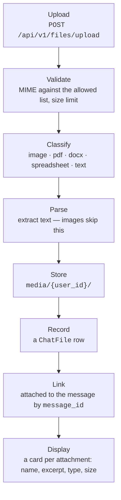
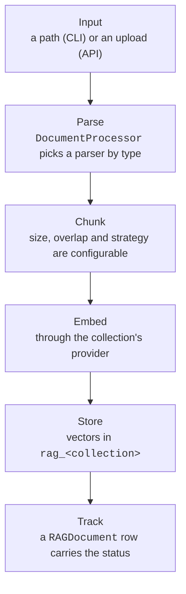

# Przetwarzanie plików { #file-processing }

Ten dokument opisuje, jak traktowane są pliki w dwóch kontekstach: uploady
plików w czacie, które należą do osoby, która je zrobiła, oraz ingestia
dokumentów RAG, która należy do kolekcji i jest uzależniona od tego,
[kto może do niej sięgnąć](#who-may-reach-a-collection).

## Uploady plików w czacie { #chat-file-uploads }

Kiedy ktoś wgrywa plik w interfejsie czatu, uruchamia się następujący pipeline:

### Przebieg { #flow }



Odpowiedź na upload niesie `preview` — pierwsze trzy linie wyciągniętego tekstu,
ograniczone do 240 znaków — żeby karta mogła pokazać, co jest *w* pliku, a nie
tylko jak się nazywa. Przeglądarka nie potrafi tego wyliczyć: PDF jest bajtami,
dopóki ten serwis go nie sparsuje, a klient ma id i nazwę pliku dopiero wtedy,
gdy upload odpowie. Dla obrazu i dla pliku, którego żaden parser nie umiał
przeczytać, jest to `null`, a karta bez fragmentu pokazuje samą miniaturę albo
samą nazwę.

### Blokująca praca dzieje się poza pętlą requestów, na własnej puli { #the-blocking-work-runs-off-the-request-loop-on-its-own-pool }

Parsowanie uploadu — PyMuPDF po każdej stronie, openpyxl po każdej komórce,
zdekodowanie całego pliku — oraz czytanie i zapisywanie jego bajtów blokują i nie
mają punktu zawieszenia. Dlatego dzieją się na wątku, a nie na pętli requestów;
inaczej jeden duży upload zamroziłby na tym workerze każdy inny request i każdy
strumień agenta.

Dzieją się na **dedykowanej, ograniczonej** puli (`app/core/blocking.py`, jej
rozmiar ustala `FILE_IO_MAX_WORKERS`), a nie na współdzielonym domyślnym
executorze `asyncio`. Ten executor niesie też hashowanie haseł przez `bcrypt`
i DNS dla przypiętych hostów, a seria uploadów nie może zająć tam każdego workera
i zostawić logowania oraz requestów wychodzących w kolejce za nieograniczonym
zaległym stosem buforów uploadu
([#1108](https://github.com/vstorm-co/agenticos/issues/1108)).

Zapis jest też **bezpieczny przy anulowaniu**. Executor nie umie przerwać
trwającego `write_bytes`, więc anulowany upload czeka na koniec zapisu i kasuje
plik, który utworzył — wywołujący nigdy nie dostaje ścieżki w storage, więc
inaczej nie mógłby ani odnotować sieroty, ani jej posprzątać.

### Celem upuszczenia jest cała strona { #the-whole-page-is-the-drop-target }

Plik przeciągnięty nad czat jest przyjmowany **w dowolnym jego miejscu**, a nie na
polu edycji. Kiedyś jedynym celem było pole edycji, przez co załączenie czegoś
było grą w trafienie w pasek wysokości kilku centymetrów — a nietrafienie nie było
niczym niewinnym: domyślne zachowanie przeglądarki dla upuszczonego pliku to
*otwarcie* go, więc karta odchodziła od rozmowy i od tego, co było w niej
w połowie napisane. Ten sam `preventDefault`, który pozwala stronie wziąć plik,
odbiera go przeglądarce, więc nasłuchiwanie na oknie naprawia obie połowy naraz.

Kiedy plik jest nad stroną, przykrywa ją nakładka: rozmyte tło, kreskowana karta
na środku i wypisany na niej limit rozmiaru pojedynczego pliku — film o rozmiarze
60 MB odrzucony *po* przeciągnięciu to podróż, której nikt nie musiał odbywać.
Nakładka jest portalowana do `body`, a nie pozycjonowana od pola edycji, bo
`fixed` mierzy się względem najbliższego przodka z transformacją i jeden
`backdrop-blur` na wrapperze powyżej po cichu skurczyłby nakładkę do rogu.

Dwóch rzeczy celowo nie robi. Przeciąganie niosące cokolwiek **innego** niż pliki
— zaznaczony tekst, link, jeden z własnych przeciągalnych wierszy aplikacji —
zostaje zupełnie w spokoju, nie jest nawet blokowane. I nic nie jest przyjmowane,
gdy pole edycji jest wyłączone: zarchiwizowana rozmowa, run czekający na
zatwierdzenie. Brak nakładki jest tym, co to komunikuje.

### Długie wklejenie jest plikiem { #a-long-paste-is-a-file }

Wklejenie do pola edycji więcej niż **2000 znaków** wgrywa tekst jako
`pasted-<date>.txt`, zamiast go wstawiać. Sama textarea zostaje nietknięta, więc
pytanie da się napisać obok rzeczy, której dotyczy, a transkrypcja trzyma
załącznik zamiast jednego ogromnego dymka.

Próg jest całym projektem tego zachowania. Ktoś, kto wkleja akapit i naciska
enter, chciał, żeby to *był* komunikat, więc próg leży powyżej wszystkiego, co
człowiek wkleiłby jako pytanie — mniej więcej 350 słów — i poniżej dowolnego
dokumentu. Poniżej niego nic się nie zmieniło: tekst ląduje w textarei tak jak
zawsze.

Dalej jest to zwykły załącznik `text/plain` i wszystko poniżej stosuje się do
niego bez zmian, o co właśnie chodzi: agent z workspace'em dostaje wklejkę jako
plik, który może otworzyć, a agent bez niego dostaje tekst w swoim prompcie.

### Obsługiwane typy plików { #supported-file-types }

| Kategoria | Typy MIME | Rozszerzenia | Przetwarzanie |
|----------|-----------|------------|------------|
| **Obrazy** | image/jpeg, image/png, image/webp, image/gif | .jpg, .png, .webp, .gif | Zapisywane bez zmian. Wysyłane do LLM jako `BinaryContent` do analizy wizyjnej. |
| **PDF** | application/pdf | .pdf | Tekst wyciągany skonfigurowanym parserem PDF. Doklejany do promptu jako kontekst. |
| **DOCX** | application/vnd.openxmlformats-officedocument.wordprocessingml.document | .docx | Akapity wyciągane przez `python-docx`. Doklejane do promptu jako kontekst. |
| **Arkusz** | …spreadsheetml.sheet, …ms-excel.sheet.macroEnabled.12 | .xlsx, .xlsm | Każdy arkusz czytany przez `openpyxl`, nazwany, wiersze rozdzielone tabulatorami. Doklejane do promptu jako kontekst. `.xls` jest odrzucany — to inny format wymagający innego czytnika. |
| **Tekst** | text/plain, text/markdown | .txt, .md | Dekodowany wprost jako UTF-8. Doklejany do promptu jako kontekst. |

### Dokąd trafia załącznik, zależy od agenta { #where-an-attachment-goes-depends-on-the-agent }

Kolumna „doklejane do promptu” powyżej opisuje to, co dzieje się z agentem **bez
workspace'u**, i jest to cały plik, w każdej turze. Dwustustronicowy raport
kosztuje pełną wagę w tokenach, kiedy użytkownik zadaje pierwsze pytanie, i drugi
raz, kiedy pyta „a co z marcem”; pięćdziesięciomegabajtowego CSV nie da się
załączyć w ogóle.

Agent z [capability `sandbox`](reference/capabilities.md#files-shell) dostaje
plik zamiast tekstu:

| Załącznik | Bez workspace'u | Z workspace'em |
|---|---|---|
| text, csv, md, json | sparsowany tekst wklejony inline | zapisany do `uploads/`, komunikat niesie referencję i 20 pierwszych linii |
| pdf, docx, arkusz | sparsowany tekst wklejony inline | zapisany do `uploads/`, z wyciągniętym tekstem obok, chyba że runtime umie go przeczytać; referencja i 20 pierwszych linii |
| obraz | `BinaryContent` | `BinaryContent` **oraz** zapis; referencja podaje ścieżkę |

**Wyciągnięty tekst idzie w parze z plikiem tylko tam, gdzie nic nie umie
przeczytać oryginału.** Kiedyś `.txt` z parsowania zapisywany był obok każdego
PDF-a, `.docx` i arkusza, przy założeniu, że shell nie ma biblioteki do żadnego
z nich — `read_file` na `.xlsx` zwraca krzaki, a `run_python` nie ma w ogóle
systemu plików. Na runtimie niosącym `lit` to założenie jest nieaktualne:
`lit parse q3.xlsx -o q3.md` to jedno polecenie, z OCR dla skanu i LibreOffice dla
starszych formatów (`sandbox.md`), więc plik obok jest drugą kopią zawartości na
dysku, żeby oszczędzić jedno wywołanie narzędzia.

Wszędzie indziej nadal jest zapisywany, a warunkiem nie jest rodzaj backendu:
workspace typu `state` to pliki bez żadnego shella, sandbox Daytony i własny
runtime wdrożenia niosą to, co niesie ich obraz, i żadne z nich nie ma `lit`.
Warunkiem jest to, czy to wdrożenie *opisało* runtime modelowi — tym samym
briefingiem, który run dokleja do swoich instrukcji. Jeśli powiedziano mu, że ma
`lit`, pliku obok nie ma; w każdym innym przypadku tekst ląduje obok pliku.

Parsowanie i tak dzieje się po stronie serwera, bo *tekst* jest tym, co dostaje
agent bez workspace'u, i tym, z czego pochodzi 20-linijkowy początek w
komunikacie. Przyjęcie uploadu bez sparsowania dotarłoby do agenta z workspace'em
jako nieczytelne bajty, a do agenta bez niego jako zupełnie nic.

**Odmowa zapisu jest powiedziana raz i dotyczy workspace'u.** Run, którego
workspace nie przyjmie pliku, to run, w którym shell i narzędzia plikowe też
zawiodą, a linia per plik nie potrafi tego powiedzieć: tura czytała każdą
porażkę jako problem z poleceniem, które właśnie napisała, i próbowała dalej —
`ls`, potem `curl` na URI `data:`, potem trzy obejścia zaproponowane
człowiekowi, przez dwie tury. Teraz jedno zdanie mówi, że workspace jest
niedostępny i że kolejna próba zawiedzie tak samo.

Referencja jest tym, co model faktycznie czyta:

```
Attached file: raport.csv (/uploads/3f2a1b9c-raport.csv, 2.4 MB, text)
First 20 lines:
month,total
jan,10
...
```

Tyle, żeby odróżnić eksport sprzedaży od logu i zobaczyć nazwy kolumn — czyli
tyle, ile model potrzebuje, by zdecydować, czy przeczytanie reszty jest warte
wywołania narzędzia. Plik przestał być kontekstem i stał się danymi.

Cztery rzeczy są tu celowe:

- **Obrazy idą obiema drogami.** Model musi nadal *widzieć* obrazek — po to jest
  model multimodalny, a ciąg ze ścieżką go nie zastąpi — i musi też umieć go
  przeskalować albo przyciąć, co wymaga bajtów w systemie plików. Powyżej
  `SANDBOX_INLINE_IMAGE_MAX_BYTES` zostaje wyłącznie plik, bo od tego momentu
  płacenie za bajty dwa razy przestaje się opłacać.
- **PDF dostaje obie połowy.** Bajty są tym, o co człowiek poprosił; tekst, który
  ta platforma i tak już wyciągnęła, jest tą połową, którą shell faktycznie umie
  przeczytać.
- **Ten sam plik jest zapisywany raz.** Ścieżka jest wyprowadzana z id
  `ChatFile`, więc ponowne załączenie go w piątej turze rozwiązuje się do
  ścieżki, którą już ma — upload kosztuje jeden zapis, a nie jeden na turę przez
  resztę rozmowy.
- **Nazwa pliku nie jest zaufana.** `../../etc/passwd` staje się `etc_passwd`;
  dwa pliki o nazwie `report.csv` nie mogą się nawzajem nadpisać.

Plik, którego nie da się zapisać — pełny workspace — wraca na ścieżkę inline,
zamiast znikać, a plik, którego magazyn plików nie umie wczytać, jest pomijany,
zamiast wywracać turę: człowiek zadał pytanie, a odpowiedź bez załącznika jest
lepsza niż brak odpowiedzi.

Routing dzieje się w `app/services/attachments.py`, wołanym z runnera czatu,
a nie z każdej powierzchni. Musi tam być: to, dokąd trafia plik, zależy od tego,
czy agent ma workspace, a o tym decyduje `prepare`, który nie zdążył się wykonać,
gdy powierzchnia składa swój prompt.

### Parsowanie PDF (czat) { #pdf-parsing-chat }

Załączniki z czatu czyta **PyMuPDF** i nie da się tego skonfigurować. Załącznik
nie należy do żadnej kolekcji, więc nie ma zapisanej konfiguracji, z której
dałoby się odczytać wybór parsera.

Zmiennej `CHAT_PDF_PARSER`, która kiedyś wybierała między trzema parserami, już
nie ma. Obie alternatywy były opakowane w `except Exception: return
self._parse_pdf_pymupdf(data)`, więc wdrożenie ustawiające ją na `llamaparse`
albo `liteparse` i tak po cichu używało PyMuPDF — a gałąź LiteParse nie mogła
zadziałać w ogóle, bo wołała metodę `parse_async`, której binding nie definiuje.

### Limity rozmiaru { #size-limits }

!!! warning "Dwa sufity, a przeglądarka ma własną kopię jednego z nich"

    Załącznik w czacie jest odrzucany przez `CHAT_MAX_UPLOAD_SIZE_MB` (10 MB);
    dokument bazy wiedzy przez `MAX_UPLOAD_SIZE_MB` (50 MB). Kontener frontendu
    czyta w czasie działania tę samą zmienną `CHAT_MAX_UPLOAD_SIZE_MB`, więc daj
    obu kontenerom jedną wartość: za wysoka po stronie przeglądarki i pole edycji
    przyjmuje plik, który API odrzuca, za niska i odrzuca taki, który API by
    przyjęło.

- Maksymalny rozmiar załącznika: `CHAT_MAX_UPLOAD_SIZE_MB` (domyślnie: **10 MB**).
  To jest własny limit tej sekcji — załącznik w czacie jest odrzucany przez tę
  liczbę, a nie przez większe `MAX_UPLOAD_SIZE_MB` bazy wiedzy, i są to dwa
  osobne ustawienia, bo załącznik do agenta bez workspace'u jest wklejany
  w całości do promptu, a dokument bazy wiedzy jest dzielony na chunki
  i embedowany.
- Dokument bazy wiedzy jest ograniczany zamiast tego przez `MAX_UPLOAD_SIZE_MB`
  (domyślnie: **50 MB**).
- Całe ciało requestu ma sufit powyżej obu, na poziomie większego z nich plus
  zapas na multipart, więc podniesienie któregokolwiek sufitu podnosi i ten.
- Limit jest egzekwowany po stronie serwera, po odczytaniu zawartości pliku.
  Własne sprawdzenie przeglądarki czyta tę samą zmienną
  `CHAT_MAX_UPLOAD_SIZE_MB` ze środowiska kontenera frontendu, więc oba kontenery
  powinny dostać jedną wartość: za wysoka i pole edycji przyjmuje plik, który API
  odrzuca, za niska i odrzuca taki, który API by przyjęło.

### Przechowywanie { #storage }

Pliki zapisuje `FileStorageService` w katalogu `media/`:

```
media/
  {user_id}/
    document.pdf
    screenshot.png
    ...
```

### Model ChatFile { #chatfile-model }

Model bazodanowy `ChatFile` śledzi wgrane pliki:

| Pole | Typ | Opis |
|-------|------|-------------|
| `id` | UUID | Klucz główny |
| `user_id` | UUID/FK | Właściciel (używany do kontroli dostępu) |
| `filename` | String | Oryginalna nazwa pliku |
| `mime_type` | String | Typ MIME (np. `application/pdf`) |
| `size` | Integer | Rozmiar pliku w bajtach |
| `storage_path` | String | Ścieżka względna w magazynie |
| `file_type` | String | Sklasyfikowany typ: `image`, `pdf`, `docx`, `spreadsheet`, `text` |
| `parsed_content` | Text | Wyciągnięta treść tekstowa (NULL dla obrazów) |
| `message_id` | UUID/FK | Powiązany komunikat (ustawiany przy wysłaniu komunikatu) |
| `created_at` | DateTime | Znacznik czasu uploadu |

### Własność i dostęp { #ownership-access }

- Tylko właściciel pliku może pobrać swoje pliki (`GET /files/{id}`).
- Metoda `FileUploadService.get_user_file()` porównuje `chat_file.user_id` z ID
  użytkownika wykonującego request. Przy niezgodności zwraca `NotFoundError`.
- **Własność jest całą regułą i nic jej nie poszerza.** Żadne uprawnienie, żadna
  rola w organizacji i żaden grant nie sięgnie przez to API po plik czatu innej
  osoby — inaczej niż w przypadku kolekcji, którą grant może otworzyć.
  Porównanie idzie po `user_id` i nie ma drugiej gałęzi, która mieściłaby
  szerszy przypadek.
- **Krok wiązania przyjmuje tę samą regułę.** Komunikat załącza wyłącznie własne
  *niepowiązane* pliki nadawcy: id wskazujące plik innego użytkownika albo plik
  już przypięty do komunikatu jest odrzucane, a nie po cichu stosowane — więc
  tura nie może ani wyrenderować cudzej nazwy pliku, ani zerwać załącznika
  z komunikatu, na którym już wisi.

## Ingestia dokumentów RAG { #rag-document-ingestion }

Kiedy dokumenty są wciągane do bazy wiedzy RAG (przez CLI albo API),
parsowaniem, dzieleniem na chunki i embedowaniem zajmuje się inny pipeline.

### Przebieg ingestii { #ingestion-flow }



!!! note "Przez API kolejność jest odwrotna"

    Wiersz `RAGDocument` zapisywany jest **najpierw**, a cztery środkowe kroki
    wykonują się w zadaniu w tle z własną sesją - dlatego upload odpowiada
    `202 {"status": "processing"}`, zamiast czekać.

Są dwa adresy, pod które może trafić upload —
`POST /rag/collections/{name}/ingest` i `POST /kb/{kb_id}/documents` — i oba
odpowiadają **202** tym samym `RAGIngestResponse`, każdym jego polem, łącznie
z `"document_id": null`. Id dokumentu w magazynie wektorów nie istnieje, dopóki
worker go nie zaindeksuje.

Jeden z tych dwóch pomijał kiedyś ten klucz, zamiast wysyłać go jako null, więc
klient normalizujący odpowiedź dostawał z każdego inny kształt
([#560](https://github.com/vstorm-co/agenticos/issues/560)).

!!! danger "Zadanie startuje po zatwierdzeniu transakcji requestu"

    Jest przekazywane przez `spawn_after_commit`, a **nie** `spawn`, i startuje je
    sama sesja, kiedy wiersz jest już trwały.

    Rozesłane wcześniej szukałoby dokumentu po id, nic by nie znalazło i by się
    zatrzymało — zostawiając upload, który już potwierdziło, w stanie
    `processing` na zawsze
    ([#417](https://github.com/vstorm-co/agenticos/issues/417)).

To samo dotyczy synchronizacji: wiersz `SyncLog` istnieje, zanim powstanie jego
flow. Zobacz
[Rozsyłanie pracy w tle z requestu](architecture.md#dispatching-background-work-from-a-request).

**Każdy flow buduje własny engine do magazynu wektorów i likwiduje go razem
z pracą tego flow.**

**Jedna pętla jest właścicielem pul procesu, a wszystko inne buduje własny
engine.** Lifespan API zajmuje je przy starcie: obsługuje każdy request i
likwiduje je przy zamknięciu, więc to jedyna pętla, której połączenia mogą
cache'ować. Poza tą pętlą `get_db_context` zachowuje się jak
`get_worker_db_context` — engine z `NullPool` na czas wywołania, likwidowany na
końcu — bo sięga się po niego z flow Prefecta (raport, odświeżanie MCP, zadania
zaproszeń i zatwierdzeń, pętle kanałów) oraz z resolvera embeddingów agenta,
każdy na własnej pętli
([#1079](https://github.com/vstorm-co/agenticos/issues/1079)).

Wyszukiwanie w wiedzy przez agenta trzyma się tej samej reguły dla swojego
magazynu wektorów: magazyn procesu na pętli właścicielskiej, a wszędzie indziej
`agent_vector_engine` — bez puli. To jedyny wywołujący wektory, który nie może
wiedzieć, na której pętli jest, a jego magazyn retrieval jest cache'owany na całe
życie procesu, więc magazyn z pulą współdzielony między dwiema pętlami w jednym
workerze podaje drugiej połączenie otwarte przez pierwszą. Zachowanie puli dla
API jest tym, co to ogranicza: `NullPool` otwiera połączenie na każde pobranie
i niczego nie limituje, podczas gdy pula kolejkuje przy
`DB_POOL_SIZE + DB_MAX_OVERFLOW`.

### Obsługiwane formaty { #supported-formats }

`.txt`, `.md` i `.docx` czytają wbudowane parsery pythonowe niezależnie od tego,
jaki parser ma kolekcja. Poza nimi zestaw idzie za parserem:

| Parser | Czyta dodatkowo | Wymaga |
|--------|-----------|-------|
| PyMuPDF | `.pdf` | niczego |
| LiteParse | `.pdf`; obrazy (`.png`, `.jpg`, `.tiff`, `.svg`, …); formaty biurowe (`.xlsx`, `.pptx`, `.odt`, `.csv`, `.rtf`, …) | LibreOffice **tylko dla formatów biurowych** — obrazy są konwertowane natywnie |
| LlamaParse | `.pdf`, `.pptx`, `.xlsx`, `.csv`, `.rtf`, `.epub`, `.html`, obrazy | Klucz LlamaParse w vaulcie organizacji, wskazany przez kolekcję (`llamaparse_secret_id`). Nie ma klucza na poziomie wdrożenia |

Dockerfile backendu instaluje LibreOffice i Tesseract, więc formaty biurowe i OCR
działają w kontenerze od razu. Przy backendzie uruchomionym poza Dockerem upload
pliku biurowego do kolekcji z LiteParse jest odrzucany komunikatem wskazującym
LibreOffice, zamiast wysypywać się w trakcie konwersji.

`GET /api/v1/rag/supported-formats?parser=liteparse` odpowiada dla jednego
parsera. Te zestawy to jest to, co `DocumentProcessor` faktycznie umie
poprowadzić — przypięte przez `backend/tests/test_supported_formats.py`, bo
kiedyś były aspiracyjne: `.xlsx` był przyjmowany, zapisywany, dostawał wiersz
dokumentu i był rozsyłany, a potem umierał w workerze jako „Unsupported file
type”.

### Wybór parsera (RAG) { #parser-selection-rag }

Per kolekcja, na `/rag`, z możliwością nadpisania per upload — nie przez zmienną
środowiskową. Przechowywany w `knowledge_bases.ingestion_config`.

| Parser | Najlepszy do |
|--------|----------|
| PyMuPDF (domyślny) | Szybkie przetwarzanie lokalne, dokumenty z dużą ilością tekstu; jedyny, który wyciąga osadzone obrazy do opisania |
| LiteParse | Lokalny, bez klucza, świadomy układu; czyta formaty biurowe i obrazy; wyjście w markdownie |
| LlamaParse | Złożone układy i skanowane PDF-y; chmura, rozliczana za stronę |

### Opcje LiteParse { #liteparse-options }

| Ustawienie | Domyślnie | Uwagi |
|---------|---------|-------|
| `liteparse_output_format` | `markdown` | Odtwarza nagłówki, tabele i listy — czyli to, po czym dzieli strategia chunkowania `markdown`. `text` zachowuje siatkę przestrzenną. |
| `auto_ocr` | `true` | Uruchamia tanie sprawdzenie warstwy tekstowej LiteParse dla każdego dokumentu i OCR-uje tylko to, co tego potrzebuje. OCR dominuje w koszcie parsowania. |
| `ocr_language` | `eng` | Kody Tesseracta — trzy litery, łączone przez `+` dla kilku (`eng+pol`). Język bez zainstalowanej paczki nie przeczyta nic; dodaj `tesseract-ocr-<lang>` do Dockerfile'a. |
| `liteparse_dpi` | `150` | Wyżej czyta blade skany, ale wolniej. |
| `max_pages` | `1000` | Ustawienie, które ogranicza koszt jednego dokumentu; `parse_timeout_seconds` ogranicza tylko czas oczekiwania. |

### Konfiguracja chunkowania { #chunking-configuration }

Per kolekcja, obok parsera:

| Ustawienie | Domyślnie | Opis |
|---------|---------|-------------|
| `chunk_size` | `512` | Maksymalna liczba znaków na chunk |
| `chunk_overlap` | `50` | Liczba znaków zachodzenia; musi być mniejsza niż `chunk_size` |
| `chunking_strategy` | `recursive` | Strategia: `recursive`, `markdown`, `fixed` |

**Porównanie strategii:**

| Strategia | Najlepsza do |
|----------|----------|
| `recursive` | Tekst ogólny; dzieli po akapicie, potem po linii, potem po słowie, potem po znaku |
| `markdown` | Dokumenty markdown/ustrukturyzowane; dzieli na granicach nagłówków, a potem według rozmiaru wewnątrz każdej sekcji |
| `fixed` | Jednolite rozmiary chunków; dzieli wyłącznie po końcach linii, więc długa linia jest wypuszczana w całości |

Wszystkie trzy pochodzą z `app/services/rag/_splitters.py`, który zastąpił
`langchain-text-splitters` w [#158](https://github.com/vstorm-co/agenticos/issues/158)
— wśród ośmiu paczek, które za sobą ciągnął, był `langsmith`, czyli drugi SDK
hostowanej telemetrii w platformie, która ustandaryzowała się na Logfire.

Trzy rzeczy o nich warto wiedzieć, zanim zacznie się kręcić liczbami:

- **`chunk_overlap` to sufit, a nie gwarancja.** Chunk powtarza tyle
  poprzedniego, ile jeszcze mieści się pod `chunk_size`, co bardzo często jest
  mniej niż ustawienie, a czasem niczym.
- **Kawałek, dla którego nie został żaden separator, jest wypuszczany w całości,
  a nie cięty.** `fixed` dzieli wyłącznie po końcach linii, więc linia o rozmiarze
  4 KB staje się chunkiem o rozmiarze 4 KB; splitter loguje ostrzeżenie, zamiast
  podawać modelowi embeddingów coś, co ten odrzuci. Ostrzeżenie oznacza
  *przekroczenie* `chunk_size` — linia o dokładnie `chunk_size` znakach mieści
  się w limicie i przechodzi po cichu.
- **`markdown` zostawia nagłówek w chunku**, a do czasu #158 nie stosował ani
  `chunk_size`, ani `chunk_overlap` — sekcja o rozmiarze 50 KB między dwoma `##` była
  jednym chunkiem. Teraz puszcza po każdej sekcji splitter rekurencyjny, więc oba
  ustawienia znaczą w tej strategii to samo, co w pozostałych.

Granice chunków są tym, z czym dopasowuje się wyszukiwanie, więc
kolekcja wciągnięta przed tą zmianą zachowuje chunki, z którymi ją wciągnięto.
Żeby przechunkować dokument na nowo, wgraj go ponownie albo puść jeszcze raz
`uv run agenticos cmd rag-ingest`.

**To, ile chunków ma dokument, decyduje o tym, jak długo trwa jego zapisanie, ale
już nie o tym, ile jest podróży do bazy.**

`insert_document` zapisuje je po 200 wierszy na instrukcję (`executemany`, które
asyncpg pipeline'uje). Kiedyś wydawał jeden `INSERT` na chunk w pętli
pythonowej, wewnątrz jednej otwartej transakcji — więc 200-stronicowy PDF przy
domyślnym `chunk_size` to było od jednego do trzech tysięcy sekwencyjnych podróży
do bazy: od pięciu do piętnastu sekund przy zarządzanym Postgresie z czasem
3-5 ms, zanim zapłacono za choćby jeden embedding
([#950](https://github.com/vstorm-co/agenticos/issues/950)).

Jest to batchowane, a nie zapisywane jedną instrukcją na cały dokument, bo lista
parametrów trzymana jest w pamięci, a każdy wiersz niesie swój embedding
wyrenderowany jako tekst — przy 3072 wymiarach to dziesiątki kilobajtów na wiersz.

**Nadpisanie jest sprawdzane względem scalonej pary, a nie względem własnej
wartości.**

Pole `ingestion` wysyłane per upload niesie wyłącznie to, co zmienia, więc
`chunk_overlap: 4096` wysłane do kolekcji chunkującej po 512 to dwie z osobna
legalne liczby i jedna konfiguracja, która powtarza prawie wszystko, przez co
przechodzi.

Scalenie waliduje ponownie, a upload jest odrzucany z **400** wskazującym oba
ustawienia w `details.fields` — zanim plik zostanie zapisany i zanim powstanie
wiersz dokumentu, więc nie ma czego ponawiać ani sprzątać.

Do czasu [#874](https://github.com/vstorm-co/agenticos/issues/874) odpowiadało to
kodem 500 z pustym `details`: scalenie rzucało surowy błąd Pydantica, który nie
trafia do żadnego handlera. Ta sama para wysłana jako własna konfiguracja
kolekcji była zawsze odrzucana z 422, bo tam jest polem ciała JSON i FastAPI
waliduje je, zanim wejdzie w route.

Obie odmowy wskazują te same pola, `ingestion_config` dla reguły o parze
i `ingestion_config.chunk_size` dla pojedynczego ustawienia — więc formularz
zaznacza jedno miejsce niezależnie od tego, które wejście odmówiło. (Reguła
o parze wskazuje obiekt, bo Pydantic nie przypisuje
`model_validator(mode="after")` do żadnego z dwóch pól, których dotyczy.) Do
czasu [#882](https://github.com/vstorm-co/agenticos/issues/882) odpowiedź 400
wskazywała swoje pola pod `details.errors`, we własnym formacie błędów Pydantica,
którego nic na frontendzie nie czytało: zdanie docierało do tosta i żadne pole
nigdy nie zostało podświetlone.

### Embeddingi — model, czyj endpoint odpowiada i czyj klucz płaci { #embeddings-the-model-whose-endpoint-answers-and-whose-key-pays }

Wszystkie trzy rzeczy rozstrzygane są **per kolekcja**, a nie per wdrożenie,
przez `app/services/embedding_resolution.py` w oparciu o katalog w
`app/core/catalog/embedding_providers.json`:

| | |
|---|---|
| **Model i szerokość** | Zapisywane na bazie wiedzy przy tworzeniu (`embedding_model`, `embedding_dim`) i nigdy potem niezmieniane — `PgVectorStore` zapisuje `embedding vector(N)` raz, więc drugi model albo nie da się zapisać, albo jest po cichu porównywany z wektorami z innej przestrzeni. Nowa kolekcja wybiera jeden z modeli, które serwuje jej provider; nie ma wartości domyślnej wdrożenia. |
| **Provider** | Który endpoint zgodny z OpenAI obsługuje ten model (`embedding_provider`). **Zmienialny**, inaczej niż model: ten sam model o tej samej szerokości produkuje wektory w tej samej przestrzeni niezależnie od tego, skąd jest serwowany, więc `PATCH /kb/{id}` przenosi kolekcję między providerami i zostawia wszystko, co już zaindeksowane, ważne. |
| **Poświadczenie** | Klucz z vault wybrany na kolekcji (`embedding_secret_id`), czyli to, za co organizacja jest rozliczana i co musi być kluczem **dla tego providera**. Nie ma klucza embeddingowego na poziomie wdrożenia: nowa kolekcja osobista albo organizacyjna musi wskazać klucz, a kolekcja bez używalnego klucza odmawia indeksowania i wyszukiwania, dopóki go nie dostanie. Provider `ollama` jest **bezkluczowy** — to Ollama w sieci samego wdrożenia — więc kolekcja u niego nie wskazuje żadnego klucza i zostaje odrzucona, jeśli spróbuje; zamiast tego wskazuje **usługę lokalną** (`embedding_endpoint_id`), wiersz w Knowledge → Integrations, który niesie adres, własny organizacji albo ogólnowdrożeniowy, zarejestrowany przez administratora aplikacji. Kolekcja **app-scoped** nie należy do żadnej organizacji, więc nie ma vaultu, z którego mogłaby wskazać klucz; może embedować wyłącznie przez providera bezkluczowego na usłudze ogólnowdrożeniowej, a wybór providera z kluczem jest dla niej odrzucany tam, gdzie provider był wybierany. |

To, do której bazy wiedzy rozwiązuje się nazwa kolekcji, jest samo w sobie
pytaniem o tenanta. `collection_name` jest indeksowane, ale **nieunikalne** — dwie
organizacje mogą nazwać kolekcję tak samo i dzielić jedną tabelę wektorów — więc
rozwiązanie nazwy jest ograniczone do organizacji, *dla której* liczony jest
embedding: tej z wciągającego flow, tej z wyszukującego agenta. Wzięcie tego
wiersza, który baza uporządkowała jako pierwszy, rozwiązałoby model innego
tenanta i odpieczętowało *jego* klucz z vault na potrzeby tego requestu,
obciążając go kosztem i przepuszczając tekst tej organizacji przez jego
poświadczenie
([#913](https://github.com/vstorm-co/agenticos/issues/913)). Wspólna nazwa
rozwiązuje więc własną konfigurację każdej organizacji, spadając na kolekcję
o zasięgu app, ale nigdy na kolekcję trzeciego tenanta.

!!! warning "Jedna nazwa kolekcji to jedna przestrzeń embeddingów"

    Rozwiązywanie per organizacja jest bezpieczne tylko dlatego, że wszystkie
    wiersze o jednej nazwie kolekcji zgadzają się co do tego, jak embedują. Baza
    wiedzy utworzona pod nazwą, która już istnieje, **przejmuje** model,
    szerokość, provider i klucz z vault tamtej kolekcji, a jawny wybór, który się
    z nimi nie zgadza, jest odrzucany, a nie po cichu nadpisywany. Bez tego jedna
    fizyczna tabela mogłaby trzymać dwie przestrzenie embeddingów: pgvector
    odrzuca porównanie wprost tam, gdzie szerokości się różnią, a tam, gdzie
    akurat się zgadzają, rankuje wektory jednego modelu względem drugiego
    i odpowiada wiarygodnym nonsensem.

Provider był kiedyś zaszyty na sztywno: każdy request szedł do `openrouter.ai`,
więc organizacja mająca klucz OpenAI nie mogła go użyć, przeniesienie klucza na
inne konto oznaczało odtworzenie kolekcji i ponowne wciągnięcie do niej każdego
dokumentu, a nic nie powstrzymywało kolekcji przed wysłaniem poświadczenia
jednego dostawcy pod adres drugiego. Tym samym katalogiem odpowiada
`GET /rag/embedding-models`, więc formularz tworzenia proponuje modele, które
provider faktycznie umie obsłużyć — kiedyś proponował każdy model, dla którego ta
kompilacja znała *szerokość*, a trzy z nich to były wagi sentence-transformer,
których nic tutaj nie umie wywołać.

Klucz jest walidowany przy tworzeniu. Klucz należący do innej organizacji, klucz
o niewłaściwym przeznaczeniu albo taki, którego wybierający sam nie widzi, jest
odrzucany właśnie tam, gdzie osoba wybierająca może to poprawić.

Ten ostatni przypadek jest powodem, dla którego związanie klucza wymaga
`secrets:view` na kluczu, a nie tylko `collections:edit` na kolekcji:
**związanie klucza to jego pożyczenie**, bo embeddingi kolekcji obciążają go za
każdego, kto może do niej pisać.

Picker zawsze proponował wyłącznie klucze, które wybierający widzi — ale API
przyjmuje id, a id da się zgadnąć. Do czasu
[#912](https://github.com/vstorm-co/agenticos/issues/912) Member mógł związać
**prywatny** klucz innego członka, podając jego UUID.

Klucz, którego nie może zobaczyć, jest odrzucany jako taki, którego vault nie ma,
więc odmowa nie może wyliczyć cudzych prywatnych sekretów.

W momencie embedowania resolver niczego nie odrzuca: wybrany klucz, który
został w międzyczasie usunięty, którego nie da się odpieczętować albo który nie
zawiera klucza API, rozwiązuje się do *żadnego* klucza, bo *czyj klucz płaci*
nigdy nie może decydować o tym, *czy da się odczytać wiersz kolekcji*. Klient
embeddingowy odmawia wtedy indeksowania albo wyszukiwania komunikatem
wskazującym kolekcję, jej providera i to, które z tych zdarzeń zaszło — nie ma
klucza ogólnowdrożeniowego, na który można by spaść, więc odmowa nigdy nie radzi
ustawić zmiennej.

To zejście jest ogłaszane, a nie zakładane. Rozwiązanie niesie informację, na
które z pięciu źródeł trafiło, a ingestia wpisuje każde gorsze do logu runu
Prefecta, łącznie z kolekcją, która po prostu nie wskazuje żadnego klucza. Przed
zgłoszeniem #306 worker ingestii był jedynym wywołującym, który nigdy nie pytał
resolvera, więc każdy wgrany dokument był embedowany modelem wdrożenia i kluczem
ogólnowdrożeniowym, niezależnie od tego, co wybrała jego kolekcja; tamtego klucza
już nie ma.

### Magazyn wektorów { #vector-storage }
Wektory trzyma **pgvector**, korzystając z istniejącej bazy PostgreSQL.
Nie są potrzebne żadne dodatkowe usługi.

**Jedna tabela na kolekcję, tworzona w czasie działania.**

Magazyn wydaje `CREATE TABLE IF NOT EXISTS rag_<collection>` przy pierwszym
zapisie do kolekcji, więc te tabele istnieją w bazie danych i nigdzie indziej.
Żaden model ich nie deklaruje i żadna migracja ich nie tworzy, bo wdrożenie ma
ich tyle, ile ktoś zrobił baz wiedzy.

Alembic nie jest ich właścicielem i `alembic/env.py` mówi to przez `include_name`.
Bez tego `make db-check` czytał każdą z nich jako tabelę, którą modele usunęły,
i wysypywał się na każdej bazie, do której kiedykolwiek coś wciągnięto.

Predykat mieszka w `app/db/vector_tables.py` i jest celowo węższy niż sam
prefiks: `rag_documents` *jest* tabelą modelu, a wykluczenie jej wyłączyłoby
bramkę dla tej jednej tabeli, przez którą pisze ingestia.

Magazyn odpowiada na to samo pytanie tym samym predykatem: `list_collections`,
czyli to, co wypisuje `rag-collections`, raportuje tabelę `rag_` tylko wtedy, gdy
żaden model jej nie deklaruje. Dopasowanie po samym prefiksie sprawiało, że
raportował `rag_documents` jako kolekcję o nazwie `documents` — taką, której nikt
nie utworzył, której „liczba wektorów” była liczbą wciągniętych dokumentów i którą
każdy wywołujący mógł potem poprosić o przeszukanie.

#### Jak może nazywać się kolekcja { #what-a-collection-may-be-called }

Nazwa kolekcji to ciąg znaków, który wybiera wywołujący i z którego magazyn
buduje identyfikatory, więc **jedna funkcja decyduje, czy nadaje się do
użycia** — `validate_collection_name` w `app/db/vector_tables.py`. Cztery odmowy,
każda jako 400:

| Odrzucone | Ponieważ |
|---|---|
| Nie goły identyfikator — `foo-bar`, `2024_reports`, cokolwiek ze spacją albo cudzysłowem | Magazyn wstawia nazwę do DDL bez cudzysłowów. Wiodąca cyfra tylko *wygląda* bezpiecznie: prefiks `rag_` dostarcza literę, której nazwie brakuje. |
| Jakakolwiek wielka litera — `Handbook` | Postgres składa identyfikator bez cudzysłowów do małych liter, więc `Handbook` i `handbook` to jedna tabela. Nic powyżej bazy tego nie widzi: wszędzie indziej nazwy porównuje się jako całe ciągi, więc są to dwa wiersze, które platforma uważa za dwie kolekcje. Odrzucane, a nie zamieniane na małe litery — zapisanie nazwy, której wywołujący nie wpisał, jest dokładnie tą reinterpretacją, której ta reguła ma unikać. |
| Dłuższe niż 45 znaków | Postgres zachowuje 63 bajty identyfikatora, a resztę po cichu ucina. `rag_<name>` mieści się przy 59, ale `rag_<name>_embedding_idx` już nie, a granicę wyznacza najdłuższy identyfikator — nie najkrótszy. |
| `all` | Zarezerwowane. |
| Tabela należąca do modeli — `documents` | Zobacz niżej. |

Dwie z nich to ta sama awaria osiągnięta inaczej i obie są warte zdania.
**Granica długości** jest tą, która czyta się jak pedanteria, a nią nie jest.

Dwie kolekcje zgadzające się do punktu ucięcia są **jednym obiektem**:

- **Jedną tabelą**, jeśli za długa była nazwa — więc `DROP` którejkolwiek
  organizacji niszczy wektory drugiej, a każde wyszukiwanie przechodzi między
  nimi.
- **Jednym indeksem**, jeśli za długa była tylko nazwa indeksu, co jest cichsze:
  `CREATE INDEX IF NOT EXISTS` zastaje indeks pierwszej kolekcji już na miejscu
  i nie buduje nic, zostawiając drugą bez indeksu, przy szerokości, z jaką
  zbudowano pierwszą.

Nic powyżej bazy nie widzi żadnego z tych przypadków, bo wszędzie indziej nazwa
kolekcji porównywana jest jako cały ciąg.

Dlatego też liczy się **wielkość liter**: pisownia to krótsza droga do tej samej
wspólnej tabeli, a odrzucenie wielkich liter zamyka przy okazji drugą.
`_collection_exists` porównywało `rag_Handbook` z `information_schema.tables`,
która trzyma nazwę złożoną do małych liter, więc nigdy nie trafiało, a `search`,
`get_documents` i `get_document_chunks` odpowiadały **pusto** dla każdej kolekcji
z wielką literą w nazwie.

Ta ścieżka została usunięta, a nie naprawiona: taka nazwa jest teraz odrzucana
tam, gdzie budowana jest nazwa tabeli, zanim cokolwiek zdąży zapytać.

**Kolekcja nie może nazywać się tak jak tabela należąca do modeli**, co jest
predykatem tabeli runtime'owej odczytanym po raz trzeci — zadanym nazwie, zanim
jej tabela w ogóle istnieje. Odrzucane zarówno w API, jak i w samym magazynie, bo
`rag-drop <name>` dociera do magazynu bez żadnego route'u po drodze. Nazwą, która
to wymusiła, jest `documents`: z prefiksem *jest* tabelą śledzącą, więc usunięcie
takiej kolekcji celowało `DROP TABLE IF EXISTS` w historię ingestii każdej
organizacji. Odmowa jest wyprowadzana, a nie wypisana z listy, więc obejmuje też
tabelę modelu z prefiksem `rag_` dodaną później, a kolekcja o nazwie
`documents_archive` — którą dosłowne wykluczenie zabrałoby ze sobą — nie jest nią
dotknięta.

**I nazwa musi być wolna.**

Przestrzeń nazw wektorów jest globalna dla wdrożenia: dwie bazy wiedzy trzymające
jedną nazwę kolekcji dzielą jedną tabelę. Dlatego nazwa już zajęta poza zasięgiem
wywołującego jest odrzucana z 409 — `CollectionAccessService.claim`, wołane
zarówno przez `POST /kb`, jak i `POST /rag/collections/{name}`.

Kiedyś wołało je tylko jedno z nich. `POST /kb` zapisywało dowolne przysłane
`collection_name`, więc członek z `collections:edit` mógł wycelować bazę wiedzy
w tabelę wektorów innej organizacji, a potem czytać ją i pisać do niej przez
wszystkie bramki — bo kolekcja rozwiązuje się przez tę bazę wiedzy, którą
wywołujący *umie* przeczytać, a teraz jedna z nich jest jego.

Nazwa, której wywołujący nie podaje, wyprowadzana jest z nazwy wyświetlanej plus
sześciu losowych znaków szesnastkowych i jest zajmowana tą samą ścieżką, a nie
uznawana za bezpieczną dlatego, że jest losowa.

**I nazwa w trakcie rozbiórki też nie jest wolna.** Usunięcie kolekcji kasuje jej
wiersze bazy wiedzy w ramach requestu, ale fizyczną tabelę wektorów `rag_<name>`
usuwa dopiero *po* zatwierdzeniu requestu, przekazując to trwałemu workerowi —
więc wycofanie transakcji zachowuje tabelę obok wierszy, które przywraca, a
proces, który umrze w trakcie sprzątania, nie zostawia jej osieroconej. Między
tym zatwierdzeniem a usunięciem nazwa nie ma wiersza, ale jej tabela wciąż trzyma
chunki starego tenanta, więc `claim` odrzuca też nazwę zarezerwowaną
w `collection_teardowns` — wiersz zatwierdzany *razem* z usunięciem i czyszczony,
gdy tabeli już nie ma. Bez tego zajęcie nazwy w tym oknie sprawiłoby, że
`CREATE TABLE IF NOT EXISTS` przygarnąłby zalegającą tabelę i czytał dane innego
tenanta (#1362). **Upload** pod zarezerwowaną nazwę jest odrzucany na tej samej
podstawie: `RAGDocumentService.dispatch_upload` sprawdza rezerwację, zanim
utworzy kolekcję, więc ingestia wciśnięta w to okno nie może odtworzyć tabeli,
którą usunięcie zaraz zniszczy, i stracić w niej własnych chunków (#1364).
Ścieżki ingestii w **workerze** — synchronizacja, ponowienie — też to sprawdzają,
przy bramce `still_wanted` tuż przed zapisem wektorów, więc synchronizacja do
wyczyszczonej kolekcji domyślnej (której wiersz czyszczenie zachowuje) zatrzymuje
się, zamiast zapełniać tabelę, która jest właśnie usuwana (#1382). Oba są
sprawdzeniami rezerwacji w trybie best-effort, a nie serializacją trzymaną na
blokadzie: trzymanie blokady rozbiórki przez cały zapis zakleszczyłoby się
z czyszczeniem organizacji, które najpierw blokuje wiersz `organizations`, więc
zamknięcie ostatniego wąskiego okna zostawiono #1382.

Rezerwacja, której usunięcie nigdy się nie wykonało — stracone przez awarię
między zatwierdzeniem a rozesłaniem albo przez usunięcie, które zawiodło na
dobre — blokowałaby swoją nazwę na zawsze, bo nic innego jej nie ponawia.
**Cogodzinne zamiatanie** (`teardown-reservation-sweep`) zbiera takie przypadki:
dla każdej rezerwacji starszej niż godzina ponawia usunięcie i zwalnia nazwę,
żeby nazwa nie przepadała na dobre dlatego, że przepadł jeden przebieg workera
(#1364).

**Baza domyślna jest czyszczona, a nie usuwana.** Usunięcie kolekcji domyślnej
zachowuje jej wiersz bazy wiedzy — organizacja zostaje z używalną domyślną — ale
jej tabela wektorów i tak jest usuwana, więc dokumenty skasowane razem z nią
przestają być wyszukiwalne, zamiast zalegać w tabeli, której nic nie listuje
(#1361). Wyszukiwanie czyta nieobecną tabelę jako pustą, a kolejny upload tworzy
ją na nowo. Tabela jest oszczędzana tylko wtedy, gdy siostrzana baza wciąż trzyma
tę samą nazwę, bo przestrzeń nazw wektorów nie jest unikalna per tenant
i usunięcie zabrałoby także jej chunki (#913).

`documents` było też kolekcją **domyślną**, więc quickstart w CLI celował kiedyś
w tabelę śledzącą; teraz domyślną jest `default`. Baza wiedzy utworzona pod starą
nazwą, zanim to weszło, nadal istnieje i nadal da się ją usunąć, ale nie da się
do niej nic wciągnąć — usuń ją i utwórz nową pod inną nazwą. Nic się przy tym nie
traci: ingestia do tamtej kolekcji nigdy się nie powiodła, bo zbudowanie indeksu
wektorowego na tabeli bez kolumny `embedding` kończy się błędem.

### Kto może sięgnąć po kolekcję { #who-may-reach-a-collection }

Kolekcje nie są globalne i nikt wewnątrz organizacji nie jest w tym sensie
„adminem” — nie ma tu ról na route'ach, są tylko uprawnienia
([uprawnienia](permissions.md)).

Kolekcja ma dwie nazwy. Jedną jest tabela wektorów, w której mieszkają chunki,
czyli ciąg znaków, jaki każdy wywołujący może wpisać w URL; drugą jest wiersz
`knowledge_bases`, który jest jej właścicielem, i tylko ten wiersz zna
organizację. **Autorytetem jest wiersz**: każdy route `/rag` i `/kb` rozwiązuje
przez niego nazwę, w `app/services/collection_access.py`, zanim dotknie wektora,
dokumentu czy source'a synchronizacji. Listowanie i route'y per zasób czytają tę
regułę z tego jednego miejsca, bo to właśnie dwie jej kopie — `/rag/collections`
filtrujące po organizacji, podczas gdy `/rag/collections/{name}/info` tego nie
robiło — pozwoliły kiedyś jednemu tenantowi czytać dane drugiego.

Trzy zasięgi na wierszu i żadnego czwartego:

| Zasięg | Może czytać | Może pisać |
|---|---|---|
| `personal` | jego właściciel | jego właściciel |
| `org` | `collections:view` sięgające po ten wiersz | `collections:edit` sięgające po ten wiersz |
| `app` | ktokolwiek we wdrożeniu | superadmin wdrożenia (`is_app_admin`) |

„Sięgnięcie po wiersz” to `resolve_access`, ta sama decyzja, którą podejmuje każdy
udostępnialny zasób: zasięg wywołującego dla tego uprawnienia, poszerzony o
dowolny jawny grant na tej jednej kolekcji. Grant poszerza to, na co pozwala rola,
i nigdy tego nie zawęża, więc **Viewer mający jawny grant `edit` może zarządzać tą
kolekcją** — czyli przypadek, który bramka rolowa odrzuciłaby, zanim w ogóle by
spojrzała. Dlatego route'y per zasób nie niosą `require(...)` i oddają decyzję
serwisowi.

Co to daje, per operacja:

| | |
|---|---|
| Wyszukiwanie — `POST /rag/search` oraz narzędzie retrieval agenta | `collections:view`. Każda wymieniona kolekcja jest rozwiązywana przed odczytem pierwszego wektora, a taka, po którą wywołujący nie może sięgnąć, powoduje odmowę **całego** wyszukiwania, a nie ciche wypadnięcie z niego |
| Odczyt — listowanie kolekcji i dokumentów, statystyki kolekcji, sparsowany tekst dokumentu albo jego oryginalny plik, logi synchronizacji i ingestii | `collections:view`, a każda odpowiedź zawiera tylko te kolekcje, po które ten wywołujący może sięgnąć |
| Zapis — tworzenie i usuwanie kolekcji, wgrywanie, wciąganie, ponawianie, usuwanie dokumentu, konfigurowanie albo anulowanie source'a synchronizacji | `collections:edit` |
| `POST /rag/sync/local` | Jedyny wyjątek, który zachowuje `is_app_admin`: jego `path` wskazuje katalog na **serwerze**, a nie cokolwiek, co należy do tenanta, więc otwarcie go na `collections:edit` dałoby każdemu członkowi odczyt dowolnych plików serwera, wciągniętych do kolekcji, którą potem może przeszukiwać |

Odmowa jest raportowana jako **„Collection not found”**, z tym samym komunikatem
i szczegółami, które daje nieistniejąca kolekcja. Cokolwiek innego zamienia API
w wyrocznię: te nazwy pochodzą od tego, jak ludzie nazywają swoje bazy wiedzy,
więc potwierdzenie, że `acme_handbook_d1fac1` gdzieś istnieje, jest już
informacją.

**Wewnątrz kolekcji nie ma izolacji per dokument.** Dostęp rozstrzygany jest na
poziomie kolekcji, więc sięgnięcie po jedną sięga po każdy dokument w niej — i to
jest ta rzecz, którą trzeba rozważyć, decydując, co gdzie wciągnąć.

### Śledzenie dokumentów { #document-tracking }


Wciągnięte dokumenty śledzone są w bazie SQL przez model `RAGDocument`:

| Pole | Opis |
|-------|-------------|
| `collection_name` | Kolekcja docelowa |
| `filename` | Oryginalna nazwa pliku |
| `filesize` | Rozmiar pliku w bajtach |
| `filetype` | Rozszerzenie pliku (bez kropki) |
| `status` | `processing`, `done` albo `error` — członkowie `DocumentStatus` i jedyne trzy wartości, jakie trzyma ta kolumna. Licznik *zaindeksowanych* dokumentów kolekcji filtruje po `done`; do czasu [#148](https://github.com/vstorm-co/agenticos/issues/148) filtrował po czwartej wartości, której nic nigdy nie zapisało, więc każda baza wiedzy raportowała `indexed_count: 0`, niezależnie od tego, ile dokumentów się skończyło |
| `error_message` | Co zawiodło, jeśli `status` to `error` — zobacz niżej |
| `vector_document_id` | ID w magazynie wektorów |
| `chunk_count` | Liczba utworzonych chunków. Zapisywana od [#147](https://github.com/vstorm-co/agenticos/issues/147); dokument wciągnięty wcześniej trzyma `0`, a karta jego kolekcji zaniża, dopóki nie zostanie wciągnięty ponownie |
| `storage_path` | Ścieżka do oryginalnego pliku (do ponownej ingestii/pobrania) |
| `created_at` | Czas rozpoczęcia ingestii |
| `completed_at` | Czas zakończenia ingestii |

**Zastąpienie wycofuje wiersz, który zastąpiło.** Każda ścieżka ingestii —
upload, CLI, przebieg synchronizacji — zapisuje *nowy* wiersz śledzący, a ingestia
z `replace=true` kasuje dokument wektorowy, który zastępuje, i wstawia jeden
nowy. Starszy wiersz zostaje więc jako opis wektorów, których nikt nie ma: jego
`chunk_count` nadal wlicza się do sum kolekcji, a jego widok sparsowanej treści
nie ma czego czytać. Dlatego zakończenie ingestii kasuje wiersze śledzące
wskazujące na zastąpiony dokument wektorowy, razem z ich zapisanymi kopiami pliku.
Bez tego katalog synchronizowany co noc raportował kolekcję rosnącą co noc
o własny rozmiar.

**Zsynchronizowany dokument nie zachowuje oryginału i mówi o tym.** Ścieżka
uploadu zapisuje kopię pod `rag/{collection}`, a synchronizacja nie: bajty
zsynchronizowanego pliku mieszkają w systemie, z którego przyszedł, a lustrzane
kopiowanie każdego z nich na dysk tego wdrożenia po to, żeby jeden przycisk
działał, jest kosztem per korpus, a nie per awaria. Dlatego `storage_path` jest
dla nich puste, a `has_file` jest fałszem, i to właśnie musi przeczytać
powierzchnia oferująca pobranie. **Ponowieniem jest ponowne uruchomienie
synchronizacji** — od [#990](https://github.com/vstorm-co/agenticos/issues/990)
pomija ona wszystko, co niezmienione, i pobiera ponownie dokładnie to, co nie ma
dokumentu, więc ponowienie czterech porażek z czterdziestu kosztuje cztery
transfery, a nie czterdzieści.

**Każda ścieżka otwiera wiersz, zanim plik zostanie zaindeksowany.**

Gdy zapis następował po fakcie, wiersz, którego zapis zawiódł — chwilowy problem
bazy, nazwa dłuższa niż kolumna — zostawiał dokument wektorowy zapisany i
nieśledzony. Kolejny przebieg `new_only` dopasowywał potem jego hash i *pomijał*
plik, zanim doszedł do zapisu, więc plik zostawał wyszukiwalny, niewidoczny
i nieusuwalny na dobre.

Najgorszym przypadkiem tej kolejności jest wiersz mówiący `processing` obok
dokumentu, który się skończył, a taki wiersz jest widoczny i da się go usunąć.

Synchronizacja przez konektory przestała zapisywać po fakcie w
[#992](https://github.com/vstorm-co/agenticos/issues/992), a synchronizacja
lokalnego katalogu w [#997](https://github.com/vstorm-co/agenticos/issues/997) —
co dało też wiersz i powód lokalnie zsynchronizowanemu plikowi, którego
parsowanie zawodzi. Nie miał ani jednego, ani drugiego, więc log synchronizacji
mówiący, że cztery z czterdziestu zawiodły, nie wskazywał żadnego z nich.

**Zsynchronizowany wiersz mówi, który plik śledzi**, w `source_path`:
`gdrive://<id>`, `s3://bucket/key` albo ścieżka bezwzględna dla synchronizacji
lokalnej lub z CLI. To właśnie wycofuje poprzednią próbę na *tym samym pliku* —
nieudane parsowanie nie zapisuje wektorów, więc wycofanie w `complete_ingestion`
nie ma do czego dopasować i kiedyś oba wiersze przeżywały, po jednym więcej na
każdą porażkę, każdy licząc się do `document_count` kolekcji
([#996](https://github.com/vstorm-co/agenticos/issues/996)).

**Upload nie zapisuje adresu** i dlatego niczego nie wycofuje. Jedyną jego nazwą
jest nazwa bazowa, a ta nie jest adresem: dwie osoby mogą wgrać różne pliki
`report.pdf` i, przy `replace=false`, chcieć, żeby istniały oba. Wycofywanie po
tej nazwie skasowałoby nieudany wiersz pierwszej z nich — jej diagnozę, jej
ponowienie i jej zapisany plik — dla wywołującego, który o nic takiego nie
prosił. Adres `NULL` nie pasuje do żadnego porównania, co jest tu odpowiedzią
pożądaną, a nie taką, którą trzeba obchodzić, i jest tym, co ma każdy wiersz
zapisany przed powstaniem tej kolumny.

Trzy rzeczy decydują o tym, co wycofanie może zabrać, i każdą z nich najpierw
zrobiono źle:

- **Po adresie, nigdy po nazwie pliku.** To ta sama kolizja, którą
  [#990](https://github.com/vstorm-co/agenticos/issues/990) usunęło po stronie
  wektorów, osiągnięta z drugiej strony: `a/readme.md` i `b/readme.md` w jednym
  buckecie dzielą nazwę bazową, więc dopasowanie po nazwie kasuje wiersz drugiego
  pliku.
- **`ERROR`, a nie „nie ma id wektorowego”.** To są różne zbiory, a traktowanie
  ich jako jednego to wyścig: wiersz `PROCESSING` należy do próby, która wciąż
  trwa, i przy dwóch nakładających się ingestiach jednego source'a druga
  skasowałaby żywy wiersz pierwszej — po czym pierwsza kończy, zastępuje wektory
  i nie znajduje wiersza do domknięcia.
- **Nieudane *zastąpienie* to nie nieudana ingestia.** `ingest_file` wstawia nowy
  dokument, zanim skasuje ten, który zastępuje, więc kasowanie, które rzuci
  wyjątek, zwracało kiedyś błąd, mimo że wektory już tam były — wiersz `ERROR`
  bez id wektorowego, który kolejna próba by wycofała i osierociła je. Fakt, że
  wstawienie się powiodło, jest całą odpowiedzią: zalegający stary dokument
  trafia do logu, a duplikat, który ktoś widzi i może usunąć, nie jest porażką do
  raportowania.

Synchronizacja przez konektory nie zapisywała w ogóle żadnego wiersza do czasu
[#992](https://github.com/vstorm-co/agenticos/issues/992) — powyższe zdanie było
prawdziwe wyłącznie dla uploadu, CLI i synchronizacji *lokalnej*. Dokument
z folderu Drive był wyszukiwalny i niewidoczny: nieobecny w zakładce Documents
bazy wiedzy (`GET /kb/{kb_id}/documents` czyta `get_for_kb`), nieobecny we
własnym `document_count` kolekcji, nieosiągalny dla usunięcia, a porażka była
liczbą w logu synchronizacji, bez powodu per plik gdziekolwiek.

Nieudane ingestie da się ponowić przez `POST /rag/documents/{id}/retry`. Odczytuje
ono ponownie `storage_path` — kopię, którą upload zachował dokładnie na tę
okazję — i rozsyła parsowanie jeszcze raz, zastępując to, co zaindeksowała
nieudana próba. Dokument, który nie zawiódł, albo taki, który nie ma zapisanego
pliku — sprzed czasu, gdy uploady zaczęły zachowywać swoje, albo wciągnięty
przez synchronizację — jest odrzucany z 400, zamiast być przestawiony na
`processing`
([#441](https://github.com/vstorm-co/agenticos/issues/441)).

### Co mówi nieudana ingestia { #what-a-failed-ingest-says }

`error_message` to zapisana kolumna, renderowana na stronie dokumentów
i w historii synchronizacji source'a wszystkim, którzy widzą kolekcję. Dlatego
niesie podsumowanie, a nie to, co akurat powiedział klient, który zawiódł:

```
The document could not be indexed (AuthenticationError) - check the
collection's embedding credential, then retry the upload. The worker log has
the full error.
```

Trzy części i każda jest tam z powodu. **Etap** — parsowanie, indeksowanie,
zapisanie wyniku albo cała synchronizacja — to jedyna rzecz, której czytający nie
odtworzy po fakcie, i to on oddziela plik, którego parser tej kolekcji nie czyta,
od poświadczenia, które provider odrzucił. **Typ wyjątku** jest zachowany, bo
nazwa klasy jest symbolem: mówi, że poświadczenie zostało odrzucone albo że usługa
wyżej przekroczyła czas, nie podając hosta, który to powiedział. **Rada** jest
tym, co czytający może faktycznie zrobić.

Jedna porażka jest raportowana przez maksymalnie trzy handlery — etap, który
rzucił, sprawdzenie, że zwrócona porażka to nie `done`, i zabezpieczenie flow — a
wiersz zatrzymuje **pierwszy**, który ją zapisze, bo jest najgłębszy
i najbardziej konkretny. Ponowienie czyści komunikat, więc kolejna próba zapisuje
własny.

Odmowa, którą ta platforma podniosła sama, jest przepuszczana w całości, bo jej
komunikat napisano tutaj i jest on najużyteczniejszą rzeczą do pokazania:
*„No embedding credential is configured for this collection”*, *„Organization
monthly budget exhausted: $40.15 spent of $40.00 limit”*.

Tym, czego **nie** zapisujemy, jest własny tekst klienta, który zawiódł. SDK
providera, `httpx`, `boto3` i klient Google Drive wkładają w komunikat swojego
wyjątku request, który właśnie wykonywały, co rutynowo oznacza endpoint,
wewnętrznego hosta, bucket albo URL z kluczem w query stringu — a w odróżnieniu
od ciała błędu HTTP kolumnę czyta się ponownie tygodnie później, przez każdego,
kto otworzy nieudany dokument. Ten tekst nie ginie: każde z tych miejsc wywołania
loguje go przez `logger.exception`, więc log workera ma komunikat i traceback, a
flow Prefecta, który rzuca ponownie, ma oba w swoim runie. Miejscem, gdzie te dwa
są rozdzielane, jest `app/services/rag/failures.py`.

Log to mniejsza publiczność niż kolumna, a nie publiczność bezpieczna — traktuj
log workera jako coś, co czytają wyłącznie operatorzy, i zobacz [#440], żeby
dowiedzieć się, dlaczego filtr redakcyjny, który to wdrożenie dostarcza, obecnie
go nie czyści.

[#440]: https://github.com/vstorm-co/agenticos/issues/440


### Operacje synchronizacji { #sync-operations }

Operacje synchronizacji są śledzone przez model `SyncLog`, który zapisuje source,
tryb, łączną liczbę plików, liczniki plików wciągniętych, zaktualizowanych,
pominiętych i nieudanych oraz czasy. Historię synchronizacji obejrzysz przez
`GET /rag/sync/logs`.

**To, któremu zapisanemu dokumentowi odpowiada plik, jest jednym pytaniem, i to
zaindeksowanym.**

`IngestionService.existing_document` przekazuje je do `find_existing_document`
magazynu, które szuka dokumentu po jednym kluczu metadanych naraz —
`source_path`, potem `filename`, którego dokument nie zaadresował pod inną
ścieżką, potem `content_hash` — w takiej kolejności, zatrzymując się na pierwszym
trafieniu.

Odpowiada zarówno id dokumentu, **jak i** jego zapisanym `content_hash`, a te
dwie rzeczy wracają razem celowo: są faktami o *jednym* dokumencie. Wyliczone przez
osobne wyszukania z różnymi regułami mogłyby się nie zgadzać, więc synchronizacja
porównywała hash żywego pliku z hashem innego dokumentu i albo embedowała co noc
na nowo niezmieniony plik, albo pomijała zmieniony jako aktualny
([#548](https://github.com/vstorm-co/agenticos/issues/548)).

`PgVectorStore` obsługuje każde z tych wyszukań z indeksu **hash** na tym kluczu
metadanych. Hash, a nie btree, bo wyszukania są wyłącznie na równość, a
`source_path` jest nieograniczone — btree wysypałby się na swoim limicie rozmiaru
wiersza i pociągnął ingestię za sobą.

Indeksy budowane są razem z tabelą runtime'ową i dokładane do starszych kolekcji
przez migrację `0058_backfill_rag_lookup_indexes`. Dzięki temu sprawdzenie to
garść zaindeksowanych instrukcji, a nie — jak kiedyś — wczytanie całej tabeli
`rag_<collection>` do pamięci workera, raz na każdy wciągany dokument, na
kolekcji, która mogła trzymać setki tysięcy chunków
([#1102](https://github.com/vstorm-co/agenticos/issues/1102), czyli połowa
[#27](https://github.com/vstorm-co/agenticos/issues/27) dotycząca ingestii;
druga jego połowa spaginowała listowanie śledzonych dokumentów).

Fallback z klasy bazowej nadal odpowiada, czytając listowanie, na wypadek
magazynu, który nie ma indeksu, na którym mógłby się oprzeć.

`new_only` pomija plik, którego zapisany hash się zgadza, `update_only` pomija
plik niezmieniony i ignoruje nowy, a `full` zastępuje wszystko, co dopasuje.
Magazyn, który nie umie odpowiedzieć listowaniem, traktowany jest jako „brak
dopasowania”, a nie jako dopasowanie: nieudane zapytanie nie jest dowodem na to,
że dokumentu nie ma, ale zachowanie się tak, jakby dokument *był* obecny,
skasowałoby jakiś dokument.

**Oba flow, i muszą się zgadzać.** Jedna kolumna `sync_mode` zasila zarówno
lokalny katalog, jak i konektor, więc tryb znaczący dla każdego z nich co innego
jest defektem niezależnie od tego, co którykolwiek z nich robi sam.

Synchronizacja przez konektory nie implementowała z tego nic do czasu
[#990](https://github.com/vstorm-co/agenticos/issues/990). `sync_mode` docierał
wyłącznie do argumentu `replace` w `ingest_file`, a `ingest_file` nigdy niczego
nie pomija — więc przy domyślnym `new_only` poprzedni dokument nie był ani
znajdowany, ani kasowany, a przy każdym przebiegu wstawiana była **druga kopia**.

Tydzień nocnych synchronizacji to siedem kopii każdego chunka, rankowanych
przeciwko sobie w każdym wyszukiwaniu i każda opłacona w embeddingach. Stojący
obok licznik `skipped` był inicjalizowany i nigdy nie inkrementowany, czyli log
synchronizacji co noc zgodnie z prawdą raportował `skipped=0`.

To, gdzie zapada decyzja, różni się między nimi, bo pobranie bajtów zdalnego pliku
coś kosztuje. `update_only` nie potrzebuje bajtów, żeby pominąć plik, którego
nigdy nie widział, więc ta odpowiedź pada przed pobraniem; hash ich potrzebuje,
więc niezmieniony plik rozpoznawany jest po pobraniu, a przed embedowaniem, czyli
przed tą drogą połową. Zapisany dokument bez `content_hash` jest wciągany
ponownie, a nie uznawany za aktualny: pominięcie pliku, który mógł się zmienić,
jest odpowiedzią, której nic potem nie koryguje. Plik, który został zastąpiony,
liczony jest jako **aktualizacja**, a nie ingestia, odczytywana z
`replaced_document_id`, a nie z własnego zdania wyniku.

**Dwie rzeczy o dopasowywaniu, i obie decydują o tym, czy dokument przeżyje.**

Przedostatnią deską ratunku dla `existing_document` jest dopasowanie po *nazwie
pliku* i istnieje po to, żeby plik wgrany przez przeglądarkę, a potem
zsynchronizowany z folderu, z którego pochodził, został zastąpiony, a nie
zduplikowany — upload zapisuje swoją nazwę pliku jako `source_path`, więc oba się
zgadzają i plik zostaje osiągalny po nazwie.

Dokument wskazujący **inny** adres nie jest do tego kandydatem. W buckecie
trzymającym `a/readme.md` obok `b/readme.md` drugi klucz znajdował po nazwie
dokument pierwszego, więc równa treść powodowała pominięcie, a różna zastąpienie
pierwszego — tak czy inaczej pierwsza synchronizacja nie umiała zachować obu
i nic o tym nie mówiła.

Ta sama kolizja dotyczyła dwóch lokalnych plików o jednej nazwie w różnych
katalogach.

I zastąpienie **wstawia, zanim skasuje**. To w `insert_document` liczone są
embeddingi, więc provider, który odmówił między tymi dwiema instrukcjami,
zostawiał kolekcję bez żadnego z dwóch dokumentów — na stałe, bo nieudana
ingestia jest zwracana, a nie rzucana, i nic jej nie ponawia. Oba dokumenty przez
czas trwania wstawienia to stan, który wyszukiwanie przeżyje; żaden — nie.

Własną historią jednego source'a jest
`GET /kb/{kb_id}/sync-sources/{source_id}/logs`. Source jest najpierw rozwiązywany
względem tej bazy wiedzy, więc source należący do innej bazy odpowiada **404**, a
nie pustą listą — inaczej oba renderują ten sam ekran, a jedno z nich jest
requestem, który powinien był zawieść. Jego przebiegi czytane są następnie po id
source'a, co utrzymuje `limit` i `total` w opisie tego samego zbioru wierszy:
source przecelowany na inną bazę zachowuje swoje wcześniejsze przebiegi pod
nazwą kolekcji, którą miał wtedy, a te wypadały kiedyś ze strony już po tym, jak
`limit` ją przyciął.

### Czego source synchronizacji nie może rozstrzygać { #what-a-sync-source-is-not-allowed-to-decide }

!!! danger "Ktokolwiek może wrzucić plik do współdzielonego folderu, wybiera ciąg znaków, który obsłuży kolejna synchronizacja"

    Dwa z tych ciągów brano kiedyś za dobrą monetę: nazwę pliku, która była
    ścieżką (`../../../../home/app/.ssh/authorized_keys` to legalna nazwa
    w Drive), oraz id folderu, które docierało do języka zapytań Drive.
    `remote_names.py` odrzuca oba, a o tym, gdzie ląduje bajt, decyduje
    `BaseSyncConnector` - nie konektor - więc konektor dodany później dziedziczy
    tę odmowę, zamiast musieć o niej pamiętać.

Zawartość source'a nie jest czymś, czemu wdrożenie ma ufać, a przy folderze
Drive współdzielonym poza organizację nie należy nawet do tenanta:
współdzielenie jest tym, *do czego* służy współdzielenie folderów.

!!! danger "Nazwa pliku jest etykietą, a nie składnikiem ścieżki"

    `../../../../home/app/.ssh/authorized_keys` to legalna nazwa pliku w Drive,
    a konektor zapisywał `dest_dir / file.name` dosłownie — poza katalogiem
    tymczasowym, który zrobił worker, wszędzie tam, gdzie jego uid mógł pisać,
    a potem stamtąd wciągał.

Nazwa jest teraz redukowana do swojego ostatniego składnika, a wynik *rozwiązany
i potwierdzony* jako dziecko katalogu synchronizacji. Dzięki temu `..`, jego
kodowania, jego sobowtóry i symlink siedzący już w katalogu są **jednym
pytaniem**, a nie listą pisowni, za którą trzeba nadążać.

Nazwa, która nie jest żadnym składnikiem — `..`, `.`, `/` — jest odrzucana.
Wszystko inne ląduje w środku jako jeden plik.

**Miejsce docelowe to odpowiedź `BaseSyncConnector`, a nie konektora.**
Implementacja dostaje ścieżkę i do niej pisze (`_fetch`), i to właśnie sprawia,
że konektor dodany później dziedziczy tę odmowę, zamiast musieć o niej pamiętać.

**Id folderu dociera do języka zapytań.** Zapytanie Drive opakowuje id rodzica
w apostrofy, więc `x' in parents or name contains 'salary` jest poprawnym,
szerszym zapytaniem. Id folderu jest teraz sprawdzane względem tego, co Google
może wydać — litery, cyfry, `-` i `_` — tam, gdzie budowane jest zapytanie, czyli
w jednym lejku, przez który przechodzą zarówno skonfigurowany folder, jak i id
każdego podfolderu. `validate_config` zadaje to samo pytanie, więc na wrogą
wartość odpowiada route, który ją przyjął, a nie log synchronizacji godzinę
później.

**Source Google Drive działa na własnym poświadczeniu albo wcale.** Konektor
spadał kiedyś na `GOOGLE_DRIVE_CREDENTIALS_FILE`, ilekroć brakowało
`service_account_json`, co oznaczało, że id folderu tenanta wybierało to, co
listowało się pod kontem serwisowym *operatora*, i to, co temu kontu
udostępniono. Tego spadku już nie ma; to ustawienie służy teraz wyłącznie
poleceniu CLI `rag-sync-gdrive`, które operator uruchamia z własnej powłoki.

### Poświadczenie jest sekretem w vault, a nie polem konfiguracji { #the-credential-is-a-vault-secret-not-a-config-field }

!!! danger "Poświadczenie nigdy nie trafia do `CONFIG_MODEL` konektora"

    `sync_sources.config` mówi, jak *znaleźć* dokumenty. Tym, co uwierzytelnia,
    jest sekret w vault, który source wskazuje w `secret_id` - i nie ma
    fallbacku obowiązującego dla całego wdrożenia, bo fallback oznacza, że id
    folderu jednego tenanta wybiera to, co jest czytane pod tożsamością
    operatora.

To, co source wskazuje w `secret_id`, to `gcp_service_account` dla Drive albo
para `aws_credentials` dla S3, deklarowane przez konektor jako `SECRET_KIND`
i podawane kreatorowi jako `secret_kind` na listingu konektorów.

Kiedyś siedziało to w `config`, zaszyfrowane przez `app/core/crypto.py` — jeden
klucz Fernet obowiązujący dla całego wdrożenia nad poświadczeniem każdego
tenanta, czyli dokładnie ta słabość, którą vault ma usuwać, i jedyne miejsce,
w którym zdanie z `CLAUDE.md` o tym, że „nie ma drugiego mechanizmu”, było
nieprawdziwe. Tego modułu już nie ma
([#937](https://github.com/vstorm-co/agenticos/issues/937)). Wynikają z tego trzy
rzeczy:

- **Poświadczenie dodaje się raz i się je referencjonuje.** Pięć baz wiedzy
  zasilanych z jednego folderu Drive oznaczało kiedyś ten sam JSON wklejony pięć
  razy, rotowany pięć razy i odwoływany w pięciu miejscach. Sklonowanie
  integracji kopiuje teraz referencję.
- **Kreator proponuje to, co ma organizacja**, przefiltrowane do rodzaju,
  którego potrzebuje konektor, i linkuje do Vault, kiedy nie ma nic —
  `InlineSecret` nie jest tu używany, bo obsługuje wyłącznie `api_key`, a konto
  serwisowe to wielopolowy formularz, którego uczciwym miejscem jest Vault.
- **Serwis odrzuca konfigurację niosącą poświadczenie.** Na wysłanie starych nazw
  pól odpowiada „poświadczenie nie trafia do konfiguracji source'a”, zamiast je
  wyrzucać, przez co source zapisywał się, a potem nie umiał się uwierzytelnić.

Odczyt dzieje się tam, gdzie jest sesja i tenant: worker odpieczętowuje sekret
dla własnej organizacji source'a i podaje go konektorowi obok konfiguracji.
Konektor nie może sam sięgnąć do vault, a source, którego sekret usunięto, nie
synchronizuje się dalej — konektory nie mają fallbacku obowiązującego dla całego
wdrożenia i nie wolno im takiego dorobić.

### Kto ostatecznie może przeczytać to, co source wciągnął { #who-ends-up-able-to-read-what-a-source-ingested }

**Granicą uprawnień jest kolekcja, a zasięg source'a to uprawnienia jego
poświadczenia zawężone jego własną konfiguracją.** Source synchronizacji wciąga
dokładnie do jednej kolekcji, dostęp rozstrzygany jest na poziomie kolekcji
(zobacz [Kto może sięgnąć po kolekcję](#who-may-reach-a-collection)), a wewnątrz
niej nie ma izolacji per dokument — więc **wszystko, co ten source przeczyta,
staje się czytelne dla każdego, kto może przeczytać tę kolekcję.**

Dwie połowy tego zasięgu nie są równie niezawodne i to jest ta część warta
wiedzenia.

Source Drive ograniczony jest swoim `folder_id`, a source S3 swoim `bucket`
i `prefix`, więc szerokie poświadczenie wycelowane w jeden folder wciąga jeden
folder.

Ale `config` to pole na wierszu, edytowalne przez każdego, kto ma
`collections:edit` na tej kolekcji.

!!! warning "Konfiguracja zawęża zasięg i nie można na niej polegać, że utrzyma go wąskim"

    Własne uprawnienia poświadczenia są sufitem, którego nic w tym produkcie nie
    podniesie.

    Token Confluence ważny na całą instancję, na source'ie, który ktoś później
    przeceluje na szerszą przestrzeń, publikuje całą instancję każdemu członkowi
    mającemu `collections:view`. Ten sam token ograniczony do jednej przestrzeni
    nie może tego zrobić, cokolwiek mówi konfiguracja.

To jest decyzja, którą ktoś musi podjąć, a odpowiedzią platformy jest uczynienie
jej **jawną, a nie sprytną**. Alternatywa — lustrzane odbicie własnych ACL-i
każdego source'a w magazynie i filtrowanie przy retrievalu — nie jest na mapie
drogowej, a powody warto wypowiedzieć, żeby nie proponowano jej ponownie jako
oczywistej wygranej:

- **Nie ma mapy tożsamości.** ACL SharePointa wskazuje principale Entra, ACL
  Confluence wskazuje konta Atlassiana i żadne z nich nie jest wierszem
  `organization_members`. Zgadywanie odpowiedniości po adresie e-mail to sposób,
  w jaki platforma daje niewłaściwej osobie dostęp do właściwego dokumentu.
- **ACL to ruchomy cel.** Uprawnienie zmienione w źródle jest tutaj niewidoczne
  do kolejnej synchronizacji, więc odbity ACL to *nieaktualna autoryzacja* —
  gorsza niż żadna, bo wygląda jak odpowiedź.
- **Crawler nie ma żadnego ACL-a**, a ACL repozytorium gita należy do platformy
  hostingowej, a nie do dokumentu. Model, który działa tylko dla dwóch
  z kandydujących konektorów, nie jest modelem.

Stąd reguła dla tego, kto tworzy source, i rzecz, którą musi powiedzieć krok
kreatora: **zawęź poświadczenie, a nie tylko konfigurację.** Konto serwisowe
udostępnione do jednego folderu, aplikacja Entra z zatwierdzeniem na jedną witrynę
zamiast na tenanta, token Confluence ograniczony do jednej przestrzeni — to jest
ta połowa zasięgu, której edycja source'a nie poszerzy. Wycelowanie szerokiego
poświadczenia w kolekcję `personal` zawęża grono czytających, ale nie to, co
wciągnięto; wąskie poświadczenie na kolekcji `org` to kształt, do którego warto
dążyć.

**To, kto tak zdecydował, jest odnotowane.** Utworzenie, sklonowanie,
przecelowanie i usunięcie source'a zapisują po jednym wpisie audytowym -
`sync_source.created`, `.updated`, `.deleted` - wskazującym aktora, konektor,
kolekcję i *id* sekretu, nigdy dokumentu konfiguracji. Aktualizacja przenosząca
source do innej kolekcji odnotowuje też tę, którą opuścił, bo inaczej zmiana
nazwy i zmiana publiczności są tym samym wpisem. Klon odnotowywany jest jako
utworzenie wskazujące wiersz, z którego pochodzi: celuje poświadczenie, które
ktoś już zawęził, w inną kolekcję, więc jego publiczność się zmienia, a w samym
poświadczeniu nie zmienia się nic (#983).

**I mówi się to przed faktem, a nie tylko po nim.**

Ostatni krok kreatora — ten, który rozstrzyga o kolekcji — wymienia poświadczenie
i publiczność *razem*, bo decyzją jest ta para:

> *"&lt;credential&gt; can read whatever it has been granted, and everything it
> ingests becomes searchable in &lt;collection&gt; by …"*

Konektor, który uwierzytelnia się niczym, nie ma poświadczenia do wymienienia
i zdanie żadnego nie wymyśla. Nie wymienia też takiego, na które czytający nie ma
`secrets:view`.

Każdy zasięg kończy to zdanie inaczej — `personal` to jego właściciel, `org` to
wszyscy, którzy mogą zobaczyć kolekcję, `app` to ktokolwiek we wdrożeniu — a
integracja niepodpięta pod żadną bazę wiedzy mówi, że nic jeszcze nie może jej
przeszukać.

Zdanie nie czeka na *picker* kolekcji, który pojawia się wyłącznie tam, gdzie
jest więcej niż jedna kolekcja do wyboru. Przypadkiem, z którego to zgłoszono,
jest baza wiedzy oferująca dokładnie jedną, gdzie nie ma czego wybierać,
a konsekwencja jest ta sama (#982).

Klonowanie mówi to samo, i z powodu podanego wyżej: to jedyny sposób, żeby
zmienić publiczność source'a z własnego UI tego produktu. Przecelowanie
istniejącego to `PATCH` na `collection_name`, którego dziś nie wysyła żaden
ekran - nie ma edytora source'ów - więc jest osiągalne przez API i CLI, gdzie
odnotowuje to powyższy wpis audytowy.

### Co jest winien nowy konektor { #what-a-new-connector-owes }

Konektor to `list_files` + `_fetch` + `CONFIG_MODEL`, a wywołania API są tanią
częścią. `CONFIG_MODEL` to model Pydantica opisujący pola konfiguracji; listing
publikuje jego `model_json_schema()` jako `config_schema`, więc kreator rysuje
formularz przez `SchemaForm` - ten sam kształt, który publikuje capability
([#1093](https://github.com/vstorm-co/agenticos/issues/1093)).

**Magazyn obiektowy to jeszcze mniej**: S3, Azure Blob i GCS to jeden konektor
z trzema klientami, więc `ObjectStoreConnector` trzyma pętlę listowania, adres
`<scheme>://<container>/<key>` i pomijanie markerów katalogów, a podklasa
dostarcza klienta, `SCHEME` i to, które pole `CONFIG_MODEL` wskazuje kontener -
`bucket` dla S3 i GCS, `container` dla Azure. `S3Connector` jest taką podklasą
([#988](https://github.com/vstorm-co/agenticos/issues/988)); jego dwa haki są
celowo blokujące, bo blokujące są wszystkie trzy SDK, a wspólna klasa uruchamia
je na wątku roboczym.

Trzy rzeczy nie są tanie, a konektor bez nich jest rachunkiem albo
niespodzianką, a nie funkcją:

- **Sygnał zmiany.** Ścieżka synchronizacji porównuje go od
  [#990](https://github.com/vstorm-co/agenticos/issues/990), a tym, co porównuje,
  jest `content_hash` bajtów — co oznacza, że pobiera plik, żeby dowiedzieć się,
  że był niezmieniony. To oszczędza embedding, ale nie transfer. Konektor, który
  umie odpowiedzieć na pytanie „zmienione?” *bez* bajtów, powinien napisać to
  w swoim docstringu — token `delta` z Grapha, `version.number` strony, sha
  commita, HTTP-owy `ETag` — bo sygnał, który flow umie przeczytać przed
  pobraniem, jest różnicą między nocną synchronizacją kosztującą jedno listowanie
  a taką, która kosztuje cały folder. `content_hash` jest awaryjnym rozwiązaniem
  tam, gdzie zdalny system naprawdę nie oferuje żadnego.
- **Poświadczenie zawężone na źródle.** Zobacz sekcję wyżej. `SECRET_KIND`
  konektora mówi, jakiego kształtu jest poświadczenie; nic w platformie nie umie
  powiedzieć, jak szeroko je wydano, i dlatego wskazówka należy do miejsca,
  w którym tworzy się source.
- **Liczba plików, o której ktoś pomyślał.** Odczyt listy dokumentów kolekcji to
  wciąż pełne skanowanie
  ([#27](https://github.com/vstorm-co/agenticos/issues/27)), więc konektor
  przynoszący tysiące plików czyni tę paginację pilną, a nie porządkową.

**Konektor synchronizacji to nie serwer MCP.** MCP to sposób, w jaki agent sięga
po produkt *na żywo*, w trakcie runu; source synchronizacji to zaplanowane
masowe pobranie z wykrywaniem zmian, którego wyjściem są chunki w pgvectorze.
Notion-jako-narzędzie to serwer MCP; Notion-jako-korpus to konektor. Kilku
kandydatów jest uczciwie jednym i drugim, a pytaniem, na które trzeba odpowiedzieć
przed napisaniem któregokolwiek, jest to, którą połowę się buduje — zobacz
[mcp](mcp.md).

O tym, które konektory są budowane i w jakiej kolejności, rozstrzyga
[#938](https://github.com/vstorm-co/agenticos/issues/938): crawler webowy
([#984](https://github.com/vstorm-co/agenticos/issues/984)), SharePoint
i OneDrive ([#985](https://github.com/vstorm-co/agenticos/issues/985)),
Confluence ([#986](https://github.com/vstorm-co/agenticos/issues/986)),
dokumentacja repozytorium gita
([#987](https://github.com/vstorm-co/agenticos/issues/987)), a potem Azure Blob
i GCS, których warunek jest spełniony: `S3Connector` jest podklasą
`ObjectStoreConnector`, więc każdy z nich to klient i `CONNECTOR_TYPE`, a nie
druga kopia pętli listowania
([#988](https://github.com/vstorm-co/agenticos/issues/988)). Notion, Slack
i archiwa poczty rozstrzygnięto na razie **przeciw**, każde z powodem zapisanym
tam — dwa ostatnie dlatego, że rozmowa źle się wyszukuje, a integracje kanałów
już stawiają agenta *w* Slacku.

### Odmowa konektora wskazuje pole, którego dotyczy { #a-connectors-refusal-names-the-field-it-is-about }

`validate_config` odpowiada `ConfigRefusal` — zdaniem i polem, którego to zdanie
dotyczy — albo `None`, gdy konfiguracja jest do przyjęcia. Konektor wskazuje
własne pole `CONFIG_MODEL`; `SyncSourceService` osadza je względem dokumentu,
który wysłał kreator (`folder_id` → `config.folder_id`), i podnosi z
`refused_field`, więc dociera to do przeglądarki jako `details["fields"]` w tym
jednym kształcie, który czyta formularz (`app/core/field_errors.py`), a krok
konfiguracji zaznacza pole odrzucone przez konektor.

Kiedyś odpowiadało `(bool, str | None)`, a flaga ze zdaniem nie umie powiedzieć,
*które z czterech pól* było błędne. Powyższe sprawdzenie id folderu wiedziało,
czytający nie: kreator pokazywał jedną linię prozy pod czterema polami.

Wskazanie pola jest opcjonalne i to celowo. Konektor może odrzucić konfigurację,
nie obwiniając jednej jej części — łączność, która zawodzi, dwa poświadczenia,
które nie należą do tego samego konta — i `ConfigRefusal(message=...)` bez pola
jest tam uczciwą odpowiedzią. Wymyślenie nazwy pola wysłałoby kogoś do edycji
wartości, która została przyjęta. `checked_drive_folder_id` nie wskazuje żadnego
z tego samego powodu: odpowiada trzem odbiorcom, a tylko do jednego z nich
wysłano formularz do oznaczenia.

### Opis obrazów { #image-description }

Przy przetwarzaniu dokumentów zawierających obrazy system może opcjonalnie opisać
obrazy, korzystając ze zdolności wizyjnych LLM-a. Opis obrazów jest ustawieniem
per kolekcja: włącz go w konfiguracji ingestii bazy wiedzy i wybierz tam profil
modelu ze zdolnością wizyjną. Picker jest ten sam, którego używa builder agentów,
więc provider, model i jego klucz da się zdefiniować bez wychodzenia z dialogu —
wdrożenie bez żadnego profilu modelu nie jest ślepą uliczką. Czego nie oferuje,
to usunięcie profilu: to należy tam, gdzie zarządza się modelami organizacji, bo
każdy agent wycelowany w dany profil go traci. Wygenerowane opisy są dołączane do
tekstu dokumentu dla lepszego wyszukiwania semantycznego.

## Z kanału { #from-a-channel }

Plik wysłany do bota Slacka, Telegrama albo Mattermosta wchodzi tutaj, a nie obok.
Adapter pobiera go własnym poświadczeniem bota, plik przechodzi tę samą walidację
co upload z przeglądarki i staje się tym samym wierszem `ChatFile` — więc
powyższy routing stosuje się bez zmian, a kanał nie może stać się ścieżką
łagodniejszą.

Różni się wyłącznie to, jak wygląda odmowa: nie ma formularza, w którym można
pokazać błąd, więc plik, który był za duży albo miał nieobsługiwany typ, jest
wymieniony w odpowiedzi bota. Zobacz [Kanały](channels.md#files).

## Podsumowanie { #recap }

- Upload odpowiada **202**, a indeksowany jest w workerze, przekazany przez
  `spawn_after_commit`, żeby wiersz był trwały, zanim cokolwiek go poszuka.
- Parsowanie i I/O bajtów dzieją się na **dedykowanej, ograniczonej puli**, nigdy
  na współdzielonym executorze, który niesie też hashowanie haseł.
- **Jedna tabela na kolekcję**, tworzona w czasie działania, nienależąca do
  niczego w Alembicu — a nazwa musi być wolna, bo przestrzeń nazw wektorów jest
  globalna dla wdrożenia.
- Każdy flow workera buduje i **likwiduje własny engine**. Błąd połączenia
  w połowie dużego batcha ma właśnie taki kształt.
- **Poświadczenie jest sufitem; konfiguracja nie.** Związanie szerokiego tokena
  z kolekcją publikuje wszystko, po co ten token sięga, każdemu, kto może tę
  kolekcję zobaczyć.
