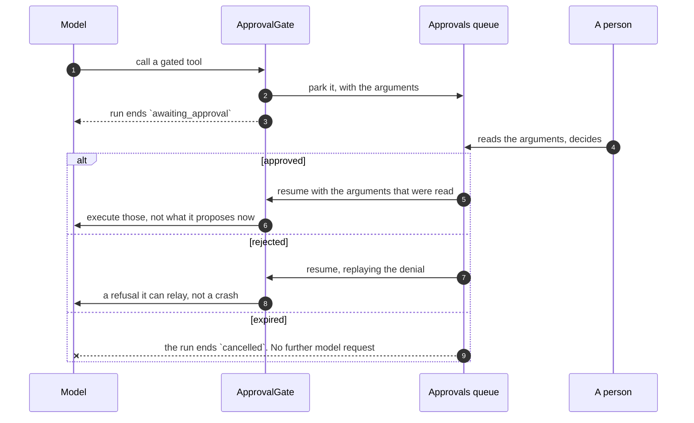

# Governance { #governance }

Budgets, Freigaben, Alerts und der Audit-Trail. Die vier Dinge, die eine
Agent-Plattform zu etwas machen, hinter das Sie eine Kreditkarte legen können.

Sie alle gelten auf jeder Oberfläche gleich, weil jede Oberfläche durch einen
einzigen Runner läuft.

Die jüngste dieser Oberflächen ist ein **Trigger**: ein Agent, der sich selbst
nach einem Zeitplan oder auf ein eingehendes Ereignis hin ausführt — ein
GitHub-Issue, eine eingehende E-Mail (siehe [Konzepte](concepts.md#trigger)).

An nichts von dem, was folgt, ändert er etwas. Er gibt gegen dieselben zwei Caps
aus, parkt am selben Freigabe-Gate — geroutet an seinen Ersteller, an das
Mitglied, als das er läuft, und an die Administratoren — und wird im selben
Audit-Trail festgehalten.

Das Einzige, was „unbeaufsichtigt" hinzufügt, ist das, was mit einer **Ablehnung**
geschieht:

- Ein ausgelöster Run, den das Budget stoppt, endet mit `budget_exceeded` und
  **wartet auf das nächste Auslösen**, statt wiederholt zu werden.
- Ein ausgelöster Run, den sein Ersteller nicht mehr machen darf — er hat die
  Organisation verlassen oder seinen Grant auf den Agent verloren —
  **deaktiviert den Trigger** und schreibt einen Audit-Eintrag, der sagt, warum.
- Ein ausgelöster Run, der am Modell selbst scheitert — ein Ausfall beim
  Provider, ein widerrufener Schlüssel — wird als `failed` festgehalten und dem
  nächsten Auslösen überlassen, statt den Heartbeat dazu zu bringen, dieselbe
  Wand erneut anzulaufen. Das `last_run_id` des Triggers zeigt weiterhin darauf,
  damit seine Historie ehrlich bleibt.

Eine Ablehnung, die ein Heartbeat jede Minute wiederholt, wäre eine Rechnung oder
ein Alert, die niemals aufhören.

!!! warning "Nicht geschluckt wird ein Fehlschlag, der nie zu einem Datensatz wurde"

    Wenn der Run einen Endzustand erreicht hat, der Schreibvorgang, der ihn
    festhält, aber nicht committet wurde — ein Transkript oder ein Schreiben des
    Conversation-State, das eine Exception auslöste, nachdem die Antwort
    vorlag —, **lässt das Auslösen den Flow scheitern**, statt Erfolg zu melden.
    Der halb geschriebene Run wird zurückgerollt, statt als vollständig committet
    zu werden, ohne dass etwas dahintersteht.

Ein Event-Trigger fügt an seinem Rand eine weitere Ablehnung hinzu: ein Webhook,
dessen Signatur sich nicht gegen das eigene Secret des Triggers verifizieren
lässt, ist ein 403, der den Runner überhaupt nie erreicht.

## Budgets { #budgets }

!!! abstract "Zwei Ebenen, und sie sind keine Varianten einer Zahl"

    Das Cap eines Agents, gemessen an der Gesamtsumme der Organisation, wird von
    den Runs seiner Nachbarn aufgebraucht; das der Organisation, gemessen an
    einem einzelnen Agent, ist überhaupt keine Obergrenze. Siehe
    [warum sie sich nicht zusammenlegen lassen](#why-they-cannot-be-collapsed).

| Ebene | Gesetzt in | Misst | Angehoben von |
|---|---|---|---|
| **Agent, monatlich** | dem Spec des Agents | den eigenen Runs dieses Agents | wer den Agent bearbeiten darf |
| **Organisation, monatlich** | den Einstellungen der Organisation | jedem Run *und* jeder Ingestion in der Organisation | wer `budgets:manage` hält |

Eine **neue Organisation startet mit bereits gesetzter Obergrenze für die
Organisation** — dem `DEFAULT_ORG_MONTHLY_BUDGET_USD` des Deployments
([Konfiguration](configuration.md), ab Werk 100 $) —, damit ein frischer Tenant
nicht nur einen entlaufenen Agent von einer überraschenden Rechnung entfernt ist.
Ab diesem Punkt ist es ein gewöhnliches Cap: auf der Zeile der Organisation
bearbeitbar und genau wie ein von Hand gesetztes durchgesetzt. Ein Deployment,
das lieber ohne Cap startet, lässt diese Einstellung leer; so oder so wird das
Cap einer bestehenden Organisation dafür nie geändert.

### Warum sie sich nicht zusammenlegen lassen { #why-they-cannot-be-collapsed }

Das waren sie einmal, mit `min()`, und das Ergebnis war falsch. Das Cap eines
Agents, gemessen an der Gesamtsumme der Organisation, wird von den Runs seiner
Nachbarn aufgebraucht, und genau das macht es zu keinem Cap. Das Cap einer
Organisation, gemessen an den Ausgaben eines einzelnen Agents, würde nie binden.

Also misst jedes Cap seine eigene Größe, und die Abfrage reist mit dem Limit. Ein
Agent mit 5 $ unter einer Obergrenze von 50 $ bindet jetzt, wenn *er* 5 $
ausgegeben hat, und die Ablehnung nennt das Cap, das tatsächlich gebunden hat,
statt es daraus abzuleiten, welche der beiden Zahlen kleiner war.

Ein Agent kann die Obergrenze der Organisation weiterhin nicht lockern: Der
Eintrag der Organisation steht mit seiner eigenen Zahl da, was auch immer der
Spec verlangt, und die Ausgaben eines Agents sind Teil derer der Organisation —
ein Agent mit 100 $ unter einer Organisation mit 10 $ wird also bei 10 $
gestoppt.

Beide Caps sind dort lesbar, wo ihre Ausgaben stehen: das der Organisation auf
ihrer eigenen Zeile (`GET /orgs/{org_id}`) und das jedes Agents als
`budget_monthly_usd` in der Agent-Liste — die Zahl der *veröffentlichten*
Version, denn das ist die, die der Runner durchsetzt, und nicht das, was der
Draft gerade verspricht. Die Headroom-Karte des Dashboards verbindet diese mit
`GET /spend`, sodass ein Cap im Anmarsch zu sehen ist, bevor `budget_exceeded` in
der Run-Historie auftaucht.

### Durchgesetzt wird vor der Anfrage { #enforcement-is-before-the-request }

!!! danger "Vorher, nicht nachher"

    Hinterher zu prüfen heißt, dass die Anfrage, die das Budget gesprengt hat,
    bereits bezahlt war — und eine Schleife kann jedes Mal um einen teuren
    Aufruf überschießen.

!!! important "Ein fehlgeschlagener Run hält trotzdem fest, was er ausgegeben hat"

    Ein Budget, das Fehlschläge ignoriert, ist kein Budget. Die Abrechnung
    geschieht auf jeder Oberfläche in einem `finally`-Block, und der Commit ist
    explizit, statt dem Session-Kontext überlassen zu werden — der bei jeder
    Exception zurückrollt und bei einer Cancellation überhaupt nie erreicht wird.

!!! important "Eine Baseline ist das, was *andere* Runs ausgegeben haben"

    Beide Abfragen lassen die eigene Zeile des fragenden Runs aus. Ein
    fortgesetzter Run behält seine Zeile, und bis dahin hat `finish_run`
    committet, was er ausgegeben hat — während das Ledger mit derselben Zahl neu
    befüllt wird, was auch nötig ist, sonst würde der Abschluss der Fortsetzung
    die Kosten mit dem überschreiben, was allein die Fortsetzung gekostet hat. An
    beiden Stellen gezählt, kam ein bei 10 $ gedeckelter Agent, der 6 $ ausgegeben
    hatte und dann parkte, bei seiner ersten Modellanfrage auf `6 + 6 = 12` und
    wurde mit 4 $ Luft abgelehnt — und teilte seinem Besitzer mit, er habe ein Cap
    erreicht, bei dem er zu 60 % stand. Das Cap der Organisation zählte identisch
    doppelt.

Der Guard ist ein harter Stopp für einen Run, der die Ausgaben *sieht*, und die
eigenen Kosten eines Runs landen erst auf seiner Zeile, wenn er fertig ist.

Die Baseline, die ein Run liest, ist also die Summe der Runs, die bereits fertig
sind, und **gleichzeitige Runs sind füreinander unsichtbar**. Fünfzig Runs, die
gemeinsam gegen eine Organisation starten, der ein Aufruf bis zu ihrem Cap fehlt,
lesen alle dieselbe Baseline unterhalb des Caps, laufen alle weiter und
überschießen um bis zu ihre gemeinsamen Kosten.

Das ist eine Eigenschaft eines Aggregats ohne eine einzelne Zeile zum Sperren —
anders als das Überschießen pro Run und pro Schleife oben, das die Prüfung vor
der Anfrage sehr wohl begrenzt. Deshalb ist das Cap eine Obergrenze auf
**committete** Ausgaben und kein Gate, das gleichzeitige Runs serialisiert.

Ein Deployment, das ein striktes Cap braucht, lässt seine Agents durch eine
einzige Queue laufen statt parallel.

### Ein Run kostet mehr als seine Modellanfragen { #a-run-costs-more-than-its-model-requests }

Eine Wissenssuche bettet die Frage ein, bevor sie danach suchen kann, und dieses
Embedding wird dem Run berechnet, der es angefordert hat. Der Embedding-Dienst
ist prozessweit — er bedient jeden Run und jeden Ingestion-Job zugleich — und
bucht deshalb gegen den Run, der *gerade gemessen wird*, statt ein Budget als
Argument entgegenzunehmen.

Was das Messen zu etwas macht, das eine Oberfläche vergessen kann, und das
Vergessen ist lautlos: keine Exception, keine Warnung, nur ein Run, der weniger
meldet, als er ausgegeben hat, und ein Monat der Organisation, der es nie sieht.
Also gehört der Zähler zum vorbereiteten Run und nicht zur Oberfläche. Einen zu
öffnen ist kein Schritt, von dem eine neue Oberfläche wissen muss, denn es gibt
keinen Weg, einen vorbereiteten Agent ohne ihn auszuführen.

[Context-Management](reference/capabilities.md#context-management) ist das
andere. Seine zusammenfassende Strategie schreibt die Zusammenfassung über einen
Agent, den sie selbst baut, sodass diese Anfrage an keinem Budget-Guard
vorbeikommt; die Capability bucht ihre Kosten gegen denselben Zähler.
*Außerhalb* des Guards zu liegen hat eine Konsequenz, die man kennen sollte: Die
Ausgabe wird festgehalten statt abgelehnt, sodass eine Kompaktierung, die ein Cap
überschreitet, den Run bei der Anfrage danach stoppt.

### Kosten, die sich nicht messen ließen, sagen das { #a-cost-that-could-not-be-measured-says-so }

`genai-prices` kennt nicht jedes Modell. Trifft ein Run auf eines, für das es
keinen Eintrag hat, wird diese Anfrage mit null gebucht und der Run als
`cost_is_partial` markiert — die Summe ist um genau das zu niedrig, was diese
Anfragen gekostet haben, und die ehrliche Lesart davon ist eine **Untergrenze**.

Dieses Flag reist inzwischen den ganzen Weg nach unten. Es steht auf der
Run-Zeile, auf der Message-Zeile, die ein Turn schreibt, und auf der Summe, die
eine Unterhaltung meldet; jede Oberfläche, die Geld zeichnet, setzt ein `≥`
davor statt einer Zahl, die sich als exakt liest. Null auf einer Message, die
geschrieben wurde, bevor es die Spalte gab, bedeutet *nicht erfasst*, was nicht
dieselbe Aussage ist wie „exakt" — ein Client markiert nur, was er weiß.

**Jede Oberfläche hält es jetzt fest, und jeder Turn hält seinen eigenen Anteil
fest.** Eine Message, die von einem Channel, der API oder dem Widget geschrieben
wurde, trug bis vor Kurzem gar keine Kosten, sodass sich ein Slack-Thread nicht
aufsummieren ließ. Die geschriebene Zahl ist die *Differenz* zu dem, was die
früheren Turns dieses Runs bereits beanspruchen, nicht die Zahl der Run-Zeile:
Eine Run-Zeile ist kumulativ, und ein Run, der parkte und fortgesetzt wurde,
schreibt zwei Assistenten-Turns — beide mit der Zeile zu stempeln würde die
geparkte Hälfte doppelt zählen. Die Messages eines Runs summieren sich daher auf
genau das, was der Run als seine Ausgabe angibt.

**Ein Turn, bei dem der Run mittendrin gestoppt wurde, sagt das.** Ein
abgebrochener Run hinterlässt, was der Agent geschrieben hatte, als der Socket
schloss oder `stop` gedrückt wurde, und das liest sich genau wie eine fertige
Antwort — ein Leser nimmt eine abgeschnittene also für alles, was der Agent zu
sagen hatte, und das ausgegebene Geld sieht aus, als hätte es das gekauft. Das
Transkript trägt den Status des Runs pro Turn, und der Chat markiert ihn.

### Wie voll das Context-Window ist { #how-full-the-context-window-is }

Die dritte Obergrenze, und die, die niemand kommen sieht. Ein Budget lehnt mit
einer Nachricht ab, mit der jemand etwas anfangen kann. Ein Workspace lehnt einen
Schreibvorgang ab. Ein **Context-Window** wird vom Provider abgelehnt, mitten in
der Antwort, und der Run scheitert einfach.

Jeder Agent trägt deshalb eine Anzeige — nicht nur einer mit gebundenem
[Context-Management](reference/capabilities.md#context-management), denn die
Warnung zählt am meisten für den Agent, der *nicht* kompaktieren wird. Sie
meldet, wie viele Token die letzte Anfrage eines Turns getragen hat, *nach* jeder
Kompaktierung: Der Wert fällt, wenn die Kompaktierung wirkt, weil er misst, was
hinausging, und nicht, was die Unterhaltung hält.

Die Zahl ist das `input_tokens` des Providers selbst, keine Schätzung der
Historie. Eine Zeichenzählung kann die Tool-Definitionen nicht sehen, und die
werden bei jeder Anfrage berechnet — Tausende Token bei einem Agent mit Wissen,
einem Sandbox und Delegation, also ein Drittel der echten Zahl, das genau in dem
Moment fehlt, in dem die Zahl zählt.

**Die Zählung wird auf dem Turn gespeichert; der Anteil nicht.**

Wie viel Historie es gibt, überlebt einen Modellwechsel. Welchem Bruchteil eines
Windows das entspricht, nicht — und der Chat lässt jemanden zwischen den Turns
das Modell wechseln.

Eine Historie von 500.000 Token ist die Hälfte eines Modells mit 1M Context und
**390 %** eines Modells mit 128K, und das zweite ist eine Anfrage, die der
Provider rundheraus ablehnt. Ein mit dem Messwert eingefrorener Anteil würde
weiterhin „50 %" lesen.

Also wird der Nenner dort aufgelöst, wo die Auswahl bekannt ist, aus dem eigenen
erfassten Window des Modellprofils und der Preis-Registry dahinter. Wo keines von
beiden etwas sagen kann, wird **überhaupt kein Anteil gezeichnet** — ein
Prozentwert gegen ein angenommenes Window ist eine Schätzung, die als Messung
auftritt.

Dieser Wechsel ist auch das, wofür die Kompaktierung da ist. Ihr Auslöser ist ein
**pro Anfrage aufgelöster Bruchteil** gegen das Modell, an das die Anfrage geht,
sodass eine Historie, die im alten Window bequem Platz hatte, unter dem neuen
gleich beim nächsten Turn kompaktiert wird — bevor die Anfrage hinausgeht, nicht
nachdem der Provider sie abgelehnt hat. Ein Agent ohne gebundene Kompaktierung
hat stattdessen die Anzeige, und sonst nichts.

**Der Auslöser misst, was der Provider gemessen hat.** Er verankert sich an der
jüngsten Antwort, die Provider-Usage trägt — die `input_tokens` jener Anfrage
zählten die Instruktionen, jedes Tool-Schema und jede vorherige Message — und
schätzt nur, was danach kam. Deshalb trägt eine wiederholte Unterhaltung, was
jede Antwort gekostet hat: Ohne Anker zählt der Auslöser Zeichen, und ein echter
Agent las hier 9 Token, wo der Provider 3.859 berechnet hatte. Die Anzeige sagte
77 %; der Auslöser sah nichts zu tun.

**Eine Zusammenfassung wird behalten.** Die Kompaktierung schreibt die Messages
eines Runs um; der Faden zwischen den Turns wird aus dem Transkript neu
aufgebaut, sodass eine Zusammenfassung früher an der Turn-Grenze weggeworfen
wurde und der nächste Turn eine weitere über eine um einen Turn längere Historie
kaufte — zwei aufeinanderfolgende Turns einer echten Unterhaltung bezahlten hier
je eine Zusammenfassung derselben fünf Messages, und die zweite kündigte an, neun
zusammenzufassen. Also wird die kompaktierte Historie in die Unterhaltung
geschrieben, samt ihrer Reichweite, und der nächste Turn startet von ihr und
spielt nur nach, was seither gesagt wurde. Wer den Faden wieder öffnet, findet
dasselbe wie das Modell.

Behalten wird nur eine Zusammenfassung. Die ältesten Messages fallen zu lassen
und Tool-Ergebnisse zu leeren kostet nichts, um es zu wiederholen, und es
aufzuschreiben würde einen Verlust dauerhaft machen, der derzeit bei jedem Turn
neu gegen das Window abgewogen wird.

Eine Einstellung kann nicht funktionieren und sagt das, statt zu laufen. Wenn
allein die Instruktionen und Tool-Schemata über dem Auslöser liegen, kann keine
Zusammenfassung darunter kommen — sie stehen nicht in der Historie, die
zusammenzufassen wäre. Jede Anfrage würde dann eine Zusammenfassung kaufen, die
nichts ändert. Die Kompaktierung wird übersprungen, der Chat sagt warum, und die
Behebung ist Sache der Autorin: ein größeres Window oder ein höherer Bruchteil.

Diese Ablehnung ruht auf einer Zahl, die eine *Antwort* erzeugt, sodass ein Turn
seine eigene nicht messen kann, bevor er entscheiden muss — und ein Chat-Turn ist
meist eine Anfrage. Die Unterhaltung trägt den letzten Messwert, und ein Run
startet von ihm. Der erste Turn eines Fadens hat daher nichts, woran er sich
halten kann, und kompaktiert wie konfiguriert; ab dem zweiten steht die Ablehnung
zur Verfügung. Abgelehnt werden nur die Strategien, die etwas kaufen: Die
ältesten Messages fallen zu lassen und Tool-Ergebnisse zu leeren ruft kein Modell
auf, also laufen sie unabhängig vom Window.

### Delegation gibt das Budget des Parents aus { #delegation-spends-the-parents-budget }

Ein Run kann die ganze Unterhaltung eines anderen Agents enthalten — siehe
[Delegate vs. Inline-Spezialist](concepts.md#delegate-vs-inline-specialist). Ein
Run hat **ein Spend-Ledger**, und jeder Delegate schreibt hinein. Das ist es, was
das Cap des Parents die Ausgaben einer Delegation vor seiner nächsten
Modellanfrage sehen lässt, genau in dem Moment, in dem Delegation vervielfacht,
was ein Turn kosten kann. Jeder Eintrag ist mit der Delegation gestempelt, die
ihn gebucht hat, und so beantwortet ein einziges Ledger trotzdem „was hat
*dieser* Delegate gekostet" — siehe unten.

Daraus folgt, dass **die Caps, die innerhalb einer Delegation binden, die des
Parents sind**. Das eigene `budget.monthly_usd` eines Delegates wird mitten im
Run des Parents nicht durchgesetzt: Zwei Guards, die ein Ledger messen, würden
jede Anfrage doppelt zählen, und die Obergrenze, auf die es ankommt, ist die des
Runs, den jemand gestartet hat. Das eigene Cap des Delegates gilt weiterhin für
Runs *des Delegates selbst*.

Jeder Delegate bepreist allerdings seine eigenen Anfragen, denn ein Guard
bepreist, was er festhält: Ein Delegate auf Anthropic, gemessen durch einen für
OpenAI gebauten Guard, würde gegen den falschen Katalog bepreist — lautlos, und
meist als unbepreist.

Drei weitere Obergrenzen gibt es, weil ein Budget ein schlechtes Mittel ist, um
ein Fan-out zu stoppen — es merkt es erst, wenn das Geld weg ist. `max_depth`
begrenzt die Verschachtelung, `max_fanout` begrenzt, wie viele Delegationen
zugleich laufen, und das eigene `max_steps` jedes Delegates begrenzt seine
Schleife. Siehe die
[`subagents`-Capability](reference/capabilities.md#delegation).

Zwei dieser drei gehören dem Delegate selbst, und das ist die Linie, die das
Budget nicht überschreitet: `max_steps` wird vom Spec des Delegates gelesen, und
sein `max_depth` deckelt, wie tief *es* gehen darf, wie viel Raum sein Aufrufer
auch übrig hatte. Ein Cap auf Ausgaben ist ein Cap auf den Run, den jemand
gestartet hat; ein Cap auf Verschachtelung ist eine Entscheidung, die die Autorin
des Delegates getroffen hat und seine Prüfer lesen, also kann ein Aufrufer sie
nicht aufweiten.

### Wie ein delegierter Run festgehalten wird { #what-a-delegated-run-is-recorded-as }

Eine Delegation an einen **veröffentlichten** Agent bekommt eine eigene
`agent_runs`-Zeile, die `parent_run_id` und die Task-Id der Delegation trägt. Ein
**Inline-Spezialist** bekommt keine: Er hat keinen Agent, dem eine zuzuordnen
wäre, also sind seine Kosten die *des Runs*, und der Tool-Aufruf im Transkript
ist der Datensatz.

Welchem Run allerdings, ist die Frage, die
[#228](https://github.com/vstorm-co/agenticos/issues/228) beantwortet hat.

- Ein Spezialist direkt unter dem eigenen Agent des Runs wird auf die **oberste
  Zeile** gebucht, die ohnehin das ganze Ledger ist.
- Ein Spezialist unter einem **veröffentlichten Delegate** wird auf die Zeile
  *dieses Delegates* gebucht, nicht auf die oberste — der Monat des Delegates
  enthält also, was sein Spezialist ausgegeben hat, und das ist der einzige Ort,
  an dem es ehrlich landen könnte.

Jeder Ledger-Eintrag trägt daher zwei Zuordnungen: die Delegation, die ihn
gemacht hat, für das Panel, und die nächstgelegene Agent-Zeile, auf die er
gebucht wird, für den Monat.

Die beiden sind für jede Anfrage gleich, die ein veröffentlichter Delegate auf
eigene Rechnung stellt, und weichen nur unter einem Inline-Spezialisten
voneinander ab — dessen Panel seinen eigenen Anteil behält, während seine
Ausgaben die Zeile seines Vorfahren erreichen.

!!! important "Die Zeile des Parents ist die Autorität; die Zeile eines Kindes ist ihr Anteil daran"

    Ein Delegate gibt in das gemeinsame Ledger aus, und **jeder Eintrag in diesem
    Ledger trägt die Delegation, die ihn gemacht hat**. Die Kosten einer
    Delegation sind die Summe ihrer eigenen Einträge — der Anfragen, die ihr
    eigener Agent gestellt hat, einmal bepreist, durch dieselbe Abfrage, die auch
    die Summe des Runs benutzt. Sie sind in beiden Modi und in jeder Tiefe exakt,
    und sie hängen nicht davon ab, wann die Delegation zufällig abgerechnet
    wurde.

    Genau davon hingen sie einmal ab, und es waren zwei Defekte. Die Zahl war der
    *Zuwachs* der gemeinsamen Summe über die Delegation hinweg, sodass eine
    Delegation im Hintergrund — abgerechnet, wenn sie das nächste Mal abgefragt
    wird, was nach der Antwort des Parents sein kann — alles aufsog, was der
    Parent zwischenzeitlich ausgegeben hatte: Ein Delegate, der 0,01 $ ausgegeben
    hatte, wurde mit 0,51 $ festgehalten, wenn der Parent danach 0,50 $ ausgab.
    Und ein Delegate, der weiter delegiert, hatte die Ausgaben seiner eigenen
    Delegates in seinem Fenster, die deren Zeilen erneut festhalten, sodass seine
    Monatssumme seine Enkel mitzählte.

    Das mit einem Ledger *pro Agent* aufzuteilen bleibt das Design, das zu
    vermeiden ist — genau das hindert das Cap des Parents daran, überhaupt zu
    binden. Ein Ledger, zugeordnet, behält beide Eigenschaften: Das Cap des
    Parents sieht jede Anfrage vor der nächsten, und jede delegierte Zeile sagt,
    was dieser eine Agent ausgegeben hat, seine eigenen Inline-Spezialisten
    eingeschlossen und seine veröffentlichten Delegates ausgeschlossen.

    Die Zeile des Parents bleibt die Autorität für den Run. Ihr `cost_usd` ist das
    ganze Ledger, Delegates eingeschlossen, und das ist es, was der Organisation
    berechnet wird; die Child-Zeilen teilen dasselbe Geld nach Agent auf und
    addieren nie etwas hinzu. `cost_is_partial` gilt ebenfalls je Zeile: Ein
    Parent auf einem Modell, das `genai-prices` nicht kennt, macht die Summe des
    Parents zu einer Untergrenze und sagt nichts über einen Delegate, der auf
    einem bepreisten Modell lief.

    Das `started_at` und `ended_at` einer delegierten Zeile sind die **eigene**
    Spanne der Delegation, abgelesen am Task-Handle, das die Bibliothek stempelt,
    wenn der Delegate startet und wenn er endet — nicht der Moment, in dem die
    Zeile abgerechnet wurde. Von der Abrechnung gelesen, erschien eine Delegation
    im Hintergrund als Run ohne Dauer zur falschen Zeit, einsortiert nach Arbeit,
    die vor ihr fertig war; zwei, die sich tatsächlich überlappten, wurden im
    selben Augenblick festgehalten, ohne dass etwas das sagte. Ein terminales
    Handle mit einem Ende, aber ohne Start — ein Delegate, der abgebrochen ist
    oder scheiterte, bevor er zu laufen begann — hält eine Spanne der Länge null
    an diesem Ende fest, nie ein Null; und wo die Bibliothek ablehnt, bevor
    überhaupt ein Handle existiert — eine unbekannte `chat_trace_id` —, wird keine
    delegierte Zeile geschrieben. Eine Delegation, die auf einer Freigabe geparkt
    hat, spannt sich über jeden Turn, in dem sie lief: Ihr frühester Start wird
    über das Parken hinweg mitgeführt, so wie ihre Kosten (siehe unten), sodass
    die Zeile beginnt, wenn der Delegate zuerst begann, und endet, wenn er
    endgültig endete — nicht beim Fortsetzen, das sie abgerechnet hat. Die beiden
    werden nicht so summiert wie die Kosten; die ehrliche Antwort ist der Start
    des ersten Segments und das Ende des letzten.

**Eine Delegation, die auf einer Freigabe geparkt hat, ist mehr als ein Anteil.**
Ihre Turns liefen in verschiedenen Prozessen gegen verschiedene Ledger, und das
Ledger eines fortgesetzten Turns ist ein frisches Objekt, das nichts von vor dem
Parken hält — was die Child-Zeile festhält, ist also jedes Segment zusammen: Der
geparkte Zustand behält, was die Delegation beim Stoppen gekostet hatte, und der
Turn, der sie beendet, addiert seinen eigenen Anteil. Eine Zeile wird
geschrieben, einmal, von dem Turn, in dem die Delegation endet — ein Delegate,
der zweimal parkte, hinterlässt drei Segmente und eine Zeile.

`cost_is_partial` wird auf dieselbe Weise mitgeführt, und zwar aus einem Grund,
den das Geld nicht teilt: Es gilt jetzt je Zeile statt je Run, sodass ein
Delegate, der *vor* der Freigabe eine unbepreiste Anfrage stellte und auf einem
bepreisten Modell fortsetzte, sonst auf seiner Zeile exakte Kosten behaupten
würde. Das Flag ist wahr, wenn es für irgendein Segment wahr war.

Das ist es wert, gesagt zu werden, weil der Fehlschlag, den es ersetzt, unsichtbar
war. Die Zeile hielt früher nur das fest, was der Delegate *nach* dem letzten
Fortsetzen ausgegeben hatte, und das ist in der gewöhnlichen Form — erst die
Arbeit tun, dann um Erlaubnis bitten, auf das Ergebnis hin zu handeln — die kleine
Hälfte. Nichts ging in der Summe daneben, denn das Geld lag die ganze Zeit in der
Zeile des Parents; falsch war jede Zahl, die „was hat dieser Delegate gekostet"
beantwortet.

Die Child-Zeile ist das, was zwei verschiedene Fragen beantwortbar macht, und sie
wollen entgegengesetzte Arithmetik:

| Die Frage | Child-Zeilen |
|---|---|
| **Was schuldet die Organisation?** | **ausgeschlossen** - die Zeile des Parents enthält diese Token bereits, beides zu zählen stellt der Organisation also eine Anfrage doppelt in Rechnung |
| **Was hat *dieser Agent* diesen Monat gekostet?** | **eingeschlossen** - die Zeilen eines Delegates sind der einzige Ort, an dem seine eigenen Ausgaben festgehalten sind, und jede hält die eigenen Anfragen dieses Agents und die seiner Inline-Spezialisten ([#228](https://github.com/vstorm-co/agenticos/issues/228)), aber nicht die seiner veröffentlichten Delegates, die eigene Zeilen haben |

Die zweite ist das, was „der Researcher hat diesen Monat 40 $ gekostet"
beantwortbar macht, und sie ist es, worauf ein Nutzungsbericht je Agent oder ein
Budget-Alert auf diesen Agent auslöst. Die Monatszahl der Organisation trägt
zusätzlich die Ausgaben für Ingestion, die Zahl je Agent nicht: Eine gemeinsame
Wissensdatenbank zu indexieren sind niemandes Agent-Ausgaben.

Eine fehlgeschlagene Child-Zeile wird ebenfalls an die Regel des Parents
gehalten, was `error` sagen darf. Was unter einem Delegate auslöst, ist ein
Modell-Client, dessen Nachricht die URL der fehlschlagenden Anfrage tragen kann —
samt Schlüssel, auf einem eigenen Endpunkt —, also speichern die Zeile und der
Abschlussframe der Delegation denselben kontrollierten Satz wie die Zeile des
Parents, und der eigene Text des Providers geht ins Server-Log. Ein Delegate, den
sein Usage-Limit oder eine Budget-Obergrenze gestoppt hat, behält die Nachricht
des Limits unversehrt: Das ist eine Obergrenze, die ihre Arbeit tut, kein
Fehlschlag, der zu diagnostizieren wäre.

Die Regel reicht auch bis ins Transkript des *Parents*. Wenn ein Agent im
Hintergrund delegiert, fragt er `check_task` und `wait_tasks` nach dem Ausgang
ab, und was diese antworten, wird zu einer Tool-Aufruf-Zeile in der Unterhaltung
— unversehrt gespeichert, denn eine Tool-Rückgabe ist die eigene Antwort des
Tools und nicht etwas, das diese Plattform verfasst hat. Also nennen sie die
Klasse der Exception, statt die Nachricht des Providers zu wiederholen, und das
ist `subagents-pydantic-ai` 0.2.20 und der Grund, warum die Untergrenze dort
liegt.

**Die gefensterte Zahl des Dashboards trägt es ebenfalls.** `GET /stats/usage`
antwortet mit einem `cost`-Block für den Zeitraum, den der Filter gewählt hat,
und dieser Block sind Runs *plus* Ingestion — dieselbe Arithmetik, mit der das
monatliche Cap gemessen wird — mit `model_usd` und `ingestion_usd` daneben, damit
ein Leser sehen kann, wohin das Geld ging, ohne zu subtrahieren. Bis 0.0.152
meldete er allein die Modellhälfte, was zwei verschiedene Definitionen von Kosten
auf eine Karte brachte: Die Schlagzahl bewegte sich mit dem Zeitraumfilter und
zählte Runs, während die Zeile „seit Monatsbeginn" darunter die ganze Rechnung
zählte, und nichts sagte, dass sie verschiedene Fragen beantworteten. Auf einem
Deployment, das Dokumente indexiert, widersprachen sie sich schlicht.

Bei `scope=own` ist die Ingestion-Hälfte null statt ein Anteil: Ein Dokument wird
von einem Worker indexiert und `ingestion_spend` hält keinen Nutzer fest, einer
Person das Fenster für eine Sammlung zu berechnen, die jemand anderes
synchronisiert hat, hieße also, ihre Ausgaben zu erfinden.

**Jede Abfrage muss sagen, welche der beiden sie beantwortet**, und die erste
Spalte ist die Voreinstellung. Die Zahl seit Monatsbeginn und die Aufschlüsselung
je Agent dahinter schließen Child-Zeilen aus, sodass sie sich auf die Summe
darüber addieren — und die Nutzungs-E-Mail der Organisation meldet dieselbe Summe
statt eine Summe aus einer von ihnen. Nur eine Frage, die *über einen Agent*
gestellt wird, schließt sie ein. Drei dieser fünf Abfragen gingen ohne diese
Unterscheidung live und meldeten je 1,40 $ für 1,00 $ Arbeit; kommt eine neue
hinzu, ist die Voreinstellung die sichere.

#### Die zwei Anbieterfragen brauchen eine dritte Antwort { #the-two-vendor-questions-need-a-third-answer }

**Nach Provider** und **nach Schlüssel** können keine der beiden Spalten
benutzen, und das falsch zu machen ist auf dem Bildschirm unsichtbar.
Child-Zeilen auszuschließen summiert korrekt und ordnet das Geld des Delegates
dann dem Anbieter des *Parents* zu, weil das der Provider auf der summierten
Zeile ist: Ein Orchestrator auf OpenAI, der 0,40 $ Arbeit an einen Agent auf
Anthropic delegierte, meldete `openai $1.00` und überhaupt keine Anthropic-Zeile.
Sie einzuschließen meldete `openai $1.00` + `anthropic $0.40` — mehr als die
Rechnung.

Diese beiden summieren also die **eigenen** Ausgaben jedes Runs: seine Kosten
abzüglich der Kosten seiner direkten Delegationen. `openai $0.60` +
`anthropic $0.40`, was zugleich die richtige Zuordnung und die richtige Summe
ist. Es verschachtelt sich — einem Delegate, der weiter delegiert hat, werden
seine Enkel dadurch herausgerechnet, einmal — und über jede Zeile summiert kommt
es immer noch auf die Rechnung, weil die Kosten jedes Kindes von seiner eigenen
Zeile addiert und von der seines Parents entfernt werden. Ein Schlüssel
funktioniert genauso, und er zählt mehr: Ein Schlüssel ist das, was jemand
rotiert, wenn eine Rechnung falsch aussieht.

### Was die Run-Historie zeigt { #what-run-history-shows }

**`GET /runs` listet nur Runs der obersten Ebene, und sein `total` zählt diese.**
Dieselbe Voreinstellung wie die Monatssumme der Organisation, und aus demselben
Grund: Ineinander verschränkt lassen sich die beiden Arten von Zeile nicht in
einer Kostenspalte lesen. Ein Fan-out aus drei Delegationen ist ein Run, der auf
der Seite 1,00 $ kostet und auf der Rechnung 1,00 $; zusammen gelistet waren es
vier Zeilen mit 1,00 $ + 0,40 $ + 0,40 $ + 0,40 $ neben einer Zahl seit
Monatsbeginn von 1,00 $, und beide Hälften hatten über verschiedene Fragen recht.

Die Liste nimmt dieselbe zweiseitige Arithmetik wie die Summen oben, aus
demselben Grund — sodass eine Oberfläche, die auf einen Agent eingeengt ist,
zeigt, was *dieser Agent* getan hat, die Arbeit seiner Delegates eingeschlossen:

| Frage | Antwort |
|---|---|
| `GET /runs` | Runs, die jemand gestartet hat. `parent_run_id IS NULL` |
| `GET /runs?agent_id=<id>&include_delegations=true` | Die eigene Historie eines Agents. Das fragen das Panel Recent runs im Builder und `?agent=` in Activity, denn die Zeilen eines Delegates sind der einzige Datensatz darüber, was er selbst getan hat |
| `GET /runs?parent_run_id=<id>` | Was dieser Run delegiert hat — die Abfrage, für die `agent_runs_parent_run_id_idx` existiert. Hat Vorrang vor `include_delegations` |
| `GET /runs/<id>` | Ein Run, delegiert oder nicht. Wo ein Link aus einem Transkript landet |
| `GET /runs/<id>/transcript` | Die Turns dieses Runs, der Reihe nach - was eine Run-Detailansicht als Schritte rendert. Autorisiert, nicht besessen (unten) |

**Einen Run zu lesen ist autorisiert, nicht besessen.**

Ein Kollege, der `runs:view` hält, liest einen Run, den jemand anderes gestartet
hat. Die Autorität über einen Run liegt bei der Organisation, denn ein Run ist
das, was der Organisation berechnet wird und wofür sie zur Verantwortung gezogen
wird — und nicht Privateigentum dessen, der auf Los gedrückt hat.

Die Entscheidung liegt also im Service statt in einem Route-Gate: Er löst den Run
zuerst gegen die Organisation des Aufrufers auf und prüft dann `runs:view`.

Drei Konsequenzen:

- Ein Run in **einem anderen Tenant liest sich als abwesend** — derselbe 404, mit
  dem eine Id antwortet, die es nie gab, bis in den Body hinein —, sodass sich
  über die Antwort nicht herausfinden lässt, dass ein Run existiert.
- Ein Run, der **ohne Unterhaltung** lief (ein API-Aufruf, der keine
  `conversation_id` übergab), hat kein Transkript zu lesen und sagt das mit einer
  `conversation_id` von null statt mit einer leeren Liste, die sich als „er hat
  nichts getan" läse.
- Nichts davon weitet `GET /conversations/{id}/messages`, was **auf den Besitzer
  beschränkt** bleibt. Dass das Transkript eines Runs für einen Kollegen lesbar
  ist, darf den privaten Faden, in dem es steckt, nicht ebenfalls lesbar machen.

**Jeder Turn, den das Transkript ausliefert, trägt die Bewertungen, die Menschen
dazu hinterlassen haben** — den eigenen Daumen des lesenden Aufrufers, die Likes
und Dislikes der Organisation und den Kommentar der jüngsten negativen Bewertung.

Eine gewöhnliche Message-Zeile hält nichts davon, also werden sie in einem Zug
aus `message_ratings` gelesen und an die Turns geheftet. Ein Turn, den niemand
bewertet hat, trägt sie leer und liest sich genau wie eine gewöhnliche Message.

Das ist es, was die Run-Detailansicht die negativ bewerteten Antworten und die
dazu hinterlassenen Worte zeigen lässt — die Unterhaltungen hinter der
Qualitätszahl des Dashboards (#209) —, gelesen dort, wo der Run gelesen wird,
statt nur im Bewertungsexport für App-Admins.

Gezeigt wird der Kommentar einer **negativen** Bewertung, nie einer positiven,
und der jüngste, wenn ein Turn mehr als einen Einwand auf sich zog.

### Was die Aggregate des Dashboards zeigen { #what-the-dashboards-aggregates-show }

`GET /stats/usage` nimmt dieselben zwei Seiten und dieselbe Voreinstellung. Die
zusammengesetzte Antwort ist die Frage der Organisation, also zählt jeder Block
darin nur Zeilen der obersten Ebene: die Kosten des Zeitraums und ihre
Aufteilung nach Provider (die doppelte Rechnung oben), aber auch die Run-Summe,
die Tagesreihe, die Aufteilung nach Ausgängen, die Oberflächen, die
Latenz-Perzentile, die Zahl der aktiven Personen und die Tabelle je Person. Über
die Kosten hinaus *kopiert* eine delegierte Zeile `user_id` und `surface` ihres
Parents, sie zu zählen würde also zusätzlich eine zweite Person und eine zweite
Ankunft auf einem Channel erfinden, den jemand einmal benutzt hat.

Zwei Aggregate nehmen die andere Seite, und beide werden über einen Agent
gefragt:

| Frage | Child-Zeilen |
|---|---|
| `by_agent` — die Adoption-Karte | **eingeschlossen.** Ausgeschlossen hat ein Agent, der vierhundertmal am Tag als jemandes Delegate läuft, keine Zeile, und die Karte bezeichnet jeden veröffentlichten Agent ohne Zeile als vergessen und bietet an, ihn zu archivieren. Ihre Balken können daher die Run-Summe daneben übersteigen; nichts summiert sie |
| `?group_by=version` — die Karte zum Versionsvergleich | **eingeschlossen.** Ein Spezialist, der nur je als Delegate ausgeführt wird, hätte sonst nichts, was sich über seine Versionen vergleichen ließe |

Die Invariante, die so oder so überlebt: Die Segmente des Ausgangs-Donuts
summieren sich weiterhin auf `total_runs`, und sein Segment `awaiting_approval`
zählt weiterhin dieselben geparkten Runs wie die Freigabe-Karte, denn diese drei
kommen von derselben Seite des Schalters.

Die eine Abfrage ganz ohne Delegationsfilter ist die Zahl der Runs des
Aufrufers, die auf einer Entscheidung geparkt sind. Ein geparktes Kind ist ein
steckengebliebener Parent, und diese Karte beantwortet „warum wird mein Agent
nicht fertig"; heute ändert das nichts, denn eine Delegation wird bereits fertig
in die Datenbank geschrieben und parkt daher nie.

Die letzten beiden sind `?run=<id>` auf der Activity-Seite: ein Run, die
Delegationen darunter jeweils mit der Task-Id abgezeichnet, die ihre
`subagent_*`-Frames trugen, und ein Link hinauf zu dem Run, dem eine Delegation
berechnet wurde. Ein Delegationspanel in einem Chat verlinkt mit der `run_id`
dorthin, die sein terminaler Frame trägt — deshalb trägt der Frame eine.
Delegierte Zeilen in der Tabelle der obersten Ebene zu verschachteln wird hier
bewusst *nicht* getan; ein Tabellen-Primitiv für das ganze Produkt ist
[separat vorgeschlagen](https://github.com/vstorm-co/agenticos/issues/139), und
die Verschachtelung gehört dorthin und nicht in eine maßgeschneiderte
Run-Tabelle.

### Was der Kostenbildschirm zeigt { #what-the-cost-screen-shows }

`GET /spend` nimmt sein Fenster auf zwei Wegen, weil die Seite nach beiden Arten
fragt: `days` für die Voreinstellungen *letzte N Tage* und `from`/`to` für
*diesen Monat*, *letzten Monat* und einen Kalenderbereich. `from` gewinnt, wenn
beide ankommen — ein expliziter Bereich ist eine speziellere Anfrage als eine
Voreinstellung, die niemand geändert hat —, und `period_days` kommt in diesem
Fall als null zurück, statt eine Zahl zu wiederholen, der der Bereich
widerspricht.

**Jedes Panel auf dem Bildschirm liest dasselbe Fenster.** Die Zeilen je Agent,
By provider und By key nehmen alle das aufgelöste `since`/`until` statt einer
eigenen Tageszahl, sodass zwei Zahlen nebeneinander nicht verschiedene Runs
beschreiben können. Das ist derselbe Defekt, den #198 ein Panel weiter oben
benennt.

**Seit Monatsbeginn ignoriert das Fenster vollständig**, und ebenso jedes daran
gemessene Cap je Agent. Eine monatliche Obergrenze, verglichen mit rollenden
sieben Tagen, liest sich an dem Tag, an dem das Cap tatsächlich erreicht wurde,
als zu 20 % ausgeschöpft.

Jede Zeile je Agent trägt **zwei Kostenzahlen unter zwei verschiedenen Namen**,
und das ist die Regel dieser Seite durchgehend:

| | |
|---|---|
| `cost_usd` | Sein Anteil am Fenster, **nur Runs der obersten Ebene**, sodass sich die Spalte auf die Summe darüber addiert |
| `month_to_date_usd` | Sein **eigener** Kalendermonat, delegierte Zeilen **eingeschlossen** — die Ausgaben, auf die sein `monthly_cap_usd` ein Cap ist. Er addiert sich nicht auf den Monat der Organisation und wird auch nicht so gezeichnet |

`partial_run_count` sagt, wie viel davon überhaupt eine Tatsache ist: wie viele
**Runs der obersten Ebene** im Fenster sich nicht vollständig bepreisen ließen,
sodass die Kosten um genau so viele eine Untergrenze sind. *„3 von 40 Runs ließen
sich nicht bepreisen"* ist etwas, womit ein Leser etwas anfangen kann; eine Zahl
mit einem Pluszeichen daran nicht.

Ein Run zählt, wenn ein Modell in seinem Baum keinen Preis hatte, **die seiner
Delegates eingeschlossen** — der Baum teilt sich ein Spend-Ledger, ein
unbepreister Delegate macht also auch die Zeile des Parents zu einer Untergrenze.
So herrscht eine Zahl über alle drei Aufschlüsselungen: By provider und By key
summieren die eigenen Ausgaben jeder Zeile, delegierte Zeilen eingeschlossen, und
eine Untergrenze in einer von beiden markiert eine Zahl, die die verursachende
Zeile nie angesehen hat. Sie **misst** By agent,
das dieselben Zeilen der obersten Ebene zählt, und **markiert** die anderen
beiden nur — sie zählt Bäume, sodass ein Parent mit drei unbepreisten Delegates
als `1` erscheint, während drei Zahlen darunter eine Untergrenze sind.

Ein Baum, der **über den Anfang des Fensters hinausragt** — die Zeile des
Delegates darin, die seines Parents davor —, wird über den Delegate gezählt: Die
Parent-Zeile, die sonst die Markierung trüge, liegt außerhalb jedes Aggregats
dieser Seite, während die eigenen Ausgaben des Delegates in beiden Aufteilungen
liegen. Sie landet bei dem Agent, als der der Delegate lief, einmal je
hinausragendem Baum, wie viele Delegationen auch die Kante überquerten, und nur
dann, wenn die eigenen Anfragen des Delegates unbepreist blieben — eine bepreiste
Delegation unter einem unbepreisten Parent außerhalb des Fensters wirft keinen
Vorbehalt auf, denn das Geld im Fenster selbst ist exakt
([#620](https://github.com/vstorm-co/agenticos/issues/620)).

Eine Zeile ist **eine je Agent**, mit `agent_name` darauf. Früher war sie eine je
Agent *und Modell* und trug nur `model_label` — der Tab listete also Modellnamen,
wo ein Leser einen Agent erwartet, und teilte einen Agent auf zwei Zeilen auf,
weil er auf zwei Modellen geantwortet hatte. Die Form je Modell überlebt dort, wo
sie die gestellte Frage ist: Die Nutzungs-E-Mail gruppiert weiterhin so.

**Wer es ausgegeben hat, ist eine vierte Aufschlüsselung**, unterhalb von By
provider, By key und By agent — diejenige, die mit Personen antwortet statt mit
Anbietern oder Agents.

Sie liest dieselben `group_by=user`-Zeilen wie die Adoption-Tabelle des
Dashboards — nur Runs der obersten Ebene, die geschäftigsten zuerst —, sodass die
Kosten eines Delegates einmal landen, innerhalb des Runs, der ihn gestartet hat.
Und sie deckt das Fenster ab, das der Rest des Tabs zeigt, statt einer eigenen
rollenden Voreinstellung.

Die Personen der Organisation zu benennen ist dieselbe Entscheidung, die auch die
Dashboard-Karte trifft, also nimmt sie dasselbe Gate: `runs:view`, gehalten von
Builder und Operator ebenso wie von den beiden Verwaltern, und sie sagt das in
ihrem eigenen Text.

Ein Aufrufer ohne `runs:view` sieht sie nicht. Die Karte ist abwesend und ihre
Frage wird nie gestellt, statt dass eine Anfrage abgelehnt zurückkommt.

### Die Freigabe-Queue einengen { #narrowing-the-approvals-queue }

`GET /approvals` liefert zwei Sichten auf dieselben Zeilen. Voreingestellt nur
die ausstehenden, das ist die Queue, auf der jemand handelt;
`?status=approved&status=rejected` ist der Datensatz dessen, was entschieden
wurde, und er trägt den Namen und die Notiz der entscheidenden Person, denn eine
nackte UUID ist keine Spur der Verantwortlichkeit. Auf einer entschiedenen Zeile
gibt es bewusst keine Bedienelemente.

| Parameter | |
|---|---|
| `status` | Wiederholbar. Abwesend heißt ausstehend — die Queue |
| `triggered_by_user_id` | Wessen Runs den Aufruf geparkt haben. Abgelesen an `agent_runs`: Eine Freigabe gehört zu einem Run und ein Run zu einer Person |
| `created_from`, `created_to` | Wann der Aufruf geparkt wurde, an beiden Enden einschließlich |
| `oldest_first` | Voreingestellt wahr, und die Voreinstellung ist tragend — siehe oben: Nichts lässt einen Aufruf altern, also würde „neueste zuerst" die Zeile begraben, die am dringendsten gesehen werden muss |

Jede Zeile nennt drei Dinge, die in anderen Tabellen liegen — den Agent, die
Person, deren Run den Aufruf geparkt hat, und die Person, die entschieden hat.
Der Agent und der Run sind Inner Joins, weil beide Fremdschlüssel kaskadieren,
sodass eine Freigabe keinen von beiden überleben kann; die zwei Personen sind
Outer Joins, denn eine Entscheidung muss die Löschung des Kontos ihrer
entscheidenden Person überleben, und der Besucher eines Widgets ist von vornherein
anonym.

### Die Run-Historie einengen { #narrowing-run-history }

| Parameter | |
|---|---|
| `status` | Wiederholbar. `?status=failed&status=budget_exceeded` ist die Zeig-mir-die-Probleme-Abfrage, und die beiden sind genau deshalb getrennte Status, damit nach dem einen zu fragen nicht heißt, nach dem anderen zu fragen |
| `surface` | Woher der Run kam |
| `user_id` | Als wer der Run lief, was nicht immer der ist, der gefragt hat — die Runs eines Widgets tragen die Identität des Widget-Besitzers, weil der Besucher anonym ist |
| `model_label` | Das Modell **so, wie der Run es festgehalten hat**, exakt verglichen. Nicht über den Modellkatalog aufgelöst: Die Spalte ist das, was geantwortet hat, und ein Profil, aus dem es kam, kann seither umbenannt oder gelöscht worden sein. Die Modellkarte des Dashboards zählt dieselben Zeichenketten, sodass „die Runs hinter diesem Balken" auf beiden Bildschirmen eine Menge ist |
| `started_from`, `started_to` | An beiden Enden einschließlich, denn ein Bereichswähler übergibt ganze Tage |
| `environment_id` | Runs auf der Version, die dieses Environment festpinnt. **Nie ein delegierter Run:** Die Version eines Delegates kommt von einem Pin, also wird die Spalte auf einem solchen bewusst nie geschrieben, und auf `production` einzuengen lässt jede Delegation fallen. Eine Oberfläche, die Delegationen einschließt, muss das sagen |
| `exposure_id` | Runs, die über eine Bindung zugelassen wurden. Null für das Dashboard und die API |
| `agent_version_id` | Runs, die einen eingefrorenen Spec ausgeführt haben — das „zeig mir die Zeilen hinter dieser Zahl" der Versionsleiste |
| `took_over_ms` | Nur Runs, die langsamer als dies sind. Ein Run, der nicht fertig ist, hat keine Dauer und wird ausgeschlossen, nicht als null gezählt |
| `rated` | `down` oder `up` — Runs, bei denen jemand eine vom Run erzeugte Message bewertet hat |
| `order_by`, `descending` | `started_at` (die Voreinstellung, neueste zuerst), `duration`, `cost` oder `tokens` |

**Jeder Filter engt die Zählung ebenso ein wie die Seite**, sodass `total` immer
die Zeilen darunter beschreibt. Die Liste und die Zählung sind zwei Abfragen, und
eine Bedingung, die nur eine von beiden erreicht, liest sich als Paging-Fehler
statt als fehlende Klausel.

`started_from` ist auch das, was diese Zählung mit dem Geld daneben in Einklang
bringen lässt. Ungefenstert liest sie *alle Zeit*, während eine Ausgabenzahl
einen Kalendermonat liest, sodass eine drei Jahre alte Organisation „8.412 Runs"
neben „31,20 $" zeigte und die naheliegende Lesart des Paars um drei Jahre falsch
war. Eine Zahl und eine Ausgabenzahl auf einem Bildschirm teilen sich ein Fenster,
oder sie sagen, welches Fenster jede meint.

Ein Wert außerhalb seines Typs wird mit einem 422 abgelehnt, statt gegen nichts
abgeglichen zu werden: `status` und `surface` sind Zeichenkettenspalten, sodass
`?status=complete` sonst mit einer leeren Seite antwortete — und eine leere Seite
liest sich als *diese Woche ist nichts schiefgegangen*. `order_by` nimmt eine von
vier Ordnungen statt eines Spaltennamens, aus demselben Grund plus einem
weiteren: Ein aus einem Query-String zusammengesetztes `ORDER BY` ist eine
Angriffsfläche für Injection.

**Jeder Einzelne davon reist in der URL**, und das ist es, was eine
Dashboard-Karte an ihre eigenen Zeilen übergeben lässt:
`/runs?surface=mattermost&period=30d` öffnet Activity mit der bereits gesetzten
Facette und einer Zählung, die zu der Karte passt, die verlinkt hat. Bis #768
waren sie lokaler State, sodass die p95-Zahl die einzige Zahl auf dem Dashboard
war, die die Runs dahinter erreichen konnte, und drei Karten überhaupt keinen
Link trugen — es gab nichts Ehrliches, worauf man sie hätte zeigen lassen können.

**Einschließlich dessen, welcher Tab offen ist.** `?tab=approvals` und
`?tab=spend` öffnen die Queue und den Kostenbildschirm; die Run-Historie ist die
Voreinstellung und wird nie geschrieben.

Das ist die Adresse, die ein Link auf eine *Entscheidung* braucht, und der Grund,
warum es den Parameter gibt: Das „See all" der Freigabe-Karte und der Alert, der
sagt, dass ein Run geparkt ist, mussten beide auf die Run-Historie zeigen, wo
sich nichts entscheiden lässt (#934).

Ein von einem Link genannter Tab wird **gegen das aufgelöst, was der Leser öffnen
darf**. `approvals` ist auf `approvals:decide` gegated, sodass ein Link, der ihn
trägt und jemanden ohne die Berechtigung erreicht, die Run-Historie öffnet statt
einer Leiste, deren ausgewählter Tab keinen Inhalt hat.

Den Tab zu wechseln schließt ein offenes Run-Detail und nimmt `?run=` mit. Ein
Panel, das den Tab überlebt, der es geöffnet hat, steht neben einer Queue, mit
der es nichts zu tun hat — und unterhalb von `lg` ersetzt es die Liste, sodass die
Leiste lebendig blieb, während der Inhalt jedes Tabs verborgen war.

**Die Dauer wird in SQL berechnet, über die ganze eingeengte Menge.**

Das ist es, was von *„p95 ist 14,8 s"* auf dem Dashboard zu **diesen Runs**
führt. Eine Seite mit fünfundzwanzig Zeilen zu sortieren sortiert die falsche
Menge, denn der langsamste Run eines Monats steht nicht in den Zeilen, die eine
Seite mit den neuesten zuerst zufällig zurückgegeben hat. `cost` und `tokens`
sind dieselbe Anordnung für Geld und Kontextgewicht.

Ein Run ohne `ended_at` sortiert unter allen dreien **in beiden Richtungen als
Letztes**. Er hat keine Dauer, er ist auch nicht der schnellste Run, und seine
Kosten- und Token-Zahlen werden erst geschrieben, wenn er fertig ist — so
sortiert, wie gespeichert, läse sich ein noch laufender Run als der billigste und
leichteste in der Organisation.

Wie lange ein *noch laufender* Run schon läuft, ist eine andere Frage, und keine
dieser Ordnungen beantwortet sie.

Activity zeigt diese Dauer auf drei Wegen, und alle drei führen zu derselben
Abfrage:

- Die Spaltenüberschrift **Took** ist ein Sortier-Bedienelement — wie die
  Überschrift Started daneben und wie jede sortierbare Überschrift im Produkt —,
  sodass ein Klick die Historie nach `duration` neu ordnet und nicht die
  fünfundzwanzig Zeilen auf dem Bildschirm.
- Eine fertige Ansicht **„slow runs"** ist diese Sortierung plus ein Schwellwert
  `took_over_ms` (30 s) in einem Klick. **„All runs"** lässt beides fallen, zurück
  zu neueste zuerst — innerhalb des Fensters, das gerade in Sicht ist, denn das
  Fenster ist eine eigene Achse, die der p95-Link und der Datumsbereich setzen.
- Die **p95-Zahl des Dashboards verlinkt hierher**, nach Dauer sortiert über
  dasselbe Fenster: `?sort=duration` mit dem `started_from` / `started_to` des
  Zeitraums.

So sind die Zahl und die Runs dahinter einen Klick voneinander entfernt — die
Regel, der der Rest dieser beiden Seiten schon folgt, und die eine Dimension, in
der sie es nicht taten (#210).

**`rated=down` ist hier die Queue mit dem höchsten Signal** — die Antworten, von
denen echte Menschen sagten, sie seien falsch, in ihren eigenen Worten. Eine
Bewertung hängt an einer Message, also läuft dieser Join über `messages.run_id`:
Zwei Runs in einer Unterhaltung behalten ihre eigenen Bewertungen, und deshalb
gibt es diese Spalte statt eines Zeitfensters über den Faden. Es ist ein
`EXISTS`, sodass ein Run, den drei Personen schlecht fanden, eine Zeile ist und
nicht drei; und ein Run, den eine Person mochte, während eine andere ihn schlecht
fand, passt auf **beides**, `up` und `down`, weil beides von ihm wahr ist. Das auf
ein Urteil je Run zu reduzieren hieße, einen Konsens zu erfinden, den die Zeilen
nicht festhalten.

Dieselbe Tatsache reist auch ohne den Filter auf der Zeile mit.
`AgentRunRead.down_rated` ist `true`, wenn irgendwer eine vom Run erzeugte
Antwort unter null bewertet hat, für eine Seite in einer Abfrage berechnet, und
es ist das, worauf die Run-Historie ein 👎 zeichnet. Es ist wie jeder Lesevorgang
hier auf die Organisation des Aufrufers begrenzt — der negativ bewertete Run
eines Nachbarn wird nie für einen anderen Tenant markiert.

Der **Kommentar**, mit dem dieser Daumen hinterlassen wurde, wird im Run-Detail
gelesen (`?run=<id>`), nicht auf der Zeile. Es ist von Nutzern geschriebener Text
über eine Unterhaltung, und ihn hinter das Detail zu legen ist die bewusste Linie
zwischen einer Markierung, die jeder mit `runs:view` sieht, und den Worten, die
sie erklären.

Das ist der Join, für den `rated=down` gebaut wurde: Das Dashboard sagt, die
Qualität sei um vier Punkte gefallen, und hier werden die Unterhaltungen gelesen,
die das getan haben.

Den Trend liest das Dashboard über `GET /api/v1/ratings/summary` (eine
Schlagzahl-Aufteilung plus eine Reihe je Tag): `scope=org` unter `runs:view`,
`scope=own` für die eigenen Unterhaltungen eines Mitglieds, dieselbe
Scope-Regel und dasselbe Fenster-Vokabular wie `GET /stats/usage` (siehe
[Berechtigungen](permissions.md)). Nur Zählungen — die Kommentare bleiben hinter
dem Run-Detail oben.

Die drei Zahlen in Activity über den Tabs bleiben die der Organisation,
einschließlich der Run-Zählung, auch wenn die Tabelle darunter auf einen Agent
eingeengt ist. Eine Zählung je Agent neben dem Monat der Organisation wären zwei
Fragen unter einem Etikett — und die Zählung je Agent ist diejenige, die
Delegationen einschließt.

**Eine verwaiste Delegation wird ohne ihr Handle gemeldet.** `parent_run_id` ist
`ON DELETE SET NULL`, sodass das Löschen des Parents eine Zeile hinterlässt, die
korrekt beginnt, zur Rechnung zu zählen — aber ein Fremdschlüssel kann nur seine
eigene Spalte auf null setzen, und die gespeicherte `subagent_task_id` benennt
dann ein Transkript, das mit dem Parent gegangen ist. `AgentRunRead` hält sie
zurück, wann immer `parent_run_id` null ist, sodass keine Oberfläche ein
Delegations-Handle anbietet, das nichts erreicht.

### Nach CSV exportieren { #exporting-to-csv }

Alles, was die drei Tabs zeigen, lässt sich als CSV vom Bildschirm nehmen: die
Zeilen, die jemand gegen eine Rechnung abgleicht, einem Finanzteam übergibt oder
an ein Audit hängt. Eine Seite, die die Frage auf dem Bildschirm beantworten kann
und außerhalb davon nicht, schickt Menschen in die Datenbank.

| Frage | Antwort |
|---|---|
| `GET /runs/export` | Die Run-Historie, dieselben Filter wie `GET /runs` und dieselbe Voreinstellung nur oberste Ebene. `runs:view` |
| `GET /approvals/export` | Der Freigabe-Datensatz, dieselben Filter wie `GET /approvals`. `approvals:decide` |
| `GET /spend/export` | Die Ausgaben-Aufschlüsselung je Agent, dasselbe Fenster wie `GET /spend`. `runs:view` |

Der Ausgaben-Export trägt nur die Zahlen des Fensters — `cost_usd`, `run_count`
und `partial_run_count`. `month_to_date_usd` und `monthly_cap_usd` des Spend-Tabs
bleiben weg: Sie lesen den Kalendermonat, während `cost_usd` das Fenster des
Exports liest, und zwei Dollarspalten auf zwei Zeitbasen in einer
heruntergeladenen Datei werden von einem Leser, der den Unterschied nicht sieht,
quer aufsummiert. Eine heruntergeladene Datei trägt eine Zeitbasis, nämlich das
Fenster, nach dem gefragt wurde.

Ein Export ist ein Massen-Lesevorgang und keine Schaltfläche, und er beantwortet
sechs Fragen, die die Listen-Routen nicht beantworten müssen:

- **Mandantentrennung.** Jeder Export trägt das Gate des Tabs, aus dem er kommt,
  und jeder Lesevorgang ist auf die Organisation des Aufrufers begrenzt — die
  Zeilen eines Nachbarn erreichen ihn nie, einschließlich einer Zeile, die dem
  Aufrufer in einer Organisation gehört, die nicht die ist, aus der er fragt. Die
  zwei auf `runs:view` legen in der Abfrage zusätzlich einen **Boden von
  `Scope.OWN`** ein: Ein Aufrufer, dessen `runs:view` weniger als die ganze
  Organisation erreicht, exportiert nur seine eigenen Zeilen,
  `WHERE user_id = <them>`, und eine `user_id`, die er übergibt, wird mit seiner
  eigenen überschrieben, statt sie zu weiten. Keine eingebaute Rolle hält
  `runs:view` bisher unterhalb von `all`; der Boden liegt bereit für den
  Zeitpunkt, an dem die Scope-Entscheidung für Member und Viewer fällt.
- **Größe.** Ein Export hat von Natur aus keine Obergrenze, also bekommt er eine
  per Design. Der **Datumsbereich ist verpflichtend** — eine Anfrage ohne beide
  Enden wird abgelehnt — und die Treffermenge ist **auf 10.000 Zeilen
  gedeckelt**, darüber wird die Anfrage mit einer Nachricht abgelehnt, die die
  Anzahl nennt und dem Aufrufer sagt, er solle den Bereich einengen. Niemals eine
  stille Kürzung: Eine beschnittene CSV ist schlimmer als eine abgelehnte, denn
  eine Tabellenkalkulation summiert, was ankommt. Das Cap ist es, was den Body in
  einem Durchgang bauen und den Audit-Eintrag committen lässt, bevor die Antwort
  hinausgeht, statt ihn über eine gehaltene Verbindung zu streamen.
- **Teilweise Kosten.** `cost_is_partial` ist im Run-Export eine eigene Spalte und
  `partial_run_count` im Ausgaben-Export, sodass eine Untergrenze eine
  Tabellensumme überlebt. Ein Run, dessen einziges Modell unbepreist war,
  exportiert seine echten `cost_usd` von `0` neben `cost_is_partial=true` — nie
  eine nackte `0`, die ein Leser für kostenlos hält.
- **Delegierte Runs.** Der Run-Export nimmt voreingestellt nur Zeilen der obersten
  Ebene, genau wie die Liste, sodass die Summe von `cost_usd` die Rechnung ergibt
  und nicht das Doppelte. Die Haltung steht in der Datei und nicht nur hier: Jede
  Zeile trägt eine Spalte `parent_run_id`, leer für einen Run, den jemand
  gestartet hat, und gesetzt für eine Delegation, sodass ein Leser, der sich für
  `include_delegations` entscheidet, sehen kann, welche Zeilen bei einer
  Gesamtsumme doppelt zählen würden.
- **Personenbezogene Daten.** Jeder Export liefert genau die Identität, die sein
  Tab ohnehin zeigt. Die Run-Tabelle zeigt eine `user_id` und keinen Namen, also
  liefert der Run-Export allein die Id — eine CSV, wer was ausgeführt hat, mit
  aufgelösten Namen, ist die Tabelle je Person, die Entscheidung 3 des
  Activity-Designs abgelehnt hat, angekommen als Download. Die Freigabe-Queue löst
  die auslösenden und entscheidenden E-Mail-Adressen auf dem Bildschirm bereits
  auf, also behält der Freigabe-Export sie.
- **Audit.** Jeder Export schreibt einen `audit_log`-Eintrag — ein privilegierter
  Massen-Lesevorgang, jetzt billig festzuhalten und später unmöglich zu
  rekonstruieren. Er nennt das Fenster, die angewendeten Filter und die
  Zeilenzahl, nie den Anfrage-Body.

### Ein gepinnter Delegate bewegt sich nicht von allein { #a-pinned-delegate-does-not-move-on-its-own }

Ein Delegate ist auf eine Version gepinnt, sodass ein Fix, den seine Autorin
ausliefert, für seine Aufrufer nichts ändert, bis jemand den Parent gegen den
neuen Pin neu veröffentlicht. Das ist dieselbe Garantie, die das Veröffentlichen
hier überall gibt, und sie schneidet in beide Richtungen: Ein in einem Delegate
behobener Fehler ist ein Fehler, der in jedem Parent, der sich nicht bewegt hat,
weiterlebt.

Der Builder ist der Ort, an dem das sichtbar gemacht wird — er vergleicht jeden
Pin mit dem, was der Delegate jetzt veröffentlicht, und bietet an, ihn zu
verschieben —, denn Veralterung, die nichts sichtbar macht, ist ein festgefrorener
Fehler. Ein Pin, dessen Version es nicht mehr gibt, **lässt den Run scheitern**
und nennt den Delegate; nie ein leises Zurückfallen auf die aktuelle Version.

**Einen Delegate zu archivieren hört auf, ihn antworten zu lassen, auch als
jemandes Delegate.** Ein Pin auf einen bereits archivierten Agent wird beim
Veröffentlichen abgelehnt, und ein Agent, der nach dem Pinnen archiviert wurde,
lässt den Run seines Aufrufers namentlich scheitern — sonst würde einen Agent
außer Dienst zu nehmen ihn ausgerechnet an der einen Stelle, an der niemand
hinsieht, unbegrenzt weiterlaufen lassen, und die Autorin, die ihn ausgemustert
hat, erführe es nie.

### Step-Limits { #step-limits }

Die andere Art von Ausreißer ist eine Tool-Schleife: billig je Aufruf, und sie
wird nie fertig. Ein Budget rechnet dafür nur ab. `max_steps` deckelt, wie viele
Modellanfragen ein Run stellen darf, und ist das, was sie tatsächlich stoppt.

### Berichte { #reporting }

Ein Run, der sich nicht bepreisen ließ — ein Modell, das `genai-prices` nicht
kennt —, wird mit einer Warnung bei null festgehalten, und die Summe wird als
**Untergrenze** gekennzeichnet, statt geraten zu werden. Die UI zeigt das als ein
`+` neben der Zahl.

## Freigaben { #approvals }

Ein Tool, das auf die Außenwelt einwirkt, parkt den Run und wartet auf eine
Person.

Die Auflösung geht vom Spezifischsten aus:

1. die eigene Übersteuerung des Tools, falls es eine hat
2. der `approval`-Modus der Capability (`required` | `never` | `default`)
3. was `side_effecting` entscheidet, für `default`

Der Builder benennt das Ergebnis in Worten, statt die Regel zu beschreiben, denn
eine Regel, die der Leser im Kopf ausführen muss, ist eine Einstellung, an die
sich niemand herantraut.

Vier Eigenschaften, die man kennen sollte:

- **Ein geparkter Run ist fortsetzbar.** Seine Message-Historie ist gespeichert,
  sodass die Entscheidung auf die Unterhaltung angewendet wird, zu der sie
  gehört, statt neu zu beginnen.
- **Ein geparkter Run überlebt ein Neuladen und sagt das.** Das Transkript
  speichert den Aufruf, auf dem der Run stehen blieb, als `awaiting_approval`
  statt als `running`, sodass das erneute Öffnen der Unterhaltung den wartenden
  Schritt weiterhin zeigt — und `GET /runs/{id}/parked` antwortet mit den
  ausstehenden Aufrufen (die zu entscheidende Freigabe, das Tool, seine
  Argumente), und so baut der Chat das Freigabe-Panel wieder auf, das der
  Live-Frame `tool_approval_required` demjenigen gab, der gerade zusah. Er
  antwortet für einen Run, der nicht geparkt ist, leer, und er ist wie die Queue
  auf `approvals:decide` gegated, weil seine Zeilen zur Entscheidung angeboten
  werden ([#601](https://github.com/vstorm-co/agenticos/issues/601)). Der Schritt
  liest sich nicht als ewig wartend: Ein Fortsetzen erledigt ihn mit dem, was der
  Aufruf zurückgab, ein Ablauf mit dem Hinweis auf das Zeitlimit.
- **Eine Fortsetzung sagt, was sie getan hat.** `POST /runs/{id}/resume` antwortet
  mit den Tool-Aufrufen, die die Fortsetzung gemacht hat, der Reihe nach, jeder
  mit dem, was zurückkam — und das Transkript hält sie fest, ob sie zu einer
  Antwort gelangte oder nicht. Beide Hälften fehlten früher, und eine Freigabe
  konnte eine unbegrenzte Menge Arbeit verbergen: Der Agent lief innerhalb der
  Resume-Anfrage statt auf dem Socket, den die Unterhaltung streamt, also kündigte
  nichts seine Aufrufe an, und der Transkript-Schreibvorgang wurde für ein Segment
  ohne Antwort übersprungen. Ein Run, der eine Datei las und dann darum bat, einen
  zweiten Befehl auszuführen, zeigte zwischen den beiden Freigaben nichts und hielt
  auch nichts fest.
- **Und was der freigegebene Aufruf selbst zurückgab, landet auf dem Schritt, der
  freigegeben wurde.** Es kommt getrennt von den eigenen Aufrufen der Fortsetzung
  an (`settled`, nicht `steps`), weil es von der Ausführung gemacht wurde, die
  geparkt hat: Das Fortsetzen erzeugt seine Rückgabe ohne den Aufruf, zu dem sie
  gehört, also schließt es eine bereits geschriebene Zeile, statt eine neue zu
  öffnen. Es als Schritt festzuhalten würde denselben Befehl zweimal in den Turn
  setzen; es überhaupt nicht festzuhalten — was geschah, bis es geschah — machte
  den einen Aufruf, den jemand bewusst geprüft hat, zu dem einen Aufruf ohne
  Ausgabe irgendwo.
- **Er bleibt fortsetzbar, wenn das Fortsetzen scheitert.** Ein Run wird auf der
  Version fortgesetzt, auf der er geparkt hat, und der Spec dieser Version kann
  seither aufgehört haben zu bauen — ein von einer Bindung benanntes Secret
  gelöscht, ein Modellprofil entfernt, eine Capability in einem Deploy
  weggefallen, eine MCP-Verbindung nicht mehr geteilt. Der Spec wird
  zusammengesetzt, bevor der Run die Freigabe-Queue verlässt, sodass eine
  Ablehnung dort den *Versuch* ablehnt: Die Entscheidung steht, und das Fortsetzen
  funktioniert wieder, sobald der Spec es tut.
- **Eine entschiedene Freigabe kann nicht zweimal entschieden werden.** Die zweite
  Entscheidung wird abgelehnt — einschließlich einer Entscheidung, die eine
  Sekunde nach dem Ablauf-Sweep ankommt, der den Aufruf genommen hat.
- **Ein geparkter Aufruf wird durch Zeitablauf verweigert, sobald er
  `APPROVAL_EXPIRY_HOURS` überschreitet**, und der Run dahinter wird beendet statt
  für immer geparkt zu bleiben. Der Status ist `expired` mit einem
  `decided_by_user_id` von null, und das ist es, was in der Verantwortungsspur
  einen Ablauf von einer Zurückweisung unterscheidet. Die Activity-Seite zeigt
  weiterhin das **Alter** der ältesten Wartezeit, denn eine Queue innerhalb ihres
  Ablauffensters ist die, auf der jemand noch handeln kann.
- **`required` funktioniert auf jeder Capability**, nicht nur auf
  nebenwirkungsbehafteten. „Das liest nur, aber in meiner Organisation gibt das
  trotzdem jemand frei" ist eine echte Entscheidung und lässt sich ausdrücken.
- **Außer auf einem Tool, das der Modell-Provider ausführt, wo es beim
  Veröffentlichen abgelehnt wird.** Das Gate umschließt die *Tool-Ausführung*, und
  das ist der einzige Ort, an dem sich ein Aufruf halten lässt, sodass ein natives
  Fetch oder eine native Suche — auf der Seite des Providers ausgeführt — es nie
  erreicht, und eines davon zu gaten würde die Queue leer lassen, während der Agent
  ohne Freigabe handelt. Welche Konfigurationen welche Tools übergeben, erklärt die
  Capability selbst (`provider_executed` in ihrem `register(...)`), sodass die
  Ablehnung jede Capability abdeckt, die eine vom Provider ausgeführte Methode
  bekommt, statt nur die, die ein Validator zufällig kannte
  ([#857](https://github.com/vstorm-co/agenticos/issues/857)). Wählen Sie eine
  Methode, die dieses Deployment selbst ausführt, oder lassen Sie die
  Freigabepflicht fallen; beides sind legitime Agents, und welches gewollt ist, ist
  keine Entscheidung, die stellvertretend für die Autorin getroffen wird.
- **Und eine Version, die veröffentlicht wurde, bevor es diese Ablehnung gab,
  läuft nicht.** Nichts validiert eine eingefrorene Version erneut — ein Run lädt
  seinen gespeicherten Spec und setzt ihn zusammen —, also läuft dieselbe Prüfung
  erneut, wenn der Agent gebaut wird, und lehnt ab, statt die Methode still zu
  tauschen, damit das Gate funktioniert. Der Preis ist real und gewollt: Ein
  Agent, der so gelaufen ist, hört auf, mit einer Nachricht, die sagt, was zu
  ändern ist. Was aufhört, ist ein Agent, dessen Betreiber um eine Freigabe bat,
  um die nie jemand gebeten wurde.
- **Ein Modellschritt kann mehrere Aufrufe parken.** Ein Modell, das mit zwei
  nebenwirkungsbehafteten Aufrufen zugleich antwortet — „mail die Kundin und die
  Kundenbetreuerin an" — parkt beide, jeder mit einer eigenen Freigabe-Zeile, die
  für sich entschieden wird. Die Zeilen werden geschrieben, wenn der Run parkt,
  statt beim Gaten jedes Aufrufs, weil die Aufrufe nebenläufig laufen und die
  Datenbank-Session des Runs nicht nebenläufigkeitssicher ist
  ([#169](https://github.com/vstorm-co/agenticos/issues/169)).

### Wie sehr eine Unterhaltung gefragt werden will { #how-much-one-conversation-wants-to-be-asked }

Die Regel oben gehört dem Agent, wird beim Veröffentlichen und je Tool
entschieden, und das ist der richtige Ort dafür: Sie ist eine Aussage darüber, was
der Agent *ist*. Was sie nicht ausdrücken kann, ist die Stimmung einer Sitzung —
wer zwanzig Turns lang mit einem Agent arbeitet, der drei Tools gatet, beantwortet
in jedem Turn dieselben drei Fragen, und der einzige Ausweg war, den Agent neu zu
veröffentlichen und ihn für alle dauerhaft zu ändern, um einen Nachmittag zu
retten ([#925](https://github.com/vstorm-co/agenticos/issues/925)).

Eine Chat-Sitzung trägt also einen **Freigabe-Modus**, auf dem Send-Frame neben
der Modell-Übersteuerung und in den Run hineingelesen:

| Modus | Was er tut |
|---|---|
| **Follow the agent** (Voreinstellung) | Der Spec entscheidet. Genau das Verhalten, das es vor dem Bedienelement gab, und das, was ein Client bekommt, der nichts sendet |
| **Approve everything** | Stehende Zustimmung für diese Unterhaltung: Jeder gegatete Aufruf wird gewährt, ohne zu parken — und jeder schreibt trotzdem seine Zeile |
| **Ask about everything** | Gate jedes Tool, das der Agent erreichen kann, einschließlich derer, die der Spec ungegatet ließ, und derer, die keiner Capability gehören |

Vier Dinge machen es zu einer Sitzungseinstellung statt zu einem Loch im Modell:

- **Es wird abgelehnt, nie herabgestuft.** Einem Aufrufer, der nicht verzichten
  darf, wird das gesagt; der Turn läuft nicht still dem Spec folgend weiter, denn
  wer glaubt, die Fragen abgeschaltet zu haben, und dann einen geparkten Run
  vorfindet, dem wurde das Gegenteil dessen gesagt, was geschehen ist. Die Prüfung
  liegt in `AgentRunnerService.prepare`, dem einen Trichter, den ein frischer und
  ein fortgesetzter Run teilen, statt an einem Socket, den ein Aufrufer vergessen
  könnte.
- **Ein Verzicht braucht `approvals:decide` und die Erlaubnis der Organisation.**
  Eine stehende Zustimmung *ist* die Entscheidung, zu deren Festhalten die
  Freigabe-Queue existiert, und `member` und `builder` führen Agents aus, ohne sie
  zu halten — ohne die Berechtigungsprüfung gewährte sich also der alltägliche
  Chat-Nutzer mit einem Klick die Autorität, die die API ihm einen Endpunkt weiter
  verweigert. Der eigene Schalter der Organisation (`chat_may_waive_approvals`,
  voreingestellt aus, geändert von jemandem, der `approvals:decide` hält) ist die
  Obergrenze: Ohne ihn ist das bewusste Gate eines Builders auf `send_email` in
  jeder Unterhaltung einen Klick von nichts entfernt und das Modell je Tool nur
  beratend.
- **Kein Channel heißt weiterhin nein.** Nur eine Web-Chat-Sitzung darf
  verzichten. Ein Zeitplan, ein Webhook, ein Embed und ein Channel werden alle
  abgelehnt, denn `ApprovalGate` lehnt einen Run, bei dem niemand zu fragen ist,
  bereits ab, und eine stehende Zustimmung darf nicht der Weg daran vorbei werden.
- **Jeder verzichtete Aufruf wird trotzdem festgehalten.** Die Zeile wird als
  `approved` geschrieben, benennt das Konto, das zugestimmt hat, mit
  `decided_via = "standing"` — und der Freigabe-Datensatz sagt das in Worten neben
  dem Namen. Die Zeile wegzulassen würde einen verzichteten Run von einem Agent
  ununterscheidbar machen, der nie gegatet war, und das wäre diese ganze Spur, die
  still aufhört, eine zu sein. Niemand hat diese Argumente gelesen, bevor sie
  liefen; die Zeile ist der Ort, an dem sie jemand hinterher liest.

**Nach allem zu fragen ist die billige Hälfte und braucht nichts davon.** Es
verschärft immer nur, also nimmt es keine Berechtigung, keine Obergrenze und keine
Oberflächenprüfung — und es reicht absichtlich weiter als das Gate des Specs, bis
zu den Tools, die keiner Capability gehören. Die Freigabe eines MCP-Tools ist eine
Eigenschaft seiner Verbindung, und deshalb lässt das spec-getriebene Gate sie in
Ruhe; wer einem Agent noch nicht traut, fragt nach allem, was er kann, und wegen
eines Lesevorgangs gefragt zu werden ist eine Lästigkeit, während wegen eines
Schreibvorgangs nicht gefragt zu werden der Fehlschlag ist, für den es die Queue
gibt.

### Eine Entscheidung, die niemand trifft { #a-decision-nobody-makes }

Eine Freigabe wartet auf eine Person, und manche warten ewig: Die prüfende Person
ist gegangen, das Tool wurde an einem Freitag angefragt, niemand wusste, dass die
Entscheidung ihm zufiel. Nichts in einem Anfragepfad kann eine beenden — die ganze
Prämisse ist, dass keine Anfrage kommt —, also verweigert ein stündlicher Sweep
durch Zeitablauf alles, was jenseits von `APPROVAL_EXPIRY_HOURS` noch aussteht
(drei Tage voreingestellt, was ein Wochenende überspannt).

!!! warning "Es geht um den Run, nicht um die Zeile"

    Eine ausstehende Freigabe hält ihren Run unbegrenzt in `awaiting_approval`:
    Arbeit, die weder fertig ist noch fertig werden wird.

Ein solcher Run steht in der Historie und im Alter der ältesten Wartezeit auf dem
Dashboard, also folgt der Sweep jedem abgelaufenen Aufruf hinab bis zum Run
dahinter und beendet ihn, `cancelled` — niemand kam zurück, und was er vor dem
Parken ausgegeben hat, bleibt stehen.

Drei Dinge, die er bewusst nicht tut:

- **Er setzt den Run nicht fort.** Ein *zurückgewiesener* Aufruf wird durch
  Fortsetzen erledigt: Die Verweigerung wird nachgespielt und der Agent arbeitet
  bis zu einer Antwort weiter. Das ist eine Modellanfrage gegen die eigenen
  Schlüssel der Organisation, und eine solche nach Zeitplan zu stellen, für einen
  Run, auf den niemand wartet, sind keine Kosten, die ungefragt entstehen sollen.
- **Er beendet keinen Run, dessen Aufruf noch in seinem Fenster liegt.** Ein Run
  parkt auf allen seinen offenen Aufrufen zugleich, also wird er erst beendet,
  wenn keiner von ihnen mehr aussteht.
- **Er benennt keine entscheidende Person.** `decided_by_user_id` bleibt null und
  ebenso der Akteur des Audit-Eintrags, denn das ist die Tatsache, die festgehalten
  wird. Null bedeutet dort die Plattform nach Zeitplan, und nichts anderes kann
  eine erzeugen.

Das ist der einzige Lesevorgang in der Codebasis, der jede Organisation
überschreitet, aus dem Grund, dass ein Zeitplan keinen Tenant hat, auf den er
begrenzt sein könnte. Jeder Schreibvorgang, den er macht, liegt weiterhin in der
Organisation der jeweiligen Zeile.

### Ein Run, dessen Prozess gestorben ist { #a-run-whose-process-died }

Der andere Zustand, den nichts im Prozess je auflösen wird.

Die Zeile eines Runs wird als `running` committet, bevor sein Modell aufgerufen
wird ([#12][12-issue]), sodass ein Worker, der mitten im Run getötet wird — OOM,
ein Deploy, der nicht drainiert —, eine dauerhafte Zeile hinterlässt, die nichts
mehr zu Ende bringt: für immer in Activity, und sie blockiert jeden Zeitplan, für
dessen Trigger sie der verknüpfte Run war.

Ein stündlicher Sweep beendet alles, was jenseits von
`STALE_RUN_REAPED_AFTER_HOURS` noch `running` ist — sechs Stunden voreingestellt,
null schaltet es ab — als **`failed`**. Niemand hat diesen Run gestoppt, die
Infrastruktur hat es getan, und eine Betreiberin, die die Run-Historie nach
Problemen filtert, ist genau die, die das sehen sollte.

Der Fehler auf der Zeile ist der eigene Satz des Sweeps. Der Prozess, der mehr
wusste, ist gestorben.

Das Alter eines Runs ist hier sein **letzter Übergang**, nicht sein erster Start.
Ein Fortsetzen behält das ursprüngliche `started_at` — der Run spannt sich über
beide Segmente —, sodass ein Run, der Tage nach dem Parken freigegeben wurde, ab
dem Moment altert, in dem sein Nachspielen begann, statt ab einem Start, der ihn
mitten im Nachspielen abernten ließe.

Die Obergrenze muss so oder so nicht exakt sein, denn ein lebender Run, den der
Sweep trotzdem umschaltet, schaltet sich selbst zurück: Sein eigener terminaler
Schreibvorgang landet später und gewinnt.

Was ein abgeernteter Run nicht wiederherstellen kann, sind seine **Ausgaben**. Das
Ledger ist mit dem Prozess gestorben, also behält die Zeile die Nullen, mit denen
sie geöffnet wurde, statt eine Zahl zu bekommen, die jemand gegen eine Rechnung
abgleichen würde.

Und niemand bekommt Post. Die Fehlschlag-Benachrichtigung reist auf `finish` mit,
das den Agent und seinen Spec zur Hand hat; ein Sweep hat weder noch.

[12-issue]: https://github.com/vstorm-co/agenticos/issues/12

### Eine Freigabe innerhalb einer Delegation { #an-approval-inside-a-delegation }

Die Tools eines Delegates werden vom eigenen Spec des Delegates gegatet, und er
erreicht dieselbe Queue, an der der Aufrufer des Parents ohnehin schon wartet —
ein Spezialist, der eine Person braucht, braucht die Person, die dasteht.

Der Eintrag nennt das Tool **des Delegates** und die Argumente, die es
vorgeschlagen hat, denn das eigene Gate des Delegates hat ihn geschrieben. Und er
nennt, **welcher Delegate ihn aufruft**.

Ohne diesen letzten Teil sagt die Queue `send_email`, ohne zu sagen, ob der Agent,
mit dem jemand spricht, oder ein Spezialist namens `researcher` sie sendet. Das ist
eine Queue, die Menschen blind freigeben — und in einer Delegation ist das, was
freigegeben wird, oft folgenschwerer als der Agent, mit dem die prüfende Person zu
tun zu haben glaubt.

Diesen Delegate zu löschen tilgt nicht den Datensatz dessen, wozu er autorisiert
war: Die Zeile behält den Namen des Delegates und lässt nur die Verknüpfung zu
seinem nun verschwundenen Agent fallen. Das gilt auch, wenn die Löschung landet,
während der Run noch geparkt ist, bevor die Freigabe-Zeile geschrieben wurde — der
aufgeschobene Schreibvorgang
([#169](https://github.com/vstorm-co/agenticos/issues/169)) löst die noch
vorhandenen Delegates auf und schreibt für einen verschwundenen eine null-Id,
genau das, was ein Löschen nach dem Entstehen der Zeile getan hätte.

Was der Run des Parents tut, ist parken, statt etwas in die Hand zu bekommen, das
wie eine fertige Delegation aussieht. Das ist es wert, gesagt zu werden, weil es
früher anders war: Jeder hier gebaute Agent deklariert einen Output-Typ, der einen
Run mit seinen geparkten Aufrufen als *Output* enden lässt, statt auszulösen, und
die Delegationsbibliothek serialisierte dieses Objekt und reichte dem Modell des
Parents `{"calls": [], "approvals": [...]}` als Bericht des Spezialisten, Task als
abgeschlossen markiert. Es war der Standardpfad und kein Sonderfall, und es ist in
der gepinnten Version behoben.

Sie freizugeben **setzt den Delegate fort**, statt erneut zu delegieren. Der
geparkte Zustand ist ein Baum — eine Ebene je Agent, jede mit ihrer eigenen
Unterhaltung und ihren eigenen geparkten Aufrufen —, sodass die Freigabe den
ausgesetzten Delegate dort fortsetzt, wo er stehen blieb, mit dem Urteil an dem
Aufruf, den die prüfende Person tatsächlich gesehen hat. Der `task`-Aufruf des
Parents wird nachgespielt, und die Delegation findet die Stelle, die sie verlassen
hat. Ein Spezialist innerhalb eines Delegates verhält sich genauso, eine Ebene
tiefer.

Das zählt, weil die Alternative kein langsameres Fortsetzen ist, sondern eine
andere Antwort. Die Delegation neu auszuführen würde die Unterhaltung des
Delegates bei null beginnen und sein Modell beim zweiten Mal ein anderes Tool
aufrufen lassen, sodass das, was eine prüfende Person freigegeben hat, nicht das
wäre, was ausgeführt wird.

Was der Delegate bereits ausgegeben hatte, reist mit seiner Stelle mit, sodass die
Zeile, die geschrieben wird, wenn die Delegation endlich endet, alles davon
abdeckt — siehe
[wie ein delegierter Run festgehalten wird](#what-a-delegated-run-is-recorded-as).
Beide Hälften des Baums werden je Delegation statt je Run gehalten, und das ist
es, was einen Spezialisten drei Ebenen tiefer parken und trotzdem seinem eigenen
Agent zurechnen lässt. Die Ausgaben werden selbst dann behalten, wenn die *Stelle*
des Delegates es nicht konnte — die Message-Historie der Bibliothek ist Telemetrie
nach bestem Bemühen, und eine von vorn ausgeführte Delegation hat trotzdem
ausgegeben, was sie ausgegeben hat.

!!! warning "MCP-Tools liegen außerhalb des Freigabe-Gates"

    Eine auf einer Capability gesetzte Freigabe deckt sie nicht ab. Alles, was die
    gebundenen MCP-Server eines Agents können, kann dieser Agent tun, ohne zu
    fragen. Welche Tools eines Servers freigelegt sind, wird auf der Verbindung
    gesetzt, also bekommt jeder daran gebundene Agent dieselben.

## Alerts { #alerts }

Jeder Alert hier handelt von einem Run, auf den niemand schaut. Ein Chat-Run, der
an seinem Budget stoppt, sagt das auf dem Bildschirm; derselbe Run, von einer
Slack-Erwähnung, einem Zeitplan oder einem API-Aufruf gestartet, stoppt lautlos,
und das Erste, was irgendwer davon hört, ist jemand, der fragt, warum der Agent
still geworden ist.

### Auf dem Agent konfiguriert { #configured-on-the-agent }

Wer von einem Agent hört, ist Teil des Specs des Agents, unter **Limits →
Alerts**. Ein deploymentweites Publikum machte den lauten Agent und den, den
niemand verpassen darf, zu derselben Einstellung, sodass der einzige Weg, den
ersten leiser zu stellen, war, für den zweiten taub zu werden.

| Alert | Löst aus, wenn | Voreingestelltes Publikum |
|---|---|---|
| **Budget** | dieser Agent sein eigenes monatliches Cap erreicht hat | die Admins und der Besitzer des Agents |
| **Freigaben** | ein Tool-Aufruf geparkt hat | wer den Run gestartet hat, plus die Admins |
| **Nutzung** | wöchentlich und monatlich, was dieser Agent ausgegeben hat | aus |

Ein Publikum ist eine Liste von Rollen, nicht von Adressen:

| Publikum | Löst sich auf zu |
|---|---|
| `admins` | die Owner und Admins der Organisation, **plus die App-Admins des Deployments** |
| `owner` | der Besitzer des Agents |
| `initiator` | wer den Run gestartet hat; niemand, bei einem Run, den ein Zeitplan begonnen hat |
| `chosen` | genau die daneben benannten Mitglieder |

Rollen statt Adressen, weil ein Spec in das Repository einer Kundin exportiert
wird und die Menschen darin überlebt: `admins` bedeutet nach einer Umstrukturierung
weiterhin die richtigen Personen, und es bedeutet sie in derjenigen Organisation,
in die der Spec importiert wird. Ein benanntes Mitglied, das gegangen ist, steuert
nichts bei, statt auszulösen — eine Freigabe-Queue darf nicht verstummen, weil eine
Id sich nicht mehr auflöst.

### Ein Alert verlinkt dorthin, wo die Entscheidung ist { #an-alert-links-to-where-the-decision-is }

**Freigabe-Post öffnet die Queue** — `/runs?tab=approvals`, den Approvals-Tab von
Activity, die einzige Oberfläche, die Approve und Reject trägt. Früher öffnete sie
`/agents/{id}`, den Builder: ein Satz Prosa darüber, dass Tool-Aufrufe eine Queue
erreichen, und keine Queue. Also landete die eine E-Mail, deren ganzer Zweck
*jemand muss jetzt entscheiden* ist, eine Suche von der Entscheidung entfernt,
während der geparkte Run auf `ApprovalService.expire_stale` zualterte (#935).
Für den Tab gab es keine URL, bis #934 sie in `?tab=` legte.

Sie nennt den Run bewusst **nicht** mit `&run=`, obwohl der Alert einen hält: Die
Entscheidungs-Bedienelemente sitzen auf der Zeile in der Queue, und unterhalb von
`lg` ersetzt ein fokussierter Run die Liste — was sie vor der Leserin verbergen
würde, die am ehesten am Telefon sitzt.

Budget-Post öffnet den Agent, und das ist das richtige Ziel dafür: Das Cap, über
das sie berichtet, wird dort bearbeitet.

### Der Freigabe-Alert sind zwei E-Mails { #the-approval-alert-is-two-emails }

`approvals:decide` gehört zu `owner`, `admin` und `operator`. Das voreingestellte
Publikum für einen geparkten Aufruf schließt ein, wer den Run gestartet hat, und
ein Builder, der seinen eigenen Agent aus dem Chat startet, ist der gewöhnliche
Initiator — der Alert erreichte also regelmäßig jemanden, den die Plattform
ablehnen würde. Sie bekamen **„waiting on your approval"** mit einer Schaltfläche
**Review the request**, folgten ihr, und Activity zeichnete überhaupt keinen
Approvals-Tab: Die Ablehnung kam als abwesender Tab an statt als Satz.

Das Publikum wird also nach der Berechtigung aufgeteilt, statt darauf beschnitten:

| Empfänger hält | Bekommt |
|---|---|
| `approvals:decide` | die Anfrage, mit dem Link zur Queue |
| irgendetwas Geringeres | die *Tatsache*: Der Run ist angehalten, nicht gescheitert, ihn freizugeben ist Sache eines Owners, Admins oder Operators, und von ihnen wird nichts verlangt |

Zu beschneiden würde stattdessen die eine Person, die definitiv auf den Run
wartet — die Person, die ihn gestartet hat —, nichts darüber hören lassen, warum
er gestoppt hat.

Die zweite E-Mail trägt **keinen Link**, und das ist gewollt und nicht
unfertig. Dass `agents:view` eine Rollenberechtigung ist, macht keinen einzelnen
Agent erreichbar: Der Zugriff auf einen Agent wird je Ressource aufgelöst, sodass
eine `chosen`-Empfängerin ohne Grant auf einen privaten Agent eine zweite
Handlungsaufforderung bekäme, die die Plattform ablehnt — derselbe Defekt an einer
neuen Stelle. Von dieser Leserin wird nichts verlangt, also wird ihr nichts
angeboten. Ebenso wenig behauptet sie, irgendwer sonst sei informiert worden: Ein
Publikum aus einer Person ohne Entscheidungsrecht heißt, dass niemand, der
entscheiden kann, überhaupt angemailt wurde, und ein Satz, der etwas anderes
verspricht, ließe sie auf jemanden warten, der nie davon gehört hat.

Welche Rollen entscheiden, wird am Berechtigungskatalog abgelesen und nicht
daneben aufgelistet: Eine Rolle, die `approvals:decide` gewinnt oder verliert,
darf das Routing nicht zurücklassen, und das ist derselbe Defekt eine Ebene höher.

### Jeder Link sagt, um welche Organisation es geht { #every-link-says-which-organization-it-is-about }

Die Konsole handelt in derjenigen Organisation, die der Leser zuletzt benutzt hat:
`apiClient` stempelt `X-Organization-Id` aus einer je Browser gespeicherten
Auswahl. Jede Alert-URL trug früher keine, sodass jemand in zwei Organisationen,
der zuletzt in Globex gearbeitet hatte, den Freigabe-Alert für einen Run in Acme
öffnete und **Globex'** Queue las — sehr wahrscheinlich leer, und zu lesen als
*es wartet nichts* über einen Run, der geparkt ist und auf
`ApprovalService.expire_stale` zualtert. Die Agent-Links waren leiser falsch:
`/agents/{id}` unter der falschen Organisation ist eine Ablehnung für einen Agent,
den der Leser wirklich sehen kann, einen Wechsel entfernt.

Also trägt jeder Link `org=<id>`, an einer Stelle gebaut —
`NotificationService._link`, das den Trenner aus dem Pfad wählt, weil der
Freigabe-Link bereits `?tab=approvals` trägt — statt an jeder der vier
Aufrufstellen, und die Konsole übernimmt sie genau so, wie sie die Id in
`/orgs/{id}` übernimmt: Eine Seite, die eine Organisation nennt, *ist* diese
Organisation. Die Übernahme ist ein Layout-Effekt in `ActiveOrgGuard`, vor dem
Zurücksetzen des Tenant-Caches und vor den eigenen Abfragen der Seite, sodass die
erste Anfrage der Seite bereits den richtigen Tenant trägt. Der Pfad steht über
dem Parameter — ein Link sagt, um welche Organisation ein Alert ging, und kann
niemanden von der Seite wegbewegen, auf der er gerade steht.

Einer Leserin, die diese Organisation inzwischen verlassen hat, wird das gesagt,
statt sie still zu verschieben: Die Ablehnung nennt den Link als Grund, denn im
Stillen umgeschaltet zu werden ist der Weg, auf dem die Seite einer anderen
Organisation zur Antwort auf den Alert wird. Sie kann die Organisation nicht
nennen — die Leserin ist kein Mitglied, also steht sie nicht in ihrer Liste.

### Zwei Regeln, die nicht verhandelbar sind { #two-rules-that-are-not-negotiable }

**Ein Opt-out je Person zieht immer nur ab.** Die eigenen Schalter jedes
Empfängers unter **Settings → Notifications** werden zuletzt angewendet. Ein Agent
kann entscheiden, dass die Admins von ihm hören sollen; ein Admin kann trotzdem
entscheiden, dass er keine Budget-Post will. Nichts, was die Autorin eines Agents
schreibt, verpflichtet jemanden in ein Postfach.

**Das Cap der Organisation ignoriert den Spec vollständig.** Dieses Limit stoppt
jeden Agent in der Organisation, und die Autorin eines Agents kann es nicht
anheben, also geht sein Alert an die Administratoren, was auch immer irgendein
Agent verlangt. Ein Agent kann kein Limit stummschalten, das er nicht
kontrolliert.

### Stille bedeutet etwas { #silence-is-meaningful }

Eine Organisation, die nichts ausgeführt hat, bekommt keinen Bericht. Ein
wöchentliches „0 Runs, 0,00 $" ist der Bericht, den Menschen in einen Ordner
filtern, und dann landet der, auf den es ankam, ebenfalls dort.

Die Zahl in diesem Bericht sind die Ausgaben der Organisation über das Fenster —
dieselbe Arithmetik, mit der das Cap durchgesetzt wird, Ingestion eingeschlossen
und delegierte Runs einmal gezählt. Ein Bericht, dessen Summe dem Limit
widerspricht, das die Plattform durchsetzt, ist schlimmer als kein Bericht, denn
beide Zahlen sehen maßgeblich aus.

Das Senden blockiert nie und löst nie in den Aufrufer hinein aus: Ein Run, der
bereits geendet hat, darf nicht noch einmal scheitern, weil SMTP ausgefallen war.

## Audit { #audit }

Aktionen, die den Zugriff ändern oder Geld ausgeben, werden mit einem Akteur
festgehalten, und ein Kontext ohne Subjekt **löst aus**, statt die Abwesenheit
weiterreisen zu lassen. Ein Eintrag, der niemanden nennt, bedeutet also genau zwei
Dinge, und die `action` sagt welches: den Ablauf-Sweep für Freigaben und einen
Betreiberbefehl an der Shell des Deployments.

Zugangsdaten an eine Sammlung zu binden ist eine dieser Aktionen.
`sync_source`-Einträge halten das Erstellen, Klonen, Umhängen und Löschen einer
Quelle fest, denn die Zeile entscheidet, wer am Ende lesen kann, was sie
aufnimmt
([Dateiverarbeitung](file-processing.md#who-ends-up-able-to-read-what-a-source-ingested)).

Ein privilegierter **Massen-Lesevorgang** wird ebenfalls festgehalten. Jeder
CSV-Export schreibt einen Eintrag `runs.export`, `approvals.export` oder
`spend.export`, der das Fenster und die Zeilenzahl nennt — wer die ganze Tabelle
vom Bildschirm genommen hat, ist eine Frage, die jetzt billig zu beantworten und
später unmöglich zu rekonstruieren ist.

Der Schreibvorgang teilt sich die Transaktion der handelnden Anfrage, also
scheitert er geschlossen: Ein Eintrag, der sich nicht festhalten lässt, rollt die
Aktion zurück, die er beschreibt, statt eine privilegierte Mutation unauditiert
landen zu lassen.

`audit:read` gatet das Lesen. Die Umgehung eines App-Admins ist genau das, wozu
die Spur existiert, um sie zur Verantwortung zu ziehen.

Eine **impersonierte** Aktion nennt beide. Wenn ein App-Admin als ein anderes
Konto handelt, trägt das Access-Token den Administrator als `act`-Claim; jeder
Eintrag, den diese Anfrage festhält, behält `actor_user_id` als das Konto, als das
gehandelt wird, und fügt `impersonator_user_id` hinzu — den Administrator
dahinter. So löst sich „wer hat die Unterhaltung dieser Kundin gelesen" auf eine
Person auf, selbst wenn die Aktion als die der Kundin festgehalten wurde. Bei
einer gewöhnlichen Anfrage ist es null, wo niemand als jemand anderes handelt, und
nichts wird nachgetragen: Ob eine vergangene Aktion impersoniert war, lässt sich im
Nachhinein nicht wissen, und eine Antwort zu erfinden wäre eher eine falsche
Anschuldigung als eine fehlende.

Die Impersonierung selbst wird an beiden Enden festgehalten.
`admin.user.impersonate` nennt das Konto, die Session-Zeile, die die
Impersonierung ist, und wann sie abläuft; `admin.user.impersonation_ended` nennt
dieselbe Session, wenn der Administrator sie beendet, mit dem Administrator als
Akteur. Ein Ablauf schreibt nichts, denn niemand hat gehandelt — und ebenso wenig
die Person, die sich überall abmeldet, was eine Impersonierung über
`DELETE /sessions` so beendet, wie es jede andere Session beendet. Ob es der
Person *gesagt* wird, ist die Deployment-Einstellung `notify_impersonated_users`
([Das Deployment](deployment.md#acting-as-another-account)); ist sie aus, was die
Voreinstellung ist, ist diese Spur der einzige Datensatz.

Eine Impersonierung kann **keine externe Identität** an das Konto binden, als das
sie handelt. Einen Chat-Konto-Link zu bestätigen und den OAuth einer Integration
abzuschließen heften beide eine Identität an denjenigen, der die Anfrage ist, und
unter einer Impersonierung ist das die Zielperson — das eigene Telegram-Konto oder
der OAuth-Grant des Administrators würde sich also an das Konto einer anderen
Person heften und die Stunde überleben, auf die die Impersonierung begrenzt ist.
Beides wird während einer Impersonierung mit einem 403 abgelehnt, denn ein
Administrator, der die Verbindung eines Mitglieds repariert, ist kein Ablauf, den
diese Plattform hat. Das Mitglied verknüpft seine eigenen Konten, als es selbst.

Die Linie verläuft bei allen an das Mitglied gehefteten Zugangsdaten, nicht nur
bei einer Identität: Über das Chat-Konto und den OAuth-Grant oben hinaus wird auch
ein Bearer-Token abgelehnt, das auf die Verbindung des Mitglieds getippt wird. Ein
solches Token ist nicht die eigene Identität des Administrators, aber unter dem
Vault-Scope des Mitglieds versiegelt spricht es für jeden Agent des Mitglieds als
das Konto, zu dem es gehört, überlebt die Stunde, auf die die Impersonierung
begrenzt ist, und steht gegen das Mitglied festgehalten. Was ein Administrator
weiterhin im Namen des Mitglieds tut, ist Konfiguration, die kein Secret speichert
— ein Name, eine URL, eine Tool-Allowlist — und das Löschen eines gespeicherten
Tokens, was nichts aufbewahrt.

Die geteilte Verbindung **einer Organisation** ist dasselbe, obwohl sie von Admins
eingetragen werden soll: Ein Bearer-Token, das unter einer Impersonierung auf eine
solche getippt wird, wird ebenfalls abgelehnt, denn unter dem Vault-Scope der
Organisation versiegelt spricht es für jeden Agent, den die Organisation bindet,
als das eigene Konto des Administrators, über die Stunde hinaus, in der die
Impersonierung endet. Eine Org-Verbindung zu erstellen hielt den Administrator
dahinter bereits fest; eine zu aktualisieren hielt gar nichts fest, sodass ein auf
eine bestehende Verbindung rotiertes Token jetzt dieselbe Spur hinterlässt (#1521).

## Was all das nicht abdeckt { #what-none-of-this-covers }

Es ist wert, gesagt zu werden, weil eine Governance-Seite anderes nahelegt:

- **Keine Ratenbegrenzung je Agent.** Die vorhandenen Limits sitzen auf den
  öffentlichen Oberflächen — das Embed-Widget misst Nachrichten je Besucher, ein
  Channel-Bot misst jeden Absender ([Channels](channels.md)) — nicht auf dem
  Deployment: Es gibt kein Anfragebudget je Agent, und die eigenen Routen der
  Konsole werden nicht gemessen.
- **Keine Inhaltsfilterung.** Was ein Agent sagt, ist das, was das Modell gesagt
  hat.
- **Keine Egress-Kontrolle bei MCP.** Ein gebundener Server wird vom Worker über
  das Netzwerk erreicht; einzuschränken, wohin das gehen darf, ist
  Deployment-Konfiguration und keine Einstellung hier.

## Zusammenfassung { #recap }

- **Zwei Caps, und sie lassen sich nicht zusammenlegen.** Ein Budget begrenzt
  Geld; ein Step-Limit begrenzt eine Schleife, die je Aufruf billig ist und nie
  fertig wird.
- Das Budget wird **vor** jeder Modellanfrage geprüft, und ein fehlgeschlagener
  Run hält trotzdem fest, was er ausgegeben hat.
- Das Cap ist eine Obergrenze auf **committete** Ausgaben. Gleichzeitige Runs
  können einander nicht sehen, ein striktes Cap bedeutet also eine Queue.
- Eine **Freigabe wird einmal entschieden**, und eine zweite Entscheidung über
  eine entschiedene Freigabe wird abgelehnt.
- Einen Run zu lesen ist **autorisiert, nicht besessen** — `runs:view` liest den
  Run eines Kollegen, und der eines anderen Tenants liest sich als abwesend.
- **Stille bedeutet etwas.** Ein Alert, der nicht ankam, heißt, dass die Sache
  nicht passiert ist, und das stimmt nur, weil hier nichts nach bestem Bemühen
  läuft.

## Referenz { #reference }

- [Konzepte](concepts.md) - Spec, Version, Exposure, Run.
- [Berechtigungen](permissions.md) - wer das alles setzen darf.
- [Konfiguration](configuration.md) - die Einstellungen auf Deployment-Ebene.
