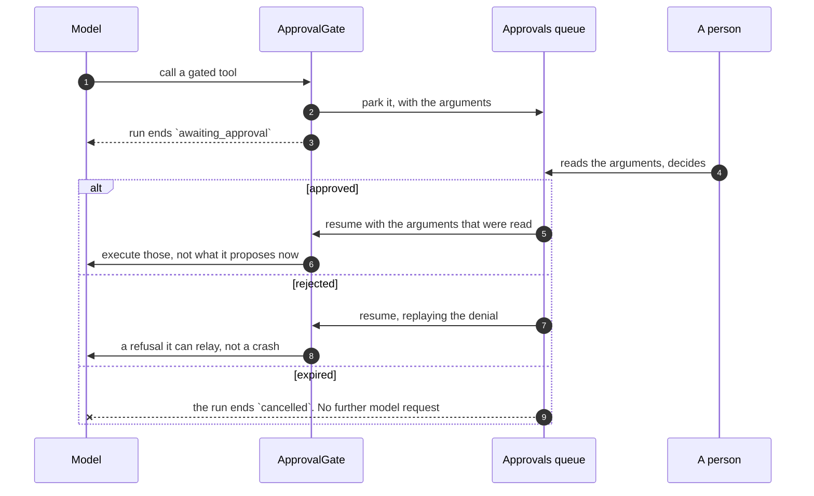

# Governance { #governance }

Budgets, aprobaciones, alertas y el registro de auditoría. Las cuatro cosas que
convierten una plataforma de agents en algo detrás de lo que puedes poner una
tarjeta de crédito.

Todas se aplican igual en cada superficie, porque cada superficie pasa por un
único runner.

La más reciente de esas superficies es un **trigger**: un agent que se ejecuta a
sí mismo según un horario o ante un evento entrante — una issue de GitHub, un
correo recibido (mira [Conceptos](concepts.md#trigger)).

No cambia nada de lo que sigue. Gasta contra los dos mismos topes, se aparca en la
misma puerta de aprobación — dirigida a quien lo creó, al miembro como el que se
ejecuta y a los administradores — y queda registrado en el mismo registro de
auditoría.

Lo único que añade lo "desatendido" es lo que le ocurre a un **rechazo**:

- Un run disparado que el budget detiene termina en `budget_exceeded` y **espera
  al siguiente disparo** en lugar de reintentarse.
- Un run disparado que quien lo creó ya no puede hacer — porque dejó la
  organización, o perdió su grant sobre el agent — **desactiva el trigger** y
  escribe una entrada de auditoría diciendo por qué.
- Un run disparado que falla en el modelo mismo — una caída del provider, una
  clave revocada — se registra como `failed` y se deja para el siguiente disparo,
  en vez de hacer que el heartbeat reintente contra el mismo muro. El
  `last_run_id` del trigger se queda apuntando a él, para que su historial siga
  siendo honesto.

Un rechazo que un heartbeat reintentara cada minuto sería una factura, o una
alerta, que no para nunca.

!!! warning "Lo que no se traga es un fallo que nunca llegó a ser un registro"

    Si el run alcanzó un estado terminal pero la escritura que lo registraba no
    hizo commit — una transcripción o una escritura del estado de la conversación
    que lanzó una excepción después de tener ya la respuesta —, el disparo **hace
    fallar el flow** en lugar de informar de un éxito. El run a medio escribir se
    revierte en vez de quedar confirmado como completo sin nada detrás.

Un trigger de evento añade un rechazo más en su borde: un webhook cuya firma no se
verifica contra el secreto propio del trigger es un 403 que nunca llega al runner.

## Budgets { #budgets }

!!! abstract "Dos niveles, y no son variaciones de un mismo número"

    El tope de un agent medido contra el total de la organización lo agotan los
    runs de sus vecinos; el de la organización medido contra un solo agent no es
    techo alguno. Mira [por qué no se pueden fundir](#why-they-cannot-be-collapsed).

| Nivel | Se fija en | Mide | Lo sube |
|---|---|---|---|
| **Agent, mensual** | el spec del agent | los runs de ese mismo agent | quien pueda editar el agent |
| **Organización, mensual** | los ajustes de la organización | cada run *y* cada ingesta de la organización | quien tenga `budgets:manage` |

Una **organización nueva empieza con el techo de la organización ya puesto** — el
`DEFAULT_ORG_MONTHLY_BUDGET_USD` del deployment ([configuración](configuration.md),
$100 de serie) —, así que un tenant recién creado no está a un agent desbocado de
una factura sorpresa. A partir de ahí es un tope corriente: editable en la fila de
la organización, y aplicado exactamente igual que uno puesto a mano. Un deployment
que prefiera arrancar sin tope deja ese ajuste vacío; en cualquier caso, el tope de
una organización existente nunca se cambia por ello.

### Por qué no se pueden fundir { #why-they-cannot-be-collapsed }

Antes lo estaban, con `min()`, y el resultado era erróneo. El tope de un agent
medido contra el total de la organización lo agotan los runs de sus vecinos, que
es precisamente lo que hace que no sea un tope. El tope de una organización medido
contra el gasto de un solo agent no ataría nunca.

Así que cada tope mide su propia magnitud, y la consulta viaja con el límite. Un
agent de $5 bajo un techo de $50 ata ahora cuando *él* ha gastado $5, y el rechazo
nombra el tope que de verdad ató en vez de deducirlo de cuál de los dos números era
menor.

Un agent sigue sin poder aflojar el techo de la organización: la entrada de la
organización está presente con su propio número pida lo que pida el spec, y el
gasto de un agent forma parte del de la organización — así que un agent de $100
bajo una organización de $10 se detiene en $10.

Ambos topes se leen donde está su gasto: el de la organización en su propia fila
(`GET /orgs/{org_id}`), y el de cada agent como `budget_monthly_usd` en el listado
de agents — el número de la versión *publicada*, ya que es la que aplica el runner,
no lo que prometa el borrador en este momento. La tarjeta de margen del dashboard
cruza estos datos con `GET /spend`, de modo que se puede ver un tope acercándose
antes de que `budget_exceeded` empiece a aparecer en el historial de runs.

### Se aplica antes de la petición { #enforcement-is-before-the-request }

!!! danger "Antes, no después"

    Comprobarlo después significa que la petición que rompió el budget ya estaba
    pagada — y un bucle puede pasarse por una llamada cara cada vez.

!!! important "Un run fallido registra igualmente lo que gastó"

    Un budget que ignora los fallos no es un budget. La contabilidad ocurre en un
    bloque `finally` en cada superficie, y el commit es explícito en lugar de
    dejarse al contexto de sesión — que revierte ante cualquier excepción y no se
    alcanza en absoluto si hay una cancelación.

!!! important "Una línea base es lo que han gastado los *demás* runs"

    Ambas consultas dejan fuera la fila del propio run que pregunta. Un run
    reanudado conserva su fila, y para entonces `finish_run` ya ha confirmado lo
    que gastó — mientras el ledger se vuelve a sembrar con la misma cifra, cosa
    que tiene que pasar, o terminar la continuación sobrescribiría el coste con lo
    que costó solo la continuación. Contado en ambos sitios, un agent con tope de
    $10 que había gastado $6 y se aparcó volvió con `6 + 6 = 12` en su primera
    petición al modelo y fue rechazado con $4 de margen, diciéndole a su dueño que
    había alcanzado un tope del que estaba al 60%. El tope de la organización se
    contaba doble igual.

La guarda es una parada en seco para un run que *ve* el gasto, y el coste propio de
un run solo aterriza en su fila cuando termina.

Así que la línea base que lee un run es la suma de los runs que ya han terminado, y
**los runs concurrentes son invisibles entre sí**. Cincuenta runs que arrancan
juntos contra una organización a una llamada de su tope leen todos la misma línea
base por debajo del tope, todos siguen adelante, y se pasan hasta por su coste
combinado.

Eso es una propiedad de un agregado sin una sola fila que bloquear — a diferencia
del exceso por run y por bucle de más arriba, que la comprobación previa a la
petición sí acota. Es la razón de que el tope sea un techo sobre el gasto
**confirmado** y no una puerta que serialice runs simultáneos.

Un deployment que necesite un tope estricto ejecuta sus agents por una sola cola en
vez de en paralelo.

### Un run cuesta más que sus peticiones al modelo { #a-run-costs-more-than-its-model-requests }

Una búsqueda en la base de conocimiento embebe la pregunta antes de poder
buscarla, y ese embedding se factura al run que lo pidió. El servicio de
embeddings es global al proceso — sirve a cada run y a cada trabajo de ingesta a la
vez — así que apunta contra el run que esté *medido en ese momento* en lugar de
recibir un budget como argumento.

Lo que convierte al medidor en algo que una superficie puede olvidar, y olvidarlo
es silencioso: ninguna excepción y ningún aviso, solo un run que informa de menos
de lo que gastó y un mes de la organización que nunca lo ve. Por eso el medidor
pertenece al run preparado y no a la superficie. Abrir uno no es un paso que una
superficie nueva tenga que conocer, porque no hay forma de ejecutar un agent
preparado sin él.

La [gestión de contexto](reference/capabilities.md#context-management) es el otro
caso. Su estrategia de resumen escribe el resumen a través de un agent que
construye ella misma, así que esa petición no pasa por ninguna guarda de budget; la
capability apunta lo que costó contra el mismo medidor. Estar *fuera* de la guarda
tiene una consecuencia que conviene conocer: el gasto se registra en vez de
rechazarse, así que una compactación que cruza un tope detiene el run en la
petición siguiente.

### Un coste que no se pudo medir lo dice { #a-cost-that-could-not-be-measured-says-so }

`genai-prices` no conoce todos los modelos. Cuando un run llega a uno del que no
tiene entrada, esa petición se apunta a cero y el run se marca con
`cost_is_partial` — el total se queda corto exactamente por lo que costaron esas
peticiones, y la lectura honesta es la de un **suelo**.

Esa marca viaja ahora hasta el final. Está en la fila del run, en la fila del
mensaje que escribe un turno, y en el total que informa una conversación; cada
superficie que dibuja dinero dibuja un `≥` delante en vez de una cifra que se lea
como exacta. Un nulo en un mensaje escrito antes de que existiera la columna
significa *no registrado*, que no es la misma afirmación que "exacto" — un cliente
solo marca lo que sabe.

**Ahora lo registra cada superficie, y cada turno registra su propia parte.** Un
mensaje escrito por un canal, la API o el widget no llevaba coste alguno hasta hace
poco, así que un hilo de Slack no se podía totalizar. El número que se escribe es
la *diferencia* respecto a lo que ya reclaman los turnos anteriores de ese run, no
la cifra de la fila del run: una fila de run es acumulativa, y un run que se aparcó
y fue reanudado escribe dos turnos de asistente — estampar ambos con la fila
contaría dos veces la mitad aparcada. Los mensajes de un run suman por tanto
exactamente lo que el run dice que gastó.

**Un turno que el run interrumpió a medias lo dice.** Un run cancelado deja lo que
el agent hubiera escrito cuando se cerró el socket o se pulsó `stop`, y eso se lee
igual que una respuesta terminada — así que quien lo lee toma una respuesta truncada
por todo lo que el agent tenía que decir, y el dinero gastado parece haber comprado
eso. La transcripción lleva el estado del run por turno, y el chat lo marca.

### Cómo de lleno está el context window { #how-full-the-context-window-is }

El tercer techo, y el que nadie ve venir. Un budget rechaza con un mensaje sobre el
que alguien puede actuar. Un workspace rechaza una escritura. Un **context window**
lo rechaza el provider, a media respuesta, y el run simplemente falla.

Por eso cada agent lleva un indicador — no solo el que tenga enlazada la
[gestión de contexto](reference/capabilities.md#context-management), porque el aviso
importa más en el agent que *no* va a compactar. Informa de cuántos tokens llevaba
la última petición de un turno, *después* de cualquier compactación: la lectura baja
cuando la compactación funciona, porque mide lo que salió y no lo que guarda la
conversación.

El número es el `input_tokens` del propio provider, no una estimación del historial.
Un recuento de caracteres no puede ver las definiciones de las herramientas, y esas
se facturan en cada petición — miles de tokens en un agent con conocimiento, una
sandbox y delegación, que es un tercio de la cifra real faltando justo en el momento
en que la cifra importa.

**El recuento se guarda en el turno; la proporción no.**

Cuánto historial hay sobrevive a un cambio de modelo. Qué fracción de una ventana
es eso, no — y el chat permite cambiar de modelo entre turnos.

Un historial de 500.000 tokens es la mitad de un modelo con contexto de 1M y el
**390%** de uno de 128K, y lo segundo es una petición que el provider rechaza de
plano. Una proporción congelada con la lectura seguiría diciendo "50%".

Así que el denominador se resuelve allí donde se conoce la selección, a partir de
la ventana registrada en el perfil del modelo y del registro de precios detrás de
él. Donde ninguno puede decirlo, **no se dibuja proporción alguna** — un porcentaje
contra una ventana supuesta es una conjetura presentada como una medida.

Ese cambio es también para lo que sirve la compactación. Su disparador es una
**fracción resuelta por petición** contra el modelo al que va la petición, así que
un historial que cabía cómodamente en la ventana antigua se compacta en el turno
siguiente bajo la nueva — antes de que salga la petición, no después de que el
provider la haya rechazado. Un agent sin compactación enlazada tiene el indicador en
su lugar, y nada más.

**El disparador mide lo que midió el provider.** Se ancla en la respuesta más
reciente que lleve uso del provider — los `input_tokens` de esa petición contaron
las instrucciones, cada esquema de herramienta y cada mensaje anterior — y estima
solo lo que vino después. Por eso una conversación reproducida lleva lo que costó
cada respuesta: sin un ancla el disparador cuenta caracteres, y un agent real de
aquí leyó 9 tokens donde el provider había cobrado por 3.859. El indicador decía
77%; el disparador no vio nada que hacer.

**Un resumen se conserva.** La compactación reescribe los mensajes de un run; el
hilo entre turnos se reconstruye desde la transcripción, así que antes un resumen se
tiraba en la frontera del turno y el turno siguiente compraba otro sobre un
historial un turno más largo — dos turnos consecutivos de una conversación real de
aquí pagaron cada uno por un resumen de los mismos cinco mensajes, y el segundo se
anunció resumiendo nueve. Por eso el historial compactado se escribe en la
conversación, junto con hasta dónde llega, y el turno siguiente parte de él y
reproduce solo lo dicho desde entonces. Reabrir el hilo encuentra lo mismo que el
modelo.

Solo se conserva un resumen. Descartar los mensajes más antiguos y limpiar los
resultados de herramientas no cuesta nada rehacerlo, y escribirlo haría permanente
una pérdida que hoy se reconsidera contra la ventana en cada turno.

Un ajuste no puede funcionar, y lo dice en vez de ejecutarse. Cuando las
instrucciones y los esquemas de herramientas por sí solos ya pasan del disparador,
ningún resumen puede bajar de él — no están en el historial que se resume. Cada
petición compraría entonces un resumen que no cambia nada. La compactación se omite,
el chat dice por qué, y el arreglo es de quien escribe el agent: una ventana mayor,
o una fracción más alta.

Ese rechazo se apoya en un número que produce una *respuesta*, así que un turno no
puede medir el suyo antes de tener que decidir — y un turno de chat suele ser una
petición. La conversación lleva la última lectura, y un run parte de ella. El primer
turno de un hilo no tiene por tanto nada en que basarse y compacta según lo
configurado; desde el segundo, el rechazo está disponible. Solo se rechazan las
estrategias que compran algo: descartar los mensajes más antiguos y limpiar los
resultados de herramientas no llaman a ningún modelo, así que se ejecutan sea cual
sea la ventana.

### La delegación gasta el budget del padre { #delegation-spends-the-parents-budget }

Un run puede contener la conversación entera de otro agent — mira
[delegado frente a especialista inline](concepts.md#delegate-vs-inline-specialist).
Un run tiene **un solo ledger de gasto**, y cada delegado escribe en él. Eso es lo
que hace que el tope del padre vea el gasto de una delegación antes de su siguiente
petición al modelo, justo en el momento en que la delegación multiplica lo que
puede costar un turno. Cada entrada lleva estampada la delegación que la apuntó,
que es como un único ledger sigue respondiendo a "cuánto costó *este* delegado" —
mira más abajo.

De ahí se sigue que **los topes que atan dentro de una delegación son los del
padre**. El `budget.monthly_usd` propio de un delegado no se aplica a mitad del run
del padre: dos guardas midiendo un mismo ledger contarían doble cada petición, y el
techo que importa es el del run que alguien inició. El tope propio del delegado
sigue gobernando los runs *del delegado mismo*.

Cada delegado, eso sí, pone precio a sus propias peticiones, porque una guarda pone
precio a lo que registra: un delegado en Anthropic medido por una guarda construida
para OpenAI se tarifaría contra el catálogo equivocado — en silencio, y normalmente
como no tarifado.

Existen tres techos más porque un budget es mala forma de parar un fan-out: solo se
entera cuando el dinero ya se ha ido. `max_depth` acota el anidamiento, `max_fanout`
acota cuántas delegaciones corren a la vez, y el `max_steps` propio de cada delegado
acota su bucle. Mira la
[capability `subagents`](reference/capabilities.md#delegation).

Dos de esos tres son del propio delegado, que es la línea que el budget no cruza:
`max_steps` se lee del spec del delegado, y su `max_depth` limita cuán profundo
puede ir *él* por mucho margen que le quedara a quien lo llamó. Un tope sobre el
gasto es un tope sobre el run que alguien inició; un tope sobre el anidamiento es
una decisión que tomó quien escribió el delegado y que leen sus revisores, así que
quien llama no puede ensancharla.

### Cómo se registra un run delegado { #what-a-delegated-run-is-recorded-as }

Una delegación a un agent **publicado** obtiene su propia fila en `agent_runs`, con
`parent_run_id` y el id de tarea de la delegación. Un **especialista inline** no
obtiene ninguna: no tiene un agent al que atribuirla, así que su coste es el *del
run* y la llamada a la herramienta en la transcripción es el registro.

Cuál es ese run, sin embargo, es la pregunta que respondió la
[#228](https://github.com/vstorm-co/agenticos/issues/228).

- Un especialista directamente bajo el agent propio del run se factura a la **fila
  de nivel superior**, que de todos modos es el ledger entero.
- Un especialista bajo un **delegado publicado** se factura a la fila *de ese
  delegado*, no a la de nivel superior — así el mes del delegado incluye lo que
  gastó su especialista, que es el único sitio donde podría aterrizar honestamente.

Cada entrada del ledger lleva por tanto dos atribuciones: la delegación que la hizo,
para el panel, y la fila de agent más cercana a la que se factura, para el mes.

Las dos coinciden en cada petición que un delegado publicado hace por su cuenta, y
divergen solo bajo un especialista inline — cuyo panel conserva su propia parte
mientras su gasto llega a la fila de su ancestro.

!!! important "La fila del padre es la autoridad; la de un hijo es su parte de ella"

    Un delegado gasta contra el ledger compartido, y **cada entrada de ese ledger
    lleva la delegación que la hizo**. El coste de una delegación es la suma de sus
    propias entradas — las peticiones que emitió su propio agent, tarifadas una
    vez, por la misma consulta que usa el total del run. Es exacto en ambos modos y
    a cualquier profundidad, y no depende de cuándo se liquidara la delegación.

    Antes dependía exactamente de eso, y eran dos defectos. El número era el
    *crecimiento* del total compartido a lo largo de la delegación, así que una
    delegación en segundo plano — liquidada cuando se vuelve a consultar, que puede
    ser después de que el padre haya respondido — absorbía todo lo que el padre
    gastara entretanto: un delegado que gastó $0,01 quedaba registrado en $0,51 si
    el padre gastaba luego $0,50. Y un delegado que delega a su vez tenía el gasto
    de sus propios delegados dentro de su ventana, que las filas de estos registran
    otra vez, así que su total mensual contaba a sus nietos.

    Partirlo con un ledger *por agent* sigue siendo el diseño a evitar — es lo que
    impide que el tope del padre ate en absoluto. Un solo ledger, atribuido,
    conserva ambas propiedades: el tope del padre ve cada petición antes de la
    siguiente, y cada fila delegada dice lo que gastó ese único agent, sus propios
    especialistas inline incluidos y sus delegados publicados excluidos.

    La fila del padre sigue siendo la autoridad para el run. Su `cost_usd` es el
    ledger entero, delegados incluidos, que es lo que se le factura a la
    organización; las filas hijas dividen ese mismo dinero por agent y nunca le
    suman. `cost_is_partial` es también por fila: un padre sobre un modelo que
    `genai-prices` no conoce convierte el total del padre en un suelo, y no dice
    nada sobre un delegado que corrió sobre uno tarifado.

    El `started_at` y el `ended_at` de una fila delegada son el lapso **propio** de
    la delegación, leído del manejador de tarea que la librería estampa cuando el
    delegado empieza y cuando acaba — no el momento en que se liquidó la fila.
    Desde la liquidación, una delegación en segundo plano se leía como un run de
    duración cero a la hora equivocada, ordenado después de trabajo que terminó
    antes que ella; dos que de verdad se solapaban quedaban registradas en el mismo
    instante sin nada que lo dijera. Un manejador terminal con final pero sin
    inicio — un delegado cancelado o fallido antes de empezar a ejecutarse —
    registra un lapso de longitud cero en ese final, nunca un nulo; y donde la
    librería rechaza antes de que exista siquiera un manejador — un `chat_trace_id`
    desconocido — no se escribe fila delegada alguna. Una delegación que se aparcó
    en una aprobación abarca cada turno en el que corrió: su inicio más temprano se
    arrastra a través del aparcamiento igual que su coste (abajo), así que la fila
    empieza cuando el delegado empezó por primera vez y acaba cuando por fin acabó
    — no en la reanudación que la liquidó. Los dos no se suman como sí se suma el
    coste; la respuesta honesta es el inicio del primer segmento y el final del
    último.

**Una delegación que se aparcó en una aprobación es más de una parte.** Sus turnos
corrieron en procesos distintos contra ledgers distintos, y el ledger de un turno
reanudado es un objeto nuevo que no guarda nada de antes del aparcamiento — así que
lo que registra la fila hija es cada segmento sumado: el estado aparcado conserva lo
que la delegación había costado al detenerse, y el turno que la termina añade su
parte. Se escribe una fila, una vez, en el turno donde la delegación acaba — un
delegado que se aparcó dos veces deja tres segmentos y una fila.

`cost_is_partial` se arrastra igual, y por un motivo que el dinero no comparte:
ahora es por fila y no por run, así que un delegado que hizo una petición no
tarifada *antes* de la aprobación y se reanudó sobre un modelo tarifado tendría si
no una fila afirmando un coste exacto. La marca es verdadera si lo fue en cualquier
segmento.

Vale la pena decirlo porque el fallo al que sustituye era invisible. La fila
guardaba solo lo que el delegado gastó *después* de la última reanudación, que en la
forma corriente — haz el trabajo, luego pide permiso para actuar sobre el resultado
— es la mitad pequeña. Nada dejaba de cuadrar, porque el dinero estaba en la fila
del padre desde el principio; lo que estaba mal era cada número que responde a
"cuánto costó este delegado".

La fila hija es lo que hace respondibles dos preguntas distintas, y quieren la
aritmética contraria:

| La pregunta | Filas hijas |
|---|---|
| **¿Qué debe la organización?** | **excluidas** — la fila del padre ya contiene esos tokens, así que contar ambas le factura a la organización dos veces una misma petición |
| **¿Cuánto costó *este agent* este mes?** | **incluidas** — las filas de un delegado son el único sitio donde se registra su propio gasto, y cada una guarda las peticiones de ese agent y las de sus especialistas inline ([#228](https://github.com/vstorm-co/agenticos/issues/228)) pero no las de sus delegados publicados, que tienen filas propias |

La segunda es lo que hace respondible "el investigador costó $40 este mes", y es
sobre lo que se dispara un informe de uso por agent o una alerta de budget sobre ese
agent. El número mensual de la organización lleva además el gasto de ingesta, que el
número por agent no lleva: indexar una base de conocimiento compartida no es gasto
del agent de nadie.

Una fila hija fallida se somete también a la regla del padre sobre lo que puede
decir `error`. Lo que se lanza bajo un delegado es un cliente de modelo cuyo mensaje
puede llevar la URL de la petición fallida — clave incluida, en un endpoint propio —
así que la fila y el frame de cierre de la delegación guardan la misma frase
controlada que guarda la fila del padre, y el texto del provider va al log del
servidor. Un delegado detenido por su límite de uso o por un techo de budget
conserva entero el mensaje del límite: eso es un techo haciendo su trabajo, no un
fallo que diagnosticar.

La regla alcanza también la transcripción del *padre*. Cuando un agent delega en
segundo plano consulta `check_task` y `wait_tasks` por el resultado, y lo que esos
responden se convierte en una fila de llamada a herramienta en la conversación —
guardada entera, porque el retorno de una herramienta es la respuesta de la propia
herramienta y no algo que compusiera esta plataforma. Así que nombran la clase de la
excepción en lugar de repetir el mensaje del provider, que es
`subagents-pydantic-ai` 0.2.20 y la razón de que el suelo esté ahí.

**La cifra por ventana del dashboard también lo lleva.** `GET /stats/usage` responde
con un bloque `cost` para el periodo que eligiera el filtro, y ese bloque son los
runs *más* la ingesta — la misma aritmética con la que se mide el tope mensual — con
`model_usd` e `ingestion_usd` al lado para que quien lo lea vea adónde fue el dinero
sin restar. Informaba solo de la mitad de modelo hasta la 0.0.152, lo que ponía dos
definiciones distintas de coste en una tarjeta: el titular se movía con el filtro de
periodo y contaba runs, mientras la línea de mes en curso debajo contaba la factura
entera, y nada decía que respondieran a preguntas distintas. En un deployment que
indexa documentos simplemente discrepaban.

Con `scope=own` la mitad de ingesta es cero y no una parte proporcional: un documento
lo indexa un worker y `ingestion_spend` no registra usuario, así que cargarle la
ventana de una persona por una colección que sincronizó otra sería inventarle gasto.

**Cada consulta tiene que decir a cuál de las dos responde**, y la primera columna es
la predeterminada. La cifra de mes en curso y el desglose por agent detrás de ella
excluyen las filas hijas, así que suman al total impreso encima — y el correo de uso
de la organización informa de ese mismo total y no de una suma de uno de ellos. Solo
una pregunta hecha *sobre un agent* las incluye. Tres de estas cinco consultas se
entregaron sin la distinción y cada una informaba de $1,40 por $1,00 de trabajo; si
se añade otra, el valor por defecto es el seguro.

#### Las dos preguntas sobre el proveedor necesitan una tercera respuesta { #the-two-vendor-questions-need-a-third-answer }

**By provider** y **By key** no pueden usar ninguna de las dos columnas, y
equivocarse ahí es invisible en pantalla. Excluir las filas hijas totaliza bien y
luego atribuye el dinero del delegado al proveedor del *padre*, porque ese es el
provider de la fila que se suma: un orquestador en OpenAI que delegaba $0,40 de
trabajo a un agent en Anthropic informaba `openai $1.00` y ninguna fila de Anthropic.
Incluirlas informaba `openai $1.00` + `anthropic $0.40` — más que la factura.

Así que esas dos suman el gasto **propio** de cada run: su coste menos el de sus
delegaciones directas. `openai $0.60` + `anthropic $0.40`, que es a la vez la
atribución correcta y el total correcto. Anida — un delegado que delegó a su vez
tiene a sus nietos descontados por él, una vez — y sumado sobre cada fila sigue
dando la factura, porque el coste de cada hijo lo añade su propia fila y lo quita la
de su padre. Una clave funciona igual, e importa más: una clave es lo que alguien
rota cuando una factura parece mal.

### Qué muestra el historial de runs { #what-run-history-shows }

**`GET /runs` lista solo runs de nivel superior, y su `total` cuenta esos.** El
mismo valor por defecto que la suma mensual de la organización, y por la misma
razón: intercaladas, las dos clases de fila no se pueden leer por una sola columna
de coste. Un fan-out de tres delegaciones es un run que cuesta $1,00 en la página y
$1,00 en la factura; listadas juntas eran cuatro filas de $1,00 + $0,40 + $0,40 +
$0,40 junto a una cifra de mes en curso de $1,00, y ambas mitades tenían razón sobre
una pregunta distinta.

La lista toma la misma aritmética de dos caras que las sumas de arriba, por la misma
razón — de modo que una superficie acotada a un agent muestre lo que hizo *ese
agent*, trabajo delegado incluido:

| Pregunta | Respuesta |
|---|---|
| `GET /runs` | Los runs que alguien inició. `parent_run_id IS NULL` |
| `GET /runs?agent_id=<id>&include_delegations=true` | El historial propio de un agent. Lo que piden el panel Recent runs del Builder y el `?agent=` de Activity, porque las filas de un delegado son el único registro de lo que hizo él mismo |
| `GET /runs?parent_run_id=<id>` | Lo que delegó ese run — la consulta para la que existe `agent_runs_parent_run_id_idx`. Tiene prioridad sobre `include_delegations` |
| `GET /runs/<id>` | Un run, delegado o no. Donde aterriza un enlace desde una transcripción |
| `GET /runs/<id>/transcript` | Los turnos de ese run, en orden — lo que una vista de detalle de run dibuja como pasos. Autorizado, no en propiedad (abajo) |

**Leer un run está autorizado, no en propiedad.**

Alguien del equipo con `runs:view` lee un run que inició otra persona. La autoridad
sobre un run es de la organización, porque un run es aquello por lo que se factura y
responde la organización — no propiedad privada de quien pulsó el botón.

Así que la decisión vive en el servicio y no en una puerta de ruta: resuelve primero
el run contra la organización de quien llama, y luego comprueba `runs:view`.

Tres consecuencias:

- Un run en **otro tenant se lee como ausente** — el mismo 404 con que responde un
  id que nunca existió, cuerpo incluido — así que la respuesta no sirve para
  descubrir que un run existe.
- Un run que corrió **sin conversación** (una llamada a la API que no pasó
  `conversation_id`) no tiene transcripción que leer, y lo dice con un
  `conversation_id` nulo en vez de una lista vacía que se leería como "no hizo nada".
- Nada de esto ensancha `GET /conversations/{id}/messages`, que sigue **acotado al
  propietario**. Que un colega pueda leer la transcripción de un run no debe hacer
  legible también el hilo privado en el que está.

**Cada turno que sirve la transcripción lleva las valoraciones que la gente dejó en
él** — el pulgar de quien lee, los me gusta y no me gusta de la organización, y el
comentario de la valoración negativa más reciente.

Una fila de mensaje sin más no guarda nada de esto, así que se leen de
`message_ratings` en un solo lote y se adjuntan a los turnos. Un turno que nadie
valoró los lleva vacíos y se lee exactamente como un mensaje corriente.

Esto es lo que permite que la vista de detalle de un run muestre las respuestas
valoradas negativamente y las palabras que las acompañaron — las conversaciones
detrás del número de calidad del dashboard (#209) — leídas donde se lee el run, y no
solo en la exportación de valoraciones del app admin.

El comentario que se muestra es el de una valoración **negativa**, nunca el de una
positiva, y el más reciente cuando un turno recibió más de una objeción.

### Qué muestran los agregados del dashboard { #what-the-dashboards-aggregates-show }

`GET /stats/usage` toma las mismas dos caras, y el mismo valor por defecto. La
respuesta compuesta es la pregunta de la organización, así que cada bloque cuenta
solo filas de nivel superior: el coste del periodo y su reparto por provider (la
doble factura de arriba), pero también el total de runs, la serie por día, el
reparto de desenlaces, las superficies, los percentiles de latencia, el número de
personas activas y la tabla por persona. Más allá del coste, una fila delegada
*copia* el `user_id` y la `surface` de su padre, así que contarla inventaría además
una segunda persona y una segunda llegada por un canal que alguien usó una vez.

Dos agregados toman la otra cara, y ambos se preguntan sobre un agent:

| Pregunta | Filas hijas |
|---|---|
| `by_agent` — la tarjeta de adopción | **incluidas.** Excluidas, un agent que corre cuatrocientas veces al día como delegado de alguien no tiene fila, y la tarjeta señala como olvidado a cada agent publicado sin una y ofrece archivarlo. Sus barras pueden por tanto superar el total de runs a su lado; nada las suma |
| `?group_by=version` — la tarjeta de comparación de versiones | **incluidas.** Un especialista que solo se ejecuta como delegado no tendría si no nada que comparar entre sus versiones |

El invariante que sobrevive en cualquier caso: los segmentos del donut de desenlaces
siguen sumando `total_runs`, y su segmento `awaiting_approval` sigue contando los
mismos runs aparcados que la tarjeta de aprobaciones, porque esos tres vienen del
mismo lado del interruptor.

La única consulta sin filtro de delegación alguno es el recuento de los runs de
quien llama aparcados en una decisión. Un hijo aparcado es un padre atascado, y esa
tarjeta responde a "por qué no termina mi agent"; hoy no cambia nada, porque una
delegación se escribe en la base de datos ya terminada y por tanto nunca se aparca.

Las dos últimas son `?run=<id>` en la página Activity: un run, las delegaciones bajo
él cada una con la insignia del id de tarea que llevaban sus frames `subagent_*`, y
un enlace hacia arriba al run al que se cargó una delegación. Un panel de delegación
en un chat enlaza ahí con el `run_id` que lleva su frame terminal — razón por la que
el frame lleva uno. Anidar las filas delegadas dentro de la tabla de nivel superior
aquí deliberadamente *no* se hace; un componente de tabla compartido por
todo el producto está
[propuesto aparte](https://github.com/vstorm-co/agenticos/issues/139), y el anidado
pertenece a ese y no a una tabla de runs hecha a medida.

### Qué muestra la pantalla de coste { #what-the-cost-screen-shows }

`GET /spend` toma su ventana de dos maneras, porque la página pide las dos: `days`
para los preajustes de *últimos N días*, y `from`/`to` para *este mes*, *el mes
pasado* y un rango de calendario. `from` gana cuando llegan ambos — un rango
explícito es una petición más específica que un valor por defecto que nadie cambió —
y `period_days` vuelve nulo en ese caso en vez de repetir un número que el rango
contradice.

**Cada panel de la pantalla lee la misma ventana.** Las filas por agent, By provider
y By key toman todos el `since`/`until` ya resuelto y no un recuento de días propio,
así que dos cifras contiguas no pueden acabar describiendo runs distintos. Ese es el
mismo defecto que la #198 nombra un panel más arriba.

**El mes en curso ignora la ventana por completo**, y también lo hace cada tope por
agent medido contra él. Un techo mensual comparado con siete días móviles se lee como
un 20% usado el día en que el tope se alcanzó de verdad.

Cada fila por agent lleva **dos cifras de coste bajo dos nombres distintos**, que es
la regla de esta página de principio a fin:

| | |
|---|---|
| `cost_usd` | Su parte de la ventana, **solo runs de nivel superior**, así que la columna suma el total de encima |
| `month_to_date_usd` | Su **propio** mes natural, filas delegadas **incluidas** — el gasto del que su `monthly_cap_usd` es tope. No suma el mes de la organización y no se dibuja como si lo hiciera |

`partial_run_count` dice cuánto de todo eso es un hecho: cuántos **runs de nivel
superior** de la ventana no se pudieron tarifar del todo, de modo que el coste es un
suelo por exactamente esa cantidad. *"3 de 40 runs no se pudieron tarifar"* es algo
sobre lo que alguien puede actuar; una cifra con un signo de más no lo es.

Un run cuenta cuando cualquier modelo de su árbol no tenía precio, **los de sus
delegados incluidos** — el árbol comparte un ledger, así que un delegado sin tarifar
vuelve suelo también la fila del padre. Eso permite que una cifra gobierne los tres
desgloses: By provider y By key suman el gasto propio de cada fila, filas delegadas
incluidas, y un suelo en cualquiera de ellos queda marcado por un recuento que nunca
miró la fila causante. **Mide** By agent, que cuenta esas mismas filas superiores, y
solo **marca** los otros dos: cuenta árboles, así que un padre con tres delegados sin
tarifar se lee `1` mientras tres cifras debajo son un suelo.

Un árbol que **cruza el inicio de la ventana** — la fila del delegado dentro, la de
su padre antes — se cuenta por el delegado: la fila del padre, que si no llevaría la
marca, queda fuera de los agregados de la página, mientras el gasto propio del
delegado está dentro de ambos repartos. Aterriza en el agent como el que corrió el
delegado, una vez por árbol que cruce, por muchas delegaciones que crucen el borde, y
solo cuando las peticiones propias del delegado quedaron sin tarifar — una delegación
tarifada bajo un padre sin tarifar fuera de la ventana no levanta salvedad, porque el
dinero de la ventana es exacto
([#620](https://github.com/vstorm-co/agenticos/issues/620)).

Una fila es **una por agent**, con `agent_name` en ella. Antes era una por agent *y
modelo*, llevando solo `model_label` — así que la pestaña listaba nombres de modelo
donde quien lee espera un agent, y partía un agent en dos filas por haber respondido
en dos modelos. La forma por modelo sobrevive donde es la pregunta que se hace: el
correo de uso sigue agrupando así.

**Quién lo gastó es un cuarto desglose**, debajo de By provider, By key y By agent —
el que responde con personas en vez de con proveedores o agents.

Lee las mismas filas de `group_by=user` que la tabla de adopción del dashboard —
solo runs de nivel superior, los más activos primero — así que el coste de un
delegado aterriza una vez, dentro del run que lo inició. Y cubre la ventana que
muestra el resto de la pestaña, en vez de un valor móvil propio.

Nombrar a las personas de la organización es la misma decisión que toma la tarjeta
del dashboard, así que toma la misma puerta: `runs:view`, que tienen builder y
operator además de los dos responsables, y lo dice en su propio texto.

Quien no tenga `runs:view` no la ve. La tarjeta está ausente y su pregunta no se hace
nunca, en vez de una petición que vuelve rechazada.

### Acotar la cola de aprobaciones { #narrowing-the-approvals-queue }

`GET /approvals` sirve dos vistas de las mismas filas. Solo las pendientes por
defecto, que es la cola sobre la que alguien actúa; `?status=approved&status=rejected`
es el registro de lo que se decidió, y lleva el nombre y la nota de quien decidió
porque un UUID pelado no es un rastro de responsabilidad. Deliberadamente no hay
controles en una fila ya resuelta.

| Parámetro | |
|---|---|
| `status` | Se repite. Ausente significa pendientes — la cola |
| `triggered_by_user_id` | De quién son los runs que aparcaron la llamada. Se lee de `agent_runs`: una aprobación pertenece a un run y un run pertenece a una persona |
| `created_from`, `created_to` | Cuándo se aparcó la llamada, inclusive por ambos extremos |
| `oldest_first` | Por defecto verdadero, y el valor por defecto es determinante — mira arriba: nada hace caducar una llamada, así que el orden inverso enterraría la fila que más necesita verse |

Cada fila nombra tres cosas que viven en otras tablas — el agent, la persona cuyo run
aparcó la llamada, y la persona que decidió. El agent y el run son inner joins porque
ambas claves foráneas hacen cascada, así que una aprobación no puede sobrevivir a
ninguno de los dos; las dos personas son outer joins, porque una decisión tiene que
sobrevivir al borrado de la cuenta de quien decidió y quien visita un widget es
anónimo de entrada.

### Acotar el historial de runs { #narrowing-run-history }

| Parámetro | |
|---|---|
| `status` | Se repite. `?status=failed&status=budget_exceeded` es la consulta de enséñame-los-problemas, y los dos son estados separados precisamente para que pedir uno no sea pedir el otro |
| `surface` | De dónde vino el run |
| `user_id` | Como quién corrió el run, que no siempre es quien preguntó — los runs de un widget llevan la identidad de su propietario, porque la visita es anónima |
| `model_label` | El modelo **tal como lo registró el run**, con coincidencia exacta. No resuelto por el catálogo de modelos: la columna es lo que respondió, y el perfil del que salió puede haberse renombrado o borrado desde entonces. La tarjeta de modelos del dashboard cuenta esas mismas cadenas, así que "los runs detrás de esta barra" son un mismo conjunto en las dos pantallas |
| `started_from`, `started_to` | Inclusive por ambos extremos, porque un selector de rango entrega días enteros |
| `environment_id` | Runs sobre la versión que fija ese entorno. **Nunca un run delegado:** la versión de un delegado viene de un pin, así que la columna deliberadamente no se escribe nunca en uno, y acotar a `production` descarta cada delegación. Una superficie que incluya delegaciones tiene que decirlo |
| `exposure_id` | Runs admitidos por un binding. Nulo para el dashboard y la API |
| `agent_version_id` | Runs que ejecutaron un spec congelado — el "enséñame las filas detrás de este número" de la tira de versiones |
| `took_over_ms` | Solo runs más lentos que esto. Un run que no ha terminado no tiene duración y queda excluido, no contado como cero |
| `rated` | `down` o `up` — runs en los que alguien valoró un mensaje que produjo el run |
| `order_by`, `descending` | `started_at` (el valor por defecto, más recientes primero), `duration`, `cost` o `tokens` |

**Cada filtro acota el recuento además de la página**, así que `total` describe
siempre las filas que tiene debajo. La lista y el recuento son dos consultas, y un
filtro que alcanza solo una de ellas se lee como un fallo de paginación y no como una
cláusula que falta.

`started_from` es además lo que hace ese recuento reconciliable con el dinero que
tiene al lado. Sin ventana se lee *desde siempre* mientras una cifra de gasto lee un
mes natural, así que una organización de tres años mostraba "8.412 runs" junto a
"$31,20" y la lectura evidente del par se equivocaba en tres años. Una cifra y una
cifra de gasto en una pantalla comparten una ventana, o dicen qué ventana es cada
una.

Un valor fuera de su tipo se rechaza con un 422 en vez de compararse contra nada:
`status` y `surface` son columnas de texto, así que `?status=complete` respondería si
no con una página vacía — y una página vacía se lee como *no ha ido nada mal esta
semana*. `order_by` toma uno de cuatro órdenes y no un nombre de columna, por la
misma razón más otra: un `ORDER BY` montado desde una query string es una superficie
de inyección.

**Todos estos viajan en la URL**, que es lo que permite a una tarjeta del dashboard
ceder el paso a sus propias filas: `/runs?surface=mattermost&period=30d` abre Activity
con la faceta ya puesta y el recuento coincidiendo con la tarjeta que enlazó. Eran
estado local hasta la #768, así que la cifra p95 era el único número del dashboard
que podía alcanzar los runs detrás de él y tres tarjetas no llevaban enlace alguno —
no había nada honesto a lo que apuntarlas.

**Incluida la pestaña que está abierta.** `?tab=approvals` y `?tab=spend` abren la
cola y la pantalla de coste; el historial de runs es el valor por defecto y nunca se
escribe.

Esa es la dirección que necesita un enlace a una *decisión*, y la razón de que el
parámetro exista: el "See all" de la tarjeta de aprobaciones y la alerta que dice que
un run está aparcado tenían ambos que apuntar al historial de runs, donde no se puede
decidir nada (#934).

Una pestaña nombrada por un enlace se **resuelve contra lo que quien lee puede
abrir**. `approvals` está protegida por `approvals:decide`, así que un enlace que la
lleve y alcance a alguien sin el permiso abre el historial de runs en lugar de una
tira cuya pestaña seleccionada no tiene contenido.

Cambiar de pestaña cierra un detalle de run abierto y se lleva `?run=` con él. Un
panel que sobrevive a la pestaña que lo abrió queda al lado de una cola con la que no
tiene nada que ver — y por debajo de `lg` sustituye a la lista, así que la tira seguía
viva mientras el contenido de cada pestaña estaba oculto.

**La duración se calcula en SQL, sobre todo el conjunto acotado.**

Eso es lo que lleva de *"el p95 es 14,8 s"* en el dashboard a **esos runs**. Ordenar
una página de veinticinco ordena el conjunto equivocado, porque el run más lento de un
mes no está en las filas que devolviera una página de más recientes primero. `cost` y
`tokens` son la misma disposición para el dinero y el peso del contexto.

Un run sin `ended_at` se ordena **el último en ambos sentidos bajo los tres**. No
tiene duración, tampoco es el run más rápido, y sus cifras de coste y tokens se
escriben solo al terminar — ordenado tal como está guardado, un run aún en marcha se
leería como el más barato y ligero de la organización.

Cuánto lleva corriendo un run *todavía en marcha* es una pregunta distinta, y ninguno
de estos órdenes la responde.

Activity saca esa duración de tres maneras, y las tres llevan a la misma consulta:

- La cabecera de la columna **Took** es un control de orden — como la cabecera Started
  a su lado, y como cada cabecera ordenable del producto — así que un clic reordena el
  historial por `duration` y no por las veinticinco filas en pantalla.
- Una vista predefinida de **"slow runs"** es ese orden más un umbral `took_over_ms`
  (30 s) en un solo clic. **"All runs"** quita ambos, de vuelta a más recientes
  primero — dentro de la ventana que esté a la vista, ya que la ventana es un eje
  aparte que fijan el enlace del p95 y el rango de fechas.
- La cifra **p95 del dashboard enlaza aquí**, ordenada por duración sobre la misma
  ventana: `?sort=duration` con el `started_from` / `started_to` del periodo.

Así el número y los runs que hay detrás están a un clic — la regla que el resto de
estas dos páginas ya sigue, y la única dimensión en la que no lo hacían (#210).

**`rated=down` es la cola de mayor señal de aquí** — las respuestas que personas
reales dijeron que estaban mal, con sus propias palabras. Una valoración cuelga de un
mensaje, así que este join pasa por `messages.run_id`: dos runs en una conversación
conservan sus propias valoraciones, y por eso existe esa columna en vez de una ventana
de tiempo sobre el hilo. Es un `EXISTS`, así que un run que disgustó a tres personas
es una fila y no tres; y un run que gustó a una persona mientras disgustaba a otra
coincide con **ambos**, `up` y `down`, porque los dos son ciertos de él. Reducir eso a
un veredicto por run inventaría un consenso que las filas no registran.

El mismo hecho viaja en la fila sin el filtro. `AgentRunRead.down_rated` es `true`
cuando alguien valoró por debajo de cero una respuesta que produjo el run, calculado
para una página en una consulta, y es sobre lo que el historial de runs dibuja un 👎.
Está acotado a la organización de quien llama como toda lectura de aquí — el run de un
vecino, valorado negativamente, nunca se marca para otro tenant.

El **comentario** que acompañó a ese pulgar se lee en el detalle del run (`?run=<id>`),
no en la fila. Es texto escrito por una persona sobre una conversación, y ponerlo
detrás del detalle es la línea deliberada entre un marcador que ve cualquiera con
`runs:view` y las palabras que lo explican.

Ese es el join para el que se construyó `rated=down`: el dashboard dice que la calidad
cayó cuatro puntos, y aquí es donde se leen las conversaciones que la bajaron.

La tendencia que lee el dashboard es `GET /api/v1/ratings/summary` (un reparto de
titular más una serie por día): `scope=org` bajo `runs:view`, `scope=own` para las
conversaciones propias de un miembro, la misma regla de alcance y el mismo vocabulario
de ventana que `GET /stats/usage` (mira [Permisos](permissions.md)). Solo recuentos —
los comentarios se quedan detrás del detalle del run de arriba.

Las tres cifras de Activity sobre las pestañas siguen siendo las de la organización,
incluido el recuento de runs, aunque la tabla de abajo esté acotada a un agent. Un
recuento por agent junto al mes de la organización serían dos preguntas bajo una
etiqueta — y el recuento por agent es el que incluye delegaciones.

**Una delegación huérfana se informa sin su manejador.** `parent_run_id` es
`ON DELETE SET NULL`, así que borrar al padre deja una fila que correctamente empieza
a contar hacia la factura — pero una clave foránea solo puede anular su propia
columna, y el `subagent_task_id` guardado nombra entonces una transcripción que se fue
con el padre. `AgentRunRead` lo retiene siempre que `parent_run_id` sea nulo, así que
ninguna superficie ofrece un manejador de delegación que no alcanza nada.

### Exportar a CSV { #exporting-to-csv }

Todo lo que muestran las tres pestañas se puede sacar de la pantalla como CSV: las
filas que alguien concilia contra una factura, entrega a un equipo financiero o
adjunta a una auditoría. Una página que puede responder la pregunta en pantalla y no
fuera de ella manda a la gente a la base de datos.

| Pregunta | Respuesta |
|---|---|
| `GET /runs/export` | El historial de runs, los mismos filtros que `GET /runs` y el mismo valor por defecto de solo nivel superior. `runs:view` |
| `GET /approvals/export` | El registro de aprobaciones, los mismos filtros que `GET /approvals`. `approvals:decide` |
| `GET /spend/export` | El desglose de gasto por agent, la misma ventana que `GET /spend`. `runs:view` |

La exportación de gasto lleva solo las cifras de la ventana — `cost_usd`, `run_count`
y `partial_run_count`. El `month_to_date_usd` y el `monthly_cap_usd` de la pestaña
Spend se quedan fuera: leen el mes natural mientras `cost_usd` lee la ventana de la
exportación, y dos columnas de dólares sobre dos bases de tiempo en un mismo archivo
descargado acaban sumadas por quien no ve la diferencia. Un archivo descargado lleva
una base de tiempo, la ventana que se pidió.

Una exportación es una lectura masiva, no un botón, y responde a seis preguntas que
las rutas de listado no tienen por qué responder:

- **Tenencia.** Cada exportación lleva la puerta de la pestaña de la que viene, y
  toda lectura está acotada a la organización de quien llama — las filas de un vecino
  nunca la alcanzan, incluida una fila que quien llama posee en una organización que
  no es aquella desde la que pregunta. Las dos que van con `runs:view` aplican además
  un **suelo `Scope.OWN` en la consulta**: quien tenga un `runs:view` que alcance
  menos que toda la organización exporta solo sus propias filas, `WHERE user_id =
  <ellos>`, y un `user_id` que pase se sobrescribe con el suyo en vez de ensancharlo.
  Ningún rol integrado tiene `runs:view` por debajo de `all` todavía; el suelo está
  puesto para cuando aterrice la decisión de alcance de member/viewer.
- **Tamaño.** Una exportación no tiene techo por naturaleza, así que se le da uno por
  diseño. El **rango de fechas es obligatorio** — una petición sin ambos extremos se
  rechaza — y la coincidencia está **limitada a 10.000 filas**, por encima de las
  cuales la petición se rechaza con un mensaje que nombra el recuento y le dice a
  quien llama que acote el rango. Nunca un truncado silencioso: un CSV recortado es
  peor que uno rechazado, porque una hoja de cálculo suma lo que le llegue. El tope es
  lo que permite construir el cuerpo de una pasada y confirmar la entrada de auditoría
  antes de que salga la respuesta, en vez de enviarla por una conexión abierta.
- **Coste parcial.** `cost_is_partial` es su propia columna en la exportación de runs
  y `partial_run_count` la suya en la de gasto, así que un suelo sobrevive a la suma
  de una hoja de cálculo. Un run cuyo único modelo no estaba tarifado exporta su
  `cost_usd` real de `0` junto a `cost_is_partial=true` — nunca un `0` pelado que
  quien lee toma por gratis.
- **Runs delegados.** La exportación de runs toma por defecto solo filas de nivel
  superior, exactamente como la lista, así que sumar `cost_usd` da la factura y no el
  doble. La postura está en el archivo, no solo aquí: cada fila lleva una columna
  `parent_run_id`, vacía para un run que alguien inició y puesta para una delegación,
  de modo que quien opte por `include_delegations` vea qué filas contarían doble si se
  sumaran enteras.
- **Datos personales.** Cada exportación entrega exactamente la identidad que ya
  muestra su pestaña. La tabla de runs muestra un `user_id` y ningún nombre, así que
  la exportación de runs entrega solo el id — un CSV de quién-ejecutó-qué con los
  nombres resueltos es la tabla por persona que rechazó la decisión 3 del diseño de
  actividad, llegando como descarga. La cola de aprobaciones ya resuelve en pantalla
  los correos de quien disparó y quien decidió, así que la exportación de aprobaciones
  los conserva.
- **Auditoría.** Cada exportación escribe una entrada de `audit_log` — una lectura
  masiva privilegiada, barata de registrar ahora e imposible de reconstruir después.
  Nombra la ventana, los filtros aplicados y el número de filas, nunca el cuerpo de la
  petición.

### Un delegado fijado no se mueve solo { #a-pinned-delegate-does-not-move-on-its-own }

Un delegado está fijado a una versión, así que que su autor publique un arreglo no
cambia nada para quienes lo llaman hasta que alguien republique al padre contra el
nuevo pin. Esa es la misma garantía que da publicar en todo lo demás de aquí, y corta
por los dos lados: un fallo arreglado en un delegado es un fallo todavía vivo en cada
padre que no se haya movido.

El Builder es donde eso se saca a la luz — compara cada pin con lo que el delegado
publica ahora y ofrece moverlo — porque una obsolescencia que nada muestra es un fallo
congelado en su sitio. Un pin cuya versión ya no existe **hace fallar el run** y
nombra al delegado; nunca una vuelta silenciosa a la versión actual.

**Archivar un delegado deja de responder, incluso como delegado de alguien.** Un pin a
un agent ya archivado se rechaza al publicar, y un agent archivado después de haber
sido fijado hace fallar por su nombre el run de quien lo llama — si no, retirar un
agent del servicio lo dejaría corriendo indefinidamente en el único sitio donde nadie
mira, y quien lo jubiló no se enteraría nunca.

### Límites de pasos { #step-limits }

La otra clase de desbocamiento es un bucle de herramientas: barato por llamada, y no
termina nunca. Un budget solo factura eso. `max_steps` limita cuántas peticiones al
modelo puede hacer un run y es lo que de verdad lo detiene.

### Informes { #reporting }

Un run que no se pudo tarifar — un modelo que `genai-prices` no conoce — se registra
a cero con un aviso y el total se marca como un **suelo** en vez de adivinarse. La UI
lo muestra como un `+` junto a la cifra.

## Aprobaciones { #approvals }

Una herramienta que actúa sobre el mundo exterior aparca el run y espera a una
persona.

La resolución va de lo más específico a lo menos:

1. la anulación de la propia herramienta, si la tiene
2. el modo `approval` de la capability (`required` | `never` | `default`)
3. lo que decida `side_effecting`, para `default`

El Builder enuncia el resultado con palabras en vez de describir la regla, porque una
regla que quien lee tiene que ejecutar mentalmente es un ajuste que nadie se atreve a
tocar.

Cuatro propiedades que conviene conocer:

- **Un run aparcado es reanudable.** Su historial de mensajes está guardado, así que
  la decisión se aplica a la conversación a la que pertenece en lugar de empezar de
  nuevo.
- **Un run aparcado sobrevive a una recarga y lo dice.** La transcripción guarda la
  llamada en la que el run se detuvo como `awaiting_approval` y no como `running`, así
  que reabrir la conversación sigue mostrando el paso a la espera — y
  `GET /runs/{id}/parked` responde con las llamadas pendientes (la aprobación a
  decidir, la herramienta, sus argumentos), que es como el chat reconstruye el panel
  de aprobación que el frame en vivo `tool_approval_required` dio a quien estuviera
  mirando. Responde vacío para un run que no está aparcado, y está protegido por
  `approvals:decide` como la cola, porque sus filas se ofrecen para ser decididas
  ([#601](https://github.com/vstorm-co/agenticos/issues/601)). El paso no se lee como
  a la espera para siempre: una reanudación lo resuelve con lo que devolvió la
  llamada, y una caducidad lo resuelve con el aviso de tiempo agotado.
- **Una continuación dice lo que hizo.** `POST /runs/{id}/resume` responde con las
  llamadas a herramientas que hizo la continuación, en orden, cada una con lo que
  devolvió — y la transcripción las registra llegara o no a una respuesta. Antes
  faltaban ambas mitades, y una aprobación podía ocultar una cantidad ilimitada de
  trabajo: el agent corría dentro de la petición de reanudación y no sobre el socket
  por el que se transmite la conversación, así que nada anunciaba sus llamadas, y la
  escritura de la transcripción se omitía para un segmento sin respuesta. Un run que
  leyó un archivo y luego pidió ejecutar un segundo comando no mostraba nada entre las
  dos aprobaciones ni registraba nada.
- **Y lo que devolvió la llamada aprobada aterriza en el paso que se aprobó.** Llega
  aparte de las llamadas propias de la continuación (`settled`, no `steps`), porque la
  hizo la ejecución que se aparcó: la reanudación produce su retorno sin la llamada a
  la que pertenece, así que cierra una fila ya escrita en vez de abrir una nueva.
  Registrarlo como un paso pondría el mismo comando dos veces en el turno; no
  registrarlo en absoluto — que es lo que pasaba hasta que se hizo — convertía la
  única llamada que alguien revisó deliberadamente en la única llamada sin salida en
  ninguna parte.
- **Sigue siendo reanudable si continuarlo falla.** Un run se continúa sobre la
  versión en la que se aparcó, y el spec de esa versión puede haber dejado de
  construirse desde entonces — un secreto que nombra un binding borrado, un perfil de
  modelo eliminado, una capability caída en un despliegue, una conexión MCP dejada de
  compartir. El spec se ensambla antes de que el run salga de la cola de aprobaciones,
  así que un rechazo ahí rechaza el *intento*: la decisión se mantiene y reanudar
  vuelve a funcionar en cuanto el spec funcione.
- **Una aprobación resuelta no se puede decidir dos veces.** La segunda decisión se
  rechaza — incluida una decisión que llegue un segundo después de que el barrido de
  caducidad se llevara la llamada.
- **Una llamada aparcada se deniega por tiempo en cuanto pasa de
  `APPROVAL_EXPIRY_HOURS`**, y el run que hay detrás se resuelve en vez de quedar
  aparcado para siempre. El estado es `expired` con un `decided_by_user_id` nulo, que
  es lo que distingue una caducidad de un rechazo en el rastro de responsabilidad. La
  página Activity sigue mostrando la **edad** de la espera más antigua, porque una cola
  dentro de su ventana de caducidad es aquella sobre la que alguien todavía puede
  actuar.
- **`required` funciona en cualquier capability**, no solo en las que tienen efectos
  externos. "Esto solo lee, pero en mi organización alguien lo aprueba igualmente" es
  una decisión real y expresable.
- **Salvo en una herramienta que ejecuta el provider del modelo, donde se rechaza al
  publicar.** La puerta envuelve la *ejecución de la herramienta*, que es el único
  sitio donde se puede retener una llamada, así que una búsqueda o una descarga
  nativas — ejecutadas del lado del provider — nunca la alcanzan, y controlar una
  dejaría la cola vacía mientras el agent actuaba sin aprobación. Qué configuraciones
  entregan qué herramientas lo declara la propia capability (`provider_executed` en su
  `register(...)`), así que el rechazo cubre cada capability a la que le crezca un
  método ejecutado por el provider y no las que un validador conociera
  ([#857](https://github.com/vstorm-co/agenticos/issues/857)). Elige un método que
  ejecute este deployment, o quita el requisito de aprobación; ambos son agents
  legítimos, y cuál se quiere no es una decisión que tomar en nombre de su autor.
- **Y una versión publicada antes de que existiera ese rechazo no se ejecuta.** Nada
  revalida una versión congelada — un run carga su spec guardado y lo ensambla — así
  que la misma comprobación vuelve a correr cuando se construye el agent, y rechaza en
  vez de cambiar en silencio el método para que la puerta funcione. El coste es real y
  deliberado: un agent que llevaba tiempo funcionando así se detiene, con un mensaje
  que dice qué cambiar. Lo que se detiene es un agent cuyo operador pidió una
  aprobación que nunca se le estaba pidiendo a nadie.
- **Un solo paso de modelo puede aparcar varias llamadas.** Un modelo que responde con
  dos llamadas con efectos externos a la vez — "escribe al cliente y al gestor de
  cuenta" — aparca ambas, cada una con su propia fila de aprobación decidida por
  separado. Las filas se escriben cuando el run se aparca y no según se controla cada
  llamada, porque las llamadas corren concurrentemente y la sesión de base de datos del
  run no es segura para la concurrencia
  ([#169](https://github.com/vstorm-co/agenticos/issues/169)).

### Cuánto quiere una conversación que se le pregunte { #how-much-one-conversation-wants-to-be-asked }

La regla de arriba es la del agent, decidida al publicar y por herramienta, y ese es
el sitio correcto para ella: es una afirmación sobre lo que el agent *es*. Lo que no
puede expresar es el ánimo de una sesión — alguien que trabaja veinte turnos con un
agent que controla tres herramientas responde las mismas tres preguntas cada turno, y
su única salida era republicar el agent y cambiarlo para todo el mundo, de forma
permanente, para arreglar una tarde
([#925](https://github.com/vstorm-co/agenticos/issues/925)).

Así que una sesión de chat lleva un **modo de aprobación**, en el frame de envío junto
a la anulación de modelo y leído dentro del run:

| Modo | Qué hace |
|---|---|
| **Follow the agent** (por defecto) | Decide el spec. Exactamente el comportamiento que existía antes del control, y lo que obtiene un cliente que no envía nada |
| **Approve everything** | Consentimiento permanente para esta conversación: cada llamada controlada se concede sin aparcarse — y cada una escribe igualmente su fila |
| **Ask about everything** | Controla cada herramienta que el agent pueda alcanzar, incluidas las que el spec dejó sin controlar y las que no pertenecen a ninguna capability |

Cuatro cosas hacen de esto un ajuste de sesión y no un agujero en el modelo:

- **Se rechaza, nunca se degrada.** A quien no pueda renunciar se le dice; el turno no
  corre en silencio siguiendo el spec, porque alguien que cree haber apagado las
  preguntas y luego se encuentra un run aparcado ha recibido lo contrario de lo que
  ocurrió. La comprobación vive en `AgentRunnerService.prepare`, el único embudo que
  comparten un run nuevo y uno reanudado, y no en un socket que quien llama podría
  olvidar.
- **Renunciar requiere `approvals:decide`, y el permiso de la organización.** Un
  consentimiento permanente *es* la decisión que la cola de aprobaciones existe para
  registrar, y `member` y `builder` ejecutan agents sin tenerlo — así que sin la
  comprobación de permiso quien usa el chat a diario se concede a sí mismo, en un
  clic, la autoridad que la API le niega un endpoint más allá. El interruptor propio de
  la organización (`chat_may_waive_approvals`, apagado por defecto, cambiado por
  alguien con `approvals:decide`) es el techo: sin él, la puerta deliberada de un
  Builder sobre `send_email` está a un clic de nada en cada conversación y el modelo
  por herramienta es orientativo.
- **Ningún canal sigue significando no.** Solo una sesión de chat web puede renunciar.
  Un horario, un webhook, un embed y un canal se rechazan todos, porque `ApprovalGate`
  ya rechaza un run sin nadie a quien preguntar y el consentimiento permanente no debe
  convertirse en la vuelta a eso.
- **Cada llamada con renuncia se registra igualmente.** La fila se escribe como
  `approved`, nombrando la cuenta que consintió, con `decided_via = "standing"` — y el
  registro de aprobaciones lo dice con palabras junto al nombre. Saltarse la fila haría
  indistinguible un run con renuncia de un agent que nunca estuvo controlado, que es
  este rastro entero dejando calladamente de serlo. Nadie leyó esos argumentos antes de
  que se ejecutaran; la fila es donde alguien los lee después.

**Preguntar por todo es la mitad barata y no necesita nada de eso.** Solo aprieta, así
que no requiere permiso, ni techo, ni comprobación de superficie — y llega más lejos
que la puerta del spec a propósito, hasta las herramientas que no pertenecen a ninguna
capability. La aprobación de una herramienta MCP es una propiedad de su conexión, y
por eso la puerta guiada por el spec la deja en paz; una persona que todavía no se fía
de un agent pregunta por todo lo que puede hacer, y que te pregunten por una lectura
es una molestia donde que no te pregunten por una escritura es el fallo para el que
existe la cola.

### Una decisión que nadie toma { #a-decision-nobody-makes }

Una aprobación espera a una persona, y algunas esperan para siempre: quien revisaba se
fue, la herramienta se pidió un viernes, nadie sabía que le tocaba decidir. Nada en un
camino de petición puede terminar una — la premisa entera es que no viene ninguna
petición — así que un barrido cada hora deniega por tiempo todo lo que siga pendiente
pasadas `APPROVAL_EXPIRY_HOURS` (tres días por defecto, que cubren un fin de semana).

!!! warning "Lo que importa es el run, no la fila"

    Una aprobación pendiente mantiene su run en `awaiting_approval` indefinidamente:
    trabajo que ni está terminado ni va a estarlo.

Un run así se queda en el historial y en la edad de la espera más antigua del
dashboard, así que el barrido sigue cada llamada caducada hasta el run que hay detrás
y lo termina, `cancelled` — nadie volvió, y lo que gastó antes de aparcarse se
mantiene.

Tres cosas que deliberadamente no hace:

- **No continúa el run.** Una llamada *rechazada* se resuelve reanudando: la
  denegación se reproduce y el agent sigue hasta una respuesta. Eso es una petición al
  modelo contra las claves propias de la organización, y hacer una según un horario,
  para un run que nadie espera, no es un coste en el que incurrir sin que nadie lo
  pida.
- **No termina un run con una llamada todavía dentro de su ventana.** Un run se aparca
  sobre todas sus llamadas pendientes a la vez, así que se termina solo cuando ninguna
  sigue pendiente.
- **No nombra a quien decide.** `decided_by_user_id` se queda nulo y también el actor
  de la entrada de auditoría, porque ese es el hecho que se está registrando. Un nulo
  ahí significa la plataforma según un horario, y nada más puede producir uno.

Esta es la única lectura del código que cruza todas las organizaciones, por la razón
de que un horario no tiene tenant al que acotarse. Cada escritura que hace sigue
estando en la organización de la propia fila.

### Un run cuyo proceso murió { #a-run-whose-process-died }

El otro estado que nada dentro del proceso va a resolver.

La fila de un run se confirma como `running` antes de llamar a su modelo
([#12][12-issue]), así que un worker muerto a media ejecución — un OOM, un despliegue
que no drena — deja una fila duradera sin nada que la termine: en Activity para
siempre, y bloqueando cualquier horario del que fuera el run enlazado de su trigger.

Un barrido cada hora termina como **`failed`** todo lo que siga en `running` pasadas
`STALE_RUN_REAPED_AFTER_HOURS` — seis horas por defecto, cero lo apaga. Nadie detuvo
este run, lo hizo la infraestructura, y quien filtra el historial de runs buscando
problemas es exactamente quien debería verlo.

El error de la fila es la frase del propio barrido. El proceso que sabía más murió.

La edad de un run aquí es su **última transición**, no su primer inicio. Una
reanudación conserva el `started_at` original — el run abarca ambos segmentos — así
que un run aprobado días después de aparcarse envejece desde el momento en que empezó
su reproducción, y no desde un inicio que lo haría segarse a media reproducción.

El techo tampoco tiene que ser exacto en ningún sentido, porque un run vivo que el
barrido voltee igualmente se vuelve a voltear solo: su propia escritura terminal
aterriza más tarde y gana.

Lo que un run segado no puede recuperar es su **gasto**. El ledger murió con el
proceso, así que la fila se queda con los ceros con los que se abrió en vez de recibir
un número que alguien conciliaría contra una factura.

Y no se le escribe a nadie. La notificación de fallo viaja en `finish`, que tiene el
agent y su spec a mano; un barrido no tiene ninguno de los dos.

[12-issue]: https://github.com/vstorm-co/agenticos/issues/12

### Una aprobación dentro de una delegación { #an-approval-inside-a-delegation }

Las herramientas de un delegado las controla el spec del propio delegado, y llega a la
misma cola en la que ya espera quien llamó al padre — un especialista que necesita a
una persona necesita a la persona que está ahí.

La entrada nombra la herramienta **del delegado** y los argumentos que propuso, porque
lo escribió la puerta del propio delegado. Y nombra **qué delegado la está llamando**.

Sin esa última parte la cola dice `send_email` sin decir si lo envía el agent con el
que alguien está hablando o un especialista llamado `researcher`. Esa es una cola que
la gente aprueba a ciegas — y en una delegación lo que se aprueba es a menudo más
trascendente que el agent con el que quien revisa cree estar tratando.

Borrar ese delegado no borra el registro de lo que estaba autorizado a hacer: la fila
conserva el nombre del delegado y pierde solo el enlace a su agent ya desaparecido.
Esto se cumple incluso cuando el borrado llega mientras el run sigue aparcado, antes
de que se haya escrito la fila de aprobación — la escritura diferida
([#169](https://github.com/vstorm-co/agenticos/issues/169)) resuelve los delegados aún
presentes y escribe un id nulo para el que desapareció, exactamente lo que habría
hecho borrarlo después de existir la fila.

Lo que hace el run del padre es aparcarse, en vez de recibir algo que parece una
delegación terminada. Vale la pena decirlo porque antes era de otro modo: cada agent
construido aquí declara un tipo de salida que permite a un run terminar con sus
llamadas aparcadas como *salida* en lugar de lanzar, y la librería de delegación
serializaba ese objeto y le entregaba al modelo del padre
`{"calls": [], "approvals": [...]}` como el informe del especialista, con la tarea
marcada como completada. Era el camino por defecto y no un caso límite, y está
arreglado en la versión fijada.

Aprobarla **continúa el delegado**, en vez de delegar otra vez. El estado aparcado es
un árbol — un nivel por agent, cada uno con su propia conversación y sus propias
llamadas aparcadas — así que conceder la aprobación reanuda el delegado suspendido
donde se quedó, con el veredicto pegado a la llamada que quien revisa vio de verdad.
La llamada `task` del padre se reproduce, y la delegación encuentra el sitio que
dejó. Un especialista dentro de un delegado se comporta igual, un nivel más abajo.

Eso importa porque la alternativa no es una reanudación más lenta, es una respuesta
distinta. Volver a ejecutar la delegación empezaría la conversación del delegado desde
cero y dejaría a su modelo llamar a otra herramienta la segunda vez, así que lo que
alguien aprobó no sería lo que se ejecutó.

Lo que el delegado ya había gastado viaja con su sitio, así que la fila escrita cuando
la delegación por fin acaba lo cubre todo — mira
[cómo se registra un run delegado](#what-a-delegated-run-is-recorded-as). Ambas
mitades del árbol se guardan por delegación y no por run, que es lo que permite a un
especialista tres niveles más abajo aparcarse y aun así contabilizarse a su propio
agent. El gasto se guarda incluso cuando el *sitio* del delegado no se pudo guardar —
el historial de mensajes de la librería es telemetría de mejor esfuerzo, y una
delegación reejecutada desde el principio ha gastado igualmente lo que gastó.

!!! warning "Las herramientas MCP están fuera de la puerta de aprobación"

    Una aprobación puesta en una capability no las cubre. Todo lo que puedan hacer los
    servidores MCP enlazados a un agent, ese agent lo puede hacer sin preguntar. Qué
    herramientas de un servidor quedan expuestas se fija en la conexión, así que cada
    agent enlazado a ella recibe las mismas.

## Alertas { #alerts }

Cada alerta de aquí trata de un run que nadie está mirando. Un run de chat que se
detiene por su budget lo dice en pantalla; el mismo run iniciado por una mención de
Slack, por un horario o por una llamada a la API se detiene en silencio, y lo primero
que alguien sabe de ello es cuando pregunta por qué el agent se ha callado.

### Configurado en el agent { #configured-on-the-agent }

Quién se entera de un agent forma parte del spec del agent, bajo **Limits → Alerts**.
Una audiencia para todo el deployment convertía al agent ruidoso y al que nadie puede
perderse en el mismo ajuste, así que la única forma de callar al primero era quedarse
sordo al segundo.

| Alerta | Se dispara cuando | Audiencia por defecto |
|---|---|---|
| **Budget** | este agent alcanzó su propio tope mensual | los admins y el dueño del agent |
| **Approvals** | una llamada a herramienta se aparcó | quien inició el run, más los admins |
| **Usage** | semanal y mensual, lo que gastó este agent | apagada |

Una audiencia es una lista de roles, no de direcciones:

| Audiencia | Se resuelve a |
|---|---|
| `admins` | los owners y admins de la organización, **más los app admins del deployment** |
| `owner` | el dueño del agent |
| `initiator` | quien inició el run; nadie, para un run que empezó un horario |
| `chosen` | exactamente los miembros nombrados junto a ella |

Roles y no direcciones porque un spec se exporta al repositorio de un cliente y
sobrevive a las personas que hay en él: `admins` sigue significando las personas
correctas tras una reorganización, y las significa en la organización a la que se
importe el spec. Un miembro nombrado que se haya ido no aporta nada en vez de lanzar
un error — una cola de aprobaciones no debe quedarse muda porque un id ya no resuelva.

### Una alerta enlaza a donde está la decisión { #an-alert-links-to-where-the-decision-is }

**El correo de aprobaciones abre la cola** — `/runs?tab=approvals`, la pestaña
Approvals de Activity, que es la única superficie que lleva Approve y Reject. Antes
abría `/agents/{id}`, el Builder: una frase de prosa sobre llamadas a herramientas
que llegan a una cola, y ninguna cola. Así que el único correo cuyo propósito entero
es *alguien tiene que decidir, ya* aterrizaba a una búsqueda de la decisión, mientras
el run aparcado envejecía hacia `ApprovalService.expire_stale` (#935). No hubo URL
para la pestaña hasta que la #934 la puso en `?tab=`.

Deliberadamente **no** nombra el run con `&run=`, aunque la alerta lleve uno: los
controles de decisión están en la fila de la cola, y por debajo de `lg` un run
enfocado sustituye a la lista — lo que los ocultaría justo a quien más probablemente
esté en un móvil.

El correo de budget abre el agent, y ese es el destino correcto para él: el tope del
que informa se edita ahí.

### La alerta de aprobación son dos correos { #the-approval-alert-is-two-emails }

`approvals:decide` pertenece a `owner`, `admin` y `operator`. La audiencia por defecto
de una llamada aparcada incluye a quien inició el run, y un builder que inicia su
propio agent desde el chat es el iniciador corriente — así que la alerta llegaba
habitualmente a alguien a quien la plataforma iba a rechazar. Recibían **"waiting on
your approval"** con un botón **Review the request**, lo seguían, y Activity no
dibujaba pestaña Approvals alguna: el rechazo llegando como una pestaña ausente en vez
de como una frase.

Así que la audiencia se divide por el permiso en lugar de recortarse a él:

| Quien recibe tiene | Recibe |
|---|---|
| `approvals:decide` | la solicitud, con el enlace a la cola |
| cualquier cosa menor | el *hecho*: el run está retenido y no fallido, aprobarlo corresponde a un owner, admin u operator, y no se le pide nada |

Recortarla dejaría a la única persona que seguro espera el run — quien lo inició — sin
oír nada sobre por qué se detuvo.

El segundo correo **no lleva enlace**, y eso es deliberado, no algo a medias. Que
`agents:view` sea un permiso de rol no hace alcanzable un agent: el acceso se resuelve
por recurso, así que un destinatario `chosen` sin grant sobre un agent privado
recibiría una segunda llamada a la acción que la plataforma rechaza — el mismo defecto
en otro sitio. Nada se le pide a quien lee, así que nada se le ofrece. Tampoco afirma
que se haya avisado a otros: una audiencia de una sola persona sin capacidad de
decidir significa que a nadie que pueda decidir se le escribió, y prometer lo
contrario la dejaría esperando a alguien que nunca se enteró.

Qué roles deciden se lee del catálogo de permisos, no se lista al lado: un rol que gane
o pierda `approvals:decide` no debe dejar atrás el enrutado, que es el mismo defecto un
nivel más arriba.

### Cada enlace dice de qué organización trata { #every-link-says-which-organization-it-is-about }

La consola actúa sobre la organización que quien lee usara por última vez: `apiClient`
estampa `X-Organization-Id` desde una selección guardada por navegador. Antes ninguna
URL de alerta llevaba ninguna, así que alguien en dos organizaciones que hubiera
trabajado por última vez en Globex abría la alerta de aprobación de un run de Acme y
leía la cola **de Globex** — muy probablemente vacía, y leyéndose como *nada espera*
sobre un run que está aparcado y envejeciendo hacia `ApprovalService.expire_stale`.
Los enlaces a agents fallaban más calladamente: `/agents/{id}` bajo la organización
equivocada es un rechazo para un agent que quien lee sí puede ver, a un cambio de
distancia.

Así que cada enlace lleva `org=<id>`, construido en un solo sitio —
`NotificationService._link`, que elige el separador según la ruta porque el
enlace de aprobaciones ya lleva `?tab=approvals` — y no en las cuatro llamadas.
La consola lo adopta igual que el id de `/orgs/{id}`: una página que nombra una
organización *es* esa organización. La adopción es un layout effect en
`ActiveOrgGuard`, antes del reinicio de la caché de tenant y de las consultas de
la página, así que su primera petición ya lleva el tenant correcto. La ruta manda
sobre el parámetro: un enlace dice de qué organización trataba una alerta, y no
saca a nadie de la página en la que está.

A quien haya dejado esa organización desde entonces se le dice, en vez de moverlo en
silencio: el rechazo nombra el enlace como la razón, porque que te cambien sin decir
nada es como la página de otra organización acaba siendo la respuesta a la alerta. No
puede nombrar la organización — no son miembros, así que no está en su lista.

### Dos reglas que no se negocian { #two-rules-that-are-not-negotiable }

**Una exclusión por persona solo resta.** Los interruptores propios de cada
destinatario en **Settings → Notifications** se aplican los últimos. Un agent puede
decidir que los admins deberían enterarse de él; un admin puede seguir decidiendo que
no quiere correo de budget. Nada de lo que escriba el autor de un agent recluta a
nadie en una bandeja de entrada.

**El tope de la organización ignora el spec por completo.** Ese límite detiene a cada
agent de la organización y el autor de un agent no puede subirlo, así que su alerta va
a los administradores pida lo que pida cualquier agent. Un agent no puede silenciar un
límite que no controla.

### El silencio significa algo { #silence-is-meaningful }

Una organización que no ejecutó nada no recibe informe. Un "0 runs, $0.00" semanal es
el informe que la gente filtra a una carpeta, y entonces el que importaba va ahí
también.

La cifra de ese informe es el gasto de la organización en la ventana — la misma
aritmética con la que se aplica el tope, ingesta incluida y runs delegados contados
una vez. Un informe cuyo total discrepa del límite que la plataforma aplica es peor
que ningún informe, porque los dos números parecen autoritativos.

El envío nunca bloquea y nunca lanza hacia quien llama: un run que ya ha terminado no
debe fallar otra vez porque SMTP estuviera caído.

## Auditoría { #audit }

Las acciones que cambian accesos o gastan dinero se registran con un actor, y un
contexto sin sujeto **lanza** en vez de dejar viajar la ausencia. Así que una entrada
que no nombra a nadie significa exactamente dos cosas, y la `action` dice cuál: el
barrido de caducidad de aprobaciones, y un comando de operador en la shell del
deployment.

Enlazar una credencial a una colección es una de esas acciones. Las entradas
`sync_source` registran crear, clonar, reapuntar y borrar una fuente, porque la fila
decide quién acaba pudiendo leer lo que ingiere
([Procesamiento de archivos](file-processing.md#who-ends-up-able-to-read-what-a-source-ingested)).

Una **lectura masiva** privilegiada también se registra. Cada exportación a CSV
escribe una entrada `runs.export`, `approvals.export` o `spend.export` nombrando la
ventana y el número de filas — quién se llevó la tabla entera de la pantalla es una
pregunta barata de responder ahora e imposible de reconstruir después.

La escritura comparte la transacción de la petición que actúa, así que falla cerrando:
una entrada que no se puede registrar revierte la acción que describe en vez de dejar
aterrizar sin auditar una mutación privilegiada.

`audit:read` protege su lectura. Que un app admin se salte las reglas es exactamente
lo que el rastro existe para exigir cuentas.

Una acción **suplantada** nombra a ambos. Cuando un app admin actúa como otra cuenta,
el token de acceso lleva al administrador como claim `act`; cada entrada que registre
esa petición mantiene `actor_user_id` como la cuenta en cuyo nombre se actúa y añade
`impersonator_user_id`, el administrador detrás. Así "quién leyó la conversación de
este cliente" resuelve a una persona aunque la acción se registrara como propia del
cliente. Es nulo en una petición corriente, donde nadie actúa como nadie, y no se
rellena hacia atrás: si una acción pasada fue suplantada no se puede saber a
posteriori, e inventar una respuesta sería una acusación falsa y no una ausencia.

La suplantación misma se registra por ambos extremos. `admin.user.impersonate` nombra
la cuenta, la fila de sesión que es la suplantación, y cuándo caduca;
`admin.user.impersonation_ended` nombra esa misma sesión cuando el administrador la
termina, con el administrador como actor. Una caducidad no escribe nada, porque nadie
actuó — y tampoco lo hace quien cierra sesión en todas partes, que termina una
suplantación con `DELETE /sessions` igual que termina cualquier otra sesión. Si a la
persona se le *dice* es el ajuste `notify_impersonated_users` del deployment
([El deployment](deployment.md#acting-as-another-account)); apagado, que es lo normal,
este rastro es el único registro.

Una suplantación no puede **enlazar una identidad externa** a la cuenta en cuyo nombre
actúa. Confirmar el enlace de una cuenta de chat y completar el OAuth de una
integración fijan ambos una identidad a quien sea la petición, y bajo una suplantación
eso es la cuenta objetivo — así que la cuenta de Telegram o el grant de OAuth del
propio administrador quedarían pegados a la cuenta de otra persona y sobrevivirían a
la hora que acota la suplantación. Ambas se rechazan con un 403 mientras se suplanta,
porque un administrador reparando la conexión de un miembro no es un flujo que esta
plataforma tenga. El miembro enlaza sus propias cuentas, como él mismo.

La línea es cualquier credencial fijada al miembro, no solo una identidad: además
de la cuenta de chat y del grant de OAuth de arriba, un bearer token tecleado en
la conexión del miembro también se rechaza. Ese token no es la identidad del
administrador, pero sellado bajo el ámbito de vault del miembro habla como el
dueño de esa cuenta para cada agent suyo, sobrevive a la hora que acota la
suplantación y queda registrado contra el miembro. Lo que un administrador sigue
haciendo por él es configuración sin secreto alguno — un nombre, una URL, una
lista de herramientas — y borrar un token guardado, que no conserva nada.

La conexión compartida de una **organización** es igual, aunque esté pensada para que
la introduzca un admin: un bearer token tecleado en una bajo una suplantación también
se rechaza, porque sellado bajo el ámbito de vault de la organización habla como la
cuenta propia del administrador para cada agent que enlace la organización, pasada la
hora en que la suplantación termina. Crear una conexión de organización ya registraba
al administrador detrás; actualizar una no registraba nada, así que un token rotado
sobre una conexión existente deja ahora el mismo rastro (#1521).

## Lo que nada de esto cubre { #what-none-of-this-covers }

Vale la pena decirlo, porque una página de governance da a entender lo contrario:

- **No hay limitación de tasa por agent.** Los límites que existen están en las
  superficies públicas — el widget de embed mide mensajes por visitante, un bot de
  canal mide a cada remitente ([Canales](channels.md)) — no en el deployment: no hay
  un budget de peticiones por agent, y las rutas propias de la consola no se miden.
- **No hay filtrado de contenido.** Lo que dice un agent es lo que dijo el modelo.
- **No hay control de salida sobre MCP.** Un servidor enlazado se alcanza por la red
  desde el worker; restringir adónde puede ir eso es configuración del deployment, no
  un ajuste de aquí.

## Resumen { #recap }

- **Dos topes, y no se pueden fundir.** Un budget acota el dinero; un límite de pasos
  acota un bucle que es barato por llamada y no termina nunca.
- El budget se comprueba **antes** de cada petición al modelo, y un run fallido
  registra igualmente lo que gastó.
- El tope es un techo sobre el gasto **confirmado**. Los runs concurrentes no se ven
  entre sí, así que un tope estricto significa una sola cola.
- Una **aprobación se decide una vez**, y una segunda decisión sobre una aprobación ya
  resuelta se rechaza.
- Leer un run está **autorizado, no en propiedad** — `runs:view` lee el run de un
  colega, y el de otro tenant se lee como ausente.
- **El silencio significa algo.** Una alerta que no llegó significa que la cosa no
  ocurrió, lo cual solo es cierto porque aquí nada es de mejor esfuerzo.

## Referencias { #reference }

- [Conceptos](concepts.md) — spec, versión, exposición, run.
- [Permisos](permissions.md) — quién puede fijar todo esto.
- [Configuración](configuration.md) — los ajustes a nivel de deployment.
