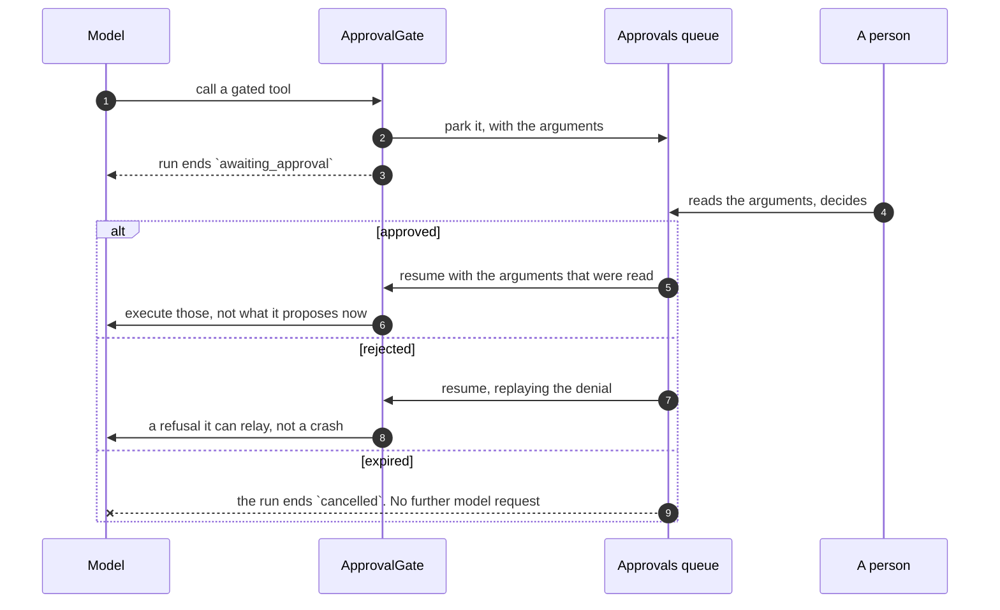

# Governance { #governance }

Budżety, zatwierdzenia, alerty i ślad audytowy. Cztery rzeczy, które sprawiają,
że za platformę agentową można ręczyć kartą kredytową.

Wszystkie działają identycznie na każdej powierzchni (surface), ponieważ każda
powierzchnia przechodzi przez jeden runner.

Najnowszą z tych powierzchni jest **trigger**: agent uruchamiający sam siebie
według harmonogramu albo na przychodzące zdarzenie — issue na GitHubie,
przychodzący e-mail (zobacz [Koncepcje](concepts.md#trigger)).

Nie zmienia on niczego z tego, co następuje dalej. Wydaje w ramach tych samych
dwóch limitów, parkuje na tej samej bramce zatwierdzeń — kierowanej do jego
twórcy, do członka, jako który działa, i do administratorów — i jest zapisywany
w tym samym śladzie audytowym.

Jedyne, co dokłada praca „bez nadzoru”, to co dzieje się z **odmową**:

- Odpalony run, który zatrzyma budżet, kończy się jako `budget_exceeded` i
  **czeka na kolejne odpalenie**, zamiast być ponawiany.
- Odpalony run, którego twórca nie może już wykonać — odszedł z organizacji albo
  stracił swój grant do agenta — **wyłącza trigger** i zapisuje wpis audytowy
  mówiący dlaczego.
- Odpalony run, który przewraca się na samym modelu — awaria providera,
  unieważniony klucz — zostaje zapisany jako `failed` i zostawiony do kolejnego
  odpalenia, zamiast wywracać heartbeat w ponawianie uderzeń w tę samą ścianę.
  `last_run_id` triggera dalej na niego wskazuje, żeby jego historia pozostała
  uczciwa.

Odmowa ponawiana przez heartbeat co minutę byłaby rachunkiem albo alertem, który
nigdy się nie kończy.

!!! warning "Czego nie połykamy: awarii, która nigdy nie stała się zapisem"

    Jeśli run osiągnął stan terminalny, ale zapis, który go rejestruje, nie
    został zacommitowany — zapis transkryptu albo stanu rozmowy, który podniósł
    wyjątek już po tym, jak odpowiedź była gotowa — odpalenie **wywraca flow**,
    zamiast raportować sukces. Run zapisany do połowy zostaje wycofany, zamiast
    zostać zacommitowany jako ukończony, choć nic za nim nie stoi.

Trigger zdarzeniowy dokłada na swojej krawędzi jeszcze jedną odmowę: webhook,
którego podpis nie weryfikuje się względem własnego sekretu triggera, to 403,
które w ogóle nie dociera do runnera.

## Budżety { #budgets }

!!! abstract "Dwa poziomy, i nie są to warianty jednej liczby"

    Limit agenta mierzony względem sumy całej organizacji wyczerpują runy jego
    sąsiadów; limit organizacji mierzony względem jednego agenta nie jest żadnym
    pułapem. Zobacz [dlaczego nie da się ich zwinąć w jedno](#why-they-cannot-be-collapsed).

| Poziom | Ustawiany w | Mierzy | Podnosi |
|---|---|---|---|
| **Miesięczny agenta** | spec agenta | runy tego agenta | ten, kto może edytować agenta |
| **Miesięczny organizacji** | ustawienia organizacji | każdy run *oraz* ingestię w organizacji | ten, kto ma `budgets:manage` |

**Nowa organizacja startuje z już ustawionym pułapem organizacji** —
`DEFAULT_ORG_MONTHLY_BUDGET_USD` wdrożenia ([konfiguracja](configuration.md),
$100 zaraz po instalacji) — więc świeżego tenanta nie dzieli od niespodziewanego
rachunku jeden rozbiegany agent. Od tego momentu jest to zwykły limit:
edytowalny w wierszu organizacji i egzekwowany dokładnie tak samo jak ustawiony
ręcznie. Wdrożenie, które woli startować bez limitu, zostawia to ustawienie
puste; tak czy inaczej limit istniejącej organizacji nigdy nie jest z tego
powodu zmieniany.

### Dlaczego nie da się ich zwinąć w jedno { #why-they-cannot-be-collapsed }

Kiedyś dało się, przez `min()`, i wynik był błędny. Limit agenta mierzony
względem sumy całej organizacji wyczerpują runy jego sąsiadów, i dokładnie to
sprawia, że nie jest on limitem. Limit organizacji mierzony względem wydatków
jednego agenta nigdy by nie zawiązał.

Więc każdy limit mierzy własną wielkość, a wyszukiwanie podróżuje razem z
ograniczeniem. Agent za $5 pod pułapem $50 wiąże teraz wtedy, gdy *on sam* wydał
$5, a odmowa nazywa ten limit, który faktycznie zawiązał, zamiast wnioskować go
z tego, która z dwóch liczb była mniejsza.

Agent dalej nie może poluzować pułapu organizacji: wpis organizacji jest obecny
ze swoją własną liczbą niezależnie od tego, o co prosi spec, a wydatki agenta są
częścią wydatków organizacji — więc agent za $100 pod organizacją za $10 zostaje
zatrzymany na $10.

Oba limity są czytelne tam, gdzie są ich wydatki: limit organizacji w jej własnym
wierszu (`GET /orgs/{org_id}`), a limit każdego agenta jako `budget_monthly_usd`
na liście agentów — liczba z *opublikowanej* wersji, bo to ją egzekwuje runner, a
nie to, co akurat obiecuje draft. Karta zapasu na dashboardzie zestawia je z
`GET /spend`, więc zbliżający się limit widać, zanim w historii runów zacznie
pojawiać się `budget_exceeded`.

### Egzekwowanie odbywa się przed żądaniem { #enforcement-is-before-the-request }

!!! danger "Przed, a nie po"

    Sprawdzanie po fakcie oznacza, że żądanie, które złamało budżet, zostało już
    opłacone — a pętla może przekraczać limit o jedno drogie wywołanie za każdym
    razem.

!!! important "Nieudany run i tak zapisuje, ile wydał"

    Budżet, który ignoruje awarie, nie jest budżetem. Księgowanie dzieje się w
    bloku `finally` na każdej powierzchni, a commit jest jawny, a nie zostawiony
    kontekstowi sesji — ten wycofuje się przy każdym wyjątku i przy anulowaniu
    nie jest osiągany w ogóle.

!!! important "Punkt odniesienia to to, co wydały *inne* runy"

    Oba wyszukiwania pomijają wiersz pytającego runa. Wznowiony run zachowuje
    swój wiersz, a do tego czasu `finish_run` zacommitował już to, co wydał —
    podczas gdy rejestr jest ponownie zasiewany tą samą kwotą, i musi być, bo
    inaczej dokończenie kontynuacji nadpisałoby koszt tym, co kosztowała sama
    kontynuacja. Liczony w obu miejscach, agent z limitem $10, który wydał $6 i
    zaparkował, wracał z `6 + 6 = 12` przy pierwszym żądaniu do modelu i dostawał
    odmowę, mając $4 zapasu, mówiąc swojemu właścicielowi, że osiągnął limit,
    którego wykorzystał w 60%. Limit organizacji dubluje się identycznie.

Bramka jest twardym stopem dla runa, który *widzi* wydatki, a własny koszt runa
ląduje w jego wierszu dopiero wtedy, gdy run się kończy.

Więc punkt odniesienia, który run odczytuje, to suma runów już zakończonych, a
**równoległe runy są dla siebie nawzajem niewidzialne**. Pięćdziesiąt runów
startujących razem w organizacji będącej jedno wywołanie od swojego limitu
odczytuje ten sam punkt odniesienia poniżej limitu, każdy rusza dalej i razem
przekraczają limit nawet o swój łączny koszt.

To właściwość agregatu, który nie ma pojedynczego wiersza do zablokowania — w
przeciwieństwie do przekroczenia na run i na pętlę powyżej, które sprawdzenie
przed żądaniem faktycznie ogranicza. Dlatego limit jest pułapem na
**zacommitowane** wydatki, a nie bramką szeregującą jednoczesne runy.

Wdrożenie, które potrzebuje ścisłego limitu, przepuszcza swoich agentów przez
jedną kolejkę, zamiast równolegle.

### Run kosztuje więcej niż jego żądania do modelu { #a-run-costs-more-than-its-model-requests }

Wyszukiwanie w wiedzy najpierw osadza pytanie, zanim będzie mogło go użyć do
szukania, a to osadzanie jest księgowane na runa, który o nie poprosił. Usługa
osadzeń jest globalna dla procesu — obsługuje naraz każdy run i każde zadanie
ingestii — więc księguje na tym runie, który jest *aktualnie mierzony*, zamiast
przyjmować budżet jako argument.

Przez co licznik staje się czymś, o czym powierzchnia może zapomnieć, a
zapomnienie jest ciche: żadnego wyjątku i żadnego ostrzeżenia, po prostu run,
który raportuje mniej, niż wydał, i miesiąc organizacji, który tego nigdy nie
zobaczy. Dlatego licznik należy do przygotowanego runa, a nie do powierzchni.
Otwarcie go nie jest krokiem, o którym nowa powierzchnia musi wiedzieć, bo nie
ma sposobu, żeby wykonać przygotowanego agenta bez niego.

[Zarządzanie kontekstem](reference/capabilities.md#context-management) to ta
druga taka rzecz. Jego strategia podsumowująca zapisuje podsumowanie przez
agenta, którego buduje sama, więc to żądanie nie przechodzi przez żadną bramkę
budżetu; capability księguje to, co kosztowało, na tym samym liczniku. Bycie
*poza* bramką ma jedną konsekwencję, którą warto znać: wydatek zostaje zapisany,
a nie odrzucony, więc kompaktowanie przekraczające limit zatrzymuje run na
kolejnym żądaniu.

### Koszt, którego nie dało się zmierzyć, mówi o tym wprost { #a-cost-that-could-not-be-measured-says-so }

`genai-prices` nie zna każdego modelu. Gdy run trafia na taki, dla którego nie ma
wpisu, to żądanie jest księgowane na zero, a run zostaje oznaczony jako
`cost_is_partial` — suma jest zaniżona dokładnie o to, ile kosztowały tamte
żądania, a uczciwe jej odczytanie to **dolna granica**.

Ta flaga podróżuje teraz całą drogę w dół. Jest w wierszu runa, w wierszu
wiadomości, który zapisuje tura, i w sumie, którą raportuje rozmowa; każda
powierzchnia rysująca pieniądze rysuje przed nimi `≥` zamiast liczby, którą
czyta się jako dokładną. Null w wiadomości zapisanej, zanim kolumna istniała,
oznacza *nie zapisano*, co nie jest tym samym twierdzeniem co „dokładne” —
klient oznacza tylko to, co wie.

**Każda powierzchnia zapisuje to teraz, a każda tura zapisuje swój własny
udział.** Wiadomość zapisana przez kanał, API albo widget do niedawna nie niosła
żadnego kosztu, więc wątku na Slacku nie dało się zsumować. Zapisywana liczba to
*różnica* względem tego, co deklarują już wcześniejsze tury tego runa, a nie
liczba z wiersza runa: wiersz runa jest skumulowany, a run, który zaparkował i
został wznowiony, zapisuje dwie tury asystenta — ostemplowanie obu liczbą z
wiersza policzyłoby zaparkowaną połowę dwa razy. Wiadomości jednego runa sumują
się więc dokładnie do tego, co run deklaruje, że wydał.

**Tura, w połowie której run został zatrzymany, mówi o tym wprost.** Anulowany
run zostawia to, co agent zdążył napisać, gdy socket się zamknął albo wciśnięto
`stop`, a czyta się to dokładnie jak skończoną odpowiedź — więc czytelnik bierze
uciętą za wszystko, co agent miał do powiedzenia, a wydane pieniądze wyglądają,
jakby kupiły właśnie to. Transkrypt niesie status runa dla każdej tury, a czat to
zaznacza.

### Jak pełne jest okno kontekstu { #how-full-the-context-window-is }

Trzeci pułap, i ten, którego nikt nie widzi nadchodzącego. Budżet odmawia
komunikatem, z którym da się coś zrobić. Workspace odmawia zapisu. **Okno
kontekstu** zostaje odrzucone przez providera, w środku odpowiedzi, a run po
prostu się wywraca.

Dlatego każdy agent nosi wskaźnik — nie tylko ten, który ma podpięte
[zarządzanie kontekstem](reference/capabilities.md#context-management), bo
ostrzeżenie liczy się najbardziej dla agenta, który *nie* będzie kompaktował.
Raportuje on, ile tokenów niosło ostatnie żądanie tury, *po* ewentualnym
kompaktowaniu: odczyt spada, gdy kompaktowanie działa, bo mierzy to, co wyszło, a
nie to, co trzyma rozmowa.

Ta liczba to własne `input_tokens` providera, a nie oszacowanie historii.
Liczenie znaków nie widzi definicji narzędzi, a te są płatne przy każdym żądaniu
— tysiące tokenów u agenta z wiedzą, sandboksem i delegacją, czyli jedna trzecia
prawdziwej liczby brakująca dokładnie w momencie, w którym ta liczba ma
znaczenie.

**Licznik jest zapisywany na turze; udział procentowy nie.**

To, ile jest historii, przeżywa zmianę modelu. To, jaką częścią okna ona jest,
już nie — a czat pozwala przełączyć model między turami.

Historia o długości 500 000 tokenów to połowa modelu z kontekstem 1M i **390%**
modelu ze 128K, a to drugie to żądanie, które provider odrzuca wprost. Udział
zamrożony razem z odczytem dalej pokazywałby „50%”.

Dlatego mianownik jest rozstrzygany tam, gdzie znany jest wybór modelu, z okna
zapisanego w profilu modelu i ze stojącego za nim rejestru cen. Gdy żadne z nich
nie potrafi tego powiedzieć, **udział nie jest rysowany w ogóle** — procent
liczony względem założonego okna to zgadywanie podane jako pomiar.

Ta zmiana modelu jest też tym, do czego służy kompaktowanie. Jego progiem jest
**ułamek rozstrzygany na każde żądanie** względem modelu, do którego to żądanie
idzie, więc historia, która wygodnie mieściła się w starym oknie, zostaje
skompaktowana już przy następnej turze pod nowym — zanim żądanie wyjdzie, a nie
po tym, jak provider je odrzuci. Agent bez podpiętego kompaktowania ma zamiast
tego wskaźnik, i nic więcej.

**Próg mierzy to, co zmierzył provider.** Kotwiczy się na najnowszej odpowiedzi
niosącej zużycie od providera — `input_tokens` tamtego żądania policzyły
instrukcje, każdy schemat narzędzia i każdą wcześniejszą wiadomość — i szacuje
wyłącznie to, co pojawiło się po niej. Dlatego odtwarzana rozmowa niesie koszt
każdej odpowiedzi: bez kotwicy próg liczy znaki, a prawdziwy agent odczytał tu 9
tokenów tam, gdzie provider policzył 3859. Wskaźnik pokazywał 77%; próg nie
widział nic do zrobienia.

**Podsumowanie jest zachowywane.** Kompaktowanie przepisuje wiadomości jednego
runa; wątek między turami jest odbudowywany z transkryptu, więc podsumowanie
było kiedyś wyrzucane na granicy tury, a następna tura kupowała kolejne, nad
historią dłuższą o jedną turę — dwie kolejne tury prawdziwej rozmowy zapłaciły
tu każda za podsumowanie tych samych pięciu wiadomości, a drugie ogłosiło, że
podsumowuje dziewięć. Dlatego skompaktowana historia jest zapisywana do rozmowy
razem z tym, jak daleko sięga, a następna tura startuje od niej i odtwarza tylko
to, co powiedziano od tamtej pory. Ponowne otwarcie wątku zastaje to samo, co
widzi model.

Zachowywane jest tylko podsumowanie. Odrzucenie najstarszych wiadomości i
wyczyszczenie wyników narzędzi nic nie kosztują przy powtórzeniu, a zapisanie ich
utrwaliłoby stratę, która dziś jest rozważana na nowo względem okna przy każdej
turze.

Jedno ustawienie nie może zadziałać i mówi o tym, zamiast działać. Gdy same
instrukcje i schematy narzędzi przekraczają próg, żadne podsumowanie nie zejdzie
poniżej niego — nie ma ich w historii do podsumowania. Każde żądanie kupowałoby
wtedy podsumowanie, które nic nie zmienia. Kompaktowanie jest pomijane, czat mówi
dlaczego, a naprawa należy do autora: większe okno albo wyższy ułamek.

Ta odmowa opiera się na liczbie, którą produkuje *odpowiedź*, więc tura nie może
zmierzyć swojej własnej, zanim musi zdecydować — a tura czatu to zwykle jedno
żądanie. Rozmowa niesie ostatni odczyt, a run od niego startuje. Pierwsza tura
wątku nie ma się więc na czym oprzeć i kompaktuje zgodnie z konfiguracją; od
drugiej odmowa jest dostępna. Odrzucane są tylko te strategie, które coś kupują:
odrzucanie najstarszych wiadomości i czyszczenie wyników narzędzi nie wołają
modelu, więc działają niezależnie od tego, jakie jest okno.

### Delegacja wydaje z budżetu rodzica { #delegation-spends-the-parents-budget }

Run może zawierać całą rozmowę innego agenta — zobacz
[delegat kontra wbudowany specjalista](concepts.md#delegate-vs-inline-specialist).
Jeden run ma **jeden rejestr wydatków** i każdy delegat zapisuje do niego. To
właśnie sprawia, że limit rodzica widzi wydatki delegacji przed swoim kolejnym
żądaniem do modelu, dokładnie w momencie, w którym delegacja zwielokrotnia to,
ile może kosztować tura. Każdy wpis jest ostemplowany delegacją, która go
zaksięgowała, i to dzięki temu jeden rejestr dalej odpowiada na pytanie „ile
kosztował *ten* delegat” — zobacz niżej.

Wynika z tego, że **limity, które wiążą wewnątrz delegacji, to limity rodzica**.
Własny `budget.monthly_usd` delegata nie jest egzekwowany w trakcie runa rodzica:
dwie bramki mierzące jeden rejestr liczyłyby każde żądanie podwójnie, a pułap,
który ma znaczenie, to ten na runie, który ktoś uruchomił. Własny limit delegata
dalej rządzi runami *samego delegata*.

Każdy delegat wycenia jednak własne żądania, bo bramka wycenia to, co zapisuje:
delegat na Anthropic mierzony przez bramkę zbudowaną dla OpenAI byłby wyceniany
według złego katalogu — po cichu i zwykle jako niewyceniony.

Istnieją trzy dalsze pułapy, bo budżet jest kiepskim sposobem na zatrzymanie
fan-outu — orientuje się dopiero wtedy, gdy pieniądze już poszły. `max_depth`
ogranicza zagnieżdżenie, `max_fanout` ogranicza, ile delegacji działa naraz, a
własne `max_steps` każdego delegata ogranicza jego pętlę. Zobacz
[capability `subagents`](reference/capabilities.md#delegation).

Dwa z tych trzech należą do samego delegata, i to jest granica, której budżet nie
przekracza: `max_steps` jest odczytywane ze speca delegata, a jego `max_depth`
ogranicza, jak głęboko *on* może zejść, niezależnie od tego, ile miejsca zostało
jego wołającemu. Limit na wydatki jest limitem na run, który ktoś uruchomił;
limit na zagnieżdżenie to decyzja podjęta przez autora delegata i przeczytana
przez jego recenzentów, więc wołający nie może jej poszerzyć.

### Jako co zapisywany jest zdelegowany run { #what-a-delegated-run-is-recorded-as }

Delegacja do **opublikowanego** agenta dostaje własny wiersz w `agent_runs`,
niosący `parent_run_id` i id zadania delegacji. **Wbudowany specjalista** nie
dostaje żadnego: nie ma agenta, któremu można by go przypisać, więc jego koszt
należy do *runa*, a zapisem jest wywołanie narzędzia w transkrypcie.

Tylko którego runa — na to pytanie odpowiedziało
[#228](https://github.com/vstorm-co/agenticos/issues/228).

- Specjalista bezpośrednio pod własnym agentem runa księguje się na **wiersz
  najwyższego poziomu**, który i tak jest całym rejestrem.
- Specjalista pod **opublikowanym delegatem** księguje się na wiersz *tego
  delegata*, a nie na ten najwyższego poziomu — więc miesiąc delegata zawiera to,
  co wydał jego specjalista, i to jedyne miejsce, w którym mogłoby to uczciwie
  wylądować.

Każdy wpis w rejestrze niesie więc dwa przypisania: delegację, która go wykonała,
dla panelu, oraz najbliższy wiersz agenta, na który się księguje, dla miesiąca.

Oba są równe przy każdym żądaniu, które opublikowany delegat wykonuje na własny
rachunek, a rozjeżdżają się tylko pod wbudowanym specjalistą — którego panel
zachowuje własny udział, podczas gdy jego wydatki trafiają do wiersza przodka.

!!! important "Wiersz rodzica jest źródłem prawdy; wiersz dziecka to jego udział w nim"

    Delegat wydaje do wspólnego rejestru, a **każdy wpis w tym rejestrze niesie
    delegację, która go wykonała**. Koszt delegacji to suma jej własnych wpisów —
    żądań wystawionych przez jej własnego agenta, wycenionych raz, przez to samo
    wyszukiwanie, którego używa suma runa. Jest dokładny w obu trybach i na
    każdej głębokości, i nie zależy od tego, kiedy akurat delegacja została
    rozliczona.

    Kiedyś zależał dokładnie od tego i były to dwie usterki. Liczba była
    *przyrostem* wspólnej sumy w trakcie delegacji, więc delegacja w tle —
    rozliczana przy kolejnym odpytaniu, które może nastąpić po tym, jak rodzic
    już odpowiedział — wchłaniała wszystko, co rodzic wydał w międzyczasie:
    delegat, który wydał $0,01, był zapisywany jako $0,51, jeśli rodzic wydał
    potem $0,50. A delegat, który deleguje dalej, miał wydatki własnych delegatów
    wewnątrz swojego okna, a ich wiersze zapisują je ponownie, więc jego suma
    miesięczna liczyła jego wnuki.

    Rozdzielenie tego na rejestr *na agenta* to wciąż projekt, którego należy
    unikać — to właśnie on sprawia, że limit rodzica w ogóle przestaje wiązać.
    Jeden rejestr z przypisaniami zachowuje obie właściwości: limit rodzica widzi
    każde żądanie przed kolejnym, a każdy zdelegowany wiersz mówi, ile wydał ten
    jeden agent, wliczając jego własnych wbudowanych specjalistów i wyłączając
    jego opublikowanych delegatów.

    Wiersz rodzica pozostaje źródłem prawdy dla runa. Jego `cost_usd` to cały
    rejestr, z delegatami włącznie, i to nim obciążana jest organizacja; wiersze
    dzieci dzielą te same pieniądze według agenta i nigdy do nich nie dodają.
    `cost_is_partial` jest również per wiersz: rodzic na modelu, którego
    `genai-prices` nie zna, czyni sumę rodzica dolną granicą i nie mówi nic o
    delegacie, który działał na modelu wycenionym.

    `started_at` i `ended_at` zdelegowanego wiersza to **własny** przedział
    delegacji, odczytany z uchwytu zadania, który biblioteka stempluje, gdy
    delegat startuje i gdy kończy — a nie moment rozliczenia wiersza. Liczona od
    rozliczenia, delegacja w tle czytała się jako run o zerowym czasie trwania w
    złym momencie, uszeregowany po pracy, która skończyła się przed nią; dwie,
    które naprawdę na siebie zachodziły, były zapisywane w tej samej chwili i nic
    nie mówiło, że tak było. Terminalny uchwyt z końcem, ale bez startu — delegat
    anulowany albo przewrócony, zanim zaczął się wykonywać — zapisuje przedział o
    zerowej długości w tym końcu, nigdy null; a tam, gdzie biblioteka odmawia,
    zanim uchwyt w ogóle powstanie — nieznane `chat_trace_id` — żaden zdelegowany
    wiersz nie jest zapisywany. Delegacja, która zaparkowała na zatwierdzeniu,
    rozciąga się na każdą turę, w której działała: jej najwcześniejszy start jest
    przenoszony przez parkowanie tak samo jak jej koszt (niżej), więc wiersz
    zaczyna się wtedy, gdy delegat zaczął po raz pierwszy, i kończy się wtedy, gdy
    skończył naprawdę — a nie przy wznowieniu, które go rozliczyło. Nie są one
    sumowane tak jak koszt; uczciwą odpowiedzią jest start pierwszego segmentu i
    koniec ostatniego.

**Delegacja, która zaparkowała na zatwierdzeniu, to więcej niż jeden udział.**
Jej tury działały w różnych procesach, na różnych rejestrach, a rejestr
wznowionej tury to świeży obiekt, który nie trzyma niczego sprzed parkowania —
więc wiersz dziecka zapisuje wszystkie segmenty dodane do siebie: stan
zaparkowany zachowuje to, ile delegacja kosztowała, gdy się zatrzymała, a tura,
która ją kończy, dokłada własny udział. Zapisywany jest jeden wiersz, raz, przez
turę, w której delegacja się kończy — delegat, który zaparkował dwa razy,
zostawia trzy segmenty i jeden wiersz.

`cost_is_partial` jest przenoszona tak samo, i z powodu, którego pieniądze nie
dzielą: jest teraz per wiersz, a nie per run, więc delegat, który wykonał
niewycenione żądanie *przed* zatwierdzeniem i wznowił się na wycenionym modelu,
inaczej deklarowałby w swoim wierszu dokładny koszt. Flaga jest prawdziwa, jeśli
była prawdziwa dla któregokolwiek segmentu.

Warto to powiedzieć, bo awaria, którą to zastępuje, była niewidzialna. Wiersz
trzymał kiedyś tylko to, co delegat wydał *po* ostatnim wznowieniu, co przy
zwykłym kształcie — wykonaj pracę, potem poproś o pozwolenie na działanie na jej
wyniku — jest tą mniejszą połową. Nic nie przestawało się zgadzać, bo pieniądze
przez cały czas były w wierszu rodzica; błędna była każda liczba odpowiadająca na
pytanie „ile kosztował ten delegat”.

Wiersz dziecka jest tym, co czyni odpowiadalnymi dwa różne pytania, a każde chce
przeciwnej arytmetyki:

| Pytanie | Wiersze dzieci |
|---|---|
| **Ile jest winna organizacja?** | **wyłączone** — wiersz rodzica zawiera już te tokeny, więc liczenie obu obciąża organizację dwa razy za jedno żądanie |
| **Ile kosztował *ten agent* w tym miesiącu?** | **włączone** — wiersze delegata to jedyne miejsce, w którym zapisane są jego własne wydatki, a każdy z nich trzyma własne żądania tego agenta i żądania jego wbudowanych specjalistów ([#228](https://github.com/vstorm-co/agenticos/issues/228)), ale nie jego opublikowanych delegatów, którzy mają własne wiersze |

To drugie sprawia, że na pytanie „ile researcher kosztował w tym miesiącu” da się
odpowiedzieć $40, i to na nim odpalają się raport użycia per agent albo alert
budżetowy na tym agencie. Miesięczna liczba organizacji niesie też wydatki na
ingestię, czego liczba per agent nie robi: indeksowanie współdzielonej bazy
wiedzy nie jest wydatkiem niczyjego agenta.

Przewrócony wiersz dziecka podlega też regule rodzica o tym, co może mówić
`error`. Pod delegatem podnosi się klient modelu, którego komunikat może nieść
URL nieudanego żądania — z kluczem włącznie, na własnym endpoincie — więc wiersz
i zamykająca ramka delegacji przechowują to samo kontrolowane zdanie co wiersz
rodzica, a własny tekst providera trafia do logu serwera. Delegat zatrzymany
przez swój limit użycia albo przez pułap budżetu zachowuje komunikat limitu w
całości: to pułap wykonujący swoją pracę, a nie awaria do zdiagnozowania.

Reguła sięga też transkryptu *rodzica*. Gdy agent deleguje w tle, odpytuje
`check_task` i `wait_tasks` o wynik, a to, co one odpowiadają, staje się wierszem
wywołania narzędzia w rozmowie — przechowywanym w całości, bo zwrot z narzędzia
jest własną odpowiedzią narzędzia, a nie czymś, co ta platforma ułożyła. Dlatego
nazywają one klasę wyjątku, zamiast powtarzać komunikat providera, co zapewnia
`subagents-pydantic-ai` 0.2.20 i co jest powodem, dla którego to właśnie ta
wersja jest wersją minimalną.

**Okienkowa liczba na dashboardzie też to niesie.** `GET /stats/usage` odpowiada
blokiem `cost` dla dowolnego okresu wybranego filtrem, a ten blok to runy *plus*
ingestia — ta sama arytmetyka, którą mierzy się limit miesięczny — z `model_usd`
i `ingestion_usd` obok, żeby czytelnik widział, gdzie poszły pieniądze, bez
odejmowania. Do 0.0.152 raportował samą połowę modelową, co stawiało na jednej
karcie dwie różne definicje kosztu: nagłówek poruszał się z filtrem okresu i
liczył runy, podczas gdy linia od początku miesiąca pod nim liczyła cały
rachunek, i nic nie mówiło, że odpowiadają one na różne pytania. Na wdrożeniu,
które indeksuje dokumenty, po prostu się nie zgadzały.

Przy `scope=own` połowa ingestii jest zerem, a nie udziałem: dokument jest
indeksowany przez workera, a `ingestion_spend` nie zapisuje żadnego użytkownika,
więc obciążenie okna jednej osoby za kolekcję zsynchronizowaną przez kogoś innego
byłoby wymyślaniem jej wydatków.

**Każde zapytanie musi powiedzieć, na które z dwóch pytań odpowiada**, a domyślna
jest pierwsza kolumna. Liczba od początku miesiąca i stojący za nią rozkład per
agent wyłączają wiersze dzieci, więc sumują się do sumy wypisanej nad nimi — a
e-mail organizacji o użyciu raportuje tę samą sumę, a nie sumę jednego z nich.
Włączają je tylko pytania zadane *o jednego agenta*. Trzy z tych pięciu zapytań
trafiły na produkcję bez tego rozróżnienia i każde raportowało $1,40 za $1,00
pracy; jeśli dochodzi nowe, domyślne jest to bezpieczne.

#### Dwa pytania o dostawcę potrzebują trzeciej odpowiedzi { #the-two-vendor-questions-need-a-third-answer }

**By provider** i **By key** nie mogą użyć żadnej z tych kolumn, a pomyłka w tym
miejscu jest na ekranie niewidoczna. Wyłączenie wierszy dzieci sumuje poprawnie,
ale przypisuje pieniądze delegata dostawcy *rodzica*, bo to jest provider w
sumowanym wierszu: orkiestrator na OpenAI delegujący pracę za $0,40 agentowi na
Anthropic raportował `openai $1.00` i ani jednego wiersza Anthropic. Włączenie
ich raportowało `openai $1.00` + `anthropic $0.40` — więcej niż rachunek.

Dlatego te dwa sumują **własne** wydatki każdego runa: jego koszt pomniejszony o
koszty jego bezpośrednich delegacji. `openai $0.60` + `anthropic $0.40`, co jest
i właściwym przypisaniem, i właściwą sumą. Zagnieżdża się to — delegat, który
delegował dalej, ma swoje wnuki odjęte przez siebie, raz — a zsumowane po każdym
wierszu dalej daje rachunek, bo koszt każdego dziecka jest dodawany przez jego
własny wiersz i usuwany przez wiersz jego rodzica. Klucz działa tak samo i znaczy
więcej: to klucz ktoś rotuje, gdy rachunek wygląda źle.

### Co pokazuje historia runów { #what-run-history-shows }

**`GET /runs` wypisuje wyłącznie runy najwyższego poziomu, a jego `total` liczy
właśnie je.** Ta sama wartość domyślna co przy miesięcznej sumie organizacji i z
tego samego powodu: przeplecionych, tych dwóch rodzajów wierszy nie da się czytać
w jednej kolumnie kosztu. Fan-out trzech delegacji to jeden run kosztujący $1,00
na stronie i $1,00 na rachunku; wypisane razem były to cztery wiersze pokazujące
$1,00 + $0,40 + $0,40 + $0,40 obok liczby $1,00 od początku miesiąca, i obie
połowy miały rację, tylko o czym innym.

Lista przyjmuje tę samą dwustronną arytmetykę co sumy powyżej i z tego samego
powodu — więc powierzchnia zawężona do jednego agenta pokazuje, co zrobił *ten
agent*, wraz z pracą delegatów:

| Pytanie | Odpowiedź |
|---|---|
| `GET /runs` | Runy, które ktoś uruchomił. `parent_run_id IS NULL` |
| `GET /runs?agent_id=<id>&include_delegations=true` | Własna historia jednego agenta. O to pytają panel Recent runs w Builderze i `?agent=` na Activity, bo wiersze delegata to jedyny zapis tego, co on sam zrobił |
| `GET /runs?parent_run_id=<id>` | Co ten run zdelegował — zapytanie, dla którego istnieje `agent_runs_parent_run_id_idx`. Ma pierwszeństwo przed `include_delegations` |
| `GET /runs/<id>` | Jeden run, zdelegowany albo nie. Tu ląduje link z transkryptu |
| `GET /runs/<id>/transcript` | Tury tego runa, po kolei — to, co widok szczegółów runa rysuje jako kroki. Autoryzowane, nie posiadane (niżej) |

**Czytanie runa jest autoryzowane, nie własnościowe.**

Współpracownik mający `runs:view` czyta run uruchomiony przez kogoś innego.
Władza nad runem należy do organizacji, bo run jest tym, czym organizacja jest
obciążana i z czego jest rozliczana — a nie prywatną własnością tego, kto
nacisnął start.

Dlatego decyzja mieszka w serwisie, a nie w bramce na route: najpierw rozstrzyga
run względem organizacji wołającego, a potem sprawdza `runs:view`.

Trzy konsekwencje:

- Run w **innym tenancie czyta się jako nieobecny** — to samo 404, którym
  odpowiada id, które nigdy nie istniało, co do treści ciała włącznie — więc
  odpowiedzi nie da się użyć do odkrycia, że run istnieje.
- Run, który działał **bez rozmowy** (wywołanie API, które nie przekazało
  `conversation_id`), nie ma transkryptu do przeczytania i mówi o tym nullowym
  `conversation_id`, a nie pustą listą, którą czytałoby się jako „nic nie
  zrobił”.
- Nic z tego nie poszerza `GET /conversations/{id}/messages`, które pozostaje
  **zawężone do właściciela**. To, że transkrypt runa jest czytelny dla
  współpracownika, nie może uczynić czytelnym również prywatnego wątku, w którym
  ten run siedzi.

**Każda tura, którą podaje transkrypt, niesie oceny, jakie ludzie na niej
zostawili** — własny kciuk czytającego wołającego, polubienia i niepolubienia
organizacji oraz komentarz z najnowszej oceny negatywnej.

Zwykły wiersz wiadomości nie trzyma żadnej z tych rzeczy, więc są one czytane z
`message_ratings` jedną paczką i doczepiane do tur. Tura, której nikt nie ocenił,
niesie je puste i czyta się dokładnie tak jak zwykła wiadomość.

To właśnie pozwala widokowi szczegółów runa pokazać odpowiedzi ocenione
negatywnie i słowa zostawione przy nich — rozmowy stojące za liczbą jakości na
dashboardzie (#209) — czytane tam, gdzie czytany jest run, a nie wyłącznie w
eksporcie ocen dla administratora aplikacji.

Pokazywany komentarz pochodzi z oceny **negatywnej**, nigdy z pozytywnej, i jest
najnowszy, gdy tura ściągnęła więcej niż jeden sprzeciw.

### Co pokazują agregaty na dashboardzie { #what-the-dashboards-aggregates-show }

`GET /stats/usage` przyjmuje te same dwie strony i tę samą wartość domyślną.
Złożona odpowiedź jest pytaniem organizacji, więc każdy blok w niej liczy
wyłącznie wiersze najwyższego poziomu: koszt okresu i jego rozbicie na providerów
(podwójny rachunek powyżej), ale też sumę runów, szereg dzienny, rozbicie
wyników, powierzchnie, percentyle opóźnień, liczbę aktywnych osób i tabelę per
osoba. Poza kosztem zdelegowany wiersz *kopiuje* `user_id` i `surface` swojego
rodzica, więc policzenie go dodatkowo wymyśliłoby drugą osobę i drugie wejście na
kanał, z którego ktoś skorzystał raz.

Dwa agregaty biorą drugą stronę i oba są pytaniami o jednego agenta:

| Pytanie | Wiersze dzieci |
|---|---|
| `by_agent` — karta adopcji | **włączone.** Bez nich agent, który działa czterysta razy dziennie jako czyjś delegat, nie ma żadnego wiersza, a karta nazywa każdego opublikowanego agenta bez wiersza zapomnianym i proponuje jego zarchiwizowanie. Jej słupki mogą więc przekraczać sumę runów obok nich; nic ich nie sumuje |
| `?group_by=version` — karta porównania wersji | **włączone.** Specjalista, który wykonuje się wyłącznie jako delegat, inaczej nie miałby czego porównywać między swoimi wersjami |

Niezmiennik, który przeżywa w obu wariantach: segmenty pierścienia wyników dalej
sumują się do `total_runs`, a jego segment `awaiting_approval` dalej liczy te
same zaparkowane runy co karta zatwierdzeń, bo te trzy rzeczy pochodzą z tej
samej strony przełącznika.

Jedynym zapytaniem bez żadnego filtra delegacji jest liczba runów wołającego
zaparkowanych na decyzji. Zaparkowane dziecko to zablokowany rodzic, a ta karta
odpowiada na pytanie „dlaczego mój agent nie kończy”; dziś nic to nie zmienia, bo
delegacja jest zapisywana do bazy już jako zakończona i dlatego nigdy nie
parkuje.

Ostatnie dwa to `?run=<id>` na stronie Activity: jeden run, delegacje pod nim,
każda z plakietką id zadania, które niosły jej ramki `subagent_*`, oraz link w
górę do runa, na który delegacja została zaksięgowana. Panel delegacji w czacie
linkuje tam z `run_id`, które niesie jego ramka terminalna — i właśnie dlatego ta
ramka je niesie. Zagnieżdżanie zdelegowanych wierszy wewnątrz tabeli najwyższego
poziomu celowo *nie* jest tutaj robione; prymityw tabeli współdzielony przez cały
produkt jest [proponowany osobno](https://github.com/vstorm-co/agenticos/issues/139),
i zagnieżdżanie należy do niego, a nie do jednej szytej na miarę tabeli runów.

### Co pokazuje ekran kosztów { #what-the-cost-screen-shows }

`GET /spend` przyjmuje swoje okno na dwa sposoby, bo strona pyta o oba rodzaje:
`days` dla presetów *ostatnich N dni* oraz `from`/`to` dla *tego miesiąca*,
*poprzedniego miesiąca* i zakresu z kalendarza. Gdy przychodzą oba, wygrywa
`from` — jawny zakres jest bardziej konkretnym żądaniem niż wartość domyślna,
której nikt nie zmienił — a `period_days` wraca wtedy jako null, zamiast
powtarzać liczbę, której zakres przeczy.

**Każdy panel na tym ekranie czyta to samo okno.** Wiersze per agent, By provider
i By key biorą rozstrzygnięte `since`/`until`, a nie własną liczbę dni, więc dwie
liczby obok siebie nie mogą skończyć jako opis różnych runów. To ta sama usterka,
którą #198 nazywa jeden panel wyżej.

**Wartość od początku miesiąca ignoruje to okno całkowicie**, tak samo jak każdy
limit per agent mierzony względem niej. Miesięczny pułap porównany z kroczącymi
siedmioma dniami czyta się jako wykorzystany w 20% w dniu, w którym limit został
faktycznie osiągnięty.

Każdy wiersz per agent niesie **dwie liczby kosztu pod dwiema różnymi nazwami**,
co jest regułą tej strony na całej jej długości:

| | |
|---|---|
| `cost_usd` | Jego udział w oknie, **wyłącznie runy najwyższego poziomu**, więc kolumna sumuje się do sumy nad nią |
| `month_to_date_usd` | Jego **własny** miesiąc kalendarzowy, ze zdelegowanymi wierszami **włącznie** — wydatki, na które `monthly_cap_usd` jest limitem. Nie sumuje się do miesiąca organizacji i nie jest rysowany, jakby się sumował |

`partial_run_count` mówi, ile z tego wszystkiego jest faktem: ilu **runów
najwyższego poziomu** w oknie nie dało się w pełni wycenić, więc koszt jest dolną
granicą dokładnie o tyle. *„3 z 40 runów nie dało się wycenić”* to coś, z czym
czytelnik może coś zrobić; liczba z doklejonym plusem — nie.

Run liczy się wtedy, gdy którykolwiek model w jego drzewie nie miał ceny, **z
modelami jego delegatów włącznie** — drzewo dzieli jeden rejestr wydatków, więc
niewyceniony delegat czyni dolną granicą także wiersz rodzica. To pozwala jednej
liczbie rządzić wszystkimi trzema rozbiciami: By provider i By key sumują własne
wydatki każdego wiersza, wraz ze zdelegowanymi, a dolna granica w którymkolwiek z
nich jest oznaczana przez licznik, który nigdy nie zajrzał do wiersza, który ją
powoduje. **Mierzy** on By agent, które liczy te same wiersze najwyższego
poziomu, a pozostałe dwa tylko **oznacza** — liczy drzewa, więc jeden rodzic z
trzema niewycenionymi delegatami pokazuje `1`, podczas gdy trzy liczby pod nim są
dolną granicą.

Drzewo, które **stoi okrakiem na początku okna** — wiersz delegata w środku,
wiersz jego rodzica przed nim — jest liczone przez delegata: wiersz rodzica,
który inaczej niósłby to oznaczenie, jest poza każdym agregatem na tej stronie,
podczas gdy własne wydatki delegata są wewnątrz obu rozbić. Ląduje to na agencie,
jako który działał delegat, raz na każde okraczające drzewo, niezależnie od tego,
ile delegacji przekroczyło krawędź, i tylko wtedy, gdy własne żądania delegata
były niewycenione — wyceniona delegacja pod niewycenionym rodzicem spoza okna nie
podnosi żadnego zastrzeżenia, bo pieniądze samego okna są dokładne
([#620](https://github.com/vstorm-co/agenticos/issues/620)).

Wiersz jest **jeden na agenta**, z `agent_name` na nim. Kiedyś był jeden na
agenta *i model*, niosąc tylko `model_label` — więc zakładka wypisywała nazwy
modeli tam, gdzie czytelnik spodziewa się agenta, i dzieliła jednego agenta na
dwa wiersze za to, że odpowiadał na dwóch modelach. Kształt per model przetrwał
tam, gdzie jest zadawanym pytaniem: e-mail o użyciu dalej grupuje w ten sposób.

**Kto to wydał to czwarte rozbicie**, pod By provider, By key i By agent — to,
które odpowiada ludźmi, a nie dostawcami czy agentami.

Czyta te same wiersze `group_by=user` co tabela adopcji na dashboardzie —
wyłącznie runy najwyższego poziomu, od najbardziej zajętych — więc koszt delegata
ląduje raz, wewnątrz runa, który go uruchomił. I obejmuje to okno, które pokazuje
reszta zakładki, a nie własną kroczącą wartość domyślną.

Nazywanie ludzi z organizacji to ta sama decyzja, którą podejmuje karta na
dashboardzie, więc obejmuje ją ta sama bramka: `runs:view`, które mają builder i
operator, a także obie role zarządcze, i mówi o tym własny tekst tej karty.

Wołający bez `runs:view` jej nie widzi. Karty nie ma i jej pytanie nigdy nie
zostaje zadane, zamiast żądania, które wraca odrzucone.

### Zawężanie kolejki zatwierdzeń { #narrowing-the-approvals-queue }

`GET /approvals` podaje dwa widoki tych samych wierszy. Domyślnie tylko
oczekujące, czyli kolejkę, na której ktoś działa; `?status=approved&status=rejected`
to zapis tego, co zostało rozstrzygnięte, i niesie nazwisko decydenta oraz jego
notatkę, bo sam UUID nie jest śladem odpowiedzialności. Na rozstrzygniętym
wierszu celowo nie ma żadnych kontrolek.

| Parametr | |
|---|---|
| `status` | Powtarzalny. Brak oznacza oczekujące — kolejkę |
| `triggered_by_user_id` | Czyje runy zaparkowały to wywołanie. Odczytywane z `agent_runs`: zatwierdzenie należy do runa, a run należy do osoby |
| `created_from`, `created_to` | Kiedy wywołanie zostało zaparkowane, włącznie z obiema granicami |
| `oldest_first` | Domyślnie true, i ta wartość domyślna jest nośna — zobacz wyżej: nic nie wypycha wywołania z kolejki z powodu wieku, więc sortowanie od najnowszych pogrzebałoby wiersz, który najbardziej potrzebuje zobaczenia |

Każdy wiersz nazywa trzy rzeczy, które mieszkają w innych tabelach — agenta,
osobę, której run zaparkował to wywołanie, i osobę, która rozstrzygnęła. Agent i
run to inner joiny, bo oba klucze obce kaskadują, więc zatwierdzenie nie może
przeżyć żadnego z nich; dwie osoby to outer joiny, bo decyzja musi przeżyć
usunięcie konta decydenta, a odwiedzający widget jest anonimowy od samego
początku.

### Zawężanie historii runów { #narrowing-run-history }

| Parametr | |
|---|---|
| `status` | Powtarzalny. `?status=failed&status=budget_exceeded` to zapytanie „pokaż mi problemy”, a te dwa są osobnymi statusami właśnie po to, żeby pytanie o jeden nie było pytaniem o drugi |
| `surface` | Skąd przyszedł run |
| `user_id` | Jako **kto** run działał, co nie zawsze jest tym, kto zapytał — runy widgetu niosą tożsamość właściciela widgetu, bo odwiedzający jest anonimowy |
| `model_label` | Model **tak, jak zapisał go run**, dopasowywany dokładnie. Nierozstrzygany przez katalog modeli: kolumna jest tym, co odpowiedziało, a profil, z którego pochodziła, mógł od tego czasu zostać przemianowany albo usunięty. Karta modeli na dashboardzie liczy te same ciągi znaków, więc „runy stojące za tym słupkiem” to jeden zbiór na obu ekranach |
| `started_from`, `started_to` | Włącznie z obiema granicami, bo wybierak zakresu podaje całe dni |
| `environment_id` | Runy na wersji, którą przypina to środowisko. **Nigdy zdelegowany run:** wersja delegata pochodzi z przypięcia, więc kolumna celowo nigdy nie jest na nim zapisywana, a zawężenie do `production` odrzuca każdą delegację. Powierzchnia, która włącza delegacje, musi to powiedzieć |
| `exposure_id` | Runy wpuszczone przez jedno powiązanie. Null dla dashboardu i dla API |
| `agent_version_id` | Runy, które wykonały jeden zamrożony spec — „pokaż mi wiersze stojące za tą liczbą” z paska wersji |
| `took_over_ms` | Tylko runy wolniejsze niż to. Run, który się nie skończył, nie ma czasu trwania i jest wykluczany, a nie liczony jako zero |
| `rated` | `down` albo `up` — runy, w których ktoś ocenił wiadomość wyprodukowaną przez ten run |
| `order_by`, `descending` | `started_at` (domyślnie, od najnowszych), `duration`, `cost` albo `tokens` |

**Każdy filtr zawęża licznik tak samo jak stronę**, więc `total` zawsze opisuje
wiersze pod sobą. Lista i licznik to dwa zapytania, a filtr docierający tylko do
jednego z nich czyta się jak błąd stronicowania, a nie jak brakująca klauzula.

`started_from` jest też tym, co czyni ten licznik uzgadnialnym z pieniędzmi obok
niego. Bez okna czyta *cały czas*, podczas gdy liczba wydatków czyta jeden
miesiąc kalendarzowy, więc trzyletnia organizacja pokazywała „8412 runów” obok
„$31,20”, a oczywisty odczyt tej pary mylił się o trzy lata. Liczba runów i
liczba wydatków na jednym ekranie dzielą jedno okno albo mówią, które okno
opisuje każda z nich.

Wartość spoza swojego typu zostaje odrzucona z kodem 422, zamiast być
dopasowywana do niczego: `status` i `surface` to kolumny tekstowe, więc
`?status=complete` odpowiedziałoby inaczej pustą stroną — a pusta strona czyta
się jako *w tym tygodniu nic się nie popsuło*. `order_by` przyjmuje jedno z
czterech uporządkowań, a nie nazwę kolumny, z tego samego powodu plus jeszcze
jednego: `ORDER BY` składane z query stringa to powierzchnia do wstrzyknięcia.

**Każdy z nich podróżuje w URL-u**, i to właśnie pozwala karcie na dashboardzie
przekazać czytelnika do swoich własnych wierszy:
`/runs?surface=mattermost&period=30d` otwiera Activity z już ustawionym filtrem i
z licznikiem zgodnym z kartą, która podlinkowała. Do #768 były stanem lokalnym,
więc liczba p95 była jedyną liczbą na dashboardzie, która potrafiła dosięgnąć
stojących za nią runów, a trzy karty nie niosły żadnego linku — nie było niczego
uczciwego, na co można by je skierować.

**W tym również tego, która zakładka jest otwarta.** `?tab=approvals` i
`?tab=spend` otwierają kolejkę i ekran kosztów; historia runów jest domyślna i
nigdy nie jest zapisywana.

To jest adres, którego potrzebuje link do *decyzji*, i powód, dla którego ten
parametr istnieje: „See all” na karcie zatwierdzeń i alert mówiący, że run jest
zaparkowany, musiały oba wskazywać na historię runów, gdzie niczego nie da się
rozstrzygnąć (#934).

Zakładka wskazana przez link jest **rozstrzygana względem tego, co czytelnik może
otworzyć**. `approvals` jest bramkowane przez `approvals:decide`, więc link,
który je niesie i trafia do kogoś bez tego uprawnienia, otwiera historię runów, a
nie pasek, którego wybrana zakładka nie ma treści.

Przełączenie zakładek zamyka otwarte szczegóły runa i zabiera ze sobą `?run=`.
Panel, który przeżywa zakładkę, która go otworzyła, siedzi obok kolejki, z którą
nie ma nic wspólnego — a poniżej `lg` zastępuje listę, więc pasek pozostawał
żywy, podczas gdy treść każdej zakładki była ukryta.

**Czas trwania jest liczony w SQL-u, na całym zawężonym zbiorze.**

To właśnie prowadzi od *„p95 to 14,8 s”* na dashboardzie do **tamtych runów**.
Sortowanie jednej strony dwudziestu pięciu wierszy sortuje zły zbiór, bo
najwolniejszego runa miesiąca nie ma w tych wierszach, które akurat zwróciła
strona od najnowszych. `cost` i `tokens` to ten sam układ dla pieniędzy i dla
wagi kontekstu.

Run bez `ended_at` sortuje się **jako ostatni w obu kierunkach we wszystkich
trzech**. Nie ma czasu trwania, nie jest też najszybszym runem, a jego liczby
kosztu i tokenów są zapisywane dopiero wtedy, gdy się kończy — sortowany tak, jak
jest przechowywany, wciąż trwający run czytałby się jako najtańszy i najlżejszy w
organizacji.

To, jak długo trwa *wciąż działający* run, jest osobnym pytaniem i żadne z tych
uporządkowań na nie nie odpowiada.

Activity pokazuje ten czas trwania na trzy sposoby i wszystkie trzy prowadzą do
tego samego zapytania:

- Nagłówek kolumny **Took** jest kontrolką sortowania — tak jak nagłówek Started
  obok niego i jak każdy sortowalny nagłówek w produkcie — więc kliknięcie
  porządkuje historię według `duration`, a nie według dwudziestu pięciu wierszy
  na ekranie.
- Gotowy widok **„slow runs”** to to sortowanie plus próg `took_over_ms` (30 s) w
  jednym kliknięciu. **„All runs”** zdejmuje oba, z powrotem do sortowania od
  najnowszych — w obrębie okna, które akurat jest widoczne, bo okno to osobna oś,
  ustawiana przez link p95 i przez zakres dat.
- **Liczba p95 na dashboardzie linkuje tutaj**, posortowana według czasu trwania
  w tym samym oknie: `?sort=duration` razem z `started_from` / `started_to`
  danego okresu.

Więc liczbę i stojące za nią runy dzieli jedno kliknięcie — reguła, którą reszta
tych dwóch stron już stosuje, i jeden wymiar, w którym tego nie robiły (#210).

**`rated=down` to kolejka o najwyższym sygnale** — odpowiedzi, o których
prawdziwi ludzie powiedzieli własnymi słowami, że są błędne. Ocena wisi na
wiadomości, więc ten join biegnie przez `messages.run_id`: dwa runy w jednej
rozmowie zachowują własne oceny, i dlatego ta kolumna istnieje zamiast okna
czasowego nad wątkiem. Jest to `EXISTS`, więc run, którego trzy osoby nie
polubiły, to jeden wiersz, a nie trzy; a run, który jedna osoba polubiła, a druga
nie, pasuje **do obu**: `up` i `down`, bo oba są o nim prawdziwe. Sprowadzenie
tego do jednego werdyktu na run wymyśliłoby konsensus, którego wiersze nie
zapisują.

Ten sam fakt jedzie na wierszu również bez filtra. `AgentRunRead.down_rated` jest
`true`, gdy ktokolwiek ocenił poniżej zera odpowiedź wyprodukowaną przez ten run,
liczone dla całej strony jednym zapytaniem, i to na tym historia runów rysuje 👎.
Jest ograniczone do organizacji wołającego jak każdy odczyt tutaj — run sąsiada,
oceniony negatywnie, nigdy nie jest oznaczany dla innego tenanta.

**Komentarz**, z którym zostawiono ten kciuk, czyta się w szczegółach runa
(`?run=<id>`), a nie w wierszu. To tekst napisany przez użytkownika o jednej
rozmowie, a umieszczenie go za szczegółami to celowa granica między znacznikiem,
który widzi każdy z `runs:view`, a słowami, które go wyjaśniają.

To ten join, dla którego zbudowano `rated=down`: dashboard mówi, że jakość spadła
o cztery punkty, a tutaj czyta się rozmowy, które to zrobiły.

Trend, który czyta dashboard, to `GET /api/v1/ratings/summary` (nagłówkowy
podział plus szereg dzienny): `scope=org` pod `runs:view`, `scope=own` dla
własnych rozmów członka, ta sama reguła zakresu i to samo słownictwo okien co w
`GET /stats/usage` (zobacz [Uprawnienia](permissions.md)). Same liczniki —
komentarze zostają za szczegółami runa, powyżej.

Trzy liczby Activity nad zakładkami pozostają liczbami organizacji, łącznie z
licznikiem runów, nawet gdy tabela pod nimi jest zawężona do jednego agenta.
Licznik per agent obok miesiąca organizacji byłby dwoma pytaniami pod jedną
etykietą — a to licznik per agent jest tym, który włącza delegacje.

**Osierocona delegacja jest raportowana bez swojego uchwytu.** `parent_run_id` ma
`ON DELETE SET NULL`, więc usunięcie rodzica zostawia wiersz, który poprawnie
zaczyna liczyć się do rachunku — ale klucz obcy potrafi wyzerować tylko własną
kolumnę, a przechowywany `subagent_task_id` nazywa wtedy transkrypt, który
odszedł razem z rodzicem. `AgentRunRead` zatrzymuje go zawsze, gdy
`parent_run_id` jest nullem, więc żadna powierzchnia nie oferuje uchwytu
delegacji, który nigdzie nie prowadzi.

### Eksport do CSV { #exporting-to-csv }

Wszystko, co pokazują te trzy zakładki, można zabrać z ekranu jako CSV: wiersze,
które ktoś uzgadnia z fakturą, przekazuje działowi finansów albo dołącza do
audytu. Strona, która potrafi odpowiedzieć na pytanie na ekranie, ale nie poza
nim, odsyła ludzi do bazy danych.

| Pytanie | Odpowiedź |
|---|---|
| `GET /runs/export` | Historia runów, te same filtry co `GET /runs` i to samo domyślne ograniczenie do najwyższego poziomu. `runs:view` |
| `GET /approvals/export` | Zapis zatwierdzeń, te same filtry co `GET /approvals`. `approvals:decide` |
| `GET /spend/export` | Rozbicie wydatków per agent, to samo okno co `GET /spend`. `runs:view` |

Eksport wydatków niesie tylko liczby z okna — `cost_usd`, `run_count` i
`partial_run_count`. `month_to_date_usd` i `monthly_cap_usd` z zakładki Spend są
z niego pominięte: czytają one miesiąc kalendarzowy, podczas gdy `cost_usd` czyta
okno eksportu, a dwie kolumny dolarowe na dwóch podstawach czasowych w jednym
pobranym pliku zostają zsumowane w poprzek przez czytelnika, który nie widzi
różnicy. Pobrany plik niesie jedną podstawę czasową — to okno, o które
poproszono.

Eksport jest odczytem masowym, a nie przyciskiem, i odpowiada na sześć pytań, na
które route'y listujące odpowiadać nie muszą:

- **Wielodostępność.** Każdy eksport niesie bramkę zakładki, z której pochodzi, a
  każdy odczyt jest zawężony do organizacji wołającego — wiersze sąsiada nigdy do
  niego nie docierają, łącznie z wierszem, którego wołający jest właścicielem w
  organizacji innej niż ta, z której pyta. Te dwa na `runs:view` stosują
  dodatkowo **dolną granicę `Scope.OWN` w zapytaniu**: wołający, którego
  `runs:view` sięga mniej niż całej organizacji, eksportuje wyłącznie własne
  wiersze, `WHERE user_id = <them>`, a `user_id`, które przekaże, zostaje
  nadpisane jego własnym, zamiast poszerzać zakres. Żadna wbudowana rola nie ma
  jeszcze `runs:view` poniżej `all`; ta granica jest na miejscu na czas, gdy
  zapadnie decyzja o zakresie dla member/viewer.
- **Rozmiar.** Eksport z natury nie ma pułapu, więc dostaje go z projektu.
  **Zakres dat jest obowiązkowy** — żądanie bez obu końców zostaje odrzucone — a
  dopasowanie jest **ograniczone do 10 000 wierszy**, powyżej czego żądanie
  zostaje odrzucone komunikatem nazywającym tę liczbę i mówiącym wołającemu, żeby
  zawęził zakres. Nigdy ciche obcięcie: przycięty CSV jest gorszy niż odrzucony,
  bo arkusz sumuje to, co do niego przyjdzie. To ograniczenie pozwala zbudować
  ciało odpowiedzi w jednym przebiegu i zacommitować wpis audytowy, zanim
  odpowiedź wyjdzie, zamiast strumieniować ją przez trzymane połączenie.
- **Koszt częściowy.** `cost_is_partial` ma własną kolumnę w eksporcie runów, a
  `partial_run_count` własną kolumnę w eksporcie wydatków, więc dolna granica
  przeżywa sumowanie w arkuszu. Run, którego jedyny model był niewyceniony,
  eksportuje swój prawdziwy `cost_usd` równy `0` obok `cost_is_partial=true` —
  nigdy samo `0`, które czytelnik weźmie za darmowe.
- **Zdelegowane runy.** Eksport runów domyślnie obejmuje wyłącznie wiersze
  najwyższego poziomu, dokładnie tak jak lista, więc zsumowanie `cost_usd` daje
  rachunek, a nie jego dwukrotność. To stanowisko jest w pliku, a nie tylko
  tutaj: każdy wiersz niesie kolumnę `parent_run_id`, pustą dla runa, który ktoś
  uruchomił, i wypełnioną dla delegacji, więc czytelnik, który świadomie włączy
  `include_delegations`, widzi, które wiersze policzyłyby się podwójnie przy
  sumowaniu w całości.
- **Dane osobowe.** Każdy eksport wysyła dokładnie tę tożsamość, którą jego
  zakładka już pokazuje. Tabela runów pokazuje `user_id` i żadnego nazwiska, więc
  eksport runów wysyła samo id — CSV z tym, kto co uruchomił, z rozwiązanymi
  nazwiskami to ta tabela per osoba, której odmówiła decyzja 3 projektu Activity,
  przybywająca jako plik do pobrania. Kolejka zatwierdzeń rozwiązuje już na
  ekranie adresy e-mail osoby wyzwalającej i decydującej, więc eksport
  zatwierdzeń je zachowuje.
- **Audyt.** Każdy eksport zapisuje jeden wpis w `audit_log` — uprzywilejowany
  odczyt masowy, tani do zapisania teraz i niemożliwy do odtworzenia później.
  Nazywa okno, zastosowane filtry i liczbę wierszy, nigdy ciało żądania.

### Przypięty delegat nie rusza się sam { #a-pinned-delegate-does-not-move-on-its-own }

Delegat jest przypięty do wersji, więc wypuszczenie poprawki przez jego autora
nie zmienia niczego dla jego wołających, dopóki ktoś nie opublikuje rodzica
ponownie względem nowego przypięcia. To ta sama gwarancja, którą publikowanie
daje tu wszędzie indziej, i tnie w obie strony: błąd naprawiony w delegacie to
błąd wciąż żywy w każdym rodzicu, który się nie ruszył.

Pokazuje to Builder — porównuje każde przypięcie z tym, co delegat publikuje
teraz, i proponuje jego przesunięcie — bo nieaktualność, której nic nie pokazuje,
to błąd zamrożony w miejscu. Przypięcie, którego wersja już nie istnieje,
**wywraca run** i nazywa delegata; nigdy ciche zejście do bieżącej wersji.

**Zarchiwizowanie delegata zatrzymuje jego odpowiadanie, również w roli czyjegoś
delegata.** Przypięcie do już zarchiwizowanego agenta zostaje odrzucone przy
publikacji, a agent zarchiwizowany po tym, jak został przypięty, wywraca run
swojego wołającego, wymieniając go z nazwy — inaczej wycofanie agenta ze służby
zostawiałoby go działającym bez końca w tym jednym miejscu, w które nikt nie
zagląda, a autor, który go wycofał, nigdy by się o tym nie dowiedział.

### Limity kroków { #step-limits }

Drugi rodzaj rozbiegania to pętla narzędziowa: tania w przeliczeniu na wywołanie
i nigdy się nie kończy. Budżet tylko wystawia za nią rachunek. `max_steps`
ogranicza, ile żądań do modelu może wykonać jeden run, i to on faktycznie ją
zatrzymuje.

### Raportowanie { #reporting }

Run, którego nie dało się wycenić — model, którego `genai-prices` nie zna — jest
zapisywany na zero z ostrzeżeniem, a suma jest oznaczana jako **dolna granica**,
zamiast być zgadywana. UI pokazuje to jako `+` obok liczby.

## Zatwierdzenia { #approvals }

Narzędzie, które działa na świat zewnętrzny, parkuje run i czeka na człowieka.

Rozstrzyganie idzie od najbardziej szczegółowego:

1. własne nadpisanie narzędzia, jeśli je ma
2. tryb `approval` capability (`required` | `never` | `default`)
3. to, co rozstrzyga `side_effecting`, dla `default`

Builder podaje wynik słowami, zamiast opisywać regułę, bo reguła, którą czytelnik
musi wykonać w głowie, to ustawienie, którego nikt nie odważy się dotknąć.

Cztery właściwości, które warto znać:

- **Zaparkowany run da się wznowić.** Jego historia wiadomości jest
  przechowywana, więc decyzja jest stosowana do rozmowy, do której należy, a nie
  zaczyna wszystkiego od nowa.
- **Zaparkowany run przeżywa przeładowanie i dalej to mówi.** Transkrypt
  przechowuje wywołanie, na którym run się zatrzymał, jako `awaiting_approval`, a
  nie `running`, więc ponowne otwarcie rozmowy dalej pokazuje czekający krok — a
  `GET /runs/{id}/parked` odpowiada oczekującymi wywołaniami (zatwierdzenie do
  rozstrzygnięcia, narzędzie, jego argumenty), i tak właśnie czat odbudowuje
  panel zatwierdzenia, który ramka `tool_approval_required` na żywo dała temu,
  kto akurat patrzył. Dla runa, który nie jest zaparkowany, odpowiada pusto i
  jest bramkowany przez `approvals:decide` tak samo jak kolejka, bo jego wiersze
  są oferowane do rozstrzygnięcia
  ([#601](https://github.com/vstorm-co/agenticos/issues/601)). Krok nie czyta się
  jako czekający w nieskończoność: wznowienie rozlicza go tym, co zwróciło
  wywołanie, a wygaśnięcie — powiadomieniem o upływie czasu.
- **Kontynuacja mówi, co zrobiła.** `POST /runs/{id}/resume` odpowiada
  wywołaniami narzędzi, które wykonała kontynuacja, po kolei, każde z tym, co
  wróciło — a transkrypt zapisuje je niezależnie od tego, czy doszła do
  odpowiedzi. Kiedyś brakowało obu połówek i jedno zatwierdzenie mogło ukryć
  nieograniczoną ilość pracy: agent działał wewnątrz żądania wznowienia, a nie na
  sockecie, którym strumieniuje rozmowa, więc nic nie ogłaszało jego wywołań, a
  zapis transkryptu był pomijany dla segmentu bez odpowiedzi. Run, który
  przeczytał plik, a potem poprosił o uruchomienie drugiej komendy, nie pokazywał
  niczego między dwoma zatwierdzeniami i niczego też nie zapisywał.
- **A to, co zwróciło samo zatwierdzone wywołanie, ląduje na kroku, który został
  zatwierdzony.** Przychodzi osobno od własnych wywołań kontynuacji (`settled`, a
  nie `steps`), bo wykonało je to wykonanie, które zaparkowało: wznowienie
  produkuje jego zwrot bez wywołania, do którego on należy, więc zamyka wiersz
  już zapisany, zamiast otwierać nowy. Zapisanie go jako kroku wstawiłoby tę samą
  komendę do tury dwa razy; niezapisywanie go w ogóle — co działo się do czasu,
  aż zaczęło być zapisywane — czyniło z jedynego wywołania, które ktoś świadomie
  przejrzał, jedyne wywołanie bez wyniku gdziekolwiek.
- **Dalej da się go wznowić, jeśli kontynuacja się nie powiedzie.** Run jest
  kontynuowany na wersji, na której zaparkował, a spec tej wersji mógł od tego
  czasu przestać się budować — usunięty sekret, który nazywa powiązanie, usunięty
  profil modelu, capability wyrzucona przy wdrożeniu, cofnięte współdzielenie
  połączenia MCP. Spec jest składany, zanim run opuści kolejkę zatwierdzeń, więc
  odmowa w tym miejscu odrzuca *próbę*: decyzja pozostaje w mocy, a wznawianie
  znów działa, gdy zadziała spec.
- **Rozstrzygniętego zatwierdzenia nie da się rozstrzygnąć drugi raz.** Druga
  decyzja zostaje odrzucona — łącznie z decyzją przychodzącą sekundę po tym, jak
  wywołanie zabrało przemiatanie wygasających.
- **Zaparkowane wywołanie zostaje odrzucone przez upływ czasu, gdy przekroczy
  `APPROVAL_EXPIRY_HOURS`**, a stojący za nim run zostaje rozliczony, zamiast
  zostać zaparkowanym na zawsze. Status to `expired` z nullowym
  `decided_by_user_id`, i to właśnie odróżnia wygaśnięcie od odrzucenia w śladzie
  odpowiedzialności. Strona Activity dalej pokazuje **wiek** najstarszego
  oczekiwania, bo kolejka mieszcząca się w swoim oknie wygasania to ta, na której
  ktoś jeszcze może zadziałać.
- **`required` działa na dowolnej capability**, nie tylko na tych ze skutkami
  ubocznymi. „To tylko czyta, ale w mojej organizacji i tak ktoś to zatwierdza”
  to prawdziwa decyzja i da się ją wyrazić.
- **Z wyjątkiem narzędzia, które uruchamia provider modelu — tam zostaje to
  odrzucone przy publikacji.** Bramka opakowuje *wykonanie narzędzia*, czyli
  jedyne miejsce, w którym da się zatrzymać wywołanie, więc natywne pobranie
  strony albo natywne wyszukiwanie — wykonywane po stronie providera — nigdy do
  niej nie dociera, a zabramkowanie takiego narzędzia zostawiłoby pustą kolejkę,
  podczas gdy agent działałby bez zatwierdzenia. Które konfiguracje przekazują
  które narzędzia, deklaruje sama capability (`provider_executed` w swoim
  `register(...)`), więc odmowa obejmuje każdą capability, której przybędzie
  metoda wykonywana po stronie providera, a nie tylko te, o których akurat
  wiedział walidator
  ([#857](https://github.com/vstorm-co/agenticos/issues/857)). Wybierz metodę,
  którą to wdrożenie uruchamia samo, albo zrezygnuj z wymogu zatwierdzenia; oba
  są prawomocnymi agentami, a to, którego się chce, nie jest decyzją do podjęcia
  za autora.
- **A wersja opublikowana, zanim ta odmowa istniała, nie działa.** Nic nie
  waliduje ponownie zamrożonej wersji — run ładuje swój przechowywany spec i go
  składa — więc to samo sprawdzenie wykonuje się jeszcze raz przy budowaniu
  agenta i odmawia, zamiast po cichu podmienić metodę, żeby bramka zadziałała.
  Koszt jest realny i zamierzony: agent, który dotąd tak działał, zatrzymuje się,
  z komunikatem mówiącym, co zmienić. Zatrzymuje się agent, którego operator
  poprosił o zatwierdzenie, o które nigdy nikogo nie proszono.
- **Jeden krok modelu może zaparkować kilka wywołań.** Model, który odpowiada
  dwoma wywołaniami ze skutkami ubocznymi naraz — „wyślij e-mail do klienta i do
  opiekuna konta” — parkuje oba, każde jako własny wiersz zatwierdzenia
  rozstrzygany osobno. Wiersze są zapisywane wtedy, gdy run parkuje, a nie w
  momencie bramkowania każdego wywołania, bo wywołania działają równolegle, a
  sesja bazodanowa runa nie jest bezpieczna przy współbieżności
  ([#169](https://github.com/vstorm-co/agenticos/issues/169)).

### Jak bardzo jedna rozmowa chce być pytana { #how-much-one-conversation-wants-to-be-asked }

Reguła powyżej należy do agenta, jest rozstrzygana w czasie publikacji i per
narzędzie, i to jest dla niej właściwe miejsce: to wypowiedź o tym, czym agent
*jest*. Czego nie potrafi wyrazić, to nastrój jednej sesji — ktoś przechodzący
dwadzieścia tur z agentem, który bramkuje trzy narzędzia, odpowiada na te same
trzy pytania w każdej turze, a jedynym wyjściem było ponowne opublikowanie agenta
i zmienienie go dla wszystkich, na stałe, żeby naprawić jedno popołudnie
([#925](https://github.com/vstorm-co/agenticos/issues/925)).

Dlatego sesja czatu niesie **tryb zatwierdzeń**, na ramce wysyłki obok nadpisania
modelu, wczytywany do runa:

| Tryb | Co robi |
|---|---|
| **Follow the agent** (domyślny) | Rozstrzyga spec. Dokładnie to zachowanie, które istniało, zanim powstała ta kontrolka, i to, co dostaje klient, który nie wysyła niczego |
| **Approve everything** | Stała zgoda dla tej rozmowy: każde zabramkowane wywołanie jest przyznawane bez parkowania — i każde dalej zapisuje swój wiersz |
| **Ask about everything** | Bramkuj każde narzędzie, do którego agent może sięgnąć, łącznie z tymi, których spec nie zabramkował, i z tymi, których nie posiada żadna capability |

Cztery rzeczy czynią z tego ustawienie sesji, a nie dziurę w modelu:

- **Zostaje odrzucone, nigdy obniżone.** Wołający, który nie może zrzec się
  pytań, dostaje o tym informację; tura nie rusza po cichu zgodnie ze specem, bo
  ktoś, kto wierzy, że wyłączył pytania, a potem znajduje zaparkowany run,
  usłyszał coś odwrotnego do tego, co się stało. Sprawdzenie mieszka w
  `AgentRunnerService.prepare`, jedynym lejku wspólnym dla świeżego i wznowionego
  runa, a nie przy sockecie, o którym wołający mógłby zapomnieć.
- **Zrzeczenie się wymaga `approvals:decide` i zgody organizacji.** Stała zgoda
  *jest* tą decyzją, dla której zapisywania istnieje kolejka zatwierdzeń, a
  `member` i `builder` uruchamiają agentów, nie mając tego uprawnienia — więc bez
  sprawdzenia uprawnienia codzienny użytkownik czatu przyznaje sobie, jednym
  kliknięciem, władzę, której API odmawia mu jeden endpoint dalej. Pułapem jest
  własny przełącznik organizacji (`chat_may_waive_approvals`, domyślnie
  wyłączony, zmieniany przez kogoś z `approvals:decide`): bez niego świadomie
  postawiona przez Buildera bramka na `send_email` jest jedno kliknięcie od
  zniknięcia w każdej rozmowie, a model per narzędzie staje się doradczy.
- **Brak kanału dalej znaczy nie.** Zrzec się pytań może wyłącznie sesja czatu w
  przeglądarce. Harmonogram, webhook, embed i kanał zostają odrzucone, bo
  `ApprovalGate` odmawia już runowi, który nie ma kogo zapytać, a stała zgoda nie
  może stać się obejściem tego.
- **Każde zrzeczone wywołanie i tak jest zapisywane.** Wiersz jest zapisywany
  jako `approved`, z nazwą konta, które wyraziło zgodę, i z
  `decided_via = "standing"` — a zapis zatwierdzeń mówi o tym słowami obok tej
  nazwy. Pominięcie wiersza sprawiłoby, że runa ze zrzeczeniem nie dałoby się
  odróżnić od agenta, który nigdy nie był bramkowany, czyli że cały ten ślad po
  cichu przestałby nim być. Nikt nie przeczytał tych argumentów, zanim się
  wykonały; wiersz jest miejscem, w którym ktoś czyta je potem.

**Pytanie o wszystko to ta tania połowa i nie potrzebuje niczego z powyższych.**
Zawsze tylko zacieśnia, więc nie wymaga uprawnienia, pułapu ani sprawdzania
powierzchni — i celowo sięga dalej niż bramka ze speca, do narzędzi, których nie
posiada żadna capability. Zatwierdzanie narzędzia MCP jest właściwością jego
połączenia, dlatego bramka sterowana specem zostawia je w spokoju; osoba, która
jeszcze nie ufa agentowi, pyta o wszystko, co on potrafi, a bycie pytanym o
odczyt jest uciążliwością tam, gdzie niebycie pytanym o zapis jest tą awarią, dla
której istnieje kolejka.

### Decyzja, której nikt nie podejmuje { #a-decision-nobody-makes }

Zatwierdzenie czeka na człowieka, a niektóre czekają wiecznie: recenzent odszedł,
o narzędzie poproszono w piątek, nikt nie wiedział, że to on ma rozstrzygnąć. Nic
w ścieżce żądania nie może takiego zatwierdzenia zakończyć — całe założenie jest
takie, że żadne żądanie nie nadchodzi — więc godzinne przemiatanie odrzuca przez
upływ czasu wszystko, co dalej jest oczekujące po `APPROVAL_EXPIRY_HOURS`
(domyślnie trzy dni, co obejmuje weekend).

!!! warning "Liczy się run, a nie wiersz"

    Oczekujące zatwierdzenie trzyma swój run w `awaiting_approval` bez końca:
    praca, która ani nie jest skończona, ani skończona nie będzie.

Taki run siedzi w historii i w wieku najdłużej czekającego na dashboardzie, więc
przemiatanie idzie za każdym wygasłym wywołaniem w dół, do stojącego za nim runa,
i kończy go jako `cancelled` — nikt nie wrócił, a to, co run wydał, zanim
zaparkował, pozostaje w mocy.

Trzy rzeczy, których celowo nie robi:

- **Nie kontynuuje runa.** *Odrzucone* wywołanie rozlicza się przez wznowienie:
  odmowa jest odtwarzana, a agent idzie dalej, do odpowiedzi. To żądanie do
  modelu na własnych kluczach organizacji, a wykonywanie go z harmonogramu, dla
  runa, na który nikt nie czeka, nie jest kosztem do poniesienia bez pytania.
- **Nie kończy runa, który ma wywołanie wciąż mieszczące się w swoim oknie.** Run
  parkuje na wszystkich swoich zaległych wywołaniach naraz, więc kończy się
  dopiero wtedy, gdy żadne z nich nie jest już oczekujące.
- **Nie nazywa decydenta.** `decided_by_user_id` pozostaje nullem i tak samo
  aktor wpisu audytowego, bo to jest właśnie zapisywany fakt. Null w tym miejscu
  oznacza platformę działającą z harmonogramu i nic innego nie potrafi go
  wyprodukować.

To jedyny odczyt w całym kodzie, który przecina każdą organizację, z tego powodu,
że harmonogram nie ma tenanta, do którego można by go zawęzić. Każdy zapis, który
wykonuje, dalej jest w organizacji własnej danego wiersza.

### Run, którego proces umarł { #a-run-whose-process-died }

Drugi stan, którego nic wewnątrz procesu nigdy nie rozstrzygnie.

Wiersz runa jest commitowany jako `running`, zanim zostanie zawołany jego model
([#12][12-issue]), więc worker zabity w środku runa — OOM, wdrożenie, które nie
drenuje — zostawia trwały wiersz, którego nie ma już co dokończyć: w Activity na
zawsze i blokujący każdy harmonogram, dla którego triggera był podlinkowanym
runem.

Godzinne przemiatanie kończy wszystko, co dalej jest `running` po
`STALE_RUN_REAPED_AFTER_HOURS` — domyślnie sześć godzin, zero to wyłącza — jako
**`failed`**. Nikt nie zatrzymał tego runa, zrobiła to infrastruktura, a operator
filtrujący historię runów pod kątem problemów to dokładnie ten, kto powinien go
zobaczyć.

Błąd w wierszu to własne zdanie przemiatania. Proces, który wiedział więcej,
umarł.

Wiek runa jest tu jego **ostatnim przejściem**, a nie pierwszym startem.
Wznowienie zachowuje oryginalne `started_at` — run rozciąga się na oba segmenty —
więc run zatwierdzony wiele dni po zaparkowaniu starzeje się od momentu, w którym
zaczęło się jego odtwarzanie, a nie od startu, przez który zostałby sprzątnięty w
środku odtwarzania.

Ten pułap i tak nie musi być dokładny w żadną stronę, bo żywy run, którego
przemiatanie mimo wszystko przestawi, przestawia się z powrotem sam: jego własny
zapis terminalny ląduje później i wygrywa.

Czego sprzątnięty run nie może odzyskać, to jego **wydatki**. Rejestr umarł razem
z procesem, więc wiersz zachowuje zera, z którymi został otwarty, zamiast dostać
liczbę, którą ktoś uzgadniałby z rachunkiem.

I nikt nie dostaje maila. Powiadomienie o awarii jedzie na `finish`, które ma w
ręku agenta i jego spec; przemiatanie nie ma ani jednego, ani drugiego.

[12-issue]: https://github.com/vstorm-co/agenticos/issues/12

### Zatwierdzenie wewnątrz delegacji { #an-approval-inside-a-delegation }

Narzędzia delegata są bramkowane przez własny spec delegata, a trafia on do tej
samej kolejki, na której czeka już wołający rodzica — specjalista, który
potrzebuje człowieka, potrzebuje tego człowieka, który tam stoi.

Wpis nazywa narzędzie **delegata** i argumenty, które ten zaproponował, bo
zapisała go własna bramka delegata. I nazywa **który delegat je wywołuje**.

Bez tej ostatniej części kolejka mówi `send_email`, nie mówiąc, czy wysyła to
agent, z którym ktoś rozmawia, czy specjalista o nazwie `researcher`. To kolejka,
którą ludzie zatwierdzają na ślepo — a w delegacji rzecz zatwierdzana bywa
poważniejsza w skutkach niż agent, z którym recenzent sądzi, że ma do czynienia.

Usunięcie tego delegata nie wymazuje zapisu tego, do czego był upoważniony:
wiersz zachowuje nazwę delegata i porzuca tylko link do jego już nieistniejącego
agenta. Dzieje się tak nawet wtedy, gdy usunięcie ląduje, podczas gdy run jest
jeszcze zaparkowany, zanim wiersz zatwierdzenia został zapisany — odroczony zapis
([#169](https://github.com/vstorm-co/agenticos/issues/169)) rozstrzyga delegatów
dalej obecnych i zapisuje nullowe id dla tego, który zniknął, dokładnie tak, jak
zrobiłoby usunięcie go po tym, jak wiersz już istniał.

Run rodzica parkuje, zamiast dostać do ręki coś, co wygląda jak skończona
delegacja. Warto to powiedzieć, bo kiedyś było inaczej: każdy agent budowany tu
deklaruje typ wyjścia, który pozwala runowi skończyć się ze swoimi zaparkowanymi
wywołaniami jako *wyjściem*, zamiast podnieść wyjątek, a biblioteka delegacji
serializowała ten obiekt i podawała modelowi rodzica
`{"calls": [], "approvals": [...]}` jako raport specjalisty, z zadaniem
oznaczonym jako ukończone. To była ścieżka domyślna, a nie przypadek brzegowy, i
jest naprawiona w przypiętej wersji.

Zatwierdzenie **kontynuuje delegata**, zamiast delegować ponownie. Zaparkowany
stan jest drzewem — jeden poziom na agenta, każdy z własną rozmową i własnymi
zaparkowanymi wywołaniami — więc przyznanie zatwierdzenia wznawia zawieszonego
delegata od miejsca, w którym się zatrzymał, z werdyktem dołączonym do wywołania,
które recenzent faktycznie zobaczył. Wywołanie `task` rodzica jest odtwarzane, a
delegacja odnajduje miejsce, które zostawiła. Specjalista wewnątrz delegata
zachowuje się tak samo, o jeden poziom niżej.

To ma znaczenie, bo alternatywą nie jest wolniejsze wznowienie, tylko inna
odpowiedź. Ponowne uruchomienie delegacji zaczęłoby rozmowę delegata od zera i
pozwoliło jego modelowi wywołać za drugim razem inne narzędzie, więc to, co
recenzent zatwierdził, nie byłoby tym, co się wykonało.

To, co delegat już wydał, podróżuje razem z jego miejscem, więc wiersz zapisywany,
gdy delegacja wreszcie się kończy, obejmuje to wszystko — zobacz
[jako co zapisywany jest zdelegowany run](#what-a-delegated-run-is-recorded-as).
Obie połowy drzewa są trzymane per delegacja, a nie per run, i to pozwala
specjaliście trzy poziomy niżej zaparkować i dalej być rozliczonym na własnego
agenta. Wydatki są zachowywane nawet wtedy, gdy *miejsca* delegata zachować się
nie dało — historia wiadomości z biblioteki jest telemetrią w miarę możliwości, a
delegacja uruchomiona od nowa i tak wydała to, co wydała.

!!! warning "Narzędzia MCP są poza bramką zatwierdzeń"

    Zatwierdzenie ustawione na capability ich nie obejmuje. Wszystko, co potrafią
    serwery MCP powiązane z agentem, ten agent może zrobić bez pytania. To, które
    narzędzia serwera są wystawione, ustawia się na połączeniu, więc każdy agent
    z nim powiązany dostaje te same.

## Alerty { #alerts }

Każdy alert tutaj dotyczy runa, na którego nikt nie patrzy. Run czatu, który
zatrzymuje się na swoim budżecie, mówi o tym na ekranie; ten sam run uruchomiony
wzmianką na Slacku, harmonogramem albo wywołaniem API zatrzymuje się po cichu, a
pierwsze, co ktokolwiek o tym słyszy, to czyjeś pytanie, dlaczego agent zamilkł.

### Konfigurowane na agencie { #configured-on-the-agent }

To, kto słyszy o danym agencie, jest częścią speca agenta, pod
**Limits → Alerts**. Odbiorcy ustawiani dla całego wdrożenia czynili z
hałaśliwego agenta i z tego, którego nikomu nie wolno przegapić, jedno
ustawienie, więc jedynym sposobem na uciszenie pierwszego było ogłuchnięcie na
drugiego.

| Alert | Odpala się, gdy | Domyślni odbiorcy |
|---|---|---|
| **Budget** | ten agent osiągnął swój własny limit miesięczny | administratorzy i właściciel agenta |
| **Approvals** | wywołanie narzędzia zaparkowało | ten, kto uruchomił run, plus administratorzy |
| **Usage** | tygodniowo i miesięcznie, ile ten agent wydał | wyłączone |

Odbiorcy to lista ról, a nie adresów:

| Odbiorcy | Rozwiązują się do |
|---|---|
| `admins` | właściciele i administratorzy organizacji, **plus administratorzy aplikacji tego wdrożenia** |
| `owner` | właściciel agenta |
| `initiator` | ten, kto uruchomił run; nikt, gdy run rozpoczął harmonogram |
| `chosen` | dokładnie ci członkowie, którzy są przy nim wymienieni |

Role, a nie adresy, bo spec jest eksportowany do repozytorium klienta i przeżywa
wymienionych w nim ludzi: `admins` dalej oznacza właściwych ludzi po
reorganizacji i oznacza ich w tej organizacji, do której spec zostanie
zaimportowany. Wymieniony z nazwy członek, który odszedł, nie wnosi nic, zamiast
podnosić wyjątek — kolejka zatwierdzeń nie może zamilknąć dlatego, że jedno id
już się nie rozwiązuje.

### Alert linkuje tam, gdzie jest decyzja { #an-alert-links-to-where-the-decision-is }

**Mail o zatwierdzeniach otwiera kolejkę** — `/runs?tab=approvals`, zakładkę
Approvals na Activity, która jest jedyną powierzchnią niosącą Approve i Reject.
Kiedyś otwierał `/agents/{id}`, czyli Buildera: jedno zdanie prozy o wywołaniach
narzędzi trafiających do kolejki i żadnej kolejki. Więc ten jeden e-mail, którego
całym celem jest *ktoś musi zdecydować, teraz*, lądował o jedno wyszukiwanie od
decyzji, podczas gdy zaparkowany run starzał się w stronę
`ApprovalService.expire_stale` (#935). Ta zakładka nie miała żadnego URL-a,
dopóki #934 nie umieściło jej w `?tab=`.

Celowo **nie** nazywa runa przez `&run=`, choć alert takowy trzyma: kontrolki
decyzji są w wierszu kolejki, a poniżej `lg` skupiony run zastępuje listę — co
ukryłoby je przed czytelnikiem, który najpewniej jest na telefonie.

Mail budżetowy otwiera agenta i to jest dla niego właściwy cel: limit, o którym
raportuje, edytuje się właśnie tam.

### Alert o zatwierdzeniu to dwa e-maile { #the-approval-alert-is-two-emails }

`approvals:decide` należy do `owner`, `admin` i `operator`. Domyślni odbiorcy
zaparkowanego wywołania obejmują tego, kto uruchomił run, a builder uruchamiający
własnego agenta z czatu jest zwyczajnym inicjatorem — więc alert rutynowo
docierał do kogoś, komu platforma by odmówiła. Dostawał **„waiting on your
approval”** z przyciskiem **Review the request**, klikał go, a Activity nie
rysowało żadnej zakładki Approvals: odmowa przybywała jako nieobecna zakładka, a
nie jako zdanie.

Dlatego odbiorcy są dzieleni według uprawnienia, a nie przycinani do niego:

| Odbiorca ma | Dostaje |
|---|---|
| `approvals:decide` | prośbę, z linkiem do kolejki |
| cokolwiek mniej | *fakt*: run jest wstrzymany, a nie przewrócony, zatwierdzenie go należy do właściciela, administratora albo operatora, i nic się od niego nie wymaga |

Przycięcie zamiast tego zostawiłoby jedyną osobę, która na pewno czeka na ten run
— osobę, która go uruchomiła — bez żadnej informacji o tym, dlaczego się
zatrzymał.

Drugi e-mail nie niesie **żadnego linku**, i to jest celowe, a nie
niedokończone. To, że `agents:view` jest uprawnieniem roli, nie czyni
pojedynczego agenta osiągalnym: dostęp do agenta jest rozstrzygany per zasób,
więc odbiorca z `chosen` bez grantu do prywatnego agenta dostałby drugie wezwanie
do działania, którego platforma odmawia — ta sama usterka w nowym miejscu. Od
tego czytelnika nic się nie wymaga, więc nic mu się nie oferuje. Nie twierdzi
też, że powiedziano komukolwiek innemu: odbiorcy złożeni z jednego niedecydenta
oznaczają, że do nikogo, kto może zdecydować, nie poszedł żaden mail, a zdanie
obiecujące co innego zostawiłoby go w oczekiwaniu na kogoś, kto nigdy się nie
dowiedział.

To, które role rozstrzygają, jest odczytywane z katalogu uprawnień, a nie
wypisane obok niego: rola zyskująca albo tracąca `approvals:decide` nie może
zostawić routingu w tyle, co jest tą samą usterką jeden poziom wyżej.

### Każdy link mówi, której organizacji dotyczy { #every-link-says-which-organization-it-is-about }

Konsola działa na tej organizacji, której czytelnik użył ostatnio: `apiClient`
stempluje `X-Organization-Id` z wyboru utrwalonego per przeglądarka. Kiedyś żaden
URL alertu go nie niósł, więc ktoś należący do dwóch organizacji, kto ostatnio
pracował w Globexie, otwierał alert o zatwierdzeniu dla runa w Acme i czytał
kolejkę **Globexa** — najpewniej pustą i czytającą się jako *nic nie czeka* o
runie, który jest zaparkowany i starzeje się w stronę
`ApprovalService.expire_stale`. Linki do agentów myliły się ciszej: `/agents/{id}`
pod niewłaściwą organizacją to odmowa dla agenta, którego czytelnik naprawdę może
zobaczyć, o jedno przełączenie dalej.

Dlatego każdy link niesie `org=<id>`, budowany w jednym miejscu — w
`NotificationService._link`, które wybiera separator na podstawie ścieżki, bo
link do zatwierdzeń niesie już `?tab=approvals` — a nie w każdym z czterech
miejsc wywołania, a konsola przyjmuje go dokładnie tak, jak przyjmuje id w
`/orgs/{id}`: strona, która nazywa organizację, *jest* tą organizacją. Przyjęcie
to efekt układu w `ActiveOrgGuard`, przed zresetowaniem cache'u tenanta i przed
własnymi zapytaniami strony, więc pierwsze żądanie, które strona wykonuje, niesie
już właściwego tenanta. Ścieżka bije parametr — link mówi, której organizacji
dotyczył alert, i nie może przenieść kogoś ze strony, na której właśnie stoi.

Czytelnik, który od tego czasu opuścił tę organizację, dostaje o tym informację,
zamiast być po cichu przeniesionym: odmowa nazywa link jako powód, bo ciche
przełączenie jest sposobem, w jaki strona innej organizacji staje się odpowiedzią
na alert. Nie może nazwać tej organizacji — czytelnik nie jest jej członkiem,
więc nie ma jej na jego liście.

### Dwie reguły, które nie podlegają negocjacji { #two-rules-that-are-not-negotiable }

**Osobista rezygnacja zawsze tylko odejmuje.** Własne przełączniki każdego
odbiorcy w **Settings → Notifications** są stosowane na końcu. Agent może
zdecydować, że administratorzy powinni o nim słyszeć; administrator dalej może
zdecydować, że nie chce maili budżetowych. Nic, co napisze autor agenta, nie
wciela nikogo do skrzynki odbiorczej.

**Limit organizacji ignoruje spec całkowicie.** To ograniczenie zatrzymuje
każdego agenta w organizacji, a autor agenta nie może go podnieść, więc jego
alert idzie do administratorów niezależnie od tego, o co prosi którykolwiek
agent. Agent nie może uciszyć ograniczenia, którego nie kontroluje.

### Cisza coś znaczy { #silence-is-meaningful }

Organizacja, która nic nie uruchomiła, nie dostaje raportu. Cotygodniowe
„0 runs, $0.00” to raport, który ludzie filtrują do folderu, a potem trafia tam
również ten, który miał znaczenie.

Liczba w tym raporcie to wydatki organizacji w danym oknie — ta sama arytmetyka,
którą egzekwuje się limit, z ingestią włącznie i ze zdelegowanymi runami
policzonymi raz. Raport, którego suma nie zgadza się z ograniczeniem
egzekwowanym przez platformę, jest gorszy niż brak raportu, bo obie liczby
wyglądają wiarygodnie.

Wysyłka nigdy nie blokuje i nigdy nie podnosi wyjątku do wołającego: run, który
już się skończył, nie może przewrócić się ponownie dlatego, że SMTP był
niedostępny.

## Audyt { #audit }

Działania, które zmieniają dostęp albo wydają pieniądze, są zapisywane z aktorem,
a kontekst bez podmiotu **podnosi wyjątek**, zamiast pozwolić temu brakowi
podróżować dalej. Więc wpis, który nikogo nie nazywa, oznacza dokładnie dwie
rzeczy, a `action` mówi którą: przemiatanie wygasających zatwierdzeń albo komendę
operatora w powłoce wdrożenia.

Powiązanie poświadczenia z kolekcją jest jednym z tych działań. Wpisy
`sync_source` zapisują tworzenie, klonowanie, przekierowywanie i usuwanie źródła,
bo ten wiersz rozstrzyga, kto ostatecznie może czytać to, co źródło wciąga
([Przetwarzanie plików](file-processing.md#who-ends-up-able-to-read-what-a-source-ingested)).

Uprzywilejowany **odczyt masowy** też jest zapisywany. Każdy eksport do CSV
zapisuje wpis `runs.export`, `approvals.export` albo `spend.export` nazywający
okno i liczbę wierszy — to, kto zabrał całą tabelę z ekranu, jest pytaniem tanim
do odpowiedzenia teraz i niemożliwym do odtworzenia później.

Ten zapis dzieli transakcję działającego żądania, więc zawodzi na zamknięcie:
wpis, którego nie da się zapisać, wycofuje działanie, które opisuje, zamiast
pozwolić uprzywilejowanej mutacji wylądować bez audytu.

Czytanie go bramkuje `audit:read`. Obejście przez administratora aplikacji jest
dokładnie tym, co ten ślad ma rozliczać.

Działanie wykonane w ramach **impersonacji** nazywa obu. Gdy administrator
aplikacji działa jako inne konto, token dostępu niesie administratora w
roszczeniu `act`; każdy wpis zapisany przez to żądanie trzyma w `actor_user_id`
konto, jako które się działa, i dokłada `impersonator_user_id` — administratora
stojącego za tym. Więc „kto przeczytał rozmowę tego klienta” rozwiązuje się do
osoby nawet wtedy, gdy działanie zostało zapisane jako własne działanie klienta.
Przy zwykłym żądaniu, gdzie nikt nie działa jako ktoś inny, pole jest nullem i
nic nie jest uzupełniane wstecz: tego, czy przeszłe działanie odbyło się w ramach
impersonacji, nie da się wiedzieć po fakcie, a wymyślenie odpowiedzi byłoby
fałszywym oskarżeniem, a nie brakiem.

Sama impersonacja jest zapisywana z obu stron. `admin.user.impersonate` nazywa
konto, wiersz sesji, którym ta impersonacja jest, i moment jej wygaśnięcia;
`admin.user.impersonation_ended` nazywa tę samą sesję, gdy administrator ją
kończy, z administratorem jako aktorem. Wygaśnięcie nie zapisuje nic, bo nikt nie
działał — i tak samo nic nie zapisuje osoba wylogowująca się wszędzie, co kończy
impersonację przez `DELETE /sessions` tak, jak kończy każdą inną sesję. To, czy
ta osoba zostaje *poinformowana*, jest ustawieniem wdrożenia
`notify_impersonated_users` ([Wdrożenie](deployment.md#acting-as-another-account));
gdy jest wyłączone, co jest wartością domyślną, ten ślad jest jedynym zapisem.

Impersonacja nie może **powiązać zewnętrznej tożsamości** z kontem, jako które
działa. Potwierdzenie połączenia konta czatu i dokończenie OAuth integracji
przypinają tożsamość do tego, kim jest żądanie, a pod impersonacją jest to konto
docelowe — więc własne konto Telegram administratora albo jego grant OAuth
przypięłyby się do cudzego konta i przeżyły godzinę, do której impersonacja jest
ograniczona. Oba zostają odrzucone kodem 403 w trakcie impersonacji, bo
administrator naprawiający połączenie członka nie jest przepływem, który ta
platforma ma. Członek łączy własne konta, jako on sam.

Granicą jest dowolne poświadczenie przypięte do członka, a nie tylko tożsamość:
poza kontem czatu i grantem OAuth powyżej odrzucany jest też token bearer wpisany
w połączenie członka. Taki token nie jest własną tożsamością administratora, ale
zapieczętowany w zakresie vault członka mówi jako konto, do którego należy, dla
każdego z agentów tego członka, przeżywa godzinę, do której impersonacja jest
ograniczona, i stoi zapisany na członka. Tym, co administrator dalej robi w
imieniu członka, jest konfiguracja, która nie przechowuje żadnego sekretu —
nazwa, URL, lista dozwolonych narzędzi — oraz wyczyszczenie przechowywanego
tokena, które niczego nie zachowuje.

Współdzielone połączenie **organizacji** działa tak samo, choć z założenia wpisuje
je administrator: token bearer wpisany do niego pod impersonacją też zostaje
odrzucony, bo zapieczętowany w zakresie vault organizacji mówi jako własne konto
administratora dla każdego agenta, którego organizacja powiąże, poza godzinę, w
której impersonacja się kończy. Utworzenie połączenia organizacji już wcześniej
zapisywało administratora za nim; aktualizacja nie zapisywała niczego, więc token
rotowany na istniejące połączenie zostawia teraz ten sam ślad (#1521).

## Czego nic z tego nie obejmuje { #what-none-of-this-covers }

Warto to powiedzieć, bo strona o governance sugeruje coś innego:

- **Brak ograniczania tempa per agent.** Ograniczenia, które istnieją, siedzą na
  powierzchniach publicznych — widget embeda mierzy wiadomości per odwiedzający,
  bot kanału mierzy każdego nadawcę ([Kanały](channels.md)) — a nie na wdrożeniu:
  nie ma budżetu żądań per agent, a własne route'y konsoli nie są mierzone.
- **Brak filtrowania treści.** To, co mówi agent, jest tym, co powiedział model.
- **Brak kontroli ruchu wychodzącego dla MCP.** Do powiązanego serwera sięga się
  po sieci z workera; ograniczanie tego, dokąd może on sięgnąć, jest konfiguracją
  wdrożenia, a nie ustawieniem tutaj.

## Podsumowanie { #recap }

- **Dwa limity, i nie da się ich zwinąć w jeden.** Budżet ogranicza pieniądze;
  limit kroków ogranicza pętlę, która jest tania w przeliczeniu na wywołanie i
  nigdy się nie kończy.
- Budżet jest sprawdzany **przed** każdym żądaniem do modelu, a nieudany run i
  tak zapisuje, ile wydał.
- Limit jest pułapem na **zacommitowane** wydatki. Równoległe runy nie widzą się
  nawzajem, więc ścisły limit oznacza jedną kolejkę.
- **Zatwierdzenie jest rozstrzygane raz**, a druga decyzja na rozstrzygniętym
  zatwierdzeniu zostaje odrzucona.
- Czytanie runa jest **autoryzowane, nie własnościowe** — `runs:view` czyta run
  współpracownika, a run innego tenanta czyta się jako nieobecny.
- **Cisza coś znaczy.** Alert, który nie przyszedł, oznacza, że dana rzecz się
  nie wydarzyła, co jest prawdą tylko dlatego, że nic tutaj nie działa w trybie
  „w miarę możliwości”.

## Materiały { #reference }

- [Koncepcje](concepts.md) — spec, wersja, ekspozycja, run.
- [Uprawnienia](permissions.md) — kto może cokolwiek z tego ustawić.
- [Konfiguracja](configuration.md) — ustawienia na poziomie wdrożenia.
