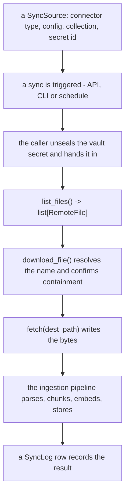

# Einen Sync-Connector hinzufügen { #add-a-sync-connector }

## Architektur { #architecture }

Sync-Connectors sind einsteckbare Adapter, die Dateien aus externen Systemen
(Cloud-Speicher, SaaS-APIs und so weiter) für die Aufnahme in die RAG-Pipeline
holen.

### Die wichtigsten Klassen { #key-classes }

| Klasse | Ort | Zweck |
|-------|----------|---------|
| `BaseSyncConnector` | `app/services/rag/connectors/__init__.py` | Abstrakte Basisklasse für alle Connectors |
| `remote_names` | `app/services/rag/remote_names.py` | Wohin ein entfernter Name geschrieben werden darf und was eine Abfrage erreichen darf |
| `RemoteFile` | `app/services/rag/connectors/__init__.py` | Pydantic-Modell, das eine entfernte Datei beschreibt |
| `ConfigRefusal` | `app/services/rag/connectors/__init__.py` | Warum eine Konfiguration nicht annehmbar ist, und welches ihrer Felder |
| `CONFIG_MODEL` | das eigene Modul des Connectors | Ein Pydantic-Modell seiner Konfigurationsfelder; die Auflistung veröffentlicht dessen JSON Schema, und der Assistent zeichnet es |
| `EmptyConfig` | `app/services/rag/connectors/__init__.py` | Das Standard-`CONFIG_MODEL` der Basisklasse, für einen Connector ohne zu konfigurierende Felder |
| `ConnectorConfig` | `app/services/rag/connectors/__init__.py` | Das eigene Konfigurationsdokument der Source, so wie der Assistent es gesendet hat |
| `CONNECTOR_REGISTRY` | `app/services/rag/connectors/__init__.py` | Dict, das Connector-Typ-Strings auf Klassen abbildet |
| `SyncSource` | `app/db/models/sync_source.py` | Datenbankmodell, das die Konfiguration einer Source speichert |
| `SyncLog` | `app/db/models/sync_log.py` | Datenbankmodell, das Sync-Vorgänge verfolgt |

### Ablauf { #flow }



1. Ein Nutzer legt eine **SyncSource** an (Connector-Typ + Konfiguration +
   Collection-Name + die ID des Secrets im Vault, das sie authentifiziert)
2. Ein Nutzer löst einen **Sync** aus (über die API, die CLI oder eine geplante
   Aufgabe)
3. Wer den Sync ausführt, entsiegelt dieses Secret und reicht es hinein; das
   `list_files()` des Connectors gibt `list[RemoteFile]` zurück
4. Für jede Datei entscheidet `BaseSyncConnector.download_file()`, wo sie landen
   darf, und ruft das `_fetch()` des Connectors auf, um sie dort zu schreiben
5. Die Ingestion-Pipeline parst, zerteilt, bettet ein und speichert jede Datei
6. Ein Eintrag im **SyncLog** verzeichnet das Ergebnis

### Ein Connector wählt das Ziel nicht { #a-connector-does-not-choose-the-destination }

!!! danger "Ein entfernter Name wird vom Angreifer kontrolliert"

    Jeder, der eine Datei in einen synchronisierten Ordner teilen kann, wählt ihn,
    und `../../../etc/…` ist auf Google Drive ein zulässiger Name. **Schreiben Sie
    in den `dest_path`, den Sie bekommen, und sonst nirgendwohin** - ein Connector,
    der seinen eigenen Pfad wählte, wäre eine Ablehnung pro Connector, an die man
    denken müsste.

`download_file()` ist konkret und wird nicht überschrieben. Es löst
`RemoteFile.name` gegen das Sync-Verzeichnis auf und bestätigt die Enthaltenheit,
bevor ein einziges Byte geschrieben wird, und reicht `_fetch()` dann einen
`dest_path` zum Schreiben.

Dasselbe gilt für jeden vom Aufrufer gelieferten Wert, den ein Connector in eine
**Abfrage** einsetzt: prüfen Sie ihn dort, wo die Abfrage gebaut wird, gegen das,
was das entfernte System tatsächlich ausstellen kann.
`app/services/rag/remote_names.py` hält beide Antworten.

### Ein Connector hält auch nicht seine eigene Zugangsdatei { #a-connector-does-not-hold-its-own-credential-either }

`CONFIG_MODEL` sagt, wie die Dokumente zu **finden** sind, und sonst nichts. Die
Zugangsdatei ist ein Secret im Vault, das die Source über ihre ID referenziert,
entsiegelt von dem, der den Sync ausführt, und als `credential` hineingereicht —
ein Connector erklärt also, welche Art von Secret er braucht (`SECRET_KIND`), und
liest zum Authentifizieren nichts aus `config`.

!!! danger "Ein Feld für ein Token in `CONFIG_MODEL` ist eine Zugangsdatei in einer JSONB-Spalte"

    Genau das haben `0042_sync_source_secret_id` und
    [#937](https://github.com/vstorm-co/agenticos/issues/937) entfernt. Es gibt
    auch keinen deploymentweiten Rückfallweg, nach dem man greifen könnte: eine
    Source läuft auf der Zugangsdatei, die sie benennt, oder sie läuft nicht, denn
    ein Rückfall bedeutet, dass die `folder_id` eines Mandanten auswählt, was unter
    der Identität des *Betreibers* gelesen wird.

## Schritt für Schritt: ein Notion-Connector { #step-by-step-a-notion-connector }

Dieses Beispiel implementiert einen Notion-Connector, der Seiten aus einem
Notion-Workspace holt.

### 1. Die Connector-Datei anlegen { #1-create-the-connector-file }

```python
# app/services/rag/connectors/notion.py
import asyncio
import logging
from pathlib import Path
from typing import ClassVar

from pydantic import BaseModel, Field

from app.core.exceptions import BadRequestError
from app.core.secret_kinds import ApiKeySecret, SecretKind, StorableSecret
from app.services.rag.connectors import (
    BaseSyncConnector,
    ConfigRefusal,
    ConnectorConfig,
    RemoteFile,
)

logger = logging.getLogger(__name__)


class NotionConfig(BaseModel):
    """What a Notion source needs to *find* its pages.

    The credential is not here - it is an `ApiKeySecret` the source names in
    `secret_id`. Both fields have a default, so neither is required.
    """

    database_id: str | None = Field(
        default=None,
        title="Database ID",
        description="Limit sync to a specific Notion database (optional)",
    )
    include_subpages: bool = Field(default=True, title="Include sub-pages")


class NotionConnector(BaseSyncConnector):
    """Sync connector for Notion pages."""

    CONNECTOR_TYPE: ClassVar[str] = "notion"
    DISPLAY_NAME: ClassVar[str] = "Notion"
    # Which vault secret authenticates this connector. The wizard offers the
    # organization's matching secrets and nothing else.
    SECRET_KIND: ClassVar[SecretKind] = SecretKind.API_KEY

    # The listing publishes this model's JSON Schema and the wizard draws it;
    # validate_config derives its required-field check from it. It holds no
    # credential - see "A connector does not hold its own credential either".
    CONFIG_MODEL: ClassVar[type[BaseModel]] = NotionConfig

    def _client(self, credential: StorableSecret | None):
        """The Notion client this source's own credential opens.

        Raises:
            BadRequestError: the source names no credential, its secret has been
                deleted, or the secret is not an API key.
        """
        from notion_client import Client

        if credential is None:
            raise BadRequestError(
                message=(
                    "This Notion source has no credential. Pick an API key in "
                    "the Vault and point the source at it."
                )
            )
        if not isinstance(credential, ApiKeySecret):
            raise BadRequestError(
                message="A Notion source needs an API key, and the one it names is not one."
            )
        return Client(auth=credential.api_key.get_secret_value())

    async def list_files(
        self, config: ConnectorConfig, credential: StorableSecret | None
    ) -> list[RemoteFile]:
        """List Notion pages available for sync."""
        database_id = config.get("database_id", "")

        def _list() -> list[RemoteFile]:
            notion = self._client(credential)
            files: list[RemoteFile] = []

            if database_id:
                # Query a specific database
                response = notion.databases.query(database_id=database_id)
                pages = response.get("results", [])
            else:
                # Search all accessible pages
                response = notion.search(filter={"property": "object", "value": "page"})
                pages = response.get("results", [])

            for page in pages:
                page_id = page["id"]
                title = "Untitled"
                # Extract title from properties
                for prop in page.get("properties", {}).values():
                    if prop.get("type") == "title" and prop.get("title"):
                        title = prop["title"][0].get("plain_text", "Untitled")
                        break

                files.append(
                    RemoteFile(
                        id=page_id,
                        name=f"{title}.md",
                        mime_type="text/markdown",
                        size=None,
                        modified_at=page.get("last_edited_time"),
                        source_path=f"notion://{page_id}",
                    )
                )

            return files

        return await asyncio.to_thread(_list)

    async def _fetch(
        self,
        file: RemoteFile,
        dest_path: Path,
        config: ConnectorConfig,
        credential: StorableSecret | None,
    ) -> None:
        """Export a Notion page as Markdown to the path the base class chose."""
        def _download() -> None:
            notion = self._client(credential)

            # `dest_path` is already confirmed to be inside the sync directory.
            # Do not build a path from `file.name` — see "A connector does not
            # choose the destination" above.

            # Fetch page blocks and convert to markdown
            # (simplified — use a library like notion2md in practice)
            content = f"# {file.name.replace('.md', '')}\n\nPage content here..."
            dest_path.write_text(content)

            logger.info(f"Exported Notion page {file.id} -> {dest_path}")

        await asyncio.to_thread(_download)

    async def validate_config(self, config: ConnectorConfig) -> ConfigRefusal | None:
        """Refuse a config the wizard can still fix.

        Connectivity is not checked here: `validate_config` sees the config and
        not the credential, so "can this key reach Notion" is a question for the
        first sync. What it can answer is the shape of what was typed.
        """
        refusal = await super().validate_config(config)
        if refusal is not None:
            return refusal

        database_id = config.get("database_id", "")
        if database_id and not database_id.replace("-", "").isalnum():
            # `field=` names one input, and the sync-source wizard marks it.
            # Name it as `CONFIG_MODEL` does; where it sits in the request body
            # is not a connector's to know.
            return ConfigRefusal(
                message="A Notion database id is letters, digits and dashes",
                field="database_id",
            )
        return None
```

`validate_config` antwortet auf *warum nicht*, oder mit `None`, wenn die
Konfiguration annehmbar ist. `ConfigRefusal(message="…", field="database_id")`
benennt eines: `SyncSourceService` verankert es gegen die Nutzlast
(`config.database_id`), löst es mit `refused_field` aus, und der Assistent
markiert dieses Eingabefeld. Benennen Sie das Feld so, wie `CONFIG_MODEL` es tut
— wo es im Request-Body sitzt, geht einen Connector nichts an.

Falls ein Connector doch irgendwo die Erreichbarkeit prüft, setzen Sie nie den
Ausnahmetext des Clients in die Meldung — ein SDK schreibt dort die Anfrage
hinein, die es gerade stellte, und die trägt regelmäßig eine URL mit einem Key
darin. Loggen Sie ihn und lehnen Sie mit eigenen Worten ab.

### 2. In CONNECTOR_REGISTRY registrieren { #2-register-in-connector_registry }

Bearbeiten Sie `app/services/rag/connectors/__init__.py` und ergänzen Sie:

```python
from app.services.rag.connectors.notion import NotionConnector

CONNECTOR_REGISTRY["notion"] = NotionConnector
```

### 3. Abhängigkeit hinzufügen (falls nötig) { #3-add-dependency-if-needed }

Wenn der Connector ein Paket eines Drittanbieters braucht, fügen Sie es in
`pyproject.toml` hinzu:

```bash
uv add notion-client
```

### 4. Über die CLI testen { #4-test-via-cli }

```bash
# Store the credential once, then point a source at it
uv run agenticos cmd rag-source-add \
    --name "Engineering Wiki" \
    --type notion \
    --org <organization-id> \
    --secret-id <vault-secret-id> \
    --config '{"database_id": "abc123"}' \
    --collection knowledge-base
```

`--secret-id` benennt einen Eintrag im Vault dieser Organisation; das Token
erscheint weder auf der Kommandozeile noch in der Konfiguration der Source.

### 5. Über die API testen { #5-test-via-api }

```bash
# Create sync source
curl -X POST http://localhost:8000/api/v1/rag/sync/sources \
    -H "Authorization: Bearer $TOKEN" \
    -H "Content-Type: application/json" \
    -d '{
        "name": "Engineering Wiki",
        "connector_type": "notion",
        "collection_name": "knowledge-base",
        "secret_id": "<vault-secret-id>",
        "config": {
            "database_id": "abc123",
            "include_subpages": true
        }
    }'

# Trigger sync
curl -X POST http://localhost:8000/api/v1/rag/sync/sources/{source_id}/sync \
    -H "Authorization: Bearer $TOKEN"

# Check sync status
curl http://localhost:8000/api/v1/rag/sync/logs \
    -H "Authorization: Bearer $TOKEN"
```

## Referenz zu CONFIG_MODEL { #config_model-reference }

Die Klassenvariable `CONFIG_MODEL` ist ein Pydantic-Modell davon, wie die
Dokumente einer Source zu **finden** sind.
`GET /api/v1/rag/sync/connectors` veröffentlicht ihr `model_json_schema()` als
`config_schema` — dieselbe Form, die das `config_schema` einer Capability trägt —
und der Assistent reicht das unverändert an `SchemaForm`. Auch
`validate_config` liest das Modell: ein Feld ohne Default ist erforderlich, und
die Ablehnung nennt den `title` des Feldes.

Ein erforderliches Feld ist eines ohne Default, es gibt also kein Flag, bei dem
man sich verschreiben könnte. Die Abbildung, die das ersetzt hat, war eine
Zeitlang `dict[str, dict[str, Any]]`, und eine Deklaration mit `"require": True`
schaltete die Prüfung dieses Feldes stillschweigend ab — der Assistent zeichnete
ein erforderliches Feld als optional (#562).

### Feldarten, die der Assistent zeichnet { #field-kinds-the-wizard-draws }

`SchemaForm` zeichnet bewusst nur eine kleine Teilmenge von JSON Schema — Strings,
Zahlen, Boolesche Werte, Enums und eine Liste von Strings. Ein Connector, der
einen reicheren Editor braucht, liefert seine eigene Komponente, statt das
Formular in Richtung eines allgemeinen Renderers zu drängen.

| Python-Typ | UI-Element |
|-------------|-----------|
| `str` | Texteingabe |
| `str` mit `json_schema_extra={"x-textarea": True}` | Mehrzeiliger Text |
| `bool` | Schalter |
| `int` / `float` | Zahleneingabe |
| `Literal["a", "b"]` | Auswahlliste |
| `list[str]` | Kommagetrennte Liste |

Ein optionales Feld ist `T | None = None`. Pydantic gibt das als
`anyOf: [{type: "x"}, {type: "null"}]` aus, und das Formular schaut über den
Null-Zweig hinweg, statt auf ein Textfeld durchzufallen.

### Feldeigenschaften { #field-properties }

| Argument von `Field(...)` | Was es tut |
|-----------------------|--------------|
| `title` | Die Beschriftung über dem Eingabefeld, und das, was eine Ablehnung wegen eines fehlenden Pflichtfeldes benennt |
| `description` | Hilfetext unter dem Eingabefeld |
| `default` | Der Wert, den der Connector anwendet, wenn der Schlüssel fehlt. Es wird nichts gespeichert, bis das Feld bearbeitet wird |
| `json_schema_extra={"x-placeholder": "…"}` | Ein grauer Hinweis, der angezeigt wird, solange das Feld leer ist, und nie gespeichert wird — für einen serverseitig aufgelösten Standardwert, etwa eine S3-`region`, die auf `S3_RAG_*` zurückfällt |

Es gibt keine Eigenschaft für ein Secret, und es gibt auch keinen Ort, eine
hinzuzufügen: eine Zugangsdatei ist ein Secret im Vault, das die Source über ihre
ID referenziert, also ist `SECRET_KIND` der Weg, auf dem ein Connector sagt, was
er braucht.

### Beispiel { #example }

```python
from pydantic import BaseModel, Field


class WorkspaceConfig(BaseModel):
    workspace: str = Field(title="Workspace", description="Which workspace to read")
    max_files: int = Field(default=100, title="Max files to sync")
    recursive: bool = Field(default=True, title="Include nested items")


class WorkspaceConnector(BaseSyncConnector):
    CONFIG_MODEL: ClassVar[type[BaseModel]] = WorkspaceConfig
```

`workspace` hat keinen Default und ist damit das eine erforderliche Feld; die
beiden mitgelieferten Connectors (`GoogleDriveConfig`, `S3Config`) sind die
Modelle zum Abschauen.

## Hinweise { #tips }

- Setzen Sie `RemoteFile.source_path` auf einen eindeutigen URI (zum Beispiel `notion://page_id`) — er dient der Deduplizierung über Syncs hinweg
- Umschließen Sie blockierende SDK-Aufrufe mit `asyncio.to_thread()`, damit sie den Event Loop nicht blockieren
- Implementieren Sie `validate_config()`, um eine Konfiguration abzulehnen, die der Assistent noch beheben kann — eine `ConfigRefusal`, die ein `field` benennt, ist das, was ihn dieses Eingabefeld markieren lässt, statt einen Satz über vier davon zu zeigen. Sie sieht die Konfiguration und nicht die Zugangsdatei, also ist "kann dieser Key den Dienst erreichen" eine Frage für den ersten Sync und nicht für diese Methode
- Deklarieren Sie `SECRET_KIND` und lesen Sie die Zugangsdatei aus dem Argument `credential`. Eine Zugangsdatei gehört nie in `CONFIG_MODEL`, und es gibt keinen deploymentweiten Rückfallweg, auf den zurückgefallen werden könnte
- Einstellungen in `app/core/config.py` und `.env` sind für Werte, die kein Prinzipal benennen — wo ein Speicher liegt, nicht wer fragt (`S3_RAG_ENDPOINT` ist die Form)
- `_fetch()` schreibt in den `dest_path`, den es bekommt, und gibt nichts zurück — die Basisklasse beantwortet, wo der liegt, und die Ingestion-Pipeline übernimmt alles Weitere
