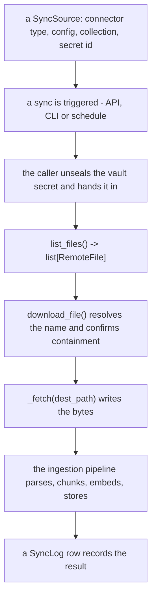

# Añade un sync connector { #add-a-sync-connector }

## Arquitectura { #architecture }

Los sync connectors son adaptadores conectables que traen archivos de sistemas
externos (almacenamiento en la nube, APIs SaaS, etc.) para ingerirlos en el
pipeline de RAG.

### Clases principales { #key-classes }

| Clase | Ubicación | Para qué sirve |
|-------|----------|---------|
| `BaseSyncConnector` | `app/services/rag/connectors/__init__.py` | Clase base abstracta de todos los connectors |
| `remote_names` | `app/services/rag/remote_names.py` | Dónde se puede escribir un nombre remoto, y qué puede llegar a una consulta |
| `RemoteFile` | `app/services/rag/connectors/__init__.py` | Modelo Pydantic que describe un archivo remoto |
| `ConfigRefusal` | `app/services/rag/connectors/__init__.py` | Por qué una configuración no es aceptable, y qué campo de ella |
| `CONFIG_MODEL` | el módulo del propio connector | Un modelo Pydantic de sus campos de configuración; el listado publica su JSON Schema y el asistente lo dibuja |
| `EmptyConfig` | `app/services/rag/connectors/__init__.py` | El `CONFIG_MODEL` por defecto de la clase base, para un connector que no configura nada |
| `ConnectorConfig` | `app/services/rag/connectors/__init__.py` | El documento de configuración de la propia source, tal como lo envió el asistente |
| `CONNECTOR_REGISTRY` | `app/services/rag/connectors/__init__.py` | Dict que asocia cadenas de tipo de connector con clases |
| `SyncSource` | `app/db/models/sync_source.py` | Modelo de base de datos que guarda la configuración de una source |
| `SyncLog` | `app/db/models/sync_log.py` | Modelo de base de datos que registra las operaciones de sync |

### Recorrido { #flow }



1. Alguien crea una **SyncSource** (tipo de connector + configuración + nombre de
   la collection + el id del secreto del vault que la autentica)
2. Alguien lanza un **sync** (por la API, la CLI o una tarea programada)
3. Quien ejecuta el sync desprecinta ese secreto y lo pasa; el `list_files()` del
   connector devuelve `list[RemoteFile]`
4. Para cada archivo, `BaseSyncConnector.download_file()` decide dónde puede
   aterrizar y llama al `_fetch()` del connector para escribirlo ahí
5. El pipeline de ingesta analiza, trocea, embebe y almacena cada archivo
6. Una entrada de **SyncLog** deja constancia del resultado

### Un connector no elige el destino { #a-connector-does-not-choose-the-destination }

!!! danger "Un nombre remoto lo controla el atacante"

    Lo elige cualquiera que pueda compartir un archivo en una carpeta
    sincronizada, y `../../../etc/…` es un nombre legal en Google Drive.
    **Escribe en el `dest_path` que se te entrega, y en nada más** - un connector
    que eligiera su propia ruta sería una negativa por connector que recordar.

`download_file()` es concreto y no se sobrescribe. Resuelve `RemoteFile.name`
contra el directorio de sync y confirma la contención antes de escribir un solo
byte, y luego entrega a `_fetch()` un `dest_path` en el que escribir.

Lo mismo vale para cualquier valor suministrado por quien llama que un connector
meta en una **consulta**: compruébalo donde se construye la consulta, contra lo
que el sistema remoto puede emitir realmente.
`app/services/rag/remote_names.py` contiene ambas respuestas.

### Un connector tampoco guarda su propia credencial { #a-connector-does-not-hold-its-own-credential-either }

`CONFIG_MODEL` dice cómo **encontrar** los documentos y nada más. La credencial
es un secreto del vault que la source referencia por id, desprecintado por quien
ejecuta el sync y pasado como `credential` — así que un connector declara qué
clase de secreto necesita (`SECRET_KIND`) y no lee nada de `config` para
autenticarse.

!!! danger "Un campo para un token en `CONFIG_MODEL` es una credencial en una columna JSONB"

    Eso es lo que eliminaron `0042_sync_source_secret_id` y
    [#937](https://github.com/vstorm-co/agenticos/issues/937). Tampoco hay un
    recurso de reserva a escala de deployment al que acudir: una source funciona
    con la credencial que nombra o no funciona, porque una reserva significa que
    el `folder_id` de un inquilino elige qué se lee bajo la identidad del
    *operador*.

## Paso a paso: un connector de Notion { #step-by-step-a-notion-connector }

Este ejemplo implementa un connector de Notion que trae páginas de un workspace
de Notion.

### 1. Crea el archivo del connector { #1-create-the-connector-file }

```python
# app/services/rag/connectors/notion.py
import asyncio
import logging
from pathlib import Path
from typing import ClassVar

from pydantic import BaseModel, Field

from app.core.exceptions import BadRequestError
from app.core.secret_kinds import ApiKeySecret, SecretKind, StorableSecret
from app.services.rag.connectors import (
    BaseSyncConnector,
    ConfigRefusal,
    ConnectorConfig,
    RemoteFile,
)

logger = logging.getLogger(__name__)


class NotionConfig(BaseModel):
    """What a Notion source needs to *find* its pages.

    The credential is not here - it is an `ApiKeySecret` the source names in
    `secret_id`. Both fields have a default, so neither is required.
    """

    database_id: str | None = Field(
        default=None,
        title="Database ID",
        description="Limit sync to a specific Notion database (optional)",
    )
    include_subpages: bool = Field(default=True, title="Include sub-pages")


class NotionConnector(BaseSyncConnector):
    """Sync connector for Notion pages."""

    CONNECTOR_TYPE: ClassVar[str] = "notion"
    DISPLAY_NAME: ClassVar[str] = "Notion"
    # Which vault secret authenticates this connector. The wizard offers the
    # organization's matching secrets and nothing else.
    SECRET_KIND: ClassVar[SecretKind] = SecretKind.API_KEY

    # The listing publishes this model's JSON Schema and the wizard draws it;
    # validate_config derives its required-field check from it. It holds no
    # credential - see "A connector does not hold its own credential either".
    CONFIG_MODEL: ClassVar[type[BaseModel]] = NotionConfig

    def _client(self, credential: StorableSecret | None):
        """The Notion client this source's own credential opens.

        Raises:
            BadRequestError: the source names no credential, its secret has been
                deleted, or the secret is not an API key.
        """
        from notion_client import Client

        if credential is None:
            raise BadRequestError(
                message=(
                    "This Notion source has no credential. Pick an API key in "
                    "the Vault and point the source at it."
                )
            )
        if not isinstance(credential, ApiKeySecret):
            raise BadRequestError(
                message="A Notion source needs an API key, and the one it names is not one."
            )
        return Client(auth=credential.api_key.get_secret_value())

    async def list_files(
        self, config: ConnectorConfig, credential: StorableSecret | None
    ) -> list[RemoteFile]:
        """List Notion pages available for sync."""
        database_id = config.get("database_id", "")

        def _list() -> list[RemoteFile]:
            notion = self._client(credential)
            files: list[RemoteFile] = []

            if database_id:
                # Query a specific database
                response = notion.databases.query(database_id=database_id)
                pages = response.get("results", [])
            else:
                # Search all accessible pages
                response = notion.search(filter={"property": "object", "value": "page"})
                pages = response.get("results", [])

            for page in pages:
                page_id = page["id"]
                title = "Untitled"
                # Extract title from properties
                for prop in page.get("properties", {}).values():
                    if prop.get("type") == "title" and prop.get("title"):
                        title = prop["title"][0].get("plain_text", "Untitled")
                        break

                files.append(
                    RemoteFile(
                        id=page_id,
                        name=f"{title}.md",
                        mime_type="text/markdown",
                        size=None,
                        modified_at=page.get("last_edited_time"),
                        source_path=f"notion://{page_id}",
                    )
                )

            return files

        return await asyncio.to_thread(_list)

    async def _fetch(
        self,
        file: RemoteFile,
        dest_path: Path,
        config: ConnectorConfig,
        credential: StorableSecret | None,
    ) -> None:
        """Export a Notion page as Markdown to the path the base class chose."""
        def _download() -> None:
            notion = self._client(credential)

            # `dest_path` is already confirmed to be inside the sync directory.
            # Do not build a path from `file.name` — see "A connector does not
            # choose the destination" above.

            # Fetch page blocks and convert to markdown
            # (simplified — use a library like notion2md in practice)
            content = f"# {file.name.replace('.md', '')}\n\nPage content here..."
            dest_path.write_text(content)

            logger.info(f"Exported Notion page {file.id} -> {dest_path}")

        await asyncio.to_thread(_download)

    async def validate_config(self, config: ConnectorConfig) -> ConfigRefusal | None:
        """Refuse a config the wizard can still fix.

        Connectivity is not checked here: `validate_config` sees the config and
        not the credential, so "can this key reach Notion" is a question for the
        first sync. What it can answer is the shape of what was typed.
        """
        refusal = await super().validate_config(config)
        if refusal is not None:
            return refusal

        database_id = config.get("database_id", "")
        if database_id and not database_id.replace("-", "").isalnum():
            # `field=` names one input, and the sync-source wizard marks it.
            # Name it as `CONFIG_MODEL` does; where it sits in the request body
            # is not a connector's to know.
            return ConfigRefusal(
                message="A Notion database id is letters, digits and dashes",
                field="database_id",
            )
        return None
```

`validate_config` responde *por qué no*, o `None` cuando la configuración es
aceptable. `ConfigRefusal(message="…", field="database_id")` nombra uno:
`SyncSourceService` lo ancla contra la carga útil (`config.database_id`), lo
lanza con `refused_field`, y el asistente marca ese campo de entrada. Nombra el
campo como lo hace `CONFIG_MODEL` — dónde se sitúa dentro del cuerpo de la
petición no es cosa de un connector.

Si un connector sí comprueba la conectividad en algún punto, nunca pongas en el
mensaje el texto de la excepción del propio cliente — un SDK escribe ahí la
petición que estaba haciendo, y esa lleva rutinariamente una URL con una clave
dentro. Regístralo en el log y rechaza con tus propias palabras.

### 2. Regístralo en CONNECTOR_REGISTRY { #2-register-in-connector_registry }

Edita `app/services/rag/connectors/__init__.py` y añade:

```python
from app.services.rag.connectors.notion import NotionConnector

CONNECTOR_REGISTRY["notion"] = NotionConnector
```

### 3. Añade la dependencia (si hace falta) { #3-add-dependency-if-needed }

Si el connector necesita un paquete de terceros, añádelo a `pyproject.toml`:

```bash
uv add notion-client
```

### 4. Pruébalo con la CLI { #4-test-via-cli }

```bash
# Store the credential once, then point a source at it
uv run agenticos cmd rag-source-add \
    --name "Engineering Wiki" \
    --type notion \
    --org <organization-id> \
    --secret-id <vault-secret-id> \
    --config '{"database_id": "abc123"}' \
    --collection knowledge-base
```

`--secret-id` nombra una entrada del vault de esa organización; el token no
aparece nunca en la línea de comandos ni en la configuración de la source.

### 5. Pruébalo con la API { #5-test-via-api }

```bash
# Create sync source
curl -X POST http://localhost:8000/api/v1/rag/sync/sources \
    -H "Authorization: Bearer $TOKEN" \
    -H "Content-Type: application/json" \
    -d '{
        "name": "Engineering Wiki",
        "connector_type": "notion",
        "collection_name": "knowledge-base",
        "secret_id": "<vault-secret-id>",
        "config": {
            "database_id": "abc123",
            "include_subpages": true
        }
    }'

# Trigger sync
curl -X POST http://localhost:8000/api/v1/rag/sync/sources/{source_id}/sync \
    -H "Authorization: Bearer $TOKEN"

# Check sync status
curl http://localhost:8000/api/v1/rag/sync/logs \
    -H "Authorization: Bearer $TOKEN"
```

## Referencia de CONFIG_MODEL { #config_model-reference }

La variable de clase `CONFIG_MODEL` es un modelo Pydantic de cómo **encontrar**
los documentos de una source. `GET /api/v1/rag/sync/connectors` publica su
`model_json_schema()` como `config_schema` — la misma forma que lleva el
`config_schema` de una capability — y el asistente se lo pasa a `SchemaForm` sin
adaptarlo. `validate_config` también lee el modelo: un campo sin valor por
defecto es obligatorio, y la negativa nombra el `title` del campo.

Un campo obligatorio es uno sin valor por defecto, así que no hay ningún flag que
escribir mal. El mapeo al que esto sustituyó fue durante un tiempo
`dict[str, dict[str, Any]]`, y una declaración que decía `"require": True`
desactivaba en silencio la comprobación de ese campo — el asistente dibujaba como
opcional un campo obligatorio (#562).

### Clases de campo que el asistente dibuja { #field-kinds-the-wizard-draws }

`SchemaForm` dibuja un subconjunto deliberadamente pequeño de JSON Schema —
cadenas, números, booleanos, enums y una lista de cadenas. Un connector que
necesite un editor más rico trae su propio componente en lugar de empujar el
formulario hacia un renderizador general.

| Tipo de Python | Elemento de UI |
|-------------|-----------|
| `str` | Campo de texto |
| `str` con `json_schema_extra={"x-textarea": True}` | Texto multilínea |
| `bool` | Interruptor |
| `int` / `float` | Campo numérico |
| `Literal["a", "b"]` | Lista desplegable |
| `list[str]` | Lista separada por comas |

Un campo opcional es `T | None = None`. Pydantic lo emite como
`anyOf: [{type: "x"}, {type: "null"}]`, y el formulario mira más allá de la rama
nula en lugar de caer hasta una caja de texto.

### Propiedades de un campo { #field-properties }

| Argumento de `Field(...)` | Qué hace |
|-----------------------|--------------|
| `title` | La etiqueta encima del campo, y lo que nombra una negativa por campo obligatorio |
| `description` | Texto de ayuda bajo el campo |
| `default` | El valor que aplica el connector cuando la clave se omite. No se guarda nada hasta que el campo se edita |
| `json_schema_extra={"x-placeholder": "…"}` | Una pista gris que se muestra mientras el campo está vacío, nunca almacenada — para un valor por defecto resuelto en el servidor, como una `region` de S3 que recurre a `S3_RAG_*` |

No hay ninguna propiedad de secreto, y no hay dónde añadir una: una credencial es
un secreto del vault que la source referencia por id, así que `SECRET_KIND` es la
forma que tiene un connector de decir qué necesita.

### Ejemplo { #example }

```python
from pydantic import BaseModel, Field


class WorkspaceConfig(BaseModel):
    workspace: str = Field(title="Workspace", description="Which workspace to read")
    max_files: int = Field(default=100, title="Max files to sync")
    recursive: bool = Field(default=True, title="Include nested items")


class WorkspaceConnector(BaseSyncConnector):
    CONFIG_MODEL: ClassVar[type[BaseModel]] = WorkspaceConfig
```

`workspace` no tiene valor por defecto, así que es el único campo obligatorio;
los dos connectors que vienen incluidos (`GoogleDriveConfig`, `S3Config`) son los
modelos que copiar.

## Consejos { #tips }

- Pon en `RemoteFile.source_path` un URI único (por ejemplo, `notion://page_id`) — sirve para deduplicar entre syncs
- Envuelve con `asyncio.to_thread()` las llamadas bloqueantes de un SDK para que no bloqueen el event loop
- Implementa `validate_config()` para rechazar una configuración que el asistente todavía puede arreglar — una `ConfigRefusal` que nombra un `field` es lo que hace que marque ese campo de entrada en lugar de mostrar una frase sobre cuatro de ellos. Ve la configuración y no la credencial, así que "puede esta clave llegar al servicio" es una pregunta para el primer sync, no para este método
- Declara `SECRET_KIND` y lee la credencial del argumento `credential`. Una credencial no va nunca en `CONFIG_MODEL`, y no hay ningún recurso de reserva a escala de deployment al que recurrir
- Los ajustes de `app/core/config.py` y `.env` son para valores que no nombran a ningún principal — dónde está un almacén, no quién pregunta (`S3_RAG_ENDPOINT` es la forma)
- `_fetch()` escribe en el `dest_path` que se le entrega y no devuelve nada — la clase base responde dónde está eso, y el pipeline de ingesta se encarga de todo lo demás
