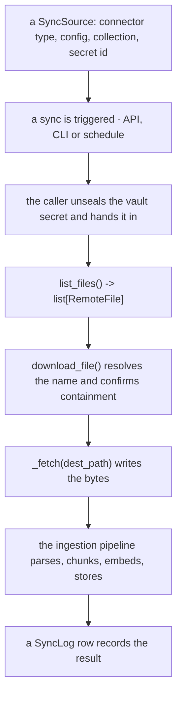

# Dodaj konektor synchronizacji { #add-a-sync-connector }

## Architektura { #architecture }

Konektory synchronizacji to podpinane adaptery, które pobierają pliki
z systemów zewnętrznych (magazyny w chmurze, API SaaS itd.) w celu zaingestowania
ich do pipeline'u RAG.

### Kluczowe klasy { #key-classes }

| Klasa | Lokalizacja | Przeznaczenie |
|-------|----------|---------|
| `BaseSyncConnector` | `app/services/rag/connectors/__init__.py` | Abstrakcyjna klasa bazowa dla wszystkich konektorów |
| `remote_names` | `app/services/rag/remote_names.py` | Gdzie zdalna nazwa może zostać zapisana i co może trafić do zapytania |
| `RemoteFile` | `app/services/rag/connectors/__init__.py` | Model Pydantica opisujący zdalny plik |
| `ConfigRefusal` | `app/services/rag/connectors/__init__.py` | Dlaczego konfiguracja nie jest akceptowalna i które jej pole za to odpowiada |
| `CONFIG_MODEL` | własny moduł konektora | Model Pydantica jego pól konfiguracyjnych; listing publikuje jego JSON Schema, a kreator go rysuje |
| `EmptyConfig` | `app/services/rag/connectors/__init__.py` | Domyślny `CONFIG_MODEL` klasy bazowej, dla konektora, który nie ma nic do skonfigurowania |
| `ConnectorConfig` | `app/services/rag/connectors/__init__.py` | Własny dokument konfiguracyjny źródła, w postaci, w jakiej wysłał go kreator |
| `CONNECTOR_REGISTRY` | `app/services/rag/connectors/__init__.py` | Słownik mapujący łańcuchy typu konektora na klasy |
| `SyncSource` | `app/db/models/sync_source.py` | Model bazodanowy przechowujący konfiguracje źródeł |
| `SyncLog` | `app/db/models/sync_log.py` | Model bazodanowy śledzący operacje synchronizacji |

### Przepływ { #flow }



1. Użytkownik tworzy **SyncSource** (typ konektora + config + nazwa kolekcji +
   id sekretu w vault, który go uwierzytelnia)
2. Użytkownik wyzwala **synchronizację** (przez API, CLI albo zaplanowane
   zadanie)
3. Ten, kto uruchamia synchronizację, odpieczętowuje ten sekret i podaje go
   dalej; `list_files()` konektora zwraca `list[RemoteFile]`
4. Dla każdego pliku `BaseSyncConnector.download_file()` decyduje, gdzie może on
   wylądować, i woła `_fetch()` konektora, żeby go tam zapisać
5. Pipeline ingestii parsuje, dzieli na chunki, embeduje i zapisuje każdy plik
6. Wpis **SyncLog** zapisuje wynik

### Konektor nie wybiera miejsca docelowego { #a-connector-does-not-choose-the-destination }

!!! danger "Zdalna nazwa jest kontrolowana przez atakującego"

    Wybiera ją każdy, kto może udostępnić plik do synchronizowanego folderu,
    a `../../../etc/…` jest na Google Drive legalną nazwą. **Pisz do `dest_path`,
    które dostajesz, i do niczego innego** — konektor wybierający własną ścieżkę
    byłby jedną odmową na konektor do zapamiętania.

`download_file()` jest konkretne i nie jest nadpisywane. Rozwiązuje
`RemoteFile.name` względem katalogu synchronizacji i potwierdza zawieranie się
w nim, zanim zostanie zapisany choć jeden bajt, a potem podaje `_fetch()`
`dest_path`, do którego ma pisać.

To samo dotyczy każdej wartości podanej przez wołającego, którą konektor wstawia
do **zapytania**: sprawdź ją tam, gdzie budowane jest zapytanie, wobec tego, co
zdalny system faktycznie potrafi wystawić.
`app/services/rag/remote_names.py` trzyma obie odpowiedzi.

### Konektor nie trzyma też własnego poświadczenia { #a-connector-does-not-hold-its-own-credential-either }

`CONFIG_MODEL` mówi, jak **znaleźć** dokumenty, i nic poza tym. Poświadczeniem
jest sekret w vault, do którego źródło odwołuje się po id, odpieczętowywany przez
tego, kto uruchamia synchronizację, i podawany jako `credential` — konektor
deklaruje więc, jakiego rodzaju sekretu potrzebuje (`SECRET_KIND`), i nie czyta
z `config` niczego, czym miałby się uwierzytelnić.

!!! danger "Pole na token w `CONFIG_MODEL` to poświadczenie w kolumnie JSONB"

    To jest to, co usunęły `0042_sync_source_secret_id` oraz
    [#937](https://github.com/vstorm-co/agenticos/issues/937). Nie ma też żadnego
    zapasowego mechanizmu na poziomie wdrożenia, po który można sięgnąć: źródło
    działa na poświadczeniu, które nazywa, albo nie działa wcale — bo taki
    mechanizm zapasowy oznacza, że `folder_id` jednego tenanta wybiera, co jest
    czytane pod tożsamością *operatora*.

## Krok po kroku: konektor do Notion { #step-by-step-a-notion-connector }

Ten przykład implementuje konektor do Notion, który pobiera strony z workspace'u
Notion.

### 1. Utwórz plik konektora { #1-create-the-connector-file }

```python
# app/services/rag/connectors/notion.py
import asyncio
import logging
from pathlib import Path
from typing import ClassVar

from pydantic import BaseModel, Field

from app.core.exceptions import BadRequestError
from app.core.secret_kinds import ApiKeySecret, SecretKind, StorableSecret
from app.services.rag.connectors import (
    BaseSyncConnector,
    ConfigRefusal,
    ConnectorConfig,
    RemoteFile,
)

logger = logging.getLogger(__name__)


class NotionConfig(BaseModel):
    """What a Notion source needs to *find* its pages.

    The credential is not here - it is an `ApiKeySecret` the source names in
    `secret_id`. Both fields have a default, so neither is required.
    """

    database_id: str | None = Field(
        default=None,
        title="Database ID",
        description="Limit sync to a specific Notion database (optional)",
    )
    include_subpages: bool = Field(default=True, title="Include sub-pages")


class NotionConnector(BaseSyncConnector):
    """Sync connector for Notion pages."""

    CONNECTOR_TYPE: ClassVar[str] = "notion"
    DISPLAY_NAME: ClassVar[str] = "Notion"
    # Which vault secret authenticates this connector. The wizard offers the
    # organization's matching secrets and nothing else.
    SECRET_KIND: ClassVar[SecretKind] = SecretKind.API_KEY

    # The listing publishes this model's JSON Schema and the wizard draws it;
    # validate_config derives its required-field check from it. It holds no
    # credential - see "A connector does not hold its own credential either".
    CONFIG_MODEL: ClassVar[type[BaseModel]] = NotionConfig

    def _client(self, credential: StorableSecret | None):
        """The Notion client this source's own credential opens.

        Raises:
            BadRequestError: the source names no credential, its secret has been
                deleted, or the secret is not an API key.
        """
        from notion_client import Client

        if credential is None:
            raise BadRequestError(
                message=(
                    "This Notion source has no credential. Pick an API key in "
                    "the Vault and point the source at it."
                )
            )
        if not isinstance(credential, ApiKeySecret):
            raise BadRequestError(
                message="A Notion source needs an API key, and the one it names is not one."
            )
        return Client(auth=credential.api_key.get_secret_value())

    async def list_files(
        self, config: ConnectorConfig, credential: StorableSecret | None
    ) -> list[RemoteFile]:
        """List Notion pages available for sync."""
        database_id = config.get("database_id", "")

        def _list() -> list[RemoteFile]:
            notion = self._client(credential)
            files: list[RemoteFile] = []

            if database_id:
                # Query a specific database
                response = notion.databases.query(database_id=database_id)
                pages = response.get("results", [])
            else:
                # Search all accessible pages
                response = notion.search(filter={"property": "object", "value": "page"})
                pages = response.get("results", [])

            for page in pages:
                page_id = page["id"]
                title = "Untitled"
                # Extract title from properties
                for prop in page.get("properties", {}).values():
                    if prop.get("type") == "title" and prop.get("title"):
                        title = prop["title"][0].get("plain_text", "Untitled")
                        break

                files.append(
                    RemoteFile(
                        id=page_id,
                        name=f"{title}.md",
                        mime_type="text/markdown",
                        size=None,
                        modified_at=page.get("last_edited_time"),
                        source_path=f"notion://{page_id}",
                    )
                )

            return files

        return await asyncio.to_thread(_list)

    async def _fetch(
        self,
        file: RemoteFile,
        dest_path: Path,
        config: ConnectorConfig,
        credential: StorableSecret | None,
    ) -> None:
        """Export a Notion page as Markdown to the path the base class chose."""
        def _download() -> None:
            notion = self._client(credential)

            # `dest_path` is already confirmed to be inside the sync directory.
            # Do not build a path from `file.name` — see "A connector does not
            # choose the destination" above.

            # Fetch page blocks and convert to markdown
            # (simplified — use a library like notion2md in practice)
            content = f"# {file.name.replace('.md', '')}\n\nPage content here..."
            dest_path.write_text(content)

            logger.info(f"Exported Notion page {file.id} -> {dest_path}")

        await asyncio.to_thread(_download)

    async def validate_config(self, config: ConnectorConfig) -> ConfigRefusal | None:
        """Refuse a config the wizard can still fix.

        Connectivity is not checked here: `validate_config` sees the config and
        not the credential, so "can this key reach Notion" is a question for the
        first sync. What it can answer is the shape of what was typed.
        """
        refusal = await super().validate_config(config)
        if refusal is not None:
            return refusal

        database_id = config.get("database_id", "")
        if database_id and not database_id.replace("-", "").isalnum():
            # `field=` names one input, and the sync-source wizard marks it.
            # Name it as `CONFIG_MODEL` does; where it sits in the request body
            # is not a connector's to know.
            return ConfigRefusal(
                message="A Notion database id is letters, digits and dashes",
                field="database_id",
            )
        return None
```

`validate_config` odpowiada *dlaczego nie* albo `None`, gdy konfiguracja jest
akceptowalna. `ConfigRefusal(message="…", field="database_id")` nazywa jedno
pole: `SyncSourceService` osadza je względem ładunku (`config.database_id`),
podnosi przez `refused_field`, a kreator zaznacza to wejście. Nazwij pole tak,
jak robi to `CONFIG_MODEL` — to, gdzie siedzi ono w ciele żądania, nie jest
wiedzą należącą do konektora.

Jeśli konektor gdzieś jednak sprawdza łączność, nigdy nie wstawiaj do komunikatu
tekstu wyjątku samego klienta — SDK wpisuje tam żądanie, które wykonywał, a to
rutynowo niesie URL z kluczem w środku. Zaloguj to i odmów własnymi słowami.

### 2. Zarejestruj w CONNECTOR_REGISTRY { #2-register-in-connector_registry }

Wyedytuj `app/services/rag/connectors/__init__.py` i dodaj:

```python
from app.services.rag.connectors.notion import NotionConnector

CONNECTOR_REGISTRY["notion"] = NotionConnector
```

### 3. Dodaj zależność (jeśli potrzebna) { #3-add-dependency-if-needed }

Jeśli konektor wymaga pakietu strony trzeciej, dodaj go do `pyproject.toml`:

```bash
uv add notion-client
```

### 4. Przetestuj przez CLI { #4-test-via-cli }

```bash
# Store the credential once, then point a source at it
uv run agenticos cmd rag-source-add \
    --name "Engineering Wiki" \
    --type notion \
    --org <organization-id> \
    --secret-id <vault-secret-id> \
    --config '{"database_id": "abc123"}' \
    --collection knowledge-base
```

`--secret-id` nazywa wpis w vaulcie tej organizacji; token nigdy nie pojawia się
w linii poleceń ani w konfiguracji źródła.

### 5. Przetestuj przez API { #5-test-via-api }

```bash
# Create sync source
curl -X POST http://localhost:8000/api/v1/rag/sync/sources \
    -H "Authorization: Bearer $TOKEN" \
    -H "Content-Type: application/json" \
    -d '{
        "name": "Engineering Wiki",
        "connector_type": "notion",
        "collection_name": "knowledge-base",
        "secret_id": "<vault-secret-id>",
        "config": {
            "database_id": "abc123",
            "include_subpages": true
        }
    }'

# Trigger sync
curl -X POST http://localhost:8000/api/v1/rag/sync/sources/{source_id}/sync \
    -H "Authorization: Bearer $TOKEN"

# Check sync status
curl http://localhost:8000/api/v1/rag/sync/logs \
    -H "Authorization: Bearer $TOKEN"
```

## Dokumentacja CONFIG_MODEL { #config_model-reference }

Zmienna klasowa `CONFIG_MODEL` to model Pydantica opisujący, jak **znaleźć**
dokumenty źródła. `GET /api/v1/rag/sync/connectors` publikuje jego
`model_json_schema()` jako `config_schema` — ten sam kształt, który niesie
`config_schema` capability — a kreator podaje go do `SchemaForm` bez żadnej
adaptacji. `validate_config` też czyta ten model: pole bez wartości domyślnej
jest wymagane, a odmowa nazywa `title` tego pola.

Pole wymagane to pole bez wartości domyślnej, więc nie ma tu żadnej flagi, którą
dałoby się przekręcić. Mapowanie, które to zastąpiło, przez jakiś czas było
typu `dict[str, dict[str, Any]]`, a deklaracja mówiąca `"require": True` po cichu
wyłączała sprawdzenie tego pola — kreator rysował pole wymagane jako opcjonalne
(#562).

### Rodzaje pól, które kreator rysuje { #field-kinds-the-wizard-draws }

`SchemaForm` rysuje celowo niewielki podzbiór JSON Schema — łańcuchy znaków,
liczby, wartości logiczne, enumy i listę łańcuchów. Konektor potrzebujący
bogatszego edytora dostarcza własny komponent, zamiast pchać formularz w stronę
ogólnego renderera.

| Typ w Pythonie | Widget w UI |
|-------------|-----------|
| `str` | Pole tekstowe |
| `str` z `json_schema_extra={"x-textarea": True}` | Tekst wielolinijkowy |
| `bool` | Przełącznik |
| `int` / `float` | Pole liczbowe |
| `Literal["a", "b"]` | Lista wyboru |
| `list[str]` | Lista rozdzielona przecinkami |

Pole opcjonalne to `T | None = None`. Pydantic emituje to jako
`anyOf: [{type: "x"}, {type: "null"}]`, a formularz patrzy poza gałąź null,
zamiast przelecieć do pola tekstowego.

### Właściwości pola { #field-properties }

| Argument `Field(...)` | Co robi |
|-----------------------|--------------|
| `title` | Etykieta nad polem i to, co nazywa odmowa z powodu brakującego pola wymaganego |
| `description` | Tekst pomocy pod polem |
| `default` | Wartość, którą konektor stosuje, gdy klucz zostanie pominięty. Nic nie jest zapisywane, dopóki pole nie zostanie wyedytowane |
| `json_schema_extra={"x-placeholder": "…"}` | Szara podpowiedź pokazywana, gdy pole jest puste, nigdy niezapisywana — dla wartości domyślnej rozwiązywanej po stronie serwera, jak `region` w S3 spadający na `S3_RAG_*` |

Nie ma właściwości oznaczającej sekret i nie ma gdzie jej dodać: poświadczeniem
jest sekret w vault, do którego źródło odwołuje się po id, więc `SECRET_KIND`
jest tym, czym konektor mówi, czego potrzebuje.

### Przykład { #example }

```python
from pydantic import BaseModel, Field


class WorkspaceConfig(BaseModel):
    workspace: str = Field(title="Workspace", description="Which workspace to read")
    max_files: int = Field(default=100, title="Max files to sync")
    recursive: bool = Field(default=True, title="Include nested items")


class WorkspaceConnector(BaseSyncConnector):
    CONFIG_MODEL: ClassVar[type[BaseModel]] = WorkspaceConfig
```

`workspace` nie ma wartości domyślnej, więc jest jedynym polem wymaganym; dwa
dostarczane konektory (`GoogleDriveConfig`, `S3Config`) to modele, z których
warto kopiować.

## Wskazówki { #tips }

- Ustaw `RemoteFile.source_path` na unikalny URI (np. `notion://page_id`) — jest on używany do deduplikacji między synchronizacjami
- Używaj `asyncio.to_thread()`, żeby opakować blokujące wywołania SDK, tak by nie blokowały pętli zdarzeń
- Zaimplementuj `validate_config()`, żeby odrzucić konfigurację, którą kreator może jeszcze poprawić — `ConfigRefusal` nazywające `field` jest tym, co każe kreatorowi zaznaczyć to wejście, zamiast pokazywać zdanie nad czterema z nich. Metoda ta widzi konfigurację, a nie poświadczenie, więc „czy ten klucz dosięgnie usługi" to pytanie na pierwszą synchronizację, a nie na tę metodę
- Zadeklaruj `SECRET_KIND` i czytaj poświadczenie z argumentu `credential`. Poświadczenie nigdy nie trafia do `CONFIG_MODEL` i nie ma żadnego mechanizmu zapasowego na poziomie wdrożenia, na który można by spaść
- Ustawienia w `app/core/config.py` i `.env` są dla wartości, które nie nazywają żadnego podmiotu — gdzie jest magazyn, a nie kto pyta (`S3_RAG_ENDPOINT` jest tym kształtem)
- `_fetch()` pisze do `dest_path`, które dostaje, i nic nie zwraca — klasa bazowa odpowiada na pytanie, gdzie to jest, a pipeline ingestii zajmuje się wszystkim dalej
