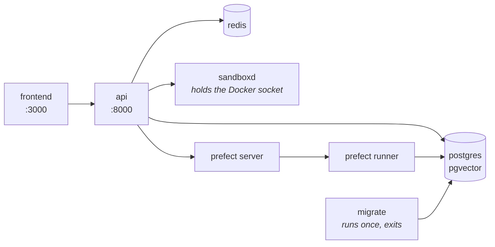
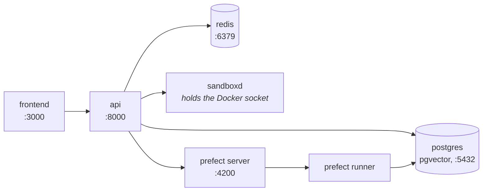

# Installation { #install }

Zwei Kommandos führen von einer Maschine mit Docker zu einem Agent, der
antwortet: ein `docker compose up -d` gegen eine heruntergeladene Datei und ein
Bootstrap in dem Container, den es gestartet hat. Diese Seite sind diese beiden
Kommandos, der Build aus dem Quellcode für alle, die am Code etwas ändern, und
das, was zu tun ist, wenn etwas nicht hochkommt.

Jeder Schritt ist idempotent — führen Sie jeden erneut aus, wann immer Sie sich
nicht sicher sind, ob er gegriffen hat.

## Ein Kommando { #one-command }

```bash
curl -fsSL https://raw.githubusercontent.com/vstorm-co/agenticos/main/scripts/quickstart.sh | bash
```

`scripts/quickstart.sh` braucht Docker und sonst nichts - das Compose-Plugin ab
2.24, was es prüft. Es lädt die `docker-compose.yml` des neuesten Release nach
`./agenticos`, schreibt daneben eine `.env` (Modus 0600) mit erzeugtem
`SECRET_KEY`, `VAULT_MASTER_KEY` und Sandbox-Token, stellt vier Fragen, holt die
veröffentlichten Images und bringt den Stack hoch - die Konsole inbegriffen -,
legt eine Organisation mit einem Owner und einem veröffentlichten Agent an und
spiegelt optional die MCP-Registry. Aus einem Klon heraus ausgeführt, baut es
dieselben Images stattdessen aus dem Baum. Eine `docker-compose.yml`, die zu
einem anderen Projekt gehört, bleibt unberührt: die Installation geht daneben
nach `./agenticos`.

Es nimmt `--check` entgegen, um nur zu melden, was fehlt, `--dry-run`, um jedes
Kommando auszugeben, das es ausführen würde, ohne eines auszuführen, und `--yes`
zusammen mit `--provider`, `--api-key`, `--email`, `--password` und `--org` für
eine unbeaufsichtigte Installation.

Alles Weitere unten ist das, was es tut, falls Sie es lieber selbst machen - und
es gibt keinen Schritt darin, den Sie nicht machen können.

## Voraussetzungen { #requirements }

| Um es zu | Brauchen Sie |
|---|---|
| **Betreiben** | Docker mit dem Compose-Plugin, 2.24 oder neuer - Docker Desktop, OrbStack oder Engine mit `docker-compose-plugin`. <https://docs.docker.com/get-docker/> |
| **Ändern** | Das Obige, dazu GNU Make, [uv](https://docs.astral.sh/uv/) und [bun](https://bun.sh) - `make install` prüft alle drei |

!!! warning "Unter Windows nutzen Sie WSL2"

    Das Makefile und die Shell-Helfer setzen bash voraus. **WSL2** oder **Git Bash**.
    Sobald Sie in einem davon sind, ist alles Weitere identisch.

## Aus den veröffentlichten Images betreiben { #run-it-from-the-published-images }

Das Produkt sind zwei Images, `ghcr.io/vstorm-co/agenticos-backend` und
`ghcr.io/vstorm-co/agenticos-frontend`, von
[jedem Release](https://github.com/vstorm-co/agenticos/releases) für amd64 und
arm64 veröffentlicht. Die `docker-compose.yml` im Wurzelverzeichnis des
Repositorys holt sie und startet alles darum herum, und sie funktioniert für
sich allein:

```bash
mkdir agenticos && cd agenticos
curl -fsSLO https://raw.githubusercontent.com/vstorm-co/agenticos/main/docker-compose.yml
docker compose up -d
```

Das holt die Images und startet **Postgres (mit pgvector), Redis, den
Prefect-Server und -Runner, die API und die Konsole**, führt die Migrationen aus
und antwortet unter <http://localhost:3000>. Der erste Pull umfasst rund 2 GB.



!!! success "Es gibt keine `.env`, die zuerst zu schreiben wäre"

    Jede Variable in `docker-compose.yml` trägt bewusst einen Standardwert. Schreiben
    Sie eine `.env` daneben, wenn es etwas zu ändern gibt - alles davon optional:

    | | |
    |---|---|
    | `AGENTICOS_VERSION` | Welches Release laufen soll. `latest`, wenn nicht gesetzt; eine Version wie `0.0.380`, um eine zu pinnen, `edge` für das, was `main` zuletzt veröffentlicht hat |
    | `PUBLIC_API_URL`, `PUBLIC_WS_URL`, `PUBLIC_SITE_URL` | Was dem *Browser* als aufzurufende Adresse genannt wird, wenn der Host unter einem anderen Namen als `localhost` erreicht wird. `FRONTEND_URL` und `CORS_ORIGINS` des Backends sind derselbe Sachverhalt von seiner Seite aus |
    | `OAUTH_PROVIDERS`, `CHAT_MAX_UPLOAD_SIZE_MB` | Welche Anmelde-Schaltflächen die Konsole anbietet, und was der Composer vor dem Hochladen ablehnt |
    | `SECRET_KEY`, `VAULT_MASTER_KEY` | Auf einem Laptop optional, wo die Standardwerte eine Konstante aus dem Repository sind und ein darunter versiegelter Vault. `scripts/quickstart.sh` erzeugt beide; von Hand je ein `openssl rand -hex 32` - und sichern Sie den Vault-Key zusammen mit der Datenbank, denn ein Dump, der neben einem anderen Key wiederhergestellt wird, ist unlesbar |
    | Alles aus `backend/.env.example` | Ein Provider-Key, SMTP, ein Logfire-Token - die Container lesen dieselbe Datei |

    Die Images lesen diese `.env`, und `backend/.env`, wenn es eine gibt, ein Klon
    behält seine Einstellungen also dort, wo der Rest dieser Dokumentation zu suchen
    sagt.

Der Sandbox-Dienst - derjenige, der einem Agent einen Container zum Ausführen von
Code gibt - liegt hinter dem Profil `sandbox`, weil er den Docker-Socket hält und
sich ohne ein eigenes Token weigert zu starten:

```bash
echo "SANDBOXD_TOKEN=$(head -c 32 /dev/urandom | base64)" >> .env
docker compose --profile sandbox up -d
```

Das Token wird einmal erzeugt und dann in Ruhe gelassen. Es neu zu erzeugen
verwaist jeden Workspace, den der Dienst hält. (`scripts/quickstart.sh` erledigt
beides für Sie.)

## Oder aus einem Klon bauen { #or-build-it-from-a-clone }

```bash
git clone https://github.com/vstorm-co/agenticos
cd agenticos
make dev
```

Ein Klon hat `docker-compose.override.yml` neben der Basisdatei, und Compose
führt die beiden von selbst zusammen - dasselbe `docker compose up`, das in einem
leeren Verzeichnis Images holt, baut sie hier also aus dem Baum, bindet den
Quellcode per Bind Mount ein und lädt die API bei jeder Änderung neu. Genau das
führt `make dev` aus, mit eingeschaltetem Sandbox-Profil und einem zuvor in
`backend/.env` erzeugten `SANDBOXD_TOKEN` (es erzeugt nie eines neu, das schon da
ist).

Wenn Sie dann doch etwas ändern möchten — einen Provider-Key auf dem Host, einen
anderen Datenbanknamen — editieren Sie `backend/.env`. `make install` legt sie
aus `backend/.env.example` an, wenn es keine gibt, und überschreibt sie danach
nie, die Datei mit Ihren Keys überlebt also jeden erneuten Durchlauf.

Der erste Build dauert einige Minuten: das Backend-Image bringt LibreOffice und
Tesseract für das Parsen von Dokumenten mit, und die Konsole ist ein
Next.js-Produktions-Build. Danach macht Dockers Layer-Cache daraus etwa eine
Minute, und dank der Bind Mounts braucht eine Änderung überhaupt keinen neuen
Build.



Die Migrationen laufen bei jedem Start des Stacks als `migrate`-Dienst und tun
nichts, wenn die Datenbank bereits auf dem neuesten Stand ist - deshalb ist
`make dev` zugleich das Kommando, das nach jeder Code- oder Konfigurationsänderung
erneut auszuführen ist.

### Die Konsole, in einem Klon { #the-console-in-a-clone }

```bash
make dev-frontend      # or: cd frontend && bun dev
```

!!! info "Wird von `make dev` nicht gestartet, und das ist kein Versehen"

    In einem Klon sitzt die Konsole hinter dem Compose-Profil `console`, damit die
    Arbeit an der API kein Frontend-Image neu baut und damit ein `bun dev` auf Ihrem
    Host nicht mit einem Container um Port 3000 kämpft. Außerhalb eines Klons gibt es
    kein Profil: `docker compose up` startet sie zusammen mit allem anderen.

## Eine Organisation, einen Owner, ein Modell und einen Agent anlegen { #create-an-organization-an-owner-a-model-and-an-agent }

```bash
make platform-bootstrap BOOTSTRAP_API_KEY=sk-...               # in a clone
docker compose exec -T -e BOOTSTRAP_API_KEY=sk-... app \
  agenticos cmd bootstrap                                     # anywhere else
```

Das ist der Schritt, der aus einer leeren Datenbank etwas Benutzbares macht.

Ein leeres AgenticOS ist ein Henne-Ei-Problem — ein Agent braucht ein Modell, ein
Modell braucht einen Key, ein Key braucht eine Organisation — und dies läuft
diese Kette einmal ab:

| Es legt an | |
|---|---|
| Eine Organisation | `Acme`, oder `--org` |
| Einen Owner | `admin@example.com` / `admin123`, oder `--email` / `--password` |
| Einen Vault-Eintrag | Ihren Provider-Key, für diese Organisation versiegelt |
| Ein Model Profile | `gpt-4.1`, `claude-sonnet-4-6`, `gemini-2.5-pro` oder `openai/gpt-4.1`, je nachdem, für welchen Provider der Key ist |
| Einen Agent | `@getting-started`, veröffentlicht, wenn es einen Key gibt |

Öffnen Sie jetzt <http://localhost:3000>, melden Sie sich als
`admin@example.com` / `admin123` an und gehen Sie zu
**Agents → Getting Started → Test**.

Sie haben einen funktionierenden Agent.

!!! tip "Noch kein Provider-Key?"

    Lassen Sie `BOOTSTRAP_API_KEY` weg. Es wird trotzdem alles angelegt, und der
    Demo-Agent wird als **Entwurf** gespeichert statt veröffentlicht — ein Agent ohne
    Modell kann nicht antworten, und einen zu veröffentlichen, der bei seiner ersten
    Nachricht scheitert, ist schlimmer, als ihn nicht zu veröffentlichen.

    Hinterlegen Sie einen Key unter **Settings → AI providers** und veröffentlichen
    Sie ihn dann.

!!! note "`make seed` ist etwas anderes"

    Es legt `admin@example.com` als Deployment-Superadmin an und sonst nichts: keine
    Organisation, kein Modell, keinen Agent. `make platform-bootstrap` legt diesen
    Nutzer ebenfalls an, bei einer frischen Installation wollen Sie also Bootstrap.

    `make dev` gibt den Vorschlag aus, `seed` auszuführen. Das ist der ältere Weg, und
    er ist weiterhin gültig, wenn Sie nur einen Admin-Zugang wollen.

## Es prüfen { #check-it }

```bash
docker compose exec app agenticos cmd doctor
```

`doctor` stellt die Fragen, die eine erste Nachricht stellen würde. Ist die
Datenbank erreichbar und auf dem neuesten Stand? Entschlüsselt der Vault? Gibt es
ein Model Profile mit einem Key dahinter? Antwortet jede registrierte
Sandbox-Connection mit einer Laufzeitumgebung?

Jede Zeile benennt den fehlenden Teil, statt Ihnen zu sagen, dass etwas
fehlgeschlagen ist.

## Zusammenfassung { #recap }

```bash
mkdir agenticos && cd agenticos
curl -fsSLO https://raw.githubusercontent.com/vstorm-co/agenticos/main/docker-compose.yml
docker compose up -d                                             # everything, from the published images
docker compose exec -T -e BOOTSTRAP_API_KEY=sk-... app \
  agenticos cmd bootstrap                                       # an org, an owner, a model, an agent
```

Dann <http://localhost:3000>, `admin@example.com` / `admin123`. Um stattdessen am
Code zu arbeiten: `git clone`, `make dev`, `make dev-frontend`,
`make platform-bootstrap`.

## Wenn es nicht hochkommt { #when-it-does-not-come-up }

| Was Sie sehen | Warum |
|---|---|
| Die Ingestion antwortet mit 500 und `extension "vector" is not available` | Standard-Postgres statt `pgvector/pgvector:pg16`. Siehe unten |
| `uv run` meldet Python 3.13 oder 3.14 | `backend/.venv` hat sich über den Pin hinweg aufgelöst. Löschen Sie es und führen Sie `uv sync` erneut aus |
| Das Frontend lädt, aber jede Anfrage schlägt fehl | Die API startet noch - sie wartet auf den `migrate`-Dienst - oder dem Browser wurde der falsche Host genannt: `PUBLIC_API_URL` und `PUBLIC_WS_URL` müssen von dort erreichbar sein, wo der Browser läuft. `docker compose logs migrate app` |
| `docker compose up` scheitert mit `unauthorized` an `ghcr.io/vstorm-co/...` | Das Paket ist privat, oder ein veraltetes `docker login` bei GHCR steht im Weg. Die Images lassen sich anonym holen; `docker logout ghcr.io` und erneut versuchen, und wenn es sich weiter verweigert, ist die Sichtbarkeit des Pakets das Problem, nicht Ihre Maschine |
| Der Dienst `app` ist `Up` und `unhealthy`, und jede Anfrage hängt | Eine festgefahrene Event Loop. Der Worker legt sich nach 15 s selbst still und etwas ersetzt ihn, in allen drei Stacks — hängt es eine Minute später also immer noch, ist `EVENT_LOOP_WEDGED_AFTER` irgendwo auf `0` gesetzt, was ein Debugger braucht und sonst nichts sollte. `docker inspect` zeigt `137` mit `OOMKilled=false`, und die Logzeile darüber sagt, welcher |
| Der Dienst `sandboxd` beendet sich sofort | Kein `SANDBOXD_TOKEN` in `.env` oder `backend/.env`. `make sandbox-token` in einem Klon, oder eines schreiben, dann erneut `up -d` |
| Files meldet `This host's files could not be read` und nennt `workspace_root` | Ein Sandbox-Dienst wurde gestartet, bevor er einen hatte. Erstellen Sie ihn neu — `docker compose --profile sandbox up -d sandboxd` — und entfernen Sie die übrig gebliebenen `sandboxd-*`-Container mit `docker rm`: ein persistierter Container wird mit den Mounts wieder angebunden, mit denen er erstellt wurde, eine alte Sitzung schreibt also weiter dorthin, wo nichts lesen kann |
| `Stopped: another AgenticOS stack named 'agenticos' runs on this machine` | Compose benennt ein Projekt nach seinem Verzeichnis, ein Klon unter `~/agenticos` und eine Installation unter `./agenticos` sind für Docker also ein Projekt, und das zweite zu starten würde die Container und die Datenbank des ersten übernehmen - unter einem frisch erzeugten `VAULT_MASTER_KEY`, der nicht lesen kann, was das erste versiegelt hat. Der Installer lehnt stattdessen ab; stoppen Sie den anderen Stack (`docker compose down` behält seine Volumes) oder installieren Sie mit `--dir` unter einem anderen Namen |
| Ein Port ist schon belegt (3000, 5432, 6379, 8000, 4200) | Etwas anderes liegt darauf. `make dev-down`, den anderen Prozess stoppen, erneut starten |
| Irgendetwas Merkwürdigeres | `make docker-clean` löscht Container, Netzwerke **und Volumes** — alle lokalen Daten — dann `make dev` von vorn |

### Die Datenbank muss pgvector sein { #the-database-must-be-pgvector }

!!! danger "Kein Standard-Postgres"

    Wenn die Dokument-Ingestion in einer frischen Umgebung mit 500 antwortet, prüfen
    Sie das Image, bevor Sie irgendetwas anderes prüfen.

Der Retrieval-Store setzt beim ersten Schreiben in eine Collection ein
`CREATE EXTENSION IF NOT EXISTS vector` ab. Standard-Postgres antwortet
`extension "vector" is not available` — eine 500, bevor irgendeine Zeile
committet ist.

Jede Compose-Datei in diesem Repository pinnt `pgvector/pgvector:pg16`.

## Im Alltag { #day-to-day }

```bash
make dev           # start or restart (idempotent); in a clone, from source
make dev-down      # stop everything
make dev-logs      # tail logs
make dev-rebuild   # force-rebuild the backend image after a pyproject change
make dev-frontend  # start the console container (behind the `console` profile in a clone)
```

Außerhalb eines Klons sind dieselben vier `docker compose up -d`, `down`,
`logs -f` und `docker compose pull && docker compose up -d`, um auf ein neueres
Release zu wechseln.

Und wo alles liegt:

| | |
|---|---|
| Frontend | <http://localhost:3000> |
| API | <http://localhost:8000> |
| OpenAPI-Dokumentation | <http://localhost:8000/docs> |
| Admin im Django-Stil | <http://localhost:8000/admin> |
| Prefect-UI | <http://localhost:4200> |
| Postgres | `localhost:5432` (`postgres` / `postgres`) - nur von der Override-Datei des Klons veröffentlicht |
| Redis | `localhost:6379` - dasselbe |

!!! warning "Der Sandbox-Dienst ist absichtlich nicht veröffentlicht"

    Er hält den Docker-Socket, und der ist eine unauthentifizierte API für root auf
    dem Host. Er ist nur von innerhalb des Compose-Netzwerks erreichbar, und die API
    reicht das weiter, was ein Browser davon sehen muss.

## Das Backend auf Ihrem Host betreiben { #running-the-backend-on-your-host }

Nützlich für Breakpoints und das Debuggen in der IDE. Die Dienste bleiben in
Docker; die API nicht.

```bash
make install                                    # .env + uv sync + bun install + pre-commit
docker compose up -d db redis
make db-upgrade                                 # apply migrations
make run                                        # uvicorn --reload
```

`make install` ist der gesamte Einrichtungspfad: `backend/.env` aus der
Beispieldatei, wenn es keine gibt, `uv sync` für das Backend,
`bun install --frozen-lockfile` für `frontend/node_modules`, und die
pre-commit-Hooks.

Keines der drei ist optional, und jedes hat irgendwann einmal gefehlt:

- **`backend/.env`** ist das, was alles auf Ihrem Host Laufende liest —
  `db-check`, `db-upgrade`, `run` und pytest, alle über `app.core.config`. Ohne
  eine solche Datei ist `POSTGRES_PASSWORD` leer und `alembic check` wird mit
  `fe_sendauth: no password supplied` abgelehnt.
- **`frontend/node_modules`** enthält eslint, prettier, tsc, vitest und next, die
  Frontend-Hälfte ist also fällig, selbst wenn Sie nur je Python anfassen.
  `make check` führt alle fünf aus.

Beides ist pro Checkout und wird zwischen keinen zwei Worktrees geteilt, das ist
also bei jedem Klon fällig und nicht einmal pro Laptop.

!!! note "Python ist auf 3.12 gepinnt"

    `backend/.python-version` pinnt es, passend zu `requires-python`,
    `backend/Dockerfile` und jedem CI-Job. Meldet `uv run python -V` etwas anderes,
    löschen Sie `backend/.venv` und führen `uv sync` erneut aus — ein neuerer
    Interpreter hat erreichbare APIs, die der ausgelieferte nicht hat.

## Umgebungen { #environments }

Drei. Jede betreibt die beiden veröffentlichten Images, in der
`AGENTICOS_VERSION`, die ihre env-Datei benennt; der Laptop ist der, der sie
stattdessen aus dem Baum baut.

| Ziel | Compose-Dateien | Verwendung |
|---|---|---|
| `docker compose up` | `docker-compose.yml` | Das Produkt, aus den veröffentlichten Images. Konsole inbegriffen, Migrationen laufen beim Start, jede Variable mit Standardwert |
| `make dev` | `docker-compose.yml`<br>`docker-compose.override.yml` | Lokal, in einem Klon. Das Override baut aus dem Quellcode, bindet ihn per Bind Mount ein, lädt neu und veröffentlicht Postgres und Redis zum Host |
| `make dev-server` | `docker-compose-dev.yml`<br>`docker-compose-dev.frontend.yml` | Eine deployte Dev-Umgebung. Holt `edge`, keine Bind Mounts, kein Datenbank-Port, ausführliches Logging |
| `make prod` | `docker-compose-prod.yml`<br>`docker-compose-prod.frontend.yml` | Produktion. Holt ein gepinntes Release; Ressourcenlimits, internes Datennetzwerk, abgestimmtes Postgres |

Jedes hat passende Geschwister mit `-down`, `-logs` und `-frontend`. `make stage`
bleibt als Alias für `make dev-server` erhalten, was es früher war.

Beide deployten Umgebungen wollen einen Reverse Proxy vor sich, und es gibt zwei
Wege, ihnen einen zu geben. Standardmäßig veröffentlicht der Stack beide Ports
auf dem Loopback, und ein Proxy auf dem Host erreicht sie dort -
`nginx/nginx.conf` ist diese Vorlage, und sie löst `backend:8000` und
`frontend:3000` als Netzwerk-Aliase auf. `make prod PROXY=traefik` fügt
stattdessen zwei Overlay-Dateien hinzu, die die Container in das Netzwerk eines
bestehenden Traefik hängen, mit den Labels, an denen er sie entdeckt.
[Deploy](deploy.md) geht beide durch.

Der Proxy erreicht sie über diese Aliase, die Produktion veröffentlicht beide
Ports deshalb auf `127.0.0.1`, und nichts außerhalb des Hosts kann eines von
beiden direkt erreichen. Das ist eine Sicherheitsgrenze und keine Ordnungsliebe:
mit eingeschaltetem
[`RATE_LIMIT_TRUST_FORWARDED_FOR`](configuration.md#rate_limit_auth_per_minute-and-why-the-auth-surface-has-its-own)
wählt alles, was am Proxy vorbeikommt, die Adresse, der seine Anfragen
angerechnet werden. Setzen Sie `BIND_HOST=0.0.0.0` für einen Proxy, der woanders
läuft.

Was die API beaufsichtigt, unterscheidet sich in allen dreien, und jede stellt
einen gestorbenen Worker wieder her: der lokale Stack betreibt seinen eigenen
Reload-Supervisor, der Dev-Stack ist ein einzelner Prozess, dessen Ende Docker
neu startet, und die Produktion betreibt vier Worker unter uvicorns
`Multiprocess`. Ein Worker, der *festgefahren* statt tot ist, wird überall
gleich behandelt — der Worker legt sich selbst still. Siehe
[Konfiguration](configuration.md#a-worker-whose-event-loop-has-stopped-turning).

!!! warning "`PUBLIC_*` ist das, was dem Browser genannt wird, und es wird beim Start gelesen"

    `PUBLIC_API_URL`, `PUBLIC_WS_URL` und `PUBLIC_SITE_URL` sind die Adressen, die
    die Konsole dem Browser gibt - der Chat-WebSocket und die Anmelde-Weiterleitung
    erreichen die API direkt, es müssen also Namen sein, die ein Browser auflösen
    kann, niemals ein Containername. Die Frontend-Dateien für Dev-Server und
    Produktion weigern sich, ohne sie zu starten.

    Die Konsole liest sie beim Start des Containers, das veröffentlichte Image ist
    also für jedes Deployment dasselbe und eine Änderung ist ein Neustart. Eines
    davon falsch zu setzen ist weiterhin der klassische Fehler: das serverseitige
    Rendern funktioniert über das Compose-Netzwerk weiter, während jeder Aufruf aus
    dem Browser zum falschen Host geht.

## Weiter { #next }

<div class="grid cards" markdown>

- :material-rocket-launch:{ .lg .middle } **[Ihr erster Agent](first-agent.md)**

    Von einem Key zu einem veröffentlichten, gemessenen Agent.

- :material-lightbulb:{ .lg .middle } **[Konzepte](concepts.md)**

    Was ein Spec, eine Version und eine Exposure tatsächlich sind.

</div>

Für jede Einstellung, die es gibt, siehe [Konfiguration](configuration.md). Um
das auf einen echten Host zu bringen, siehe [Deploy](deploy.md).
