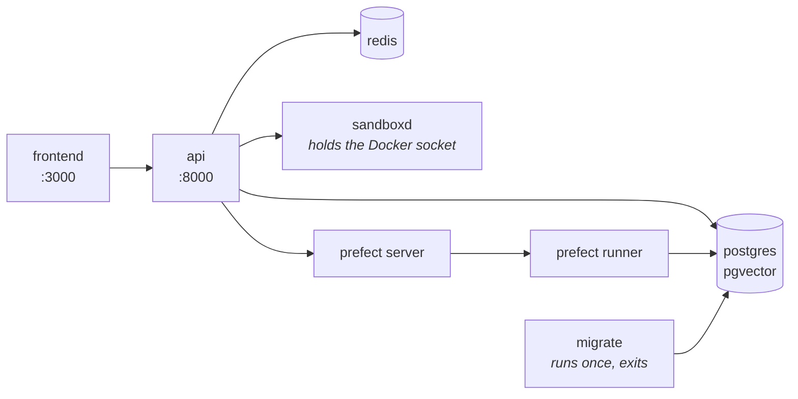
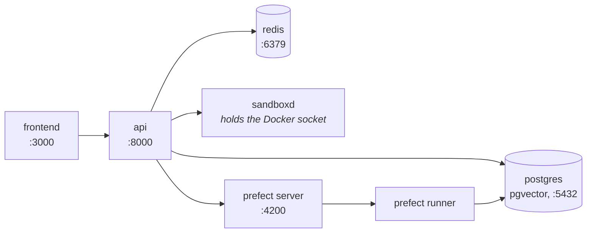

# Instalación { #install }

Con dos comandos se pasa de una máquina con Docker a un agent que responde:
`docker compose up -d` sobre un único archivo descargado, y un bootstrap dentro
del contenedor que ese comando arrancó. Esta página son esos dos comandos, la
build desde el código para quien vaya a cambiarlo, y qué hacer cuando algo no
arranca.

Cada paso es idempotente — vuelve a ejecutar cualquiera de ellos siempre que no
estés seguro de que surtió efecto.

## Un comando { #one-command }

```bash
curl -fsSL https://raw.githubusercontent.com/vstorm-co/agenticos/main/scripts/quickstart.sh | bash
```

`scripts/quickstart.sh` necesita Docker y nada más - el plugin Compose en 2.24 o
posterior, cosa que comprueba. Descarga el `docker-compose.yml` de la última
release en `./agenticos`, escribe un `.env` a su lado (modo 0600) con un
`SECRET_KEY`, un `VAULT_MASTER_KEY` y un token de sandbox generados, hace cuatro
preguntas, descarga las imágenes publicadas y levanta el stack - consola
incluida - crea una organización con un propietario (owner) y un agent publicado,
y opcionalmente replica el registro MCP. Ejecutado dentro de un clon, construye
esas mismas imágenes desde el árbol. Un `docker-compose.yml` que pertenezca a
otro proyecto se deja en paz: la instalación va a `./agenticos`, al lado.

Acepta `--check` para informar solo de lo que falta, `--dry-run` para imprimir
todos los comandos que ejecutaría sin ejecutar ninguno, y `--yes` junto con
`--provider`, `--api-key`, `--email`, `--password` y `--org` para una instalación
desatendida.

Todo lo de abajo es lo que hace, por si prefieres hacerlo tú — y no hay ningún
paso suyo que tú no puedas dar.

## Requisitos { #requirements }

| Para | Necesitas |
|---|---|
| **Ejecutarlo** | Docker con el plugin Compose, 2.24 o posterior - Docker Desktop, OrbStack, o Engine con `docker-compose-plugin`. <https://docs.docker.com/get-docker/> |
| **Cambiarlo** | Lo anterior, más GNU Make, [uv](https://docs.astral.sh/uv/) y [bun](https://bun.sh) - `make install` comprueba los tres |

!!! warning "En Windows, usa WSL2"

    El Makefile y los ayudantes de shell dan por hecho bash. **WSL2** o **Git
    Bash**. Una vez dentro de uno de los dos, todo lo de abajo es idéntico.

## Ejecútalo desde las imágenes publicadas { #run-it-from-the-published-images }

El producto son dos imágenes, `ghcr.io/vstorm-co/agenticos-backend` y
`ghcr.io/vstorm-co/agenticos-frontend`, publicadas por
[cada release](https://github.com/vstorm-co/agenticos/releases) para amd64 y
arm64. El `docker-compose.yml` de la raíz del repositorio las descarga y arranca
todo lo que hay a su alrededor, y funciona por sí solo:

```bash
mkdir agenticos && cd agenticos
curl -fsSLO https://raw.githubusercontent.com/vstorm-co/agenticos/main/docker-compose.yml
docker compose up -d
```

Eso descarga las imágenes y arranca **Postgres (con pgvector), Redis, el
servidor y el runner de Prefect, la API y la consola**, ejecuta las migraciones y
responde en <http://localhost:3000>. La primera descarga son unos 2 GB.



!!! success "No hay ningún `.env` que escribir antes"

    Cada variable de `docker-compose.yml` lleva un valor por defecto,
    deliberadamente. Escribe un `.env` a su lado cuando haya algo que cambiar -
    todo ello opcional:

    | | |
    |---|---|
    | `AGENTICOS_VERSION` | Qué release ejecutar. `latest` cuando no se define; una versión como `0.0.380` para fijar una, `edge` para lo último que haya publicado `main` |
    | `PUBLIC_API_URL`, `PUBLIC_WS_URL`, `PUBLIC_SITE_URL` | Lo que se le dice al *navegador* que llame, cuando al host se llega por un nombre que no es `localhost`. El `FRONTEND_URL` y el `CORS_ORIGINS` del backend son el mismo hecho desde su lado |
    | `OAUTH_PROVIDERS`, `CHAT_MAX_UPLOAD_SIZE_MB` | Los botones de inicio de sesión que ofrece la consola, y lo que el compositor rechaza antes de subirlo |
    | `SECRET_KEY`, `VAULT_MASTER_KEY` | Opcionales en un portátil, donde los valores por defecto son una constante del repositorio y un vault sellado con ella. `scripts/quickstart.sh` genera los dos; a mano, `openssl rand -hex 32` cada uno - y guarda una copia de la clave del vault junto con la base de datos, porque un volcado restaurado junto a otra clave es ilegible |
    | Cualquier cosa de `backend/.env.example` | Una clave de provider, SMTP, un token de Logfire - los contenedores leen el mismo archivo |

    Las imágenes leen ese `.env`, y `backend/.env` cuando lo hay, así que un clon
    guarda sus ajustes donde el resto de esta documentación dice que se mire.

El servicio de la sandbox - el que le da a un agent un contenedor en el que
ejecutar código - está detrás del perfil `sandbox`, porque tiene el socket de
Docker y se niega a arrancar sin un token propio:

```bash
echo "SANDBOXD_TOKEN=$(head -c 32 /dev/urandom | base64)" >> .env
docker compose --profile sandbox up -d
```

El token se genera una vez y después se deja en paz. Regenerarlo deja huérfano
cada workspace que el servicio esté guardando. (`scripts/quickstart.sh` hace las
dos cosas por ti.)

## O constrúyelo desde un clon { #or-build-it-from-a-clone }

```bash
git clone https://github.com/vstorm-co/agenticos
cd agenticos
make dev
```

Un clon tiene `docker-compose.override.yml` junto al archivo base, y Compose
fusiona los dos por su cuenta - así que el mismo `docker compose up` que descarga
imágenes en un directorio vacío aquí las construye desde el árbol, monta el
código con bind mount y recarga la API en cada edición. Eso es lo que ejecuta
`make dev`, con el perfil de la sandbox encendido y un `SANDBOXD_TOKEN` generado
antes en `backend/.env` (nunca regenera uno que ya esté).

Cuando sí quieras cambiar algo — una clave de provider en el host, otro nombre de
base de datos — edita `backend/.env`. `make install` lo crea a partir de
`backend/.env.example` cuando no hay ninguno, y después nunca lo sobrescribe, así
que el archivo que guarda tus claves sobrevive a cada nueva ejecución.

La primera build tarda unos minutos: la imagen del backend lleva LibreOffice y
Tesseract para analizar documentos, y la consola es una build de producción de
Next.js. Después la caché de capas de Docker la deja en un minuto
aproximadamente, y los bind mounts hacen que una edición no necesite reconstruir
nada.



Las migraciones se ejecutan como el servicio `migrate` cada vez que arranca el
stack, y no hacen nada cuando la base de datos ya está en head - que es por lo
que `make dev` es también el comando que hay que volver a ejecutar tras cualquier
cambio de código o de configuración.

### La consola, en un clon { #the-console-in-a-clone }

```bash
make dev-frontend      # or: cd frontend && bun dev
```

!!! info "`make dev` no la arranca, y no es un descuido"

    En un clon la consola está detrás del perfil de compose `console`, para que
    trabajar en la API no reconstruya una imagen de frontend, y para que ejecutar
    `bun dev` en tu host no pelee con un contenedor por el puerto 3000. Fuera de
    un clon no hay perfil: `docker compose up` la arranca con todo lo demás.

## Crea una organización, un propietario, un modelo y un agent { #create-an-organization-an-owner-a-model-and-an-agent }

```bash
make platform-bootstrap BOOTSTRAP_API_KEY=sk-...               # in a clone
docker compose exec -T -e BOOTSTRAP_API_KEY=sk-... app \
  agenticos cmd bootstrap                                     # anywhere else
```

Este es el que convierte una base de datos vacía en algo que puedes usar.

Un AgenticOS vacío es un problema del huevo y la gallina — un agent necesita un
modelo, un modelo necesita una clave, una clave necesita una organización — y
esto recorre esa cadena una vez:

| Crea | |
|---|---|
| Una organización | `Acme`, o `--org` |
| Un propietario | `admin@example.com` / `admin123`, o `--email` / `--password` |
| Una entrada en el vault | Tu clave de provider, sellada para esa organización |
| Un perfil de modelo | `gpt-4.1`, `claude-sonnet-4-6`, `gemini-2.5-pro` o `openai/gpt-4.1`, según de qué provider sea la clave |
| Un agent | `@getting-started`, publicado si hay una clave |

Ahora abre <http://localhost:3000>, inicia sesión como `admin@example.com` /
`admin123` y ve a **Agents → Getting Started → Test**.

Ya tienes un agent que funciona.

!!! tip "¿Todavía sin clave de provider?"

    Deja `BOOTSTRAP_API_KEY` fuera. Todo se crea igualmente y el agent de
    demostración se guarda como **draft** en vez de publicado — un agent sin
    modelo no puede responder, y publicar uno que falla en su primer mensaje es
    peor que no publicarlo.

    Añade una clave en **Settings → AI providers** y después publícalo.

!!! note "`make seed` es otra cosa"

    Crea `admin@example.com` como superadmin del despliegue y nada más: ni
    organización, ni modelo, ni agent. `make platform-bootstrap` crea también ese
    usuario, así que en una instalación nueva lo que quieres es bootstrap.

    `make dev` imprime una sugerencia de ejecutar `seed`. Es el camino antiguo, y
    sigue valiendo si lo único que quieres es un acceso de administrador.

## Compruébalo { #check-it }

```bash
docker compose exec app agenticos cmd doctor
```

`doctor` hace las preguntas que haría un primer mensaje. ¿Se llega a la base de
datos y está en head? ¿Descifra el vault? ¿Hay un perfil de modelo con una clave
detrás? ¿Responde cada conexión de sandbox registrada con un runtime?

Cada línea nombra la pieza que falta, en vez de decirte que algo ha fallado.

## Resumen { #recap }

```bash
mkdir agenticos && cd agenticos
curl -fsSLO https://raw.githubusercontent.com/vstorm-co/agenticos/main/docker-compose.yml
docker compose up -d                                             # everything, from the published images
docker compose exec -T -e BOOTSTRAP_API_KEY=sk-... app \
  agenticos cmd bootstrap                                       # an org, an owner, a model, an agent
```

Después <http://localhost:3000>, `admin@example.com` / `admin123`. Si en vez de
eso vas a cambiar el código: `git clone`, `make dev`, `make dev-frontend`,
`make platform-bootstrap`.

## Cuando no arranca { #when-it-does-not-come-up }

| Lo que ves | Por qué |
|---|---|
| La ingesta da 500 con `extension "vector" is not available` | Postgres estándar en vez de `pgvector/pgvector:pg16`. Ver más abajo |
| `uv run` informa de Python 3.13 o 3.14 | `backend/.venv` resolvió por encima del pin. Bórralo y vuelve a ejecutar `uv sync` |
| El frontend carga pero todas las peticiones fallan | La API todavía está arrancando - espera al servicio `migrate` - o al navegador se le dijo el host equivocado: `PUBLIC_API_URL` y `PUBLIC_WS_URL` tienen que ser alcanzables desde donde esté el navegador. `docker compose logs migrate app` |
| `docker compose up` falla con `unauthorized` en `ghcr.io/vstorm-co/...` | El paquete es privado, o hay un `docker login` caducado a GHCR en medio. Las imágenes se descargan de forma anónima; haz `docker logout ghcr.io` e inténtalo otra vez, y si sigue rechazándolo el problema es la visibilidad del paquete, no tu máquina |
| El servicio `app` está `Up` y `unhealthy`, y todas las peticiones se quedan colgadas | Un bucle de eventos atascado. El worker se tumba a sí mismo a los 15 s y algo lo reemplaza, en los tres stacks — así que si un minuto después sigue colgado, `EVENT_LOOP_WEDGED_AFTER` está puesto a `0` en algún sitio, que es lo que necesita un depurador y lo que no debería necesitar nada más. `docker inspect` muestra `137` con `OOMKilled=false`, y la línea de log de encima dice cuál |
| El servicio `sandboxd` termina inmediatamente | No hay `SANDBOXD_TOKEN` en `.env` ni en `backend/.env`. `make sandbox-token` en un clon, o escribe uno, y después `up -d` otra vez |
| Files dice `This host's files could not be read` y nombra `workspace_root` | Un servicio de sandbox arrancó antes de tener uno. Recréalo — `docker compose --profile sandbox up -d sandboxd` — y haz `docker rm` de los contenedores `sandboxd-*` que queden: un contenedor persistido se reengancha con los montajes con los que se creó, así que una sesión antigua sigue escribiendo donde nadie puede leer |
| `Stopped: another AgenticOS stack named 'agenticos' runs on this machine` | Compose nombra un proyecto según su directorio, así que un clon en `~/agenticos` y una instalación en `./agenticos` son un mismo proyecto para Docker, y arrancar el segundo se apropiaría de los contenedores y la base de datos del primero - bajo un `VAULT_MASTER_KEY` recién generado que no puede leer lo que el primero selló. El instalador se niega en su lugar; detén el otro stack (`docker compose down` conserva sus volúmenes) o instala con otro nombre usando `--dir` |
| Un puerto ya está ocupado (3000, 5432, 6379, 8000, 4200) | Hay otra cosa en él. `make dev-down`, detén el otro proceso y arranca otra vez |
| Cualquier cosa más rara | `make docker-clean` borra contenedores, redes **y volúmenes** — todos los datos locales — y después `make dev` desde cero |

### La base de datos debe ser pgvector { #the-database-must-be-pgvector }

!!! danger "No el Postgres estándar"

    Si la ingesta de documentos da 500 en un entorno nuevo, comprueba la imagen
    antes que ninguna otra cosa.

El almacén de recuperación emite `CREATE EXTENSION IF NOT EXISTS vector` la
primera vez que se escribe en una colección. El Postgres estándar responde
`extension "vector" is not available` — un 500 antes de que se confirme ninguna
fila.

Todos los archivos de compose de este repositorio fijan `pgvector/pgvector:pg16`.

## El día a día { #day-to-day }

```bash
make dev           # start or restart (idempotent); in a clone, from source
make dev-down      # stop everything
make dev-logs      # tail logs
make dev-rebuild   # force-rebuild the backend image after a pyproject change
make dev-frontend  # start the console container (behind the `console` profile in a clone)
```

Fuera de un clon, esos mismos cuatro son `docker compose up -d`, `down`,
`logs -f`, y `docker compose pull && docker compose up -d` para pasar a una
release más nueva.

Y dónde está cada cosa:

| | |
|---|---|
| Frontend | <http://localhost:3000> |
| API | <http://localhost:8000> |
| Documentación OpenAPI | <http://localhost:8000/docs> |
| Admin al estilo de Django | <http://localhost:8000/admin> |
| Interfaz de Prefect | <http://localhost:4200> |
| Postgres | `localhost:5432` (`postgres` / `postgres`) - publicado solo por el archivo override del clon |
| Redis | `localhost:6379` - lo mismo |

!!! warning "El servicio de la sandbox no se publica, a propósito"

    Tiene el socket de Docker, que es una API sin autenticación para root en el
    host. Solo es alcanzable desde dentro de la red de compose, y la API hace de
    proxy de lo que un navegador necesite ver de él.

## Ejecutar el backend en tu host { #running-the-backend-on-your-host }

Útil para puntos de interrupción y para depurar desde el IDE. Los servicios se
quedan en Docker; la API no.

```bash
make install                                    # .env + uv sync + bun install + pre-commit
docker compose up -d db redis
make db-upgrade                                 # apply migrations
make run                                        # uvicorn --reload
```

`make install` es todo el camino de configuración: `backend/.env` a partir del
ejemplo si no hay ninguno, `uv sync` para el backend,
`bun install --frozen-lockfile` para `frontend/node_modules`, y los hooks de
pre-commit.

Ninguna de las tres cosas es opcional, y cada una faltó en algún momento:

- **`backend/.env`** es lo que lee todo lo que se ejecuta en tu host —
  `db-check`, `db-upgrade`, `run` y pytest, todos a través de `app.core.config`.
  Sin él, `POSTGRES_PASSWORD` está vacía y `alembic check` se rechaza con
  `fe_sendauth: no password supplied`.
- **`frontend/node_modules`** contiene eslint, prettier, tsc, vitest y next, así
  que la mitad del frontend hay que instalarla aunque solo toques Python.
  `make check` ejecuta los cinco.

Las dos son por checkout y no se comparten entre dos worktrees, así que esto hay
que hacerlo en cada clon y no una vez por portátil.

!!! note "Python está fijado a 3.12"

    `backend/.python-version` lo fija, en correspondencia con `requires-python`,
    `backend/Dockerfile` y todos los jobs de CI. Si `uv run python -V` informa de
    otra cosa, borra `backend/.venv` y vuelve a ejecutar `uv sync` — un
    intérprete más nuevo tiene APIs alcanzables que el que se publica no tiene.

## Entornos { #environments }

Tres. Cada uno ejecuta las dos imágenes publicadas, en el `AGENTICOS_VERSION` que
nombre su archivo de entorno; el portátil es el que en su lugar las construye
desde el árbol.

| Objetivo | Archivos de compose | Para qué |
|---|---|---|
| `docker compose up` | `docker-compose.yml` | El producto, desde las imágenes publicadas. Consola incluida, las migraciones se ejecutan al arrancar, cada variable con valor por defecto |
| `make dev` | `docker-compose.yml`<br>`docker-compose.override.yml` | Local, en un clon. El override construye desde el código, lo monta con bind mount, recarga, y publica Postgres y Redis al host |
| `make dev-server` | `docker-compose-dev.yml`<br>`docker-compose-dev.frontend.yml` | Un entorno de desarrollo desplegado. Descarga `edge`, sin bind mounts, sin puerto de base de datos, logs detallados |
| `make prod` | `docker-compose-prod.yml`<br>`docker-compose-prod.frontend.yml` | Producción. Descarga una release fijada; límites de recursos, red de datos interna, Postgres ajustado |

Cada uno tiene sus hermanos `-down`, `-logs` y `-frontend`. `make stage` se
mantiene como alias de `make dev-server`, que es lo que era antes.

Los dos entornos desplegados quieren un proxy inverso delante, y hay dos maneras
de dárselo. Por defecto el stack publica los dos puertos en el loopback y un
proxy del host llega a ellos - `nginx/nginx.conf` es esa plantilla, y resuelve
`backend:8000` y `frontend:3000` como alias de red. `make prod PROXY=traefik`
añade en su lugar dos archivos de overlay que ponen los contenedores en la red de
un Traefik ya existente con las etiquetas por las que este los descubre.
[Desplegar](deploy.md) recorre los dos.

El proxy llega a ellos por esos alias, así que producción publica los dos puertos
en `127.0.0.1` y nada fuera del host puede llegar directamente a ninguno. Eso es
una frontera de seguridad y no un afán de orden: con
[`RATE_LIMIT_TRUST_FORWARDED_FOR`](configuration.md#rate_limit_auth_per_minute-and-why-the-auth-surface-has-its-own)
activo, lo que pueda llegar más allá del proxy elige la dirección contra la que
se cuentan sus peticiones. Pon `BIND_HOST=0.0.0.0` para un proxy que se ejecute
en otro sitio.

Lo que supervisa la API es distinto en los tres, y cada uno recupera un worker
que ha muerto: el stack local ejecuta su propio supervisor de recarga, el stack
de desarrollo es un único proceso cuya salida Docker reinicia, y producción
ejecuta cuatro workers bajo el `Multiprocess` de uvicorn. Un worker *atascado* en
vez de muerto se trata igual en todas partes — el worker se mata a sí mismo. Ver
[Configuración](configuration.md#a-worker-whose-event-loop-has-stopped-turning).

!!! warning "`PUBLIC_*` es lo que se le dice al navegador, y se leen al arrancar"

    `PUBLIC_API_URL`, `PUBLIC_WS_URL` y `PUBLIC_SITE_URL` son las direcciones que
    la consola le entrega al navegador - el WebSocket del chat y la redirección
    de inicio de sesión llegan a la API directamente, así que tienen que ser
    nombres que un navegador pueda resolver, nunca un nombre de contenedor. Los
    archivos del frontend de dev-server y de producción se niegan a arrancar sin
    ellas.

    La consola las lee cuando arranca el contenedor, así que la imagen publicada
    es la misma para todos los despliegues y un cambio es un reinicio.
    Equivocarse en una sigue siendo el fallo clásico: el renderizado en servidor
    sigue funcionando sobre la red de compose mientras cada llamada desde el
    navegador va al host equivocado.

## Siguiente { #next }

<div class="grid cards" markdown>

- :material-rocket-launch:{ .lg .middle } **[Tu primer agent](first-agent.md)**

    De una clave a un agent publicado y medido.

- :material-lightbulb:{ .lg .middle } **[Conceptos](concepts.md)**

    Qué son en realidad un spec, una versión y una exposición.

</div>

Para todos los ajustes que hay, ver [Configuración](configuration.md). Para
llevar esto a un host de verdad, ver [Desplegar](deploy.md).
