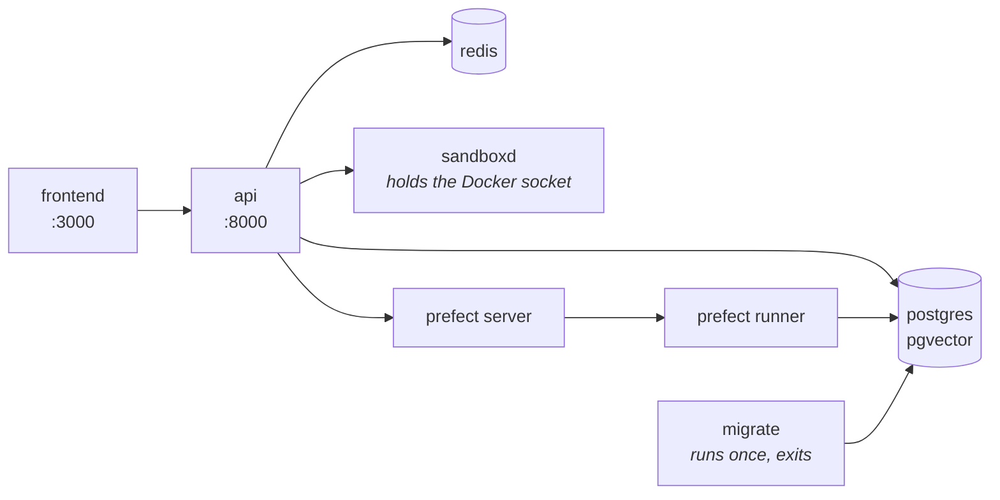
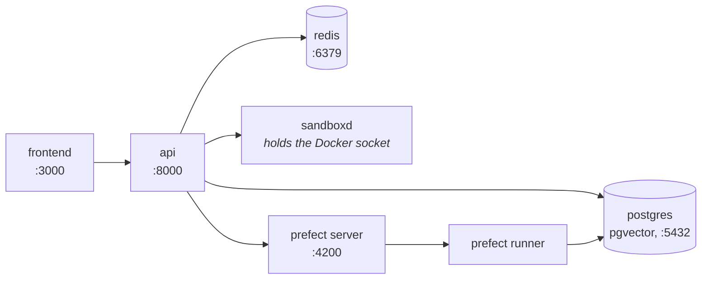

# Install

Two commands get from a machine with Docker on it to an agent that answers:
`docker compose up -d` against one downloaded file, and a bootstrap inside the
container it started. This page is those two commands, the source build for
anyone changing the code, and what to do when something does not come up.

Every step is idempotent — re-run any of them whenever you are not sure it took.

## One command

```bash
curl -fsSL https://raw.githubusercontent.com/vstorm-co/agenticos/main/scripts/quickstart.sh | bash
```

`scripts/quickstart.sh` needs Docker and nothing else - the Compose plugin at
2.24 or later, which it checks. It downloads `docker-compose.yml` at the latest
release into `./agenticos`, writes a `.env` beside it (mode 0600) with a
generated `SECRET_KEY`, `VAULT_MASTER_KEY` and sandbox token, asks four
questions, pulls the published images and brings the stack up - console
included - creates an organization with an owner and a published agent, and
optionally mirrors the MCP registry. Run from inside a clone, it builds the same
images from the tree instead. A `docker-compose.yml` that belongs to another
project is left alone: the install goes into `./agenticos` beside it.

It takes `--check` to only report what is missing, `--dry-run` to print every
command it would run without running one, and `--yes` with `--provider`,
`--api-key`, `--email`, `--password` and `--org` for an unattended install.

Everything below is what it does, in case you would rather do it yourself - and
there is no step it takes that you cannot.

## Requirements

| To | You need |
|---|---|
| **Run it** | Docker with the Compose plugin, 2.24 or later - Docker Desktop, OrbStack, or Engine with `docker-compose-plugin`. <https://docs.docker.com/get-docker/> |
| **Change it** | The above, plus GNU Make, [uv](https://docs.astral.sh/uv/) and [bun](https://bun.sh) - `make install` checks for all three |

!!! warning "On Windows, use WSL2"

    The Makefile and the shell helpers assume bash. **WSL2** or **Git Bash**.
    Once you are inside one, everything below is identical.

## Run it from the published images

The product is two images, `ghcr.io/vstorm-co/agenticos-backend` and
`ghcr.io/vstorm-co/agenticos-frontend`, published by
[every release](https://github.com/vstorm-co/agenticos/releases) for amd64 and
arm64. `docker-compose.yml` at the root of the repository pulls them and starts
everything around them, and it works on its own:

```bash
mkdir agenticos && cd agenticos
curl -fsSLO https://raw.githubusercontent.com/vstorm-co/agenticos/main/docker-compose.yml
docker compose up -d
```

That pulls the images and starts **Postgres (with pgvector), Redis, the Prefect
server and runner, the API and the console**, runs the migrations, and answers on
<http://localhost:3000>. The first pull is about 2 GB.



!!! success "There is no `.env` to write first"

    Every variable in `docker-compose.yml` carries a default, deliberately. Write
    a `.env` beside it when there is something to change - all of it optional:

    | | |
    |---|---|
    | `AGENTICOS_VERSION` | Which release to run. `latest` when unset; a version such as `0.0.380` to pin one, `edge` for whatever `main` last published |
    | `PUBLIC_API_URL`, `PUBLIC_WS_URL`, `PUBLIC_SITE_URL` | What the *browser* is told to call, when the host is reached by a name other than `localhost`. The backend's `FRONTEND_URL` and `CORS_ORIGINS` are the same fact from its side |
    | `OAUTH_PROVIDERS`, `CHAT_MAX_UPLOAD_SIZE_MB` | The sign-in buttons the console offers, and what the composer refuses before uploading |
    | `SECRET_KEY`, `VAULT_MASTER_KEY` | Optional on a laptop, where the defaults are a constant from the repository and a vault sealed under it. `scripts/quickstart.sh` generates both; by hand, `openssl rand -hex 32` each - and back the vault key up with the database, because a dump restored beside a different key is unreadable |
    | Anything from `backend/.env.example` | A provider key, SMTP, a Logfire token - the containers read the same file |

    The images read that `.env`, and `backend/.env` when there is one, so a clone
    keeps its settings where the rest of this documentation says to look.

The sandbox service - the one that gives an agent a container to run code in -
is behind the `sandbox` profile, because it holds the Docker socket and refuses
to start without a token of its own:

```bash
echo "SANDBOXD_TOKEN=$(head -c 32 /dev/urandom | base64)" >> .env
docker compose --profile sandbox up -d
```

The token is generated once and then left alone. Regenerating it orphans every
workspace the service is holding. (`scripts/quickstart.sh` does both of these
for you.)

## Or build it from a clone

```bash
git clone https://github.com/vstorm-co/agenticos
cd agenticos
make dev
```

A clone has `docker-compose.override.yml` beside the base file, and Compose
merges the two on its own - so the same `docker compose up` that pulls images in
an empty directory builds them from the tree here, bind-mounts the source, and
reloads the API on every edit. That is what `make dev` runs, with the sandbox
profile on and a `SANDBOXD_TOKEN` generated into `backend/.env` first (it never
regenerates one that is there).

When you do want to change something — a provider key on the host, a different
database name — edit `backend/.env`. `make install` creates it from
`backend/.env.example` when there is none, and never overwrites it afterwards, so
the file holding your keys survives every re-run.

The first build takes a few minutes: the backend image carries LibreOffice and
Tesseract for document parsing, and the console is a Next.js production build.
Afterwards Docker's layer cache makes it about a minute, and the bind mounts mean
an edit needs no rebuild at all.



Migrations run as the `migrate` service every time the stack starts, and are a
no-op when the database is already at head - which is why `make dev` is also the
command to re-run after any code or config change.

### The console, in a clone

```bash
make dev-frontend      # or: cd frontend && bun dev
```

!!! info "Not started by `make dev`, and not an oversight"

    In a clone the console sits behind the `console` compose profile, so that
    working on the API does not rebuild a frontend image, and so that running
    `bun dev` on your host is not fighting a container for port 3000. Outside a
    clone there is no profile: `docker compose up` starts it with everything else.

## Create an organization, an owner, a model and an agent

```bash
make platform-bootstrap BOOTSTRAP_API_KEY=sk-...               # in a clone
docker compose exec -T -e BOOTSTRAP_API_KEY=sk-... app \
  agenticos cmd bootstrap                                     # anywhere else
```

This is the one that turns an empty database into something you can use.

An empty AgenticOS is a chicken-and-egg problem — an agent needs a model, a model
needs a key, a key needs an organization — and this walks that chain once:

| It creates | |
|---|---|
| An organization | `Acme`, or `--org` |
| An owner | `admin@example.com` / `admin123`, or `--email` / `--password` |
| A vault entry | Your provider key, sealed for that organization |
| A model profile | `gpt-4.1`, `claude-sonnet-4-6`, `gemini-2.5-pro` or `openai/gpt-4.1`, whichever provider the key is for |
| An agent | `@getting-started`, published if there is a key |

Now open <http://localhost:3000>, sign in as `admin@example.com` / `admin123`, and
go to **Agents → Getting Started → Test**.

You have a working agent.

!!! tip "No provider key yet?"

    Leave `BOOTSTRAP_API_KEY` out. Everything is still created and the demo agent
    is saved as a **draft** rather than published — an agent with no model cannot
    answer, and publishing one that fails on its first message is worse than not
    publishing it.

    Add a key under **Settings → AI providers**, then publish.

!!! note "`make seed` is a different thing"

    It creates `admin@example.com` as a deployment superadmin and nothing else:
    no organization, no model, no agent. `make platform-bootstrap` creates that
    user too, so on a fresh install you want bootstrap.

    `make dev` prints a suggestion to run `seed`. It is the older path, and still
    valid if all you want is an admin login.

## Check it

```bash
docker compose exec app agenticos cmd doctor
```

`doctor` asks the questions a first message would ask. Is the database reachable
and at head? Does the vault decrypt? Is there a model profile with a key behind
it? Does every registered sandbox connection answer with a runtime?

Each line names the part that is missing, rather than telling you something
failed.

## Recap

```bash
mkdir agenticos && cd agenticos
curl -fsSLO https://raw.githubusercontent.com/vstorm-co/agenticos/main/docker-compose.yml
docker compose up -d                                             # everything, from the published images
docker compose exec -T -e BOOTSTRAP_API_KEY=sk-... app \
  agenticos cmd bootstrap                                       # an org, an owner, a model, an agent
```

Then <http://localhost:3000>, `admin@example.com` / `admin123`. To change the
code instead: `git clone`, `make dev`, `make dev-frontend`, `make platform-bootstrap`.

## When it does not come up

| What you see | Why |
|---|---|
| Ingestion 500s with `extension "vector" is not available` | Stock Postgres instead of `pgvector/pgvector:pg16`. See below |
| `uv run` reports Python 3.13 or 3.14 | `backend/.venv` resolved past the pin. Delete it and re-run `uv sync` |
| The frontend loads but every request fails | The API is still starting - it waits for the `migrate` service - or the browser was told the wrong host: `PUBLIC_API_URL` and `PUBLIC_WS_URL` have to be reachable from where the browser is. `docker compose logs migrate app` |
| `docker compose up` fails with `unauthorized` on `ghcr.io/vstorm-co/...` | The package is private, or a stale `docker login` to GHCR is in the way. The images pull anonymously; `docker logout ghcr.io` and try again, and if it still refuses the package's visibility is the problem, not your machine |
| The `app` service is `Up` and `unhealthy`, and every request hangs | A wedged event loop. The worker takes itself down after 15s and something replaces it, in all three stacks — so if it is still hanging a minute later, `EVENT_LOOP_WEDGED_AFTER` is set to `0` somewhere, which is what a debugger needs and what nothing else should. `docker inspect` shows `137` with `OOMKilled=false`, and the log line above it says which |
| The `sandboxd` service exits immediately | No `SANDBOXD_TOKEN` in `.env` or `backend/.env`. `make sandbox-token` in a clone, or write one, then `up -d` again |
| Files says `This host's files could not be read` and names `workspace_root` | A sandbox service started before it had one. Recreate it — `docker compose --profile sandbox up -d sandboxd` — and `docker rm` the leftover `sandboxd-*` containers: a persisted container is reattached with the mounts it was created with, so an old session keeps writing where nothing can read it |
| `Stopped: another AgenticOS stack named 'agenticos' runs on this machine` | Compose names a project after its directory, so a clone at `~/agenticos` and an install at `./agenticos` are one project to Docker, and starting the second would take over the first's containers and database - under a freshly generated `VAULT_MASTER_KEY` that cannot read what the first sealed. The installer refuses instead; stop the other stack (`docker compose down` keeps its volumes) or install under another name with `--dir` |
| A port is already taken (3000, 5432, 6379, 8000, 4200) | Something else is on it. `make dev-down`, stop the other process, start again |
| Anything stranger | `make docker-clean` wipes containers, networks **and volumes** — all local data — then `make dev` from scratch |

### The database must be pgvector

!!! danger "Not stock Postgres"

    If document ingestion 500s on a fresh environment, check the image before you
    check anything else.

The retrieval store issues `CREATE EXTENSION IF NOT EXISTS vector` the first time
a collection is written to. Stock Postgres answers
`extension "vector" is not available` — a 500 before any row is committed.

Every compose file in this repository pins `pgvector/pgvector:pg16`.

## Day to day

```bash
make dev           # start or restart (idempotent); in a clone, from source
make dev-down      # stop everything
make dev-logs      # tail logs
make dev-rebuild   # force-rebuild the backend image after a pyproject change
make dev-frontend  # start the console container (behind the `console` profile in a clone)
```

Outside a clone the same four are `docker compose up -d`, `down`, `logs -f`, and
`docker compose pull && docker compose up -d` to move to a newer release.

And where everything is:

| | |
|---|---|
| Frontend | <http://localhost:3000> |
| API | <http://localhost:8000> |
| OpenAPI docs | <http://localhost:8000/docs> |
| Django-style admin | <http://localhost:8000/admin> |
| Prefect UI | <http://localhost:4200> |
| Postgres | `localhost:5432` (`postgres` / `postgres`) - published by the clone's override file only |
| Redis | `localhost:6379` - the same |

!!! warning "The sandbox service is not published, on purpose"

    It holds the Docker socket, which is an unauthenticated API for root on the
    host. It is reachable only from inside the compose network, and the API
    proxies whatever a browser needs to see of it.

## Running the backend on your host

Useful for breakpoints and IDE debugging. The services stay in Docker; the API
does not.

```bash
make install                                    # .env + uv sync + bun install + pre-commit
docker compose up -d db redis
make db-upgrade                                 # apply migrations
make run                                        # uvicorn --reload
```

`make install` is the whole setup path: `backend/.env` from the example if there
is none, `uv sync` for the backend, `bun install --frozen-lockfile` for
`frontend/node_modules`, and the pre-commit hooks.

None of the three is optional, and each was missing at some point:

- **`backend/.env`** is what everything running on your host reads — `db-check`,
  `db-upgrade`, `run` and pytest, all through `app.core.config`. Without one,
  `POSTGRES_PASSWORD` is empty and `alembic check` is refused with
  `fe_sendauth: no password supplied`.
- **`frontend/node_modules`** holds eslint, prettier, tsc, vitest and next, so the
  frontend half is owed even if you only ever touch Python. `make check` runs all
  five.

Both are per-checkout and shared between no two worktrees, so this is owed on
every clone rather than once per laptop.

!!! note "Python is pinned to 3.12"

    `backend/.python-version` pins it, matching `requires-python`,
    `backend/Dockerfile` and every CI job. If `uv run python -V` reports anything
    else, delete `backend/.venv` and re-run `uv sync` — a newer interpreter has
    reachable APIs that the one which ships does not.

## Environments

Three. Every one runs the two published images, at the `AGENTICOS_VERSION` its
env file names; the laptop is the one that builds them from the tree instead.

| Target | Compose files | Use |
|---|---|---|
| `docker compose up` | `docker-compose.yml` | The product, from the published images. Console included, migrations run on start, every variable defaulted |
| `make dev` | `docker-compose.yml`<br>`docker-compose.override.yml` | Local, in a clone. The override builds from source, bind-mounts it, reloads, and publishes Postgres and Redis to the host |
| `make dev-server` | `docker-compose-dev.yml`<br>`docker-compose-dev.frontend.yml` | A deployed dev environment. Pulls `edge`, no bind mounts, no database port, verbose logging |
| `make prod` | `docker-compose-prod.yml`<br>`docker-compose-prod.frontend.yml` | Production. Pulls a pinned release; resource limits, internal data network, tuned Postgres |

Each has matching `-down`, `-logs` and `-frontend` siblings. `make stage` is kept
as an alias for `make dev-server`, which is what it used to be.

Both deployed environments want a reverse proxy in front of them, and there are
two ways to give them one. By default the stack publishes both ports on the
loopback and a proxy on the host reaches them - `nginx/nginx.conf` is that
template, and it resolves `backend:8000` and `frontend:3000` as network aliases.
`make prod PROXY=traefik` instead adds two overlay files that put the containers
on an existing Traefik's network with the labels it discovers them by.
[Deploy](deploy.md) walks through both.

The proxy reaches them by those aliases, so production publishes both ports on
`127.0.0.1` and nothing off the host can reach either directly. That is a
security boundary rather than tidiness: with
[`RATE_LIMIT_TRUST_FORWARDED_FOR`](configuration.md#rate_limit_auth_per_minute-and-why-the-auth-surface-has-its-own)
on, whatever can reach past the proxy chooses the address its requests are
counted against. Set `BIND_HOST=0.0.0.0` for a proxy that runs somewhere else.

What supervises the API differs in all three, and each recovers a worker that
died: the local stack runs its own reload supervisor, the dev stack is a single
process whose exit Docker restarts, and production runs four workers under
uvicorn's `Multiprocess`. A worker that is *wedged* rather than dead is handled
the same way everywhere — the worker kills itself. See
[Configuration](configuration.md#a-worker-whose-event-loop-has-stopped-turning).

!!! warning "`PUBLIC_*` are what the browser is told, and they are read at start"

    `PUBLIC_API_URL`, `PUBLIC_WS_URL` and `PUBLIC_SITE_URL` are the addresses the
    console hands the browser - the chat WebSocket and the sign-in redirect reach
    the API directly, so they have to be names a browser can resolve, never a
    container name. The dev-server and production frontend files refuse to start
    without them.

    The console reads them when the container starts, so the published image is
    the same for every deployment and a change is a restart. Getting one wrong is
    still the classic failure: server-side rendering keeps working over the compose
    network while every call from the browser goes to the wrong host.

## Next

<div class="grid cards" markdown>

- :material-rocket-launch:{ .lg .middle } **[Your first agent](first-agent.md)**

    From a key to a published, metered agent.

- :material-lightbulb:{ .lg .middle } **[Concepts](concepts.md)**

    What a spec, a version and an exposure actually are.

</div>

For every setting there is, see [Configuration](configuration.md). For getting
this onto a real host, see [Deploy](deploy.md).
