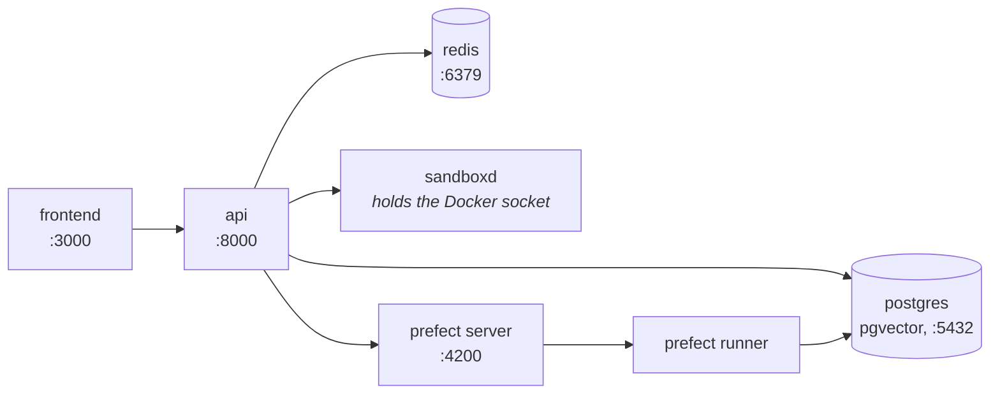

# Install

You need four commands to get from a clean checkout to an agent that answers.
This page is those four commands and what to do when one of them does not work.

Every step is idempotent — re-run any of them whenever you are not sure it took.

## One command

```bash
curl -fsSL https://raw.githubusercontent.com/vstorm-co/agenticos/main/scripts/quickstart.sh | bash
```

`scripts/quickstart.sh` checks what is missing and names the command that
installs it for your platform, clones if you are not already in a clone, asks
four questions, brings the stack up, creates an organization with an owner and a
published agent, and optionally mirrors the MCP registry and starts the console.

It takes `--check` to only report what is missing, `--dry-run` to print every
command it would run without running one, and `--yes` with `--provider`,
`--api-key`, `--email`, `--password` and `--org` for an unattended install.

Everything below is what it does, in case you would rather do it yourself - and
there is no step it takes that you cannot.

## Requirements

| Tool | Version | Get it |
|---|---|---|
| **Docker** | Desktop / Engine 24+ | <https://docs.docker.com/get-docker/> |
| **Make** | GNU Make 3.81+ | Already on macOS and Linux. On Windows, use WSL2 |
| **uv** | latest | `curl -LsSf https://astral.sh/uv/install.sh \| sh` |
| **bun** | 1.x | `curl -fsSL https://bun.sh/install \| bash` |

!!! warning "On Windows, use WSL2"

    The Makefile and the shell helpers assume bash. **WSL2** or **Git Bash**.
    Once you are inside one, everything below is identical.

## Clone it

```bash
git clone https://github.com/vstorm-co/agenticos
cd agenticos
```

!!! success "There is no `.env` to write first"

    Every variable in `docker-compose.yml` carries a default, deliberately, so
    the stack starts on a clean checkout. You are not configuring anything yet.

One value is generated rather than defaulted. `make dev` runs `make sandbox-token`
first, which appends a fresh `SANDBOXD_TOKEN` to `backend/.env` if there is not
one there. The sandbox service refuses to start without it: it can run commands on
this host, so an empty default would be a shared secret of `""`.

It is generated once and then left alone. Regenerating it orphans every workspace
the service is holding.

When you do want to change something — a provider key on the host, a different
database name — edit `backend/.env`. `make install` creates it from
`backend/.env.example` when there is none, and never overwrites it afterwards, so
the file holding your keys survives every re-run.

## Start the stack

```bash
make dev
```

This builds the backend image and starts **Postgres (with pgvector), Redis, the
API, the Prefect server and runner, and the sandbox service**. Then it waits for
the database to accept connections and applies any pending migrations.



Migrations are a no-op when the database is already at head, which is why this is
also the command to re-run after any code or config change.

## Start the frontend

```bash
make dev-frontend      # or: cd frontend && bun dev
```

!!! info "A separate command, and not an oversight"

    `make dev` uses `docker-compose.yml` only. The Next.js container lives in
    `docker-compose.frontend.yml` so that working on the API does not rebuild a
    frontend image, and so that running `bun dev` on your host is not fighting a
    container for port 3000.

## Create an organization, an owner, a model and an agent

```bash
make platform-bootstrap BOOTSTRAP_API_KEY=sk-...
```

This is the one that turns an empty database into something you can use.

An empty AgenticOS is a chicken-and-egg problem — an agent needs a model, a model
needs a key, a key needs an organization — and this walks that chain once:

| It creates | |
|---|---|
| An organization | `Acme`, or `--org` |
| An owner | `admin@example.com` / `admin123`, or `--email` / `--password` |
| A vault entry | Your provider key, sealed for that organization |
| A model profile | `gpt-4.1`, `claude-sonnet-4-6`, `gemini-2.5-pro` or `openai/gpt-4.1`, whichever provider the key is for |
| An agent | `@getting-started`, published if there is a key |

Now open <http://localhost:3000>, sign in as `admin@example.com` / `admin123`, and
go to **Agents → Getting Started → Test**.

You have a working agent.

!!! tip "No provider key yet?"

    Leave `BOOTSTRAP_API_KEY` out. Everything is still created and the demo agent
    is saved as a **draft** rather than published — an agent with no model cannot
    answer, and publishing one that fails on its first message is worse than not
    publishing it.

    Add a key under **Settings → AI providers**, then publish.

!!! note "`make seed` is a different thing"

    It creates `admin@example.com` as a deployment superadmin and nothing else:
    no organization, no model, no agent. `make platform-bootstrap` creates that
    user too, so on a fresh install you want bootstrap.

    `make dev` prints a suggestion to run `seed`. It is the older path, and still
    valid if all you want is an admin login.

## Check it

```bash
cd backend && uv run agenticos cmd doctor
```

`doctor` asks the questions a first message would ask. Is the database reachable
and at head? Does the vault decrypt? Is there a model profile with a key behind
it? Does every registered sandbox connection answer with a runtime?

Each line names the part that is missing, rather than telling you something
failed.

## Recap

```bash
git clone https://github.com/vstorm-co/agenticos && cd agenticos
make dev                                          # postgres, redis, api, worker
make dev-frontend                                 # the console on :3000
make platform-bootstrap BOOTSTRAP_API_KEY=sk-...  # an org, an owner, a model, an agent
```

Then <http://localhost:3000>, `admin@example.com` / `admin123`.

## When it does not come up

| What you see | Why |
|---|---|
| Ingestion 500s with `extension "vector" is not available` | Stock Postgres instead of `pgvector/pgvector:pg16`. See below |
| `uv run` reports Python 3.13 or 3.14 | `backend/.venv` resolved past the pin. Delete it and re-run `uv sync` |
| The frontend loads but every request fails | The frontend without the stack, or the API is still applying migrations. `make dev-logs` |
| `agenticos_backend` is `Up` and `unhealthy`, and every request hangs | A wedged event loop. The worker takes itself down after 15s and something replaces it, in all three stacks — so if it is still hanging a minute later, `EVENT_LOOP_WEDGED_AFTER` is set to `0` somewhere, which is what a debugger needs and what nothing else should. `docker inspect` shows `137` with `OOMKilled=false`, and the log line above it says which |
| `agenticos_sandboxd` exits immediately | No `SANDBOXD_TOKEN` in `backend/.env`. `make sandbox-token`, then `make dev` |
| Files says `This host's files could not be read` and names `workspace_root` | A sandbox service started before it had one. Recreate it — `docker compose -f docker-compose.yml --profile sandbox up -d sandboxd` — and `docker rm` the leftover `sandboxd-*` containers: a persisted container is reattached with the mounts it was created with, so an old session keeps writing where nothing can read it |
| A port is already taken (3000, 5432, 6379, 8000, 4200) | Something else is on it. `make dev-down`, stop the other process, start again |
| Anything stranger | `make docker-clean` wipes containers, networks **and volumes** — all local data — then `make dev` from scratch |

### The database must be pgvector

!!! danger "Not stock Postgres"

    If document ingestion 500s on a fresh environment, check the image before you
    check anything else.

The retrieval store issues `CREATE EXTENSION IF NOT EXISTS vector` the first time
a collection is written to. Stock Postgres answers
`extension "vector" is not available` — a 500 before any row is committed.

Every compose file in this repository pins `pgvector/pgvector:pg16`.

**pgvector 0.8 or newer.** The `pgvector/pgvector` images are well past it, so this
only bites on a database somebody else manages — RDS, Azure and several managed
Postgres services still offer 0.7.x. An agent's memory `recall` asks for
`hnsw.iterative_scan`, which arrived in 0.8 and is what lets the scan carry on
until a scoped query has filled its limit; on 0.7 the setting does not exist, so
recall fails rather than returning fewer facts. `SELECT extversion FROM pg_extension
WHERE extname = 'vector';` says which version a deployment actually has.

## Day to day

```bash
make dev           # start or restart (idempotent)
make dev-down      # stop everything
make dev-logs      # tail logs
make dev-rebuild   # force-rebuild the backend image after a pyproject change
make dev-frontend  # start the Next.js container on its own
```

And where everything is:

| | |
|---|---|
| Frontend | <http://localhost:3000> |
| API | <http://localhost:8000> |
| OpenAPI docs | <http://localhost:8000/docs> |
| Django-style admin | <http://localhost:8000/admin> |
| Prefect UI | <http://localhost:4200> |
| Postgres | `localhost:5432` (`agenticos` / `agenticos`) |
| Redis | `localhost:6379` |

!!! warning "The sandbox service is not published, on purpose"

    It holds the Docker socket, which is an unauthenticated API for root on the
    host. It is reachable only from inside the compose network, and the API
    proxies whatever a browser needs to see of it.

## Running the backend on your host

Useful for breakpoints and IDE debugging. The services stay in Docker; the API
does not.

```bash
make install                                    # .env + uv sync + bun install + pre-commit
docker compose -f docker-compose.yml up -d db redis
make db-upgrade                                 # apply migrations
make run                                        # uvicorn --reload
```

`make install` is the whole setup path: `backend/.env` from the example if there
is none, `uv sync` for the backend, `bun install --frozen-lockfile` for
`frontend/node_modules`, and the pre-commit hooks.

None of the three is optional, and each was missing at some point:

- **`backend/.env`** is what everything running on your host reads — `db-check`,
  `db-upgrade`, `run` and pytest, all through `app.core.config`. Without one,
  `POSTGRES_PASSWORD` is empty and `alembic check` is refused with
  `fe_sendauth: no password supplied`.
- **`frontend/node_modules`** holds eslint, prettier, tsc, vitest and next, so the
  frontend half is owed even if you only ever touch Python. `make check` runs all
  five.

Both are per-checkout and shared between no two worktrees, so this is owed on
every clone rather than once per laptop.

!!! note "Python is pinned to 3.12"

    `backend/.python-version` pins it, matching `requires-python`,
    `backend/Dockerfile` and every CI job. If `uv run python -V` reports anything
    else, delete `backend/.venv` and re-run `uv sync` — a newer interpreter has
    reachable APIs that the one which ships does not.

## Environments

Three, one compose file each, with a matching frontend file beside it.

| Target | Compose files | Use |
|---|---|---|
| `make dev` | `docker-compose.yml`<br>`docker-compose.frontend.yml` | Local. Hot reload, bind-mounted source, Postgres and Redis published to the host |
| `make dev-server` | `docker-compose-dev.yml`<br>`docker-compose-dev.frontend.yml` | A deployed dev environment. Built images, no bind mounts, no database port, verbose logging |
| `make prod` | `docker-compose-prod.yml`<br>`docker-compose-prod.frontend.yml` | Production. Resource limits, internal data network, 4 workers |

Each has matching `-down`, `-logs` and `-frontend` siblings. `make stage` is kept
as an alias for `make dev-server`, which is what it used to be.

Both deployed environments want a reverse proxy in front of them.
`nginx/nginx.conf` is the template, and it resolves `backend:8000` and
`frontend:3000` as network aliases.

The proxy reaches them by those aliases, so production publishes both ports on
`127.0.0.1` and nothing off the host can reach either directly. That is a
security boundary rather than tidiness: with
[`RATE_LIMIT_TRUST_FORWARDED_FOR`](configuration.md#rate_limit_auth_per_minute-and-why-the-auth-surface-has-its-own)
on, whatever can reach past the proxy chooses the address its requests are
counted against. Set `BIND_HOST=0.0.0.0` for a proxy that runs somewhere else.

What supervises the API differs in all three, and each recovers a worker that
died: the local stack runs its own reload supervisor, the dev stack is a single
process whose exit Docker restarts, and production runs four workers under
uvicorn's `Multiprocess`. A worker that is *wedged* rather than dead is handled
the same way everywhere — the worker kills itself. See
[Configuration](configuration.md#a-worker-whose-event-loop-has-stopped-turning).

!!! warning "`NEXT_PUBLIC_*` are build arguments"

    Next inlines them into the browser bundle, so the dev-server and production
    frontend files require `PUBLIC_API_URL`, `PUBLIC_WS_URL` and `PUBLIC_SITE_URL`
    at **build** time and refuse to start without them.

    Changing one means rebuilding the image, not restarting it — otherwise
    server-side rendering keeps working while every call from the browser goes to
    whatever hostname was baked in.

## Next

<div class="grid cards" markdown>

- :material-rocket-launch:{ .lg .middle } **[Your first agent](first-agent.md)**

    From a key to a published, metered agent.

- :material-lightbulb:{ .lg .middle } **[Concepts](concepts.md)**

    What a spec, a version and an exposure actually are.

</div>

For every setting there is, see [Configuration](configuration.md). For getting
this onto a real host, see [Deploy](deploy.md).
