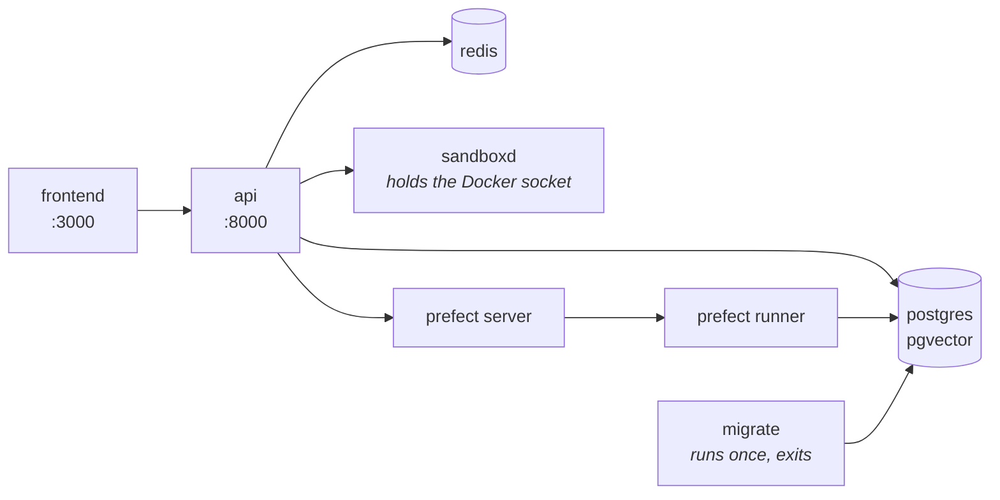
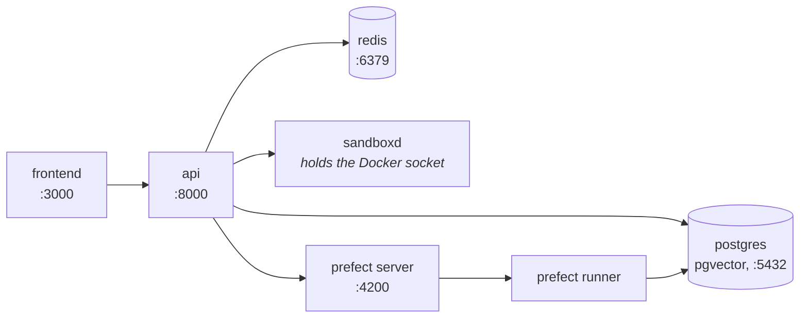

# Instalacja { #install }

Dwie komendy prowadzą od maszyny z Dockerem do agenta, który odpowiada:
`docker compose up -d` na jednym pobranym pliku i bootstrap wewnątrz kontenera,
który on uruchomił. Ta strona to te dwie komendy, budowanie ze źródeł dla każdego,
kto zmienia kod, oraz to, co zrobić, gdy coś nie wstanie.

Każdy krok jest idempotentny — uruchom go ponownie, kiedy tylko nie masz pewności,
czy zadziałał.

## Jedna komenda { #one-command }

```bash
curl -fsSL https://raw.githubusercontent.com/vstorm-co/agenticos/main/scripts/quickstart.sh | bash
```

`scripts/quickstart.sh` potrzebuje Dockera i niczego więcej - wtyczki Compose w
wersji 2.24 lub nowszej, co sprawdza. Pobiera `docker-compose.yml` z najnowszego
wydania do `./agenticos`, zapisuje obok niego `.env` (tryb 0600) z wygenerowanymi
`SECRET_KEY`, `VAULT_MASTER_KEY` i tokenem sandboksa, zadaje cztery pytania,
ściąga opublikowane obrazy i podnosi stack - wraz z konsolą - tworzy organizację z
właścicielem i opublikowanym agentem, a opcjonalnie mirroruje rejestr MCP.
Uruchomiony wewnątrz klona buduje te same obrazy z drzewa zamiast je ściągać.
`docker-compose.yml` należący do innego projektu zostaje nietknięty: instalacja
idzie do `./agenticos` obok niego.

Przyjmuje `--check`, żeby tylko zaraportować, czego brakuje, `--dry-run`, żeby
wypisać każdą komendę, którą by uruchomił, nie uruchamiając żadnej, oraz `--yes`
wraz z `--provider`, `--api-key`, `--email`, `--password` i `--org` dla instalacji
bez nadzoru.

Wszystko poniżej to to, co on robi — na wypadek, gdybyś wolał zrobić to sam. I nie
ma kroku, który on wykonuje, a którego ty nie możesz.

## Wymagania { #requirements }

| Żeby | Potrzebujesz |
|---|---|
| **Uruchomić** | Docker z wtyczką Compose, 2.24 lub nowszą - Docker Desktop, OrbStack albo Engine z `docker-compose-plugin`. <https://docs.docker.com/get-docker/> |
| **Zmieniać** | Powyższe plus GNU Make, [uv](https://docs.astral.sh/uv/) i [bun](https://bun.sh) - `make install` sprawdza wszystkie trzy |

!!! warning "Na Windowsie użyj WSL2"

    Makefile i skrypty pomocnicze zakładają bash. **WSL2** albo **Git Bash**.
    Gdy już jesteś w jednym z nich, wszystko poniżej jest identyczne.

## Uruchom z opublikowanych obrazów { #run-it-from-the-published-images }

Produkt to dwa obrazy, `ghcr.io/vstorm-co/agenticos-backend` i
`ghcr.io/vstorm-co/agenticos-frontend`, publikowane przez
[każde wydanie](https://github.com/vstorm-co/agenticos/releases) dla amd64 i
arm64. `docker-compose.yml` w korzeniu repozytorium ściąga je i uruchamia
wszystko wokół nich, a działa samodzielnie:

```bash
mkdir agenticos && cd agenticos
curl -fsSLO https://raw.githubusercontent.com/vstorm-co/agenticos/main/docker-compose.yml
docker compose up -d
```

To ściąga obrazy i uruchamia **Postgresa (z pgvector), Redisa, serwer i runner
Prefect, API oraz konsolę**, wykonuje migracje i odpowiada pod
<http://localhost:3000>. Pierwsze pobranie to około 2 GB.



!!! success "Nie ma żadnego `.env`, który trzeba najpierw napisać"

    Każda zmienna w `docker-compose.yml` niesie wartość domyślną, i to celowo.
    Zapisz `.env` obok niego wtedy, gdy jest co zmienić - wszystko opcjonalne:

    | | |
    |---|---|
    | `AGENTICOS_VERSION` | Które wydanie uruchomić. `latest`, gdy nieustawione; wersja taka jak `0.0.380`, żeby przypiąć jedną, `edge` dla tego, co `main` opublikował ostatnio |
    | `PUBLIC_API_URL`, `PUBLIC_WS_URL`, `PUBLIC_SITE_URL` | To, co *przeglądarce* każe się wołać, gdy host jest osiągalny pod nazwą inną niż `localhost`. `FRONTEND_URL` i `CORS_ORIGINS` backendu to ten sam fakt z jego strony |
    | `OAUTH_PROVIDERS`, `CHAT_MAX_UPLOAD_SIZE_MB` | Przyciski logowania, które oferuje konsola, oraz to, co composer odrzuca przed wysłaniem |
    | `SECRET_KEY`, `VAULT_MASTER_KEY` | Opcjonalne na laptopie, gdzie wartościami domyślnymi są stała z repozytorium i vault zapieczętowany pod nią. `scripts/quickstart.sh` generuje oba; ręcznie - `openssl rand -hex 32` dla każdego. I zrób kopię klucza vaulta razem z bazą danych, bo zrzut odtworzony obok innego klucza jest nie do odczytania |
    | Cokolwiek z `backend/.env.example` | Klucz providera, SMTP, token Logfire - kontenery czytają ten sam plik |

    Obrazy czytają ten `.env`, a także `backend/.env`, gdy taki jest, więc klon
    trzyma swoje ustawienia tam, gdzie reszta tej dokumentacji każe szukać.

Usługa sandboksa - ta, która daje agentowi kontener do uruchamiania kodu - stoi za
profilem `sandbox`, bo trzyma socket Dockera i odmawia startu bez własnego tokena:

```bash
echo "SANDBOXD_TOKEN=$(head -c 32 /dev/urandom | base64)" >> .env
docker compose --profile sandbox up -d
```

Token jest generowany raz i potem zostawiany w spokoju. Wygenerowanie go na nowo
osierocą każdy workspace, który usługa trzyma. (`scripts/quickstart.sh` robi obie
te rzeczy za ciebie.)

## Albo zbuduj z klona { #or-build-it-from-a-clone }

```bash
git clone https://github.com/vstorm-co/agenticos
cd agenticos
make dev
```

Klon ma `docker-compose.override.yml` obok pliku bazowego, a Compose scala oba sam
z siebie - więc ten sam `docker compose up`, który w pustym katalogu ściąga
obrazy, tutaj buduje je z drzewa, podmontowuje źródła i przeładowuje API przy
każdej edycji. To właśnie uruchamia `make dev`, z włączonym profilem sandboksa i
z `SANDBOXD_TOKEN` wygenerowanym najpierw do `backend/.env` (nigdy nie generuje
ponownie tego, który już tam jest).

Kiedy rzeczywiście chcesz coś zmienić — klucz providera na hoście, inną nazwę bazy
danych — edytuj `backend/.env`. `make install` tworzy go z
`backend/.env.example`, gdy go nie ma, i nigdy potem go nie nadpisuje, więc plik
trzymający twoje klucze przeżywa każde ponowne uruchomienie.

Pierwsze budowanie trwa kilka minut: obraz backendu niesie LibreOffice i Tesseract
do parsowania dokumentów, a konsola to produkcyjny build Next.js. Potem cache
warstw Dockera skraca to do około minuty, a podmontowane źródła sprawiają, że
edycja nie wymaga przebudowania w ogóle.



Migracje działają jako usługa `migrate` przy każdym starcie stacka i nic nie robią,
gdy baza jest już na head - i dlatego `make dev` jest też komendą do ponownego
uruchomienia po każdej zmianie kodu albo konfiguracji.

### Konsola, w klonie { #the-console-in-a-clone }

```bash
make dev-frontend      # or: cd frontend && bun dev
```

!!! info "Nieuruchamiana przez `make dev`, i nie jest to przeoczenie"

    W klonie konsola stoi za profilem Compose `console`, żeby praca nad API nie
    przebudowywała obrazu frontendu i żeby `bun dev` na twoim hoście nie walczył z
    kontenerem o port 3000. Poza klonem nie ma żadnego profilu: `docker compose up`
    uruchamia ją razem z resztą.

## Utwórz organizację, właściciela, model i agenta { #create-an-organization-an-owner-a-model-and-an-agent }

```bash
make platform-bootstrap BOOTSTRAP_API_KEY=sk-...               # in a clone
docker compose exec -T -e BOOTSTRAP_API_KEY=sk-... app \
  agenticos cmd bootstrap                                     # anywhere else
```

To ta komenda, która zamienia pustą bazę danych w coś, czego da się używać.

Pusty AgenticOS to problem jajka i kury — agent potrzebuje modelu, model
potrzebuje klucza, klucz potrzebuje organizacji — a to przechodzi ten łańcuch raz:

| Tworzy | |
|---|---|
| Organizację | `Acme` albo `--org` |
| Właściciela | `admin@example.com` / `admin123` albo `--email` / `--password` |
| Wpis w vault | Twój klucz providera, zapieczętowany dla tej organizacji |
| Profil modelu | `gpt-4.1`, `claude-sonnet-4-6`, `gemini-2.5-pro` albo `openai/gpt-4.1`, zależnie od tego, którego providera dotyczy klucz |
| Agenta | `@getting-started`, opublikowanego, jeśli jest klucz |

Teraz otwórz <http://localhost:3000>, zaloguj się jako `admin@example.com` /
`admin123` i przejdź do **Agents → Getting Started → Test**.

Masz działającego agenta.

!!! tip "Nie masz jeszcze klucza providera?"

    Pomiń `BOOTSTRAP_API_KEY`. Wszystko i tak zostanie utworzone, a demonstracyjny
    agent zostaje zapisany jako **draft**, a nie opublikowany — agent bez modelu
    nie potrafi odpowiedzieć, a opublikowanie takiego, który zawiedzie na pierwszej
    wiadomości, jest gorsze niż nieopublikowanie go.

    Dodaj klucz w **Settings → AI providers**, a potem opublikuj.

!!! note "`make seed` to coś innego"

    Tworzy `admin@example.com` jako superadmina deploymentu i nic poza tym: żadnej
    organizacji, żadnego modelu, żadnego agenta. `make platform-bootstrap` tworzy
    tego użytkownika także, więc na świeżej instalacji chcesz bootstrapa.

    `make dev` wypisuje sugestię, żeby uruchomić `seed`. To starsza ścieżka, wciąż
    poprawna, jeśli wszystko, czego chcesz, to login administratora.

## Sprawdź to { #check-it }

```bash
docker compose exec app agenticos cmd doctor
```

`doctor` zadaje pytania, które zadałaby pierwsza wiadomość. Czy baza danych jest
osiągalna i na head? Czy vault się odszyfrowuje? Czy jest profil modelu z kluczem
za nim? Czy każde zarejestrowane połączenie sandboksa odpowiada środowiskiem
uruchomieniowym?

Każda linia nazywa brakującą część, zamiast informować cię, że coś zawiodło.

## Podsumowanie { #recap }

```bash
mkdir agenticos && cd agenticos
curl -fsSLO https://raw.githubusercontent.com/vstorm-co/agenticos/main/docker-compose.yml
docker compose up -d                                             # everything, from the published images
docker compose exec -T -e BOOTSTRAP_API_KEY=sk-... app \
  agenticos cmd bootstrap                                       # an org, an owner, a model, an agent
```

Następnie <http://localhost:3000>, `admin@example.com` / `admin123`. Żeby zamiast
tego zmieniać kod: `git clone`, `make dev`, `make dev-frontend`,
`make platform-bootstrap`.

## Kiedy to nie wstaje { #when-it-does-not-come-up }

| Co widzisz | Dlaczego |
|---|---|
| Ingestia rzuca 500 z `extension "vector" is not available` | Zwykły Postgres zamiast `pgvector/pgvector:pg16`. Zobacz niżej |
| `uv run` raportuje Pythona 3.13 albo 3.14 | `backend/.venv` rozwiązał się poza przypięcie. Usuń go i uruchom ponownie `uv sync` |
| Frontend się ładuje, ale każde żądanie zawodzi | API wciąż się uruchamia - czeka na usługę `migrate` - albo przeglądarce podano zły host: `PUBLIC_API_URL` i `PUBLIC_WS_URL` muszą być osiągalne stamtąd, gdzie jest przeglądarka. `docker compose logs migrate app` |
| `docker compose up` zawodzi z `unauthorized` na `ghcr.io/vstorm-co/...` | Pakiet jest prywatny albo stare `docker login` do GHCR staje na drodze. Obrazy ściągają się anonimowo; zrób `docker logout ghcr.io` i spróbuj ponownie, a jeśli nadal odmawia, problemem jest widoczność pakietu, a nie twoja maszyna |
| Usługa `app` jest `Up` i `unhealthy`, a każde żądanie wisi | Zaklinowana pętla zdarzeń. Worker sam się kładzie po 15 s i coś go zastępuje, we wszystkich trzech stackach — więc jeśli minutę później nadal wisi, `EVENT_LOOP_WEDGED_AFTER` jest gdzieś ustawione na `0`, czego potrzebuje debugger i nic poza nim. `docker inspect` pokazuje `137` z `OOMKilled=false`, a linia logu nad nim mówi, co to było |
| Usługa `sandboxd` od razu kończy działanie | Brak `SANDBOXD_TOKEN` w `.env` albo `backend/.env`. `make sandbox-token` w klonie albo wpisz go ręcznie, a potem znowu `up -d` |
| Files mówi `This host's files could not be read` i nazywa `workspace_root` | Usługa sandboksa wystartowała, zanim go miała. Utwórz ją ponownie — `docker compose --profile sandbox up -d sandboxd` — i zrób `docker rm` na pozostałych kontenerach `sandboxd-*`: utrwalony kontener jest podpinany z montowaniami, z którymi został utworzony, więc stara sesja dalej pisze tam, gdzie nic nie może czytać |
| `Stopped: another AgenticOS stack named 'agenticos' runs on this machine` | Compose nazywa projekt po jego katalogu, więc klon w `~/agenticos` i instalacja w `./agenticos` to dla Dockera jeden projekt, a uruchomienie drugiego przejęłoby kontenery i bazę danych pierwszego - pod świeżo wygenerowanym `VAULT_MASTER_KEY`, który nie potrafi odczytać tego, co zapieczętował pierwszy. Instalator zamiast tego odmawia; zatrzymaj drugi stack (`docker compose down` zachowuje jego wolumeny) albo zainstaluj pod inną nazwą przez `--dir` |
| Port jest już zajęty (3000, 5432, 6379, 8000, 4200) | Coś innego na nim siedzi. `make dev-down`, zatrzymaj tamten proces, uruchom ponownie |
| Cokolwiek dziwniejszego | `make docker-clean` kasuje kontenery, sieci **i wolumeny** — wszystkie lokalne dane — a potem `make dev` od zera |

### Baza danych musi być pgvector { #the-database-must-be-pgvector }

!!! danger "Nie zwykły Postgres"

    Jeśli ingestia dokumentów rzuca 500 na świeżym środowisku, sprawdź obraz,
    zanim sprawdzisz cokolwiek innego.

Magazyn wyszukiwania wydaje `CREATE EXTENSION IF NOT EXISTS vector` przy pierwszym
zapisie do kolekcji. Zwykły Postgres odpowiada
`extension "vector" is not available` — 500, zanim jakikolwiek wiersz zostanie
zacommitowany.

Każdy plik Compose w tym repozytorium przypina `pgvector/pgvector:pg16`.

## Na co dzień { #day-to-day }

```bash
make dev           # start or restart (idempotent); in a clone, from source
make dev-down      # stop everything
make dev-logs      # tail logs
make dev-rebuild   # force-rebuild the backend image after a pyproject change
make dev-frontend  # start the console container (behind the `console` profile in a clone)
```

Poza klonem te same cztery komendy to `docker compose up -d`, `down`, `logs -f`
oraz `docker compose pull && docker compose up -d`, żeby przejść na nowsze
wydanie.

A oto gdzie wszystko jest:

| | |
|---|---|
| Frontend | <http://localhost:3000> |
| API | <http://localhost:8000> |
| Dokumentacja OpenAPI | <http://localhost:8000/docs> |
| Panel administracyjny w stylu Django | <http://localhost:8000/admin> |
| UI Prefect | <http://localhost:4200> |
| Postgres | `localhost:5432` (`postgres` / `postgres`) - publikowany wyłącznie przez plik override klona |
| Redis | `localhost:6379` - tak samo |

!!! warning "Usługa sandboksa nie jest publikowana, i to celowo"

    Trzyma socket Dockera, który jest nieuwierzytelnionym API dla roota na hoście.
    Jest osiągalna tylko z wnętrza sieci Compose, a API proksuje to, co
    przeglądarka ma z niej zobaczyć.

## Uruchamianie backendu na swoim hoście { #running-the-backend-on-your-host }

Przydatne do breakpointów i debugowania z IDE. Usługi zostają w Dockerze; API nie.

```bash
make install                                    # .env + uv sync + bun install + pre-commit
docker compose up -d db redis
make db-upgrade                                 # apply migrations
make run                                        # uvicorn --reload
```

`make install` to cała ścieżka konfiguracji: `backend/.env` z przykładu, gdy go
nie ma, `uv sync` dla backendu, `bun install --frozen-lockfile` dla
`frontend/node_modules` i hooki pre-commit.

Żadna z tych trzech rzeczy nie jest opcjonalna, a każdej w którymś momencie
brakowało:

- **`backend/.env`** jest tym, co czyta wszystko działające na twoim hoście —
  `db-check`, `db-upgrade`, `run` i pytest, wszystko przez `app.core.config`. Bez
  niego `POSTGRES_PASSWORD` jest puste, a `alembic check` zostaje odrzucone z
  `fe_sendauth: no password supplied`.
- **`frontend/node_modules`** trzyma eslint, prettier, tsc, vitest i next, więc
  frontendowa połowa jest wymagana, nawet jeśli dotykasz wyłącznie Pythona.
  `make check` uruchamia wszystkie pięć.

Oba są per checkout i nie są dzielone między żadne dwa worktree, więc są wymagane
na każdym klonie, a nie raz na laptopa.

!!! note "Python jest przypięty do 3.12"

    `backend/.python-version` go przypina, zgodnie z `requires-python`,
    `backend/Dockerfile` i każdym jobem CI. Jeśli `uv run python -V` raportuje
    cokolwiek innego, usuń `backend/.venv` i uruchom ponownie `uv sync` — nowszy
    interpreter ma osiągalne API, których ten dostarczany nie ma.

## Środowiska { #environments }

Trzy. Każde uruchamia te dwa opublikowane obrazy w wersji `AGENTICOS_VERSION`,
którą nazywa jego plik env; laptop jest tym jednym, które buduje je z drzewa.

| Cel | Pliki Compose | Zastosowanie |
|---|---|---|
| `docker compose up` | `docker-compose.yml` | Produkt, z opublikowanych obrazów. Konsola w komplecie, migracje wykonywane przy starcie, każda zmienna z wartością domyślną |
| `make dev` | `docker-compose.yml`<br>`docker-compose.override.yml` | Lokalnie, w klonie. Override buduje ze źródeł, podmontowuje je, przeładowuje i publikuje Postgresa i Redisa na hoście |
| `make dev-server` | `docker-compose-dev.yml`<br>`docker-compose-dev.frontend.yml` | Wdrożone środowisko deweloperskie. Ściąga `edge`, bez podmontowań, bez portu bazy danych, z gadatliwym logowaniem |
| `make prod` | `docker-compose-prod.yml`<br>`docker-compose-prod.frontend.yml` | Produkcja. Ściąga przypięte wydanie; limity zasobów, wewnętrzna sieć danych, dostrojony Postgres |

Każde ma odpowiadające mu rodzeństwo `-down`, `-logs` i `-frontend`. `make stage`
jest zachowane jako alias na `make dev-server`, którym kiedyś było.

Oba wdrożone środowiska chcą przed sobą reverse proxy i są dwa sposoby, żeby im je
dać. Domyślnie stack publikuje oba porty na loopbacku, a proxy na hoście do nich
sięga - `nginx/nginx.conf` jest tym szablonem i rozwiązuje `backend:8000` oraz
`frontend:3000` jako aliasy sieciowe. `make prod PROXY=traefik` dodaje zamiast tego
dwa pliki nakładkowe, które umieszczają kontenery w sieci istniejącego Traefika z
etykietami, po których on je odkrywa. [Deploy](deploy.md) przeprowadza przez oba.

Proxy sięga do nich po tych aliasach, więc produkcja publikuje oba porty na
`127.0.0.1` i nic spoza hosta nie może dosięgnąć żadnego z nich bezpośrednio. To
granica bezpieczeństwa, a nie porządki: przy włączonym
[`RATE_LIMIT_TRUST_FORWARDED_FOR`](configuration.md#rate_limit_auth_per_minute-and-why-the-auth-surface-has-its-own)
cokolwiek potrafi sięgnąć poza proxy, wybiera adres, na który liczone są jego
żądania. Ustaw `BIND_HOST=0.0.0.0` dla proxy działającego gdzie indziej.

To, co nadzoruje API, różni się we wszystkich trzech i każde odzyskuje workera,
który zginął: lokalny stack uruchamia własny supervisor przeładowań, stack
deweloperski to pojedynczy proces, którego wyjście Docker restartuje, a produkcja
uruchamia czterech workerów pod `Multiprocess` uvicorna. Worker *zaklinowany*
zamiast martwego obsługiwany jest wszędzie tak samo — worker sam się zabija.
Zobacz
[Konfigurację](configuration.md#a-worker-whose-event-loop-has-stopped-turning).

!!! warning "`PUBLIC_*` to to, co mówi się przeglądarce, i jest czytane przy starcie"

    `PUBLIC_API_URL`, `PUBLIC_WS_URL` i `PUBLIC_SITE_URL` to adresy, które konsola
    podaje przeglądarce - WebSocket czatu i przekierowanie logowania sięgają do API
    bezpośrednio, więc muszą to być nazwy, które przeglądarka potrafi rozwiązać,
    nigdy nazwa kontenera. Pliki frontendu dla dev-servera i produkcji odmawiają
    startu bez nich.

    Konsola czyta je przy starcie kontenera, więc opublikowany obraz jest ten sam
    dla każdego deploymentu, a zmiana to restart. Pomylenie się w jednym z nich
    wciąż jest klasyczną awarią: renderowanie po stronie serwera dalej działa po
    sieci Compose, podczas gdy każde wywołanie z przeglądarki idzie na zły host.

## Dalej { #next }

<div class="grid cards" markdown>

- :material-rocket-launch:{ .lg .middle } **[Twój pierwszy agent](first-agent.md)**

    Od klucza do opublikowanego, mierzonego agenta.

- :material-lightbulb:{ .lg .middle } **[Koncepcje](concepts.md)**

    Czym tak naprawdę są spec, wersja i ekspozycja.

</div>

Po każde istniejące ustawienie zajrzyj do [Konfiguracji](configuration.md). Po to,
jak postawić to na prawdziwym hoście, zajrzyj do [Deploya](deploy.md).
