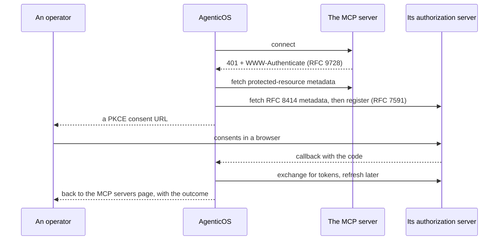

# MCP — die Tools, die hier niemand schreiben muss { #mcp-the-tools-nobody-here-has-to-write }

[Model-Context-Protocol](https://modelcontextprotocol.io)-Server sind die Antwort
dieser Plattform auf „Sie können nicht für alles einen Connector schreiben“.

Eine Organisation zeigt auf einen Server, dessen Tools erscheinen im Builder, und
auf unserer Seite ändert sich kein Code.

Alles im [Capability-Katalog](reference/capabilities.md) ist Code, den wir
geschrieben haben und auf 100 % Abdeckung halten. Alles hier ist eine URL, die
jemand eingefügt hat.

!!! info "Die beiden sind keine Alternativen"

    Eine **Capability** ist die richtige Form für etwas, das die Plattform
    garantieren muss — ein Budget-Guard, eine Sandbox, Retrieval, das seine Quellen
    zitiert.

    **MCP** ist die richtige Form für die Dutzenden SaaS-Produkte, die ein
    Unternehmen zufällig nutzt, und wo die einzige Garantie, auf die es ankommt,
    lautet: „die Tools sind die, die der Anbieter veröffentlicht hat“.

## Eine Connection { #a-connection }

Eine Zeile, die auf einen entfernten Server zeigt. Der Transport — streamable HTTP
oder Server-Sent Events — wird aus der URL abgeleitet, sodass ein reiner
SSE-Server wie Atlassian neben einem mit streamable HTTP läuft, ohne dass etwas zu
konfigurieren wäre.

| | |
|---|---|
| `name` | Zugleich das Tool-Präfix. Siehe [Namenskollisionen](#name-collisions) |
| `url` | Gegen SSRF geprüft, bevor wir sie überhaupt anfragen |
| `auth_token` | Im [Vault](secrets.md) versiegelt, von keinem Endpunkt je zurückgegeben |
| `allowed_tools` | Eine Allowlist, oder null für „alles, was der Server anbietet“. Ein Binding grenzt darin weiter ein — siehe unten |
| `is_enabled` | Aus, ohne die Zugangsdaten zu verlieren |
| `last_status` | Was die letzte Prüfung ergeben hat, und wann |

!!! warning "Eine Adresse, die dieses Deployment nicht erreichen darf, wird abgelehnt, und die Ablehnung sagt es"

    Eine URL, die auf eine Loopback-, private, Link-Local- oder geteilte
    CGNAT-Adresse auflöst, eine, die sich gar nicht auflösen lässt, eine, die
    Zugangsdaten in ihrem Userinfo-Teil trägt, eine mit einem anderen Schema als
    `http`/`https`, oder eine schlicht fehlerhafte, kommt als **400** zurück, die
    `url` als das fehlerhafte Feld benennt — beim Anlegen, beim Bearbeiten und beim
    Starten eines OAuth-Flows, persönlich wie organisationsweit.

    Was sie darüber hinaus benennt, ist der **Host**, niemals die URL: Eine URL
    trägt einen Schlüssel in ihrem Query-String, und der Satz, der die Ablehnung
    erklärt, ist einer, der in diesem Repository geschrieben wurde, und nicht das,
    was der URL-Parser zu dem von Ihnen gesendeten Text zu sagen hatte.

    Früher war es eine 500 ohne Details und mit einem Traceback im Log, was sich
    liest, als sei die Plattform kaputt, statt als eine zu korrigierende Adresse
    ([#861](https://github.com/vstorm-co/agenticos/issues/861)) — selbst zu hosten
    und eine `localhost`-URL einzufügen ist der gewöhnliche Fall, nicht der
    exotische.

### Persönlich oder organisationsweit { #personal-or-organization-wide }

Zwei Arten, und der Unterschied ist der Punkt.

**Persönlich** (MCP servers → You) gilt für ein einzelnes Mitglied und wird von
dessen eigenem Assistenten erreicht, und von einem Agent, der an das jeweils
eigene Konto gebunden ist, wenn diese Person gerade mit ihm spricht.

Die Zugangsdaten sind auf das *Mitglied* versiegelt, nicht auf eine Organisation —
eine persönliche Connection hat keine, und ihr Besitzer kann mehreren angehören;
sie an diejenige zu binden, die beim Anlegen aktiv war, würde das Token
unlesbar machen, sobald er wechselt.

**Organization** gilt für die Organisation, ist auf `connections:manage`
beschränkt und ist die einzige Art, die der Spec eines veröffentlichten Agents *per
id* benennen darf.

Ein veröffentlichter Agent, der je nach Session seines Erbauers unterschiedliche
Tools erreicht, ließe sich weder prüfen noch nachvollziehen, und genau darum gibt
es diese Einschränkung. Eine persönliche Connection erreicht einen Agent dennoch,
auf einem Weg: Ein Binding an [das jeweils eigene Konto](#whose-account-a-binding-speaks-through)
benennt den Dienst, und wer mit dem Agent spricht, bringt seine eigene Connection
dazu mit.

```
GET  /api/v1/me/mcp-connections     personal
GET  /api/v1/mcp-connections        organization, requires connections:manage
POST /api/v1/mcp-connections/{id}/test   probe it, list its tools, store the status
```

### Zwei Namen, und sie beantworten verschiedene Fragen { #two-names-and-they-answer-different-questions }

Eine Connection trägt einen **Namen** und ein **Tool-Präfix**, und nur das zweite
ist eingeschränkt. Das Präfix besteht aus Kleinbuchstaben, Ziffern und
Bindestrichen und ist unter den Servern der Organisation eindeutig, denn das ist,
was ein Tool-Name tragen kann und was das Modell liest, bevor es eines aufruft.
Der Name ist freier Text, optional, und ist das, was eine Person sieht.

Der Unterschied verdient seinen Platz in dem Moment, in dem eine Organisation
einen Dienst zweimal verbindet. Zwei Notion-Konten müssen `notion` und `notion-2`
heißen, und keines von beiden sagt, welchen Workspace es erreicht; `Marketing
workspace` und `Engineering handbook` tun es.

!!! info "Das Präfix verschwindet nie"

    Wo immer ein Name gezeigt wird, steht das Präfix daneben. Die Tool-Aufrufe
    eines Runs werden unter dem Präfix festgehalten, sodass ein Name, der es
    ersetzt, die Frage „warum hat das `notion-2_search` aufgerufen“ auf genau der
    Seite unbeantwortbar ließe, die das Konto benennt. Löschen Sie den Namen, und
    die Connection liest sich wieder als ihr Präfix — so wie vor dem Setzen eines
    Namens.

Ein Spec benennt Organisations-Connections in `mcp_servers`, ein Eintrag je
Binding. Löschen Sie eine Connection, die ein Agent noch benennt, verliert der
Agent diesen Server, nicht der Run.

### Welche Tools, und wer entscheidet { #which-tools-and-who-decides }

Zwei Allowlists, und keine hebt die andere auf.

**Auf der Connection** ist `allowed_tools` die Entscheidung einer Administratorin
für alle, die daran gebunden sind — die Tools, die diese Organisation auf jenem
Server überhaupt erreichen will. **Auf dem Binding** grenzt sie darin weiter ein,
pro Agent. So kann ein Server einen lesenden und einen schreibenden Agent
bedienen, ohne zweimal verbunden zu werden.

Sie schneiden sich zur Laufzeit. Ein Agent kann kein Tool erreichen, das die
Connection ausschließt, auch keines, das nach der Veröffentlichung des Agents
ausgeschlossen wurde — das Binding verliert dieses Tool, statt dass der Agent den
Server verliert. Null auf einer der beiden Seiten heißt: von dort keine
Eingrenzung; ein Binding, das nichts benennt, bekommt also, was die Connection
erlaubt — genau das, was jedes Binding tat, bevor es dies gab.

Der Builder listet die Tools eines Servers aus dessen **letzter erfolgreicher
Prüfung**, die auf der Connection festgehalten ist. Eine Prüfung wählt nach außen
zu einem Dritten und ist auf `connections:manage` beschränkt; die Autorin eines
Agents hält `agents:edit` und braucht die Liste zur Auswahl, also wird die Liste
gelesen statt geholt.

Eine Connection, die noch niemand geprüft hat, hat keinen Katalog anzubieten, und
die Auswahl sagt das und verweist auf die Server-Seite, wo eine Connection geprüft
wird. Ein Binding, das bereits Tools benennt, zeigt diese, sodass sichtbar bleibt,
woran es gebunden ist, und weiter eingegrenzt werden kann.

### Durch wessen Konto ein Binding spricht { #whose-account-a-binding-speaks-through }

Ein Binding ist von einer von zwei Arten, und der Builder fragt auf der Karte,
welcher.

**Das Konto der Organisation** (`account: organization`) benennt eine der
Connections der Organisation und antwortet für alle, auf jeder Oberfläche. Das ist
die Voreinstellung und die Antwort, gegen die ein Agent geprüft wird.

**Das jeweils eigene Konto** (`account: personal`) benennt stattdessen den
Katalogdienst — `catalog_key: notion` — und überhaupt keine Connection. Wer mit
dem Agent spricht, verbindet sein eigenes Notion unter MCP servers → You, und der
Agent spricht als diese Person mit Notion: im Dashboard, in einer Direktnachricht
und in einem Channel gleichermaßen. Der Audit-Trail bei Notion sagt dann, wer was
getan hat — was ein geteiltes Dienstkonto nie kann.

Das Konto ist das der Autorin *dieser Nachricht*, nie das des Threads. Ania fragt
in `#ops` und bekommt eine Antwort aus ihrem Notion; Bartek stellt dieselbe Frage
im selben Thread und bekommt seine, oder wird gebeten, eines zu verbinden. Ein
Thread ist keine Grenze, die jemandes Zugangsdaten überschreiten sollten — würde
die erste Person, die verbindet, für alle nach ihr antworten, hieße ein Notion in
einem Channel zu verknüpfen, es dem Channel zu übergeben.

!!! info "Wo niemand spricht, fehlen die Tools — und der Agent sagt es"

    Ein API-Key, das eingebettete Widget, ein Zeitplan, ein Trigger und ein
    Channel-Absender, der sein Chat-Konto nicht verknüpft hat, haben kein Konto,
    durch das sie sprechen könnten. Der Run läuft ohne diesen Server weiter, jedes
    andere Binding intakt, und seinen Instruktionen wird eine Zeile hinzugefügt,
    die sagt, welcher Dienst fehlt und warum — sodass der Agent, wenn jemand nach
    Notion fragt, mit dem Link antwortet, der es verbindet
    (`/mcp-servers?connect=notion`), oder mit „senden Sie zuerst `/link` an diesen
    Bot“, wo das Chat-Konto das fehlende Stück ist.

    Wer *mehrere* eigene Connections zu einem Dienst hält, wählt eine aus, unter
    MCP servers → You: Das als Standard markierte Konto ist das, als das ein Agent
    spricht. Bis zur Wahl fordert der Agent dazu auf — still den älteren Workspace
    zu raten wäre schlechter.

    Im Dashboard-Chat kommt derselbe Sachverhalt als Karte an, bevor das Modell
    antwortet, mit einer Schaltfläche zum Verbinden; und die Bedienelemente des
    Chats listen die persönlichen Dienste des Agents mit ihrem Status, sodass ein
    neues Mitglied sieht, was zu verbinden ist, bevor es fragt. Siehe
    [die Konsolen-Seite](console.md#chat).

Das Tool-Präfix eines persönlichen Bindings ist der Katalogschlüssel, egal wie
jede Person ihre Connection genannt hat, sodass der Agent allen `notion_search`
präsentiert. `allowed_tools` auf dem Binding ist die Obergrenze der
Administratorin; die eigene Connection der Person darf weiter eingrenzen, und die
beiden schneiden sich.

!!! warning "Drei Dinge lehnt das Veröffentlichen ab"

    Ein persönliches Binding auf einen Schlüssel, den der Katalog nicht führt —
    nichts könnte je die Connection eines Mitglieds dazu zuordnen. Zwei
    persönliche Bindings auf einen Dienst — dieselben Tools zweimal unter einem
    Namen. Und ein persönliches Binding, dessen Schlüssel zugleich der Name einer
    Organisations-Connection ist, die an denselben Agent gebunden ist, was zwei
    Server unter ein Präfix stellen würde; Pydantic AI lehnt die doppelten
    Tool-Namen ab, und der Zug bricht ab.

!!! note "Eine Kollision, die einen Run erreicht, wird eingegrenzt, nicht verloren"

    Veröffentlichen ist ein Zeitpunkt, und der Name einer Connection ist danach
    änderbar; ein Agent, der vor dieser Prüfung veröffentlicht wurde, oder einer,
    dessen Connection auf einen kollidierenden Namen umbenannt wurde, kann also
    weiterhin mit zwei Servern unter einem Präfix in einen Run gelangen. Dieser Run
    behält den ersten von ihnen, der auf seine Prüfung antwortet, verwirft die
    übrigen und sagt dem Modell, welcher Server in diesem Zug nicht verfügbar ist —
    und, wenn beide einen Namen tragen, durch welches Binding er spricht — statt
    ihn an eine Logzeile zu verlieren, die niemand liest. Eine der beiden
    Connections umzubenennen ist die Korrektur der Autorin.

Ein Agent bindet jeden Dienst einmal, auf eine Weise. Ein Agent, der das
Handbuch-Notion der Organisation *und* das jeweils eigene braucht, sind zwei
Agents, oder derselbe Server zweimal unter zwei Namen verbunden.

## Authentifizierung { #authentication }

Drei Modi, und das ist das Einzige, was sich zwischen Servern wirklich
unterscheidet.

=== "Keine"

    Meist öffentliche Dokumentationsserver — Cloudflares Docs-Server braucht
    überhaupt keine Zugangsdaten.

=== "Token"

    Ein Bearer-Token, einmal eingefügt und versiegelt.

    Jeder Katalogeintrag trägt seinen eigenen Hinweis, wo man eines bekommt, denn
    allgemeine Anleitungen sind der Hauptgrund, warum die Token-Einrichtung
    scheitert.

    `PATCH` mit `auth_token: ""` löscht es.

=== "OAuth 2.1"

    Die meisten Business-Server — Notion, Linear, Atlassian, Asana — antworten mit
    `401` und einem `WWW-Authenticate`-Header, der auf Protected-Resource-Metadaten
    nach RFC 9728 zeigt, und von dort läuft der Flow.

    1. **Discover** — den Server prüfen, seinen Authorization Server auflösen,
       RFC-8414-Metadaten holen.
    2. **Register** — dynamische Client-Registrierung nach RFC 7591.
    3. **Consent** — eine PKCE-Autorisierungs-URL mit `state` und einem
       Resource-Indicator nach RFC 8707; der Browser geht dorthin.
    4. **Exchange** — der Callback tauscht den Code gegen Tokens und leitet den
       Browser dann zurück auf die MCP-Server-Seite, die sagt, ob es geklappt hat.
       Das ist die einzige Stelle, an der sich das Ergebnis mitteilen lässt: Die
       Person schaut auf eine Seite, zu der sie nicht selbst navigiert ist.
    5. **Refresh** — wenn das Access-Token abläuft.



### Jede URL in diesem Flow wird geprüft, nicht nur die, die Sie getippt haben { #every-url-in-that-flow-is-checked-not-just-the-one-you-typed }

!!! danger "Discovery heißt, dass der entfernte Server die meisten Adressen wählt, die wir aufrufen"

    Einen einzigen feindseligen Server zu verbinden hat früher genügt: Ein Name
    konnte der Prüfung eine öffentliche Adresse und der darauffolgenden Anfrage
    eine private antworten
    ([#860](https://github.com/vstorm-co/agenticos/issues/860)).

    Die Adresse, die die Prüfung bestanden hat, ist jetzt die Adresse, zu der
    verbunden wird.

Die Anfrage geht an die aufgelöste IP, mit dem ursprünglichen Host im
`Host`-Header und in der TLS-SNI, sodass das Zertifikat weiterhin gegen den Namen
geprüft wird und nichts ihn ein zweites Mal auflöst.

Diese zweite Hälfte zählt hier mehr als irgendwo sonst im Produkt. Die Adresse,
die eine Betreiberin tippt, ist nur der erste Hop — der Authorization Server, der
Token-Endpunkt, der Registrierungs-Endpunkt und jede Weiterleitung danach werden
von den Discovery-Dokumenten des entfernten Servers benannt. Niemand in Ihrer
Organisation musste der Angreifer sein.

Weiterleitungen werden Hop für Hop verfolgt, auf fünf begrenzt, jede mit ihrer
eigenen Prüfung. Eine `302` auf einen neuen Host wird neu aufgelöst, nicht
vertraut.

Wo ein Name mit mehreren Adressen antwortet, wird jede einzelne geprüft und
behalten, und auf eine Adresse, die die Verbindung verweigert, folgt die nächste —
was ein gewöhnlicher Client vom Resolver bekommt, ohne DNS ein zweites Mal zu
fragen. Ein Name, der mit einer öffentlichen und einer privaten Adresse antwortet,
wird **ganz** abgelehnt statt auf seine öffentliche Hälfte eingegrenzt.

Zwei Ränder bleiben, beide schmal und beide gewollt:

- Die **Consent-URL** wird geprüft und dann einem Browser übergeben, der sie
  selbst auflöst. Es gibt nichts zu pinnen.
- Die **eigene URL der Connection** wird beim Speichern geprüft und erneut
  aufgelöst, wenn ein Agent läuft — von der Betreiberin getippt, sie neu zu binden
  heißt also, die Betreiberin zu sein.

Nichts, was ein *Modell* wählt, erreicht diese Prüfung überhaupt, und das soll auch
so sein: Eine URL, die ein Agent ausgewählt hat, gehört zu Pydantic AIs
`safe_download`.

!!! info "Hinter einem Egress-Proxy verbindet der Proxy"

    `HTTP_PROXY` und `HTTPS_PROXY` werden beachtet, denn ein Deployment, das einen
    Egress-Proxy vorschreibt, würde MCP-OAuth sonst vollständig verlieren — und
    dieser Proxy ist selbst eine Egress-Kontrolle.

    Auf diesem Weg ist die gepinnte Adresse das, worum der Proxy *gebeten* wird
    (`CONNECT 93.184.216.34:443`, oder eine Request-Line in absoluter Form bei
    einfachem HTTP), und nicht das, womit sich dieser Prozess verbindet; die
    Garantie endet also beim Proxy. TLS bleibt Ende zu Ende, das Zertifikat wird
    also weiterhin gegen den ursprünglichen Namen geprüft.

    Ein Policy-Proxy, der eine nackte Adresse ablehnt, wird diese Anfragen
    ablehnen; die Logzeile, die beim Konfigurieren eines Proxys geschrieben wird,
    ist dafür da, dass dieser Fehlschlag lesbar ist.

### Wenn ein Schritt fehlschlägt { #when-a-step-fails }

Ein Schritt, der fehlschlägt, sagt, **welcher Schritt aufgegeben hat und welche
Klasse von Fehler ausgelöst wurde**, nie, was der Upstream-Client geschrieben hat.

`httpx` schreibt die fehlgeschlagene Anfrage in seine Meldung, und die beiden
Anfragen hier sind eine Client-Registrierung und eine Token-Ausgabe — sie zu
zitieren würde also einen Token-Endpunkt, mit Zugangsdaten aufgerufen, in den
Browser tragen. Ein Pydantic-Fehler über eine unlesbare Token-Antwort gibt die
abgelehnte Payload wieder, und das sind die Tokens. Beides bleibt im Server-Log,
und dort schaut eine Betreiberin ohnehin hin.

**Ein Discovery-Dokument, das eine URL benennt, die sich überhaupt nicht anfragen
lässt, ist dieselbe Art von Antwort**: eine **400**, die sagt, welcher Endpunkt
unbrauchbar war und dass er fehlerhaft ist.

Das ist eine andere Ablehnung als „dieser Server hat den Flow auf eine gesperrte
Adresse gerichtet“. Die eine sagt, der Server habe uns irgendwohin gelenkt, wohin
dieses Deployment nicht geht, die andere, er habe eine Adresse geschrieben, die
nichts anwählen kann — und die eine als die andere zu melden wäre eine feste
Behauptung darüber, wessen Schuld ein Fehlschlag war.

Ein unbrauchbarer `WWW-Authenticate`-Hinweis beendet diesen
Discovery-*Kandidaten*, nicht den Flow, denn die darauf folgenden
Well-known-URIs leiten sich von der URL ab, die eine Betreiberin getippt hat, und
antworten womöglich sehr wohl.

Das war eine 500 mit leerem Body bis
[#889](https://github.com/vstorm-co/agenticos/issues/889): `httpx.InvalidURL`
leitet sich nicht von `httpx.HTTPError` ab, also sah keiner der Catches des Flows
den Fehler — und keine Prüfung hier hätte es gekonnt, denn die URL wird abgelehnt,
während die Anfrage gebaut wird, oberhalb sowohl der SSRF-Prüfung als auch des
gepinnten Clients. Was der Parser nicht lesen konnte (`Invalid port:
'client_secret=…'`), ist der Text des entfernten Servers und bleibt mit allem
anderen im Log.

!!! warning "Die OAuth-Connection einer Organisation ist immer noch jemandes Einwilligung"

    `POST /mcp-connections/oauth/start` erzeugt eine Connection, die der
    Organisation gehört, und genau dafür ist ein geteiltes Dienstkonto da. Doch die
    Einwilligung bleibt beim Provider die der *einwilligenden Person*: Wird ihr
    Zugang dort entzogen, hört der Server der Organisation auf zu funktionieren,
    bis er erneut autorisiert wird.

    Willigen Sie mit einem Konto ein, das die Organisation kontrolliert.

### Drei Regeln über Tokens { #three-rules-about-tokens }

**Ein Token folgt nie einer verschobenen URL.** Die URL einer Connection zu
bearbeiten verwirft ihre OAuth-Payload, den laufenden Flow und die gespiegelten
Scopes — bei persönlichen wie bei Organisations-Connections — sodass die Connection
„braucht erneute Autorisierung“ meldet, statt ein für einen Host ausgestelltes
Token an einen anderen zu senden.

Auf einer Organisationszeile ist das zugleich eine Grenze zwischen
Administratoren: Wenn eine Halterin von `mcp:manage` eine Connection umlenkt, die
eine andere autorisiert hat, darf die Plattform dieses Token nicht an den neuen
Host ausliefern.

**Eine deaktivierte Connection gibt nirgends Tokens heraus.** Der Tool-Pfad des
Agents überspringt sie, und die Trigger-Portale tun es auch — wer die
`connection_id` eines Triggers behalten hat, kann nicht weiter Repositories
aufzählen oder Hooks registrieren, mit Zugangsdaten, die eine Administratorin
abgeschaltet hat.

**Eine Connection zu löschen gibt frei, was über sie registriert wurde.** Jeder
[Event-Trigger](triggers.md), dessen Provider-Webhook mit dem Token dieses Kontos
automatisch registriert wurde, bekommt diesen Hook abgemeldet — nach bestem
Bemühen, solange das Token noch existiert — und fällt auf manuelle Zustellung
zurück. Die URL und das Secret des Triggers bestehen weiter, sodass es
funktioniert, einen Provider von Hand wieder darauf zu richten.

Der Connect-Flow des GitHub-Portals kennt auch die andere Richtung: Eine
Organisation, die den GitHub-Katalogeintrag vor der Existenz des OAuth-Flows als
einfache Bearer-Connection verbunden hat, bekommt genau diese Zeile an Ort und
Stelle neu autorisiert — gefunden über ihren Katalogschlüssel, wie auch immer sie
benannt war — statt abgelehnt oder dupliziert, und das Bearer-Token funktioniert
weiter, bis die neue Einwilligung eintrifft.

## Was bei einem Zug passiert { #what-happens-on-a-turn }

Jeder Server wird vor Beginn des Zuges mit einem kurzen `tools/list`-Roundtrip
geprüft — 3 Sekunden — und die Prüfungen laufen nebenläufig.

!!! warning "Ein nicht erreichbarer Server wird mit einer Warnung übersprungen, nicht ausgelöst"

    Pydantic AI betritt beim Start eines Runs jedes Toolset, ein toter Server würde
    sonst also den ganzen Zug abbrechen: Ein abgelaufenes Token auf einer
    Connection legte jeden Agent lahm, der sie benennt, auch die, die sie nie
    gebraucht haben.

    Das Modell antwortet dann **ohne** diese Tools — richtig für einen Chat-Zug,
    falsch, wenn Sie angenommen haben, ein Tool sei immer da.

Das ist ein bewusster Kompromiss. Der `/test`-Endpunkt und `last_status` sind der
Weg, es herauszufinden, und der [Audit-Trail](governance.md#audit) hält fest, was
tatsächlich gelaufen ist.

### Einen aus dem Builder heraus verbinden { #connecting-one-from-the-builder }

Der Tab **MCP servers** eines Agents listet den gesamten Katalog, nicht nur das,
wofür es Zugangsdaten gibt. Ein Server ohne welche ist kein Kontrollkästchen — es
gibt keine Connection-Id, die der Spec halten könnte — also öffnet die Karte den
Verbindungsdialog **an Ort und Stelle**.

Ein Server mit Token oder ganz ohne Zugangsdaten wird verbunden, ohne die Seite zu
verlassen, und die neue Connection ist für den Agent angehakt, sobald sie
existiert.

!!! info "OAuth öffnet einen Tab"

    Der Einwilligungsbildschirm gehört dem Provider, es gibt also nichts, wo man
    bleiben könnte — aber es gibt einen Weg, den gerade bearbeiteten Agent nicht zu
    verlieren. Schließen Sie im geöffneten Tab ab und kommen Sie zurück; der Server
    erscheint in der Liste, sobald er autorisiert ist.

### Ein Server, mehrfach verbunden { #one-server-connected-several-times }

Eine Organisation darf denselben Server mehr als einmal verbinden — ein Notion mit
Nur-Lese-Zugriff auf einen Workspace, ein weiteres auf eine einzelne Datenbank
beschränkt, ein drittes mit Admin-Zugangsdaten. Das ist eine unterstützte Form,
keine Notlösung: Namen sind pro Organisation eindeutig statt pro Katalogeintrag,
und der Name ist das Tool-Präfix, sodass das Modell `notion_readonly_search` und
`notion_admin_search` als verschiedene Tools sieht.

Binden Sie das, was der Agent haben soll. Der Builder listet eine Zeile je
Connection und beschriftet jede mit ihrem Namen, wo ein Eintrag mehr als eine hat.

!!! tip "Der Name ist der ganze Unterschied"

    `notion` und `notion-2` sagen niemandem etwas. Benennen Sie eine Connection
    danach, was sie erreichen darf — `notion-handbook`, `notion-admin` —, denn
    genau diese Zeichenkette liest das Modell, wenn es entscheidet, welches Tool es
    aufruft.

### Namenskollisionen { #name-collisions }

!!! note "Tools werden mit dem Namen der Connection präfigiert"

    `github-work` wird zu `github_work_*`, denn zwei Server, die denselben
    Tool-Namen anbieten, lassen Pydantic AI bei Duplikaten auslösen, was den Zug
    abbricht.

    Eine Allowlist filtert *vor* dem Präfigieren, sie vergleicht also gegen die
    unpräfigierten Namen, die in der UI gewählt wurden.

Zwei Connections, deren Namen auf dasselbe Präfix hinauslaufen, werden
dedupliziert — die erste gewinnt, mit einer Warnung, die die unterlegene benennt.
Vom Deployment verwaltete Server kommen zuerst, gewinnen also gegen eine
Nutzer-Connection, die zufällig denselben Namen wählt.

## Der Katalog { #the-catalog }

Eine Auswahl, die leer beginnt und nach einer URL fragt, ist eine Auswahl, die
niemand nutzt; also kommen die gängigen Server mit den Metadaten, die zum Verbinden
nötig sind: die URL, wie sie sich authentifiziert, was man demjenigen sagt, der
Zugangsdaten einfügt.

Dies ist eine von Hand gepflegte Liste, **kein** Spiegel der öffentlichen
Registry. Jeder Eintrag ist ein kleines Versprechen — dass jemand den Server
angesehen hat, dass der Auth-Flow funktioniert, dass die Beschreibung ehrlich ist
— und eine gespiegelte Registry kann dieses Versprechen nicht geben.

!!! info "Was Spiegeln tatsächlich hinzufügen würde"

    Die offizielle Registry wurde im August 2026 vollständig gelesen: 20.100
    Datensätze, 7.127 davon die aktuelle Version eines aktiven Servers, 5.824 mit
    einem gehosteten HTTPS-Endpunkt, über 5.141 verschiedene Hosts hinweg. Die
    „tausenden Server“, mit denen eine Registry wirbt, sind also real.

    Gegen diesen Katalog abgeglichen gehörten **vier** dieser Hosts zu einem
    Unternehmen, das die meisten Leser wiedererkennen würden, und fehlten hier —
    CircleCI, New Relic, Statsig und Lusha, alle vier jetzt gelistet. Der Rest der
    rund 5.000 nicht abgedeckten sind Einzelprojekt-Server, Proxys auf
    `workers.dev`, SEO-Werkzeuge und Spiele: alphabetisch sind die ersten paar eine
    Grundstückspreis-Abfrage, ein Werkzeug für Handwerkerangebote und ein
    ungarischer Fensterkalkulationsdienst.

    Beide Tatsachen lohnt es, zugleich im Kopf zu behalten. Der Katalog ist nicht
    knapp an Einträgen, weil niemand nachgesehen hätte; er ist so lang, wie er ist,
    weil eine von Hand geprüfte Liste dessen, was ein Unternehmen tatsächlich
    nutzt, bei etwa hundert konvergiert.

### Die Registry steht in derselben Liste, und in der Datenbank { #the-registry-is-in-the-same-list-and-in-the-database }

Der Spiegel wird also mitgeliefert, und **/mcp ist eine Liste über alle** — die
kuratierten hundert zuerst, dann 5.703 gespiegelte Server, seitenweise. Kein
kuratiertes Raster mit einer Suche, die weiter reicht: eine Liste, ein Pager, eine
Zählung.

Das brauchte eine Tabelle. `mcp_registry_servers` gilt deploymentweit und hat
keine `organization_id`, und genau darum ist es eine Tabelle und nicht fünftausend
Zeilen pro Tenant — die Skill-Galerie hat die benachbarte Frage andersherum
entschieden, und der Unterschied ist, dass ein Katalog keine Tenant-Daten sind. Sie
wird von `agenticos cmd mcp-registry-sync` gefüllt, aus dem mitgelieferten Snapshot
oder, mit `--fetch`, aus der Live-Registry.

In der Datenbank gehalten, weil sich eine Datei nicht seitenweise ausgeben lässt.
5.703 Einträge im Speicher könnten „Server, die auf 'linear' passen“ beantworten
und nicht „die vierte Seite von allen“, ohne alles zu laden und zu schneiden. Die
Rangfolge ist aus demselben Grund mit in SQL gewandert: Eine Seite zu ranken heißt,
zu ranken, was auf dieser Seite zufällig stand. Drei Bänder — der Server, der
Linear *heißt*, dann Namen, die es bloß enthalten, dann Beschreibungen, die es
erwähnen — innerhalb eines Bandes der kürzere Name zuerst, sodass `Stripe` vor
`Sweden Payments (Stripe)` liegt.

Es ist eine Liste mit einer Tatsache auf manchen Zeilen, nicht zwei Listen. Eine
Registry-Zeile trägt ein **Registry**-Abzeichen, wo eine kuratierte ihre Auth-Art
trägt, denn der Unterschied ist es wert, bekannt zu sein, bevor jemand
Zugangsdaten einfügt: Niemand hier hat sie geprüft, die Beschreibung ist die des
Herausgebers, und es gibt keinen Token-Hinweis — die Registry hat kein solches
Feld zu spiegeln.

Drei Dinge folgen aus der Größe, und jedes ist ein Grund, warum es eine Suche ist
und keine Auflistung:

- **Seitenweise vom Server, nicht vom Browser gefiltert.** Fünfzig je Seite, und
  die Anfrage, die Kategorie und die Seite sind allesamt Requests. Eine
  Seitengrenze fällt mitten in den Join — 99 kuratierte Zeilen gegen eine
  Seitengröße von 50 — also lebt die Arithmetik in `mcp_listing.page`, mit einem
  Test auf der Grenze, denn ein Off-by-one dort überspringt einen Server oder zeigt
  ihn zweimal, in einer Liste, in der niemand merken würde, welches von beidem.
- **Eine Kategorie fragt nur nach Katalogeinträgen.** Der Spiegel hat keine
  Kategorien, sie mit gespiegelten Zeilen zu beantworten würde also
  unkategorisierte Server unter eine Überschrift einsortieren, die etwas anderes
  sagt.
- **Kein eingebackenes Logo.** Die Konsole bettet ein Favicon je kuratiertem Host
  ein, damit ein Abzeichen offline rendert; bei 1,9 KB je Stück wären das für den
  Spiegel 10,5 MB Base64 in einem Modul, das der Browser lädt. Registry-Zeilen
  fallen auf den Favicon-Dienst zur Laufzeit durch, und genau dafür wurde er
  geschrieben.
- **Ein Snapshot, kein Proxy.** Eine Installation darf nicht aufhören zu
  funktionieren, weil die Registry von jemand anderem ausgefallen ist, und ein
  Name, der gestern aufgelöst hat und heute ins Leere führt, ist schlimmer als
  einer, der nie da war.

    `make platform-bootstrap` lädt sie, ein neues Deployment hat sie also, ohne
    dass jemand das hier liest. `agenticos cmd mcp-registry-sync` frischt sie auf,
    und `--fetch` liest die Live-Registry statt des mitgelieferten Snapshots. Auf
    einem Deployment, das älter ist als die Tabelle, ist die Liste die kuratierten
    hundert, bis der Sync läuft — was sie vor all dem war, es geht also nichts
    verloren, während jemand dazu kommt.

Ein Server in keiner der beiden Listen ist trotzdem erreichbar: **Custom server**
nimmt jede URL und braucht überhaupt keinen Katalogeintrag.

!!! info "Vier davon sind Gateways, und sie sind ein anderes Versprechen"

    Composio, Pipedream, Activepieces und Smithery sind nicht die API eines
    Produkts - jedes ist ein Endpunkt auf hunderte oder tausende andere, mit den
    Zugangsdaten auf deren Seite. Der Katalogeintrag bürgt also für das *Gateway*,
    und was der Agent tatsächlich erreichen kann, wird in der Konsole dieses
    Gateways entschieden, von wem auch immer es dort konfiguriert hat.

    Gut zu wissen, bevor man Katalogumfänge mit einem Anbieter vergleicht, der mit
    tausenden Integrationen wirbt: Diese Zahl ist fast immer ein Endpunkt dieser
    Art, nicht tausende Server, die jemand geprüft hat. Beide Formen sind
    nützlich, und sie sind nicht dieselbe Behauptung.

!!! warning "Ein Versprechen, das erneuert werden muss"

    Das Versprechen verfällt. Der offizielle Postgres-Referenzserver wurde 2025 aus
    `modelcontextprotocol/servers` archiviert, und dieser Katalog hat weiter darauf
    verlinkt, sodass das Einzige, was der Eintrag einem Leser bot, eine 404 war.
    Nichts prüft diese Links — ein Test, der ins öffentliche Internet greift, ist
    ein Test, der im Zug von irgendjemandem fehlschlägt — das erneute Lesen des
    Katalogs ist also eine wiederkehrende menschliche Aufgabe, und ein Eintrag, für
    den niemand bürgen kann, sollte gelöscht statt stehen gelassen werden.

`(self-hosted)` unten heißt, der Eintrag beschreibt den Server, aber Sie liefern
die URL: entweder weil er auf Ihrer eigenen Infrastruktur läuft, oder weil der
Anbieter einen Endpunkt je Konto ausgibt.

### Entwicklung { #development }

| Server | Auth | URL |
|---|---|---|
| GitHub | token | `https://api.githubcopilot.com/mcp/` |
| Cloudflare docs | none | `https://docs.mcp.cloudflare.com/mcp` |
| GitLab | token | self-hosted |
| Postman | token | `https://mcp.postman.com/mcp` |
| Vercel | oauth | `https://mcp.vercel.com/` |
| Netlify | oauth | `https://mcp.netlify.com/mcp` |
| Railway | token | `https://mcp.railway.app/mcp` |
| Replit | oauth | self-hosted |
| Hugging Face | token | `https://huggingface.co/mcp` |
| Buildkite | oauth | `https://mcp.buildkite.com/mcp` |
| Semgrep | token | `https://mcp.semgrep.ai/mcp` |
| Clerk | oauth | `https://mcp.clerk.com/mcp` |
| WorkOS | oauth | `https://mcp.workos.com/mcp` |
| Render | token | `https://mcp.render.com/mcp` |
| CircleCI | oauth | `https://mcp.circleci.com/v1/mcp` |

### Projektmanagement { #project-management }

| Server | Auth | URL |
|---|---|---|
| Linear | oauth | `https://mcp.linear.app/sse` |
| Jira & Confluence | oauth | `https://mcp.atlassian.com/v1/sse` |
| Asana | oauth | `https://mcp.asana.com/sse` |
| ClickUp | oauth | `https://mcp.clickup.com/mcp` |
| Trello | oauth | self-hosted |
| Todoist | oauth | self-hosted |
| monday.com | oauth | `https://mcp.monday.com/mcp` |

### Daten und Analytics { #data-and-analytics }

| Server | Auth | URL |
|---|---|---|
| PostgreSQL | token | self-hosted |
| Supabase | token | `https://mcp.supabase.com/mcp` |
| Elasticsearch | token | self-hosted |
| Airtable | token | `https://mcp.airtable.com/mcp` |
| Snowflake | token | self-hosted |
| Databricks | token | self-hosted |
| Google BigQuery | oauth | self-hosted |
| PostHog | token | `https://mcp.posthog.com/mcp` |
| Mixpanel | token | `https://mcp.mixpanel.com/mcp` |
| Neon | oauth | `https://mcp.neon.tech/mcp` |
| Amplitude | token | `https://mcp.amplitude.com/mcp` |
| Firecrawl | token | `https://mcp.firecrawl.dev/mcp` |
| Exa | token | `https://mcp.exa.ai/mcp` |
| Tavily | token | `https://mcp.tavily.com/mcp` |
| Bright Data | token | `https://mcp.brightdata.com/mcp` |
| Qdrant | none | `https://mcp.qdrant.tech/mcp` |
| Statsig | token | `https://api.statsig.com/v1/mcp` |

### Kommunikation, Support, Wissen { #communication-support-knowledge }

| Server | Auth | URL |
|---|---|---|
| Slack | oauth | `https://mcp.slack.com/mcp` |
| Zoom | oauth | self-hosted |
| Intercom | oauth | `https://mcp.intercom.com/sse` |
| Notion | oauth | `https://mcp.notion.com/mcp` |
| GitBook | token | `https://mcp.gitbook.com/mcp` |
| Sanity | token | `https://mcp.sanity.io/mcp` |
| DeepWiki | none | `https://mcp.deepwiki.com/mcp` |
| Supermemory | token | `https://mcp.supermemory.ai/mcp` |
| Contentful | token | `https://mcp.contentful.com/mcp` |
| Storyblok | token | `https://mcp.storyblok.com/mcp` |
| Vapi | token | `https://mcp.vapi.ai/mcp` |

### Finanzen, Vertrieb, Handel { #finance-sales-commerce }

| Server | Auth | URL |
|---|---|---|
| Stripe | token | `https://mcp.stripe.com` |
| PayPal | oauth | `https://mcp.paypal.com/sse` |
| Xero | oauth | `https://mcp.xero.com/mcp` |
| HubSpot | oauth | self-hosted |
| Shopify | oauth | self-hosted |
| Attio | oauth | `https://mcp.attio.com/mcp` |
| Pipedrive | oauth | `https://mcp.pipedrive.com/mcp` |
| Lusha | token | `https://mcp.lusha.com/mcp` |

### Observability { #observability }

| Server | Auth | URL |
|---|---|---|
| Sentry | oauth | `https://mcp.sentry.dev/mcp` |
| Grafana | token | `https://mcp.grafana.com/mcp` |
| PagerDuty | oauth | `https://mcp.pagerduty.com/mcp` |
| Datadog | token | `https://mcp.datadoghq.com/api/unstable/mcp-server/mcp` |
| Pydantic Logfire | token | `https://logfire-us.pydantic.dev/mcp` |
| LangSmith | token | `https://api.smith.langchain.com/mcp` |
| Honeycomb | token | `https://mcp.honeycomb.io/mcp` |
| New Relic | token | `https://mcp.newrelic.com/mcp` |

### Marketing und Design { #marketing-and-design }

| Server | Auth | URL |
|---|---|---|
| Mailchimp | oauth | self-hosted |
| Resend | token | `https://mcp.resend.com/mcp` |
| Webflow | oauth | `https://mcp.webflow.com/mcp` |
| Wix | oauth | `https://mcp.wix.com/mcp` |
| WordPress.com | oauth | self-hosted |
| Semrush | token | self-hosted |
| Similarweb | token | `https://mcp.similarweb.com/mcp` |
| Figma | oauth | `https://mcp.figma.com/mcp` |
| Miro | oauth | `https://mcp.miro.com/mcp` |
| Lucid | oauth | `https://mcp.lucid.app/mcp` |
| Excalidraw | none | `https://mcp.excalidraw.com/mcp` |
| Canva | oauth | `https://mcp.canva.com/mcp` |
| Klaviyo | oauth | `https://mcp.klaviyo.com/mcp` |

### Automatisierung, Speicher, Produktivität, Medien { #automation-storage-productivity-media }

| Server | Auth | URL |
|---|---|---|
| Zapier | oauth | self-hosted |
| Make | token | self-hosted |
| n8n | token | self-hosted |
| Box | oauth | `https://mcp.box.com/mcp` |
| Dropbox | oauth | `https://mcp.dropbox.com/mcp` |
| Calendly | oauth | self-hosted |
| Typeform | oauth | self-hosted |
| SurveyMonkey | oauth | `https://mcp.surveymonkey.com/mcp` |
| DeepL | token | self-hosted |
| ElevenLabs | token | self-hosted |
| Fireflies | token | `https://mcp.fireflies.ai/mcp` |
| Egnyte | oauth | `https://mcp-server.egnyte.com/mcp` |
| Apify | token | `https://mcp.apify.com` |
| Tally | token | `https://api.tally.so/mcp` |
| Pipedream | token | `https://remote.mcp.pipedream.net` |
| Composio | token | self-hosted |
| Activepieces | token | `https://mcp.activepieces.com/mcp` |
| Cal.com | token | `https://mcp.cal.com/mcp` |

### Alles Übrige { #anything-else }

**Smithery** — token — `https://mcp.smithery.ai/mcp`. Ein Registry-Gateway: Die
darüber erreichten Server sind das, was dieses Konto bei Smithery installiert hat,
was der Agent also tun kann, wird dort entschieden und nicht hier.

**Custom server** — jeder per URL erreichbare MCP-Server. Seine Tools werden beim
Verbinden introspiziert, und nichts an ihm muss vorher im Katalog stehen. Der
Katalog erspart jemandem das Nachschlagen einer URL; er ist kein Tor.

Um einen Eintrag zur Liste hinzuzufügen, siehe
[Einen Server zum MCP-Katalog hinzufügen](howto/add-mcp-server.md).

## Was MCP Ihnen nicht bringt { #what-mcp-does-not-get-you }

- **Eine Abdeckungsgarantie.** Katalogeinträge sind Metadaten. Die Tools gehören
  dem Anbieter, und sie können sich unter Ihnen von einem Zug zum nächsten ändern.
- **Freigabe-Tore.** Freigabe je Tool wird von Capabilities im Code deklariert.
  Die Tools eines MCP-Servers werden zur Laufzeit entdeckt, es gibt also nichts,
  was sie deklariert hätte; halten Sie wirklich gefährliche Server aus den
  Connections einer Organisation heraus, statt ein Tor anzunehmen.
- **Kostenzuordnung.** Was ein Server auf seiner eigenen Seite tut, steht nicht im
  [Budget](governance.md#budgets) dieser Plattform. Nur die Modell-Token stehen
  darin.

## Zusammenfassung { #recap }

- Ein MCP-Server ist **eine URL, die jemand eingefügt hat**, und seine Tools
  erscheinen ohne ein Deploy.
- **Persönliche** Connections erreichen den Assistenten eines Mitglieds; nur
  **Organisations-Connections** dürfen von einem veröffentlichten Spec benannt
  werden.
- Jede Adresse in einem OAuth-Flow wird **geprüft und gepinnt**, auch die, die der
  entfernte Server gewählt hat.
- Ein Token folgt nie einer verschobenen URL, eine deaktivierte Connection gibt
  keines heraus, und eine zu löschen meldet ab, was sie angemeldet hat.
- Ein nicht erreichbarer Server wird **übersprungen**, nicht ausgelöst — der Zug
  antwortet ohne diese Tools.
