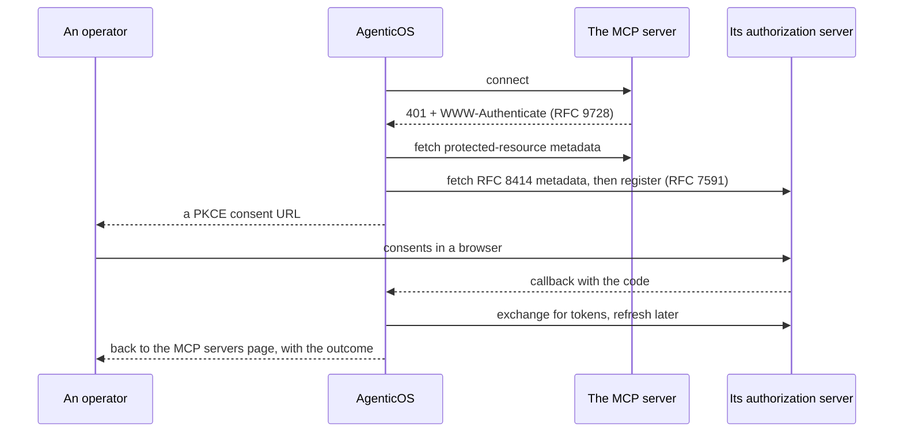

# MCP — las herramientas que aquí nadie tiene que escribir { #mcp-the-tools-nobody-here-has-to-write }

Los servidores [Model Context Protocol](https://modelcontextprotocol.io) son la
respuesta de esta plataforma a «no puedes escribir un conector para todo».

Una organización apunta a un servidor, sus herramientas aparecen en el Builder, y
no cambia ni una línea de código de nuestro lado.

Todo lo que hay en el [catálogo de capabilities](reference/capabilities.md) es
código que escribimos nosotros y que mantenemos al 100% de cobertura. Todo lo que
hay aquí es una URL que alguien pegó.

!!! info "Las dos cosas no son alternativas"

    Una **capability** es la forma correcta para algo que la plataforma tiene que
    garantizar — un guardián de budget, una sandbox, una recuperación que cita sus
    fuentes.

    **MCP** es la forma correcta para las decenas de productos SaaS que una empresa
    usa por casualidad, donde la única garantía que importa es «las herramientas son
    las que publicó el proveedor».

## Una conexión { #a-connection }

Una fila que apunta a un servidor remoto. El transporte — HTTP en streaming o
server-sent events — se deduce de la URL, así que un servidor solo de SSE como
Atlassian funciona junto a uno de HTTP en streaming sin nada que configurar.

| | |
|---|---|
| `name` | También el prefijo de las herramientas. Ver [Colisiones de nombres](#name-collisions) |
| `url` | Validada contra SSRF antes de que lleguemos a pedirla |
| `auth_token` | Sellado en el [vault](secrets.md), nunca devuelto por ningún endpoint |
| `allowed_tools` | Una lista de permitidos, o null para «todo lo que ofrezca el servidor». Una vinculación estrecha dentro de ella — ver más abajo |
| `is_enabled` | Apagarla sin perder la credencial |
| `last_status` | Qué encontró el último sondeo, y cuándo |

!!! warning "Una dirección que este despliegue no debe alcanzar se rechaza, y el rechazo lo dice"

    Una URL que resuelve a una dirección de loopback, privada, link-local o de
    CGNAT compartido, una que no resuelve en absoluto, una que lleva credenciales
    en su userinfo, una con un esquema distinto de `http`/`https`, o una
    simplemente malformada, vuelve como un **400** que nombra `url` como el campo
    culpable — al crear, al editar y al iniciar un flujo OAuth, tanto personal como
    de toda la organización.

    Más allá de eso, lo que nombra es el **host**, nunca la URL: una URL lleva una
    clave en su query string, y la frase que explica el rechazo está escrita en este
    repositorio, no es lo que el parser de URL tuviera que decir sobre el texto que
    enviaste.

    Antes era un 500 sin detalles y con un traceback en el log, que se lee como que
    la plataforma se rompe y no como una dirección que corregir
    ([#861](https://github.com/vstorm-co/agenticos/issues/861)) — auto-alojar y
    pegar una URL de `localhost` es el caso ordinario, no el exótico.

### Personal o de toda la organización { #personal-or-organization-wide }

Dos tipos, y la diferencia es lo importante.

**Personal** (MCP servers → You) está limitada a un miembro y la alcanza su propio
asistente, y también un agent vinculado a la cuenta propia de cada persona cuando
es ella quien habla con él.

Su credencial se sella para el *miembro*, no para una organización — una conexión
personal no tiene ninguna, y su dueño puede pertenecer a varias, así que atarla a
la que estuviera activa cuando la añadió haría el token ilegible en el momento en
que cambiara de una a otra.

**Organización** está limitada a la organización, protegida por
`connections:manage`, y es el único tipo que el spec de un agent publicado puede
nombrar *por id*.

Un agent publicado que alcanzara herramientas distintas según la sesión de quien
lo construyó no podría revisarse ni razonarse, que es toda la razón de la
restricción. Una conexión personal todavía alcanza a un agent, de una manera: una
vinculación a [la cuenta propia de cada persona](#whose-account-a-binding-speaks-through)
nombra el servicio, y quien habla con el agent aporta su propia conexión a él.

```
GET  /api/v1/me/mcp-connections     personal
GET  /api/v1/mcp-connections        organization, requires connections:manage
POST /api/v1/mcp-connections/{id}/test   probe it, list its tools, store the status
```

### Dos nombres, y responden a preguntas distintas { #two-names-and-they-answer-different-questions }

Una conexión lleva un **nombre** y un **prefijo de herramientas**, y solo el
segundo está restringido. El prefijo son letras minúsculas, dígitos y guiones,
único entre los servidores de la organización, porque eso es lo que puede llevar
el nombre de una herramienta y lo que el modelo lee antes de llamar a una. El
nombre es texto libre, opcional, y es lo que ve una persona.

La distinción se gana su sitio en cuanto una organización conecta un servicio dos
veces. Dos cuentas de Notion tienen que ser `notion` y `notion-2`, y ninguna de
las dos dice a qué workspace llega cada una; `Marketing workspace` y `Engineering
handbook` sí.

!!! info "El prefijo nunca desaparece"

    Dondequiera que se muestre un nombre, el prefijo se muestra a su lado. Las
    llamadas a herramientas de un run se registran bajo el prefijo, así que un
    nombre que lo sustituyera dejaría «¿por qué hizo esta llamada a
    `notion-2_search`?» sin respuesta desde la página que nombra la cuenta. Borra
    el nombre y la conexión vuelve a leerse como su prefijo, que es lo que hacía
    antes de que le pusieras uno.

Un spec nombra las conexiones de organización en `mcp_servers`, una entrada por
vinculación. Borrar una conexión que un agent todavía nombra le hace perder ese
servidor al agent, no al run.

### Qué herramientas, y quién decide { #which-tools-and-who-decides }

Dos listas de permitidos, y ninguna anula a la otra.

**En la conexión**, `allowed_tools` es la decisión de un administrador para todo
el que esté vinculado a ella — las herramientas que esta organización está
dispuesta a alcanzar en ese servidor, para empezar. **En la vinculación**, se
estrecha dentro de eso, por agent. Así que un mismo servidor puede servir a un
agent de solo lectura y a otro que edita sin conectarlo dos veces.

Se intersecan en tiempo de ejecución. Un agent no puede alcanzar una herramienta
que la conexión excluye, incluida una excluida después de publicar el agent — la
vinculación pierde esa herramienta en lugar de que el agent pierda el servidor.
Null en cualquiera de los dos lados significa que desde ahí no se estrecha nada,
así que una vinculación que no nombra nada obtiene lo que la conexión permita, que
es lo que hacía toda vinculación antes de que esto existiera.

El Builder lista las herramientas de un servidor a partir de su **último sondeo
con éxito**, registrado en la conexión. Sondear marca hacia un tercero y está
protegido por `connections:manage`; el autor de un agent tiene `agents:edit` y
necesita la lista para elegir, así que la lista se lee en lugar de pedirse.

Una conexión que nadie ha sondeado todavía no tiene catálogo que ofrecer, y el
selector lo dice y apunta a la página de servidores, que es donde se comprueba una
conexión. Una vinculación que ya nombra herramientas muestra esas, así que aquello
a lo que está vinculada sigue visible y todavía se puede estrechar.

### A través de qué cuenta habla una vinculación { #whose-account-a-binding-speaks-through }

Una vinculación es de uno de dos tipos, y el Builder pregunta cuál en la tarjeta.

**La cuenta de la organización** (`account: organization`) nombra una de las
conexiones de la organización y responde por todo el mundo, en cualquier
superficie. Es la opción por defecto y la respuesta contra la que se revisa un
agent.

**La cuenta propia de cada persona** (`account: personal`) nombra en su lugar el
servicio del catálogo — `catalog_key: notion` — y ninguna conexión. Quien habla
con el agent conecta su propio Notion, en MCP servers → You, y el agent le habla a
Notion como esa persona: en el dashboard, en un mensaje directo y en un canal por
igual. El rastro de auditoría en Notion dice entonces quién hizo qué, cosa que una
cuenta de servicio compartida nunca puede.

La cuenta es la del autor de *este mensaje*, nunca la del hilo. Ania pregunta en
`#ops` y obtiene una respuesta de su Notion; Bartek hace la misma pregunta en el
mismo hilo y obtiene la suya, o se le dice que conecte una. Un hilo no es una
frontera que las credenciales de nadie deban cruzar — si la primera persona en
conectar respondiera por todas las que vinieran después, enlazar un Notion en un
canal sería entregárselo al canal.

!!! info "Donde no habla nadie, las herramientas están ausentes — y el agent lo dice"

    Una clave de API, el widget embebido, una programación, un trigger y un
    remitente de canal que no ha enlazado su cuenta de chat no tienen cuenta a
    través de la cual hablar. El run continúa sin ese servidor, con todas las demás
    vinculaciones intactas, y se añade una línea a sus instrucciones que dice qué
    servicio falta y por qué — así que cuando alguien pide Notion el agent responde
    con el enlace que lo conecta (`/mcp-servers?connect=notion`), o con «envía
    `/link` a este bot primero» cuando lo que falta es la cuenta de chat.

    Una persona que tiene *varias* conexiones propias a un mismo servicio elige
    una, en MCP servers → You: la cuenta que marca como predeterminada es aquella
    como la que habla un agent. Hasta que elija, el agent se lo pide — adivinar en
    silencio el workspace más antiguo sería peor.

    En el chat del dashboard el mismo hecho llega como una tarjeta, antes de que el
    modelo responda, con un botón para conectar; y los controles del chat listan
    los servicios personales del agent con su estado, así que un miembro nuevo ve
    qué conectar antes de preguntar. Ver [la página de la consola](console.md#chat).

El prefijo de herramientas de una vinculación personal es la clave del catálogo,
se llame como se llame la conexión de cada persona, así que el agent presenta
`notion_search` a todo el mundo. `allowed_tools` en la vinculación es el techo del
administrador; la conexión propia de la persona puede estrechar más, y las dos se
intersecan.

!!! warning "Tres cosas que publicar rechaza"

    Una vinculación personal a una clave que el catálogo no tiene — nada podría
    casar nunca la conexión de un miembro con ella. Dos vinculaciones personales a
    un mismo servicio — las mismas herramientas dos veces bajo un nombre. Y una
    vinculación personal cuya clave es además el nombre de una conexión de
    organización vinculada al mismo agent, lo que pondría dos servidores bajo un
    prefijo; Pydantic AI rechaza los nombres de herramienta duplicados y el turno
    se aborta.

!!! note "Una colisión que llega a un run se estrecha, no se pierde"

    Publicar es un momento en el tiempo y el nombre de una conexión es editable
    después, así que un agent publicado antes de esta comprobación, o uno cuya
    conexión se renombró a un nombre que colisiona, todavía puede llegar a un run
    con dos servidores bajo un prefijo. Ese run se queda con el primero de ellos
    que responda a su sondeo, descarta el resto, y le dice al modelo qué servidor
    no está disponible en este turno - y, cuando ambos llevan un mismo nombre, a
    través de qué vinculación está hablando - en lugar de perderlo en una línea de
    log que nadie lee. Renombrar una de las dos conexiones es el arreglo del autor.

Un agent vincula cada servicio una vez, de una manera. Un agent que necesita el
Notion del manual de la organización *y* el propio de cada persona son dos agents,
o el mismo servidor conectado dos veces bajo dos nombres.

## Autenticación { #authentication }

Tres modos, que es lo único que varía de verdad entre servidores.

=== "Ninguna"

    Servidores de documentación pública, sobre todo — el servidor de documentación
    de Cloudflare no necesita credencial alguna.

=== "Token"

    Un bearer token pegado una vez y sellado.

    Cada entrada del catálogo lleva su propia pista sobre dónde conseguir uno,
    porque las instrucciones genéricas son la razón principal de que falle la
    configuración de un token.

    `PATCH` con `auth_token: ""` lo borra.

=== "OAuth 2.1"

    La mayoría de los servidores de negocio — Notion, Linear, Atlassian, Asana —
    devuelven `401` con una cabecera `WWW-Authenticate` que apunta a los metadatos
    de recurso protegido de RFC 9728, y el flujo arranca desde ahí.

    1. **Descubrir** — sondear el servidor, resolver su servidor de autorización,
       obtener los metadatos RFC 8414.
    2. **Registrar** — registro dinámico de cliente, RFC 7591.
    3. **Consentir** — una URL de autorización PKCE con `state` y un indicador de
       recurso RFC 8707; el navegador va allí.
    4. **Intercambiar** — el callback cambia el código por tokens, y luego redirige
       el navegador de vuelta a la página de MCP servers, que dice si funcionó. Ese
       es el único sitio donde se puede contar el resultado: la persona está
       mirando una página a la que no navegó ella misma.
    5. **Refrescar** — cuando el access token caduca.



### Se comprueba cada URL de ese flujo, no solo la que escribiste { #every-url-in-that-flow-is-checked-not-just-the-one-you-typed }

!!! danger "Descubrir significa que el servidor remoto elige la mayoría de las direcciones que llamamos"

    Conectar un solo servidor hostil bastaba antes: un nombre podía responder con
    una dirección pública a la comprobación y con una privada a la petición que
    venía después
    ([#860](https://github.com/vstorm-co/agenticos/issues/860)).

    La dirección que pasó la comprobación es ahora la dirección a la que se
    conecta.

La petición va a la IP resuelta con el host original en la cabecera `Host` y en el
SNI de TLS, así que el certificado se sigue verificando contra el nombre y nada lo
resuelve una segunda vez.

Esa segunda mitad importa aquí más que en ningún otro sitio del producto. La
dirección que escribe un operador es solo el primer salto — el servidor de
autorización, el endpoint de token, el endpoint de registro y cada redirección
posterior los nombran los propios documentos de descubrimiento del servidor
remoto. Nadie de tu organización tenía que ser el atacante.

Las redirecciones se siguen de salto en salto, con un límite de cinco, cada una
con su propia comprobación. Un `302` a un host nuevo se vuelve a resolver, no se
confía en él.

Cuando un nombre responde con varias direcciones, se comprueban y se guardan
todas, y a una dirección que rechaza la conexión le sigue la siguiente — lo que un
cliente ordinario obtiene del resolver, sin preguntar a DNS una segunda vez. Un
nombre que responde con una dirección pública y otra privada se rechaza **entero**
en lugar de estrecharse a su mitad pública.

Quedan dos bordes, ambos estrechos y ambos deliberados:

- La **URL de consentimiento** se comprueba y luego se entrega al navegador de
  alguien, que la resuelve por su cuenta. No hay nada que fijar.
- La **URL propia de la conexión** se comprueba al guardar y se resuelve otra vez
  cuando un agent se ejecuta — la escribe un operador, así que volver a apuntarla
  significa ser el operador.

Nada que elija un *modelo* llega a esta comprobación, y nada debería: una URL
elegida por un agent quiere el `safe_download` de Pydantic AI.

!!! info "Detrás de un proxy de salida, quien conecta es el proxy"

    `HTTP_PROXY` y `HTTPS_PROXY` se respetan, porque un despliegue que obliga a un
    proxy de salida perdería si no el OAuth de MCP por completo — y ese proxy es un
    control de salida por derecho propio.

    En ese camino la dirección fijada es la que se le *pide* alcanzar al proxy
    (`CONNECT 93.184.216.34:443`, o una línea de petición en forma absoluta para
    HTTP plano) y no aquella a la que se conecta este proceso, así que la garantía
    termina en el proxy. TLS sigue siendo de extremo a extremo, así que el
    certificado se sigue verificando contra el nombre original.

    Un proxy de políticas que rechace una dirección desnuda rechazará estas
    peticiones; la línea de log que se escribe cuando hay un proxy configurado está
    ahí para que ese fallo sea legible.

### Cuando falla un paso { #when-a-step-fails }

Un paso que falla dice **qué paso se rindió y qué clase de cosa lanzó el error**,
nunca lo que escribió el cliente de arriba.

`httpx` pone la petición fallida en su mensaje, y las dos peticiones de aquí son
un registro de cliente y una concesión de token — así que citarlo llevaría al
navegador un endpoint de token, alcanzado con credenciales. Un error de pydantic
sobre una respuesta de token ilegible repite el payload que rechazó, que son los
tokens. Los dos se quedan en el log del servidor, que es donde un operador ya
mira.

**Un documento de descubrimiento que nombra una URL que no se puede pedir en
absoluto es la misma clase de respuesta**: un **400** que dice qué endpoint era
inutilizable, y que está malformado.

Ese es un rechazo distinto de «este servidor apuntó el flujo a una dirección
bloqueada». Uno dice que el servidor nos apuntó a un sitio al que este despliegue
no va, el otro que escribió una dirección que nada puede marcar, y contar
cualquiera de los dos como el otro sería una afirmación rotunda sobre de quién fue
la culpa de un fallo.

Una pista `WWW-Authenticate` inutilizable termina ese *candidato* de
descubrimiento, no el flujo, porque las URI well-known que vienen después se
derivan de la URL que escribió un operador y bien pueden responder.

Esto era un 500 con el cuerpo vacío hasta
[#889](https://github.com/vstorm-co/agenticos/issues/889): `httpx.InvalidURL` no
deriva de `httpx.HTTPError`, así que ninguno de los catch del flujo lo veía — y
ninguna comprobación de aquí habría podido verlo, porque la URL se rechaza
mientras se construye la petición, por encima tanto de la comprobación de SSRF
como del cliente fijado. Lo que el parser no pudo leer (`Invalid port:
'client_secret=…'`) es el texto del propio servidor remoto y se queda en el log
con todo lo demás.

!!! warning "La conexión OAuth de una organización sigue siendo la concesión de alguien"

    `POST /mcp-connections/oauth/start` produce una conexión que posee la
    organización, que es para lo que sirve una cuenta de servicio compartida. Pero
    la concesión sigue siendo la de la *persona que consintió* en el provider:
    revocarle el acceso allí deja de hacer funcionar el servidor de la organización
    hasta que se autorice de nuevo.

    Consiente con una cuenta que controle la organización.

### Tres reglas sobre los tokens { #three-rules-about-tokens }

**Un token nunca sigue a una URL que se movió.** Editar la URL de una conexión
descarta su payload de OAuth, su flujo pendiente y sus scopes replicados — tanto
en conexiones personales como de organización — así que la conexión se lee como
«necesita volver a autorizarse» en lugar de enviar a otro host un token emitido
para uno.

En una fila de organización esto es además una frontera entre administradores: un
poseedor de `mcp:manage` que reapunta una conexión que autorizó otro no debe hacer
que la plataforma entregue ese token al host nuevo.

**Una conexión deshabilitada no reparte tokens en ninguna parte.** El camino de
herramientas del agent la salta, y los portales de triggers también — quien
conservara el `connection_id` de un trigger no puede seguir enumerando
repositorios ni registrando hooks con una credencial que un administrador apagó.

**Borrar una conexión libera lo que se registró a través de ella.** Cualquier
[trigger de eventos](triggers.md) cuyo webhook en el provider se registró
automáticamente con el token de esta cuenta ve ese hook dado de baja — en la
medida de lo posible, mientras el token todavía existe — y cae de vuelta a la
entrega manual. La URL y el secreto del trigger siguen en pie, así que volver a
apuntar un provider hacia él a mano sigue funcionando.

El flujo de conexión del portal de GitHub también es consciente de las
actualizaciones en el otro sentido: una organización que conectó la entrada de
catálogo de GitHub como una conexión bearer simple antes de que existiera el flujo
OAuth ve esa misma fila reautorizada en su sitio — encontrada por su clave de
catálogo, se llamara como se llamara — en lugar de rechazada o duplicada, y el
bearer token sigue funcionando hasta que llega el nuevo consentimiento.

## Qué pasa en un turno { #what-happens-on-a-turn }

Cada servidor se sondea con una ida y vuelta corta de `tools/list` — 3 segundos —
antes de que empiece el turno, y los sondeos corren a la vez.

!!! warning "Un servidor inalcanzable se salta con un aviso, no lanza un error"

    Pydantic AI entra en todos los toolsets cuando arranca un run, así que un
    servidor muerto abortaría si no el turno entero: un token caducado en una
    conexión tumbaría todos los agents que la nombran, incluidos los que nunca la
    necesitaron.

    El modelo responde entonces **sin** esas herramientas — lo correcto para un
    turno de chat, lo incorrecto si dabas por hecho que una herramienta siempre
    estaba ahí.

Es un intercambio deliberado. El endpoint `/test` y `last_status` son cómo te
enteras, y el [rastro de auditoría](governance.md#audit) registra lo que se
ejecutó de verdad.

### Conectar uno desde el Builder { #connecting-one-from-the-builder }

La pestaña **MCP servers** de un agent lista el catálogo entero, no solo lo que
tiene credenciales. Un servidor que no tiene ninguna no es una casilla — no hay id
de conexión que el spec pueda guardar — así que la tarjeta abre el diálogo de
conexión **ahí mismo**.

Un servidor de token o sin credenciales se conecta sin salir de la página, y la
nueva conexión queda marcada para el agent en cuanto existe.

!!! info "OAuth abre una pestaña"

    La pantalla de consentimiento es la del provider, así que no hay dónde quedarse
    — pero sí hay una forma de no perder el agent que estabas editando. Termina en
    la pestaña que se abre y vuelve; el servidor aparece en la lista en cuanto está
    autorizado.

### Un servidor, conectado varias veces { #one-server-connected-several-times }

Una organización puede conectar el mismo servidor más de una vez — un Notion con
acceso de solo lectura a un workspace, otro limitado a una única base de datos, un
tercero con una credencial de administrador. Esa es una forma soportada, no un
apaño: los nombres son únicos por organización y no por entrada de catálogo, y el
nombre es el prefijo de herramientas, así que el modelo ve
`notion_readonly_search` y `notion_admin_search` como herramientas distintas.

Vincula la que deba tener el agent. El Builder lista una fila por conexión y
etiqueta cada una con su nombre cuando una entrada tiene más de una.

!!! tip "El nombre es toda la distinción"

    `notion` y `notion-2` no le dicen nada a nadie. Nombra una conexión por lo que
    puede alcanzar — `notion-handbook`, `notion-admin` — porque esa cadena es lo
    que lee el modelo cuando decide a qué herramienta llamar.

### Colisiones de nombres { #name-collisions }

!!! note "Las herramientas llevan como prefijo el nombre de la conexión"

    `github-work` se convierte en `github_work_*`, porque dos servidores que
    exponen el mismo nombre de herramienta hacen que Pydantic AI lance un error por
    duplicados, lo que aborta el turno.

    Una lista de permitidos filtra *antes* de poner el prefijo, así que compara
    contra los nombres sin prefijo elegidos en la UI.

Dos conexiones cuyos nombres se reducen al mismo prefijo se deduplican — gana la
primera, con un aviso que nombra a la perdedora. Los servidores gestionados por el
despliegue van ordenados primero, así que ganan a una conexión de usuario que dé
la casualidad de elegir el mismo nombre.

## El catálogo { #the-catalog }

Un selector que empieza vacío y pide una URL es un selector que nadie usa, así que
los servidores comunes vienen con los metadatos necesarios para conectarlos: la
URL, cómo se autentica, qué decirle a quien vaya a pegar una credencial.

Esta es una lista mantenida a mano, **no** un espejo del registro público. Cada
entrada es una pequeña promesa — que alguien miró el servidor, que el flujo de
autenticación funciona, que la descripción es honesta — y un registro replicado no
puede hacer esa promesa.

!!! info "Qué añadiría de verdad replicarlo"

    El registro oficial se leyó entero en agosto de 2026: 20.100 registros, 7.127
    de ellos la versión actual de un servidor activo, 5.824 con un endpoint HTTPS
    alojado, repartidos en 5.141 hosts distintos. Así que los «miles de servidores»
    que anuncia un registro son reales.

    Cruzado con este catálogo, **cuatro** de esos hosts pertenecían a una empresa
    que la mayoría de los lectores reconocería y faltaban aquí — CircleCI, New
    Relic, Statsig y Lusha, los cuatro ya listados. El resto de los algo más de
    5.000 sin cubrir son servidores de un solo proyecto, proxies en `workers.dev`,
    herramientas de SEO y juegos: alfabéticamente, los primeros son una consulta de
    precios del suelo, una herramienta de licitación para contratistas y un
    servicio húngaro de presupuestos de ventanas.

    Los dos hechos merecen sostenerse a la vez. Al catálogo no le faltan entradas
    porque nadie haya mirado; tiene la longitud que tiene porque una lista
    comprobada a mano de cosas que una empresa usa de verdad converge alrededor del
    centenar.

### El registro está en la misma lista, y en la base de datos { #the-registry-is-in-the-same-list-and-in-the-database }

Así que el espejo también se envía, y **/mcp es una sola lista con todos ellos** —
el centenar curado primero, y luego 5.703 servidores replicados, paginados. No una
rejilla curada con una búsqueda que llega más lejos: una lista, un paginador, un
recuento.

Eso necesitaba una tabla. `mcp_registry_servers` es de todo el despliegue y no
tiene `organization_id`, que es toda la razón de que sea una tabla en lugar de
cinco mil filas por tenant — la galería de skills resolvió la cuestión vecina al
revés, y la diferencia es que un catálogo no son datos de un tenant. La llena
`agenticos cmd mcp-registry-sync`, desde la instantánea empaquetada o, con
`--fetch`, desde el registro en vivo.

Guardado en la base de datos porque un archivo no se puede paginar. Cinco mil
setecientas tres entradas en memoria podrían responder a «servidores que casan con
'linear'» y no podrían responder a «la cuarta página de todos ellos» sin cargarlo
todo y cortarlo. El ranking se movió a SQL con ello, por la misma razón: ordenar
una página es ordenar lo que esa página haya contenido. Tres bandas — el servidor
que se *llama* Linear, luego los nombres que meramente lo contienen, luego las
descripciones que lo mencionan — nombre más corto primero dentro de una banda, así
que `Stripe` gana a `Sweden Payments (Stripe)`.

Es una lista con un dato en algunas filas, no dos listas. Una fila del registro
lleva una insignia **Registry** donde una curada lleva su tipo de autenticación,
porque la diferencia merece conocerse antes de que alguien pegue una credencial:
aquí nadie la revisó, la descripción es la de quien publica, y no hay pista sobre
el token — el registro no tiene un campo así que replicar.

Del tamaño se siguen tres cosas, y cada una es la razón de que sea una búsqueda y
no un listado:

- **Paginado por el servidor, no filtrado por el navegador.** Cincuenta por
  página, y la consulta, la categoría y la página son todas peticiones. Un límite
  de página cae dentro del join — 99 filas curadas contra un tamaño de página de
  50 — así que la aritmética vive en `mcp_listing.page` con un test sobre ese
  límite, porque un error de uno ahí se salta un servidor o lo muestra dos veces en
  una lista donde nadie notaría cuál.
- **Una categoría pide solo entradas del catálogo.** El espejo no tiene
  categorías, así que responder a una con filas replicadas archivaría servidores
  sin categoría bajo un encabezado que dice lo contrario.
- **Sin logo empaquetado.** La consola incrusta un favicon por host curado para
  que una insignia se dibuje sin conexión; a 1,9 KB cada uno, hacer eso para el
  espejo serían 10,5 MB de base64 en un módulo que carga el navegador. Las filas
  del registro caen al servicio de favicons en tiempo de ejecución, que es para lo
  que se escribió.
- **Una instantánea, no un proxy.** Una instalación no debe dejar de funcionar
  porque el registro de otra persona esté caído, y un nombre que ayer resolvía y
  hoy no resuelve a nada es peor que uno que nunca estuvo.

    `make platform-bootstrap` la carga, así que un despliegue nuevo la tiene sin
    que nadie lea esto. `agenticos cmd mcp-registry-sync` la refresca, y `--fetch`
    lee el registro en vivo en lugar de la instantánea empaquetada. En un
    despliegue anterior a la tabla, la lista es el centenar curado hasta que se
    ejecuta la sincronización — que es lo que era antes de todo esto, así que nada
    empeora mientras alguien encuentra el momento.

Un servidor que no está en ninguna de las dos listas sigue siendo alcanzable:
**Custom server** acepta cualquier URL y no necesita entrada de catálogo alguna.

!!! info "Cuatro de estos son pasarelas, y son una promesa distinta"

    Composio, Pipedream, Activepieces y Smithery no son la API de un producto -
    cada uno es un endpoint hacia cientos o miles de otras, con las credenciales
    guardadas de su lado. Así que la entrada del catálogo responde por la
    *pasarela*, y lo que el agent puede alcanzar de verdad se decide en la consola
    de esa pasarela, por quien la configurara allí.

    Merece saberse antes de comparar tamaños de catálogo con un proveedor que
    anuncia miles de integraciones: ese número casi siempre es un endpoint de este
    tipo, no miles de servidores que alguien revisó. Las dos formas son útiles, y no
    son la misma afirmación.

!!! warning "Una promesa que hay que volver a hacer"

    La promesa se degrada. El servidor de referencia oficial de Postgres se archivó
    fuera de `modelcontextprotocol/servers` en 2025 y este catálogo siguió
    enlazándolo, así que lo único que la entrada le ofrecía a un lector era un 404.
    Nada comprueba estos enlaces — un test que sale a la internet pública es un test
    que falla en el tren de alguien — así que releer el catálogo es un trabajo
    humano periódico, y una entrada por la que nadie puede responder debería
    borrarse en lugar de dejarse.

`(self-hosted)` más abajo significa que la entrada describe el servidor pero la
URL la pones tú: o bien porque corre en tu propia infraestructura, o bien porque
el proveedor emite un endpoint por cuenta.

### Desarrollo { #development }

| Servidor | Auth | URL |
|---|---|---|
| GitHub | token | `https://api.githubcopilot.com/mcp/` |
| Cloudflare docs | none | `https://docs.mcp.cloudflare.com/mcp` |
| GitLab | token | self-hosted |
| Postman | token | `https://mcp.postman.com/mcp` |
| Vercel | oauth | `https://mcp.vercel.com/` |
| Netlify | oauth | `https://mcp.netlify.com/mcp` |
| Railway | token | `https://mcp.railway.app/mcp` |
| Replit | oauth | self-hosted |
| Hugging Face | token | `https://huggingface.co/mcp` |
| Buildkite | oauth | `https://mcp.buildkite.com/mcp` |
| Semgrep | token | `https://mcp.semgrep.ai/mcp` |
| Clerk | oauth | `https://mcp.clerk.com/mcp` |
| WorkOS | oauth | `https://mcp.workos.com/mcp` |
| Render | token | `https://mcp.render.com/mcp` |
| CircleCI | oauth | `https://mcp.circleci.com/v1/mcp` |

### Gestión de proyectos { #project-management }

| Servidor | Auth | URL |
|---|---|---|
| Linear | oauth | `https://mcp.linear.app/sse` |
| Jira & Confluence | oauth | `https://mcp.atlassian.com/v1/sse` |
| Asana | oauth | `https://mcp.asana.com/sse` |
| ClickUp | oauth | `https://mcp.clickup.com/mcp` |
| Trello | oauth | self-hosted |
| Todoist | oauth | self-hosted |
| monday.com | oauth | `https://mcp.monday.com/mcp` |

### Datos y analítica { #data-and-analytics }

| Servidor | Auth | URL |
|---|---|---|
| PostgreSQL | token | self-hosted |
| Supabase | token | `https://mcp.supabase.com/mcp` |
| Elasticsearch | token | self-hosted |
| Airtable | token | `https://mcp.airtable.com/mcp` |
| Snowflake | token | self-hosted |
| Databricks | token | self-hosted |
| Google BigQuery | oauth | self-hosted |
| PostHog | token | `https://mcp.posthog.com/mcp` |
| Mixpanel | token | `https://mcp.mixpanel.com/mcp` |
| Neon | oauth | `https://mcp.neon.tech/mcp` |
| Amplitude | token | `https://mcp.amplitude.com/mcp` |
| Firecrawl | token | `https://mcp.firecrawl.dev/mcp` |
| Exa | token | `https://mcp.exa.ai/mcp` |
| Tavily | token | `https://mcp.tavily.com/mcp` |
| Bright Data | token | `https://mcp.brightdata.com/mcp` |
| Qdrant | none | `https://mcp.qdrant.tech/mcp` |
| Statsig | token | `https://api.statsig.com/v1/mcp` |

### Comunicación, soporte, conocimiento { #communication-support-knowledge }

| Servidor | Auth | URL |
|---|---|---|
| Slack | oauth | `https://mcp.slack.com/mcp` |
| Zoom | oauth | self-hosted |
| Intercom | oauth | `https://mcp.intercom.com/sse` |
| Notion | oauth | `https://mcp.notion.com/mcp` |
| GitBook | token | `https://mcp.gitbook.com/mcp` |
| Sanity | token | `https://mcp.sanity.io/mcp` |
| DeepWiki | none | `https://mcp.deepwiki.com/mcp` |
| Supermemory | token | `https://mcp.supermemory.ai/mcp` |
| Contentful | token | `https://mcp.contentful.com/mcp` |
| Storyblok | token | `https://mcp.storyblok.com/mcp` |
| Vapi | token | `https://mcp.vapi.ai/mcp` |

### Finanzas, ventas, comercio { #finance-sales-commerce }

| Servidor | Auth | URL |
|---|---|---|
| Stripe | token | `https://mcp.stripe.com` |
| PayPal | oauth | `https://mcp.paypal.com/sse` |
| Xero | oauth | `https://mcp.xero.com/mcp` |
| HubSpot | oauth | self-hosted |
| Shopify | oauth | self-hosted |
| Attio | oauth | `https://mcp.attio.com/mcp` |
| Pipedrive | oauth | `https://mcp.pipedrive.com/mcp` |
| Lusha | token | `https://mcp.lusha.com/mcp` |

### Observabilidad { #observability }

| Servidor | Auth | URL |
|---|---|---|
| Sentry | oauth | `https://mcp.sentry.dev/mcp` |
| Grafana | token | `https://mcp.grafana.com/mcp` |
| PagerDuty | oauth | `https://mcp.pagerduty.com/mcp` |
| Datadog | token | `https://mcp.datadoghq.com/api/unstable/mcp-server/mcp` |
| Pydantic Logfire | token | `https://logfire-us.pydantic.dev/mcp` |
| LangSmith | token | `https://api.smith.langchain.com/mcp` |
| Honeycomb | token | `https://mcp.honeycomb.io/mcp` |
| New Relic | token | `https://mcp.newrelic.com/mcp` |

### Marketing y diseño { #marketing-and-design }

| Servidor | Auth | URL |
|---|---|---|
| Mailchimp | oauth | self-hosted |
| Resend | token | `https://mcp.resend.com/mcp` |
| Webflow | oauth | `https://mcp.webflow.com/mcp` |
| Wix | oauth | `https://mcp.wix.com/mcp` |
| WordPress.com | oauth | self-hosted |
| Semrush | token | self-hosted |
| Similarweb | token | `https://mcp.similarweb.com/mcp` |
| Figma | oauth | `https://mcp.figma.com/mcp` |
| Miro | oauth | `https://mcp.miro.com/mcp` |
| Lucid | oauth | `https://mcp.lucid.app/mcp` |
| Excalidraw | none | `https://mcp.excalidraw.com/mcp` |
| Canva | oauth | `https://mcp.canva.com/mcp` |
| Klaviyo | oauth | `https://mcp.klaviyo.com/mcp` |

### Automatización, almacenamiento, productividad, medios { #automation-storage-productivity-media }

| Servidor | Auth | URL |
|---|---|---|
| Zapier | oauth | self-hosted |
| Make | token | self-hosted |
| n8n | token | self-hosted |
| Box | oauth | `https://mcp.box.com/mcp` |
| Dropbox | oauth | `https://mcp.dropbox.com/mcp` |
| Calendly | oauth | self-hosted |
| Typeform | oauth | self-hosted |
| SurveyMonkey | oauth | `https://mcp.surveymonkey.com/mcp` |
| DeepL | token | self-hosted |
| ElevenLabs | token | self-hosted |
| Fireflies | token | `https://mcp.fireflies.ai/mcp` |
| Egnyte | oauth | `https://mcp-server.egnyte.com/mcp` |
| Apify | token | `https://mcp.apify.com` |
| Tally | token | `https://api.tally.so/mcp` |
| Pipedream | token | `https://remote.mcp.pipedream.net` |
| Composio | token | self-hosted |
| Activepieces | token | `https://mcp.activepieces.com/mcp` |
| Cal.com | token | `https://mcp.cal.com/mcp` |

### Cualquier otra cosa { #anything-else }

**Smithery** — token — `https://mcp.smithery.ai/mcp`. Una pasarela de registro:
los servidores que se alcanzan a través de ella son los que esa cuenta tenga
instalados en Smithery, así que lo que el agent puede hacer se decide allí y no
aquí.

**Custom server** — cualquier servidor MCP alcanzable por URL. Sus herramientas se
introspeccionan al conectar, y nada de él necesita estar antes en el catálogo. El
catálogo le ahorra a alguien buscar una URL; no es una puerta.

Para añadir una entrada a la lista, ver
[Añadir un servidor al catálogo de MCP](howto/add-mcp-server.md).

## Lo que MCP no te da { #what-mcp-does-not-get-you }

- **Una garantía de cobertura.** Las entradas del catálogo son metadatos. Las
  herramientas son del proveedor, y pueden cambiar bajo tus pies de un turno al
  siguiente.
- **Puertas de aprobación.** La aprobación por herramienta la declaran las
  capabilities en código. Las herramientas de un servidor MCP se descubren en
  tiempo de ejecución, así que no hay nada que las haya declarado; mantén los
  servidores genuinamente peligrosos fuera de las conexiones de una organización en
  lugar de dar por hecha una puerta.
- **Atribución de coste.** Lo que un servidor hace de su lado no está en el
  [budget](governance.md#budgets) de esta plataforma. Solo lo están los tokens del
  modelo.

## Resumen { #recap }

- Un servidor MCP es **una URL que alguien pegó**, y sus herramientas aparecen sin
  un despliegue de código.
- Las conexiones **personales** llegan al asistente de un miembro; solo las
  conexiones de **organización** puede nombrarlas un spec publicado.
- Cada dirección de un flujo OAuth se **comprueba y se fija**, incluidas las que
  eligió el servidor remoto.
- Un token nunca sigue a una URL que se movió, una conexión deshabilitada no
  reparte ninguno, y borrar una da de baja lo que registró.
- Un servidor inalcanzable se **salta**, no lanza un error — el turno responde sin
  esas herramientas.
