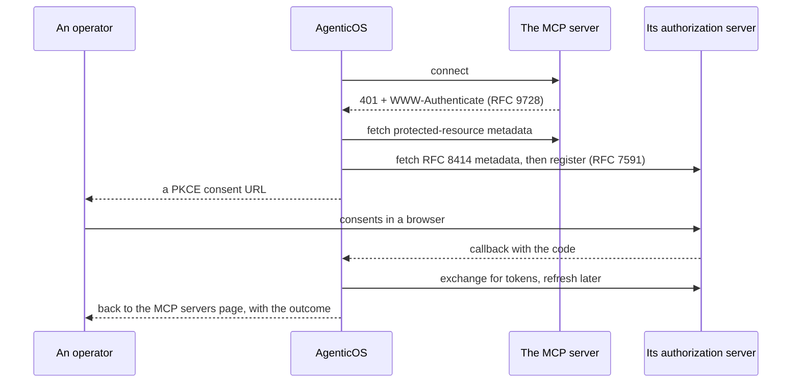

# MCP — the tools nobody here has to write

[Model Context Protocol](https://modelcontextprotocol.io) servers are this
platform's answer to "you cannot write a connector for everything".

An organization points at a server, its tools appear in the Builder, and no code
changes on our side.

Everything in the [capability catalog](reference/capabilities.md) is code we wrote
and hold to 100% coverage. Everything here is a URL somebody pasted.

!!! info "The two are not alternatives"

    A **capability** is the right shape for something the platform must guarantee
    — a budget guard, a sandbox, retrieval that cites its sources.

    **MCP** is the right shape for the forty SaaS products a company happens to
    use, where the guarantee that matters is only "the tools are the ones the
    vendor published".

## A connection

One row pointing at a remote server. The transport — streamable HTTP or
server-sent events — is inferred from the URL, so an SSE-only server like
Atlassian works alongside a streamable-HTTP one with nothing to configure.

| | |
|---|---|
| `name` | Also the tool prefix. See [Name collisions](#name-collisions) |
| `url` | SSRF-validated before we ever request it |
| `auth_token` | Sealed in the [vault](secrets.md), never returned by any endpoint |
| `allowed_tools` | An allowlist, or null for "everything the server offers". A binding narrows within it — see below |
| `is_enabled` | Off without losing the credential |
| `last_status` | What the last probe found, and when |

!!! warning "An address this deployment must not reach is refused, and the refusal says so"

    A URL that resolves to a loopback, private, link-local or shared-CGNAT
    address, one that does not resolve at all, one carrying credentials in its
    userinfo, one on a scheme other than `http`/`https`, or one that is simply
    malformed, comes back as a **400** naming `url` as the field at fault — on
    create, on edit, and on starting an OAuth flow, personal and organization-wide
    alike.

    What it names beyond that is the **host**, never the URL: a URL carries a key
    in its query string, and the sentence explaining the refusal is one written in
    this repository rather than whatever the URL parser had to say about the text
    you sent.

    It used to be a 500 with no details and a traceback in the log, which reads as
    the platform breaking rather than as an address to correct
    ([#861](https://github.com/vstorm-co/agenticos/issues/861)) — self-hosting and
    pasting a `localhost` URL is the ordinary case, not the exotic one.

### Personal or organization-wide

Two kinds, and the difference is the point.

**Personal** (Settings → Your connections) is scoped to one member and reached only
by their own assistant.

Its credential is sealed to the *member*, not to an organization — a personal
connection has none, and its owner may belong to several, so binding it to
whichever was active when they added it would make the token unreadable the moment
they switched.

**Organization** is scoped to the organization, gated on `connections:manage`, and
is the only kind a published agent's spec may name.

A published agent that answered differently depending on whose session ran it could
not be reviewed or reasoned about, which is the whole reason for the restriction.

```
GET  /api/v1/me/mcp-connections     personal
GET  /api/v1/mcp-connections        organization, requires connections:manage
POST /api/v1/mcp-connections/{id}/test   probe it, list its tools, store the status
```

### Two names, and they answer different questions

A connection carries a **name** and a **tool prefix**, and only the second is
constrained. The prefix is lowercase letters, digits and hyphens, unique among
the organization's servers, because that is what a tool name can carry and what
the model reads before it calls one. The name is free text, optional, and is
what a person sees.

The distinction earns its place the moment an organization connects one service
twice. Two Notion accounts have to be `notion` and `notion-2`, and neither says
which workspace either one reaches; `Marketing workspace` and `Engineering
handbook` do.

!!! info "The prefix never disappears"

    Wherever a name is shown, the prefix is shown beside it. A run's tool calls
    are recorded under the prefix, so a name that replaced it would leave "why
    did this call `notion-2_search`" unanswerable from the page that names the
    account. Clear the name and the connection reads as its prefix again, which
    is what it did before you set one.

A spec names organization connections in `mcp_servers`, one entry per binding.
Deleting a connection an agent still names loses that server for the agent, not
the run.

### Which tools, and who decides

Two allowlists, and neither overrides the other.

**On the connection**, `allowed_tools` is one administrator's decision for
everybody bound to it — the tools this organization is willing to reach on that
server at all. **On the binding**, it narrows within that, per agent. So one
server can serve a read-only agent and an editing one without connecting it
twice.

They intersect at run time. An agent cannot reach a tool the connection
excludes, including one excluded after the agent was published — the binding
loses that tool rather than the agent losing the server. Null on either side
means no narrowing from there, so a binding that names nothing gets whatever the
connection allows, which is what every binding did before this existed.

The Builder lists a server's tools from its **last successful probe**, recorded
on the connection. Probing dials out to a third party and is gated on
`connections:manage`; an agent author holds `agents:edit` and needs the list to
choose from, so the list is read rather than fetched.

A connection nothing has probed yet has no catalogue to offer, and the picker
says so and points at the servers page, which is where a connection is checked.
A binding that already names tools shows those, so what it is bound to stays
visible and can still be narrowed.

### Speaking as whoever is running the agent

A binding carries one option: `use_personal_when_available`. With it on, a run
reaches that service through the *runner's own* connection instead of the
organization's — but only where the conversation holds exactly one identified
person and nobody else. That means the dashboard chat, and a one-to-one direct
message on Slack, Telegram or Mattermost. A channel, a group direct message, the
embedded widget, an API key and a scheduled run all keep the organization's
account.

It is off by default, and that default is the point: the organization's account
is the answer an agent is reviewed against, and this is the one place a run may
differ from it.

Only the credential is substituted. The tool prefix stays the organization's, so
the agent presents the same tools to everyone and only the account behind them
changes.

!!! warning "Two things publish refuses, and one it declines to guess"

    A flagged binding whose connection has no `catalog_key` is refused: the key
    is what says a member's Notion and the organization's are the same service,
    and a connection made from a bare URL has nothing to match on. Two flagged
    bindings sharing one `catalog_key` are refused too — one run cannot
    substitute two accounts.

    A member holding *several* of their own connections to one service picks
    one, in Settings → Your connections: the account they nominate is the one an
    agent speaks as. Until they pick, the organization's account answers -
    picking the older workspace silently would be worse.

## Authentication

Three modes, which is the only thing that really varies between servers.

=== "None"

    Public documentation servers, mostly — Cloudflare's docs server needs no
    credential at all.

=== "Token"

    A bearer token pasted once and sealed.

    Each catalog entry carries its own hint about where to get one, because
    generic instructions are the main reason token setup fails.

    `PATCH` with `auth_token: ""` clears it.

=== "OAuth 2.1"

    Most business servers — Notion, Linear, Atlassian, Asana — return `401` with a
    `WWW-Authenticate` header pointing at RFC 9728 protected-resource metadata,
    and the flow runs from there.

    1. **Discover** — probe the server, resolve its authorization server, fetch
       RFC 8414 metadata.
    2. **Register** — RFC 7591 dynamic client registration.
    3. **Consent** — a PKCE authorization URL with `state` and an RFC 8707
       resource indicator; the browser goes there.
    4. **Exchange** — the callback swaps the code for tokens, then redirects the
       browser back to the MCP servers page, which says whether it worked. That is
       the only place the outcome can be told: the person is looking at a page
       they did not navigate to themselves.
    5. **Refresh** — when the access token expires.



### Every URL in that flow is checked, not just the one you typed

!!! danger "Discovery means the remote server chooses most of the addresses we call"

    Connecting a single hostile server used to be enough: a name could answer a
    public address to the check and a private one to the request that followed
    ([#860](https://github.com/vstorm-co/agenticos/issues/860)).

    The address that passed the check is now the address connected to.

The request goes to the resolved IP with the original host in the `Host` header and
in TLS SNI, so the certificate is still verified against the name and nothing
resolves it a second time.

That second half matters here more than anywhere else in the product. The address
an operator types is only the first hop — the authorization server, the token
endpoint, the registration endpoint and every redirect after them are named by the
remote server's own discovery documents. Nobody in your organization had to be the
attacker.

Redirects are followed one hop at a time, bounded at five, each with its own check.
A `302` to a new host is re-resolved, not trusted.

Where a name answers with several addresses, every one of them is checked and kept,
and an address that refuses the connection is followed by the next — what an
ordinary client gets from the resolver, without asking DNS a second time. A name
answering with one public address and one private one is refused **whole** rather
than narrowed to its public half.

Two edges remain, both narrow and both deliberate:

- The **consent URL** is checked and then handed to somebody's browser, which
  resolves it itself. There is no pinning to do.
- The **connection's own URL** is checked at save and resolved again when an agent
  runs — operator-typed, so rebinding it means being the operator.

Nothing a *model* chooses reaches this check at all, and nothing should: a URL an
agent picked wants Pydantic AI's `safe_download`.

!!! info "Behind an egress proxy, the proxy does the connecting"

    `HTTP_PROXY` and `HTTPS_PROXY` are honoured, because a deployment that mandates
    an egress proxy would otherwise lose MCP OAuth entirely — and that proxy is an
    egress control in its own right.

    On that path the pinned address is what the proxy is *asked* to reach
    (`CONNECT 93.184.216.34:443`, or an absolute-form request line for plain HTTP)
    rather than what this process connects to, so the guarantee ends at the proxy.
    TLS is still end to end, so the certificate is still verified against the
    original name.

    A policy proxy that refuses a bare address will refuse these requests; the log
    line written when a proxy is configured is there so that failure is readable.

### When a step fails

A step that fails says **which step gave up and what class of thing raised**, never
what the upstream client wrote.

`httpx` puts the failing request in its message, and the two requests here are a
client registration and a token grant — so quoting it would carry a token endpoint,
reached with credentials, into the browser. A pydantic error over an unreadable
token response echoes the payload it rejected, which is the tokens. Both stay in
the server log, which is where an operator already looks.

**A discovery document naming a URL that cannot be requested at all is the same
kind of answer**: a **400** saying which endpoint was unusable, and that it is
malformed.

That is a distinct refusal from "this server pointed the flow at a blocked
address". One says the server aimed us somewhere this deployment will not go, the
other that it wrote an address nothing can dial, and reporting either as the other
would be a confident claim about whose fault a failure was.

An unusable `WWW-Authenticate` hint ends that discovery *candidate* rather than the
flow, because the well-known URIs after it are derived from the URL an operator
typed and may well answer.

This was a 500 with an empty body until
[#889](https://github.com/vstorm-co/agenticos/issues/889): `httpx.InvalidURL` does
not derive from `httpx.HTTPError`, so none of the flow's catches saw it — and no
check here could have, because the URL is refused while the request is being built,
above both the SSRF check and the pinned client. What the parser could not read
(`Invalid port: 'client_secret=…'`) is the remote server's own text and stays in
the log with everything else.

!!! warning "An organization's OAuth connection is still someone's grant"

    `POST /mcp-connections/oauth/start` produces a connection the organization
    owns, which is what a shared service account is for. But the grant remains the
    *consenting person's* at the provider: revoking their access there stops the
    organization's server working until it is authorized again.

    Consent with an account the organization controls.

### Three rules about tokens

**A token never follows a moved URL.** Editing a connection's URL drops its OAuth
payload, pending flow and mirrored scopes — personal and organization connections
alike — so the connection reads "needs re-authorization" rather than sending a
token issued for one host to a different one.

On an organization row this is also a boundary between administrators: one
`mcp:manage` holder repointing a connection another authorized must not have the
platform deliver that token to the new host.

**A disabled connection hands out no tokens anywhere.** The agent tool path skips
it, and the trigger portals do too — a caller who kept a trigger's `connection_id`
cannot keep enumerating repositories or registering hooks with a credential an
administrator switched off.

**Deleting a connection releases what was registered through it.** Any
[event trigger](triggers.md) whose provider webhook was auto-registered with this
account's token has that hook deregistered — best-effort, while the token still
exists — and falls back to manual delivery. The trigger's URL and secret still
stand, so re-pointing a provider at it by hand keeps working.

The GitHub portal's connect flow is also upgrade-aware in the other direction: an
organization that connected the GitHub catalog entry as a plain bearer connection
before the OAuth flow existed has that same row re-authorized in place — found by
its catalog key, whatever it was named — rather than refused or duplicated, and the
bearer token keeps working until the new consent lands.

## What happens on a turn

Each server is probed with a short `tools/list` round-trip — 3 seconds — before the
turn starts, and the probes run concurrently.

!!! warning "An unreachable server is skipped with a warning, not raised"

    Pydantic AI enters every toolset when a run starts, so a dead server would
    otherwise abort the whole turn: one expired token on one connection would take
    down every agent that names it, including the ones that never needed it.

    The model then answers **without** those tools — right for a chat turn, wrong
    if you assumed a tool was always there.

That is a deliberate trade. The `/test` endpoint and `last_status` are how you find
out, and the [audit trail](governance.md#audit) records what actually ran.

### Connecting one from the Builder

An agent's **MCP servers** tab lists the whole catalog, not only what has
credentials. A server with none is not a checkbox — there is no connection id
for the spec to hold — so the card opens the connect dialog **in place**.

A token or credential-free server is connected without leaving the page, and the
new connection is ticked for the agent as soon as it exists.

!!! info "OAuth opens a tab"

    The consent screen is the provider's, so there is nowhere to stay — but
    there is a way not to lose the agent you were editing. Finish in the tab
    that opens and come back; the server appears in the list once it is
    authorised.

### One server, connected several times

An organization may connect the same server more than once — a Notion with
read-only access to one workspace, another scoped to a single database, a third
holding an admin credential. That is a supported shape, not a workaround: names
are unique per organization rather than per catalog entry, and the name is the
tool prefix, so the model sees `notion_readonly_search` and
`notion_admin_search` as different tools.

Bind whichever the agent should have. The Builder lists one row per connection
and labels each with its name where an entry has more than one.

!!! tip "The name is the whole distinction"

    `notion` and `notion-2` tell nobody anything. Name a connection after what
    it may reach — `notion-handbook`, `notion-admin` — because that string is
    what the model reads when it decides which tool to call.

### Name collisions

!!! note "Tools are prefixed with the connection name"

    `github-work` becomes `github_work_*`, because two servers exposing the same
    tool name make Pydantic AI raise on duplicates, which aborts the turn.

    An allowlist filters *before* prefixing, so it compares against the unprefixed
    names picked in the UI.

Two connections whose names reduce to the same prefix are deduplicated — first one
wins, with a warning naming the loser. Deployment-managed servers are ordered first,
so they win over a user connection that happens to pick the same name.

## The catalog

A picker that starts empty and asks for a URL is a picker nobody uses, so the common
servers ship with the metadata needed to connect them: the URL, how it
authenticates, what to tell whoever is pasting a credential.

This is a hand-maintained list, **not** a mirror of the public registry. Each entry
is a small promise — that somebody looked at the server, that the auth flow works,
that the description is honest — and a mirrored registry cannot make that promise.

!!! warning "A promise that has to be re-made"

    The promise decays. The official Postgres reference server was archived out
    of `modelcontextprotocol/servers` in 2025 and this catalog went on linking to
    it, so the one thing the entry offered a reader was a 404. Nothing checks
    these links — a test that reaches the public internet is a test that fails on
    somebody's train — so re-reading the catalog is a periodic human job, and an
    entry nobody can vouch for should be deleted rather than left.

`(self-hosted)` below means the entry describes the server but you supply the URL:
either because it runs on your own infrastructure, or because the vendor issues a
per-account endpoint.

### Development

| Server | Auth | URL |
|---|---|---|
| GitHub | token | `https://api.githubcopilot.com/mcp/` |
| Cloudflare docs | none | `https://docs.mcp.cloudflare.com/mcp` |
| GitLab | token | self-hosted |
| Postman | token | self-hosted |
| Vercel | oauth | self-hosted |
| Netlify | oauth | self-hosted |
| Railway | token | self-hosted |
| Replit | oauth | self-hosted |
| Hugging Face | token | self-hosted |

### Project management

| Server | Auth | URL |
|---|---|---|
| Linear | oauth | `https://mcp.linear.app/sse` |
| Jira & Confluence | oauth | `https://mcp.atlassian.com/v1/sse` |
| Asana | oauth | `https://mcp.asana.com/sse` |
| ClickUp | oauth | self-hosted |
| Trello | oauth | self-hosted |
| Todoist | oauth | self-hosted |

### Data and analytics

| Server | Auth | URL |
|---|---|---|
| PostgreSQL | token | self-hosted |
| Supabase | token | self-hosted |
| Elasticsearch | token | self-hosted |
| Airtable | token | self-hosted |
| Snowflake | token | self-hosted |
| Databricks | token | self-hosted |
| Google BigQuery | oauth | self-hosted |
| PostHog | token | self-hosted |
| Mixpanel | token | self-hosted |

### Communication, support, knowledge

| Server | Auth | URL |
|---|---|---|
| Slack | oauth | `https://mcp.slack.com/mcp` |
| Zoom | oauth | self-hosted |
| Intercom | oauth | `https://mcp.intercom.com/sse` |
| Notion | oauth | `https://mcp.notion.com/mcp` |
| GitBook | token | self-hosted |

### Finance, sales, commerce

| Server | Auth | URL |
|---|---|---|
| Stripe | token | `https://mcp.stripe.com` |
| PayPal | oauth | `https://mcp.paypal.com/sse` |
| Xero | oauth | self-hosted |
| HubSpot | oauth | self-hosted |
| Shopify | oauth | self-hosted |

### Observability

| Server | Auth | URL |
|---|---|---|
| Sentry | oauth | `https://mcp.sentry.dev/mcp` |
| Grafana | token | self-hosted |
| PagerDuty | oauth | self-hosted |

### Marketing and design

| Server | Auth | URL |
|---|---|---|
| Mailchimp | oauth | self-hosted |
| Resend | token | self-hosted |
| Webflow | oauth | self-hosted |
| Wix | oauth | self-hosted |
| WordPress.com | oauth | self-hosted |
| Semrush | token | self-hosted |
| Similarweb | token | self-hosted |
| Figma | oauth | self-hosted |
| Miro | oauth | self-hosted |
| Lucid | oauth | self-hosted |
| Excalidraw | none | self-hosted |

### Automation, storage, productivity, media

| Server | Auth | URL |
|---|---|---|
| Zapier | oauth | self-hosted |
| Make | token | self-hosted |
| n8n | token | self-hosted |
| Box | oauth | self-hosted |
| Dropbox | oauth | self-hosted |
| Calendly | oauth | self-hosted |
| Typeform | oauth | self-hosted |
| SurveyMonkey | oauth | self-hosted |
| DeepL | token | self-hosted |
| ElevenLabs | token | self-hosted |

### Anything else

**Custom server** — any MCP server reachable by URL. Its tools are introspected on
connect, and nothing about it needs to be in the catalog first. The catalog saves
somebody a URL lookup; it is not a gate.

To add an entry to the list, see
[Add a server to the MCP catalog](howto/add-mcp-server.md).

## What MCP does not get you

- **A coverage guarantee.** Catalog entries are metadata. The tools are the
  vendor's, and they can change under you between one turn and the next.
- **Approval gates.** Per-tool approval is declared by capabilities in code. An
  MCP server's tools are discovered at run time, so there is nothing to have
  declared them; keep genuinely dangerous servers out of an organization's
  connections rather than assuming a gate.
- **Cost attribution.** What a server does on its own side is not in this
  platform's [budget](governance.md#budgets). Only the model tokens are.

## Recap

- An MCP server is **a URL somebody pasted**, and its tools appear without a
  deploy.
- **Personal** connections reach one member's assistant; only **organization**
  connections may be named by a published spec.
- Every address in an OAuth flow is **checked and pinned**, including the ones the
  remote server chose.
- A token never follows a moved URL, a disabled connection hands out none, and
  deleting one deregisters what it registered.
- An unreachable server is **skipped**, not raised — the turn answers without those
  tools.
