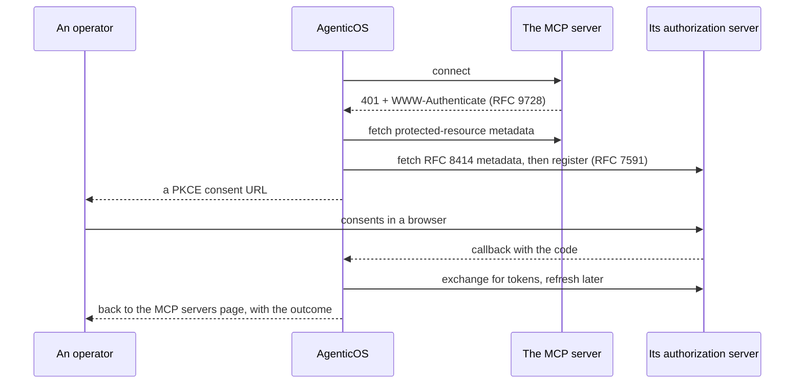

# MCP — narzędzia, których nikt tutaj nie musi pisać { #mcp-the-tools-nobody-here-has-to-write }

Serwery [Model Context Protocol](https://modelcontextprotocol.io) to odpowiedź
tej platformy na „nie da się napisać konektora do wszystkiego”.

Organizacja wskazuje serwer, jego narzędzia pojawiają się w Builderze i po naszej
stronie nie zmienia się żaden kod.

Wszystko w [katalogu capability](reference/capabilities.md) to kod, który
napisaliśmy i trzymamy na 100% pokrycia. Wszystko tutaj to URL, który ktoś
wkleił.

!!! info "To nie są alternatywy"

    **Capability** to właściwy kształt dla czegoś, co platforma musi
    zagwarantować — strażnika budżetu, sandboksa, retrievalu, który cytuje swoje
    źródła.

    **MCP** to właściwy kształt dla kilkudziesięciu produktów SaaS, z których
    firma akurat korzysta, gdzie jedyną liczącą się gwarancją jest „narzędzia są
    tymi, które opublikował dostawca”.

## Połączenie { #a-connection }

Jeden wiersz wskazujący zdalny serwer. Transport — streamable HTTP albo
server-sent events — jest wnioskowany z URL-a, więc serwer obsługujący wyłącznie
SSE, taki jak Atlassian, działa obok serwera na streamable HTTP i nie ma tu
niczego do konfigurowania.

| | |
|---|---|
| `name` | Zarazem prefiks narzędzi. Zobacz [Kolizje nazw](#name-collisions) |
| `url` | Sprawdzany pod kątem SSRF, zanim w ogóle wyślemy do niego żądanie |
| `auth_token` | Zapieczętowany w [vaulcie](secrets.md), nigdy nie zwracany przez żaden endpoint |
| `allowed_tools` | Lista dozwolonych albo null, czyli „wszystko, co serwer oferuje”. Powiązanie zawęża ją dalej — zobacz niżej |
| `is_enabled` | Wyłączenie bez utraty poświadczenia |
| `last_status` | Co pokazało ostatnie odpytanie i kiedy |

!!! warning "Adres, do którego ten deployment nie może sięgać, zostaje odrzucony — i odmowa to mówi"

    URL, który rozwiązuje się na adres loopback, prywatny, link-local albo
    współdzielony CGNAT, taki, który nie rozwiązuje się wcale, taki, który niesie
    poświadczenia w userinfo, taki na schemacie innym niż `http`/`https` albo po
    prostu źle sformułowany, wraca jako **400** wskazujące `url` jako pole, które
    zawiniło — przy tworzeniu, przy edycji i przy starcie flow OAuth, zarówno
    osobistego, jak i na poziomie organizacji.

    Poza tym wskazuje **host**, nigdy URL: URL niesie klucz w query stringu,
    a zdanie wyjaśniające odmowę jest napisane w tym repozytorium, a nie jest
    tym, co parser URL-i miał do powiedzenia o wysłanym przez ciebie tekście.

    Kiedyś było to 500 bez szczegółów i traceback w logu, co czyta się jak awaria
    platformy, a nie jak adres do poprawienia
    ([#861](https://github.com/vstorm-co/agenticos/issues/861)) — self-hosting
    i wklejenie URL-a z `localhost` to przypadek zwyczajny, nie egzotyczny.

### Osobiste albo dla całej organizacji { #personal-or-organization-wide }

Dwa rodzaje, i o tę różnicę właśnie chodzi.

**Osobiste** (MCP servers → You) obejmuje jednego członka i jest osiągalne przez
jego własnego asystenta oraz przez agenta powiązanego z własnym kontem każdej
osoby, gdy to ona z nim rozmawia.

Jego poświadczenie jest zapieczętowane dla *członka*, a nie dla organizacji —
połączenie osobiste żadnej nie ma, a jego właściciel może należeć do kilku, więc
przypisanie go do tej, która była aktywna w chwili dodawania, sprawiłoby, że
token stałby się nieczytelny w momencie przełączenia.

**Organizacyjne** obejmuje organizację, jest bramkowane przez
`connections:manage` i jest jedynym rodzajem, który spec opublikowanego agenta
może wskazać *po id*.

Opublikowany agent, który sięgałby po różne narzędzia zależnie od tego, czyja
sesja go zbudowała, nie dałby się ani przejrzeć, ani przemyśleć — i to jest cały
powód tego ograniczenia. Osobiste połączenie i tak dociera do agenta, jedną
drogą: powiązanie z [własnym kontem każdej
osoby](#whose-account-a-binding-speaks-through) wskazuje usługę, a ten, kto
rozmawia z agentem, dostarcza do niej własne połączenie.

```
GET  /api/v1/me/mcp-connections     personal
GET  /api/v1/mcp-connections        organization, requires connections:manage
POST /api/v1/mcp-connections/{id}/test   probe it, list its tools, store the status
```

### Dwie nazwy, i odpowiadają na różne pytania { #two-names-and-they-answer-different-questions }

Połączenie niesie **nazwę** i **prefiks narzędzi**, a ograniczony jest tylko ten
drugi. Prefiks to małe litery, cyfry i myślniki, unikalny wśród serwerów
organizacji, bo tyle może unieść nazwa narzędzia i to właśnie czyta model, zanim
którekolwiek wywoła. Nazwa jest dowolnym tekstem, jest opcjonalna i to ją widzi
człowiek.

Ten podział zaczyna się opłacać w chwili, gdy organizacja podłącza jedną usługę
dwa razy. Dwa konta Notion muszą być `notion` i `notion-2`, a żadne z nich nie
mówi, do którego workspace'u sięga; `Marketing workspace` i `Engineering
handbook` już tak.

!!! info "Prefiks nigdy nie znika"

    Gdziekolwiek pokazywana jest nazwa, obok pokazywany jest prefiks. Wywołania
    narzędzi w runie są zapisywane pod prefiksem, więc nazwa, która by go
    zastąpiła, zostawiłaby pytanie „dlaczego to wywołało `notion-2_search`” bez
    odpowiedzi na stronie, która nazywa konto. Wyczyść nazwę, a połączenie znów
    czyta się jako swój prefiks — dokładnie tak, jak robiło, zanim nazwę
    ustawiłeś.

Spec wskazuje połączenia organizacji w `mcp_servers`, po jednym wpisie na
powiązanie. Usunięcie połączenia, które agent wciąż wskazuje, odbiera agentowi
ten serwer, a nie runowi.

### Które narzędzia i kto o tym decyduje { #which-tools-and-who-decides }

Dwie listy dozwolonych i żadna nie unieważnia drugiej.

**Na połączeniu** `allowed_tools` to decyzja jednego administratora dla
wszystkich z nim powiązanych — narzędzia, po które ta organizacja w ogóle godzi
się sięgać na tym serwerze. **Na powiązaniu** zawęża się ona dalej, osobno dla
każdego agenta. Dzięki temu jeden serwer może obsłużyć agenta tylko do odczytu
i agenta edytującego, bez podłączania go dwa razy.

Przecinają się w czasie runu. Agent nie sięgnie po narzędzie, które połączenie
wyklucza — także po takie, które wykluczono już po opublikowaniu agenta:
powiązanie traci to narzędzie, a nie agent serwer. Null po którejkolwiek stronie
oznacza brak zawężenia z tej strony, więc powiązanie, które nie wymienia niczego,
dostaje to, na co pozwala połączenie — czyli to, co robiło każde powiązanie,
zanim to istniało.

Builder wypisuje narzędzia serwera z jego **ostatniego udanego odpytania**,
zapisanego na połączeniu. Odpytanie wydzwania do zewnętrznej firmy i jest
bramkowane przez `connections:manage`; autor agenta ma `agents:edit` i potrzebuje
listy, z której wybiera, więc lista jest odczytywana, a nie pobierana.

Połączenie, którego nikt jeszcze nie odpytał, nie ma katalogu do zaoferowania —
lista wyboru mówi to wprost i kieruje na stronę serwerów, bo tam sprawdza się
połączenie. Powiązanie, które już wymienia narzędzia, pokazuje właśnie je, więc
to, z czym jest związane, pozostaje widoczne i wciąż można je zawęzić.

### Przez czyje konto mówi powiązanie { #whose-account-a-binding-speaks-through }

Powiązanie jest jednego z dwóch rodzajów, a Builder pyta na karcie, którego.

**Konto organizacji** (`account: organization`) wskazuje jedno z połączeń
organizacji i odpowiada za wszystkich, na każdej powierzchni. To ustawienie
domyślne i to wobec niego przegląda się agenta.

**Własne konto każdej osoby** (`account: personal`) wskazuje zamiast tego usługę
z katalogu — `catalog_key: notion` — i żadnego połączenia. Kto rozmawia
z agentem, podłącza swój własny Notion w MCP servers → You, a agent mówi do
Notion jako on: w dashboardzie, w wiadomości prywatnej i w kanale tak samo. Ślad
audytowy po stronie Notion mówi wtedy, kto co zrobił — czego współdzielone konto
serwisowe nigdy nie potrafi.

Kontem jest autor *tej wiadomości*, nigdy autor wątku. Ania pyta na `#ops`
i dostaje odpowiedź ze swojego Notion; Bartek zadaje to samo pytanie w tym samym
wątku i dostaje swoją albo słyszy, że ma podłączyć konto. Wątek nie jest granicą,
którą czyjekolwiek poświadczenia powinny przekraczać — gdyby pierwsza osoba,
która się podłączy, odpowiadała za wszystkich po niej, podpięcie Notion w kanale
oddawałoby go kanałowi.

!!! info "Gdzie nikt nie rozmawia, narzędzi nie ma — i agent to mówi"

    Klucz API, osadzony widget, harmonogram, trigger i nadawca z kanału, który
    nie powiązał swojego konta czatu, nie mają konta, przez które mogliby mówić.
    Run idzie dalej bez tego serwera, z nietkniętymi pozostałymi powiązaniami,
    a do jego instrukcji dokładany jest jeden wiersz mówiący, której usługi
    brakuje i dlaczego — więc gdy ktoś poprosi o Notion, agent odpowie linkiem,
    który go podłącza (`/mcp-servers?connect=notion`), albo zdaniem „najpierw
    wyślij `/link` do tego bota”, gdy brakującym elementem jest konto czatu.

    Osoba mająca *kilka* własnych połączeń do jednej usługi wybiera jedno,
    w MCP servers → You: konto oznaczone jako domyślne jest tym, którym mówi
    agent. Dopóki nie wybierze, agent jej to mówi — ciche zgadnięcie starszego
    workspace'u byłoby gorsze.

    W czacie w dashboardzie ten sam fakt przychodzi jako karta, zanim odpowie
    model, z przyciskiem podłączenia; a kontrolki czatu wypisują osobiste usługi
    agenta wraz z ich statusem, więc nowy członek widzi, co podłączyć, jeszcze
    zanim zapyta. Zobacz [stronę konsoli](console.md#chat).

Prefiksem narzędzi osobistego powiązania jest klucz katalogowy, niezależnie od
tego, jak każdy nazwał swoje połączenie, więc agent przedstawia wszystkim
`notion_search`. `allowed_tools` na powiązaniu to sufit ustawiony przez
administratora; własne połączenie danej osoby może zawęzić dalej, a jedno
z drugim się przecina.

!!! warning "Trzy rzeczy, których publikacja odmawia"

    Osobiste powiązanie z kluczem, którego katalog nie ma — nic nigdy nie
    dopasowałoby do niego połączenia członka. Dwa osobiste powiązania z jedną
    usługą — te same narzędzia dwa razy pod jedną nazwą. I osobiste powiązanie,
    którego klucz jest zarazem nazwą połączenia organizacji powiązanego z tym
    samym agentem, co postawiłoby dwa serwery pod jednym prefiksem; Pydantic AI
    odrzuca zduplikowane nazwy narzędzi i tura się przerywa.

!!! note "Kolizja, która dociera do runa, zostaje zawężona, a nie utracona"

    Publikacja to punkt w czasie, a nazwę połączenia można później edytować, więc
    agent opublikowany przed tym sprawdzeniem albo taki, którego połączenie
    przemianowano na kolidującą nazwę, wciąż może dotrzeć do runa z dwoma
    serwerami pod jednym prefiksem. Taki run zatrzymuje pierwszy z nich, który
    odpowie na odpytanie, resztę odrzuca i mówi modelowi, który serwer jest w tej
    turze niedostępny — a gdy oba noszą jedną nazwę, przez które powiązanie mówi
    — zamiast gubić to w wierszu logu, którego nikt nie czyta. Naprawą po stronie
    autora jest przemianowanie jednego z dwóch połączeń.

Jeden agent wiąże każdą usługę raz i w jeden sposób. Agent, który potrzebuje
firmowego Notion z podręcznikiem *i* własnego Notion każdej osoby, to dwaj
agenci albo ten sam serwer podłączony dwa razy pod dwiema nazwami.

## Uwierzytelnianie { #authentication }

Trzy tryby — i to jedyne, co naprawdę różni serwery między sobą.

=== "Brak"

    Przeważnie publiczne serwery z dokumentacją — serwer dokumentacji Cloudflare
    nie potrzebuje żadnych poświadczeń.

=== "Token"

    Token bearer wklejony raz i zapieczętowany.

    Każdy wpis w katalogu niesie własną podpowiedź, skąd go wziąć, bo ogólne
    instrukcje są głównym powodem, dla którego konfiguracja tokena się nie udaje.

    `PATCH` z `auth_token: ""` go czyści.

=== "OAuth 2.1"

    Większość serwerów biznesowych — Notion, Linear, Atlassian, Asana — zwraca
    `401` z nagłówkiem `WWW-Authenticate` wskazującym metadane protected-resource
    z RFC 9728, i stamtąd rusza flow.

    1. **Wykrycie** — odpytaj serwer, ustal jego authorization server, pobierz
       metadane RFC 8414.
    2. **Rejestracja** — dynamiczna rejestracja klienta wg RFC 7591.
    3. **Zgoda** — URL autoryzacji z PKCE, ze `state` i wskaźnikiem zasobu wg
       RFC 8707; przeglądarka idzie pod ten adres.
    4. **Wymiana** — callback wymienia kod na tokeny, po czym przekierowuje
       przeglądarkę z powrotem na stronę MCP servers, która mówi, czy się udało.
       To jedyne miejsce, w którym można przekazać wynik: człowiek patrzy na
       stronę, na którą sam nie wszedł.
    5. **Odświeżenie** — gdy access token wygaśnie.



### Sprawdzany jest każdy URL w tym flow, nie tylko ten, który wpisałeś { #every-url-in-that-flow-is-checked-not-just-the-one-you-typed }

!!! danger "Discovery oznacza, że większość adresów, pod które dzwonimy, wybiera zdalny serwer"

    Kiedyś wystarczyło podłączyć jeden wrogi serwer: nazwa mogła odpowiedzieć
    adresem publicznym na sprawdzenie i prywatnym na żądanie, które po nim szło
    ([#860](https://github.com/vstorm-co/agenticos/issues/860)).

    Adres, który przeszedł sprawdzenie, jest teraz adresem, z którym nawiązywane
    jest połączenie.

Żądanie idzie na rozwiązany adres IP, z oryginalnym hostem w nagłówku `Host`
i w TLS SNI, więc certyfikat wciąż jest weryfikowany wobec nazwy i nic nie
rozwiązuje jej po raz drugi.

Ta druga połowa ma tu większe znaczenie niż gdziekolwiek indziej w produkcie.
Adres, który wpisuje operator, to dopiero pierwszy przeskok — authorization
server, token endpoint, registration endpoint i każde przekierowanie po nich są
wskazywane przez własne dokumenty discovery zdalnego serwera. Nikt w twojej
organizacji nie musiał być atakującym.

Przekierowania są podążane po jednym przeskoku, z limitem pięciu, każde
z własnym sprawdzeniem. `302` na nowy host jest rozwiązywane od nowa, a nie brane
na wiarę.

Gdy nazwa odpowiada kilkoma adresami, każdy z nich jest sprawdzany
i zachowywany, a po adresie, który odrzuci połączenie, idzie następny — to samo,
co zwykły klient dostaje z resolvera, bez pytania DNS po raz drugi. Nazwa
odpowiadająca jednym adresem publicznym i jednym prywatnym zostaje odrzucona
**w całości**, a nie zawężona do swojej publicznej połowy.

Zostają dwa brzegi, oba wąskie i oba celowe:

- **URL zgody** jest sprawdzany, a potem przekazywany czyjejś przeglądarce, która
  rozwiązuje go sama. Nie ma tu czego przypinać.
- **Własny URL połączenia** jest sprawdzany przy zapisie i rozwiązywany ponownie,
  gdy agent działa — wpisuje go operator, więc przestawienie go wymaga bycia
  operatorem.

Nic, co wybiera *model*, w ogóle nie dociera do tego sprawdzenia — i nie powinno:
URL wybrany przez agenta należy do `safe_download` z Pydantic AI.

!!! info "Za proxy wyjściowym łączy się proxy"

    `HTTP_PROXY` i `HTTPS_PROXY` są respektowane, bo deployment wymuszający proxy
    wyjściowe straciłby inaczej MCP OAuth w całości — a takie proxy samo w sobie
    jest kontrolą ruchu wychodzącego.

    Na tej ścieżce przypiętym adresem jest to, o co proxy jest *proszone*, żeby
    osiągnąć (`CONNECT 93.184.216.34:443` albo linia żądania w formie absolutnej
    dla zwykłego HTTP), a nie to, z czym łączy się ten proces, więc gwarancja
    kończy się na proxy. TLS wciąż jest end to end, więc certyfikat wciąż jest
    weryfikowany wobec oryginalnej nazwy.

    Proxy z polityką odrzucającą goły adres odrzuci te żądania; wiersz logu
    zapisywany, gdy proxy jest skonfigurowane, jest po to, by ta awaria dała się
    odczytać.

### Gdy krok się nie powiedzie { #when-a-step-fails }

Krok, który się nie powiedzie, mówi, **który krok się poddał i jakiej klasy rzecz
podniosła wyjątek**, nigdy tego, co napisał klient po drugiej stronie.

`httpx` wstawia w swój komunikat żądanie, które zawiodło, a te dwa żądania to
rejestracja klienta i przyznanie tokena — więc zacytowanie go przeniosłoby do
przeglądarki token endpoint, osiągany z poświadczeniami. Błąd pydantica nad
nieczytelną odpowiedzią z tokenami odbija payload, który odrzucił, czyli właśnie
tokeny. Jedno i drugie zostaje w logu serwera, bo tam operator i tak zagląda.

**Dokument discovery wskazujący URL, którego w ogóle nie da się zażądać, to
odpowiedź tego samego rodzaju**: **400** mówiące, który endpoint był bezużyteczny
i że jest źle sformułowany.

To odmowa odrębna od „ten serwer skierował flow na zablokowany adres”. Jedna
mówi, że serwer wycelował nas tam, gdzie ten deployment nie pójdzie, druga — że
zapisał adres, którego nic nie wybierze; zgłoszenie jednej jako drugiej byłoby
pewnym siebie twierdzeniem o tym, po czyjej stronie leży wina.

Bezużyteczna podpowiedź `WWW-Authenticate` kończy tego *kandydata* w discovery,
a nie całe flow, bo idące po nim URI well-known wywodzą się z URL-a wpisanego
przez operatora i mogą jak najbardziej odpowiedzieć.

Do [#889](https://github.com/vstorm-co/agenticos/issues/889) było to 500 z pustym
ciałem: `httpx.InvalidURL` nie dziedziczy po `httpx.HTTPError`, więc żaden
z catchów w tym flow go nie widział — i żadne sprawdzenie tutaj widzieć nie
mogło, bo URL zostaje odrzucony w trakcie budowania żądania, ponad sprawdzeniem
SSRF i ponad klientem z przypiętym adresem. To, czego parser nie umiał odczytać
(`Invalid port: 'client_secret=…'`), jest własnym tekstem zdalnego serwera
i zostaje w logu razem z resztą.

!!! warning "Połączenie OAuth organizacji wciąż jest czyjąś zgodą"

    `POST /mcp-connections/oauth/start` tworzy połączenie, którego właścicielem
    jest organizacja — i po to właśnie jest współdzielone konto serwisowe. Ale
    zgoda u providera pozostaje zgodą *osoby, która ją wyraziła*: odebranie jej
    tam dostępu zatrzymuje działanie serwera organizacji do czasu ponownej
    autoryzacji.

    Wyrażaj zgodę z konta, które kontroluje organizacja.

### Trzy zasady dotyczące tokenów { #three-rules-about-tokens }

**Token nigdy nie podąża za przeniesionym URL-em.** Edycja URL-a połączenia
kasuje jego payload OAuth, oczekujące flow i odwzorowane scope'y — tak samo
w połączeniach osobistych, jak i organizacji — więc połączenie czyta się jako
„wymaga ponownej autoryzacji”, zamiast wysyłać token wydany dla jednego hosta do
innego.

W wierszu organizacji jest to zarazem granica między administratorami: posiadacz
`mcp:manage`, który przestawia połączenie autoryzowane przez innego, nie może
sprawić, żeby platforma dostarczyła ten token na nowy host.

**Wyłączone połączenie nie wydaje tokenów nigdzie.** Ścieżka narzędzi agenta je
pomija i portale triggerów też — wywołujący, który zachował `connection_id`
triggera, nie będzie dalej wyliczał repozytoriów ani rejestrował hooków
poświadczeniem, które administrator wyłączył.

**Usunięcie połączenia zwalnia to, co przez nie zarejestrowano.** Każdy
[trigger zdarzeniowy](triggers.md), którego webhook u providera zarejestrowano
automatycznie tokenem tego konta, ma ten hook wyrejestrowany — best-effort,
dopóki token jeszcze istnieje — i wraca do ręcznego dostarczania. URL i sekret
triggera nadal obowiązują, więc ręczne skierowanie na niego providera dalej
działa.

Flow podłączania w portalu GitHuba jest też świadome aktualizacji w drugą stronę:
organizacja, która podłączyła wpis katalogowy GitHuba jako zwykłe połączenie
z tokenem bearer, zanim istniało flow OAuth, dostaje ten sam wiersz autoryzowany
ponownie w miejscu — odnajdywany po swoim kluczu katalogowym, niezależnie od
nazwy — zamiast odmowy albo duplikatu, a token bearer działa dalej, dopóki nie
wyląduje nowa zgoda.

## Co dzieje się w turze { #what-happens-on-a-turn }

Każdy serwer jest odpytywany krótkim obiegiem `tools/list` — 3 sekundy — zanim
tura się zacznie, a odpytania biegną równolegle.

!!! warning "Nieosiągalny serwer zostaje pominięty z ostrzeżeniem, a nie podnosi wyjątku"

    Pydantic AI wchodzi w każdy toolset przy starcie runa, więc martwy serwer
    przerwałby inaczej całą turę: jeden wygasły token na jednym połączeniu
    położyłby każdego agenta, który go wskazuje, łącznie z tymi, które nigdy go
    nie potrzebowały.

    Model odpowiada wtedy **bez** tych narzędzi — słusznie w turze czatu,
    niesłusznie, jeśli założyłeś, że narzędzie jest tam zawsze.

To świadomy kompromis. Dowiadujesz się o tym przez endpoint `/test`
i `last_status`, a [ślad audytowy](governance.md#audit) zapisuje, co faktycznie
się wykonało.

### Podłączenie serwera z poziomu Buildera { #connecting-one-from-the-builder }

Zakładka **MCP servers** agenta wypisuje cały katalog, nie tylko to, co ma
poświadczenia. Serwer bez nich nie jest checkboksem — nie ma id połączenia, które
spec mógłby przechować — więc karta otwiera dialog podłączenia **na miejscu**.

Serwer na token albo w ogóle bez poświadczeń podłącza się bez opuszczania strony,
a nowe połączenie jest zaznaczane dla agenta, gdy tylko powstanie.

!!! info "OAuth otwiera kartę"

    Ekran zgody należy do providera, więc nie ma gdzie zostać — jest za to
    sposób, by nie stracić agenta, którego edytowałeś. Dokończ w karcie, która
    się otworzy, i wróć; serwer pojawi się na liście, gdy będzie autoryzowany.

### Jeden serwer podłączony kilka razy { #one-server-connected-several-times }

Organizacja może podłączyć ten sam serwer więcej niż raz — Notion z dostępem
tylko do odczytu do jednego workspace'u, drugi ograniczony do jednej bazy, trzeci
z poświadczeniem administratora. To wspierany kształt, a nie obejście: nazwy są
unikalne w obrębie organizacji, a nie w obrębie wpisu katalogowego, a nazwa jest
prefiksem narzędzi, więc model widzi `notion_readonly_search`
i `notion_admin_search` jako różne narzędzia.

Powiąż to, które agent ma mieć. Builder wypisuje po jednym wierszu na połączenie
i opisuje każdy jego nazwą tam, gdzie wpis ma ich więcej niż jedno.

!!! tip "Cała różnica tkwi w nazwie"

    `notion` i `notion-2` nikomu nic nie mówią. Nazwij połączenie od tego, do
    czego może sięgać — `notion-handbook`, `notion-admin` — bo to ten ciąg znaków
    czyta model, gdy decyduje, które narzędzie wywołać.

### Kolizje nazw { #name-collisions }

!!! note "Narzędzia dostają prefiks z nazwy połączenia"

    `github-work` staje się `github_work_*`, bo dwa serwery udostępniające tę
    samą nazwę narzędzia sprawiają, że Pydantic AI podnosi wyjątek na
    duplikatach, co przerywa turę.

    Lista dozwolonych filtruje *przed* nadaniem prefiksu, więc porównuje z
    nazwami bez prefiksu, wybranymi w UI.

Dwa połączenia, których nazwy sprowadzają się do tego samego prefiksu, są
deduplikowane — wygrywa pierwsze, z ostrzeżeniem nazywającym przegranego. Serwery
zarządzane przez deployment są układane jako pierwsze, więc wygrywają
z połączeniem użytkownika, które trafiło na tę samą nazwę.

## Katalog { #the-catalog }

Lista wyboru, która startuje pusta i prosi o URL, to lista, z której nikt nie
korzysta, więc popularne serwery są dostarczane z metadanymi potrzebnymi do ich
podłączenia: URL-em, sposobem uwierzytelniania i tym, co powiedzieć osobie
wklejającej poświadczenie.

To lista utrzymywana ręcznie, **nie** lustro publicznego rejestru. Każdy wpis
jest małą obietnicą — że ktoś zajrzał do serwera, że flow uwierzytelniania
działa, że opis jest uczciwy — a odbity rejestr takiej obietnicy złożyć nie może.

!!! info "Co naprawdę dałoby lustrzane odbicie rejestru"

    Oficjalny rejestr został przeczytany w całości w sierpniu 2026: 20 100
    rekordów, z czego 7127 to bieżąca wersja aktywnego serwera, a 5824 niosą
    hostowany endpoint HTTPS, w sumie na 5141 różnych hostach. Tak więc „tysiące
    serwerów”, którymi rejestr się chwali, to fakt.

    Po zestawieniu z tym katalogiem **cztery** z tych hostów należały do firmy,
    którą większość czytelników by rozpoznała, i tutaj ich brakowało — CircleCI,
    New Relic, Statsig i Lusha, wszystkie cztery są już na liście. Reszta
    z nieobjętych pięciu tysięcy z okładem to serwery jednoprojektowe, proxy na
    `workers.dev`, narzędzia SEO i gry: alfabetycznie pierwsze z brzegu to
    wyszukiwarka cen gruntów, narzędzie do przetargów dla wykonawców i węgierski
    serwis wyceny okien.

    Warto trzymać oba te fakty naraz. Katalogowi nie brakuje wpisów dlatego, że
    nikt nie szukał; ma taką długość, jaką ma, bo ręcznie sprawdzona lista
    rzeczy, z których firma naprawdę korzysta, zbiega się w okolicach setki.

### Rejestr jest na tej samej liście i w bazie danych { #the-registry-is-in-the-same-list-and-in-the-database }

Lustro jest więc dostarczane razem z nim, a **/mcp to jedna lista ich
wszystkich** — najpierw wyselekcjonowana setka, potem 5703 odbite serwery,
stronicowane. Nie wyselekcjonowana siatka z wyszukiwarką sięgającą dalej: jedna
lista, jeden pager, jeden licznik.

To wymagało tabeli. `mcp_registry_servers` jest wspólna dla całego deploymentu
i nie ma `organization_id` — i to jest cały powód, dla którego jest tabelą, a nie
pięcioma tysiącami wierszy na tenanta; galeria skilli rozstrzygnęła sąsiednie
pytanie odwrotnie, a różnica polega na tym, że katalog nie jest danymi tenanta.
Wypełnia ją `agenticos cmd mcp-registry-sync`, z dołączonego snapshotu albo,
z `--fetch`, z żywego rejestru.

Trzymane w bazie danych, bo pliku nie da się stronicować. Mając 5703 wpisy
w pamięci, dałoby się odpowiedzieć na „serwery pasujące do »linear«”, ale nie na
„czwartą stronę ich wszystkich” bez wczytania całości i pokrojenia jej. Wraz
z tym do SQL-a przeniosło się rankowanie, z tego samego powodu: rankowanie strony
to rankowanie tego, co akurat się na niej znalazło. Trzy pasma — serwer
*nazywający się* Linear, potem nazwy, które to tylko zawierają, potem opisy,
które o tym wspominają — wewnątrz pasma najpierw krótsza nazwa, więc `Stripe`
bije `Sweden Payments (Stripe)`.

To jedna lista z faktem dopisanym do niektórych wierszy, a nie dwie listy. Wiersz
z rejestru niesie plakietkę **Registry** tam, gdzie wyselekcjonowany niesie swój
rodzaj uwierzytelniania, bo tę różnicę warto znać, zanim ktoś wklei
poświadczenie: nikt tutaj tego nie przejrzał, opis pochodzi od wydawcy,
a podpowiedzi o tokenie nie ma — rejestr nie ma takiego pola do odbicia.

Z rozmiaru wynikają trzy rzeczy i każda z nich jest powodem, dla którego jest to
wyszukiwanie, a nie wyliczanka:

- **Stronicowane przez serwer, nie filtrowane przez przeglądarkę.** Pięćdziesiąt
  na stronę, a zapytanie, kategoria i strona to wszystko żądania. Granica strony
  wypada w środku złączenia — 99 wyselekcjonowanych wierszy przy rozmiarze strony
  50 — więc arytmetyka mieszka w `mcp_listing.page`, z testem na tej granicy, bo
  pomyłka o jeden pomija tam serwer albo pokazuje go dwa razy na liście, na
  której nikt by nie zauważył którego.
- **Kategoria pyta wyłącznie o wpisy katalogowe.** Lustro nie ma kategorii, więc
  odpowiadanie na nią odbitymi wierszami wrzucałoby nieskategoryzowane serwery
  pod nagłówek, który mówi co innego.
- **Żadnego wbudowanego logo.** Konsola wstawia inline favikonę dla każdego
  wyselekcjonowanego hosta, żeby plakietka renderowała się offline; po 1,9 KB
  każda, zrobienie tego dla lustra dałoby 10,5 MB base64 w module, który ładuje
  przeglądarka. Wiersze z rejestru spadają do serwisu favikon działającego
  w czasie żądania — po to właśnie został napisany.
- **Snapshot, nie proxy.** Instalacja nie może przestać działać dlatego, że
  czyjś rejestr leży, a nazwa, która wczoraj się rozwiązywała, a dziś nie
  rozwiązuje się do niczego, jest gorsza niż taka, której nigdy nie było.

    `make platform-bootstrap` go ładuje, więc nowy deployment ma go bez czytania
    tego przez kogokolwiek. `agenticos cmd mcp-registry-sync` go odświeża,
    a `--fetch` czyta żywy rejestr zamiast dołączonego snapshotu. Na deploymencie
    starszym niż ta tabela listą jest wyselekcjonowana setka, dopóki nie
    przebiegnie synchronizacja — czyli to, czym była przed tym wszystkim, więc
    nic się nie cofa, zanim ktoś się tym zajmie.

Serwer, którego nie ma na żadnej z list, i tak jest osiągalny: **Custom server**
przyjmuje dowolny URL i w ogóle nie potrzebuje wpisu w katalogu.

!!! info "Cztery z nich to gatewaye, a to inna obietnica"

    Composio, Pipedream, Activepieces i Smithery nie są API jednego produktu —
    każdy z nich jest endpointem do setek albo tysięcy innych, z poświadczeniami
    trzymanymi po ich stronie. Wpis katalogowy ręczy więc za *gateway*, a to, po
    co agent faktycznie może sięgnąć, rozstrzyga się w konsoli tego gatewaya,
    u tego, kto go tam skonfigurował.

    Warto o tym wiedzieć, zanim porówna się rozmiary katalogów z dostawcą
    reklamującym tysiące integracji: ta liczba to prawie zawsze jeden endpoint
    tego rodzaju, a nie tysiące serwerów, które ktoś przejrzał. Oba kształty są
    użyteczne i nie są tym samym twierdzeniem.

!!! warning "Obietnica, którą trzeba składać od nowa"

    Obietnica się starzeje. Oficjalny referencyjny serwer Postgresa został
    w 2025 roku zarchiwizowany i usunięty z `modelcontextprotocol/servers`,
    a ten katalog dalej do niego linkował, więc jedyne, co wpis oferował
    czytelnikowi, to 404. Nic nie sprawdza tych linków — test sięgający do
    publicznego internetu to test, który wywala się komuś w pociągu — więc
    ponowne przeczytanie katalogu jest okresową pracą dla człowieka, a wpis, za
    który nikt nie może ręczyć, należy usunąć, a nie zostawić.

`(self-hosted)` poniżej oznacza, że wpis opisuje serwer, ale URL podajesz ty:
albo dlatego, że działa on na twojej własnej infrastrukturze, albo dlatego, że
dostawca wydaje endpoint osobno dla każdego konta.

### Programowanie { #development }

| Serwer | Uwierzytelnianie | URL |
|---|---|---|
| GitHub | token | `https://api.githubcopilot.com/mcp/` |
| Cloudflare docs | none | `https://docs.mcp.cloudflare.com/mcp` |
| GitLab | token | self-hosted |
| Postman | token | `https://mcp.postman.com/mcp` |
| Vercel | oauth | `https://mcp.vercel.com/` |
| Netlify | oauth | `https://mcp.netlify.com/mcp` |
| Railway | token | `https://mcp.railway.app/mcp` |
| Replit | oauth | self-hosted |
| Hugging Face | token | `https://huggingface.co/mcp` |
| Buildkite | oauth | `https://mcp.buildkite.com/mcp` |
| Semgrep | token | `https://mcp.semgrep.ai/mcp` |
| Clerk | oauth | `https://mcp.clerk.com/mcp` |
| WorkOS | oauth | `https://mcp.workos.com/mcp` |
| Render | token | `https://mcp.render.com/mcp` |
| CircleCI | oauth | `https://mcp.circleci.com/v1/mcp` |

### Zarządzanie projektami { #project-management }

| Serwer | Uwierzytelnianie | URL |
|---|---|---|
| Linear | oauth | `https://mcp.linear.app/sse` |
| Jira & Confluence | oauth | `https://mcp.atlassian.com/v1/sse` |
| Asana | oauth | `https://mcp.asana.com/sse` |
| ClickUp | oauth | `https://mcp.clickup.com/mcp` |
| Trello | oauth | self-hosted |
| Todoist | oauth | self-hosted |
| monday.com | oauth | `https://mcp.monday.com/mcp` |

### Dane i analityka { #data-and-analytics }

| Serwer | Uwierzytelnianie | URL |
|---|---|---|
| PostgreSQL | token | self-hosted |
| Supabase | token | `https://mcp.supabase.com/mcp` |
| Elasticsearch | token | self-hosted |
| Airtable | token | `https://mcp.airtable.com/mcp` |
| Snowflake | token | self-hosted |
| Databricks | token | self-hosted |
| Google BigQuery | oauth | self-hosted |
| PostHog | token | `https://mcp.posthog.com/mcp` |
| Mixpanel | token | `https://mcp.mixpanel.com/mcp` |
| Neon | oauth | `https://mcp.neon.tech/mcp` |
| Amplitude | token | `https://mcp.amplitude.com/mcp` |
| Firecrawl | token | `https://mcp.firecrawl.dev/mcp` |
| Exa | token | `https://mcp.exa.ai/mcp` |
| Tavily | token | `https://mcp.tavily.com/mcp` |
| Bright Data | token | `https://mcp.brightdata.com/mcp` |
| Qdrant | none | `https://mcp.qdrant.tech/mcp` |
| Statsig | token | `https://api.statsig.com/v1/mcp` |

### Komunikacja, wsparcie, wiedza { #communication-support-knowledge }

| Serwer | Uwierzytelnianie | URL |
|---|---|---|
| Slack | oauth | `https://mcp.slack.com/mcp` |
| Zoom | oauth | self-hosted |
| Intercom | oauth | `https://mcp.intercom.com/sse` |
| Notion | oauth | `https://mcp.notion.com/mcp` |
| GitBook | token | `https://mcp.gitbook.com/mcp` |
| Sanity | token | `https://mcp.sanity.io/mcp` |
| DeepWiki | none | `https://mcp.deepwiki.com/mcp` |
| Supermemory | token | `https://mcp.supermemory.ai/mcp` |
| Contentful | token | `https://mcp.contentful.com/mcp` |
| Storyblok | token | `https://mcp.storyblok.com/mcp` |
| Vapi | token | `https://mcp.vapi.ai/mcp` |

### Finanse, sprzedaż, handel { #finance-sales-commerce }

| Serwer | Uwierzytelnianie | URL |
|---|---|---|
| Stripe | token | `https://mcp.stripe.com` |
| PayPal | oauth | `https://mcp.paypal.com/sse` |
| Xero | oauth | `https://mcp.xero.com/mcp` |
| HubSpot | oauth | self-hosted |
| Shopify | oauth | self-hosted |
| Attio | oauth | `https://mcp.attio.com/mcp` |
| Pipedrive | oauth | `https://mcp.pipedrive.com/mcp` |
| Lusha | token | `https://mcp.lusha.com/mcp` |

### Obserwowalność { #observability }

| Serwer | Uwierzytelnianie | URL |
|---|---|---|
| Sentry | oauth | `https://mcp.sentry.dev/mcp` |
| Grafana | token | `https://mcp.grafana.com/mcp` |
| PagerDuty | oauth | `https://mcp.pagerduty.com/mcp` |
| Datadog | token | `https://mcp.datadoghq.com/api/unstable/mcp-server/mcp` |
| Pydantic Logfire | token | `https://logfire-us.pydantic.dev/mcp` |
| LangSmith | token | `https://api.smith.langchain.com/mcp` |
| Honeycomb | token | `https://mcp.honeycomb.io/mcp` |
| New Relic | token | `https://mcp.newrelic.com/mcp` |

### Marketing i design { #marketing-and-design }

| Serwer | Uwierzytelnianie | URL |
|---|---|---|
| Mailchimp | oauth | self-hosted |
| Resend | token | `https://mcp.resend.com/mcp` |
| Webflow | oauth | `https://mcp.webflow.com/mcp` |
| Wix | oauth | `https://mcp.wix.com/mcp` |
| WordPress.com | oauth | self-hosted |
| Semrush | token | self-hosted |
| Similarweb | token | `https://mcp.similarweb.com/mcp` |
| Figma | oauth | `https://mcp.figma.com/mcp` |
| Miro | oauth | `https://mcp.miro.com/mcp` |
| Lucid | oauth | `https://mcp.lucid.app/mcp` |
| Excalidraw | none | `https://mcp.excalidraw.com/mcp` |
| Canva | oauth | `https://mcp.canva.com/mcp` |
| Klaviyo | oauth | `https://mcp.klaviyo.com/mcp` |

### Automatyzacja, przechowywanie, produktywność, media { #automation-storage-productivity-media }

| Serwer | Uwierzytelnianie | URL |
|---|---|---|
| Zapier | oauth | self-hosted |
| Make | token | self-hosted |
| n8n | token | self-hosted |
| Box | oauth | `https://mcp.box.com/mcp` |
| Dropbox | oauth | `https://mcp.dropbox.com/mcp` |
| Calendly | oauth | self-hosted |
| Typeform | oauth | self-hosted |
| SurveyMonkey | oauth | `https://mcp.surveymonkey.com/mcp` |
| DeepL | token | self-hosted |
| ElevenLabs | token | self-hosted |
| Fireflies | token | `https://mcp.fireflies.ai/mcp` |
| Egnyte | oauth | `https://mcp-server.egnyte.com/mcp` |
| Apify | token | `https://mcp.apify.com` |
| Tally | token | `https://api.tally.so/mcp` |
| Pipedream | token | `https://remote.mcp.pipedream.net` |
| Composio | token | self-hosted |
| Activepieces | token | `https://mcp.activepieces.com/mcp` |
| Cal.com | token | `https://mcp.cal.com/mcp` |

### Wszystko inne { #anything-else }

**Smithery** — token — `https://mcp.smithery.ai/mcp`. Gateway do rejestru:
serwery osiągane przez niego to te, które dane konto zainstalowało na Smithery,
więc to, co agent może zrobić, rozstrzyga się tam, a nie tutaj.

**Custom server** — dowolny serwer MCP osiągalny po URL-u. Jego narzędzia są
odczytywane przy podłączeniu i nic o nim nie musi być wcześniej w katalogu.
Katalog oszczędza komuś szukania URL-a; nie jest bramką.

Aby dodać wpis do listy, zobacz
[Dodawanie serwera do katalogu MCP](howto/add-mcp-server.md).

## Czego MCP ci nie daje { #what-mcp-does-not-get-you }

- **Gwarancji pokrycia.** Wpisy katalogowe to metadane. Narzędzia należą do
  dostawcy i mogą zmienić ci się pod ręką między jedną turą a następną.
- **Bramek zatwierdzania.** Zatwierdzanie per narzędzie deklarują capability
  w kodzie. Narzędzia serwera MCP są wykrywane w czasie działania, więc nie ma
  czego ich zadeklarować; naprawdę niebezpieczne serwery trzymaj poza
  połączeniami organizacji, zamiast zakładać, że jest tam bramka.
- **Przypisania kosztów.** To, co serwer robi po swojej stronie, nie jest
  w [budżecie](governance.md#budgets) tej platformy. Są w nim tylko tokeny
  modelu.

## Podsumowanie { #recap }

- Serwer MCP to **URL, który ktoś wkleił**, a jego narzędzia pojawiają się bez
  deploymentu.
- Połączenia **osobiste** docierają do asystenta jednego członka; tylko
  połączenia **organizacji** może wskazać opublikowany spec.
- Każdy adres we flow OAuth jest **sprawdzany i przypinany**, łącznie z tymi,
  które wybrał zdalny serwer.
- Token nigdy nie podąża za przeniesionym URL-em, wyłączone połączenie nie wydaje
  żadnego, a usunięcie połączenia wyrejestrowuje to, co ono zarejestrowało.
- Nieosiągalny serwer zostaje **pominięty**, a nie podnosi wyjątku — tura
  odpowiada bez tych narzędzi.
