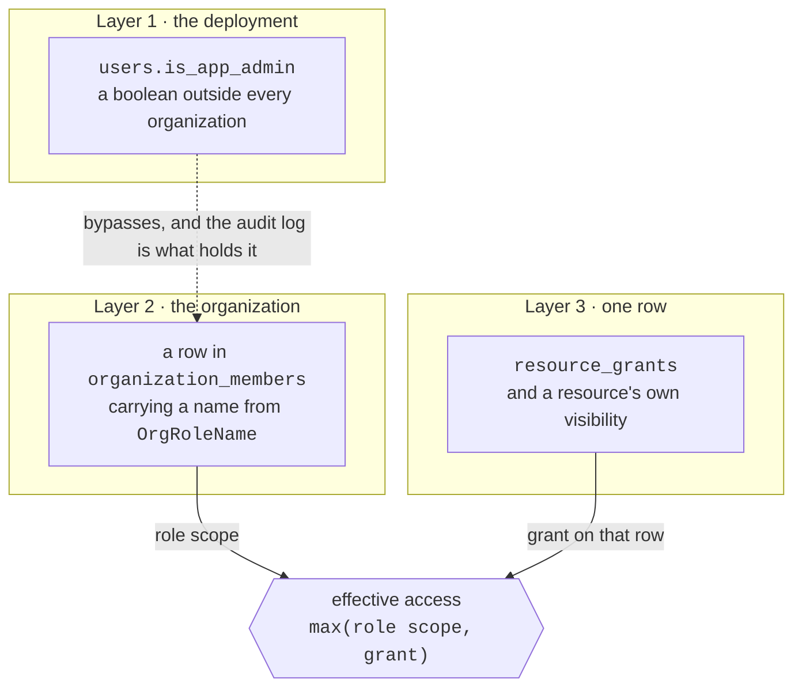
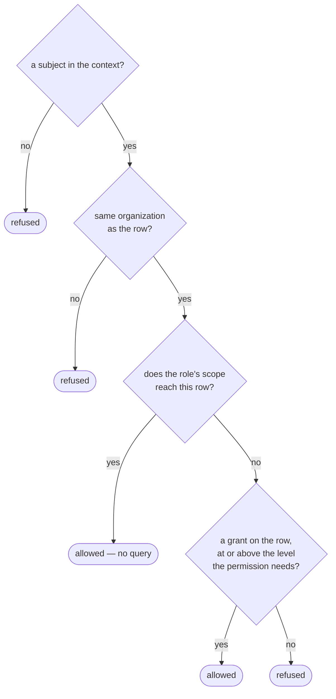

# Berechtigungen { #permissions }

Eine Regel, der der gesamte Codebestand folgt:

!!! quote "Berechtigungen sind im Code definiert. Rollen werden aus ihnen zusammengesetzt."

    Aufrufstellen prüfen **Berechtigungen**, nie Rollennamen — eine Rolle
    hinzuzufügen oder umzuformen heißt also nie, einen Endpunkt zu bearbeiten.

Der Katalog ist [`app/core/permissions.py`](reference/permissions.md). Er ist die
einzige Quelle der Wahrheit, und diese Seite erklärt ihn.

!!! warning "Es gibt drei Schichten, und sie sind voneinander unabhängig"

    Sie bilden keine Hierarchie, und keine impliziert eine andere. Die meiste
    Verwirrung über Zugriff auf dieser Plattform rührt von der gegenteiligen
    Annahme her.

    Es gab einmal eine vierte - eine Spalte `users.role` mit `admin` | `user`,
    aus dem Projekt-Template geerbt, mit `User.has_role()`, `RoleChecker` und
    einem Alias `CurrentAdmin` dahinter. Sie wurde entfernt, bevor die
    Migrationskette gestaucht wurde. Sie war eine dritte Antwort auf eine Frage,
    die die beiden unten stehenden bereits beantworteten, und sie stimmte mit
    keiner von beiden überein: Ein Konto namens `admin@example.com` saß auf
    `role = 'user'`, was sich wie eine kaputte Installation liest und Menschen
    dazu brachte, die falsche Schicht zu reparieren.

    Sie war nicht ganz wirkungslos, weshalb ihr Entfernen eine Verhaltensänderung
    war: `GET /conversations/{id}` und sein Geschwister `/messages` ließen den
    Eigentümerfilter für jeden fallen, dessen `role` `admin` sagte. Es gibt
    heute nirgends mehr ein nutzerübergreifendes *Lesen* von Unterhaltungen: Der
    deploymentweite Browser wurde zugunsten von Activity entfernt, und
    `/admin/conversations?user_id=` listet die Stränge eines Kontos auf, ohne
    einen davon zu öffnen.



## Schicht 1: `users.is_app_admin` - der Deployment-Superadmin { #layer-1-usersis_app_admin-the-deployment-superadmin }

Ein Boolean am Nutzer, gänzlich außerhalb von Organisationen. Zwei Wirkungen:

1. **Ein Tor vor den Deployment-Routen.** `CurrentAppAdmin` sichert
   `/admin/users`, `/admin/stats`, `/admin/conversations` (eine Auflistung, nie
   ein Transkript), `/admin/ratings` und die Massen-Endpunkte unter `/rag`.
2. **Eine Umgehung in `AuthContext.permissions`**, die jede Berechtigung auf
   `Scope.ALL` zurückgibt - in jeder Organisation, auch in solchen, in denen die
   Person keine Mitgliedschaft hat.

Die Umgehung ist Absicht, und der Docstring sagt warum: Eine solche Person
verwaltet das Deployment und hat ohnehin Datenbankzugriff, sodass etwas anderes
zu behaupten Sicherheitstheater wäre. Was sie in die Pflicht nimmt, ist das
Audit-Protokoll.

```bash
# Grant, or revoke with --revoke.
agenticos cmd create-app-admin someone@example.com
```

`agenticos cmd bootstrap` vergibt es außerdem an den Owner, den es anlegt, und
zwar idempotent.

!!! note "Ein frischer Klon, eine alte Datenbank"

    Wird `/admin` für das von bootstrap angelegte Konto abgelehnt, wurde die
    Datenbank mit ziemlicher Sicherheit gebootstrappt, bevor es diese Vergabe
    gab. Die Spalte hat den Vorgabewert `false`, und nichts füllt sie nach.
    Führen Sie `create-app-admin` von oben aus.

## Schicht 2: die Organisationsrolle { #layer-2-the-organization-role }

Eine Zeile in `organization_members` - eine je Organisation und Nutzer - mit
einem Wert aus `OrgRoleName`. Hier fällt die große Mehrheit der Entscheidungen.

Zwei Arten von Berechtigung, und sie verhalten sich unterschiedlich.

**Globale** Berechtigungen sind binär und organisationsweit: `members:manage`,
`roles:manage`, `org:settings`, `org:delete`, `budgets:manage`,
`approvals:decide`, `connections:view`, `connections:manage`, `mcp:manage`,
`channels:manage`, `runs:view`, `audit:read`.

!!! example "Warum `connections:view` und `connections:manage` zwei sind"

    Einen Sandbox-Host zu beobachten — seine Sitzungsliste, sein
    Aktivitätsprotokoll, die Speicher- und CPU-Obergrenzen, die sein Dienst
    durchsetzt — ist das, was "warum hat dieser Agent gerade ein 429 bekommen"
    beantwortet, eine Frage, für die ein Betreiber geweckt wird.

    Einen Host zu registrieren, ihn auf eine Adresse zu richten und das
    Vault-Secret anzuhängen, das dort Container starten kann, ist eine andere
    Befugnis.

    In eine zusammengefaltet, käme ein Betreiber nur an das Lesen heran, indem
    ihm auch Anlegen, Ändern und Löschen gewährt würde. Nichts hier impliziert
    eine Berechtigung aus einer anderen, also hält eine Rolle, die Connections
    verwaltet, beide.

**Ressourcen**-Berechtigungen tragen einen `Scope`, denn sie beantworten die
zweite Frage, die eine Rolle nicht kann: nicht "darf diese Rolle Agents
anfassen?", sondern *welche* Agents.

### Scope { #scope }

Geordnet als `NONE < OWN < SHARED < TEAM < ALL`.

| Scope | Erreicht |
|---|---|
| `NONE` | nichts |
| `OWN` | Zeilen, die dieser Person gehören |
| `SHARED` | ihre eigenen, plus alles organisationsweit Sichtbare |
| `TEAM` | ihre eigenen, plus team- und organisationsweit Sichtbares |
| `ALL` | jede Zeile in der Organisation |

!!! info "Warum die Vergleichsoperatoren überladen sind"

    `Scope` erbt von `str`, sodass Python die Werte ohne sie alphabetisch
    vergleichen würde - `all < none < own`, das Gegenteil dessen, was sie
    bedeuten. Gemischte Vergleiche werfen `TypeError`, statt eine still falsche
    Antwort zu geben, denn eine falsche Antwort in einer Autorisierungsprüfung
    ist schlimmer als eine laute.

`TEAM` wird heute von keiner eingebauten Rolle genutzt; es existiert für
benutzerdefinierte Rollen.

### Die eingebauten Rollen { #the-built-in-roles }

| Rolle | Gedanke | Agents | Secrets | Global |
|---|---|---|---|---|
| `owner` | besitzt die Organisation | alles `ALL` | `ALL` | alles, einschließlich `org:delete` |
| `admin` | führt sie im Tagesgeschäft | alles `ALL` | `ALL` | alles **außer** `org:delete` |
| `builder` | baut, und lernt von der ganzen Organisation | `view`/`run` `ALL`, `edit`/`publish` `SHARED` | `view` `SHARED`, `edit` `OWN` | `mcp`, `connections:view`+`connections:manage`, `runs:view` |
| `operator` | hält das laufende System gesund | `view`/`run` `ALL`, kein edit | `view` `SHARED` | `approvals:decide`, `connections:view`, `runs:view` |
| `member` | der alltägliche Nutzer | `view`/`run` `SHARED`, `edit` `OWN` | `view` `SHARED`, `edit` `OWN` | keines |
| `viewer` | liest | `view` `SHARED` | keines | keines |

Der Unterschied zwischen `builder` und `admin` ist der interessante: Ein Builder
sieht die ganze Organisation, um von ihr zu lernen, bearbeitet aber nur, was ihm
gehört oder mit ihm geteilt wurde - ein Builder kann also den Agent eines anderen
nicht umschreiben.

Rollen sind nicht durch Nutzer bearbeitbar, und nichts befüllt sie: Es gibt keine
Rollentabelle. Eine Rolle ist ein String auf der Mitgliedschaftszeile, und was er
bedeutet, ist `ROLE_PERMS` im Code - eine Rolle hinzuzufügen ist also eine
Änderung dort statt einer Migration, was der Sinn daran ist, Rollen aus
Berechtigungen zusammenzusetzen.

Die Spalte trägt kein CHECK-Constraint, anders als `resource_grants.level`. Was
eine erfundene Rolle draußen hält, ist ein Validator auf den Member- und
Invitation-Schemas, und käme je eine durch, löst eine unbekannte Rolle zu keinen
Berechtigungen auf statt zu denen von jemand anderem.

### Wer welche Rolle vergeben darf { #who-may-hand-out-which-role }

`roles:manage` zu halten besagt, dass ein Mitglied Rollen ändern darf; es besagt
nicht, *welche*. `assignable_roles` beantwortet das aus dem Katalog: Eine Rolle
darf eine vergeben, deren Befugnis sie strikt übertrifft - jede Berechtigung, die
die angebotene Rolle hält, mindestens ebenso weit beim Vergebenden, plus etwas,
das der Vergebende hält und sie nicht. Zwei Folgen, und beide sind gewollt:

- **Niemand vergibt `owner`**, denn keine Rolle übertrifft sie. Eigentum wandert
  über `POST /orgs/{id}/transfer-ownership`, das den abtretenden Owner im selben
  Atemzug herabstuft; ein Rollenwechsel, der nur befördert, ließe zwei Owner
  zurück und einen Audit-Eintrag, der `member.role_changed` liest (#672).
- **Niemand vergibt seine eigene Stufe.** Ein Admin darf einen Builder oder einen
  Viewer machen, nie einen zweiten Admin - einen Gleichrangigen auf die eigene
  Stufe zu heben ist eine Eigentumsentscheidung.

Abgeleitet aus dem Katalog statt aus einem Rollennamen, sodass eine
benutzerdefinierte Rolle (Phase 2) durch das begrenzt ist, was sie tatsächlich
hält. Die Obergrenze, die das ersetzt hat, verglich gegen das Literal `"admin"`
und konnte eine solche überhaupt nicht sehen - auf den Einladungspfaden ebenso
wie auf `change_role`, was #696 geschlossen hat.

!!! warning "Die Organisation einer Seite ist die in ihrer URL"

    `X-Organization-Id` reist auf jeder Anfrage mit, aus der *aktiven* Auswahl,
    sodass eine Seite, die auf der Organisation in ihrem Pfad handelt, während
    sie Berechtigungen für die aktive liest, über Acmes Mitglieder anhand der
    Rolle des Aufrufers in Globex entscheidet.

Die Organisationsliste öffnet `/orgs/{id}/members` ohne zu wechseln, sodass diese
Seite früher zwei Vorstellungen von "welcher Mandant" hielt.

Heute sind es eine. Der `ActiveOrgGuard` des Dashboards übernimmt die
Organisation, die ein Pfad benennt, bevor die Seite irgendetwas fragt, sodass
das, was ein Aufrufer dort darf, das ist, was er *dort* darf (#1032).

**Eine Einladung ist ein Link, und der Absender bekommt immer eine Kopie davon.**

Der Einladungsdialog zeigt den Link einmal, nach dem Senden, mit einer
Kopierschaltfläche — und sagt, ob die E-Mail, die ihn trägt, tatsächlich hinaus
ist. Das sind zwei Tatsachen statt einer: Ein Deployment ohne konfiguriertes
`SMTP_*` mailt niemandem, was jedes Deployment an seinem ersten Tag ist, und der
Dialog sagte trotzdem "invitation sent".

Der Link wird einmal gezeigt, weil er ein Inhaber-Credential ist: Nichts cacht
ihn, keine Auflistung trägt ihn, und keine spätere Anfrage gibt ihn zurück. Den
Dialog zu schließen ist daher der Moment, in dem er weg ist — die Einladung
bleibt ausstehend und kann widerrufen werden, aber ein frischer Link bedeutet
eine frische Einladung.

**Die Konsole rechnet dieselbe Beziehung aus, statt sie gesagt zu bekommen.**

Jede Rollenauswahl — die beiden Einladungsdialoge und die Mitgliedertabelle —
bietet das an, was `assignableRoles` in
`frontend/src/lib/assignable-roles.ts` antwortet, über den Rollenkatalog, den
`GET /roles/catalog` ohnehin samt den Berechtigungen jeder Rolle zurückgibt.

Es ist Arithmetik auf dem Client, aus demselben Grund wie auf dem Server: Eine
Auswahl, die eine *Liste* hielt, bot jede Rolle außer `owner` an, wer auch immer
fragte, sodass einem Admin Admin angeboten und er nach dem Tippen der
E-Mail-Adresse abgelehnt wurde (#1028).

Eine Rolle, die der Aufrufer nicht vergeben kann, ist auch eine Rolle, für die
die Mitgliedertabelle keine Auswahl zeichnet, denn der Auslöser zeigt den Text
des gewählten Eintrags, und ein Wert, der in der Liste fehlt, rendert leer.

Benutzerdefinierte Rollen sind Phase 2 und dürfen immer nur die obigen
Berechtigungen neu kombinieren; Kunden können keine neuen erfinden.

## Schicht 3: Sichtbarkeit und Grants { #layer-3-visibility-and-grants }

Jede teilbare Ressource trägt eine `owner_user_id` und eine `visibility`
(`private` | `team` | `org`). Darüber hinaus hält `resource_grants` eine Zeile je
Teilung: eine Ressource, eine Person, eine Stufe.

| Stufe | Erlaubt |
|---|---|
| `read` | die Konfiguration zu sehen |
| `use` | sie außerdem auszuführen oder anzuhängen |
| `edit` | sie außerdem zu ändern |

Die Tabelle ist bewusst generisch - `resource_type` + `resource_id`, ohne
Fremdschlüssel auf das Ziel -, weil Agents, Collections, Skills, Context-Dateien
und gespeicherte Schlüssel alle denselben Regeln folgen. Der Preis dafür ist,
dass die Datenbank einen Grant nicht per Cascade löschen kann, wenn sein Ziel
verschwindet, sodass Services Grants zusammen mit der Ressource löschen.

## Wie die Schichten zusammenwirken { #how-the-layers-combine }

Eine Formel, in `app/services/access.py`:

```
effective access to one row = max(role scope, grant on that row)
```

!!! danger "Ein Grant erweitert, was eine Rolle erlaubt; er verengt es nie"

    Einen Agent mit einem Viewer zu teilen funktioniert, ohne ihn zu befördern,
    und die organisationsweite Sicht eines Builders wird ihm nicht durch das
    Fehlen eines Grants genommen.

`resolve_access`, der Reihe nach:



Die Mandantenzugehörigkeit wird vor allem anderen geprüft, und ein Kontext ohne
Subjekt wird abgelehnt, was seine Rolle auch sagt.

### Eine Oberfläche, vor der niemand steht { #a-surface-with-nobody-in-front-of-it }

`publisher_context` beantwortet im selben Modul eine andere Frage: **Welche Rolle
nimmt ein Zug an, wenn die Person nicht benannt werden kann?** Ein Widget auf der
Website von jemandem, eine gehostete Seite hinter einem Link, ein an einen
Slack-Kanal gebundener Agent — der Besucher ist anonym oder ein Chat-Konto ohne
Plattformnutzer dahinter, und ein Run braucht trotzdem ein Subjekt, denn die
Rolle ist das, was auflöst, was der Agent erreichen darf.

Die Antwort ist **wer die Oberfläche veröffentlicht hat**, und der Rückfall ist
der Teil, den man kennen sollte: `viewer`, wenn diese Person kein Mitglied mehr
ist, `viewer`, wenn ihr Konto deaktiviert wurde, und `viewer`, wenn überhaupt
kein Veröffentlichender erfasst wurde. Ein Weggang darf nicht still *erweitern*,
was eine öffentliche Oberfläche erreicht, und ein Widget auf der Seite eines
Kunden überlebt die Person, die es eingefügt hat.

Deaktivierung zählt, weil die Mitgliedschaftszeile sie überlebt. Deaktiviert zu
sein wird auf jedem Pfad abgelehnt, über den sich eine Person anmeldet, sodass
eine allein von der Mitgliedschaft abgelesene Rolle Widget, gehostete Seite und
Channel-Binding eines deaktivierten Owners mit voller Befugnis antworten ließ —
ein Konto, das sich nicht anmelden kann und trotzdem das Budget der Organisation
ausgibt. Es ist ein verbundener Lesezugriff (`member_repo.get_active`) statt
zweier, denn er wird bei jedem Zug einer öffentlichen Oberfläche beantwortet.

Wer **gefragt** hat, wird getrennt mitgeführt — `channel_identity_id`, das
Chat-Konto, das gesprochen hat. Die beiden zu verschmelzen würde einen
Channel-Run die Befugnis des Absenders beanspruchen lassen, und genau die hat ein
unverknüpfter Absender nicht.

Eine Funktion statt einer je Oberfläche, seit #640: Sie war zweimal geschrieben,
gegen `agent_embeds.owner_user_id` und `agent_exposures.created_by_user_id`, und
zwei Kopien einer Autorisierungsentscheidung sind eine, die einmal repariert
wird.

### Auflistungen { #listings }

`visible_resource_ids` beantwortet dieselbe Frage für eine Liste und hat eine
Falle, die man kennen sollte: Sie gibt `None` zurück, wenn die Rolle ohnehin
alles erreicht ("kein Filtern nötig"), und eine **leere Liste** für einen Kontext
ohne Subjekt. Das ist das Gegenteil voneinander, sodass sie zu verwechseln eine
Auflistung genau in dem Moment auf die ganze Organisation weiten würde, in dem
sie auf nichts verengt werden sollte.

`accessible_ids` ist das Stapel-Gegenstück zu `resolve_access`: Zu einer Seite
bereits geladener Zeilen gibt es die Teilmenge zurück, auf der der Aufrufer eine
Berechtigung ausüben darf, wendet dieselbe Regel `max(role scope, grant)` je
Zeile an, liest aber jeden Grant in einem Nachschlagen statt einem je Zeile (und
gar keinen, wenn die Rolle alles erreicht). Es ist das, was die
Capability-Kennzeichen je Zeile einer Auflistung füllt - `AgentRead.can_run`, die
Untergrenze dafür, auf einer Karte "new trigger" anzubieten - sodass ein Viewer,
dem run auf einem Agent gewährt wurde, die Bedienung dort und sonst nirgends
sieht. Ein Kontext ohne Subjekt und eine leere Eingabe lösen beide vor jeder
Abfrage zur leeren Menge auf.

Die Auflistungen für Agents, Skills und die kb nehmen außerdem
`?shared_with_me=true` entgegen: nur Zeilen, die bewusst mit dem Aufrufer geteilt
wurden - organisationsweit sichtbar oder ausdrücklich gewährt - und nie seine
eigenen. Die Verengung gilt unabhängig vom Scope der Rolle, was eine Sorgfalt
verlangt: Eine Rolle, die alles erreicht, schlägt ihre Grants für eine schlichte
Auflistung nie nach, also holt der Filter sie trotzdem - ohne das würde "shared
with me" eines Builders zu "die ganze Organisation minus meins" verkommen. Für
die kb schließt er außerdem persönliche Zeilen aus (die des Aufrufers von
Hause aus) und Zeilen mit App-Scope (die des Deployments - nie *mit* jemandem
geteilt).

## Wo die Tore sitzen { #where-the-gates-go }

!!! danger "`require(...)` gehört an Collection-Routen, nicht an Routen je Ressource"

    Das Auflisten, Anlegen und Lesen eines Katalogs trägt ein Rollentor. Alles,
    was auf *einem* Agent, Skill oder einer Collection handelt, darf keines
    tragen.

    Ein Rollentor kann die Grants auf einer Zeile nicht sehen, also würde es
    einen Viewer mit einem ausdrücklichen `edit`-Grant ablehnen, bevor
    `resolve_access` dessen Zugriff je erweitert hätte - was "ein Grant
    erweitert, was eine Rolle erlaubt" widerspricht. Routen je Ressource
    übergeben die Entscheidung einem Service, der `resolve_access` aufruft.

    `tests/api/test_platform_routes.py` setzt beide Hälften durch.

Es gibt eine dritte Platzierung, für eine Route, deren **Parameter** die Frage
entscheidet.

`GET /stats/usage` und `GET /ratings/summary` bedienen zwei Fragende hinter einem
Pfad. `scope=org` liest die Zeilen aller und verlangt `runs:view`; `scope=own`
liest nur die eigenen des Aufrufers und verlangt nichts über eine angemeldete
Mitgliedschaft hinaus.

Ein `require(runs:view)` auf Routenebene würde das `scope=own` eines Mitglieds
ablehnen, bevor der Parameter je gelesen wurde. Also trägt die Route kein Tor,
und `StatsService` trifft die Entscheidung — dasselbe Prinzip wie bei Routen je
Ressource, dass die Schicht entscheidet, die die entscheidende Tatsache sehen
kann, wobei die Tatsache hier der Scope-Parameter ist statt eines Grants auf
einer Zeile.

Der Routen-Durchlauf erkennt einen solchen Service genauso, wie er die
grant-bewussten erkennt, und
`tests/api/test_platform_routes.py::TestStatsScopeIsDecidedInTheService` belegt
die Ablehnungen.

!!! warning "`?group_by=user` antwortet mit Namen, E-Mail-Adressen und den Kosten der Runs jeder Person"

    Es ist dieselbe Scope-Regel und keine zusätzliche Berechtigung: `runs:view`
    ist das, was es offenlegt, was bedeutet, dass **builder und operator es
    sehen** ebenso wie owner und admin.

    Das ist eine bewusste Entscheidung und kein Versehen. Die Dashboard-Karte,
    die diese Zeilen trägt, sagt das in ihrem eigenen Text, denn eine
    Berechtigung, die weiter reicht, als ihre Subjekte erwarten, ist nur dann
    vertretbar, wenn sie das herausfinden können. Eine engere Antwort wäre eine
    eigene Berechtigung, keine leisere Route.

## Delegation ist keine Privilegiengrenze { #delegation-is-not-a-privilege-boundary }

Ein Agent kann [an einen anderen Agent
delegieren](concepts.md#delegate-vs-inline-specialist), und das
Autorisierungsmodell dafür ist das, dem Collections und MCP-Connections bereits
folgen: **Der Verweis wird einmal geprüft, wenn das Elternteil veröffentlicht
wird, und der Delegate läuft danach für jeden, der das Elternteil ausführen
kann.**

Konkret verlangt das Veröffentlichen eines Agents, der einen Delegate benennt,
dass der Veröffentlichende `AGENTS_RUN` auf der Zeile dieses Delegates hält -
über `resolve_access`, sodass ein ausdrücklicher Grant zählt und ein Viewer, mit
dem ein Agent geteilt wurde, ihn pinnen kann. Zur Laufzeit wird nichts erneut
geprüft: Die Delegation handelt als derselbe Nutzer, in derselben Organisation,
auf den eigenen veröffentlichten Capabilities des Delegates.

Das ist Absicht, und die Alternative ist schlechter. Ein erneutes Prüfen je
Aufrufer würde einen veröffentlichten Agent für eine Kollegin funktionieren
lassen und für eine andere nicht, auf derselben Version, wobei der Unterschied
nirgends sichtbar wäre - und es hieße, dass die Antwort eines Support-Agents
davon abhinge, welche seiner Delegates dem *Fragenden* gewährt worden waren.
Einen Delegate zu verleihen heißt zu verleihen, was man hält, genau wie das
Binden einer Collection.

!!! note "Eine Ablehnung liest sich als 'Agent not found'"

    Eine fehlende Zeile, die Zeile einer anderen Organisation und eine Zeile, die
    dieser Veröffentlichende nicht ausführen darf, werden identisch gemeldet, und
    zwar mit Absicht. Eine Ablehnung, die sie unterschiede, würde die privaten
    Agents der Organisation eine Vermutung nach der anderen kartieren.

    Die gepinnte *Version* wird darauf geprüft, zu dem benannten Agent zu
    gehören, und nicht bloß zu existieren: Eine Versions-id von einem anderen
    Agent ist ein mandantenübergreifender Lesezugriff in einer gültig aussehenden
    UUID.

Ein Inline-Spezialist bekommt dieselben Prüfungen wie die eigenen Bindings des
Elternteils - Capability-Scopes, Eigentum am Secret, Zugriff auf Collections,
[Zugriff auf Skills](skills.md#access) und sein Model-Profil, falls er eines
benennt - jede mit dem Namen des Spezialisten gemeldet, sodass ein
Builder-Formular auf das richtige Eingabefeld zeigen kann. Ein Spezialist ist der
verlockende Ort, um eine Collection einzuschmuggeln, die niemand geteilt hat,
gerade weil niemand ihn für einen Agent hält.

Der deploymentweite Schalter ist davon getrennt, und er ist ein Capability-Scope
statt einer Berechtigung: `agents:delegate`. Er beantwortet "dürfen Agents in
diesem Deployment überhaupt Agents aufrufen", was keine Prüfung je Zeile kann.
Siehe [Scopes](reference/capabilities.md#scopes).

## Kontexte ohne Subjekt { #contexts-with-no-subject }

`AuthContext.user_id` ist optional, und das ist eine Aussage und keine
Bequemlichkeit. Jeder Run auf dieser Plattform hat ein Subjekt: Budgets, Grants,
das Audit-Protokoll und das Approval-Tor schlüsseln alle auf eines.

- `AuthContext.anonymous()` ist der einzige Konstruktor für einen solchen
  Kontext, sodass "woher kann ein subjektloser Kontext kommen" ein `grep` ist
  statt eines Audits.
- Seine Rolle ist der String `"anonymous"`, bewusst kein Mitglied von
  `OrgRoleName` und kein Schlüssel von `ROLE_PERMS`, sodass er nie
  Berechtigungen aus einer späteren Änderung an einem von beiden aufschnappen
  kann.
- `.permissions` gibt `{}` zurück, wenn es kein Subjekt gibt - geprüft am Subjekt
  statt am Rollenstring, denn ein subjektloser Kontext, der mit `"owner"` gebaut
  wurde, würde sonst jede Zeile in der Organisation erreichen.
- `.subject_id` wirft `AuthorizationError`, statt `None` zurückzugeben: Ein
  authentifizierter Pfad, der so weit gekommen ist, hat eine Person, und die
  Abwesenheit weiterreisen zu lassen schreibt einen Eintrag, der niemanden
  benennt - ununterscheidbar von den beiden Schreibern, die das rechtmäßig tun,
  und bis dahin ist die Anfrage halb geschehen. Ein Aufrufer ganz ohne Sitzung
  liest `.user_id` und sagt das.

Die Oberflächen, die Menschen offenstehen, die dieses Deployment nicht benennen
kann, nutzen diesen Konstruktor nicht. Eine gehostete Seite, ein Widget und ein
Channel führen den Zug jeweils unter dem aus, der ihn *veröffentlicht* hat - der
Eigentümer des Embeds oder das Binding, das den Agent auf den Bot gesetzt hat -,
mit Rückfall auf `viewer`, wenn diese Person die Organisation verlassen hat oder
ihr Konto deaktiviert wurde, sodass keines von beidem still erweitern kann, was
eine öffentliche Oberfläche erreicht. Das Subjekt ist daher ein echtes, und es
ist nicht die Person, die die Nachricht getippt hat.

Ein Channel-Absender, der ein Mitgliedskonto verknüpft *hat*, läuft als dieses
Mitglied — und derselbe verbundene Lesezugriff entscheidet, ob er noch eines ist.
Deaktivierung lässt sowohl die Mitgliedschaftszeile als auch die Verknüpfung des
Chat-Kontos bestehen, sodass eine allein von der Mitgliedschaft abgelesene Rolle
einen offboardeten Owner weiterhin Züge aus Slack als Owner fahren ließ. Ein
deaktivierter oder ausgeschiedener Absender wird stattdessen als unverknüpft
behandelt: in einer Direktnachricht abgelehnt, in einem Raum unter dem Binding
ausgeführt.

`AuthContext.channel_identity_id` ist, wer es getippt hat, wenn das ein
Chat-Konto statt eines Mitglieds ist. Es trägt keine Befugnis - keine
Berechtigung liest es - und existiert, damit ein Channel-Zug zurechenbar ist: Es
wird auf `agent_runs` gestempelt, und dieses Chat-Konto später zu verknüpfen
rechnet jene Runs einer Person zu, ohne umzuschreiben, als was sie liefen. Siehe
[Channels](channels.md#what-every-channel-shares).

Was ein solcher Run tun darf, kommt von der **Exposure**, die ihn eingelassen
hat, angelegt von jemandem, der sehr wohl eine Rolle hatte.

## Was das Frontend liest { #what-the-frontend-reads }

| Endpunkt | Antwortet |
|---|---|
| `GET /me/permissions` | die Rolle des Aufrufers, `is_app_admin` und jede Berechtigung samt ihrem Scope |
| `GET /roles/catalog` | den ganzen Katalog und was jede Rolle bündelt |

Beide sind **eine Bequemlichkeit für die Oberfläche und nichts weiter**. Der
Server prüft jede Berechtigung auf dem Endpunkt erneut, der die Handlung
ausführt, sodass ein Client, der diese APIs ignoriert, nichts gewinnt.

## Zusammenfassung { #recap }

- **Drei Schichten, voneinander unabhängig.** Ein Flag für den
  Deployment-Superadmin, eine Organisationsrolle und ein Grant auf einer Zeile.
  Keine impliziert eine andere.
- Eine Rolle ist ein **String auf einer Mitgliedschaftszeile**, und was er
  bedeutet, ist `ROLE_PERMS` im Code. Eine Rolle hinzuzufügen ist eine Änderung,
  keine Migration.
- Der effektive Zugriff auf eine Zeile ist `max(role scope, grant)`. **Ein Grant
  erweitert; er verengt nie.**
- `require(...)` gehört an **Collection**-Routen. Alles, was auf einer Zeile
  handelt, übergibt die Entscheidung einem Service, der `resolve_access` aufruft.
- Eine Oberfläche, vor der niemand steht, läuft als **wer sie veröffentlicht
  hat**, mit Rückfall auf `viewer`, wenn diese Person gegangen ist oder
  deaktiviert wurde.

## Referenz { #reference }

::: app.core.permissions.Perm

::: app.core.permissions.Scope

::: app.core.permissions.AuthContext
