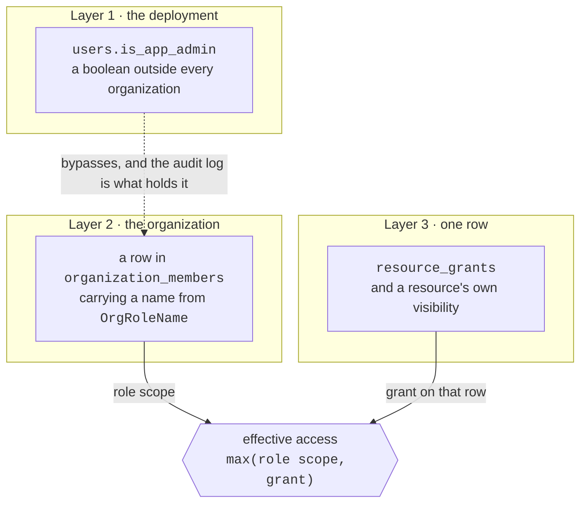
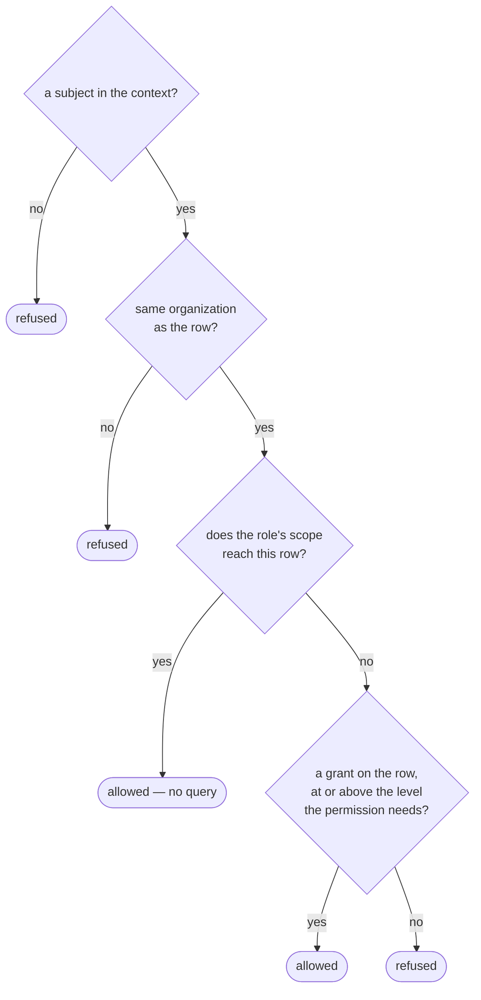

# Permisos { #permissions }

Una regla, que sigue todo el código:

!!! quote "Los permisos se definen en código. Los roles se componen a partir de ellos."

    Los puntos de llamada comprueban **permisos**, nunca nombres de rol — así que
    añadir o rehacer un rol nunca implica editar un endpoint.

El catálogo es [`app/core/permissions.py`](reference/permissions.md). Es la única
fuente de verdad, y esta página la explica.

!!! warning "Hay tres capas, y son independientes"

    No forman una jerarquía y ninguna implica otra. Casi toda la confusión sobre
    el acceso en esta plataforma viene de suponer lo contrario.

    Hubo una cuarta - una columna `users.role` de `admin` | `user`, heredada de
    la plantilla del proyecto, con `User.has_role()`, `RoleChecker` y un alias
    `CurrentAdmin` detrás. Se quitó antes de que se aplastara la cadena de
    migraciones. Era una tercera respuesta a una pregunta que las dos de abajo ya
    respondían, y no coincidía con ninguna: una cuenta llamada
    `admin@example.com` estaba en `role = 'user'`, lo que se lee como una
    instalación rota y mandaba a la gente a arreglar la capa equivocada.

    No estaba del todo inerte, que es por lo que quitarla fue un cambio de
    comportamiento: `GET /conversations/{id}` y su hermano `/messages` dejaban
    caer el filtro de propiedad para cualquiera cuyo `role` dijera `admin`. Ahora
    no hay *lectura* de conversaciones entre usuarios en ninguna parte: el
    navegador de todo el despliegue se retiró en favor de Activity, y
    `/admin/conversations?user_id=` lista los hilos de una cuenta sin abrir
    ninguno.



## Capa 1: `users.is_app_admin` - el superadmin del despliegue { #layer-1-usersis_app_admin-the-deployment-superadmin }

Un booleano sobre el usuario, enteramente fuera de las organizaciones. Dos
efectos:

1. **Una puerta en las rutas del despliegue.** `CurrentAppAdmin` protege
   `/admin/users`, `/admin/stats`, `/admin/conversations` (un listado, nunca una
   transcripción), `/admin/ratings` y los endpoints masivos de `/rag`.
2. **Un bypass en `AuthContext.permissions`**, que devuelve todos los permisos
   con `Scope.ALL` - en todas las organizaciones, incluidas aquellas en las que
   no tiene membresía alguna.

El bypass es deliberado y el docstring dice por qué: una persona así administra
el despliegue y ya tiene acceso a la base de datos, así que fingir lo contrario
sería teatro de seguridad. Lo que la sujeta es el registro de auditoría.

```bash
# Grant, or revoke with --revoke.
agenticos cmd create-app-admin someone@example.com
```

`agenticos cmd bootstrap` también se lo concede al owner que crea, de forma
idempotente.

!!! note "Un clon nuevo, una base de datos vieja"

    Si `/admin` se rechaza para la cuenta que creó el bootstrap, es casi seguro
    que la base de datos se arrancó antes de que existiera esa concesión. La
    columna vale `false` por defecto y nada la rellena hacia atrás. Ejecuta
    `create-app-admin`, arriba.

## Capa 2: el rol de la organización { #layer-2-the-organization-role }

Una fila en `organization_members` - una por organización y usuario - que lleva
un valor de `OrgRoleName`. Aquí es donde se toma la gran mayoría de las
decisiones.

Dos clases de permiso, y se comportan de forma distinta.

Los permisos **globales** son binarios y valen para toda la organización:
`members:manage`, `roles:manage`, `org:settings`, `org:delete`,
`budgets:manage`, `approvals:decide`, `connections:view`, `connections:manage`,
`mcp:manage`, `channels:manage`, `runs:view`, `audit:read`.

!!! example "Por qué `connections:view` y `connections:manage` son dos"

    Vigilar un host de sandbox — su lista de sesiones, su registro de actividad,
    los techos de memoria y CPU que impone su servicio — es lo que responde a
    "por qué acaba de recibir ese agent un 429", una pregunta por la que llaman a
    un operador de madrugada.

    Registrar un host, apuntarlo a una dirección y adjuntarle el secreto del
    vault que puede arrancar contenedores allí es otra autoridad distinta.

    Fundidos en uno, un operador solo podría obtener la lectura si se le
    concedieran también crear, editar y borrar. Aquí nada implica un permiso a
    partir de otro, así que un rol que gestiona conexiones tiene los dos.

Los permisos de **recurso** llevan un `Scope`, porque responden a la segunda
pregunta que un rol no puede: no "¿puede este rol tocar agents?" sino *qué*
agents.

### Scope { #scope }

Ordenado `NONE < OWN < SHARED < TEAM < ALL`.

| Scope | Alcanza |
|---|---|
| `NONE` | nada |
| `OWN` | las filas que esta persona posee |
| `SHARED` | las suyas, más lo que sea visible para la organización |
| `TEAM` | las suyas, más lo visible para el equipo y para la organización |
| `ALL` | todas las filas de la organización |

!!! info "Por qué los operadores de comparación están sobrecargados"

    `Scope` hereda de `str`, así que sin ellos Python compararía los valores
    alfabéticamente - `all < none < own`, lo contrario de lo que significan. Las
    comparaciones mixtas lanzan `TypeError` en vez de devolver una respuesta
    silenciosamente equivocada, porque una respuesta equivocada en una
    comprobación de autorización es peor que una ruidosa.

Hoy `TEAM` no lo usa ningún rol integrado; existe para los roles personalizados.

### Los roles integrados { #the-built-in-roles }

| Rol | Idea | Agents | Secretos | Globales |
|---|---|---|---|---|
| `owner` | posee la organización | todos `ALL` | `ALL` | todo, incluido `org:delete` |
| `admin` | la lleva en el día a día | todos `ALL` | `ALL` | todo **menos** `org:delete` |
| `builder` | construye, y aprende de toda la organización | `view`/`run` `ALL`, `edit`/`publish` `SHARED` | `view` `SHARED`, `edit` `OWN` | `mcp`, `connections:view`+`connections:manage`, `runs:view` |
| `operator` | mantiene sano el sistema en marcha | `view`/`run` `ALL`, sin edit | `view` `SHARED` | `approvals:decide`, `connections:view`, `runs:view` |
| `member` | el usuario de cada día | `view`/`run` `SHARED`, `edit` `OWN` | `view` `SHARED`, `edit` `OWN` | ninguno |
| `viewer` | lee | `view` `SHARED` | ninguno | ninguno |

La distinción entre `builder` y `admin` es la interesante: un builder ve la
organización entera para poder aprender de ella, pero edita solo lo suyo o lo que
se compartió con él - así que un builder no puede reescribir el agent de otro.

Los roles no los edita el usuario, y nada los siembra: no hay tabla de roles. Un
rol es una cadena en la fila de membresía, y lo que significa es `ROLE_PERMS` en
el código - así que añadir un rol es una edición ahí y no una migración, que es
justo el sentido de componer los roles a partir de permisos.

La columna no lleva restricción CHECK, a diferencia de `resource_grants.level`.
Lo que mantiene fuera a un rol inventado es un validador en los esquemas de
miembro y de invitación, y si alguno llegara a colarse, un rol desconocido se
resuelve a ningún permiso en lugar de a los de otro.

### Quién puede repartir qué rol { #who-may-hand-out-which-role }

Tener `roles:manage` dice que un miembro puede cambiar roles; no dice *cuáles*.
`assignable_roles` responde eso a partir del catálogo: un rol puede asignar otro
cuya autoridad excede estrictamente - cada permiso que tiene el rol ofrecido,
sostenido al menos igual de ampliamente por quien asigna, más algo que quien
asigna tiene y el otro no. Dos consecuencias, y las dos son el objetivo:

- **Nadie asigna `owner`**, porque ningún rol lo supera. La propiedad se mueve
  por `POST /orgs/{id}/transfer-ownership`, que degrada al owner saliente en el
  mismo movimiento; un cambio de rol que solo promoviera dejaría dos owners y una
  entrada de auditoría que diría `member.role_changed` (#672).
- **Nadie asigna su propio nivel.** Un Admin puede hacer un Builder o un Viewer,
  nunca un segundo Admin - promover a un igual a tu propio nivel es una decisión
  de propiedad.

Derivado del catálogo y no de un nombre de rol, así que un rol personalizado
(Fase 2) queda acotado por lo que realmente tiene. El techo al que esto sustituyó
comparaba contra el literal `"admin"` y no podía ver uno personalizado en
absoluto - tanto en los caminos de invitación como en `change_role`, que es lo
que cerró #696.

!!! warning "La organización de una página es la que hay en su URL"

    `X-Organization-Id` viaja en cada petición desde la selección *activa*, así
    que una página que actúa sobre la organización de su ruta mientras lee los
    permisos de la activa decide sobre los miembros de Acme según el rol de quien
    llama en Globex.

La lista de organizaciones abre `/orgs/{id}/members` sin cambiar de
organización, así que esa página tenía dos nociones de "qué tenant".

Ahora son una. El `ActiveOrgGuard` del dashboard adopta la organización que
nombra una ruta, antes de que la página pregunte nada, así que lo que quien llama
puede hacer allí es lo que puede hacer *allí* (#1032).

**Una invitación es un enlace, y quien la envía siempre se queda con una copia.**

El diálogo de invitación muestra el enlace una vez, después de enviarlo, con un
botón de copiar — y dice si el correo que lo lleva llegó a salir. Son dos hechos
y no uno: un despliegue sin `SMTP_*` configurado no envía correo a nadie, que es
todo despliegue en su primer día, y el diálogo decía "invitation sent"
igualmente.

El enlace se muestra una vez porque es una credencial al portador: nada lo
cachea, ningún listado lo lleva, y ninguna petición posterior lo devuelve.
Cerrar el diálogo es por tanto el momento en que desaparece — la invitación sigue
pendiente y se puede revocar, pero un enlace nuevo significa una invitación
nueva.

**La consola calcula esa misma relación en vez de que se la digan.**

Cada selector de rol — los dos diálogos de invitación y la tabla de miembros —
ofrece lo que responde `assignableRoles` en
`frontend/src/lib/assignable-roles.ts`, sobre el catálogo de roles que
`GET /roles/catalog` ya devuelve con los permisos de cada rol.

Es aritmética en el cliente por la misma razón que lo es en el servidor: un
selector que llevaba una *lista* ofrecía todos los roles menos `owner` a
quienquiera que preguntara, así que a un Admin se le ofrecía Admin y se le
rechazaba después de teclear la dirección de correo (#1028).

Un rol que quien llama no puede asignar es además un rol para el que la tabla de
miembros no dibuja selector, porque el disparador muestra el texto del elemento
elegido y un valor ausente de la lista se pinta en blanco.

Los roles personalizados son Fase 2 y solo podrán recombinar los permisos de
arriba; los clientes no pueden inventar otros nuevos.

## Capa 3: visibilidad y concesiones { #layer-3-visibility-and-grants }

Todo recurso compartible lleva un `owner_user_id` y una `visibility` (`private` |
`team` | `org`). Encima de eso, `resource_grants` guarda una fila por cada cosa
compartida: un recurso, una persona, un nivel. Una fila así es una **concesión**
(*grant*).

| Nivel | Permite |
|---|---|
| `read` | ver la configuración |
| `use` | además ejecutarlo o adjuntarlo |
| `edit` | además cambiarlo |

La tabla es deliberadamente genérica - `resource_type` + `resource_id`, sin clave
foránea al objetivo - porque los agents, las colecciones, los skills, los
archivos de contexto y las claves guardadas comparten todos las mismas reglas. La
contrapartida es que la base de datos no puede borrar en cascada una concesión
cuando su objetivo desaparece, así que los servicios borran las concesiones junto
al recurso.

## Cómo se combinan las capas { #how-the-layers-combine }

Una fórmula, en `app/services/access.py`:

```
effective access to one row = max(role scope, grant on that row)
```

!!! danger "Una concesión amplía lo que permite un rol; nunca lo estrecha"

    Compartir un agent con un Viewer funciona sin promoverlo, y la vista de toda
    la organización de un Builder no se la quita la ausencia de una concesión.

`resolve_access`, en orden:



El tenant se comprueba antes que nada, y un contexto sin sujeto se rechaza diga
lo que diga su rol.

### Una superficie sin nadie delante { #a-surface-with-nobody-in-front-of-it }

`publisher_context` responde una pregunta distinta en el mismo módulo: **¿qué rol
toma un turno cuando no se puede nombrar a la persona?** Un widget en el sitio de
alguien, una página alojada detrás de un enlace, un agent atado a un canal de
Slack — quien visita es anónimo, o una cuenta de chat sin usuario de la
plataforma detrás, y un run sigue necesitando un sujeto, porque el rol es lo que
resuelve a qué puede llegar el agent.

La respuesta es **quien publicó la superficie**, y el respaldo es la parte que
conviene conocer: `viewer` cuando esa persona ya no es miembro, `viewer` cuando
su cuenta ha sido desactivada, y `viewer` cuando no se registró publicador
alguno. Una salida no debe *ampliar* en silencio a lo que llega una superficie
pública, y un widget en el sitio de un cliente sobrevive a la persona que lo
pegó.

La desactivación cuenta porque la fila de membresía la sobrevive. Estar
desactivado se rechaza en cada camino por el que una persona inicia sesión, así
que un rol leído solo de la membresía dejaba el widget, la página alojada y el
binding de canal de un Owner desactivado respondiendo con toda su autoridad — una
cuenta que no puede iniciar sesión, gastando aún el budget de la organización. Es
una única lectura unida (`member_repo.get_active`) en vez de dos, porque se
responde en cada turno que toma una superficie pública.

Quién **preguntó** se lleva aparte — `channel_identity_id`, la cuenta de chat que
habló. Fundir las dos haría que un run de canal reclamara la autoridad de quien
envía, que es exactamente lo que no tiene alguien sin vincular.

Una función y no una por superficie, desde #640: estaba escrita dos veces, contra
`agent_embeds.owner_user_id` y contra `agent_exposures.created_by_user_id`, y dos
copias de una decisión de autorización son una decisión que se arregla una sola
vez.

### Listados { #listings }

`visible_resource_ids` responde la misma pregunta para una lista, y tiene una
trampa que conviene conocer: devuelve `None` cuando el rol ya alcanza todo ("no
hace falta filtrar") y una **lista vacía** para un contexto sin sujeto. Son
opuestos, así que confundirlos ampliaría un listado a toda la organización
justo en el momento en que debería estrecharse a nada.

`accessible_ids` es la contraparte por lotes de `resolve_access`: dada una página
de filas ya cargadas, devuelve el subconjunto sobre el que quien llama puede
ejercer un permiso. Aplica la misma regla `max(role scope, grant)` por fila, pero
lee todas las concesiones en una consulta en vez de una por fila, y ninguna
cuando el rol alcanza todo. Es lo que rellena las banderas de capacidad de un
listado - `AgentRead.can_run`, el suelo para ofrecer "new trigger" en una tarjeta
- así que un Viewer con concesión de run ve el control ahí y en ningún otro
sitio. Un contexto sin sujeto, y una entrada vacía, se resuelven al conjunto
vacío antes de consultar.

Los listados de agents, skills y kb aceptan además `?shared_with_me=true`: solo
las filas compartidas deliberadamente con quien llama - visibles para la
organización o concedidas de forma explícita, y nunca las suyas propias. El
estrechamiento se aplica sea cual sea el scope del rol, lo que necesita un
cuidado: un rol que alcanza todo nunca busca sus concesiones para un listado
normal, así que el filtro las trae de todas formas - sin eso, el "compartido
conmigo" de un Builder degeneraría en "toda la organización menos lo mío". Para
kb excluye además las filas personales (las de quien llama, por construcción) y
las de ámbito de aplicación (las del despliegue - nunca compartidas *con* nadie).

## Dónde van las puertas { #where-the-gates-go }

!!! danger "`require(...)` va en las rutas de colección, no en las de un recurso"

    Listar, crear y leer un catálogo llevan una puerta de rol. Cualquier cosa que
    actúe sobre *un* agent, skill o colección no debe llevarla.

    Una puerta de rol no puede ver las concesiones sobre una fila, así que
    rechazaría a un Viewer con una concesión explícita de `edit` antes de que
    `resolve_access` llegara a ampliar su acceso - lo que contradice "una
    concesión amplía lo que permite un rol". Las rutas por recurso le entregan la
    decisión a un servicio que llama a `resolve_access`.

    `tests/api/test_platform_routes.py` impone las dos mitades.

Hay una tercera colocación, para una ruta cuyo **parámetro** decide la pregunta.

`GET /stats/usage` y `GET /ratings/summary` sirven a dos preguntadores detrás de
una misma ruta. `scope=org` lee las filas de todo el mundo y exige `runs:view`;
`scope=own` lee solo las de quien llama y no exige nada más allá de una membresía
con sesión iniciada.

Un `require(runs:view)` a nivel de ruta rechazaría el `scope=own` de un miembro
antes de que el parámetro se llegara a leer. Así que la ruta no lleva puerta y la
decisión la toma `StatsService` — el mismo principio que en las rutas por
recurso, que decide la capa capaz de ver el dato decisivo, donde el dato es el
parámetro de scope en lugar de una concesión sobre una fila.

El barrido de rutas reconoce un servicio así igual que reconoce los que saben de
concesiones, y
`tests/api/test_platform_routes.py::TestStatsScopeIsDecidedInTheService` prueba
los rechazos.

!!! warning "`?group_by=user` responde con nombres, correos y lo que costaron los runs de cada persona"

    Es la misma regla de scope y ningún permiso adicional: `runs:view` es lo que
    lo revela, lo que significa que **builder y operator lo ven** igual que owner
    y admin.

    Eso es una decisión deliberada y no un descuido. La tarjeta del dashboard que
    lleva estas filas lo dice en su propia copia, porque un permiso más amplio de
    lo que esperan sus sujetos solo es defendible si ellos pueden enterarse. Una
    respuesta más estrecha sería un permiso propio, no una ruta más callada.

## La delegación no es una frontera de privilegio { #delegation-is-not-a-privilege-boundary }

Un agent puede [delegar en otro agent](concepts.md#delegate-vs-inline-specialist),
y el modelo de autorización para eso es el que ya siguen las colecciones y las
conexiones MCP: **la referencia se comprueba una vez, cuando se publica el padre,
y el delegado se ejecuta a partir de ahí para todo el que pueda ejecutar al
padre.**

En concreto, publicar un agent que nombra a un delegado exige que quien publica
tenga `AGENTS_RUN` sobre la fila de ese delegado - a través de `resolve_access`,
así que una concesión explícita cuenta y un Viewer con quien se compartió un
agent puede fijarlo. En tiempo de ejecución no se vuelve a comprobar nada: la
delegación actúa como el mismo usuario, en la misma organización, sobre las
capabilities publicadas del propio delegado.

Eso es deliberado, y la alternativa es peor. Volver a comprobar por cada quien
llama haría que un agent publicado funcionara para un colega y no para otro,
sobre la misma versión, con la diferencia visible en ninguna parte - y
significaría que la respuesta de un agent de soporte dependiera de a cuáles de
sus delegados le hubieran dado acceso *a quien pregunta*. Prestar un delegado es
prestar lo que tienes, exactamente igual que atar una colección.

!!! note "Un rechazo dice 'Agent not found'"

    Una fila que no existe, la fila de otra organización y una fila que este
    publicador no puede ejecutar se informan de forma idéntica y a propósito. Un
    rechazo que las distinguiera dibujaría el mapa de los agents privados de la
    organización a razón de una conjetura por vez.

    Se comprueba que la *versión* fijada pertenezca al agent nombrado, no
    meramente que exista: un id de versión de otro agent es una lectura entre
    tenants con un UUID de aspecto válido.

Un especialista inline recibe las mismas comprobaciones que los bindings del
propio padre - scopes de capability, propiedad del secreto, acceso a la
colección, [acceso al skill](skills.md#access), y su perfil de modelo si nombra
uno - cada una informada con el nombre del especialista para que un formulario
del Builder pueda apuntar al campo correcto. Un especialista es el sitio tentador
para colar una colección que nadie compartió, precisamente porque nadie piensa en
él como un agent.

El interruptor de todo el despliegue va aparte, y es un scope de capability en
lugar de un permiso: `agents:delegate`. Responde a "¿pueden los agents llamar a
agents en este despliegue, siquiera?", que es algo que ninguna comprobación por
fila puede responder. Mira [Scopes](reference/capabilities.md#scopes).

## Contextos sin sujeto { #contexts-with-no-subject }

`AuthContext.user_id` es opcional, y eso es una afirmación y no una comodidad.
Todo run de esta plataforma tiene un sujeto: los budgets, las concesiones, el
rastro de auditoría y la puerta de aprobación se indexan todos por uno.

- `AuthContext.anonymous()` es el único constructor de un contexto así, con lo
  que "de dónde puede salir un contexto sin sujeto" es un `grep` y no una
  auditoría.
- Su rol es la cadena `"anonymous"`, deliberadamente no un miembro de
  `OrgRoleName` y no una clave de `ROLE_PERMS`, así que nunca puede recoger
  permisos de una edición posterior en ninguno de los dos.
- `.permissions` devuelve `{}` cuando no hay sujeto - comprobado sobre el sujeto
  y no sobre la cadena del rol, porque un contexto sin sujeto construido con
  `"owner"` alcanzaría si no todas las filas de la organización.
- `.subject_id` lanza `AuthorizationError` en vez de devolver `None`: un camino
  autenticado que ha llegado hasta aquí tiene una persona, y dejar viajar la
  ausencia escribe una entrada que no nombra a nadie - indistinguible de las dos
  escrituras que legítimamente lo hacen, y para entonces la petición ya ha
  ocurrido a medias. Quien llama sin sesión alguna lee `.user_id` y lo dice.

Las superficies abiertas a personas que este despliegue no puede nombrar no usan
ese constructor. Una página alojada, un widget y un canal ejecutan cada uno el
turno como quien lo *publicó* - el dueño del embed, o el binding que puso el
agent en el bot - cayendo a `viewer` cuando esa persona ha dejado la organización
o su cuenta ha sido desactivada, para que ninguna de las dos cosas pueda ampliar
en silencio a lo que llega una superficie pública. El sujeto es por tanto uno
real, y no es la persona que tecleó el mensaje.

Quien envía por un canal y *sí* ha vinculado una cuenta de miembro se ejecuta
como ese miembro — y la misma lectura unida decide si sigue siéndolo. La
desactivación deja en su sitio tanto la fila de membresía como el vínculo de la
cuenta de chat, así que un rol leído solo de la membresía mantenía a un Owner ya
desvinculado ejecutando turnos desde Slack como Owner. A quien envía estando
desactivado o habiéndose ido se le trata como no vinculado: se rechaza en un
mensaje directo, y en una sala se ejecuta bajo el binding.

`AuthContext.channel_identity_id` es quién lo tecleó, cuando eso es una cuenta de
chat y no un miembro. No lleva autoridad alguna - ningún permiso lo lee - y
existe para que un turno de canal sea atribuible: se estampa en `agent_runs`, y
vincular esa cuenta de chat más tarde atribuye esos runs a una persona sin
reescribir como qué se ejecutaron. Mira
[Canales](channels.md#what-every-channel-shares).

Lo que un run así puede hacer viene de la **exposición** que lo admitió, creada
por alguien que sí tenía un rol.

## Lo que lee el frontend { #what-the-frontend-reads }

| Endpoint | Responde |
|---|---|
| `GET /me/permissions` | el rol de quien llama, `is_app_admin`, y cada permiso con su scope |
| `GET /roles/catalog` | el catálogo entero y lo que agrupa cada rol |

Los dos son **una comodidad para la UI y nada más**. El servidor vuelve a
comprobar cada permiso en el endpoint que realiza la acción, así que un cliente
que ignore estas APIs no gana nada.

## Resumen { #recap }

- **Tres capas, independientes.** Una bandera de superadmin del despliegue, un
  rol de organización, y una concesión sobre una fila. Ninguna implica otra.
- Un rol es una **cadena en una fila de membresía**, y lo que significa es
  `ROLE_PERMS` en el código. Añadir un rol es una edición, no una migración.
- El acceso efectivo a una fila es `max(role scope, grant)`. **Una concesión
  amplía; nunca estrecha.**
- `require(...)` va en las rutas de **colección**. Cualquier cosa que actúe sobre
  una fila le entrega la decisión a un servicio que llama a `resolve_access`.
- Una superficie sin nadie delante se ejecuta como **quien la publicó**, cayendo
  a `viewer` cuando esa persona se fue o fue desactivada.

## Referencia { #reference }

::: app.core.permissions.Perm

::: app.core.permissions.Scope

::: app.core.permissions.AuthContext
