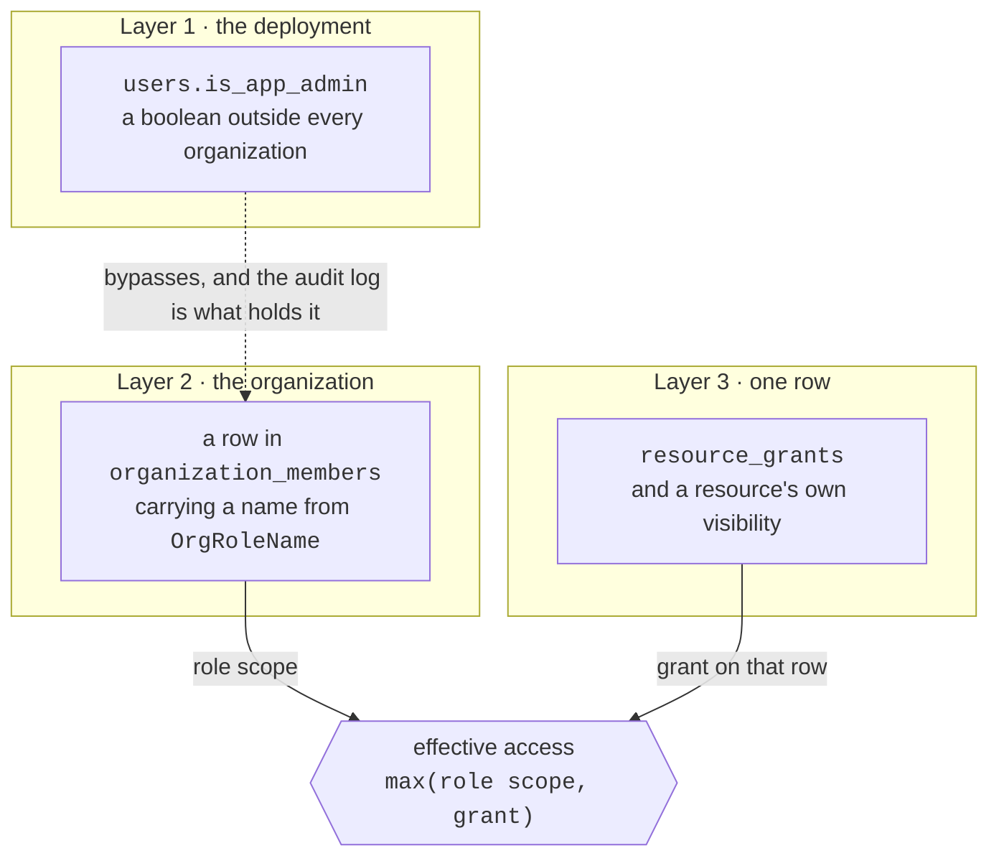
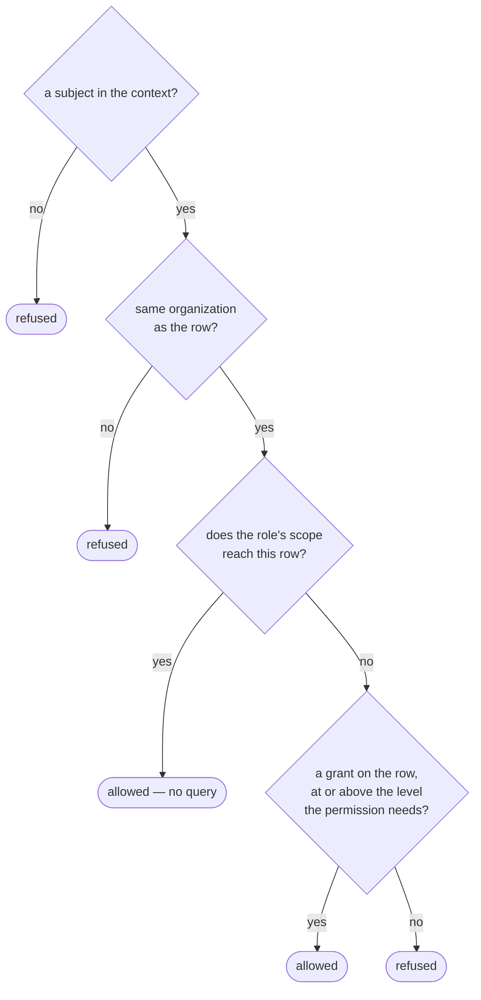

# Permissions

One rule, which the whole codebase follows:

!!! quote "Permissions are defined in code. Roles are composed from them."

    Call sites check **permissions**, never role names — so adding or re-shaping a
    role never means editing an endpoint.

The catalog is [`app/core/permissions.py`](reference/permissions.md). It is the
single source of truth, and this page explains it.

!!! warning "There are three layers, and they are independent"

    They do not form a hierarchy and none implies another. Most confusion about
    access on this platform comes from assuming otherwise.

    There used to be a fourth - a `users.role` column of `admin` | `user`,
    inherited from the project template, with `User.has_role()`, `RoleChecker`
    and a `CurrentAdmin` alias behind it. It was removed before the migration chain was squashed. It
    was a third answer to a question the two below already answered, and it
    agreed with neither: an account called `admin@example.com` sat at
    `role = 'user'`, which reads as a broken installation and sent people to fix
    the wrong layer.

    It was not quite inert, which is why removing it was a behaviour change:
    `GET /conversations/{id}` and its `/messages` sibling dropped the ownership
    filter for anybody whose `role` said `admin`. There is no cross-user
    conversation *read* anywhere now: the deployment-wide browser was removed in
    favour of Activity, and `/admin/conversations?user_id=` lists one account's
    threads without opening any of them.



## Layer 1: `users.is_app_admin` - the deployment superadmin

A boolean on the user, entirely outside organizations. Two effects:

1. **A gate on deployment routes.** `CurrentAppAdmin` guards `/admin/users`,
   `/admin/stats`, `/admin/conversations` (a listing, never a transcript),
   `/admin/ratings` and the bulk `/rag` endpoints.
2. **A bypass in `AuthContext.permissions`**, which returns every permission at
   `Scope.ALL` - in every organization, including ones where they hold no
   membership.

The bypass is deliberate and the docstring says why: such a person administers
the deployment and already has database access, so pretending otherwise would be
security theatre. What holds them to it is the audit log.

```bash
# Grant, or revoke with --revoke.
agenticos cmd create-app-admin someone@example.com
```

`agenticos cmd bootstrap` also grants it to the owner it creates, idempotently.

!!! note "A fresh clone, an old database"

    If `/admin` is refused for the account bootstrap created, the database was
    almost certainly bootstrapped before that grant existed. The column defaults
    to `false` and nothing backfills it. Run `create-app-admin` above.

## Layer 2: the organization role

A row in `organization_members` - one per organization per user - carrying a value
from `OrgRoleName`. This is where the great majority of decisions are made.

Two kinds of permission, and they behave differently.

**Global** permissions are binary and org-wide: `members:manage`, `roles:manage`,
`org:settings`, `org:delete`, `budgets:manage`, `approvals:decide`,
`connections:view`, `connections:manage`, `mcp:manage`, `channels:manage`,
`runs:view`, `audit:read`.

!!! example "Why `connections:view` and `connections:manage` are two"

    Watching a sandbox host — its session list, its activity log, the memory and
    CPU ceilings its service enforces — is what answers "why did that agent just
    get a 429", a question an operator is paged about.

    Registering a host, pointing it at an address and attaching the vault secret
    that can start containers there is a different authority.

    Folded into one, an operator could only get the read by being granted create,
    edit and delete as well. Nothing here implies one permission from another, so a
    role that manages connections holds both.

**Resource** permissions carry a `Scope`, because they answer the second question
a role cannot: not "may this role touch agents?" but *which* agents.

### Scope

Ordered `NONE < OWN < SHARED < TEAM < ALL`.

| Scope | Reaches |
|---|---|
| `NONE` | nothing |
| `OWN` | rows this person owns |
| `SHARED` | their own, plus anything org-visible |
| `TEAM` | their own, plus team-visible and org-visible |
| `ALL` | every row in the organization |

!!! info "Why the comparison operators are overloaded"

    `Scope` subclasses `str`, so without them Python would compare the values
    alphabetically - `all < none < own`, the opposite of what they mean. Mixed
    comparisons raise `TypeError` rather than returning a silently wrong answer,
    because a wrong answer in an authorization check is worse than a loud one.

`TEAM` is not used by any built-in role today; it exists for custom roles.

### The built-in roles

| Role | Idea | Agents | Secrets | Global |
|---|---|---|---|---|
| `owner` | owns the organization | all `ALL` | `ALL` | everything, including `org:delete` |
| `admin` | runs it day to day | all `ALL` | `ALL` | everything **except** `org:delete` |
| `builder` | builds, and learns from the whole org | `view`/`run` `ALL`, `edit`/`publish` `SHARED` | `view` `SHARED`, `edit` `OWN` | `mcp`, `connections:view`+`connections:manage`, `runs:view` |
| `operator` | keeps the running system healthy | `view`/`run` `ALL`, no edit | `view` `SHARED` | `approvals:decide`, `connections:view`, `runs:view` |
| `member` | the everyday user | `view`/`run` `SHARED`, `edit` `OWN` | `view` `SHARED`, `edit` `OWN` | none |
| `viewer` | reads | `view` `SHARED` | none | none |

The `builder` / `admin` distinction is the interesting one: a builder sees the
whole organization in order to learn from it, but edits only what is theirs or was
shared with them - so one builder cannot rewrite another's agent.

Roles are not user-editable, and nothing seeds them: there is no roles table. A
role is a string on the membership row, and what it means is `ROLE_PERMS` in
code - so adding a role is an edit there rather than a migration, which is the
point of composing roles from permissions.

The column carries no CHECK constraint, unlike `resource_grants.level`. What
keeps an invented role out is a validator on the member and invitation schemas,
and if one ever got through, an unknown role resolves to no permissions rather
than to somebody else's.

### Who may hand out which role

Holding `roles:manage` says a member may change roles; it does not say *which*.
`assignable_roles` answers that from the catalog: a role may assign one whose
authority it strictly exceeds - every permission the offered role holds, held at
least as widely by the assigner, plus something the assigner holds that it does
not. Two consequences, and both are the point:

- **Nobody assigns `owner`**, because no role outranks it. Ownership moves
  through `POST /orgs/{id}/transfer-ownership`, which demotes the outgoing owner
  in the same breath; a role change that only promotes would leave two owners
  and an audit entry reading `member.role_changed` (#672).
- **Nobody assigns their own level.** An Admin may make a Builder or a Viewer,
  never a second Admin - promoting a peer to your own level is an ownership
  decision.

Derived from the catalog rather than from a role name, so a custom role (Phase
2) is bounded by what it actually holds. The ceiling this replaced compared
against the literal `"admin"` and could not see one at all - on the invitation
paths as well as on `change_role`, which is what #696 closed.

!!! warning "A page's organization is the one in its URL"

    `X-Organization-Id` travels on every request from the *active* selection, so a
    page acting on the organization in its path while reading permissions for the
    active one decides Acme's members by the caller's role in Globex.

The organizations list opens `/orgs/{id}/members` without switching, so that page
used to hold two notions of "which tenant".

They are one now. The dashboard's `ActiveOrgGuard` adopts the organization a path
names, before the page asks anything, so what a caller may do there is what they
may do *there* (#1032).

**The console computes the same relation rather than being told it.**

Every role picker — the two invite dialogs and the members table — offers what
`assignableRoles` in `frontend/src/lib/assignable-roles.ts` answers, over the role
catalog `GET /roles/catalog` already returns with each role's permissions.

It is arithmetic on the client for the same reason it is on the server: a picker
holding a *list* offered every role bar `owner` whoever was asking, so an Admin was
offered Admin and refused after typing the email address (#1028).

A role the caller cannot assign is also a role the members table will not draw a
picker for, because the trigger shows the chosen item's text and a value absent
from the list renders blank.

Custom roles are Phase 2 and may only ever recombine the permissions above;
clients cannot invent new ones.

## Layer 3: visibility and grants

Every shareable resource carries an `owner_user_id` and a `visibility`
(`private` | `team` | `org`). On top of that, `resource_grants` holds one row per
share: one resource, one person, one level.

| Level | Allows |
|---|---|
| `read` | see the configuration |
| `use` | also run or attach it |
| `edit` | also change it |

The table is deliberately generic - `resource_type` + `resource_id`, with no
foreign key to the target - because agents, collections, skills, context files
and stored keys all share the same rules. The trade-off is that the database
cannot cascade-delete
a grant when its target goes away, so services delete grants alongside the
resource.

## How the layers combine

One formula, in `app/services/access.py`:

```
effective access to one row = max(role scope, grant on that row)
```

!!! danger "A grant widens what a role allows; it never narrows it"

    Sharing one agent with a Viewer works without promoting them, and a
    Builder's org-wide view is not taken away by the absence of a grant.

`resolve_access` in order:



Tenancy is checked before anything else, and a context with no subject is refused
whatever its role says.

### A surface with nobody in front of it

`publisher_context` answers a different question in the same module: **which role
does a turn take when the person cannot be named?** A widget on somebody's site, a
hosted page behind a link, an agent bound to a Slack channel — the visitor is
anonymous, or a chat account with no platform user behind it, and a run still needs
a subject, because the role is what resolves what the agent may reach.

The answer is **whoever published the surface**, and the fallback is the part worth
knowing: `viewer` when that person is no longer a member, `viewer` when their
account has been deactivated, and `viewer` when no publisher was recorded at all. A
departure must not silently *widen* what a public surface reaches, and a widget on a
customer's site outlives the person who pasted it.

Deactivation counts because the membership row survives it. Being deactivated is
refused on every path a person signs in through, so a role read off the membership
alone left a deactivated Owner's widget, hosted page and channel binding answering
at full authority — an account that cannot sign in, still spending the
organization's budget. It is one joined read (`member_repo.get_active`) rather than
two, because it is answered on every turn a public surface takes.

Who **asked** is carried separately — `channel_identity_id`, the chat account that
spoke. Merging the two would make a channel run claim the sender's authority, which
is exactly what an unlinked sender does not have.

One function rather than one per surface, since #640: it was written twice, against
`agent_embeds.owner_user_id` and `agent_exposures.created_by_user_id`, and two
copies of an authorization decision is one that gets fixed once.

### Listings

`visible_resource_ids` answers the same question for a list, and has one trap
worth knowing: it returns `None` when the role already reaches everything ("no
filtering needed") and an **empty list** for a context with no subject. Those are
opposites, so confusing them would widen a listing to the whole organization at
exactly the moment it should be narrowed to nothing.

`accessible_ids` is the batch counterpart of `resolve_access`: given a page of
rows already loaded, it returns the subset the caller may exercise a permission
on, applying the same `max(role scope, grant)` rule per row but reading every
grant in one lookup rather than one per row (and none at all when the role
reaches everything). It is what fills a listing's per-row capability flags -
`AgentRead.can_run`, the floor for offering "new trigger" on a card - so a Viewer
granted run on one agent sees the control there and nowhere else. A context with
no subject, and an empty input, both resolve to the empty set before any query.

The agents, skills and kb listings also take `?shared_with_me=true`: only rows
deliberately shared with the caller - org-visible or explicitly granted, and
never their own. The narrowing applies whatever the role's scope, which needs
one care: a role that reaches everything never looks its grants up for a plain
listing, so the filter fetches them anyway - without that, a Builder's "shared
with me" would degenerate into "the whole organization minus mine". For kb it
also excludes personal rows (the caller's by construction) and app-scope rows
(the deployment's - never shared *with* anybody).

## Where the gates go

!!! danger "`require(...)` belongs on collection routes, not per-resource ones"

    Listing, creating and reading a catalog carry a role gate. Anything acting on
    *one* agent, skill or collection must not.

    A role gate cannot see the grants on a row, so it would refuse a Viewer
    holding an explicit `edit` grant before `resolve_access` ever widened their
    access - which contradicts "a grant widens what a role allows". Per-resource
    routes hand the decision to a service that calls `resolve_access`.

    `tests/api/test_platform_routes.py` enforces both halves.

There is a third placement, for a route whose **parameter** decides the question.

`GET /stats/usage` and `GET /ratings/summary` serve two askers behind one path.
`scope=org` reads everybody's rows and demands `runs:view`; `scope=own` reads only
the caller's own and demands nothing beyond a signed-in membership.

A route-level `require(runs:view)` would refuse a member's `scope=own` before the
parameter was ever read. So the route carries no gate and `StatsService` makes the
decision — the same principle as per-resource routes, that the layer which can see
the deciding fact decides, where the fact is the scope parameter rather than a grant
on a row.

The route sweep recognizes such a service the same way it recognizes the grant-aware
ones, and
`tests/api/test_platform_routes.py::TestStatsScopeIsDecidedInTheService` proves the
refusals.

!!! warning "`?group_by=user` answers with names, emails and what each person's runs cost"

    It is the same scope rule and no additional permission: `runs:view` is what
    reveals it, which means **builder and operator see it** as well as owner and
    admin.

    That is a deliberate call rather than an oversight. The dashboard card carrying
    these rows says so in its own copy, because a permission wider than its
    subjects expect is only defensible if they can find that out. A narrower answer
    would be a permission of its own, not a quieter route.

## Delegation is not a privilege boundary

An agent can [delegate to another agent](concepts.md#delegate-vs-inline-specialist),
and the authorization model for that is the one collections and MCP connections
already follow: **the reference is checked once, when the parent is published, and
the delegate then runs for everyone who can run the parent.**

Concretely, publishing an agent that names a delegate requires the publisher to
hold `AGENTS_RUN` on that delegate's row - through `resolve_access`, so an explicit
grant counts and a Viewer who was shared one agent can pin it. At run time nothing
is re-checked: the delegation acts as the same user, in the same organization, on
the delegate's own published capabilities.

That is deliberate, and the alternative is worse. Re-checking per caller would make
one published agent work for one colleague and not another, on the same version,
with the difference visible nowhere - and it would mean a support agent's answer
depended on which of its delegates the *asker* happened to have been granted.
Lending a delegate is lending what you hold, exactly as binding a collection is.

!!! note "A refusal reads 'Agent not found'"

    A missing row, another organization's row, and a row this publisher may not run
    are reported identically and on purpose. A refusal that distinguished them
    would map the organization's private agents one guess at a time.

    The pinned *version* is checked to belong to the agent named, not merely to
    exist: a version id from another agent is a cross-tenant read wearing a
    valid-looking UUID.

An inline specialist gets the same checks the parent's own bindings get - capability
scopes, secret ownership, collection access, [skill access](skills.md#access), and
its model profile if it names one - each reported with the specialist's name so a
Builder form can point at the right input. A specialist is the tempting place to
smuggle in a collection nobody shared, precisely because nobody thinks of it as an
agent.

The deployment-wide switch is separate, and it is a capability scope rather than a
permission: `agents:delegate`. It answers "may agents call agents in this
deployment at all", which no per-row check can. See
[Scopes](reference/capabilities.md#scopes).

## Contexts with no subject

`AuthContext.user_id` is optional, and that is a statement rather than a
convenience. Every run on this platform has a subject: budgets, grants, the audit
trail and the approval gate all key on one.

- `AuthContext.anonymous()` is the only constructor for such a context, so "where
  can a subject-less context come from" is a `grep` rather than an audit.
- Its role is the string `"anonymous"`, deliberately not a member of
  `OrgRoleName` and not a key of `ROLE_PERMS`, so it can never pick up
  permissions from a later edit to either.
- `.permissions` returns `{}` when there is no subject - checked on the subject
  rather than on the role string, because a subject-less context built with
  `"owner"` would otherwise reach every row in the organization.
- `.subject_id` raises `AuthorizationError` rather than returning `None`: an
  authenticated path that got this far has a person, and letting the absence
  travel writes an entry naming nobody - indistinguishable from the two writers
  that legitimately do, and by then the request has half happened. A caller with
  no session at all reads `.user_id` and says so.

The surfaces open to people this deployment cannot name do not use that
constructor. A hosted page, a widget and a channel each run the turn under
whoever *published* it - the embed's owner, or the binding that put the agent on
the bot - falling back to `viewer` when that person has left the organization or
their account has been deactivated, so neither can silently widen what a public
surface reaches. The subject is therefore a real one, and it is not the person who
typed the message.

A channel sender who *has* linked a member account runs as that member — and the
same joined read decides whether they still are one. Deactivation leaves both the
membership row and the chat account's link in place, so a role read off the
membership alone kept an offboarded Owner running turns from Slack at Owner. A
deactivated or departed sender is treated as unlinked instead: refused in a direct
message, run under the binding in a room.

`AuthContext.channel_identity_id` is who typed it, when that is a chat account
rather than a member. It carries no authority - no permission reads it - and
exists so a channel turn is attributable: it is stamped on `agent_runs`, and
linking that chat account later attributes those runs to a person without
rewriting what they ran as. See
[Channels](channels.md#what-every-channel-shares).

What such a run is allowed to do comes from the **exposure** that admitted it,
created by somebody who did have a role.

## What the frontend reads

| Endpoint | Answers |
|---|---|
| `GET /me/permissions` | the caller's role, `is_app_admin`, and every permission with its scope |
| `GET /roles/catalog` | the whole catalog and what each role bundles |

Both are **a convenience for the UI and nothing more**. The server re-checks every
permission on the endpoint that performs the action, so a client that ignores
these APIs gains nothing.

## Recap

- **Three layers, independent.** A deployment superadmin flag, an organization
  role, and a grant on one row. None implies another.
- A role is a **string on a membership row**, and what it means is `ROLE_PERMS` in
  code. Adding a role is an edit, not a migration.
- Effective access to one row is `max(role scope, grant)`. **A grant widens; it
  never narrows.**
- `require(...)` goes on **collection** routes. Anything acting on one row hands
  the decision to a service that calls `resolve_access`.
- A surface with nobody in front of it runs as **whoever published it**, falling
  back to `viewer` when that person left or was deactivated.

## Reference

::: app.core.permissions.Perm

::: app.core.permissions.Scope

::: app.core.permissions.AuthContext
